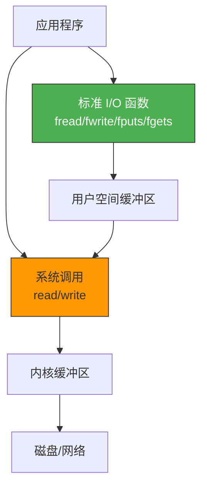

# 套接字和标准I/O

> 前面一直用 `read/write` 做 Socket I/O，但 C 标准库的 `fputs/fgets`、`fprintf/fscanf` 更方便——它们有缓冲区，还能做格式化。通过 `fdopen/fileno` 可以在文件描述符和 FILE 指针之间转换。

## 一、标准 I/O 的优势

### 1.1 系统调用 vs 标准库函数



| 对比项 | 系统调用 read/write | 标准库 fputs/fgets |
|--------|---------------------|-------------------|
| 缓冲 | 无（每次调用都进内核） | 有（用户空间缓冲，减少系统调用） |
| 格式化 | 无 | fprintf/fscanf 支持 |
| 换行处理 | 手动处理 | fgets 自动处理 `\n` |
| 性能 | 频繁调用时开销大 | 缓冲减少系统调用次数 |

### 1.2 缓冲的三种模式

| 模式 | 刷新时机 | 默认设备 |
|------|---------|---------|
| 全缓冲（_IOFBF） | 缓冲区满、fflush、fclose | 磁盘文件 |
| 行缓冲（_IOLBF） | 遇到 `\n`、fflush、fclose | 终端 |
| 无缓冲（_IONBF） | 立即刷新 | stderr |

---

## 二、fdopen / fileno

### 2.1 文件描述符 ↔ FILE 指针

```c
#include <stdio.h>

// 文件描述符 → FILE 指针
FILE *fdopen(int fd, const char *mode);
// mode: "r", "w", "a", "r+", "w+", "a+"

// FILE 指针 → 文件描述符
int fileno(FILE *stream);
```


### 2.2 基本用法

```c
// 从 Socket 创建 FILE 流
int sock = socket(AF_INET, SOCK_STREAM, 0);
// ... connect ...

FILE *readfp = fdopen(sock, "r");
FILE *writefp = fdopen(sock, "w");

// 用标准 I/O 读写
char buf[256];
fgets(buf, sizeof(buf), readfp);    // 读取一行
fputs("Hello\n", writefp);          // 写入一行
fflush(writefp);                     // 立即刷新缓冲区！

// 获取底层文件描述符
int fd = fileno(readfp);
printf("Underlying fd: %d\n", fd);  // 与 sock 相同
```

---

## 三、标准 I/O 版 Echo 服务器

### 3.1 服务器代码

```c
// stdio_echo_server.c
#include <stdio.h>
#include <stdlib.h>
#include <string.h>
#include <unistd.h>
#include <sys/socket.h>
#include <arpa/inet.h>

#define BUF_SIZE 1024

void error_handling(const char *msg) {
    perror(msg);
    exit(1);
}

int main(int argc, char *argv[]) {
    if (argc != 2) {
        printf("Usage: %s <port>\n", argv[0]);
        exit(1);
    }

    int serv_sock = socket(AF_INET, SOCK_STREAM, 0);
    if (serv_sock == -1) error_handling("socket() failed");

    int opt = 1;
    setsockopt(serv_sock, SOL_SOCKET, SO_REUSEADDR, &opt, sizeof(opt));

    struct sockaddr_in serv_addr;
    memset(&serv_addr, 0, sizeof(serv_addr));
    serv_addr.sin_family = AF_INET;
    serv_addr.sin_addr.s_addr = htonl(INADDR_ANY);
    serv_addr.sin_port = htons(atoi(argv[1]));

    if (bind(serv_sock, (struct sockaddr*)&serv_addr, sizeof(serv_addr)) == -1)
        error_handling("bind() failed");
    if (listen(serv_sock, 5) == -1)
        error_handling("listen() failed");

    struct sockaddr_in clnt_addr;
    socklen_t clnt_len = sizeof(clnt_addr);
    int clnt_sock = accept(serv_sock, (struct sockaddr*)&clnt_addr, &clnt_len);
    if (clnt_sock == -1) error_handling("accept() failed");

    printf("Client connected\n");

    // 将 Socket 转为 FILE 流
    FILE *readfp = fdopen(clnt_sock, "r");
    FILE *writefp = fdopen(clnt_sock, "w");

    char buf[BUF_SIZE];
    while (fgets(buf, BUF_SIZE, readfp) != NULL) {
        fputs(buf, writefp);
        fflush(writefp);  // 必须手动刷新！
    }

    fclose(readfp);
    fclose(writefp);

    close(serv_sock);
    return 0;
}
```

::: important 必须手动 fflush
`fdopen` 创建的写入流默认是全缓冲模式（因为 Socket 不是终端设备）。如果不用 `fflush`，数据会留在缓冲区中，对方收不到。
:::

---

## 四、标准 I/O 的注意事项

### 4.1 缓冲导致的延迟

```c
// 问题代码
fputs("Hello", writefp);  // 数据还在缓冲区里！
// 对方 read 会阻塞，因为数据没有真正发送
```

**解决方案**：

```c
// 方案 1：手动刷新
fputs("Hello", writefp);
fflush(writefp);  // 立即发送

// 方案 2：设置为行缓冲
setvbuf(writefp, NULL, _IOLBF, 0);  // 遇到 \n 自动刷新

// 方案 3：设置为无缓冲
setvbuf(writefp, NULL, _IONBF, 0);  // 每次写入立即发送
```

### 4.2 fclose 的副作用

`fclose` 会关闭底层的文件描述符。如果对同一个 fd 创建了两个 FILE 流：

```c
FILE *readfp = fdopen(sock, "r");
FILE *writefp = fdopen(sock, "w");

fclose(readfp);   // 关闭了 sock！
fclose(writefp);  // sock 已关闭，行为未定义！
```

::: warning 严重问题
一个 fd 对应两个 FILE 流时，`fclose` 其中一个会关闭 fd，另一个就成了"野指针"。这是标准 I/O 在 Socket 编程中最常见的陷阱。
:::

### 4.3 正确的关闭方式

```c
// 方案 1：只用 fclose 一次
FILE *readfp = fdopen(sock, "r");
FILE *writefp = fdopen(sock, "w");

// ... 使用 ...

fclose(writefp);  // 关闭写入流（也关闭了 fd）
fclose(readfp);   // 此时 fd 已经关闭，但 fclose 不会重复 close
```

实际上更安全的做法是使用 `dup` 复制 fd，让两个 FILE 流使用不同的 fd。这在下一章"I/O 流分离"中详细讨论。

---

## 五、fgets vs read

### 5.1 fgets 的优势

`fgets` 自动在 `\n` 处截断，并在末尾加 `\0`，非常适合**行协议**（如 HTTP、SMTP）：

```c
char buf[BUF_SIZE];
// read 需要手动处理换行
int n = read(sock, buf, BUF_SIZE);
buf[n] = '\0';  // 手动加终止符

// fgets 自动处理
fgets(buf, BUF_SIZE, readfp);  // 读取到 \n 为止，自动加 \0
```

### 5.2 何时用标准 I/O

| 场景 | 推荐使用 |
|------|---------|
| 行协议（HTTP、SMTP） | fgets/fputs ✅ |
| 二进制数据 | read/write ✅ |
| 需要格式化输入输出 | fprintf/fscanf ✅ |
| 需要精确控制读取字节数 | read/write ✅ |
| 高性能场景 | read/write ✅（减少缓冲拷贝） |

---

::: tip 面试速查
- **fdopen**：将文件描述符转为 FILE 指针，之后可用 fgets/fputs 等标准 I/O 函数。
- **fileno**：从 FILE 指针获取底层文件描述符。
- **必须 fflush**：fdopen 创建的写入流是全缓冲，不 fflush 对方收不到数据。
- **fclose 会关闭 fd**：同一个 fd 创建两个 FILE 流时，fclose 会导致另一个失效。
- **setvbuf** 可以改变缓冲模式（全缓冲/行缓冲/无缓冲）。
:::

---

::: info 原著参考
本文内容参考自尹圣雨《TCP/IP 网络编程》第 15 章"套接字和标准 I/O"。
:::
