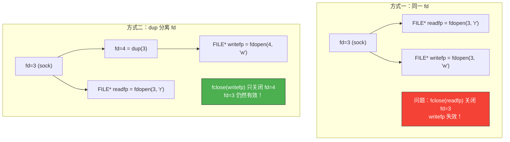
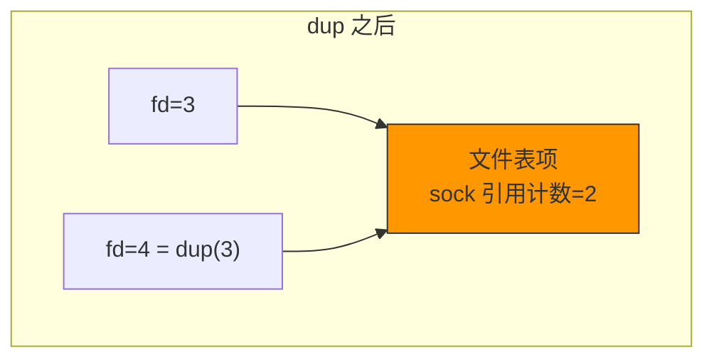
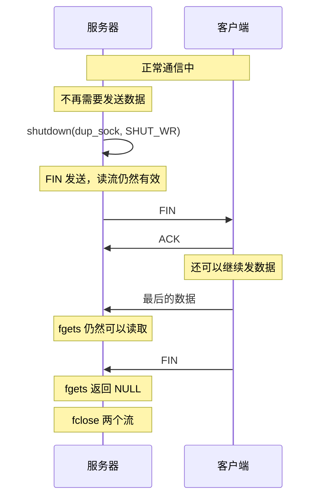

# I/O流分离

> 上一章用 `fdopen` 将读写分离为两个 FILE 流，但 fclose 会关闭底层 fd。这一章我们解决这个问题的同时，深入理解 I/O 流分离的本质。

## 一、I/O 流分离的两种方式

### 1.1 为什么要分离读写流？

分离读写流的好处：
- 代码更清晰：读是读，写是写
- 模式可以不同：读用行缓冲，写用全缓冲
- 支持半关闭：只关闭写方向，保留读方向

### 1.2 两种分离方式

| 方式 | 实现 | 问题 |
|------|------|------|
| I/O 流分离 | `fdopen` 创建两个 FILE 流 | fclose 会关闭 fd |
| I/O 流分离 + fd 分离 | `dup` 复制 fd 后分别 fdopen | 可独立关闭 |



---

## 二、dup / dup2 — 复制文件描述符

### 2.1 函数原型

```c
#include <unistd.h>

int dup(int oldfd);            // 复制 fd，返回最小可用 fd
int dup2(int oldfd, int newfd); // 复制 fd 到指定 newfd
```

`dup` 创建一个指向同一文件表项的新 fd：



### 2.2 dup 示例

```c
int sock = socket(AF_INET, SOCK_STREAM, 0);  // fd=3
int dup_sock = dup(sock);                     // fd=4

// fd=3 和 fd=4 指向同一个 Socket
// 写入 fd=4 的数据，从 fd=3 能读到（同一个 Socket）
// 关闭 fd=4 不会影响 fd=3（引用计数减 1）
```

---

## 三、分离 I/O 流的正确实现

### 3.1 用 dup 分离读写 FILE 流

```c
// sep_io.c — 正确分离读写流
#include <stdio.h>
#include <stdlib.h>
#include <string.h>
#include <unistd.h>
#include <sys/socket.h>
#include <arpa/inet.h>

#define BUF_SIZE 1024

void error_handling(const char *msg) {
    perror(msg);
    exit(1);
}

int main(int argc, char *argv[]) {
    if (argc != 2) {
        printf("Usage: %s <port>\n", argv[0]);
        exit(1);
    }

    int serv_sock = socket(AF_INET, SOCK_STREAM, 0);
    int opt = 1;
    setsockopt(serv_sock, SOL_SOCKET, SO_REUSEADDR, &opt, sizeof(opt));

    struct sockaddr_in serv_addr;
    memset(&serv_addr, 0, sizeof(serv_addr));
    serv_addr.sin_family = AF_INET;
    serv_addr.sin_addr.s_addr = htonl(INADDR_ANY);
    serv_addr.sin_port = htons(atoi(argv[1]));

    if (bind(serv_sock, (struct sockaddr*)&serv_addr, sizeof(serv_addr)) == -1)
        error_handling("bind() failed");
    if (listen(serv_sock, 5) == -1)
        error_handling("listen() failed");

    struct sockaddr_in clnt_addr;
    socklen_t clnt_len = sizeof(clnt_addr);
    int clnt_sock = accept(serv_sock, (struct sockaddr*)&clnt_addr, &clnt_len);
    if (clnt_sock == -1) error_handling("accept() failed");

    // 复制 fd
    int dup_sock = dup(clnt_sock);

    // 分别创建读和写的 FILE 流
    FILE *readfp = fdopen(clnt_sock, "r");
    FILE *writefp = fdopen(dup_sock, "w");

    // 设置写流为行缓冲（遇到 \n 自动刷新）
    setvbuf(writefp, NULL, _IOLBF, 0);

    char buf[BUF_SIZE];
    while (fgets(buf, BUF_SIZE, readfp) != NULL) {
        fputs(buf, writefp);  // echo 回去
        // 行缓冲模式，遇到 \n 自动 fflush
    }

    // 半关闭：关闭写方向
    fputs("Server: closing write direction\n", writefp);
    fflush(writefp);
    shutdown(fileno(writefp), SHUT_WR);  // 发送 FIN

    // 仍然可以读取
    if (fgets(buf, BUF_SIZE, readfp) != NULL) {
        printf("Received after shutdown: %s", buf);
    }

    fclose(writefp);
    fclose(readfp);
    close(serv_sock);
    return 0;
}
```

---

## 四、半关闭与 FILE 流的配合

### 4.1 问题回顾

只用 `fclose(writefp)` 不能实现半关闭——它会关闭底层 fd，导致 `readfp` 也失效。

### 4.2 shutdown + dup 的正确姿势



### 4.3 关键步骤

```c
// 1. 用 dup 复制 fd
int dup_sock = dup(clnt_sock);

// 2. 分别创建读写流
FILE *readfp = fdopen(clnt_sock, "r");
FILE *writefp = fdopen(dup_sock, "w");

// 3. 发送完毕后半关闭写方向
shutdown(dup_sock, SHUT_WR);  // 或 shutdown(clnt_sock, SHUT_WR)

// 4. 读流仍然可用
fgets(buf, sizeof(buf), readfp);

// 5. 最后关闭
fclose(writefp);
fclose(readfp);
```

::: important shutdown 与 dup
`shutdown` 作用于 Socket 本身（而非特定 fd），所以对 `dup_sock` 调用 `shutdown` 和对 `clnt_sock` 调用效果相同。关闭的是连接的某个方向，而不是某个 fd。
:::

---

## 五、另一种方案：用 dup2 重定向

```c
// 将 stdout 重定向到 Socket
dup2(clnt_sock, STDOUT_FILENO);
printf("This goes to the client!\n");
fflush(stdout);

// 将 stdin 重定向到 Socket
dup2(clnt_sock, STDIN_FILENO);
fgets(buf, sizeof(buf), stdin);  // 从 Socket 读取
```

---

## 六、三种 I/O 流分离方式对比

| 方式 | 读写流 | fd 情况 | 半关闭 | 复杂度 |
|------|--------|---------|--------|--------|
| read/write | 同一个 fd | 1 个 fd | shutdown | 简单 |
| fdopen (不 dup) | 两个 FILE* | 1 个 fd | ❌ 不可靠 | 中等 |
| fdopen + dup | 两个 FILE* | 2 个 fd | ✅ 可靠 | 较复杂 |

---

::: tip 面试速查
- **dup**：复制文件描述符，新旧 fd 指向同一个文件表项，引用计数加 1。
- **fdopen + dup**：是分离 I/O 流的正确方式，避免 fclose 关闭共享 fd。
- **shutdown 作用于 Socket 连接**，不是特定 fd，对 dup 出的 fd 调用同样有效。
- **半关闭 + FILE 流**：shutdown(SHUT_WR) 后读流仍可使用。
- **setvbuf** 可将写流设为行缓冲，避免手动 fflush。
:::

---

::: info 原著参考
本文内容参考自尹圣雨《TCP/IP 网络编程》第 16 章"关于 I/O 流分离的其他内容"。
:::
