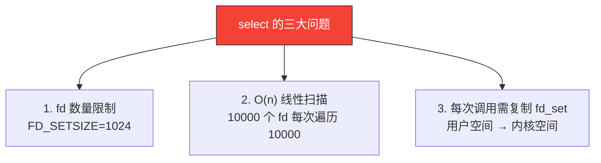
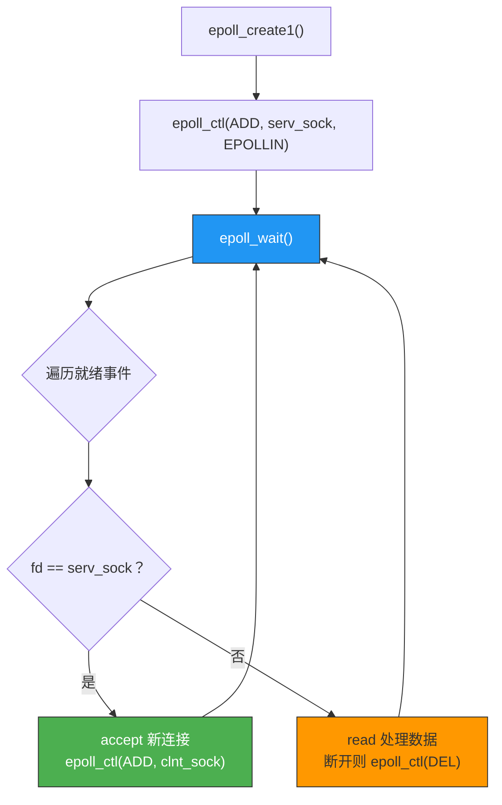
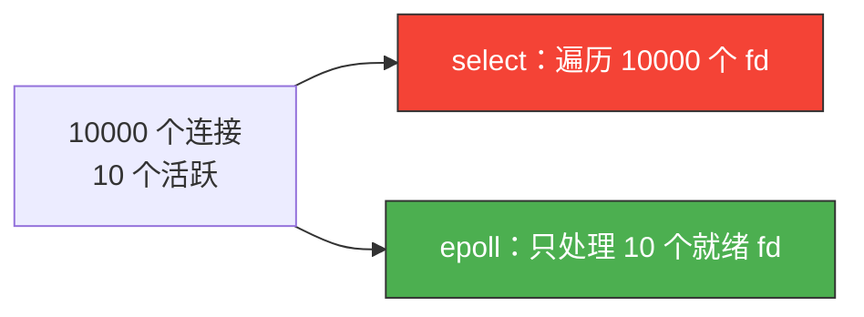

# epoll

> select 最多监控 1024 个 fd，每次都要线性扫描——在 C10K（万级并发）面前力不从心。epoll 是 Linux 给出的答案：事件驱动，O(1) 通知，轻松应对百万并发。

## 一、select 的痛点回顾



假设有 10000 个并发连接，但只有 10 个活跃——select 仍然要遍历全部 10000 个 fd。

**epoll 的解决思路**：不遍历，只通知就绪的 fd。

---

## 二、epoll 三大核心函数

### 2.1 epoll_create — 创建 epoll 实例

```c
#include <sys/epoll.h>

int epoll_create(int size);       // 传统接口（size 被忽略）
int epoll_create1(int flags);     // 推荐接口
```

```c
int epfd = epoll_create1(0);  // 返回 epoll 实例的 fd
if (epfd == -1) {
    perror("epoll_create1() failed");
    exit(1);
}
```

### 2.2 epoll_ctl — 注册/修改/删除监控的 fd

```c
int epoll_ctl(int epfd, int op, int fd, struct epoll_event *event);
```

| op 操作 | 含义 |
|---------|------|
| `EPOLL_CTL_ADD` | 注册新的 fd |
| `EPOLL_CTL_MOD` | 修改已注册 fd 的事件 |
| `EPOLL_CTL_DEL` | 删除已注册的 fd |

### 2.3 epoll_wait — 等待事件

```c
int epoll_wait(int epfd, struct epoll_event *events,
               int maxevents, int timeout);
```

返回就绪的 fd 数量，events 数组中只包含就绪的 fd——不需要遍历所有 fd。

### 2.4 epoll_event 结构体

```c
struct epoll_event {
    uint32_t     events;  // 事件类型
    epoll_data_t data;    // 用户数据
};

typedef union epoll_data {
    void     *ptr;
    int       fd;       // 最常用：存储 fd
    uint32_t  u32;
    uint64_t  u64;
} epoll_data_t;
```

常用事件类型：

| 事件 | 含义 |
|------|------|
| `EPOLLIN` | 可读（有数据到达、连接关闭） |
| `EPOLLOUT` | 可写（发送缓冲区有空间） |
| `EPOLLET` | 边缘触发模式 |
| `EPOLLERR` | 错误 |
| `EPOLLHUP` | 挂断 |

---

## 三、epoll 工作流程



---

## 四、epoll 版 Echo 服务器

```c
// epoll_echo_server.c
#include <stdio.h>
#include <stdlib.h>
#include <string.h>
#include <unistd.h>
#include <sys/socket.h>
#include <sys/epoll.h>
#include <arpa/inet.h>
#include <fcntl.h>
#include <errno.h>

#define EPOLL_SIZE 64
#define BUF_SIZE   1024

void error_handling(const char *msg) {
    perror(msg);
    exit(1);
}

// 设置非阻塞
void setnonblocking(int fd) {
    int flags = fcntl(fd, F_GETFL, 0);
    fcntl(fd, F_SETFL, flags | O_NONBLOCK);
}

int main(int argc, char *argv[]) {
    if (argc != 2) {
        printf("Usage: %s <port>\n", argv[0]);
        exit(1);
    }

    int serv_sock = socket(AF_INET, SOCK_STREAM, 0);
    if (serv_sock == -1) error_handling("socket() failed");

    int opt = 1;
    setsockopt(serv_sock, SOL_SOCKET, SO_REUSEADDR, &opt, sizeof(opt));
    setnonblocking(serv_sock);

    struct sockaddr_in serv_addr;
    memset(&serv_addr, 0, sizeof(serv_addr));
    serv_addr.sin_family = AF_INET;
    serv_addr.sin_addr.s_addr = htonl(INADDR_ANY);
    serv_addr.sin_port = htons(atoi(argv[1]));

    if (bind(serv_sock, (struct sockaddr*)&serv_addr, sizeof(serv_addr)) == -1)
        error_handling("bind() failed");
    if (listen(serv_sock, 5) == -1)
        error_handling("listen() failed");

    // 创建 epoll 实例
    int epfd = epoll_create1(0);
    if (epfd == -1) error_handling("epoll_create1() failed");

    // 注册监听套接字
    struct epoll_event event;
    event.events = EPOLLIN;
    event.data.fd = serv_sock;
    epoll_ctl(epfd, EPOLL_CTL_ADD, serv_sock, &event);

    struct epoll_event events[EPOLL_SIZE];
    printf("epoll echo server on port %s\n", argv[1]);

    while (1) {
        int event_cnt = epoll_wait(epfd, events, EPOLL_SIZE, -1);
        if (event_cnt == -1) {
            perror("epoll_wait() failed");
            break;
        }

        for (int i = 0; i < event_cnt; i++) {
            if (events[i].data.fd == serv_sock) {
                // 新连接
                struct sockaddr_in clnt_addr;
                socklen_t clnt_len = sizeof(clnt_addr);
                int clnt_sock = accept(serv_sock,
                                       (struct sockaddr*)&clnt_addr, &clnt_len);
                if (clnt_sock == -1) continue;

                setnonblocking(clnt_sock);
                printf("New client fd=%d\n", clnt_sock);

                event.events = EPOLLIN | EPOLLET;  // ET 模式
                event.data.fd = clnt_sock;
                epoll_ctl(epfd, EPOLL_CTL_ADD, clnt_sock, &event);
            } else {
                // 客户端数据
                int clnt_sock = events[i].data.fd;
                char buf[BUF_SIZE];
                int str_len = read(clnt_sock, buf, BUF_SIZE);

                if (str_len <= 0) {
                    // 客户端断开
                    epoll_ctl(epfd, EPOLL_CTL_DEL, clnt_sock, NULL);
                    close(clnt_sock);
                    printf("Client fd=%d disconnected\n", clnt_sock);
                } else {
                    write(clnt_sock, buf, str_len);  // echo
                }
            }
        }
    }

    close(serv_sock);
    close(epfd);
    return 0;
}
```

```bash
gcc -o epoll_server epoll_echo_server.c
./epoll_server 8080
```

---

## 五、LT vs ET 模式

### 5.1 两种触发模式

| 模式 | 全称 | 行为 |
|------|------|------|
| **LT**（Level Triggered） | 水平触发 | 缓冲区有数据就持续通知 |
| **ET**（Edge Triggered） | 边缘触发 | 缓冲区从空到有数据时通知一次 |


### 5.2 ET 模式必须循环读取

ET 模式下，数据到达只通知一次，必须用**非阻塞 + 循环 read** 读完所有数据：

```c
// ET 模式下的正确读取方式
while (1) {
    int str_len = read(clnt_sock, buf, BUF_SIZE);
    if (str_len > 0) {
        write(clnt_sock, buf, str_len);  // echo
    } else if (str_len == 0) {
        // 对端关闭
        epoll_ctl(epfd, EPOLL_CTL_DEL, clnt_sock, NULL);
        close(clnt_sock);
        break;
    } else {
        if (errno == EAGAIN || errno == EWOULDBLOCK) {
            // 缓冲区读完了，正常退出循环
            break;
        }
        // 真正的错误
        perror("read() failed");
        break;
    }
}
```

### 5.3 LT vs ET 对比

| 对比项 | LT | ET |
|--------|-----|-----|
| 通知频率 | 缓冲区有数据就通知 | 只在状态变化时通知一次 |
| 读取方式 | 可以部分读取 | 必须循环读完 |
| 非阻塞 | 不必须 | **必须**（否则循环 read 会阻塞） |
| 编程难度 | 简单 | 较复杂 |
| 性能 | 稍低（更多 epoll_wait 调用） | 更高（减少系统调用） |
| 默认模式 | ✅ | 需设置 EPOLLET |

::: important ET 模式三要素
1. 非阻塞 Socket（`fcntl` 设置 `O_NONBLOCK`）
2. 循环 read 直到 `EAGAIN`
3. 注册事件时加 `EPOLLET`
:::

---

## 六、select vs epoll 性能对比



| 对比项 | select | epoll |
|--------|--------|-------|
| fd 上限 | 1024 | 无限制（受系统内存限制） |
| 就绪检测 | 遍历所有 fd O(n) | 只返回就绪 fd O(1) |
| 内核拷贝 | 每次调用复制 fd_set | 只在 ctl 时复制 |
| 触发模式 | 仅 LT | LT + ET |
| 跨平台 | ✅（Windows/Mac/Linux） | ❌ 仅 Linux |

---

::: tip 面试速查
- **epoll 三步**：epoll_create → epoll_ctl → epoll_wait
- **epoll 只返回就绪的 fd**，不需要遍历所有 fd，O(1) 性能。
- **LT 模式**：缓冲区有数据就持续通知，编程简单。
- **ET 模式**：只在状态变化时通知一次，必须非阻塞 + 循环 read，性能更高。
- **ET 必须**：非阻塞 Socket + 循环读取直到 EAGAIN + EPOLLET 标志。
- **epoll 是 Linux 专属**，Windows 对应 IOCP，Mac 对应 kqueue。
:::

---

::: info 原著参考
本文内容参考自尹圣雨《TCP/IP 网络编程》第 17 章"优于 select 的 epoll"。
:::
