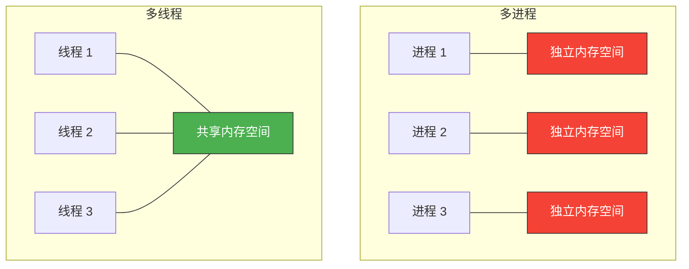
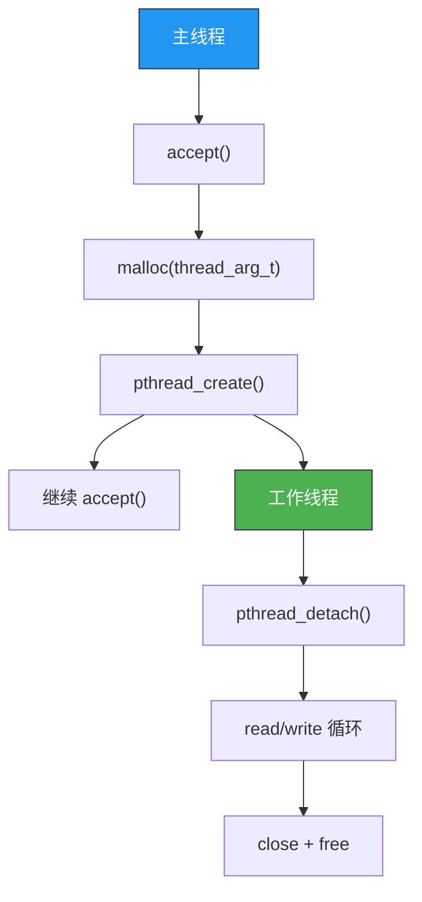

# 多线程服务器端的实现

> 多进程太重——fork 复制整个地址空间，上下文切换慢。多线程共享地址空间，创建销毁快，是并发服务器的"性价比之王"。

## 一、线程 vs 进程

### 1.1 核心区别



| 对比项 | 进程 | 线程 |
|--------|------|------|
| 内存 | 独立地址空间 | 共享地址空间 |
| 创建开销 | 大（复制地址空间） | 小（共享地址空间） |
| 上下文切换 | 慢（切换页表等） | 快（只切换寄存器/栈） |
| 通信 | 需 IPC（管道/共享内存） | 直接读写全局变量 |
| 安全性 | 一个崩溃不影响其他 | 一个崩溃可能导致全部崩溃 |
| 同步 | 不需要 | 必须加锁 |

---

## 二、pthread 线程库

### 2.1 创建线程

```c
#include <pthread.h>

int pthread_create(pthread_t *thread, const pthread_attr_t *attr,
                   void *(*start_routine)(void *), void *arg);
```

| 参数 | 含义 |
|------|------|
| thread | 输出线程 ID |
| attr | 线程属性（NULL = 默认） |
| start_routine | 线程函数 |
| arg | 传给线程函数的参数 |

### 2.2 等待线程结束

```c
int pthread_join(pthread_t thread, void **retval);
```

`pthread_join` 阻塞等待指定线程结束（类似 waitpid）。

### 2.3 线程示例

```c
// thread_demo.c
#include <stdio.h>
#include <stdlib.h>
#include <string.h>
#include <pthread.h>
#include <unistd.h>

void* thread_func(void *arg) {
    int id = *(int*)arg;
    for (int i = 0; i < 5; i++) {
        printf("Thread %d: count %d\n", id, i);
        sleep(1);
    }
    return NULL;
}

int main() {
    pthread_t t1, t2;
    int id1 = 1, id2 = 2;

    pthread_create(&t1, NULL, thread_func, &id1);
    pthread_create(&t2, NULL, thread_func, &id2);

    pthread_join(t1, NULL);
    pthread_join(t2, NULL);

    printf("All threads finished\n");
    return 0;
}
```

```bash
gcc -o thread_demo thread_demo.c -lpthread
./thread_demo
```

::: important 编译必须加 -lpthread
使用 pthread 库的程序编译时必须链接 `-lpthread`，否则会出现未定义引用错误。
:::

---

## 三、互斥锁（Mutex）

### 3.1 为什么需要互斥锁？

多个线程同时访问共享数据会导致**竞态条件**：

```c
// 危险！两个线程同时执行
int balance = 1000;

// 线程 A：取款 500
balance -= 500;   // balance = 500

// 线程 B：取款 300（在 A 写入之前读到了 1000）
balance -= 300;   // balance = 700 ← 错了！应该是 200
```

### 3.2 互斥锁 API

```c
#include <pthread.h>

pthread_mutex_t mutex;                          // 声明
pthread_mutex_init(&mutex, NULL);               // 初始化
pthread_mutex_lock(&mutex);                     // 加锁（阻塞）
pthread_mutex_unlock(&mutex);                   // 解锁
pthread_mutex_destroy(&mutex);                  // 销毁
```

### 3.3 互斥锁示例

```c
// mutex_demo.c
#include <stdio.h>
#include <stdlib.h>
#include <pthread.h>

#define NUM_THREADS 5
#define NUM_INCREMENTS 1000000

int shared_counter = 0;
pthread_mutex_t mutex;

void* increment(void *arg) {
    for (int i = 0; i < NUM_INCREMENTS; i++) {
        pthread_mutex_lock(&mutex);
        shared_counter++;
        pthread_mutex_unlock(&mutex);
    }
    return NULL;
}

int main() {
    pthread_t threads[NUM_THREADS];
    pthread_mutex_init(&mutex, NULL);

    for (int i = 0; i < NUM_THREADS; i++) {
        pthread_create(&threads[i], NULL, increment, NULL);
    }

    for (int i = 0; i < NUM_THREADS; i++) {
        pthread_join(threads[i], NULL);
    }

    printf("Final counter: %d (expected %d)\n",
           shared_counter, NUM_THREADS * NUM_INCREMENTS);

    pthread_mutex_destroy(&mutex);
    return 0;
}
```

---

## 四、线程安全的 Echo 服务器

### 4.1 完整代码

```c
// thread_echo_server.c
#include <stdio.h>
#include <stdlib.h>
#include <string.h>
#include <unistd.h>
#include <pthread.h>
#include <sys/socket.h>
#include <arpa/inet.h>

#define BUF_SIZE 1024

void error_handling(const char *msg) {
    perror(msg);
    exit(1);
}

// 传给线程的参数结构体
typedef struct {
    int clnt_sock;
    struct sockaddr_in clnt_addr;
} thread_arg_t;

// 线程函数：处理客户端
void* handle_client(void *arg) {
    thread_arg_t *targ = (thread_arg_t*)arg;
    int clnt_sock = targ->clnt_sock;
    char clnt_ip[INET_ADDRSTRLEN];
    inet_ntop(AF_INET, &targ->clnt_addr.sin_addr, clnt_ip, sizeof(clnt_ip));
    int clnt_port = ntohs(targ->clnt_addr.sin_port);

    printf("Thread handling client %s:%d\n", clnt_ip, clnt_port);

    // detach 自身，结束后自动回收资源
    pthread_detach(pthread_self());

    char buf[BUF_SIZE];
    int str_len;
    while ((str_len = read(clnt_sock, buf, BUF_SIZE)) > 0) {
        buf[str_len] = '\0';
        printf("[%s:%d] %s", clnt_ip, clnt_port, buf);
        write(clnt_sock, buf, str_len);  // echo
    }

    close(clnt_sock);
    printf("Client %s:%d disconnected\n", clnt_ip, clnt_port);

    free(targ);  // 释放参数内存
    return NULL;
}

int main(int argc, char *argv[]) {
    if (argc != 2) {
        printf("Usage: %s <port>\n", argv[0]);
        exit(1);
    }

    int serv_sock = socket(AF_INET, SOCK_STREAM, 0);
    if (serv_sock == -1) error_handling("socket() failed");

    int opt = 1;
    setsockopt(serv_sock, SOL_SOCKET, SO_REUSEADDR, &opt, sizeof(opt));

    struct sockaddr_in serv_addr;
    memset(&serv_addr, 0, sizeof(serv_addr));
    serv_addr.sin_family = AF_INET;
    serv_addr.sin_addr.s_addr = htonl(INADDR_ANY);
    serv_addr.sin_port = htons(atoi(argv[1]));

    if (bind(serv_sock, (struct sockaddr*)&serv_addr, sizeof(serv_addr)) == -1)
        error_handling("bind() failed");
    if (listen(serv_sock, 10) == -1)
        error_handling("listen() failed");

    printf("Thread echo server on port %s\n", argv[1]);

    while (1) {
        thread_arg_t *targ = (thread_arg_t*)malloc(sizeof(thread_arg_t));
        socklen_t clnt_len = sizeof(targ->clnt_addr);

        targ->clnt_sock = accept(serv_sock,
                                  (struct sockaddr*)&targ->clnt_addr,
                                  &clnt_len);
        if (targ->clnt_sock == -1) {
            free(targ);
            continue;
        }

        pthread_t tid;
        if (pthread_create(&tid, NULL, handle_client, targ) != 0) {
            perror("pthread_create() failed");
            close(targ->clnt_sock);
            free(targ);
            continue;
        }
        // 不需要 pthread_join，因为线程内 pthread_detach 了
    }

    close(serv_sock);
    return 0;
}
```

```bash
gcc -o thread_server thread_echo_server.c -lpthread
./thread_server 8080
```

### 4.2 关键设计



---

## 五、pthread_detach 的作用

### 5.1 joinable vs detached

| 属性 | joinable（默认） | detached |
|------|-----------------|----------|
| 资源回收 | 需要 pthread_join | 自动回收 |
| 返回值 | 可通过 join 获取 | 丢弃 |
| 僵尸线程 | 不 join 会泄漏 | 不会 |

```c
// 方式一：线程内 detach
pthread_detach(pthread_self());

// 方式二：创建时设置属性
pthread_attr_t attr;
pthread_attr_init(&attr);
pthread_attr_setdetachstate(&attr, PTHREAD_CREATE_DETACHED);
pthread_create(&tid, &attr, func, arg);
pthread_attr_destroy(&attr);
```

::: important 服务器通常用 detach
服务器为每个客户端创建线程，不需要等待返回值。用 `pthread_detach` 避免线程结束后变成"僵尸线程"（类似僵尸进程）。
:::

---

## 六、线程间共享数据的安全访问

### 6.1 全局变量 + 互斥锁

```c
int total_clients = 0;
pthread_mutex_t counter_mutex = PTHREAD_MUTEX_INITIALIZER;

void* handle_client(void *arg) {
    pthread_mutex_lock(&counter_mutex);
    total_clients++;
    printf("Active clients: %d\n", total_clients);
    pthread_mutex_unlock(&counter_mutex);

    // ... 处理客户端 ...

    pthread_mutex_lock(&counter_mutex);
    total_clients--;
    pthread_mutex_unlock(&counter_mutex);

    return NULL;
}
```

### 6.2 线程安全的注意事项

| 规则 | 说明 |
|------|------|
| 每个共享变量都要加锁 | 不加锁的访问是竞态条件 |
| 锁的范围尽量小 | 锁的粒度越细，并发度越高 |
| 避免死锁 | 不要在持锁时再获取另一个锁 |
| 不要忘记解锁 | 异常路径也要解锁（可用 pthread_cleanup_push） |

---

## 七、多进程 vs 多线程 vs I/O 复用

| 方案 | 优点 | 缺点 | 适用场景 |
|------|------|------|---------|
| 多进程 | 隔离性好 | 开销大 | 需要稳定性的场景 |
| 多线程 | 开销小，共享内存 | 需要同步，一个崩全崩 | 中等并发 |
| I/O 复用 | 单线程，无线程安全问题 | 编程复杂 | 高并发，长连接 |
| I/O 复用 + 线程池 | 兼顾性能和编程便利 | 架构复杂 | 生产环境首选 |

---

::: tip 面试速查
- **pthread_create**：创建线程，传函数和参数，编译加 `-lpthread`。
- **pthread_join**：等待线程结束（类似 waitpid）。
- **pthread_detach**：线程结束后自动回收资源，不需要 join。
- **pthread_mutex**：互斥锁，保护共享变量，防止竞态条件。
- **多线程共享地址空间**，通信简单但必须加锁。
- **多线程比多进程轻量**，但一个线程崩溃可能影响整个进程。
:::

---

::: info 原著参考
本文内容参考自尹圣雨《TCP/IP 网络编程》第 18 章"多线程服务器端的实现"。
:::
