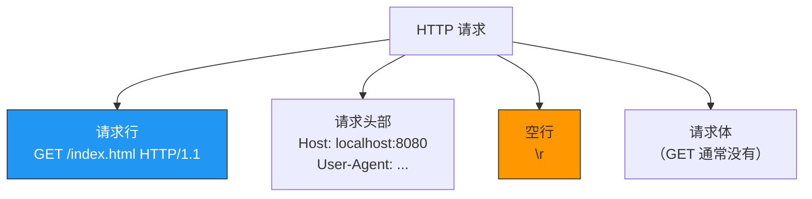
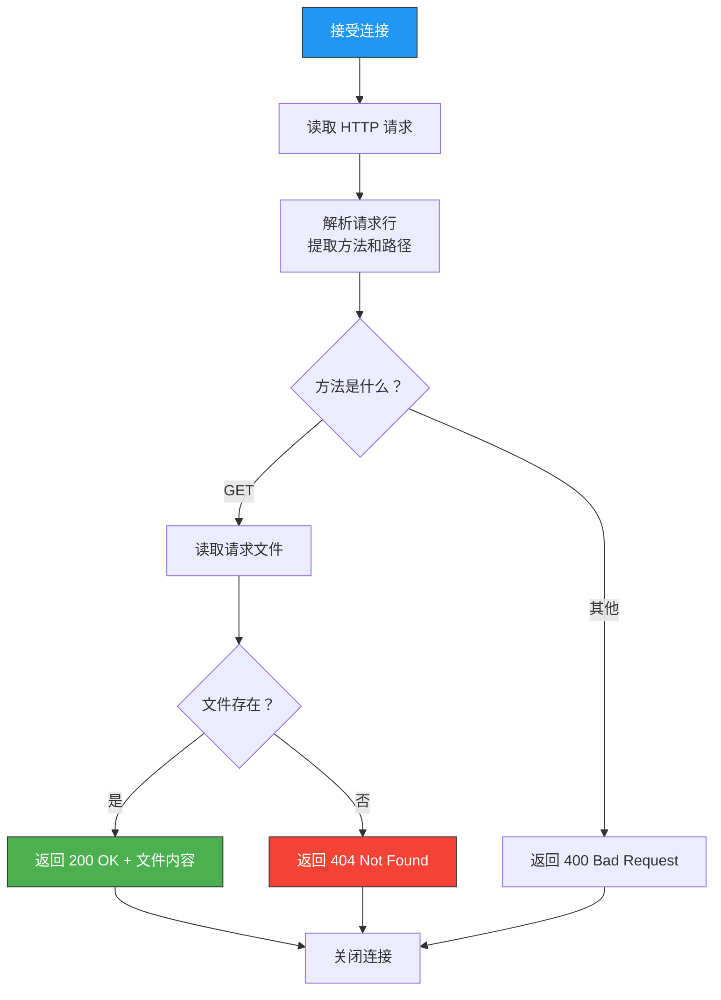
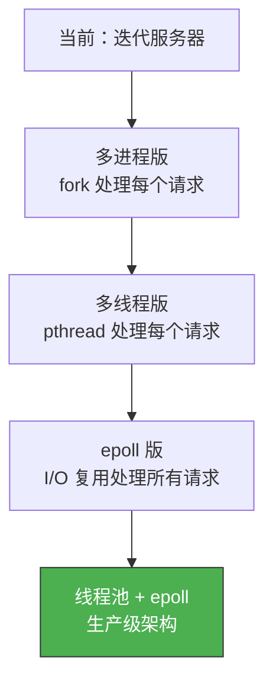

# 制作HTTP服务器端

> 前面学了 Socket 编程的所有基础，现在来做一个实战项目：用 C 语言实现一个简单的 HTTP 服务器，能返回 HTML 页面、处理 GET 请求。

## 一、HTTP 协议基础

### 1.1 HTTP 请求格式

```
GET /index.html HTTP/1.1\r\n
Host: localhost:8080\r\n
User-Agent: curl/7.68.0\r\n
Accept: */*\r\n
\r\n
```



### 1.2 HTTP 响应格式

```
HTTP/1.1 200 OK\r\n
Content-Type: text/html\r\n
Content-Length: 1234\r\n
\r\n
<html>...</html>
```

| 组成 | 示例 |
|------|------|
| 状态行 | `HTTP/1.1 200 OK` |
| 响应头 | `Content-Type: text/html` |
| 空行 | `\r\n` |
| 响应体 | HTML 内容 |

### 1.3 常见状态码

| 状态码 | 含义 |
|--------|------|
| 200 | OK |
| 301 | 永久重定向 |
| 304 | 未修改（缓存命中） |
| 400 | 请求格式错误 |
| 404 | 文件未找到 |
| 500 | 服务器内部错误 |

---

## 二、HTTP 服务器设计

### 2.1 处理流程



### 2.2 关键实现点

1. 读取请求直到 `\r\n\r\n`（请求头结束标志）
2. 解析请求行 `GET /path HTTP/1.1`
3. 根据路径读取本地文件
4. 构造 HTTP 响应发送回去

---

## 三、完整 HTTP 服务器代码

```c
// http_server.c
#include <stdio.h>
#include <stdlib.h>
#include <string.h>
#include <unistd.h>
#include <sys/socket.h>
#include <arpa/inet.h>
#include <sys/stat.h>
#include <fcntl.h>

#define BUF_SIZE    1024
#define SMALL_BUF   100

void error_handling(const char *msg) {
    perror(msg);
    exit(1);
}

// 发送 HTTP 响应
void send_response(int clnt_sock, int status_code,
                   const char *content_type, const char *body, int body_len) {
    char header[BUF_SIZE];
    const char *status_text;

    switch (status_code) {
        case 200: status_text = "OK"; break;
        case 400: status_text = "Bad Request"; break;
        case 404: status_text = "Not Found"; break;
        default:  status_text = "Internal Server Error"; break;
    }

    snprintf(header, BUF_SIZE,
             "HTTP/1.1 %d %s\r\n"
             "Content-Type: %s\r\n"
             "Content-Length: %d\r\n"
             "Connection: close\r\n"
             "\r\n",
             status_code, status_text, content_type, body_len);

    write(clnt_sock, header, strlen(header));
    if (body_len > 0) {
        write(clnt_sock, body, body_len);
    }
}

// 返回 404 页面
void send_404(int clnt_sock) {
    const char *body =
        "<html><head><title>404 Not Found</title></head>"
        "<body><h1>404 Not Found</h1>"
        "<p>The requested resource was not found on this server.</p>"
        "</body></html>";
    send_response(clnt_sock, 404, "text/html", body, strlen(body));
}

// 处理 HTTP 请求
void handle_request(int clnt_sock) {
    char buf[BUF_SIZE];
    int total = 0;

    // 读取请求头（直到 \r\n\r\n）
    while (total < BUF_SIZE - 1) {
        int n = read(clnt_sock, buf + total, 1);
        if (n <= 0) return;
        total += n;
        buf[total] = '\0';

        // 检查是否读到请求头结束
        if (strstr(buf, "\r\n\r\n") != NULL) break;
    }

    // 解析请求行：GET /path HTTP/1.1
    char method[SMALL_BUF], path[SMALL_BUF], protocol[SMALL_BUF];
    if (sscanf(buf, "%s %s %s", method, path, protocol) != 3) {
        send_response(clnt_sock, 400, "text/plain", "Bad Request", 11);
        return;
    }

    printf("Request: %s %s %s\n", method, path, protocol);

    // 只处理 GET 请求
    if (strcmp(method, "GET") != 0) {
        send_response(clnt_sock, 400, "text/plain",
                      "Only GET supported", 18);
        return;
    }

    // 默认路径 → index.html
    if (strcmp(path, "/") == 0) {
        strcpy(path, "/index.html");
    }

    // 构造文件路径（安全：防止路径遍历）
    char file_path[256];
    snprintf(file_path, sizeof(file_path), ".%s", path);

    // 检查路径中是否包含 ".."（防止目录遍历攻击）
    if (strstr(file_path, "..") != NULL) {
        send_404(clnt_sock);
        return;
    }

    // 读取文件
    struct stat st;
    if (stat(file_path, &st) == -1) {
        send_404(clnt_sock);
        return;
    }

    char *file_buf = (char*)malloc(st.st_size);
    int fd = open(file_path, O_RDONLY);
    if (fd == -1) {
        free(file_buf);
        send_404(clnt_sock);
        return;
    }
    read(fd, file_buf, st.st_size);
    close(fd);

    // 根据扩展名判断 Content-Type
    const char *content_type = "text/html";
    if (strstr(file_path, ".css") != NULL)
        content_type = "text/css";
    else if (strstr(file_path, ".js") != NULL)
        content_type = "application/javascript";
    else if (strstr(file_path, ".png") != NULL)
        content_type = "image/png";
    else if (strstr(file_path, ".jpg") != NULL || strstr(file_path, ".jpeg") != NULL)
        content_type = "image/jpeg";

    send_response(clnt_sock, 200, content_type, file_buf, st.st_size);
    free(file_buf);
}

int main(int argc, char *argv[]) {
    if (argc != 2) {
        printf("Usage: %s <port>\n", argv[0]);
        exit(1);
    }

    int serv_sock = socket(AF_INET, SOCK_STREAM, 0);
    if (serv_sock == -1) error_handling("socket() failed");

    int opt = 1;
    setsockopt(serv_sock, SOL_SOCKET, SO_REUSEADDR, &opt, sizeof(opt));

    struct sockaddr_in serv_addr;
    memset(&serv_addr, 0, sizeof(serv_addr));
    serv_addr.sin_family = AF_INET;
    serv_addr.sin_addr.s_addr = htonl(INADDR_ANY);
    serv_addr.sin_port = htons(atoi(argv[1]));

    if (bind(serv_sock, (struct sockaddr*)&serv_addr, sizeof(serv_addr)) == -1)
        error_handling("bind() failed");
    if (listen(serv_sock, 10) == -1)
        error_handling("listen() failed");

    printf("HTTP Server running on port %s\n", argv[1]);

    while (1) {
        struct sockaddr_in clnt_addr;
        socklen_t clnt_len = sizeof(clnt_addr);
        int clnt_sock = accept(serv_sock, (struct sockaddr*)&clnt_addr, &clnt_len);
        if (clnt_sock == -1) continue;

        printf("Client connected: %s\n", inet_ntoa(clnt_addr.sin_addr));

        handle_request(clnt_sock);
        close(clnt_sock);
    }

    close(serv_sock);
    return 0;
}
```

---

## 四、创建测试页面

在运行服务器的目录下创建 `index.html`：

```html
<!-- index.html -->
<!DOCTYPE html>
<html>
<head>
    <title>My HTTP Server</title>
    <style>
        body { font-family: Arial; max-width: 800px; margin: 50px auto; }
        h1 { color: #2196F3; }
        code { background: #f4f4f4; padding: 2px 6px; border-radius: 3px; }
    </style>
</head>
<body>
    <h1>Hello from C HTTP Server!</h1>
    <p>This page is served by a hand-written HTTP server in C.</p>
    <h2>Features</h2>
    <ul>
        <li>Supports GET requests</li>
        <li>Serves static HTML files</li>
        <li>Content-Type detection by extension</li>
    </ul>
    <h2>Try it</h2>
    <p><code>curl http://localhost:8080/</code></p>
</body>
</html>
```

---

## 五、运行与测试

```bash
# 编译
gcc -o http_server http_server.c

# 启动服务器
./http_server 8080

# 测试 1：curl
curl http://localhost:8080/
# 返回 HTML 页面

# 测试 2：查看响应头
curl -v http://localhost:8080/
# > GET / HTTP/1.1
# > Host: localhost:8080
# >
# < HTTP/1.1 200 OK
# < Content-Type: text/html
# < Content-Length: 487

# 测试 3：访问不存在的页面
curl http://localhost:8080/notfound.html
# < HTTP/1.1 404 Not Found

# 测试 4：浏览器访问
# 在浏览器中打开 http://localhost:8080/
```

---

## 六、HTTP 服务器的安全问题

### 6.1 路径遍历攻击

```bash
# 恶意请求：尝试读取 /etc/passwd
curl http://localhost:8080/../../../etc/passwd
```

我们的防御：检查路径中是否包含 `..`：

```c
if (strstr(file_path, "..") != NULL) {
    send_404(clnt_sock);
    return;
}
```

### 6.2 更多安全措施

| 措施 | 说明 |
|------|------|
| 路径规范化 | `realpath()` 解析后再比较 |
| 限制文件根目录 | `chroot()` 限制文件系统访问范围 |
| 请求大小限制 | 防止超长请求耗尽内存 |
| 超时机制 | 防止慢速连接攻击 |
| 请求方法白名单 | 只允许 GET/HEAD |

::: warning 这只是教学示例
这个 HTTP 服务器不适用于生产环境。生产级 HTTP 服务器（如 Nginx）需要考虑：并发处理、Keep-Alive、HTTPS、反向代理、负载均衡等。
:::

---

## 七、从迭代到高性能

当前实现是迭代式的——一次只处理一个请求。改进方向：



---

::: tip 面试速查
- **HTTP 请求格式**：请求行 + 请求头 + 空行 + 请求体
- **HTTP 响应格式**：状态行 + 响应头 + 空行 + 响应体
- **请求头以 \r\n\r\n 结束**，这是解析的关键分界点。
- **路径遍历攻击**：用 `..` 访问上级目录，必须过滤。
- **Content-Length 必须准确**，否则客户端无法判断响应何时结束。
- 生产级 HTTP 服务器需要并发、Keep-Alive、HTTPS 等特性。
:::

---

::: info 原著参考
本文内容参考自尹圣雨《TCP/IP 网络编程》第 24 章"制作 HTTP 服务器端"。
:::
