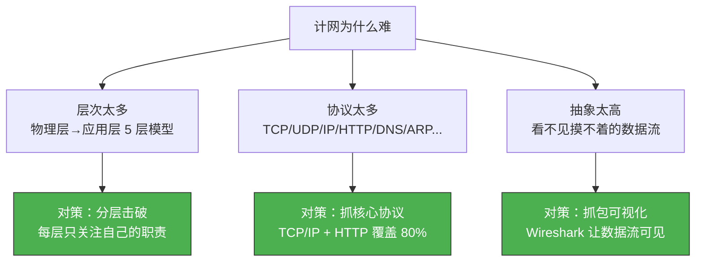
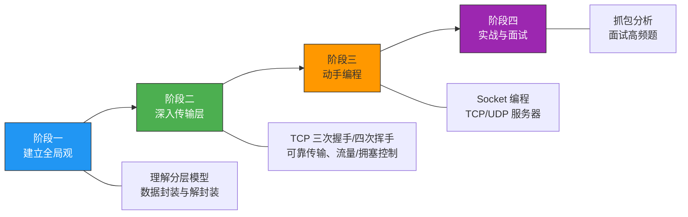
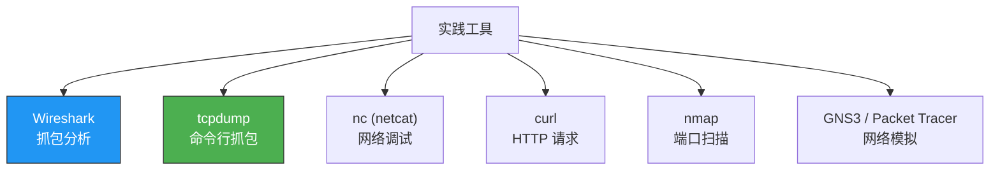
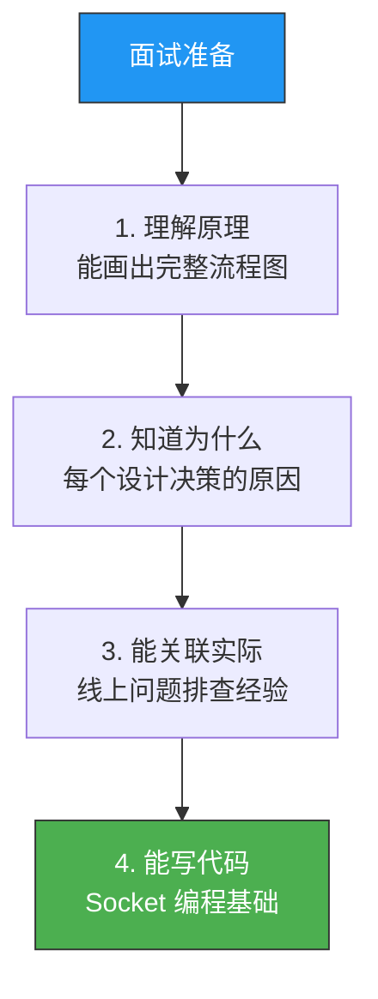

# 计算机网络怎么学

> 计算机网络是计算机科学的"硬骨头"——概念多、协议杂、层次深。但只要找对方法，它也是最能让你"顿悟"的科目。

## 一、为什么计网难学？

### 1.1 三大难点

### 1.2 常见误区

| 误区 | 正解 |
|------|------|
| 背协议格式就能学会 | 协议格式是"结果"，理解设计动机才是"原因" |
| 从第一页读到最后一页 | 先建立全局观，再逐层深入 |
| 只看理论不实践 | 抓包 + 编程才是真理解 |
| 面试题驱动学习 | 面试题是检验，不是起点 |

---

## 二、学习路线

### 2.1 推荐的四阶段路线

### 2.2 阶段一：建立全局观（1~2 周）

**目标**：理解"为什么要分层"以及"数据是怎么从一端到另一端的"

- 理解 OSI 七层模型和 TCP/IP 四层模型的对应关系
- 理解**数据封装与解封装**的过程
- 了解每一层的核心职责和代表性协议

::: tip 一个思想实验
想象你写了一封信，从北京寄到纽约：
1. 你写信（应用层）
2. 装信封写地址（传输层，加端口号）
3. 写邮政编码（网络层，加 IP 地址）
4. 分拣装袋（数据链路层，加 MAC 地址）
5. 送上飞机（物理层，比特流传输）

每层只关心自己的事，下层为上层提供服务。
:::

### 2.3 阶段二：深入传输层（2~3 周）

**目标**：彻底搞懂 TCP 和 UDP

重点内容：
- TCP 三次握手、四次挥手的完整过程与原因
- 可靠传输：序列号、确认号、重传机制
- 流量控制：滑动窗口
- 拥塞控制：慢启动、拥塞避免、快重传、快恢复
- TCP 粘包问题与解决方案
- TCP vs UDP 的选择

### 2.4 阶段三：动手编程（3~4 周）

**目标**：用代码实现网络通信，从"知道"变成"会做"

学习路径：
1. 基本 Socket 编程（socket/bind/listen/accept/connect）
2. TCP echo 服务器/客户端
3. UDP 编程
4. I/O 复用（select → epoll）
5. 多线程服务器
6. 简单 HTTP 服务器

### 2.5 阶段四：实战与面试（持续）

- 用 Wireshark 抓包分析真实网络流量
- 做面试高频题，查漏补缺
- 阅读经典面试题源（小林 coding 等）

---

## 三、推荐学习资源

### 3.1 书籍

| 书籍 | 适合阶段 | 特点 |
|------|---------|------|
| 《计算机网络：自顶向下方法》 | 入门 | 从应用层开始讲，贴近直觉 |
| 《图解 TCP/IP》 | 入门 | 大量图解，适合快速理解 |
| 《TCP/IP 详解 卷1》 | 进阶 | 协议细节的圣经 |
| 《TCP/IP 网络编程》 | 实战 | Socket 编程经典教材 |
| 《UNIX 网络编程 卷1》 | 深入 | 最权威的 Socket 编程参考 |

### 3.2 在线资源

| 资源 | 特点 |
|------|------|
| 小林 coding《图解网络》 | 面试导向，图解丰富 |
| Wireshark 官方文档 | 抓包学习利器 |
| RFC 文档 | 协议的权威定义 |
| man pages | Linux 网络 API 最全文档 |

### 3.3 实践工具

---

## 四、面试重点清单

### 4.1 高频考点

| 优先级 | 主题 | 典型问题 |
|--------|------|---------|
| ⭐⭐⭐ | TCP 三次握手/四次挥手 | 为什么不是两次/三次？ |
| ⭐⭐⭐ | TCP 可靠传输 | 如何保证可靠？ |
| ⭐⭐⭐ | TCP 拥塞控制 | 慢启动、快重传过程 |
| ⭐⭐⭐ | HTTP | GET vs POST、状态码、HTTPS |
| ⭐⭐ | TIME_WAIT | 为什么等 2MSL？如何优化？ |
| ⭐⭐ | TCP 粘包 | 为什么会粘包？怎么解决？ |
| ⭐⭐ | DNS | 递归查询 vs 迭代查询 |
| ⭐ | IP 分片 | MTU、DF 位的作用 |
| ⭐ | ARP | 同局域网通信过程 |

### 4.2 面试准备策略

---

## 五、学习建议

::: important 三个关键建议

**1. 画图 > 背书**

每学一个协议，自己画一遍流程图。画得出来才是真理解。推荐用 mermaid 画时序图和流程图。

**2. 抓包 > 看书**

`tcpdump -i any port 80` 抓一个 HTTP 请求，对照着 TCP 首部格式一个个字段看，比看书 10 遍管用。

**3. 编程 > 做题**

写一个 echo 服务器、一个 HTTP 服务器，你会发现很多"懂了但其实不懂"的知识盲区。
:::

---

::: info 原著参考
本文综合参考自小林 coding《图解网络》和尹圣雨《TCP/IP 网络编程》的学习建议。
:::
