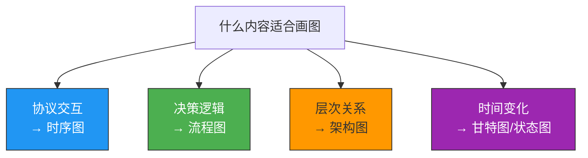
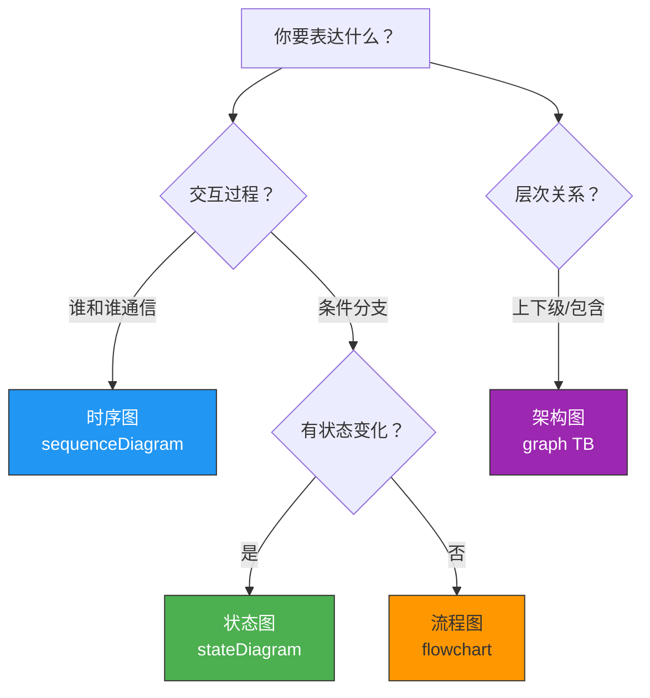
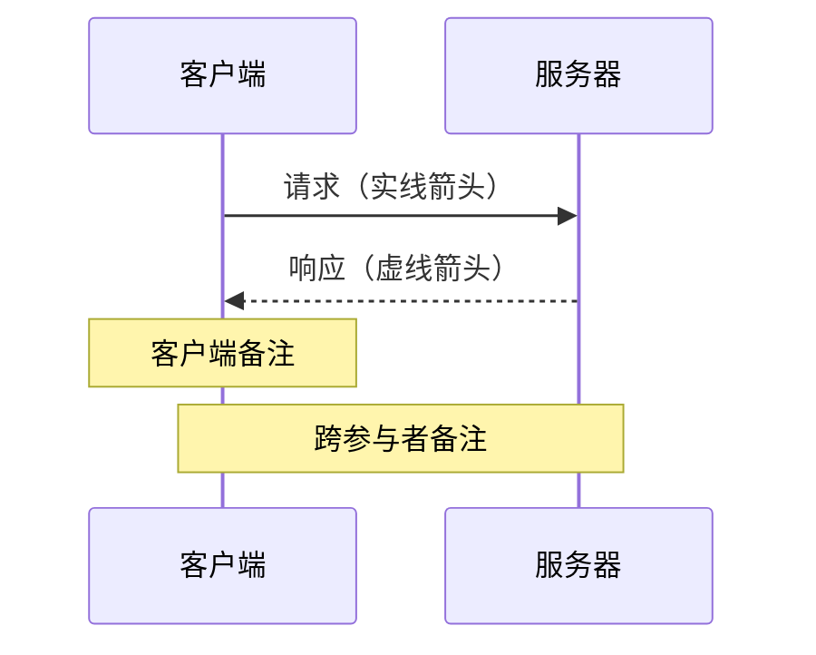
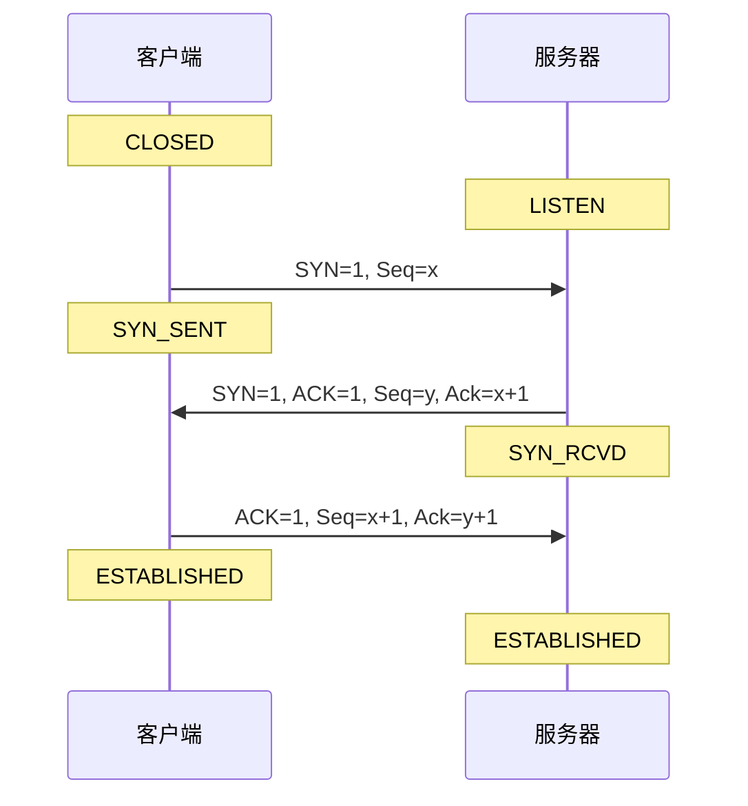
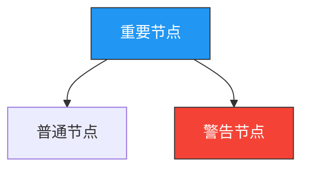
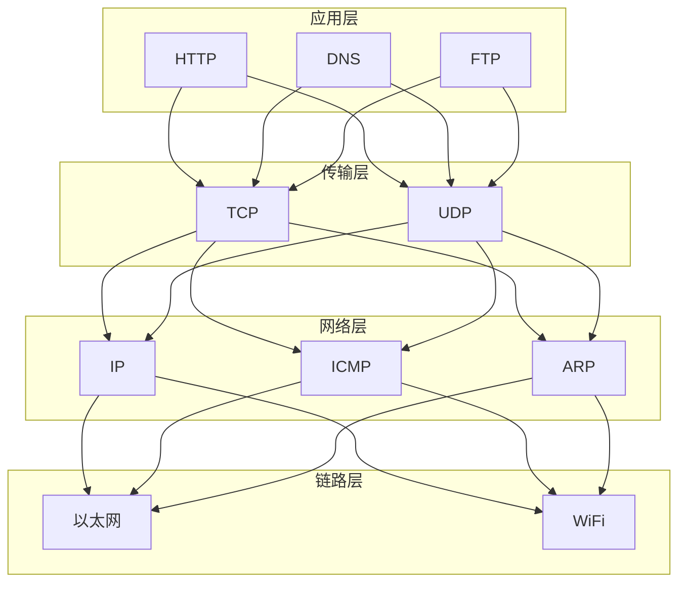
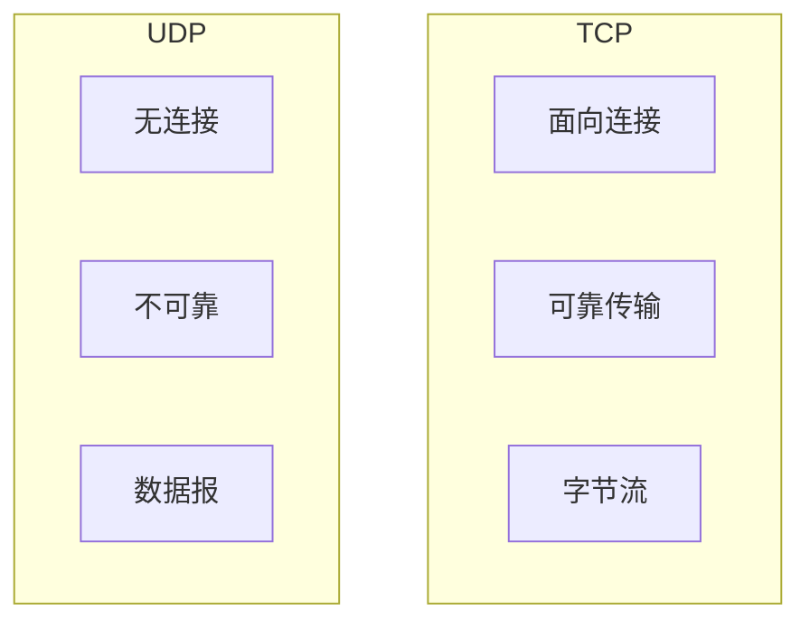
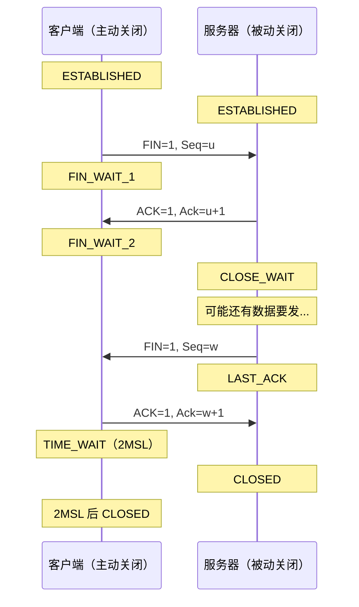

# 画图经验分享

> 一图胜千言。计算机网络的概念天然适合用图来表达——协议交互用时序图，网络架构用拓扑图，数据流向用流程图。这篇文章分享如何用 mermaid 画出高质量的技术图解。

## 一、为什么要画图？

### 1.1 画图是检验理解的标准

> 如果你不能简单地解释它，说明你还没有真正理解它。——费曼

画图就是"简单地解释"。如果你画不出 TCP 三次握手的时序图，说明你只是"背了"而不是"懂了"。

### 1.2 适合画图的场景



---

## 二、mermaid 图表类型速查

### 2.1 四种最常用的图

| 图表类型 | 适用场景 | mermaid 关键字 |
|---------|---------|---------------|
| 流程图 | 决策逻辑、算法步骤 | `flowchart` / `graph` |
| 时序图 | 协议交互、函数调用 | `sequenceDiagram` |
| 类图 | 数据结构、模块关系 | `classDiagram` |
| 状态图 | 状态机、TCP 状态转换 | `stateDiagram-v2` |

### 2.2 选择指南



---

## 三、时序图技巧

### 3.1 基本语法



### 3.2 网络协议时序图模板

画协议交互时，建议在 Note 中标注**状态变化**：



### 3.3 时序图最佳实践

| 技巧 | 说明 | 示例 |
|------|------|------|
| 标注状态 | 在 Note 中写状态名 | `Note over C: ESTABLISHED` |
| 分组 | 用 `rect` 框出阶段 | `rect rgb(200, 220, 240)` |
| 实线 vs 虚线 | 请求用实线，响应用虚线 | `->>` vs `-->>` |
| 别名 | 给长名字起短别名 | `participant C as 客户端` |

---

## 四、流程图技巧

### 4.1 方向选择

| 关键字 | 方向 | 适用场景 |
|--------|------|---------|
| `graph TB` | 上→下 | 层次关系、流程 |
| `graph LR` | 左→右 | 时间线、步骤 |
| `graph TD` | 同 TB | — |

### 4.2 节点形状

```mermaid
graph LR
    A["方框（默认）"]
    B("圆角框")
    C(["体育场形")]
    D[["子程序"]]
    E>"旗形"]

    style A fill:#2196F3,stroke:#333,color:#fff
    style B fill:#4CAF50,stroke:#333,color:#fff
    style C fill:#FF9800,stroke:#333,color:#333
```

### 4.3 样式技巧



常用配色：
- 蓝色 `#2196F3`：主要流程
- 绿色 `#4CAF50`：成功/正面
- 橙色 `#FF9800`：警告/注意
- 红色 `#f44336`：错误/危险
- 紫色 `#9C27B0`：特殊/结果

---

## 五、逻辑图画法

### 5.1 分层架构图

用 `subgraph` 表示分层：



### 5.2 对比图

左右分列，用 `subgraph` 组织：



---

## 六、画图的常见错误

### 6.1 要避免的问题

| 错误 | 正确做法 |
|------|---------|
| 图太复杂，一张图塞了所有内容 | 一张图只表达一个核心概念 |
| 文字太多 | 用关键词，详细说明放正文 |
| 没有方向箭头 | 明确标出数据/控制流方向 |
| 配色混乱 | 固定用 3~4 种颜色 |
| 没有图注 | 每张图前后要有文字衔接 |

### 6.2 好图的标准

- **一眼看出核心信息**：不需要读正文就能理解主要流程
- **层次清晰**：用 subgraph 或样式区分不同部分
- **文字精炼**：每节点不超过 15 个字
- **风格统一**：同类元素用相同形状和颜色

---

## 七、从零开始画一张 TCP 挥手图

### 步骤

1. **确定参与者**：客户端（主动关闭）和服务器（被动关闭）
2. **列出核心报文**：FIN、ACK、FIN、ACK
3. **标注状态变化**：FIN_WAIT_1 → FIN_WAIT_2 → TIME_WAIT → CLOSED
4. **添加关键备注**：为什么 ACK 和 FIN 不能合并



---

## 八、工具推荐

| 工具 | 特点 | 适合 |
|------|------|------|
| **mermaid** | 代码即图，版本友好 | 博客/文档 |
| **draw.io** | 可视化拖拽 | 复杂架构图 |
| **Excalidraw** | 手绘风格 | 演示/分享 |
| **Wireshark** | 抓包+可视化 | 网络分析 |

::: tip mermaid 的优势
- **文本格式**：可以用 Git 追踪变化
- **VuePress 原生支持**：用 ` ```mermaid ` 代码块即可渲染
- **无需额外工具**：写 Markdown 时直接画
:::

---

::: info 原著参考
本文基于作者学习计算机网络过程中的画图经验总结。
:::
