# 计算机网络

> 从协议原理到编程实战，构建完整的网络知识体系。

## 原著参考

| 原著 | 作者 | 说明 |
|------|------|------|
| 《图解网络》 | 小林coding | 面试导向，500+ 张图解，覆盖 HTTP/TCP/IP 核心知识点 |
| 《TCP/IP网络编程》 | 尹圣雨 | 网络编程经典，C 语言从 Socket 到 epoll 全链路实战 |

> 本章 01-04 篇以《图解网络》为骨架，05 篇网络编程实战以《TCP/IP网络编程》为主线，辅以 [wangjunstf/TCP-IP-Network-Note](https://github.com/wangjunstf/TCP-IP-Network-Note) 代码笔记。

## 学习路线

```mermaid
graph TB
    subgraph 基础
        A1[TCP/IP 网络模型] --> A2[键入网址到网页显示]
        A2 --> A3[Linux 系统收发网络包]
    end

    subgraph 应用层
        B1[HTTP 常见面试题] --> B2[HTTP/1.1 优化]
        B2 --> B3[HTTPS RSA 握手]
        B3 --> B4[HTTPS ECDHE 握手]
        B4 --> B5[HTTPS 优化]
        B5 --> B6[HTTP/2]
        B6 --> B7[HTTP/3]
        B7 --> B8[HTTP vs RPC]
        B8 --> B9[HTTP vs WebSocket]
    end

    subgraph 传输层
        C1[TCP 三次握手与四次挥手] --> C2[重传/滑动窗口/流量控制/拥塞控制]
        C2 --> C3[TCP 实战抓包]
        C3 --> C4[TCP 半连接与全连接队列]
        C4 --> C5[更多 TCP 深度问题...]
    end

    subgraph 网络层
        D1[IP 基础知识全家桶] --> D2[ping 工作原理]
        D2 --> D3[断网 ping 127.0.0.1]
    end

    subgraph 网络编程实战
        E1[套接字基础] --> E2[TCP 服务器/客户端]
        E2 --> E3[UDP 服务器/客户端]
        E3 --> E4[多进程与多线程]
        E4 --> E5[IO 复用 select/epoll]
        E5 --> E6[HTTP 服务器实现]
    end

    A3 --> B1
    B9 --> C1
    C5 --> D1
    D3 --> E1

    style A1 fill:#2196f3,stroke:#333,color:#fff
    style B1 fill:#2196f3,stroke:#333,color:#fff
    style C1 fill:#2196f3,stroke:#333,color:#fff
    style D1 fill:#2196f3,stroke:#333,color:#fff
    style E1 fill:#fb9b5f,stroke:#333,color:#333
```

## 章节目录

### [基础篇](01_基础篇/)

- [TCP/IP 网络模型有哪几层？](01_基础篇/01_TCP_IP网络模型.md)
- [键入网址到网页显示，期间发生了什么？](01_基础篇/02_键入网址到网页显示.md)
- [Linux 系统是如何收发网络包的？](01_基础篇/03_Linux系统收发网络包.md)

### [应用层](02_应用层/)

- [HTTP 常见面试题](02_应用层/01_HTTP常见面试题.md)
- [HTTP/1.1 如何优化？](02_应用层/02_HTTP1.1优化.md)
- [HTTPS RSA 握手解析](02_应用层/03_HTTPS_RSA握手解析.md)
- [HTTPS ECDHE 握手解析](02_应用层/04_HTTPS_ECDHE握手解析.md)
- [HTTPS 如何优化？](02_应用层/05_HTTPS优化.md)
- [HTTP/2 牛逼在哪？](02_应用层/06_HTTP2.md)
- [HTTP/3 强势来袭](02_应用层/07_HTTP3.md)
- [既然有 HTTP，为什么还要 RPC？](02_应用层/08_HTTP与RPC.md)
- [既然有 HTTP，为什么还要 WebSocket？](02_应用层/09_HTTP与WebSocket.md)

### [传输层](03_传输层/)

- [TCP 三次握手与四次挥手面试题](03_传输层/01_TCP三次握手与四次挥手.md)
- [TCP 重传、滑动窗口、流量控制、拥塞控制](03_传输层/02_TCP重传滑动窗口流量控制拥塞控制.md)
- [TCP 实战抓包分析](03_传输层/03_TCP实战抓包分析.md)
- [TCP 半连接队列和全连接队列](03_传输层/04_TCP半连接队列和全连接队列.md)
- [如何优化 TCP？](03_传输层/05_如何优化TCP.md)
- [TCP 面向字节流协议](03_传输层/06_TCP面向字节流协议.md)
- [TCP 初始化序列号为何不同？](03_传输层/07_TCP初始化序列号为何不同.md)
- [SYN 报文什么情况下会被丢弃？](03_传输层/08_SYN报文何时被丢弃.md)
- [已建立连接的 TCP 收到 SYN 会发生什么？](03_传输层/09_已建立连接收到SYN.md)
- [四次挥手中收到乱序 FIN 包如何处理？](03_传输层/10_四次挥手乱序FIN.md)
- [TIME_WAIT 状态收到 SYN 会发生什么？](03_传输层/11_TIME_WAIT收到SYN.md)
- [TCP 连接一端断电和进程崩溃的区别](03_传输层/12_断电与进程崩溃.md)
- [拔掉网线后 TCP 连接还存在吗？](03_传输层/13_拔掉网线TCP连接.md)
- [tcp_tw_reuse 为什么默认关闭？](03_传输层/14_tcp_tw_reuse为何默认关闭.md)
- [TLS 和 TCP 能同时握手吗？](03_传输层/15_TLS与TCP同时握手.md)
- [TCP Keepalive 和 HTTP Keep-Alive 的区别](03_传输层/16_TCP_Keepalive_vs_HTTP_KeepAlive.md)
- [TCP 协议有什么缺陷？](03_传输层/17_TCP协议缺陷.md)
- [如何基于 UDP 实现可靠传输？](03_传输层/18_基于UDP实现可靠传输.md)
- [TCP 和 UDP 可以使用同一个端口吗？](03_传输层/19_TCP与UDP同端口.md)
- [服务端没有 listen 会发生什么？](03_传输层/20_服务端没有listen.md)
- [没有 accept 能建立 TCP 连接吗？](03_传输层/21_没有accept能否建立连接.md)
- [用了 TCP 数据一定不会丢吗？](03_传输层/22_用了TCP数据一定不丢吗.md)
- [TCP 四次挥手可以变成三次吗？](03_传输层/23_四次挥手能否变三次.md)
- [TCP 序列号和确认号如何变化？](03_传输层/24_TCP序列号与确认号变化.md)

### [网络层](04_网络层/)

- [IP 基础知识全家桶](04_网络层/01_IP基础知识全家桶.md)
- [ping 的工作原理](04_网络层/02_ping的工作原理.md)
- [断网了，还能 ping 通 127.0.0.1 吗？](04_网络层/03_断网还能ping通127.0.0.1吗.md)

### [网络编程实战](05_网络编程实战/)

- [理解网络编程和套接字](05_网络编程实战/01_理解网络编程和套接字.md)
- [套接字类型与协议设置](05_网络编程实战/02_套接字类型与协议设置.md)
- [地址族与协议族](05_网络编程实战/03_地址族与协议族.md)
- [基于 TCP 的服务器端/客户端（一）](05_网络编程实战/04_基于TCP的服务器端客户端1.md)
- [基于 TCP 的服务器端/客户端（二）](05_网络编程实战/05_基于TCP的服务器端客户端2.md)
- [基于 UDP 的服务器端/客户端](05_网络编程实战/06_基于UDP的服务器端客户端.md)
- [优雅地断开套接字连接](05_网络编程实战/07_优雅地断开套接字连接.md)
- [域名及网络地址](05_网络编程实战/08_域名及网络地址.md)
- [套接字的多种可选项](05_网络编程实战/09_套接字的多种可选项.md)
- [多进程服务器端](05_网络编程实战/10_多进程服务器端.md)
- [进程间通信](05_网络编程实战/11_进程间通信.md)
- [I/O 复用](05_网络编程实战/12_IO复用.md)
- [多种 I/O 函数](05_网络编程实战/13_多种IO函数.md)
- [多播与广播](05_网络编程实战/14_多播与广播.md)
- [套接字和标准 I/O](05_网络编程实战/15_套接字和标准IO.md)
- [I/O 流分离](05_网络编程实战/16_IO流分离.md)
- [优于 select 的 epoll](05_网络编程实战/17_epoll.md)
- [多线程服务器端的实现](05_网络编程实战/18_多线程服务器端的实现.md)
- [制作 HTTP 服务器端](05_网络编程实战/19_制作HTTP服务器端.md)

### [学习心得](06_学习心得/)

- [计算机网络怎么学？](06_学习心得/01_计算机网络怎么学.md)
- [画图经验分享](06_学习心得/02_画图经验分享.md)
