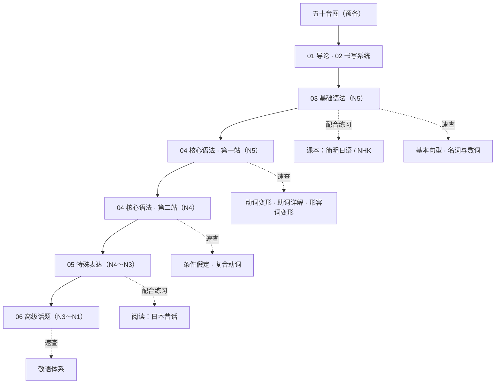

# 日语语法

## 系统讲解篇（编译自 Tae Kim 指南）

以"从日语角度理解日语"为思路，按顺序铺开语法骨架，老师式讲解。每章末尾附**章末自测题**（做完再点"显示答案"）。

> **级别图例**：<Badge type="tip" text="N5" /> 入门　<Badge type="note" text="N4" /> 基础　<Badge type="info" text="N3" /> 中级　<Badge type="warning" text="N2" /> 中高级　<Badge type="danger" text="N1" /> 高级
> 各章小节标题下方有对应标注，可按自己的备考级别选读。

- [导论——为什么需要一份"从日语出发"的语法指南](01-导论.html) —— 传统课本的问题、学习思路
- [书写系统——平假名、片假名、汉字](02-书写系统.html) —— 三种文字分工、发音要点、汉字读音、学习建议
- [基础语法——从状态表达到助词入门](03-基础语法.html) —— 名词状态、形容词、动词分类、は/も/が、副词、ね/よ
- [核心语法——从礼貌体到各种核心表达](04-核心语法.html) —— 礼貌体、动词词干、て形、可能形、条件假定、するなる、必须禁止、愿望建议、授受、请求、定义、数量计数、口语俚语
- [特殊表达——时间、推测、比较、程度](05-特殊表达.html) —— ばかり/とたん/ながら/まま/っぱなし/わけ/とする/形式名词/やすいにくい/相似与传闻ようみたいそうらしい/比较方より/程度だけしかばかりすぎるほどさ/确定かもしれないでしょう
- [高级话题——正式表达、迹象、倾向、即时事件](06-高级话题.html) —— である/はずべき/さえすらおろか/がるばかりめく/ざるを得ないやむを得ないかねる/がちつつきらい/が早いかや否やそばから/だらけまみれずくめ/思いきやがてらあげく

## 速查参考篇

按主题整理的速查表与代码块，配合系统讲解使用。**每篇开头有「学习导航」框**：标注 JLPT 级别定位、与系统讲解篇的术语对照（如「一类动词」＝「う动词」）、以及深入讲解的交叉引用。

### 入门篇

- [日语基本句型与语序](基本句型.html) —— SOV 语序、は/が 助词入门
- [名词分类与数词表达](名词与数词.html) —— 名词特征、こそあど体系、30+助数词、音变规律、时刻日期
- [动词变形总览](动词变形.html) —— ます形、て形、た形、ない形、可能形、假定形、命令形
- [助词详解](助词详解.html) —— は、が、を、に、で、と、も、か 等 12 个核心助词
- [形容词变形与活用](形容词变形.html) —— い形容词、な形容词的否定/过去/て形/副词化/条件形

### 进阶篇

- [敬语体系](敬语体系.html) —— 尊敬语、谦让语、郑重语
- [复合动词与补助动词](复合动词.html)
- [条件假定表达](条件假定.html) —— と、ば、たら、なら

## 学习路径

实线为主线路径，虚线为配合材料。每章学完做章末自测，全对再前进；动词变形不过关就刷[变形练习器](动词变形.html#变形练习)。

## 优质在线资源

以下是一些非常优秀的日语语法学习资源，建议配合使用：

### 综合教程

- **[日语语法指南（Tae Kim）](https://riyutool.com/jpgrammar/index.html)** —— 从日语角度出发讲语法，深入浅出，强烈推荐
- **[時雨の町](https://www.sigure.tw/)** —— 繁体中文，从入门到高级，内容详尽，图文并茂
- **[日语在线自学网站](https://simplified-chinese.learn-japanese-online.com/category/grammar-simplified-chinese/)** —— 以会话中常用的初级语法为核心

### 语法查询

- **[JLPT Sensei](https://jlptsensei.com/)** —— 按 N5-N1 级别分类的语法点查询
- **[毎日のんびり日本語教師](https://nihongonosensei.net/)** —— 日本教师写的语法解析，例句丰富
- **[絵でわかる日本語](https://www.e-de-wakaru.com/)** —— 用图解方式讲解语法，适合视觉学习者

### 词典与工具

- **[Weblio 辞書](https://www.weblio.jp/)** —— 综合日语词典
- **[Jisho](https://jisho.org/)** —— 英日词典，支持汉字、假名、罗马音搜索

## 学习建议

1. **先掌握五十音** —— 熟练平假名/片假名是基础（见[五十音图](../五十音图.html)）
2. **理解 SOV 语序** —— 日语是「主语-宾语-谓语」结构，谓语在句末
3. **攻克动词变形** —— 动词变形是日语语法的核心，务必扎实掌握
4. **积累助词用法** —— 助词决定词与词之间的关系，是日语的「灵魂」
5. **多读多听** —— 结合[新标日单词](00.新标日初级(二)单词.html)和原版材料练习

## 版权说明

"系统讲解篇"参考编译自 Tae Kim《[A Guide to Japanese Grammar](https://guidetojapanese.org/learn/grammar)》（CC BY-NC-SA 3.0）。原作采用知识共享 署名-非商业性使用-相同方式共享 3.0 许可，本指南在相同许可下发布。
