# Docker 概述与安装

容器技术重塑了软件交付方式：从"在我的机器上能跑"到"在任何机器上都能跑"。本文从容器技术的演进脉络出发，深入 Docker 底层原理，并手把手完成 Docker 环境搭建。

## 1. 容器技术演进

容器并非 Docker 凭空发明，其思想根源可追溯至上世纪七十年代。

### 1.1 chroot —— 隔离的起点

1979 年，Unix V7 引入 `chroot` 系统调用，将进程的根目录切换到指定路径，实现了最基础的文件系统隔离：

```bash
# chroot：将进程的根目录限制在 /newroot 下
mkdir -p /newroot/{bin,lib,lib64}
cp /bin/bash /newroot/bin/
cp /lib/x86_64-linux-gnu/libtinfo.so.6 /newroot/lib/
cp /lib/x86_64-linux-gnu/libc.so.6 /newroot/lib/
cp /lib64/ld-linux-x86-64.so.2 /newroot/lib64/

chroot /newroot /bin/bash
# 此时进程看到的根目录是 /newroot，无法访问宿主文件系统
```

::: tip chroot 的局限
chroot 仅隔离文件系统视图，不隔离进程、网络、设备等资源。进程仍可看到宿主的 PID、网络接口，安全性极弱 —— 有经验的用户甚至可以逃逸 chroot。
:::

### 1.2 LXC —— 容器雏形

2008 年，Linux 内核相继合并 `cgroup` 和 `namespace` 特性后，LXC（Linux Containers）项目将这些能力组合起来，提供了更完整的容器化方案：

```bash
# LXC 创建并启动容器
lxc-create -n mycontainer -t ubuntu
lxc-start -n mycontainer
lxc-attach -n mycontainer -- /bin/bash
```

LXC 实现了：
- **进程隔离**：通过 PID namespace
- **网络隔离**：通过 Network namespace
- **资源限制**：通过 cgroup
- **文件系统隔离**：通过 chroot/Mount namespace

::: important LXC 为什么没有流行？
LXC 依赖宿主内核版本，配置复杂（需手写配置文件），镜像管理缺失，且缺乏可移植性。不同宿主环境下的 LXC 容器往往不能直接迁移。
:::

### 1.3 Docker —— 容器革命

2013 年，dotCloud 公司（后更名 Docker Inc.）开源 Docker，核心创新在于：

| 维度 | LXC | Docker |
|------|-----|--------|
| 镜像管理 | 无标准化 | 分层镜像 + Docker Hub |
| 可移植性 | 依赖宿主内核版本 | Build Once, Run Anywhere |
| 使用体验 | 复杂配置文件 | Dockerfile 声明式构建 |
| 生态 | 孤立工具 | Compose / Swarm / Hub |
| 分发 | 手动拷贝 | push/pull 一键分发 |

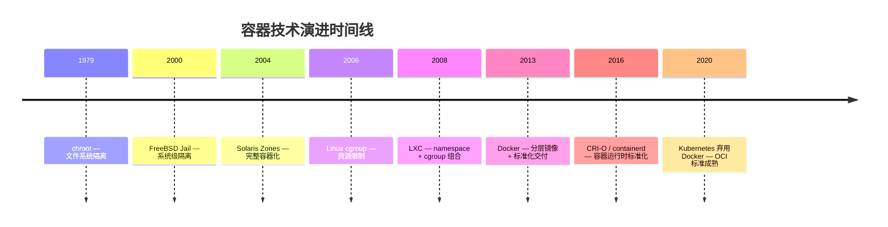

::: info 参考来源
- Docker 官方文档：[About Docker](https://docs.docker.com/get-started/overview/)
- 《Docker in Practice》第 1 章：容器的过去与未来
- CNCF 云原生全景图：[Landscape](https://landscape.cncf.io/)
:::

## 2. 容器 vs 虚拟机

容器和虚拟机都提供隔离环境，但原理截然不同。

### 2.1 架构对比

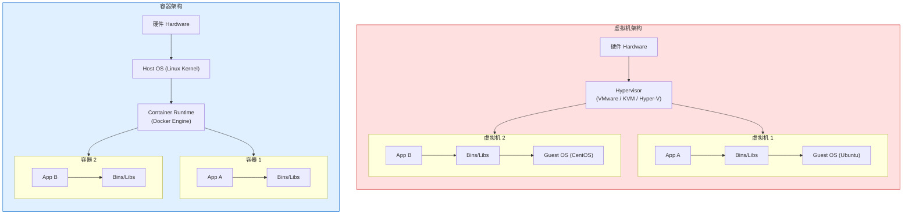

### 2.2 关键差异

| 维度 | 虚拟机 | 容器 |
|------|--------|------|
| 隔离级别 | 硬件级（独立内核） | 进程级（共享宿主内核） |
| 启动速度 | 分钟级 | 秒级（毫秒级） |
| 资源开销 | GB 级（含 Guest OS） | MB 级（仅应用 + 依赖） |
| 镜像大小 | GB ~ 数十 GB | MB ~ 数百 MB |
| 性能损耗 | 5%~20%（虚拟化开销） | 接近原生（< 2%） |
| 密度 | 单机 5~20 个 | 单机数百个 |
| 安全性 | 强隔离（独立内核） | 弱隔离（共享内核，需加固） |
| 可移植性 | 受虚拟化平台限制 | 跨平台一致 |

::: warning 容器的安全边界
容器共享宿主内核，一旦内核存在漏洞（如 Dirty COW、runc 容器逃逸 CVE-2019-5736），攻击者可能突破容器边界。生产环境中应：
- 使用 `user namespace` 实现用户映射
- 启用 Seccomp/AppArmor 限制系统调用
- 使用 rootless 模式运行 Docker
- 对安全要求极高的场景仍需虚拟机
:::

### 2.3 何时选择容器 vs 虚拟机

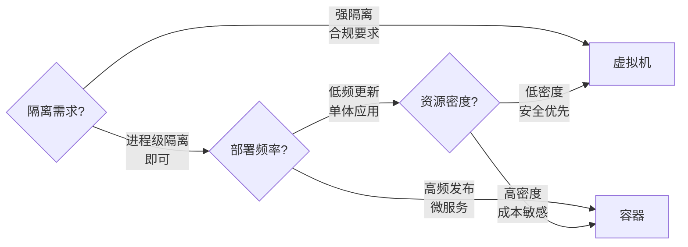

::: info 混合部署趋势
现代数据中心常采用"虚拟机 + 容器"混合模式：虚拟机提供强隔离边界，容器在虚拟机内实现高密度部署。Kubernetes 节点本身就是运行在虚拟机上的。
:::

## 3. Docker 架构

Docker 采用 Client/Server 架构，核心组件间通过 REST API 通信。

### 3.1 C/S 架构图

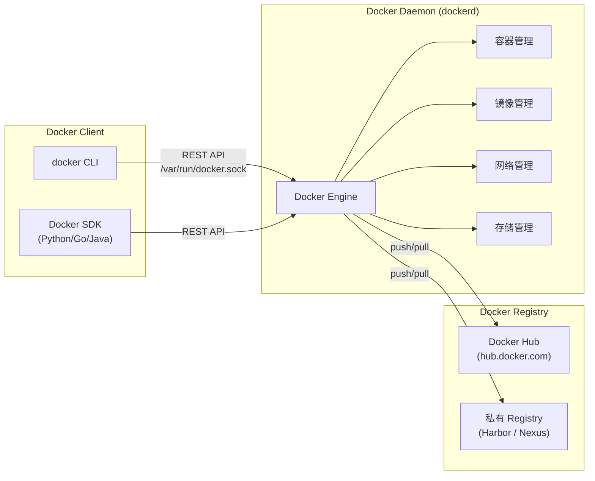

### 3.2 核心组件详解

| 组件 | 职责 | 关键点 |
|------|------|--------|
| **Docker Client** | 用户与 Docker 交互的入口 | CLI 发送请求到 Daemon |
| **Docker Daemon** | 后台服务，管理所有 Docker 对象 | 监听 `/var/run/docker.sock` |
| **Docker Registry** | 存储和分发镜像 | Docker Hub 是默认公共仓库 |

```bash
# 查看 Docker 版本信息（Client + Server）
docker version

# 查看 Docker 系统信息
docker info

# 查看 Docker Daemon 配置
cat /etc/docker/daemon.json
```

### 3.3 Docker Daemon 远程访问

默认 Docker Daemon 只监听本地 Unix Socket，生产环境可能需要远程访问：

```bash
# 方式一：修改 systemd 配置（推荐）
sudo systemctl edit docker.service

# 添加以下内容
[Service]
ExecStart=
ExecStart=/usr/bin/dockerd -H unix:///var/run/docker.sock -H tcp://0.0.0.0:2375

# 方式二：修改 daemon.json
# /etc/docker/daemon.json
{
  "hosts": ["unix:///var/run/docker.sock", "tcp://0.0.0.0:2375"]
}
```

::: warning 安全风险
开放 Docker Daemon 的 TCP 端口等同于开放 root 权限！务必：
- 使用 TLS 加密（`tcp://...:2376` + 证书认证）
- 绑定内网 IP，绝不暴露到公网
- 考虑使用 SSH 隧道而非直接暴露 TCP
:::

```bash
# 通过 SSH 安全访问远程 Docker（推荐方式）
docker -H ssh://user@remote-host ps

# 通过 TLS 加密连接
docker -H tcp://remote-host:2376 --tlsverify \
  --tlscacert=~/.docker/ca.pem \
  --tlscert=~/.docker/cert.pem \
  --tlskey=~/.docker/key.pem ps
```

## 4. 底层原理：Namespace 与 Cgroup

Docker 容器的隔离与限制依赖于 Linux 内核的两大机制：**Namespace**（命名空间）实现隔离，**Cgroup**（控制组）实现资源限制。

### 4.1 Linux Namespace

Namespace 为进程提供独立的系统视图，让进程以为自己独占系统。

| Namespace | 隔离内容 | 内核版本 | Docker 用途 |
|-----------|---------|---------|-------------|
| **PID** | 进程 ID | 2.6.24 | 容器内进程从 PID 1 开始 |
| **NET** | 网络栈 | 2.6.29 | 容器独立网络接口、路由表 |
| **MNT** | 文件系统挂载点 | 2.4.19 | 容器独立文件系统视图 |
| **UTS** | 主机名与域名 | 2.6.19 | 容器独立 hostname |
| **IPC** | 进程间通信 | 2.6.19 | 容器隔离信号量、消息队列 |
| **USER** | 用户与用户组 | 3.8 | 容器内 root 映射为宿主普通用户 |
| **CGROUP** | Cgroup 视图 | 4.6 | 容器隔离 cgroup 层级 |
| **TIME** | 系统时钟 | 5.6 | 容器独立时间命名空间 |

```bash
# 查看容器的 namespace
docker inspect --format '{{.State.Pid}}' mycontainer
# 假设 PID 为 12345

ls -la /proc/12345/ns/
# lrwxrwxrwx 1 root root 0 cgroup -> 'cgroup:[4026531835]'
# lrwxrwxrwx 1 root root 0 ipc   -> 'ipc:[4026532612]'
# lrwxrwxrwx 1 root root 0 mnt   -> 'mnt:[4026532610]'
# lrwxrwxrwx 1 root root 0 net   -> 'net:[4026532614]'
# lrwxrwxrwx 1 root root 0 pid   -> 'pid:[4026532613]'
# lrwxrwxrwx 1 root root 0 user  -> 'user:[4026531837]'
# lrwxrwxrwx 1 root root 0 uts   -> 'uts:[4026532611]'
```

#### PID Namespace 深入

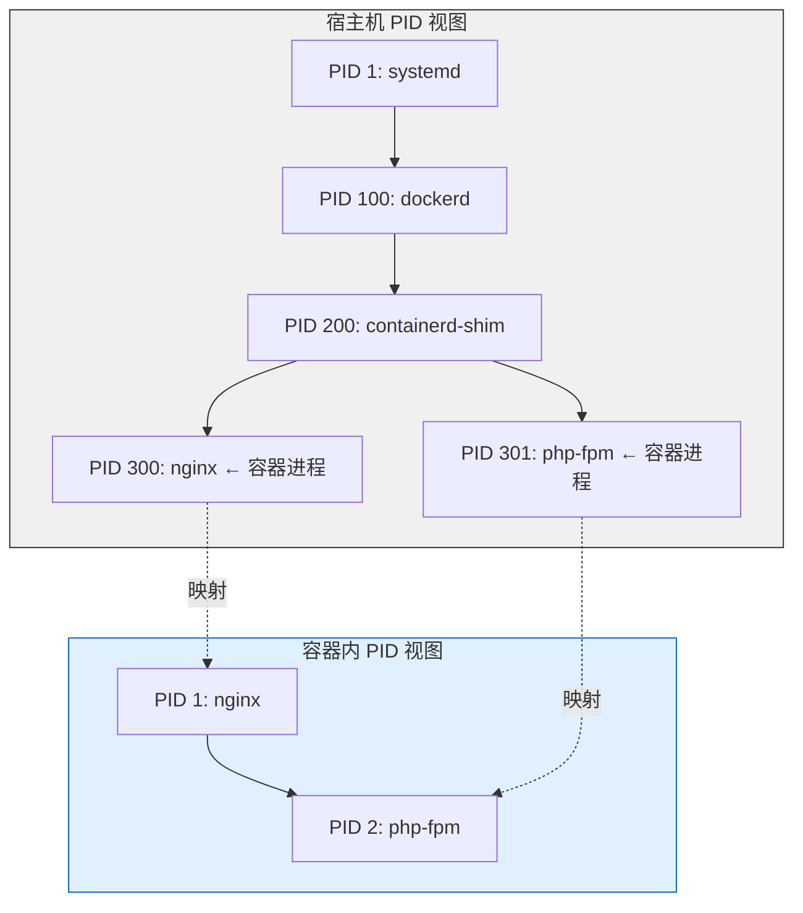

```bash
# 宿主机视角：容器进程可见
ps aux | grep nginx
# root  300  0.0  0.1  nginx  # 宿主看到 PID 300

# 容器内视角：PID 从 1 开始
docker exec mycontainer ps aux
# PID 1  0.0  0.1  nginx    # 容器内看到 PID 1
```

#### NET Namespace 深入

每个容器拥有独立的网络栈：网卡、路由表、iptables 规则、端口号空间。

```bash
# 查看容器网络 namespace
docker inspect --format '{{.NetworkSettings.SandboxKey}}' mycontainer

# 使用 nsenter 进入容器网络命名空间
docker inspect --format '{{.State.Pid}}' mycontainer | xargs -I{} \
  nsenter -t {} -n ip addr

# 容器内看到的网络
docker exec mycontainer ip addr
# 1: lo: <LOOPBACK,UP>
# 2: eth0: <BROADCAST,MULTICAST,UP> 172.17.0.2/16
```

#### USER Namespace 深入

User Namespace 实现了 UID/GID 映射，容器内的 root 用户实际映射到宿主的普通用户：

```bash
# 启用 user namespace 重映射（需配置 /etc/subuid 和 /etc/subgid）
# /etc/docker/daemon.json
{
  "userns-remap": "default"
}

# 查看映射关系
cat /proc/<pid>/uid_map
# 0    100000    65536
# 含义：容器内 UID 0-65535 映射到宿主 UID 100000-165535
```

::: important User Namespace 与安全
启用 user namespace 后：
- 容器内 root（UID 0）在宿主机上映射为非特权用户
- 即使容器被攻破，攻击者在宿主机上也无特权
- 但会与某些功能不兼容（如共享宿主 PID namespace）
:::

### 4.2 Linux Cgroup

Cgroup（Control Group）对进程组进行资源限制、优先级分配和审计。

#### Cgroup 子系统

| 子系统 | 功能 | 常用参数 |
|--------|------|---------|
| **cpu** | CPU 时间分配 | `cpu.shares`, `cpu.cfs_quota_us` |
| **cpuset** | CPU 核绑定 | `cpuset.cpus`, `cpuset.mems` |
| **memory** | 内存限制 | `memory.limit_in_bytes`, `memory.swappiness` |
| **blkio** | 块设备 IO 限制 | `blkio.throttle.read_bps_device` |
| **pids** | 进程数限制 | `pids.max` |
| **devices** | 设备访问控制 | `devices.allow`, `devices.deny` |
| **net_cls** | 网络分类标记 | `net_cls.classid` |
| **freezer** | 冻结/恢复进程组 | `freezer.state` |

```bash
# 查看容器的 cgroup 路径
docker inspect --format '{{.State.Pid}}' mycontainer | xargs -I{} \
  cat /proc/{}/cgroup

# 查看 CPU 限制
cat /sys/fs/cgroup/docker/<container-id>/cpu.cfs_quota_us
# -1 表示无限制

# 查看 Memory 限制
cat /sys/fs/cgroup/docker/<container-id>/memory.limit_in_bytes
# 9223372036854771712 表示无限制
```

#### Cgroup v1 vs v2

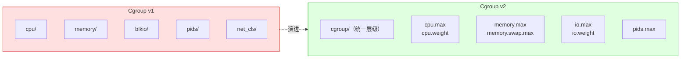

| 对比维度 | Cgroup v1 | Cgroup v2 |
|---------|-----------|-----------|
| 层级结构 | 每个子系统独立层级 | 统一层级 |
| 进程归属 | 同进程可在不同子系统不同 cgroup | 进程只能在一个 cgroup |
| 压力通知 | 无 | PSI（Pressure Stall Information） |
| 内核支持 | 2.6.24+ | 4.5+（4.5~ 可用，5.x+ 推荐） |
| Docker 支持 | 默认 | 20.10+ 通过配置启用 |

```bash
# 检查系统使用的 cgroup 版本
mount | grep cgroup
# cgroup v1: 多个 cgroup 挂载点
# cgroup v2: 只有 /sys/fs/cgroup 类型为 cgroup2

# 或通过文件系统判断
stat -f /sys/fs/cgroup/
# Type: cgroup2fs → v2
```

### 4.3 Namespace + Cgroup 协同工作

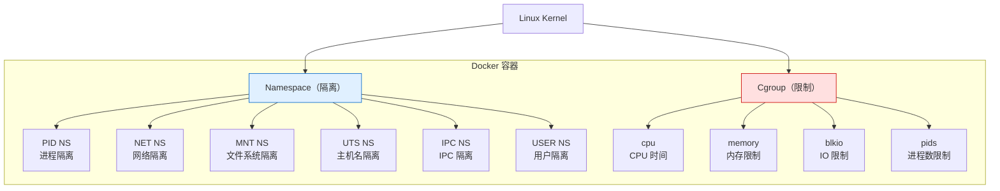

::: tip 容器的本质
容器 = Namespace（隔离视图）+ Cgroup（限制资源）+ UnionFS（分层文件系统）+ Linux Kernel。它不是轻量级虚拟机，而是一组被隔离和限制的 Linux 进程。
:::

## 5. UnionFS 与镜像分层

### 5.1 镜像分层原理

Docker 镜像由多个只读层（Layer）叠加组成，每层对应 Dockerfile 中的一条指令：

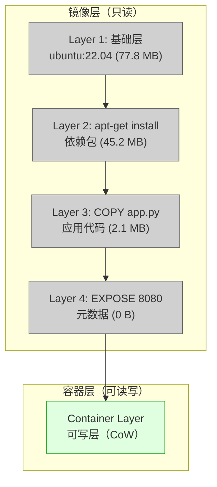

### 5.2 Copy-on-Write（CoW）机制

容器启动时，在镜像顶部添加一个可写层。修改文件时采用写时复制策略：

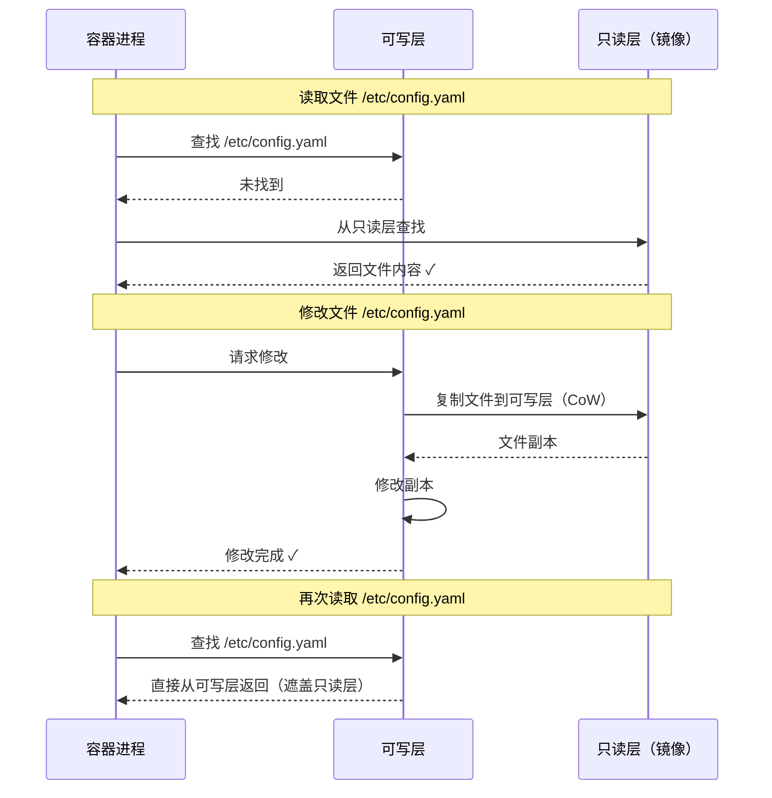

```bash
# 查看镜像分层
docker history nginx:latest
# IMAGE          CREATED       CREATED BY                                      SIZE
# 605c77e624dd   2 weeks ago   /bin/sh -c #(nop)  CMD ["nginx" "-g" "daemon…   0B
# 35e1566a5b3d   2 weeks ago   /bin/sh -c #(nop)  EXPOSE 80                    0B
# 3ba4d8e0de76   2 weeks ago   /bin/sh -c #(nop) COPY file:xxx in /            4.62kB
# 07db8d4653da   2 weeks ago   /bin/sh -c apt-get update && apt-get install…   30.4MB
# a0b4c8e6d2a1   2 weeks ago   /bin/sh -c #(nop)  ENV NJS_RELEASE=1~bullseye   0B
# ...

# 查看镜像详细分层（含 digest）
docker inspect nginx:latest --format '{{json .RootFS.Layers}}' | python3 -m json.tool
```

### 5.3 分层共享

镜像层可被多个镜像共享，极大节省磁盘空间：

```bash
# 拉取两个共享基础层的镜像
docker pull ubuntu:22.04
docker pull nginx:latest  # nginx 基于 ubuntu:22.04

# 查看磁盘使用
docker system df
# TYPE     TOTAL   ACTIVE  SIZE    RECLAIMABLE
# Images   2       2       152MB   0B (0%)
# Containers 0     0       0B      0B
# Local Cache 3     2       152MB   0B

# 共享的基础层只存储一份
```

::: info 为什么 Dockerfile 指令顺序影响镜像大小？
每条 RUN/COPY 指令创建新层。如果先安装依赖再删除安装缓存，删除操作只在新层标记删除，不会减小上层体积。正确做法是在同一层内完成安装和清理：

```dockerfile
# 错误：两层加起来仍包含缓存
RUN apt-get update
RUN apt-get install -y python3
RUN rm -rf /var/lib/apt/lists/*

# 正确：单层内完成安装和清理
RUN apt-get update && \
    apt-get install -y python3 && \
    rm -rf /var/lib/apt/lists/*
```
:::

## 6. Docker 安装

### 6.1 Ubuntu 安装

```bash
# 1. 卸载旧版本
sudo apt-get remove -y docker docker-engine docker.io containerd runc

# 2. 更新包索引并安装依赖
sudo apt-get update
sudo apt-get install -y \
    ca-certificates \
    curl \
    gnupg \
    lsb-release

# 3. 添加 Docker 官方 GPG 密钥
sudo install -m 0755 -d /etc/apt/keyrings
curl -fsSL https://download.docker.com/linux/ubuntu/gpg | \
    sudo gpg --dearmor -o /etc/apt/keyrings/docker.gpg
sudo chmod a+r /etc/apt/keyrings/docker.gpg

# 4. 添加 Docker 仓库
echo \
  "deb [arch=$(dpkg --print-architecture) signed-by=/etc/apt/keyrings/docker.gpg] https://download.docker.com/linux/ubuntu \
  $(lsb_release -cs) stable" | \
    sudo tee /etc/apt/sources.list.d/docker.list > /dev/null

# 5. 安装 Docker Engine
sudo apt-get update
sudo apt-get install -y docker-ce docker-ce-cli containerd.io docker-buildx-plugin docker-compose-plugin

# 6. 启动并设置开机自启
sudo systemctl start docker
sudo systemctl enable docker

# 7. 验证安装
docker --version
# Docker version 24.0.7, build afdd53b
```

### 6.2 CentOS / RHEL 安装

```bash
# 1. 卸载旧版本
sudo yum remove -y docker docker-client docker-client-latest \
    docker-common docker-latest docker-latest-logrotate \
    docker-logrotate docker-engine

# 2. 安装 yum-utils
sudo yum install -y yum-utils

# 3. 添加 Docker 仓库
sudo yum-config-manager --add-repo \
    https://download.docker.com/linux/centos/docker-ce.repo

# 4. 安装 Docker
sudo yum install -y docker-ce docker-ce-cli containerd.io docker-buildx-plugin docker-compose-plugin

# 5. 启动并设置开机自启
sudo systemctl start docker
sudo systemctl enable docker

# 6. 验证安装
docker --version
```

::: important CentOS 8 / RHEL 8 注意事项
CentOS 8 已停止维护，建议迁移到 Rocky Linux 或 AlmaLinux。安装时如遇 `repo error`，需要切换到 vault 源：

```bash
# 切换 CentOS 8 源到 vault
sudo sed -i 's/mirrorlist/#mirrorlist/g' /etc/yum.repos.d/CentOS-*.repo
sudo sed -i 's|#baseurl=http://mirror.centos.org|baseurl=http://vault.centos.org|g' /etc/yum.repos.d/CentOS-*.repo
```
:::

### 6.3 macOS 安装

```bash
# 方式一：Docker Desktop（推荐）
# 从 https://www.docker.com/products/docker-desktop 下载 DMG 安装

# 方式二：Homebrew 安装
brew install --cask docker

# 验证
docker --version
docker info
```

macOS 上 Docker Desktop 的实现架构：

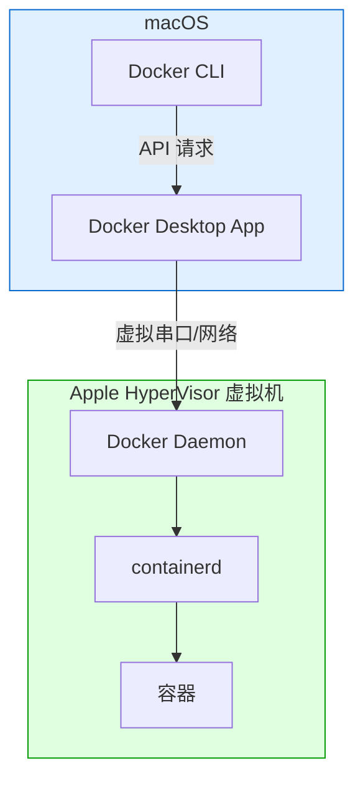

::: tip macOS 性能提示
- Docker Desktop 在 macOS 上通过虚拟机运行，文件系统性能不如原生 Linux
- 使用 `mutagen` 同步或 `VirtioFS`（Docker Desktop 4.6+）可大幅提升卷挂载性能
- 在 Docker Desktop 设置中启用 `VirtioFS` 和 `VirtioNet`
:::

### 6.4 Windows 安装

```powershell
# 方式一：Docker Desktop（推荐）
# 从 https://www.docker.com/products/docker-desktop 下载安装程序
# 需要 WSL 2 或 Hyper-V 支持

# 方式二：winget 安装
winget install Docker.DockerDesktop

# 方式三：Chocolatey 安装
choco install docker-desktop
```

#### WSL 2 后端配置

```powershell
# 1. 启用 WSL
dism.exe /online /enable-feature /featurename:Microsoft-Windows-Subsystem-Linux /all /norestart

# 2. 启用虚拟机平台
dism.exe /online /enable-feature /featurename:VirtualMachinePlatform /all /norestart

# 3. 重启后设置 WSL 2 为默认版本
wsl --set-default-version 2

# 4. 安装 Linux 发行版
wsl --install -d Ubuntu-22.04

# 5. 在 Docker Desktop 设置中选择 WSL 2 后端
```

::: warning Windows 上的注意事项
- Docker Desktop 依赖 WSL 2（推荐）或 Hyper-V
- 家庭版 Windows 需要手动启用 WSL 2，Hyper-V 不可用
- 容器内路径使用 Linux 风格（`/app/data`），挂载卷时注意路径转换
- `docker run -v "C:\Users\mydata:/data" ...` 使用引号包裹 Windows 路径
:::

### 6.5 免 sudo 运行 Docker

默认 Docker Daemon 通过 Unix Socket 通信，Socket 属于 `docker` 组，需要 root 或 docker 组权限：

```bash
# 将当前用户加入 docker 组
sudo usermod -aG docker $USER

# 重新登录或执行以下命令使组变更生效
newgrp docker

# 验证
docker run hello-world
```

::: warning docker 组等同于 root
加入 `docker` 组的用户可以通过 Docker 挂载宿主文件系统获取 root 权限：

```bash
# 任何 docker 组用户都可以这样做：
docker run -v /:/hostroot -it alpine chroot /hostroot
# 此时已获得宿主机 root 权限！
```
在生产环境中，只将可信任的用户加入 docker 组，或使用 rootless 模式。
:::

## 7. Docker Desktop 配置

### 7.1 资源配置

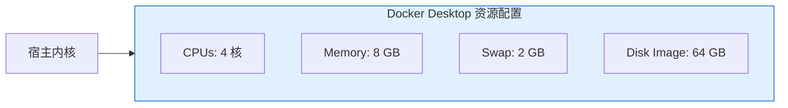

Docker Desktop 的资源配置建议：

| 宿主机配置 | 建议分配 |
|-----------|---------|
| 8 GB RAM, 4 核 | 4 GB, 2 核 |
| 16 GB RAM, 8 核 | 8 GB, 4 核 |
| 32 GB RAM, 16 核 | 16 GB, 8 核 |

### 7.2 daemon.json 配置详解

```json
{
  "registry-mirrors": [
    "https://mirror.ccs.tencentyun.com",
    "https://registry.docker-cn.com"
  ],
  "log-driver": "json-file",
  "log-opts": {
    "max-size": "10m",
    "max-file": "3"
  },
  "storage-driver": "overlay2",
  "exec-opts": ["native.cgroupdriver=systemd"],
  "live-restore": true,
  "userland-proxy": false,
  "bip": "172.17.0.1/16",
  "default-ulimits": {
    "nofile": {
      "Name": "nofile",
      "Hard": 65536,
      "Soft": 65536
    }
  }
}
```

配置项说明：

| 配置项 | 作用 | 推荐值 |
|--------|------|--------|
| `registry-mirrors` | 镜像加速地址 | 国内必须配置 |
| `log-driver` | 日志驱动 | `json-file` + 限制大小 |
| `storage-driver` | 存储驱动 | `overlay2`（默认） |
| `exec-opts` | 运行时选项 | `native.cgroupdriver=systemd`（K8s 必需） |
| `live-restore` | Daemon 重启不杀容器 | `true`（生产推荐） |
| `bip` | Docker 网桥 IP | 避免与内网冲突 |
| `userland-proxy` | 用户态代理 | `false`（性能更好） |

## 8. 镜像加速器

国内直连 Docker Hub 速度缓慢，必须配置镜像加速。

### 8.1 国内镜像源

| 镜像源 | 地址 | 状态 |
|--------|------|------|
| 腾讯云 | `https://mirror.ccs.tencentyun.com` | 稳定 |
| 阿里云 | `https://<你的ID>.mirror.aliyuncs.com` | 需登录获取 |
| 中科大 | `https://docker.mirrors.ustc.edu.cn` | 偶有波动 |
| Docker CN | `https://registry.docker-cn.com` | 已停服 |

::: warning 镜像源可用性
国内镜像源政策时常变动，2023 年以来大量公共镜像源已关闭。建议：
- 使用云厂商提供的私有加速服务（阿里云 ACR、腾讯云 TCR）
- 自建 Registry 代理
- 使用 Harbor 等私有仓库缓存常用镜像
:::

### 8.2 配置镜像加速

```bash
# 编辑 /etc/docker/daemon.json
sudo tee /etc/docker/daemon.json <<EOF
{
  "registry-mirrors": [
    "https://mirror.ccs.tencentyun.com",
    "https://<你的ID>.mirror.aliyuncs.com"
  ]
}
EOF

# 重载配置并重启 Docker
sudo systemctl daemon-reload
sudo systemctl restart docker

# 验证加速器是否生效
docker info | grep -A 5 "Registry Mirrors"
# Registry Mirrors:
#  https://mirror.ccs.tencentyun.com/
#  https://xxxxxx.mirror.aliyuncs.com/
```

### 8.3 自建 Registry 代理

```bash
# 使用 registry 官方镜像搭建代理缓存
docker run -d --name registry-mirror \
  -p 5000:5000 \
  -e REGISTRY_PROXY_REMOTEURL=https://registry-1.docker.io \
  -v /data/registry-mirror:/var/lib/registry \
  --restart always \
  registry:2

# 然后在 daemon.json 中添加
{
  "registry-mirrors": ["http://localhost:5000"]
}
```

## 9. hello-world 验证

安装完成后，运行 hello-world 容器验证一切正常：

```bash
# 运行 hello-world
docker run hello-world

# 预期输出：
# Hello from Docker!
# This message shows that your installation appears to be working correctly.
# ...
```

### 9.1 hello-world 背后发生了什么

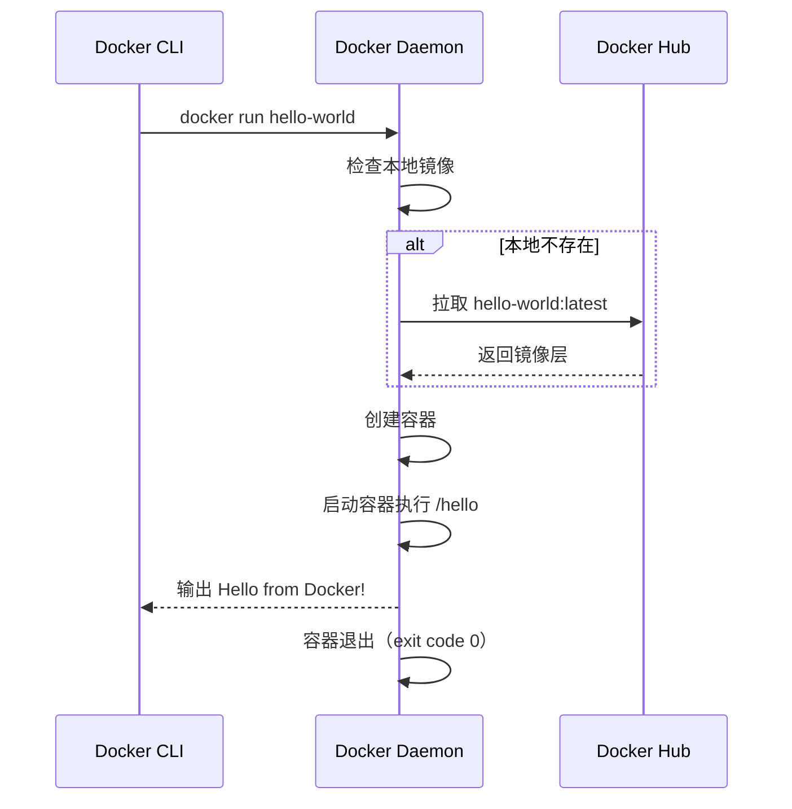

### 9.2 更深入的验证

```bash
# 1. 运行一个交互式容器
docker run -it ubuntu:22.04 /bin/bash
# 在容器内执行
cat /etc/os-release
exit

# 2. 运行一个 Nginx Web 服务
docker run -d -p 8080:80 --name my-nginx nginx:latest
curl http://localhost:8080
# 应看到 Nginx 欢迎页

# 3. 查看运行中的容器
docker ps

# 4. 清理
docker stop my-nginx
docker rm my-nginx
```

## 10. Docker 版本选择

### 10.1 版本命名规则

Docker 自 20.10 起采用 YY.MM 版本号：

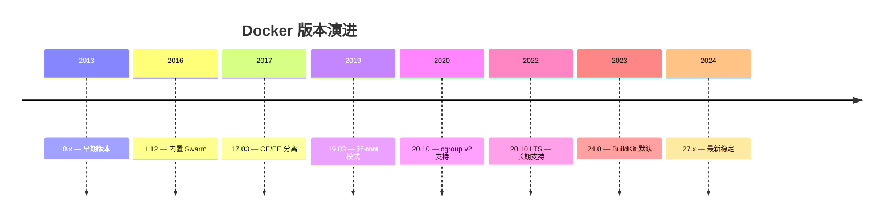

### 10.2 CE vs EE

| 版本 | 全称 | 授权 | 更新频率 | 适用场景 |
|------|------|------|---------|---------|
| **CE** | Community Edition | 开源 | 季度功能更新 + 月度补丁 | 个人/初创/测试 |
| **EE** | Enterprise Edition | 商业 | 同 CE + 优先补丁 | 企业生产 |

::: important 生产版本建议
- 稳定性优先：选择 LTS 版本（如 20.10 LTS）
- 功能优先：选择最新稳定版
- Kubernetes 集成：确认 K8s 版本对 Docker 的兼容性
- 实际上，Kubernetes 1.24+ 已弃用 dockershim，建议使用 containerd 作为容器运行时
:::

### 10.3 Docker Engine vs Docker Desktop

| 对比 | Docker Engine | Docker Desktop |
|------|--------------|----------------|
| 运行平台 | Linux 原生 | macOS / Windows |
| 架构 | 直接运行在宿主内核 | 虚拟机内运行 |
| 包含组件 | dockerd + CLI | dockerd + CLI + Compose + BuildKit + Kubernetes |
| 授权 | 免费开源 | 企业使用需订阅（$5/月/用户） |
| 适用场景 | Linux 服务器 | 开发者工作站 |
| 性能 | 原生性能 | 虚拟化开销 |

```bash
# 查看详细版本信息
docker version
# Client: Docker Engine
#  Version:    24.0.7
#  Context:    default
#
# Server:
#  Engine:
#   Version:    24.0.7
#   containerd:
#    Version:    1.6.24
#   runc:
#    Version:    1.1.9
```

## 11. 常见安装问题排查

### 11.1 问题速查表

| 问题 | 原因 | 解决方案 |
|------|------|---------|
| `Cannot connect to the Docker daemon` | Daemon 未启动 | `sudo systemctl start docker` |
| `permission denied while trying to connect` | 用户不在 docker 组 | `sudo usermod -aG docker $USER` |
| `failed to register layer: unpacking failed` | 存储驱动不兼容 | 切换 `overlay2`，清理旧数据 |
| `Error response from daemon: pull access denied` | 镜像不存在或无权限 | 检查镜像名、登录 `docker login` |
| `no space left on device` | 磁盘满 | `docker system prune -a` |
| `network timed out` | 网络不通 | 配置镜像加速器 |

### 11.2 Daemon 无法启动

```bash
# 1. 检查 Daemon 状态
sudo systemctl status docker

# 2. 查看详细日志
sudo journalctl -u docker.service --no-pager -n 50

# 3. 手动启动调试
sudo dockerd --debug

# 4. 检查配置文件语法
python3 -c "import json; json.load(open('/etc/docker/daemon.json'))"
# 如果报错说明 JSON 格式有误

# 5. 常见原因：daemon.json 语法错误
# 错误：最后一项多了逗号
{
  "storage-driver": "overlay2",  # ← 末尾不能有逗号！
}

# 正确：
{
  "storage-driver": "overlay2"
}
```

### 11.3 存储驱动问题

```bash
# 查看当前存储驱动
docker info | grep "Storage Driver"
# Storage Driver: overlay2

# 如果使用旧版 device-mapper，建议迁移到 overlay2
# 1. 停止 Docker
sudo systemctl stop docker

# 2. 备份数据
sudo cp -r /var/lib/docker /var/lib/docker.bak

# 3. 修改存储驱动
# /etc/docker/daemon.json
{
  "storage-driver": "overlay2"
}

# 4. 删除旧数据并重启
sudo rm -rf /var/lib/docker
sudo systemctl start docker
```

### 11.4 网络问题排查

```bash
# 1. 测试 Docker Hub 连通性
curl -v https://registry-1.docker.io/v2/

# 2. 检查 DNS 解析
nslookup registry-1.docker.io

# 3. 配置 Docker DNS
# /etc/docker/daemon.json
{
  "dns": ["8.8.8.8", "114.114.114.114"]
}

# 4. 代理配置（公司网络）
sudo mkdir -p /etc/systemd/system/docker.service.d
sudo tee /etc/systemd/system/docker.service.d/http-proxy.conf <<EOF
[Service]
Environment="HTTP_PROXY=http://proxy.example.com:8080"
Environment="HTTPS_PROXY=http://proxy.example.com:8080"
Environment="NO_PROXY=localhost,127.0.0.1,.example.com"
EOF

sudo systemctl daemon-reload
sudo systemctl restart docker
```

### 11.5 WSL 2 问题（Windows）

```powershell
# WSL 2 未安装
wsl --install
wsl --set-default-version 2

# WSL 2 内核过旧
wsl --update

# Docker Desktop 无法启动
# 1. 重置 Docker Desktop
# Settings → Troubleshoot → Reset to factory defaults

# 2. 清理 WSL 发行版
wsl --shutdown
wsl --unregister docker-desktop
wsl --unregister docker-desktop-data

# 3. 重新启动 Docker Desktop
```

### 11.6 macOS 性能问题

```bash
# 文件系统挂载慢
# 启用 VirtioFS（Docker Desktop 4.6+）
# Settings → General → Use VirtioFS

# 内存不足
# Settings → Resources → Memory 调整到合理值

# Docker Desktop 占用 CPU 过高
# 1. 重启 Docker Desktop
# 2. 减少分配的 CPU 核数
# 3. 检查是否有失控容器
docker stats
```

## 12. Rootless 模式

Docker 20.10+ 支持以非 root 用户运行 Docker Daemon，消除容器逃逸后获得 root 权限的风险。

### 12.1 安装 Rootless Docker

```bash
# 安装依赖
sudo apt-get install -y uidmap dbus-user-session

# 以普通用户身份安装 rootless Docker
dockerd-rootless-setuptool.sh install

# 配置环境变量
echo 'export DOCKER_HOST=unix:///run/user/$UID/docker.sock' >> ~/.bashrc
source ~/.bashrc

# 验证
docker info | grep "Context"
# Context:    rootless
```

### 12.2 Rootless 模式限制

| 功能 | 有 Root | Rootless | 备注 |
|------|---------|----------|------|
| 端口映射 | 所有端口 | ≥ 1024 | 需 `net.ipv4.ip_unprivileged_port_start` 调整 |
| cgroup 资源限制 | 完整 | 仅 v2 | 需内核 5.x+ |
| AppArmor | 支持 | 不支持 | — |
| NFS/CIFS 挂载 | 支持 | 不支持 | — |
| overlay 网络 | 支持 | 有限 | 需 rootful slave daemon |
| 性能 | 基准 | 约 95% | 网络有微小额外开销 |

::: important Rootless 适用场景
- 多租户共享开发服务器
- CI/CD 构建环境
- 安全要求较高的场景
- 不推荐用于高性能生产负载（端口限制、网络限制较多）
:::

## 13. Docker 与容器运行时生态

### 13.1 OCI 标准与运行时

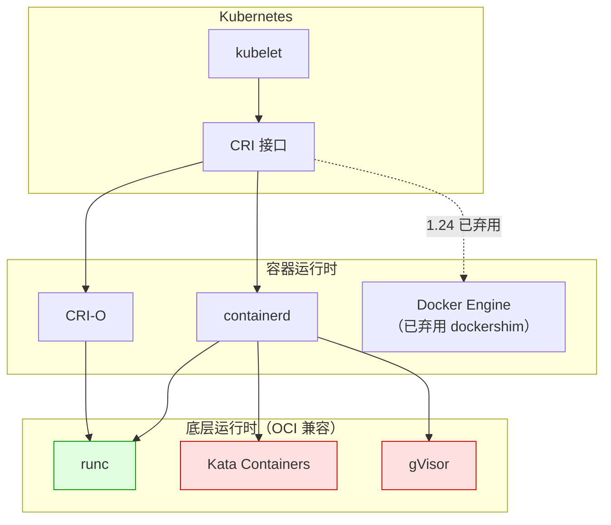

### 13.2 运行时对比

| 运行时 | 类型 | 隔离级别 | 适用场景 |
|--------|------|---------|---------|
| **runc** | 低层运行时 | 进程级（namespace） | 默认，高性能 |
| **Kata Containers** | 低层运行时 | 虚拟机级 | 高安全场景 |
| **gVisor** | 低层运行时 | 系统调用过滤 | 沙箱场景 |
| **containerd** | 高层运行时 | 管理 runc | K8s 默认运行时 |
| **CRI-O** | 高层运行时 | 管理 runc | K8s 轻量运行时 |

::: info 参考来源
- OCI 规范：[Open Container Initiative](https://opencontainers.org/)
- 《Kubernetes in Action》第 2 章：容器运行时
- Docker 官方文档：[Runtime options](https://docs.docker.com/engine/runtime/)
:::

## 14. 安装验证清单

```bash
#!/bin/bash
# Docker 安装完整验证脚本

echo "=== Docker 安装验证 ==="

# 1. 版本检查
echo -e "\n[1] 版本信息"
docker --version
docker compose version

# 2. Daemon 状态
echo -e "\n[2] Daemon 状态"
sudo systemctl is-active docker

# 3. 存储驱动
echo -e "\n[3] 存储驱动"
docker info | grep "Storage Driver"

# 4. Cgroup 版本
echo -e "\n[4] Cgroup 版本"
docker info | grep "Cgroup"

# 5. 镜像加速
echo -e "\n[5] 镜像加速器"
docker info | grep -A 3 "Registry Mirrors"

# 6. 运行 hello-world
echo -e "\n[6] 运行 hello-world"
docker run --rm hello-world

# 7. 运行交互式容器
echo -e "\n[7] 运行 Ubuntu 容器"
docker run --rm ubuntu:22.04 echo "Ubuntu 容器运行成功！"

# 8. 网络测试
echo -e "\n[8] 网络测试"
docker run --rm nginx:latest nginx -v
echo "Nginx 镜像拉取成功！"

# 9. Compose 测试
echo -e "\n[9] Docker Compose"
docker compose version

echo -e "\n=== 验证完成 ==="
```

::: tip 下一步
安装完成后，继续学习 [02 · 镜像管理](02_镜像管理.md)，掌握 Docker 镜像的获取、构建与分发。
:::
