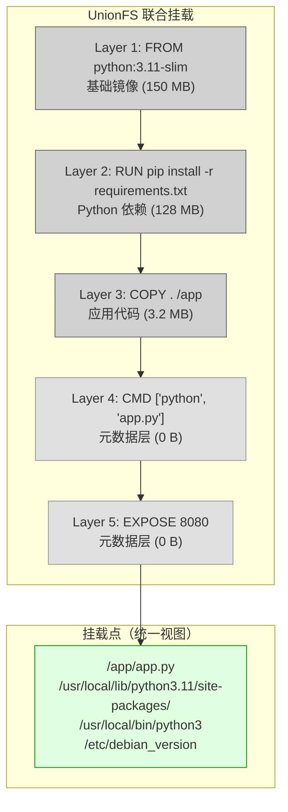
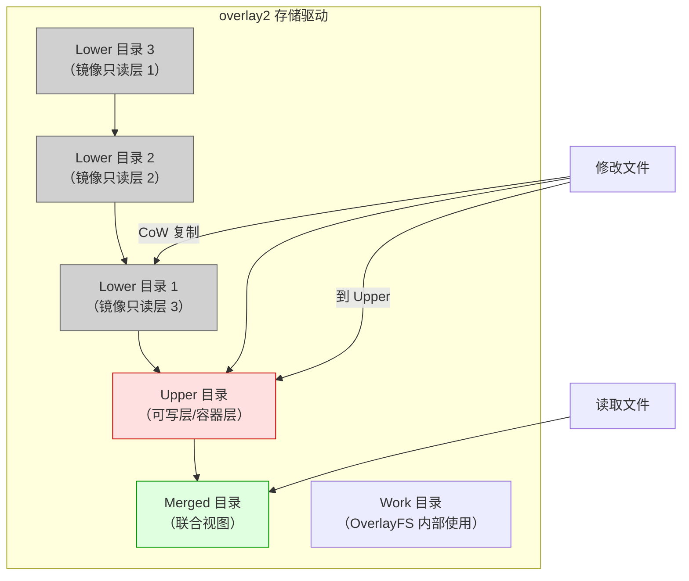
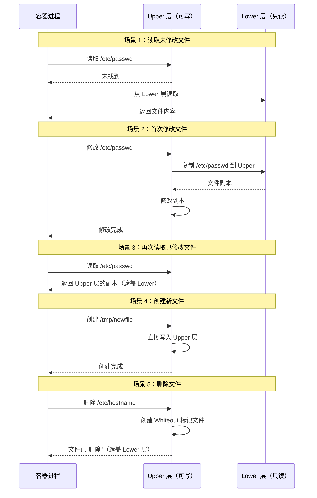
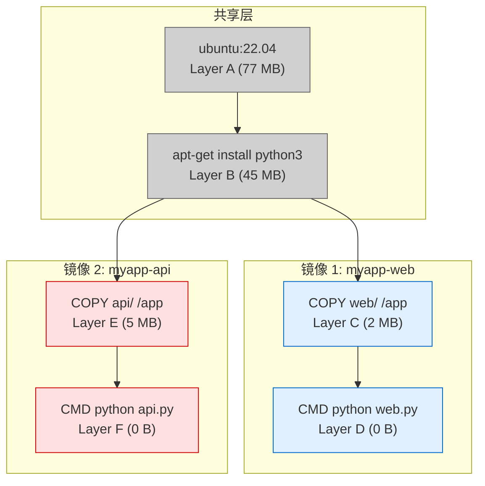
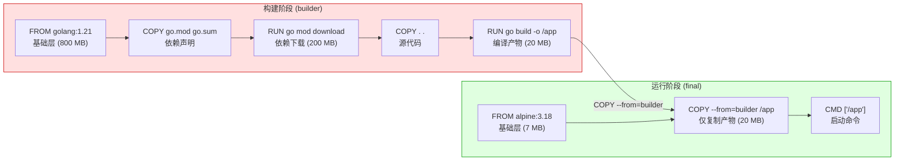
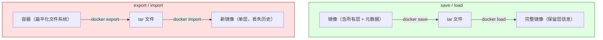
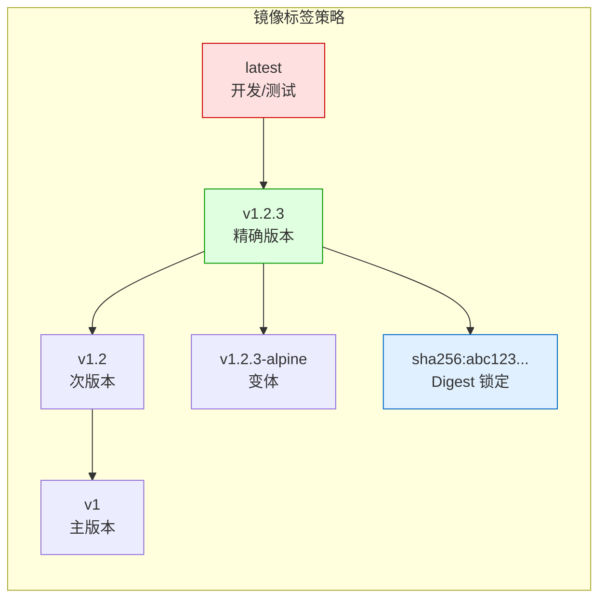

# 镜像管理

镜像是 Docker 的核心概念 —— 容器的蓝图、交付的单元、版本控制的载体。理解镜像分层原理，掌握镜像管理命令，是高效使用 Docker 的基础。

## 1. 镜像分层原理

### 1.1 Layer 与 UnionFS

Docker 镜像由多个只读层（Layer）叠加构成，每层对应 Dockerfile 中的一条指令。UnionFS 将这些层联合挂载为统一文件系统视图。



#### OverlayFS 工作原理

Docker 默认使用 OverlayFS（`overlay2` 存储驱动），其工作方式：



```bash
# 查看容器的 OverlayFS 挂载
docker inspect mycontainer --format '{{.GraphDriver.Data.MergedDir}}'
# /var/lib/docker/overlay2/<hash>/merged

ls /var/lib/docker/overlay2/<hash>/merged/
# bin  boot  dev  etc  home  lib  ...

# 查看层的 diff 目录（每层的增量内容）
ls /var/lib/docker/overlay2/<hash>/diff/
```

### 1.2 Copy-on-Write 详解

当容器修改文件时，OverlayFS 使用写时复制（CoW）策略：



```bash
# 查看容器可写层的大小
docker ps -s
# CONTAINER ID  IMAGE  ...  SIZE
# abc123        nginx  ...  2.5MB (virtual 187MB)
# SIZE = 可写层大小
# virtual = 可写层 + 所有只读层

# 查看容器可写层的具体变化
docker diff mycontainer
# C /etc            # Modified
# A /tmp/newfile    # Added
# D /etc/hostname   # Deleted
```

::: important Whiteout 文件
在 OverlayFS 中，删除 Lower 层的文件并非真正删除，而是在 Upper 层创建一个名为 `.wh.<filename>` 的标记文件（Whiteout），表示该文件已被删除。这使得 Lower 层保持不变，多个容器可安全共享。
:::

### 1.3 镜像层共享与复用



```bash
# 查看磁盘使用情况
docker system df -v
# Images space usage:
# REPOSITORY   TAG     SIZE    SHARED SIZE   UNIQUE SIZE
# myapp-web    latest  124 MB  122 MB        2 MB
# myapp-api    latest  127 MB  122 MB        5 MB
# 总占用 129 MB（而非 124+127=251 MB），因为共享层只存一份
```

### 1.4 多阶段构建与 Layer

多阶段构建（Multi-stage Build）是减小镜像体积的关键技术：



```dockerfile
# 多阶段构建示例
# ===== 阶段 1：构建 =====
FROM golang:1.21 AS builder

WORKDIR /src
COPY go.mod go.sum ./
RUN go mod download

COPY . .
RUN CGO_ENABLED=0 GOOS=linux go build -ldflags="-s -w" -o /app

# ===== 阶段 2：运行 =====
FROM alpine:3.18

RUN apk add --no-cache ca-certificates tzdata
COPY --from=builder /app /usr/local/bin/app

EXPOSE 8080
ENTRYPOINT ["app"]
```

```bash
# 对比单阶段 vs 多阶段构建
# 单阶段：镜像约 1 GB
# 多阶段：镜像约 27 MB
```

## 2. 镜像仓库

### 2.1 Docker Hub

Docker Hub 是 Docker 官方的公共镜像仓库：

```bash
# 搜索镜像
docker search nginx
# NAME                   DESCRIPTION                   STARS   OFFICIAL
# nginx                  Official build of Nginx.      18700   [OK]
# bitnami/nginx          Bitnami container image fo…   156
# nginx/nginx-ingress    NGINX and NGINX Plus Ingre…   85

# 搜索官方镜像
docker search --filter is-official=true nginx

# 搜索星标数 ≥ 50 的镜像
docker search --filter stars=50 python
```

::: tip 官方镜像 vs 认证发布者
- **Official Images**（标记 `[OK]`）：由 Docker 官方维护，经过安全审查，推荐使用
- **Verified Publisher**：由独立软件供应商维护，经过 Docker 认证
- **Community**：社区贡献，使用前需审查 Dockerfile 和安全扫描
:::

### 2.2 私有仓库

#### Registry（官方轻量方案）

```bash
# 启动私有 Registry
docker run -d \
  --name registry \
  -p 5000:5000 \
  -v /data/registry:/var/lib/registry \
  --restart always \
  registry:2

# 推送镜像到私有仓库
docker tag nginx:latest localhost:5000/my-nginx:latest
docker push localhost:5000/my-nginx:latest

# 从私有仓库拉取
docker pull localhost:5000/my-nginx:latest

# 查看仓库中的镜像
curl http://localhost:5000/v2/_catalog
# {"repositories":["my-nginx"]}

# 查看镜像标签列表
curl http://localhost:5000/v2/my-nginx/tags/list
# {"name":"my-nginx","tags":["latest"]}
```

#### 启用 TLS 的 Registry

```bash
# 使用自签名证书
mkdir -p /data/registry/certs
openssl req -newkey rsa:4096 -nodes -sha256 \
  -keyout /data/registry/certs/domain.key \
  -x509 -days 365 \
  -out /data/registry/certs/domain.crt \
  -subj "/CN=registry.example.com"

# 启动带 TLS 的 Registry
docker run -d \
  --name registry \
  -p 5000:5000 \
  -v /data/registry/data:/var/lib/registry \
  -v /data/registry/certs:/certs \
  -e REGISTRY_HTTP_TLS_CERTIFICATE=/certs/domain.crt \
  -e REGISTRY_HTTP_TLS_KEY=/certs/domain.key \
  --restart always \
  registry:2

# 客户端信任自签名证书
sudo mkdir -p /etc/docker/certs.d/registry.example.com:5000
sudo cp /data/registry/certs/domain.crt \
  /etc/docker/certs.d/registry.example.com:5000/ca.crt
```

#### Harbor（企业级方案）

```bash
# Harbor 提供 Web UI、RBAC、镜像扫描、镜像签名等企业功能
# 安装 Harbor（需要 Docker Compose）

# 1. 下载离线安装包
wget https://github.com/goharbor/harbor/releases/download/v2.9.0/harbor-offline-installer-v2.9.0.tgz
tar xzf harbor-offline-installer-v2.9.0.tgz

# 2. 修改配置
cd harbor
cp harbor.yml.tmpl harbor.yml
# 编辑 harbor.yml，设置 hostname、密码、HTTPS 证书

# 3. 安装
./install.sh --with-trivy  # 集成 Trivy 扫描

# 4. 推送镜像
docker login harbor.example.com
docker tag nginx:latest harbor.example.com/project/nginx:latest
docker push harbor.example.com/project/nginx:latest
```

### 2.3 镜像代理

在网络受限环境中，可搭建镜像代理缓存 Docker Hub 镜像：

```bash
# 搭建 Registry 代理
docker run -d \
  --name docker-hub-proxy \
  -p 5000:5000 \
  -e REGISTRY_PROXY_REMOTEURL=https://registry-1.docker.io \
  -v /data/docker-proxy:/var/lib/registry \
  --restart always \
  registry:2

# 客户端配置使用代理
# /etc/docker/daemon.json
{
  "registry-mirrors": ["http://proxy-server:5000"]
}
```

## 3. 镜像操作命令详解

### 3.1 docker pull —— 拉取镜像

```bash
# 拉取最新标签
docker pull nginx
# 等同于 docker pull nginx:latest

# 拉取指定标签
docker pull nginx:1.25.3
docker pull nginx:alpine

# 拉取指定仓库的镜像
docker pull registry.example.com/myapp:v1.0

# 拉取多架构镜像（自动选择当前平台）
docker pull --platform linux/arm64 nginx:latest

# 并行拉取（加速）
# Docker 25.0+ 默认启用并行拉取

# 查看拉取过程
docker pull --quiet nginx:latest  # 只输出 digest
```

::: important 镜像标签不可变性问题
`latest` 标签可能指向不同的镜像版本。同一标签（如 `nginx:1.25`）在不同时间拉取，可能得到不同的 digest。生产环境应使用精确版本号或 digest 锁定：

```bash
# 使用 digest 拉取（精确到 SHA256）
docker pull nginx@sha256:abc123def456...
```
:::

### 3.2 docker push —— 推送镜像

```bash
# 登录仓库
docker login
docker login registry.example.com -u myuser

# 推送前必须先 tag
docker tag myapp:latest registry.example.com/project/myapp:latest
docker push registry.example.com/project/myapp:latest

# 推送所有标签
docker push --all-tags registry.example.com/project/myapp

# 推送指定平台
docker push --platform linux/amd64 registry.example.com/project/myapp:latest
```

### 3.3 docker search —— 搜索镜像

```bash
# 搜索镜像
docker search nginx

# 过滤条件
docker search --filter is-official=true nginx
docker search --filter stars=100 python
docker search --limit 5 nginx

# 搜索结果说明
# NAME       - 镜像名称
# DESCRIPTION - 描述
# STARS      - 收藏数（越高越受欢迎）
# OFFICIAL   - 是否官方维护
# AUTOMATED  - 是否自动构建（已弃用）
```

### 3.4 docker tag —— 标记镜像

```bash
# 给镜像添加标签
docker tag nginx:latest my-nginx:v1.0
docker tag nginx:latest registry.example.com/project/nginx:1.25

# 标签只是指向同一镜像的别名，不占用额外空间
docker images
# REPOSITORY   TAG     IMAGE ID      SIZE
# nginx        latest  605c77e624dd  187MB
# my-nginx     v1.0    605c77e624dd  187MB   ← 同一 IMAGE ID
```

### 3.5 docker rmi —— 删除镜像

```bash
# 删除指定镜像
docker rmi nginx:1.25

# 通过 Image ID 删除
docker rmi 605c77e624dd

# 强制删除（即使有容器在使用）
docker rmi -f nginx:latest

# 删除所有未使用的镜像
docker image prune
docker image prune -a  # 删除所有未被容器引用的镜像

# 删除悬空镜像（无标签的中间层）
docker image prune -f

# 批量删除
docker rmi $(docker images -q nginx)  # 删除所有 nginx 镜像
docker rmi $(docker images -f "dangling=true" -q)  # 删除悬空镜像
```

::: warning 镜像删除注意事项
- 被运行中容器使用的镜像无法删除（除非 `-f`，但容器可能异常）
- 删除镜像只移除本地的标签引用，共享层不会被删除直到无引用
- `-f` 删除只是移除标签，如果其他标签指向同一镜像，镜像数据仍存在
:::

### 3.6 docker images —— 列出镜像

```bash
# 列出所有镜像
docker images
docker image ls

# 过滤显示
docker images nginx              # 只显示 nginx 镜像
docker images -f "dangling=true" # 只显示悬空镜像
docker images -f "label=version=1.0"  # 按标签过滤

# 格式化输出
docker images --format "{{.Repository}}:{{.Tag}} -> {{.Size}}"
docker images --format "table {{.Repository}}\t{{.Tag}}\t{{.Size}}"

# 只显示 Image ID
docker images -q

# 显示 digest
docker images --digests nginx
# REPOSITORY  TAG    DIGEST                                                                   IMAGE ID
# nginx       latest sha256:abc123...  605c77e624dd
```

### 3.7 docker inspect —— 查看镜像详情

```bash
# 查看镜像详细信息
docker inspect nginx:latest

# 查看特定字段
docker inspect --format '{{.Architecture}}' nginx:latest
docker inspect --format '{{.Os}}' nginx:latest
docker inspect --format '{{.Config.Env}}' nginx:latest
docker inspect --format '{{json .RootFS.Layers}}' nginx:latest | python3 -m json.tool

# 查看镜像历史
docker history nginx:latest
docker history --no-trunc nginx:latest  # 显示完整命令
docker history --format "{{.CreatedBy}}" nginx:latest
```

## 4. 镜像导入导出

### 4.1 save / load vs export / import

这是两组常被混淆的命令：



| 对比维度 | `save` / `load` | `export` / `import` |
|---------|-----------------|---------------------|
| 操作对象 | 镜像 | 容器 |
| 输出内容 | 所有层 + 元数据 + 历史 | 容器文件系统的扁平快照 |
| 层信息 | 保留 | 丢失（合并为单层） |
| 镜像大小 | 较大（含所有层） | 较小（扁平化） |
| 可回溯 Dockerfile | 是（`docker history`） | 否 |
| 常用场景 | 镜像迁移/备份 | 容器快照/定制基础镜像 |

### 4.2 save / load 详解

```bash
# 保存单个镜像
docker save -o nginx.tar nginx:latest

# 保存多个镜像到一个文件
docker save -o images.tar nginx:latest redis:7-alpine ubuntu:22.04

# 保存并压缩
docker save nginx:latest | gzip > nginx.tar.gz

# 加载镜像
docker load -i nginx.tar
docker load < nginx.tar.gz  # 支持压缩文件

# 验证
docker images nginx
```

### 4.3 export / import 详解

```bash
# 导出容器文件系统
docker export mycontainer > mycontainer.tar
docker export mycontainer | gzip > mycontainer.tar.gz

# 导入为新镜像
docker import mycontainer.tar myapp:custom
cat mycontainer.tar.gz | docker import - myapp:custom

# 导入时添加提交信息
docker import -c 'EXPOSE 8080' -c 'CMD ["nginx"]' \
  -m "Custom nginx build" \
  mycontainer.tar myapp:custom

# 验证
docker history myapp:custom
# 只有一层，丢失了原始构建历史
```

::: important 如何选择？
- **迁移镜像**：使用 `save` / `load`，保留完整层信息
- **定制基础镜像**：使用 `export` / `import`，从容器快照创建精简镜像
- **离线分发**：使用 `save` + 压缩，接收方 `load` 后可正常使用
- **容器快照备份**：使用 `export`，仅保存当前文件系统状态
:::

## 5. 多架构镜像

### 5.1 为什么需要多架构镜像

不同 CPU 架构的镜像不能混用：

| 架构 | 常见平台 | 架构标识 |
|------|---------|---------|
| x86_64 | PC / 服务器 / 云主机 | `linux/amd64` |
| ARM64 | M1/M2 Mac / 树莓派 / AWS Graviton | `linux/arm64` |
| ARMv7 | 旧树莓派 / 嵌入式 | `linux/arm/v7` |
| s390x | IBM Z 主机 | `linux/s390x` |
| ppc64le | IBM Power | `linux/ppc64le` |

```bash
# 查看当前平台
docker info | grep "Architecture"
# Architecture: x86_64

# 拉取其他平台的镜像
docker pull --platform linux/arm64 nginx:latest

# 运行其他平台的镜像（通过 QEMU 模拟）
docker run --platform linux/arm64 nginx:latest nginx -v
```

### 5.2 buildx 构建多架构镜像

```bash
# 1. 创建 buildx 构建器
docker buildx create --name mybuilder --use
docker buildx inspect --bootstrap

# 2. 安装 QEMU 模拟器（Linux 主机）
docker run --privileged --rm tonistiigi/binfmt --install all

# 3. 构建多架构镜像
docker buildx build \
  --platform linux/amd64,linux/arm64 \
  -t myapp:latest \
  --push \
  .

# 4. 构建并加载到本地（单平台）
docker buildx build \
  --platform linux/amd64 \
  -t myapp:latest \
  --load \
  .

# 5. 查看多架构镜像信息
docker buildx imagetools inspect nginx:latest
# Name:      docker.io/library/nginx:latest
# MediaType: application/vnd.docker.distribution.manifest.list.v2+json
# Digest:    sha256:abc123...
#
# Manifests:
#   Name:      docker.io/library/nginx:latest@sha256:aaa...
#   MediaType: application/vnd.docker.distribution.manifest.v2+json
#   Platform:  linux/amd64
#
#   Name:      docker.io/library/nginx:latest@sha256:bbb...
#   MediaType: application/vnd.docker.distribution.manifest.v2+json
#   Platform:  linux/arm64
```

### 5.3 buildx 构建器配置

```bash
# 查看构建器列表
docker buildx ls

# 创建远程构建器（使用 Docker Context）
docker context create remote --docker "host=ssh://user@remote"
docker buildx create --name remote-builder --driver docker-container \
  --config buildkitd.toml remote

# buildkitd.toml 配置
[registry."registry.example.com"]
  mirrors = ["mirror.example.com"]

# 删除构建器
docker buildx rm mybuilder
```

### 5.4 Dockerfile 多架构最佳实践

```dockerfile
# 使用多架构基础镜像
FROM --platform=$BUILDPLATFORM golang:1.21 AS builder

ARG TARGETPLATFORM
ARG BUILDPLATFORM
ARG TARGETOS
ARG TARGETARCH

WORKDIR /src
COPY go.mod go.sum ./
RUN go mod download

COPY . .
RUN CGO_ENABLED=0 GOOS=${TARGETOS} GOARCH=${TARGETARCH} \
    go build -ldflags="-s -w" -o /app

FROM alpine:3.18
COPY --from=builder /app /usr/local/bin/app
ENTRYPOINT ["app"]
```

::: tip 多架构构建性能
- `--platform=$BUILDPLATFORM` 让构建阶段在本地平台运行（避免 QEMU 模拟）
- 通过 `TARGETOS`/`TARGETARCH` 交叉编译目标平台二进制
- Go/Rust 等语言原生支持交叉编译，无需 QEMU
- C/C++ 等需要交叉编译工具链，或使用 QEMU 模拟
:::

## 6. 镜像标签策略

### 6.1 标签命名规范



### 6.2 推荐标签方案

| 环境 | 标签策略 | 示例 | 特点 |
|------|---------|------|------|
| 开发 | Git commit SHA | `myapp:abc1234` | 精确可追溯 |
| 测试 | 分支名 + 构建号 | `myapp:feature-x-42` | 关联 CI 构建 |
| 预发 | 语义版本 + rc | `myapp:1.2.3-rc.1` | 候选版本 |
| 生产 | 语义版本 | `myapp:1.2.3` | 稳定锁定 |
| 回滚 | Digest | `myapp@sha256:abc...` | 不可变 |

```bash
# 生产环境使用 Digest 锁定
docker pull myapp@sha256:abc123def456...

# CI/CD 中的标签策略
docker tag myapp:${CI_COMMIT_SHORT_SHA} registry.example.com/myapp:${CI_COMMIT_SHORT_SHA}
docker tag myapp:${CI_COMMIT_SHORT_SHA} registry.example.com/myapp:${CI_COMMIT_TAG:-latest}
```

### 6.3 语义化版本与自动标签

```bash
#!/bin/bash
# 自动生成镜像标签的 CI 脚本

BRANCH=$(git rev-parse --abbrev-ref HEAD)
SHA=$(git rev-parse --short HEAD)
VERSION=$(git describe --tags --always)

# 分支标签
docker tag myapp:latest registry.example.com/myapp:${BRANCH}-${SHA}

# 如果打了 Git Tag，添加版本标签
if git describe --tags --exact-match 2>/dev/null; then
    docker tag myapp:latest registry.example.com/myapp:${VERSION}
    # 主版本号
    MAJOR=$(echo ${VERSION} | cut -d. -f1)
    docker tag myapp:latest registry.example.com/myapp:${MAJOR}
fi

# 推送所有标签
docker push --all-tags registry.example.com/myapp
```

## 7. 镜像缓存机制

### 7.1 构建缓存

Docker 构建镜像时，会逐条执行 Dockerfile 指令。如果某条指令的输入未变，Docker 复用上一条构建的缓存层：

```dockerfile
# 缓存友好的 Dockerfile（先复制依赖声明，再复制代码）
FROM python:3.11-slim

WORKDIR /app

# 第 1 步：复制依赖声明（变化频率低）
COPY requirements.txt .
RUN pip install --no-cache-dir -r requirements.txt  # 缓存层 A

# 第 2 步：复制代码（变化频率高）
COPY . .

CMD ["python", "app.py"]
```



```mermaid
flowchart TB
    subgraph Build1["第 1 次构建"]
        B1_1["FROM python:3.11-slim<br/>✓ 新构建"]
        B1_2["COPY requirements.txt<br/>✓ 新构建"]
        B1_3["RUN pip install<br/>✓ 新构建（慢！）"]
        B1_4["COPY . .<br/>✓ 新构建"]
    end

    subgraph Build2["第 2 次构建（修改代码）"]
        B2_1["FROM python:3.11-slim<br/>✓ 缓存命中"]
        B2_2["COPY requirements.txt<br/>✓ 缓存命中"]
        B2_3["RUN pip install<br/>✓ 缓存命中（跳过！）"]
        B2_4["COPY . .<br/>✗ 缓存未命中（代码变了）"]
    end

    subgraph Build3["第 3 次构建（添加依赖）"]
        B3_1["FROM python:3.11-slim<br/>✓ 缓存命中"]
        B3_2["COPY requirements.txt<br/>✗ 缓存未命中"]
        B3_3["RUN pip install<br/>✗ 缓存未命中（重新安装）"]
        B3_4["COPY . .<br/>✗ 缓存未命中"]
    end

    B1_1 --> B1_2 --> B1_3 --> B1_4
    B2_1 --> B2_2 --> B2_3 --> B2_4
    B3_1 --> B3_2 --> B3_3 --> B3_4

    style B1_3 fill:#ffe0e0,stroke:#cc0000
    style B2_3 fill:#e0ffe0,stroke:#009900
    style B3_3 fill:#ffe0e0,stroke:#cc0000
```

### 7.2 缓存控制

```bash
# 构建时禁用缓存
docker build --no-cache -t myapp .

# 使用 BuildKit 的缓存挂载（推荐）
# Dockerfile 中使用 --mount=type=cache
```

```dockerfile
# syntax=docker/dockerfile:1
FROM golang:1.21

# 缓存 Go 模块下载
RUN --mount=type=cache,target=/go/pkg/mod \
    --mount=type=cache,target=/root/.cache/go-build \
    go build -o /app .

# 缓存 pip 下载
FROM python:3.11
RUN --mount=type=cache,target=/root/.cache/pip \
    pip install -r requirements.txt

# 缓存 apt 下载
FROM ubuntu:22.04
RUN --mount=type=cache,target=/var/cache/apt \
    --mount=type=cache,target=/var/lib/apt \
    apt-get update && apt-get install -y curl
```

### 7.3 远程缓存

```bash
# 将构建缓存推送到 Registry
docker buildx build \
  --cache-from type=registry,ref=registry.example.com/myapp:cache \
  --cache-to type=registry,ref=registry.example.com/myapp:cache,mode=max \
  -t registry.example.com/myapp:latest \
  --push .

# 使用本地缓存目录
docker buildx build \
  --cache-from type=local,src=/tmp/docker-cache \
  --cache-to type=local,dest=/tmp/docker-cache,mode=max \
  -t myapp:latest .
```

## 8. 镜像大小分析

### 8.1 docker history 分析

```bash
# 查看每层的大小贡献
docker history myapp:latest
# IMAGE          CREATED BY                                      SIZE
# abc123         CMD ["python" "app.py"]                         0B
# def456         COPY . .                                        5.2MB
# ghi789         RUN pip install -r requirements.txt             128MB  ← 大层
# jkl012         COPY requirements.txt .                         0.1KB
# mno345         FROM python:3.11-slim                           150MB  ← 基础层

# 格式化输出，便于分析
docker history --format "{{.Size}}\t{{.CreatedBy}}" myapp:latest
```

### 8.2 dive 工具深入分析

[dive](https://github.com/wagoodman/dive) 是一个强大的镜像层分析工具：

```bash
# 安装 dive
# macOS
brew install dive
# Linux
wget https://github.com/wagoodman/dive/releases/download/v0.12.0/dive_0.12.0_linux_amd64.deb
sudo dpkg -i dive_0.12.0_linux_amd64.deb

# 交互式分析镜像
dive myapp:latest

# CI 模式：检查镜像效率
dive myapp:latest --ci \
  --efficiency 0.9 \       # 效率阈值 90%
  --wastedBytes 50MB \     # 浪费字节上限
  --lowestEfficiency 0.8   # 最低效率

# 分析输出
# Result:PASS [Total:3] [Passed:3] [Failed:0] [Warn:0]
# Efficiency: 97.1234 %
# Wasted Bytes: 12 mb (5.2%)
# User wasted bytes: 8 mb (3.5%)
```

dive 的界面展示：

```
┌─────────────────────────────────┐ ┌─────────────────────────────────────┐
│ Layers ─────────────────────── │ │ Current Layer Contents ──────────── │
│ │ 1. FROM python:3.11-slim     │ │ │ /app/                              │
│ │ 2. COPY requirements.txt     │ │ │ /app/app.py                        │
│ ▸ 3. RUN pip install           │ │ │ /app/utils.py                      │
│ │ 4. COPY . .                  │ │ │ /usr/local/lib/python3.11/...      │
│                               │ │                                     │
├─────────────────────────────────┤ ├─────────────────────────────────────┤
│ Layer Details ──────────────── │ │ Image Details ───────────────────── │
│ Command: RUN pip install ...  │ │ Total Image Size: 285 MB           │
│ Size: 128 MB                  │ │ Potential Waste: 12 MB              │
│ Tags: latest                  │ │ Image Efficiency: 97%               │
└─────────────────────────────────┘ └─────────────────────────────────────┘
```

### 8.3 镜像优化技巧

```dockerfile
# ===== 优化前（300 MB）=====
FROM python:3.11
COPY . .
RUN pip install -r requirements.txt
CMD ["python", "app.py"]

# ===== 优化后（45 MB）=====
FROM python:3.11-slim AS builder

WORKDIR /app
COPY requirements.txt .
RUN pip install --no-cache-dir --user -r requirements.txt

FROM python:3.11-slim

WORKDIR /app
COPY --from=builder /root/.local /root/.local
COPY . .
ENV PATH=/root/.local/bin:$PATH
CMD ["python", "app.py"]

# ===== 极致优化（20 MB，使用 Alpine）=====
FROM python:3.11-alpine AS builder

WORKDIR /app
COPY requirements.txt .
RUN pip install --no-cache-dir --user -r requirements.txt

FROM python:3.11-alpine

WORKDIR /app
COPY --from=builder /root/.local /root/.local
COPY . .
ENV PATH=/root/.local/bin:$PATH
CMD ["python", "app.py"]
```

| 优化手段 | 效果 | 示例 |
|---------|------|------|
| 使用 slim/alpine 基础镜像 | 减少基础层大小 | `python:3.11-slim` 比 `python:3.11` 小 800MB+ |
| 多阶段构建 | 去除构建工具 | 只复制编译产物 |
| 合并 RUN 指令 | 减少层数 | `RUN cmd1 && cmd2` |
| 清理缓存 | 减少层大小 | `rm -rf /var/lib/apt/lists/*` |
| `.dockerignore` | 减少构建上下文 | 排除 `.git`、`node_modules` |
| 使用 `--no-cache-dir` | 不保留 pip 缓存 | `pip install --no-cache-dir` |

### 8.4 .dockerignore 优化

```bash
# .dockerignore 文件
# 排除不需要的文件，加速构建、减小镜像
.git
.github
.gitignore
node_modules
__pycache__
*.pyc
.pytest_cache
.venv
venv
.env
*.md
!README.md
docker-compose*.yml
Dockerfile*
.dockerignore
.vscode
.idea
```

```bash
# 查看 Docker 构建上下文大小
docker build -t myapp .
# Sending build context to Docker daemon  52.4MB  # ← 不加 .dockerignore 可能是 500MB+
```

## 9. 镜像清理策略

### 9.1 docker system prune

```bash
# 清理所有未使用的资源（悬空镜像、停止的容器、未使用的网络）
docker system prune

# 清理所有未使用的镜像（不仅仅是悬空镜像）
docker system prune -a

# 同时清理 Volume
docker system prune -a --volumes

# 查看可清理的空间
docker system df
# TYPE     TOTAL   ACTIVE  SIZE    RECLAIMABLE
# Images   15      3       2.5GB   1.8GB (72%)   ← 可回收
# Containers 5     2       50MB    30MB (60%)
# Volumes  8       3       500MB   200MB (40%)
# Build Cache 20   -       1.2GB   1.2GB (100%)

# 按条件过滤清理
docker image prune -a --filter "until=168h"     # 清理 7 天前的镜像
docker image prune -a --filter "label!=keep"     # 清理无 keep 标签的镜像
docker image prune -a --filter "dangling=true"   # 只清理悬空镜像
```

### 9.2 自动清理脚本

```bash
#!/bin/bash
# 定期清理 Docker 镜像的脚本

# 1. 清理悬空镜像
docker image prune -f

# 2. 清理超过 30 天的未使用镜像
docker image prune -a --filter "until=720h" -f

# 3. 清理构建缓存
docker builder prune -f

# 4. 清理停止的容器
docker container prune -f

# 5. 清理未使用的网络
docker network prune -f

# 6. 保留最近 N 个版本的镜像
IMAGE_NAME="myapp"
KEEP_COUNT=5
docker images --format "{{.Tag}}" ${IMAGE_NAME} | \
    sort -rV | \
    tail -n +$((KEEP_COUNT + 1)) | \
    xargs -I{} docker rmi ${IMAGE_NAME}:{}

echo "清理完成"
docker system df
```

### 9.3 daemon.json 自动清理配置

```json
{
  "log-opts": {
    "max-size": "10m",
    "max-file": "3"
  },
  "builder": {
    "gc": {
      "enabled": true,
      "defaultKeepStorage": "10GB"
    }
  }
}
```

## 10. 镜像安全扫描

### 10.1 Trivy 扫描

[Trivy](https://github.com/aquasecurity/trivy) 是 CNCF 毕业项目，最流行的容器镜像扫描工具：

```bash
# 安装 Trivy
# macOS
brew install trivy

# Ubuntu/Debian
sudo apt-get install wget apt-transport-https gnupg
wget -qO - https://aquasecurity.github.io/trivy-repo/deb/public.key | sudo apt-key add -
echo "deb https://aquasecurity.github.io/trivy-repo/deb generic main" | sudo tee /etc/apt/sources.list.d/trivy.list
sudo apt-get update
sudo apt-get install trivy

# 扫描镜像
trivy image nginx:latest

# 只显示高危和严重漏洞
trivy image --severity HIGH,CRITICAL nginx:latest

# 输出 JSON 格式
trivy image --format json --output results.json nginx:latest

# 输出表格格式（默认）
trivy image --format table nginx:latest

# 扫描特定类型的漏洞
trivy image --vuln-type os nginx:latest     # OS 漏洞
trivy image --vuln-type library nginx:latest # 依赖漏洞

# 生成 SARIF 报告（GitHub 集成）
trivy image --format sarif --output trivy-results.sarif nginx:latest
```

Trivy 扫描输出示例：

```
nginx:latest (debian 12.2)
==========================
Total: 45 (UNKNOWN: 0, LOW: 12, MEDIUM: 18, HIGH: 11, CRITICAL: 4)

┌──────────────┬────────────────┬──────────┬───────────────────┬───────────────┐
│   Library    │ Vulnerability  │ Severity │ Installed Version │ Fixed Version │
├──────────────┼────────────────┼──────────┼───────────────────┼───────────────┤
│ libcurl4     │ CVE-2023-38545 │ CRITICAL │ 7.88.1-10         │ 7.88.1-10+deb │
│ libssl3      │ CVE-2023-5678  │ HIGH     │ 3.0.11-1          │ 3.0.12-1      │
│ openssl      │ CVE-2023-5678  │ HIGH     │ 3.0.11-1          │ 3.0.12-1      │
└──────────────┴────────────────┴──────────┴───────────────────┴───────────────┘
```

### 10.2 CI/CD 集成扫描

```yaml
# GitHub Actions 集成
name: Security Scan
on: [push, pull_request]
jobs:
  trivy:
    runs-on: ubuntu-latest
    steps:
      - uses: actions/checkout@v4

      - name: Build image
        run: docker build -t myapp:${{ github.sha }} .

      - name: Run Trivy scan
        uses: aquasecurity/trivy-action@master
        with:
          image-ref: 'myapp:${{ github.sha }}'
          format: 'sarif'
          output: 'trivy-results.sarif'
          severity: 'CRITICAL,HIGH'
          exit-code: '1'  # 发现高危漏洞则失败

      - name: Upload results
        uses: github/codeql-action/upload-sarif@v2
        with:
          sarif_file: 'trivy-results.sarif'
```

### 10.3 Docker Scout

Docker 官方提供的镜像扫描服务（Docker Desktop 内置）：

```bash
# Docker Scout 扫描
docker scout cves nginx:latest

# 比较两个版本的漏洞差异
docker scout compare --from nginx:1.25 --to nginx:1.26

# 查看修复建议
docker scout recommendations nginx:latest
```

### 10.4 安全最佳实践

```dockerfile
# ===== 安全 Dockerfile 最佳实践 =====

# 1. 使用特定版本标签，不用 latest
FROM python:3.11.7-slim-bookworm

# 2. 创建非 root 用户
RUN groupadd -r appuser && useradd -r -g appuser appuser

# 3. 设置工作目录
WORKDIR /app

# 4. 先装依赖再拷代码
COPY requirements.txt .
RUN pip install --no-cache-dir -r requirements.txt

# 5. 只拷贝必要文件
COPY app.py .

# 6. 切换到非 root 用户
USER appuser

# 7. 声明端口
EXPOSE 8080

# 8. 健康检查
HEALTHCHECK --interval=30s --timeout=3s \
  CMD python -c "import urllib.request; urllib.request.urlopen('http://localhost:8080/health')"

# 9. 使用 ENTRYPOINT + CMD
ENTRYPOINT ["python"]
CMD ["app.py"]
```

::: warning 安全扫描的局限
- 扫描工具依赖漏洞数据库，0-day 漏洞无法检测
- 扫描通过不代表安全，需配合运行时安全（Falco、Sysdig）
- 定期扫描，而非只在构建时扫描
- 关注基础镜像的更新，及时重建
:::

## 11. 镜像构建进阶

### 11.1 BuildKit 特性

BuildKit 是 Docker 新一代构建引擎（Docker 23.0+ 默认启用）：

```bash
# 启用 BuildKit
export DOCKER_BUILDKIT=1
# 或 Docker 23.0+ 默认启用

# 构建并查看详细输出
docker build --progress=plain -t myapp .

# 并行构建
docker build --progress=plain -t myapp .

# 使用 Secret 挂载（安全传递密码）
docker build --secret id=mysecret,src=./secret.txt -t myapp .
```

```dockerfile
# syntax=docker/dockerfile:1

# Secret 挂载：安全使用私有仓库
RUN --mount=type=secret,id=npmrc,target=/root/.npmrc \
    npm install

# SSH Agent 转发：拉取私有 Git 仓库
RUN --mount=type=ssh \
    git clone git@github.com:myorg/private-repo.git

# 安全变量：不在镜像中留下敏感信息
RUN --mount=type=secret,id=dbpassword \
    DB_PASS=$(cat /run/secrets/dbpassword) && \
    ./configure --db-password="$DB_PASS"
```

### 11.2 镜像构建参数

```bash
# 构建参数
docker build \
  --build-arg VERSION=1.2.3 \
  --build-arg BUILD_DATE=$(date -u +%Y-%m-%dT%H:%M:%SZ) \
  -t myapp:1.2.3 .

# 使用指定 Dockerfile
docker build -f Dockerfile.prod -t myapp:prod .

# 不使用缓存
docker build --no-cache -t myapp .

# 指定目标阶段
docker build --target builder -t myapp:builder .

# 指定网络模式
docker build --network host -t myapp .
```

```dockerfile
# 构建参数与标签
ARG VERSION=latest
ARG BUILD_DATE
ARG VCS_REF

LABEL org.opencontainers.image.version="${VERSION}"
LABEL org.opencontainers.image.created="${BUILD_DATE}"
LABEL org.opencontainers.image.revision="${VCS_REF}"
```

### 11.3 OCI 镜像标准标签

```dockerfile
# 遵循 OCI 标准的镜像标签
LABEL org.opencontainers.image.title="My Application"
LABEL org.opencontainers.image.description="A sample web application"
LABEL org.opencontainers.image.version="1.2.3"
LABEL org.opencontainers.image.created="2024-01-15T10:30:00Z"
LABEL org.opencontainers.image.revision="abc1234"
LABEL org.opencontainers.image.source="https://github.com/myorg/myapp"
LABEL org.opencontainers.image.vendor="My Company"
LABEL org.opencontainers.image.licenses="MIT"
```

## 12. 命令速查表

| 命令 | 用途 | 常用选项 |
|------|------|---------|
| `docker pull` | 拉取镜像 | `--platform`, `--quiet` |
| `docker push` | 推送镜像 | `--all-tags`, `--platform` |
| `docker images` | 列出镜像 | `-f`, `--format`, `-q`, `--digests` |
| `docker tag` | 标记镜像 | — |
| `docker rmi` | 删除镜像 | `-f`, `--no-prune` |
| `docker inspect` | 查看详情 | `--format` |
| `docker history` | 查看层历史 | `--no-trunc`, `--format` |
| `docker save` | 导出镜像到 tar | `-o` |
| `docker load` | 从 tar 导入镜像 | `-i` |
| `docker export` | 导出容器文件系统 | `-o` |
| `docker import` | 从 tar 创建镜像 | `-c`, `-m` |
| `docker build` | 构建镜像 | `-t`, `-f`, `--build-arg`, `--no-cache`, `--target` |
| `docker image prune` | 清理未使用镜像 | `-a`, `--filter` |
| `docker system df` | 查看磁盘使用 | `-v` |
| `docker system prune` | 清理所有资源 | `-a`, `--volumes` |

::: tip 下一步
掌握镜像管理后，继续学习 [03 · 容器生命周期管理](03_容器生命周期管理.md)，了解容器的创建、启停、资源限制与日志查看。
:::
