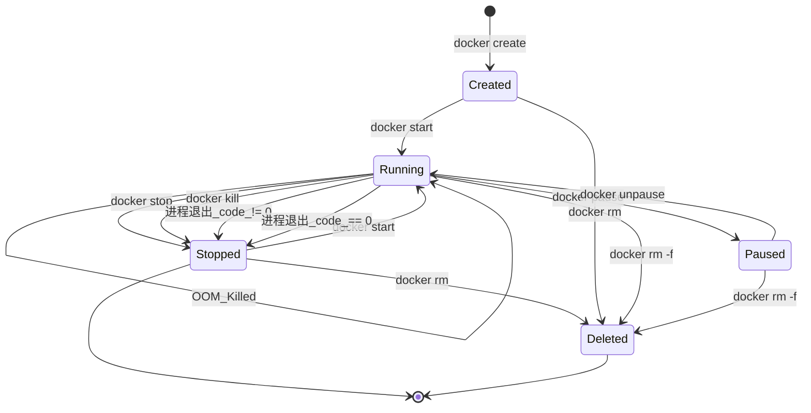
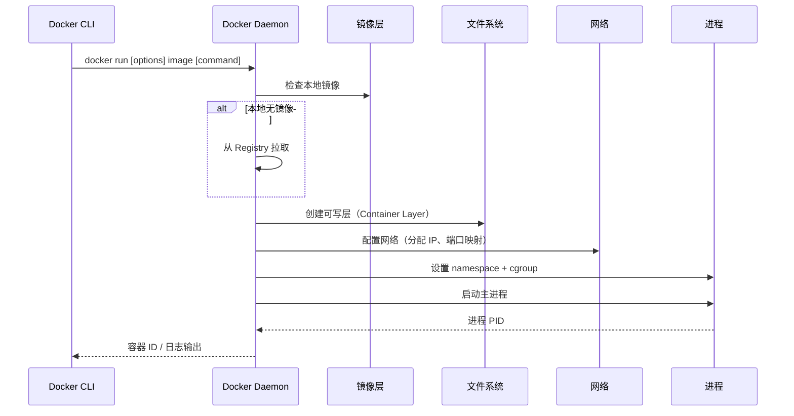
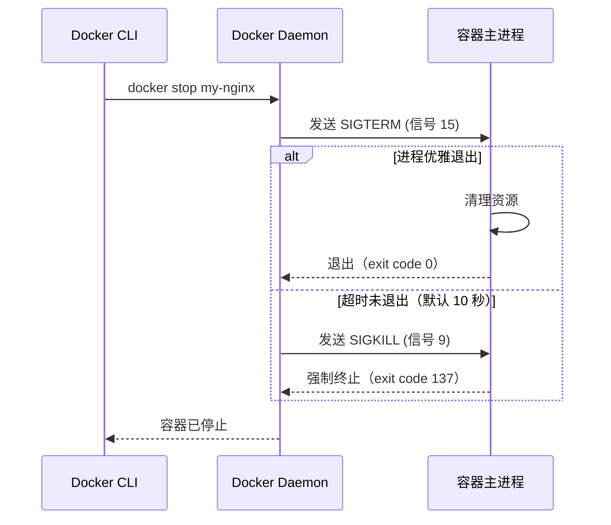
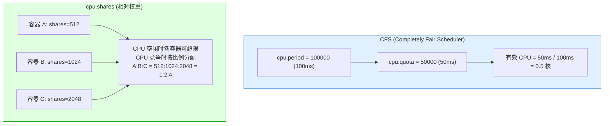
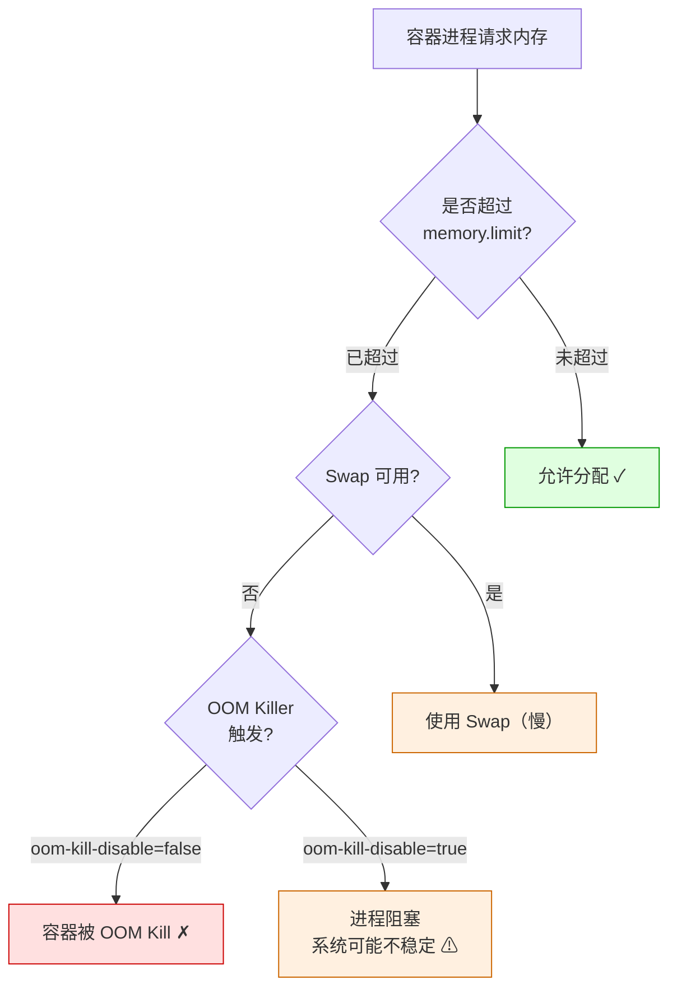
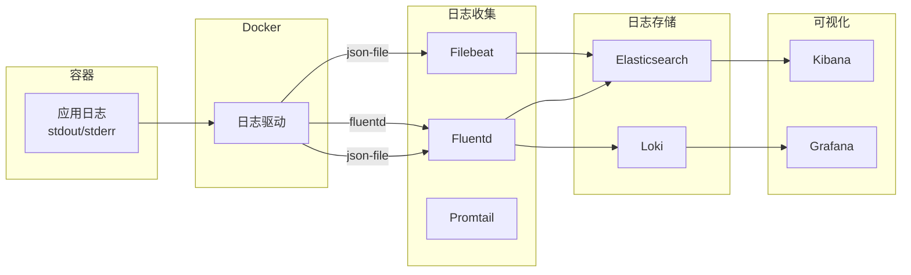
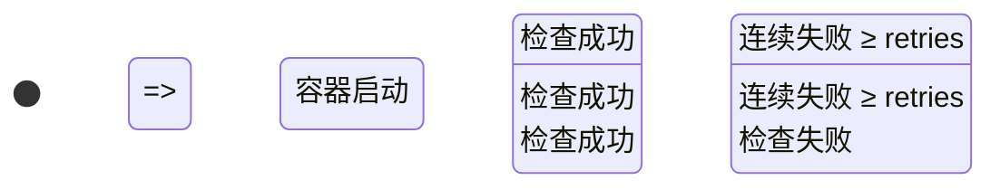
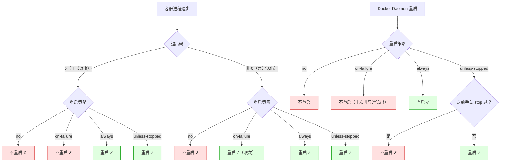
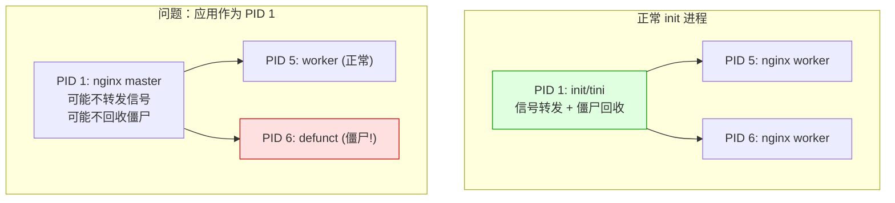

# 容器生命周期管理

容器是镜像的运行实例。从创建到删除，容器经历完整的状态流转；理解生命周期、掌握管理命令、合理配置资源与重启策略，是容器化运维的核心技能。

## 1. 容器生命周期

### 1.1 状态转换图



### 1.2 状态详解

| 状态 | 含义 | 特征 |
|------|------|------|
| **Created** | 已创建，未启动 | 文件系统已准备，进程未运行 |
| **Running** | 运行中 | 主进程正在执行，资源已分配 |
| **Paused** | 已暂停 | 进程被冻结（cgroup freezer），不占 CPU |
| **Stopped** | 已停止 | 主进程已退出，文件系统保留 |
| **Deleted** | 已删除 | 容器资源已清理 |

```bash
# 查看所有状态的容器
docker ps -a
# STATUS 列显示：
# Up 2 hours              → Running
# Up 2 hours (Paused)     → Paused
# Exited (0) 5 mins ago   → Stopped（正常退出）
# Exited (137) 1 min ago  → Stopped（被 SIGKILL）
# Created 10 mins ago     → Created

# 按状态过滤
docker ps --filter "status=running"
docker ps --filter "status=exited"
docker ps --filter "status=paused"
```

## 2. 容器创建与启动

### 2.1 docker run —— 创建并启动

`docker run` 是最常用的命令，等同于 `docker create` + `docker start`：



```bash
# 基本用法
docker run nginx:latest

# 常用选项组合
docker run \
  --name my-nginx \          # 容器名称
  -d \                       # 后台运行
  -p 8080:80 \               # 端口映射
  -v /data/html:/usr/share/nginx/html \  # 挂载卷
  -e ENV=production \        # 环境变量
  --restart always \         # 重启策略
  --memory 512m \            # 内存限制
  --cpus 1.5 \               # CPU 限制
  nginx:latest

# 前台交互运行
docker run -it ubuntu:22.04 /bin/bash

# 运行后自动删除
docker run --rm alpine echo "Hello"

# 指定主机名
docker run --hostname myhost alpine hostname

# 指定工作目录
docker run -w /app alpine pwd

# 指定用户
docker run -u nobody alpine id
```

### 2.2 docker run 常用选项分类

#### 网络选项

| 选项 | 作用 | 示例 |
|------|------|------|
| `-p host:container` | 端口映射 | `-p 8080:80` |
| `-p host::container` | 随机主机端口 | `-p ::80` |
| `-p 127.0.0.1:8080:80` | 绑定地址 | 只监听 localhost |
| `-P` | 映射所有 EXPOSE 端口 | 自动分配主机端口 |
| `--network` | 指定网络 | `--network my-net` |
| `--dns` | DNS 服务器 | `--dns 8.8.8.8` |
| `--hostname` | 容器主机名 | `--hostname web01` |
| `--add-host` | 添加 hosts 记录 | `--add-host db:10.0.0.1` |

#### 存储选项

| 选项 | 作用 | 示例 |
|------|------|------|
| `-v /host:/container` | 绑定挂载 | `-v /data:/app/data` |
| `-v name:/container` | 命名卷 | `-v pgdata:/var/lib/postgresql/data` |
| `-v /host:/container:ro` | 只读挂载 | 配置文件只读 |
| `--tmpfs /tmp` | tmpfs 挂载 | 临时文件存储 |

#### 资源选项

| 选项 | 作用 | 示例 |
|------|------|------|
| `--memory` / `-m` | 内存限制 | `--memory 512m` |
| `--memory-swap` | 内存+Swap 限制 | `--memory-swap 1g` |
| `--cpus` | CPU 核数限制 | `--cpus 1.5` |
| `--cpuset-cpus` | 绑定 CPU 核 | `--cpuset-cpus 0,1` |
| `--pids-limit` | 进程数限制 | `--pids-limit 100` |
| `--blkio-weight` | 块 IO 权重 | `--blkio-weight 500` |

### 2.3 docker create —— 仅创建

```bash
# 创建容器但不启动（适用于预配置）
docker create \
  --name my-nginx \
  -p 8080:80 \
  -v /data/html:/usr/share/nginx/html \
  nginx:latest

# 后续启动
docker start my-nginx

# create + start 等于 docker run
```

### 2.4 docker start —— 启动已停止的容器

```bash
# 启动已停止的容器
docker start my-nginx

# 启动并连接终端
docker start -ai my-nginx

# 启动多个容器
docker start container1 container2 container3
```

## 3. 容器停止与删除

### 3.1 docker stop —— 优雅停止

```bash
# 优雅停止（发送 SIGTERM，等待 10 秒后 SIGKILL）
docker stop my-nginx

# 自定义超时时间
docker stop -t 30 my-nginx  # 等待 30 秒

# 停止所有运行中的容器
docker stop $(docker ps -q)
```



### 3.2 docker kill —— 强制终止

```bash
# 直接发送 SIGKILL（无优雅退出）
docker kill my-nginx

# 发送其他信号
docker kill --signal SIGUSR1 my-nginx
docker kill --signal SIGHUP my-nginx
```

::: important stop vs kill 的选择
- **docker stop**：生产首选，给应用时间完成进行中的请求、关闭数据库连接、刷写缓存
- **docker kill**：应用无响应时使用，或测试场景中快速终止
- 对于需要优雅退出的应用（如数据库、消息队列），务必使用 `stop`
:::

### 3.3 docker restart —— 重启容器

```bash
# 重启容器（先 stop 再 start）
docker restart my-nginx

# 自定义超时
docker restart -t 30 my-nginx
```

### 3.4 docker rm —— 删除容器

```bash
# 删除已停止的容器
docker rm my-nginx

# 强制删除运行中的容器（先 kill 再删除）
docker rm -f my-nginx

# 删除容器同时删除匿名卷
docker rm -v my-nginx

# 删除所有已停止的容器
docker container prune

# 删除所有容器（包括运行中的）
docker rm -f $(docker ps -aq)

# 按条件删除
docker rm $(docker ps --filter "status=exited" -q)
docker rm $(docker ps --filter "label=env=test" -q)
```

## 4. 容器暂停与恢复

### 4.1 docker pause / unpause

```bash
# 暂停容器（冻结所有进程）
docker pause my-nginx

# 恢复容器
docker unpause my-nginx

# 查看暂停状态
docker inspect --format '{{.State.Status}}' my-nginx
# paused
```

::: tip pause 的实现原理
`docker pause` 使用 cgroup freezer 冻结容器内的所有进程。进程被冻结后不占用 CPU，但内存和文件系统状态完整保留。与 `stop` 的区别：
- `pause`：进程还在，只是被冻结；恢复后继续执行
- `stop`：进程退出；重新启动需要重新初始化
:::

## 5. 容器资源限制

### 5.1 CPU 限制

```bash
# 限制 CPU 核数（支持小数）
docker run --cpus 1.5 nginx:latest    # 最多使用 1.5 核
docker run --cpus 0.5 nginx:latest    # 最多使用 0.5 核

# 绑定到特定 CPU 核
docker run --cpuset-cpus 0 nginx:latest       # 只用第 0 核
docker run --cpuset-cpus 0,2,4 nginx:latest   # 使用第 0,2,4 核
docker run --cpuset-cpus 0-3 nginx:latest     # 使用第 0~3 核

# CPU 份额（相对权重，默认 1024）
docker run --cpu-shares 512 nginx:latest      # 低优先级
docker run --cpu-shares 2048 nginx:latest     # 高优先级

# CPU 周期限制
docker run --cpu-period 100000 --cpu-quota 50000 nginx:latest
# 每 100ms 周期中最多使用 50ms CPU（等同于 0.5 核）
```

#### CPU 限制原理



::: important --cpus vs --cpu-shares
- `--cpus`：硬限制，容器最多使用指定核数，即使 CPU 空闲也不能超限
- `--cpu-shares`：软限制，CPU 空闲时可超限使用，CPU 竞争时按比例分配
- 生产环境推荐使用 `--cpus` 硬限制
:::

### 5.2 内存限制

```bash
# 内存限制
docker run --memory 512m nginx:latest         # 限制 512 MB
docker run --memory 1g nginx:latest           # 限制 1 GB

# 内存 + Swap 限制
docker run --memory 512m --memory-swap 1g nginx:latest
# memory=512m, swap=1g-512m=512m → 内存 512m + swap 512m

# 禁止使用 Swap
docker run --memory 512m --memory-swap 512m nginx:latest
# memory-swap == memory → swap = 0

# 内存软限制（允许超限，但优先回收）
docker run --memory-reservation 256m --memory 512m nginx:latest

# OOM 时是否杀掉容器
docker run --oom-kill-disable=true --memory 512m nginx:latest
# 危险！可能导致系统不稳定

# 设置 OOM 优先级（-1000 到 1000，越小越不容易被杀）
docker run --oom-score-adj=-500 nginx:latest
```

#### 内存限制与 OOM



```bash
# 查看 OOM 事件
docker inspect --format '{{.State.OOMKilled}}' mycontainer
# true = 被 OOM Kill

# 查看内存使用
docker stats --no-stream mycontainer
# CONTAINER  NAME       CPU %  MEM USAGE / LIMIT   MEM %
# abc123     myapp      0.5%   256MiB / 512MiB     50.00%
```

### 5.3 PIDs 限制

```bash
# 限制容器内最大进程数
docker run --pids-limit 100 nginx:latest

# 防止 fork bomb
docker run --pids-limit 50 alpine:latest
# :(){ :|:& };:  ← fork bomb 将被限制
```

### 5.4 块 IO 限制

```bash
# 限制读写速率
docker run \
  --blkio-weight 500 \                              # IO 权重（100~1000）
  --device-read-bps /dev/sda:10mb \                 # 读速率限制
  --device-write-bps /dev/sda:10mb \                # 写速率限制
  --device-read-iops /dev/sda:1000 \                # 读 IOPS 限制
  --device-write-iops /dev/sda:1000 \               # 写 IOPS 限制
  nginx:latest
```

### 5.5 资源限制综合示例

```bash
# 生产环境 Web 服务容器
docker run -d \
  --name web-app \
  --cpus 2 \
  --cpuset-cpus 0-1 \
  --memory 1g \
  --memory-swap 1g \
  --memory-reservation 512m \
  --pids-limit 200 \
  --oom-score-adj=-100 \
  --restart unless-stopped \
  -p 8080:8080 \
  -v app-data:/app/data \
  -e SPRING_PROFILES_ACTIVE=prod \
  myapp:1.0.0
```

## 6. 容器环境变量与元数据

### 6.1 环境变量

```bash
# 设置环境变量
docker run -e MYSQL_ROOT_PASSWORD=secret mysql:8.0
docker run -e MYSQL_ROOT_PASSWORD -e MYSQL_DATABASE=mydb mysql:8.0

# 从文件加载环境变量
docker run --env-file .env myapp:latest

# .env 文件格式
cat > .env <<EOF
MYSQL_ROOT_PASSWORD=secret
MYSQL_DATABASE=mydb
MYSQL_USER=appuser
MYSQL_PASSWORD=apppass
EOF

# 查看容器环境变量
docker inspect --format '{{range .Config.Env}}{{println .}}{{end}}' mycontainer
docker exec mycontainer env
```

::: warning 环境变量中的敏感信息
环境变量可被 `docker inspect` 和 `/proc/<pid>/environ` 查看到，不适合存储密码等敏感信息。推荐使用：
- Docker Secrets（Swarm 模式）
- Kubernetes Secrets
- 挂载配置文件
- 运行时通过 Secret 管理工具注入
:::

### 6.2 标签（Labels）

```bash
# 添加标签
docker run \
  --label env=production \
  --label version=1.0.0 \
  --label maintainer=team@example.com \
  nginx:latest

# 按标签过滤
docker ps --filter "label=env=production"
docker ps --filter "label=version=1.0.0"

# 查看标签
docker inspect --format '{{json .Config.Labels}}' mycontainer | python3 -m json.tool
```

### 6.3 hostname 与 hosts

```bash
# 设置主机名
docker run --hostname web01 nginx:latest

# 添加 hosts 记录
docker run --add-host db.internal:10.0.0.1 nginx:latest
docker run --add-host api.internal:10.0.0.2 nginx:latest

# 使用主机 DNS
docker run --dns 8.8.8.8 --dns 8.8.4.4 nginx:latest

# 禁用 DNS
docker run --dns-search=. nginx:latest
```

## 7. 进入容器

### 7.1 docker exec —— 在运行中容器执行命令

```bash
# 进入交互式终端
docker exec -it mycontainer /bin/bash
docker exec -it mycontainer /bin/sh  # Alpine 无 bash

# 执行单条命令
docker exec mycontainer ls /app
docker exec mycontainer cat /etc/hostname
docker exec mycontainer python -c "print('hello')"

# 以指定用户执行
docker exec -u root mycontainer apt-get update
docker exec -u nobody mycontainer whoami

# 指定工作目录
docker exec -w /app mycontainer ls

# 设置环境变量
docker exec -e DEBUG=true mycontainer python app.py

# 后台执行
docker exec -d mycontainer python background_task.py
```

### 7.2 docker attach —— 连接到主进程

```bash
# 连接到容器主进程的 stdin/stdout/stderr
docker attach mycontainer

# 退出但不停止容器：Ctrl+P, Ctrl+Q
# 退出并停止容器：Ctrl+C
```

::: important exec vs attach 的区别
| 对比 | `docker exec` | `docker attach` |
|------|--------------|-----------------|
| 创建进程 | 新进程 | 连接到主进程 |
| 退出影响 | 不影响主进程 | Ctrl+C 会停止主进程 |
| 多会话 | 支持 | 共享同一会话 |
| 使用场景 | 调试、运维 | 查看主进程输出 |
| 推荐程度 | 日常首选 | 特定场景 |
:::

### 7.3 nsenter —— 使用 namespace 进入

```bash
# 获取容器 PID
PID=$(docker inspect --format '{{.State.Pid}}' mycontainer)

# 进入容器网络命名空间
nsenter -t $PID -n ip addr

# 进入容器所有命名空间
nsenter -t $PID -m -u -i -n -p /bin/bash

# 只进入挂载命名空间
nsenter -t $PID -m ls /app

# 只进入网络命名空间（网络排障常用）
nsenter -t $PID -n tcpdump -i eth0
nsenter -t $PID -n netstat -tlnp
```

::: tip nsenter 的优势
- 不需要容器内有 `bash` 或 `sh`（直接使用宿主工具）
- 可以只进入特定 namespace（如仅网络命名空间做排障）
- 适用于极简镜像（如 distroless 镜像无 shell，`exec` 无法使用）
:::

## 8. 容器日志

### 8.1 docker logs —— 查看日志

```bash
# 查看全部日志
docker logs mycontainer

# 实时跟踪日志
docker logs -f mycontainer

# 显示最后 N 行
docker logs --tail 100 mycontainer

# 显示时间戳
docker logs -t mycontainer

# 显示指定时间之后的日志
docker logs --since "2024-01-15T10:00:00" mycontainer
docker logs --since 30m mycontainer  # 最近 30 分钟

# 显示指定时间范围
docker logs --since "2024-01-15T10:00:00" \
            --until "2024-01-15T11:00:00" \
            mycontainer

# 组合使用
docker logs -f --tail 50 mycontainer
```

### 8.2 日志驱动

Docker 支持多种日志驱动：

| 驱动 | 说明 | 适用场景 |
|------|------|---------|
| `json-file` | 默认，JSON 格式本地文件 | 单机开发/测试 |
| `local` | 优化的本地存储，自动轮转 | 生产单机 |
| `syslog` | 发送到 syslog 守护进程 | 集中式日志 |
| `journald` | 发送到 systemd journal | systemd 系统 |
| `fluentd` | 发送到 Fluentd | 日志收集管道 |
| `awslogs` | 发送到 AWS CloudWatch | AWS 环境 |
| `gcplogs` | 发送到 Google Cloud Logging | GCP 环境 |
| `none` | 禁用日志 | 不需要日志的场景 |

```bash
# 配置默认日志驱动
# /etc/docker/daemon.json
{
  "log-driver": "json-file",
  "log-opts": {
    "max-size": "10m",
    "max-file": "3"
  }
}

# 使用 local 驱动（推荐生产使用）
{
  "log-driver": "local",
  "log-opts": {
    "max-size": "10m",
    "max-file": "5"
  }
}

# 容器级别覆盖日志驱动
docker run \
  --log-driver json-file \
  --log-opt max-size=10m \
  --log-opt max-file=3 \
  nginx:latest

# 禁用日志
docker run --log-driver none nginx:latest
```

### 8.3 日志轮转与清理

```bash
# 查看 Docker 日志文件位置
docker inspect --format '{{.LogPath}}' mycontainer
# /var/lib/docker/containers/<id>/<id>-json.log

# 查看日志文件大小
ls -lh /var/lib/docker/containers/*/*-json.log

# 手动清理日志（不推荐，应配置轮转）
truncate -s 0 /var/lib/docker/containers/*/*-json.log

# 推荐方式：配置日志轮转
# /etc/docker/daemon.json
{
  "log-driver": "json-file",
  "log-opts": {
    "max-size": "10m",   # 单个日志文件最大 10MB
    "max-file": "3"      # 最多保留 3 个文件
  }
}
```

::: warning 日志磁盘占满
不配置日志轮转，容器日志可能无限增长占满磁盘。这是生产环境最常见的 Docker 事故之一。务必在 `daemon.json` 中配置 `max-size` 和 `max-file`。
:::

### 8.4 集中式日志方案



## 9. 容器健康检查

### 9.1 HEALTHCHECK 指令

```dockerfile
# Dockerfile 中的健康检查
HEALTHCHECK --interval=30s --timeout=3s --start-period=5s --retries=3 \
  CMD curl -f http://localhost:8080/health || exit 1
```

| 参数 | 含义 | 默认值 |
|------|------|--------|
| `--interval` | 检查间隔 | 30s |
| `--timeout` | 单次检查超时 | 30s |
| `--start-period` | 启动宽限期 | 0s |
| `--retries` | 连续失败次数后标记 unhealthy | 3 |

```bash
# 运行时指定健康检查
docker run -d \
  --name myapp \
  --health-cmd "curl -f http://localhost:8080/health || exit 1" \
  --health-interval 30s \
  --health-timeout 3s \
  --health-start-period 10s \
  --health-retries 3 \
  myapp:latest

# 禁用健康检查
docker run --no-healthcheck myapp:latest

# 查看健康状态
docker inspect --format '{{.State.Health.Status}}' myapp
# healthy / unhealthy / starting

# 查看健康检查历史
docker inspect --format '{{json .State.Health}}' myapp | python3 -m json.tool
```

### 9.2 健康状态流转



### 9.3 常用健康检查脚本

```dockerfile
# Web 服务：HTTP 检查
HEALTHCHECK --interval=10s --timeout=3s --retries=3 \
  CMD curl -f http://localhost:80/ || exit 1

# 数据库：连接检查
HEALTHCHECK --interval=10s --timeout=5s --retries=5 \
  CMD pg_isready -U postgres || exit 1

# Redis：PING 检查
HEALTHCHECK --interval=10s --timeout=3s --retries=3 \
  CMD redis-cli ping || exit 1

# MySQL：连接检查
HEALTHCHECK --interval=10s --timeout=5s --retries=5 \
  CMD mysqladmin ping -h localhost -u root -p${MYSQL_ROOT_PASSWORD} || exit 1

# 应用无 curl 时：使用 wget
HEALTHCHECK --interval=30s --timeout=3s --retries=3 \
  CMD wget -q --spider http://localhost:8080/health || exit 1

# 极简检查：检查端口监听
HEALTHCHECK --interval=30s --timeout=3s --retries=3 \
  CMD python -c "import socket; s=socket.socket(); s.connect(('localhost',8080)); s.close()" || exit 1
```

::: important 健康检查最佳实践
- 检查端点应轻量快速，不做重计算
- `--start-period` 要大于应用启动时间
- 检查间隔不宜过短（避免给应用增加负担）
- 健康检查失败不等于容器重启（需配合 `--restart` 策略）
- 在 Kubernetes 中，健康检查对应 livenessProbe 和 readinessProbe
:::

## 10. 容器重启策略

### 10.1 四种重启策略

| 策略 | 行为 | 适用场景 |
|------|------|---------|
| `no` | 不自动重启（默认） | 一次性任务、CI/CD |
| `on-failure[:max]` | 非零退出时重启，可限制次数 | 需要区分正常/异常退出 |
| `always` | 总是重启（包括 Daemon 重启后） | 核心服务 |
| `unless-stopped` | 总是重启，除非手动停止 | 通用生产策略 |

```bash
# 不重启
docker run --restart no alpine echo "hello"

# 异常退出时重启（最多 5 次）
docker run --restart on-failure:5 myapp:latest

# 总是重启
docker run --restart always nginx:latest

# 除非手动停止
docker run --restart unless-stopped nginx:latest
```

### 10.2 重启策略行为对比



### 10.3 重启延迟策略

Docker 在连续重启时采用指数退避策略：

```
第 1 次重启：等待 100ms
第 2 次重启：等待 200ms
第 3 次重启：等待 400ms
...
最长等待：60s
```

```bash
# 查看重启次数
docker inspect --format '{{.RestartCount}}' mycontainer

# 查看上次重启时间
docker inspect --format '{{.State.StartedAt}}' mycontainer

# 查看重启策略
docker inspect --format '{{.HostConfig.RestartPolicy.Name}}' mycontainer

# 更新运行中容器的重启策略
docker update --restart=always mycontainer
```

## 11. 容器时区与字符集

### 11.1 时区配置

```bash
# 方式一：环境变量（最简单）
docker run -e TZ=Asia/Shanghai nginx:latest

# 方式二：挂载宿主时区文件
docker run -v /etc/localtime:/etc/localtime:ro nginx:latest

# 方式三：同时挂载时区文件和时区名
docker run \
  -v /etc/localtime:/etc/localtime:ro \
  -e TZ=Asia/Shanghai \
  nginx:latest

# 验证
docker exec mycontainer date
docker exec mycontainer cat /etc/timezone
```

### 11.2 字符集配置

```bash
# 设置字符集
docker run -e LANG=C.UTF-8 -e LC_ALL=C.UTF-8 python:3.11

# Dockerfile 中设置
# ENV LANG=C.UTF-8
# ENV LC_ALL=C.UTF-8
```

## 12. init 进程与僵尸进程

### 12.1 PID 1 问题

容器内主进程的 PID 为 1，承担两个特殊职责：
1. **信号处理**：接收 SIGTERM 等信号并转发给子进程
2. **僵尸进程回收**：回收子进程的退出状态



### 12.2 使用 --init 参数

```bash
# 使用 Docker 内置的 tini-init
docker run --init nginx:latest

# --init 会在容器内插入 tini 作为 PID 1
# 应用进程成为 PID 1 的子进程
```

### 12.3 在 Dockerfile 中使用 tini

```dockerfile
# 安装 tini
FROM alpine:3.18
RUN apk add --no-cache tini

# 使用 tini 作为入口
ENTRYPOINT ["/sbin/tini", "--"]
CMD ["nginx", "-g", "daemon off;"]
```

::: important 何时需要 init 进程？
- 容器内会产生子进程（如 shell 脚本启动多进程）
- 需要优雅退出（SIGTERM 转发）
- 出现僵尸进程堆积问题

不需要 init 的情况：
- 单进程应用（如 Go 二进制直接运行）
- 应用自身处理信号和僵尸回收（如 Nginx master）
:::

## 13. 容器前台与后台运行

### 13.1 运行模式

```bash
# 前台运行（-it）：交互式使用
docker run -it ubuntu:22.04 /bin/bash
# 终端直接连接到容器 stdin
# Ctrl+D 或 exit 退出后容器停止

# 后台运行（-d）：服务模式
docker run -d nginx:latest
# 容器在后台运行，返回容器 ID
# 通过 docker logs 查看输出

# 前台运行但不交互：查看输出
docker run nginx:latest
# 直接在终端显示 stdout/stderr
# Ctrl+C 停止容器
```

### 13.2 后台容器的日志与连接

```bash
# 启动后台容器
docker run -d --name my-nginx nginx:latest

# 查看日志
docker logs my-nginx
docker logs -f my-nginx  # 实时跟踪

# 连接到主进程
docker attach my-nginx
# Ctrl+P, Ctrl+Q 退出但不停止

# 进入新终端
docker exec -it my-nginx /bin/bash
```

### 13.3 容器长时间运行的条件

容器的主进程退出，容器就停止。保持容器运行的方式：

```bash
# 方式一：运行常驻进程
docker run -d nginx:latest                    # nginx 前台运行
docker run -d redis:7-alpine                  # redis-server 前台运行

# 方式二：交互式保持
docker run -it alpine /bin/sh                 # shell 前台运行

# 方式三：tail -f 保持（不推荐）
docker run -d alpine tail -f /dev/null

# 方式四：sleep infinity（基础镜像场景）
docker run -d alpine sleep infinity
```

## 14. 容器更新与信息查看

### 14.1 docker update —— 更新资源限制

```bash
# 更新内存限制
docker update --memory 1g --memory-swap 1g mycontainer

# 更新 CPU 限制
docker update --cpus 2 mycontainer

# 更新 CPU 份额
docker update --cpu-shares 2048 mycontainer

# 更新重启策略
docker update --restart=always mycontainer

# 批量更新
docker update --cpus 1 --memory 512m container1 container2 container3
```

### 14.2 docker stats —— 资源使用统计

```bash
# 实时监控所有容器
docker stats

# 监控指定容器
docker stats mycontainer

# 只显示一次（不刷新）
docker stats --no-stream

# 自定义格式
docker stats --format "table {{.Name}}\t{{.CPUPerc}}\t{{.MemUsage}}"

# 输出字段说明
# CONTAINER ID  NAME       CPU %  MEM USAGE / LIMIT   MEM %  NET I/O     BLOCK I/O   PIDS
# abc123        myapp      0.5%   256MiB / 512MiB     50%    5.2kB / 3kB  12MB / 0B   15
```

### 14.3 docker top —— 查看容器进程

```bash
# 查看容器内进程
docker top mycontainer

# 查看完整命令
docker top mycontainer aux

# 查看指定用户进程
docker top mycontainer -u root
```

### 14.4 docker port —— 查看端口映射

```bash
# 查看容器端口映射
docker port mycontainer
# 80/tcp -> 0.0.0.0:8080
# 443/tcp -> 0.0.0.0:8443

# 查看指定端口
docker port mycontainer 80
```

## 15. 常见问题排查

### 15.1 容器立即退出

```bash
# 查看退出码
docker inspect --format '{{.State.ExitCode}}' mycontainer

# 常见退出码
# 0    : 正常退出
# 1    : 应用错误
# 137  : 被 SIGKILL（OOM Kill 或 docker kill）
# 139  : 段错误（Segmentation Fault）
# 143  : 被 SIGTERM（docker stop）
# 125  : Docker Daemon 错误
# 126  : 命令无法执行
# 127  : 命令未找到

# 查看退出日志
docker logs mycontainer

# 查看退出详情
docker inspect mycontainer | python3 -m json.tool
```

### 15.2 容器频繁重启

```bash
# 查看重启次数和时间
docker inspect --format '{{.RestartCount}} times, last at {{.State.StartedAt}}' mycontainer

# 常见原因
# 1. 应用启动失败 → 查看日志
# 2. OOM Kill → 查看内存限制
# 3. 健康检查失败 → 检查 HEALTHCHECK 配置
# 4. 依赖服务不可用 → 检查网络和依赖
```

### 15.3 容器内无法解析域名

```bash
# 检查容器 DNS
docker exec mycontainer cat /etc/resolv.conf

# 指定 DNS
docker run --dns 8.8.8.8 --dns 114.114.114.114 nginx:latest

# 使用宿主 DNS
# /etc/docker/daemon.json
{
  "dns": ["8.8.8.8", "114.114.114.114"]
}
```

### 15.4 容器内时间不正确

```bash
# 检查容器时间
docker exec mycontainer date

# 修复时区
docker run -e TZ=Asia/Shanghai -v /etc/localtime:/etc/localtime:ro nginx:latest
```

## 16. 命令速查表

| 命令 | 用途 | 常用选项 |
|------|------|---------|
| `docker run` | 创建并启动容器 | `-d`, `-it`, `--name`, `-p`, `-v`, `-e`, `--restart` |
| `docker create` | 仅创建容器 | 同 `run` |
| `docker start` | 启动已停止的容器 | `-ai` |
| `docker stop` | 优雅停止 | `-t` |
| `docker kill` | 强制终止 | `--signal` |
| `docker restart` | 重启 | `-t` |
| `docker rm` | 删除容器 | `-f`, `-v` |
| `docker pause` | 暂停 | — |
| `docker unpause` | 恢复 | — |
| `docker exec` | 在容器内执行命令 | `-it`, `-u`, `-w`, `-e`, `-d` |
| `docker attach` | 连接主进程 | — |
| `docker logs` | 查看日志 | `-f`, `--tail`, `--since`, `--until`, `-t` |
| `docker inspect` | 查看详情 | `--format` |
| `docker stats` | 资源统计 | `--no-stream`, `--format` |
| `docker top` | 查看进程 | — |
| `docker port` | 查看端口映射 | — |
| `docker update` | 更新资源限制 | `--cpus`, `--memory`, `--restart` |
| `docker diff` | 查看文件变更 | — |
| `docker cp` | 复制文件 | — |
| `docker rename` | 重命名容器 | — |
| `docker wait` | 等待容器退出 | — |
| `docker export` | 导出文件系统 | `-o` |
| `docker commit` | 从容器创建镜像 | `-m`, `-a` |

::: tip 下一步
掌握容器生命周期管理后，继续学习 [04 · 网络与存储](04_网络与存储.md)，了解 Docker 网络模式与数据持久化方案。
:::
