# 网络与存储

容器的价值在于运行应用，而应用离不开网络通信与数据持久化。Docker 提供了灵活的网络模型和多种存储方案，理解其原理与选型，是构建可靠容器化架构的关键。

## 1. Docker 网络模型

### 1.1 网络架构概览

Docker 基于 Linux 网络虚拟化技术（Network Namespace、veth pair、bridge、iptables）构建容器网络：

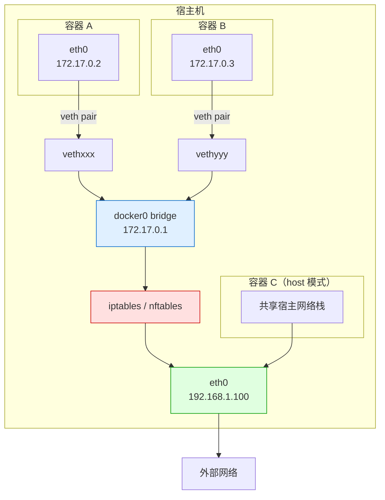

### 1.2 核心网络组件

| 组件 | 作用 | 说明 |
|------|------|------|
| **Network Namespace** | 网络隔离 | 每个容器独立的网络栈 |
| **veth pair** | 虚拟网线 | 连接容器 namespace 与 bridge |
| **bridge** | 虚拟交换机 | docker0 默认网桥 |
| **iptables** | NAT 与端口映射 | 实现容器访问外网和端口映射 |

## 2. Docker 网络模式

### 2.1 五种网络模式

| 模式 | 参数 | 特点 | 适用场景 |
|------|------|------|---------|
| **bridge** | `--network bridge` | 默认模式，容器通过网桥通信 | 单机容器通信 |
| **host** | `--network host` | 共享宿主网络栈，无隔离 | 高性能网络、监控 |
| **none** | `--network none` | 无网络，只有 lo 接口 | 安全隔离、离线计算 |
| **overlay** | `--network overlay` | 跨主机容器通信 | Docker Swarm / 多主机 |
| **macvlan** | `--network macvlan` | 容器拥有独立 MAC 地址 | 网络直通、遗留系统 |

```mermaid
flowchart TB
    subgraph BridgeMode["bridge 模式"]
        B_C1["容器 A<br/>172.17.0.2"]
        B_C2["容器 B<br/>172.17.0.3"]
        B_Br["docker0<br/>172.17.0.1"]
        B_C1 --> B_Br
        B_C2 --> B_Br
        B_Br --> B_Host["宿主 eth0"]
    end

    subgraph HostMode["host 模式"]
        H_C1["容器 C<br/>共享宿主网络栈"]
        H_Host["宿主 eth0<br/>192.168.1.100"]
        H_C1 -.->|"无隔离"| H_Host
    end

    subgraph NoneMode["none 模式"]
        N_C1["容器 D<br/>只有 lo"]
        N_Lo["127.0.0.1"]
        N_C1 --> N_Lo
    end

    subgraph OverlayMode["overlay 模式"]
        O_C1["容器 E<br/>10.0.0.2"]
        O_C2["容器 F<br/>10.0.0.3"]
        O_Br["overlay 网桥"]
        O_C1 --> O_Br
        O_C2 --> O_Br
        O_Br -->|"跨主机隧道"| O_Remote["远程主机"]
    end

    subgraph MacvlanMode["macvlan 模式"]
        M_C1["容器 G<br/>192.168.1.101"]
        M_C2["容器 H<br/>192.168.1.102"]
        M_Host["宿主 eth0"]
        M_C1 --> M_Host
        M_C2 --> M_Host
    end

    style BridgeMode fill:#e0f0ff,stroke:#0066cc
    style HostMode fill:#e0ffe0,stroke:#009900
    style NoneMode fill:#f0f0f0,stroke:#999
    style OverlayMode fill:#ffe0e0,stroke:#cc0000
    style MacvlanMode fill:#fff0e0,stroke:#cc6600
```

### 2.2 bridge 模式详解

bridge 是 Docker 默认网络模式，也是单机容器通信的核心：

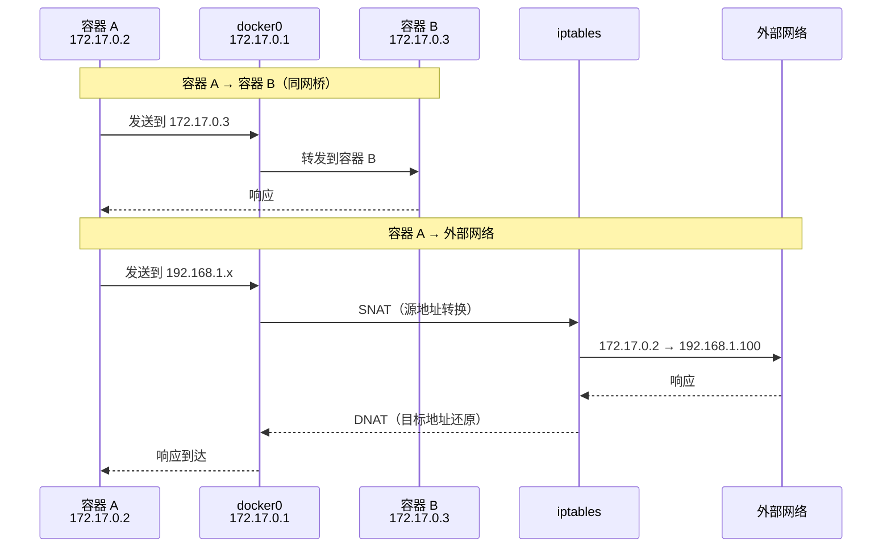

```bash
# 查看默认 bridge 网络
docker network inspect bridge

# 使用默认 bridge
docker run -d --name container-a nginx:latest
docker run -d --name container-b nginx:latest

# 默认 bridge 中容器只能通过 IP 通信（无 DNS）
docker exec container-a curl 172.17.0.3  # 通过 IP 访问 container-b
docker exec container-a ping container-b  # 失败！无 DNS 解析
```

::: important 默认 bridge 的局限
- 容器间只能通过 IP 通信，不支持自动 DNS 解析
- `--link` 已弃用，不推荐使用
- 所有容器在同一网桥，无法按服务分组隔离
- 推荐使用**自定义 bridge 网络**替代默认 bridge
:::

### 2.3 自定义 bridge 网络与 DNS

自定义 bridge 网络提供自动 DNS 解析，容器可通过名称互访：

```bash
# 创建自定义网络
docker network create my-network

# 指定子网
docker network create --subnet 172.20.0.0/16 my-network

# 指定网关和 IP 范围
docker network create \
  --subnet 172.20.0.0/16 \
  --gateway 172.20.0.1 \
  --ip-range 172.20.0.0/24 \
  my-network

# 在自定义网络中启动容器
docker run -d --name web --network my-network nginx:latest
docker run -d --name api --network my-network myapp:latest

# 自动 DNS 解析！
docker exec web curl http://api:8080    # 通过容器名访问
docker exec web ping api                # 通过容器名 ping
```

#### 自定义 bridge 网络的优势

| 特性 | 默认 bridge | 自定义 bridge |
|------|-----------|--------------|
| 容器间 DNS 解析 | 不支持 | 自动支持 |
| 容器名互访 | 不支持 | 支持 |
| 网络隔离 | 所有容器同网络 | 按网络分组隔离 |
| 动态连接 | 不支持 | 运行中容器可加入/离开 |
| IP 地址指定 | 不支持 | 支持 `--ip` |

```bash
# 运行中容器加入网络
docker network connect my-network container-x

# 运行中容器离开网络
docker network disconnect my-network container-x

# 一个容器连接多个网络
docker run -d --name app \
  --network frontend \
  nginx:latest
docker network connect backend app
# app 同时在 frontend 和 backend 两个网络中

# 指定容器 IP
docker run -d --name db \
  --network my-network \
  --ip 172.20.0.100 \
  mysql:8.0
```

### 2.4 host 模式详解

```bash
# host 模式：容器直接使用宿主网络栈
docker run -d --network host nginx:latest

# 容器内网络与宿主完全一致
docker exec <container> ip addr
# 看到的是宿主的网络接口

# 端口不需要映射（直接使用宿主端口）
# -p 参数在 host 模式下无效
docker run -d --network host nginx:latest
curl http://localhost:80  # 直接访问宿主 80 端口
```

::: warning host 模式注意事项
- 端口冲突风险：多个容器不能使用相同端口
- 安全性降低：容器可访问宿主所有网络接口
- 适用场景：性能敏感应用、网络监控工具、需要访问宿主网络的场景
- 不适用于需要网络隔离的多租户环境
:::

### 2.5 none 模式详解

```bash
# none 模式：完全无网络
docker run -d --network none alpine sleep infinity

# 只有 loopback 接口
docker exec <container> ip addr
# 1: lo: <LOOPBACK,UP> 127.0.0.1/8

# 适用场景
# - 安全敏感计算（无需网络）
# - 离线数据处理
# - 自行配置网络的基线
```

### 2.6 overlay 模式详解

overlay 网络实现跨主机容器通信，主要用于 Docker Swarm 和多主机集群：

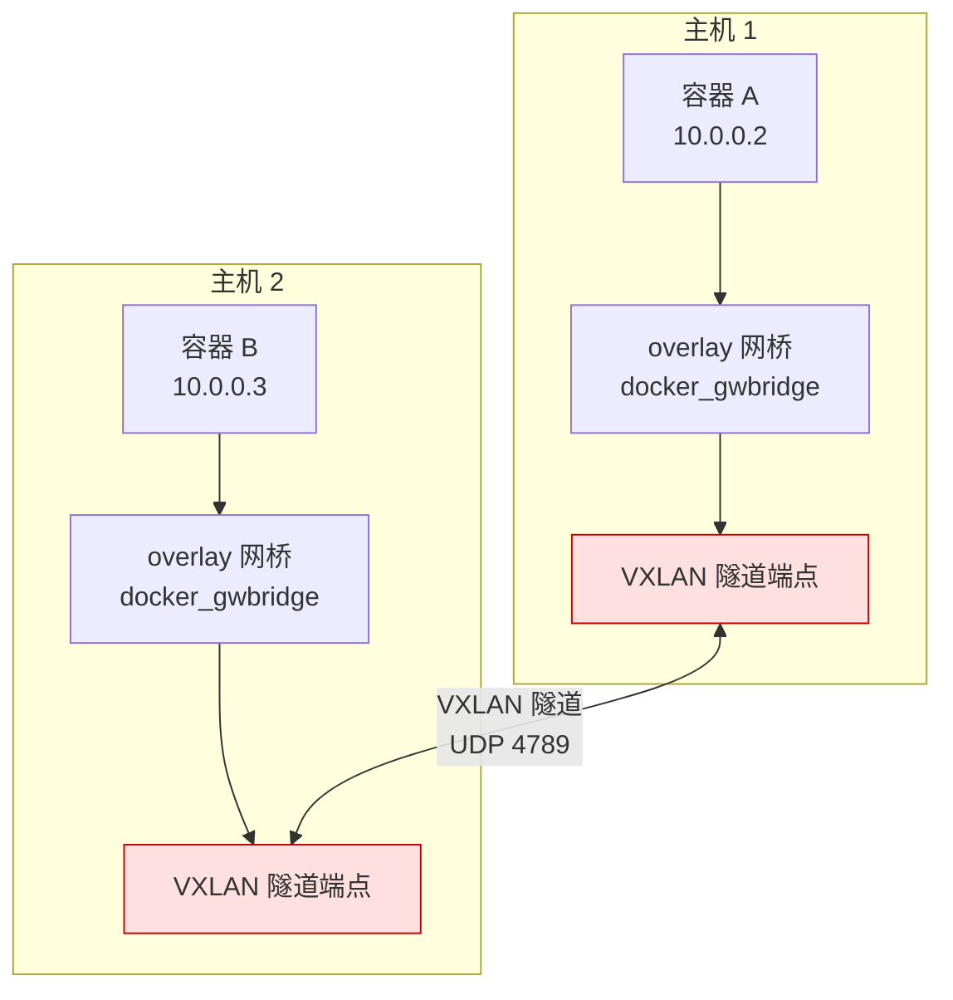

```bash
# 创建 overlay 网络（需要 Swarm 模式）
docker network create -d overlay my-overlay

# 带加密的 overlay
docker network create -d overlay --opt encrypted my-overlay

# Swarm 服务使用 overlay
docker service create \
  --name web \
  --network my-overlay \
  -p 8080:80 \
  nginx:latest

# 查看 overlay 网络
docker network inspect my-overlay
```

### 2.7 macvlan 模式详解

macvlan 为容器分配真实 MAC 地址，容器直接出现在物理网络中：

```bash
# 创建 macvlan 网络
docker network create -d macvlan \
  --subnet 192.168.1.0/24 \
  --gateway 192.168.1.1 \
  -o parent=eth0 \
  macvlan-net

# 启动容器
docker run -d --network macvlan-net \
  --ip 192.168.1.200 \
  nginx:latest

# 容器获得独立 IP，对物理网络可见
```

::: warning macvlan 限制
- **宿主与容器无法通信**：macvlan 导致宿主无法直接 ping 通同网卡的 macvlan 容器（内核安全限制）
- **MAC 地址耗尽**：交换机 MAC 表有限，大量容器可能导致 MAC 溢出
- **需要交换机支持**：交换机需允许同一端口多 MAC
- 适用于：遗留系统对接、网络监控、需要真实网络 IP 的场景
:::

## 3. 容器间通信原理

### 3.1 同一 bridge 网络通信

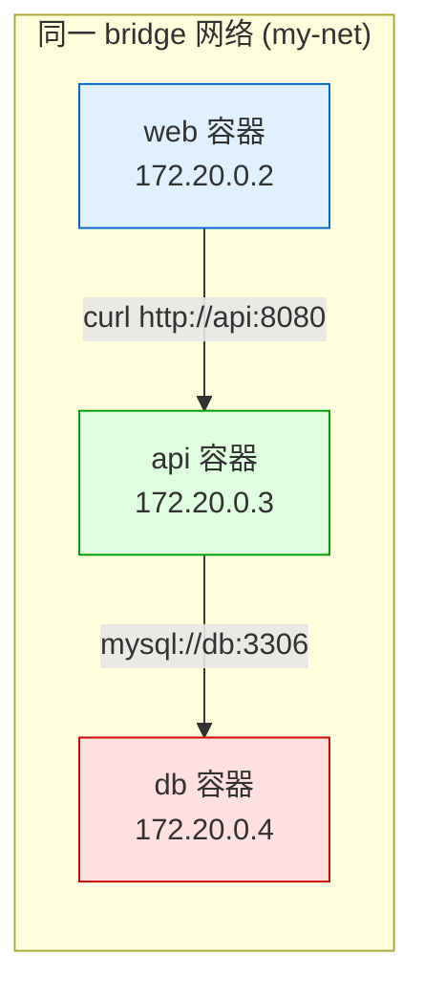

```bash
# 创建网络并启动服务
docker network create app-net

docker run -d --name db --network app-net \
  -e MYSQL_ROOT_PASSWORD=secret mysql:8.0

docker run -d --name api --network app-net \
  -e DB_HOST=db myapp:latest

docker run -d --name web --network app-net \
  -e API_HOST=api nginx:latest

# 容器间通过名称互访
docker exec api ping db      # ✓
docker exec web ping api     # ✓
docker exec web ping db      # ✓（同一网络内可达）
```

### 3.2 跨网络通信

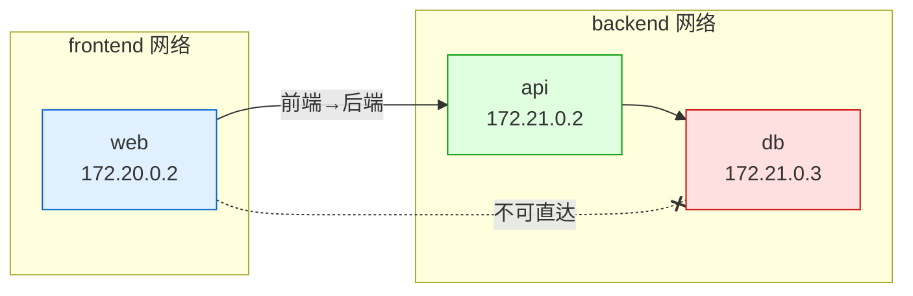

```bash
# 创建前后端网络
docker network create frontend
docker network create backend

# API 同时在两个网络中
docker run -d --name api \
  --network backend \
  myapp:latest

docker network connect frontend api

# Web 只在前端网络
docker run -d --name web \
  --network frontend \
  nginx:latest

# DB 只在后端网络
docker run -d --name db \
  --network backend \
  mysql:8.0

# 通信关系
# web → api     ✓ (同在 frontend)
# api → db      ✓ (同在 backend)
# web → db      ✗ (不在同一网络)
```

### 3.3 DNS 解析机制

Docker 内置 DNS 服务器（127.0.0.11）为自定义网络中的容器提供名称解析：

```bash
# 查看容器 DNS 配置
docker exec mycontainer cat /etc/resolv.conf
# nameserver 127.0.0.11
# options ndots:0

# DNS 解析流程
docker exec mycontainer nslookup api
# Server: 127.0.0.11
# Address: 127.0.0.11:53
# Name: api
# Address: 172.20.0.3

# 网络别名
docker run -d --name my-api \
  --network my-net \
  --network-alias api-service \
  --network-alias backend \
  myapp:latest

# 通过别名访问
docker exec web curl http://api-service:8080
docker exec web curl http://backend:8080
```

## 4. 端口映射

### 4.1 端口映射原理

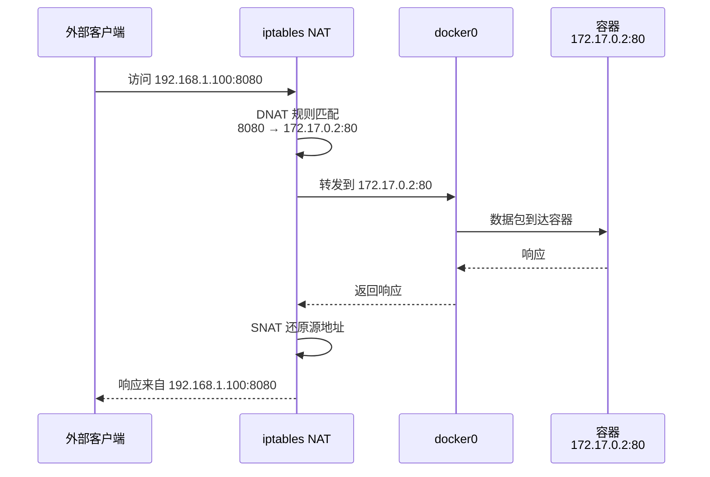

### 4.2 端口映射方式

```bash
# 映射指定端口
docker run -p 8080:80 nginx:latest
# 宿主 8080 → 容器 80

# 映射到指定地址
docker run -p 127.0.0.1:8080:80 nginx:latest
# 只监听 localhost

# 随机主机端口
docker run -p ::80 nginx:latest
docker run -P nginx:latest  # 映射所有 EXPOSE 端口

# 映射 UDP 端口
docker run -p 53:53/udp dnsmasq:latest

# 映射多个端口
docker run -p 8080:80 -p 8443:443 nginx:latest

# 查看端口映射
docker port mycontainer
# 80/tcp -> 0.0.0.0:8080
# 443/tcp -> 0.0.0.0:8443

# 查看随机分配的端口
docker port mycontainer 80
# 0.0.0.0:32768
```

::: important 端口映射与防火墙
Docker 通过 iptables 规则实现端口映射，这些规则**绕过** ufw/firewalld 等防火墙。即使防火墙阻止了端口，Docker 映射的端口仍然可达。解决方式：
- 使用 `--ip` 绑定到内网地址
- 在 daemon.json 中设置 `"iptables": false`（需手动管理规则）
- 使用 Docker 的 `userland-proxy: false` 减少 proxy 开销
:::

## 5. 网络排障

### 5.1 常用排障命令

```bash
# 查看所有网络
docker network ls
# NETWORK ID   NAME      DRIVER    SCOPE
# abc123       bridge    bridge    local
# def456       host      host      local
# ghi789       none      null      local

# 查看网络详情
docker network inspect my-network

# 查看容器网络配置
docker inspect --format '{{json .NetworkSettings}}' mycontainer | python3 -m json.tool

# 进入容器网络命名空间排障
PID=$(docker inspect --format '{{.State.Pid}}' mycontainer)
nsenter -t $PID -n ip addr
nsenter -t $PID -n ip route
nsenter -t $PID -n iptables -L

# 从宿主抓包
tcpdump -i docker0 -nn port 80
tcpdump -i vethxxx -nn  # 抓特定容器的包

# 从容器内抓包
docker exec mycontainer tcpdump -i eth0 -nn port 80
```

### 5.2 常见网络问题

| 问题 | 原因 | 解决方案 |
|------|------|---------|
| 容器无法访问外网 | iptables NAT 规则缺失 | 重启 Docker：`systemctl restart docker` |
| 容器间无法通信 | 不在同一网络 | 使用自定义 bridge 网络 |
| 端口映射不生效 | 端口被占用 | `ss -tlnp \| grep <port>` |
| DNS 解析失败 | DNS 服务器不可达 | `--dns 8.8.8.8` |
| 容器 IP 冲突 | 子网与内网冲突 | 自定义 `--subnet` |
| 网络性能差 | userland-proxy 开销 | 设置 `"userland-proxy": false` |

### 5.3 网络性能对比

| 网络模式 | 吞吐量 | 延迟 | 适用场景 |
|---------|--------|------|---------|
| host | ~100% | 最低 | 最高性能 |
| macvlan | ~95% | 低 | 接近原生 |
| bridge | ~90% | 中 | 通用 |
| overlay | ~70% | 高 | 跨主机 |

```bash
# 网络性能测试
# 使用 iperf3 测试容器间带宽

# 服务端
docker run -d --network my-net --name iperf-server \
  networkstatic/iperf3 -s

# 客户端
docker run --rm --network my-net networkstatic/iperf3 \
  -c iperf-server

# 结果示例
# [ ID] Interval       Transfer     Bandwidth
# [  5] 0.00-10.00 sec  9.25 GBytes  7.96 Gbits/sec
```

## 6. Volume 管理

### 6.1 为什么需要 Volume

容器默认使用可写层存储数据，存在三个致命问题：

1. **数据随容器删除而丢失**
2. **可写层性能差**（overlay2 的 CoW 机制）
3. **无法在容器间共享数据**

```bash
# 数据随容器删除丢失
docker run -d --name db mysql:8.0
# 写入数据...
docker rm -f db  # 数据全部丢失！

# 可写层性能差
docker run --rm -v /data:/data alpine \
  dd if=/dev/zero of=/data/test bs=1M count=1000
# vs
docker run --rm alpine \
  dd if=/dev/zero of=/tmp/test bs=1M count=1000
# Volume 性能远优于容器可写层
```

### 6.2 三种挂载方式

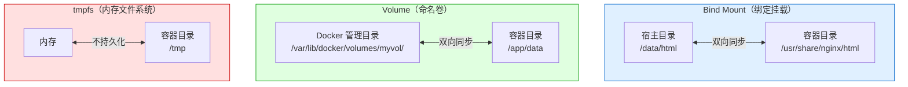

| 对比 | Volume | Bind Mount | tmpfs |
|------|--------|-----------|-------|
| 存储位置 | Docker 管理 | 宿主任意目录 | 内存 |
| 生命周期 | 独立于容器 | 独立于容器 | 随容器消失 |
| 管理 | `docker volume` 命令 | 文件系统操作 | 无 |
| 可移植性 | 好（Docker 管理） | 差（依赖宿主路径） | 不可移植 |
| 性能 | 接近原生 | 接近原生 | 最快（内存） |
| 适用场景 | 数据库、持久化 | 配置文件、代码 | 临时文件、敏感数据 |

### 6.3 Volume 命令详解

#### docker volume create

```bash
# 创建命名卷
docker volume create mydata

# 创建时指定驱动和选项
docker volume create \
  --driver local \
  --opt type=nfs \
  --opt o=addr=192.168.1.100,rw \
  --opt device=:/export/data \
  nfs-data
```

#### docker volume ls

```bash
# 列出所有卷
docker volume ls
# DRIVER   VOLUME NAME
# local    mydata
# local    pgdata
# local    redis-data

# 过滤
docker volume ls --filter name=my
```

#### docker volume inspect

```bash
# 查看卷详情
docker volume inspect mydata
# [
#     {
#         "CreatedAt": "2024-01-15T10:00:00Z",
#         "Driver": "local",
#         "Mountpoint": "/var/lib/docker/volumes/mydata/_data",
#         "Name": "mydata",
#         "Options": {},
#         "Scope": "local"
#     }
# ]
```

#### docker volume rm

```bash
# 删除指定卷
docker volume rm mydata

# 删除所有未使用的卷
docker volume prune

# 删除所有未使用的卷（不提示确认）
docker volume prune -f

# 删除悬空卷（未被任何容器使用）
docker volume ls -qf dangling=true | xargs docker volume rm
```

### 6.4 使用 Volume

```bash
# 创建并使用命名卷
docker run -d \
  --name postgres \
  -v pgdata:/var/lib/postgresql/data \
  postgres:16

# 使用只读卷
docker run -d \
  --name web \
  -v config:/etc/nginx:ro \
  nginx:latest

# 多个卷
docker run -d \
  --name app \
  -v app-data:/app/data \
  -v app-logs:/app/logs \
  -v app-config:/app/config:ro \
  myapp:latest

# 使用 Docker Compose
```

```yaml
# docker-compose.yml
services:
  db:
    image: postgres:16
    volumes:
      - pgdata:/var/lib/postgresql/data
    environment:
      POSTGRES_PASSWORD: secret

  web:
    image: nginx:latest
    volumes:
      - ./html:/usr/share/nginx/html:ro
      - nginx-config:/etc/nginx:ro

volumes:
  pgdata:
  nginx-config:
```

## 7. Bind Mount

### 7.1 基本用法

```bash
# 绑定挂载宿主目录
docker run -d \
  -v /data/html:/usr/share/nginx/html \
  nginx:latest

# 只读绑定挂载
docker run -d \
  -v /data/config:/etc/nginx:ro \
  nginx:latest

# 使用 --mount 语法（更清晰）
docker run -d \
  --mount type=bind,source=/data/html,target=/usr/share/nginx/html \
  nginx:latest

# 只读 --mount
docker run -d \
  --mount type=bind,source=/data/config,target=/etc/nginx,readonly \
  nginx:latest
```

### 7.2 -v vs --mount

| 对比 | `-v` | `--mount` |
|------|------|-----------|
| 语法 | `-v host:container:ro` | `--mount type=bind,src=host,dst=container,readonly` |
| 目录不存在时 | 自动创建空目录 | 报错（更安全） |
| 可读性 | 简洁 | 明确 |
| 推荐场景 | 开发快速使用 | 生产推荐 |

```bash
# -v 不存在的目录：自动创建（可能是 bug 来源）
docker run -v /nonexistent:/app alpine ls /app
# /nonexistent 被自动创建为空目录

# --mount 不存在的目录：报错
docker run --mount type=bind,source=/nonexistent,target=/app alpine ls /app
# Error: /nonexistent is not a valid path
```

### 7.3 Bind Mount 开发场景

```bash
# 前端开发：热重载
docker run -d \
  -v $(pwd)/src:/app/src \
  -v $(pwd)/public:/app/public \
  -p 3000:3000 \
  node:20-alpine \
  sh -c "cd /app && npm start"

# Python 开发
docker run -it \
  -v $(pwd):/app \
  -w /app \
  python:3.11 \
  python app.py

# 配置文件挂载
docker run -d \
  -v /etc/myapp/config.yml:/app/config.yml:ro \
  -v /etc/myapp/certs:/app/certs:ro \
  myapp:latest
```

::: warning Bind Mount 的安全风险
- 容器可修改宿主文件（除非 `:ro`）
- 挂载敏感目录（如 `/`、`/etc`、`/var/run/docker.sock`）极度危险
- macOS/Windows 上 Bind Mount 性能较差（虚拟化开销）
:::

## 8. tmpfs 挂载

```bash
# tmpfs：数据只存在内存中，不写入磁盘
docker run -d \
  --mount type=tmpfs,target=/app/tmp \
  myapp:latest

# -v 语法
docker run -d \
  -v /app/tmp \
  --tmpfs /app/tmp:rw,noexec,nosuid,size=100m \
  myapp:latest

# tmpfs 选项
docker run -d \
  --mount type=tmpfs,target=/app/tmp,tmpfs-size=1073741824,tmpfs-mode=1777 \
  myapp:latest
```

| 选项 | 作用 | 默认值 |
|------|------|--------|
| `tmpfs-size` | 最大字节数 | 无限 |
| `tmpfs-mode` | 文件权限模式 | 1777 |
| `rw` | 读写 | 默认 |
| `noexec` | 禁止执行 | — |
| `nosuid` | 禁止 SUID | — |

::: tip tmpfs 适用场景
- 临时文件（编译中间文件、缓存）
- 敏感数据（密码、密钥，不希望写入磁盘）
- 高性能临时存储（内存速度）
- 不适合大数据量（受限于内存大小）
:::

## 9. 数据卷备份与恢复

### 9.1 备份命名卷

```bash
# 备份命名卷到 tar 文件
docker run --rm \
  -v pgdata:/source:ro \
  -v $(pwd):/backup \
  alpine \
  tar czf /backup/pgdata-backup-$(date +%Y%m%d).tar.gz -C /source .

# 恢复命名卷
docker run --rm \
  -v pgdata:/target \
  -v $(pwd):/backup \
  alpine \
  sh -c "cd /target && tar xzf /backup/pgdata-backup-20240115.tar.gz"
```

### 9.2 定时备份脚本

```bash
#!/bin/bash
# Docker Volume 定时备份脚本

BACKUP_DIR="/data/backups/docker-volumes"
DATE=$(date +%Y%m%d_%H%M%S)
RETAIN_DAYS=7

# 创建备份目录
mkdir -p ${BACKUP_DIR}

# 获取所有命名卷
for VOL in $(docker volume ls -q); do
    echo "Backing up volume: ${VOL}"
    docker run --rm \
        -v ${VOL}:/source:ro \
        -v ${BACKUP_DIR}:/backup \
        alpine \
        tar czf /backup/${VOL}_${DATE}.tar.gz -C /source .
done

# 清理过期备份
find ${BACKUP_DIR} -name "*.tar.gz" -mtime +${RETAIN_DAYS} -delete

echo "Backup completed: ${DATE}"
```

### 9.3 数据库备份

```bash
# PostgreSQL 备份
docker exec postgres pg_dump -U postgres mydb > backup.sql

# PostgreSQL 恢复
cat backup.sql | docker exec -i postgres psql -U postgres mydb

# MySQL 备份
docker exec mysql mysqldump -u root -p${MYSQL_ROOT_PASSWORD} mydb > backup.sql

# MySQL 恢复
cat backup.sql | docker exec -i mysql mysql -u root -p${MYSQL_ROOT_PASSWORD} mydb

# MongoDB 备份
docker exec mongo mongodump --db mydb --out /tmp/backup
docker cp mongo:/tmp/backup ./mongodb-backup

# MongoDB 恢复
docker cp ./mongodb-backup mongo:/tmp/backup
docker exec mongo mongorestore --db mydb /tmp/backup/mydb
```

## 10. 命名卷 vs 绑定挂载对比

### 10.1 详细对比

| 维度 | 命名卷（Named Volume） | 绑定挂载（Bind Mount） |
|------|----------------------|---------------------|
| 创建方式 | `docker volume create` | 自动（-v 指定路径） |
| 存储位置 | `/var/lib/docker/volumes/<name>/_data` | 宿主任意路径 |
| 管理方式 | `docker volume` 命令 | 宿主文件系统操作 |
| 备份 | 通过临时容器 | 直接操作宿主文件 |
| 可移植性 | 高（跨平台一致） | 低（依赖宿主路径） |
| 性能 | 接近原生 | 接近原生（macOS/Windows 较差） |
| 目录不存在时 | 自动创建 | `-v` 自动创建 / `--mount` 报错 |
| 权限控制 | Docker 管理 | 宿主权限 |
| 适用场景 | 数据库、持久化存储 | 开发挂载、配置文件 |

### 10.2 选型决策

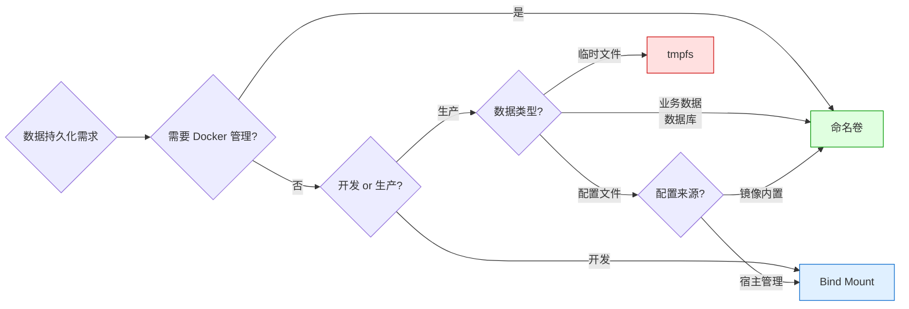

## 11. 多容器共享数据

### 11.1 通过命名卷共享

```bash
# 创建共享卷
docker volume create shared-data

# 容器 A 写入数据
docker run -d --name producer \
  -v shared-data:/data \
  alpine \
  sh -c "echo 'Hello from A' > /data/message && sleep infinity"

# 容器 B 读取数据
docker run --rm \
  -v shared-data:/data \
  alpine \
  cat /data/message
# Hello from A
```

### 11.2 通过 Bind Mount 共享

```bash
# 多个容器共享宿主目录
docker run -d --name web1 \
  -v /data/html:/usr/share/nginx/html:ro \
  nginx:latest

docker run -d --name web2 \
  -v /data/html:/usr/share/nginx/html:ro \
  nginx:latest

# 更新宿主文件，两个容器立即看到变化
echo "<h1>Updated!</h1>" > /data/html/index.html
```

### 11.3 数据容器模式（已弃用）

```bash
# 旧模式：使用专用容器存储数据
# 不推荐！使用命名卷替代

# 旧方式
docker run -d --name data-container \
  -v /data \
  alpine echo "data only"

# 新方式
docker volume create mydata
```

### 11.4 只读与读写分层

```bash
# 主容器读写，从容器只读
docker run -d --name writer \
  -v shared-data:/data \
  myapp:latest

docker run -d --name reader \
  -v shared-data:/data:ro \
  myapp:latest

# reader 只能读取，writer 可以读写
```

## 12. 数据卷驱动

### 12.1 local 驱动

默认驱动，数据存储在本地文件系统：

```bash
# 默认 local 驱动
docker volume create mydata

# 使用特定文件系统类型
docker volume create \
  --driver local \
  --opt type=nfs \
  --opt o=addr=192.168.1.100,rw \
  --opt device=:/export/data \
  nfs-data

# 使用 btrfs 子卷
docker volume create \
  --driver local \
  --opt type=btrfs \
  --opt device=/dev/sdb1 \
  btrfs-data
```

### 12.2 NFS 卷

```bash
# 创建 NFS 卷
docker volume create \
  --driver local \
  --opt type=nfs \
  --opt o=addr=192.168.1.100,rw,nfsvers=4 \
  --opt device=:/export/data \
  nfs-data

# 使用 NFS 卷
docker run -d \
  -v nfs-data:/app/data \
  myapp:latest

# 直接在 docker run 中使用 NFS
docker run -d \
  --mount type=volume,source=nfs-data,target=/app/data,volume-driver=local,volume-opt=type=nfs,volume-opt=o=addr=192.168.1.100,volume-opt=device=:/export/data \
  myapp:latest
```

### 12.3 第三方卷驱动

| 驱动 | 说明 | 适用场景 |
|------|------|---------|
| **local** | Docker 内置 | 单机默认 |
| **local-persist** | 可指定宿主路径的命名卷 | 需要管理路径 |
| **convoy** | 支持多种后端 | 多后端统一管理 |
| **rexray** | 支持 AWS EBS/GlusterFS | 云环境 |
| **vieux/sshfs** | 通过 SSH 挂载远程目录 | 开发环境 |

```bash
# 安装卷驱动插件
docker plugin install vieux/sshfs

# 使用 SSHFS 驱动创建卷
docker volume create \
  --driver vieux/sshfs \
  -o sshcmd=user@remote:/data \
  -o password=mypassword \
  ssh-data

# 使用
docker run -d -v ssh-data:/app/data myapp:latest
```

## 13. 存储驱动

### 13.1 存储驱动对比

| 存储驱动 | 文件系统 | 性能 | 稳定性 | Docker 默认 | 推荐度 |
|---------|---------|------|--------|------------|--------|
| **overlay2** | OverlayFS | 优秀 | 稳定 | ✓ (18.09+) | ★★★★★ |
| **devicemapper** | Device Mapper | 一般 | 稳定 | 旧版 RHEL | ★★☆ |
| **btrfs** | Btrfs | 良好 | 一般 | — | ★★★ |
| **zfs** | ZFS | 良好 | 稳定 | — | ★★★ |
| **vfs** | 虚拟文件系统 | 差 | 稳定 | — | ★（仅测试） |
| **fuse-overlayfs** | FUSE OverlayFS | 良好 | 稳定 | Rootless | ★★★★ |

```bash
# 查看当前存储驱动
docker info | grep "Storage Driver"
# Storage Driver: overlay2

# 修改存储驱动
# /etc/docker/daemon.json
{
  "storage-driver": "overlay2"
}
```

### 13.2 overlay2 详解

overlay2 是 Docker 推荐的存储驱动，基于 OverlayFS：

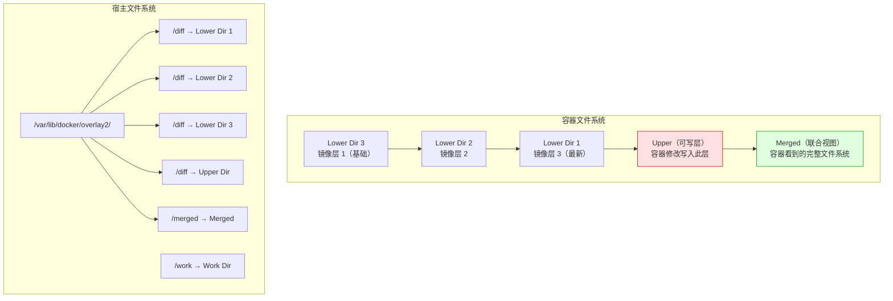

```bash
# 查看 overlay2 层结构
docker inspect mycontainer --format '{{json .GraphDriver}}' | python3 -m json.tool
# {
#     "Data": {
#         "LowerDir": "/var/lib/docker/overlay2/xxx/diff:/var/lib/docker/overlay2/yyy/diff",
#         "MergedDir": "/var/lib/docker/overlay2/zzz/merged",
#         "UpperDir": "/var/lib/docker/overlay2/zzz/diff",
#         "WorkDir": "/var/lib/docker/overlay2/zzz/work"
#     },
#     "Name": "overlay2"
# }
```

### 13.3 devicemapper 详解

devicemapper 使用块设备而非文件，有两种模式：

| 模式 | 存储方式 | 性能 | 空间管理 | 推荐度 |
|------|---------|------|---------|--------|
| **loopback** | 稀疏文件模拟块设备 | 差 | 动态增长 | ★（不推荐） |
| **direct-lvm** | 真实块设备 | 良好 | 预分配 | ★★★ |

```bash
# devicemapper direct-lvm 配置
# /etc/docker/daemon.json
{
  "storage-driver": "devicemapper",
  "storage-opts": {
    "dm.directlvm_device": "/dev/sdb",
    "dm.thinp_percent": "95",
    "dm.thinp_metapercent": "1",
    "dm.thinp_autoextend_threshold": "80",
    "dm.thinp_autoextend_step": "20",
    "dm.directlvm_device_force": true
  }
}
```

::: important 为什么推荐 overlay2？
- **性能**：overlay2 在几乎所有操作上都优于 devicemapper
- **简单**：无需预分配块设备，无需 LVM 管理
- **稳定**：内核主线支持，Docker 官方推荐
- **共享**：层共享更高效
- 仅在极老的 RHEL/CentOS（内核 < 4.0）或需要块设备语义时考虑 devicemapper
:::

### 13.4 存储驱动迁移

```bash
# 迁移步骤：devicemapper → overlay2

# 1. 停止 Docker
sudo systemctl stop docker

# 2. 备份数据
sudo cp -a /var/lib/docker /var/lib/docker.bak

# 3. 清理旧数据
sudo rm -rf /var/lib/docker

# 4. 修改配置
# /etc/docker/daemon.json
{
  "storage-driver": "overlay2"
}

# 5. 启动 Docker
sudo systemctl start docker

# 6. 验证
docker info | grep "Storage Driver"
# Storage Driver: overlay2

# 7. 重新拉取镜像（旧镜像已删除）
docker pull nginx:latest
```

## 14. 容器数据迁移

### 14.1 同主机迁移

```bash
# 方式一：通过命名卷
# 1. 停止源容器
docker stop old-container

# 2. 使用临时容器迁移数据
docker run --rm \
  -v old-volume:/source:ro \
  -v new-volume:/target \
  alpine \
  sh -c "cp -a /source/. /target/"

# 3. 启动新容器使用新卷
docker run -d -v new-volume:/app/data myapp:latest

# 方式二：通过 tar 中转
docker run --rm \
  -v old-volume:/source:ro \
  -v $(pwd):/backup \
  alpine \
  tar czf /backup/data.tar.gz -C /source .

docker run --rm \
  -v new-volume:/target \
  -v $(pwd):/backup \
  alpine \
  tar xzf /backup/data.tar.gz -C /target
```

### 14.2 跨主机迁移

```bash
# 方式一：通过 tar + scp
# 源主机
docker run --rm \
  -v mydata:/source:ro \
  -v $(pwd):/backup \
  alpine \
  tar czf /backup/mydata.tar.gz -C /source .

scp mydata.tar.gz target-host:/tmp/

# 目标主机
docker volume create mydata
docker run --rm \
  -v mydata:/target \
  -v /tmp:/backup \
  alpine \
  tar xzf /backup/mydata.tar.gz -C /target

# 方式二：通过 rsync（Bind Mount）
# 在源主机挂载为 Bind Mount
rsync -avz /data/myapp/ target-host:/data/myapp/

# 方式三：NFS 共享（无需迁移）
# 直接使用 NFS 卷，多主机共享同一数据
```

### 14.3 数据库迁移

```bash
# PostgreSQL 迁移
# 1. 源端备份
docker exec postgres-old pg_dumpall -U postgres > full_backup.sql

# 2. 传输
scp full_backup.sql target-host:/tmp/

# 3. 目标端恢复
cat full_backup.sql | docker exec -i postgres-new psql -U postgres

# MySQL 迁移
# 1. 源端备份
docker exec mysql-old mysqldump -u root -p${PWD} --all-databases > full_backup.sql

# 2. 目标端恢复
cat full_backup.sql | docker exec -i mysql-new mysql -u root -p${PWD}
```

## 15. Volume 数据流图

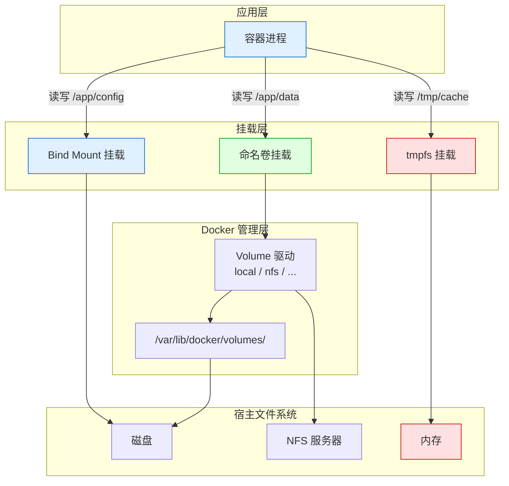

## 16. 网络命令速查表

| 命令 | 用途 | 常用选项 |
|------|------|---------|
| `docker network create` | 创建网络 | `-d`, `--subnet`, `--gateway`, `--ip-range` |
| `docker network ls` | 列出网络 | `--filter` |
| `docker network inspect` | 查看网络详情 | `--format` |
| `docker network rm` | 删除网络 | — |
| `docker network prune` | 清理未使用网络 | `--filter` |
| `docker network connect` | 连接容器到网络 | `--ip`, `--alias` |
| `docker network disconnect` | 断开容器网络 | — |

## 17. Volume 命令速查表

| 命令 | 用途 | 常用选项 |
|------|------|---------|
| `docker volume create` | 创建卷 | `--driver`, `--opt` |
| `docker volume ls` | 列出卷 | `--filter` |
| `docker volume inspect` | 查看卷详情 | `--format` |
| `docker volume rm` | 删除卷 | — |
| `docker volume prune` | 清理未使用卷 | `--filter` |

## 18. 综合实战：多服务应用部署

```yaml
# docker-compose.yml — 完整的网络与存储配置
version: "3.8"

services:
  # Nginx 反向代理
  nginx:
    image: nginx:1.25-alpine
    ports:
      - "80:80"
      - "443:443"
    volumes:
      - ./nginx/conf.d:/etc/nginx/conf.d:ro
      - ./nginx/certs:/etc/nginx/certs:ro
      - nginx-logs:/var/log/nginx
    networks:
      - frontend
    depends_on:
      - api
    restart: unless-stopped
    healthcheck:
      test: ["CMD", "wget", "-q", "--spider", "http://localhost/health"]
      interval: 30s
      timeout: 3s
      retries: 3

  # API 服务
  api:
    image: myapp:1.0.0
    environment:
      - DB_HOST=postgres
      - DB_PORT=5432
      - REDIS_HOST=redis
      - REDIS_PORT=6379
    volumes:
      - app-uploads:/app/uploads
    networks:
      - frontend
      - backend
    depends_on:
      postgres:
        condition: service_healthy
      redis:
        condition: service_healthy
    restart: unless-stopped
    deploy:
      resources:
        limits:
          cpus: "2"
          memory: 1G
        reservations:
          cpus: "0.5"
          memory: 256M

  # PostgreSQL 数据库
  postgres:
    image: postgres:16-alpine
    environment:
      POSTGRES_DB: myapp
      POSTGRES_USER: appuser
      POSTGRES_PASSWORD_FILE: /run/secrets/db_password
    volumes:
      - pgdata:/var/lib/postgresql/data
    networks:
      - backend
    secrets:
      - db_password
    restart: unless-stopped
    healthcheck:
      test: ["CMD-SHELL", "pg_isready -U appuser -d myapp"]
      interval: 10s
      timeout: 5s
      retries: 5

  # Redis 缓存
  redis:
    image: redis:7-alpine
    command: redis-server --appendonly yes
    volumes:
      - redis-data:/data
    networks:
      - backend
    restart: unless-stopped
    healthcheck:
      test: ["CMD", "redis-cli", "ping"]
      interval: 10s
      timeout: 3s
      retries: 3

networks:
  frontend:
    driver: bridge
  backend:
    driver: bridge
    internal: true  # 不暴露到外部

volumes:
  pgdata:
    driver: local
  redis-data:
    driver: local
  nginx-logs:
    driver: local
  app-uploads:
    driver: local

secrets:
  db_password:
    file: ./secrets/db_password.txt
```

```bash
# 启动
docker compose up -d

# 验证网络
docker network ls
docker network inspect project_frontend
docker network inspect project_backend

# 验证卷
docker volume ls
docker volume inspect project_pgdata

# 验证服务
docker compose ps
docker compose logs -f api

# 清理
docker compose down        # 停止并删除容器和网络
docker compose down -v     # 同时删除卷（慎用！）
```

::: info 参考来源
- Docker 官方文档：[Networking overview](https://docs.docker.com/network/)
- Docker 官方文档：[Storage overview](https://docs.docker.com/storage/)
- 《Docker in Practice》第 5 章：网络、第 6 章：存储
- 《Kubernetes in Action》第 6 章：Volumes
- CNCF 云原生网络方案：[CNI 规范](https://www.cni.dev/)
:::

::: tip 下一步
掌握网络与存储后，你已经具备了 Docker 基础的全部核心知识。后续章节将深入 Dockerfile 编写、Compose 编排、Swarm 集群和 Kubernetes 等进阶主题。
:::
