# Dockerfile 最佳实践

::: info 本章导读
Dockerfile 是构建容器镜像的核心蓝图。一个精心编写的 Dockerfile 不仅能让镜像更小、更安全，还能显著提升构建速度和可维护性。本文将深入剖析 Dockerfile 的每一条指令，对比易混淆的指令对，讲解构建缓存优化与多阶段构建，并提供生产级 Dockerfile 模板。
:::

## 一、Dockerfile 指令全解

### 1.1 FROM — 一切的起点

`FROM` 是 Dockerfile 的第一条指令（除 `ARG` 外），指定基础镜像。所有后续指令都在此镜像之上执行。

```dockerfile
# 语法
FROM [--platform=<platform>] <image> [AS <name>]
FROM [--platform=<platform>] <image>[:<tag>] [AS <name>]
FROM [--platform=<platform>] <image>[@<digest>] [AS <name>]
```

```dockerfile
# 使用官方镜像
FROM node:20-alpine

# 指定平台
FROM --platform=linux/amd64 python:3.12-slim

# 多阶段构建中命名阶段
FROM golang:1.22 AS builder

# 使用 digest 确保不可变
FROM python:3.12-slim@sha256:ef1e6b5a3cb2c5e4f8e6e4e9f9b9f5c5d5e5f5e5f5e5f5e5f5e5f5e5f5e5f5
```

::: tip 选择基础镜像的原则
1. **优先选择官方镜像**：Docker Hub 官方镜像经过安全审计
2. **优先选择 `-slim` 或 `-alpine` 变体**：体积更小，攻击面更小
3. **明确指定标签**：不要使用 `latest`，它是可变标签
4. **考虑使用 digest**：在 CI/CD 中锁定镜像的精确版本
:::

```dockerfile
# ❌ 不推荐：使用 latest 标签
FROM ubuntu

# ✅ 推荐：明确指定版本
FROM ubuntu:22.04

# ✅ 更安全：指定 digest
FROM ubuntu:22.04@sha256:9a0bdde4188b896a372804be2384015e38e4210e49b7d1c2b3b0f0e5c7a8f5c2
```

### 1.2 RUN — 执行命令

`RUN` 在当前镜像层之上执行命令，并提交结果作为新的镜像层。

```dockerfile
# Shell 格式
RUN <command>

# Exec 格式
RUN ["executable", "param1", "param2"]
```

```dockerfile
# Shell 格式（最常用）
RUN apt-get update && apt-get install -y curl

# Exec 格式（需要精确控制时使用）
RUN ["/bin/bash", "-c", "echo hello"]
```

::: warning RUN 指令的层合并原则
每个 `RUN` 指令都会创建一个新的镜像层。多个 `RUN` 指令会导致镜像层数增多、体积膨胀。应该将相关的命令合并到一条 `RUN` 指令中，并在同一层中清理不需要的文件。
:::

```dockerfile
# ❌ 不推荐：多条 RUN，产生多个层
RUN apt-get update
RUN apt-get install -y curl
RUN apt-get install -y git
RUN rm -rf /var/lib/apt/lists/*

# ✅ 推荐：合并 RUN，减少层数
RUN apt-get update && \
    apt-get install -y --no-install-recommends \
        curl \
        git && \
    rm -rf /var/lib/apt/lists/*
```

### 1.3 COPY — 复制文件

`COPY` 从构建上下文中复制文件或目录到镜像中。

```dockerfile
# 语法
COPY [--chown=<user>:<group>] [--chmod=<perms>] <src>... <dst>
COPY [--chown=<user>:<group>] [--chmod=<perms>] ["<src>",..., "<dst>"]
```

```dockerfile
# 复制单个文件
COPY package.json /app/

# 复制多个文件
COPY package.json package-lock.json /app/

# 复制整个目录
COPY src/ /app/src/

# 设置文件权限（BuildKit 特性）
COPY --chown=1000:1000 --chmod=755 entrypoint.sh /app/

# 使用通配符
COPY *.conf /etc/app/
```

::: important COPY 的路径规则
- 源路径相对于构建上下文，不能使用 `../` 引用上下文之外的文件
- 目标路径如果是目录，必须以 `/` 结尾
- 源路径中的文件权限和元数据默认保留
- `--chown` 和 `--chmod` 需要 BuildKit 支持（Docker 20.10+）
:::

### 1.4 ADD — 增强版复制

`ADD` 与 `COPY` 类似，但额外支持 URL 下载和自动解压 tar 归档文件。

```dockerfile
# 语法
ADD [--chown=<user>:<group>] [--chmod=<perms>] <src>... <dst>
ADD [--chown=<user>:<group>] [--chmod=<perms>] ["<src>",..., "<dst>"]
```

```dockerfile
# 自动解压 tar 文件
ADD app.tar.gz /opt/

# 从 URL 下载文件
ADD https://example.com/file.txt /app/
```

::: warning ADD 的使用建议
由于 `ADD` 的隐式行为（自动解压），Docker 官方最佳实践建议：
- **优先使用 `COPY`**：行为明确、可预测
- **仅在需要解压 tar 文件时使用 `ADD`**：利用其自动解压功能
- **避免使用 `ADD` 从 URL 下载**：改用 `RUN curl` 或 `RUN wget`，这样可以更好地控制下载过程和缓存
:::

### 1.5 ENV — 设置环境变量

`ENV` 设置环境变量，这些变量在镜像构建期间和容器运行时都可用。

```dockerfile
# 语法
ENV <key>=<value> ...
ENV <key> <value>
```

```dockerfile
# 设置单个环境变量
ENV APP_HOME=/app

# 设置多个环境变量
ENV APP_HOME=/app \
    NODE_ENV=production \
    PORT=3000

# 引用其他环境变量
ENV PATH="${APP_HOME}/bin:${PATH}"
```

```dockerfile
# 实际应用：设置 Python 不缓冲输出
ENV PYTHONUNBUFFERED=1

# 设置时区
ENV TZ=Asia/Shanghai

# 设置应用版本（可在运行时覆盖）
ENV APP_VERSION=1.0.0
```

### 1.6 ARG — 构建参数

`ARG` 定义构建时变量，仅在构建阶段可用，不会保留到运行时。

```dockerfile
# 语法
ARG <name>[=<default value>]
```

```dockerfile
# 定义构建参数
ARG NODE_VERSION=20

# 在 FROM 之前使用
ARG NODE_VERSION=20
FROM node:${NODE_VERSION}

# 多阶段构建中传递
ARG BUILD_DATE
ARG VCS_REF
LABEL build-date=$BUILD_DATE vcs-ref=$VCS_REF

# 在 RUN 中使用
ARG PACKAGE_VERSION
RUN npm install package@${PACKAGE_VERSION}
```

::: important ARG 与 ENV 的关键区别
| 特性 | ARG | ENV |
|------|-----|-----|
| 作用范围 | 仅构建阶段 | 构建阶段 + 运行时 |
| 持久性 | 不保留在最终镜像中 | 保留在最终镜像中 |
| 可覆盖性 | `docker build --build-arg` | `docker run -e` |
| FROM 前使用 | 可以 | 不可以 |
| 安全性 | `docker history` 可见 | `docker history` 可见 |

**最佳实践**：使用 `ARG` 传递构建时配置（版本号、构建日期），使用 `ENV` 设置运行时配置（端口、环境名称）。
:::

### 1.7 EXPOSE — 声明端口

`EXPOSE` 声明容器运行时监听的端口，仅起文档作用，不会实际发布端口。

```dockerfile
# 语法
EXPOSE <port> [<port>/<protocol>...]
```

```dockerfile
# 声明 TCP 端口
EXPOSE 80

# 声明多个端口
EXPOSE 80 443

# 声明 UDP 端口
EXPOSE 53/udp

# 同时声明 TCP 和 UDP
EXPOSE 53/tcp 53/udp
```

::: info EXPOSE 不会发布端口
`EXPOSE` 仅是文档性质的声明，告诉使用者容器打算使用哪些端口。实际发布端口需要在 `docker run` 时使用 `-p` 或 `-P` 参数。
:::

```bash
# -P 会自动映射所有 EXPOSE 声明的端口到宿主机随机端口
docker run -P myapp

# -p 手动映射指定端口
docker run -p 8080:80 myapp
```

### 1.8 WORKDIR — 设置工作目录

`WORKDIR` 设置后续 `RUN`、`CMD`、`ENTRYPOINT`、`COPY`、`ADD` 指令的工作目录。

```dockerfile
# 语法
WORKDIR /path/to/workdir
```

```dockerfile
# 设置工作目录
WORKDIR /app

# WORKDIR 支持路径叠加
WORKDIR /a        # /a
WORKDIR b         # /a/b
WORKDIR c         # /a/b/c
```

::: warning 不要使用 RUN cd
```dockerfile
# ❌ 不推荐：使用 RUN cd 不会影响后续指令
RUN cd /app && npm install

# ✅ 推荐：使用 WORKDIR
WORKDIR /app
RUN npm install
```
`RUN cd` 只在当前 `RUN` 指令中生效，不会改变后续指令的工作目录。
:::

### 1.9 ENTRYPOINT — 入口点

`ENTRYPOINT` 配置容器启动时执行的可执行程序，不会被 `docker run` 的命令行参数覆盖（除非使用 `--entrypoint`）。

```dockerfile
# Exec 格式（推荐）
ENTRYPOINT ["executable", "param1", "param2"]

# Shell 格式
ENTRYPOINT command param1 param2
```

```dockerfile
# 示例：创建一个 PostgreSQL 客户端工具镜像
ENTRYPOINT ["psql", "-h", "db-host"]

# docker run my-pg-image -U admin -d mydb
# 实际执行：psql -h db-host -U admin -d mydb
```

```dockerfile
# 使用入口点脚本
COPY entrypoint.sh /usr/local/bin/
ENTRYPOINT ["entrypoint.sh"]
```

::: important ENTRYPOINT 与 CMD 配合
`ENTRYPOINT` 与 `CMD` 配合使用时，`CMD` 的内容会作为参数传递给 `ENTRYPOINT`。

```dockerfile
ENTRYPOINT ["python", "app.py"]
CMD ["--help"]
```

- `docker run myapp` → 执行 `python app.py --help`
- `docker run myapp --version` → 执行 `python app.py --version`
:::

### 1.10 CMD — 默认命令

`CMD` 提供容器运行时的默认命令，可以被 `docker run` 的命令行参数覆盖。

```dockerfile
# Exec 格式（推荐）
CMD ["executable", "param1", "param2"]

# 作为 ENTRYPOINT 的默认参数
CMD ["param1", "param2"]

# Shell 格式
CMD command param1 param2
```

```dockerfile
# 启动 Web 服务
CMD ["nginx", "-g", "daemon off;"]

# 启动 Node.js 应用
CMD ["node", "server.js"]

# 作为 ENTRYPOINT 的默认参数
ENTRYPOINT ["python", "app.py"]
CMD ["--host", "0.0.0.0", "--port", "8000"]
```

::: tip 一个 Dockerfile 中只有最后一条 CMD 生效
如果 Dockerfile 中有多条 `CMD` 指令，只有最后一条会生效。
:::

### 1.11 VOLUME — 声明数据卷

`VOLUME` 声明一个或多个目录为数据卷，容器运行时会自动挂载到宿主机。

```dockerfile
# 语法
VOLUME ["/data"]
VOLUME /data /var/log
```

```dockerfile
# 声明数据目录
VOLUME ["/var/lib/postgresql/data"]

# 声明日志目录
VOLUME ["/var/log/app"]

# 声明多个数据卷
VOLUME ["/data", "/var/log"]
```

::: warning VOLUME 的注意事项
1. `VOLUME` 声明的目录在 `docker run` 时会自动创建匿名卷
2. 如果在 `VOLUME` 之后的 `RUN` 指令中修改了该目录的内容，这些修改不会持久化
3. 建议在 `docker-compose.yml` 中使用命名卷而非在 Dockerfile 中使用 `VOLUME`
:::

### 1.12 USER — 指定用户

`USER` 设置后续 `RUN`、`CMD`、`ENTRYPOINT` 指令运行时的用户和组。

```dockerfile
# 语法
USER <user>[:<group>]
USER <UID>[:<GID>]
```

```dockerfile
# 创建非 root 用户并切换
RUN groupadd -r appuser && \
    useradd -r -g appuser -d /app -s /sbin/nologin appuser
USER appuser

# 使用 UID/GID
USER 1000:1000
```

::: important 安全最佳实践：始终使用非 root 用户
默认情况下，容器以 root 用户运行，这存在安全风险。如果容器被攻破，攻击者将拥有 root 权限。始终创建并使用非特权用户。
:::

### 1.13 HEALTHCHECK — 健康检查

`HEALTHCHECK` 配置容器健康检查命令，Docker 会定期执行该命令以判断容器是否健康。

```dockerfile
# 语法
HEALTHCHECK [OPTIONS] CMD command
HEALTHCHECK NONE  # 禁用健康检查
```

```dockerfile
# Web 应用健康检查
HEALTHCHECK --interval=30s --timeout=3s --start-period=5s --retries=3 \
    CMD curl -f http://localhost:8080/health || exit 1

# PostgreSQL 健康检查
HEALTHCHECK --interval=10s --timeout=5s --retries=5 \
    CMD pg_isready -U postgres || exit 1

# Redis 健康检查
HEALTHCHECK --interval=30s --timeout=3s --retries=3 \
    CMD redis-cli ping || exit 1
```

健康检查选项说明：

| 选项 | 默认值 | 说明 |
|------|--------|------|
| `--interval` | 30s | 健康检查间隔 |
| `--timeout` | 30s | 超时时间 |
| `--start-period` | 0s | 容器启动后多长时间开始检查 |
| `--retries` | 3 | 连续失败多少次标记为 unhealthy |

### 1.14 LABEL — 元数据标签

`LABEL` 为镜像添加元数据，用于组织、版本标记和描述。

```dockerfile
# 语法
LABEL <key>=<value> <key>=<value> ...
```

```dockerfile
# 添加多个标签
LABEL maintainer="devops@example.com" \
      version="1.0.0" \
      description="Production API Server" \
      org.opencontainers.image.source="https://github.com/org/repo" \
      org.opencontainers.image.licenses="MIT"
```

::: tip 推荐使用 OCI 标准标签
Open Container Initiative (OCI) 定义了标准的镜像标签，推荐使用：

| 标签 | 说明 |
|------|------|
| `org.opencontainers.image.title` | 镜像标题 |
| `org.opencontainers.image.description` | 镜像描述 |
| `org.opencontainers.image.version` | 镜像版本 |
| `org.opencontainers.image.source` | 源码仓库 |
| `org.opencontainers.image.licenses` | 许可证 |
| `org.opencontainers.image.created` | 创建时间 |
| `org.opencontainers.image.revision` | Git 提交 ID |
:::

## 二、指令对比

### 2.1 COPY vs ADD

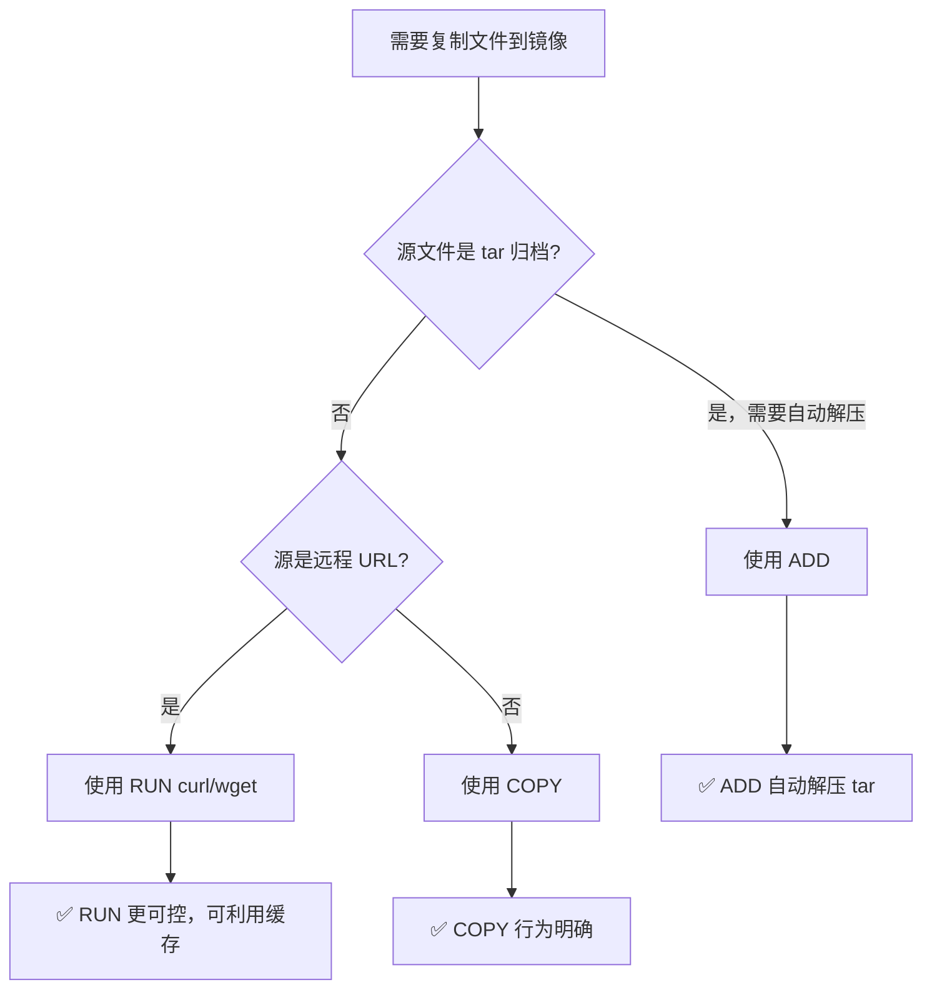

| 对比项 | COPY | ADD |
|--------|------|-----|
| 复制本地文件 | ✅ | ✅ |
| 自动解压 tar | ❌ | ✅ |
| 从 URL 下载 | ❌ | ✅（不推荐） |
| 行为可预测性 | 高 | 低 |
| Docker 官方推荐 | ✅ | 仅在需要解压时 |

```dockerfile
# ❌ 不推荐：使用 ADD 复制普通文件
ADD package.json /app/

# ✅ 推荐：使用 COPY
COPY package.json /app/

# ✅ ADD 的合理使用场景：解压 tar
ADD rootfs.tar.gz /
```

### 2.2 ENTRYPOINT vs CMD

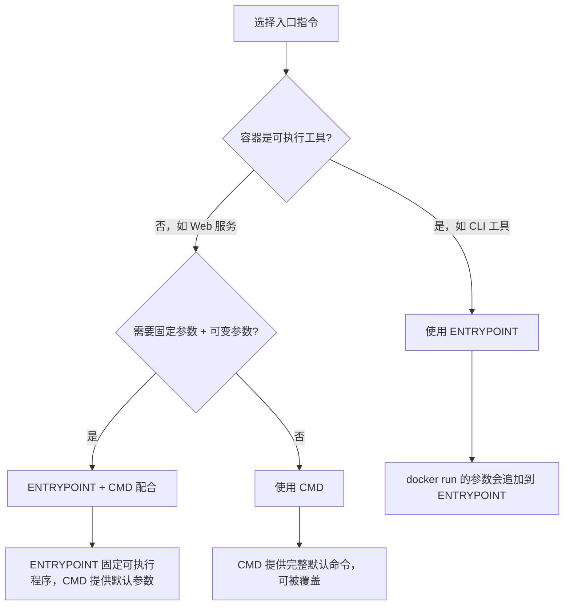

| 对比项 | ENTRYPOINT | CMD |
|--------|------------|-----|
| 被覆盖方式 | `--entrypoint` | 命令行参数直接覆盖 |
| 用途 | 定义容器的可执行程序 | 提供默认命令或默认参数 |
| 独立使用 | 适合工具类镜像 | 适合服务类镜像 |
| 与对方配合 | ENTRYPOINT + CMD | CMD 作为 ENTRYPOINT 的参数 |

```dockerfile
# 场景一：工具类镜像（如 curl）
ENTRYPOINT ["curl"]
CMD ["--help"]
# docker run mycurl https://example.com
# → curl https://example.com

# 场景二：服务类镜像
CMD ["node", "server.js"]
# docker run myapp node debug-mode.js
# → node debug-mode.js

# 场景三：固定程序 + 可变参数
ENTRYPOINT ["python", "manage.py"]
CMD ["runserver", "0.0.0.0:8000"]
# docker run myapp migrate
# → python manage.py migrate
```

### 2.3 ARG vs ENV

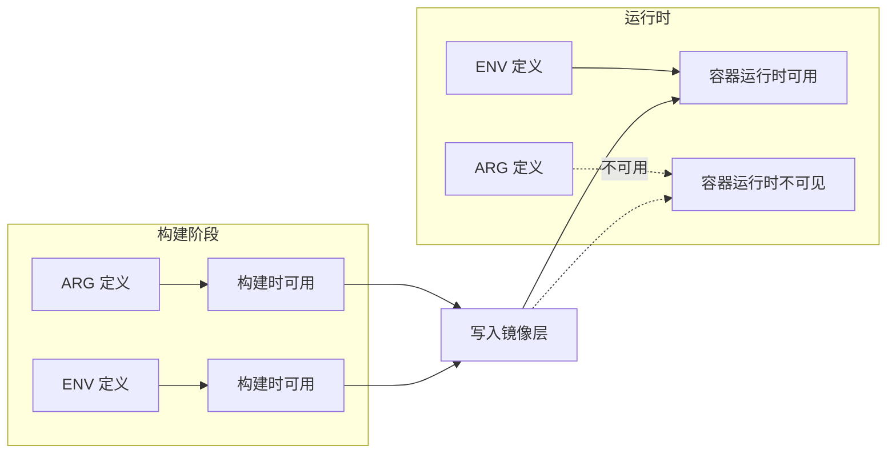

| 对比项 | ARG | ENV |
|--------|-----|-----|
| 作用域 | 构建阶段 | 构建阶段 + 运行时 |
| 持久性 | 不保留在镜像中 | 保留在镜像中 |
| 覆盖方式 | `--build-arg` | `-e` / `--env` |
| 可在 FROM 前使用 | ✅ | ❌ |
| 安全性 | `docker history` 可见 | `docker history` 可见 |
| 传递到下一阶段 | 需要重新声明 | 自动继承 |

```dockerfile
# ARG 在多阶段构建中需要在每个阶段重新声明
ARG NODE_VERSION=20

FROM node:${NODE_VERSION} AS builder
# NODE_VERSION 在此阶段可用
RUN echo "Building with Node ${NODE_VERSION}"

FROM node:${NODE_VERSION} AS runtime
# 需要重新声明 ARG（如果需要在 RUN 中使用）
ARG NODE_VERSION
RUN echo "Running with Node ${NODE_VERSION}"

# ENV 在所有后续阶段自动可用
ENV APP_ENV=production
```

::: warning 不要在 ARG 或 ENV 中存储敏感信息
`docker history` 可以查看所有 `ARG` 和 `ENV` 的值。不要在 Dockerfile 中硬编码密码、Token 等敏感信息。应该使用 Docker Secrets 或运行时环境变量传递。
:::

## 三、构建缓存机制与优化

### 3.1 构建缓存原理

Docker 构建镜像时，会逐条执行 Dockerfile 中的指令。对于每条指令，Docker 会检查是否存在可复用的缓存层。

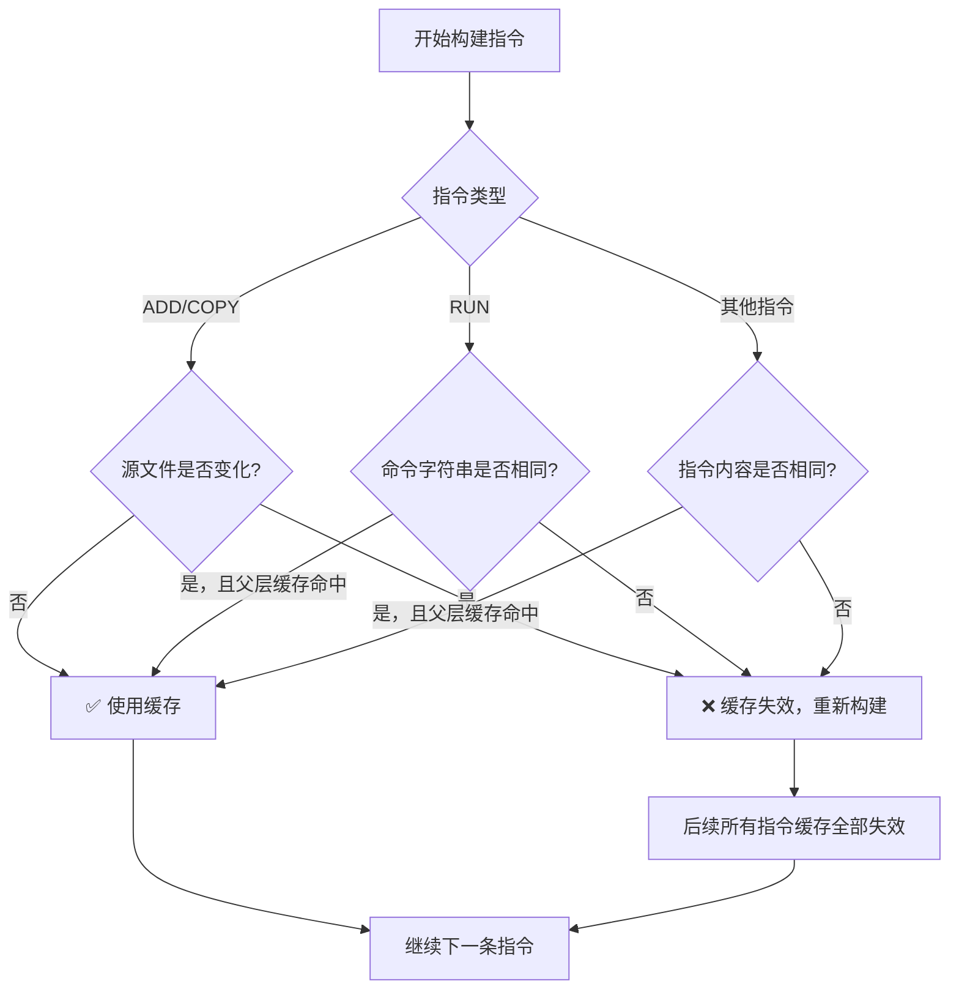

### 3.2 缓存失效规则

::: important 缓存失效的关键规则
1. **一旦某一层缓存失效，后续所有层的缓存都会失效**
2. `COPY`/`ADD` 指令根据源文件的校验和判断缓存是否有效
3. `RUN` 指令根据命令字符串判断缓存是否有效
4. `apt-get update` 等获取外部数据的命令，即使命令字符串不变，外部数据可能已变化
:::

### 3.3 缓存优化策略

#### 策略一：变更频率低的指令放前面

```dockerfile
# ❌ 不推荐：频繁变更的文件放在前面
COPY . /app
RUN npm install

# ✅ 推荐：先复制依赖文件，再安装依赖
COPY package.json package-lock.json /app/
RUN npm install
COPY . /app
```

#### 策略二：利用构建缓存加速 CI/CD

```dockerfile
# 利用缓存安装系统包
RUN apt-get update && apt-get install -y \
    curl \
    git \
    && rm -rf /var/lib/apt/lists/*

# 利用缓存安装应用依赖
COPY requirements.txt .
RUN pip install --no-cache-dir -r requirements.txt

# 最后复制应用代码（变更最频繁）
COPY . /app
```

#### 策略三：使用 BuildKit 缓存挂载

```dockerfile
# syntax=docker/dockerfile:1

# 挂载 pip 缓存目录
RUN --mount=type=cache,target=/root/.cache/pip \
    pip install -r requirements.txt

# 挂载 npm 缓存目录
RUN --mount=type=cache,target=/root/.npm \
    npm install

# 挂载 apt 缓存目录
RUN --mount=type=cache,target=/var/cache/apt \
    --mount=type=cache,target=/var/lib/apt \
    apt-get update && apt-get install -y curl
```

#### 策略四：使用 BuildKit 的 --mount=type=bind

```dockerfile
# syntax=docker/dockerfile:1

# 仅在构建时挂载，不写入镜像层
RUN --mount=type=bind,source=scripts,target=/scripts \
    /scripts/build.sh
```

### 3.4 缓存命中率优化全流程

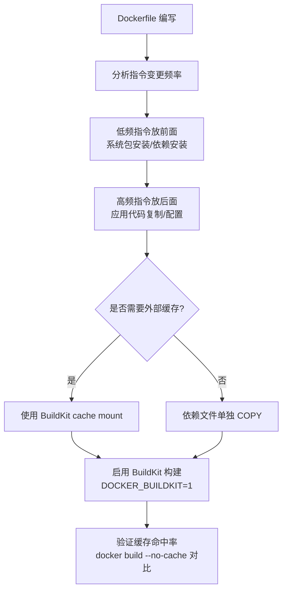

## 四、多阶段构建

### 4.1 为什么需要多阶段构建

在传统的 Dockerfile 中，构建工具（编译器、SDK）和运行时依赖都被打包到最终镜像中，导致镜像臃肿。

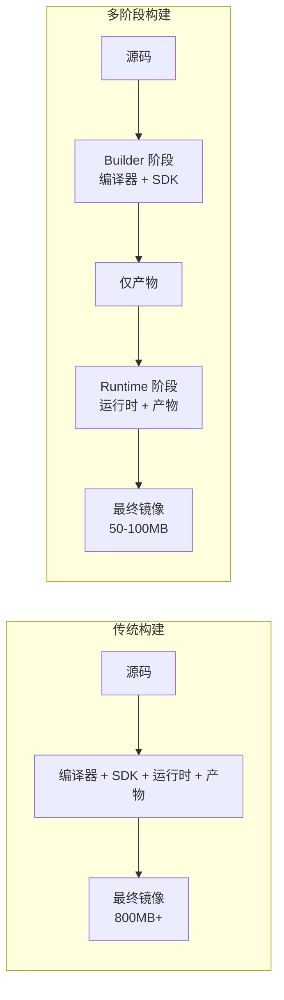

### 4.2 多阶段构建流程

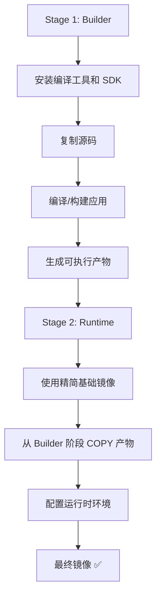

### 4.3 Go 应用多阶段构建

```dockerfile
# ===== Stage 1: 构建 =====
FROM golang:1.22-alpine AS builder

# 设置 Go 代理和编译环境
ENV GOPROXY=https://goproxy.cn,direct \
    CGO_ENABLED=0 \
    GOOS=linux \
    GOARCH=amd64

WORKDIR /build

# 先复制依赖文件，利用缓存
COPY go.mod go.sum ./
RUN go mod download

# 复制源码并构建
COPY . .
RUN go build -ldflags="-s -w" -o /app/server ./cmd/server

# ===== Stage 2: 运行 =====
FROM alpine:3.19

# 安装运行时依赖
RUN apk add --no-cache ca-certificates tzdata

WORKDIR /app

# 从 builder 阶段复制产物
COPY --from=builder /app/server .
COPY --from=builder /build/configs ./configs

# 设置时区
ENV TZ=Asia/Shanghai

EXPOSE 8080

ENTRYPOINT ["/app/server"]
```

### 4.4 Java 应用多阶段构建

```dockerfile
# ===== Stage 1: 构建 =====
FROM eclipse-temurin:21-jdk-alpine AS builder

WORKDIR /build

# 先复制 Maven/Gradle 依赖文件
COPY pom.xml .
COPY src ./src

# 构建应用（跳过测试）
RUN --mount=type=cache,target=/root/.m2 \
    ./mvnw package -DskipTests

# ===== Stage 2: 运行 =====
FROM eclipse-temurin:21-jre-alpine

# 安装运行时依赖
RUN apk add --no-cache curl tini

WORKDIR /app

# 从 builder 阶段复制 JAR
COPY --from=builder /build/target/*.jar app.jar

# 创建非 root 用户
RUN addgroup -S appgroup && adduser -S appuser -G appgroup
USER appuser

EXPOSE 8080

ENTRYPOINT ["/sbin/tini", "--"]
CMD ["java", "-jar", "app.jar"]
```

### 4.5 .NET 应用多阶段构建

```dockerfile
# ===== Stage 1: 构建 =====
FROM mcr.microsoft.com/dotnet/sdk:8.0 AS builder

WORKDIR /src

# 先复制项目文件，还原依赖
COPY *.csproj .
RUN dotnet restore

# 复制源码并发布
COPY . .
RUN dotnet publish -c Release -o /app/publish \
    --no-restore \
    /p:PublishTrimmed=true \
    /p:PublishSingleFile=true

# ===== Stage 2: 运行 =====
FROM mcr.microsoft.com/dotnet/aspnet:8.0-alpine

WORKDIR /app

# 从 builder 阶段复制发布产物
COPY --from=builder /app/publish .

# 设置全球化配置
ENV DOTNET_SYSTEM_GLOBALIZATION_INVARIANT=1 \
    ASPNETCORE_URLS=http://+:8080

# 创建非 root 用户
RUN addgroup -S appgroup && adduser -S appuser -G appgroup
USER appuser

EXPOSE 8080

ENTRYPOINT ["./MyApp"]
```

### 4.6 Node.js 应用多阶段构建

```dockerfile
# ===== Stage 1: 安装依赖 =====
FROM node:20-alpine AS deps

WORKDIR /app

COPY package.json package-lock.json ./
RUN npm ci --only=production

# ===== Stage 2: 构建 =====
FROM node:20-alpine AS builder

WORKDIR /app

COPY package.json package-lock.json ./
RUN npm ci

COPY . .
RUN npm run build

# ===== Stage 3: 运行 =====
FROM node:20-alpine AS runner

WORKDIR /app

ENV NODE_ENV=production

# 创建非 root 用户
RUN addgroup -S nodejs && adduser -S nextjs -G nodejs

# 从 builder 阶段复制构建产物
COPY --from=builder /app/dist ./dist
COPY --from=deps /app/node_modules ./node_modules
COPY package.json .

USER nextjs

EXPOSE 3000

CMD ["node", "dist/server.js"]
```

### 4.7 多阶段构建的高级技巧

#### 选择性 COPY

```dockerfile
# 仅复制特定阶段的特定文件
COPY --from=builder /app/dist ./dist

# 从其他镜像复制文件
COPY --from=nginx:alpine /etc/nginx/nginx.conf /etc/nginx/

# 使用阶段名称而非序号
COPY --from=builder /output /app
```

#### 条件构建

```dockerfile
ARG TARGETPLATFORM
ARG BUILDPLATFORM

FROM --platform=$BUILDPLATFORM golang:1.22 AS builder
# 在构建平台编译，支持交叉编译

FROM --platform=$TARGETPLATFORM alpine:3.19 AS runtime
# 在目标平台运行
```

## 五、.dockerignore 文件

### 5.1 为什么需要 .dockerignore

`.dockerignore` 文件类似 `.gitignore`，用于排除不需要的文件进入构建上下文，减少构建上下文大小、提升构建速度、避免敏感信息泄露。

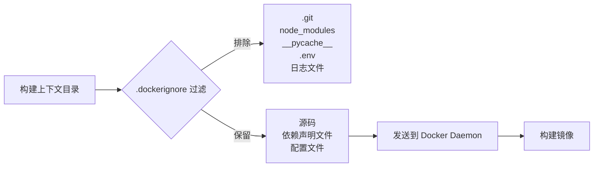

### 5.2 推荐的 .dockerignore 模板

```gitignore
# ===== 版本控制 =====
.git
.gitignore
.gitattributes

# ===== IDE 和编辑器 =====
.vscode/
.idea/
*.swp
*.swo
*~

# ===== 操作系统文件 =====
.DS_Store
Thumbs.db
desktop.ini

# ===== 依赖目录（在镜像中重新安装）=====
node_modules/
vendor/
__pycache__/
.venv/
venv/

# ===== 构建产物 =====
dist/
build/
*.pyc
*.pyo
*.class

# ===== 测试和覆盖率 =====
coverage/
.nyc_output/
test/
tests/
*.test.js
*.spec.js

# ===== 文档 =====
docs/
*.md
!README.md

# ===== Docker 相关 =====
Dockerfile*
docker-compose*.yml
.dockerignore

# ===== CI/CD =====
.github/
.gitlab-ci.yml
Jenkinsfile

# ===== 环境和密钥 =====
.env
.env.*
*.pem
*.key
*.cert
secrets/

# ===== 日志 =====
*.log
logs/

# ===== 临时文件 =====
tmp/
temp/
*.tmp
*.bak
```

### 5.3 针对不同语言的 .dockerignore

**Python 项目：**

```gitignore
.git
__pycache__/
*.pyc
*.pyo
*.pyd
.Python
env/
.venv/
venv/
.env
*.egg-info/
dist/
build/
.pytest_cache/
.mypy_cache/
```

**Node.js 项目：**

```gitignore
.git
node_modules/
npm-debug.log*
yarn-debug.log*
yarn-error.log*
.npm
.yarn
dist/
coverage/
.next/
out/
```

**Go 项目：**

```gitignore
.git
vendor/
*.exe
*.dll
*.so
*.dylib
*.test
*.out
go.work
```

## 六、构建上下文优化

### 6.1 什么是构建上下文

执行 `docker build` 时，Docker 会将指定目录下的所有文件发送给 Docker Daemon，这个目录就是构建上下文。

```bash
# . 是构建上下文目录
docker build -t myapp .

# 指定 Dockerfile 位置和构建上下文
docker build -f Dockerfile.prod -t myapp .
```

### 6.2 构建上下文大小的影响

```bash
# 查看构建上下文大小
docker build -t myapp . 2>&1 | head -1
# 输出类似：Sending build context to Docker daemon  256.7MB
```

::: warning 构建上下文过大的影响
1. **构建速度慢**：每次构建都要传输大量文件到 Daemon
2. **缓存失效**：`COPY . /app` 时，任何文件变化都会导致缓存失效
3. **安全隐患**：可能将 `.env`、密钥等敏感文件发送到 Daemon
:::

### 6.3 优化策略

```mermaid
flowchart TD
    A[构建上下文优化] --> B[使用 .dockerignore]
    A --> C[分离构建上下文]
    A --> D[使用 Git 上下文]
    A --> E[使用 stdin 构建]

    B --> B1[排除不需要的文件]
    C --> C1[子目录构建或单独的构建目录]
    D --> D1[docker build -t myapp github.com/org/repo]
    E --> E1[echo -e 'FROM alpine' | docker build -t test -]
```

```bash
# 策略一：使用 .dockerignore（最基础）

# 策略二：使用 Git 上下文
docker build -t myapp https://github.com/org/repo.git#main

# 策略三：使用 stdin（无构建上下文）
echo -e 'FROM alpine\nRUN echo hello' | docker build -t test -

# 策略四：使用远程 tarball
docker build -t myapp https://example.com/context.tar.gz
```

## 七、Dockerfile Lint — hadolint

### 7.1 为什么需要 Lint

Dockerfile Lint 工具可以自动检测 Dockerfile 中的问题，包括：
- 违反最佳实践的写法
- 潜在的安全隐患
- 可优化的构建步骤

### 7.2 hadolint 使用

```bash
# 安装 hadolint
# macOS
brew install hadolint

# Linux
wget -O hadolint https://github.com/hadolint/hadolint/releases/download/v2.12.0/hadolint-Linux-x86_64
chmod +x hadolint

# Windows (PowerShell)
Invoke-WebRequest -OutFile hadolint.exe https://github.com/hadolint/hadolint/releases/download/v2.12.0/hadolint-Windows-x86_64.exe

# Docker 方式运行
docker run --rm -i hadolint/hadolint < Dockerfile
```

```bash
# 基本用法
hadolint Dockerfile

# 指定信任的注册表
hadolint --trusted-registry registry.example.com Dockerfile

# 忽略特定规则
hadolint --ignore DL3008 --ignore DL3016 Dockerfile

# 输出格式
hadolint -f json Dockerfile
hadolint -f sarif Dockerfile
```

### 7.3 常见 hadolint 规则

| 规则 ID | 级别 | 说明 |
|---------|------|------|
| DL3000 | Error | 使用绝对路径作为 WORKDIR |
| DL3001 | Warning | 不要使用已废弃的命令 |
| DL3003 | Warning | 不要使用 WORKDIR 切换目录来运行命令 |
| DL3004 | Error | 不要使用 `sudo` |
| DL3006 | Warning | 始终指定镜像标签 |
| DL3007 | Warning | 不要使用 `latest` 标签 |
| DL3008 | Info | 固定 apt 包版本 |
| DL3013 | Warning | 固定 pip 包版本 |
| DL3016 | Warning | 固定 npm 包版本 |
| DL3025 | Warning | 不要使用 ARG 作为环境变量 |
| DL3042 | Warning | 避免 `--no-cache-dir=false` |
| DL4001 | Warning | 不要混合使用 ENTRYPOINT 和 CMD |
| DL4006 | Error | 设置 SHELL 时使用 JSON 格式 |
| SC2086 | Info | Shell 变量引用问题（来自 ShellCheck） |

### 7.4 配置 hadolint

```yaml
# .hadolint.yaml
ignored:
  - DL3008  # 不固定 apt 包版本
  - DL3013  # 不固定 pip 包版本
trustedRegistries:
  - docker.io
  - registry.example.com
failure-threshold: warning
```

### 7.5 CI/CD 集成

```yaml
# GitHub Actions
name: Dockerfile Lint
on: [push, pull_request]
jobs:
  hadolint:
    runs-on: ubuntu-latest
    steps:
      - uses: actions/checkout@v4
      - name: Lint Dockerfile
        uses: hadolint/hadolint-action@v3.1.0
        with:
          dockerfile: Dockerfile
          failure-threshold: warning
```

```yaml
# GitLab CI
hadolint:
  stage: lint
  image: hadolint/hadolint:latest-debian
  script:
    - hadolint Dockerfile
  rules:
    - changes:
        - Dockerfile
```

## 八、安全最佳实践

### 8.1 使用非 root 用户

```dockerfile
# 方式一：使用用户名
RUN groupadd -r appgroup && \
    useradd -r -g appgroup -d /app -s /sbin/nologin appuser
USER appuser

# 方式二：Alpine Linux
RUN addgroup -S appgroup && \
    adduser -S appuser -G appgroup
USER appuser

# 方式三：使用 UID/GID（更通用）
USER 1000:1000

# 方式四：使用已有用户
FROM node:20-alpine
USER node
```

::: important 非 root 用户的注意事项
1. 非 root 用户无法绑定 1024 以下的特权端口，需要使用 1024 以上的端口
2. 确保文件权限正确：`COPY --chown=appuser:appgroup`
3. 如果需要在启动脚本中执行特权操作，可以使用 `gosu` 或 `su-exec` 降权
:::

### 8.2 最小基础镜像选择

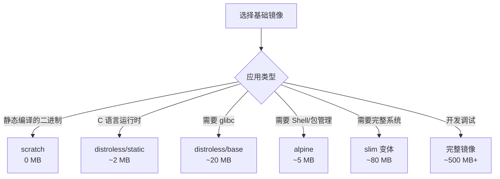

| 基础镜像 | 大小 | 包含内容 | 适用场景 |
|----------|------|----------|----------|
| `scratch` | 0 MB | 无 | 静态编译的 Go/Rust 二进制 |
| `distroless/static` | ~2 MB | glibc | C/C++ 静态链接应用 |
| `distroless/base` | ~20 MB | glibc + OpenSSL | Java/Python 最小运行时 |
| `alpine` | ~5 MB | musl + BusyBox | 需要包管理的场景 |
| `*-slim` | ~80 MB | 精简的系统包 | 开发和生产通用 |
| `完整镜像` | ~500 MB+ | 完整系统 | 开发调试 |

### 8.3 镜像内容信任

```bash
# 启用 Docker Content Trust
export DOCKER_CONTENT_TRUST=1

# 推送签名镜像
docker push myregistry/myapp:1.0.0

# 拉取时验证签名
docker pull myregistry/myapp:1.0.0
```

### 8.4 安全扫描集成

```bash
# 使用 docker scout 扫描
docker scout cves myapp:latest

# 使用 Trivy 扫描
trivy image myapp:latest

# 在 CI/CD 中集成
docker build -t myapp .
trivy image --exit-code 1 --severity HIGH,CRITICAL myapp:latest
```

### 8.5 避免敏感信息泄露

```dockerfile
# ❌ 不推荐：在 Dockerfile 中硬编码密钥
ARG DB_PASSWORD=mysecretpassword
ENV API_KEY=sk-1234567890

# ✅ 推荐：使用运行时环境变量或 Docker Secrets
# 运行时传入
# docker run -e DB_PASSWORD=mysecretpassword myapp

# 使用 Docker Secrets（Swarm 模式）
# docker secret create db_password -
# docker service create --secret db_password myapp
```

::: warning 删除敏感数据也要注意
即使使用 `RUN rm -f /secrets/file` 删除敏感文件，该文件仍然存在于之前的镜像层中。正确的做法是：
1. 不要将敏感文件复制到镜像中
2. 使用多阶段构建确保敏感数据不会传递到最终镜像
3. 使用 BuildKit 的 `--mount=type=secret` 挂载密钥
:::

```dockerfile
# 使用 BuildKit Secret 挂载
# syntax=docker/dockerfile:1

RUN --mount=type=secret,id=npmrc,target=/root/.npmrc \
    npm install
```

```bash
# 构建时传入 Secret
docker build --secret id=npmrc,src=$HOME/.npmrc -t myapp .
```

## 九、生产级 Dockerfile 模板

### 9.1 Web 应用模板

```dockerfile
# syntax=docker/dockerfile:1

# ===== 元数据 =====
LABEL org.opencontainers.image.title="Web Application" \
      org.opencontainers.image.description="Production Web Application" \
      org.opencontainers.image.version="1.0.0"

# ===== 构建 =====
FROM node:20-alpine AS builder

WORKDIR /app

COPY package.json package-lock.json ./
RUN npm ci

COPY . .
RUN npm run build

# ===== 运行 =====
FROM node:20-alpine AS runtime

RUN apk add --no-cache tini

RUN addgroup -S appgroup && adduser -S appuser -G appgroup

WORKDIR /app

COPY --from=builder /app/dist ./dist
COPY --from=builder /app/node_modules ./node_modules
COPY --from=builder /app/package.json .
COPY --chown=appuser:appgroup entrypoint.sh /app/

USER appuser

ENV NODE_ENV=production \
    PORT=3000

EXPOSE 3000

HEALTHCHECK --interval=30s --timeout=3s --start-period=10s --retries=3 \
    CMD wget --no-verbose --tries=1 --spider http://localhost:3000/health || exit 1

ENTRYPOINT ["/sbin/tini", "--"]
CMD ["node", "dist/server.js"]
```

### 9.2 API 服务模板

```dockerfile
# syntax=docker/dockerfile:1

# ===== 元数据 =====
ARG APP_VERSION=1.0.0
LABEL org.opencontainers.image.version="${APP_VERSION}"

# ===== 构建 =====
FROM golang:1.22-alpine AS builder

ENV CGO_ENABLED=0 \
    GOOS=linux

WORKDIR /build

COPY go.mod go.sum ./
RUN go mod download

COPY . .
RUN go build -ldflags="-s -w -X main.version=${APP_VERSION}" -o /app/api ./cmd/api

# ===== 运行 =====
FROM gcr.io/distroless/static-debian12:nonroot

COPY --from=builder /app/api /app/api
COPY --from=builder /build/configs /app/configs

EXPOSE 8080

HEALTHCHECK --interval=30s --timeout=3s --retries=3 \
    CMD ["/app/api", "--health-check"]

ENTRYPOINT ["/app/api"]
CMD ["--config", "/app/configs/production.yaml"]
```

### 9.3 Worker 服务模板

```dockerfile
# syntax=docker/dockerfile:1

# ===== 构建 =====
FROM python:3.12-slim AS builder

WORKDIR /app

COPY requirements.txt .
RUN pip install --no-cache-dir --user -r requirements.txt

# ===== 运行 =====
FROM python:3.12-slim

RUN groupadd -r worker && useradd -r -g worker -d /app worker

WORKDIR /app

COPY --from=builder /root/.local /root/.local
COPY --chown=worker:worker . .

ENV PATH=/root/.local/bin:$PATH \
    PYTHONUNBUFFERED=1

USER worker

CMD ["celery", "-A", "tasks", "worker", "--loglevel=info", "--concurrency=4"]
```

### 9.4 微服务模板

```dockerfile
# syntax=docker/dockerfile:1

ARG SERVICE_NAME=order-service
ARG SERVICE_VERSION=1.0.0

# ===== 构建 =====
FROM mcr.microsoft.com/dotnet/sdk:8.0 AS builder

ARG SERVICE_NAME

WORKDIR /src

COPY Directory.Build.props .
COPY src/${SERVICE_NAME}/${SERVICE_NAME}.csproj ./
RUN dotnet restore

COPY src/${SERVICE_NAME}/ .
RUN dotnet publish -c Release -o /app/publish \
    --no-restore \
    /p:PublishTrimmed=true

# ===== 运行 =====
FROM mcr.microsoft.com/dotnet/aspnet:8.0-alpine

RUN addgroup -S appgroup && adduser -S appuser -G appgroup

WORKDIR /app

COPY --from=builder /app/publish .

ENV DOTNET_SYSTEM_GLOBALIZATION_INVARIANT=1 \
    ASPNETCORE_URLS=http://+:8080 \
    ASPNETCORE_ENVIRONMENT=Production

USER appuser

EXPOSE 8080

HEALTHCHECK --interval=15s --timeout=3s --start-period=10s --retries=3 \
    CMD wget --no-verbose --tries=1 --spider http://localhost:8080/health || exit 1

ENTRYPOINT ["./order-service"]
```

## 十、Dockerfile 指令编写顺序最佳实践

### 10.1 推荐的指令顺序

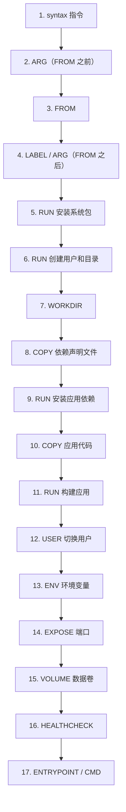

### 10.2 顺序的理由

```dockerfile
# 1. BuildKit 语法指令
# syntax=docker/dockerfile:1

# 2. FROM 前的 ARG（用于 FROM 指令）
ARG NODE_VERSION=20

# 3. 基础镜像
FROM node:${NODE_VERSION}-alpine

# 4. 元数据
LABEL maintainer="devops@example.com"

# 5. FROM 后的 ARG
ARG BUILD_ENV=production

# 6. 安装系统级依赖（变更频率最低）
RUN apk add --no-cache curl tini

# 7. 创建用户
RUN addgroup -S appgroup && adduser -S appuser -G appgroup

# 8. 设置工作目录
WORKDIR /app

# 9. 复制依赖声明文件（利用缓存）
COPY package.json package-lock.json ./

# 10. 安装应用依赖（依赖声明不变则缓存命中）
RUN npm ci --only=production

# 11. 复制应用代码（变更频率最高）
COPY . .

# 12. 切换到非 root 用户
USER appuser

# 13. 环境变量
ENV NODE_ENV=production \
    PORT=3000

# 14. 声明端口
EXPOSE 3000

# 15. 健康检查
HEALTHCHECK --interval=30s --timeout=3s \
    CMD wget --spider http://localhost:3000/health || exit 1

# 16. 启动命令
ENTRYPOINT ["/sbin/tini", "--"]
CMD ["node", "server.js"]
```

## 十一、构建缓存判定详解

### 11.1 完整缓存判定流程

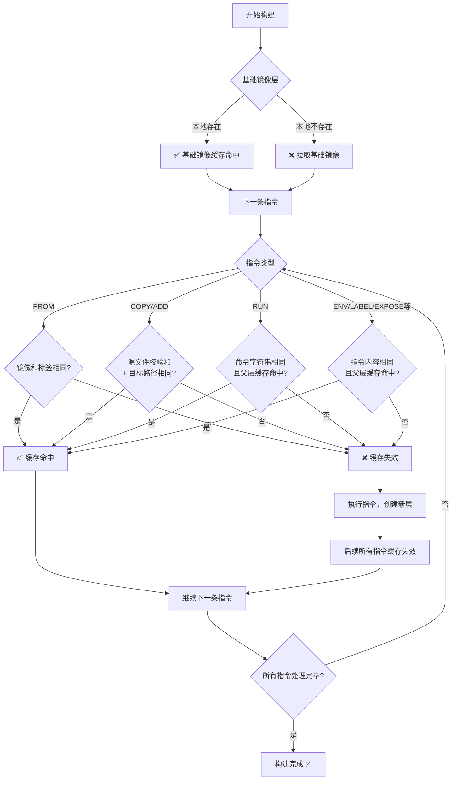

### 11.2 `--no-cache` 与 `--cache-from`

```bash
# 完全不使用缓存
docker build --no-cache -t myapp .

# 使用远程镜像作为缓存源（CI/CD 场景）
docker build --cache-from myregistry/myapp:cache -t myapp .

# 多阶段构建中使用缓存
docker build \
    --cache-from myregistry/myapp:builder-cache \
    --cache-from myregistry/myapp:latest \
    -t myapp:latest .
```

### 11.3 BuildKit 高级缓存特性

```dockerfile
# syntax=docker/dockerfile:1

# 使用缓存挂载（跨构建共享缓存）
RUN --mount=type=cache,target=/root/.cache/pip \
    pip install -r requirements.txt

# 使用缓存挂载 + 共享模式
RUN --mount=type=cache,target=/root/.npm,sharing=locked \
    npm ci

# 导出缓存到 registry
# docker buildx build --push -t myregistry/myapp:latest \
#   --cache-to type=registry,ref=myregistry/myapp:cache \
#   --cache-from type=registry,ref=myregistry/myapp:cache
```

## 十二、常见反模式与修复

### 12.1 反模式汇总

| 反模式 | 问题 | 修复 |
|--------|------|------|
| `FROM ubuntu:latest` | 标签可变，构建不可复现 | 使用固定版本标签 |
| 多条 `RUN apt-get install` | 多层叠加，镜像膨胀 | 合并为一条 `RUN` |
| `RUN apt-get update` 后未清理 | APT 缓存残留 | 同一 `RUN` 中 `rm -rf /var/lib/apt/lists/*` |
| `COPY . /app` 放最前面 | 任何文件变化都导致缓存失效 | 先复制依赖文件 |
| 使用 `ADD` 复制普通文件 | 行为不明确 | 使用 `COPY` |
| 使用 `latest` 标签 | 构建不可复现 | 使用固定版本 |
| 以 root 运行 | 安全风险 | 使用 `USER` 指令 |
| 硬编码密钥 | 安全泄露 | 使用 Secrets 或运行时环境变量 |
| 缺少 `.dockerignore` | 构建上下文过大 | 添加 `.dockerignore` |
| 缺少 `HEALTHCHECK` | 编排器无法判断健康状态 | 添加 `HEALTHCHECK` |

### 12.2 反模式修复示例

```dockerfile
# ===== 反模式示例 =====
FROM ubuntu                          # ❌ 无版本标签
RUN apt-get update                   # ❌ 未合并
RUN apt-get install -y python3       # ❌ 未合并
RUN apt-get install -y pip           # ❌ 未合并
COPY . /app                          # ❌ 全量复制放最前
RUN pip install -r requirements.txt  # ❌ 未清理缓存
EXPOSE 80                            # ❌ 无健康检查
CMD python3 app.py                   # ❌ root 运行，无 tini

# ===== 修复后 =====
FROM python:3.12-slim AS builder

WORKDIR /app

COPY requirements.txt .
RUN pip install --no-cache-dir -r requirements.txt

COPY . .

FROM python:3.12-slim

RUN groupadd -r appgroup && useradd -r -g appgroup -d /app appuser

WORKDIR /app

COPY --from=builder /app .
COPY --chown=appuser:appgroup entrypoint.sh .

USER appuser

ENV PYTHONUNBUFFERED=1

EXPOSE 8000

HEALTHCHECK --interval=30s --timeout=3s \
    CMD python3 -c "import urllib.request; urllib.request.urlopen('http://localhost:8000/health')"

ENTRYPOINT ["/app/entrypoint.sh"]
CMD ["python3", "app.py"]
```

## 十三、BuildKit 特性一览

### 13.1 启用 BuildKit

```bash
# 方式一：环境变量
export DOCKER_BUILDKIT=1
docker build -t myapp .

# 方式二：使用 buildx
docker buildx build -t myapp .

# 方式三：Docker 配置
# /etc/docker/daemon.json
{
  "features": {
    "buildkit": true
  }
}
```

### 13.2 BuildKit 独有特性

```dockerfile
# syntax=docker/dockerfile:1

# 1. Secret 挂载
RUN --mount=type=secret,id=github_token \
    git clone https://$(cat /run/secrets/github_token)@github.com/org/repo.git

# 2. SSH Agent 转发
RUN --mount=type=ssh \
    git clone git@github.com:org/repo.git

# 3. 缓存挂载
RUN --mount=type=cache,target=/root/.cache/pip \
    pip install -r requirements.txt

# 4. 绑定挂载
RUN --mount=type=bind,from=builder,source=/app/dist,target=/dist \
    cp -r /dist /app/

# 5. 并行构建阶段
# BuildKit 自动分析阶段依赖，并行执行无依赖的阶段

# 6. Here-doc 语法（Dockerfile 1.4+）
RUN <<EOF
apt-get update
apt-get install -y curl
rm -rf /var/lib/apt/lists/*
EOF
```

## 十四、多平台构建

### 14.1 使用 buildx 构建多平台镜像

```bash
# 创建 buildx 构建器
docker buildx create --name mybuilder --use

# 构建多平台镜像
docker buildx build --platform linux/amd64,linux/arm64 -t myapp:latest .

# 构建并推送到 Registry
docker buildx build --platform linux/amd64,linux/arm64 \
    -t myregistry/myapp:latest --push .
```

### 14.2 多平台 Dockerfile 技巧

```dockerfile
# 使用 TARGETARCH 变量
FROM golang:1.22-alpine AS builder

ARG TARGETARCH
ARG TARGETOS

ENV GOOS=${TARGETOS} GOARCH=${TARGETARCH}

WORKDIR /build
COPY . .
RUN go build -ldflags="-s -w" -o /app/server

# 运行时使用对应平台的基础镜像
FROM alpine:3.19
COPY --from=builder /app/server /app/server
ENTRYPOINT ["/app/server"]
```

## 十五、Dockerfile 调试技巧

### 15.1 逐层调试

```bash
# 查看镜像构建历史
docker history myapp:latest

# 查看每层的详细内容
docker history --no-trunc myapp:latest

# 进入某一层调试
docker run --rm -it --entrypoint /bin/sh <image-id>

# 使用 dive 工具分析每层差异
dive myapp:latest
```

### 15.2 构建过程调试

```bash
# 详细输出构建过程
docker build --progress=plain -t myapp .

# 调试特定阶段
docker build --target builder -t myapp:builder .

# 使用交互式构建调试
# docker build --progress=plain --no-cache -t myapp . 2>&1 | tee build.log
```

### 15.3 运行时调试

```bash
# 覆盖 ENTRYPOINT 进入容器
docker run --rm -it --entrypoint /bin/sh myapp:latest

# 查看容器内环境变量
docker run --rm myapp:latest env

# 查看容器内文件系统
docker run --rm myapp:latest ls -la /app

# 使用 docker exec 进入运行中的容器
docker exec -it <container-id> /bin/sh
```

## 十六、综合案例：完整的 CI/CD Dockerfile

```dockerfile
# syntax=docker/dockerfile:1

# ===== 全局 ARG =====
ARG NODE_VERSION=20
ARG ALPINE_VERSION=3.19

# ===== 元数据 =====
LABEL org.opencontainers.image.title="Production Node.js Application" \
      org.opencontainers.image.description="High-performance Node.js web service" \
      org.opencontainers.image.licenses="MIT"

# ===== Stage 1: 依赖安装 =====
FROM node:${NODE_VERSION}-alpine${ALPINE_VERSION} AS deps

WORKDIR /app

COPY package.json package-lock.json ./
RUN --mount=type=cache,target=/root/.npm,sharing=locked \
    npm ci --only=production

# ===== Stage 2: 构建 =====
FROM node:${NODE_VERSION}-alpine${ALPINE_VERSION} AS builder

WORKDIR /app

COPY package.json package-lock.json ./
RUN --mount=type=cache,target=/root/.npm,sharing=locked \
    npm ci

COPY . .
RUN npm run build && \
    npm prune --production

# ===== Stage 3: 运行 =====
FROM node:${NODE_VERSION}-alpine${ALPINE_VERSION} AS runner

# 安装运行时工具
RUN apk add --no-cache tini dumb-init

# 创建非 root 用户
RUN addgroup -S nodejs && adduser -S nextjs -G nodejs

WORKDIR /app

# 复制构建产物
COPY --from=builder --chown=nextjs:nodejs /app/dist ./dist
COPY --from=builder --chown=nextjs:nodejs /app/node_modules ./node_modules
COPY --from=builder --chown=nextjs:nodejs /app/package.json .
COPY --chown=nextjs:nodejs entrypoint.sh .

# 设置权限
RUN chmod +x entrypoint.sh

# 切换用户
USER nextjs

# 环境变量
ENV NODE_ENV=production \
    PORT=3000 \
    LOG_LEVEL=info

# 声明端口
EXPOSE 3000

# 健康检查
HEALTHCHECK --interval=30s --timeout=5s --start-period=10s --retries=3 \
    CMD wget --no-verbose --tries=1 --spider http://localhost:3000/health || exit 1

# 入口点
ENTRYPOINT ["/sbin/tini", "--"]
CMD ["node", "dist/server.js"]
```

::: tip 本章要点回顾
1. **指令理解**：每条 Dockerfile 指令都有其适用场景和最佳实践
2. **指令对比**：COPY vs ADD、ENTRYPOINT vs CMD、ARG vs ENV 的区别是面试和工作中的高频考点
3. **构建缓存**：理解缓存机制是优化构建速度的关键——低频变动的指令放前面
4. **多阶段构建**：分离构建环境和运行环境，显著减小镜像体积
5. **安全实践**：使用非 root 用户、最小基础镜像、不硬编码密钥
6. **Lint 工具**：使用 hadolint 自动检查 Dockerfile 中的问题
7. **BuildKit**：善用 BuildKit 的缓存挂载、Secret 挂载等高级特性
:::

## 参考资源

- [Dockerfile Reference — Docker Documentation](https://docs.docker.com/engine/reference/builder/)
- [Best practices for writing Dockerfiles — Docker Documentation](https://docs.docker.com/develop/develop-images/dockerfile_best-practices/)
- [BuildKit — GitHub](https://github.com/moby/buildkit)
- [hadolint — Haskell Dockerfile Linter](https://github.com/hadolint/hadolint)
- [Distroless Images — GoogleContainerTools](https://github.com/GoogleContainerTools/distroless)
- [OCI Image Specification](https://github.com/opencontainers/image-spec)
- [Docker Buildx — Docker Documentation](https://docs.docker.com/buildx/working-with-buildx/)
