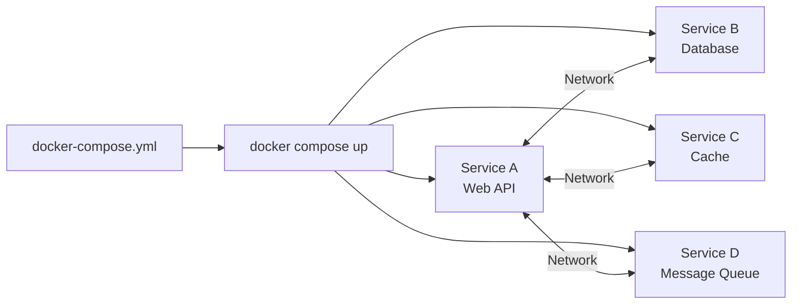
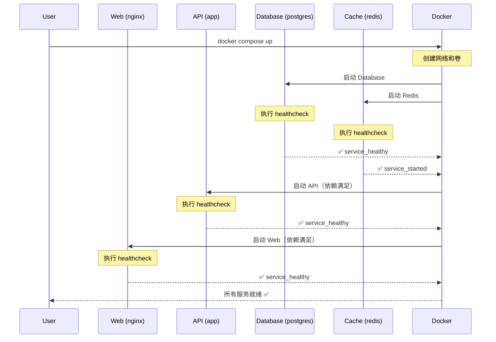
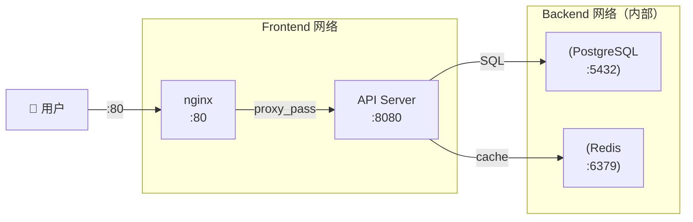
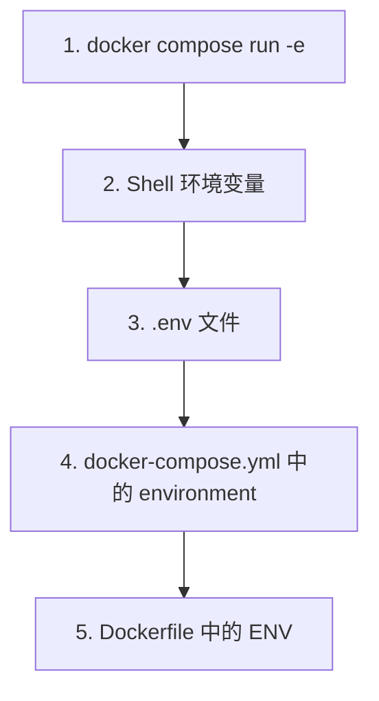
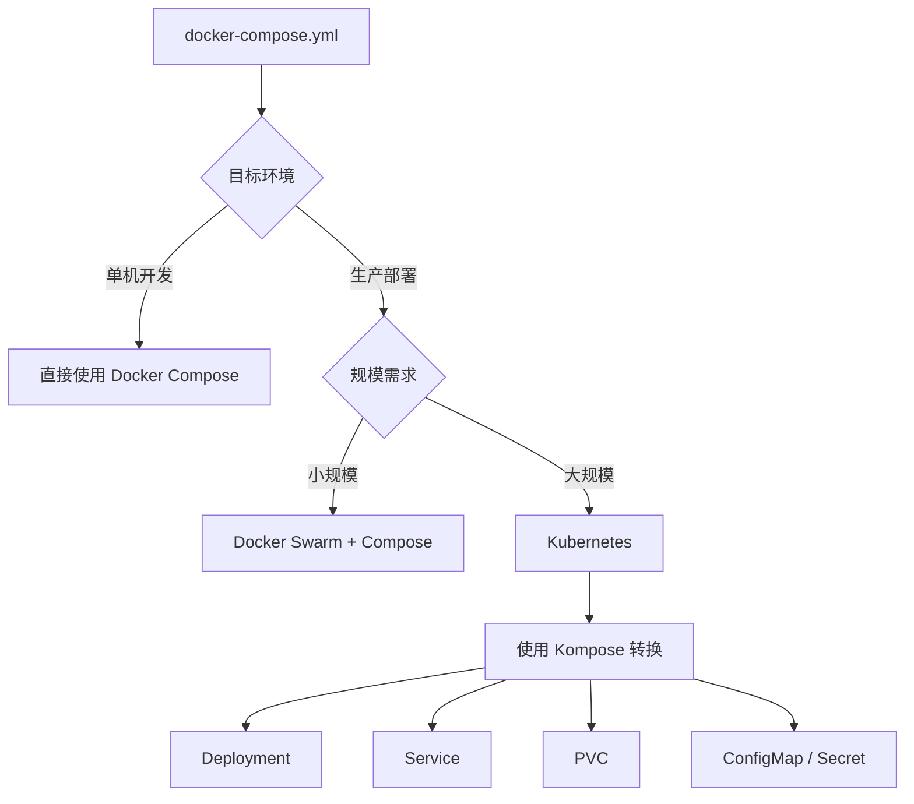

# Docker Compose 编排

::: info 本章导读
Docker Compose 是定义和运行多容器应用的工具。通过一个 `docker-compose.yml` 文件，你可以描述整个应用的架构——服务、网络、卷、配置——然后用一条命令启动全部。本文将深入 Compose 的每个配置项，讲解服务依赖、网络、卷、环境变量管理，以及多环境配置和完整项目实战。
:::

## 一、Docker Compose 概述

### 1.1 什么是 Docker Compose

Docker Compose 是 Docker 官方的容器编排工具，用于定义和管理多容器应用。它使用 YAML 文件声明式地描述应用架构，然后通过单条命令创建和启动所有服务。



### 1.2 Compose V1 vs V2

| 特性 | V1 (`docker-compose`) | V2 (`docker compose`) |
|------|----------------------|----------------------|
| 安装方式 | 独立二进制 | Docker CLI 插件 |
| 命令格式 | `docker-compose up` | `docker compose up` |
| Go 重写 | Python 实现 | Go 实现 |
| 性能 | 较慢 | 显著提升 |
| 支持 | 已废弃 | 持续维护 |
| Compose 文件格式 | 2.x / 3.x | 所有格式 |

::: important 始终使用 Compose V2
Docker Compose V1 已于 2023 年 7 月停止维护。请使用 V2 的 `docker compose` 命令（无连字符）。
:::

### 1.3 Compose 文件版本

```yaml
# Compose 文件格式版本
# 版本 1：无 version 字段，仅支持 services
# 版本 2.x：支持 volumes、networks
# 版本 3.x：支持 deploy（Swarm 模式）

# 当前推荐：不指定 version（Compose V2 自动推断）
# 或使用 version: "3.9"（最广泛的兼容版本）
```

## 二、docker-compose.yml 完整语法

### 2.1 顶层结构

```yaml
# docker-compose.yml 顶层结构
version: "3.9"          # Compose 文件格式版本（可选）

services:                # 服务定义（必需）
  service-a:
    # ...
  service-b:
    # ...

networks:                # 自定义网络（可选）
  frontend:
    # ...
  backend:
    # ...

volumes:                 # 命名卷（可选）
  db-data:
    # ...
  redis-data:
    # ...

configs:                 # 配置文件（Swarm 模式，可选）
  app-config:
    # ...

secrets:                 # 密钥（Swarm 模式，可选）
  db-password:
    # ...
```

### 2.2 Services 完整配置

```yaml
services:
  myapp:
    # ===== 镜像与构建 =====
    image: myapp:latest                        # 使用已有镜像
    build:                                     # 或从 Dockerfile 构建
      context: .                               # 构建上下文路径
      dockerfile: Dockerfile.prod              # Dockerfile 文件名
      args:                                    # 构建参数
        NODE_VERSION: "20"
        APP_ENV: production
      cache_from:                              # 缓存源
        - myapp:cache
      target: production                      # 多阶段构建目标
      labels:                                  # 构建标签
        com.example.app: "myapp"
      ssh:                                     # SSH 转发
        - default

    # ===== 容器配置 =====
    container_name: myapp-container             # 容器名称
    hostname: myapp-server                     # 容器主机名
    domainname: example.com                    # 域名
    mac_address: "02:42:ac:11:00:01"           # MAC 地址
    privileged: false                          # 特权模式
    user: "1000:1000"                          # 运行用户
    working_dir: /app                          # 工作目录
    entrypoint: ["/app/entrypoint.sh"]         # 入口点
    command: ["node", "server.js"]             # 默认命令
    init: true                                 # 启用 tini init

    # ===== 环境变量 =====
    environment:
      NODE_ENV: production
      PORT: "3000"
      DATABASE_URL: postgres://user:pass@db:5432/mydb
    env_file:
      - .env
      - .env.production

    # ===== 端口映射 =====
    ports:
      - "3000:3000"                           # 主机:容器
      - "127.0.0.1:3001:3001"                 # 绑定到指定接口
      - "9090-9091:8080-8081"                 # 端口范围
      - "127.0.0.1:50000:5000/udp"            # UDP 协议

    # ===== 网络配置 =====
    networks:
      - frontend
      - backend
    extra_hosts:
      - "host.docker.internal:host-gateway"
    dns:
      - 8.8.8.8
      - 8.8.4.4
    dns_search:
      - example.com

    # ===== 卷挂载 =====
    volumes:
      - app-data:/app/data                     # 命名卷
      - ./src:/app/src                         # 绑定挂载
      - /tmp/app:/app/tmp                      # 绝对路径绑定
      - app-config:/app/config:ro              # 只读挂载
      - type: tmpfs                            # tmpfs 挂载
        target: /app/tmp
        tmpfs:
          size: 100m

    # ===== 依赖关系 =====
    depends_on:
      db:
        condition: service_healthy
      redis:
        condition: service_started

    # ===== 健康检查 =====
    healthcheck:
      test: ["CMD", "curl", "-f", "http://localhost:3000/health"]
      interval: 30s
      timeout: 5s
      retries: 3
      start_period: 10s

    # ===== 重启策略 =====
    restart: unless-stopped

    # ===== 资源限制 =====
    deploy:
      resources:
        limits:
          cpus: "2.0"
          memory: 512M
        reservations:
          cpus: "0.5"
          memory: 256M

    # ===== 日志配置 =====
    logging:
      driver: json-file
      options:
        max-size: "10m"
        max-file: "3"

    # ===== 安全配置 =====
    security_opt:
      - no-new-privileges:true
    read_only: true
    cap_drop:
      - ALL
    cap_add:
      - NET_BIND_SERVICE

    # ===== 标签 =====
    labels:
      com.example.app: "myapp"
      com.example.env: "production"

    # ===== 其他 =====
    stdin_open: true          # -i
    tty: true                 # -t
    stop_grace_period: 30s    # 停止超时
    stop_signal: SIGTERM      # 停止信号
    tmpfs:
      - /app/tmp
    ulimits:
      nofile:
        soft: 65536
        hard: 65536
```

### 2.3 Networks 完整配置

```yaml
networks:
  # 默认网络（bridge）
  default:
    driver: bridge

  # 自定义 bridge 网络
  frontend:
    driver: bridge
    ipam:
      driver: default
      config:
        - subnet: "172.20.0.0/16"
          gateway: "172.20.0.1"
    driver_opts:
      com.docker.network.bridge.name: "frontend-br"
    labels:
      com.example.network: "frontend"

  # 后端网络
  backend:
    driver: bridge
    internal: true                    # 内部网络，无法访问外网
    ipam:
      config:
        - subnet: "172.21.0.0/16"

  # overlay 网络（Swarm 模式）
  app-net:
    driver: overlay
    attachable: true                  # 允许独立容器连接
    driver_opts:
      encrypted: "true"              # 加密传输

  # 外部已有网络
  external-net:
    external: true
    name: existing-network

  # macvlan 网络
  macvlan-net:
    driver: macvlan
    driver_opts:
      parent: eth0
    ipam:
      config:
        - subnet: "192.168.1.0/24"
          gateway: "192.168.1.1"
```

### 2.4 Volumes 完整配置

```yaml
volumes:
  # 命名卷（默认 local 驱动）
  db-data:
    driver: local
    driver_opts:
      type: none
      o: bind
      device: /data/postgres

  # NFS 卷
  nfs-data:
    driver: local
    driver_opts:
      type: nfs
      o: addr=192.168.1.100,rw,nolock
      device: ":/export/data"

  # 外部已有卷
  existing-volume:
    external: true
    name: my-existing-volume

  # 带标签的卷
  app-data:
    driver: local
    labels:
      com.example.volume: "app-data"
```

### 2.5 Configs 完整配置

```yaml
configs:
  # 文件配置
  app-config:
    file: ./config/app.yml

  # 外部配置
  nginx-config:
    external: true
    name: nginx-production-config

# 在服务中使用
services:
  app:
    configs:
      - source: app-config
        target: /app/config.yml
        uid: "1000"
        gid: "1000"
        mode: 0444
```

### 2.6 Secrets 完整配置

```yaml
secrets:
  # 文件密钥
  db-password:
    file: ./secrets/db-password.txt

  # 外部密钥
  api-key:
    external: true
    name: production-api-key

  # 环境变量密钥
  tls-cert:
    environment: TLS_CERT

# 在服务中使用
services:
  app:
    secrets:
      - source: db-password
        target: db_password
        uid: "1000"
        gid: "1000"
        mode: 0400
```

## 三、服务依赖

### 3.1 depends_on 配置

```yaml
services:
  web:
    image: nginx:alpine
    depends_on:
      api:
        condition: service_healthy
      db:
        condition: service_healthy
    ports:
      - "80:80"

  api:
    image: myapp-api:latest
    depends_on:
      db:
        condition: service_healthy
      redis:
        condition: service_started
    healthcheck:
      test: ["CMD", "curl", "-f", "http://localhost:8080/health"]
      interval: 10s
      timeout: 5s
      retries: 5
      start_period: 15s

  db:
    image: postgres:16-alpine
    healthcheck:
      test: ["CMD-SHELL", "pg_isready -U postgres"]
      interval: 5s
      timeout: 3s
      retries: 10
    environment:
      POSTGRES_PASSWORD: ${DB_PASSWORD}
      POSTGRES_DB: myapp

  redis:
    image: redis:7-alpine
    healthcheck:
      test: ["CMD", "redis-cli", "ping"]
      interval: 10s
      timeout: 3s
      retries: 5
```

### 3.2 服务依赖与启动顺序



### 3.3 condition 类型

| condition 值 | 说明 |
|--------------|------|
| `service_started` | 依赖服务已启动（默认） |
| `service_healthy` | 依赖服务健康检查通过 |
| `service_completed_successfully` | 依赖服务成功退出（一次性任务） |

```yaml
services:
  # 数据库迁移（一次性任务）
  migrate:
    image: myapp:latest
    command: ["python", "manage.py", "migrate"]
    depends_on:
      db:
        condition: service_healthy

  # 应用服务（等待迁移完成）
  app:
    image: myapp:latest
    depends_on:
      migrate:
        condition: service_completed_successfully
```

### 3.4 重启策略

| 策略 | 说明 |
|------|------|
| `no` | 不自动重启（默认） |
| `always` | 总是重启（除非手动停止） |
| `unless-stopped` | 总是重启，除非手动停止后 |
| `on-failure[:max-retries]` | 仅在非零退出码时重启 |

```yaml
services:
  web:
    image: nginx:alpine
    restart: unless-stopped

  worker:
    image: myapp-worker:latest
    restart: on-failure:5

  db:
    image: postgres:16-alpine
    restart: always
```

::: tip 重启策略的选择
- **Web 服务**：使用 `unless-stopped`，确保服务持续可用
- **Worker 服务**：使用 `on-failure`，避免无限重启循环
- **数据库**：使用 `always`，确保数据服务始终可用
- **一次性任务**：使用 `no`，任务完成后不重启
:::

## 四、网络配置

### 4.1 默认网络行为

如果不指定网络，Docker Compose 会创建一个默认的 bridge 网络，所有服务都在此网络中，服务之间通过服务名作为主机名进行 DNS 解析。

```yaml
services:
  app:
    image: myapp:latest
    # 自动加入默认网络 <project>_default
    # 可以通过 http://db:5432 访问 db 服务
  db:
    image: postgres:16-alpine
    # 可以通过 http://app:3000 访问 app 服务
```

### 4.2 自定义网络

```yaml
services:
  # 前端服务：只能访问 API
  web:
    image: nginx:alpine
    networks:
      - frontend
    ports:
      - "80:80"

  # API 服务：连接前后端网络
  api:
    image: myapp-api:latest
    networks:
      - frontend
      - backend
    depends_on:
      db:
        condition: service_healthy

  # 数据库：只能被 API 访问
  db:
    image: postgres:16-alpine
    networks:
      - backend
    environment:
      POSTGRES_PASSWORD: ${DB_PASSWORD}

networks:
  frontend:
    driver: bridge
  backend:
    driver: bridge
    internal: true   # 内部网络，无法访问外网
```



### 4.3 网络别名

```yaml
services:
  api:
    image: myapp-api:latest
    networks:
      frontend:
        aliases:
          - api.internal
          - app-api
      backend:
        aliases:
          - api.backend

networks:
  frontend:
  backend:
```

### 4.4 端口映射详解

```yaml
services:
  app:
    image: myapp:latest
    ports:
      # 短格式
      - "3000:3000"                     # 所有接口
      - "127.0.0.1:3001:3001"           # 仅本地回环
      - "9090-9091:8080-8081"           # 端口范围

      # 长格式
      - target: 8080                    # 容器端口
        published: "80"                # 主机端口
        protocol: tcp                   # 协议
        mode: ingress                   # 模式（ingress/host）
```

::: important 端口映射安全建议
1. 不要将数据库端口暴露到公网（如 `5432:5432`）
2. 绑定到 `127.0.0.1` 限制本地访问
3. 生产环境使用反向代理（Nginx）暴露服务
:::

### 4.5 与外部网络互联

```yaml
services:
  app:
    image: myapp:latest
    networks:
      - default           # Compose 默认网络
      - shared-net        # 外部共享网络

networks:
  shared-net:
    external: true
    name: infrastructure_shared  # 引用已存在的外部网络
```

## 五、环境变量管理

### 5.1 环境变量优先级（从高到低）



### 5.2 .env 文件

```bash
# .env — Compose 自动加载此文件
# 用于变量替换（${VAR}）

# 应用配置
APP_NAME=MyApp
APP_ENV=production
APP_PORT=3000

# 数据库配置
DB_HOST=db
DB_PORT=5432
DB_NAME=myapp_production
DB_USER=postgres
DB_PASSWORD=super_secret_password

# Redis 配置
REDIS_HOST=redis
REDIS_PORT=6379

# 日志级别
LOG_LEVEL=info
```

### 5.3 env_file 指令

```yaml
services:
  app:
    image: myapp:latest
    # 加载多个 env 文件（后面的覆盖前面的）
    env_file:
      - .env.base
      - .env.production
    # env_file 中的变量会设置为容器的环境变量
    # 但不会用于 Compose 文件中的变量替换
```

### 5.4 environment 指令

```yaml
services:
  app:
    image: myapp:latest
    environment:
      # 键值对格式
      NODE_ENV: production
      PORT: "3000"
      # 支持引用 .env 中的变量
      DATABASE_URL: postgres://${DB_USER}:${DB_PASSWORD}@${DB_HOST}:${DB_PORT}/${DB_NAME}

  api:
    image: myapp-api:latest
    environment:
      # 列表格式
      - NODE_ENV=production
      - PORT=8080
      - DATABASE_URL=postgres://${DB_USER}:${DB_PASSWORD}@${DB_HOST}:${DB_PORT}/${DB_NAME}
```

### 5.5 多环境变量文件组织

```
project/
├── .env                    # 默认变量（Compose 自动加载，用于变量替换）
├── .env.base               # 基础变量
├── .env.development        # 开发环境变量
├── .env.staging            # 预发布环境变量
├── .env.production         # 生产环境变量
├── docker-compose.yml      # 基础 Compose 配置
├── docker-compose.dev.yml  # 开发环境覆盖
├── docker-compose.prod.yml # 生产环境覆盖
```

::: warning .env 文件安全
`.env` 文件可能包含敏感信息，务必将其添加到 `.gitignore`。可以提供 `.env.example` 作为模板。
:::

```gitignore
# .gitignore
.env
.env.*
!.env.example
```

## 六、卷挂载

### 6.1 卷类型对比

| 类型 | 语法 | 说明 | 适用场景 |
|------|------|------|----------|
| 命名卷 | `vol-name:/path` | Docker 管理 | 持久化数据 |
| 绑定挂载 | `./host:/container` | 映射主机目录 | 开发热加载 |
| tmpfs | `type:tmpfs` | 内存文件系统 | 临时数据 |
| 匿名卷 | `/container/path` | 一次性使用 | 不推荐 |

### 6.2 命名卷

```yaml
services:
  db:
    image: postgres:16-alpine
    volumes:
      - db-data:/var/lib/postgresql/data    # 命名卷持久化数据
      - db-backup:/backups                  # 备份目录

  redis:
    image: redis:7-alpine
    volumes:
      - redis-data:/data

volumes:
  db-data:
    driver: local
  db-backup:
    driver: local
  redis-data:
    driver: local
```

### 6.3 绑定挂载

```yaml
services:
  # 开发环境：热加载
  app-dev:
    image: myapp:latest
    volumes:
      - ./src:/app/src              # 源码目录
      - ./config:/app/config:ro     # 只读配置
      - ./logs:/app/logs            # 日志目录
      - /etc/timezone:/etc/timezone:ro  # 时区文件
      - /etc/localtime:/etc/localtime:ro

  # 生产环境：仅挂载必要文件
  app-prod:
    image: myapp:latest
    volumes:
      - ./config/production.yml:/app/config.yml:ro
      - app-logs:/app/logs
```

::: important 绑定挂载注意事项
1. **性能**：绑定挂载在 macOS/Windows 上性能较差，推荐使用 `:cached`（macOS）或 `:ro`（减少同步开销）
2. **权限**：绑定挂载的文件权限与主机一致，可能导致容器内权限问题
3. **只读**：配置文件建议使用 `:ro`（只读）防止容器修改主机文件
4. **SELinux**：在 RHEL/CentOS 上需要加 `:z` 或 `:Z` 后缀处理 SELinux 标签
:::

### 6.4 tmpfs 挂载

```yaml
services:
  app:
    image: myapp:latest
    tmpfs:
      - /app/tmp                    # 短格式
    volumes:
      - type: tmpfs                 # 长格式
        target: /app/cache
        tmpfs:
          size: 100000000           # 100MB 限制
          mode: 1777                # 权限模式
```

### 6.5 卷挂载高级用法

```yaml
services:
  app:
    image: myapp:latest
    volumes:
      # 命名卷 + 子路径挂载
      - data-vol:/app/data:rw

      # 绑定挂载 + 只读
      - ./config:/app/config:ro

      # 使用长格式
      - type: volume
        source: data-vol
        target: /app/data
        volume:
          nocopy: true              # 创建时不复制容器内容
        consistency: cached         # macOS 缓存一致性

volumes:
  data-vol:
    driver: local
    driver_opts:
      type: none
      o: bind
      device: /data/myapp
```

## 七、多环境配置

### 7.1 Compose Override 机制

Docker Compose 默认会自动合并 `docker-compose.yml` 和 `docker-compose.override.yml`。

```yaml
# docker-compose.yml — 基础配置
services:
  app:
    image: myapp:latest
    environment:
      NODE_ENV: development
    ports:
      - "3000:3000"
    volumes:
      - ./src:/app/src
```

```yaml
# docker-compose.override.yml — 自动合并的开发覆盖
# docker compose up 会自动合并这两个文件
services:
  app:
    # 覆盖环境变量
    environment:
      NODE_ENV: development
      DEBUG: "true"
    # 追加端口
    ports:
      - "9229:9229"     # Node.js 调试端口
    # 覆盖命令
    command: ["node", "--inspect=0.0.0.0:9229", "server.js"]
```

### 7.2 多文件显式指定

```bash
# 开发环境
docker compose -f docker-compose.yml -f docker-compose.dev.yml up

# 预发布环境
docker compose -f docker-compose.yml -f docker-compose.staging.yml up

# 生产环境
docker compose -f docker-compose.yml -f docker-compose.prod.yml up -d
```

### 7.3 完整多环境配置示例

```yaml
# docker-compose.yml — 基础配置
services:
  app:
    image: myapp:${APP_VERSION:-latest}
    networks:
      - app-network
    depends_on:
      db:
        condition: service_healthy
      redis:
        condition: service_started
    healthcheck:
      test: ["CMD", "curl", "-f", "http://localhost:3000/health"]
      interval: 30s
      timeout: 5s
      retries: 3

  db:
    image: postgres:16-alpine
    volumes:
      - db-data:/var/lib/postgresql/data
    environment:
      POSTGRES_DB: ${DB_NAME}
      POSTGRES_USER: ${DB_USER}
      POSTGRES_PASSWORD: ${DB_PASSWORD}
    healthcheck:
      test: ["CMD-SHELL", "pg_isready -U ${DB_USER}"]
      interval: 5s
      timeout: 3s
      retries: 10
    networks:
      - app-network

  redis:
    image: redis:7-alpine
    volumes:
      - redis-data:/data
    healthcheck:
      test: ["CMD", "redis-cli", "ping"]
      interval: 10s
      timeout: 3s
      retries: 5
    networks:
      - app-network

networks:
  app-network:

volumes:
  db-data:
  redis-data:
```

```yaml
# docker-compose.dev.yml — 开发环境覆盖
services:
  app:
    build:
      context: .
      dockerfile: Dockerfile.dev
    volumes:
      - ./src:/app/src
      - ./tests:/app/tests
    environment:
      NODE_ENV: development
      DEBUG: "true"
      LOG_LEVEL: debug
    ports:
      - "3000:3000"
      - "9229:9229"      # 调试端口
    command: ["node", "--inspect=0.0.0.0:9229", "server.js"]

  db:
    ports:
      - "5432:5432"      # 开发时暴露数据库端口
    environment:
      POSTGRES_DB: myapp_dev
      POSTGRES_USER: dev
      POSTGRES_PASSWORD: dev

  redis:
    ports:
      - "6379:6379"      # 开发时暴露 Redis 端口
```

```yaml
# docker-compose.prod.yml — 生产环境覆盖
services:
  app:
    image: registry.example.com/myapp:${APP_VERSION}
    restart: unless-stopped
    environment:
      NODE_ENV: production
      LOG_LEVEL: info
    ports:
      - "127.0.0.1:3000:3000"   # 仅本地可访问
    deploy:
      resources:
        limits:
          cpus: "2.0"
          memory: 512M
        reservations:
          cpus: "0.5"
          memory: 256M
    logging:
      driver: json-file
      options:
        max-size: "10m"
        max-file: "3"
    read_only: true
    security_opt:
      - no-new-privileges:true

  db:
    restart: always
    environment:
      POSTGRES_DB: ${DB_NAME}
      POSTGRES_USER: ${DB_USER}
      POSTGRES_PASSWORD: ${DB_PASSWORD}
    deploy:
      resources:
        limits:
          cpus: "4.0"
          memory: 2G

  redis:
    restart: always
    deploy:
      resources:
        limits:
          cpus: "1.0"
          memory: 256M
```

## 八、Compose 项目与 Profile

### 8.1 项目名称（Project Name）

```bash
# 默认使用当前目录名作为项目名
# 可以通过以下方式指定：

# 方式一：-p 参数
docker compose -p myproject up

# 方式二：环境变量
export COMPOSE_PROJECT_NAME=myproject
docker compose up

# 方式三：.env 文件
# COMPOSE_PROJECT_NAME=myproject

# 方式四：docker-compose.yml 顶级字段（Compose V2.22+）
# name: myproject
```

```yaml
# docker-compose.yml
name: myapp            # Compose V2.22+ 支持顶级 name 字段

services:
  app:
    image: myapp:latest
```

### 8.2 Profiles — 条件启动服务

```yaml
services:
  # 始终启动的核心服务
  app:
    image: myapp:latest
    # 没有 profiles 字段，始终启动

  # 仅在调试 Profile 下启动
  debug-tools:
    image: nicolaka/netshoot
    profiles:
      - debug
    command: ["sleep", "infinity"]

  # 仅在监控 Profile 下启动
  prometheus:
    image: prom/prometheus:latest
    profiles:
      - monitoring
    volumes:
      - ./prometheus.yml:/etc/prometheus/prometheus.yml:ro

  grafana:
    image: grafana/grafana:latest
    profiles:
      - monitoring
    ports:
      - "3001:3000"

  # 多 Profile 服务
  adminer:
    image: adminer:latest
    profiles:
      - debug
      - monitoring
    ports:
      - "8080:8080"
```

```bash
# 仅启动核心服务（无 Profile 的服务）
docker compose up -d

# 启动调试 Profile
docker compose --profile debug up -d

# 启动监控 Profile
docker compose --profile monitoring up -d

# 同时启动多个 Profile
docker compose --profile debug --profile monitoring up -d
```

## 九、常用命令

### 9.1 服务生命周期

```bash
# 启动所有服务（前台运行）
docker compose up

# 后台启动
docker compose up -d

# 启动并强制重建镜像
docker compose up -d --build

# 启动指定服务（自动启动依赖）
docker compose up app

# 停止所有服务
docker compose stop

# 停止并删除容器、网络
docker compose down

# 停止并删除容器、网络、卷
docker compose down -v

# 停止并删除容器、网络、镜像
docker compose down --rmi all

# 重启服务
docker compose restart
```

### 9.2 服务管理

```bash
# 查看服务状态
docker compose ps

# 查看服务日志
docker compose logs
docker compose logs -f app          # 实时跟踪 app 日志
docker compose logs --tail=100 app  # 最后 100 行
docker compose logs -t app          # 显示时间戳

# 在服务中执行命令
docker compose exec app sh
docker compose exec app python manage.py migrate

# 运行一次性命令
docker compose run --rm app python manage.py createsuperuser
docker compose run --rm app npm install

# 拉取镜像
docker compose pull

# 构建镜像
docker compose build
docker compose build --no-cache
docker compose build --parallel    # 并行构建
```

### 9.3 服务扩展

```bash
# 扩展服务实例数
docker compose up -d --scale worker=3

# 查看服务进程
docker compose top app
```

### 9.4 其他实用命令

```bash
# 验证配置文件
docker compose config
docker compose config --services    # 列出所有服务名
docker compose config --volumes    # 列出所有卷

# 查看服务事件
docker compose events

# 暂停/恢复服务
docker compose pause
docker compose unpause

# 查看服务端口映射
docker compose port app 3000

# 查看镜像
docker compose images

# 复制文件
docker compose cp app:/app/logs ./logs
```

## 十、服务扩展与 Deploy

### 10.1 Deploy 配置

```yaml
services:
  app:
    image: myapp:latest
    deploy:
      # 副本数
      replicas: 3

      # 资源限制
      resources:
        limits:
          cpus: "2.0"
          memory: 512M
        reservations:
          cpus: "0.5"
          memory: 256M

      # 重启策略
      restart_policy:
        condition: on-failure
        delay: 5s
        max_attempts: 3
        window: 120s

      # 更新策略
      update_config:
        parallelism: 1
        delay: 10s
        order: stop-first
        failure_action: rollback

      # 回滚策略
      rollback_config:
        parallelism: 0
        order: stop-first

      # 放置约束（Swarm 模式）
      placement:
        constraints:
          - node.role == worker
        preferences:
          - spread: node.labels.zone

      # 端口配置（Swarm 模式）
      endpoint_mode: vip
```

::: important Deploy 配置的限制
- `deploy` 配置在使用 `docker compose up` 时**仅 `resources` 配置生效**
- 完整的 `deploy` 功能（replicas、update_config、placement 等）仅在 **Swarm 模式**（`docker stack deploy`）下生效
- 非 Swarm 模式要扩展实例，使用 `docker compose up --scale`
:::

### 10.2 非 Swarm 模式下的扩展

```bash
# 启动 3 个 worker 实例
docker compose up -d --scale worker=3

# 注意：端口映射冲突问题
# 如果 worker 有端口映射（ports），多实例会冲突
# 解决方案：使用 nginx 负载均衡或只暴露内部端口
```

```yaml
# 使用 nginx 负载均衡多实例
services:
  app:
    image: myapp:latest
    # 不使用 ports，通过 nginx 代理
    networks:
      - app-network
    deploy:
      replicas: 3
    # 注意：replicas 在非 Swarm 下不生效
    # 使用 --scale 替代

  nginx:
    image: nginx:alpine
    ports:
      - "80:80"
    volumes:
      - ./nginx.conf:/etc/nginx/nginx.conf:ro
    networks:
      - app-network
    depends_on:
      - app
```

## 十一、完整示例：.NET + Redis + PostgreSQL + Nginx

### 11.1 项目结构

```
myapp/
├── src/
│   └── MyApp/
│       ├── MyApp.csproj
│       ├── Program.cs
│       └── appsettings.json
├── Dockerfile
├── docker-compose.yml
├── docker-compose.dev.yml
├── docker-compose.prod.yml
├── .env
├── .env.example
├── nginx/
│   └── nginx.conf
├── postgres/
│   └── init.sql
└── redis/
    └── redis.conf
```

### 11.2 Dockerfile

```dockerfile
# syntax=docker/dockerfile:1

# ===== 构建 =====
FROM mcr.microsoft.com/dotnet/sdk:8.0 AS builder
WORKDIR /src
COPY src/MyApp/MyApp.csproj .
RUN dotnet restore
COPY src/MyApp/ .
RUN dotnet publish -c Release -o /app/publish --no-restore

# ===== 运行 =====
FROM mcr.microsoft.com/dotnet/aspnet:8.0-alpine
RUN addgroup -S appgroup && adduser -S appuser -G appgroup
WORKDIR /app
COPY --from=builder /app/publish .
ENV ASPNETCORE_URLS=http://+:8080 \
    ASPNETCORE_ENVIRONMENT=Production
USER appuser
EXPOSE 8080
HEALTHCHECK --interval=15s --timeout=3s --retries=3 \
    CMD wget --spider http://localhost:8080/health || exit 1
ENTRYPOINT ["./MyApp"]
```

### 11.3 基础 docker-compose.yml

```yaml
name: myapp

services:
  # ===== 应用服务 =====
  app:
    build:
      context: .
      dockerfile: Dockerfile
    environment:
      ASPNETCORE_ENVIRONMENT: ${APP_ENV}
      ConnectionStrings__Default: "Host=db;Port=${DB_PORT};Database=${DB_NAME};Username=${DB_USER};Password=${DB_PASSWORD}"
      ConnectionStrings__Redis: "redis:${REDIS_PORT}"
      Redis__InstanceName: "myapp:"
    depends_on:
      db:
        condition: service_healthy
      redis:
        condition: service_healthy
    networks:
      - backend
    healthcheck:
      test: ["CMD", "wget", "--spider", "http://localhost:8080/health"]
      interval: 15s
      timeout: 3s
      retries: 3
      start_period: 10s

  # ===== 数据库 =====
  db:
    image: postgres:16-alpine
    environment:
      POSTGRES_DB: ${DB_NAME}
      POSTGRES_USER: ${DB_USER}
      POSTGRES_PASSWORD: ${DB_PASSWORD}
    volumes:
      - db-data:/var/lib/postgresql/data
      - ./postgres/init.sql:/docker-entrypoint-initdb.d/init.sql:ro
    networks:
      - backend
    healthcheck:
      test: ["CMD-SHELL", "pg_isready -U ${DB_USER} -d ${DB_NAME}"]
      interval: 5s
      timeout: 3s
      retries: 10

  # ===== 缓存 =====
  redis:
    image: redis:7-alpine
    command: redis-server /usr/local/etc/redis/redis.conf
    volumes:
      - redis-data:/data
      - ./redis/redis.conf:/usr/local/etc/redis/redis.conf:ro
    networks:
      - backend
    healthcheck:
      test: ["CMD", "redis-cli", "ping"]
      interval: 10s
      timeout: 3s
      retries: 5

  # ===== 反向代理 =====
  nginx:
    image: nginx:alpine
    volumes:
      - ./nginx/nginx.conf:/etc/nginx/nginx.conf:ro
    networks:
      - frontend
      - backend
    depends_on:
      app:
        condition: service_healthy
    healthcheck:
      test: ["CMD", "wget", "--spider", "http://localhost:80/health"]
      interval: 15s
      timeout: 3s
      retries: 3

networks:
  frontend:
    driver: bridge
  backend:
    driver: bridge
    internal: true

volumes:
  db-data:
    driver: local
  redis-data:
    driver: local
```

### 11.4 开发环境覆盖

```yaml
# docker-compose.dev.yml
services:
  app:
    build:
      context: .
      dockerfile: Dockerfile
      target: builder      # 使用构建阶段
    volumes:
      - ./src/MyApp:/app   # 热加载
    environment:
      ASPNETCORE_ENVIRONMENT: Development
      Logging__LogLevel__Default: Debug
    ports:
      - "8080:8080"
      - "5000:5000"        # 调试端口

  db:
    ports:
      - "5432:5432"        # 暴露数据库端口
    environment:
      POSTGRES_DB: myapp_dev
      POSTGRES_USER: dev
      POSTGRES_PASSWORD: dev

  redis:
    ports:
      - "6379:6379"        # 暴露 Redis 端口

  nginx:
    ports:
      - "80:80"

  # 开发工具
  adminer:
    image: adminer:latest
    profiles:
      - debug
    ports:
      - "8888:8080"
    networks:
      - backend
```

### 11.5 生产环境覆盖

```yaml
# docker-compose.prod.yml
services:
  app:
    image: registry.example.com/myapp:${APP_VERSION}
    restart: unless-stopped
    deploy:
      resources:
        limits:
          cpus: "2.0"
          memory: 512M
    logging:
      driver: json-file
      options:
        max-size: "10m"
        max-file: "5"
    read_only: true
    security_opt:
      - no-new-privileges:true

  db:
    restart: always
    deploy:
      resources:
        limits:
          cpus: "4.0"
          memory: 2G
    logging:
      driver: json-file
      options:
        max-size: "50m"
        max-file: "10"

  redis:
    restart: always
    deploy:
      resources:
        limits:
          cpus: "1.0"
          memory: 256M

  nginx:
    restart: unless-stopped
    ports:
      - "80:80"
      - "443:443"
    volumes:
      - ./nginx/nginx.prod.conf:/etc/nginx/nginx.conf:ro
      - ./nginx/ssl:/etc/nginx/ssl:ro
    deploy:
      resources:
        limits:
          cpus: "1.0"
          memory: 128M
```

### 11.6 Nginx 配置

```nginx
# nginx/nginx.conf
worker_processes auto;
error_log /var/log/nginx/error.log warn;

events {
    worker_connections 1024;
}

http {
    upstream app {
        server app:8080;
    }

    server {
        listen 80;
        server_name _;

        location /health {
            proxy_pass http://app/health;
        }

        location / {
            proxy_pass http://app;
            proxy_set_header Host $host;
            proxy_set_header X-Real-IP $remote_addr;
            proxy_set_header X-Forwarded-For $proxy_add_x_forwarded_for;
            proxy_set_header X-Forwarded-Proto $scheme;
        }
    }
}
```

### 11.7 环境变量文件

```bash
# .env.example
APP_VERSION=1.0.0
APP_ENV=Development
DB_NAME=myapp
DB_USER=postgres
DB_PASSWORD=changeme
DB_PORT=5432
REDIS_PORT=6379
```

### 11.8 启动命令

```bash
# 开发环境
docker compose -f docker-compose.yml -f docker-compose.dev.yml up -d

# 开发环境 + 调试工具
docker compose -f docker-compose.yml -f docker-compose.dev.yml --profile debug up -d

# 生产环境
docker compose -f docker-compose.yml -f docker-compose.prod.yml up -d

# 查看日志
docker compose logs -f app

# 运行数据库迁移
docker compose exec app dotnet ef database update

# 停止并清理
docker compose -f docker-compose.yml -f docker-compose.prod.yml down -v
```

## 十二、Compose 与 CI/CD

### 12.1 GitHub Actions 集成

```yaml
name: CI/CD

on:
  push:
    branches: [main]

jobs:
  test:
    runs-on: ubuntu-latest
    steps:
      - uses: actions/checkout@v4

      - name: Start services
        run: docker compose -f docker-compose.yml -f docker-compose.test.yml up -d

      - name: Wait for services
        run: |
          timeout 60 bash -c 'until docker compose exec -T app curl -f http://localhost:8080/health; do sleep 2; done'

      - name: Run integration tests
        run: docker compose exec -T app npm test

      - name: Collect logs
        if: failure()
        run: docker compose logs

      - name: Tear down
        if: always()
        run: docker compose down -v
```

### 12.2 GitLab CI 集成

```yaml
stages:
  - test
  - build
  - deploy

integration-test:
  stage: test
  services:
    - docker:dind
  script:
    - docker compose -f docker-compose.yml -f docker-compose.test.yml up -d
    - sleep 30
    - docker compose exec -T app pytest tests/integration/
    - docker compose down -v

build-and-push:
  stage: build
  script:
    - docker compose build app
    - docker tag myapp:latest $CI_REGISTRY_IMAGE:$CI_COMMIT_SHA
    - docker push $CI_REGISTRY_IMAGE:$CI_COMMIT_SHA
  only:
    - main
```

## 十三、Compose Watch（V2.22+）

### 13.1 开发时自动同步

```yaml
services:
  app:
    build:
      context: .
      dockerfile: Dockerfile
    develop:
      watch:
        # 源码变化时同步到容器
        - action: sync
          path: ./src
          target: /app/src

        # 配置变化时重建镜像
        - action: rebuild
          path: ./package.json

        # Dockerfile 变化时重建并重启
        - action: rebuild
          path: ./Dockerfile
```

```bash
# 启动 watch 模式
docker compose watch
```

## 十四、Compose 常见问题与排障

### 14.1 常见问题

| 问题 | 原因 | 解决方案 |
|------|------|----------|
| 服务间无法通信 | 不在同一网络 | 确保服务在相同网络中 |
| DNS 解析失败 | 服务名拼写错误 | 使用服务名作为主机名 |
| 端口冲突 | 多服务映射同一端口 | 使用不同端口或只暴露内部端口 |
| 卷数据丢失 | 使用匿名卷 | 使用命名卷持久化 |
| 环境变量未生效 | 优先级问题 | 检查 `.env` 和 `environment` 的优先级 |
| 构建缓存失效 | 构建上下文过大 | 使用 `.dockerignore` |
| 健康检查超时 | 启动时间不够 | 增大 `start_period` |

### 14.2 排障命令

```bash
# 查看服务日志
docker compose logs -f --tail=100 app

# 进入容器调试
docker compose exec app sh

# 查看网络详情
docker network inspect myapp_default

# 查看卷详情
docker volume inspect myapp_db-data

# 查看容器进程
docker compose top

# 验证配置
docker compose config

# 查看资源使用
docker compose stats
```

### 14.3 清理资源

```bash
# 停止并删除所有容器、网络
docker compose down

# 同时删除卷
docker compose down -v

# 同时删除镜像
docker compose down --rmi all

# 删除所有停止的容器
docker container prune

# 删除所有未使用的卷
docker volume prune

# 删除所有未使用的网络
docker network prune

# 一键清理所有未使用资源
docker system prune -a --volumes
```

## 十五、Compose 与 Kubernetes 的关系

### 15.1 从 Compose 到 Kubernetes



### 15.2 Kompose 转换工具

```bash
# 安装 Kompose
# macOS
brew install kompose

# Linux
curl -L https://github.com/kubernetes/kompose/releases/download/v1.34.0/kompose-linux-amd64 -o kompose
chmod +x kompose

# 转换 Compose 文件到 Kubernetes 资源
kompose convert -f docker-compose.yml

# 直接部署到 Kubernetes
kompose up -f docker-compose.yml

# 从 Kubernetes 删除部署
kompose down -f docker-compose.yml
```

::: tip Compose 与 Kubernetes 的选择
- **开发环境**：使用 Docker Compose，简单高效
- **小型生产**：可以使用 Docker Compose 或 Swarm
- **大型生产**：使用 Kubernetes，获得更好的扩展性和运维能力
- Kompose 是一个过渡工具，但生成的 K8s 资源可能需要手动调整
:::

::: tip 本章要点回顾
1. **完整语法**：掌握 services、networks、volumes、configs、secrets 的完整配置
2. **服务依赖**：使用 `depends_on` + `healthcheck` 确保启动顺序正确
3. **网络配置**：合理划分前端/后端网络，使用 `internal` 保护内部服务
4. **环境变量**：理解优先级，使用 `.env` + `env_file` + `environment` 组合管理
5. **多环境配置**：使用多文件覆盖实现开发/测试/生产环境分离
6. **Profile**：使用 Profile 按需启动调试/监控等非核心服务
7. **完整实战**：.NET + Redis + PostgreSQL + Nginx 的完整 Compose 编排
8. **CI/CD 集成**：在流水线中使用 Compose 进行集成测试
:::

## 参考资源

- [Docker Compose Documentation](https://docs.docker.com/compose/)
- [Compose file reference](https://docs.docker.com/compose/compose-file/)
- [Docker Compose V2](https://docs.docker.com/compose/migrate/)
- [Kompose — Kubernetes Compose](https://kompose.io/)
- [Docker Compose Watch](https://docs.docker.com/compose/file-watch/)
- [Docker Compose Profiles](https://docs.docker.com/compose/profiles/)
