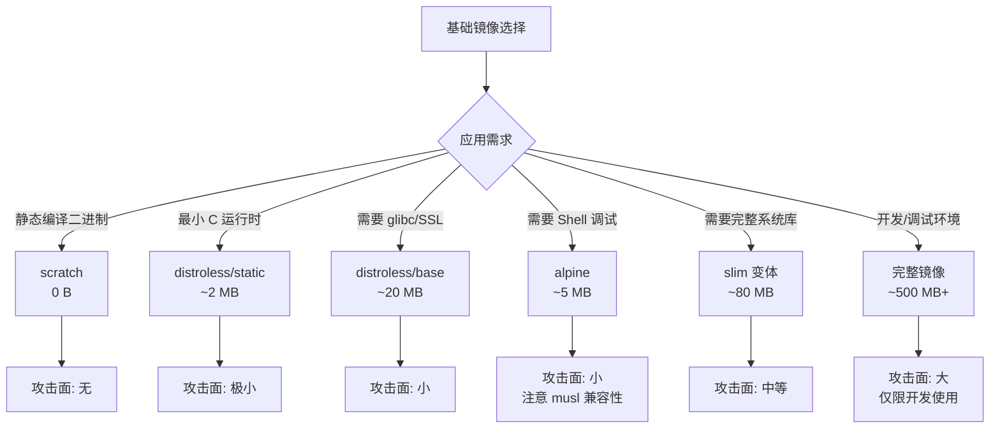
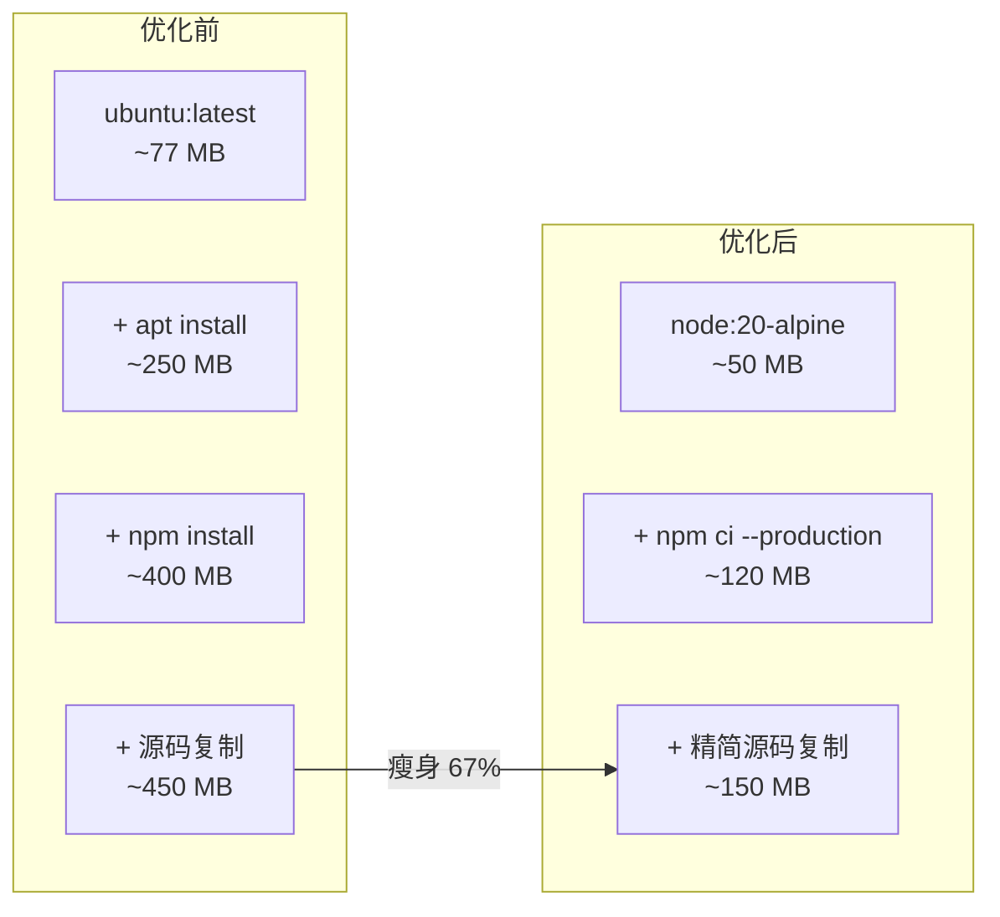
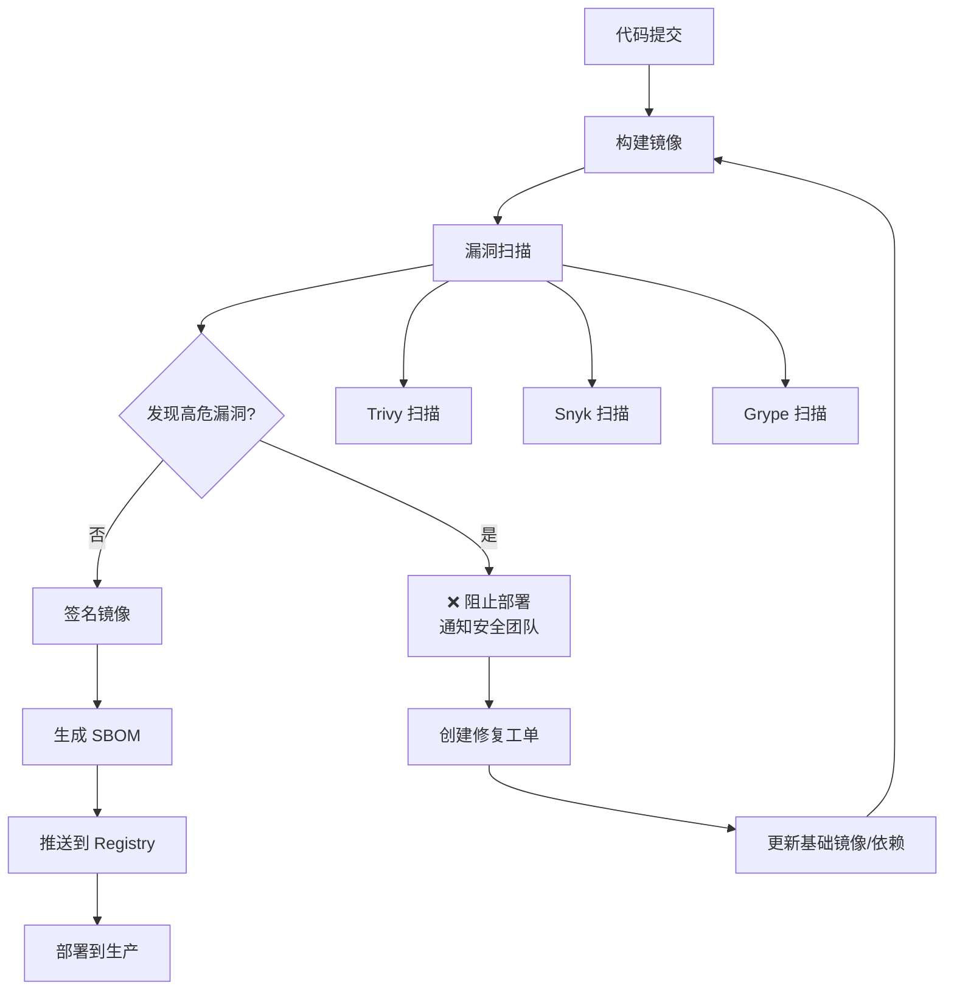
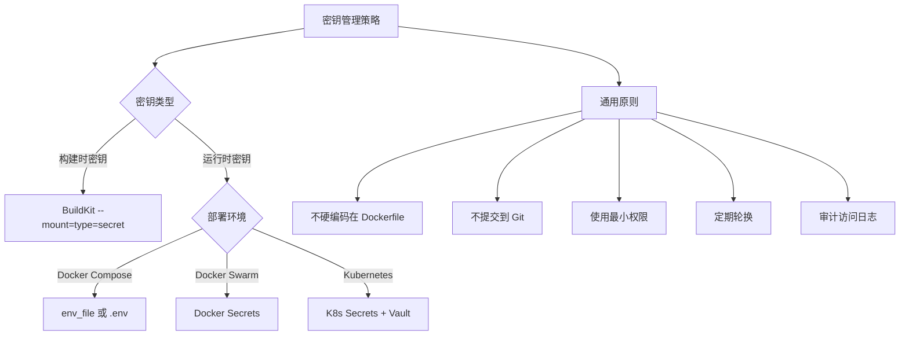
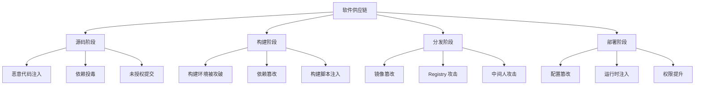
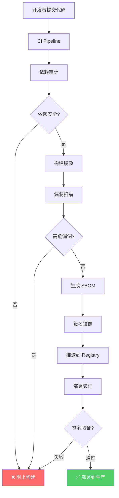
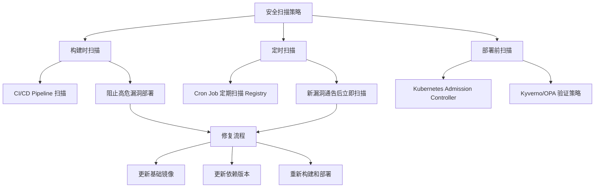

# 镜像优化与安全

::: info 本章导读
容器镜像的安全性和大小直接影响应用的部署效率与安全态势。一个臃肿的镜像不仅消耗存储和带宽，更扩大了攻击面；一个未经安全审计的镜像可能携带已知漏洞，成为入侵的突破口。本文将系统讲解镜像瘦身策略、漏洞扫描、签名验证、安全基线、以及供应链安全的全链路实践。
:::

## 一、镜像瘦身策略

### 1.1 基础镜像选择对比

选择合适的基础镜像是镜像瘦身的起点。不同的基础镜像在大小、安全性、功能上差异巨大。



| 基础镜像 | 大小 | Shell | 包管理 | 攻击面 | 适用语言 |
|----------|------|-------|--------|--------|----------|
| `scratch` | 0 B | ❌ | ❌ | 无 | Go、Rust（静态编译） |
| `distroless/static` | ~2 MB | ❌ | ❌ | 极小 | C/C++（静态链接） |
| `distroless/base` | ~20 MB | ❌ | ❌ | 小 | Java（JRE） |
| `distroless/python` | ~50 MB | ❌ | ❌ | 小 | Python |
| `alpine` | ~5 MB | ✅ | ✅ apk | 小 | 通用（注意 musl） |
| `*-slim` | ~80 MB | ✅ | ✅ apt | 中等 | 通用 |
| `完整镜像` | ~500 MB+ | ✅ | ✅ | 大 | 开发调试 |

### 1.2 Alpine vs Distroless 深度对比

```dockerfile
# ===== Alpine 方案 =====
FROM alpine:3.19
RUN apk add --no-cache python3 py3-pip
# 优点：有 Shell，可进入调试；包管理完善
# 缺点：使用 musl libc，部分 Python 包需编译

# ===== Distroless 方案 =====
FROM gcr.io/distroless/python3
# 优点：无 Shell，攻击面最小；无包管理器
# 缺点：无法进入容器调试；无法安装额外包
```

::: important Alpine 的 musl libc 兼容性问题
Alpine 使用 musl libc 而非 glibc，可能导致：
1. **Python C 扩展**：部分 Python 包的预编译 wheel 只支持 glibc，在 Alpine 上需要从源码编译
2. **Node.js 原生模块**：部分 npm 包（如 `sharp`、`bcrypt`）可能需要额外依赖
3. **Java 应用**：部分 Java 库依赖 glibc 特定行为
4. **DNS 解析**：musl 的 DNS 解析行为与 glibc 不同

如果遇到兼容性问题，可以使用 `slim` 镜像替代 Alpine。
:::

### 1.3 多阶段构建瘦身

多阶段构建是瘦身最有效的手段——构建阶段使用完整 SDK，运行阶段使用精简基础镜像。

```dockerfile
# ===== 示例：Go 应用从 800MB 瘦身到 10MB =====

# 传统方式：~800MB
FROM golang:1.22
WORKDIR /app
COPY . .
RUN go build -o server .
CMD ["./server"]

# 多阶段构建：~10MB
FROM golang:1.22-alpine AS builder
WORKDIR /app
COPY go.mod go.sum ./
RUN go mod download
COPY . .
RUN CGO_ENABLED=0 GOOS=linux go build -ldflags="-s -w" -o server

FROM scratch
COPY --from=builder /app/server /server
COPY --from=builder /etc/ssl/certs/ca-certificates.crt /etc/ssl/certs/
ENTRYPOINT ["/server"]
```

```dockerfile
# ===== 示例：Node.js 应用瘦身 =====

# 传统方式：~1.1GB
FROM node:20
WORKDIR /app
COPY . .
RUN npm install
CMD ["node", "server.js"]

# 多阶段构建：~150MB
FROM node:20-alpine AS deps
WORKDIR /app
COPY package.json package-lock.json ./
RUN npm ci --only=production

FROM node:20-alpine
WORKDIR /app
COPY --from=deps /app/node_modules ./node_modules
COPY . .
USER node
CMD ["node", "server.js"]
```

### 1.4 RUN 指令合并与清理

```dockerfile
# ❌ 不推荐：多条 RUN，多个层
RUN apt-get update
RUN apt-get install -y curl
RUN apt-get install -y git
RUN apt-get install -y vim
# 结果：每层都保留中间状态，APT 缓存也保留

# ✅ 推荐：合并 RUN，同一层清理
RUN apt-get update && \
    apt-get install -y --no-install-recommends \
        curl \
        git \
    && rm -rf /var/lib/apt/lists/*
# 结果：一个层，APT 缓存已清理
```

::: tip RUN 合并的原则
1. **安装和清理放在同一条 RUN 中**：`apt-get install` 和 `rm -rf /var/lib/apt/lists/*` 必须在同一条 RUN 中，否则缓存仍保留在之前的层中
2. **使用 `--no-install-recommends`**：跳过推荐但非必需的包，通常减少 30-50% 的安装量
3. **按字母排序包列表**：便于审查和维护
4. **使用 `&&` 连接命令**：确保前一步失败时不会继续执行
:::

#### 不同包管理器的清理方式

```dockerfile
# APT (Debian/Ubuntu)
RUN apt-get update && \
    apt-get install -y --no-install-recommends \
        curl \
        git \
    && rm -rf /var/lib/apt/lists/*

# APK (Alpine)
RUN apk add --no-cache \
        curl \
        git

# YUM/DNF (RHEL/CentOS/Fedora)
RUN dnf install -y \
        curl \
        git \
    && dnf clean all \
    && rm -rf /var/cache/dnf

# pip (Python)
RUN pip install --no-cache-dir -r requirements.txt

# npm (Node.js)
RUN npm ci --only=production

# gem (Ruby)
RUN bundle install --deployment --without development test && \
    rm -rf /usr/local/bundle/cache/*.gem
```

### 1.5 .dockerignore 瘦身

```gitignore
# 排除不需要的文件，减少构建上下文和 COPY 的内容
.git
node_modules/
__pycache__/
*.pyc
.pytest_cache/
coverage/
docs/
*.md
.env
*.log
test/
tests/
```

### 1.6 瘦身效果量化对比



| 优化策略 | 预期减少 | 难度 |
|----------|----------|------|
| 选择 Alpine 基础镜像 | 70-90% | 低 |
| 多阶段构建 | 50-80% | 中 |
| RUN 合并与清理 | 10-30% | 低 |
| .dockerignore | 5-20% | 低 |
| --no-install-recommends | 10-30% | 低 |
| 静态编译 + scratch | 95%+ | 高 |

## 二、镜像大小分析

### 2.1 docker history 分析

```bash
# 查看镜像构建历史
docker history myapp:latest

# 详细输出（不截断）
docker history --no-trunc myapp:latest

# 格式化输出
docker history --format "{{.Size}}\t{{.CreatedBy}}" myapp:latest

# 查看总大小
docker images myapp:latest
```

### 2.2 dive — 交互式镜像分析

```bash
# 安装 dive
# macOS
brew install dive

# Linux
curl -LO https://github.com/wagoodman/dive/releases/download/v0.12.0/dive_0.12.0_linux_amd64.deb
sudo dpkg -i dive_0.12.0_linux_amd64.deb

# Windows
scoop install dive

# Docker 方式
docker run --rm -it \
    -v /var/run/docker.sock:/var/run/docker.sock \
    wagoodman/dive:latest myapp:latest
```

```bash
# 分析镜像
dive myapp:latest

# CI 模式（设置阈值）
dive myapp:latest --ci \
    --lowestEfficiency 0.9 \
    --highestWastedBytes 50MB \
    --highestUserWastedPercent 0.2
```

dive 界面功能：
- 逐层查看文件变化
- 高亮显示浪费的空间（被后续层覆盖的文件）
- 显示每层的效率得分
- 按文件大小排序

### 2.3 manifest 分析

```bash
# 查看镜像 manifest
docker buildx imagetools inspect myapp:latest

# 查看镜像详细信息
docker inspect myapp:latest | jq '.[0].RootFS.Layers'

# 查看各平台镜像大小
docker buildx imagetools inspect --raw myapp:latest | jq '.manifests[] | {platform: .platform, size: .size}'
```

### 2.4 镜像层历史分析

```bash
# 使用 skopeo 检查远程镜像（无需拉取）
skopeo inspect docker://registry.example.com/myapp:latest

# 使用 crane 检查镜像层
crane manifest registry.example.com/myapp:latest | jq '.layers[] | {digest: .digest, size: .size}'

# 导出镜像并分析各层
docker save myapp:latest -o myapp.tar
tar -tf myapp.tar
# 每个层对应一个目录，包含 layer.tar 文件
```

## 三、漏洞扫描

### 3.1 镜像安全扫描流水线



### 3.2 Trivy — 最受欢迎的扫描工具

```bash
# 安装 Trivy
# macOS
brew install trivy

# Linux
sudo apt-get install wget apt-transport-https gnupg
wget -qO - https://aquasecurity.github.io/trivy-repo/deb/public.key | sudo apt-key add -
echo "deb https://aquasecurity.github.io/trivy-repo/deb generic main" | sudo tee /etc/apt/sources.list.d/trivy.list
sudo apt-get update
sudo apt-get install trivy

# Windows (PowerShell)
scoop install trivy
```

```bash
# 基本扫描
trivy image myapp:latest

# 仅扫描高危和严重漏洞
trivy image --severity HIGH,CRITICAL myapp:latest

# 指定退出码（CI/CD 集成）
trivy image --exit-code 1 --severity HIGH,CRITICAL myapp:latest

# 扫描特定类型的漏洞
trivy image --vuln-type os myapp:latest       # 仅 OS 漏洞
trivy image --vuln-type library myapp:latest    # 仅库漏洞

# 输出格式
trivy image --format json -o results.json myapp:latest
trivy image --format table myapp:latest
trivy image --format sarif -o results.sarif myapp:latest
trivy image --format cyclonedx -o sbom.json myapp:latest  # 生成 SBOM

# 忽略特定漏洞
trivy image --ignorefile .trivyignore myapp:latest

# 扫描 Dockerfile
trivy config Dockerfile

# 扫描文件系统
trivy fs /path/to/project

# 扫描 Kubernetes 集群
trivy k8s --report summary all
```

```yaml
# .trivyignore — 忽略特定 CVE
# CVE-2023-XXXXX: 已确认不影响当前应用
CVE-2023-XXXXX
CVE-2022-YYYYY
```

#### Trivy CI/CD 集成

```yaml
# GitHub Actions
name: Security Scan
on: [push, pull_request]
jobs:
  trivy:
    runs-on: ubuntu-latest
    steps:
      - uses: actions/checkout@v4
      - name: Build image
        run: docker build -t myapp:latest .
      - name: Run Trivy scan
        uses: aquasecurity/trivy-action@master
        with:
          image-ref: 'myapp:latest'
          format: 'table'
          exit-code: '1'
          severity: 'HIGH,CRITICAL'
```

```yaml
# GitLab CI
trivy-scan:
  stage: security
  image: aquasec/trivy:latest
  script:
    - trivy image --exit-code 1 --severity HIGH,CRITICAL $CI_REGISTRY_IMAGE:$CI_COMMIT_SHA
  allow_failure: false
```

### 3.3 Snyk — 企业级安全平台

```bash
# 安装 Snyk CLI
npm install -g snyk

# 认证
snyk auth

# 扫描容器镜像
snyk container test myapp:latest

# 监控镜像
snyk container monitor myapp:latest

# 指定严重级别
snyk container test --severity-threshold=high myapp:latest

# 扫描 Dockerfile
snyk container test --file=Dockerfile myapp:latest

# 输出 JSON
snyk container test --json myapp:latest
```

Snyk 特点：
- 维护自己的漏洞数据库，更新及时
- 提供修复建议和自动 PR
- 支持容器、代码、依赖、IaC 多维度扫描
- 企业版提供策略管理和合规报告

### 3.4 Grype — Anchore 开源扫描器

```bash
# 安装 Grype
# macOS
brew tap anchore/grype
brew install grype

# Linux
curl -sSfL https://raw.githubusercontent.com/anchore/grype/main/install.sh | sh -s -- -b /usr/local/bin

# 扫描镜像
grype myapp:latest

# 仅显示严重和高危
grype myapp:latest --fail-on critical

# 输出格式
grype myapp:latest -o json
grype myapp:latest -o table
grype myapp:latest -o cyclonedx  # 生成 SBOM

# 从 SBOM 扫描
syft myapp:latest -o cyclonedx-json > sbom.json
grype sbom:./sbom.json

# 忽略特定漏洞
grype myapp:latest --ignore .grypeignore
```

### 3.5 扫描工具对比

| 特性 | Trivy | Snyk | Grype |
|------|-------|------|-------|
| 开源 | ✅ Apache 2.0 | ❌（CLI 免费有限制） | ✅ Apache 2.0 |
| 漏洞数据库 | 自维护 | 自维护 | 自维护 |
| OS 漏洞 | ✅ | ✅ | ✅ |
| 库漏洞 | ✅ | ✅ | ✅ |
| IaC 扫描 | ✅ | ✅ | ❌ |
| 密钥检测 | ✅ | ✅ | ❌ |
| SBOM 生成 | ✅ | ❌ | 配合 Syft |
| CI/CD 集成 | ✅ | ✅ | ✅ |
| 企业功能 | 有限 | ✅（付费） | 有限 |
| 扫描速度 | 快 | 中等 | 快 |

## 四、镜像签名

### 4.1 Docker Content Trust (DCT)

Docker Content Trust 使用 Notary 签名镜像，确保镜像的完整性和来源可信。

```bash
# 启用 DCT
export DOCKER_CONTENT_TRUST=1

# 推送签名镜像
docker push myregistry/myapp:1.0.0
# 自动签名，需要输入 Notary 密码

# 拉取签名验证
docker pull myregistry/myapp:1.0.0
# 如果签名验证失败，拒绝拉取

# 查看 DCT 状态
docker trust inspect myregistry/myapp:1.0.0

# 管理签名密钥
docker trust key generate mykey
docker trust key load key.pem mykey

# 签名管理
docker trust sign myregistry/myapp:1.0.0
docker trust revoke myregistry/myapp:1.0.0
```

::: warning DCT 的局限
1. 不支持删除签名密钥的轮换
2. 使用 Notary v1，未来可能迁移到 Notary v2
3. 与 cosign 等新工具不完全兼容
4. 默认使用自签名证书，生产环境需要配置 PKI
:::

### 4.2 cosign — 现代镜像签名工具

```bash
# 安装 cosign
# macOS
brew install cosign

# Linux
curl -LO https://github.com/sigstore/cosign/releases/latest/download/cosign-linux-amd64
chmod +x cosign-linux-amd64
sudo mv cosign-linux-amd64 /usr/local/bin/cosign

# Windows
scoop install cosign
```

```bash
# 生成密钥对
cosign generate-key-pair

# 签名镜像
cosign sign --key cosign.key myregistry/myapp:1.0.0

# 验证签名
cosign verify --key cosign.pub myregistry/myapp:1.0.0

# 使用 Keyless 签名（结合 OIDC）
cosign sign myregistry/myapp:1.0.0

# 验证 Keyless 签名
cosign verify myregistry/myapp:1.0.0

# 签名时附加元数据
cos sign sign --key cosign.key \
    -a author=devops \
    -a commit=$(git rev-parse HEAD) \
    -a build-id=$BUILD_ID \
    myregistry/myapp:1.0.0

# 验证特定注解
cosign verify --key cosign.pub \
    -a author=devops \
    myregistry/myapp:1.0.0
```

#### cosign 与 CI/CD 集成

```yaml
# GitHub Actions
name: Build and Sign
on: [push]
jobs:
  build:
    runs-on: ubuntu-latest
    steps:
      - uses: actions/checkout@v4

      - name: Build and push
        run: |
          docker build -t myregistry/myapp:${{ github.sha }} .
          docker push myregistry/myapp:${{ github.sha }}

      - name: Sign image
        uses: sigstore/cosign-installer@main
      - run: |
          cosign sign --key env://COSIGN_PRIVATE_KEY \
            myregistry/myapp:${{ github.sha }}
        env:
          COSIGN_PRIVATE_KEY: ${{ secrets.COSIGN_PRIVATE_KEY }}
          COSIGN_PASSWORD: ${{ secrets.COSIGN_PASSWORD }}
```

### 4.3 签名验证策略

```yaml
# Kyverno 筶略：强制验证镜像签名
apiVersion: kyverno.io/v1
kind: ClusterPolicy
metadata:
  name: verify-image-signature
spec:
  validationFailureAction: Enforce
  rules:
    - name: verify-cosign-signature
      match:
        resources:
          kinds:
            - Pod
      verifyImages:
        - imageReferences:
            - "myregistry.io/*"
          attestors:
            - entries:
                - keys:
                    publicKeys: |-
                      -----BEGIN PUBLIC KEY-----
                      ...
                      -----END PUBLIC KEY-----
```

## 五、SBOM 生成

### 5.1 什么是 SBOM

SBOM（Software Bill of Materials，软件物料清单）是软件组件的详细清单，包括所有依赖、版本、来源等信息。SBOM 是软件供应链透明度的关键。

### 5.2 Syft — SBOM 生成工具

```bash
# 安装 Syft
# macOS
brew tap anchore/syft
brew install syft

# Linux
curl -sSfL https://raw.githubusercontent.com/anchore/syft/main/install.sh | sh -s -- -b /usr/local/bin

# 生成 SBOM
syft myapp:latest

# 指定输出格式
syft myapp:latest -o cyclonedx-json     # CycloneDX JSON
syft myapp:latest -o spdx-json          # SPDX JSON
syft myapp:latest -o syft-json          # Syft 原生格式
syft myapp:latest -o table              # 表格格式

# 输出到文件
syft myapp:latest -o cyclonedx-json > sbom.json

# 从目录生成
syft /path/to/project -o cyclonedx-json

# 附加到镜像
syft myapp:latest -o attach-cyclonedx myapp:latest
```

### 5.3 SBOM 格式对比

| 格式 | 标准组织 | 特点 |
|------|----------|------|
| CycloneDX | OWASP | 专注于安全，支持漏洞关联 |
| SPDX | Linux Foundation | 专注于许可证合规 |
| Syft JSON | Anchore | 原生格式，信息最丰富 |

### 5.4 SBOM 与漏洞扫描联动

```bash
# 方式一：先生成 SBOM，再扫描
syft myapp:latest -o cyclonedx-json > sbom.json
grype sbom:./sbom.json

# 方式二：Trivy 一步到位
trivy image --format cyclonedx -o sbom.json myapp:latest
trivy image --input sbom.json

# 方式三：cosign 附加 SBOM 到镜像
syft myapp:latest -o cyclonedx-json | cosign attach sbom --sbom - myapp:latest
```

### 5.5 SBOM 在 CI/CD 中的集成

```yaml
# GitHub Actions
name: Generate SBOM
on: [push]
jobs:
  sbom:
    runs-on: ubuntu-latest
    steps:
      - uses: actions/checkout@v4

      - name: Build image
        run: docker build -t myapp:latest .

      - name: Generate SBOM
        uses: anchore/sbom-action@v0
        with:
          image: myapp:latest
          format: cyclonedx-json
          output-file: sbom.json

      - name: Upload SBOM
        uses: actions/upload-artifact@v4
        with:
          name: sbom
          path: sbom.json

      - name: Scan SBOM for vulnerabilities
        uses: anchore/scan-action@v3
        with:
          sbom: sbom.json
          fail-build: true
          severity-cutoff: high
```

## 六、镜像安全基线 — CIS Docker Benchmark

### 6.1 CIS Docker Benchmark 概述

CIS（Center for Internet Security）Docker Benchmark 提供了 Docker 安全配置的最佳实践基准，涵盖主机配置、Docker Daemon 配置、镜像构建、运行时安全等方面。

### 6.2 关键安全检查项

| 类别 | 检查项 | 严重级别 |
|------|--------|----------|
| 主机配置 | 确保 Docker 目录权限正确 | Medium |
| Daemon 配置 | 确保 TLS 已启用 | High |
| Daemon 配置 | 确保默认 ulimit 已配置 | Low |
| Daemon 配置 | 确保用户命名空间已启用 | Medium |
| 镜像构建 | 确保不使用 root 用户 | High |
| 镜像构建 | 确保 HEALTHCHECK 已配置 | Medium |
| 镜像构建 | 确保使用 COPY 而非 ADD | Low |
| 镜像构建 | 确保不安装不需要的包 | Low |
| 运行时 | 确保不使用特权容器 | High |
| 运行时 | 确保不挂载 Docker Socket | High |
| 运行时 | 确保不共享主机命名空间 | High |
| 运行时 | 确保 CPU 优先级已设置 | Medium |
| 运行时 | 确保只读文件系统 | Medium |

### 6.3 Docker Bench for Security

```bash
# 运行 CIS Docker Benchmark 检查
docker run --rm --net host --pid host \
    --userns host --cap-add audit_control \
    -e DOCKER_CONTENT_TRUST=$DOCKER_CONTENT_TRUST \
    -v /etc:/etc:ro \
    -v /lib/systemd/system:/lib/systemd/system:ro \
    -v /usr/bin/containerd:/usr/bin/containerd:ro \
    -v /usr/bin/runc:/usr/bin/runc:ro \
    -v /usr/lib/systemd:/usr/lib/systemd:ro \
    -v /var/lib:/var/lib:ro \
    -v /var/run/docker.sock:/var/run/docker.sock:ro \
    docker/docker-bench-security
```

### 6.4 在 Dockerfile 中落实 CIS 检查

```dockerfile
# CIS 4.1: 不使用 root 用户
RUN addgroup -S appgroup && adduser -S appuser -G appgroup
USER appuser

# CIS 4.6: 添加 HEALTHCHECK
HEALTHCHECK --interval=30s --timeout=3s \
    CMD wget --spider http://localhost:3000/health || exit 1

# CIS 4.7: 不使用 ADD（使用 COPY）
COPY package.json /app/

# CIS 4.10: 不使用 sudo
# 确保镜像中不安装 sudo

# CIS 4.9: 使用 COPY 而非 ADD
COPY app.conf /app/

# 运行时安全配置
# docker run --read-only --security-opt no-new-privileges \
#   --cap-drop ALL --cap-add NET_BIND_SERVICE \
#   --tmpfs /tmp --tmpfs /run \
#   myapp:latest
```

## 七、Rootless 模式

### 7.1 什么是 Rootless Docker

Rootless Docker 允许在非 root 用户下运行完整的 Docker 环境，包括 Docker Daemon 和容器。这消除了容器逃逸后获得主机 root 权限的风险。

### 7.2 安装 Rootless Docker

```bash
# 前置条件：安装 uidmap 包
# Debian/Ubuntu
sudo apt-get install -y uidmap

# RHEL/CentOS
sudo dnf install -y shadow-utils

# 安装 Rootless Docker
curl -fsSL https://get.docker.com/rootless | sh

# 配置环境变量
export DOCKER_HOST=unix:///run/user/$UID/docker.sock

# 启动 Rootless Docker
systemctl --user start docker
systemctl --user enable docker
```

### 7.3 Rootless 模式的限制

| 特性 | Rootless 支持 | 说明 |
|------|--------------|------|
| 镜像构建 | ✅ | 完全支持 |
| 端口映射 | ⚠️ | 仅 1024 以上端口 |
| 卷挂载 | ⚠️ | 仅能挂载用户可访问的目录 |
| 网络模式 | ⚠️ | 仅 bridge 和 host（有限） |
| cgroup 资源限制 | ❌ | 需要委托 cgroup v2 |
| NFS 挂载 | ❌ | 不支持 |
| 多平台构建 | ⚠️ | 有限支持 |

### 7.4 容器内非 root 运行

即使使用普通 Docker Daemon，也应该在容器内使用非 root 用户：

```dockerfile
# 创建非 root 用户
FROM node:20-alpine
RUN addgroup -S appgroup && adduser -S appuser -G appgroup
WORKDIR /app
COPY --chown=appuser:appgroup . .
USER appuser
CMD ["node", "server.js"]
```

```bash
# 运行时强制非 root
docker run --user 1000:1000 myapp:latest

# 使用 --read-only 增强安全
docker run --read-only --tmpfs /tmp --tmpfs /run myapp:latest
```

## 八、Seccomp 配置

### 8.1 Seccomp 概述

Seccomp（Secure Computing Mode）限制容器可以调用的系统调用，减少内核攻击面。Docker 默认使用 Seccomp 配置文件，禁止了约 44 个危险系统调用。

### 8.2 查看 Seccomp 状态

```bash
# 查看容器 Seccomp 配置
docker inspect --format '{{.HostConfig.SecurityOpt}}' <container-id>

# 查看默认 Seccomp 配置
docker info --format '{{.SecurityOptions}}'
```

### 8.3 自定义 Seccomp 配置

```json
{
  "defaultAction": "SCMP_ACT_ERRNO",
  "architectures": [
    "SCMP_ARCH_X86_64",
    "SCMP_ARCH_X86",
    "SCMP_ARCH_AARCH64"
  ],
  "syscalls": [
    {
      "names": [
        "accept",
        "access",
        "arch_prctl",
        "bind",
        "brk",
        "capget",
        "capset",
        "chdir",
        "chmod",
        "chown",
        "close",
        "connect",
        "dup",
        "dup2",
        "dup3",
        "epoll_create",
        "epoll_ctl",
        "epoll_wait",
        "execve",
        "exit",
        "exit_group",
        "fchmod",
        "fchown",
        "fcntl",
        "fstat",
        "fstatfs",
        "futex",
        "getcwd",
        "getdents64",
        "getegid",
        "geteuid",
        "getgid",
        "getpeername",
        "getpgrp",
        "getpid",
        "getppid",
        "getsockname",
        "getsockopt",
        "getuid",
        "ioctl",
        "listen",
        "lseek",
        "lstat",
        "madvise",
        "mmap",
        "mprotect",
        "munmap",
        "nanosleep",
        "newfstatat",
        "open",
        "openat",
        "pipe",
        "poll",
        "prctl",
        "pread64",
        "preadv",
        "prlimit64",
        "pwrite64",
        "pwritev",
        "read",
        "readlink",
        "readv",
        "recvfrom",
        "recvmsg",
        "rename",
        "restart_syscall",
        "rt_sigaction",
        "rt_sigprocmask",
        "rt_sigreturn",
        "select",
        "sendmsg",
        "sendto",
        "set_robust_list",
        "set_tid_address",
        "setgid",
        "setgroups",
        "setsockopt",
        "setuid",
        "sigaltstack",
        "socket",
        "stat",
        "statfs",
        "sysinfo",
        "umask",
        "uname",
        "unlink",
        "wait4",
        "write",
        "writev"
      ],
      "action": "SCMP_ACT_ALLOW"
    }
  ]
}
```

### 8.4 使用 Seccomp 配置

```bash
# 使用自定义 Seccomp 配置
docker run --security-opt seccomp=seccomp-profile.json myapp:latest

# 禁用 Seccomp（不推荐）
docker run --security-opt seccomp=unconfined myapp:latest

# 在 Docker Compose 中使用
```

```yaml
services:
  app:
    image: myapp:latest
    security_opt:
      - seccomp=seccomp-profile.json
```

## 九、AppArmor 配置

### 9.1 AppArmor 概述

AppArmor 是 Linux 内核安全模块，通过配置文件限制程序的文件访问、网络访问、能力等。Docker 可以使用 AppArmor 配置文件进一步限制容器行为。

### 9.2 默认 AppArmor 配置

```bash
# 查看默认 AppArmor 配置
sudo apparmor_parser -R /etc/apparmor.d/docker-default 2>/dev/null || true
sudo apparmor_parser -a /etc/apparmor.d/docker-default

# Docker 默认使用 docker-default 配置文件
# 仅当 AppArmor 在主机上启用时生效
```

### 9.3 自定义 AppArmor 配置

```bash
# 创建自定义 AppArmor 配置
sudo tee /etc/apparmor.d/myapp-profile <<'EOF'
#include <tunables/global>

profile myapp-profile flags=(attach_disconnected,mediate_deleted) {
  #include <abstractions/base>

  # 网络访问
  network inet tcp,
  network inet6 tcp,

  # 文件访问
  /app/** r,
  /app/tmp/** rw,
  /app/logs/** rw,

  # 拒绝写操作
  deny /app/config/** w,
  deny /etc/shadow r,

  # 拒绝挂载
  deny mount,
  deny umount,

  # 能力限制
  capability net_bind_service,
}
EOF

# 加载配置
sudo apparmor_parser -r /etc/apparmor.d/myapp-profile
```

### 9.4 使用 AppArmor 配置

```bash
# 使用自定义 AppArmor 配置
docker run --security-opt apparmor=myapp-profile myapp:latest

# 在 Docker Compose 中使用
```

```yaml
services:
  app:
    image: myapp:latest
    security_opt:
      - apparmor=myapp-profile
```

## 十、密钥管理

### 10.1 Docker Secrets（Swarm 模式）

```bash
# 创建 Secret
echo "my_super_secret_password" | docker secret create db_password -

# 从文件创建
docker secret create api_key ./secrets/api_key.txt

# 在服务中使用
docker service create \
    --name myapp \
    --secret db_password \
    --secret source=api_key,target=/app/config/api.key,uid=1000,mode=0400 \
    myapp:latest
```

```yaml
# Docker Compose（Swarm 模式）
services:
  app:
    image: myapp:latest
    secrets:
      - db_password
      - source: api_key
        target: /app/config/api.key
        uid: "1000"
        gid: "1000"
        mode: 0440

secrets:
  db_password:
    file: ./secrets/db_password.txt
  api_key:
    file: ./secrets/api_key.txt
```

### 10.2 BuildKit Secret 挂载

```dockerfile
# syntax=docker/dockerfile:1

# 构建时挂载 Secret（不会留在镜像层中）
RUN --mount=type=secret,id=npmrc,target=/root/.npmrc \
    npm install

RUN --mount=type=secret,id=ssh_key \
    ssh-add /run/secrets/ssh_key && \
    git clone git@github.com:org/repo.git && \
    ssh-add -D

RUN --mount=type=secret,id=gpg_key \
    gpg --import /run/secrets/gpg_key
```

```bash
# 构建时传入 Secret
docker build \
    --secret id=npmrc,src=$HOME/.npmrc \
    --secret id=ssh_key,src=$HOME/.ssh/id_rsa \
    -t myapp:latest .
```

### 10.3 HashiCorp Vault 集成

```bash
# 安装 Vault
# macOS
brew install vault

# Linux
curl -LO https://releases.hashicorp.com/vault/1.15.0/vault_1.15.0_linux_amd64.zip
unzip vault_1.15.0_linux_amd64.zip
sudo mv vault /usr/local/bin/
```

```bash
# 启动 Vault 开发服务器
vault server -dev

# 写入密钥
vault kv put secret/myapp/db password=mysecretpassword
vault kv put secret/myapp/api key=sk-1234567890

# 读取密钥
vault kv get -field=password secret/myapp/db
```

#### 使用 Vault Agent 注入密钥

```yaml
# Kubernetes Pod 配置
apiVersion: v1
kind: Pod
metadata:
  name: myapp
  annotations:
    vault.hashicorp.com/agent-inject: "true"
    vault.hashicorp.com/role: "myapp"
    vault.hashicorp.com/agent-inject-secret-db-password: "secret/data/myapp/db"
    vault.hashicorp.com/agent-inject-template-db-password: |
      {{- with secret "secret/data/myapp/db" -}}
      export DB_PASSWORD="{{ .Data.data.password }}"
      {{- end }}
spec:
  containers:
    - name: myapp
      image: myapp:latest
```

#### 使用 Vault 与 Docker Compose

```yaml
services:
  vault:
    image: hashicorp/vault:latest
    cap_add:
      - IPC_LOCK
    environment:
      VAULT_DEV_ROOT_TOKEN_ID: "root"
    ports:
      - "8200:8200"

  app:
    image: myapp:latest
    environment:
      VAULT_ADDR: "http://vault:8200"
      VAULT_TOKEN: "root"
    depends_on:
      - vault
    entrypoint: |
      sh -c '
        export DB_PASSWORD=$$(vault kv get -field=password secret/myapp/db)
        exec /app/server
      '
```

### 10.4 密钥管理最佳实践



::: important 密钥管理铁律
1. **永不硬编码**：不要在 Dockerfile、代码、或配置文件中硬编码密钥
2. **不提交到版本控制**：`.env` 文件必须添加到 `.gitignore`
3. **使用 Secret 管理工具**：Docker Secrets、Vault、云厂商 KMS
4. **最小权限**：每个服务只获取它需要的密钥
5. **定期轮换**：建立密钥轮换流程
6. **审计日志**：记录密钥的访问和使用
:::

## 十一、供应链安全

### 11.1 软件供应链威胁模型



### 11.2 SLSA — 供应链安全框架

SLSA（Supply-chain Levels for Software Artifacts）是 Google 提出的供应链安全等级框架：

| 等级 | 要求 | 描述 |
|------|------|------|
| SLSA 1 | 构建文档化 | 构建过程有记录 |
| SLSA 2 | 托管构建 | 在托管平台上构建 |
| SLSA 3 | 构建不可篡改 | 构建过程防篡改 |
| SLSA 4 | 双人审核 | 所有变更需双人审核 |

### 11.3 供应链安全实践

#### 1. 锁定基础镜像

```dockerfile
# ❌ 不推荐：可变标签
FROM node:20

# ✅ 推荐：固定版本
FROM node:20.11.0-alpine3.19

# ✅ 最佳：固定 digest
FROM node:20.11.0-alpine3.19@sha256:7a91aa397f2e2dfbf8a7b7a6ff65e8ef2f11a4d6a36c1a1e84e7f9e7e8f7c5d2
```

#### 2. 依赖锁定

```bash
# Node.js：使用 package-lock.json
npm ci  # 严格按照 lock 文件安装

# Python：使用 requirements.txt 固定版本
pip freeze > requirements.txt
pip install -r requirements.txt

# Go：使用 go.sum
go mod verify  # 验证依赖完整性

# .NET：使用 nuget.lock.json
dotnet restore --locked-mode
```

#### 3. 镜像签名与验证

```bash
# 签名
cosign sign --key cosign.key myregistry/myapp:1.0.0

# 验证
cosign verify --key cosign.pub myregistry/myapp:1.0.0

# Kubernetes 中强制验证
# 使用 Kyverno 或 OPA Gatekeeper
```

#### 4. SBOM 生成与存储

```bash
# 生成 SBOM
syft myapp:1.0.0 -o cyclonedx-json > sbom.json

# 附加到镜像
cosign attach sbom --sbom sbom.json myapp:1.0.0

# 验证 SBOM
cosign verify-attestation --type cyclonedx myapp:1.0.0
```

#### 5. 漏洞扫描与修复

```bash
# 定期扫描
trivy image --severity HIGH,CRITICAL myapp:1.0.0

# 自动更新基础镜像
# 使用 Dependabot 或 Renovate Bot

# 修复流程
# 1. 发现漏洞
# 2. 评估影响
# 3. 更新依赖/基础镜像
# 4. 重新构建和扫描
# 5. 签名和部署
```

### 11.4 完整供应链安全流水线



```yaml
# GitHub Actions 完整供应链安全 Pipeline
name: Secure Build Pipeline

on:
  push:
    branches: [main]

jobs:
  build:
    runs-on: ubuntu-latest
    permissions:
      id-token: write
      contents: read

    steps:
      - uses: actions/checkout@v4
        with:
          fetch-depth: 0

      # 1. 依赖审计
      - name: Dependency audit
        run: npm audit --audit-level=high

      # 2. 构建镜像
      - name: Build image
        run: docker build -t myregistry/myapp:${{ github.sha }} .

      # 3. 漏洞扫描
      - name: Scan for vulnerabilities
        uses: aquasecurity/trivy-action@master
        with:
          image-ref: 'myregistry/myapp:${{ github.sha }}'
          format: 'table'
          exit-code: '1'
          severity: 'HIGH,CRITICAL'

      # 4. 生成 SBOM
      - name: Generate SBOM
        uses: anchore/sbom-action@v0
        with:
          image: myregistry/myapp:${{ github.sha }}
          format: cyclonedx-json
          output-file: sbom.json

      # 5. 签名镜像
      - name: Sign image
        uses: sigstore/cosign-installer@main
      - run: |
          cosign sign --key env://COSIGN_PRIVATE_KEY \
            myregistry/myapp:${{ github.sha }}
        env:
          COSIGN_PRIVATE_KEY: ${{ secrets.COSIGN_PRIVATE_KEY }}
          COSIGN_PASSWORD: ${{ secrets.COSIGN_PASSWORD }}

      # 6. 推送镜像和 SBOM
      - name: Push image
        run: docker push myregistry/myapp:${{ github.sha }}

      - name: Attach SBOM
        run: |
          cosign attach sbom --sbom sbom.json \
            myregistry/myapp:${{ github.sha }}
```

## 十二、容器运行时安全加固

### 12.1 运行时安全配置清单

```yaml
services:
  app:
    image: myapp:latest

    # ===== 安全配置 =====

    # 1. 非 root 运行
    user: "1000:1000"

    # 2. 只读文件系统
    read_only: true
    tmpfs:
      - /tmp
      - /run

    # 3. 丢弃所有能力，仅添加需要的
    cap_drop:
      - ALL
    cap_add:
      - NET_BIND_SERVICE    # 绑定 1024 以下端口

    # 4. 禁止权限提升
    security_opt:
      - no-new-privileges:true

    # 5. 资源限制
    deploy:
      resources:
        limits:
          cpus: "2.0"
          memory: 512M
        reservations:
          cpus: "0.5"
          memory: 256M

    # 6. 只读挂载
    volumes:
      - ./config:/app/config:ro

    # 7. 不挂载 Docker Socket
    # ❌ 不要: - /var/run/docker.sock:/var/run/docker.sock

    # 8. 不使用特权模式
    # ❌ 不要: privileged: true

    # 9. 不共享主机命名空间
    # ❌ 不要: pid: host
    # ❌ 不要: network_mode: host

    # 10. 日志限制
    logging:
      driver: json-file
      options:
        max-size: "10m"
        max-file: "3"
```

### 12.2 安全配置等效的 docker run 命令

```bash
docker run \
    --user 1000:1000 \
    --read-only \
    --tmpfs /tmp \
    --tmpfs /run \
    --cap-drop ALL \
    --cap-add NET_BIND_SERVICE \
    --security-opt no-new-privileges \
    --memory 512m \
    --cpus 2.0 \
    --log-driver json-file \
    --log-opt max-size=10m \
    --log-opt max-file=3 \
    myapp:latest
```

### 12.3 安全配置矩阵

| 配置 | 作用 | 性能影响 | 推荐度 |
|------|------|----------|--------|
| 非 root 用户 | 防止权限提升 | 无 | ⭐⭐⭐⭐⭐ |
| 只读文件系统 | 防止文件篡改 | 低 | ⭐⭐⭐⭐⭐ |
| cap-drop ALL | 最小能力集 | 无 | ⭐⭐⭐⭐⭐ |
| no-new-privileges | 禁止权限提升 | 无 | ⭐⭐⭐⭐⭐ |
| 资源限制 | 防止资源耗尽 | 无 | ⭐⭐⭐⭐ |
| Seccomp | 限制系统调用 | 低 | ⭐⭐⭐⭐ |
| AppArmor | 限制文件/网络访问 | 低 | ⭐⭐⭐ |
| 不挂载 Docker Socket | 防止容器逃逸 | 无 | ⭐⭐⭐⭐⭐ |
| 不使用特权模式 | 防止完全控制主机 | 无 | ⭐⭐⭐⭐⭐ |

## 十三、安全扫描自动化

### 13.1 定期扫描策略



### 13.2 Registry 扫描自动化

```yaml
# 使用 Trivy Operator 扫描 Kubernetes 中的镜像
apiVersion: aquasecurity.github.io/v1alpha1
kind: TrivyOperator
metadata:
  name: trivy-operator
spec:
  scanner:
    scanJob:
      resources:
        requests:
          cpu: 100m
          memory: 100M
        limits:
          cpu: 500m
          memory: 500M
  vulnerabilityScanner:
    scanOnlyCurrentRevisions: true
    reportTTL: 24h
```

## 十四、综合案例：安全加固的完整 Dockerfile

```dockerfile
# syntax=docker/dockerfile:1

# ===== 全局 ARG =====
ARG GO_VERSION=1.22
ARG ALPINE_VERSION=3.19

# ===== 元数据 =====
LABEL org.opencontainers.image.title="Secure API Server" \
      org.opencontainers.image.description="Production-grade secure API server" \
      org.opencontainers.image.version="1.0.0" \
      org.opencontainers.image.licenses="MIT" \
      maintainer="security@example.com"

# ===== Stage 1: 依赖下载 =====
FROM golang:${GO_VERSION}-alpine${ALPINE_VERSION} AS deps

WORKDIR /build

COPY go.mod go.sum ./
RUN go mod download && go mod verify

# ===== Stage 2: 构建 =====
FROM golang:${GO_VERSION}-alpine${ALPINE_VERSION} AS builder

# 安全：安装必要工具
RUN apk add --no-cache git

WORKDIR /build

# 复制依赖（利用缓存）
COPY --from=deps /go/pkg/mod /go/pkg/mod
COPY go.mod go.sum ./

# 复制源码
COPY . .

# 静态编译
RUN CGO_ENABLED=0 GOOS=linux GOARCH=amd64 \
    go build -ldflags="-s -w -X main.version=1.0.0" \
    -trimpath -o /app/server ./cmd/server

# ===== Stage 3: 运行 =====
FROM gcr.io/distroless/static-debian12:nonroot

# 复制 CA 证书
COPY --from=builder /etc/ssl/certs/ca-certificates.crt /etc/ssl/certs/

# 复制产物
COPY --from=builder /app/server /app/server

# 非 root 用户（distroless:nonroot 已内置用户 65534）
USER 65534:65534

# 健康检查
HEALTHCHECK --interval=30s --timeout=3s --retries=3 \
    CMD ["/app/server", "--health-check"]

EXPOSE 8080

ENTRYPOINT ["/app/server"]
```

::: tip 本章要点回顾
1. **镜像瘦身**：选择最小基础镜像、多阶段构建、RUN 合并与清理
2. **镜像分析**：使用 dive 逐层分析，找出浪费的空间
3. **漏洞扫描**：Trivy/Snyk/Grype 三大工具对比与 CI/CD 集成
4. **镜像签名**：cosign + Keyless 签名，Kubernetes 策略强制验证
5. **SBOM**：Syft 生成软件物料清单，实现供应链透明度
6. **安全基线**：CIS Docker Benchmark 检查清单
7. **Rootless 模式**：消除容器逃逸获得 root 的风险
8. **Seccomp/AppArmor**：系统调用和文件访问的细粒度控制
9. **密钥管理**：BuildKit Secret + Docker Secrets + Vault 三层防护
10. **供应链安全**：从代码到部署的全链路安全验证
:::

## 参考资源

- [Docker Security — Docker Documentation](https://docs.docker.com/engine/security/)
- [Trivy — Aqua Security](https://trivy.dev/)
- [cosign — Sigstore](https://github.com/sigstore/cosign)
- [Syft — Anchore](https://github.com/anchore/syft)
- [Grype — Anchore](https://github.com/anchore/grype)
- [dive — Wagoodman](https://github.com/wagoodman/dive)
- [CIS Docker Benchmark](https://www.cisecurity.org/benchmark/docker)
- [SLSA — Supply Chain Security](https://slsa.dev/)
- [Open Container Initiative](https://opencontainers.org/)
- [HashiCorp Vault](https://www.vaultproject.io/)
- [Docker Bench for Security](https://github.com/docker/docker-bench-security)
