# Docker 网络进阶

::: info 本章导读
Docker 网络是容器间通信和外部访问的基石。理解 Docker 网络的内部原理——从 bridge 的 iptables/NAT 规则，到 overlay 的 VXLAN 隧道，再到 macvlan 的物理网络直通——是构建复杂容器架构和排查网络问题的关键。本文将深入剖析 Docker 网络架构，详解每种网络模式的原理与适用场景，并提供系统化的排障方法论。
:::

## 一、Docker 网络架构

### 1.1 libnetwork 架构

Docker 网络由 libnetwork 组件驱动，它实现了 CNM（Container Network Model）规范。

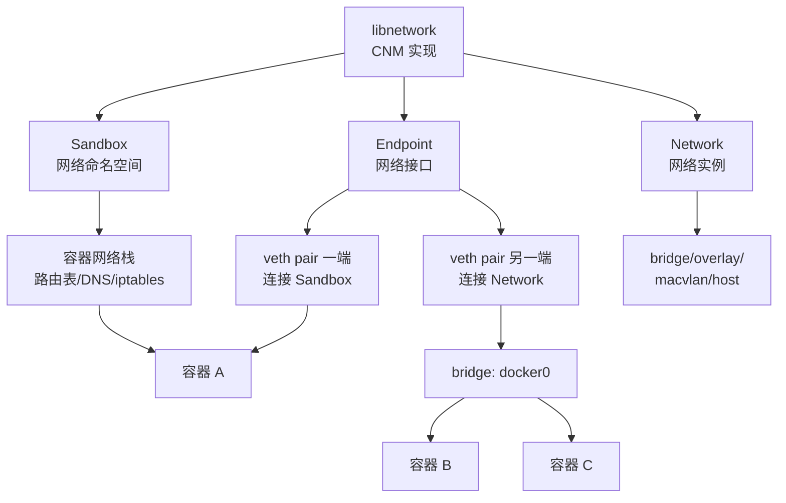

#### CNM 三大核心对象

| 对象 | 说明 | 类比 |
|------|------|------|
| **Sandbox** | 容器的网络命名空间，包含路由表、DNS、iptables 等 | 操作系统的网络栈 |
| **Endpoint** | Sandbox 连接到 Network 的端点（veth pair） | 网线 |
| **Network** | 一组可相互通信的 Endpoint 集合 | 交换机 |

### 1.2 Docker 网络模式一览

| 模式 | 命令 | 隔离性 | 性能 | 适用场景 |
|------|------|--------|------|----------|
| bridge | `--network bridge` | 高 | 中 | 默认模式，单机容器通信 |
| host | `--network host` | 无 | 高 | 需要最高网络性能 |
| overlay | `--network overlay` | 高 | 中 | 跨主机容器通信 |
| macvlan | `--network macvlan` | 中 | 高 | 容器需要物理网络 IP |
| none | `--network none` | 完全 | 无 | 不需要网络 |
| container | `--network container:id` | 共享 | 高 | 容器共享网络栈 |

### 1.3 网络模式选择决策树

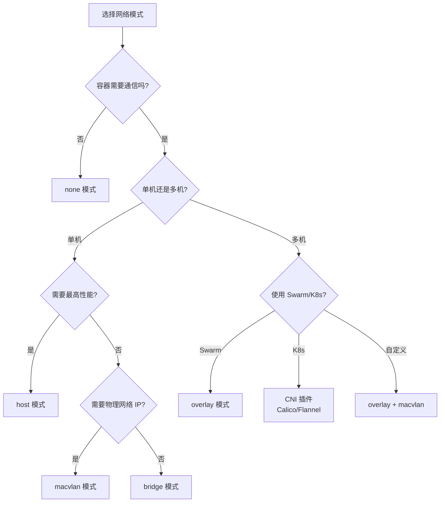

## 二、Bridge 网络内部原理

### 2.1 docker0 网桥

Docker 安装后会在主机上创建一个 `docker0` 网桥，所有默认 bridge 网络的容器都连接到这个网桥。

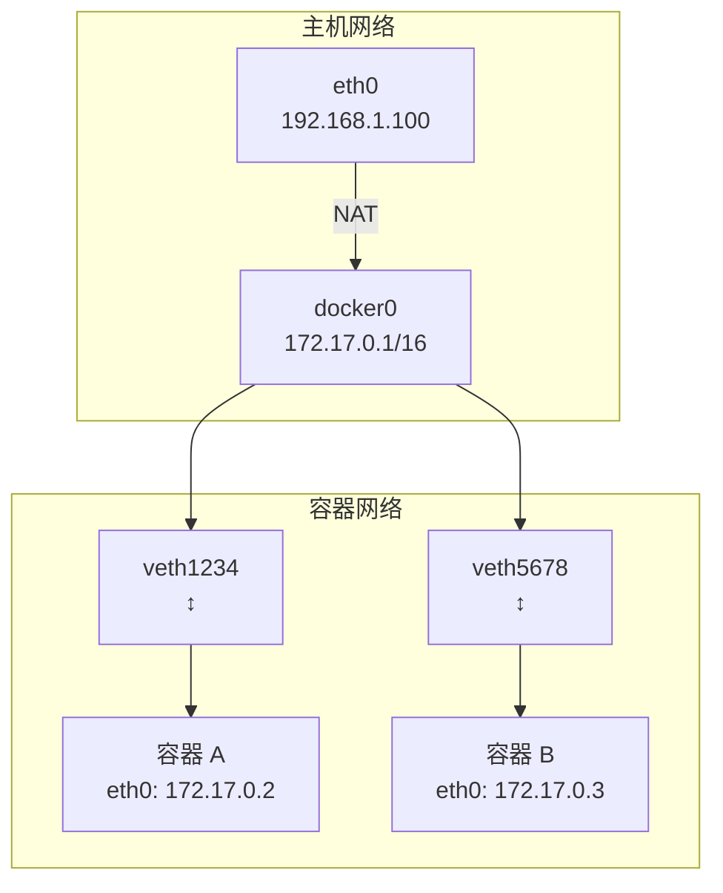

```bash
# 查看 docker0 网桥
ip addr show docker0

# 查看网桥连接的接口
brctl show docker0

# 查看网桥的 MAC 地址表
bridge fdb show br docker0

# 查看 iptables NAT 规则
iptables -t nat -L -n -v

# 查看 iptables FORWARD 规则
iptables -L FORWARD -n -v
```

### 2.2 veth pair 机制

每个容器都通过一对虚拟以太网设备（veth pair）连接到网桥：

- **一端**在容器内（`eth0`）
- **另一端**在主机上（`vethXXXX`），挂载到 `docker0` 网桥

```bash
# 查看容器的 veth pair
# 方法一：进入容器查看 eth0 的 ifindex
docker exec <container> cat /sys/class/net/eth0/ifindex
# 在主机上查找对应的 veth
ip link | grep <ifindex-1>

# 方法二：使用 ethtool
docker exec <container> ethtool -S eth0
# 输出中会有 peer 的 ifindex

# 方法三：使用 nsenter
docker inspect --format '{{.State.Pid}}' <container>
nsenter -t <pid> -n ip link show eth0
```

### 2.3 iptables 与 NAT 详解

Docker 使用 iptables 实现容器的网络地址转换（NAT）和端口映射。


#### iptables 规则链

```bash
# 1. NAT 表 — DNAT 规则（端口映射）
# docker run -p 80:8080 会创建以下规则
iptables -t nat -A DOCKER -p tcp --dport 80 -j DNAT --to-destination 172.17.0.2:8080

# 2. NAT 表 — MASQUERADE 规则（出站 SNAT）
# 容器访问外网时，源地址被替换为主机地址
iptables -t nat -A POSTROUTING -s 172.17.0.0/16 ! -o docker0 -j MASQUERADE

# 3. Filter 表 — FORWARD 规则
# 允许 docker0 到容器的转发
iptables -A FORWARD -i docker0 -o docker0 -j ACCEPT
# 允许已建立的连接
iptables -A FORWARD -o docker0 -m conntrack --ctstate RELATED,ESTABLISHED -j ACCEPT
# 允许容器出站
iptables -A FORWARD -i docker0 ! -o docker0 -j ACCEPT
```

```bash
# 查看完整的 iptables 规则
iptables -t nat -L DOCKER -n --line-numbers
iptables -L FORWARD -n -v
```

### 2.4 Bridge 网络数据包流向

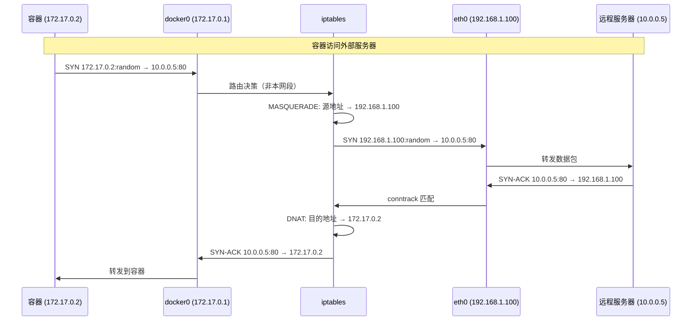

## 三、自定义 Bridge 与 DNS 发现

### 3.1 默认 bridge vs 自定义 bridge

| 特性 | 默认 bridge | 自定义 bridge |
|------|-------------|--------------|
| 容器间通信 | 需要 `--link` 或 IP | 自动 DNS 解析（服务名） |
| DNS 发现 | ❌ 无 | ✅ 有 |
| 隔离性 | 所有容器在同一网络 | 按网络隔离 |
| 热插拔 | 不支持 | 支持 |
| 推荐度 | ❌ 不推荐 | ✅ 推荐 |

::: important 始终使用自定义 bridge
Docker 官方强烈推荐使用自定义 bridge 网络而非默认 bridge。自定义 bridge 提供了 DNS 发现、更好的隔离性和热插拔能力。
:::

### 3.2 创建和使用自定义 bridge

```bash
# 创建自定义 bridge 网络
docker network create --driver bridge \
    --subnet 172.20.0.0/16 \
    --gateway 172.20.0.1 \
    my-network

# 创建带 IP 范围限制的网络
docker network create --driver bridge \
    --subnet 172.20.0.0/16 \
    --ip-range 172.20.1.0/24 \
    my-network

# 运行容器并加入网络
docker run -d --name app --network my-network myapp:latest
docker run -d --name db --network my-network postgres:16-alpine

# 容器间通过服务名通信
docker exec app curl http://db:5432

# 运行时连接/断开网络
docker network connect my-network another-container
docker network disconnect my-network another-container

# 指定容器 IP
docker run -d --name app \
    --network my-network \
    --ip 172.20.0.100 \
    myapp:latest
```

### 3.3 DNS 发现机制

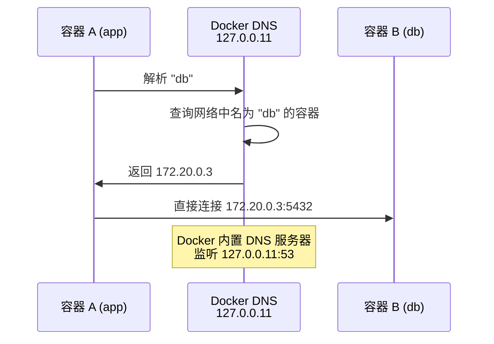

```bash
# 在容器中查看 DNS 配置
docker exec app cat /etc/resolv.conf

# 测试 DNS 解析
docker exec app nslookup db
docker exec app ping db

# 使用 dig 查询
docker exec app dig db

# 查看 Docker 内置 DNS
docker exec app dig @127.0.0.11 db
```

### 3.4 网络别名

```bash
# 创建容器时设置网络别名
docker run -d --name api \
    --network my-network \
    --network-alias api-server \
    --network-alias api.internal \
    myapp-api:latest

# 其他容器可以通过任意别名访问
docker exec app curl http://api-server:8080
docker exec app curl http://api.internal:8080
```

```yaml
# Docker Compose 中的网络别名
services:
  api:
    image: myapp-api:latest
    networks:
      my-network:
        aliases:
          - api-server
          - api.internal

networks:
  my-network:
```

### 3.5 内部网络（Internal Network）

```bash
# 创建内部网络（无法访问外网）
docker network create --driver bridge \
    --internal \
    backend-network

# 后端服务使用内部网络
docker run -d --name db --network backend-network postgres:16-alpine
docker run -d --name api --network backend-network myapp-api:latest

# API 服务同时连接外部网络和内部网络
docker network connect frontend-network api
```

```yaml
# Docker Compose 中的内部网络
networks:
  frontend:
    driver: bridge
  backend:
    driver: bridge
    internal: true    # 内部网络，无法访问外网
```

## 四、Host 模式

### 4.1 Host 模式原理

Host 模式下，容器直接使用主机的网络命名空间，不进行网络隔离。容器的端口直接暴露在主机上，无需端口映射。

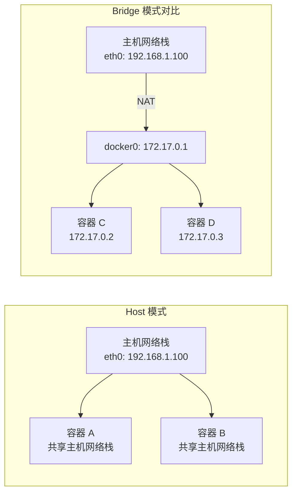

### 4.2 Host 模式使用

```bash
# 使用 host 网络模式
docker run -d --network host myapp:latest

# 容器内的 8080 端口直接绑定到主机的 8080 端口
# 无需 -p 参数

# Docker Compose
```

```yaml
services:
  app:
    image: myapp:latest
    network_mode: host
```

### 4.3 Host 模式适用场景

| 场景 | 说明 |
|------|------|
| 高性能网络应用 | 消除 NAT 开销，延迟降低 10-20% |
| 网络监控工具 | 需要访问主机网络接口（Prometheus Node Exporter） |
| 需要大量端口 | 避免大量端口映射的复杂性 |
| 调试网络问题 | 使用 tcpdump/wireshark 抓取主机流量 |

::: warning Host 模式的风险
1. **无网络隔离**：容器可以访问主机上所有网络接口和端口
2. **端口冲突**：多个容器不能绑定同一端口
3. **安全隐患**：容器被攻破后可直接访问主机网络
4. **不兼容性**：在 Docker Desktop（macOS/Windows）上 host 模式行为不同
:::

### 4.4 Host 模式性能对比

```bash
# 使用 iperf3 测试网络性能

# Bridge 模式
docker run -d --name iperf-bridge \
    --network bridge \
    -p 5201:5201 \
    networkstatic/iperf3 -s

# Host 模式
docker run -d --name iperf-host \
    --network host \
    networkstatic/iperf3 -s

# 测试结果（典型值）
# Bridge: ~8-9 Gbps（NAT 开销）
# Host:   ~9-10 Gbps（接近原生）
# 延迟：Bridge ~0.1ms 额外开销，Host 无额外延迟
```

## 五、Overlay 网络与 Swarm

### 5.1 Overlay 网络原理

Overlay 网络在多台主机之间创建虚拟网络，使用 VXLAN 隧道封装数据包，实现跨主机容器通信。

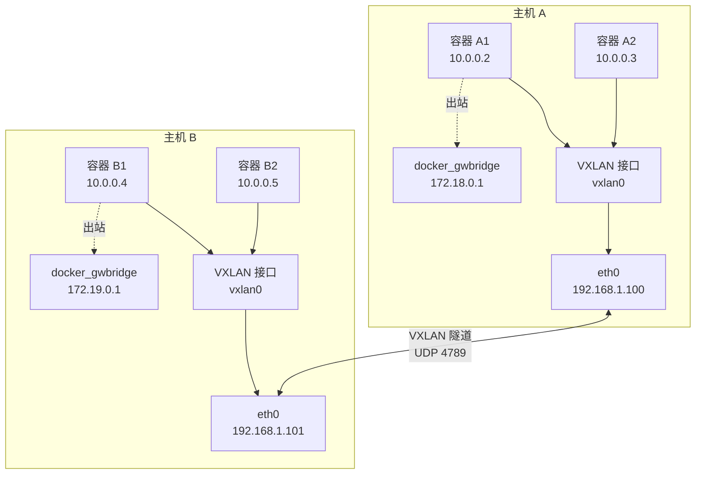

### 5.2 VXLAN 封装详解

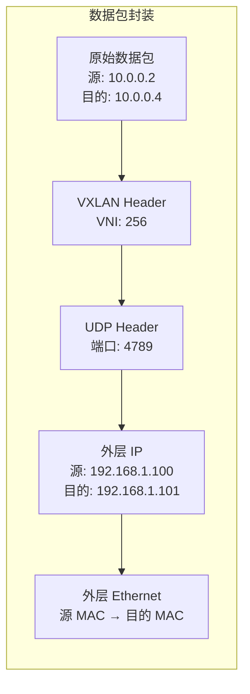

```
┌──────────────────────────────────────┐
│          外层 Ethernet Header          │
├──────────────────────────────────────┤
│          外层 IP Header               │
│   Src: 192.168.1.100  Dst: 192.168.1.101 │
├──────────────────────────────────────┤
│          UDP Header (Port 4789)       │
├──────────────────────────────────────┤
│          VXLAN Header (VNI: 256)      │
├──────────────────────────────────────┤
│          内层 Ethernet Header          │
├──────────────────────────────────────┤
│          内层 IP Header               │
│   Src: 10.0.0.2       Dst: 10.0.0.4  │
├──────────────────────────────────────┤
│          Payload (应用数据)           │
└──────────────────────────────────────┘
```

### 5.3 Overlay 跨主机通信流程

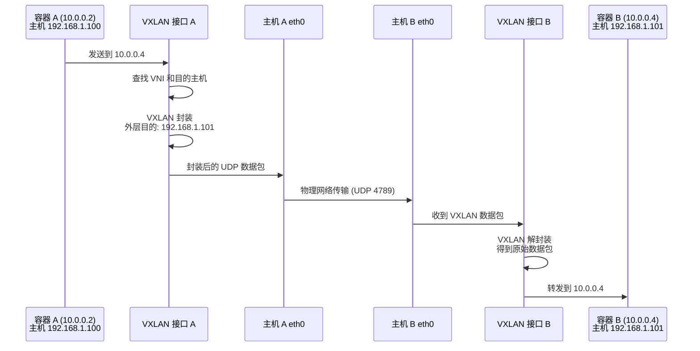

### 5.4 创建 Overlay 网络

```bash
# 初始化 Swarm
docker swarm init

# 在管理节点上创建 Overlay 网络
docker network create --driver overlay \
    --subnet 10.0.0.0/24 \
    --attachable \
    my-overlay

# 创建加密的 Overlay 网络
docker network create --driver overlay \
    --opt encrypted \
    my-secure-overlay

# 查看网络
docker network ls
docker network inspect my-overlay
```

### 5.5 Swarm 服务使用 Overlay

```bash
# 创建使用 Overlay 网络的服务
docker service create \
    --name api \
    --network my-overlay \
    --replicas 3 \
    -p 8080:8080 \
    myapp-api:latest

docker service create \
    --name db \
    --network my-overlay \
    postgres:16-alpine

# 服务间通过服务名通信
# api 容器可以通过 http://db:5432 访问数据库
```

### 5.6 可附加的 Overlay（Attachable）

```bash
# 创建可附加的 Overlay 网络
docker network create --driver overlay --attachable my-overlay

# 独立容器也可以加入（不仅限于 Swarm 服务）
docker run -d --name debug \
    --network my-overlay \
    nicolaka/netshoot

# 调试 Overlay 网络中的其他服务
docker exec debug curl http://api:8080/health
```

### 5.7 Overlay 网络的加密

```bash
# 创建加密 Overlay
docker network create --driver overlay \
    --opt encrypted \
    secure-overlay

# 加密原理
# 使用 IPsec (ESP) 加密 VXLAN 隧道
# 每个节点自动生成密钥
# 加密仅在跨主机传输时生效
```

::: warning Overlay 加密的性能影响
加密 Overlay 网络会增加约 10-30% 的网络延迟和 CPU 开销。建议：
- 仅在需要加密的场景（如跨数据中心）启用加密
- 同一数据中心内可以使用非加密 Overlay
- 使用硬件加速（AES-NI）降低 CPU 开销
:::

### 5.8 docker_gwbridge

每个 Overlay 网络还会自动创建一个 `docker_gwbridge`，用于容器访问外部网络。

```bash
# 查看 docker_gwbridge
docker network inspect docker_gwbridge

# 每个加入 Overlay 的容器会有两个网络接口：
# 1. eth0: Overlay 网络（容器间通信）
# 2. eth1: docker_gwbridge（出站访问外网）
```

## 六、Macvlan 与物理网络直通

### 6.1 Macvlan 原理

Macvlan 允许容器直接使用物理网络接口，拥有独立的 MAC 地址和 IP 地址，从网络角度看就像一台物理机。

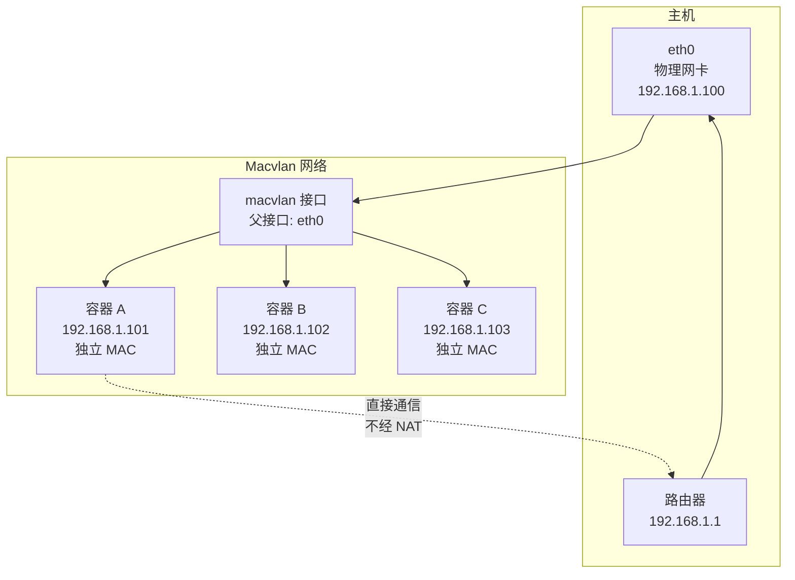

### 6.2 Macvlan 架构详解

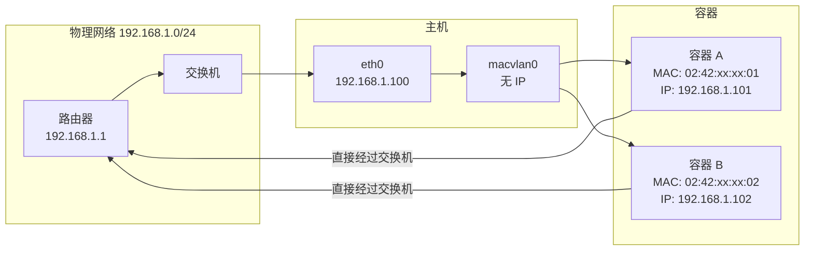

### 6.3 创建 Macvlan 网络

```bash
# 创建 Macvlan 网络
docker network create -d macvlan \
    --subnet=192.168.1.0/24 \
    --gateway=192.168.1.1 \
    --ip-range=192.168.1.200/29 \
    -o parent=eth0 \
    macvlan-net

# 运行容器使用 Macvlan
docker run -d --name app \
    --network macvlan-net \
    --ip=192.168.1.201 \
    myapp:latest

# 指定 MAC 地址
docker run -d --name app \
    --network macvlan-net \
    --mac-address="02:42:ac:11:00:01" \
    myapp:latest
```

### 6.4 Macvlan 的 VLAN 隔离

```bash
# 创建带 VLAN 标签的 Macvlan
docker network create -d macvlan \
    --subnet=192.168.10.0/24 \
    --gateway=192.168.10.1 \
    -o parent=eth0.10 \
    macvlan-vlan10

docker network create -d macvlan \
    --subnet=192.168.20.0/24 \
    --gateway=192.168.20.1 \
    -o parent=eth0.20 \
    macvlan-vlan20

# 运行在不同 VLAN 中的容器
docker run -d --network macvlan-vlan10 app-v10:latest
docker run -d --network macvlan-vlan20 app-v20:latest
```

### 6.5 Macvlan 主机-容器通信问题

::: warning Macvlan 的通信限制
默认情况下，Macvlan 容器**无法与主机通信**。这是因为 Linux 内核的安全限制：主机通过物理接口发出的数据包不会回环到 Macvlan 接口。

解决方案：在主机上创建一个 Macvlan 接口，作为主机与容器通信的桥梁。
:::

```bash
# 解决方案：在主机上创建 Macvlan 接口
# 步骤 1：创建 Macvlan 网络
docker network create -d macvlan \
    --subnet=192.168.1.0/24 \
    --gateway=192.168.1.1 \
    -o parent=eth0 \
    macvlan-net

# 步骤 2：在主机上创建 Macvlan 接口
sudo ip link add macvlan-shim link eth0 type macvlan mode bridge
sudo ip addr add 192.168.1.250/32 dev macvlan-shim
sudo ip link set macvlan-shim up

# 步骤 3：添加路由
sudo ip route add 192.168.1.200/29 dev macvlan-shim

# 现在主机可以通过 192.168.1.250 访问 Macvlan 容器
```

### 6.6 Macvlan 模式

| 模式 | 说明 | 适用场景 |
|------|------|----------|
| **bridge** | 容器间可直接通信 | 默认模式，推荐 |
| **VEPA** | 容器间通信经外部交换机 | 需要交换机策略控制 |
| **private** | 容器间不可通信 | 最大隔离 |
| **passthru** | 单容器独占物理接口 | SR-IOV 等特殊场景 |

```bash
# 指定 Macvlan 模式
docker network create -d macvlan \
    --subnet=192.168.1.0/24 \
    -o parent=eth0 \
    -o macvlan_mode=bridge \
    macvlan-net
```

## 七、IPv6 支持

### 7.1 启用 IPv6

```bash
# 方式一：Docker Daemon 配置
# /etc/docker/daemon.json
cat <<EOF | sudo tee /etc/docker/daemon.json
{
  "ipv6": true,
  "fixed-cidr-v6": "fd00:dead:beef::/48"
}
EOF

sudo systemctl restart docker
```

### 7.2 创建 IPv6 网络

```bash
# 创建支持 IPv6 的 bridge 网络
docker network create \
    --driver bridge \
    --subnet "172.20.0.0/16" \
    --subnet "fd00:db8:1::/64" \
    ipv6-network

# 创建 IPv6-only 网络
docker network create \
    --driver bridge \
    --subnet "fd00:db8:2::/64" \
    ipv6-only-network

# 运行 IPv6 容器
docker run -d --network ipv6-network myapp:latest

# 验证 IPv6 地址
docker exec <container> ip -6 addr show eth0
```

### 7.3 IPv6 端口映射

```bash
# IPv4 + IPv6 端口映射
docker run -d -p 80:8080 --network ipv6-network myapp:latest

# 仅 IPv6 端口映射
docker run -d -p "[::]:80:8080" --network ipv6-network myapp:latest

# 查看端口映射
docker port <container> 8080
```

### 7.4 IPv6 网络排障

```bash
# 检查容器 IPv6 连通性
docker exec <container> ping6 -c 3 google.com
docker exec <container> curl -6 https://ipv6.google.com

# 检查路由
docker exec <container> ip -6 route

# 检查 DNS
docker exec <container> dig AAAA google.com

# 检查 iptables IPv6 规则
ip6tables -t nat -L -n -v
ip6tables -L FORWARD -n -v
```

## 八、网络性能对比

### 8.1 性能测试方法

```bash
# 安装 iperf3
# 服务端
docker run -d --name iperf3-server \
    --network host \
    networkstatic/iperf3 -s

# 客户端测试
# Bridge 模式
docker run --rm --network bridge \
    networkstatic/iperf3 -c <server-ip>

# Host 模式
docker run --rm --network host \
    networkstatic/iperf3 -c <server-ip>

# Macvlan 模式
docker run --rm --network macvlan-net \
    networkstatic/iperf3 -c <server-ip>
```

### 8.2 性能对比表

| 网络模式 | 吞吐量 | 延迟 | CPU 开销 | 隔离性 |
|----------|--------|------|----------|--------|
| Host | ~10 Gbps | ~0.01ms | 最低 | 无 |
| Macvlan | ~9.5 Gbps | ~0.02ms | 低 | 中 |
| Bridge | ~8.5 Gbps | ~0.05ms | 中 | 高 |
| Overlay | ~6-7 Gbps | ~0.1ms | 高 | 高 |
| Overlay（加密） | ~4-5 Gbps | ~0.2ms | 很高 | 高 |

::: tip 性能优化建议
1. **高频交易/低延迟**：使用 Host 模式
2. **高吞吐**：Macvlan 或 Host 模式
3. **一般应用**：Bridge 模式足够
4. **跨主机通信**：Overlay（非加密），必要时加密
5. **减少 NAT**：Macvlan 直接使用物理网络 IP
:::

### 8.3 网络性能调优

```bash
# 1. 调整 TCP 缓冲区
sysctl -w net.core.rmem_max=16777216
sysctl -w net.core.wmem_max=16777216
sysctl -w net.ipv4.tcp_rmem="4096 87380 16777216"
sysctl -w net.ipv4.tcp_wmem="4096 65536 16777216"

# 2. 启用 TCP 窗口缩放
sysctl -w net.ipv4.tcp_window_scaling=1

# 3. 调整连接跟踪表大小
sysctl -w net.netfilter.nf_conntrack_max=131072

# 4. 启用 BBR 拥塞控制
sysctl -w net.ipv4.tcp_congestion_control=bbr
sysctl -w net.core.default_qdisc=fq

# 5. 调整 netfilter 连接跟踪超时
sysctl -w net.netfilter.nf_conntrack_tcp_timeout_established=7200
```

## 九、网络排障方法论

### 9.1 系统化排障流程

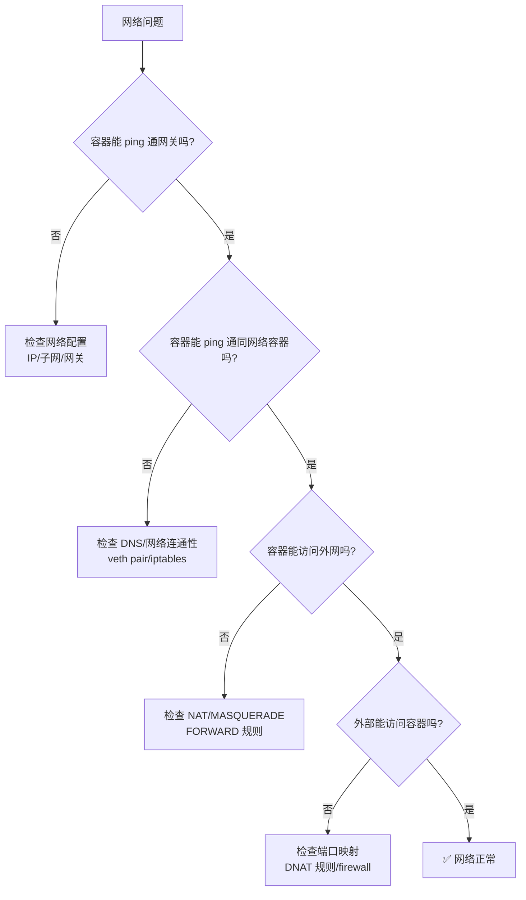

### 9.2 常用排障工具

#### tcpdump — 抓包分析

```bash
# 在主机上抓取 docker0 的流量
sudo tcpdump -i docker0 -nn -vvv

# 抓取特定容器的流量
# 先找到容器的 veth 接口
VETH=$(docker exec <container> cat /sys/class/net/eth0/ifindex)
VETH_NAME=$(ip link | grep "^${VETH}:" | awk -F': ' '{print $2}')
sudo tcpdump -i ${VETH_NAME} -nn -vvv

# 抓取 Overlay VXLAN 流量
sudo tcpdump -i eth0 udp port 4789 -nn -vvv

# 抓取并保存到文件
sudo tcpdump -i docker0 -w capture.pcap

# 使用 Wireshark 分析
# wireshark capture.pcap
```

#### nsenter — 进入容器命名空间

```bash
# 获取容器 PID
PID=$(docker inspect --format '{{.State.Pid}}' <container>)

# 进入网络命名空间
sudo nsenter -t ${PID} -n ip addr
sudo nsenter -t ${PID} -n ip route
sudo nsenter -t ${PID} -n iptables -L -n -v

# 在容器命名空间中运行 tcpdump
sudo nsenter -t ${PID} -n tcpdump -i eth0 -nn

# 测试 DNS
sudo nsenter -t ${PID} -n nslookup db

# 测试路由
sudo nsenter -t ${PID} -n traceroute 8.8.8.8
```

#### iptables — 防火墙规则检查

```bash
# 查看 NAT 规则
sudo iptables -t nat -L DOCKER -n --line-numbers
sudo iptables -t nat -L POSTROUTING -n -v

# 查看 FORWARD 规则
sudo iptables -L FORWARD -n -v

# 查看 DOCKER-USER 链（自定义规则）
sudo iptables -L DOCKER-USER -n -v

# 添加自定义规则
sudo iptables -I DOCKER-USER -s 10.0.0.0/8 -j DROP

# 追踪连接
sudo conntrack -L | grep <container-ip>
sudo conntrack -D -s <container-ip>
```

### 9.3 DNS 排障

```bash
# 检查容器 DNS 配置
docker exec <container> cat /etc/resolv.conf

# 测试 DNS 解析
docker exec <container> nslookup db
docker exec <container> nslookup db 127.0.0.11    # Docker 内置 DNS

# 检查 Docker DNS 日志
docker logs $(docker ps -q --filter name=dockerd)

# 自定义 DNS 服务器
docker run -d --dns 8.8.8.8 --dns 8.8.4.4 myapp:latest

# 禁用 Docker DNS（使用主机 DNS）
docker run -d --dns-search="" myapp:latest
```

```yaml
# Docker Compose 中配置 DNS
services:
  app:
    dns:
      - 8.8.8.8
      - 8.8.4.4
    dns_search:
      - example.com
      - internal.example.com
```

### 9.4 常见网络问题与解决方案

| 问题 | 原因 | 解决方案 |
|------|------|----------|
| 容器无法解析服务名 | 默认 bridge 无 DNS | 使用自定义 bridge |
| 容器无法访问外网 | FORWARD 链被禁止 | 检查 iptables FORWARD 规则 |
| 端口映射不生效 | 防火墙阻止 | 检查 iptables/firwalld |
| 容器间无法通信 | 不在同一网络 | 加入相同自定义网络 |
| Macvlan 容器无法与主机通信 | 内核安全限制 | 创建 Macvlan shim 接口 |
| Overlay 网络延迟高 | VXLAN 封装开销 | 使用加密或调优 |
| DNS 解析慢 | ndots 问题 | 调整 ndots 或使用 FQDN |
| 容器重启后 IP 变化 | 动态分配 | 使用命名卷或服务发现 |

### 9.5 ndots 问题详解

::: info 什么是 ndots 问题
Linux 的 `/etc/resolv.conf` 中 `options ndots:5` 表示：如果域名中的点数少于 5 个，会先尝试追加搜索域后缀进行解析。例如 `db` 只有 0 个点，会依次尝试：
1. `db.my-network.local`
2. `db.my-network`
3. `db.local`
4. `db`

这导致 DNS 解析变慢，特别是当搜索域不存在时。
:::

```bash
# 解决方案 1：使用 FQDN
docker exec app ping db.my-network

# 解决方案 2：调整 ndots
docker run -d --dns-opt ndots:1 myapp:latest

# 解决方案 3：Docker Compose
```

```yaml
services:
  app:
    dns_opt:
      - ndots:1
```

## 十、容器间通信安全

### 10.1 网络隔离策略

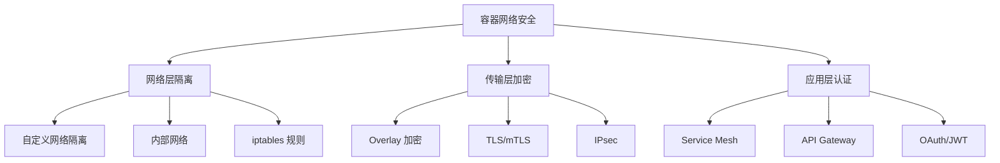

### 10.2 网络隔离实践

```yaml
# Docker Compose 三层网络隔离
services:
  # 前端 — 仅暴露到外网
  nginx:
    image: nginx:alpine
    networks:
      - frontend
    ports:
      - "80:80"
      - "443:443"

  # API — 连接前后端
  api:
    image: myapp-api:latest
    networks:
      - frontend
      - backend

  # 数据层 — 仅后端可访问
  db:
    image: postgres:16-alpine
    networks:
      - backend

  redis:
    image: redis:7-alpine
    networks:
      - backend

networks:
  frontend:
    driver: bridge
  backend:
    driver: bridge
    internal: true   # 内部网络，无法访问外网
```

### 10.3 容器间 TLS 通信

```bash
# 生成自签名证书
openssl req -x509 -newkey rsa:4096 \
    -keyout key.pem -out cert.pem \
    -days 365 -nodes \
    -subj "/CN=api.internal"

# 在容器中使用 TLS
docker run -d \
    -v /path/to/certs:/certs:ro \
    -e TLS_CERT=/certs/cert.pem \
    -e TLS_KEY=/certs/key.pem \
    myapp:latest
```

### 10.4 使用 Docker Compose 配置安全策略

```yaml
services:
  app:
    image: myapp:latest
    # 内部通信不需要暴露端口
    networks:
      - backend
    # 安全配置
    security_opt:
      - no-new-privileges:true
    cap_drop:
      - ALL
    cap_add:
      - NET_BIND_SERVICE
    read_only: true

networks:
  backend:
    driver: bridge
    internal: true  # 阻止外网访问
```

## 十一、网络插件（CNI 简介）

### 11.1 CNI 与 CNM

| 特性 | CNI | CNM |
|------|-----|-----|
| 全称 | Container Network Interface | Container Network Model |
| 提出 | Kubernetes/CNCF | Docker/libnetwork |
| 使用者 | Kubernetes、Podman、CRI-O | Docker |
| 设计理念 | 简单、可组合 | 面向对象 |
| 插件丰富度 | 非常丰富 | 有限 |

### 11.2 Calico 简介

Calico 是最流行的 CNI 插件之一，使用 BGP 协议实现 Pod 间通信，无需 Overlay 封装。

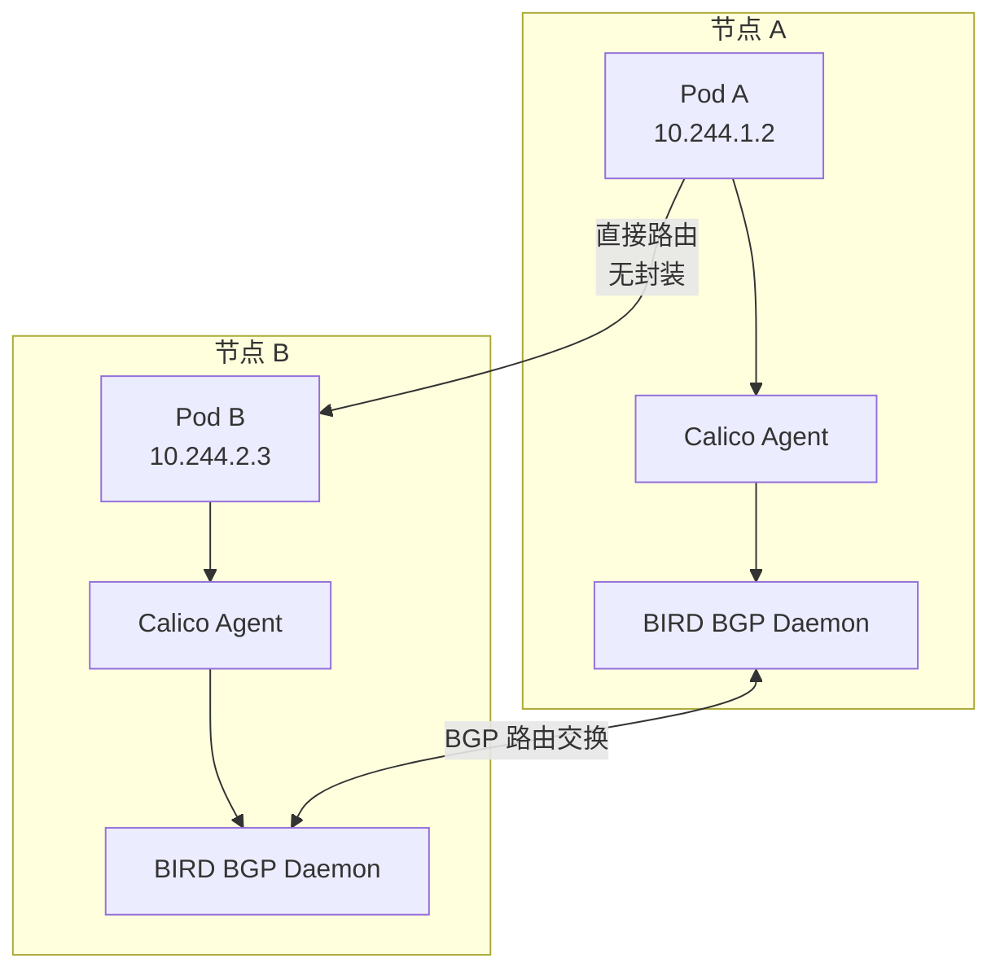

Calico 特点：
- **无 Overlay**：使用 BGP 路由，无 VXLAN 封装开销
- **网络策略**：支持 L3/L4 网络策略（命名空间/标签选择器）
- **性能**：接近原生网络性能
- **规模**：支持数千节点集群
- **模式**：BGP（默认）、VXLAN（跨网段）、IPIP（兼容模式）

### 11.3 Flannel 简介

Flannel 是 CoreOS 开发的简单 CNI 插件，为每个节点分配子网，使用多种后端实现跨主机通信。

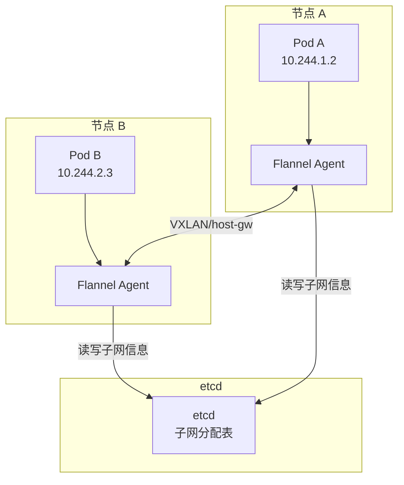

Flannel 后端模式：

| 模式 | 说明 | 性能 | 适用场景 |
|------|------|------|----------|
| vxlan | VXLAN 封装 | 中 | 通用（默认） |
| host-gw | 主机路由 | 高 | L2 网络可达 |
| ipip | IPIP 封装 | 中 | 跨网段路由 |
| wireguard | WireGuard 加密 | 中 | 加密通信 |
| alloc | 仅分配 IP | - | 与其他 CNI 配合 |

### 11.4 CNI 插件选择

| 插件 | 网络 | 网络策略 | 性能 | 复杂度 | 适用场景 |
|------|------|----------|------|--------|----------|
| Calico | BGP/VXLAN | ✅ 强大 | 高 | 中 | 生产环境首选 |
| Flannel | VXLAN/host-gw | ❌ | 中 | 低 | 简单集群 |
| Cilium | eBPF | ✅ L3-L7 | 高 | 高 | 高级网络策略 |
| Weave | VXLAN+加密 | ✅ | 中 | 低 | 简单加密通信 |
| Antrea | OVS | ✅ | 高 | 中 | VMware 环境 |

## 十二、Docker 网络高级配置

### 12.1 自定义 docker0 网桥

```bash
# 修改 docker0 默认地址范围
# /etc/docker/daemon.json
{
  "bip": "10.200.0.1/16",
  "fixed-cidr": "10.200.0.0/16",
  "default-gateway": "10.200.0.1"
}
```

### 12.2 端口映射高级配置

```bash
# 指定绑定接口
docker run -d -p 127.0.0.1:8080:80 myapp:latest

# UDP 端口映射
docker run -d -p 53:53/udp myapp:latest

# 端口范围映射
docker run -d -p 7000-8000:7000-8000 myapp:latest

# 随机端口映射
docker run -d -P myapp:latest

# 查看端口映射
docker port <container>
```

### 12.3 网络性能监控

```bash
# 查看容器网络流量
docker stats --no-stream

# 使用 ctop 监控
ctop

# 使用 Prometheus + cAdvisor 监控
# 容器网络指标：
# - container_network_receive_bytes_total
# - container_network_transmit_bytes_total
# - container_network_receive_errors_total
# - container_network_transmit_errors_total
```

### 12.4 连接多个网络

```bash
# 创建容器时连接一个网络
docker run -d --name api \
    --network backend \
    myapp-api:latest

# 运行时连接另一个网络
docker network connect frontend api

# 查看容器连接的所有网络
docker inspect --format '{{json .NetworkSettings.Networks}}' api

# 断开网络
docker network disconnect frontend api
```

```yaml
# Docker Compose 连接多个网络
services:
  api:
    image: myapp-api:latest
    networks:
      - frontend
      - backend
```

## 十三、Docker 网络与容器编排

### 13.1 Docker Swarm 网络模型

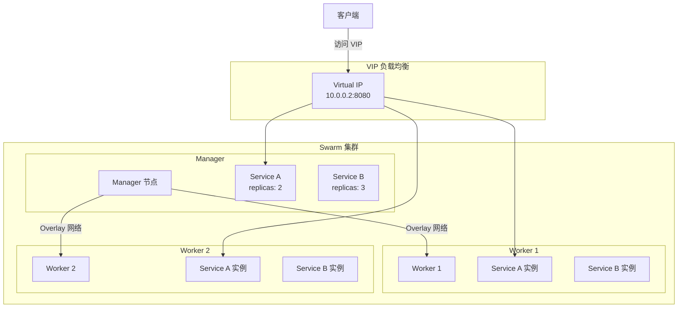

### 13.2 Kubernetes 网络模型

Kubernetes 网络模型要求：
1. **Pod 间直接通信**：无需 NAT
2. **Node 与 Pod 间直接通信**：无需 NAT
3. **Pod IP 对其他 Pod 可见**：Pod 看到的自己的 IP 与其他 Pod 看到的一致

```bash
# Kubernetes 网络策略示例
apiVersion: networking.k8s.io/v1
kind: NetworkPolicy
metadata:
  name: api-policy
  namespace: production
spec:
  podSelector:
    matchLabels:
      app: api
  policyTypes:
    - Ingress
    - Egress
  ingress:
    - from:
        - podSelector:
            matchLabels:
              app: frontend
      ports:
        - port: 8080
  egress:
    - to:
        - podSelector:
            matchLabels:
              app: db
      ports:
        - port: 5432
```

## 十四、综合案例：多网络架构实战

### 14.1 微服务网络架构

```yaml
# docker-compose.yml — 完整的微服务网络架构
name: microservices

services:
  # ===== 前端层 =====
  gateway:
    image: nginx:alpine
    networks:
      - public
      - api-net
    ports:
      - "80:80"
      - "443:443"
    volumes:
      - ./nginx/nginx.conf:/etc/nginx/nginx.conf:ro
    depends_on:
      api:
        condition: service_healthy

  # ===== API 层 =====
  api:
    image: myapp-api:latest
    networks:
      - api-net
      - backend
    environment:
      DB_HOST: db
      REDIS_HOST: redis
    healthcheck:
      test: ["CMD", "curl", "-f", "http://localhost:8080/health"]
      interval: 15s
      timeout: 3s
      retries: 3
    deploy:
      replicas: 2

  # ===== 后端服务 =====
  worker:
    image: myapp-worker:latest
    networks:
      - backend
    environment:
      DB_HOST: db
      REDIS_HOST: redis

  # ===== 数据层 =====
  db:
    image: postgres:16-alpine
    networks:
      - backend
    volumes:
      - db-data:/var/lib/postgresql/data
    environment:
      POSTGRES_DB: myapp
      POSTGRES_PASSWORD: ${DB_PASSWORD}
    healthcheck:
      test: ["CMD-SHELL", "pg_isready -U postgres"]
      interval: 5s
      timeout: 3s
      retries: 10

  redis:
    image: redis:7-alpine
    networks:
      - backend
    volumes:
      - redis-data:/data
    healthcheck:
      test: ["CMD", "redis-cli", "ping"]
      interval: 10s
      timeout: 3s
      retries: 5

  # ===== 监控（Profile）=====
  prometheus:
    image: prom/prometheus:latest
    profiles:
      - monitoring
    networks:
      - public
      - backend
    volumes:
      - ./prometheus.yml:/etc/prometheus/prometheus.yml:ro
    ports:
      - "9090:9090"

  grafana:
    image: grafana/grafana:latest
    profiles:
      - monitoring
    networks:
      - public
    ports:
      - "3001:3000"

networks:
  public:
    driver: bridge
  api-net:
    driver: bridge
  backend:
    driver: bridge
    internal: true     # 内部网络，数据层不暴露到外网

volumes:
  db-data:
  redis-data:
```

### 14.2 网络架构图

```mermaid
flowchart TD
    CLIENT[👤 客户端] -->|:80/:443| GW[Nginx Gateway<br/>公共网络]
    GW -->|api-net| API[API Server ×2<br/>10.1.0.0/16]
    API -->|backend| DB[(PostgreSQL<br/>10.2.0.0/16)]
    API -->|backend| REDIS[(Redis<br/>10.2.0.0/16)]
    WORKER[Worker] -->|backend| DB
    WORKER -->|backend| REDIS

    subgraph 公共网络
        GW
    end
    subgraph API 网络
        GW
        API
    end
    subgraph 后端网络（内部）
        API
        WORKER
        DB
        REDIS
    end
```

::: tip 本章要点回顾
1. **网络架构**：理解 CNM 模型（Sandbox/Endpoint/Network）是理解 Docker 网络的基础
2. **Bridge 原理**：docker0 网桥 + veth pair + iptables/NAT 是 Bridge 网络的三大支柱
3. **自定义 Bridge**：始终使用自定义 bridge 而非默认 bridge，获得 DNS 发现和更好的隔离
4. **Host 模式**：最高性能但无隔离，仅用于特定场景
5. **Overlay 网络**：跨主机通信的核心，理解 VXLAN 封装和加密机制
6. **Macvlan**：容器直通物理网络，注意主机-容器通信问题
7. **IPv6**：Docker 原生支持 IPv6，注意双栈配置
8. **性能对比**：Host > Macvlan > Bridge > Overlay（加密），根据需求选择
9. **排障方法论**：tcpdump + nsenter + iptables 是三大排障利器
10. **CNI 插件**：Calico 和 Flannel 是 Kubernetes 中最常用的网络插件
:::

## 参考资源

- [Docker Network — Docker Documentation](https://docs.docker.com/network/)
- [libnetwork — GitHub](https://github.com/moby/libnetwork)
- [Container Network Model (CNM)](https://github.com/moby/libnetwork/blob/master/docs/design.md)
- [Overlay Network Driver — Docker Docs](https://docs.docker.com/network/drivers/overlay/)
- [Macvlan Network Driver — Docker Docs](https://docs.docker.com/network/drivers/macvlan/)
- [Calico Documentation](https://docs.tigera.io/calico/latest/about/)
- [Flannel — GitHub](https://github.com/flannel-io/flannel)
- [Cilium Documentation](https://docs.cilium.io/)
- [Kubernetes Network Policies](https://kubernetes.io/docs/concepts/services-networking/network-policies/)
- [iptables Tutorial](https://www.frozentux.net/iptables-tutorial/iptables-tutorial.html)
