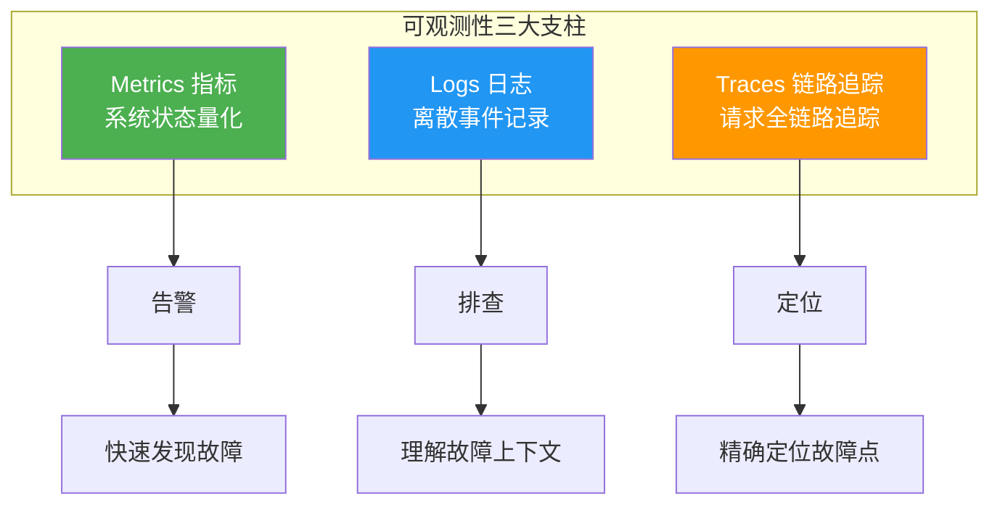
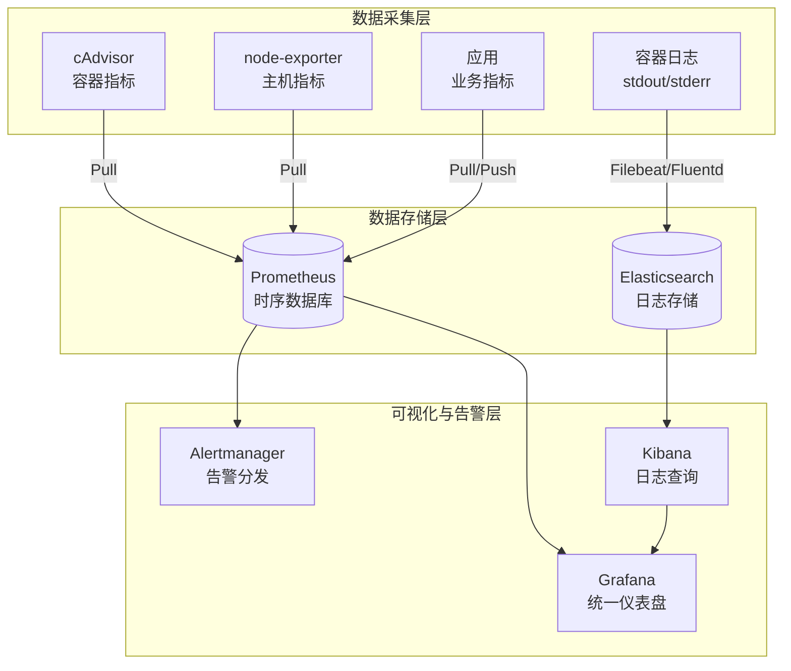
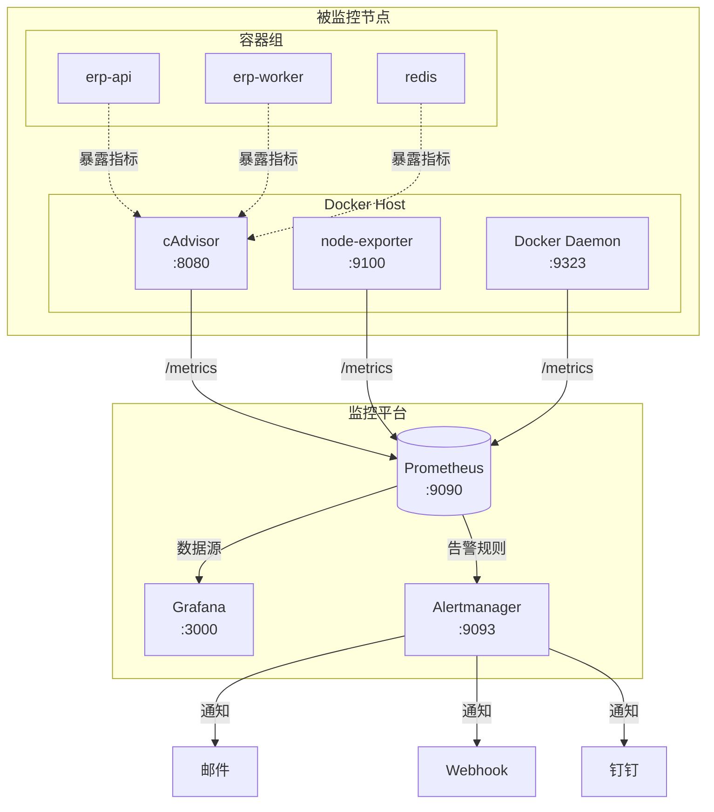
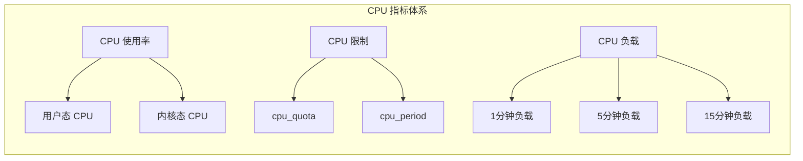
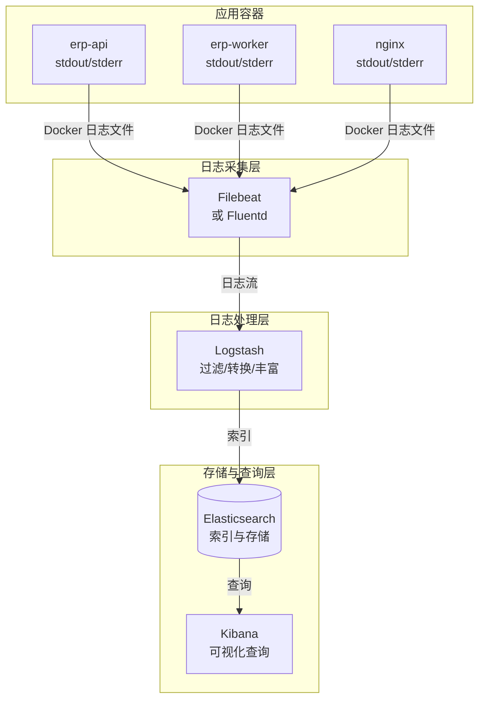

# 容器监控与日志

可观测性是容器化生产环境的生命线。没有监控，你不知道系统在发生什么；没有日志，你不知道系统发生了什么；没有链路追踪，你不知道问题出在哪里。本文从三大支柱出发，构建完整的容器可观测性体系。

---

## 一、容器可观测性三大支柱

### 1.1 三大支柱概览



| 支柱 | 数据特征 | 采集方式 | 典型工具 | 解决的问题 |
|------|----------|----------|----------|-----------|
| Metrics | 时序数据，周期性采集 | Pull/Push | Prometheus, cAdvisor | 系统健康状态、趋势、告警 |
| Logs | 非结构化/半结构化，事件驱动 | Push | Filebeat, Fluentd | 故障上下文、错误追踪 |
| Traces | 结构化，请求级别 | 埋点+采集 | Jaeger, Zipkin | 分布式调用链、性能瓶颈 |

::: info 三者协同
三大支柱不是孤立使用的。一个完整的排障流程是：**Metrics 发现异常 → Logs 查看错误详情 → Traces 定位具体调用链**。三者通过 trace ID、容器名、时间戳等关联。
:::

### 1.2 容器可观测性架构



---

## 二、cAdvisor 部署与指标采集

### 2.1 cAdvisor 简介

cAdvisor（Container Advisor）是 Google 开源的容器资源使用和性能分析工具。它采集容器的 CPU、内存、网络、磁盘 IO 等指标，并以 Prometheus 格式暴露。

### 2.2 cAdvisor 部署

```bash
# 直接运行
docker run -d \
  --name=cadvisor \
  --volume=/:/rootfs:ro \
  --volume=/var/run:/var/run:ro \
  --volume=/sys:/sys:ro \
  --volume=/var/lib/docker/:/var/lib/docker:ro \
  --volume=/dev/disk/:/dev/disk:ro \
  --publish=8080:8080 \
  --device=/dev/kmsg \
  --restart=always \
  gcr.io/cadvisor/cadvisor:latest

# 访问 Web UI
# http://localhost:8080
```

```yaml
# docker-compose.yml — cAdvisor
version: "3.8"

services:
  cadvisor:
    image: gcr.io/cadvisor/cadvisor:latest
    container_name: cadvisor
    ports:
      - "8080:8080"
    volumes:
      - /:/rootfs:ro
      - /var/run:/var/run:ro
      - /sys:/sys:ro
      - /var/lib/docker/:/var/lib/docker:ro
      - /dev/disk/:/dev/disk:ro
    devices:
      - /dev/kmsg
    privileged: true
    restart: always
    labels:
      com.prometheus.scrape: "true"
      com.prometheus.port: "8080"
      com.prometheus.path: "/metrics"
```

### 2.3 cAdvisor 核心指标

| 指标名称 | 类型 | 说明 |
|----------|------|------|
| `container_cpu_usage_seconds_total` | Counter | CPU 使用总时间 |
| `container_memory_working_set_bytes` | Gauge | 工作集内存（真实使用量） |
| `container_memory_usage_bytes` | Gauge | 已分配内存（含缓存） |
| `container_network_receive_bytes_total` | Counter | 网络接收字节数 |
| `container_network_transmit_bytes_total` | Counter | 网络发送字节数 |
| `container_fs_usage_bytes` | Gauge | 文件系统使用量 |
| `container_fs_reads_bytes_total` | Counter | 磁盘读取字节数 |
| `container_fs_writes_bytes_total` | Counter | 磁盘写入字节数 |
| `container_last_seen` | Gauge | 容器最后活跃时间 |
| `container_spec_memory_limit_bytes` | Gauge | 容器内存限制 |
| `container_start_time_seconds` | Gauge | 容器启动时间 |

```bash
# 查看 cAdvisor 指标
curl -s http://localhost:8080/metrics | head -50

# 查询特定容器的 CPU 使用率
curl -s 'http://localhost:8080/metrics' | \
  grep 'container_cpu_usage_seconds_total{name="erp-api"}'
```

::: tip container_memory_working_set_bytes vs container_memory_usage_bytes
- `working_set_bytes`：包含不可回收的内存，是 OOM Killer 的判断依据
- `usage_bytes`：包含可回收的 Page Cache，不代表真实压力
- **监控告警应使用 `working_set_bytes`**
:::

---

## 三、Prometheus + Grafana 容器监控方案

### 3.1 整体架构



### 3.2 Prometheus 部署

```yaml
# docker-compose.yml — Prometheus + Grafana + cAdvisor + Node Exporter
version: "3.8"

services:
  prometheus:
    image: prom/prometheus:latest
    container_name: prometheus
    ports:
      - "9090:9090"
    volumes:
      - ./prometheus.yml:/etc/prometheus/prometheus.yml:ro
      - ./rules:/etc/prometheus/rules:ro
      - prometheus_data:/prometheus
    command:
      - "--config.file=/etc/prometheus/prometheus.yml"
      - "--storage.tsdb.path=/prometheus"
      - "--storage.tsdb.retention.time=30d"
      - "--storage.tsdb.retention.size=50GB"
      - "--web.enable-lifecycle"
      - "--web.enable-admin-api"
    restart: always
    networks:
      - monitoring

  grafana:
    image: grafana/grafana:latest
    container_name: grafana
    ports:
      - "3000:3000"
    environment:
      GF_SECURITY_ADMIN_USER: admin
      GF_SECURITY_ADMIN_PASSWORD: "Grafana@123!"
      GF_USERS_ALLOW_SIGN_UP: "false"
      GF_INSTALL_PLUGINS: "grafana-clock-panel,grafana-piechart-panel"
    volumes:
      - grafana_data:/var/lib/grafana
      - ./grafana/provisioning:/etc/grafana/provisioning
    depends_on:
      - prometheus
    restart: always
    networks:
      - monitoring

  cadvisor:
    image: gcr.io/cadvisor/cadvisor:latest
    container_name: cadvisor
    ports:
      - "8080:8080"
    volumes:
      - /:/rootfs:ro
      - /var/run:/var/run:ro
      - /sys:/sys:ro
      - /var/lib/docker/:/var/lib/docker:ro
      - /dev/disk/:/dev/disk:ro
    devices:
      - /dev/kmsg
    privileged: true
    restart: always
    networks:
      - monitoring

  node-exporter:
    image: prom/node-exporter:latest
    container_name: node-exporter
    ports:
      - "9100:9100"
    volumes:
      - /proc:/host/proc:ro
      - /sys:/host/sys:ro
      - /:/rootfs:ro
    command:
      - "--path.procfs=/host/proc"
      - "--path.sysfs=/host/sys"
      - "--path.rootfs=/rootfs"
      - "--collector.filesystem.mount-points-exclude=^/(sys|proc|dev|host|etc)($$|/)"
    restart: always
    networks:
      - monitoring

  alertmanager:
    image: prom/alertmanager:latest
    container_name: alertmanager
    ports:
      - "9093:9093"
    volumes:
      - ./alertmanager.yml:/etc/alertmanager/alertmanager.yml:ro
    restart: always
    networks:
      - monitoring

volumes:
  prometheus_data:
  grafana_data:

networks:
  monitoring:
    driver: bridge
```

### 3.3 Prometheus 配置

```yaml
# prometheus.yml
global:
  scrape_interval: 15s
  evaluation_interval: 15s
  external_labels:
    cluster: "production"
    replica: "prom-1"

alerting:
  alertmanagers:
    - static_configs:
        - targets:
            - alertmanager:9093

rule_files:
  - "/etc/prometheus/rules/*.yml"

scrape_configs:
  # Prometheus 自身监控
  - job_name: "prometheus"
    static_configs:
      - targets: ["localhost:9090"]

  # cAdvisor — 容器指标
  - job_name: "cadvisor"
    static_configs:
      - targets: ["cadvisor:8080"]
    scrape_interval: 10s
    metric_relabel_configs:
      # 过滤不需要的指标，减少存储
      - source_labels: [__name__]
        regex: "container_(network_tcp6|network_udp6|tasks_state).*"
        action: drop

  # Node Exporter — 主机指标
  - job_name: "node"
    static_configs:
      - targets: ["node-exporter:9100"]
        labels:
          env: "production"

  # Docker Daemon 指标
  - job_name: "docker"
    static_configs:
      - targets: ["host.docker.internal:9323"]

  # 应用指标（.NET）
  - job_name: "dotnet-apps"
    docker_sd_configs:
      - host: unix:///var/run/docker.sock
        refresh_interval: 10s
        filters:
          - name: label
            values: ["com.prometheus.scrape=true"]
    relabel_configs:
      - source_labels: [__meta_docker_container_label_com_prometheus_port]
        target_label: __address__
        replacement: "${1}"
      - source_labels: [__meta_docker_container_label_com_prometheus_path]
        target_label: __metrics_path__
        replacement: "${1}"
```

### 3.4 告警规则

```yaml
# rules/container-alerts.yml
groups:
  - name: container_alerts
    interval: 30s
    rules:
      # 容器 CPU 使用率告警
      - alert: ContainerHighCPU
        expr: |
          rate(container_cpu_usage_seconds_total{name!=""}[5m])
            * 100 > 80
        for: 5m
        labels:
          severity: warning
        annotations:
          summary: "容器 {{ $labels.name }} CPU 使用率过高"
          description: "容器 {{ $labels.name }} CPU 使用率 {{ $value | printf \"%.1f\" }}%，超过 80% 阈值"

      # 容器内存使用告警
      - alert: ContainerHighMemory
        expr: |
          container_memory_working_set_bytes{name!=""}
            / container_spec_memory_limit_bytes{name!=""}
            * 100 > 85
        for: 5m
        labels:
          severity: warning
        annotations:
          summary: "容器 {{ $labels.name }} 内存使用率过高"
          description: "容器 {{ $labels.name }} 内存使用率 {{ $value | printf \"%.1f\" }}%，超过 85% 阈值"

      # 容器 OOM 预警
      - alert: ContainerOOMPredict
        expr: |
          predict_linear(container_memory_working_set_bytes{name!=""}[10m], 30*60)
            > container_spec_memory_limit_bytes{name!=""}
        for: 5m
        labels:
          severity: critical
        annotations:
          summary: "容器 {{ $labels.name }} 可能即将 OOM"
          description: "预测容器 {{ $labels.name }} 在30分钟内内存将超过限制"

      # 容器重启告警
      - alert: ContainerRestart
        expr: |
          rate(container_restart_total{name!=""}[5m]) > 0
        for: 1m
        labels:
          severity: warning
        annotations:
          summary: "容器 {{ $labels.name }} 发生重启"
          description: "容器 {{ $labels.name }} 在过去5分钟内发生重启"

      # 容器频繁重启
      - alert: ContainerCrashLoopBackOff
        expr: |
          increase(container_restart_total{name!=""}[1h]) > 5
        for: 5m
        labels:
          severity: critical
        annotations:
          summary: "容器 {{ $labels.name }} 频繁重启（CrashLoop）"
          description: "容器 {{ $labels.name }} 过去1小时内重启 {{ $value }} 次"

      # 容器退出
      - alert: ContainerExited
        expr: |
          time() - container_start_time_seconds{name!=""} < 60
          and container_start_time_seconds{name!=""} > 0
        for: 0m
        labels:
          severity: info
        annotations:
          summary: "容器 {{ $labels.name }} 刚刚启动"

  - name: host_alerts
    interval: 30s
    rules:
      # 磁盘空间告警
      - alert: HostDiskSpaceLow
        expr: |
          (node_filesystem_avail_bytes{mountpoint="/"}
            / node_filesystem_size_bytes{mountpoint="/"}) * 100 < 15
        for: 5m
        labels:
          severity: warning
        annotations:
          summary: "主机磁盘空间不足"
          description: "根分区剩余空间 {{ $value | printf \"%.1f\" }}%，低于15%阈值"

      # 主机 CPU 负载高
      - alert: HostHighLoad
        expr: |
          node_load15 / count(node_cpu_seconds_total{mode="idle"}) without(cpu, mode) > 2
        for: 10m
        labels:
          severity: warning
        annotations:
          summary: "主机负载过高"
          description: "15分钟负载 {{ $value | printf \"%.2f\" }}，超过CPU核心数2倍"
```

### 3.5 Alertmanager 配置

```yaml
# alertmanager.yml
global:
  resolve_timeout: 5m
  smtp_smarthost: "smtp.example.com:465"
  smtp_from: "alert@example.com"
  smtp_auth_username: "alert@example.com"
  smtp_auth_password: "MailP@ss!"
  smtp_require_tls: false

route:
  group_by: ["alertname", "cluster"]
  group_wait: 10s
  group_interval: 5m
  repeat_interval: 4h
  receiver: "default"
  routes:
    - match:
        severity: critical
      receiver: "critical"
      repeat_interval: 1h
    - match:
        severity: warning
      receiver: "warning"
      repeat_interval: 3h

receivers:
  - name: "default"
    email_configs:
      - to: "ops@example.com"

  - name: "critical"
    email_configs:
      - to: "ops@example.com,oncall@example.com"
    webhook_configs:
      - url: "https://hooks.example.com/alert/critical"
        send_resolved: true

  - name: "warning"
    email_configs:
      - to: "ops@example.com"

inhibit_rules:
  - source_match:
      severity: "critical"
    target_match:
      severity: "warning"
    equal: ["alertname", "cluster"]
```

### 3.6 Grafana 仪表盘

```yaml
# grafana/provisioning/datasources/prometheus.yml
apiVersion: 1
datasources:
  - name: Prometheus
    type: prometheus
    access: proxy
    url: http://prometheus:9090
    isDefault: true
    editable: false
    jsonData:
      timeInterval: "15s"
```

推荐导入的社区仪表盘：

| Dashboard ID | 名称 | 说明 |
|-------------|------|------|
| 11600 | Docker Container Metrics | 容器 CPU/内存/网络/IO |
| 1860 | Node Exporter Full | 主机全量指标 |
| 893 | .NET Metrics | .NET 运行时指标 |
| 12486 | Docker & OS | Docker + 操作系统 |

关键 PromQL 查询示例：

```promql
# 容器 CPU 使用率（百分比）
rate(container_cpu_usage_seconds_total{name=~"erp-.*"}[5m]) * 100

# 容器内存使用率（百分比）
container_memory_working_set_bytes{name=~"erp-.*"}
  / container_spec_memory_limit_bytes{name=~"erp-.*"} * 100

# 容器网络入站流量（MB/s）
rate(container_network_receive_bytes_total{name=~"erp-.*"}[5m]) / 1024 / 1024

# 容器磁盘写入速率（MB/s）
rate(container_fs_writes_bytes_total{name=~"erp-.*"}[5m]) / 1024 / 1024

# 容器重启次数（1小时内）
increase(container_restart_total{name=~"erp-.*"}[1h])

# 按镜像统计容器数
count(container_last_seen) by (image)

# 内存使用 Top 10
topk(10, container_memory_working_set_bytes{name!=""})
```

---

## 四、关键监控指标详解

### 4.1 CPU 指标



```promql
# 容器 CPU 使用率（相对于限制）
rate(container_cpu_usage_seconds_total{name="erp-api"}[5m])
  / on(name) group_left
  (container_spec_cpu_quota{name="erp-api"}
    / container_spec_cpu_period{name="erp-api"})
  * 100

# 多核 CPU 使用率（每个核心）
rate(container_cpu_usage_seconds_total{name="erp-api"}[5m]) by (cpu)

# CPU Throttling 检测
rate(container_cpu_cfs_throttled_periods_total{name="erp-api"}[5m])
  / rate(container_cpu_cfs_periods_total{name="erp-api"}[5m])
  * 100
```

::: important CPU Throttling
当容器 CPU 使用超过 `cpu_quota` 限制时，会被 CFS 调度器 throttle。频繁 throttle 会导致应用延迟抖动，即使 CPU 使用率看起来不高。设置 `cpu_quota` 时留 20% 余量。
:::

### 4.2 内存指标

| 指标 | 说明 | 用途 |
|------|------|------|
| `container_memory_usage_bytes` | 总内存使用（含 Cache） | 了解分配量 |
| `container_memory_working_set_bytes` | 工作集内存（不可回收） | **告警和 OOM 判断** |
| `container_memory_rss` | 常驻内存（进程实际使用） | 分析内存泄漏 |
| `container_memory_cache` | Page Cache | 理解缓存行为 |
| `container_memory_failcnt` | 内存分配失败计数 | OOM 前兆 |
| `container_spec_memory_limit_bytes` | 内存限制 | 计算使用率 |

### 4.3 网络指标

```promql
# 网络吞吐量（接收/发送）
rate(container_network_receive_bytes_total{name="erp-api"}[5m])
rate(container_network_transmit_bytes_total{name="erp-api"}[5m])

# 网络包速率
rate(container_network_receive_packets_total{name="erp-api"}[5m])
rate(container_network_transmit_packets_total{name="erp-api"}[5m])

# 网络错误率
rate(container_network_receive_errors_total{name="erp-api"}[5m])
rate(container_network_transmit_errors_total{name="erp-api"}[5m])

# 网络丢包率
rate(container_network_receive_packets_dropped_total{name="erp-api"}[5m])
```

### 4.4 磁盘 IO 指标

```promql
# 磁盘读写速率
rate(container_fs_reads_bytes_total{name="erp-api"}[5m])
rate(container_fs_writes_bytes_total{name="erp-api"}[5m])

# 磁盘 IO 操作速率
rate(container_fs_reads_total{name="erp-api"}[5m])
rate(container_fs_writes_total{name="erp-api"}[5m])

# 磁盘 IO 延迟（需要 kernel 支持）
# 使用 node_exporter 的 disk stats
rate(node_disk_read_time_seconds_total[5m])
  / rate(node_disk_reads_completed_total[5m])
```

---

## 五、容器日志驱动

### 5.1 Docker 日志驱动类型

Docker 支持多种日志驱动，决定容器日志的存储方式：

| 驱动 | 存储位置 | 特点 | 适用场景 |
|------|----------|------|----------|
| `json-file` | 本地 JSON 文件 | 默认驱动，简单 | 开发/小规模 |
| `local` | 本地二进制文件 | 高性能，压缩 | 生产推荐 |
| `journald` | systemd journal | 系统集成 | Systemd 环境 |
| `fluentd` | Fluentd 采集 | 实时转发 | 集中式日志 |
| `awslogs` | CloudWatch Logs | AWS 集成 | AWS 环境 |
| `gcplogs` | Stackdriver | GCP 集成 | GCP 环境 |
| `splunk` | Splunk | 企业级 SIEM | Splunk 用户 |
| `none` | 不存储 | 禁用日志 | 临时容器 |

### 5.2 json-file 驱动

```json
// /etc/docker/daemon.json — json-file 日志轮转配置
{
  "log-driver": "json-file",
  "log-opts": {
    "max-size": "50m",
    "max-file": "5",
    "labels": "production",
    "tag": "{{.Name}}/{{.ID}}",
    "env": "os,customer"
  }
}
```

```bash
# 运行时指定日志选项
docker run -d \
  --name erp-api \
  --log-driver json-file \
  --log-opt max-size=50m \
  --log-opt max-file=5 \
  --log-opt tag="{{.Name}}" \
  erp-api:v1.0

# 查看容器日志
docker logs -f --tail 100 erp-api

# 查看日志文件位置
docker inspect --format='{{.LogPath}}' erp-api
# /var/lib/docker/containers/<container-id>/<container-id>-json.log

# 查看日志文件大小
du -sh /var/lib/docker/containers/*/
```

::: warning json-file 日志膨胀
json-file 驱动默认不限制日志大小，长期运行的容器日志可能占满磁盘。**生产环境必须配置 `max-size` 和 `max-file`**。一个未配置日志轮转的容器，运行数月后日志可达数十 GB。
:::

### 5.3 local 驱动

```json
// /etc/docker/daemon.json — local 驱动（推荐）
{
  "log-driver": "local",
  "log-opts": {
    "max-size": "50m",
    "max-file": "5",
    "compress": "gzip"
  }
}
```

```bash
# local 驱动的日志文件位置
# /var/lib/docker/containers/<container-id>/local-logs/container.log

# local vs json-file
# - local 使用压缩存储，磁盘占用减少 50%+
# - local 不支持 docker logs --since 精确时间过滤
# - local 日志格式不是 JSON，不能通过 jq 分析
```

### 5.4 journald 驱动

```json
// /etc/docker/daemon.json — journald 驱动
{
  "log-driver": "journald",
  "log-opts": {
    "labels": "production",
    "tag": "{{.Name}}"
  }
}
```

```bash
# 通过 journalctl 查看容器日志
journalctl CONTAINER_NAME=erp-api -f

# 查看特定时间的日志
journalctl CONTAINER_NAME=erp-api --since "2026-06-05 10:00:00" \
  --until "2026-06-05 11:00:00"

# 按优先级过滤
journalctl CONTAINER_NAME=erp-api -p err
```

### 5.5 fluentd 驱动

```bash
# 使用 fluentd 驱动运行容器
docker run -d \
  --name erp-api \
  --log-driver fluentd \
  --log-opt fluentd-address=localhost:24224 \
  --log-opt tag="docker.{{.Name}}" \
  --log-opt fluentd-async=true \
  erp-api:v1.0

# fluentd-async=true: 异步发送，避免 Fluentd 不可用时容器阻塞
# fluentd-buffer-limit: 缓冲区大小限制
```

---

## 六、日志轮转与大小限制

### 6.1 全局日志轮转

```json
// /etc/docker/daemon.json — 全局日志轮转
{
  "log-driver": "local",
  "log-opts": {
    "max-size": "50m",
    "max-file": "5",
    "compress": "gzip"
  }
}
```

### 6.2 Compose 日志配置

```yaml
# docker-compose.yml — 日志配置
version: "3.8"

services:
  erp-api:
    image: erp-api:v1.0
    logging:
      driver: "local"
      options:
        max-size: "50m"
        max-file: "5"
        tag: "erp-api"

  erp-worker:
    image: erp-worker:v1.0
    logging:
      driver: "json-file"
      options:
        max-size: "100m"
        max-file: "10"
        tag: "{{.Name}}"

  # 高日志量服务 — 更大的轮转配置
  nginx:
    image: nginx:latest
    logging:
      driver: "json-file"
      options:
        max-size: "200m"
        max-file: "20"
```

### 6.3 日志清理脚本

```bash
#!/bin/bash
# docker-log-cleanup.sh — Docker 日志清理脚本

# 查看所有容器的日志大小
echo "=== 容器日志大小 ==="
for container_id in $(docker ps -q); do
  container_name=$(docker inspect --format='{{.Name}}' "$container_id" | sed 's/\///')
  log_path=$(docker inspect --format='{{.LogPath}}' "$container_id" 2>/dev/null)
  if [ -n "$log_path" ] && [ -f "$log_path" ]; then
    log_size=$(du -sh "$log_path" | awk '{print $1}')
    echo "$container_name: $log_size"
  fi
done

# 清理所有容器日志（不停止容器）
echo ""
echo "=== 清理日志 ==="
for log_path in $(docker inspect --format='{{.LogPath}}' $(docker ps -q) 2>/dev/null); do
  if [ -f "$log_path" ]; then
    echo "Truncating: $log_path"
    truncate -s 0 "$log_path"
  fi
done

# 查看总日志目录大小
echo ""
echo "=== Docker 日志总大小 ==="
du -sh /var/lib/docker/containers/
```

### 6.4 Systemd 定时清理

```ini
# /etc/systemd/system/docker-log-cleanup.timer
[Unit]
Description=Docker Log Cleanup Timer

[Timer]
OnCalendar=weekly
Persistent=true

[Install]
WantedBy=timers.target
```

```ini
# /etc/systemd/system/docker-log-cleanup.service
[Unit]
Description=Docker Log Cleanup Service

[Service]
Type=oneshot
ExecStart=/usr/local/bin/docker-log-cleanup.sh
```

---

## 七、EFK 日志采集方案

### 7.1 EFK 架构



### 7.2 Filebeat 部署

```yaml
# docker-compose.yml — EFK Stack
version: "3.8"

services:
  elasticsearch:
    image: docker.elastic.co/elasticsearch/elasticsearch:8.13.0
    container_name: elasticsearch
    environment:
      - discovery.type=single-node
      - xpack.security.enabled=false
      - "ES_JAVA_OPTS=-Xms2g -Xmx2g"
      - cluster.name=docker-logs
      - bootstrap.memory_lock=true
    ulimits:
      memlock:
        soft: -1
        hard: -1
    volumes:
      - es_data:/usr/share/elasticsearch/data
    ports:
      - "9200:9200"
    restart: always
    networks:
      - elk

  kibana:
    image: docker.elastic.co/kibana/kibana:8.13.0
    container_name: kibana
    environment:
      - ELASTICSEARCH_HOSTS=http://elasticsearch:9200
    ports:
      - "5601:5601"
    depends_on:
      - elasticsearch
    restart: always
    networks:
      - elk

  filebeat:
    image: docker.elastic.co/beats/filebeat:8.13.0
    container_name: filebeat
    user: root
    volumes:
      - ./filebeat.yml:/usr/share/filebeat/filebeat.yml:ro
      - /var/lib/docker/containers:/var/lib/docker/containers:ro
      - /var/run/docker.sock:/var/run/docker.sock:ro
    depends_on:
      - elasticsearch
    restart: always
    networks:
      - elk

volumes:
  es_data:

networks:
  elk:
    driver: bridge
```

### 7.3 Filebeat 配置

```yaml
# filebeat.yml
filebeat.autodiscover:
  providers:
    - type: docker
      hints.enabled: true
      templates:
        - condition:
            contains:
              docker.container.labels.log_type: "app"
          config:
            - type: container
              paths:
                - "/var/lib/docker/containers/${data.docker.container.id}/*.log"
              processors:
                - add_docker_metadata:
                    host: "unix:///var/run/docker.sock"
                - add_kubernetes_metadata: ~
                - decode_json_fields:
                    fields: ["message"]
                    target: "json"
                    overwrite_keys: true
                - add_fields:
                    target: "@metadata"
                    fields:
                      index: "docker-logs"

processors:
  - add_docker_metadata: ~
  - add_host_metadata: ~
  - timestamp:
      field: "@timestamp"
      layouts:
        - "2006-01-02T15:04:05.000Z"

output.elasticsearch:
  hosts: ["elasticsearch:9200"]
  indices:
    - index: "docker-logs-%{[agent.version]}-%{+yyyy.MM.dd}"
  pipeline: "docker-logs-pipeline"

logging.level: info
logging.to_files: true
logging.files:
  path: /usr/share/filebeat/logs
  name: filebeat
  keepfiles: 7
```

### 7.4 Fluentd 替代方案

```yaml
# docker-compose.yml — Fluentd 采集方案
# 使用 Fluentd 替代 Filebeat
version: "3.8"

services:
  fluentd:
    image: fluent/fluentd:latest
    container_name: fluentd
    volumes:
      - ./fluentd/conf:/fluentd/etc:ro
      - /var/lib/docker/containers:/var/lib/docker/containers:ro
      - /var/run/docker.sock:/var/run/docker.sock:ro
    environment:
      - FLUENTD_CONF=fluent.conf
    ports:
      - "24224:24224"
      - "24224:24224/udp"
    restart: always
    networks:
      - elk
```

```conf
# fluentd/conf/fluent.conf
<source>
  @type forward
  port 24224
  bind 0.0.0.0
</source>

<source>
  @type tail
  path /var/lib/docker/containers/*/*-json.log
  pos_file /var/log/fluentd-docker.pos
  tag docker.*
  read_from_head true
  <parse>
    @type json
    time_key time
    time_format %Y-%m-%dT%H:%M:%S.%NZ
    keep_time_key true
  </parse>
</source>

# 解析 Docker 日志中的 JSON 消息
<filter docker.**>
  @type parser
  key_name log
  reserve_data true
  <parse>
    @type json
  </parse>
</filter>

# 添加容器元数据
<filter docker.**>
  @type record_transformer
  <record>
    hostname "#{Socket.gethostname}"
    source "fluentd"
  </record>
</filter>

# 输出到 Elasticsearch
<match docker.**>
  @type elasticsearch
  host elasticsearch
  port 9200
  logstash_format true
  logstash_prefix docker-logs
  logstash_dateformat %Y.%m.%d
  include_tag_key true
  tag_key @log_name
  flush_interval 5s
  retry_max_interval 30s
  retry_forever true
  buffer_type file
  buffer_path /var/log/fluentd/buffer
</match>
```

### 7.5 .NET 应用结构化日志采集

```csharp
// Program.cs — 配置 Serilog 输出结构化日志到 Console
using Serilog;
using Serilog.Formatting.Elasticsearch;

var builder = WebApplication.CreateBuilder(args);

// 配置 Serilog
Log.Logger = new LoggerConfiguration()
    .ReadFrom.Configuration(builder.Configuration)
    .Enrich.FromLogContext()
    .Enrich.WithMachineName()
    .Enrich.WithProperty("Application", "ERP.Api")
    .Enrich.WithProperty("Environment", builder.Environment.EnvironmentName)
    .WriteTo.Console(new ElasticsearchJsonFormatter())
    .CreateLogger();

builder.Host.UseSerilog();

var app = builder.Build();

// 结构化日志示例
app.MapGet("/api/orders/{id}", (int id) =>
{
    Log.Information("Getting order {OrderId}", id);

    try
    {
        // 业务逻辑
        var order = new { Id = id, Status = "Processing" };
        Log.Information("Order {OrderId} found with status {Status}", id, order.Status);
        return Results.Ok(order);
    }
    catch (Exception ex)
    {
        Log.Error(ex, "Failed to get order {OrderId}", id);
        return Results.Problem("Internal server error");
    }
});

app.Run();
```

```json
// appsettings.json — Serilog 配置
{
  "Serilog": {
    "MinimumLevel": {
      "Default": "Information",
      "Override": {
        "Microsoft.AspNetCore": "Warning",
        "System.Net.Http": "Warning",
        "Microsoft.EntityFrameworkCore": "Warning"
      }
    },
    "Enrich": [
      "FromLogContext",
      "WithMachineName",
      "WithThreadId",
      "WithCorrelationId"
    ],
    "Properties": {
      "Application": "ERP.Api",
      "Team": "Backend"
    }
  }
}
```

输出的日志格式（JSON）：

```json
{
  "@timestamp": "2026-06-05T10:30:00.123Z",
  "level": "Information",
  "messageTemplate": "Order {OrderId} found with status {Status}",
  "message": "Order 12345 found with status Processing",
  "fields": {
    "OrderId": 12345,
    "Status": "Processing"
  },
  "MachineName": "prod-node-01",
  "Application": "ERP.Api",
  "Environment": "Production",
  "ThreadId": 15,
  "CorrelationId": "abc-123-def-456"
}
```

::: tip 结构化日志最佳实践
1. 使用消息模板（Message Template）而非字符串插值：`Log.Information("Order {OrderId}", id)` 而非 `Log.Information($"Order {id}")`
2. 为关键业务事件定义标准字段名：`OrderId`、`UserId`、`Duration`
3. 使用 `ElasticsearchJsonFormatter` 输出 JSON 格式，便于 Filebeat/Fluentd 采集
4. 通过 `CorrelationId` 关联同一请求的多条日志
5. 生产环境 `Microsoft.*` 日志级别设为 Warning，减少噪音
:::

---

## 八、Docker Events 监控

### 8.1 Docker Events 概览

Docker Events 是 Docker 引擎产生的事件流，记录容器生命周期事件：

```bash
# 监听所有 Docker 事件
docker events

# 过滤特定事件
docker events --filter 'type=container'
docker events --filter 'event=die'
docker events --filter 'container=erp-api'
docker events --filter 'event=start' --filter 'event=stop' --filter 'event=die'

# 时间范围过滤
docker events --since "2026-06-05T10:00:00" --until "2026-06-05T11:00:00"

# 格式化输出
docker events --format '{{.Type}}: {{.Action}} {{.Actor.ID}}'

# JSON 格式输出
docker events --format '{{json .}}' | jq
```

### 8.2 常见事件类型

| 事件 | 类型 | 说明 |
|------|------|------|
| `create` | container | 容器创建 |
| `start` | container | 容器启动 |
| `stop` | container | 容器停止 |
| `die` | container | 容器退出 |
| `destroy` | container | 容器删除 |
| `restart` | container | 容器重启 |
| `pause/unpause` | container | 容器暂停/恢复 |
| `oom` | container | 容器 OOM |
| `health_status` | container | 健康检查状态变化 |
| `pull` | image | 镜像拉取 |
| `push` | image | 镜像推送 |
| `connect/disconnect` | network | 网络连接/断开 |
| `mount/unmount` | volume | 卷挂载/卸载 |

### 8.3 Events 监控脚本

```bash
#!/bin/bash
# docker-events-monitor.sh — Docker 事件监控与告警

docker events --format '{{json .}}' | while read event; do
  type=$(echo "$event" | jq -r '.Type')
  action=$(echo "$event" | jq -r '.Action')
  actor=$(echo "$event" | jq -r '.Actor.Attributes.name // .Actor.ID')

  case "$action" in
    die|oom)
      echo "[ALERT] Container $actor: $action at $(date)"
      # 发送告警
      curl -s -X POST "https://webhook.example.com/alert" \
        -H "Content-Type: application/json" \
        -d "{\"text\": \"Container $actor: $action\", \"severity\": \"critical\"}"
      ;;
    restart)
      echo "[WARN] Container $actor: $action at $(date)"
      ;;
    health_status: unhealthy)
      echo "[ALERT] Container $actor: unhealthy at $(date)"
      ;;
  esac
done
```

### 8.4 将 Docker Events 接入 Prometheus

```bash
# 使用 prometheus-docker-events-exporter
docker run -d \
  --name docker-events-exporter \
  -v /var/run/docker.sock:/var/run/docker.sock:ro \
  -p 9327:9327 \
  cizixs/docker-events-exporter:latest

# 在 Prometheus 中配置
# prometheus.yml
# - job_name: "docker-events"
#   static_configs:
#     - targets: ["docker-events-exporter:9327"]
```

---

## 九、健康检查与自动恢复

### 9.1 Docker 健康检查

```dockerfile
# Dockerfile — 健康检查
HEALTHCHECK --interval=30s --timeout=5s --start-period=10s --retries=3 \
  CMD curl -f http://localhost:8080/health || exit 1
```

```bash
# docker run 指定健康检查
docker run -d \
  --name erp-api \
  --health-cmd="curl -f http://localhost:8080/health || exit 1" \
  --health-interval=30s \
  --health-timeout=5s \
  --health-start-period=10s \
  --health-retries=3 \
  erp-api:v1.0

# 查看健康状态
docker inspect --format='{{.State.Health.Status}}' erp-api
# healthy / unhealthy / starting

# 查看健康检查历史
docker inspect --format='{{range .State.Health.Log}}{{.Output}}{{end}}' erp-api
```

```yaml
# docker-compose.yml — 健康检查
version: "3.8"

services:
  erp-api:
    image: erp-api:v1.0
    healthcheck:
      test: ["CMD", "curl", "-f", "http://localhost:8080/health"]
      interval: 30s
      timeout: 5s
      retries: 3
      start_period: 10s

  redis:
    image: redis:7-alpine
    healthcheck:
      test: ["CMD", "redis-cli", "ping"]
      interval: 10s
      timeout: 3s
      retries: 3

  postgres:
    image: postgres:16
    healthcheck:
      test: ["CMD-SHELL", "pg_isready -U harbor -d harbor_core"]
      interval: 10s
      timeout: 5s
      retries: 5
```

### 9.2 .NET 健康检查端点

```csharp
// Program.cs — .NET 健康检查
var builder = WebApplication.CreateBuilder(args);

// 添加健康检查服务
builder.Services.AddHealthChecks()
    .AddCheck("self", () => HealthCheckResult.Healthy())
    .AddNpgSql(builder.Configuration.GetConnectionString("Default"))
    .AddRedis(builder.Configuration.GetConnectionString("Redis"))
    .AddRabbitMQ(builder.Configuration.GetConnectionString("RabbitMQ"))
    .AddUrlGroup(new Uri("https://downstream-api.example.com/health"), "downstream-api");

var app = builder.Build();

// 基本健康检查
app.MapHealthChecks("/health");

// 详细健康检查（含依赖项状态）
app.MapHealthChecks("/health/detail", new HealthCheckOptions
{
    ResponseWriter = UIResponseWriter.WriteHealthCheckUIResponse
});

app.Run();
```

健康检查响应示例：

```json
{
  "status": "Unhealthy",
  "totalDuration": "00:00:00.1567890",
  "entries": {
    "self": {
      "data": {},
      "duration": "00:00:00.0001234",
      "status": "Healthy",
      "tags": []
    },
    "npgsql": {
      "data": {},
      "duration": "00:00:00.0456789",
      "status": "Healthy",
      "tags": []
    },
    "redis": {
      "data": {},
      "duration": "00:00:00.0987654",
      "status": "Unhealthy",
      "description": "Connection refused",
      "tags": []
    }
  }
}
```

### 9.3 自动恢复策略

```bash
# Docker Compose 重启策略
# restart: no         — 不自动重启（默认）
# restart: always     — 总是重启（退出码非0或Docker守护进程重启时）
# restart: on-failure — 仅非0退出码时重启
# restart: unless-stopped — 总是重启，除非手动停止

# 生产环境推荐
docker run -d \
  --name erp-api \
  --restart=unless-stopped \
  --health-cmd="curl -f http://localhost:8080/health || exit 1" \
  --health-interval=30s \
  --health-retries=3 \
  erp-api:v1.0
```

```yaml
# docker-compose.yml — 自动恢复配置
version: "3.8"

services:
  erp-api:
    image: erp-api:v1.0
    restart: unless-stopped
    healthcheck:
      test: ["CMD", "curl", "-f", "http://localhost:8080/health"]
      interval: 30s
      timeout: 5s
      retries: 3
      start_period: 15s
    deploy:
      restart_policy:
        condition: on-failure
        delay: 5s
        max_attempts: 5
        window: 120s
    labels:
      # 自动重启不健康容器
      - "autoheal=true"

  # autoheal 容器 — 自动重启不健康容器
  autoheal:
    image: willfarrell/autoheal:latest
    container_name: autoheal
    volumes:
      - /var/run/docker.sock:/var/run/docker.sock:ro
    environment:
      AUTOHEAL_CONTAINER_LABEL: autoheal
      AUTOHEAL_INTERVAL: 30
      AUTOHEAL_START_PERIOD: 60
    restart: always
```

::: important 健康检查 vs 重启策略
- **健康检查**：检测应用是否正常，状态变为 `unhealthy`
- **重启策略**：仅在容器退出时触发重启
- 两者配合使用：健康检查发现异常 → autoheal 自动重启不健康容器
- 不要只依赖重启策略，因为应用可能"活着但不健康"（死锁、连接池耗尽等）
:::

---

## 十、容器告警规则设计

### 10.1 告警分级

| 级别 | 含义 | 响应时间 | 通知方式 |
|------|------|----------|----------|
| P0 - Critical | 服务不可用 | 5分钟内 | 电话 + 短信 + IM |
| P1 - Warning | 性能劣化 | 30分钟内 | IM + 邮件 |
| P2 - Info | 需要关注 | 4小时内 | 邮件 |
| P3 - Low | 记录备查 | 次日处理 | 仪表盘 |

### 10.2 容器告警规则集

```yaml
# rules/container-alerts.yml — 完整告警规则集
groups:
  - name: container_critical
    rules:
      - alert: ContainerDown
        expr: |
          absent(container_last_seen{name=~"erp-.*"}) > 60
        for: 1m
        labels:
          severity: critical
          team: backend
        annotations:
          summary: "容器 {{ $labels.name }} 已停止"
          runbook_url: "https://wiki.example.com/runbooks/container-down"

      - alert: ContainerOOMKilled
        expr: |
          container_oom_events_total{name=~"erp-.*"} > 0
        for: 0m
        labels:
          severity: critical
          team: backend
        annotations:
          summary: "容器 {{ $labels.name }} 被 OOM Kill"

      - alert: ContainerCrashLoop
        expr: |
          increase(container_restart_total{name=~"erp-.*"}[15m]) > 3
        for: 5m
        labels:
          severity: critical
          team: backend
        annotations:
          summary: "容器 {{ $labels.name }} 处于 CrashLoop 状态"

  - name: container_warning
    rules:
      - alert: ContainerHighCPU
        expr: |
          rate(container_cpu_usage_seconds_total{name=~"erp-.*"}[5m])
            * 100 > 80
        for: 10m
        labels:
          severity: warning
          team: backend
        annotations:
          summary: "容器 {{ $labels.name }} CPU 使用率 {{ $value | printf \"%.1f\" }}%"

      - alert: ContainerHighMemory
        expr: |
          container_memory_working_set_bytes{name=~"erp-.*"}
            / container_spec_memory_limit_bytes{name=~"erp-.*"}
            * 100 > 85
        for: 10m
        labels:
          severity: warning
          team: backend
        annotations:
          summary: "容器 {{ $labels.name }} 内存使用率 {{ $value | printf \"%.1f\" }}%"

      - alert: ContainerHighDiskIO
        expr: |
          rate(container_fs_writes_bytes_total{name=~"erp-.*"}[5m])
            > 50 * 1024 * 1024
        for: 10m
        labels:
          severity: warning
          team: backend
        annotations:
          summary: "容器 {{ $labels.name }} 磁盘写入速率过高 ({{ $value | printf \"%.0f\" }} bytes/s)"

      - alert: ContainerNetworkErrors
        expr: |
          rate(container_network_receive_errors_total{name=~"erp-.*"}[5m])
            + rate(container_network_transmit_errors_total{name=~"erp-.*"}[5m])
            > 0
        for: 5m
        labels:
          severity: warning
          team: backend
        annotations:
          summary: "容器 {{ $labels.name }} 网络错误率不为0"

  - name: host_warning
    rules:
      - alert: HostDiskSpaceWarning
        expr: |
          (node_filesystem_avail_bytes{mountpoint="/"}
            / node_filesystem_size_bytes{mountpoint="/"}) * 100 < 20
        for: 10m
        labels:
          severity: warning
          team: infra
        annotations:
          summary: "主机 {{ $labels.instance }} 磁盘空间不足 ({{ $value | printf \"%.1f\" }}%)"

      - alert: HostDiskSpaceCritical
        expr: |
          (node_filesystem_avail_bytes{mountpoint="/"}
            / node_filesystem_size_bytes{mountpoint="/"}) * 100 < 10
        for: 5m
        labels:
          severity: critical
          team: infra
        annotations:
          summary: "主机 {{ $labels.instance }} 磁盘空间严重不足 ({{ $value | printf \"%.1f\" }}%)"
```

### 10.3 告警抑制与聚合

```yaml
# alertmanager.yml — 告警抑制
route:
  group_by: ["alertname", "cluster", "container"]
  group_wait: 15s
  group_interval: 5m
  repeat_interval: 4h

  # 按严重级别路由
  routes:
    - match:
        severity: critical
      receiver: critical-channel
      group_wait: 10s
      repeat_interval: 1h

    - match:
        severity: warning
      receiver: warning-channel
      group_wait: 30s
      repeat_interval: 3h

# 抑制规则 — 主机级别告警抑制容器级别告警
inhibit_rules:
  - source_match:
      severity: critical
    target_match:
      severity: warning
    equal: ["alertname", "instance"]

  # 如果主机磁盘告警触发，抑制该主机上所有磁盘相关告警
  - source_match:
      alertname: HostDiskSpaceCritical
    target_match:
      alertname: ContainerHighDiskIO
    equal: ["instance"]
```

---

## 十一、.NET 应用日志与 Serilog 集成

### 11.1 Serilog 完整配置

```csharp
// Program.cs — Serilog 完整配置
using Serilog;
using Serilog.Sinks.Elasticsearch;
using Serilog.Formatting.Elasticsearch;

var builder = WebApplication.CreateBuilder(args);

// 配置 Serilog
Log.Logger = new LoggerConfiguration()
    .ReadFrom.Configuration(builder.Configuration)
    .Enrich.FromLogContext()
    .Enrich.WithMachineName()
    .Enrich.WithEnvironmentName()
    .Enrich.WithCorrelationId()
    .Enrich.WithProperty("Application", "ERP.Api")
    .Enrich.WithProperty("Version", "1.2.0")
    // 控制台输出（Filebeat 采集）
    .WriteTo.Console(new ElasticsearchJsonFormatter())
    // 直接写入 Elasticsearch（备选方案）
    .WriteTo.Elasticsearch(new ElasticsearchSinkOptions(
        new Uri("http://elasticsearch:9200"))
    {
        IndexFormat = "erp-api-logs-{0:yyyy.MM.dd}",
        AutoRegisterTemplate = true,
        AutoRegisterTemplateVersion = AutoRegisterTemplateVersion.ESv8,
        NumberOfShards = 2,
        NumberOfReplicas = 1,
        FailureCallback = e => Console.WriteLine($"ES write failed: {e.Message}"),
        EmitEventFailure = EmitEventFailureHandling.WriteToSelfLog
    })
    .CreateLogger();

builder.Host.UseSerilog();

var app = builder.Build();
app.Run();
```

### 11.2 请求日志中间件

```csharp
// Middleware/RequestLoggingMiddleware.cs
using Serilog.Context;

public class RequestLoggingMiddleware
{
    private readonly RequestDelegate _next;

    public RequestLoggingMiddleware(RequestDelegate next)
    {
        _next = next;
    }

    public async Task InvokeAsync(HttpContext context)
    {
        var correlationId = context.TraceIdentifier;
        var startTime = DateTime.UtcNow;

        using (LogContext.PushProperty("CorrelationId", correlationId))
        using (LogContext.PushProperty("RequestMethod", context.Request.Method))
        using (LogContext.PushProperty("RequestPath", context.Request.Path))
        using (LogContext.PushProperty("ClientIP", context.Connection.RemoteIpAddress?.ToString()))
        {
            try
            {
                await _next(context);
            }
            finally
            {
                var elapsed = (DateTime.UtcNow - startTime).TotalMilliseconds;
                Log.Information(
                    "HTTP {RequestMethod} {RequestPath} responded {StatusCode} in {Elapsed:0.000}ms",
                    context.Request.Method,
                    context.Request.Path,
                    context.Response.StatusCode,
                    elapsed);
            }
        }
    }
}

// 注册中间件
app.UseMiddleware<RequestLoggingMiddleware>();
```

### 11.3 业务日志规范

```csharp
// 日志规范示例

// 1. 业务操作日志
Log.Information("Order {OrderId} created by user {UserId} with amount {Amount:C}",
    order.Id, userId, order.TotalAmount);

// 2. 异常日志（附带上下文）
try
{
    await ProcessPaymentAsync(order);
}
catch (PaymentException ex)
{
    Log.Error(ex, "Payment failed for order {OrderId}, payment method: {PaymentMethod}",
        order.Id, order.PaymentMethod);
}

// 3. 审计日志
Log.ForContext("Audit", true)
   .Information("User {UserId} deleted order {OrderId}", userId, orderId);

// 4. 性能日志
using (Log.BeginTimedOperation("Database query for order {OrderId}", orderId))
{
    var order = await _dbContext.Orders.FindAsync(orderId);
}

// 5. 依赖调用日志
Log.Information("Calling downstream API {ApiName} for order {OrderId}",
    "InventoryService", orderId);
var response = await _httpClient.GetAsync($"/api/inventory/{orderId}");
Log.Information("Downstream API {ApiName} responded with {StatusCode} in {Elapsed}ms",
    "InventoryService", response.StatusCode, elapsed);
```

::: important 日志脱敏
生产日志中禁止记录敏感信息：密码、Token、身份证号、银行卡号。使用 `IDestructuringPolicy` 自动脱敏：
:::

```csharp
// Destructuring/SensitiveDataDestructuringPolicy.cs
public class SensitiveDataDestructuringPolicy : IDestructuringPolicy
{
    private static readonly string[] SensitiveKeys =
        { "password", "token", "secret", "apiKey", "creditCard", "idCard" };

    public bool TryDestructure(object value, ILogEventPropertyValueFactory propertyValueFactory,
        out LogEventPropertyValue result)
    {
        result = null;

        if (value is IDictionary<string, object> dict)
        {
            var sanitized = new Dictionary<string, object>();
            foreach (var kvp in dict)
            {
                sanitized[kvp.Key] = SensitiveKeys.Any(k =>
                    kvp.Key.Contains(k, StringComparison.OrdinalIgnoreCase))
                    ? "***REDACTED***"
                    : kvp.Value;
            }
            result = propertyValueFactory.CreatePropertyValue(sanitized);
            return true;
        }

        return false;
    }
}
```

---

## 十二、实战清单

### 12.1 监控体系检查清单

::: tip 监控部署检查
- [ ] cAdvisor 部署并采集容器指标
- [ ] Node Exporter 部署并采集主机指标
- [ ] Prometheus 配置正确的 scrape 目标
- [ ] Prometheus 数据保留期 ≥ 30 天
- [ ] Grafana 导入关键仪表盘
- [ ] 告警规则覆盖 CPU/内存/磁盘/网络/重启
- [ ] Alertmanager 配置通知渠道
- [ ] 告警分级与抑制规则已配置
- [ ] 日志驱动配置轮转（max-size + max-file）
- [ ] EFK/Filebeat 日志采集链路畅通
- [ ] .NET 应用 Serilog 结构化日志已配置
- [ ] 健康检查端点已实现
- [ ] 自动恢复策略（restart + autoheal）已配置
- [ ] 日志脱敏策略已实施
:::

### 12.2 常见问题排查

| 现象 | 排查方向 | 工具/命令 |
|------|----------|-----------|
| 容器 CPU 飙高 | 检查进程 CPU、是否有死循环 | `docker stats`、`docker top` |
| 容器内存持续增长 | 内存泄漏分析 | `docker stats`、dotnet-dump |
| 容器频繁重启 | 查看退出码和日志 | `docker inspect`、`docker logs` |
| 磁盘空间不足 | 日志膨胀、镜像堆积 | `du -sh /var/lib/docker/` |
| 网络延迟高 | 检查网络模式和流量 | `docker network inspect` |
| OOM Kill | 调整内存限制或优化代码 | `dmesg | grep oom` |
| 日志查询慢 | ES 索引优化、查询优化 | Kibana Dev Tools |

---

## 参考资料

- [Prometheus 官方文档](https://prometheus.io/docs/)
- [Grafana 官方文档](https://grafana.com/docs/)
- [cAdvisor GitHub](https://github.com/google/cadvisor)
- [Elastic Stack 文档](https://www.elastic.co/guide/)
- [Serilog 官方文档](https://serilog.net/)
- [Docker 日志驱动](https://docs.docker.com/config/containers/logging/)
- [ASP.NET Core 健康检查](https://learn.microsoft.com/aspnet/core/host-and-deploy/health-checks)
- [PromQL 教程](https://prometheus.io/docs/prometheus/latest/querying/basics/)
- [Alertmanager 配置](https://prometheus.io/docs/alerting/latest/configuration/)
