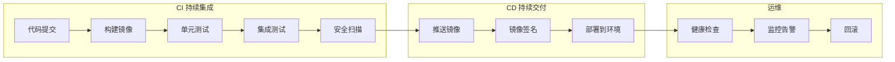
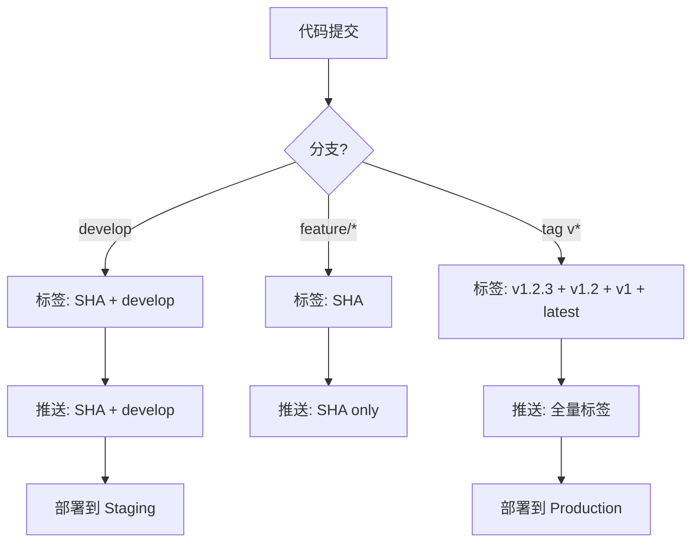
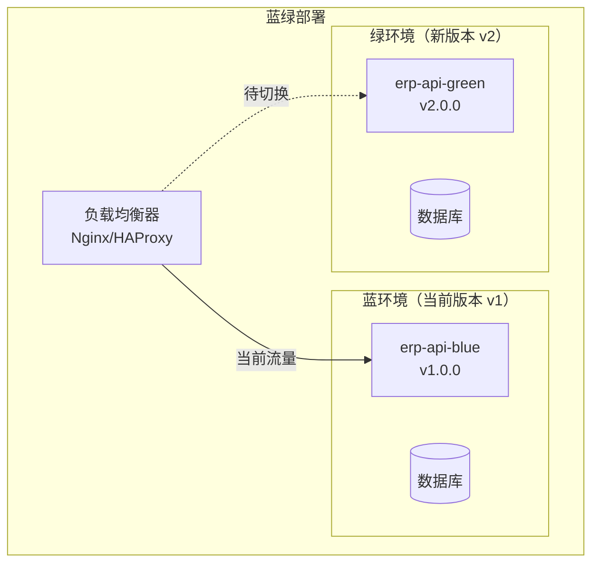
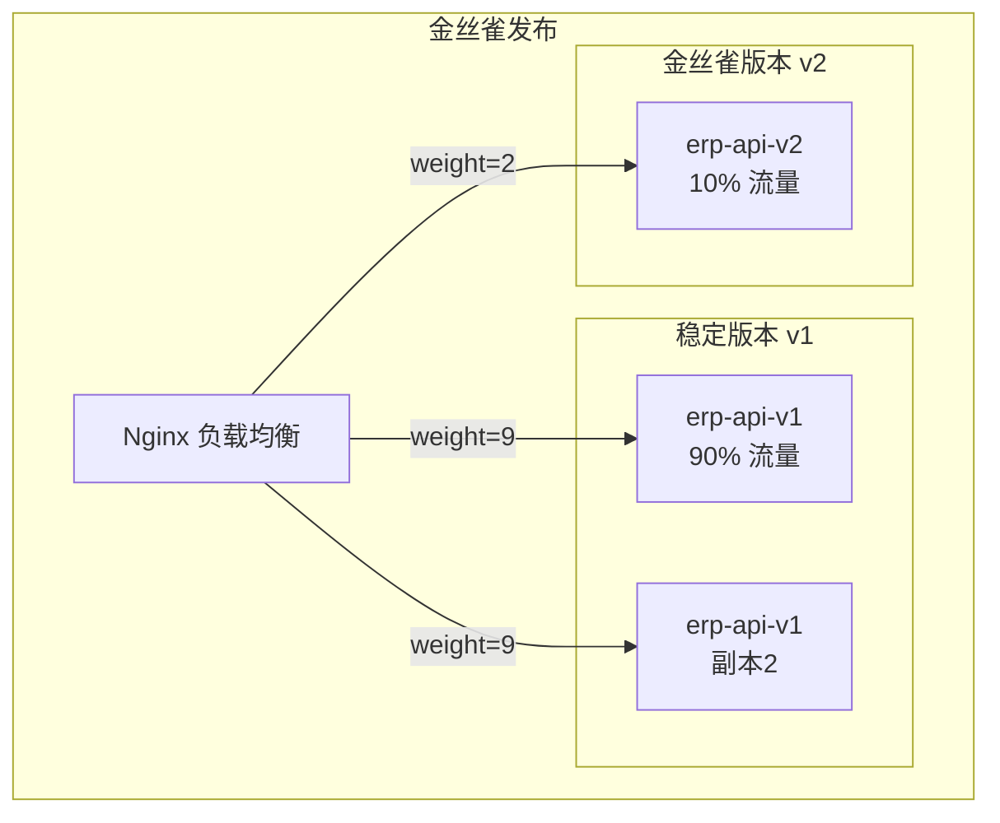
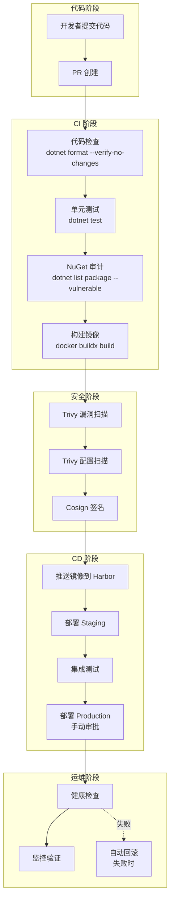

# CI/CD 集成

Docker 是现代 CI/CD 流水线的核心引擎 —— 从代码提交到生产部署，Docker 贯穿构建、测试、扫描、推送、部署全流程。本文系统讲解 Docker 在 CI/CD 中的角色、主流 CI 平台集成、镜像标签策略、多架构构建、缓存优化、蓝绿部署与金丝雀发布等生产关键实践。

---

## 一、Docker 在 CI/CD 中的角色

### 1.1 Docker 在各阶段的作用



| 阶段 | Docker 作用 | 具体操作 |
|------|-------------|----------|
| 构建 | 可重复构建环境 | `docker build` — 统一构建环境 |
| 测试 | 隔离测试环境 | `docker run` — 一次性测试容器 |
| 扫描 | 安全基线检查 | `trivy image` — 漏洞扫描 |
| 推送 | 制品管理 | `docker push` — 镜像入库 |
| 签名 | 信任链建立 | `cosign sign` — 镜像签名 |
| 部署 | 一致性交付 | `docker pull + run` — 不可变部署 |
| 回滚 | 快速恢复 | 切换镜像标签 — 秒级回滚 |

### 1.2 Docker CI/CD 核心优势

- **环境一致性**：构建环境和运行环境完全一致，消除"我本地能跑"问题
- **不可变交付物**：镜像一旦构建，不再修改，确保部署一致性
- **快速回滚**：只需切换镜像标签即可回滚到任意版本
- **隔离性**：CI 任务在容器中执行，互不干扰
- **可重复性**：同一 Dockerfile 构建相同代码，产出相同的镜像

---

## 二、GitHub Actions + Docker

### 2.1 完整 Workflow

```yaml
# .github/workflows/docker-ci.yml
name: Docker CI/CD Pipeline

on:
  push:
    branches: [main, develop]
    tags: ["v*"]
  pull_request:
    branches: [main]

env:
  REGISTRY: harbor.example.com
  PROJECT: erp-system
  IMAGE_NAME: erp-api

jobs:
  # ===== 测试阶段 =====
  test:
    runs-on: ubuntu-latest
    steps:
      - uses: actions/checkout@v4

      - name: Setup .NET
        uses: actions/setup-dotnet@v4
        with:
          dotnet-version: "8.0.x"

      - name: Restore dependencies
        run: dotnet restore

      - name: Build
        run: dotnet build --configuration Release --no-restore

      - name: Unit Tests
        run: |
          dotnet test \
            --configuration Release \
            --no-build \
            --logger "trx;LogFileName=test-results.trx" \
            --collect:"XPlat Code Coverage" \
            --results-directory ./test-results

      - name: NuGet Audit
        run: dotnet list package --vulnerable --include-transitive || true

      - name: Upload Test Results
        if: always()
        uses: actions/upload-artifact@v4
        with:
          name: test-results
          path: ./test-results

  # ===== 构建与推送 =====
  build:
    needs: test
    runs-on: ubuntu-latest
    permissions:
      contents: read
      packages: write
      id-token: write

    outputs:
      image_tag: ${{ steps.meta.outputs.tags }}
      image_digest: ${{ steps.build.outputs.digest }}

    steps:
      - uses: actions/checkout@v4

      - name: Docker Meta
        id: meta
        uses: docker/metadata-action@v5
        with:
          images: ${{ env.REGISTRY }}/${{ env.PROJECT }}/${{ env.IMAGE_NAME }}
          tags: |
            # 分支名
            type=ref,event=branch
            # PR 编号
            type=ref,event=pr
            # 语义版本
            type=semver,pattern={{version}}
            type=semver,pattern={{major}}.{{minor}}
            type=semver,pattern={{major}}
            # Git SHA
            type=sha,prefix=
            # 最新标签
            type=raw,value=latest,enable={{is_default_branch}}

      - name: Set up QEMU
        uses: docker/setup-qemu-action@v3

      - name: Set up Docker Buildx
        uses: docker/setup-buildx-action@v3

      - name: Login to Harbor
        uses: docker/login-action@v3
        with:
          registry: ${{ env.REGISTRY }}
          username: ${{ secrets.HARBOR_USERNAME }}
          password: ${{ secrets.HARBOR_PASSWORD }}

      - name: Build and Push
        id: build
        uses: docker/build-push-action@v5
        with:
          context: .
          file: src/ERP.Api/Dockerfile
          push: true
          tags: ${{ steps.meta.outputs.tags }}
          labels: ${{ steps.meta.outputs.labels }}
          platforms: linux/amd64,linux/arm64
          cache-from: type=gha
          cache-to: type=gha,mode=max
          build-args: |
            BUILD_VERSION=${{ github.ref_name }}
            GIT_SHA=${{ github.sha }}
            BUILD_DATE=${{ github.event.head_commit.timestamp }}

  # ===== 安全扫描 =====
  scan:
    needs: build
    runs-on: ubuntu-latest
    steps:
      - name: Trivy Vulnerability Scan
        uses: aquasecurity/trivy-action@master
        with:
          image-ref: ${{ env.REGISTRY }}/${{ env.PROJECT }}/${{ env.IMAGE_NAME }}:${{ needs.build.outputs.image_digest }}
          severity: "HIGH,CRITICAL"
          exit-code: "1"
          format: "sarif"
          output: "trivy-results.sarif"

      - name: Upload Trivy Results
        if: always()
        uses: github/codeql-action/upload-sarif@v3
        with:
          sarif_file: trivy-results.sarif

      - name: Trivy Config Scan
        uses: aquasecurity/trivy-action@master
        with:
          scan-type: "config"
          scan-ref: "."
          severity: "HIGH,CRITICAL"
          exit-code: "1"

  # ===== 镜像签名 =====
  sign:
    needs: [build, scan]
    runs-on: ubuntu-latest
    steps:
      - name: Install Cosign
        uses: sigstore/cosign-installer@v3

      - name: Login to Harbor
        uses: docker/login-action@v3
        with:
          registry: ${{ env.REGISTRY }}
          username: ${{ secrets.HARBOR_USERNAME }}
          password: ${{ secrets.HARBOR_PASSWORD }}

      - name: Sign Image
        run: |
          cosign sign --yes \
            ${{ env.REGISTRY }}/${{ env.PROJECT }}/${{ env.IMAGE_NAME }}@${{ needs.build.outputs.image_digest }}

      - name: Verify Signature
        run: |
          cosign verify \
            ${{ env.REGISTRY }}/${{ env.PROJECT }}/${{ env.IMAGE_NAME }}@${{ needs.build.outputs.image_digest }}

  # ===== 部署 =====
  deploy-staging:
    needs: sign
    runs-on: ubuntu-latest
    if: github.ref == 'refs/heads/develop'
    environment:
      name: staging
      url: https://staging.example.com
    steps:
      - name: Deploy to Staging
        run: |
          ssh deploy@staging.example.com << 'EOF'
            docker pull ${{ env.REGISTRY }}/${{ env.PROJECT }}/${{ env.IMAGE_NAME }}:${{ needs.build.outputs.image_digest }}
            docker compose -f /opt/apps/erp/docker-compose.yml up -d
          EOF

  deploy-production:
    needs: sign
    runs-on: ubuntu-latest
    if: startsWith(github.ref, 'refs/tags/v')
    environment:
      name: production
      url: https://erp.example.com
    steps:
      - name: Deploy to Production
        run: |
          ssh deploy@prod.example.com << 'EOF'
            docker pull ${{ env.REGISTRY }}/${{ env.PROJECT }}/${{ env.IMAGE_NAME }}:${{ needs.build.outputs.image_digest }}
            docker compose -f /opt/apps/erp/docker-compose.prod.yml up -d --no-deps erp-api
          EOF

      - name: Health Check
        run: |
          for i in $(seq 1 30); do
            if curl -sf https://erp.example.com/health | grep -q "Healthy"; then
              echo "Deployment successful"
              exit 0
            fi
            echo "Waiting for healthy response... ($i/30)"
            sleep 10
          done
          echo "Health check failed"
          exit 1
```

### 2.2 GitHub Actions Secrets 配置

```bash
# 通过 GitHub CLI 配置 Secrets
gh secret set HARBOR_USERNAME --body "robot$erp-system+ci-pusher"
gh secret set HARBOR_PASSWORD --body "eyJhbGciOi..."
gh secret set DEPLOY_KEY --body "$(cat ~/.ssh/deploy_key)"

# 查看已配置的 Secrets
gh secret list
```

---

## 三、GitLab CI + Docker

### 3.1 完整 .gitlab-ci.yml

```yaml
# .gitlab-ci.yml
stages:
  - test
  - build
  - scan
  - push
  - deploy

variables:
  REGISTRY: harbor.example.com
  PROJECT: erp-system
  IMAGE_NAME: erp-api
  DOCKER_BUILDKIT: "1"
  TRIVY_SEVERITY: "HIGH,CRITICAL"
  # 使用 GitLab 内置 Docker-in-Docker
  DOCKER_HOST: tcp://docker:2376
  DOCKER_TLS_CERTDIR: "/certs"
  DOCKER_TLS_VERIFY: 1
  DOCKER_CERT_PATH: "$DOCKER_TLS_CERTDIR/client"

# 默认配置
default:
  image: docker:24
  services:
    - docker:24-dind
  before_script:
    - echo "$HARBOR_PASSWORD" | docker login "$REGISTRY" -u "$HARBOR_USERNAME" --password-stdin

# ===== 测试阶段 =====
dotnet-test:
  stage: test
  image: mcr.microsoft.com/dotnet/sdk:8.0
  services: []
  before_script: []
  script:
    - dotnet restore
    - dotnet build --configuration Release --no-restore
    - dotnet test --configuration Release --no-build
        --logger "junit;LogFilePath=test-results.xml"
        --collect:"XPlat Code Coverage"
    - dotnet list package --vulnerable --include-transitive || true
  artifacts:
    when: always
    reports:
      junit: "**/test-results.xml"
      coverage_report:
        coverage_format: cobertura
        path: "**/coverage.cobertura.xml"
  coverage: '/\s*Line coverage:\s*(\d+\.\d+)%/'

# ===== 构建阶段 =====
build-image:
  stage: build
  script:
    - docker buildx create --use --name builder
    - docker buildx inspect --bootstrap builder
    - |
      docker buildx build \
        --platform linux/amd64,linux/arm64 \
        --tag "$REGISTRY/$PROJECT/$IMAGE_NAME:$CI_COMMIT_SHORT_SHA" \
        --tag "$REGISTRY/$PROJECT/$IMAGE_NAME:buildcache" \
        --cache-from type=registry,ref="$REGISTRY/$PROJECT/$IMAGE_NAME:buildcache" \
        --cache-to type=registry,ref="$REGISTRY/$PROJECT/$IMAGE_NAME:buildcache",mode=max \
        --build-arg BUILD_VERSION=$CI_COMMIT_TAG \
        --build-arg GIT_SHA=$CI_COMMIT_SHA \
        --push \
        -f src/ERP.Api/Dockerfile \
        .
  rules:
    - if: $CI_COMMIT_BRANCH == "main"
    - if: $CI_COMMIT_TAG

# ===== 扫描阶段 =====
trivy-scan:
  stage: scan
  image: aquasec/trivy:latest
  services: []
  before_script: []
  script:
    - trivy image --severity $TRIVY_SEVERITY --exit-code 1 --format json
        --output trivy-report.json
        "$REGISTRY/$PROJECT/$IMAGE_NAME:$CI_COMMIT_SHORT_SHA"
  artifacts:
    when: always
    paths:
      - trivy-report.json
  allow_failure: false

trivy-config-scan:
  stage: scan
  image: aquasec/trivy:latest
  services: []
  before_script: []
  script:
    - trivy config --severity $TRIVY_SEVERITY --exit-code 1 .

# ===== 签名阶段 =====
cosign-sign:
  stage: push
  image: alpine:latest
  services: []
  before_script:
    - apk add --no-cache cosign docker
    - echo "$HARBOR_PASSWORD" | docker login "$REGISTRY" -u "$HARBOR_USERNAME" --password-stdin
  script:
    - cosign sign --yes "$REGISTRY/$PROJECT/$IMAGE_NAME:$CI_COMMIT_SHORT_SHA"
  rules:
    - if: $CI_COMMIT_BRANCH == "main"
    - if: $CI_COMMIT_TAG

# ===== 部署阶段 =====
deploy-staging:
  stage: deploy
  image: alpine:latest
  services: []
  before_script:
    - apk add --no-cache openssh-client
  script:
    - |
      ssh -o StrictHostKeyChecking=no deploy@staging.example.com << EOF
        docker pull $REGISTRY/$PROJECT/$IMAGE_NAME:$CI_COMMIT_SHORT_SHA
        cd /opt/apps/erp
        export IMAGE_TAG=$CI_COMMIT_SHORT_SHA
        docker compose up -d --no-deps erp-api
      EOF
  environment:
    name: staging
    url: https://staging.example.com
  rules:
    - if: $CI_COMMIT_BRANCH == "main"

deploy-production:
  stage: deploy
  image: alpine:latest
  services: []
  before_script:
    - apk add --no-cache openssh-client
  script:
    - |
      ssh -o StrictHostKeyChecking=no deploy@prod.example.com << EOF
        docker pull $REGISTRY/$PROJECT/$IMAGE_NAME:$CI_COMMIT_SHORT_SHA
        cd /opt/apps/erp
        export IMAGE_TAG=$CI_COMMIT_SHORT_SHA
        docker compose -f docker-compose.prod.yml up -d --no-deps erp-api
      EOF
  environment:
    name: production
    url: https://erp.example.com
  when: manual
  rules:
    - if: $CI_COMMIT_TAG

rollback:
  stage: deploy
  image: alpine:latest
  services: []
  before_script:
    - apk add --no-cache openssh-client
  script:
    - |
      ssh -o StrictHostKeyChecking=no deploy@prod.example.com << EOF
        cd /opt/apps/erp
        export IMAGE_TAG=$PREVIOUS_TAG
        docker compose -f docker-compose.prod.yml up -d --no-deps erp-api
      EOF
  when: manual
  variables:
    PREVIOUS_TAG: ""
```

### 3.2 GitLab CI 变量配置

```bash
# 在 GitLab 项目 → Settings → CI/CD → Variables 中配置
HARBOR_USERNAME=robot$erp-system+ci-pusher
HARBOR_PASSWORD=eyJhbGciOi...
DEPLOY_SSH_KEY=<private-key-content>

# 变量保护
# - 勾选 "Protect variable"：仅在受保护分支/标签上可用
# - 勾选 "Mask variable"：在日志中隐藏变量值
# - 勾选 "Expand variable reference"：允许引用其他变量
```

---

## 四、镜像标签策略

### 4.1 标签策略对比

| 策略 | 标签格式 | 优点 | 缺点 | 适用场景 |
|------|----------|------|------|----------|
| Git SHA | `abc1234` | 精确追踪 | 不直观 | 所有环境 |
| 语义版本 | `v1.2.3` | 人类可读 | 需手动打标签 | 生产发布 |
| 分支名 | `main`, `develop` | 简单 | 可变 | 开发/测试 |
| 构建号 | `build-123` | 递增 | 环境相关 | CI 内部 |
| Latest | `latest` | 方便 | 不可控 | 不推荐生产 |

### 4.2 推荐标签策略



```yaml
# GitHub Actions — 镜像标签生成
- name: Docker Meta
  id: meta
  uses: docker/metadata-action@v5
  with:
    images: ${{ env.REGISTRY }}/${{ env.PROJECT }}/${{ env.IMAGE_NAME }}
    flavor: |
      latest=auto
    tags: |
      # Git SHA（始终生成）
      type=sha,prefix=
      # 语义版本（仅 tag 触发）
      type=semver,pattern={{version}}
      type=semver,pattern={{major}}.{{minor}}
      type=semver,pattern={{major}}
      # 分支名
      type=ref,event=branch
      # PR 编号
      type=ref,event=pr
      # 自定义标签
      type=raw,value=stable,enable=${{ github.ref == 'refs/heads/main' }}
```

::: important 永远不要在生产使用 latest 标签
`latest` 是可变标签 —— 今天指向 v1.2.0，明天可能指向 v2.0.0。生产环境必须使用不可变标签（Git SHA 或语义版本），确保每次部署的镜像内容完全一致。
:::

### 4.3 不可变标签实践

```bash
# 使用 digest 而非 tag（最精确）
docker pull harbor.example.com/erp-system/erp-api@sha256:abc123...

# 在部署配置中锁定 digest
# docker-compose.prod.yml
services:
  erp-api:
    image: harbor.example.com/erp-system/erp-api@sha256:abc123...
    # 而非
    # image: harbor.example.com/erp-system/erp-api:v1.2.0
```

---

## 五、多架构构建

### 5.1 Buildx + QEMU 方案

```bash
# 安装 QEMU 模拟器
docker run --privileged --rm tonistiigi/binfmt --install all

# 创建 buildx 构建器
docker buildx create \
  --name multiarch-builder \
  --driver docker-container \
  --driver-opt image=moby/buildkit:latest \
  --platform linux/amd64,linux/arm64 \
  --use

docker buildx inspect --bootstrap multiarch-builder
```

### 5.2 CI 中构建多架构镜像

```yaml
# GitHub Actions — 多架构构建
- name: Set up QEMU
  uses: docker/setup-qemu-action@v3
  with:
    platforms: linux/amd64,linux/arm64

- name: Set up Docker Buildx
  uses: docker/setup-buildx-action@v3
  with:
    platforms: linux/amd64,linux/arm64

- name: Build and Push Multi-arch
  uses: docker/build-push-action@v5
  with:
    context: .
    platforms: linux/amd64,linux/arm64
    push: true
    tags: ${{ steps.meta.outputs.tags }}
    cache-from: type=gha
    cache-to: type=gha,mode=max
```

### 5.3 .NET 多架构 Dockerfile

```dockerfile
# Dockerfile — .NET 多架构
# ---- Build Stage ----
FROM --platform=$BUILDPLATFORM mcr.microsoft.com/dotnet/sdk:8.0 AS build
ARG TARGETARCH
WORKDIR /src

# 先复制项目文件，利用 Docker 缓存
COPY ["Directory.Build.props", "."]
COPY ["src/ERP.Api/ERP.Api.csproj", "src/ERP.Api/"]
COPY ["src/ERP.Core/ERP.Core.csproj", "src/ERP.Core/"]
COPY ["src/ERP.Infrastructure/ERP.Infrastructure.csproj", "src/ERP.Infrastructure/"]
RUN dotnet restore "src/ERP.Api/ERP.Api.csproj" -a $TARGETARCH

# 复制源码并构建
COPY . .
RUN dotnet publish "src/ERP.Api/ERP.Api.csproj" \
  -a $TARGETARCH \
  -c Release \
  -o /app/publish \
  --no-restore \
  -p:Version=${BUILD_VERSION:-1.0.0}

# ---- Runtime Stage ----
FROM mcr.microsoft.com/dotnet/aspnet:8.0-jammy-chiseled AS runtime
WORKDIR /app

# 安全：非 root 用户
USER $APP_UID

COPY --from=build /app/publish .

ENV ASPNETCORE_URLS=http://+:8080
EXPOSE 8080

HEALTHCHECK --interval=30s --timeout=5s --retries=3 \
  CMD curl -f http://localhost:8080/health || exit 1

ENTRYPOINT ["dotnet", "ERP.Api.dll"]
```

::: tip 多架构构建优化
1. Build Stage 使用 `--platform=$BUILDPLATFORM`（原生架构运行 SDK，避免 QEMU 模拟，构建速度快 3~5 倍）
2. 通过 `-a $TARGETARCH` 让 .NET 编译目标架构的二进制
3. Runtime Stage 不指定 `--platform`，自动选择对应架构的基础镜像
4. 测试在单一架构上执行，多架构只做最终构建和推送
:::

---

## 六、镜像构建缓存

### 6.1 缓存策略对比

| 缓存方式 | 存储位置 | 速度 | 适用场景 |
|----------|----------|------|----------|
| Docker 内联缓存 | 镜像层 | 中 | 简单项目 |
| Registry 缓存 | 镜像仓库 | 中 | 多节点构建 |
| GitHub Actions Cache | GHA 缓存 | 快 | GitHub CI |
| BuildKit Cache Mount | 本地 | 最快 | 本地开发 |
| S3 缓存 | S3 存储 | 中 | 自建 CI |

### 6.2 BuildKit Cache Mount

```dockerfile
# Dockerfile — BuildKit Cache Mount
# syntax=docker/dockerfile:1

FROM mcr.microsoft.com/dotnet/sdk:8.0 AS build
WORKDIR /src

# NuGet 包缓存挂载
COPY ["src/ERP.Api/ERP.Api.csproj", "src/ERP.Api/"]
RUN --mount=type=cache,target=/root/.nuget/packages \
    dotnet restore "src/ERP.Api/ERP.Api.csproj"

COPY . .
# 构建时也挂载 NuGet 缓存
RUN --mount=type=cache,target=/root/.nuget/packages \
    dotnet publish "src/ERP.Api/ERP.Api.csproj" \
    -c Release -o /app/publish --no-restore

# npm 缓存挂载示例
FROM node:20 AS frontend-build
WORKDIR /app
COPY package*.json ./
RUN --mount=type=cache,target=/root/.npm \
    npm ci
COPY . .
RUN --mount=type=cache,target=/root/.npm \
    npm run build
```

```bash
# 启用 BuildKit 构建
DOCKER_BUILDKIT=1 docker build -t myapp:v1.0 .

# 或在 daemon.json 中永久启用
# /etc/docker/daemon.json
{
  "features": {
    "buildkit": true
  }
}
```

### 6.3 Registry 缓存

```yaml
# GitHub Actions — Registry 缓存
- name: Build and Push
  uses: docker/build-push-action@v5
  with:
    context: .
    push: true
    tags: ${{ steps.meta.outputs.tags }}
    cache-from: type=registry,ref=${{ env.REGISTRY }}/${{ env.PROJECT }}/${{ env.IMAGE_NAME }}:buildcache
    cache-to: type=registry,ref=${{ env.REGISTRY }}/${{ env.PROJECT }}/${{ env.IMAGE_NAME }}:buildcache,mode=max
```

### 6.4 GitHub Actions Cache

```yaml
# GitHub Actions — GHA 缓存（推荐）
- name: Build and Push
  uses: docker/build-push-action@v5
  with:
    context: .
    push: true
    tags: ${{ steps.meta.outputs.tags }}
    cache-from: type=gha
    cache-to: type=gha,mode=max
```

### 6.5 缓存效果对比

```
# 无缓存 — 全量构建
# [+] Building 245.3s (18/18) FINISHED

# 有缓存 — 增量构建（仅重新构建变化的层）
# [+] Building 32.7s (12/18) FINISHED
# CACHED [1/5] FROM mcr.microsoft.com/dotnet/sdk:8.0
# CACHED [2/5] WORKDIR /src
# CACHED [3/5] COPY *.csproj ./
# CACHED [4/5] RUN dotnet restore
#        [5/5] COPY . .                      ← 仅此层重新构建
#        [6/5] RUN dotnet publish
```

::: tip 缓存最佳实践
1. 将不常变化的指令放在前面（基础镜像、restore），常变化的放在后面（COPY 源码）
2. 使用 `.dockerignore` 排除不需要的文件，避免缓存失效
3. `mode=max` 缓存所有中间层，不仅缓存最终层
4. 定期清理 Registry 缓存标签，避免占用过多存储
:::

---

## 七、蓝绿部署与金丝雀发布

### 7.1 蓝绿部署



```yaml
# docker-compose.blue-green.yml
version: "3.8"

services:
  # 蓝环境 — 当前运行版本
  erp-api-blue:
    image: harbor.example.com/erp-system/erp-api:v1.0.0
    container_name: erp-api-blue
    environment:
      - ASPNETCORE_ENVIRONMENT=Production
      - ASPNETCORE_URLS=http://+:8080
    ports:
      - "8081:8080"
    healthcheck:
      test: ["CMD", "curl", "-f", "http://localhost:8080/health"]
      interval: 10s
      timeout: 3s
      retries: 3
    restart: unless-stopped

  # 绿环境 — 新版本
  erp-api-green:
    image: harbor.example.com/erp-system/erp-api:v2.0.0
    container_name: erp-api-green
    environment:
      - ASPNETCORE_ENVIRONMENT=Production
      - ASPNETCORE_URLS=http://+:8080
    ports:
      - "8082:8080"
    healthcheck:
      test: ["CMD", "curl", "-f", "http://localhost:8080/health"]
      interval: 10s
      timeout: 3s
      retries: 3
    restart: unless-stopped

  # Nginx 负载均衡
  nginx:
    image: nginx:alpine
    container_name: nginx-blue-green
    ports:
      - "80:80"
    volumes:
      - ./nginx-blue-green.conf:/etc/nginx/conf.d/default.conf:ro
    restart: always
```

```nginx
# nginx-blue-green.conf
# 切换 upstream 即可实现蓝绿切换

# 当前指向蓝环境
upstream erp_api {
    server erp-api-blue:8080;
    # server erp-api-green:8080;  # 切换到绿环境时取消注释
}

server {
    listen 80;
    server_name erp.example.com;

    location / {
        proxy_pass http://erp_api;
        proxy_set_header Host $host;
        proxy_set_header X-Real-IP $remote_addr;
        proxy_set_header X-Forwarded-For $proxy_add_x_forwarded_for;
        proxy_set_header X-Forwarded-Proto $scheme;
    }
}
```

```bash
#!/bin/bash
# blue-green-deploy.sh — 蓝绿部署切换脚本
set -e

CURRENT="blue"   # 当前活跃环境
TARGET="green"   # 目标环境
NEW_VERSION="v2.0.0"

echo "=== 蓝绿部署: ${TARGET} 环境部署 ${NEW_VERSION} ==="

# 1. 拉取新版本镜像
echo ">>> 拉取新版本镜像..."
docker pull harbor.example.com/erp-system/erp-api:${NEW_VERSION}

# 2. 启动目标环境
echo ">>> 启动 ${TARGET} 环境..."
docker compose up -d erp-api-${TARGET}

# 3. 等待健康检查通过
echo ">>> 等待健康检查..."
for i in $(seq 1 30); do
  health=$(docker inspect --format='{{.State.Health.Status}}' erp-api-${TARGET} 2>/dev/null || echo "starting")
  if [ "$health" = "healthy" ]; then
    echo "✅ ${TARGET} 环境健康"
    break
  fi
  if [ "$i" = "30" ]; then
    echo "❌ ${TARGET} 环境健康检查超时"
    docker compose stop erp-api-${TARGET}
    exit 1
  fi
  sleep 5
done

# 4. 切换流量
echo ">>> 切换流量到 ${TARGET} 环境..."
# 更新 Nginx 配置
if [ "$TARGET" = "green" ]; then
  sed -i 's/server erp-api-blue:8080;/# server erp-api-blue:8080;/' nginx-blue-green.conf
  sed -i 's/# server erp-api-green:8080;/server erp-api-green:8080;/' nginx-blue-green.conf
else
  sed -i 's/# server erp-api-blue:8080;/server erp-api-blue:8080;/' nginx-blue-green.conf
  sed -i 's/server erp-api-green:8080;/# server erp-api-green:8080;/' nginx-blue-green.conf
fi

# 重载 Nginx
docker compose exec nginx nginx -s reload

echo "✅ 流量已切换到 ${TARGET} 环境"

# 5. 验证
echo ">>> 验证部署..."
sleep 5
if curl -sf http://localhost/health | grep -q "Healthy"; then
  echo "✅ 部署成功！"
else
  echo "❌ 部署验证失败，回滚..."
  # 回滚
  if [ "$TARGET" = "green" ]; then
    sed -i 's/server erp-api-green:8080;/# server erp-api-green:8080;/' nginx-blue-green.conf
    sed -i 's/# server erp-api-blue:8080;/server erp-api-blue:8080;/' nginx-blue-green.conf
  fi
  docker compose exec nginx nginx -s reload
  echo "✅ 已回滚到 ${CURRENT} 环境"
  exit 1
fi

# 6. 停止旧环境（观察期后执行）
echo ">>> 旧环境 ${CURRENT} 保留运行，稍后手动停止"
echo "运行以下命令停止旧环境："
echo "  docker compose stop erp-api-${CURRENT}"
```

### 7.2 金丝雀发布



```nginx
# nginx-canary.conf
upstream erp_api {
    # 稳定版本 — 90% 流量（9+9=18 份）
    server erp-api-v1:8080 weight=9;
    server erp-api-v1-replica:8080 weight=9;

    # 金丝雀版本 — 10% 流量（2 份）
    server erp-api-v2:8080 weight=2;
}

server {
    listen 80;
    server_name erp.example.com;

    location / {
        proxy_pass http://erp_api;
        proxy_set_header Host $host;
        proxy_set_header X-Real-IP $remote_addr;
        proxy_set_header X-Forwarded-For $proxy_add_x_forwarded_for;
    }
}
```

```bash
#!/bin/bash
# canary-deploy.sh — 金丝雀发布脚本
set -e

CANARY_WEIGHT=10  # 初始金丝雀流量百分比
MAX_WEIGHT=100    # 最终目标
STEP=20           # 每步增加的流量百分比
STABLE_VERSION="v1.0.0"
CANARY_VERSION="v2.0.0"

echo "=== 金丝雀发布: ${CANARY_VERSION} ==="

# 1. 拉取金丝雀镜像
docker pull harbor.example.com/erp-system/erp-api:${CANARY_VERSION}

# 2. 启动金丝雀容器
docker run -d \
  --name erp-api-canary \
  --network erp-network \
  harbor.example.com/erp-system/erp-api:${CANARY_VERSION}

# 3. 逐步增加金丝雀流量
current_weight=${CANARY_WEIGHT}
while [ "$current_weight" -le "$MAX_WEIGHT" ]; do
  stable_weight=$((100 - current_weight))

  echo ">>> 金丝雀流量: ${current_weight}% / 稳定流量: ${stable_weight}%"

  # 更新 Nginx weight 配置
  # ... (动态更新 upstream 配置)
  docker compose exec nginx nginx -s reload

  # 观察期
  echo ">>> 观察期 5 分钟..."
  sleep 300

  # 检查金丝雀版本错误率
  error_rate=$(curl -s http://localhost:8080/metrics | \
    grep 'http_requests_failed_total{version="v2"}' | \
    awk '{print $2}')

  if [ "$error_rate" -gt 5 ]; then
    echo "❌ 金丝雀错误率过高 (${error_rate}%)，回滚！"
    # 回滚：移除金丝雀容器，恢复 100% 稳定流量
    docker stop erp-api-canary
    docker rm erp-api-canary
    # 恢复 Nginx 配置
    docker compose exec nginx nginx -s reload
    exit 1
  fi

  if [ "$current_weight" -eq "$MAX_WEIGHT" ]; then
    echo "✅ 金丝雀发布完成！"
    break
  fi

  # 增加流量
  current_weight=$((current_weight + STEP))
  if [ "$current_weight" -gt "$MAX_WEIGHT" ]; then
    current_weight=$MAX_WEIGHT
  fi
done

# 4. 清理旧版本
docker stop erp-api-stable
docker rm erp-api-stable
```

---

## 八、滚动更新策略

### 8.1 Docker Compose 滚动更新

```yaml
# docker-compose.yml — 滚动更新配置
version: "3.8"

services:
  erp-api:
    image: harbor.example.com/erp-system/erp-api:${IMAGE_TAG:-latest}
    deploy:
      replicas: 4
      update_config:
        parallelism: 1         # 每次更新1个副本
        delay: 30s             # 每次更新间隔30秒
        failure_action: rollback  # 失败时回滚
        monitor: 60s           # 更新后观察60秒
        order: start-first     # 先启动新容器再停旧容器
      rollback_config:
        parallelism: 0         # 回滚时同时更新所有副本
        order: stop-first      # 先停旧容器再启动新容器
      restart_policy:
        condition: on-failure
        delay: 5s
        max_attempts: 3
    healthcheck:
      test: ["CMD", "curl", "-f", "http://localhost:8080/health"]
      interval: 10s
      timeout: 3s
      retries: 3
      start_period: 15s
```

```bash
# 滚动更新
docker compose up -d --no-deps --build erp-api

# 指定并行度
docker compose up -d --no-deps erp-api --scale erp-api=4

# Docker Swarm 滚动更新
docker service update \
  --image harbor.example.com/erp-system/erp-api:v2.0.0 \
  --update-parallelism 1 \
  --update-delay 30s \
  --update-failure-action rollback \
  --update-monitor 60s \
  erp_api
```

### 8.2 滚动更新流程

```mermaid
sequenceDiagram
    participant Ops as 运维
    participant Docker as Docker
    participant V1 as v1 副本们
    participant V2 as v2 副本们
    participant HC as 健康检查

    Ops->>Docker: docker compose up -d (新版本)
    Docker->>V2: 启动 v2 副本1
    V2->>HC: 健康检查...
    HC-->>Docker: Healthy

    Docker->>V1: 停止 v1 副本1
    Note right: 流量已切换到 v2 副本1

    Docker->>V2: 启动 v2 副本2
    V2->>HC: 健康检查...
    HC-->>Docker: Healthy

    Docker->>V1: 停止 v1 副本2
    Note right: 流量已切换到 v2 副本2

    alt 健康检查失败
        V2->>HC: 健康检查...
        HC-->>Docker: Unhealthy
        Docker->>V2: 回滚 v2 副本
        Docker->>V1: 恢复 v1 副本
    end
```

---

## 九、回滚机制

### 9.1 镜像标签回滚

```bash
# 方式1：切换镜像标签
# 当前运行 v2.0.0，回滚到 v1.0.0
docker compose stop erp-api
IMAGE_TAG=v1.0.0 docker compose up -d erp-api

# 方式2：使用 digest 精确回滚
docker run -d \
  --name erp-api \
  harbor.example.com/erp-system/erp-api@sha256:abc123...

# 方式3：Docker Swarm 回滚
docker service rollback erp_api

# 查看回滚历史
docker service inspect erp_api --format='{{.PreviousSpec}}'
```

### 9.2 自动回滚脚本

```bash
#!/bin/bash
# auto-rollback.sh — 基于健康检查的自动回滚
set -e

NEW_VERSION="${1}"
OLD_VERSION=$(docker inspect --format='{{.Config.Image}}' erp-api | awk -F: '{print $NF}')
MAX_RETRIES=10
HEALTH_CHECK_URL="http://localhost:8080/health"

echo "=== 部署新版本: ${NEW_VERSION} ==="
echo "=== 当前版本: ${OLD_VERSION} ==="

# 更新镜像
IMAGE_TAG=${NEW_VERSION} docker compose up -d --no-deps erp-api

# 等待启动
sleep 10

# 健康检查循环
fail_count=0
for i in $(seq 1 $MAX_RETRIES); do
  health_status=$(curl -sf "${HEALTH_CHECK_URL}" | jq -r '.status' 2>/dev/null || echo "Unhealthy")

  if [ "$health_status" = "Healthy" ]; then
    echo "✅ 新版本 ${NEW_VERSION} 健康检查通过"
    exit 0
  fi

  fail_count=$((fail_count + 1))
  echo "⚠️ 健康检查失败 (${fail_count}/${MAX_RETRIES}): ${health_status}"
  sleep 10
done

# 回滚
echo "❌ 健康检查持续失败，自动回滚到 ${OLD_VERSION}..."
IMAGE_TAG=${OLD_VERSION} docker compose up -d --no-deps erp-api
sleep 10

# 验证回滚
rollback_health=$(curl -sf "${HEALTH_CHECK_URL}" | jq -r '.status' 2>/dev/null || echo "Unknown")
if [ "$rollback_health" = "Healthy" ]; then
  echo "✅ 回滚成功，旧版本 ${OLD_VERSION} 恢复正常"
else
  echo "❌ 回滚后健康检查也失败！需要人工介入！"
  exit 1
fi
```

---

## 十、.NET 应用 CI/CD 完整流水线

### 10.1 完整流水线架构



### 10.2 完整 GitHub Actions Workflow

```yaml
# .github/workflows/dotnet-docker-cicd.yml
name: .NET Docker CI/CD

on:
  push:
    branches: [main, develop]
    tags: ["v*"]
  pull_request:
    branches: [main]

env:
  REGISTRY: harbor.example.com
  PROJECT: erp-system
  IMAGE_NAME: erp-api
  DOTNET_VERSION: "8.0.x"

jobs:
  # ===== 代码质量 =====
  lint:
    runs-on: ubuntu-latest
    steps:
      - uses: actions/checkout@v4
      - uses: actions/setup-dotnet@v4
        with:
          dotnet-version: ${{ env.DOTNET_VERSION }}
      - run: dotnet format --verify-no-changes --severity warn

  # ===== 测试 =====
  test:
    runs-on: ubuntu-latest
    steps:
      - uses: actions/checkout@v4
      - uses: actions/setup-dotnet@v4
        with:
          dotnet-version: ${{ env.DOTNET_VERSION }}
      - run: dotnet restore
      - run: dotnet build --configuration Release --no-restore
      - run: |
          dotnet test \
            --configuration Release \
            --no-build \
            --logger "trx;LogFileName=test-results.trx" \
            --collect:"XPlat Code Coverage" \
            --results-directory ./test-results
      - uses: actions/upload-artifact@v4
        if: always()
        with:
          name: test-results
          path: ./test-results

  # ===== 安全审计 =====
  audit:
    runs-on: ubuntu-latest
    steps:
      - uses: actions/checkout@v4
      - uses: actions/setup-dotnet@v4
        with:
          dotnet-version: ${{ env.DOTNET_VERSION }}
      - run: |
          dotnet restore
          dotnet list package --vulnerable --include-transitive
          dotnet list package --deprecated

  # ===== 构建与推送 =====
  build:
    needs: [lint, test, audit]
    runs-on: ubuntu-latest
    permissions:
      contents: read
      packages: write
      id-token: write
    outputs:
      image_digest: ${{ steps.build.outputs.digest }}
      image_tags: ${{ steps.meta.outputs.tags }}
    steps:
      - uses: actions/checkout@v4

      - name: Docker Meta
        id: meta
        uses: docker/metadata-action@v5
        with:
          images: ${{ env.REGISTRY }}/${{ env.PROJECT }}/${{ env.IMAGE_NAME }}
          tags: |
            type=sha,prefix=
            type=semver,pattern={{version}}
            type=semver,pattern={{major}}.{{minor}}
            type=ref,event=branch
            type=raw,value=latest,enable=${{ github.ref == 'refs/heads/main' }}

      - name: Set up QEMU
        uses: docker/setup-qemu-action@v3

      - name: Set up Docker Buildx
        uses: docker/setup-buildx-action@v3

      - name: Login to Harbor
        uses: docker/login-action@v3
        with:
          registry: ${{ env.REGISTRY }}
          username: ${{ secrets.HARBOR_USERNAME }}
          password: ${{ secrets.HARBOR_PASSWORD }}

      - name: Build and Push
        id: build
        uses: docker/build-push-action@v5
        with:
          context: .
          file: src/ERP.Api/Dockerfile
          push: true
          tags: ${{ steps.meta.outputs.tags }}
          labels: ${{ steps.meta.outputs.labels }}
          platforms: linux/amd64,linux/arm64
          cache-from: type=gha
          cache-to: type=gha,mode=max
          build-args: |
            BUILD_VERSION=${{ github.ref_name }}
            GIT_SHA=${{ github.sha }}

  # ===== 安全扫描 =====
  scan:
    needs: build
    runs-on: ubuntu-latest
    steps:
      - name: Trivy Image Scan
        uses: aquasecurity/trivy-action@master
        with:
          image-ref: ${{ env.REGISTRY }}/${{ env.PROJECT }}/${{ env.IMAGE_NAME }}@${{ needs.build.outputs.image_digest }}
          severity: "HIGH,CRITICAL"
          exit-code: "1"
          format: "table"

      - name: Trivy Config Scan
        uses: aquasecurity/trivy-action@master
        with:
          scan-type: "config"
          scan-ref: "."
          severity: "HIGH,CRITICAL"
          exit-code: "1"

  # ===== 镜像签名 =====
  sign:
    needs: [build, scan]
    runs-on: ubuntu-latest
    steps:
      - uses: sigstore/cosign-installer@v3
      - uses: docker/login-action@v3
        with:
          registry: ${{ env.REGISTRY }}
          username: ${{ secrets.HARBOR_USERNAME }}
          password: ${{ secrets.HARBOR_PASSWORD }}
      - run: |
          cosign sign --yes \
            ${{ env.REGISTRY }}/${{ env.PROJECT }}/${{ env.IMAGE_NAME }}@${{ needs.build.outputs.image_digest }}

  # ===== 部署 Staging =====
  deploy-staging:
    needs: sign
    runs-on: ubuntu-latest
    if: github.ref == 'refs/heads/main'
    environment:
      name: staging
      url: https://staging.erp.example.com
    steps:
      - name: Deploy
        run: |
          ssh deploy@staging.example.com << 'DEPLOY_EOF'
            cd /opt/apps/erp
            export IMAGE_TAG=${{ needs.build.outputs.image_digest }}
            docker compose pull erp-api
            docker compose up -d --no-deps --remove-orphans erp-api
          DEPLOY_EOF

      - name: Smoke Test
        run: |
          for i in $(seq 1 20); do
            status=$(curl -sf https://staging.erp.example.com/health | jq -r '.status' 2>/dev/null || echo "unknown")
            if [ "$status" = "Healthy" ]; then
              echo "Staging deployment healthy"
              exit 0
            fi
            sleep 10
          done
          echo "Staging health check failed"
          exit 1

  # ===== 部署 Production =====
  deploy-production:
    needs: sign
    runs-on: ubuntu-latest
    if: startsWith(github.ref, 'refs/tags/v')
    environment:
      name: production
      url: https://erp.example.com
    steps:
      - name: Deploy
        run: |
          ssh deploy@prod.example.com << 'DEPLOY_EOF'
            cd /opt/apps/erp
            export IMAGE_TAG=${{ needs.build.outputs.image_digest }}
            docker compose -f docker-compose.prod.yml pull erp-api
            docker compose -f docker-compose.prod.yml up -d --no-deps --remove-orphans erp-api
          DEPLOY_EOF

      - name: Health Check
        run: |
          for i in $(seq 1 30); do
            status=$(curl -sf https://erp.example.com/health | jq -r '.status' 2>/dev/null || echo "unknown")
            if [ "$status" = "Healthy" ]; then
              echo "Production deployment healthy"
              exit 0
            fi
            sleep 10
          done
          echo "Production health check failed - triggering rollback"
          exit 1

      - name: Rollback on Failure
        if: failure()
        run: |
          ssh deploy@prod.example.com << 'ROLLBACK_EOF'
            cd /opt/apps/erp
            export IMAGE_TAG=$(cat /opt/apps/erp/.previous-version)
            docker compose -f docker-compose.prod.yml up -d --no-deps erp-api
          ROLLBACK_EOF
```

---

## 十一、安全扫描集成

### 11.1 Trivy in CI

```yaml
# GitHub Actions — Trivy 扫描
- name: Trivy Image Scan
  uses: aquasecurity/trivy-action@master
  with:
    image-ref: "${{ env.REGISTRY }}/${{ env.PROJECT }}/${{ env.IMAGE_NAME }}:${{ github.sha }}"
    severity: "HIGH,CRITICAL"
    exit-code: "1"    # 发现高危漏洞时 CI 失败
    format: "table"   # 控制台输出
    # 同时生成 SARIF 上传到 GitHub Security
    # format: "sarif"
    # output: "trivy-results.sarif"

- name: Upload SARIF
  if: always()
  uses: github/codeql-action/upload-sarif@v3
  with:
    sarif_file: trivy-results.sarif
```

### 11.2 Trivy 忽略策略

```yaml
# .trivyignore.yaml — 已知豁免
vulnerabilities:
  - id: CVE-2023-44487
    reason: "HTTP/2 Rapid Reset — 已通过 Nginx 限流缓解"
    until: 2026-12-31

  - id: CVE-2024-XXXXX
    reason: "Alpine 基础镜像漏洞，等待上游更新"
    until: 2026-09-01

misconfigurations:
  - id: AVD-DV-0001
    reason: "开发环境使用，生产已加固"
```

### 11.3 Docker Scout

```yaml
# GitHub Actions — Docker Scout
- name: Docker Scout
  uses: docker/scout-action@v1
  with:
    command: cves
    image: "${{ env.REGISTRY }}/${{ env.PROJECT }}/${{ env.IMAGE_NAME }}:${{ github.sha }}"
    sarif-file: scout-results.sarif
    summary: true
```

### 11.4 安全扫描门禁策略

| 严重级别 | CI 行为 | 说明 |
|----------|---------|------|
| Critical | `exit-code: 1`（阻断） | 必须修复 |
| High | `exit-code: 1`（阻断） | 必须修复或豁免 |
| Medium | 仅报告 | 记录跟踪 |
| Low | 仅报告 | 记录跟踪 |

::: tip 安全扫描实践
1. CI 中仅阻断 Critical 和 High，避免中等漏洞阻断发布节奏
2. 使用 `.trivyignore.yaml` 记录每个豁免的原因和有效期
3. 定期（每周）审查豁免列表，清理过期的豁免
4. 在 Staging 环境运行完整扫描（含 Medium），Production 门控只检查 Critical/High
5. 镜像推送前扫描，推送后 Harbor 再次自动扫描
:::

---

## 十二、实战清单

### 12.1 CI/CD 流水线检查清单

::: tip 流水线建设检查
- [ ] 代码质量检查已集成（lint/format）
- [ ] 单元测试在 Docker 容器中运行
- [ ] 镜像标签策略已制定（SHA + 语义版本）
- [ ] 多架构构建已配置（amd64 + arm64）
- [ ] 构建缓存已启用（GHA/Registry/BuildKit）
- [ ] 安全扫描已集成（Trivy image + config）
- [ ] 镜像签名已配置（Cosign/DCT）
- [ ] 镜像推送到私有仓库（Harbor/ACR）
- [ ] 部署策略已选择（蓝绿/金丝雀/滚动更新）
- [ ] 回滚机制已实现（自动/手动）
- [ ] 健康检查端点已实现
- [ ] 部署后验证已自动化（Smoke Test）
- [ ] 通知已配置（部署成功/失败）
- [ ] Secrets 管理已实施（不硬编码）
- [ ] 流水线超时已设置（避免无限运行）
:::

### 12.2 常见问题排查

| 问题 | 原因 | 解决方案 |
|------|------|----------|
| 构建缓慢 | 无缓存/层重建 | 启用 BuildKit 缓存、优化 Dockerfile 层顺序 |
| 镜像过大 | 基础镜像选择不当 | 使用 chiseled/alpine 基础镜像 |
| 多架构构建失败 | QEMU 模拟器问题 | 检查 binfmt 安装，测试 Dockerfile 在目标架构 |
| 扫描误报 | 忽略策略缺失 | 配置 `.trivyignore.yaml` |
| 部署后不健康 | 健康检查超时 | 增大 `start_period` |
| 回滚失败 | 旧版本镜像已被 GC | 保留最近 N 个版本不清理 |
| 推送失败 | 认证/权限问题 | 检查机器人账号权限和令牌有效期 |

---

## 参考资料

- [GitHub Actions 文档](https://docs.github.com/en/actions)
- [GitLab CI/CD 文档](https://docs.gitlab.com/ee/ci/)
- [Docker Buildx 文档](https://docs.docker.com/build/buildx/)
- [BuildKit 缓存文档](https://docs.docker.com/build/cache/)
- [Trivy CI 集成](https://aquasecurity.github.io/trivy/latest/tutorials/integrations/)
- [Cosign 签名文档](https://docs.sigstore.dev/cosign/signing/signing_with_containers/)
- [Docker metadata-action](https://github.com/docker/metadata-action)
- [Docker build-push-action](https://github.com/docker/build-push-action)
