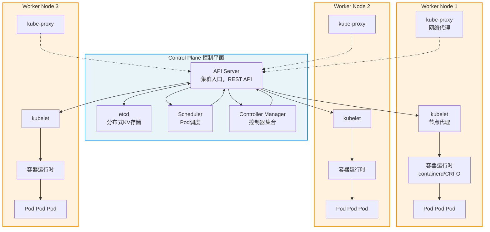
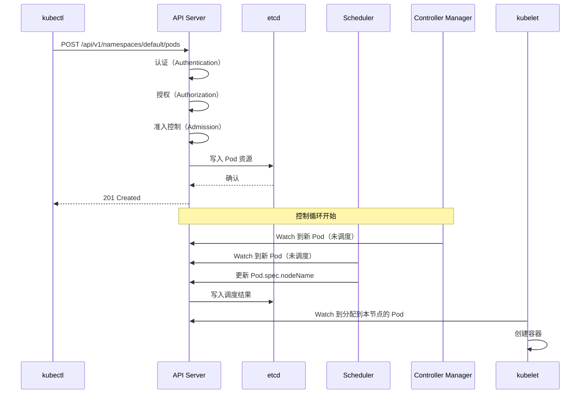
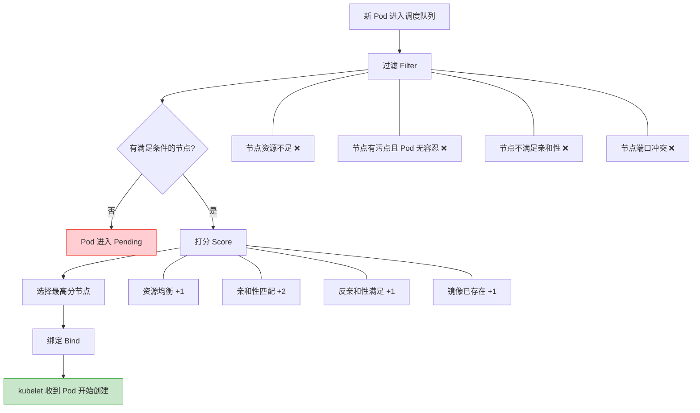
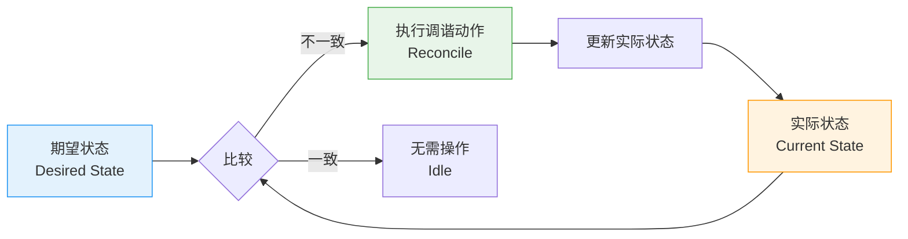
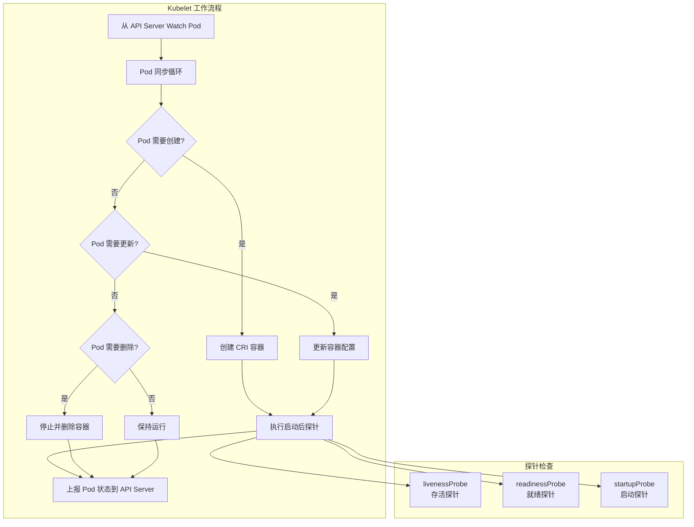
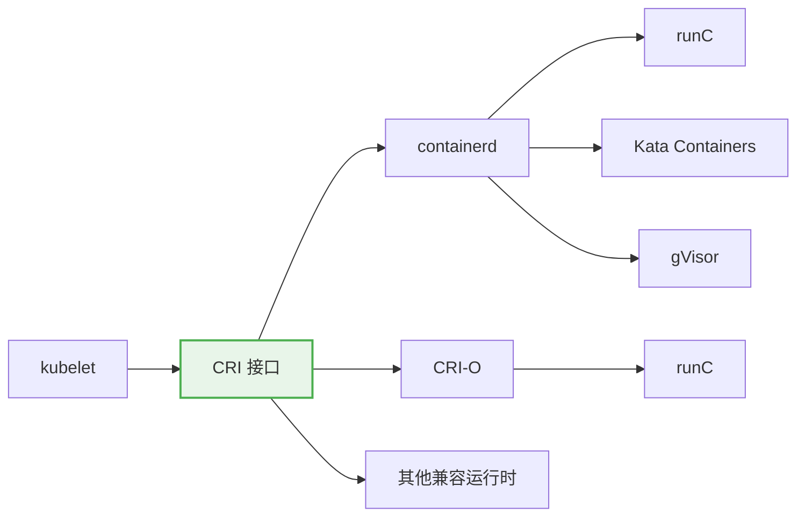
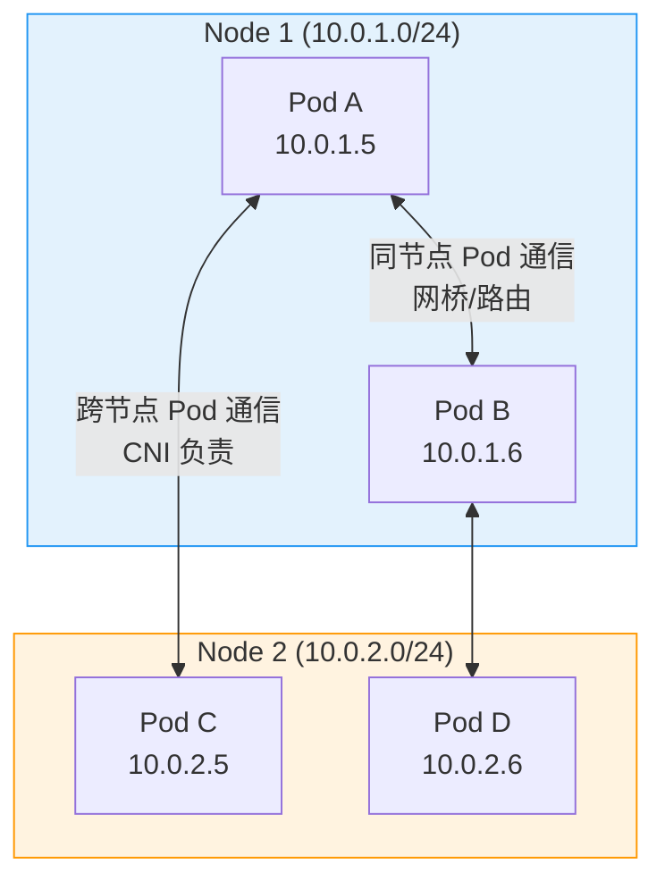
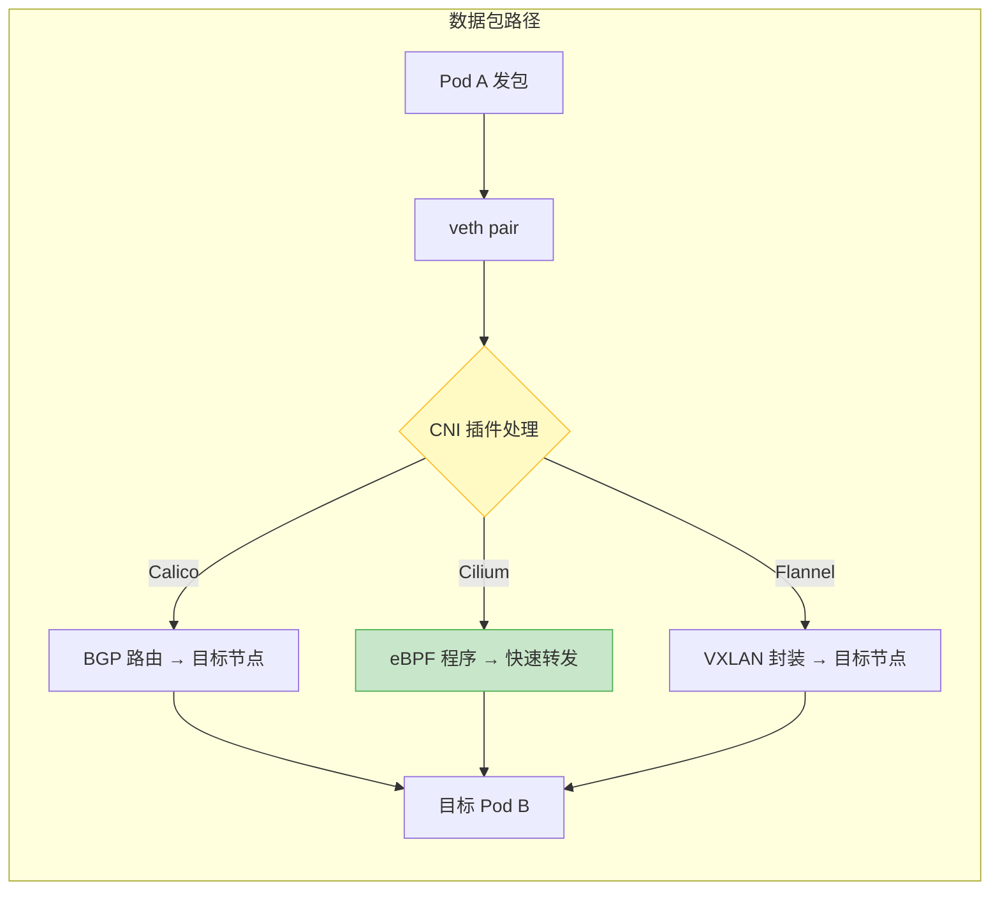
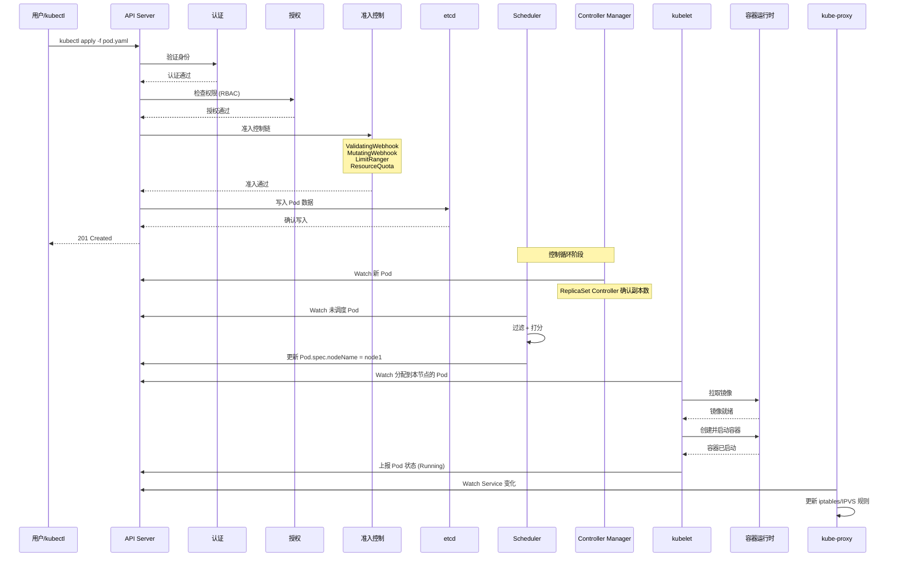

# K8s 架构与核心概念

Kubernetes 是容器编排的事实标准。理解它的架构，是驾驭云原生的第一步。

---

## 从历史说起：K8s 的诞生与 CNCF

### 容器编排的演进

2013 年 Docker 问世，容器技术迅速普及。但容器多了，问题也来了——

```
3 个容器：手动管理，还行
30 个容器：写脚本勉强搞定
300 个容器：脚本是屎山
3000 个容器：人已经疯了
```

于是容器编排工具纷纷登场：

| 时间 | 事件 | 意义 |
|------|------|------|
| 2013 | Docker 发布 | 容器技术平民化 |
| 2014.06 | Google 开源 Kubernetes | 基于 Borg/Omega 十五年经验 |
| 2015.07 | Kubernetes v1.0 发布 | 正式进入生产可用阶段 |
| 2015.11 | CNCF 成立 | 云原生基金会，K8s 成为首个项目 |
| 2016 | Kubernetes 赢得编排大战 | 击败 Mesos、Swarm |
| 2018 | K8s 成为 CNCF 毕业项目 | 成熟度最高级别 |
| 2024 | K8s v1.30+ | 持续演进，生态繁荣 |

### CNCF 与云原生版图

CNCF（Cloud Native Computing Foundation）是 Linux 基金会下的子基金会，负责推广云原生技术。Kubernetes 是 CNCF 的第一个毕业项目，也是整个云原生生态的基石。

```
CNCF 云原生全景图（简化版）
┌─────────────────────────────────────────────────────────────────┐
│                        应用层                                    │
│   Helm · Kustomize · ArgoCD · Flux                              │
├─────────────────────────────────────────────────────────────────┤
│                        平台层                                    │
│   Kubernetes · Crossplane · Knative                              │
├─────────────────────────────────────────────────────────────────┤
│                        观测与治理                                 │
│   Prometheus · Grafana · Jaeger · OpenTelemetry · Istio          │
├─────────────────────────────────────────────────────────────────┤
│                        网络与存储                                 │
│   Calico · Cilium · Flannel · Rook · Longhorn                   │
├─────────────────────────────────────────────────────────────────┤
│                        运行时                                    │
│   containerd · CRI-O · gVisor · Kata Containers                 │
└─────────────────────────────────────────────────────────────────┘
```

::: tip 参考
CNCF 云原生全景图：https://landscape.cncf.io/
Kubernetes 官方文档：https://kubernetes.io/docs/
:::

---

## K8s 架构全景

Kubernetes 采用经典的 Master-Worker 架构（官方称 Control Plane - Node 架构），所有组件通过 API Server 通信，没有组件间的直接依赖。

### 架构总览图



### 设计哲学

K8s 架构遵循几个核心设计原则：

| 原则 | 体现 |
|------|------|
| **声明式 API** | 你描述"想要什么"，K8s 负责"怎么做" |
| **控制循环** | 持续调谐，让实际状态趋近期望状态 |
| **松耦合** | 组件间只通过 API Server 通信 |
| **可扩展** | CRD、Operator、 Admission Webhook |
| **自愈** | 检测故障自动恢复 |

::: important 声明式 vs 命令式
命令式：`kubectl run nginx --image=nginx`（告诉 K8s 做什么）
声明式：`kubectl apply -f deployment.yaml`（告诉 K8s 想要什么）

生产环境永远用声明式。命令式操作无法追踪、无法审计、无法版本控制。
:::

---

## 控制平面组件

控制平面是 K8s 的大脑，负责全局决策和集群级事件响应。

### API Server

API Server 是控制平面的入口，所有组件（包括 kubectl）都通过它与集群交互。



**核心职责：**

- **REST API 网关**：所有操作的唯一入口
- **认证**：验证谁在调用（证书、Token、OIDC）
- **授权**：验证能不能做（RBAC、ABAC、Node授权）
- **准入控制**：验证做得对不对（LimitRanger、ResourceQuota、ValidatingWebhook）
- **数据持久化**：将资源写入 etcd
- **Watch 机制**：支持组件监听资源变化

**API Server 的高可用部署：**

```yaml
# API Server 通常以 Static Pod 形式运行
# /etc/kubernetes/manifests/kube-apiserver.yaml
apiVersion: v1
kind: Pod
metadata:
  name: kube-apiserver
  namespace: kube-system
spec:
  containers:
  - command:
    - kube-apiserver
    - --advertise-address=192.168.1.10
    - --etcd-servers=https://192.168.1.10:2379,https://192.168.1.11:2379,https://192.168.1.12:2379
    - --etcd-cafile=/etc/kubernetes/pki/etcd/ca.crt
    - --etcd-certfile=/etc/kubernetes/pki/apiserver-etcd-client.crt
    - --etcd-keyfile=/etc/kubernetes/pki/apiserver-etcd-client.key
    - --bind-address=0.0.0.0
    - --secure-port=6443
    - --service-cluster-ip-range=10.96.0.0/12
    - --service-node-port-range=30000-32767
    - --enable-admission-plugins=NodeRestriction
    image: k8s.gcr.io/kube-apiserver:v1.30.0
```

::: warning API Server 是单点
API Server 本身无状态（状态全在 etcd），可以水平扩展。但 etcd 是有状态的，etcd 的高可用是整个集群高可用的基础。
:::

### etcd

etcd 是分布式键值存储，保存了 K8s 集群的所有状态数据。

```
etcd 存储结构（简化）
/registry/
├── pods/
│   └── default/
│       ├── nginx-deployment-7d64c5f9b8-abc12
│       └── redis-master-0
├── services/
│   └── default/
│       ├── nginx-service
│       └── redis-service
├── deployments/
│   └── default/
│       └── nginx-deployment
├── configmaps/
│   └── default/
│       └── app-config
├── secrets/
│   └── default/
│       └── db-credentials
└── ...
```

**etcd 关键参数：**

| 参数 | 推荐值 | 说明 |
|------|--------|------|
| `--data-dir` | SSD 磁盘路径 | 数据目录，I/O 性能直接影响集群 |
| `--heartbeat-interval` | 100ms | Leader 心跳间隔 |
| `--election-timeout` | 1000ms | 选举超时 |
| `--snapshot-count` | 10000 | 快照频率 |
| `--quota-backend-bytes` | 8GB | 存储配额 |

::: important etcd 运维铁律
1. **奇数节点**：3 或 5 个节点，保证多数派
2. **SSD 磁盘**：etcd 对 I/O 延迟极其敏感
3. **定期备份**：`etcdctl snapshot save`
4. **不要超过 8GB**：数据量过大会影响性能
5. **独立部署**：不要和 K8s 其他组件混部
:::

**etcd 备份与恢复：**

```bash
# 备份
ETCDCTL_API=3 etcdctl snapshot save /backup/etcd-snapshot-$(date +%Y%m%d).db \
  --endpoints=https://127.0.0.1:2379 \
  --cacert=/etc/kubernetes/pki/etcd/ca.crt \
  --cert=/etc/kubernetes/pki/etcd/server.crt \
  --key=/etc/kubernetes/pki/etcd/server.key

# 查看备份状态
ETCDCTL_API=3 etcdctl snapshot status /backup/etcd-snapshot-20240605.db --write-table

# 恢复（在所有 etcd 节点执行）
ETCDCTL_API=3 etcdctl snapshot restore /backup/etcd-snapshot-20240605.db \
  --data-dir=/var/lib/etcd-restore
```

### Scheduler

Scheduler 负责将未调度的 Pod 分配到合适的节点。



**调度策略：**

```yaml
# 节点亲和性
apiVersion: v1
kind: Pod
metadata:
  name: with-node-affinity
spec:
  affinity:
    nodeAffinity:
      requiredDuringSchedulingIgnoredDuringExecution:
        nodeSelectorTerms:
        - matchExpressions:
          - key: topology.kubernetes.io/zone
            operator: In
            values:
            - us-east-1a
            - us-east-1b
      preferredDuringSchedulingIgnoredDuringExecution:
      - weight: 80
        preference:
          matchExpressions:
          - key: node-type
            operator: In
            values:
            - high-memory
  containers:
  - name: app
    image: nginx
```

```yaml
# Pod 亲和与反亲和
apiVersion: v1
kind: Pod
metadata:
  name: with-pod-affinity
spec:
  affinity:
    podAffinity:
      requiredDuringSchedulingIgnoredDuringExecution:
      - labelSelector:
          matchExpressions:
          - key: app
            operator: In
            values:
            - cache
        topologyKey: topology.kubernetes.io/zone
    podAntiAffinity:
      preferredDuringSchedulingIgnoredDuringExecution:
      - weight: 100
        podAffinityTerm:
          labelSelector:
            matchExpressions:
            - key: app
              operator: In
              values:
              - web
          topologyKey: kubernetes.io/hostname
  containers:
  - name: app
    image: nginx
```

```yaml
# 污点与容忍
# 给节点打污点
# kubectl taint nodes node1 dedicated=special:NoSchedule

apiVersion: v1
kind: Pod
metadata:
  name: with-toleration
spec:
  tolerations:
  - key: "dedicated"
    operator: "Equal"
    value: "special"
    effect: "NoSchedule"
  - key: "node.kubernetes.io/not-ready"
    operator: "Exists"
    effect: "NoExecute"
    tolerationSeconds: 300
  containers:
  - name: app
    image: nginx
```

### Controller Manager

Controller Manager 是多个控制器的集合，每个控制器是一个独立的控制循环。

```
kube-controller-manager 包含的控制器
┌──────────────────────────────────────────────┐
│  Deployment Controller   ── 管理Deployment    │
│  ReplicaSet Controller   ── 维护副本数        │
│  StatefulSet Controller  ── 有状态应用        │
│  DaemonSet Controller    ── 每节点一个Pod     │
│  Job Controller          ── 一次性任务        │
│  CronJob Controller      ── 定时任务          │
│  Node Controller         ── 节点健康检查      │
│  Service Account Controller               │
│  Endpoints Controller    ── Service后端       │
│  Namespace Controller                     │
│  ResourceQuota Controller ── 资源配额        │
│  ...更多控制器                              │
└──────────────────────────────────────────────┘
```

**控制循环的核心逻辑：**



::: tip 控制循环思想
K8s 的每个控制器都在做同一件事：**持续观察，不断调谐**。这就是声明式 API 的核心——你声明想要 3 个副本，控制器就会一直确保有 3 个副本在运行。少了就创建，多了就删除。
:::

---

## 节点组件

节点组件在每个 Worker Node 上运行，负责维护运行中的 Pod 并提供运行时环境。

### kubelet

kubelet 是节点上的代理，负责确保容器按照 PodSpec 运行。



**kubelet 核心功能：**

| 功能 | 说明 |
|------|------|
| Pod 生命周期管理 | 创建、更新、删除容器 |
| 健康检查 | 执行 liveness/readiness/startup 探针 |
| 资源上报 | 向 API Server 上报节点和 Pod 状态 |
| 镜像管理 | 拉取镜像、清理未使用镜像 |
| 卷管理 | 挂载/卸载存储卷 |
| 证书轮转 | 自动更新节点证书 |

**kubelet 关键配置：**

```yaml
# /var/lib/kubelet/config.yaml
apiVersion: kubelet.config.k8s.io/v1beta1
kind: KubeletConfiguration
address: 0.0.0.0
port: 10250
readOnlyPort: 10255
serializeImagePulls: false
registryPullQPS: 10
registryBurst: 20
evictionHard:
  memory.available: "100Mi"
  nodefs.available: "10%"
  nodefs.inodesFree: "5%"
  imagefs.available: "15%"
podPidsLimit: 4096
maxPods: 110
```

::: important 驱逐策略
kubelet 的驱逐策略（Eviction）是节点稳定的最后防线。当节点资源不足时，kubelet 会按优先级驱逐 Pod：

1. 驱逐 BestEffort Pod（无资源请求）
2. 驱逐 Burstable Pod 中超出请求量的部分
3. 最后才驱逐 Guaranteed Pod

这就是为什么生产环境必须设置资源请求和限制。
:::

### kube-proxy

kube-proxy 负责维护节点上的网络规则，实现 Service 的负载均衡。

```
kube-proxy 模式演进

Userspace 模式（已废弃）：
  Client → kube-proxy（用户态代理）→ Pod
  延迟高，性能差

iptables 模式（默认）：
  Client → iptables 规则（内核态）→ Pod
  性能好，但规则多了慢

IPVS 模式（推荐）：
  Client → IPVS 规则（内核态）→ Pod
  O(1) 查找，支持更多算法
```

| 模式 | 性能 | 规则数上限 | 负载均衡算法 | 推荐度 |
|------|------|-----------|-------------|--------|
| iptables | 中 | ~5000 Service | 随机 | 小规模可用 |
| IPVS | 高 | 10万+ Service | RR/LC/SH等 | 生产推荐 |

**IPVS 负载均衡算法：**

```bash
# 查看 kube-proxy 模式
kubectl get configmap kube-proxy -n kube-system -o yaml | grep mode

# 启用 IPVS 模式
# kube-proxy ConfigMap
apiVersion: v1
kind: ConfigMap
metadata:
  name: kube-proxy
  namespace: kube-system
data:
  config.conf: |
    apiVersion: kubeproxy.config.k8s.io/v1alpha1
    kind: KubeProxyConfiguration
    mode: "ipvs"
    ipvs:
      scheduler: "rr"        # 轮询
      # scheduler: "lc"      # 最少连接
      # scheduler: "sh"      # 源地址哈希
      # scheduler: "wrr"     # 加权轮询
      strictARP: true
```

```bash
# 检查 IPVS 规则
ipvsadm -Ln

# 示例输出
TCP  10.96.0.1:443 rr
  -> 192.168.1.10:6443        Masq    1      0          0
  -> 192.168.1.11:6443        Masq    1      0          0
  -> 192.168.1.12:6443        Masq    1      0          0
```

### 容器运行时

容器运行时负责实际拉取镜像和运行容器。K8s 通过 CRI（Container Runtime Interface）与运行时交互。



| 运行时 | 特点 | 适用场景 |
|--------|------|----------|
| containerd | 最主流，Docker 底层运行时 | 通用生产环境 |
| CRI-O | 专为 K8s 设计，轻量 | 纯 K8s 集群 |
| gVisor | 用户态内核，强隔离 | 多租户、安全敏感 |
| Kata Containers | 虚拟机级隔离 | 强隔离需求 |

::: warning Docker 已被弃用
从 K8s v1.24 起，Docker 作为运行时已被移除（dockershim 删除）。但 Docker 构建的镜像仍然兼容，因为镜像标准（OCI）是统一的。如果你之前用 Docker，迁移到 containerd 只需修改节点配置，应用无需改动。
:::

---

## API 对象与声明式配置

### API 对象体系

K8s 中一切都是 API 对象。每个对象都有 `apiVersion`、`kind`、`metadata`、`spec`、`status` 五个部分。

```yaml
# API 对象通用结构
apiVersion: apps/v1          # API 版本
kind: Deployment             # 资源类型
metadata:                    # 元数据
  name: nginx-deployment
  namespace: default
  labels:
    app: nginx
  annotations:
    description: "前端Nginx服务"
spec:                        # 期望状态（用户定义）
  replicas: 3
  selector:
    matchLabels:
      app: nginx
  template:
    spec:
      containers:
      - name: nginx
        image: nginx:1.25
status:                      # 实际状态（系统维护，只读）
  replicas: 3
  readyReplicas: 3
  availableReplicas: 3
  conditions:
  - type: Available
    status: "True"
```

**API 版本级别：**

| 级别 | 前缀 | 说明 |
|------|------|------|
| GA（正式） | `v1` | 稳定，向后兼容 |
| Beta | `v1beta1/v1beta2` | 功能完整，可能有小改动 |
| Alpha | `v1alpha1/v1alpha2` | 实验性，随时可能移除 |

::: important 生产环境只用 GA 和稳定的 Beta API
Alpha API 可能随时变更或移除，不要在生产环境使用。检查 API 稳定性：
```bash
kubectl api-resources | grep -i alpha
```
:::

### 声明式配置管理

K8s 推荐使用声明式方式管理资源，将配置存为 YAML 文件，用 `kubectl apply` 应用。

```
配置管理最佳实践

项目目录结构：
k8s/
├── base/                    # 基础配置
│   ├── deployment.yaml
│   ├── service.yaml
│   ├── configmap.yaml
│   └── kustomization.yaml
├── overlays/                # 环境覆盖
│   ├── dev/
│   │   ├── kustomization.yaml
│   │   └── patch-replicas.yaml
│   ├── staging/
│   │   └── kustomization.yaml
│   └── production/
│       ├── kustomization.yaml
│       └── patch-replicas.yaml
└── README.md
```

```yaml
# base/kustomization.yaml
apiVersion: kustomize.config.k8s.io/v1beta1
kind: Kustomization
resources:
  - deployment.yaml
  - service.yaml
  - configmap.yaml
```

```yaml
# overlays/production/kustomization.yaml
apiVersion: kustomize.config.k8s.io/v1beta1
kind: Kustomization
bases:
  - ../../base
patchesStrategicMerge:
  - patch-replicas.yaml
replicas:
  - name: nginx-deployment
    count: 5
namespace: production
```

---

## kubectl 命令大全

kubectl 是与 K8s API Server 交互的命令行工具，是日常操作的核心。

### 基础操作

```bash
# ========== 资源查看 ==========
# 查看所有资源类型
kubectl api-resources

# 查看集群信息
kubectl cluster-info

# 查看节点
kubectl get nodes
kubectl get nodes -o wide              # 详细信息
kubectl describe node node1            # 节点详情

# 查看命名空间
kubectl get namespaces
kubectl get ns

# 查看所有 Pod
kubectl get pods                        # 当前命名空间
kubectl get pods -A                     # 所有命名空间
kubectl get pods -o wide                # 含 IP 和节点
kubectl get pods -o yaml                # YAML 格式
kubectl get pods -o json                # JSON 格式
kubectl get pods -o name                # 只显示名称
kubectl get pods --show-labels          # 显示标签
kubectl get pods -l app=nginx           # 按标签筛选
kubectl get pods --field-selector status.phase=Running  # 按字段筛选

# 查看 Deployment
kubectl get deployments
kubectl get deploy

# 查看 Service
kubectl get services
kubectl get svc

# 查看多种资源
kubectl get pods,svc,deploy
```

### 资源创建与管理

```bash
# ========== 创建资源 ==========
# 从文件创建
kubectl apply -f deployment.yaml
kubectl apply -f ./k8s/                 # 目录下所有文件
kubectl apply -f https://url/manifest.yaml  # 从 URL

# 命令式创建（不推荐生产环境）
kubectl create deployment nginx --image=nginx --replicas=3
kubectl expose deployment nginx --port=80 --type=NodePort

# ========== 更新资源 ==========
# 声明式更新（推荐）
kubectl apply -f deployment.yaml

# 命令式更新
kubectl scale deployment nginx --replicas=5
kubectl set image deployment/nginx nginx=nginx:1.26
kubectl edit deployment nginx            # 打开编辑器

# ========== 删除资源 ==========
kubectl delete -f deployment.yaml
kubectl delete deployment nginx
kubectl delete pod nginx-xxx --force --grace-period=0  # 强制删除
kubectl delete pods -l app=old          # 按标签删除
```

### 调试与排查

```bash
# ========== 查看详情 ==========
kubectl describe pod nginx-xxx
kubectl describe deploy nginx
kubectl describe svc nginx-service

# ========== 查看日志 ==========
kubectl logs nginx-xxx                   # 容器日志
kubectl logs nginx-xxx -c sidecar       # 指定容器
kubectl logs nginx-xxx -f               # 跟踪日志（tail -f）
kubectl logs nginx-xxx --tail=100       # 最后100行
kubectl logs nginx-xxx --since=1h       # 最近1小时
kubectl logs deployment/nginx --all-containers=true  # 所有容器日志

# ========== 进入容器 ==========
kubectl exec -it nginx-xxx -- /bin/bash
kubectl exec -it nginx-xxx -- /bin/sh   # Alpine 镜像没有 bash
kubectl exec nginx-xxx -- cat /etc/config/app.json  # 执行单条命令

# ========== 端口转发 ==========
kubectl port-forward pod/nginx-xxx 8080:80          # Pod 端口转发
kubectl port-forward svc/nginx-service 8080:80      # Service 端口转发
kubectl port-forward deploy/nginx 8080:80            # Deployment 端口转发

# ========== 资源使用 ==========
kubectl top nodes                        # 节点资源使用
kubectl top pods                         # Pod 资源使用
kubectl top pods -l app=nginx           # 按标签筛选
```

### 高级操作

```bash
# ========== 标签与注解 ==========
kubectl label pod nginx-xxx env=prod     # 添加标签
kubectl label pod nginx-xxx env-         # 删除标签
kubectl annotate pod nginx-xxx desc="备注"  # 添加注解

# ========== 污点与容忍 ==========
kubectl taint nodes node1 key=value:NoSchedule     # 添加污点
kubectl taint nodes node1 key:NoSchedule-          # 删除污点

# ========== 配置与上下文 ==========
kubectl config get-contexts              # 查看上下文
kubectl config current-context           # 当前上下文
kubectl config use-context prod-cluster  # 切换上下文

# ========== 排错 ==========
kubectl explain pod.spec.containers      # 查看 API 文档
kubectl explain pod.spec.affinity        # 嵌套字段文档
kubectl version -o yaml                  # 版本信息
kubectl get events --sort-by=.metadata.creationTimestamp  # 事件排序

# ========== 集群运维 ==========
kubectl cordon node1                     # 标记节点不可调度
kubectl uncordon node1                   # 恢复可调度
kubectl drain node1 --ignore-daemonsets  # 驱逐节点上所有 Pod
kubectl debug node/node1 -it --image=busybox  # 调试节点
```

::: tip kubectl 速查技巧
- `kubectl explain` 是最好的在线文档，比百度快
- `kubectl get -o yaml` 查看完整资源定义
- `kubectl describe` 查看事件和状态，排错第一步
- 用 `alias k=kubectl` 加速输入
:::

---

## kubeconfig 配置

kubeconfig 文件决定了 kubectl 连接哪个集群、使用什么身份。

```yaml
# ~/.kube/config
apiVersion: v1
kind: Config

# 集群列表
clusters:
- cluster:
    certificate-authority-data: LS0tLS1CRUdJTi...  # CA 证书
    server: https://192.168.1.10:6443               # API Server 地址
  name: production-cluster

- cluster:
    certificate-authority-data: LS0tLS1CRUdJTi...
    server: https://10.0.0.100:6443
  name: staging-cluster

# 用户列表
users:
- name: admin
  user:
    client-certificate-data: LS0tLS1CRUdJTi...      # 客户端证书
    client-key-data: LS0tLS1C...                     # 客户端私钥

- name: dev-user
  user:
    token: eyJhbGciOiJSUzI1NiIs...                  # Bearer Token

# 上下文列表（绑定集群+用户+命名空间）
contexts:
- context:
    cluster: production-cluster
    user: admin
    namespace: default
  name: prod-admin

- context:
    cluster: staging-cluster
    user: dev-user
    namespace: development
  name: staging-dev

# 当前上下文
current-context: prod-admin

preferences: {}
```

**多集群管理：**

```bash
# 查看所有上下文
kubectl config get-contexts

# 输出示例
CURRENT   NAME            CLUSTER               AUTHINFO   NAMESPACE
*         prod-admin      production-cluster    admin      default
          staging-dev     staging-cluster       dev-user   development

# 切换上下文
kubectl config use-context staging-dev

# 快速切换命名空间
kubectl config set-context --current --namespace=monitoring

# 合并多个 kubeconfig
export KUBECONFIG=~/.kube/config:~/.kube/prod-config:~/.kube/staging-config
kubectl config view --flatten > ~/.kube/merged-config
```

::: important kubeconfig 安全
- 私钥和证书是集群的通行证，不要提交到 Git
- 使用 `--kubeconfig` 参数指定配置文件，避免误操作
- 生产集群建议使用 OIDC 认证而非证书
- 定期轮转访问凭证
:::

---

## 命名空间与标签

### 命名空间（Namespace）

命名空间是 K8s 的资源隔离机制，不是物理隔离，是逻辑隔离。

```bash
# 查看所有命名空间
kubectl get ns

# 系统内置命名空间
NAME              STATUS   AGE
default           Active   30d     # 默认命名空间
kube-node-lease   Active   30d     # 节点心跳
kube-public       Active   30d     # 公开可读
kube-system       Active   30d     # 系统组件
```

```yaml
# 创建命名空间
apiVersion: v1
kind: Namespace
metadata:
  name: production
  labels:
    env: production
    team: backend
```

```yaml
# 命名空间资源配额
apiVersion: v1
kind: ResourceQuota
metadata:
  name: production-quota
  namespace: production
spec:
  hard:
    requests.cpu: "20"
    requests.memory: 40Gi
    limits.cpu: "40"
    limits.memory: 80Gi
    pods: "100"
    services: "20"
    persistentvolumeclaims: "30"
    configmaps: "50"
    secrets: "50"
```

```yaml
# 命名空间限制范围
apiVersion: v1
kind: LimitRange
metadata:
  name: default-limits
  namespace: production
spec:
  limits:
  - type: Container
    default:            # 默认 limit
      cpu: "1"
      memory: 512Mi
    defaultRequest:     # 默认 request
      cpu: 100m
      memory: 128Mi
    max:                # 最大值
      cpu: "4"
      memory: 4Gi
    min:                # 最小值
      cpu: 50m
      memory: 32Mi
```

::: warning 命名空间的限制
1. **不是网络隔离**：默认情况下不同命名空间的 Pod 可以互相访问
2. **不是所有资源都有命名空间**：Node、PV、StorageClass 是集群级资源
3. **不是权限边界**：RBAC 可以跨命名空间授权
4. **不要超过 10 个**：过多的命名空间增加管理复杂度
:::

### 标签与选择器（Labels & Selectors）

标签是 K8s 中最重要的组织机制，几乎所有的关联关系都通过标签建立。

```yaml
# 标签命名最佳实践
metadata:
  labels:
    # K8s 推荐的公共标签
    app.kubernetes.io/name: nginx           # 应用名称
    app.kubernetes.io/instance: nginx-prod  # 实例名称
    app.kubernetes.io/version: "1.25"       # 版本
    app.kubernetes.io/component: frontend   # 组件
    app.kubernetes.io/part-of: web-app      # 所属应用
    app.kubernetes.io/managed-by: helm      # 管理工具

    # 自定义标签
    env: production
    tier: frontend
    team: platform
```

```bash
# 标签操作
kubectl label pod nginx-xxx env=staging         # 添加
kubectl label pod nginx-xxx env=production --overwrite  # 修改
kubectl label pod nginx-xxx env-                # 删除

# 标签选择器
kubectl get pods -l app=nginx                   # 等于
kubectl get pods -l 'env in (production,staging)'  # 集合
kubectl get pods -l 'tier notin (frontend)'     # 不在集合中
kubectl get pods -l '!canary'                   # 不存在该标签
kubectl get pods -l 'version gt 1.24'           # 大于
```

---

## K8s 网络模型

### 基本原则

K8s 网络模型有四条铁律：

```
1. 所有 Pod 可以与所有 Pod 通信（不经过 NAT）
2. 所有 Node 可以与所有 Pod 通信（不经过 NAT）
3. Pod 看到自己的 IP 和别人看到它的 IP 一样
4. Pod 重建后 IP 可能变化（所以需要 Service）
```



### CNI 插件对比

CNI（Container Network Interface）是 K8s 的网络插件标准。

| CNI 插件 | 网络模式 | 性能 | eBPF | NetworkPolicy | 适用场景 |
|----------|----------|------|------|--------------|----------|
| **Calico** | BGP/VXLAN | 高 | 支持 | 完整支持 | 生产首选 |
| **Cilium** | eBPF/VXLAN | 最高 | 原生 | 完整+L7 | 追求性能 |
| **Flannel** | VXLAN/host-gw | 中 | 不支持 | 不支持 | 学习/测试 |
| **Weave** | Mesh | 中 | 不支持 | 部分支持 | 简单场景 |



**Calico 安装示例：**

```bash
# 安装 Calico（Tigera Operator 方式，推荐）
kubectl create -f https://raw.githubusercontent.com/projectcalico/calico/v3.27.0/manifests/tigera-operator.yaml
kubectl create -f https://raw.githubusercontent.com/projectcalico/calico/v3.27.0/manifests/custom-resources.yaml

# 查看 Calico Pod
kubectl get pods -n calico-system

# 查看 BGP 对等状态
calicoctl node status

# 查看 IP 池
calicoctl ip-pools show
```

**Cilium 安装示例：**

```bash
# 使用 Helm 安装 Cilium
helm repo add cilium https://helm.cilium.io/
helm install cilium cilium/cilium \
  --namespace kube-system \
  --set kubeProxyReplacement=strict \
  --set hubble.enabled=true \
  --set hubble.relay.enabled=true \
  --set hubble.ui.enabled=true

# 启用 Hubble 可观测性
cilium hubble port-forward &
hubble observe
```

::: tip CNI 选型建议
- **学习环境**：Flannel（简单，零配置）
- **生产环境（通用）**：Calico（成熟稳定，BGP 路由性能好）
- **追求极致性能**：Cilium（eBPF 绕过 iptables，延迟最低）
- **已有 Istio**：Cilium 和 Istio 配合很好
:::

### Service 网络

K8s 有三个网络平面：

```
三个网络平面

1. Pod 网络（CNI）
   10.244.0.0/16
   Pod 间直接通信

2. Service 网络（Cluster IP）
   10.96.0.0/12
   虚拟 IP，由 kube-proxy 维护

3. 外部网络
   节点物理网络
   NodePort / LoadBalancer 暴露
```

---

## 本地开发环境

### minikube

minikube 是最流行的本地 K8s 环境，适合学习和开发。

```bash
# 安装 minikube
# macOS
brew install minikube

# Linux
curl -LO https://storage.googleapis.com/minikube/releases/latest/minikube-linux-amd64
sudo install minikube-linux-amd64 /usr/local/bin/minikube

# Windows（PowerShell 管理员）
choco install minikube

# 启动集群
minikube start --driver=docker --kubernetes-version=v1.30.0 --cpus=4 --memory=8192

# 使用特定 CNI
minikube start --cni=calico

# 启用插件
minikube addons enable dashboard
minikube addons enable ingress
minikube addons enable metrics-server
minikube addons enable registry

# 常用命令
minikube status
minikube dashboard          # 打开 Dashboard
minikube service nginx      # 在浏览器打开 Service
minikube ssh                # SSH 到节点
minikube docker-env         # 使用 minikube 的 Docker
minikube stop               # 停止
minikube delete             # 删除

# 多节点集群
minikube start --nodes=3
```

### kind（Kubernetes in Docker）

kind 用 Docker 容器模拟 K8s 节点，启动快，适合 CI/CD 和测试。

```yaml
# kind 集群配置 kind-config.yaml
kind: Cluster
apiVersion: kind.x-k8s.io/v1alpha4
name: my-cluster
nodes:
- role: control-plane
  kubeadmConfigPatches:
  - |
    kind: InitConfiguration
    nodeRegistration:
      kubeletExtraArgs:
        node-labels: "ingress-ready=true"
  extraPortMappings:
  - containerPort: 80
    hostPort: 80
    protocol: TCP
  - containerPort: 443
    hostPort: 443
    protocol: TCP
- role: worker
- role: worker
```

```bash
# 安装 kind
# macOS
brew install kind

# Linux
curl -Lo ./kind https://kind.sigs.k8s.io/dl/v0.23.0/kind-linux-amd64
chmod +x ./kind
sudo mv ./kind /usr/local/bin/

# 创建集群
kind create cluster --config kind-config.yaml

# 常用命令
kind get clusters
kind get nodes --name my-cluster
kind delete cluster --name my-cluster

# 加载本地镜像到集群
kind load docker-image myapp:v1.0 --name my-cluster

# 查看 kubeconfig
kind get kubeconfig --name my-cluster
```

### k3d（轻量级 K3s）

k3d 是 K3s（Rancher 的轻量 K8s）的 Docker 包装器，资源占用最少。

```bash
# 安装 k3d
curl -s https://raw.githubusercontent.com/k3d-io/k3d/main/install.sh | bash

# 创建集群
k3d cluster create mycluster --agents 2 --port "8080:80@loadbalancer"

# 常用命令
k3d cluster list
k3d cluster delete mycluster
k3d node create extra-agent --cluster mycluster
```

### 本地环境选型

| 环境 | 启动速度 | 资源占用 | 多节点 | 适用场景 |
|------|----------|----------|--------|----------|
| minikube | 慢 | 高 | 支持（慢） | 学习、开发 |
| kind | 快 | 中 | 支持 | CI/CD、测试 |
| k3d | 最快 | 最低 | 支持 | 开发、轻量测试 |

::: tip 推荐组合
- **日常开发**：minikube + docker driver（功能最全，Dashboard 开箱即用）
- **CI/CD 流水线**：kind（启动快，可编程）
- **快速验证**：k3d（资源占用最少）
:::

---

## 控制平面交互流程

下面用完整的 mermaid 图展示从提交 Pod 到运行的完整流程。



---

## 集群初始化实战

### kubeadm 初始化（生产方式）

```bash
# ========== 前置准备（所有节点）==========
# 关闭 swap
sudo swapoff -a
sudo sed -i '/ swap / s/^/#/' /etc/fstab

# 加载内核模块
cat <<EOF | sudo tee /etc/modules-load.d/k8s.conf
overlay
br_netfilter
EOF
sudo modprobe overlay
sudo modprobe br_netfilter

# 内核参数
cat <<EOF | sudo tee /etc/sysctl.d/k8s.conf
net.bridge.bridge-nf-call-iptables  = 1
net.bridge.bridge-nf-call-ip6tables = 1
net.ipv4.ip_forward                 = 1
EOF
sudo sysctl --system

# 安装 containerd
sudo apt-get update
sudo apt-get install -y containerd
sudo mkdir -p /etc/containerd
containerd config default | sudo tee /etc/containerd/config.toml
# 修改 SystemdCgroup = true
sudo sed -i 's/SystemdCgroup = false/SystemdCgroup = true/' /etc/containerd/config.toml
sudo systemctl restart containerd

# 安装 kubeadm、kubelet、kubectl
sudo apt-get install -y apt-transport-https ca-certificates curl
curl -fsSL https://pkgs.k8s.io/core:/stable:/v1.30/deb/Release.key | sudo gpg --dearmor -o /etc/apt/keyrings/kubernetes-apt-keyring.gpg
echo 'deb [signed-by=/etc/apt/keyrings/kubernetes-apt-keyring.gpg] https://pkgs.k8s.io/core:/stable:/v1.30/deb/ /' | sudo tee /etc/apt/sources.list.d/kubernetes.list
sudo apt-get update
sudo apt-get install -y kubelet kubeadm kubectl
sudo apt-mark hold kubelet kubeadm kubectl
```

```bash
# ========== 初始化控制平面（Master 节点）==========
sudo kubeadm init \
  --apiserver-advertise-address=192.168.1.10 \
  --pod-network-cidr=10.244.0.0/16 \
  --service-cidr=10.96.0.0/12 \
  --kubernetes-version=v1.30.0 \
  --upload-certs

# 配置 kubectl
mkdir -p $HOME/.kube
sudo cp /etc/kubernetes/admin.conf $HOME/.kube/config
sudo chown $(id -u):$(id -g) $HOME/.kube/config

# 安装 CNI（Calico）
kubectl create -f https://raw.githubusercontent.com/projectcalico/calico/v3.27.0/manifests/tigera-operator.yaml
kubectl create -f https://raw.githubusercontent.com/projectcalico/calico/v3.27.0/manifests/custom-resources.yaml
```

```bash
# ========== 加入工作节点（Worker 节点）==========
# 在 Worker 节点执行 kubeadm init 输出的 join 命令
sudo kubeadm join 192.168.1.10:6443 \
  --token abcdef.0123456789abcdef \
  --discovery-token-ca-cert-hash sha256:xxxxx

# 验证节点加入
kubectl get nodes
```

```bash
# ========== 验证集群 ==========
# 查看节点状态
kubectl get nodes -o wide

# 查看系统 Pod
kubectl get pods -n kube-system

# 查看组件状态
kubectl get componentstatuses

# 部署测试应用
kubectl create deployment nginx --image=nginx --replicas=2
kubectl expose deployment nginx --port=80 --type=NodePort
kubectl get svc nginx
```

::: warning kubeadm 注意事项
1. `--pod-network-cidr` 必须与 CNI 插件匹配（Calico 默认 10.244.0.0/16）
2. Token 默认 24 小时过期，过期后用 `kubeadm token create --print-join-command` 重新生成
3. 生产环境建议使用外部 etcd 集群
4. 控制平面至少 3 个节点保证高可用
:::

---

## 常见问题排查

### 节点 NotReady

```bash
# 查看节点状态
kubectl describe node node1

# 常见原因
# 1. kubelet 未运行
systemctl status kubelet

# 2. CNI 未安装或异常
kubectl get pods -n kube-system -l k8s-app=calico-node

# 3. 磁盘压力
df -h
# kubelet 驱逐条件：nodefs.available < 10%

# 4. 证书过期
openssl x509 -in /var/lib/kubelet/pki/kubelet-client-current.pem -noout -dates
```

### Pod 一直 Pending

```bash
# 查看 Pending 原因
kubectl describe pod nginx-xxx | grep -A5 Events

# 常见原因
# 1. 资源不足
#   0/3 nodes are available: Insufficient cpu.

# 2. 污点不匹配
#   0/1 nodes are available: 1 node(s) had taint {dedicated: true}

# 3. PVC 未绑定
#   0/3 nodes are available: persistentvolumeclaim "data-pvc" not found.

# 4. 调度约束
#   0/3 nodes are available: 3 node(s) didn't match node selector.
```

### Pod CrashLoopBackOff

```bash
# 查看重启原因
kubectl describe pod nginx-xxx | grep -A10 "Last State"
kubectl logs nginx-xxx --previous

# 常见原因
# 1. 应用启动失败（配置错误、依赖缺失）
# 2. OOMKilled（内存不足，增加 limits）
# 3. 探针失败（livenessProbe 配置不当）
# 4. 镜像拉取失败（镜像不存在、私有仓库认证）
```

### 证书过期处理

```bash
# 检查证书过期时间
kubeadm certs check-expiration

# 续期证书
kubeadm certs renew all

# 重启控制平面组件
sudo systemctl restart kubelet
# Static Pod 会自动重启
kubectl delete pod -n kube-system -l component=kube-apiserver
kubectl delete pod -n kube-system -l component=kube-controller-manager
kubectl delete pod -n kube-system -l component=kube-scheduler
```

---

## 关键概念速查表

| 概念 | 一句话解释 |
|------|-----------|
| **Pod** | K8s 最小调度单元，一个或多个容器共享网络和存储 |
| **Deployment** | 管理无状态应用，声明副本数和更新策略 |
| **Service** | 为 Pod 提供稳定的访问入口（IP + DNS） |
| **Ingress** | HTTP 层的路由规则，把外部流量导入 Service |
| **ConfigMap** | 存储非敏感配置数据 |
| **Secret** | 存储敏感数据（密码、证书） |
| **PV/PVC** | 持久化存储的抽象，PVC 消费 PV |
| **Namespace** | 资源逻辑隔离 |
| **Label** | 键值对，用于筛选和关联资源 |
| **Annotation** | 键值对，存储任意非标识元数据 |
| **Node** | 工作节点，运行 Pod 的机器 |
| **Control Plane** | 控制平面，集群的大脑 |
| **CNI** | 容器网络接口，Pod 间通信的插件 |
| **CRI** | 容器运行时接口，kubelet 与运行时的桥梁 |
| **CSI** | 容器存储接口，存储插件的统一标准 |

---

## 总结

K8s 架构的核心可以用一句话概括：**API Server 是中心，etcd 是记忆，控制器是手脚，kubelet 是一线工人**。

```
理解 K8s 的心智模型：

你想部署一个应用 → 写 YAML（声明期望状态）
→ kubectl apply 提交给 API Server
→ API Server 存入 etcd
→ Controller Manager 发现差异，开始调谐
→ Scheduler 选择合适节点
→ kubelet 在节点上创建容器
→ 持续监控，任何偏差都会被自动修正

这就是声明式 + 控制循环的力量。
```

::: important 下一步
理解了架构，接下来就是 [Pod 与工作负载](02_Pod与工作负载.md) —— 学习 K8s 中最核心的资源对象。
:::
