# Pod 与工作负载

Pod 是 K8s 的原子单位。理解 Pod 的原理和生命周期，是掌握 K8s 工作负载的基础。

---

## Pod 原理

### Pod 不是容器

很多初学者把 Pod 等同于容器，这是最大的误解。

```
Pod 与容器的关系：

Pod 是"逻辑主机"，容器是"进程"
一个 Pod = 一个或多个容器 + 共享的网络和存储

┌─────────────────────────────────────────┐
│              Pod (172.17.0.5)            │
│                                         │
│  ┌─────────┐  ┌─────────┐  ┌────────┐  │
│  │ Pause   │  │ App     │  │Sidecar │  │
│  │ 容器    │  │ 容器    │  │ 容器   │  │
│  │(基础设施)│  │(业务)   │  │(辅助)  │  │
│  └─────────┘  └─────────┘  └────────┘  │
│       │            │            │        │
│       └────────────┼────────────┘        │
│              共享 Network Namespace       │
│              共享 Volume                  │
│              共享 IPC Namespace           │
└─────────────────────────────────────────┘
```

### Pause 容器

每个 Pod 都有一个隐形的 Pause 容器，它是 Pod 的基础设施。

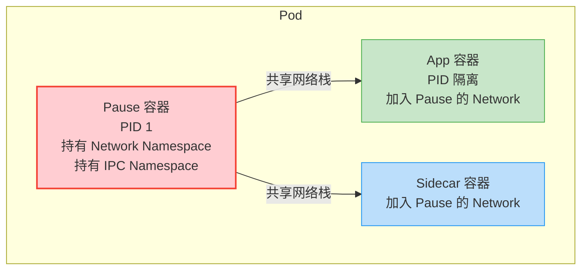

Pause 容器的职责：

| 职责 | 说明 |
|------|------|
| **持有网络** | 创建 Network Namespace，其他容器加入 |
| **僵尸进程回收** | 作为 PID 1，回收孤儿进程 |
| **保持 Pod 存活** | 只要 Pause 在，Pod 就不会退出 |

```bash
# 查看 Pause 容器
kubectl get pods nginx-xxx -o jsonpath='{.status.containerStatuses[*].name}'

# 在节点上查看 Pause 进程
crictl ps | grep pause
# CONTAINER ID   IMAGE                                      NAME
# abc123         registry.k8s.io/pause:3.9                  k8s_POD_nginx...

# Pause 容器极小，只做一件事：sleep forever
# 源码核心：while (true) { pause(); }
```

::: tip 为什么需要 Pause
如果 App 容器崩溃重启，没有 Pause 的话 Pod 的 IP 会变。有了 Pause，网络栈由 Pause 持有，App 重启不影响 Pod IP。这就是 Pod "稳定"的原因。
:::

### 共享网络

同一 Pod 内的容器共享网络栈，这意味着：

```yaml
# 同一 Pod 内的容器共享：
# 1. IP 地址（和 Pause 一样）
# 2. 端口空间（不能冲突）
# 3. localhost 互相访问
# 4. 网络接口和路由表

apiVersion: v1
kind: Pod
metadata:
  name: shared-network-demo
spec:
  containers:
  - name: app
    image: nginx
    ports:
    - containerPort: 80      # 主应用端口
    volumeMounts:
    - name: shared-data
      mountPath: /usr/share/nginx/html

  - name: sidecar
    image: busybox
    command: ["/bin/sh", "-c", "while true; do echo '<h1>Hello at '$(date)'</h1>' > /usr/share/nginx/html/index.html; sleep 10; done"]
    volumeMounts:
    - name: shared-data
      mountPath: /usr/share/nginx/html

  volumes:
  - name: shared-data
    emptyDir: {}

# app 容器可以通过 localhost:80 访问
# sidecar 可以通过 localhost:80 访问 nginx
# 两个容器通过 shared-data Volume 共享文件
```

### 共享存储

同一 Pod 内的容器通过 Volume 共享文件。

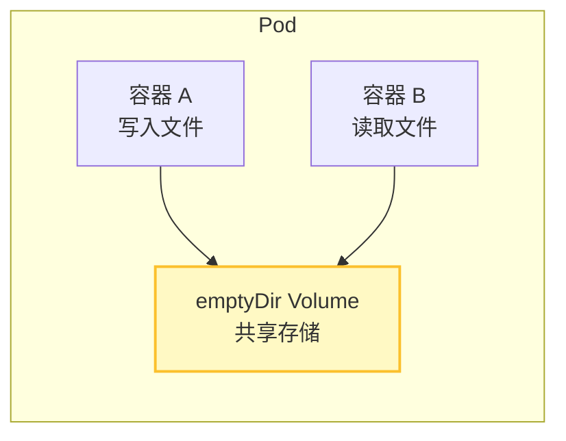

```yaml
# 经典 Sidecar 模式：日志采集
apiVersion: v1
kind: Pod
metadata:
  name: log-sidecar
spec:
  containers:
  - name: app
    image: myapp:latest
    volumeMounts:
    - name: log-volume
      mountPath: /var/log/app       # 应用写日志

  - name: log-collector
    image: fluent/fluentd:latest
    volumeMounts:
    - name: log-volume
      mountPath: /var/log/app       # 采集器读日志
    - name: config
      mountPath: /fluentd/etc

  volumes:
  - name: log-volume
    emptyDir: {}                     # Pod 内共享
  - name: config
    configMap:
      name: fluentd-config
```

---

## Pod 生命周期

### 状态流转

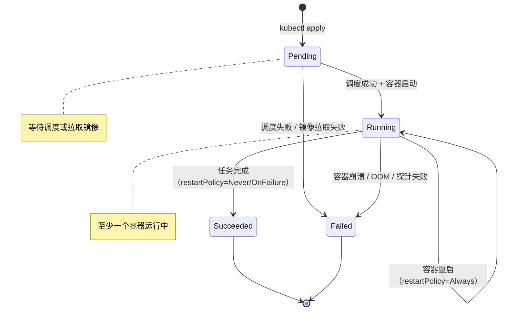

### Pod Phase 详解

| Phase | 含义 | 典型场景 |
|-------|------|----------|
| **Pending** | 已被接受但未运行 | 调度中、拉取镜像中 |
| **Running** | 至少一个容器运行 | 正常运行 |
| **Succeeded** | 所有容器成功退出 | 一次性任务（Job） |
| **Failed** | 至少一个容器非零退出 | 应用崩溃、OOM |
| **Unknown** | 无法获取状态 | 节点失联 |

### 容器状态

除了 Pod Phase，容器还有更细粒度的状态：

```bash
kubectl describe pod nginx-xxx

# 容器状态关键字段
State:          Running           # 当前状态
  Started:      Mon, 05 Jun 2026 10:00:00
Last State:     Terminated        # 上次终止状态
  Reason:       OOMKilled         # 终止原因
  Exit Code:    137               # 退出码
Ready:          True              # 是否就绪
Restart Count:  3                 # 重启次数
Image:          nginx:1.25
```

**退出码速查：**

| 退出码 | 含义 |
|--------|------|
| 0 | 正常退出 |
| 1 | 应用错误 |
| 137 | SIGKILL（OOMKilled 或手动 kill -9） |
| 139 | SIGSEGV（段错误） |
| 143 | SIGTERM（正常终止） |
| 125 | 容器运行时错误 |
| 126 | 命令不可执行 |
| 127 | 命令未找到 |

### Pod 生命周期钩子

```yaml
apiVersion: v1
kind: Pod
metadata:
  name: lifecycle-demo
spec:
  containers:
  - name: app
    image: nginx
    lifecycle:
      postStart:                    # 容器创建后立即执行
        exec:
          command: ["/bin/sh", "-c", "echo 'Container started' > /tmp/started"]
      preStop:                      # 容器终止前执行
        exec:
          command: ["/bin/sh", "-c", "nginx -s quit; sleep 10"]
    terminationMessagePath: /dev/termination-log
    terminationMessagePolicy: File
```

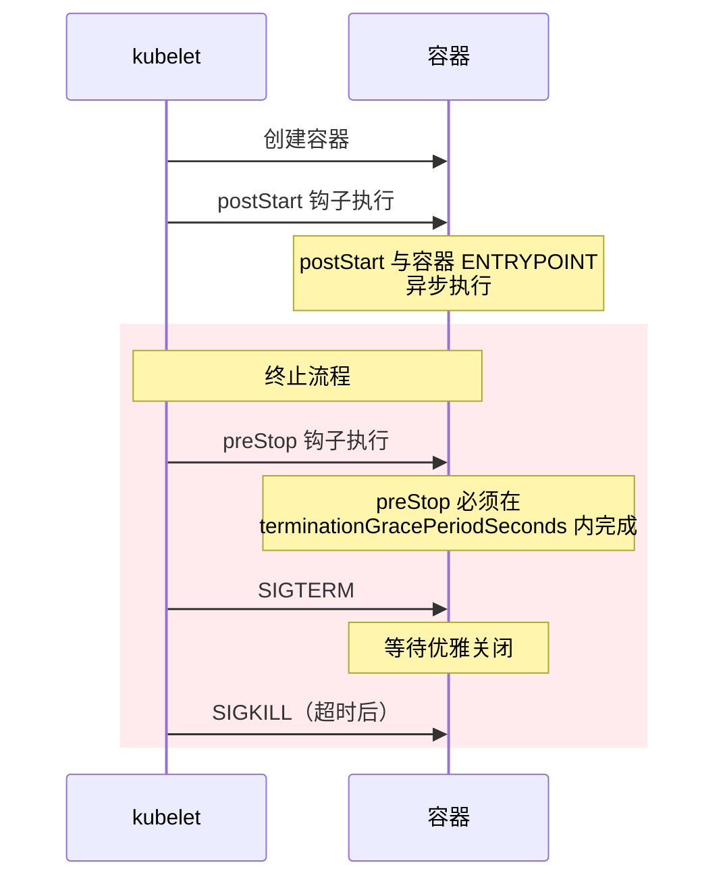

::: warning 钩子注意事项
1. `postStart` 与容器的 `ENTRYPOINT` **异步执行**，不保证先后顺序
2. `preStop` 是**同步阻塞**的，完成后才发 SIGTERM
3. 如果 `postStart` 失败，容器会被杀掉重启
4. `preStop` 常用于优雅关闭：先从注册中心注销，再停止接收请求
:::

### 终止流程

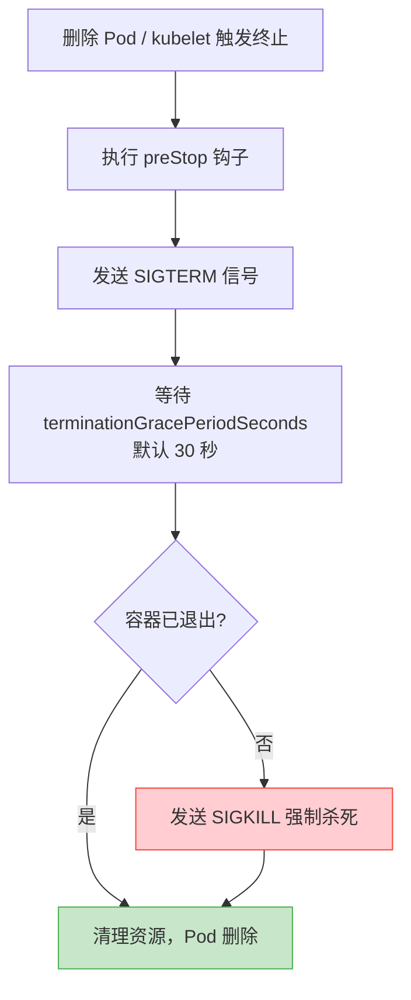

```yaml
# 配置优雅终止
apiVersion: v1
kind: Pod
metadata:
  name: graceful-shutdown
spec:
  terminationGracePeriodSeconds: 60    # 优雅终止等待时间
  containers:
  - name: app
    image: myapp:latest
    lifecycle:
      preStop:
        exec:
          # 先从负载均衡注销，等 15 秒让在途请求完成
          command: ["/bin/sh", "-c", "curl -X POST http://registry/deregister; sleep 15"]
```

---

## Init Container

Init Container 在主容器启动前执行，用于初始化工作。

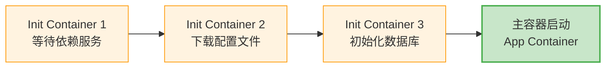

```yaml
apiVersion: v1
kind: Pod
metadata:
  name: init-container-demo
spec:
  initContainers:
  # Init Container 1: 等待数据库就绪
  - name: wait-for-db
    image: busybox:1.36
    command: ["/bin/sh", "-c"]
    args:
    - |
      until nc -z mysql-service 3306; do
        echo "Waiting for MySQL..."
        sleep 2
      done
      echo "MySQL is ready!"

  # Init Container 2: 等待 Redis 就绪
  - name: wait-for-redis
    image: busybox:1.36
    command: ["/bin/sh", "-c"]
    args:
    - |
      until nc -z redis-service 6379; do
        echo "Waiting for Redis..."
        sleep 2
      done
      echo "Redis is ready!"

  # Init Container 3: 从 ConfigMap 复制配置
  - name: setup-config
    image: busybox:1.36
    command: ["/bin/sh", "-c"]
    args:
    - |
      cp /config-readonly/app.json /config/app.json
      echo "Config initialized"
    volumeMounts:
    - name: config-readonly
      mountPath: /config-readonly
    - name: config-writable
      mountPath: /config

  containers:
  - name: app
    image: myapp:latest
    volumeMounts:
    - name: config-writable
      mountPath: /app/config

  volumes:
  - name: config-readonly
    configMap:
      name: app-config
  - name: config-writable
    emptyDir: {}
```

**Init Container vs 主容器：**

| 特性 | Init Container | 主容器 |
|------|---------------|--------|
| 执行顺序 | 严格按顺序 | 并行启动 |
| 执行次数 | 只执行一次 | 可重启 |
| 必须成功 | 是，失败则 Pod 失败 | 取决于 restartPolicy |
| 探针支持 | 不支持 | 支持 |
| 端口冲突 | 不考虑 | 同 Pod 内不能冲突 |

::: important Init Container 最佳实践
1. 每个初始化步骤用独立的 Init Container，职责清晰
2. 使用 `kubectl logs <pod> -c <init-container>` 查看日志
3. Init Container 失败后 Pod 会重试（restartPolicy=Always 时）
4. 不要在 Init Container 中运行长时间任务
:::

---

## Sidecar 模式

Sidecar 是辅助容器，与主容器协同工作。

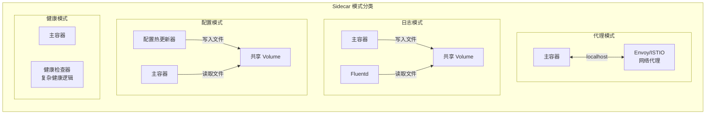

```yaml
# Sidecar 模式：配置热更新
apiVersion: v1
kind: Pod
metadata:
  name: config-reload-sidecar
spec:
  containers:
  - name: app
    image: myapp:latest
    volumeMounts:
    - name: config
      mountPath: /app/config
    env:
    - name: CONFIG_PATH
      value: /app/config/app.json

  - name: config-reloader
    image: kiwigrid/k8s-configmap-reload:latest
    args:
    - --volume-dir=/config
    - --webhook-url=http://localhost:8080/reload
    volumeMounts:
    - name: config
      mountPath: /config
      readOnly: true

  volumes:
  - name: config
    configMap:
      name: app-config
```

---

## 探针（Probes）

探针是 K8s 对容器健康检查的机制。

### 三种探针

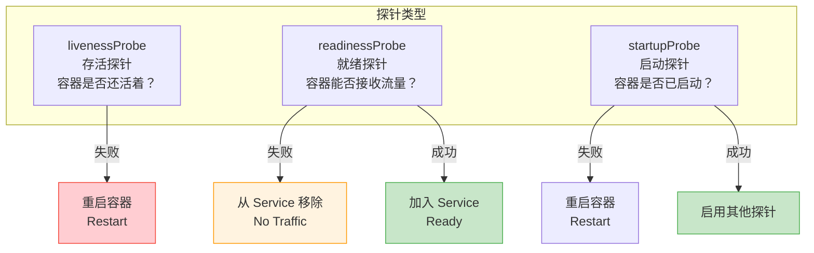

| 探针 | 失败后果 | 用途 |
|------|----------|------|
| **livenessProbe** | 重启容器 | 检测死锁、无法恢复的故障 |
| **readinessProbe** | 从 Service 摘除 | 检测是否可以接收流量 |
| **startupProbe** | 重启容器 | 慢启动应用的启动检测 |

### 探针配置

```yaml
apiVersion: v1
kind: Pod
metadata:
  name: probes-demo
spec:
  containers:
  - name: app
    image: myapp:latest
    ports:
    - containerPort: 8080

    # 启动探针：给应用足够的启动时间
    # startupProbe 成功后，livenessProbe 和 readinessProbe 才开始工作
    startupProbe:
      httpGet:
        path: /health/startup
        port: 8080
      failureThreshold: 30     # 允许失败 30 次
      periodSeconds: 10        # 每 10 秒检查一次
      # 总启动时间 = 30 × 10 = 300 秒（5 分钟）

    # 存活探针：检测不可恢复的故障
    livenessProbe:
      httpGet:
        path: /health/live
        port: 8080
      initialDelaySeconds: 0   # startupProbe 完成后立即开始
      periodSeconds: 10        # 每 10 秒检查
      failureThreshold: 3      # 连续失败 3 次重启
      successThreshold: 1      # 成功 1 次即认为存活
      timeoutSeconds: 5        # 超时时间

    # 就绪探针：检测是否可以接收流量
    readinessProbe:
      httpGet:
        path: /health/ready
        port: 8080
      initialDelaySeconds: 0
      periodSeconds: 5         # 更频繁检查，快速感知就绪
      failureThreshold: 3
      successThreshold: 1
      timeoutSeconds: 3
```

### 探针类型

| 类型 | 配置 | 适用场景 |
|------|------|----------|
| **httpGet** | `path` + `port` | HTTP 应用（最常用） |
| **tcpSocket** | `port` | 非 HTTP 应用（数据库、Redis） |
| **exec** | `command` | 需要执行命令检查 |
| **gRPC** | `port` + `service` | gRPC 应用（K8s 1.24+） |

```yaml
# 不同探针类型示例

# HTTP GET
livenessProbe:
  httpGet:
    path: /healthz
    port: 8080
    httpHeaders:
    - name: X-Custom-Header
      value: health-check

# TCP Socket（适用于数据库）
livenessProbe:
  tcpSocket:
    port: 3306

# Exec（适用于需要执行命令的场景）
livenessProbe:
  exec:
    command:
    - /bin/sh
    - -c
    - pg_isready -h localhost -p 5432

# gRPC（K8s 1.24+）
livenessProbe:
  grpc:
    port: 9090
    service: "package.ServiceName"   # 可选
```

::: warning 探针避坑指南
1. **livenessProbe 不要检查外部依赖**：数据库挂了不应该重启应用，重启也没用
2. **readinessProbe 比 livenessProbe 更重要**：流量控制比重启更温和
3. **慢启动应用必须用 startupProbe**：否则 livenessProbe 在启动期间就杀容器
4. **initialDelaySeconds 在 startupProbe 存在时设为 0**：让 startupProbe 负责等待
5. **不要把探针端点搞重了**：探针每几秒调一次，太重会拖垮应用
:::

### .NET 应用探针配置

```yaml
# ASP.NET Core 健康检查 + K8s 探针
apiVersion: v1
kind: Pod
metadata:
  name: dotnet-probes
spec:
  containers:
  - name: app
    image: myapp:latest
    ports:
    - containerPort: 8080
    startupProbe:
      httpGet:
        path: /health
        port: 8080
      failureThreshold: 30
      periodSeconds: 10
    livenessProbe:
      httpGet:
        path: /health/live
        port: 8080
      periodSeconds: 10
      failureThreshold: 3
    readinessProbe:
      httpGet:
        path: /health/ready
        port: 8080
      periodSeconds: 5
      failureThreshold: 3
```

```csharp
// Program.cs - ASP.NET Core 健康检查配置
builder.Services.AddHealthChecks()
    .AddCheck("self", () => HealthCheckResult.Healthy(), tags: new[] { "live" })
    .AddNpgSql(builder.Configuration.GetConnectionString("Postgres"), tags: new[] { "ready" })
    .AddRedis(builder.Configuration.GetConnectionString("Redis"), tags: new[] { "ready" })
    .AddRabbitMQ(builder.Configuration.GetConnectionString("RabbitMQ"), tags: new[] { "ready" });

app.MapHealthChecks("/health", new HealthCheckOptions
{
    Predicate = _ => true,
    ResponseWriter = UIResponseWriter.WriteHealthCheckUIResponse
});

app.MapHealthChecks("/health/live", new HealthCheckOptions
{
    Predicate = check => check.Tags.Contains("live")
});

app.MapHealthChecks("/health/ready", new HealthCheckOptions
{
    Predicate = check => check.Tags.Contains("ready")
});
```

---

## Pod QoS 等级

K8s 根据资源请求和限制的设置，将 Pod 分为三个 QoS 等级。

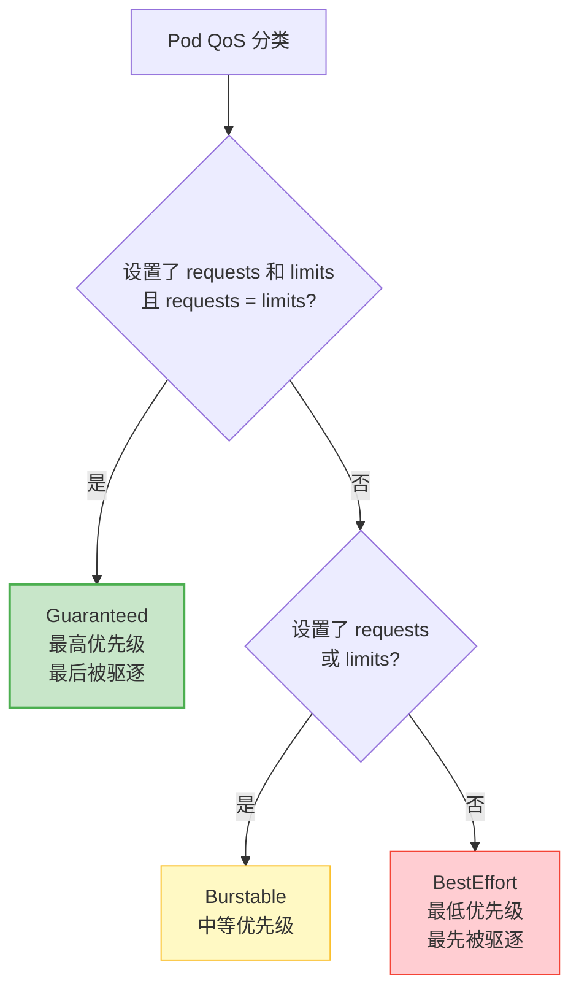

| QoS 等级 | 条件 | 驱逐顺序 | OOM 行为 |
|----------|------|----------|----------|
| **Guaranteed** | requests = limits（CPU+内存） | 最后 | 超出 limits 才 OOM |
| **Burstable** | 至少设了 requests | 中间 | 超出 limits 可能 OOM |
| **BestEffort** | 都没设 | 最先 | 节点内存不足先杀 |

```yaml
# Guaranteed：requests 和 limits 完全一致
apiVersion: v1
kind: Pod
metadata:
  name: guaranteed-pod
spec:
  containers:
  - name: app
    image: nginx
    resources:
      requests:
        cpu: "1"
        memory: 512Mi
      limits:
        cpu: "1"
        memory: 512Mi    # requests = limits → Guaranteed

---
# Burstable：设置了 requests 但 limits 更高
apiVersion: v1
kind: Pod
metadata:
  name: burstable-pod
spec:
  containers:
  - name: app
    image: nginx
    resources:
      requests:
        cpu: 500m
        memory: 256Mi
      limits:
        cpu: "2"
        memory: 1Gi      # requests ≠ limits → Burstable

---
# BestEffort：什么都没设
apiVersion: v1
kind: Pod
metadata:
  name: besteffort-pod
spec:
  containers:
  - name: app
    image: nginx
    # 没有 resources → BestEffort
```

::: important 生产环境铁律
**所有生产 Pod 至少是 Burstable，关键服务必须是 Guaranteed。**

BestEffort Pod 在节点资源不足时第一个被杀，而且无法被调度器正确评估资源需求。这相当于在高速上开车不系安全带。
:::

---

## Deployment

Deployment 是 K8s 中最常用的工作负载，用于管理无状态应用。

### Deployment 架构

```
Deployment 的层次关系：

Deployment
  └── ReplicaSet (revision 1)
        ├── Pod (nginx-7d64c5f9b8-abc12)
        ├── Pod (nginx-7d64c5f9b8-def34)
        └── Pod (nginx-7d64c5f9b8-ghi56)

更新镜像后：

Deployment
  ├── ReplicaSet (revision 2, replicas=3) ← 新
  │     ├── Pod (nginx-6f8b9c7d4e-jkl78)
  │     ├── Pod (nginx-6f8b9c7d4e-mno90)
  │     └── Pod (nginx-6f8b9c7d4e-pqr12)
  └── ReplicaSet (revision 1, replicas=0) ← 旧（保留用于回滚）
```

### Deployment 完整示例

```yaml
apiVersion: apps/v1
kind: Deployment
metadata:
  name: nginx-deployment
  namespace: production
  labels:
    app: nginx
    version: v1
spec:
  replicas: 3
  revisionHistoryLimit: 10      # 保留 10 个历史版本
  progressDeadlineSeconds: 600  # 部署超时 10 分钟
  minReadySeconds: 5            # Pod 就绪 5 秒后才认为可用

  selector:
    matchLabels:
      app: nginx                # 必须与 template.labels 匹配

  strategy:
    type: RollingUpdate
    rollingUpdate:
      maxSurge: 25%             # 滚动更新时最多多出 25% Pod
      maxUnavailable: 25%       # 滚动更新时最多 25% Pod 不可用

  template:
    metadata:
      labels:
        app: nginx
        version: v1
    spec:
      terminationGracePeriodSeconds: 60
      containers:
      - name: nginx
        image: nginx:1.25
        ports:
        - containerPort: 80
          protocol: TCP

        resources:
          requests:
            cpu: 100m
            memory: 128Mi
          limits:
            cpu: 500m
            memory: 512Mi

        env:
        - name: ENV
          valueFrom:
            configMapKeyRef:
              name: nginx-config
              key: environment

        livenessProbe:
          httpGet:
            path: /
            port: 80
          periodSeconds: 10
          failureThreshold: 3

        readinessProbe:
          httpGet:
            path: /
            port: 80
          initialDelaySeconds: 5
          periodSeconds: 5

        volumeMounts:
        - name: config
          mountPath: /etc/nginx/conf.d
          readOnly: true

      volumes:
      - name: config
        configMap:
          name: nginx-config
```

### 滚动更新流程

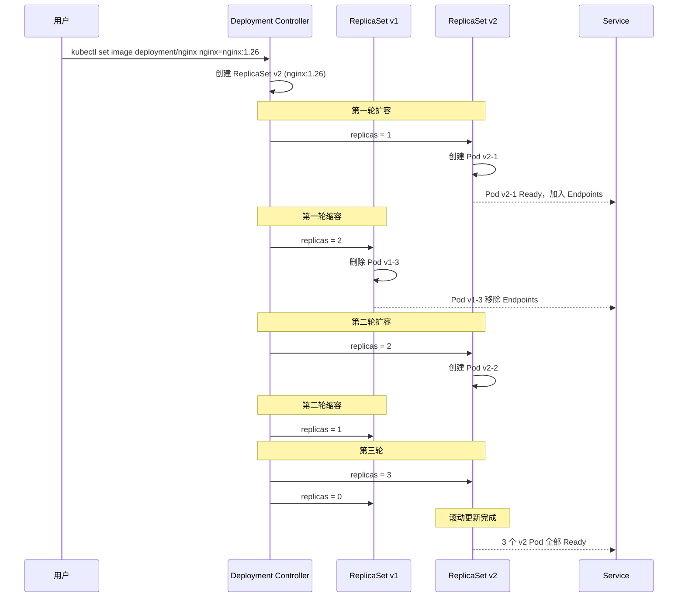

### 更新策略

```yaml
# 滚动更新（默认，推荐）
strategy:
  type: RollingUpdate
  rollingUpdate:
    maxSurge: 25%            # 可以是数字或百分比
    maxUnavailable: 25%

# 重建更新（有停机时间）
strategy:
  type: Recreate
  # 先杀掉所有旧 Pod，再创建新 Pod
  # 适用于不支持同时运行多版本的应用
```

**maxSurge 和 maxUnavailable 的计算：**

```
replicas = 4, maxSurge = 25%, maxUnavailable = 25%

最大 Pod 数 = 4 + 4 × 25% = 5
最小可用 Pod 数 = 4 - 4 × 25% = 3

更新过程：
旧 RS: 4 → 3 → 2 → 1 → 0
新 RS: 0 → 1 → 2 → 3 → 4
始终有 3-4 个 Pod 可用
```

### 回滚

```bash
# 查看部署历史
kubectl rollout history deployment/nginx-deployment

# 输出
# REVISION  CHANGE-CAUSE
# 1         kubectl apply --filename=deployment.yaml --record=true
# 2         kubectl set image deployment/nginx nginx=nginx:1.26

# 查看特定版本详情
kubectl rollout history deployment/nginx-deployment --revision=1

# 回滚到上一版本
kubectl rollout undo deployment/nginx-deployment

# 回滚到指定版本
kubectl rollout undo deployment/nginx-deployment --to-revision=1

# 查看回滚状态
kubectl rollout status deployment/nginx-deployment

# 暂停滚动更新（用于金丝雀发布）
kubectl rollout pause deployment/nginx-deployment

# 恢复滚动更新
kubectl rollout resume deployment/nginx-deployment
```

### 扩缩容

```bash
# 手动扩缩容
kubectl scale deployment/nginx-deployment --replicas=5

# 基于 CPU 自动扩缩容
kubectl autoscale deployment nginx-deployment --min=2 --max=10 --cpu-percent=80
```

---

## StatefulSet

StatefulSet 用于管理有状态应用，提供稳定的网络标识和持久化存储。

### Deployment vs StatefulSet

| 特性 | Deployment | StatefulSet |
|------|-----------|-------------|
| Pod 名称 | 随机后缀 | 有序编号（mysql-0, mysql-1） |
| 网络标识 | 不稳定 | 稳定 DNS（mysql-0.mysql.default.svc.cluster.local） |
| 存储 | 共享或临时 | 每个 Pod 独立 PVC |
| 启动顺序 | 并行 | 有序（0→1→2） |
| 更新策略 | 滚动更新 | 有序滚动 / OnDelete |
| 典型应用 | Web、API | 数据库、MQ、ZooKeeper |

### StatefulSet 完整示例

```yaml
# Headless Service（StatefulSet 必须）
apiVersion: v1
kind: Service
metadata:
  name: mysql
  labels:
    app: mysql
spec:
  clusterIP: None              # Headless！
  ports:
  - port: 3306
    name: mysql
  selector:
    app: mysql
---
apiVersion: apps/v1
kind: StatefulSet
metadata:
  name: mysql
spec:
  serviceName: mysql           # 必须关联 Headless Service
  replicas: 3
  podManagementPolicy: OrderedReady  # 有序创建（默认）

  selector:
    matchLabels:
      app: mysql

  updateStrategy:
    type: RollingUpdate
    rollingUpdate:
      partition: 0             # 从 partition 编号开始更新

  template:
    metadata:
      labels:
        app: mysql
    spec:
      terminationGracePeriodSeconds: 120
      containers:
      - name: mysql
        image: mysql:8.0
        ports:
        - containerPort: 3306
          name: mysql

        resources:
          requests:
            cpu: 500m
            memory: 1Gi
          limits:
            cpu: "2"
            memory: 4Gi

        env:
        - name: MYSQL_ROOT_PASSWORD
          valueFrom:
            secretKeyRef:
              name: mysql-secret
              key: root-password

        volumeMounts:
        - name: data
          mountPath: /var/lib/mysql
        - name: config
          mountPath: /etc/mysql/conf.d

        livenessProbe:
          exec:
            command:
            - mysqladmin
            - ping
            - -h
            - localhost
          periodSeconds: 10
          failureThreshold: 3

        readinessProbe:
          exec:
            command:
            - mysql
            - -h
            - localhost
            - -e
            - "SELECT 1"
          periodSeconds: 5
          failureThreshold: 3

      volumes:
      - name: config
        configMap:
          name: mysql-config

  # VolumeClaimTemplate：每个 Pod 独立的 PVC
  volumeClaimTemplates:
  - metadata:
      name: data
    spec:
      accessModes: ["ReadWriteOnce"]
      storageClassName: standard
      resources:
        requests:
          storage: 50Gi
```

### StatefulSet 有序部署

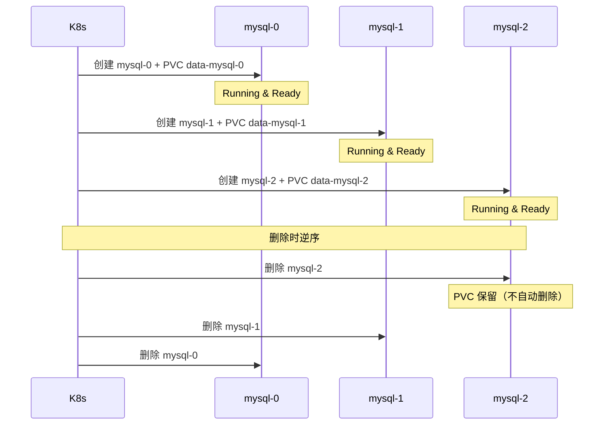

**StatefulSet 稳定标识：**

```bash
# Pod DNS 名称
# <pod-name>.<service-name>.<namespace>.svc.cluster.local

mysql-0.mysql.default.svc.cluster.local
mysql-1.mysql.default.svc.cluster.local
mysql-2.mysql.default.svc.cluster.local

# 即使 Pod 重建，DNS 名称不变
# PVC 与 Pod 绑定，重建后自动重新挂载
```

::: important StatefulSet 的核心价值
1. **稳定的网络标识**：mysql-0 永远是 mysql-0，重启也不变
2. **稳定的持久化存储**：PVC 与 Pod 绑定，重建后自动挂回原来的存储
3. **有序的部署和终止**：先启动 mysql-0 再启动 mysql-1，保证主从关系
4. **有序的滚动更新**：从最大编号开始更新，先更新 mysql-2 再更新 mysql-1
:::

---

## DaemonSet

DaemonSet 确保每个（或特定）节点上运行一个 Pod 副本。

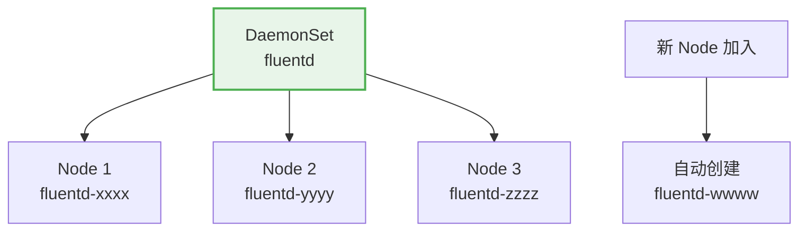

```yaml
apiVersion: apps/v1
kind: DaemonSet
metadata:
  name: fluentd
  namespace: kube-system
  labels:
    app: fluentd
spec:
  selector:
    matchLabels:
      app: fluentd

  updateStrategy:
    type: RollingUpdate
    rollingUpdate:
      maxUnavailable: 1        # 每次最多 1 个节点同时更新

  template:
    metadata:
      labels:
        app: fluentd
    spec:
      tolerations:              # 容忍所有污点，包括 Master
      - key: node-role.kubernetes.io/control-plane
        effect: NoSchedule
      - key: node-role.kubernetes.io/master
        effect: NoSchedule

      serviceAccountName: fluentd
      containers:
      - name: fluentd
        image: fluent/fluentd:v1.16
        resources:
          limits:
            cpu: 200m
            memory: 256Mi
          requests:
            cpu: 100m
            memory: 128Mi

        volumeMounts:
        - name: varlog
          mountPath: /var/log
        - name: containers
          mountPath: /var/lib/docker/containers
          readOnly: true

      volumes:
      - name: varlog
        hostPath:
          path: /var/log
      - name: containers
        hostPath:
          path: /var/lib/docker/containers
```

**DaemonSet 典型场景：**

| 场景 | 示例 |
|------|------|
| 日志采集 | Fluentd、Filebeat |
| 监控代理 | Prometheus Node Exporter、Datadog Agent |
| 网络插件 | Calico、Cilium（以 DaemonSet 运行） |
| 存储代理 | CSI Node Driver |
| 安全防护 | Falco、安全 Agent |

---

## Job 与 CronJob

### Job

Job 运行一次性任务，保证成功完成指定次数。

```yaml
apiVersion: batch/v1
kind: Job
metadata:
  name: data-migration
spec:
  completions: 1               # 需要成功完成 1 次
  parallelism: 1               # 并行度 1
  backoffLimit: 6              # 失败重试次数
  activeDeadlineSeconds: 3600  # 最长运行 1 小时
  ttlSecondsAfterFinished: 86400  # 完成后 24 小时清理

  template:
    spec:
      restartPolicy: Never     # Job 只能用 Never 或 OnFailure
      containers:
      - name: migration
        image: myapp:migrate-v2
        command: ["dotnet", "MyApp.Migration.dll"]
        env:
        - name: ConnectionStrings__Default
          valueFrom:
            secretKeyRef:
              name: db-secret
              key: connection-string
```

**Job 模式：**

| 模式 | completions | parallelism | 说明 |
|------|-------------|-------------|------|
| 单次任务 | 1 | 1 | 运行一次，完成即结束 |
| 固定完成数 | N | M | N 个任务，M 个并行 |
| 工作队列 | 1 | N | N 个 Pod 竞争消费队列 |

```yaml
# 固定完成数模式：5 个任务，2 个并行
apiVersion: batch/v1
kind: Job
metadata:
  name: batch-process
spec:
  completions: 5
  parallelism: 2
  template:
    spec:
      restartPolicy: OnFailure
      containers:
      - name: processor
        image: batch-processor:latest
        command: ["python", "process.py"]
```

### CronJob

CronJob 按时间表定期运行 Job。

```yaml
apiVersion: batch/v1
kind: CronJob
metadata:
  name: daily-backup
spec:
  schedule: "0 2 * * *"           # 每天凌晨 2 点
  timeZone: "Asia/Shanghai"        # K8s 1.27+ 支持时区
  startingDeadlineSeconds: 200     # 启动超时
  concurrencyPolicy: Forbid        # 禁止并发执行
  successfulJobsHistoryLimit: 3    # 保留 3 个成功 Job
  failedJobsHistoryLimit: 1        # 保留 1 个失败 Job
  suspend: false                   # 是否暂停

  jobTemplate:
    spec:
      backoffLimit: 3
      ttlSecondsAfterFinished: 86400
      template:
        spec:
          restartPolicy: OnFailure
          containers:
          - name: backup
            image: backup-tool:latest
            command: ["/bin/sh", "-c"]
            args:
            - |
              echo "Starting backup at $(date)"
              pg_dump -h postgres-service -U admin mydb > /backup/mydb_$(date +%Y%m%d).sql
              echo "Backup completed"
            volumeMounts:
            - name: backup
              mountPath: /backup
          volumes:
          - name: backup
            persistentVolumeClaim:
              claimName: backup-pvc
```

**Cron 表达式格式：**

```
┌───────────── 秒（可选）
│ ┌───────────── 分 (0-59)
│ │ ┌───────────── 时 (0-23)
│ │ │ ┌───────────── 日 (1-31)
│ │ │ │ ┌───────────── 月 (1-12)
│ │ │ │ │ ┌───────────── 星期 (0-6)
│ │ │ │ │ │
* * * * * *

常用表达式：
"*/5 * * * *"      每 5 分钟
"0 * * * *"        每小时
"0 2 * * *"        每天凌晨 2 点
"0 0 * * 0"        每周日零点
"0 0 1 * *"        每月 1 日零点
"0 0 1 1 *"        每年 1 月 1 日零点
```

**concurrencyPolicy 选项：**

| 策略 | 行为 |
|------|------|
| `Allow` | 允许并发（默认） |
| `Forbid` | 如果上一次还没完成，跳过本次 |
| `Replace` | 如果上一次还没完成，替换它 |

::: warning CronJob 注意事项
1. CronJob 的 `schedule` 基于 kube-controller-manager 的时间，注意时区
2. `concurrencyPolicy: Forbid` 是生产环境常用配置，避免备份任务重叠
3. 必须设置 `successfulJobsHistoryLimit`，否则 Job 会无限累积
4. CronJob 精度在 1 分钟左右，不适合秒级调度
:::

---

## ReplicaSet 与 HPA

### ReplicaSet

ReplicaSet 是 Deployment 的底层，负责维护 Pod 副本数。一般不直接使用 ReplicaSet，而是通过 Deployment 管理。

```yaml
# ReplicaSet 示例（通常不直接创建，由 Deployment 管理）
apiVersion: apps/v1
kind: ReplicaSet
metadata:
  name: nginx-rs
spec:
  replicas: 3
  selector:
    matchLabels:
      app: nginx
  template:
    metadata:
      labels:
        app: nginx
    spec:
      containers:
      - name: nginx
        image: nginx:1.25
```

### HPA（Horizontal Pod Autoscaler）

HPA 根据 CPU/内存/自定义指标自动扩缩容。

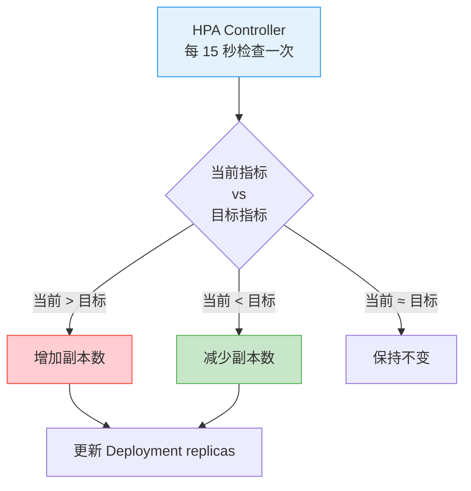

```yaml
# 基于 CPU 使用率自动扩缩容
apiVersion: autoscaling/v2
kind: HorizontalPodAutoscaler
metadata:
  name: nginx-hpa
spec:
  scaleTargetRef:
    apiVersion: apps/v1
    kind: Deployment
    name: nginx-deployment
  minReplicas: 2
  maxReplicas: 10
  metrics:
  - type: Resource
    resource:
      name: cpu
      target:
        type: Utilization
        averageUtilization: 80     # CPU 使用率超过 80% 扩容

  - type: Resource
    resource:
      name: memory
      target:
        type: Utilization
        averageUtilization: 80     # 内存使用率超过 80% 扩容

  behavior:
    scaleUp:
      stabilizationWindowSeconds: 0
      policies:
      - type: Percent
        value: 100                 # 最多翻倍
        periodSeconds: 60
    scaleDown:
      stabilizationWindowSeconds: 300  # 缩容冷静期 5 分钟
      policies:
      - type: Percent
        value: 10                  # 每分钟最多缩 10%
        periodSeconds: 60
```

```bash
# HPA 操作
kubectl get hpa
kubectl describe hpa nginx-hpa

# 查看扩缩容事件
kubectl get events --field-selector reason=Scaled
```

**HPA 扩缩容算法：**

```
期望副本数 = ceil(当前副本数 × (当前指标值 / 目标指标值))

示例：
当前 3 副本，CPU 使用率 160%，目标 80%
期望副本数 = ceil(3 × 160/80) = ceil(6) = 6
```

::: important HPA 前提条件
1. **必须设置 resources.requests.cpu**：HPA 基于请求值计算使用率
2. **必须安装 metrics-server**：`kubectl top pods` 能用才说明 metrics-server 正常
3. **注意冷却时间**：扩容可以激进，缩容必须保守（默认 5 分钟冷静期）
4. **不要和手动 scale 混用**：HPA 会覆盖手动设置的副本数
:::

```bash
# 安装 metrics-server
kubectl apply -f https://github.com/kubernetes-sigs/metrics-server/releases/latest/download/components.yaml

# 如果是自签名证书，需要添加参数
kubectl patch deployment metrics-server -n kube-system --type=json \
  -p='[{"op":"add","path":"/spec/template/spec/containers/0/args/-","value":"--kubelet-insecure-tls"}]'

# 验证
kubectl top nodes
kubectl top pods
```

---

## 完整实战：部署 .NET 应用

将一个 ASP.NET Core 应用完整部署到 K8s。

```yaml
# 1. ConfigMap
apiVersion: v1
kind: ConfigMap
metadata:
  name: myapp-config
data:
  ASPNETCORE_ENVIRONMENT: "Production"
  Logging__LogLevel__Default: "Information"
  ConnectionStrings__Redis: "redis-service:6379"
---
# 2. Secret
apiVersion: v1
kind: Secret
metadata:
  name: myapp-secret
type: Opaque
stringData:
  ConnectionStrings__Postgres: "Host=postgres-service;Database=myapp;Username=admin;Password=S3cret!"
  JwtSettings__SecretKey: "your-256-bit-secret-key-here"
---
# 3. Deployment
apiVersion: apps/v1
kind: Deployment
metadata:
  name: myapp
  labels:
    app: myapp
    version: v1
spec:
  replicas: 3
  selector:
    matchLabels:
      app: myapp
  strategy:
    type: RollingUpdate
    rollingUpdate:
      maxSurge: 1
      maxUnavailable: 0         # 零停机
  template:
    metadata:
      labels:
        app: myapp
        version: v1
    spec:
      terminationGracePeriodSeconds: 60
      containers:
      - name: myapp
        image: registry.example.com/myapp:v1.0.0
        ports:
        - containerPort: 8080

        resources:
          requests:
            cpu: 250m
            memory: 256Mi
          limits:
            cpu: "1"
            memory: 512Mi

        envFrom:
        - configMapRef:
            name: myapp-config
        - secretRef:
            name: myapp-secret

        startupProbe:
          httpGet:
            path: /health
            port: 8080
          failureThreshold: 30
          periodSeconds: 10

        livenessProbe:
          httpGet:
            path: /health/live
            port: 8080
          periodSeconds: 10
          failureThreshold: 3

        readinessProbe:
          httpGet:
            path: /health/ready
            port: 8080
          periodSeconds: 5
          failureThreshold: 3

        lifecycle:
          preStop:
            exec:
              command: ["/bin/sh", "-c", "sleep 10"]

        volumeMounts:
        - name: tmp
          mountPath: /tmp

      volumes:
      - name: tmp
        emptyDir: {}
---
# 4. Service
apiVersion: v1
kind: Service
metadata:
  name: myapp-service
spec:
  selector:
    app: myapp
  ports:
  - port: 80
    targetPort: 8080
  type: ClusterIP
---
# 5. HPA
apiVersion: autoscaling/v2
kind: HorizontalPodAutoscaler
metadata:
  name: myapp-hpa
spec:
  scaleTargetRef:
    apiVersion: apps/v1
    kind: Deployment
    name: myapp
  minReplicas: 3
  maxReplicas: 10
  metrics:
  - type: Resource
    resource:
      name: cpu
      target:
        type: Utilization
        averageUtilization: 70
  behavior:
    scaleDown:
      stabilizationWindowSeconds: 300
```

```bash
# 部署
kubectl apply -f myapp-deployment.yaml

# 验证
kubectl get pods -l app=myapp
kubectl get svc myapp-service
kubectl get hpa myapp-hpa

# 测试访问
kubectl port-forward svc/myapp-service 8080:80
curl http://localhost:8080/health

# 查看滚动更新状态
kubectl rollout status deployment/myapp

# 模拟更新
kubectl set image deployment/myapp myapp=registry.example.com/myapp:v1.1.0

# 查看更新历史
kubectl rollout history deployment/myapp
```

---

## 工作负载选型决策树

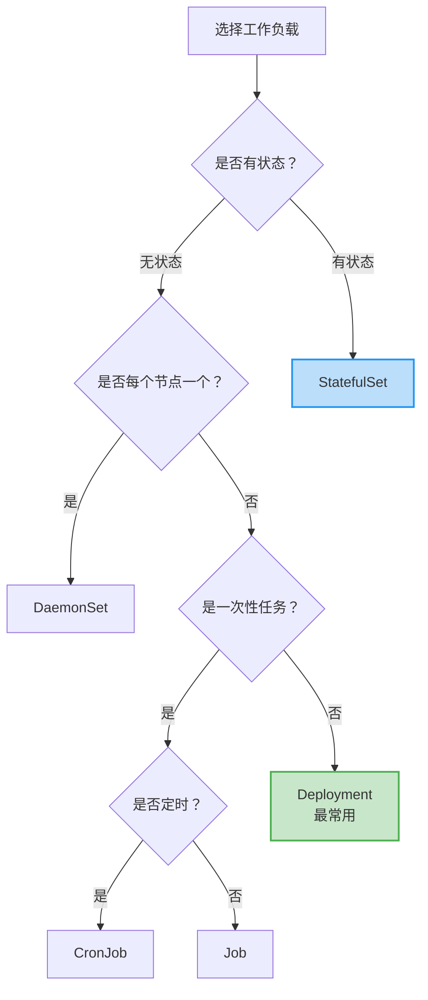

| 工作负载 | 典型应用 | 核心特征 |
|----------|----------|----------|
| **Deployment** | Web、API、微服务 | 无状态、弹性伸缩、滚动更新 |
| **StatefulSet** | 数据库、MQ、ZooKeeper | 稳定标识、有序部署、独立存储 |
| **DaemonSet** | 日志、监控、网络插件 | 每节点一个 |
| **Job** | 数据迁移、批处理 | 一次性，保证完成 |
| **CronJob** | 定时备份、报表 | 定时触发 Job |

---

## 常见问题排查

### Pod 一直 ContainerCreating

```bash
# 查看事件
kubectl describe pod <pod-name>

# 常见原因
# 1. 镜像拉取失败
#   Failed to pull image "myapp:latest": rpc error: code = Unknown

# 2. PVC 挂载失败
#   Unable to mount volumes for pod: timeout expired waiting for volumes

# 3. CNI 网络未就绪
#   NetworkPlugin cni failed to set up pod

# 解决方案
# 1. 检查镜像是否存在，私有仓库需要 imagePullSecrets
# 2. 检查 PVC 是否绑定：kubectl get pvc
# 3. 检查 CNI Pod：kubectl get pods -n kube-system
```

### Deployment 更新卡住

```bash
# 查看更新状态
kubectl rollout status deployment/nginx

# 查看 ReplicaSet
kubectl get rs -l app=nginx

# 常见原因
# 1. 新 Pod 就绪探针失败 → readinessProbe 检查
# 2. 镜像拉取卡住 → 检查镜像仓库网络
# 3. 资源不足 → 新 Pod 无法调度

# 紧急回滚
kubectl rollout undo deployment/nginx
```

### StatefulSet Pod 卡住

```bash
# StatefulSet 是有序的，一个 Pod 卡住后面的都不创建
kubectl get pods -l app=mysql -w

# 常见原因
# 1. mysql-0 的 readinessProbe 失败
# 2. mysql-0 的 PVC 无法绑定

# 临时解决：删除卡住的 Pod
kubectl delete pod mysql-0
# StatefulSet 会重新创建
```

### HPA 无法获取指标

```bash
# 检查 metrics-server
kubectl get pods -n kube-system -l k8s-app=metrics-server
kubectl logs -n kube-system -l k8s-app=metrics-server

# 检查是否可以获取指标
kubectl top pods
kubectl top nodes

# 如果 metrics-server 正常但 HPA 异常
kubectl describe hpa myapp-hpa
# 常见：Pod 没有设置 resources.requests.cpu
```

---

## 总结

| 概念 | 核心要点 |
|------|----------|
| **Pod** | 最小调度单元，Pause 容器持有网络，容器间共享网络和存储 |
| **Init Container** | 主容器前顺序执行，用于等待依赖和初始化 |
| **探针** | startup 探启动、liveness 探存活、readiness 探就绪 |
| **QoS** | Guaranteed > Burstable > BestEffort，生产至少 Burstable |
| **Deployment** | 无状态应用首选，滚动更新 + 回滚 + 扩缩容 |
| **StatefulSet** | 有状态应用，稳定标识 + 独立存储 + 有序部署 |
| **DaemonSet** | 每节点一个，日志/监控/网络插件 |
| **Job/CronJob** | 一次性/定时任务，保证完成 |
| **HPA** | 自动扩缩容，前提是设置 resources 和 metrics-server |

::: important 下一步
了解了工作负载，接下来看 [Service 与 Ingress](03_Service与Ingress.md) —— 学习如何把应用暴露给外部流量。
:::
