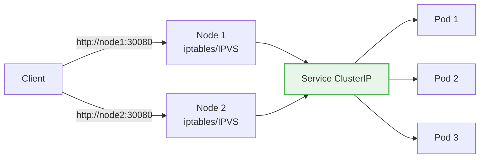
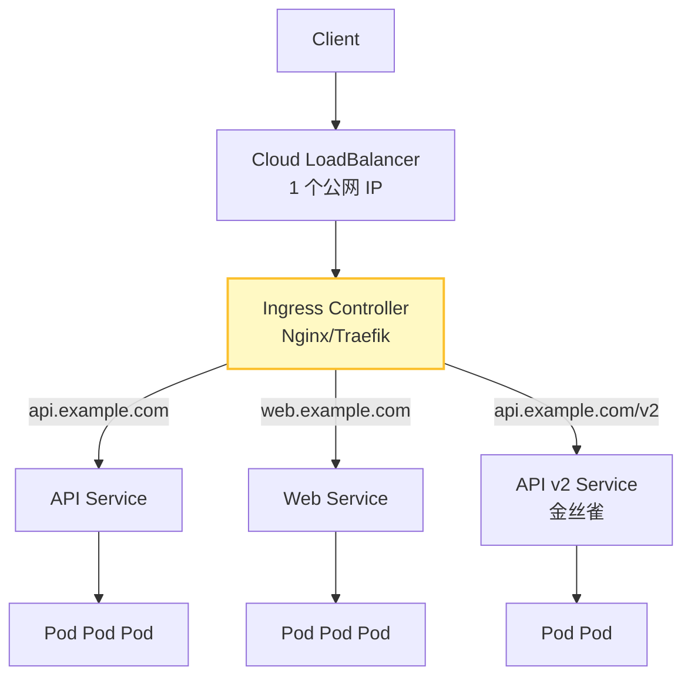
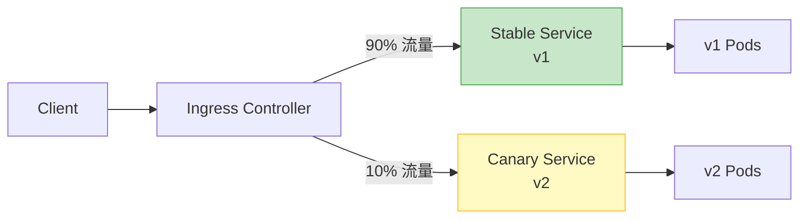
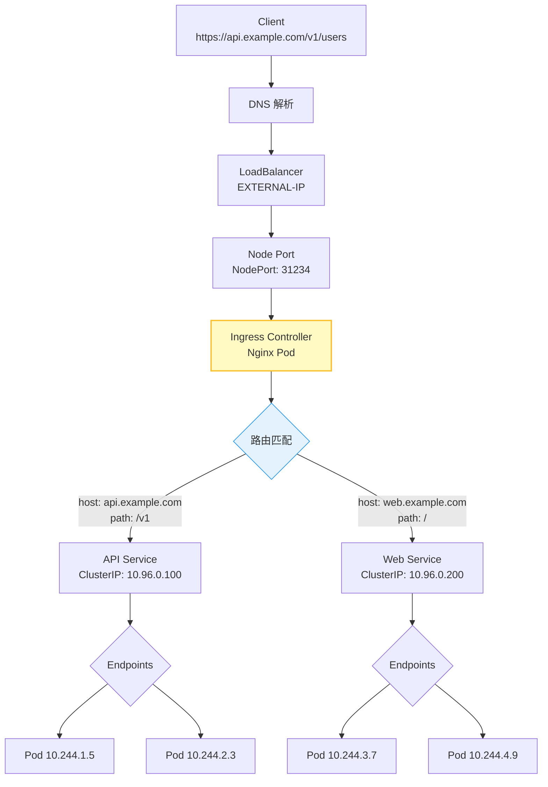
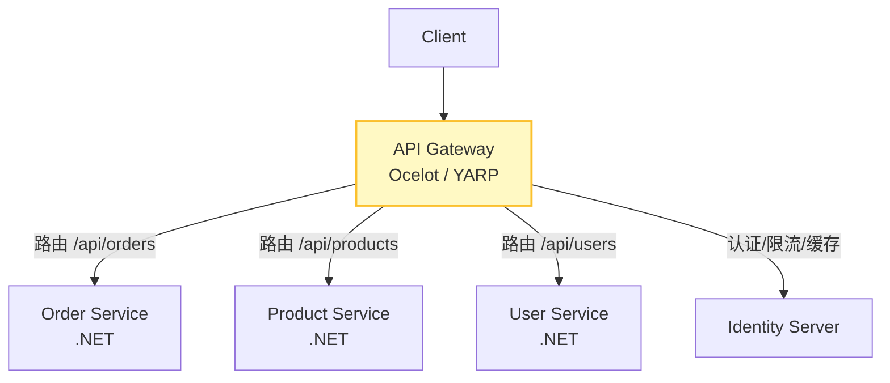
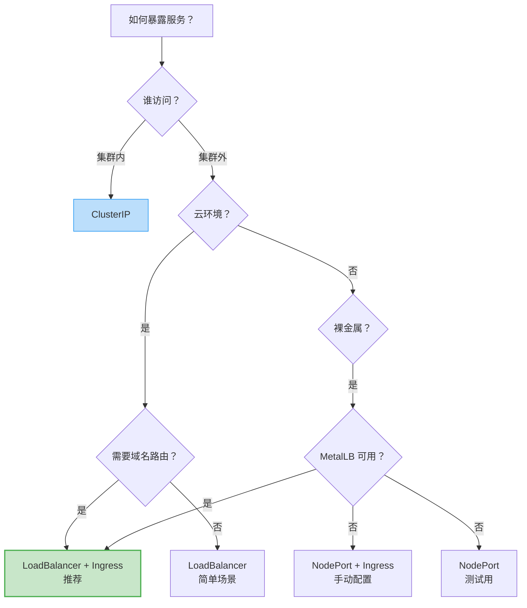

# Service 与 Ingress

Pod 是短暂的，IP 会变。Service 提供稳定的访问入口，Ingress 则是 HTTP 层的智能路由。

---

## 为什么需要 Service

```
没有 Service 的世界：

Client → Pod 10.244.1.5 ✓
Pod 崩溃重启 → Pod 10.244.1.8 ✗（IP 变了）
扩容 → 3 个 Pod，Client 访问哪个？
缩容 → Client 怎么知道哪个 Pod 挂了？

有 Service 的世界：

Client → Service（固定 IP + 固定 DNS）→ 自动负载均衡到 Pod
Pod 崩溃重启 → Service 自动更新 Endpoints
扩缩容 → Service 自动感知
```

::: tip 核心概念
Service 是 Pod 的"门面"。它提供了一个固定的 Cluster IP 和 DNS 名称，并通过 Label Selector 自动维护后端 Pod 列表（Endpoints）。
:::

---

## Service 类型

### 四种类型对比

```mermaid
flowchart TB
    subgraph ClusterIP
        C1["Client（集群内）"] --> C2["Service<br/>ClusterIP: 10.96.0.100"] --> C3["Pod Pod Pod"]
    end

    subgraph NodePort
        N1["Client（集群外）"] --> N2["NodeIP:30080"] --> N3["Service<br/>NodePort"] --> N4["Pod Pod Pod"]
    end

    subgraph LoadBalancer
        L1["Client（公网）"] --> L2["Cloud LB<br/>EXTERNAL-IP"] --> L3["NodePort"] --> L4["Service"] --> L5["Pod Pod Pod"]
    end

    subgraph ExternalName
        E1["Client（集群内）"] --> E2["Service<br/>CNAME → external.db.com"]
    end

    style ClusterIP fill:#e3f2fd,stroke:#2196f3
    style NodePort fill:#fff3e0,stroke:#ff9800
    style LoadBalancer fill:#e8f5e9,stroke:#4caf50
    style ExternalName fill:#f3e5f5,stroke:#9c27b0
```



| 类型 | 访问范围 | 何时使用 |
|------|----------|----------|
| **ClusterIP** | 集群内部 | 微服务间通信（最常用） |
| **NodePort** | 集群外部（端口 30000-32767） | 测试、简单外部访问 |
| **LoadBalancer** | 公网（云环境） | 对外暴露服务（云上首选） |
| **ExternalName** | 集群内映射到外部域名 | 引用外部服务 |

### ClusterIP（默认）

```yaml
apiVersion: v1
kind: Service
metadata:
  name: nginx-service
  namespace: default
spec:
  type: ClusterIP               # 默认值，可省略
  selector:
    app: nginx                   # 匹配 Pod 标签
  ports:
  - name: http
    port: 80                     # Service 端口
    targetPort: 8080             # Pod 端口
    protocol: TCP
  - name: https
    port: 443
    targetPort: 8443
    protocol: TCP

# 集群内访问方式：
# 1. Service IP: curl http://10.96.0.100
# 2. Service DNS: curl http://nginx-service.default.svc.cluster.local
# 3. 短名称（同命名空间）: curl http://nginx-service
```

```bash
# 查看 Service
kubectl get svc nginx-service

# NAME             TYPE        CLUSTER-IP      EXTERNAL-IP   PORT(S)   AGE
# nginx-service    ClusterIP   10.96.0.100     <none>        80/TCP    5m

# 查看 Endpoints（后端 Pod 列表）
kubectl get endpoints nginx-service

# NAME             ENDPOINTS                                      AGE
# nginx-service    10.244.1.5:8080,10.244.2.3:8080,10.244.3.7:8080  5m
```

### NodePort

```yaml
apiVersion: v1
kind: Service
metadata:
  name: nginx-nodeport
spec:
  type: NodePort
  selector:
    app: nginx
  ports:
  - port: 80
    targetPort: 8080
    nodePort: 30080              # 指定 NodePort（可选，不指定则自动分配）

# 访问方式：
# http://<任意节点IP>:30080
# 所有节点都监听 30080 端口，流量转发到后端 Pod
```



::: warning NodePort 限制
1. 端口范围 30000-32767，不直观
2. 每个端口只能对应一个 Service
3. 节点防火墙需要放行端口
4. 不适合生产环境对外暴露，通常作为 LoadBalancer 的底层
:::

### LoadBalancer

```yaml
apiVersion: v1
kind: Service
metadata:
  name: nginx-lb
  annotations:
    # 云厂商特定注解
    service.beta.kubernetes.io/aws-load-balancer-type: "nlb"
    # service.beta.kubernetes.io/azure-load-balancer-internal: "true"
spec:
  type: LoadBalancer
  selector:
    app: nginx
  ports:
  - port: 80
    targetPort: 8080
  loadBalancerIP: 203.0.113.10   # 可选，指定外部 IP（云支持时）
  externalTrafficPolicy: Local    # 保留客户端源 IP

# 云厂商自动创建负载均衡器
# EXTERNAL-IP 会显示 LB 的公网 IP
```

```bash
kubectl get svc nginx-lb

# NAME        TYPE           CLUSTER-IP     EXTERNAL-IP      PORT(S)        AGE
# nginx-lb    LoadBalancer   10.96.0.200   203.0.113.10     80:31234/TCP   2m
```

::: important externalTrafficPolicy
- `Cluster`（默认）：流量可能跨节点转发，SNAT 后丢失源 IP
- `Local`：流量只转发到本节点 Pod，保留源 IP，但负载可能不均

生产环境推荐 `Local` + 均匀分布的 Pod。
:::

### ExternalName

```yaml
apiVersion: v1
kind: Service
metadata:
  name: external-database
spec:
  type: ExternalName
  externalName: database.example.com

# 集群内访问 external-database.default.svc.cluster.local
# DNS 返回 CNAME → database.example.com
# 不产生 ClusterIP，纯 DNS 映射
```

**无选择器 Service（手动管理 Endpoints）：**

```yaml
# 场景：引用集群外的服务（如自建数据库）
apiVersion: v1
kind: Service
metadata:
  name: external-postgres
spec:
  type: ClusterIP
  # 注意：没有 selector
  ports:
  - port: 5432
    targetPort: 5432
---
apiVersion: v1
kind: Endpoints
metadata:
  name: external-postgres    # 必须与 Service 同名
subsets:
- addresses:
  - ip: 192.168.100.50       # 外部数据库 IP
  ports:
  - port: 5432
```

---

## Service 发现机制

### DNS 发现

K8s 内置 CoreDNS，为每个 Service 自动创建 DNS 记录。

```
DNS 命名规则：

<service-name>.<namespace>.svc.<cluster-domain>

完整域名：
nginx-service.default.svc.cluster.local

短名称（同命名空间）：
nginx-service

跨命名空间：
nginx-service.production.svc.cluster.local

Headless Service（返回 Pod IP）：
mysql-0.mysql.default.svc.cluster.local → 10.244.1.5
mysql-1.mysql.default.svc.cluster.local → 10.244.2.3
```

```bash
# 查看 CoreDNS
kubectl get pods -n kube-system -l k8s-app=kube-dns

# 测试 DNS 解析
kubectl run dns-test --image=busybox:1.36 --rm -it --restart=Never -- \
  nslookup nginx-service.default.svc.cluster.local

# 查看 CoreDNS 配置
kubectl get configmap coredns -n kube-system -o yaml
```

**CoreDNS 配置示例：**

```yaml
# CoreDNS Corefile
apiVersion: v1
kind: ConfigMap
metadata:
  name: coredns
  namespace: kube-system
data:
  Corefile: |
    .:53 {
        errors
        health {
            lameduck 5s
        }
        ready
        kubernetes cluster.local in-addr.arpa ip6.arpa {
            pods insecure
            fallthrough in-addr.arpa ip6.arpa
            ttl 30
        }
        prometheus :9153
        forward . /etc/resolv.conf {
            max_concurrent 1000
        }
        cache 30
        loop
        reload
        loadbalance
    }
```

### 环境变量发现

K8s 还会为每个 Service 注入环境变量，但这种方式有严重限制。

```bash
# 在 Pod 中查看 Service 环境变量
kubectl exec myapp-xxx -- env | grep SERVICE

# 输出示例
NGINX_SERVICE_SERVICE_HOST=10.96.0.100
NGINX_SERVICE_SERVICE_PORT=80
NGINX_SERVICE_PORT=tcp://10.96.0.100:80
NGINX_SERVICE_PORT_80_TCP=tcp://10.96.0.100:80
NGINX_SERVICE_PORT_80_TCP_PROTO=tcp
NGINX_SERVICE_PORT_80_TCP_PORT=80
NGINX_SERVICE_PORT_80_TCP_ADDR=10.96.0.100
```

::: warning 环境变量发现的致命缺陷
1. **只看到先创建的 Service**：后创建的 Service 不会注入到先创建的 Pod
2. **格式不友好**：名称被转换，特殊字符替换为下划线
3. **不会更新**：Service 变更后环境变量不变

**结论：永远用 DNS，不要用环境变量做服务发现。**
:::

---

## Endpoints 与 EndpointSlice

### Endpoints

Endpoints 是 Service 自动创建的资源，记录后端 Pod 的 IP 列表。

```bash
kubectl get endpoints nginx-service

# NAME             ENDPOINTS                                      AGE
# nginx-service    10.244.1.5:8080,10.244.2.3:8080,10.244.3.7:8080  5m

kubectl describe endpoints nginx-service

# Name:         nginx-service
# Namespace:    default
# Subsets:
#   Addresses:    10.244.1.5,10.244.2.3,10.244.3.7
#   NotReadyAddresses:  10.244.1.9    # readinessProbe 失败的 Pod
#   Ports:
#     Name  Port  Protocol
#     ----  ----  --------
#     http  8080  TCP
```

### EndpointSlice

EndpointSlice 是 Endpoints 的升级版，解决大规模集群的性能问题。

```
Endpoints 的问题：
- 一个 Service 对应一个 Endpoints 资源
- 1000 个 Pod = 1 个巨大的 Endpoints 对象
- 每次变更，所有节点都要同步完整列表

EndpointSlice 的改进：
- 一个 Service 对应多个 EndpointSlice（默认每片 100 个端点）
- 增量更新，性能好
- 支持多地址族（IPv4 + IPv6）
```

```bash
# 查看 EndpointSlice
kubectl get endpointslices -l kubernetes.io/service-name=nginx-service

# NAME             ADDRESSTYPE   PORTS   ENDPOINTS                   AGE
# nginx-service-xx  IPv4          8080    10.244.1.5,10.244.2.3      5m
# nginx-service-yy  IPv4          8080    10.244.3.7                  5m
```

::: tip 规模参考
- 100 个 Pod 以内：Endpoints 足够
- 100-1000 个 Pod：EndpointSlice 更好
- 1000+ 个 Pod：必须用 EndpointSlice

K8s v1.21+ 默认启用 EndpointSlice。
:::

---

## Headless Service

Headless Service 不分配 ClusterIP，直接返回 Pod IP。常用于 StatefulSet。

```yaml
apiVersion: v1
kind: Service
metadata:
  name: mysql-headless
spec:
  clusterIP: None               # 这就是 Headless！
  selector:
    app: mysql
  ports:
  - port: 3306
    targetPort: 3306
```

```bash
# DNS 查询 Headless Service
# 查询 Service 名称 → 返回所有 Pod IP
nslookup mysql-headless.default.svc.cluster.local
# 10.244.1.5
# 10.244.2.3
# 10.244.3.7

# 查询特定 Pod → 返回该 Pod IP
nslookup mysql-0.mysql-headless.default.svc.cluster.local
# 10.244.1.5

nslookup mysql-1.mysql-headless.default.svc.cluster.local
# 10.244.2.3
```

**Headless Service 使用场景：**

| 场景 | 原因 |
|------|------|
| StatefulSet | 每个 Pod 需要独立的 DNS 名称 |
| 自定义服务发现 | 不需要 K8s 负载均衡，自己实现 |
| 直连特定 Pod | 如连接 MySQL 主库 |
| 外部 DNS 集成 | 与外部 DNS 系统对接 |

---

## Ingress Controller

Ingress 是 K8s 的 HTTP 层路由规则，Ingress Controller 是实现这些规则的组件。

### 为什么需要 Ingress

```
没有 Ingress 的暴露方式：

方式 1: LoadBalancer
  每个 Service 一个 LB → 贵！（云上每个 LB 要钱）

方式 2: NodePort
  端口不直观（30000-32767），不好管理

有 Ingress：

一个 LB + 一个 Ingress Controller → 路由到多个 Service
域名/路径路由、TLS 终止、金丝雀发布全搞定
```



### Ingress Controller 对比

| 特性 | Nginx Ingress | Traefik | HAProxy | Kong |
|------|--------------|---------|---------|------|
| 成熟度 | 最高 | 高 | 高 | 高 |
| 配置方式 | Annotation + CRD | CRD | CRD | CRD + Admin API |
| 性能 | 高 | 高 | 极高 | 高 |
| TCP/UDP | 支持 | 原生 | 原生 | 插件 |
| 金丝雀 | 支持（Annotation） | 原生 | 有限 | 插件 |
| 插件生态 | Lua | Middleware | 有限 | 丰富 |
| 学习曲线 | 低 | 中 | 中 | 高 |
| .NET 友好度 | 最常用 | 常用 | 一般 | 一般 |

### Nginx Ingress Controller 安装

```bash
# 安装 Nginx Ingress Controller
kubectl apply -f https://raw.githubusercontent.com/kubernetes/ingress-nginx/controller-v1.10.0/deploy/static/provider/cloud/deploy.yaml

# 验证
kubectl get pods -n ingress-nginx
kubectl get svc -n ingress-nginx

# 查看版本
kubectl exec -n ingress-nginx deploy/ingress-nginx-controller -- /nginx -v
```

**裸金属安装（MetalLB + Nginx Ingress）：**

```yaml
# MetalLB 配置（为裸金属集群提供 LoadBalancer）
apiVersion: metallb.io/v1beta1
kind: IPAddressPool
metadata:
  name: default
  namespace: metallb-system
spec:
  addresses:
  - 192.168.1.200-192.168.1.210   # 可用的外部 IP 池
---
apiVersion: metallb.io/v1beta1
kind: L2Advertisement
metadata:
  name: default
  namespace: metallb-system
spec:
  ipAddressPools:
  - default
```

---

## Ingress 规则配置

### 基础域名路由

```yaml
apiVersion: networking.k8s.io/v1
kind: Ingress
metadata:
  name: web-ingress
  annotations:
    nginx.ingress.kubernetes.io/ssl-redirect: "false"
spec:
  ingressClassName: nginx        # 指定 Ingress Class
  rules:
  - host: api.example.com
    http:
      paths:
      - path: /
        pathType: Prefix
        backend:
          service:
            name: api-service
            port:
              number: 80

  - host: web.example.com
    http:
      paths:
      - path: /
        pathType: Prefix
        backend:
          service:
            name: web-service
            port:
              number: 80
```

### 路径路由

```yaml
apiVersion: networking.k8s.io/v1
kind: Ingress
metadata:
  name: path-routing
  annotations:
    nginx.ingress.kubernetes.io/rewrite-target: /$2
spec:
  ingressClassName: nginx
  rules:
  - host: app.example.com
    http:
      paths:
      # /api/v1/xxx → api-service:80/xxx
      - path: /api/v1(/|$)(.*)
        pathType: ImplementationSpecific
        backend:
          service:
            name: api-service
            port:
              number: 80

      # /web/xxx → web-service:80/xxx
      - path: /web(/|$)(.*)
        pathType: ImplementationSpecific
        backend:
          service:
            name: web-service
            port:
              number: 80

      # /static/xxx → static-service:80/xxx
      - path: /static
        pathType: Prefix
        backend:
          service:
            name: static-service
            port:
              number: 80
```

**pathType 说明：**

| pathType | 行为 | 示例 |
|----------|------|------|
| **Exact** | 精确匹配 | `/api` 只匹配 `/api` |
| **Prefix** | 前缀匹配 | `/api` 匹配 `/api`、`/api/v1`、`/api/` |
| **ImplementationSpecific** | 由 Controller 决定 | Nginx 支持正则 |

### TLS 配置

```yaml
apiVersion: networking.k8s.io/v1
kind: Ingress
metadata:
  name: tls-ingress
  annotations:
    cert-manager.io/cluster-issuer: letsencrypt-prod    # 自动签发证书
    nginx.ingress.kubernetes.io/ssl-redirect: "true"    # HTTP → HTTPS
spec:
  ingressClassName: nginx
  tls:
  - hosts:
    - api.example.com
    - web.example.com
    secretName: example-tls-secret     # 存储证书的 Secret
  rules:
  - host: api.example.com
    http:
      paths:
      - path: /
        pathType: Prefix
        backend:
          service:
            name: api-service
            port:
              number: 80
  - host: web.example.com
    http:
      paths:
      - path: /
        pathType: Prefix
        backend:
          service:
            name: web-service
            port:
              number: 80
```

**cert-manager 自动证书管理：**

```bash
# 安装 cert-manager
kubectl apply -f https://github.com/cert-manager/cert-manager/releases/download/v1.14.0/cert-manager.yaml

# 创建 ClusterIssuer（Let's Encrypt）
cat <<EOF | kubectl apply -f -
apiVersion: cert-manager.io/v1
kind: ClusterIssuer
metadata:
  name: letsencrypt-prod
spec:
  acme:
    server: https://acme-v02.api.letsencrypt.org/directory
    email: admin@example.com
    privateKeySecretRef:
      name: letsencrypt-prod
    solvers:
    - http01:
        ingress:
          class: nginx
EOF

# 查看证书状态
kubectl get certificate
kubectl describe certificate example-tls-secret
```

---

## Ingress Class

Ingress Class 用于区分不同的 Ingress Controller 实例。

```yaml
# 定义 IngressClass
apiVersion: networking.k8s.io/v1
kind: IngressClass
metadata:
  name: nginx-internal
  annotations:
    ingressclass.kubernetes.io/is-default-class: "true"   # 默认 Ingress Class
spec:
  controller: k8s.io/ingress-nginx
  parameters:
    apiGroup: k8s.example.net
    kind: IngressParameters
    name: internal-lb
---
apiVersion: networking.k8s.io/v1
kind: IngressClass
metadata:
  name: nginx-external
spec:
  controller: k8s.io/ingress-nginx-external
  parameters:
    apiGroup: k8s.example.net
    kind: IngressParameters
    name: external-lb
```

```yaml
# 使用指定 IngressClass
apiVersion: networking.k8s.io/v1
kind: Ingress
metadata:
  name: internal-app
spec:
  ingressClassName: nginx-internal    # 使用内网 Ingress
  rules:
  - host: internal.example.com
    http:
      paths:
      - path: /
        pathType: Prefix
        backend:
          service:
            name: internal-service
            port:
              number: 80
```

---

## 路径匹配与重写

### 常用 Annotation

```yaml
apiVersion: networking.k8s.io/v1
kind: Ingress
metadata:
  name: annotation-demo
  annotations:
    # 重写路径
    nginx.ingress.kubernetes.io/rewrite-target: /$2

    # 添加前缀
    nginx.ingress.kubernetes.io/add-base-url: "true"

    # 后端协议
    nginx.ingress.kubernetes.io/backend-protocol: "HTTPS"

    # 代理配置
    nginx.ingress.kubernetes.io/proxy-connect-timeout: "5"
    nginx.ingress.kubernetes.io/proxy-send-timeout: "300"
    nginx.ingress.kubernetes.io/proxy-read-timeout: "300"
    nginx.ingress.kubernetes.io/proxy-body-size: "50m"

    # WebSocket 支持
    nginx.ingress.kubernetes.io/websocket-services: "ws-service"

    # 限流
    nginx.ingress.kubernetes.io/limit-connections: "5"
    nginx.ingress.kubernetes.io/limit-rps: "100"

    # 白名单
    nginx.ingress.kubernetes.io/whitelist-source-range: "10.0.0.0/8,192.168.0.0/16"

    # CORS
    nginx.ingress.kubernetes.io/enable-cors: "true"
    nginx.ingress.kubernetes.io/cors-allow-origin: "https://example.com"
    nginx.ingress.kubernetes.io/cors-allow-methods: "GET, POST, PUT"
    nginx.ingress.kubernetes.io/cors-max-age: "3600"

    # 自定义 Header
    nginx.ingress.kubernetes.io/configuration-snippet: |
      more_set_headers "X-Custom-Header: my-value";
      more_set_headers "X-Frame-Options: DENY";

    # 认证
    nginx.ingress.kubernetes.io/auth-type: basic
    nginx.ingress.kubernetes.io/auth-secret: basic-auth
    nginx.ingress.kubernetes.io/auth-realm: "Authentication Required"

spec:
  ingressClassName: nginx
  rules:
  - host: app.example.com
    http:
      paths:
      - path: /api(/|$)(.*)
        pathType: ImplementationSpecific
        backend:
          service:
            name: api-service
            port:
              number: 80
```

### 路径重写示例

```yaml
# 场景1: 去掉前缀
# /app/v1/users → /users
apiVersion: networking.k8s.io/v1
kind: Ingress
metadata:
  name: strip-prefix
  annotations:
    nginx.ingress.kubernetes.io/rewrite-target: /$2
spec:
  rules:
  - host: app.example.com
    http:
      paths:
      - path: /app/v1(/|$)(.*)
        pathType: ImplementationSpecific
        backend:
          service:
            name: api-service
            port:
              number: 80
---
# 场景2: 根路径重写
# / → /index.html
apiVersion: networking.k8s.io/v1
kind: Ingress
metadata:
  name: root-rewrite
  annotations:
    nginx.ingress.kubernetes.io/rewrite-target: /index.html
spec:
  rules:
  - host: web.example.com
    http:
      paths:
      - path: /
        pathType: Exact
        backend:
          service:
            name: web-service
            port:
              number: 80
```

---

## 金丝雀发布（Ingress 实现）

Nginx Ingress Controller 通过 Annotation 支持金丝雀发布。



### 按流量比例金丝雀

```yaml
# 稳定版本 Ingress
apiVersion: networking.k8s.io/v1
kind: Ingress
metadata:
  name: api-stable
spec:
  ingressClassName: nginx
  rules:
  - host: api.example.com
    http:
      paths:
      - path: /
        pathType: Prefix
        backend:
          service:
            name: api-stable-service
            port:
              number: 80
---
# 金丝雀版本 Ingress
apiVersion: networking.k8s.io/v1
kind: Ingress
metadata:
  name: api-canary
  annotations:
    nginx.ingress.kubernetes.io/canary: "true"                    # 标记为金丝雀
    nginx.ingress.kubernetes.io/canary-weight: "10"               # 10% 流量到金丝雀
spec:
  ingressClassName: nginx
  rules:
  - host: api.example.com
    http:
      paths:
      - path: /
        pathType: Prefix
        backend:
          service:
            name: api-canary-service
            port:
              number: 80
```

### 按请求头金丝雀

```yaml
apiVersion: networking.k8s.io/v1
kind: Ingress
metadata:
  name: api-canary-header
  annotations:
    nginx.ingress.kubernetes.io/canary: "true"
    nginx.ingress.kubernetes.io/canary-by-header: "X-Canary"     # 请求头名
    nginx.ingress.kubernetes.io/canary-by-header-value: "true"    # 请求头值
spec:
  ingressClassName: nginx
  rules:
  - host: api.example.com
    http:
      paths:
      - path: /
        pathType: Prefix
        backend:
          service:
            name: api-canary-service
            port:
              number: 80

# 测试：curl -H "X-Canary: true" http://api.example.com
```

### 按 Cookie 金丝雀

```yaml
apiVersion: networking.k8s.io/v1
kind: Ingress
metadata:
  name: api-canary-cookie
  annotations:
    nginx.ingress.kubernetes.io/canary: "true"
    nginx.ingress.kubernetes.io/canary-by-cookie: "canary"        # Cookie 名
spec:
  ingressClassName: nginx
  rules:
  - host: api.example.com
    http:
      paths:
      - path: /
        pathType: Prefix
        backend:
          service:
            name: api-canary-service
            port:
              number: 80

# 测试：curl -b "canary=true" http://api.example.com
```

::: important 金丝雀发布流程
1. 部署金丝雀版本 Pod + Service + Ingress（canary annotation）
2. 初始 canary-weight = 5%，观察监控
3. 逐步提升：5% → 10% → 25% → 50%
4. 确认无误后，更新稳定版本，删除金丝雀 Ingress
5. 如果出问题，canary-weight = 0 立即回滚
:::

---

## HTTP → HTTPS 重定向

```yaml
apiVersion: networking.k8s.io/v1
kind: Ingress
metadata:
  name: https-redirect
  annotations:
    # 强制 HTTPS 重定向
    nginx.ingress.kubernetes.io/ssl-redirect: "true"

    # HSTS（强制浏览器使用 HTTPS）
    nginx.ingress.kubernetes.io/force-ssl-redirect: "true"

    # 使用 308 永久重定向（默认 308）
    nginx.ingress.kubernetes.io/permanent-redirect: "true"
spec:
  ingressClassName: nginx
  tls:
  - hosts:
    - secure.example.com
    secretName: example-tls
  rules:
  - host: secure.example.com
    http:
      paths:
      - path: /
        pathType: Prefix
        backend:
          service:
            name: secure-service
            port:
              number: 80
```

**全局 HTTPS 重定向（ConfigMap 方式）：**

```yaml
# 修改 Nginx Ingress ConfigMap
apiVersion: v1
kind: ConfigMap
metadata:
  name: ingress-nginx-controller
  namespace: ingress-nginx
data:
  ssl-redirect: "true"               # 全局强制 HTTPS
  hsts: "true"                        # 启用 HSTS
  hsts-max-age: "31536000"            # 1 年
  hsts-include-subdomains: "true"     # 包含子域名
  hsts-preload: "true"               # 预加载列表
```

---

## Service 流量转发详解

```mermaid
sequenceDiagram
    participant C as Client Pod
    participant DNS as CoreDNS
    ifdef as iptables/IPVS
    participant S as Service 10.96.0.100
    participant EP as Endpoints
    participant P1 as Pod 1 (10.244.1.5)
    participant P2 as Pod 2 (10.244.2.3)
    participant P3 as Pod 3 (10.244.3.7)

    C->>DNS: 解析 nginx-service
    DNS-->>C: 10.96.0.100
    C->>S: TCP SYN → 10.96.0.100:80
    S->>EP: 选择后端 Pod
    EP->>S: 10.244.2.3:8080
    S->>P2: DNAT 转发
    P2-->>C: 响应
    end
```

### kube-proxy 的工作过程

```
以 iptables 模式为例：

1. Pod 访问 Service ClusterIP:Port
2. iptables 规则匹配（PREROUTING 链 → KUBE-SERVICES 链）
3. 随机选择一个后端 Pod（概率 = 1/Endpoints数量）
4. DNAT：将目标地址从 ClusterIP 改为 Pod IP
5. 数据包到达目标 Pod
6. 响应原路返回（conntrack 表维护连接状态）
```

```bash
# 查看 iptables 规则
sudo iptables -t nat -L KUBE-SERVICES -n

# 示例输出
# Chain KUBE-SERVICES (2 references)
# target     prot opt source     destination
# KUBE-SVC-XXX  tcp  --  anywhere  10.96.0.100  /* default/nginx-service */
# KUBE-SEP-AAA  all  --  anywhere  anywhere      /* default/nginx-service -> 10.244.1.5 */
# KUBE-SEP-BBB  all  --  anywhere  anywhere      /* default/nginx-service -> 10.244.2.3 */
# KUBE-SEP-CCC  all  --  anywhere  anywhere      /* default/nginx-service -> 10.244.3.7 */

# 查看 IPVS 规则
sudo ipvsadm -Ln
```

---

## Ingress 路由流程



---

## .NET 应用对外暴露方案

### 方案一：Ingress（推荐）

```yaml
# .NET API 通过 Ingress 暴露
apiVersion: networking.k8s.io/v1
kind: Ingress
metadata:
  name: dotnet-api
  annotations:
    cert-manager.io/cluster-issuer: letsencrypt-prod
    nginx.ingress.kubernetes.io/ssl-redirect: "true"
    nginx.ingress.kubernetes.io/proxy-body-size: "50m"
    nginx.ingress.kubernetes.io/proxy-buffer-size: "16k"
    nginx.ingress.kubernetes.io/proxy-buffers-number: "4"
    nginx.ingress.kubernetes.io/configuration-snippet: |
      more_set_headers "X-Content-Type-Options: nosniff";
      more_set_headers "X-Frame-Options: SAMEORIGIN";
      more_set_headers "X-XSS-Protection: 1; mode=block";
spec:
  ingressClassName: nginx
  tls:
  - hosts:
    - api.example.com
    secretName: api-tls
  rules:
  - host: api.example.com
    http:
      paths:
      - path: /
        pathType: Prefix
        backend:
          service:
            name: dotnet-api-service
            port:
              number: 80
```

### 方案二：LoadBalancer

```yaml
# 直接使用 LoadBalancer（适合简单场景）
apiVersion: v1
kind: Service
metadata:
  name: dotnet-api-lb
  annotations:
    service.beta.kubernetes.io/aws-load-balancer-type: "nlb"
    service.beta.kubernetes.io/aws-load-balancer-ssl-cert: "arn:aws:acm:..."
    service.beta.kubernetes.io/aws-load-balancer-ssl-ports: "443"
spec:
  type: LoadBalancer
  selector:
    app: dotnet-api
  ports:
  - name: http
    port: 80
    targetPort: 8080
  - name: https
    port: 443
    targetPort: 8080
  externalTrafficPolicy: Local
```

### 方案三：API Gateway 模式



```yaml
# YARP + K8s Service 发现
apiVersion: v1
kind: ConfigMap
metadata:
  name: yarp-config
data:
  yarp.json: |
    {
      "Routes": [
        {
          "RouteId": "orders",
          "Match": { "Path": "/api/orders/{**catch-all}" },
          "ClusterId": "orders-cluster"
        },
        {
          "RouteId": "products",
          "Match": { "Path": "/api/products/{**catch-all}" },
          "ClusterId": "products-cluster"
        }
      ],
      "Clusters": {
        "orders-cluster": {
          "Destinations": {
            "destination1": { "Address": "http://order-service.default.svc.cluster.local" }
          }
        },
        "products-cluster": {
          "Destinations": {
            "destination1": { "Address": "http://product-service.default.svc.cluster.local" }
          }
        }
      }
    }
```

---

## 完整 Ingress YAML 示例

```yaml
# 生产级 Ingress 配置
apiVersion: networking.k8s.io/v1
kind: Ingress
metadata:
  name: production-ingress
  namespace: production
  annotations:
    # TLS
    cert-manager.io/cluster-issuer: letsencrypt-prod
    nginx.ingress.kubernetes.io/ssl-redirect: "true"

    # 代理超时
    nginx.ingress.kubernetes.io/proxy-connect-timeout: "5"
    nginx.ingress.kubernetes.io/proxy-send-timeout: "300"
    nginx.ingress.kubernetes.io/proxy-read-timeout: "300"
    nginx.ingress.kubernetes.io/proxy-body-size: "50m"

    # 安全头
    nginx.ingress.kubernetes.io/configuration-snippet: |
      more_set_headers "X-Content-Type-Options: nosniff";
      more_set_headers "X-Frame-Options: SAMEORIGIN";
      more_set_headers "X-XSS-Protection: 1; mode=block";
      more_set_headers "Referrer-Policy: strict-origin-when-cross-origin";
      more_set_headers "Content-Security-Policy: default-src 'self'";

    # 限流
    nginx.ingress.kubernetes.io/limit-connections: "20"
    nginx.ingress.kubernetes.io/limit-rps: "200"

    # CORS
    nginx.ingress.kubernetes.io/enable-cors: "true"
    nginx.ingress.kubernetes.io/cors-allow-origin: "https://www.example.com"
    nginx.ingress.kubernetes.io/cors-allow-credentials: "true"

    # WebSocket
    nginx.ingress.kubernetes.io/websocket-services: "notification-service"

spec:
  ingressClassName: nginx
  tls:
  - hosts:
    - api.example.com
    - www.example.com
    secretName: example-tls

  rules:
  # API 路由
  - host: api.example.com
    http:
      paths:
      - path: /v1/users
        pathType: Prefix
        backend:
          service:
            name: user-service
            port:
              number: 80
      - path: /v1/orders
        pathType: Prefix
        backend:
          service:
            name: order-service
            port:
              number: 80
      - path: /v1/products
        pathType: Prefix
        backend:
          service:
            name: product-service
            port:
              number: 80
      # 默认路由
      - path: /
        pathType: Prefix
        backend:
          service:
            name: api-gateway
            port:
              number: 80

  # 前端路由
  - host: www.example.com
    http:
      paths:
      - path: /
        pathType: Prefix
        backend:
          service:
            name: frontend-service
            port:
              number: 80

      # SPA 静态资源
      - path: /static
        pathType: Prefix
        backend:
          service:
            name: static-service
            port:
              number: 80
```

---

## 常见问题排查

### Service 无法访问

```bash
# 1. 检查 Endpoints
kubectl get endpoints <service-name>
# 如果 ENDPOINTS 为空 → Pod 标签不匹配或 Pod 未就绪

# 2. 检查 Pod 标签
kubectl get pods --show-labels
kubectl get svc <service-name> -o yaml | grep -A5 selector

# 3. 检查 Pod readinessProbe
kubectl describe pod <pod-name> | grep -A5 "Readiness"

# 4. DNS 解析测试
kubectl run dns-test --image=busybox:1.36 --rm -it --restart=Never -- \
  nslookup <service-name>

# 5. 直接访问 Pod IP
kubectl run curl-test --image=curlimages/curl --rm -it --restart=Never -- \
  curl http://<pod-ip>:8080/health
```

### Ingress 404

```bash
# 1. 检查 Ingress 规则
kubectl describe ingress <ingress-name>

# 2. 检查 Ingress Controller 日志
kubectl logs -n ingress-nginx deploy/ingress-nginx-controller --tail=100

# 3. 检查后端 Service
kubectl get svc <backend-service>
kubectl get endpoints <backend-service>

# 4. 检查 Ingress Class
kubectl get ingressclass
kubectl get ingress <ingress-name> -o yaml | grep ingressClassName

# 5. 测试 Nginx 配置
kubectl exec -n ingress-nginx deploy/ingress-nginx-controller -- \
  nginx -T | grep -A10 "server_name.*example.com"
```

### 证书问题

```bash
# 查看证书状态
kubectl get certificate
kubectl describe certificate <cert-name>

# 查看 cert-manager 日志
kubectl logs -n cert-manager deploy/cert-manager

# 查看证书 Secret
kubectl get secret <tls-secret> -o yaml

# 手动签发测试证书
openssl req -x509 -nodes -days 365 -newkey rsa:2048 \
  -keyout tls.key -out tls.crt \
  -subj "/CN=example.com"

kubectl create secret tls test-tls --key=tls.key --cert=tls.crt
```

### 金丝雀流量不生效

```bash
# 1. 确认金丝雀 Ingress 有 canary annotation
kubectl get ingress <canary-ingress> -o yaml | grep canary

# 2. 确认两个 Ingress 的 host 和 path 完全一致
# 稳定版和金丝雀的 host + path 必须相同

# 3. 检查 Service 是否正常
kubectl get svc <canary-service>
kubectl get endpoints <canary-service>

# 4. 查看 Nginx 日志中的 upstream
kubectl logs -n ingress-nginx deploy/ingress-nginx-controller --tail=50 | grep canary
```

---

## Service 类型选型决策



| 场景 | 推荐方案 |
|------|----------|
| 微服务间调用 | ClusterIP |
| 开发测试 | NodePort |
| 云上生产（HTTP） | LoadBalancer + Ingress |
| 云上生产（TCP/UDP） | LoadBalancer |
| 裸金属生产 | MetalLB + Ingress |
| 引用外部服务 | ExternalName |

---

## 总结

| 概念 | 核心要点 |
|------|----------|
| **ClusterIP** | 集群内通信，默认类型，最常用 |
| **NodePort** | 外部通过节点端口访问，测试用 |
| **LoadBalancer** | 云上对外暴露，自动创建 LB |
| **ExternalName** | DNS CNAME 映射到外部服务 |
| **Headless Service** | 不分配 ClusterIP，返回 Pod IP，StatefulSet 必备 |
| **Ingress** | HTTP 层路由，域名/路径分流、TLS、金丝雀 |
| **Ingress Controller** | Ingress 规则的执行者，Nginx 最常用 |
| **EndpointSlice** | Endpoints 的升级版，大规模性能更好 |
| **DNS 发现** | 服务发现的首选方式，环境变量不要用 |

::: important 下一步
流量通了，数据怎么办？接下来看 [存储与配置管理](04_存储与配置管理.md) —— 学习 K8s 的持久化存储和配置管理。
:::
