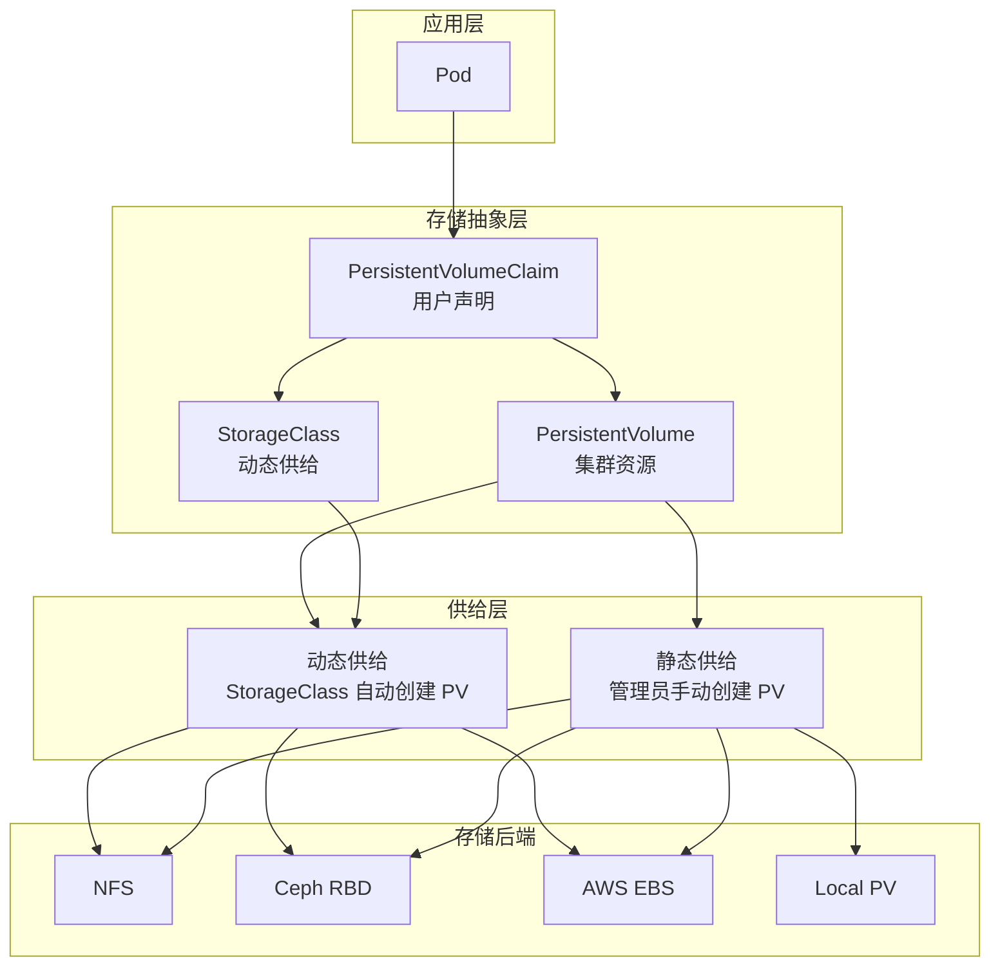
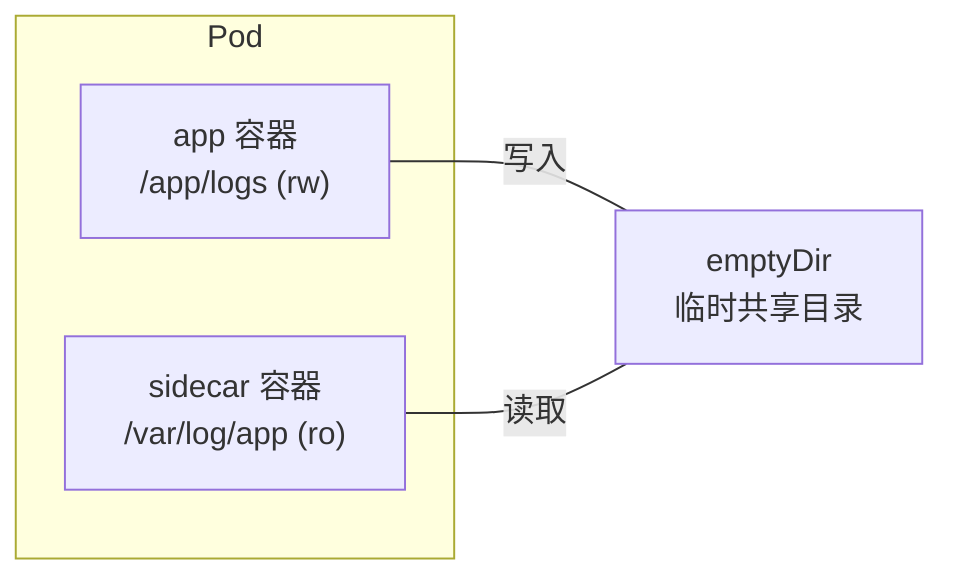
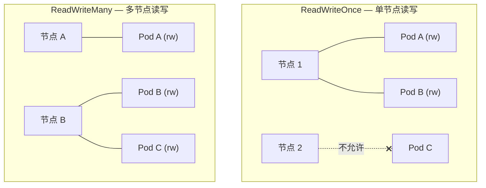
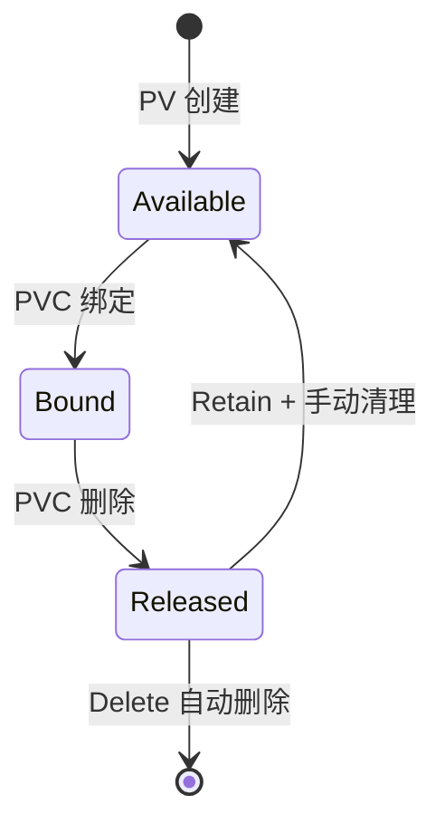
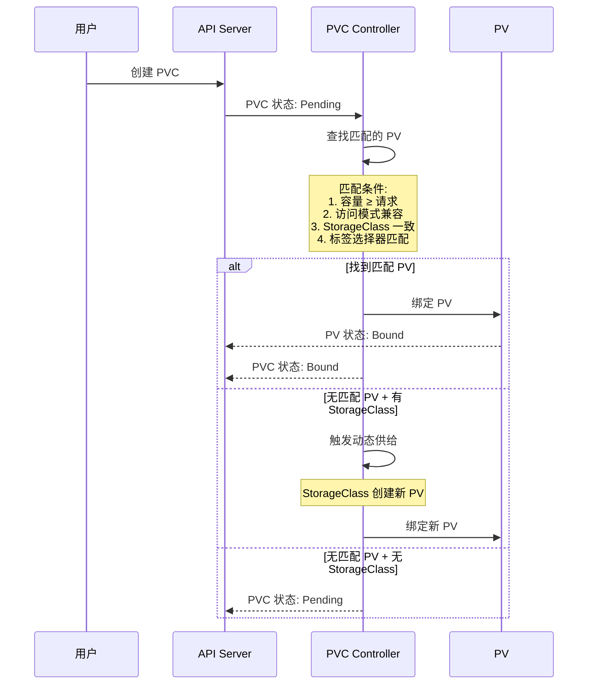
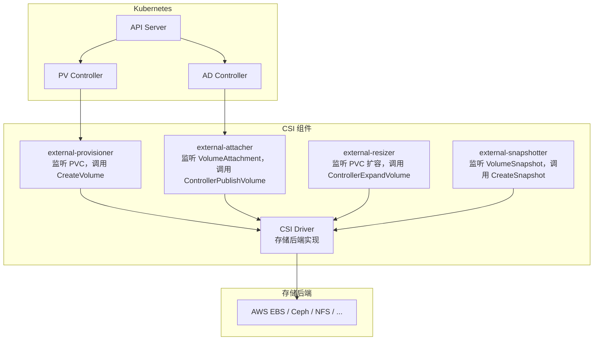
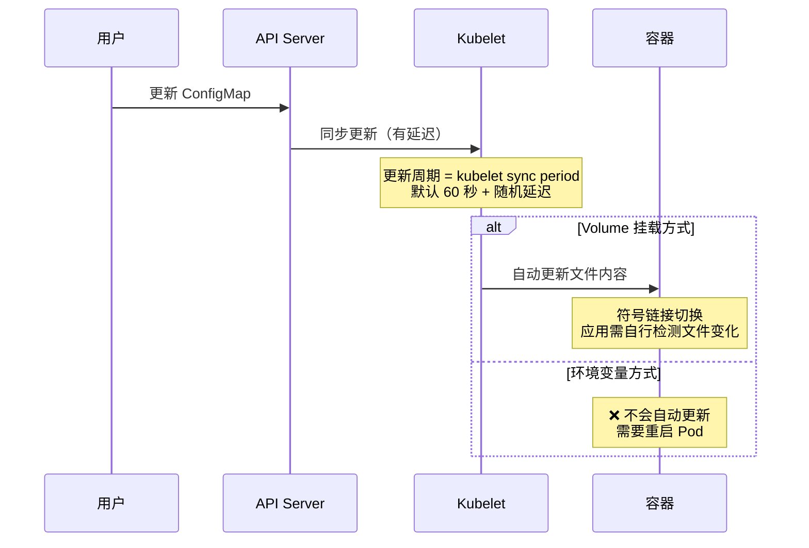
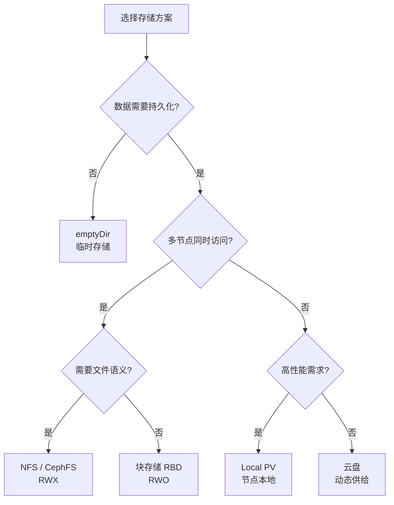

# 存储与配置管理

计算资源是短暂的，但数据需要持久。存储解决数据生命周期问题，配置管理解决应用参数与环境差异问题。在 Kubernetes 中，这两者通过声明式 API 实现，是构建有状态应用的基础。

---

## 存储体系概览

### Kubernetes 存储架构



### 存储概念对比

| 概念 | 角色 | 生命周期 | 类比 |
|------|------|----------|------|
| Volume | Pod 内存储，随 Pod 消亡 | Pod 级别 | 局部变量 |
| PV | 集群级存储资源 | 集群级别 | 服务器硬盘 |
| PVC | 用户对存储的请求 | 命名空间级别 | 硬盘申请单 |
| StorageClass | 动态供给模板 | 集群级别 | 硬盘规格模板 |

---

## Volume（卷）

### Volume 类型

Kubernetes 支持多种 Volume 类型，以下是常用分类：

#### 临时卷

| 类型 | 说明 | 数据持久化 | 适用场景 |
|------|------|-----------|----------|
| emptyDir | Pod 内临时目录 | 随 Pod 删除 | 缓存、临时文件 |
| hostPath | 挂载宿主机路径 | 宿主机存在即保留 | 开发测试、DaemonSet |

#### 持久卷

| 类型 | 说明 | 数据持久化 | 适用场景 |
|------|------|-----------|----------|
| nfs | NFS 网络存储 | 独立于 Pod | 共享存储 |
| cephfs | CephFS 文件系统 | 独立于 Pod | 分布式文件存储 |
| rbd | Ceph RBD 块存储 | 独立于 Pod | 高性能块存储 |
| awsElasticBlockStore | AWS EBS | 独立于 Pod | AWS 云环境 |
| gcePersistentDisk | GCE PD | 独立于 Pod | GCP 云环境 |
| azureDisk | Azure Disk | 独立于 Pod | Azure 云环境 |
| local | 本地存储 | 节点绑定 | 高性能本地存储 |

### emptyDir

```yaml
apiVersion: v1
kind: Pod
metadata:
  name: sidecar-demo
spec:
  containers:
    - name: app
      image: myapp
      volumeMounts:
        - name: shared-data
          mountPath: /app/logs
    - name: sidecar
      image: log-collector
      volumeMounts:
        - name: shared-data
          mountPath: /var/log/app
          readOnly: true
  volumes:
    - name: shared-data
      emptyDir:
        medium: ""       # 默认使用磁盘
        sizeLimit: 500Mi # 大小限制
```



:::tip emptyDir 使用场景
- Sidecar 模式共享数据
- 临时缓存目录
- 初始化容器向主容器传递数据
- 不适合存储重要数据，Pod 重启后数据丢失
:::

### hostPath

```yaml
apiVersion: v1
kind: Pod
metadata:
  name: hostpath-demo
spec:
  containers:
    - name: app
      image: nginx
      volumeMounts:
        - name: host-volume
          mountPath: /usr/share/nginx/html
  volumes:
    - name: host-volume
      hostPath:
        path: /data/html
        type: DirectoryOrCreate  # 目录不存在则创建
```

| type 值 | 说明 |
|---------|------|
| "" | 默认，不检查 |
| DirectoryOrCreate | 目录不存在则创建 |
| Directory | 必须是已存在的目录 |
| FileOrCreate | 文件不存在则创建 |
| File | 必须是已存在的文件 |
| Socket | Unix socket |
| CharDevice | 字符设备 |
| BlockDevice | 块设备 |

:::warning hostPath 安全风险
- 容器可以读写宿主机文件，存在逃逸风险
- Pod 调度到不同节点时数据不共享
- 仅用于 DaemonSet（如日志采集、监控 Agent）或开发测试
- 生产环境使用 PV/PVC 替代
:::

---

## PersistentVolume（PV）

### PV 定义

PV 是集群级别的存储资源，由管理员创建或动态供给：

```yaml
apiVersion: v1
kind: PersistentVolume
metadata:
  name: nfs-pv-1
spec:
  capacity:
    storage: 10Gi
  volumeMode: Filesystem    # Filesystem 或 Block
  accessModes:
    - ReadWriteMany          # 访问模式
  persistentVolumeReclaimPolicy: Retain  # 回收策略
  storageClassName: nfs      # 存储类
  mountOptions:
    - hard
    - nfsvers=4.1
  nfs:
    server: 192.168.1.100
    path: /export/data
```

### 访问模式（AccessModes）

| 模式 | 缩写 | 说明 | 支持后端 |
|------|------|------|----------|
| ReadWriteOnce | RWO | 单节点读写 | 块存储、文件存储 |
| ReadOnlyMany | ROX | 多节点只读 | 文件存储 |
| ReadWriteMany | RWX | 多节点读写 | NFS、CephFS |
| ReadWriteOncePod | RWOP | 单 Pod 读写（K8s 1.27+） | 块存储 |



### 回收策略（ReclaimPolicy）

| 策略 | 说明 | 适用场景 |
|------|------|----------|
| Retain | 保留数据，需手动清理 | 生产环境，数据安全 |
| Delete | 删除 PV 和后端存储 | 云环境，动态供给 |
| Recycle | 已弃用，用 Delete 替代 | - |



### 卷模式（VolumeMode）

```yaml
# 文件系统模式（默认）
spec:
  volumeMode: Filesystem

# 原始块设备模式
spec:
  volumeMode: Block
```

块模式适用于：
- 数据库（直接管理块设备）
- 高性能 I/O 场景
- 需要绕过文件系统开销的场景

---

## PersistentVolumeClaim（PVC）

### PVC 定义

PVC 是用户对存储的请求：

```yaml
apiVersion: v1
kind: PersistentVolumeClaim
metadata:
  name: my-app-data
  namespace: production
spec:
  accessModes:
    - ReadWriteOnce
  volumeMode: Filesystem
  resources:
    requests:
      storage: 5Gi
    limits:
      storage: 10Gi         # 上限（K8s 1.28+）
  storageClassName: fast-ssd
  selector:                  # 选择匹配的 PV
    matchLabels:
      environment: production
    matchExpressions:
      - key: type
        operator: In
        values:
          - ssd
          - nvme
```

### PVC 绑定流程



### 在 Pod 中使用 PVC

```yaml
apiVersion: v1
kind: Pod
metadata:
  name: my-app
spec:
  containers:
    - name: app
      image: myapp
      volumeMounts:
        - name: data
          mountPath: /app/data
        - name: config
          mountPath: /app/config
          readOnly: true
  volumes:
    - name: data
      persistentVolumeClaim:
        claimName: my-app-data
    - name: config
      persistentVolumeClaim:
        claimName: my-app-config
```

### PVC 扩容

```yaml
# 1. StorageClass 必须允许扩容
apiVersion: storage.k8s.io/v1
kind: StorageClass
metadata:
  name: fast-ssd
provisioner: pd.csi.storage.gke.io
allowVolumeExpansion: true   # 关键配置

---
# 2. 修改 PVC 的 storage 请求
apiVersion: v1
kind: PersistentVolumeClaim
metadata:
  name: my-app-data
spec:
  resources:
    requests:
      storage: 20Gi   # 从 5Gi 扩展到 20Gi
```

```bash
# 在线扩容（部分存储后端支持）
kubectl patch pvc my-app-data -p '{"spec":{"resources":{"requests":{"storage":"20Gi"}}}}'

# 查看扩容状态
kubectl get pvc my-app-data
# NAME           STATUS   VOLUME   CAPACITY   ACCESS MODES
# my-app-data    Bound    pv-xxx   20Gi       RWO

# 文件系统自动扩展（需 StorageClass 配置）
# allowVolumeExpansion: true + FSResize
```

:::warning 扩容限制
- 只能扩容，不能缩容
- 块存储通常支持在线扩容，文件存储可能需要 Pod 重启
- 不是所有 CSI 驱动都支持
:::

---

## StorageClass（存储类）

### StorageClass 定义

```yaml
apiVersion: storage.k8s.io/v1
kind: StorageClass
metadata:
  name: fast-ssd
provisioner: pd.csi.storage.gke.io   # 供给器
parameters:
  type: pd-ssd                        # 存储类型
  replication-type: regional-pd       # 复制类型
reclaimPolicy: Delete                 # 回收策略
allowVolumeExpansion: true            # 允许扩容
volumeBindingMode: WaitForFirstConsumer  # 绑定模式
mountOptions:
  - discard
```

### 常用 StorageClass 示例

```yaml
# AWS EBS
apiVersion: storage.k8s.io/v1
kind: StorageClass
metadata:
  name: aws-ebs-ssd
provisioner: ebs.csi.aws.com
parameters:
  type: gp3
  iopsPerGB: "50"
  throughput: "125"
reclaimPolicy: Delete
allowVolumeExpansion: true
volumeBindingMode: WaitForFirstConsumer

---
# NFS（使用 nfs-subdir-external-provisioner）
apiVersion: storage.k8s.io/v1
kind: StorageClass
metadata:
  name: nfs-client
provisioner: nfs.csi.k8s.io
parameters:
  server: 192.168.1.100
  share: /export/data
  subDir: ${PVC_NAMESPACE}/${PVC_NAME}
reclaimPolicy: Retain
volumeBindingMode: Immediate

---
# Local PV
apiVersion: storage.k8s.io/v1
kind: StorageClass
metadata:
  name: local-ssd
provisioner: kubernetes.io/no-provisioner
reclaimPolicy: Retain
volumeBindingMode: WaitForFirstConsumer
```

### 卷绑定模式

| 模式 | 说明 | 适用场景 |
|------|------|----------|
| Immediate | PVC 创建后立即绑定 | 网络存储（NFS、Ceph） |
| WaitForFirstConsumer | 直到 Pod 调度时才绑定 | 本地存储、区域云存储 |

:::important WaitForFirstConsumer
对于 Local PV 和区域云存储，必须使用 `WaitForFirstConsumer`。否则可能将 PV 绑定到错误的节点或区域，导致 Pod 无法调度。
:::

### 默认 StorageClass

```bash
# 设置默认 StorageClass
kubectl annotate storageclass fast-ssd \
  storageclass.kubernetes.io/is-default-class=true

# 创建 PVC 时不指定 storageClassName 将使用默认
```

---

## CSI（Container Storage Interface）

### CSI 架构



### 常用 CSI 驱动

| 驱动 | 存储后端 | 安装方式 |
|------|----------|----------|
| ebs.csi.aws.com | AWS EBS | Helm / EKS Addon |
| pd.csi.storage.gke.io | GCE PD | GKE 内置 |
| disk.csi.azure.com | Azure Disk | AKS Addon |
| ceph-csi | Ceph RBD/CephFS | Helm |
| nfs.csi.k8s.io | NFS | Helm |
| local-path-provisioner | 本地路径 | kubectl apply |
| topolvm | LVM 本地存储 | Helm |
| openebs | 多种后端 | Helm |

---

## ConfigMap

### 创建 ConfigMap

```bash
# 从字面量创建
kubectl create configmap app-config \
  --from-literal=LOG_LEVEL=info \
  --from-literal=MAX_CONNECTIONS=100

# 从文件创建
kubectl create configmap nginx-config \
  --from-file=nginx.conf=./nginx.conf

# 从目录创建（目录中每个文件为一个 key）
kubectl create configmap app-configs \
  --from-file=./config/

# 从 env 文件创建
kubectl create configmap app-env \
  --from-env-file=.env

# 从 YAML 创建
kubectl apply -f - <<EOF
apiVersion: v1
kind: ConfigMap
metadata:
  name: app-config
data:
  LOG_LEVEL: "info"
  MAX_CONNECTIONS: "100"
  database.yml: |
    host: db.production
    port: 5432
    name: myapp
    pool: 25
EOF
```

### ConfigMap 定义

```yaml
apiVersion: v1
kind: ConfigMap
metadata:
  name: app-config
  namespace: production
data:
  # 键值对
  LOG_LEVEL: "info"
  APP_ENV: "production"
  MAX_CONNECTIONS: "100"

  # 多行配置文件
  application.yml: |
    server:
      port: 8080
    spring:
      datasource:
        url: jdbc:postgresql://db:5432/myapp
    logging:
      level:
        root: INFO

  nginx.conf: |
    server {
      listen 80;
      server_name example.com;
      location / {
        proxy_pass http://app:3000;
      }
    }
```

### 在 Pod 中使用 ConfigMap

#### 作为环境变量

```yaml
apiVersion: v1
kind: Pod
metadata:
  name: my-app
spec:
  containers:
    - name: app
      image: myapp
      env:
        # 引用单个键
        - name: LOG_LEVEL
          valueFrom:
            configMapKeyRef:
              name: app-config
              key: LOG_LEVEL
        - name: APP_ENV
          valueFrom:
            configMapKeyRef:
              name: app-config
              key: APP_ENV

      # 引用所有键作为环境变量
      envFrom:
        - configMapRef:
            name: app-config
            prefix: APP_    # 可选前缀
```

#### 挂载为文件

```yaml
apiVersion: v1
kind: Pod
metadata:
  name: my-app
spec:
  containers:
    - name: app
      image: myapp
      volumeMounts:
        - name: config
          mountPath: /app/config
          readOnly: true
  volumes:
    - name: config
      configMap:
        name: app-config
        # 可选：指定 items 只挂载部分键
        items:
          - key: application.yml
            path: application.yml
          - key: nginx.conf
            path: nginx.conf
        # 默认文件权限
        defaultMode: 0644
```

#### 挂载单个文件（不覆盖目录）

```yaml
# 只挂载一个文件到已有目录中
volumeMounts:
  - name: config
    mountPath: /app/config/application.yml
    subPath: application.yml  # 只挂载这个键
    readOnly: true
```

:::tip subPath 的作用
不使用 subPath 时，mountPath 整个目录会被 ConfigMap 覆盖。使用 subPath 只挂载单个文件，不影响目录中的其他文件。
:::

### ConfigMap 更新机制



:::warning ConfigMap 更新注意事项
1. **Volume 挂载**：自动更新（有延迟，约 60 秒 + 随机延迟），应用需自行 watch 文件变化
2. **环境变量**：**不会自动更新**，需要重启 Pod
3. **subPath 挂载**：**不会自动更新**，需要重启 Pod
4. 生产环境推荐使用滚动更新而非依赖自动热更新
:::

---

## Secret

### Secret 类型

| 类型 | 说明 | 用途 |
|------|------|------|
| Opaque | 通用密钥 | 默认类型 |
| kubernetes.io/tls | TLS 证书 | HTTPS 证书 |
| kubernetes.io/dockerconfigjson | Docker 认证 | 私有 Registry |
| kubernetes.io/basic-auth | 基础认证 | 用户名密码 |
| kubernetes.io/ssh-auth | SSH 认证 | SSH 密钥 |
| kubernetes.io/service-account-token | SA 令牌 | 服务账户 |

### 创建 Secret

```bash
# 从字面量创建
kubectl create secret generic db-secret \
  --from-literal=username=admin \
  --from-literal=password='S3cureP@ss!'

# 从文件创建
kubectl create secret generic tls-secret \
  --from-file=tls.crt=./server.crt \
  --from-file=tls.key=./server.key

# Docker Registry 认证
kubectl create secret docker-registry regcred \
  --docker-server=registry.example.com \
  --docker-username=admin \
  --docker-password=secret \
  --docker-email=admin@example.com

# TLS 证书
kubectl create secret tls my-tls \
  --cert=./server.crt \
  --key=./server.key
```

### Secret 定义

```yaml
apiVersion: v1
kind: Secret
metadata:
  name: db-secret
  namespace: production
type: Opaque
data:
  # base64 编码的值
  username: YWRtaW4=           # echo -n 'admin' | base64
  password: UzNjdXJlUEBzcyE=  # echo -n 'S3cureP@ss!' | base64
stringData:
  # 明文值（创建时自动转为 base64）
  database-url: "postgresql://admin:S3cureP@ss!@db:5432/mydb"
```

:::tip base64 编码 ≠ 加密
Secret 中的 data 只是 base64 编码，**不是加密**。任何人有 API 访问权限都可以解码。保护 Secret 的方式：
1. 启用 etcd 加密（EncryptionConfiguration）
2. RBAC 限制 Secret 访问
3. 使用外部密钥管理（Vault、AWS Secrets Manager）
:::

### 在 Pod 中使用 Secret

```yaml
apiVersion: v1
kind: Pod
metadata:
  name: my-app
spec:
  containers:
    - name: app
      image: myapp
      # 作为环境变量
      env:
        - name: DB_USERNAME
          valueFrom:
            secretKeyRef:
              name: db-secret
              key: username
        - name: DB_PASSWORD
          valueFrom:
            secretKeyRef:
              name: db-secret
              key: password
      envFrom:
        - secretRef:
            name: db-secret
            prefix: DB_

      # 挂载为文件
      volumeMounts:
        - name: secrets
          mountPath: /etc/secrets
          readOnly: true

  # 拉取私有镜像
  imagePullSecrets:
    - name: regcred

  volumes:
    - name: secrets
      secret:
        secretName: db-secret
        defaultMode: 0400    # 只读权限
        items:
          - key: username
            path: db-user
          - key: password
            path: db-pass
```

### Secret 加密存储

```yaml
# EncryptionConfiguration — 加密 etcd 中的 Secret
apiVersion: apiserver.config.k8s.io/v1
kind: EncryptionConfiguration
resources:
  - resources:
      - secrets
    providers:
      - aescbc:
          keys:
            - name: key1
              secret: <base64-encoded-32-byte-key>
      - identity: {}   # 兜底：未加密的数据仍可读取
```

```bash
# 配置 API Server 使用加密配置
# /etc/kubernetes/manifests/kube-apiserver.yaml
# 添加参数：
# --encryption-provider-config=/etc/kubernetes/encryption-config.yaml

# 加密已有的 Secret
kubectl get secrets --all-namespaces -o json | \
  kubectl replace -f -
```

### 外部密钥管理

```yaml
# 使用 External Secrets Operator 同步外部密钥
apiVersion: external-secrets.io/v1beta1
kind: ExternalSecret
metadata:
  name: db-credentials
spec:
  refreshInterval: 1h
  secretStoreRef:
    name: vault-backend
    kind: ClusterSecretStore
  target:
    name: db-credentials
    creationPolicy: Owner
  data:
    - secretKey: username
      remoteRef:
        key: secret/data/database
        property: username
    - secretKey: password
      remoteRef:
        key: secret/data/database
        property: password
```

---

## 实战：有状态应用存储方案

### PostgreSQL StatefulSet

```yaml
apiVersion: apps/v1
kind: StatefulSet
metadata:
  name: postgres
  namespace: database
spec:
  serviceName: postgres
  replicas: 3
  selector:
    matchLabels:
      app: postgres
  template:
    metadata:
      labels:
        app: postgres
    spec:
      containers:
        - name: postgres
          image: postgres:16-alpine
          ports:
            - containerPort: 5432
          env:
            - name: POSTGRES_DB
              value: myapp
            - name: POSTGRES_USER
              valueFrom:
                secretKeyRef:
                  name: postgres-secret
                  key: username
            - name: POSTGRES_PASSWORD
              valueFrom:
                secretKeyRef:
                  name: postgres-secret
                  key: password
            - name: PGDATA
              value: /var/lib/postgresql/data/pgdata
          volumeMounts:
            - name: data
              mountPath: /var/lib/postgresql/data
            - name: config
              mountPath: /etc/postgresql
              readOnly: true
          resources:
            requests:
              memory: "512Mi"
              cpu: "500m"
            limits:
              memory: "1Gi"
              cpu: "1"
          livenessProbe:
            exec:
              command:
                - pg_isready
                - -U
                - postgres
            initialDelaySeconds: 30
            periodSeconds: 10
          readinessProbe:
            exec:
              command:
                - pg_isready
                - -U
                - postgres
            initialDelaySeconds: 5
            periodSeconds: 5

      volumes:
        - name: config
          configMap:
            name: postgres-config

  volumeClaimTemplates:
    - metadata:
        name: data
      spec:
        accessModes:
          - ReadWriteOnce
        storageClassName: fast-ssd
        resources:
          requests:
            storage: 50Gi
```

### Redis StatefulSet with ConfigMap

```yaml
apiVersion: v1
kind: ConfigMap
metadata:
  name: redis-config
data:
  redis.conf: |
    bind 0.0.0.0
    port 6379
    appendonly yes
    appendfsync everysec
    maxmemory 256mb
    maxmemory-policy allkeys-lru
    requirepass ""

---
apiVersion: apps/v1
kind: StatefulSet
metadata:
  name: redis
spec:
  serviceName: redis
  replicas: 1
  selector:
    matchLabels:
      app: redis
  template:
    metadata:
      labels:
        app: redis
    spec:
      containers:
        - name: redis
          image: redis:7-alpine
          command: ["redis-server", "/etc/redis/redis.conf"]
          ports:
            - containerPort: 6379
          volumeMounts:
            - name: data
              mountPath: /data
            - name: config
              mountPath: /etc/redis
              readOnly: true
          resources:
            requests:
              memory: "256Mi"
            limits:
              memory: "512Mi"

      volumes:
        - name: config
          configMap:
            name: redis-config
            items:
              - key: redis.conf
                path: redis.conf

  volumeClaimTemplates:
    - metadata:
        name: data
      spec:
        accessModes:
          - ReadWriteOnce
        storageClassName: standard
        resources:
          requests:
            storage: 10Gi
```

---

## VolumeSnapshot

### 创建快照

```yaml
# VolumeSnapshotClass
apiVersion: snapshot.storage.k8s.io/v1
kind: VolumeSnapshotClass
metadata:
  name: csi-snapclass
driver: pd.csi.storage.gke.io
deletionPolicy: Delete

---
# VolumeSnapshot
apiVersion: snapshot.storage.k8s.io/v1
kind: VolumeSnapshot
metadata:
  name: postgres-snap-20240115
spec:
  volumeSnapshotClassName: csi-snapclass
  source:
    persistentVolumeClaimName: data-postgres-0
```

```bash
# 查看快照
kubectl get volumesnapshot
kubectl get volumesnapshotcontent

# 从快照恢复
apiVersion: v1
kind: PersistentVolumeClaim
metadata:
  name: postgres-restored
spec:
  accessModes:
    - ReadWriteOnce
  storageClassName: fast-ssd
  dataSource:
    name: postgres-snap-20240115
    kind: VolumeSnapshot
    apiGroup: snapshot.storage.k8s.io
  resources:
    requests:
      storage: 50Gi
```

---

## 常见问题与排查

### PVC 一直 Pending

```bash
# 查看 PVC 事件
kubectl describe pvc my-app-data

# 常见原因：
# 1. 没有匹配的 PV（容量不足、访问模式不匹配）
# 2. StorageClass 不存在
# 3. 动态供给失败（CSI 驱动异常）
# 4. WaitForFirstConsumer 且 Pod 未调度

# 检查可用 PV
kubectl get pv

# 检查 StorageClass
kubectl get storageclass

# 查看 CSI 驱动日志
kubectl logs -n kube-system csi-provisioner-xxx
```

### Pod 挂载失败

```bash
# 查看 Pod 事件
kubectl describe pod my-app

# 常见错误：
# MountVolume.SetUp failed — NFS 服务器不可达
# Volume is already attached — PV 已被其他节点使用
# failed to provision volume — CSI 驱动错误

# 检查节点上的挂载状态
# SSH 到节点
mount | grep /var/lib/kubelet
ls /var/lib/kubelet/pods/<pod-uid>/volumes/
```

### ConfigMap/Secret 更新未生效

```bash
# 1. 确认更新方式
# Volume 挂载 → 自动更新（有延迟）
# 环境变量 → 需要重启 Pod
# subPath → 需要重启 Pod

# 2. 检查更新是否传播到节点
kubectl get configmap app-config -o yaml

# 3. 强制滚动更新
kubectl rollout restart deployment my-app

# 4. 检查容器内文件
kubectl exec my-app -- cat /app/config/application.yml
```

---

## 快速参考

### 存储对象速查

| 对象 | 作用 | 作用域 | 生命周期 |
|------|------|--------|----------|
| Volume | Pod 内存储 | Pod | 随 Pod |
| PV | 集群存储资源 | 集群 | 独立于 Pod |
| PVC | 存储请求 | 命名空间 | 独立于 Pod |
| StorageClass | 动态供给模板 | 集群 | 长期 |
| ConfigMap | 非敏感配置 | 命名空间 | 独立于 Pod |
| Secret | 敏感配置 | 命名空间 | 独立于 Pod |
| VolumeSnapshot | 卷快照 | 命名空间 | 独立于 PVC |

### PVC 绑定条件

PVC 与 PV 匹配需要满足：
1. **容量**：PV 容量 ≥ PVC 请求
2. **访问模式**：PV 的访问模式包含 PVC 请求的模式
3. **StorageClass**：两者一致（或都为空）
4. **选择器**：PVC 的 selector 匹配 PV 的标签

### 存储选型决策



### 配置管理速查

| 需求 | 方案 | 更新方式 |
|------|------|----------|
| 非敏感配置 | ConfigMap + Volume | 自动（有延迟） |
| 非敏感环境变量 | ConfigMap + env | 需重启 Pod |
| 敏感配置 | Secret + Volume | 自动（有延迟） |
| 敏感环境变量 | Secret + env | 需重启 Pod |
| 证书 | Secret type=tls | 需重启 Pod |
| 镜像拉取认证 | imagePullSecrets | - |
| 外部密钥管理 | External Secrets Operator | 定时同步 |
