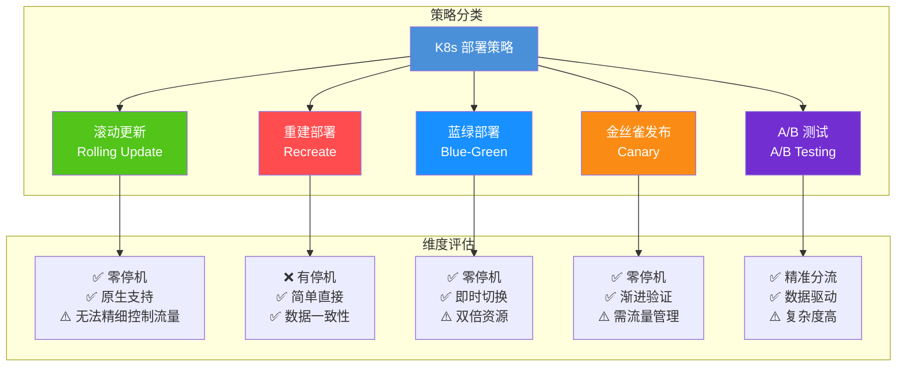
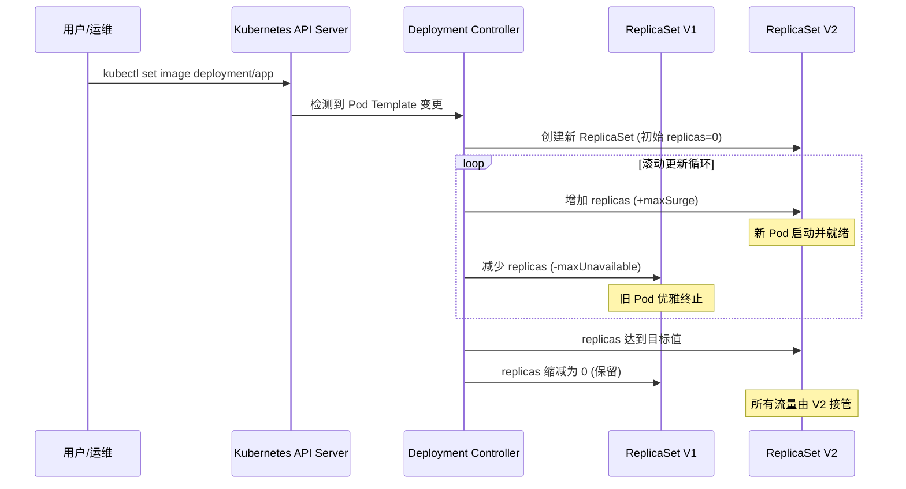
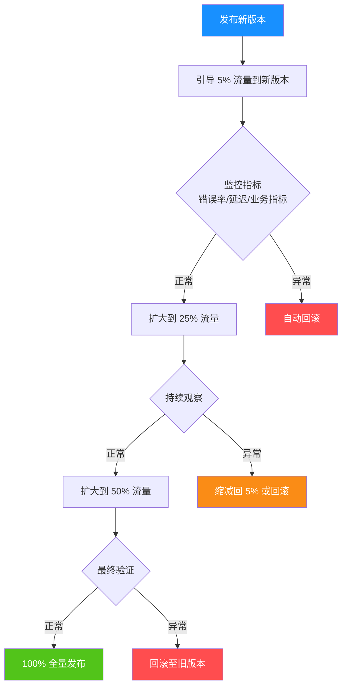
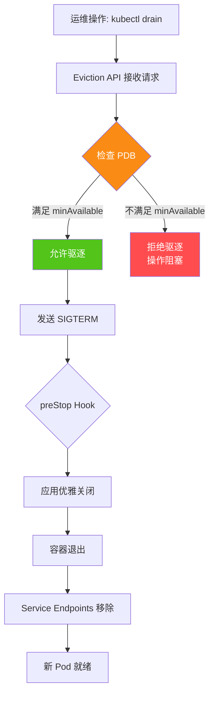
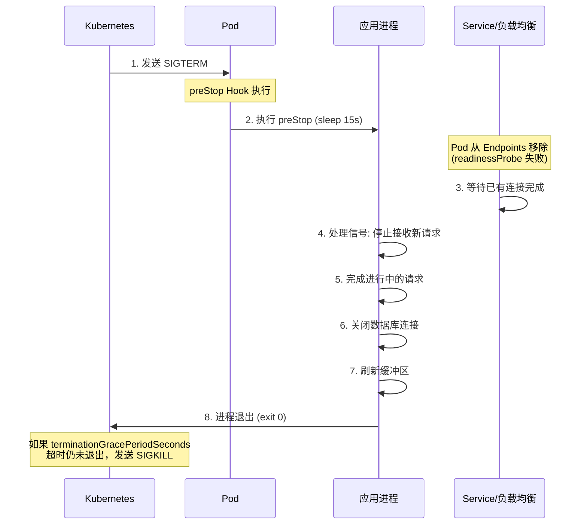
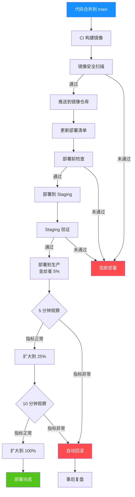

# 部署策略与滚动更新

> 在 Kubernetes 中，部署不仅仅是「把镜像推上去」，更是一场关于**零停机、可控风险、可逆操作**的精密工程。
> 本文将从 K8s 原生滚动更新出发，逐步覆盖蓝绿、金丝雀、A/B 测试等高级策略，最终落地为生产级部署 SOP。

## 本章导航

- [部署策略全景](#部署策略全景)
- [Deployment 滚动更新](#deployment-滚动更新)
- [金丝雀发布实现](#金丝雀发布实现)
- [蓝绿部署实现](#蓝绿部署实现)
- [PodDisruptionBudget 与优雅中断](#poddisruptionbudget-与优雅中断)
- [回滚策略与命令](#回滚策略与命令)
- [只读部署检查](#只读部署检查)
- [部署状态监控](#部署状态监控)
- [生产级部署 SOP](#生产级部署-sop)
- [.NET 应用零停机部署](#net-应用零停机部署)

---

## 部署策略全景

Kubernetes 生态中存在多种部署策略，每种策略在**可用性、成本、复杂度、风险控制**之间做出不同的权衡。

### 策略对比总览



### 策略详细对比表

| 策略 | 停机时间 | 资源开销 | 流量控制粒度 | 回滚速度 | 复杂度 | 适用场景 |
|------|---------|---------|------------|---------|--------|---------|
| **滚动更新** | 零 | 低 | 无 | 中 | 低 | 日常发布 |
| **重建部署** | 有 | 低 | 无 | 慢 | 最低 | 非关键/测试环境 |
| **蓝绿部署** | 零 | 高(2x) | 全量切换 | 快(瞬时) | 中 | 关键发布 |
| **金丝雀发布** | 零 | 中 | 百分比 | 中 | 高 | 高风险变更 |
| **A/B 测试** | 零 | 高 | 用户维度 | 中 | 最高 | 产品实验 |

::: tip 如何选择部署策略？
1. **日常迭代** → 滚动更新（默认即可）
2. **重大版本升级** → 金丝雀发布（先 5% 流量验证）
3. **合规/金融场景** → 蓝绿部署（合规要求瞬时回滚）
4. **产品功能验证** → A/B 测试（需要用户维度数据）
:::

---

## Deployment 滚动更新

### 滚动更新原理

滚动更新（Rolling Update）是 Kubernetes Deployment 的默认策略。其核心思想是**逐步替换旧版本 Pod 为新版本 Pod**，在整个过程中始终保持一定数量的可用实例。



### 滚动更新参数详解

#### maxSurge 与 maxUnavailable

这两个参数是控制滚动更新节奏的核心旋钮：

```yaml
apiVersion: apps/v1
kind: Deployment
metadata:
  name: web-app
  namespace: production
spec:
  replicas: 10
  strategy:
    type: RollingUpdate
    rollingUpdate:
      maxSurge: 3           # 最多超出期望副本数的 Pod 数量
      maxUnavailable: 2     # 最多允许不可用的 Pod 数量
  selector:
    matchLabels:
      app: web-app
  template:
    # ... pod template
```

::: important 参数计算逻辑
- **maxSurge**: 更新过程中，允许创建的 Pod 总数上限 = `replicas + maxSurge`
  - 绝对值：如 `3` 表示最多 10+3=13 个 Pod
  - 百分比：如 `25%` 表示最多 10+3=13 个 Pod
- **maxUnavailable**: 更新过程中，允许不可用的 Pod 数量上限
  - 绝对值：如 `2` 表示至少 10-2=8 个 Pod 可用
  - 百分比：如 `25%` 表示至少 10-3=7 个 Pod 可用
- **两者可以同时为百分比**：`maxSurge: 25%` + `maxUnavailable: 25%` 是生产常用配置
:::

#### 参数组合与效果

| maxSurge | maxUnavailable | 行为特征 | 适用场景 |
|----------|---------------|---------|---------|
| `25%` | `0` | 先扩后缩，始终满额 | 对可用性要求极高 |
| `0` | `25%` | 先缩后扩，资源不超 | 资源受限环境 |
| `25%` | `25%` | 均衡策略 | **通用推荐** |
| `100%` | `0` | 类蓝绿行为 | 快速切换 |
| `1` | `1` | 保守渐进 | 小规模/敏感服务 |

### 滚动更新过程可视化

```mermaid
graph LR
    subgraph 初始状态
        V1_1[Pod V1]
        V1_2[Pod V1]
        V1_3[Pod V1]
        V1_4[Pod V1]
        V1_5[Pod V1]
    end

    subgraph 第一轮
        V1_1s[Pod V1]
        V1_2s[Pod V1]
        V1_3s[Pod V1]
        V1_4s[Pod V1]
        V2_1[Pod V2 🟢]
        V2_2[Pod V2 🟢]
    end

    subgraph 第二轮
        V1_1t[Pod V1]
        V1_2t[Pod V1]
        V1_3t[Pod V1]
        V2_1t[Pod V2 🟢]
        V2_2t[Pod V2 🟢]
        V2_3[Pod V2 🟢]
        V2_4[Pod V2 🟢]
    end

    subgraph 最终状态
        VF_1[Pod V2 🟢]
        VF_2[Pod V2 🟢]
        VF_3[Pod V2 🟢]
        VF_4[Pod V2 🟢]
        VF_5[Pod V2 🟢]
    end

    初始状态 -->|maxSurge=2| 第一轮
    第一轮 -->|maxUnavailable=1| 第二轮
    第二轮 -->|完成| 最终状态

    style V2_1 fill:#52C41A,color:#fff
    style V2_2 fill:#52C41A,color:#fff
    style V2_1t fill:#52C41A,color:#fff
    style V2_2t fill:#52C41A,color:#fff
    style V2_3 fill:#52C41A,color:#fff
    style V2_4 fill:#52C41A,color:#fff
    style VF_1 fill:#52C41A,color:#fff
    style VF_2 fill:#52C41A,color:#fff
    style VF_3 fill:#52C41A,color:#fff
    style VF_4 fill:#52C41A,color:#fff
    style VF_5 fill:#52C41A,color:#fff
```



### 生产级滚动更新配置

```yaml
apiVersion: apps/v1
kind: Deployment
metadata:
  name: api-gateway
  namespace: production
  labels:
    app: api-gateway
    version: v2.1.0
spec:
  replicas: 8
  # 最小就绪时间：Pod 就绪后至少等待 30 秒才认为可用
  minReadySeconds: 30
  # 修订历史限制：保留的历史 ReplicaSet 数量
  revisionHistoryLimit: 10
  # 进度截止时间：超过此时间认为部署失败
  progressDeadlineSeconds: 600
  strategy:
    type: RollingUpdate
    rollingUpdate:
      maxSurge: 25%
      maxUnavailable: 25%
  selector:
    matchLabels:
      app: api-gateway
  template:
    metadata:
      labels:
        app: api-gateway
        version: v2.1.0
    spec:
      containers:
        - name: api-gateway
          image: registry.example.com/api-gateway:v2.1.0
          ports:
            - containerPort: 8080
          # 就绪探针：确保新 Pod 真正可用后才接收流量
          readinessProbe:
            httpGet:
              path: /health/ready
              port: 8080
            initialDelaySeconds: 10
            periodSeconds: 5
            failureThreshold: 3
          # 存活探针：检测死锁等情况
          livenessProbe:
            httpGet:
              path: /health/live
              port: 8080
            initialDelaySeconds: 30
            periodSeconds: 15
            failureThreshold: 3
          # 启动探针：给慢启动应用足够时间
          startupProbe:
            httpGet:
              path: /health/startup
              port: 8080
            failureThreshold: 30
            periodSeconds: 2
          resources:
            requests:
              cpu: "250m"
              memory: "256Mi"
            limits:
              cpu: "500m"
              memory: "512Mi"
      # 优雅终止宽限期
      terminationGracePeriodSeconds: 60
```

::: warning 探针配置是滚动更新的生命线
没有配置 `readinessProbe` 的滚动更新形同裸奔——新 Pod 可能还没初始化完就被投入流量，导致 5xx 错误。
三大探针的职责分工：
- **startupProbe**: 应用启动阶段（JVM 预热、.NET JIT 编译等）
- **livenessProbe**: 运行时死锁检测（失败则重启容器）
- **readinessProbe**: 流量就绪判断（失败则从 Service Endpoints 摘除）
:::

### 重建部署（Recreate）

```yaml
apiVersion: apps/v1
kind: Deployment
metadata:
  name: batch-processor
  namespace: production
spec:
  replicas: 3
  strategy:
    type: Recreate  # 先杀所有旧 Pod，再创建新 Pod
  selector:
    matchLabels:
      app: batch-processor
  template:
    # ... pod template
```

::: warning Recreate 的代价
Recreate 策略会先终止所有旧版本 Pod，等待全部终止后再创建新 Pod。这意味着在更新期间**服务完全不可用**。仅在以下场景考虑：
- 应用不支持多版本共存（如数据库 Schema 变更不兼容）
- 测试/开发环境
- 有状态应用的强制升级
:::

---

## 金丝雀发布实现

金丝雀发布（Canary Release）得名于矿工用金丝雀检测瓦斯泄漏的做法——先让少量流量访问新版本，确认无异常后逐步扩大范围。

### 金丝雀发布流程



### 方案一：Ingress 权重分流

使用 Nginx Ingress 的 `canary` 注解实现最简单的金丝雀发布：

```yaml
# 稳定版本 Deployment
apiVersion: apps/v1
kind: Deployment
metadata:
  name: web-app-stable
  namespace: production
spec:
  replicas: 5
  selector:
    matchLabels:
      app: web-app
      track: stable
  template:
    metadata:
      labels:
        app: web-app
        track: stable
    spec:
      containers:
        - name: web-app
          image: registry.example.com/web-app:v1.0.0
          ports:
            - containerPort: 8080
---
# 稳定版本 Service
apiVersion: v1
kind: Service
metadata:
  name: web-app-stable
  namespace: production
spec:
  selector:
    app: web-app
    track: stable
  ports:
    - port: 80
      targetPort: 8080
---
# 金丝雀版本 Deployment
apiVersion: apps/v1
kind: Deployment
metadata:
  name: web-app-canary
  namespace: production
spec:
  replicas: 1
  selector:
    matchLabels:
      app: web-app
      track: canary
  template:
    metadata:
      labels:
        app: web-app
        track: canary
    spec:
      containers:
        - name: web-app
          image: registry.example.com/web-app:v2.0.0
          ports:
            - containerPort: 8080
---
# 金丝雀版本 Service
apiVersion: v1
kind: Service
metadata:
  name: web-app-canary
  namespace: production
spec:
  selector:
    app: web-app
    track: canary
  ports:
    - port: 80
      targetPort: 8080
---
# 稳定版本 Ingress
apiVersion: networking.k8s.io/v1
kind: Ingress
metadata:
  name: web-app-stable
  namespace: production
  annotations:
    kubernetes.io/ingress.class: nginx
spec:
  rules:
    - host: web-app.example.com
      http:
        paths:
          - path: /
            pathType: Prefix
            backend:
              service:
                name: web-app-stable
                port:
                  number: 80
---
# 金丝雀版本 Ingress（关键配置）
apiVersion: networking.k8s.io/v1
kind: Ingress
metadata:
  name: web-app-canary
  namespace: production
  annotations:
    kubernetes.io/ingress.class: nginx
    # 启用金丝雀功能
    nginx.ingress.kubernetes.io/canary: "true"
    # 按权重分流：10% 流量到金丝雀
    nginx.ingress.kubernetes.io/canary-weight: "10"
spec:
  rules:
    - host: web-app.example.com
      http:
        paths:
          - path: /
            pathType: Prefix
            backend:
              service:
                name: web-app-canary
                port:
                  number: 80
```

#### 基于 Header/Cookie 的金丝雀

除了按权重分流，还可以按请求特征精准路由：

```yaml
apiVersion: networking.k8s.io/v1
kind: Ingress
metadata:
  name: web-app-canary-header
  namespace: production
  annotations:
    kubernetes.io/ingress.class: nginx
    nginx.ingress.kubernetes.io/canary: "true"
    # 基于 Header 路由：带 x-canary: true 的请求走金丝雀
    nginx.ingress.kubernetes.io/canary-by-header: "x-canary"
    nginx.ingress.kubernetes.io/canary-by-header-value: "true"
spec:
  rules:
    - host: web-app.example.com
      http:
        paths:
          - path: /
            pathType: Prefix
            backend:
              service:
                name: web-app-canary
                port:
                  number: 80
```

::: important Ingress 金丝雀的优先级
当同时配置多种金丝雀策略时，优先级为：
1. `canary-by-header` > `canary-by-cookie` > `canary-weight`
2. Header/Cookie 匹配的流量**不计入**权重分配
3. 未被 Header/Cookie 匹配的流量才按权重分配
:::

### 方案二：Argo Rollouts

Argo Rollouts 是专为渐进式交付设计的 K8s 控制器，提供比原生 Deployment 更精细的发布控制。

```yaml
# Argo Rollouts Rollout 资源（替代 Deployment）
apiVersion: argoproj.io/v1alpha1
kind: Rollout
metadata:
  name: web-app
  namespace: production
spec:
  replicas: 10
  strategy:
    canary:
      # 金丝雀发布的步骤
      steps:
        # 第一步：先切 5% 流量，暂停等待人工确认
        - setWeight: 5
        - pause: {duration: 5m}     # 自动暂停 5 分钟
        # 第二步：扩大到 20%
        - setWeight: 20
        - pause: {}                  # 无限暂停，等待手动继续
        # 第三步：扩大到 50%
        - setWeight: 50
        - pause: {duration: 10m}
        # 第四步：全量发布
        - setWeight: 100
      # 金丝雀 Pod 反亲和，确保分布在不同节点
      canaryService: web-app-canary
      stableService: web-app-stable
      # 流量管理
      trafficRouting:
        istio:
          virtualServices:
            - name: web-app-vsvc
              routes:
                - primary
      # 自动分析
      analysis:
        templates:
          - templateName: success-rate
        args:
          - name: service-name
            value: web-app-canary.production.svc.cluster.local
  selector:
    matchLabels:
      app: web-app
  template:
    metadata:
      labels:
        app: web-app
    spec:
      containers:
        - name: web-app
          image: registry.example.com/web-app:v2.0.0
          ports:
            - containerPort: 8080
          readinessProbe:
            httpGet:
              path: /health/ready
              port: 8080
            initialDelaySeconds: 5
            periodSeconds: 3
```

#### Argo Rollouts AnalysisTemplate

自动分析金丝雀的健康状态：

```yaml
apiVersion: argoproj.io/v1alpha1
kind: AnalysisTemplate
metadata:
  name: success-rate
  namespace: production
spec:
  args:
    - name: service-name
  metrics:
    - name: success-rate
      interval: 30s
      count: 10
      successCondition: result[0] >= 0.99
      failureLimit: 3
      provider:
        prometheus:
          address: http://prometheus.monitoring:9090
          query: |
            sum(rate(http_requests_total{service="{{args.service-name}}",status!~"5.."}[1m]))
            /
            sum(rate(http_requests_total{service="{{args.service-name}}"}[1m]))
    - name: p99-latency
      interval: 30s
      count: 5
      successCondition: result[0] <= 500
      failureLimit: 2
      provider:
        prometheus:
          address: http://prometheus.monitoring:9090
          query: |
            histogram_quantile(0.99,
              sum(rate(http_request_duration_seconds_bucket{service="{{args.service-name}}"}[1m]))
              by (le)
            ) * 1000
```

### 方案三：Flagger

Flagger 是 Weaveworks 出品的渐进式交付工具，与 Istio/Linkerd/Skipper 等服务网格深度集成。

```yaml
# Flagger Canary 资源
apiVersion: flagger.app/v1beta1
kind: Canary
metadata:
  name: web-app
  namespace: production
spec:
  # 目标 Deployment
  targetRef:
    apiVersion: apps/v1
    kind: Deployment
    name: web-app
  # 自动伸缩配置
  autoscalerRef:
    apiVersion: autoscaling/v2
    kind: HorizontalPodAutoscaler
    name: web-app
  # Service 配置
  service:
    port: 8080
    targetPort: 8080
  # 分析配置
  analysis:
    # 每 1 分钟检查一次
    interval: 1m
    # 总共分析 10 次
    threshold: 10
    # 最大失败次数
    maxWeight: 50
    # 每次增加 5% 流量
    stepWeight: 5
    # 金丝雀失败时回滚
    metrics:
      - name: request-success-rate
        thresholdRange:
          min: 99
        interval: 1m
      - name: request-duration
        thresholdRange:
          max: 500
        interval: 1m
    # Webhook 测试
    webhooks:
      - name: load-test
        type: rollout
        url: http://flagger-loadtester.test/
        timeout: 5s
        metadata:
          cmd: "hey -z 1m -q 10 -c 2 http://web-app-canary.production:8080/"
```

### 三种金丝雀方案对比

| 特性 | Ingress 权重 | Argo Rollouts | Flagger |
|------|-------------|---------------|---------|
| 流量管理 | Nginx Ingress | Istio/SMI/Nginx | Istio/Linkerd/AppMesh |
| 自动化程度 | 手动 | 半自动/全自动 | 全自动 |
| 自动分析 | ❌ | ✅ AnalysisTemplate | ✅ 内置指标 |
| 回滚机制 | 手动 | 自动 | 自动 |
| 学习曲线 | 低 | 中 | 中 |
| UI 可视化 | ❌ | ✅ Argo CD UI | ❌ |
| Slack 通知 | ❌ | ✅ | ✅ |

::: tip 金丝雀方案选型建议
- **小团队/入门**：Ingress 权重分流，零额外组件
- **中大型团队**：Argo Rollouts，与 Argo CD 生态无缝集成
- **服务网格用户**：Flagger，与 Istio/Linkerd 深度集成
:::

---

## 蓝绿部署实现

蓝绿部署维护两套完全相同的环境（蓝色和绿色），通过切换 Service 的 selector 实现瞬时切换。

### 蓝绿部署架构

```mermaid
graph LR
    subgraph 蓝色环境(当前活跃)
        B_SVC[Service<br/>app=web,track=blue]
        B_P1[Pod V1 Blue]
        B_P2[Pod V1 Blue]
        B_P3[Pod V1 Blue]
        B_SVC --> B_P1
        B_SVC --> B_P2
        B_SVC --> B_P3
    end

    subgraph 绿色环境(待切换)
        G_P1[Pod V2 Green]
        G_P2[Pod V2 Green]
        G_P3[Pod V2 Green]
    end

    Client[客户端流量] --> B_SVC

    B_SVC -.->|切换 selector| G_P1

    style B_P1 fill:#1890FF,color:#fff
    style B_P2 fill:#1890FF,color:#fff
    style B_P3 fill:#1890FF,color:#fff
    style G_P1 fill:#52C41A,color:#fff
    style G_P2 fill:#52C41A,color:#fff
    style G_P3 fill:#52C41A,color:#fff
```

### 蓝绿部署实现

```yaml
# 蓝色版本 Deployment
apiVersion: apps/v1
kind: Deployment
metadata:
  name: web-app-blue
  namespace: production
spec:
  replicas: 3
  selector:
    matchLabels:
      app: web-app
      version: blue
  template:
    metadata:
      labels:
        app: web-app
        version: blue
    spec:
      containers:
        - name: web-app
          image: registry.example.com/web-app:v1.0.0
          ports:
            - containerPort: 8080
          readinessProbe:
            httpGet:
              path: /health/ready
              port: 8080
            initialDelaySeconds: 5
            periodSeconds: 3
---
# 绿色版本 Deployment
apiVersion: apps/v1
kind: Deployment
metadata:
  name: web-app-green
  namespace: production
spec:
  replicas: 3
  selector:
    matchLabels:
      app: web-app
      version: green
  template:
    metadata:
      labels:
        app: web-app
        version: green
    spec:
      containers:
        - name: web-app
          image: registry.example.com/web-app:v2.0.0
          ports:
            - containerPort: 8080
          readinessProbe:
            httpGet:
              path: /health/ready
              port: 8080
            initialDelaySeconds: 5
            periodSeconds: 3
---
# 流量路由 Service（初始指向蓝色）
apiVersion: v1
kind: Service
metadata:
  name: web-app
  namespace: production
spec:
  selector:
    app: web-app
    version: blue    # 切换到 green 即完成蓝绿切换
  ports:
    - port: 80
      targetPort: 8080
  type: ClusterIP
```

#### 蓝绿切换命令

```bash
# 1. 部署绿色版本（此时流量仍在蓝色）
kubectl apply -f green-deployment.yaml

# 2. 验证绿色版本就绪
kubectl get pods -l app=web-app,version=green -n production
kubectl exec -it web-app-green-xxxx -- curl -s http://localhost:8080/health/ready

# 3. 切换流量到绿色（关键操作）
kubectl patch svc web-app -n production -p '{"spec":{"selector":{"version":"green"}}}'

# 4. 验证切换成功
kubectl get endpoints web-app -n production
curl -s http://web-app.production.svc.cluster.local/version

# 5. 如果需要回滚，切换回蓝色
kubectl patch svc web-app -n production -p '{"spec":{"selector":{"version":"blue"}}}'

# 6. 确认稳定后，缩容蓝色版本
kubectl scale deployment web-app-blue --replicas=0 -n production
```

::: warning 蓝绿部署的注意事项
1. **数据库兼容性**：蓝绿两版本必须兼容同一数据库 Schema，否则需要先执行 Schema 迁移
2. **有状态数据**：Session、缓存等有状态数据需要共享或同步
3. **资源开销**：运行两套完整环境需要双倍资源，确保集群有足够容量
4. **切换原子性**：Service selector 切换是即时的，但客户端 DNS 缓存可能导致短暂不一致
:::

---

## PodDisruptionBudget 与优雅中断

### PDB 概念

PodDisruptionBudget（PDB）是保护应用在**自愿中断**（Voluntary Disruption）期间可用性的关键资源。它告诉 Kubernetes：在驱逐 Pod 时，至少要保持多少 Pod 可用。

::: important 自愿中断 vs 非自愿中断
- **自愿中断**：kubectl drain、集群升级、节点缩容等运维操作触发的 Pod 驱逐。PDB 只能防护此类中断。
- **非自愿中断**：节点故障、网络分区、内核崩溃等。PDB 无法防护此类中断，需要靠副本数和反亲和性保证。
:::

### PDB 工作机制



### PDB 配置示例

```yaml
# 最小可用数量方式
apiVersion: policy/v1
kind: PodDisruptionBudget
metadata:
  name: web-app-pdb
  namespace: production
spec:
  minAvailable: 2        # 至少保持 2 个 Pod 可用
  selector:
    matchLabels:
      app: web-app
---
# 最大不可用数量方式
apiVersion: policy/v1
kind: PodDisruptionBudget
metadata:
  name: api-server-pdb
  namespace: production
spec:
  maxUnavailable: 1      # 最多允许 1 个 Pod 不可用
  selector:
    matchLabels:
      app: api-server
---
# 百分比方式（适用于大规模服务）
apiVersion: policy/v1
kind: PodDisruptionBudget
metadata:
  name: large-service-pdb
  namespace: production
spec:
  minAvailable: "80%"    # 至少保持 80% Pod 可用
  selector:
    matchLabels:
      app: large-service
```

### 优雅终止全流程

```yaml
apiVersion: apps/v1
kind: Deployment
metadata:
  name: graceful-app
  namespace: production
spec:
  replicas: 3
  selector:
    matchLabels:
      app: graceful-app
  template:
    metadata:
      labels:
        app: graceful-app
    spec:
      # 终止宽限期（默认 30s）
      terminationGracePeriodSeconds: 60
      containers:
        - name: app
          image: registry.example.com/app:v1.0.0
          ports:
            - containerPort: 8080
          lifecycle:
            # 优雅终止钩子
            preStop:
              exec:
                command: ["/bin/sh", "-c", "sleep 15 && /app/shutdown-hook.sh"]
          # 就绪探针确保从 Endpoints 移除
          readinessProbe:
            httpGet:
              path: /health/ready
              port: 8080
            periodSeconds: 3
```

#### 优雅终止时序



::: warning 优雅终止常见陷阱
1. **忘记配置 preStop**：SIGTERM 发出后，应用可能还在处理请求，但 Service Endpoints 已经在同步移除
2. **preStop sleep 太短**：默认的 Endpoints 同步间隔约 5-10s，preStop sleep 至少 10-15s
3. **terminationGracePeriodSeconds 不够**：需要覆盖 preStop + 应用关闭时间
4. **应用忽略 SIGTERM**：Docker 中 PID 1 的进程必须正确处理 SIGTERM，使用 shell 形式 ENTRYPOINT 可能导致信号不传递
:::

---

## 回滚策略与命令

### 查看部署历史

```bash
# 查看 Deployment 的所有修订版本
kubectl rollout history deployment/web-app -n production

# 输出示例：
# REVISION  CHANGE-CAUSE
# 1         kubectl apply --filename=web-app-v1.yaml --record=true
# 2         kubectl apply --filename=web-app-v2.yaml --record=true
# 3         kubectl set image deployment/web-app web-app=v2.1.0 --record=true

# 查看特定修订版本的详情
kubectl rollout history deployment/web-app --revision=2 -n production
```

### 执行回滚

```bash
# 回滚到上一个版本
kubectl rollout undo deployment/web-app -n production

# 回滚到指定版本
kubectl rollout undo deployment/web-app --to-revision=1 -n production

# 查看回滚状态
kubectl rollout status deployment/web-app -n production
```

### 暂停与恢复部署

```bash
# 暂停部署（用于在发布过程中做检查）
kubectl rollout pause deployment/web-app -n production

# 此时可以多次修改，不会触发滚动更新
kubectl set image deployment/web-app web-app=v2.1.1 -n production
kubectl set resources deployment/web-app -c=web-app --limits=cpu=500m,memory=512Mi -n production

# 恢复部署，一次性应用所有变更
kubectl rollout resume deployment/web-app -n production
```

### 查看部署状态

```bash
# 查看部署状态
kubectl rollout status deployment/web-app -n production
# 输出：deployment "web-app" successfully rolled out

# 查看 ReplicaSet 状态
kubectl get rs -n production -l app=web-app

# 查看部署详情
kubectl describe deployment web-app -n production

# 查看 Pod 状态（按创建时间排序）
kubectl get pods -n production -l app=web-app --sort-by=.metadata.creationTimestamp
```

### 生产级回滚脚本

```bash
#!/bin/bash
# rollback.sh - 安全回滚脚本
set -euo pipefail

DEPLOYMENT=$1
NAMESPACE=${2:-default}
TO_REVISION=${3:-}

if [ -z "$DEPLOYMENT" ]; then
    echo "Usage: $0 <deployment-name> [namespace] [revision]"
    exit 1
fi

echo "=== 回滚前状态 ==="
kubectl get deployment "$DEPLOYMENT" -n "$NAMESPACE" -o wide
echo ""
kubectl get rs -n "$NAMESPACE" -l "app=$DEPLOYMENT" --sort-by=.metadata.creationTimestamp
echo ""

# 记录当前镜像版本
CURRENT_IMAGE=$(kubectl get deployment "$DEPLOYMENT" -n "$NAMESPACE" \
    -o jsonpath='{.spec.template.spec.containers[0].image}')
echo "当前镜像: $CURRENT_IMAGE"

if [ -n "$TO_REVISION" ]; then
    echo "回滚到修订版本: $TO_REVISION"
    kubectl rollout undo deployment/"$DEPLOYMENT" --to-revision="$TO_REVISION" -n "$NAMESPACE"
else
    echo "回滚到上一个版本"
    kubectl rollout undo deployment/"$DEPLOYMENT" -n "$NAMESPACE"
fi

# 等待回滚完成
echo "等待回滚完成..."
if kubectl rollout status deployment/"$DEPLOYMENT" -n "$NAMESPACE" --timeout=300s; then
    echo "=== 回滚成功 ==="
    NEW_IMAGE=$(kubectl get deployment "$DEPLOYMENT" -n "$NAMESPACE" \
        -o jsonpath='{.spec.template.spec.containers[0].image}')
    echo "当前镜像: $NEW_IMAGE"
else
    echo "!!! 回滚超时，请手动检查 !!!"
    exit 1
fi
```

::: tip revisionHistoryLimit 管理
默认 Deployment 保留 10 个历史 ReplicaSet。如果设置了 `revisionHistoryLimit: 0`，则无法回滚！生产环境建议至少保留 3-5 个版本。

```yaml
spec:
  revisionHistoryLimit: 5  # 保留最近 5 个版本用于回滚
```
:::

---

## 只读部署检查

在执行部署前和部署过程中，应该执行一系列检查以确保部署的安全性和正确性。

### 部署前检查清单

```bash
#!/bin/bash
# pre-deploy-check.sh - 部署前检查脚本
set -euo pipefail

NAMESPACE="production"
DEPLOYMENT="web-app"

echo "========================================="
echo "  部署前安全检查"
echo "========================================="

# 1. 检查集群健康状态
echo -e "\n[1] 集群节点状态"
kubectl get nodes
kubectl get nodes -o json | jq -r '.items[] | select(.status.conditions[] | select(.type=="Ready" and .status!="True")) | .metadata.name' && echo "!!! 存在 NotReady 节点 !!!" || echo "✓ 所有节点 Ready"

# 2. 检查当前部署状态
echo -e "\n[2] 当前部署状态"
kubectl get deployment "$DEPLOYMENT" -n "$NAMESPACE" -o wide
CURRENT_REPLICAS=$(kubectl get deployment "$DEPLOYMENT" -n "$NAMESPACE" -o jsonpath='{.status.readyReplicas}')
DESIRED_REPLICAS=$(kubectl get deployment "$DEPLOYMENT" -n "$NAMESPACE" -o jsonpath='{.spec.replicas}')
if [ "$CURRENT_REPLICAS" = "$DESIRED_REPLICAS" ]; then
    echo "✓ 副本数正常 ($CURRENT_REPLICAS/$DESIRED_REPLICAS)"
else
    echo "!!! 副本数异常 ($CURRENT_REPLICAS/$DESIRED_REPLICAS) !!!"
    exit 1
fi

# 3. 检查 PDB
echo -e "\n[3] PodDisruptionBudget"
kubectl get pdb -n "$NAMESPACE" -l "app=$DEPLOYMENT"

# 4. 检查资源配额
echo -e "\n[4] 资源使用情况"
kubectl top nodes
kubectl top pods -n "$NAMESPACE" -l "app=$DEPLOYMENT" --sort-by=memory

# 5. 检查 HPA
echo -e "\n[5] 水平自动伸缩"
kubectl get hpa -n "$NAMESPACE" -l "app=$DEPLOYMENT"

# 6. 检查最近事件
echo -e "\n[6] 最近事件"
kubectl get events -n "$NAMESPACE" --sort-by=.metadata.creationTimestamp | tail -20

# 7. 检查镜像拉取策略
echo -e "\n[7] 镜像配置"
kubectl get deployment "$DEPLOYMENT" -n "$NAMESPACE" -o jsonpath='{.spec.template.spec.containers[*].imagePullPolicy}' | grep -q Always && echo "✓ imagePullPolicy=Always" || echo "⚠ imagePullPolicy 非 Always"

echo -e "\n========================================="
echo "  检查完成"
echo "========================================="
```

### 部署中检查

```bash
# 实时监控部署进度
kubectl rollout status deployment/web-app -n production -w

# 查看 Pod 滚动更新过程
kubectl get pods -n production -l app=web-app -w

# 查看新 Pod 日志
kubectl logs -f deployment/web-app -n production --tail=100

# 查看 Deployment 事件
kubectl describe deployment web-app -n production | grep -A 20 "Events"
```

---

## 部署状态监控

### 关键监控指标

```yaml
# Prometheus 规则 - 部署监控
apiVersion: monitoring.coreos.com/v1
kind: PrometheusRule
metadata:
  name: deployment-monitoring
  namespace: production
spec:
  groups:
    - name: deployment.rules
      rules:
        # 部署进行中告警
        - alert: DeploymentInProgress
          expr: |
            kube_deployment_status_replicas_unavailable > 0
          for: 5m
          labels:
            severity: warning
          annotations:
            summary: "Deployment {{ $labels.namespace }}/{{ $labels.deployment }} 有不可用副本"
            description: "Deployment {{ $labels.deployment }} 已有 {{ $value }} 个不可用副本持续 5 分钟"

        # 部署失败告警
        - alert: DeploymentFailed
          expr: |
            kube_deployment_status_replicas_unavailable > kube_deployment_spec_replicas * 0.5
          for: 10m
          labels:
            severity: critical
          annotations:
            summary: "Deployment {{ $labels.namespace }}/{{ $labels.deployment }} 超过 50% 副本不可用"
            description: "Deployment {{ $labels.deployment }} 有 {{ $value }} 个不可用副本，超过期望副本数的 50%"

        # 部署停滞告警
        - alert: DeploymentStalled
          expr: |
            (time() - kube_deployment_status_observed_generation) > 600
            and kube_deployment_status_replicas_updated != kube_deployment_spec_replicas
          for: 5m
          labels:
            severity: warning
          annotations:
            summary: "Deployment {{ $labels.namespace }}/{{ $labels.deployment }} 似乎停滞"

        # ReplicaSet 副本不匹配
        - alert: ReplicaSetMismatch
          expr: |
            kube_deployment_status_replicas != kube_deployment_spec_replicas
          for: 15m
          labels:
            severity: warning
          annotations:
            summary: "Deployment {{ $labels.namespace }}/{{ $labels.deployment }} 实际副本数与期望不一致"

        # 重启次数过多
        - alert: PodRestartLoop
          expr: |
            rate(kube_pod_container_status_restarts_total[15m]) > 0
          for: 5m
          labels:
            severity: critical
          annotations:
            summary: "Pod {{ $labels.namespace }}/{{ $labels.pod }} 频繁重启"
```

### 部署状态查询命令

```bash
# 查看所有 Deployment 状态
kubectl get deployments -A -o wide

# 查看特定 Deployment 的更新条件
kubectl get deployment web-app -n production -o jsonpath='{.status.conditions}' | jq .

# 查看 ReplicaSet 详情（了解滚动更新进度）
kubectl get rs -n production -l app=web-app -o wide

# 查看可用输出格式
kubectl get deployment web-app -n production -o yaml | grep -A 10 "status:"

# 实时跟踪 Pod 状态变化
kubectl get pods -n production -l app=web-app -w -o wide
```

### Grafana 部署监控面板

推荐的 Grafana 面板指标：

| 面板 | 指标 | PromQL |
|------|------|--------|
| 可用副本数 | `kube_deployment_status_replicas_available` | 按 Deployment 分组 |
| 不可用副本数 | `kube_deployment_status_replicas_unavailable` | 按 Deployment 分组 |
| 更新副本数 | `kube_deployment_status_replicas_updated` | 按 Deployment 分组 |
| 部署频率 | `increase(kube_deployment_status_observed_generation[1d])` | 趋势图 |
| Pod 重启率 | `rate(kube_pod_container_status_restarts_total[5m])` | 热力图 |

---

## 生产级部署 SOP

### 标准部署流程



### 部署 SOP 详细步骤

#### 第一阶段：预发布准备

```bash
# 1. 确认镜像版本
export IMAGE_TAG="v2.1.0"
export REGISTRY="registry.example.com"
export APP_NAME="web-app"
export NAMESPACE="production"

# 2. 验证镜像存在且可拉取
docker pull ${REGISTRY}/${APP_NAME}:${IMAGE_TAG}
echo "镜像摘要: $(docker inspect --format='{{index .RepoDigests 0}}' ${REGISTRY}/${APP_NAME}:${IMAGE_TAG})"

# 3. 检查集群状态
kubectl cluster-info
kubectl get nodes -o wide
kubectl top nodes

# 4. 检查当前部署健康状态
kubectl get deployment ${APP_NAME} -n ${NAMESPACE} -o wide
kubectl get pods -n ${NAMESPACE} -l app=${APP_NAME} -o wide
```

#### 第二阶段：金丝雀部署

```bash
# 5. 创建金丝雀 Deployment
kubectl apply -f canary-deployment.yaml

# 6. 等待金丝雀 Pod 就绪
kubectl rollout status deployment/${APP_NAME}-canary -n ${NAMESPACE} --timeout=120s

# 7. 配置 5% 流量到金丝雀
kubectl annotate ingress ${APP_NAME}-canary -n ${NAMESPACE} \
    nginx.ingress.kubernetes.io/canary-weight=5 --overwrite

# 8. 监控金丝雀指标（持续 5-10 分钟）
watch -n 10 'kubectl top pods -n ${NAMESPACE} -l track=canary'
```

#### 第三阶段：渐进式扩大

```bash
# 9. 扩大到 25%
kubectl annotate ingress ${APP_NAME}-canary -n ${NAMESPACE} \
    nginx.ingress.kubernetes.io/canary-weight=25 --overwrite

# 10. 继续监控
sleep 300

# 11. 扩大到 50%
kubectl annotate ingress ${APP_NAME}-canary -n ${NAMESPACE} \
    nginx.ingress.kubernetes.io/canary-weight=50 --overwrite

# 12. 最终确认
sleep 600

# 13. 全量发布（切换 Service selector 或删除金丝雀注解）
```

#### 第四阶段：验证与清理

```bash
# 14. 全量验证
kubectl get pods -n ${NAMESPACE} -l app=${APP_NAME} -o wide
kubectl get deployment ${APP_NAME} -n ${NAMESPACE}

# 15. 检查应用日志
kubectl logs deployment/${APP_NAME} -n ${NAMESPACE} --tail=100

# 16. 确认旧 ReplicaSet 已清理
kubectl get rs -n ${NAMESPACE} -l app=${APP_NAME}

# 17. 更新部署记录
kubectl annotate deployment ${APP_NAME} -n ${NAMESPACE} \
    kubernetes.io/change-cause="Release ${IMAGE_TAG} - feature XYZ"
```

### 部署窗口策略

| 环境 | 部署时间 | 审批要求 | 回滚策略 |
|------|---------|---------|---------|
| 开发 | 任意时间 | 无 | 手动 |
| 测试 | 任意时间 | 无 | 手动 |
| 预发 | 工作日 9:00-18:00 | 1 人审批 | 自动 |
| 生产 | 工作日 10:00-16:00 | 2 人审批 | 自动(5min内) |

::: warning 生产部署红线
1. **禁止周五 16:00 后部署**：避免周末无人值守时出现故障
2. **重大变更必须金丝雀**：涉及数据库迁移、核心逻辑变更
3. **自动回滚必须启用**：错误率超过阈值时自动回滚
4. **每次部署必须有回滚方案**：包括数据回滚
5. **部署期间保持至少 2 人在线**：一人操作，一人监控
:::

---

## .NET 应用零停机部署

### .NET 应用的部署特殊性

.NET 应用在 Kubernetes 中的部署需要特别关注以下问题：

1. **JIT 编译延迟**：首次请求触发 JIT 编译，导致延迟高峰
2. **运行时预热**：.NET 运行时需要一定时间完成初始化
3. **连接池建立**：数据库连接池、HTTP 连接池需要预热
4. **内存分配**：.NET GC 需要预热才能达到稳定状态

### .NET 应用 Deployment 最佳实践

```yaml
apiVersion: apps/v1
kind: Deployment
metadata:
  name: dotnet-api
  namespace: production
  labels:
    app: dotnet-api
spec:
  replicas: 4
  minReadySeconds: 30
  revisionHistoryLimit: 5
  progressDeadlineSeconds: 600
  strategy:
    type: RollingUpdate
    rollingUpdate:
      maxSurge: 25%
      maxUnavailable: 0    # .NET 应用建议设为 0，确保零停机
  selector:
    matchLabels:
      app: dotnet-api
  template:
    metadata:
      labels:
        app: dotnet-api
    spec:
      terminationGracePeriodSeconds: 90
      containers:
        - name: dotnet-api
          image: registry.example.com/dotnet-api:2.1.0
          ports:
            - containerPort: 8080
          env:
            - name: ASPNETCORE_ENVIRONMENT
              value: "Production"
            - name: ASPNETCORE_URLS
              value: "http://+:8080"
            - name: DOTNET_EnableDiagnostics
              value: "0"
            # GC 配置：ServerGC 适合多核场景
            - name: DOTNET_gcServer
              value: "1"
            # 限制 GC 堆大小
            - name: DOTNET_gcHeapHardLimit
              value: "1F400000"  # 500MB
          # 启动探针：给 .NET 足够的启动时间
          startupProbe:
            httpGet:
              path: /health/startup
              port: 8080
            failureThreshold: 30
            periodSeconds: 2
            # 最大等待 60s（30次 * 2s）
          # 就绪探针：确保完全初始化后才接收流量
          readinessProbe:
            httpGet:
              path: /health/ready
              port: 8080
            initialDelaySeconds: 5
            periodSeconds: 5
            failureThreshold: 3
          # 存活探针：检测死锁
          livenessProbe:
            httpGet:
              path: /health/live
              port: 8080
            initialDelaySeconds: 30
            periodSeconds: 15
            failureThreshold: 3
          lifecycle:
            preStop:
              exec:
                # 给 Service Endpoints 同步时间 + 请求排空时间
                command: ["/bin/sh", "-c", "sleep 15"]
          resources:
            requests:
              cpu: "500m"      # .NET 应用建议至少 500m
              memory: "512Mi"
            limits:
              cpu: "1000m"
              memory: "1Gi"
```

### .NET 健康检查端点实现

```csharp
// Program.cs - .NET 8 健康检查配置
var builder = WebApplication.CreateBuilder(args);

// 注册健康检查服务
builder.Services.AddHealthChecks()
    .AddDbContextCheck<AppDbContext>("database", tags: new[] { "ready", "live" })
    .AddRedis(builder.Configuration.GetConnectionString("Redis")!, "redis", tags: new[] { "ready" })
    .AddRabbitMQ(builder.Configuration.GetConnectionString("RabbitMQ")!, "rabbitmq", tags: new[] { "ready" })
    .AddUrlGroup(new Uri("https://downstream-api.example.com/health"), "downstream", tags: new[] { "ready" });

var app = builder.Build();

// 分层健康检查端点
app.MapHealthChecks("/health/live", new HealthCheckOptions
{
    // 存活检查：只检查应用进程是否响应
    Predicate = check => check.Tags.Contains("live"),
    ResponseWriter = async (context, report) =>
    {
        context.Response.ContentType = "application/json";
        await context.Response.WriteAsync(JsonSerializer.Serialize(new
        {
            status = report.Status.ToString(),
            timestamp = DateTime.UtcNow
        }));
    }
});

app.MapHealthChecks("/health/ready", new HealthCheckOptions
{
    // 就绪检查：检查所有依赖是否可用
    Predicate = check => check.Tags.Contains("ready"),
    ResponseWriter = async (context, report) =>
    {
        context.Response.ContentType = "application/json";
        var result = new
        {
            status = report.Status.ToString(),
            checks = report.Entries.Select(e => new
            {
                name = e.Key,
                status = e.Value.Status.ToString(),
                duration = e.Value.Duration.TotalMilliseconds
            }),
            timestamp = DateTime.UtcNow
        };
        await context.Response.WriteAsync(JsonSerializer.Serialize(result));
    }
});

app.MapHealthChecks("/health/startup", new HealthCheckOptions
{
    // 启动检查：检查应用是否完成初始化
    Predicate = _ => true,
    ResponseWriter = async (context, report) =>
    {
        context.Response.ContentType = "application/json";
        await context.Response.WriteAsync(JsonSerializer.Serialize(new
        {
            status = report.Status.ToString(),
            timestamp = DateTime.UtcNow
        }));
    }
});

app.Run();
```

### .NET 优雅关闭实现

```csharp
// 优雅关闭中间件
public class GracefulShutdownMiddleware
{
    private readonly RequestDelegate _next;
    private volatile bool _isShuttingDown = false;

    public GracefulShutdownMiddleware(RequestDelegate next)
    {
        _next = next;
    }

    public async Task InvokeAsync(HttpContext context)
    {
        // 关闭期间返回 503，让负载均衡器摘除
        if (_isShuttingDown)
        {
            context.Response.StatusCode = StatusCodes.Status503ServiceUnavailable;
            return;
        }

        await _next(context);
    }

    public void NotifyShutdown()
    {
        _isShuttingDown = true;
    }
}

// 在 Program.cs 中注册
var builder = WebApplication.CreateBuilder(args);
var app = builder.Build();

var shutdownMiddleware = new GracefulShutdownMiddleware(app);
app.Use(async (context, next) =>
{
    if (shutdownMiddleware != null) await shutdownMiddleware.InvokeAsync(context);
    else await next();
});

// 监听关闭信号
var lifetime = app.Services.GetRequiredService<IHostApplicationLifetime>();
lifetime.ApplicationStopping.Register(() =>
{
    // 1. 通知不再接收新请求
    shutdownMiddleware.NotifyShutdown();

    // 2. 等待进行中的请求完成
    Thread.Sleep(TimeSpan.FromSeconds(10));

    // 3. 关闭数据库连接等资源
    // DbContext 连接池会自动清理
});
```

### .NET 应用 Dockerfile 最佳实践

```dockerfile
# 多阶段构建
FROM mcr.microsoft.com/dotnet/sdk:8.0 AS build
WORKDIR /src

# 先复制 csproj 并还原依赖（利用 Docker 缓存层）
COPY ["MyApp.csproj", "."]
RUN dotnet restore "MyApp.csproj"

# 复制源代码并构建
COPY . .
RUN dotnet build "MyApp.csproj" -c Release -o /app/build

# 发布
FROM build AS publish
RUN dotnet publish "MyApp.csproj" -c Release -o /app/publish \
    /p:UseRazorSourceGenerator=false \
    /p:PublishTrimmed=true \
    /p:PublishReadyToRun=true     # R2R 编译，减少 JIT 开销

# 运行时镜像
FROM mcr.microsoft.com/dotnet/aspnet:8.0-alpine AS runtime
WORKDIR /app

# 安全：非 root 用户
RUN addgroup -S appgroup && adduser -S appuser -G appgroup

# 全局配置
ENV DOTNET_System_Globalization_Invariant=1 \
    DOTNET_gcServer=1 \
    DOTNET_gcConserveMemory=9

COPY --from=publish /app/publish .
RUN chown -R appuser:appgroup /app

USER appuser
EXPOSE 8080

# 健康检查
HEALTHCHECK --interval=30s --timeout=3s --start-period=10s --retries=3 \
    CMD curl -f http://localhost:8080/health/live || exit 1

ENTRYPOINT ["dotnet", "MyApp.dll"]
```

::: important .NET 部署 Checklist
- [ ] 启动探针配置（startupProbe）— 给 JIT 编译留足时间
- [ ] 就绪探针包含依赖检查（数据库、Redis 等）
- [ ] `maxUnavailable: 0` 确保零停机
- [ ] preStop sleep 15s+ 等待 Endpoints 同步
- [ ] `terminationGracePeriodSeconds: 90` 覆盖关闭时间
- [ ] PublishReadyToRun=true 减少 JIT 延迟
- [ ] ServerGC 启用（多核场景）
- [ ] 非 root 用户运行
- [ ] 健康检查端点分三层（/live, /ready, /startup）
- [ ] 资源 requests/limits 配置合理
:::

---

## 总结

### 部署策略速查表

| 场景 | 推荐策略 | 关键配置 |
|------|---------|---------|
| 日常小版本迭代 | 滚动更新 | maxSurge=25%, maxUnavailable=25% |
| 重大功能发布 | 金丝雀 + 自动分析 | Argo Rollouts + AnalysisTemplate |
| 合规要求即时回滚 | 蓝绿部署 | 双 Deployment + Service selector 切换 |
| 数据库 Schema 变更 | 重建 + 迁移脚本 | Recreate + pre/post hooks |
| .NET 应用部署 | 滚动更新(maxUnavailable=0) | startupProbe + preStop + R2R |

### 关键原则

1. **渐进式发布**：永远不要一次性全量发布
2. **可观测性先行**：没有监控不做发布
3. **自动回滚**：错误率阈值触发自动回滚
4. **优雅终止**：preStop + terminationGracePeriodSeconds
5. **PDB 保护**：所有生产服务必须配置 PodDisruptionBudget

---

> **参考资源**
> - [Kubernetes Deployments 官方文档](https://kubernetes.io/docs/concepts/workloads/controllers/deployment/)
> - [Argo Rollouts 官方文档](https://argoproj.github.io/argo-rollouts/)
> - [Flagger 官方文档](https://flagger.app/)
> - [Pod Disruption Budgets](https://kubernetes.io/docs/concepts/workloads/pods/disruptions/)
> - [.NET 健康检查](https://learn.microsoft.com/aspnet/core/host-and-deploy/health-checks)
> - [Rolling Update 策略](https://kubernetes.io/docs/tutorials/kubernetes-basics/update/update-intro/)
