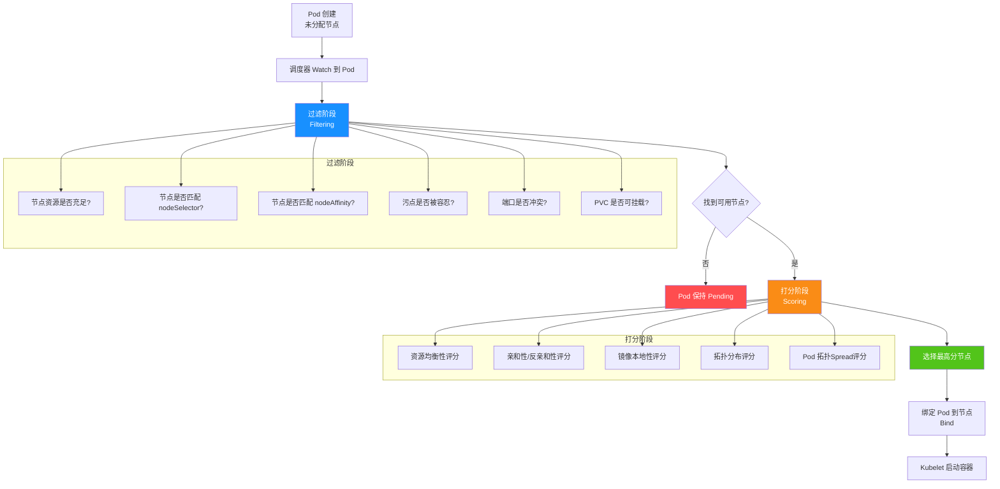
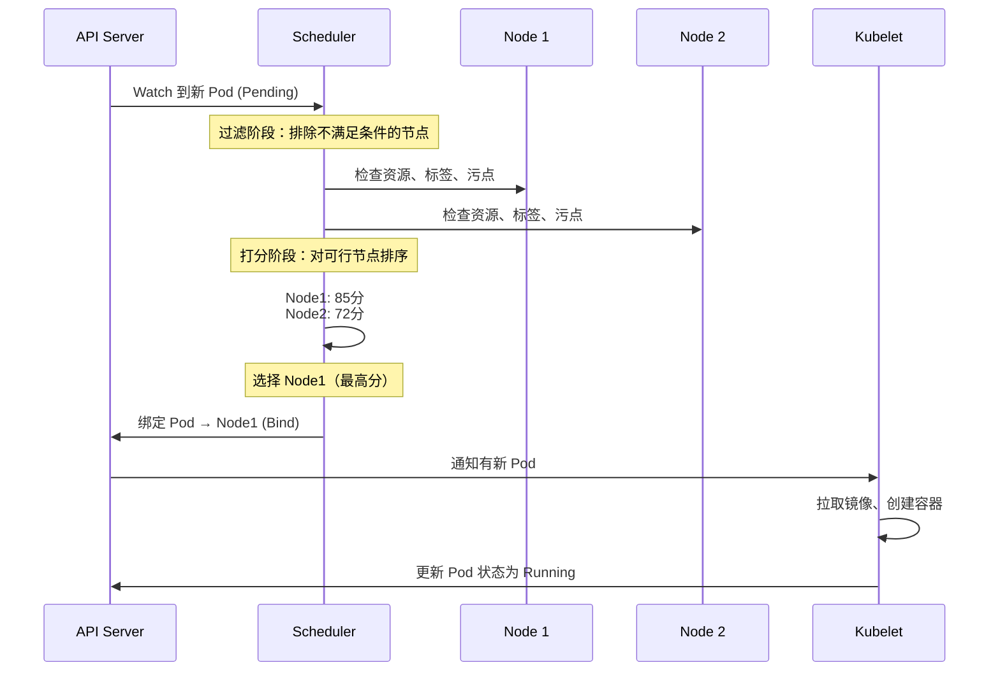
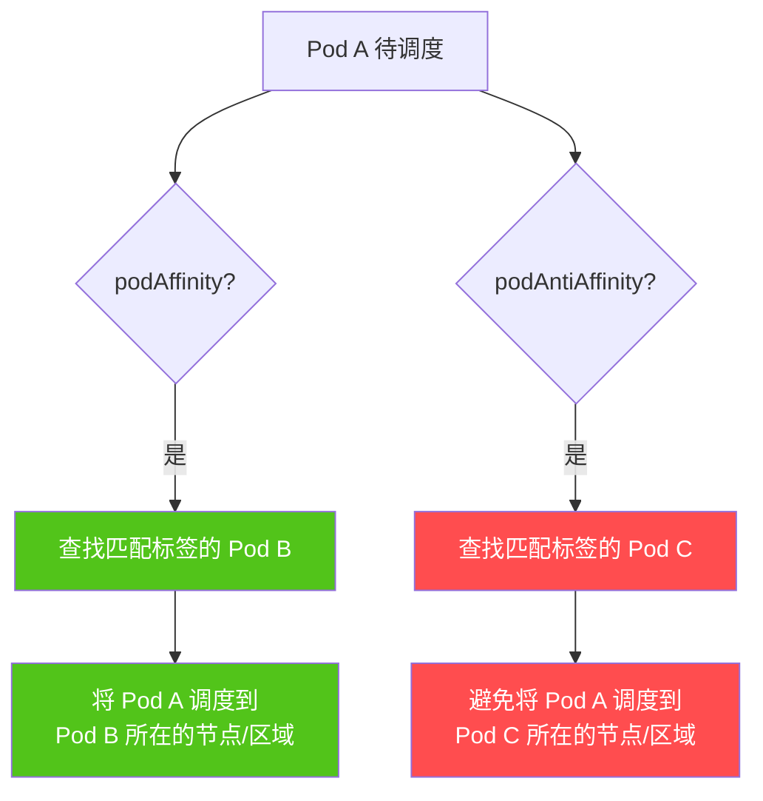
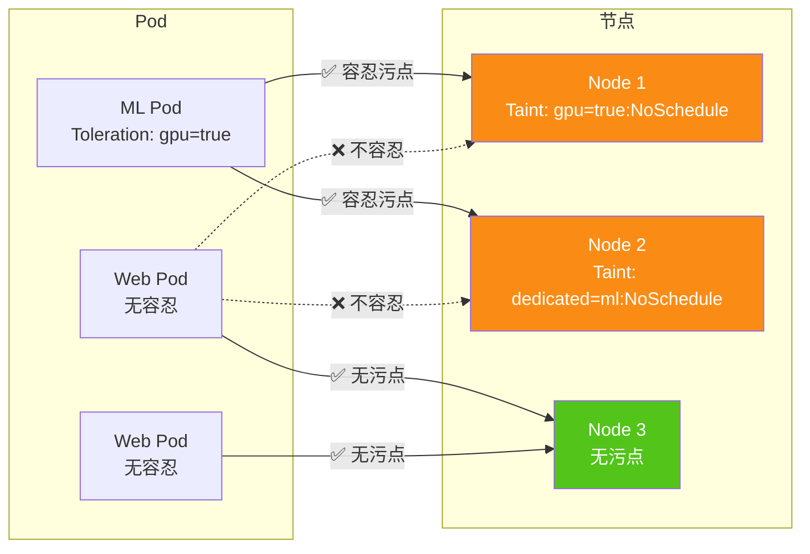
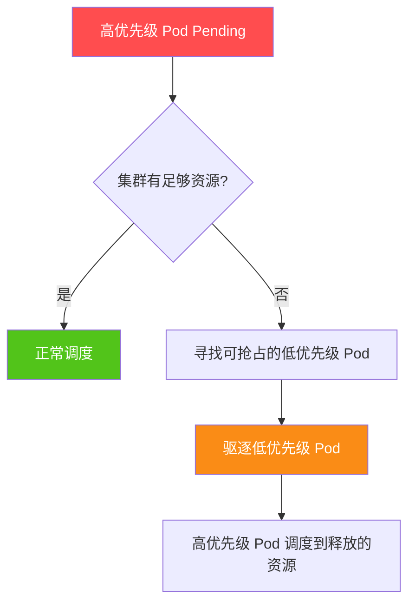
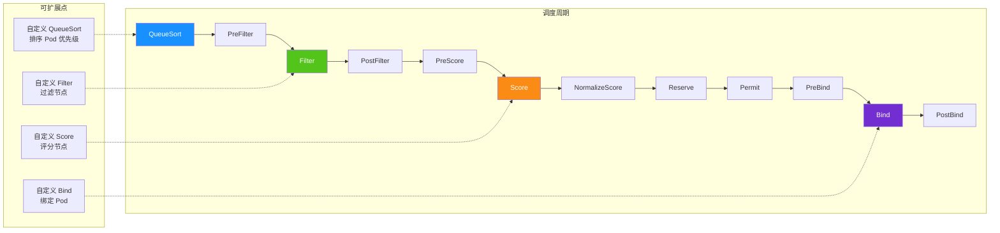
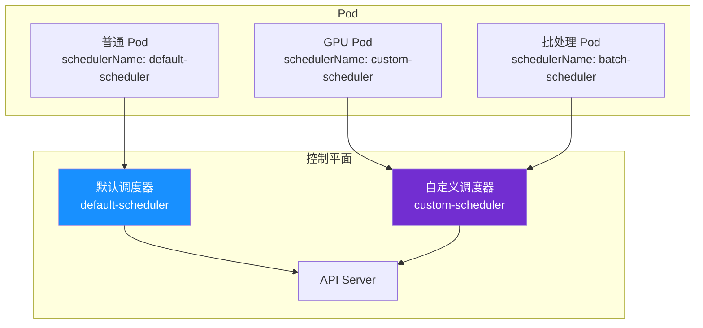
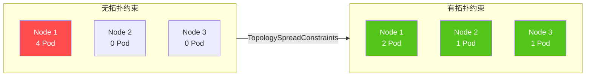
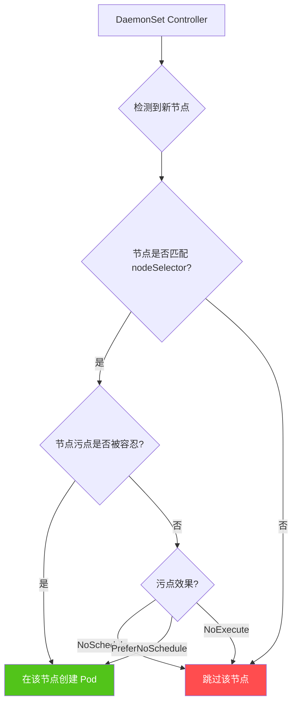

# 调度与亲和性

> Kubernetes 调度器是集群的大脑——决定每个 Pod 运行在哪里。
> 从简单的 nodeSelector 到复杂的亲和性规则、污点容忍、优先级抢占，
> 掌握调度机制是构建高可用、高性能集群的关键能力。

## 本章导航

- [K8s 调度器架构](#k8s-调度器架构)
- [nodeSelector 简单调度](#nodeselector-简单调度)
- [nodeAffinity 节点亲和性](#nodeaffinity-节点亲和性)
- [podAffinity 与 podAntiAffinity](#podaffinity-与-podantiaffinity)
- [污点与容忍](#污点与容忍)
- [优先级与抢占](#优先级与抢占)
- [调度器扩展](#调度器扩展)
- [自定义调度器](#自定义调度器)
- [拓扑分布约束](#拓扑分布约束)
- [调度失败排查](#调度失败排查)
- [GPU 调度](#gpu-调度)
- [DaemonSet 调度](#daemonset-调度)

---

## K8s 调度器架构

### 调度流程总览

Kubernetes 调度器（kube-scheduler）的核心职责是为每个未调度的 Pod 找到最合适的节点。调度过程分为**过滤（Filtering）**和**打分（Scoring）**两个阶段。



### 调度器详细工作流



### 内置调度插件

Kubernetes 1.22+ 的调度框架（Scheduling Framework）将调度过程拆分为可扩展的插件：

| 阶段 | 插件 | 功能 |
|------|------|------|
| **Filter** | NodeResourcesFit | 检查节点资源是否满足 Pod 需求 |
| **Filter** | NodeName | 检查 Pod 指定的节点名 |
| **Filter** | NodePorts | 检查节点端口是否冲突 |
| **Filter** | TaintToleration | 检查 Pod 是否容忍节点污点 |
| **Filter** | NodeAffinity | 检查节点亲和性 |
| **Filter** | PodTopologySpread | 检查拓扑分布约束 |
| **Score** | NodeResourcesBalancedAllocation | 评分：资源均衡性 |
| **Score** | ImageLocality | 评分：镜像本地性 |
| **Score** | InterPodAffinity | 评分：Pod 亲和性 |
| **Score** | NodeAffinity | 评分：节点亲和性权重 |
| **Bind** | DefaultBinder | 默认绑定器 |

---

## nodeSelector 简单调度

nodeSelector 是最简单的节点调度方式，通过标签匹配将 Pod 调度到特定节点。

### 节点标签管理

```bash
# 查看节点标签
kubectl get nodes --show-labels

# 为节点添加标签
kubectl label nodes node-1 disktype=ssd
kubectl label nodes node-2 disktype=hdd
kubectl label nodes node-1 gpu=nvidia-a100
kubectl label nodes node-3 zone=cn-east-1a

# 查看特定标签的节点
kubectl get nodes -l disktype=ssd
kubectl get nodes -l zone=cn-east-1a

# 删除节点标签
kubectl label nodes node-1 disktype-
```

### 常用内置标签

Kubernetes 节点自动带有以下标签：

```yaml
# 拓扑标签
kubernetes.io/os: linux                    # 操作系统
kubernetes.io/arch: amd64                  # CPU 架构
kubernetes.io/hostname: node-1             # 主机名
topology.kubernetes.io/zone: cn-east-1a    # 可用区
topology.kubernetes.io/region: cn-east-1   # 区域

# 云厂商标签（以 AKS 为例）
kubernetes.io/role: agent                  # 节点角色
agentpool: default                         # 节点池名称
storageprofile: managed                    # 存储类型
storagetier: Premium_LRS                   # 存储层级
```

### nodeSelector 使用

```yaml
apiVersion: v1
kind: Pod
metadata:
  name: ssd-app
  namespace: production
spec:
  nodeSelector:
    disktype: ssd          # 只调度到有 SSD 的节点
  containers:
    - name: app
      image: registry.example.com/app:v1.0.0
      ports:
        - containerPort: 8080
---
# 多标签匹配（AND 逻辑）
apiVersion: v1
kind: Pod
metadata:
  name: gpu-ml-job
  namespace: ml
spec:
  nodeSelector:
    gpu: nvidia-a100       # 必须有 A100 GPU
    zone: cn-east-1a       # 必须在 cn-east-1a 可用区
  containers:
    - name: ml-job
      image: registry.example.com/ml-job:v1.0.0
      resources:
        limits:
          nvidia.com/gpu: 1
```

::: tip nodeSelector vs nodeAffinity
- **nodeSelector**：简单、精确匹配、只支持 AND 逻辑
- **nodeAffinity**：灵活、支持 In/NotIn/Exists 等操作符、支持软/硬条件
- 推荐优先使用 nodeAffinity，除非场景非常简单
:::

---

## nodeAffinity 节点亲和性

nodeAffinity 提供比 nodeSelector 更丰富的节点选择能力，支持**硬性要求**和**软性偏好**。

### 亲和性类型对比

| 类型 | 字段 | 行为 | 使用场景 |
|------|------|------|---------|
| **requiredDuringSchedulingIgnoredDuringExecution** | `required` | 必须满足，否则不调度 | GPU 节点、特定硬件 |
| **preferredDuringSchedulingIgnoredDuringExecution** | `preferred` | 尽量满足，不满足也可调度 | 偏好区域、偏好节点类型 |

::: important 名称解读
- `DuringScheduling`：调度时生效
- `IgnoredDuringExecution`：运行后忽略（节点标签变化不影响已运行的 Pod）
- 未来将支持 `RequiredDuringSchedulingRequiredDuringExecution`（运行中标签变化会驱逐 Pod）
:::

### required 硬性亲和性

```yaml
apiVersion: v1
kind: Pod
metadata:
  name: high-perf-app
  namespace: production
spec:
  affinity:
    nodeAffinity:
      requiredDuringSchedulingIgnoredDuringExecution:
        nodeSelectorTerms:
          # 多个 nodeSelectorTerms 之间是 OR 关系
          - matchExpressions:
              # 多个 matchExpressions 之间是 AND 关系
              - key: disktype
                operator: In
                values:
                  - ssd
                  - nvme
              - key: zone
                operator: In
                values:
                  - cn-east-1a
                  - cn-east-1b
          - matchExpressions:
              # 另一个 OR 条件：GPU 节点也可以
              - key: gpu
                operator: Exists
  containers:
    - name: app
      image: registry.example.com/app:v1.0.0
```

### preferred 软性亲和性

```yaml
apiVersion: v1
kind: Pod
metadata:
  name: web-app
  namespace: production
spec:
  affinity:
    nodeAffinity:
      preferredDuringSchedulingIgnoredDuringExecution:
        # 权重 1-100，越高越优先
        - weight: 80
          preference:
            matchExpressions:
              - key: zone
                operator: In
                values:
                  - cn-east-1a
        - weight: 50
          preference:
            matchExpressions:
              - key: disktype
                operator: In
                values:
                  - ssd
        - weight: 20
          preference:
            matchExpressions:
              - key: node-type
                operator: In
                values:
                  - high-memory
  containers:
    - name: app
      image: registry.example.com/app:v1.0.0
```

### 操作符详解

| 操作符 | 含义 | 示例 |
|--------|------|------|
| `In` | 标签值在给定列表中 | `zone In [cn-east-1a, cn-east-1b]` |
| `NotIn` | 标签值不在给定列表中 | `env NotIn [dev, test]` |
| `Exists` | 标签存在（不检查值） | `gpu Exists` |
| `DoesNotExist` | 标签不存在 | `debug DoesNotExist` |
| `Gt` | 标签值大于给定值（数值比较） | `priority Gt 5` |
| `Lt` | 标签值小于给定值（数值比较） | `priority Lt 10` |

### 生产级 nodeAffinity 示例

```yaml
apiVersion: apps/v1
kind: Deployment
metadata:
  name: api-gateway
  namespace: production
spec:
  replicas: 6
  selector:
    matchLabels:
      app: api-gateway
  template:
    metadata:
      labels:
        app: api-gateway
    spec:
      affinity:
        nodeAffinity:
          # 硬性要求：必须部署在生产节点
          requiredDuringSchedulingIgnoredDuringExecution:
            nodeSelectorTerms:
              - matchExpressions:
                  - key: node-role
                    operator: In
                    values:
                      - production
                  - key: zone
                    operator: In
                    values:
                      - cn-east-1a
                      - cn-east-1b
          # 软性偏好：优先 SSD 节点
          preferredDuringSchedulingIgnoredDuringExecution:
            - weight: 80
              preference:
                matchExpressions:
                  - key: disktype
                    operator: In
                    values:
                      - ssd
            - weight: 50
              preference:
                matchExpressions:
                  - key: node-pool
                    operator: In
                    values:
                      - high-cpu
      containers:
        - name: api-gateway
          image: registry.example.com/api-gateway:v2.0.0
          resources:
            requests:
              cpu: "1000m"
              memory: "1Gi"
            limits:
              cpu: "2000m"
              memory: "2Gi"
```

---

## podAffinity 与 podAntiAffinity

podAffinity 和 podAntiAffinity 让 Pod 根据**其他 Pod 的标签**来决定调度位置，而不是根据节点标签。

### 亲和性调度决策流程



### podAffinity 示例

```yaml
apiVersion: apps/v1
kind: Deployment
metadata:
  name: cache-proxy
  namespace: production
spec:
  replicas: 3
  selector:
    matchLabels:
      app: cache-proxy
  template:
    metadata:
      labels:
        app: cache-proxy
    spec:
      affinity:
        podAffinity:
          # 硬性要求：与 web-app 部署在同一节点
          requiredDuringSchedulingIgnoredDuringExecution:
            - labelSelector:
                matchExpressions:
                  - key: app
                    operator: In
                    values:
                      - web-app
              # 拓扑域：以节点为粒度
              topologyKey: kubernetes.io/hostname
          # 软性偏好：与 web-app 部署在同一可用区
          preferredDuringSchedulingIgnoredDuringExecution:
            - weight: 80
              podAffinityTerm:
                labelSelector:
                  matchExpressions:
                    - key: app
                      operator: In
                      values:
                        - web-app
                # 拓扑域：以可用区为粒度
                topologyKey: topology.kubernetes.io/zone
      containers:
        - name: cache-proxy
          image: registry.example.com/cache-proxy:v1.0.0
```

### podAntiAffinity 示例

```yaml
apiVersion: apps/v1
kind: Deployment
metadata:
  name: web-app
  namespace: production
spec:
  replicas: 4
  selector:
    matchLabels:
      app: web-app
  template:
    metadata:
      labels:
        app: web-app
    spec:
      affinity:
        podAntiAffinity:
          # 硬性要求：同一节点不运行两个 web-app Pod
          requiredDuringSchedulingIgnoredDuringExecution:
            - labelSelector:
                matchExpressions:
                  - key: app
                    operator: In
                    values:
                      - web-app
              topologyKey: kubernetes.io/hostname
          # 软性偏好：尽量避免同一可用区运行过多 web-app Pod
          preferredDuringSchedulingIgnoredDuringExecution:
            - weight: 100
              podAffinityTerm:
                labelSelector:
                  matchExpressions:
                    - key: app
                      operator: In
                      values:
                        - web-app
                topologyKey: topology.kubernetes.io/zone
      containers:
        - name: web-app
          image: registry.example.com/web-app:v1.0.0
```

### 生产级 Pod 反亲和性配置

```yaml
apiVersion: apps/v1
kind: Deployment
metadata:
  name: api-server
  namespace: production
spec:
  replicas: 6
  selector:
    matchLabels:
      app: api-server
  template:
    metadata:
      labels:
        app: api-server
        version: v2.1.0
    spec:
      affinity:
        # 节点亲和性：优先高 CPU 节点
        nodeAffinity:
          preferredDuringSchedulingIgnoredDuringExecution:
            - weight: 60
              preference:
                matchExpressions:
                  - key: node-pool
                    operator: In
                    values:
                      - high-cpu
        # Pod 反亲和性：分散部署
        podAntiAffinity:
          # 硬性：每个节点最多 1 个 api-server Pod
          requiredDuringSchedulingIgnoredDuringExecution:
            - labelSelector:
                matchExpressions:
                  - key: app
                    operator: In
                    values:
                      - api-server
              topologyKey: kubernetes.io/hostname
          # 软性：每个可用区尽量均匀分布
          preferredDuringSchedulingIgnoredDuringExecution:
            - weight: 100
              podAffinityTerm:
                labelSelector:
                  matchExpressions:
                    - key: app
                      operator: In
                      values:
                        - api-server
                topologyKey: topology.kubernetes.io/zone
      containers:
        - name: api-server
          image: registry.example.com/api-server:v2.1.0
          resources:
            requests:
              cpu: "1000m"
              memory: "1Gi"
            limits:
              cpu: "2000m"
              memory: "2Gi"
```

::: warning podAntiAffinity 的性能影响
- `required` 硬性反亲和性会**显著增加调度延迟**，因为调度器需要检查每个节点上的所有 Pod
- 大规模集群（1000+ 节点）建议只使用 `preferred` 软性反亲和性
- 对于"每节点最多 N 个 Pod"的需求，推荐使用 **TopologySpreadConstraints**（见下文）
:::

### 亲和性对比总结

| 类型 | 调度依据 | 硬性/软性 | 常见场景 |
|------|---------|----------|---------|
| **nodeAffinity** | 节点标签 | required / preferred | 指定硬件、可用区 |
| **podAffinity** | 其他 Pod 位置 | required / preferred | 服务就近部署 |
| **podAntiAffinity** | 其他 Pod 位置 | required / preferred | 高可用分散部署 |

---

## 污点与容忍

### 污点（Taint）与容忍（Toleration）概念

污点（Taint）打在**节点**上，表示"我不欢迎某些 Pod"；容忍（Toleration）打在**Pod**上，表示"我能接受这个污点"。只有 Pod 容忍了节点的所有污点，才可能被调度到该节点。



### 污点效果（Effect）

| Effect | 行为 | 使用场景 |
|--------|------|---------|
| **NoSchedule** | 不调度新 Pod（已运行的 Pod 不受影响） | 专用节点 |
| **PreferNoSchedule** | 尽量不调度（软性，资源紧张时可能调度） | 优先级较低的专用 |
| **NoExecute** | 不调度新 Pod + 驱逐已运行的不容忍 Pod | 节点故障/维护 |

### 节点污点管理

```bash
# 添加污点
kubectl taint nodes node-1 dedicated=gpu:NoSchedule
kubectl taint nodes node-2 dedicated=ml:NoSchedule
kubectl taint nodes node-3 zone=restricted:NoExecute

# 查看节点污点
kubectl describe node node-1 | grep Taints

# 删除污点
kubectl taint nodes node-1 dedicated=gpu:NoSchedule-
kubectl taint nodes node-1 dedicated-  # 删除所有 dedicated 相关的污点
```

### 内置污点

Kubernetes 自动为节点添加以下污点：

```bash
# 节点不可达
node.kubernetes.io/not-ready:NoExecute

# 节点不可达（网络分区）
node.kubernetes.io/unreachable:NoExecute

# 节点磁盘压力
node.kubernetes.io/disk-pressure:NoSchedule

# 节点内存压力
node.kubernetes.io/memory-pressure:NoSchedule

# 节点 PID 压力
node.kubernetes.io/pid-pressure:NoSchedule

# 节点网络不可用
node.kubernetes.io/network-unavailable:NoSchedule

# 节点未就绪
node.kubernetes.io/not-ready:NoSchedule
```

### Pod 容忍配置

```yaml
apiVersion: v1
kind: Pod
metadata:
  name: gpu-job
  namespace: ml
spec:
  tolerations:
    # 精确匹配：key + value + effect
    - key: "dedicated"
      operator: "Equal"
      value: "gpu"
      effect: "NoSchedule"

    # Exists 匹配：只要 key 存在即可
    - key: "dedicated"
      operator: "Exists"
      effect: "NoSchedule"

    # 容忍所有 dedicated 污点（不检查 value 和 effect）
    - key: "dedicated"
      operator: "Exists"

    # 容忍所有污点（万能钥匙）
    - operator: "Exists"

    # 容忍内置污点：节点 NotReady 时等待 300 秒
    - key: "node.kubernetes.io/not-ready"
      operator: "Exists"
      effect: "NoExecute"
      tolerationSeconds: 300

    # 容忍内置污点：节点不可达时等待 300 秒
    - key: "node.kubernetes.io/unreachable"
      operator: "Exists"
      effect: "NoExecute"
      tolerationSeconds: 300
  containers:
    - name: gpu-job
      image: registry.example.com/gpu-job:v1.0.0
      resources:
        limits:
          nvidia.com/gpu: 1
```

### 专用节点实现

```bash
# 1. 为节点添加污点（防止普通 Pod 调度）
kubectl taint nodes gpu-node-1 dedicated=gpu:NoSchedule
kubectl taint nodes gpu-node-2 dedicated=gpu:NoSchedule

# 2. 为 GPU Pod 添加容忍
# （见下方 Deployment 配置）

# 3. 同时添加标签（用于 nodeAffinity 辅助）
kubectl label nodes gpu-node-1 gpu=nvidia-a100
kubectl label nodes gpu-node-2 gpu=nvidia-a100
```

```yaml
apiVersion: apps/v1
kind: Deployment
metadata:
  name: ml-training
  namespace: ml
spec:
  replicas: 2
  selector:
    matchLabels:
      app: ml-training
  template:
    metadata:
      labels:
        app: ml-training
    spec:
      # 容忍 GPU 节点污点
      tolerations:
        - key: "dedicated"
          operator: "Equal"
          value: "gpu"
          effect: "NoSchedule"
      # 优先调度到 GPU 节点
      affinity:
        nodeAffinity:
          requiredDuringSchedulingIgnoredDuringExecution:
            nodeSelectorTerms:
              - matchExpressions:
                  - key: gpu
                    operator: In
                    values:
                      - nvidia-a100
      containers:
        - name: ml-training
          image: registry.example.com/ml-training:v1.0.0
          resources:
            limits:
              nvidia.com/gpu: 1
              cpu: "4"
              memory: "16Gi"
```

::: important 污点 + 标签双重保障
1. **污点**：防止不配容忍的 Pod 调度到专用节点
2. **标签 + nodeAffinity**：确保需要专用资源的 Pod 优先调度到正确节点
3. 两者配合使用才能实现真正的"专用节点"效果
:::

---

## 优先级与抢占

### PriorityClass 概念

当集群资源不足时，Kubernetes 会根据 Pod 的**优先级**决定：
1. 哪些 Pod 优先调度
2. 是否驱逐低优先级 Pod（**抢占**）来为高优先级 Pod 腾出空间



### PriorityClass 定义

```yaml
# 系统关键优先级
apiVersion: scheduling.k8s.io/v1
kind: PriorityClass
metadata:
  name: system-critical
description: "系统关键服务（etcd、API Server 等）"
value: 1000000
globalDefault: false
preemptionPolicy: PreemptLowerPriority
---
# 生产高优先级
apiVersion: scheduling.k8s.io/v1
kind: PriorityClass
metadata:
  name: production-high
description: "生产环境高优先级服务（支付、网关）"
value: 100000
globalDefault: false
preemptionPolicy: PreemptLowerPriority
---
# 生产普通优先级
apiVersion: scheduling.k8s.io/v1
kind: PriorityClass
metadata:
  name: production-normal
description: "生产环境普通服务"
value: 10000
globalDefault: false
preemptionPolicy: PreemptLowerPriority
---
# 批处理低优先级
apiVersion: scheduling.k8s.io/v1
kind: PriorityClass
metadata:
  name: batch-low
description: "批处理任务，可被抢占"
value: 1000
globalDefault: false
preemptionPolicy: PreemptLowerPriority
---
# 最佳努力（最低优先级）
apiVersion: scheduling.k8s.io/v1
kind: PriorityClass
metadata:
  name: best-effort
description: "最低优先级，最先被抢占"
value: 100
globalDefault: false
preemptionPolicy: PreemptLowerPriority
---
# 默认优先级
apiVersion: scheduling.k8s.io/v1
kind: PriorityClass
metadata:
  name: default-priority
description: "默认优先级"
value: 5000
globalDefault: true        # 设为全局默认
preemptionPolicy: PreemptLowerPriority
```

### Pod 使用 PriorityClass

```yaml
apiVersion: v1
kind: Pod
metadata:
  name: payment-service
  namespace: production
spec:
  priorityClassName: production-high    # 引用 PriorityClass
  containers:
    - name: payment-service
      image: registry.example.com/payment:v1.0.0
---
apiVersion: v1
kind: Pod
metadata:
  name: data-pipeline
  namespace: production
spec:
  priorityClassName: batch-low          # 低优先级，可被抢占
  containers:
    - name: data-pipeline
      image: registry.example.com/pipeline:v1.0.0
```

::: warning 抢占的注意事项
1. **抢占是最后的手段**：调度器会优先尝试在空闲资源上调度，只有所有可行节点都被占用时才触发抢占
2. **抢占有优雅期**：被抢占的 Pod 会收到 SIGTERM，有 `terminationGracePeriodSeconds` 的宽限期
3. **PDB 保护**：PodDisruptionBudget 可以阻止抢占（如果驱逐会违反 PDB）
4. **抢占可能失败**：如果找不到满足 PDB 的可抢占 Pod，抢占不会执行
5. **谨慎设置 globalDefault**：只应设一个 PriorityClass 为 globalDefault
:::

---

## 调度器扩展

### Scheduler Framework

Kubernetes 1.19+ 引入的 Scheduling Framework 允许通过插件扩展调度器行为，无需修改调度器源码。



### 调度器配置

```yaml
apiVersion: kubescheduler.config.k8s.io/v1
kind: KubeSchedulerConfiguration
profiles:
  - schedulerName: default-scheduler
    plugins:
      # Filter 阶段启用自定义插件
      filter:
        enabled:
          - name: NodeResourcesFit
          - name: NodePorts
          - name: TaintToleration
          - name: NodeAffinity
          - name: CustomNodeFilter       # 自定义过滤插件
      # Score 阶段启用自定义插件
      score:
        enabled:
          - name: NodeResourcesBalancedAllocation
            weight: 1
          - name: ImageLocality
            weight: 1
          - name: CustomNodeScorer       # 自定义评分插件
            weight: 2                    # 权重翻倍
      # Bind 阶段
      bind:
        enabled:
          - name: DefaultBinder
```

### 自定义调度插件示例（Go）

```go
// 自定义 Filter 插件：检查节点是否有特定标签
package main

import (
    "context"
    v1 "k8s.io/api/core/v1"
    "k8s.io/kubernetes/pkg/scheduler/framework"
)

type CustomNodeFilter struct{}

var _ framework.FilterPlugin = &CustomNodeFilter{}

const Name = "CustomNodeFilter"

func (pl *CustomNodeFilter) Name() string { return Name }

func (pl *CustomNodeFilter) Filter(
    ctx context.Context,
    state *framework.CycleState,
    pod *v1.Pod,
    nodeInfo *framework.NodeInfo,
) *framework.Status {
    // 自定义逻辑：只允许调度到有 env=production 标签的节点
    labels := nodeInfo.Node().Labels
    if env, ok := labels["env"]; !ok || env != "production" {
        return framework.NewStatus(framework.Unschedulable, "node does not have env=production label")
    }
    return nil
}
```

---

## 自定义调度器

### 多调度器架构

Kubernetes 支持运行多个调度器，每个 Pod 可以选择使用哪个调度器。



### 使用自定义调度器

```yaml
apiVersion: v1
kind: Pod
metadata:
  name: gpu-pod
  namespace: ml
spec:
  schedulerName: custom-scheduler    # 指定调度器
  containers:
    - name: gpu-job
      image: registry.example.com/gpu-job:v1.0.0
      resources:
        limits:
          nvidia.com/gpu: 1
```

### 自定义调度器实现要点

```go
// 简化的自定义调度器
package main

import (
    "context"
    "fmt"

    v1 "k8s.io/api/core/v1"
    metav1 "k8s.io/apimachinery/pkg/apis/meta/v1"
    "k8s.io/client-go/informers"
    "k8s.io/client-go/kubernetes"
    "k8s.io/client-go/tools/cache"
    "k8s.io/client-go/tools/clientcmd"
)

func main() {
    config, _ := clientcmd.BuildConfigFromFlags("", "")
    clientset, _ := kubernetes.NewForConfig(config)

    factory := informers.NewSharedInformerFactory(clientset, 0)
    podInformer := factory.Core().V1().Pods().Informer()
    nodeInformer := factory.Core().V1().Nodes().Informer()

    // 监听 Pending Pod
    podInformer.AddEventHandler(cache.ResourceEventHandlerFuncs{
        AddFunc: func(obj interface{}) {
            pod := obj.(*v1.Pod)
            if pod.Spec.SchedulerName != "custom-scheduler" {
                return
            }
            if pod.Spec.NodeName != "" {
                return // 已调度
            }

            // 自定义调度逻辑
            node := schedule(pod, nodeInformer)
            if node != "" {
                // 绑定 Pod 到节点
                binding := &v1.Binding{
                    ObjectMeta: metav1.ObjectMeta{Name: pod.Name, UID: pod.UID},
                    Target:     v1.ObjectReference{Kind: "Node", Name: node},
                }
                clientset.CoreV1().Pods(pod.Namespace).Bind(
                    context.TODO(), binding, metav1.CreateOptions{},
                )
            }
        },
    })

    factory.Start(context.TODO().Done())
    select {} // 阻塞
}

func schedule(pod *v1.Pod, nodeInformer cache.SharedIndexInformer) string {
    // 自定义调度算法
    for _, obj := range nodeInformer.GetStore().List() {
        node := obj.(*v1.Node)
        // 检查 GPU 资源等自定义逻辑
        if hasGPU(node) {
            return node.Name
        }
    }
    return ""
}

func hasGPU(node *v1.Node) bool {
    for _, addr := range node.Status.Addresses {
        if addr.Type == v1.NodeInternalIP {
            // 简化检查逻辑
            return true
        }
    }
    return false
}
```

---

## 拓扑分布约束

### TopologySpreadConstraints 概念

TopologySpreadConstraints（拓扑分布约束）是比 podAntiAffinity 更精细的 Pod 分布控制机制，可以确保 Pod 在拓扑域（节点、可用区等）之间均匀分布。



### 配置示例

```yaml
apiVersion: apps/v1
kind: Deployment
metadata:
  name: web-app
  namespace: production
spec:
  replicas: 6
  selector:
    matchLabels:
      app: web-app
  template:
    metadata:
      labels:
        app: web-app
    spec:
      topologySpreadConstraints:
        # 约束1：按节点均匀分布
        - maxSkew: 1                          # 最大偏差：拓扑域间最多差 1 个 Pod
          topologyKey: kubernetes.io/hostname  # 拓扑域键：按节点划分
          whenUnsatisfiable: DoNotSchedule     # 不满足时不调度（硬性）
          labelSelector:
            matchLabels:
              app: web-app
        # 约束2：按可用区均匀分布
        - maxSkew: 1
          topologyKey: topology.kubernetes.io/zone  # 拓扑域键：按可用区划分
          whenUnsatisfiable: ScheduleAnyway         # 不满足时也调度（软性）
          labelSelector:
            matchLabels:
              app: web-app
      containers:
        - name: web-app
          image: registry.example.com/web-app:v1.0.0
```

### maxSkew 与 whenUnsatisfiable

| 参数 | 含义 | 效果 |
|------|------|------|
| `maxSkew: 1` | 拓扑域间 Pod 数量差最大为 1 | 尽量均匀分布 |
| `maxSkew: 2` | 拓扑域间 Pod 数量差最大为 2 | 允许一定不均匀 |
| `whenUnsatisfiable: DoNotSchedule` | 硬性约束，不满足不调度 | 确保均匀，可能 Pending |
| `whenUnsatisfiable: ScheduleAnyway` | 软性约束，尽量满足 | 优先均匀，不强制 |

### 生产级拓扑分布配置

```yaml
apiVersion: apps/v1
kind: Deployment
metadata:
  name: api-server
  namespace: production
spec:
  replicas: 6
  selector:
    matchLabels:
      app: api-server
  template:
    metadata:
      labels:
        app: api-server
    spec:
      topologySpreadConstraints:
        # 节点级均匀分布（硬性）
        - maxSkew: 1
          topologyKey: kubernetes.io/hostname
          whenUnsatisfiable: DoNotSchedule
          labelSelector:
            matchLabels:
              app: api-server
          # 指定可选节点（配合 nodeAffinity 使用）
          matchLabelKeys:
            - app
          # 最小可用域数
          minDomains: 3
          # 节点亲和性策略
          nodeAffinityPolicy: Honor
          # 节点污点策略
          nodeTaintsPolicy: Honor
        # 可用区级均匀分布（软性）
        - maxSkew: 1
          topologyKey: topology.kubernetes.io/zone
          whenUnsatisfiable: ScheduleAnyway
          labelSelector:
            matchLabels:
              app: api-server
      affinity:
        nodeAffinity:
          requiredDuringSchedulingIgnoredDuringExecution:
            nodeSelectorTerms:
              - matchExpressions:
                  - key: node-role
                    operator: In
                    values:
                      - production
      containers:
        - name: api-server
          image: registry.example.com/api-server:v2.1.0
          resources:
            requests:
              cpu: "1000m"
              memory: "1Gi"
            limits:
              cpu: "2000m"
              memory: "2Gi"
```

::: tip TopologySpreadConstraints vs podAntiAffinity
- **podAntiAffinity**：简单的"不要在同一节点"，无法控制均匀程度
- **TopologySpreadConstraints**：精确控制分布偏差（maxSkew），支持多拓扑层级

生产推荐：使用 TopologySpreadConstraints 替代 podAntiAffinity 实现高可用部署。
:::

---

## 调度失败排查

### 常见调度失败原因

```mermaid
flowchart TD
    A[Pod Pending] --> B{查看 Unschedulable 原因}
    B --> C[Insufficient cpu/memory]
    B --> D[MatchNodeSelector]
    B --> E[NodeAffinity]
    B --> F[PodToleratesNodeTaints]
    B --> G[Insufficient persistent volumes]
    B --> H[MaxSkew exceeded]

    C --> C1[扩容节点或减少 Pod 资源请求]
    D --> D1[检查节点标签和 nodeSelector]
    E --> E1[检查节点标签和 nodeAffinity 规则]
    F --> F1[添加容忍或移除节点污点]
    G --> G1[创建 PV 或调整 PVC]
    H --> H1[调整 maxSkew 或增加节点]

    style C fill:#FF4D4F,color:#fff
    style D fill:#FA8C16,color:#fff
    style F fill:#1890FF,color:#fff
```



### 排查命令

```bash
# 1. 查看 Pod 事件（最直接的方法）
kubectl describe pod web-app-xxxx -n production | grep -A 20 "Events"

# 常见输出：
# Events:
#   Type     Reason            Age   From               Message
#   ----     ------            ----  ----               -------
#   Warning  FailedScheduling  10s   default-scheduler  0/5 nodes are available:
#          1 Insufficient cpu, 2 node(s) didn't match node selector,
#          2 node(s) had taints that the pod didn't tolerate.

# 2. 查看调度器日志
kubectl logs -n kube-system -l component=kube-scheduler --tail=100

# 3. 查看节点资源
kubectl describe nodes | grep -A 5 "Allocated resources"

# 4. 查看节点污点
kubectl get nodes -o custom-columns=NAME:.metadata.name,TAINTS:.spec.taints

# 5. 查看节点标签
kubectl get nodes --show-labels

# 6. 查看资源配额
kubectl describe resourcequota -n production

# 7. 查看 LimitRange
kubectl describe limitrange -n production
```

### 调度失败详细排查脚本

```bash
#!/bin/bash
# debug-scheduling.sh - 调度失败排查脚本
set -euo pipefail

POD_NAME=$1
NAMESPACE=${2:-default}

echo "========================================="
echo "  调度失败排查: ${POD_NAME}"
echo "========================================="

# 1. Pod 状态
echo -e "\n[1] Pod 状态"
kubectl get pod "$POD_NAME" -n "$NAMESPACE" -o wide

# 2. Pod 事件
echo -e "\n[2] Pod 事件（调度相关）"
kubectl get events -n "$NAMESPACE" --field-selector involvedObject.name="$POD_NAME" \
    --sort-by=.metadata.creationTimestamp | tail -10

# 3. 资源请求
echo -e "\n[3] Pod 资源请求"
kubectl get pod "$POD_NAME" -n "$NAMESPACE" -o jsonpath='{.spec.containers[*].resources.requests}'

# 4. 节点选择器
echo -e "\n[4] 节点选择器"
kubectl get pod "$POD_NAME" -n "$NAMESPACE" -o jsonpath='{.spec.nodeSelector}'
echo ""
kubectl get pod "$POD_NAME" -n "$NAMESPACE" -o jsonpath='{.spec.affinity}'

# 5. 容忍
echo -e "\n[5] 容忍"
kubectl get pod "$POD_NAME" -n "$NAMESPACE" -o jsonpath='{.spec.tolerations}'

# 6. 节点资源概览
echo -e "\n[6] 节点资源概览"
kubectl top nodes 2>/dev/null || echo "Metrics Server 未安装"

# 7. 可用节点列表
echo -e "\n[7] 可用节点"
kubectl get nodes -o wide

echo -e "\n========================================="
echo "  排查完成"
echo "========================================="
```

---

## GPU 调度

### GPU 资源管理

Kubernetes 通过设备插件（Device Plugin）机制管理 GPU 资源。

```yaml
# NVIDIA Device Plugin DaemonSet
apiVersion: apps/v1
kind: DaemonSet
metadata:
  name: nvidia-device-plugin-daemonset
  namespace: kube-system
spec:
  selector:
    matchLabels:
      name: nvidia-device-plugin-ds
  template:
    metadata:
      labels:
        name: nvidia-device-plugin-ds
    spec:
      tolerations:
        - key: nvidia.com/gpu
          operator: Exists
          effect: NoSchedule
      containers:
        - name: nvidia-device-plugin-ctr
          image: nvcr.io/nvidia/k8s-device-plugin:v0.14.0
          env:
            - name: FAIL_ON_INIT_ERROR
              value: "false"
          securityContext:
            allowPrivilegeEscalation: false
            capabilities:
              drop: ["ALL"]
          volumeMounts:
            - name: device-plugin
              mountPath: /var/lib/kubelet/device-plugins
      volumes:
        - name: device-plugin
          hostPath:
            path: /var/lib/kubelet/device-plugins
```

### GPU Pod 调度

```yaml
apiVersion: v1
kind: Pod
metadata:
  name: gpu-training
  namespace: ml
spec:
  restartPolicy: OnFailure
  tolerations:
    - key: nvidia.com/gpu
      operator: Exists
      effect: NoSchedule
  containers:
    - name: training
      image: nvcr.io/nvidia/pytorch:23.10-py3
      command: ["python", "train.py"]
      resources:
        limits:
          nvidia.com/gpu: 2      # 请求 2 块 GPU
          cpu: "8"
          memory: "32Gi"
      volumeMounts:
        - name: training-data
          mountPath: /data
  volumes:
    - name: training-data
      persistentVolumeClaim:
        claimName: training-data-pvc
```

### GPU 时间切片（MIG）

对于 NVIDIA A100/H100 等 GPU，支持 MIG（Multi-Instance GPU）将一块 GPU 切分为多个实例：

```yaml
# MIG 配置（在节点上）
# nvidia-smi mig -cgi 1g.10gb,1g.10gb,1g.10gb,1g.10gb,1g.10gb,1g.10gb,1g.10gb -C

# 使用 MIG 实例的 Pod
apiVersion: v1
kind: Pod
metadata:
  name: mig-job
  namespace: ml
spec:
  containers:
    - name: mig-job
      image: nvcr.io/nvidia/pytorch:23.10-py3
      resources:
        limits:
          nvidia.com/mig-1g.10gb: 1  # 使用 1 个 MIG 1g.10gb 实例
```

### GPU 调度最佳实践

| 场景 | GPU 类型 | 调度策略 | 资源配置 |
|------|---------|---------|---------|
| 模型训练 | A100/H100 | 专用节点 + 污点 | nvidia.com/gpu: 2-8 |
| 模型推理 | T4/L4 | 可共享 + 时间切片 | nvidia.com/gpu: 1 |
| 开发测试 | MIG 实例 | MIG 切分 | nvidia.com/mig-1g.10gb: 1 |
| 批处理推理 | T4 | 抢占式 | nvidia.com/gpu: 1 + 低优先级 |

---

## DaemonSet 调度

### DaemonSet 调度机制

DaemonSet 确保每个（或部分）节点上运行一个 Pod 副本，常用于日志采集、监控代理等系统服务。



### DaemonSet 配置

```yaml
apiVersion: apps/v1
kind: DaemonSet
metadata:
  name: fluent-bit
  namespace: logging
  labels:
    app: fluent-bit
spec:
  selector:
    matchLabels:
      app: fluent-bit
  template:
    metadata:
      labels:
        app: fluent-bit
    spec:
      # 容忍所有污点（确保在每个节点运行）
      tolerations:
        - operator: Exists    # 容忍所有污点
      # 节点选择器（可选：只在 Linux 节点运行）
      nodeSelector:
        kubernetes.io/os: linux
      # 优先级：系统级
      priorityClassName: system-critical
      serviceAccountName: fluent-bit
      containers:
        - name: fluent-bit
          image: fluent/fluent-bit:2.2
          resources:
            requests:
              cpu: "50m"
              memory: "64Mi"
            limits:
              cpu: "200m"
              memory: "128Mi"
          volumeMounts:
            - name: varlog
              mountPath: /var/log
            - name: containers
              mountPath: /var/lib/docker/containers
              readOnly: true
      volumes:
        - name: varlog
          hostPath:
            path: /var/log
        - name: containers
          hostPath:
            path: /var/lib/docker/containers
```

### DaemonSet 的容忍策略

```yaml
# 只在特定节点运行
spec:
  template:
    spec:
      nodeSelector:
        node-role: worker    # 只在 worker 节点运行

# 容忍 Master 节点污点（在所有节点运行）
spec:
  template:
    spec:
      tolerations:
        - key: node-role.kubernetes.io/control-plane
          operator: Exists
          effect: NoSchedule
        - key: node-role.kubernetes.io/master
          operator: Exists
          effect: NoSchedule
```

### DaemonSet 更新策略

```yaml
apiVersion: apps/v1
kind: DaemonSet
metadata:
  name: node-exporter
  namespace: monitoring
spec:
  updateStrategy:
    type: RollingUpdate
    rollingUpdate:
      maxUnavailable: 1     # 每次最多 1 个节点上的 Pod 不可用
      # 或按百分比
      # maxUnavailable: "10%"
  selector:
    matchLabels:
      app: node-exporter
  template:
    # ... pod template
```

::: important DaemonSet vs Deployment 选择
- **DaemonSet**：每个节点一个 Pod（日志采集、监控代理、网络插件）
- **Deployment**：指定副本数的 Pod（业务服务、API 网关）
- **StatefulSet**：有序的、有状态的 Pod（数据库、消息队列）

常见 DaemonSet 应用：
- Fluent Bit / Fluentd（日志采集）
- Prometheus Node Exporter（监控）
- Calico / Cilium（网络插件）
- NVIDIA Device Plugin（GPU 管理）
:::

---

## 总结

### 调度策略速查表

| 需求 | 机制 | 类型 | 示例 |
|------|------|------|------|
| 指定硬件节点 | nodeSelector | 硬性 | `disktype: ssd` |
| 优先某些节点 | nodeAffinity preferred | 软性 | 优先高 CPU 节点 |
| 必须某些节点 | nodeAffinity required | 硬性 | 必须在 GPU 节点 |
| 服务就近部署 | podAffinity | 软/硬 | Cache 与 Web 同节点 |
| 高可用分散 | podAntiAffinity | 软/硬 | 同服务不同节点 |
| 均匀分布 | TopologySpreadConstraints | 软/硬 | maxSkew=1 |
| 专用节点 | Taint + Toleration | 硬性 | GPU 节点专用 |
| 优先级控制 | PriorityClass | 抢占 | 关键服务优先 |
| 每节点一个 | DaemonSet | 自动 | 监控代理 |

### 调度决策优先级

1. **nodeSelector** → 最简单，满足则通过
2. **nodeAffinity required** → 硬性要求，不满足排除
3. **Taint/Toleration** → 不容忍则排除
4. **TopologySpreadConstraints** → 分布约束
5. **podAffinity/podAntiAffinity** → Pod 级亲和
6. **nodeAffinity preferred** → 打分加成
7. **podAffinity preferred** → 打分加成
8. **资源均衡** → 打分排序
9. **PriorityClass** → 抢占决策

---

> **参考资源**
> - [Kubernetes Scheduler 官方文档](https://kubernetes.io/docs/concepts/scheduling-eviction/)
> - [Scheduling Framework](https://kubernetes.io/docs/concepts/scheduling-eviction/scheduling-framework/)
> - [Taints and Tolerations](https://kubernetes.io/docs/concepts/scheduling-eviction/taint-and-toleration/)
> - [Pod Overhead](https://kubernetes.io/docs/concepts/scheduling-eviction/pod-overhead/)
> - [Topology Spread Constraints](https://kubernetes.io/docs/concepts/scheduling-eviction/topology-spread-constraints/)
> - [NVIDIA GPU Device Plugin](https://github.com/NVIDIA/k8s-device-plugin)
> - [PriorityClass](https://kubernetes.io/docs/concepts/scheduling-eviction/pod-priority-preemption/)
