# 网络策略与服务网格入门

> 默认情况下，Kubernetes 集群内所有 Pod 可以互相通信——这在生产环境中是不可接受的。
> 从 NetworkPolicy 的细粒度访问控制，到服务网格的零信任网络，
> 本文将带你从「网络隔离」走向「流量治理」的进阶之路。

## 本章导航

- [NetworkPolicy 原理](#networkpolicy-原理)
- [CNI 插件对比](#cni-插件对比)
- [Calico 网络策略实战](#calico-网络策略实战)
- [Cilium eBPF 网络](#cilium-ebpf-网络)
- [服务网格概念与价值](#服务网格概念与价值)
- [Istio 架构](#istio-架构)
- [Sidecar 注入原理](#sidecar-注入原理)
- [mTLS 与零信任网络](#mtls-与零信任网络)
- [流量管理](#流量管理)
- [可观测性](#可观测性)
- [Istio vs Linkerd 对比](#istio-vs-linkerd-对比)
- [服务网格选型决策](#服务网格选型决策)

---

## NetworkPolicy 原理

### 默认网络模型

Kubernetes 默认采用"全连通"网络模型：

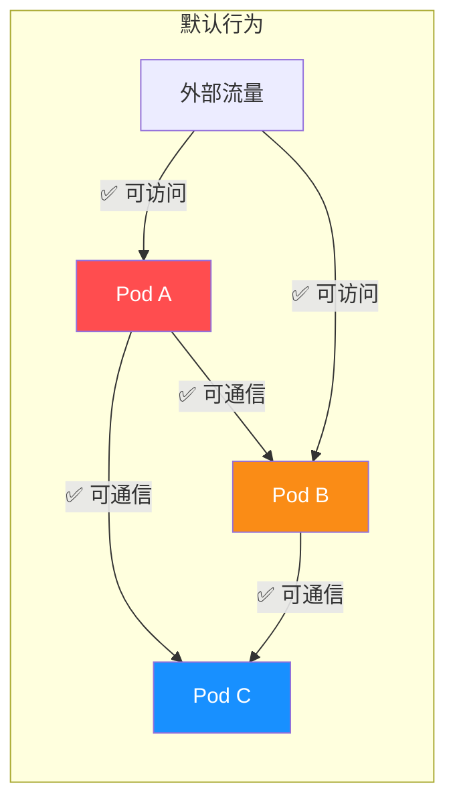

::: warning 默认全连通的安全风险
1. **横向移动攻击**：一个 Pod 被攻破后，可访问集群内所有 Pod
2. **数据泄露**：数据库 Pod 可被任意 Pod 直接访问
3. **误操作**：开发环境的 Pod 可能意外访问生产服务
4. **合规违规**：PCI-DSS、等保等要求网络隔离

**生产环境必须配置 NetworkPolicy！**
:::

### NetworkPolicy 工作原理

NetworkPolicy 是命名空间级别的资源，定义 Pod 的**入站（ingress）**和**出站（egress）**规则。

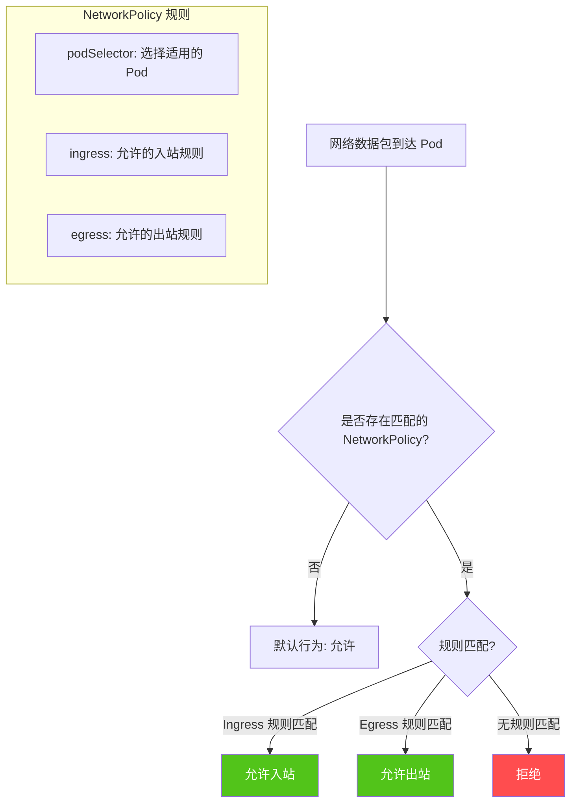

### NetworkPolicy 资源定义

```yaml
apiVersion: networking.k8s.io/v1
kind: NetworkPolicy
metadata:
  name: api-server-policy
  namespace: production
spec:
  # 1. 选择此策略应用于哪些 Pod
  podSelector:
    matchLabels:
      app: api-server

  # 2. 策略类型（必须显式声明）
  policyTypes:
    - Ingress    # 控制入站
    - Egress     # 控制出站

  # 3. 入站规则
  ingress:
    # 规则1：允许来自 web-app 的流量
    - from:
        - podSelector:
            matchLabels:
              app: web-app
          # 跨命名空间需要加上 namespaceSelector
          namespaceSelector:
            matchLabels:
              name: production
      ports:
        - port: 8080
          protocol: TCP

    # 规则2：允许来自监控命名空间的流量
    - from:
        - namespaceSelector:
            matchLabels:
              name: monitoring
      ports:
        - port: 9090
          protocol: TCP

  # 4. 出站规则
  egress:
    # 规则1：允许访问数据库
    - to:
        - podSelector:
            matchLabels:
              app: postgres
      ports:
        - port: 5432
          protocol: TCP

    # 规则2：允许 DNS 解析（必须！）
    - to:
        - namespaceSelector:
            matchLabels:
              name: kube-system
          podSelector:
            matchLabels:
              k8s-app: kube-dns
      ports:
        - port: 53
          protocol: UDP
        - port: 53
          protocol: TCP
```

::: important NetworkPolicy 的关键细节
1. **没有选择任何 Pod**：如果 `podSelector` 为空，则策略应用于命名空间内**所有 Pod**
2. **没有 ingress 规则**：如果声明了 Ingress 类型但没有规则，则**禁止所有入站**
3. **没有 egress 规则**：如果声明了 Egress 类型但没有规则，则**禁止所有出站**
4. **DNS 必须放行**：几乎所有 Pod 都需要 DNS 解析，出站规则必须放行 53 端口
5. **多个 NetworkPolicy 是叠加关系**：Pod 被多条策略匹配时，规则取并集（允许的合并）
6. **NetworkPolicy 是命名空间级别的**：跨命名空间需要 `namespaceSelector`
:::

### 常用 NetworkPolicy 模式

#### 模式一：默认拒绝所有入站

```yaml
apiVersion: networking.k8s.io/v1
kind: NetworkPolicy
metadata:
  name: deny-all-ingress
  namespace: production
spec:
  podSelector: {}           # 选择所有 Pod
  policyTypes:
    - Ingress               # 没有 ingress 规则 = 拒绝所有入站
```

#### 模式二：默认拒绝所有出站

```yaml
apiVersion: networking.k8s.io/v1
kind: NetworkPolicy
metadata:
  name: deny-all-egress
  namespace: production
spec:
  podSelector: {}
  policyTypes:
    - Egress                # 没有 egress 规则 = 拒绝所有出站
```

#### 模式三：默认拒绝所有流量

```yaml
apiVersion: networking.k8s.io/v1
kind: NetworkPolicy
metadata:
  name: deny-all
  namespace: production
spec:
  podSelector: {}
  policyTypes:
    - Ingress
    - Egress
```

#### 模式四：允许同命名空间 Pod 互通

```yaml
apiVersion: networking.k8s.io/v1
kind: NetworkPolicy
metadata:
  name: allow-same-namespace
  namespace: production
spec:
  podSelector: {}
  policyTypes:
    - Ingress
  ingress:
    - from:
        - podSelector: {}  # 同命名空间的所有 Pod
```

#### 模式五：数据库只允许特定服务访问

```yaml
apiVersion: networking.k8s.io/v1
kind: NetworkPolicy
metadata:
  name: postgres-policy
  namespace: production
spec:
  podSelector:
    matchLabels:
      app: postgres
  policyTypes:
    - Ingress
  ingress:
    # 只允许 api-server 和 worker 访问
    - from:
        - podSelector:
            matchLabels:
              app: api-server
        - podSelector:
            matchLabels:
              app: worker
      ports:
        - port: 5432
          protocol: TCP
```

#### 模式六：多层安全策略

```yaml
# 第一层：命名空间级默认拒绝
apiVersion: networking.k8s.io/v1
kind: NetworkPolicy
metadata:
  name: default-deny
  namespace: production
spec:
  podSelector: {}
  policyTypes:
    - Ingress
    - Egress
---
# 第二层：允许 DNS 出站
apiVersion: networking.k8s.io/v1
kind: NetworkPolicy
metadata:
  name: allow-dns-egress
  namespace: production
spec:
  podSelector: {}
  policyTypes:
    - Egress
  egress:
    - to:
        - namespaceSelector:
            matchLabels:
              name: kube-system
      ports:
        - port: 53
          protocol: UDP
        - port: 53
          protocol: TCP
---
# 第三层：允许特定服务间通信
apiVersion: networking.k8s.io/v1
kind: NetworkPolicy
metadata:
  name: allow-api-to-db
  namespace: production
spec:
  podSelector:
    matchLabels:
      app: postgres
  policyTypes:
    - Ingress
  ingress:
    - from:
        - podSelector:
            matchLabels:
              app: api-server
      ports:
        - port: 5432
          protocol: TCP
```

### NetworkPolicy 流量控制图

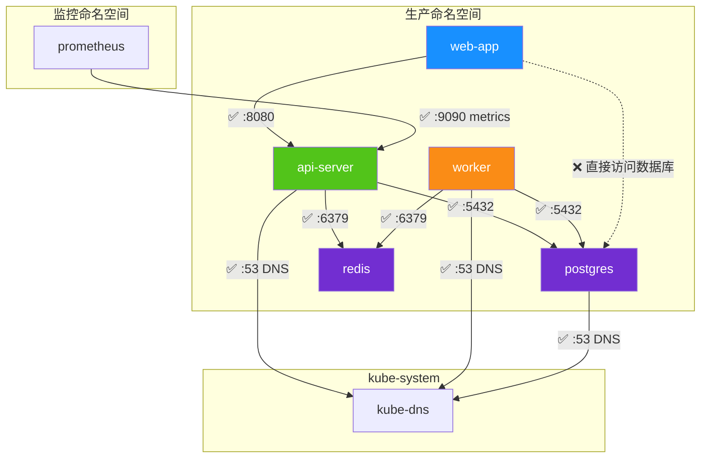

---

## CNI 插件对比

CNI（Container Network Interface）是 Kubernetes 的网络插件接口，不同的 CNI 插件提供不同的网络能力和性能特征。

### CNI 插件全景

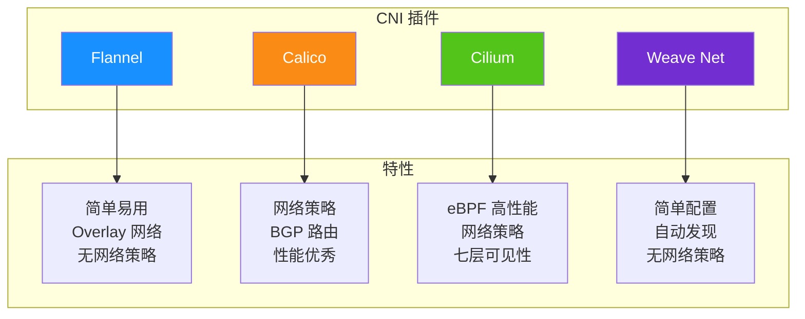

### 详细对比

| 特性 | Flannel | Calico | Cilium | Weave Net |
|------|---------|--------|--------|-----------|
| **网络模式** | Overlay(VXLAN) | BGP/Overlay | eBPF/Overlay/VXLAN | Overlay |
| **网络策略** | ❌ | ✅ | ✅ | ❌ |
| **NetworkPolicy** | ❌ | ✅ | ✅ | ❌ |
| **七层策略** | ❌ | ✅(需 Tigera) | ✅(原生) | ❌ |
| **性能** | 中 | 高 | 最高 | 中 |
| **可观测性** | 低 | 中 | 高(Hubble) | 低 |
| **加密** | ❌ | ✅(WireGuard) | ✅(WireGuard) | ✅(IPsec) |
| **IPv6** | ❌ | ✅ | ✅ | ✅ |
| **eBPF** | ❌ | ❌ | ✅ | ❌ |
| **部署复杂度** | 低 | 中 | 中 | 低 |
| **生产就绪** | 适合小集群 | ✅ | ✅ | 适合小集群 |

### CNI 选型建议

| 场景 | 推荐 CNI | 原因 |
|------|---------|------|
| 学习/测试 | Flannel | 最简单，开箱即用 |
| 生产环境（通用） | Calico | 成熟稳定，网络策略完善 |
| 高性能/可观测 | Cilium | eBPF 性能优势，Hubble 可观测性 |
| 已有 Calico + 需要升级 | Cilium | 平滑迁移，能力升级 |
| 小团队快速起步 | Weave Net | 配置简单，零运维 |

::: tip 生产环境推荐
**首选 Calico 或 Cilium**：
- Calico：经过大规模生产验证，BGP 路由性能优秀，网络策略功能完善
- Cilium：基于 eBPF 的新一代方案，性能最优，七层可观测性强大

两者都支持 NetworkPolicy，但 Cilium 还支持扩展的 CiliumNetworkPolicy（七层规则）。
:::

---

## Calico 网络策略实战

### Calico 安装

```bash
# 使用 Helm 安装 Calico
helm repo add projectcalico https://docs.projectcalico.org/charts
helm repo update
helm install calico projectcalico/tigera-operator --namespace calico-system --create-namespace

# 验证安装
kubectl get pods -n calico-system
kubectl get nodes -o wide
```

### Calico 扩展网络策略

Calico 除了支持标准 Kubernetes NetworkPolicy，还提供扩展的 **CalicoNetworkPolicy** 和 **GlobalNetworkPolicy**：

#### GlobalNetworkPolicy（集群级别）

```yaml
apiVersion: crd.projectcalico.org/v1
kind: GlobalNetworkPolicy
metadata:
  name: default-deny-all
spec:
  # 不指定 namespace，全局生效
  selector: all()
  # 未匹配任何规则的流量
  types:
    - Ingress
    - Egress
  # 默认行为
  ingress:
    - action: Deny
  egress:
    - action: Deny
---
# 全局允许 DNS 出站
apiVersion: crd.projectcalico.org/v1
kind: GlobalNetworkPolicy
metadata:
  name: allow-dns
spec:
  selector: all()
  types:
    - Egress
  egress:
    - action: Allow
      protocol: UDP
      destination:
        ports:
          - 53
    - action: Allow
      protocol: TCP
      destination:
        ports:
          - 53
```

#### CalicoNetworkPolicy（命名空间级别）

```yaml
apiVersion: crd.projectcalico.org/v1
kind: NetworkPolicy
metadata:
  name: api-server-policy
  namespace: production
spec:
  selector: app == 'api-server'
  types:
    - Ingress
    - Egress
  ingress:
    # 允许来自 web-app 的 HTTP 流量
    - action: Allow
      protocol: TCP
      source:
        selector: app == 'web-app'
      destination:
        ports:
          - 8080
    # 允许来自监控的健康检查
    - action: Allow
      protocol: TCP
      source:
        namespace: monitoring
        selector: app == 'prometheus'
      destination:
        ports:
          - 9090
  egress:
    # 允许访问 postgres
    - action: Allow
      protocol: TCP
      destination:
        selector: app == 'postgres'
        ports:
          - 5432
    # 允许访问 redis
    - action: Allow
      protocol: TCP
      destination:
        selector: app == 'redis'
        ports:
          - 6379
```

### Calico 七层策略

```yaml
# Calico 七层策略示例（需要 Tigera Enterprise 或 Calico Enterprise）
apiVersion: crd.projectcalico.org/v1
kind: NetworkPolicy
metadata:
  name: api-seven-layer
  namespace: production
spec:
  selector: app == 'api-server'
  types:
    - Ingress
  ingress:
    # 七层规则：只允许 GET /api/v1 请求
    - action: Allow
      protocol: TCP
      source:
        selector: app == 'web-app'
      destination:
        ports:
          - 8080
      http:
        methods:
          - GET
        paths:
          exact: "/api/v1"
```

### Calico 网络策略调试

```bash
# 查看 Calico 策略
kubectl get globalnetworkpolicy
kubectl get networkpolicy -n production

# 查看策略详情
kubectl describe globalnetworkpolicy default-deny-all

# Calico 节点状态
calicoctl node status

# 查看端点（Pod）的策略
calicoctl get workloadendpoints -n production

# 查看活跃策略
calicoctl get networkpolicy -n production -o yaml

# 抓包调试
kubectl exec -it api-server-xxxx -n production -- \
    tcpdump -i any -nn port 8080
```

---

## Cilium eBPF 网络

### Cilium 架构

Cilium 是基于 eBPF（Extended Berkeley Packet Filter）的新一代网络方案，将网络、安全和可观测性下推到 Linux 内核层。

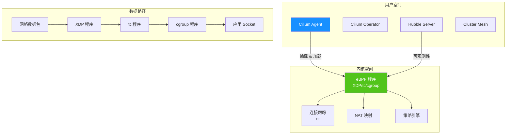

### Cilium 安装

```bash
# 使用 Helm 安装 Cilium
helm repo add cilium https://helm.cilium.io/
helm repo update

# 替换现有 CNI
helm install cilium cilium/cilium \
  --namespace kube-system \
  --set kubeProxyReplacement=strict \
  --set hubble.enabled=true \
  --set hubble.relay.enabled=true \
  --set hubble.ui.enabled=true \
  --set operator.prometheus.enabled=true

# 验证安装
kubectl get pods -n kube-system -l app.kubernetes.io/part-of=cilium
cilium status
cilium connectivity test
```

### CiliumNetworkPolicy

Cilium 扩展了标准 NetworkPolicy，支持七层规则：

```yaml
apiVersion: cilium.io/v2
kind: CiliumNetworkPolicy
metadata:
  name: api-server-l7-policy
  namespace: production
spec:
  endpointSelector:
    matchLabels:
      app: api-server
  ingress:
    # L3/L4 规则：允许来自 web-app 的 TCP 流量
    - fromEndpoints:
        - matchLabels:
            app: web-app
      toPorts:
        - ports:
            - port: "8080"
              protocol: TCP
          # L7 规则：只允许特定 HTTP 方法和路径
          rules:
            http:
              - method: GET
                path: "/api/.*"
              - method: POST
                path: "/api/v1/orders"
              - method: GET
                path: "/health/.*"
---
# Egress L7 策略
apiVersion: cilium.io/v2
kind: CiliumNetworkPolicy
metadata:
  name: api-server-egress-l7
  namespace: production
spec:
  endpointSelector:
    matchLabels:
      app: api-server
  egress:
    # 允许访问 postgres 的 SQL 流量
    - toEndpoints:
        - matchLabels:
            app: postgres
      toPorts:
        - ports:
            - port: "5432"
              protocol: TCP
    # 允许访问外部 API，但限制域名
    - toFQDNs:
        - matchName: "api.stripe.com"
        - matchPattern: "*.amazonaws.com"
      toPorts:
        - ports:
            - port: "443"
              protocol: TCP
```

### CiliumClusterwideNetworkPolicy

```yaml
apiVersion: cilium.io/v2
kind: CiliumClusterwideNetworkPolicy
metadata:
  name: default-deny-all
spec:
  # 不指定 namespace，全局生效
  nodeSelector: {}
  endpointSelector: {}
  ingressDeny:
    - fromEntities:
        - all
  egressDeny:
    - toEntities:
        - all
---
# 全局允许 DNS
apiVersion: cilium.io/v2
kind: CiliumClusterwideNetworkPolicy
metadata:
  name: allow-dns
spec:
  endpointSelector: {}
  egress:
    - toEndpoints:
        - matchLabels:
            k8s-app: kube-dns
      toPorts:
        - ports:
            - port: "53"
              protocol: UDP
            - port: "53"
              protocol: TCP
```

### Hubble 可观测性

```bash
# 启用 Hubble
cilium hubble enable

# 查看实时流量
hubble observe --since 1m

# 查看特定服务的流量
hubble observe --label app=api-server --since 5m

# 查看 DNS 解析
hubble observe --type l7-dns --since 5m

# 查看 HTTP 流量
hubble observe --type l7-http --since 5m

# 查看被策略拒绝的流量
hubble observe --verdict DROPPED --since 5m

# 导出为 PCAP
hubble observe --since 1h -o jsonpb | hubble export pcap > capture.pcap
```

### Cilium vs Calico 详细对比

| 维度 | Calico | Cilium |
|------|--------|--------|
| **数据平面** | iptables / eBPF | eBPF |
| **路由** | BGP | eBPF / VXLAN |
| **网络策略** | 标准 + Calico 扩展 | 标准 + Cilium 扩展 |
| **七层策略** | 需要 Tigera Enterprise | 原生支持 |
| **可观测性** | 需要 Calico Enterprise | Hubble（免费） |
| **性能** | 高 | 最高（eBPF 绕过 iptables） |
| **加密** | WireGuard | WireGPU + IPsec |
| **Service Mesh** | 需要第三方 | 原生支持（Cilium Mesh） |
| **集群互联** | 需要额外配置 | Cluster Mesh |
| **社区活跃度** | 高 | 最高 |
| **生产成熟度** | 非常成熟 | 成熟（1.12+） |

---

## 服务网格概念与价值

### 为什么需要服务网格？

微服务架构带来了新的挑战：

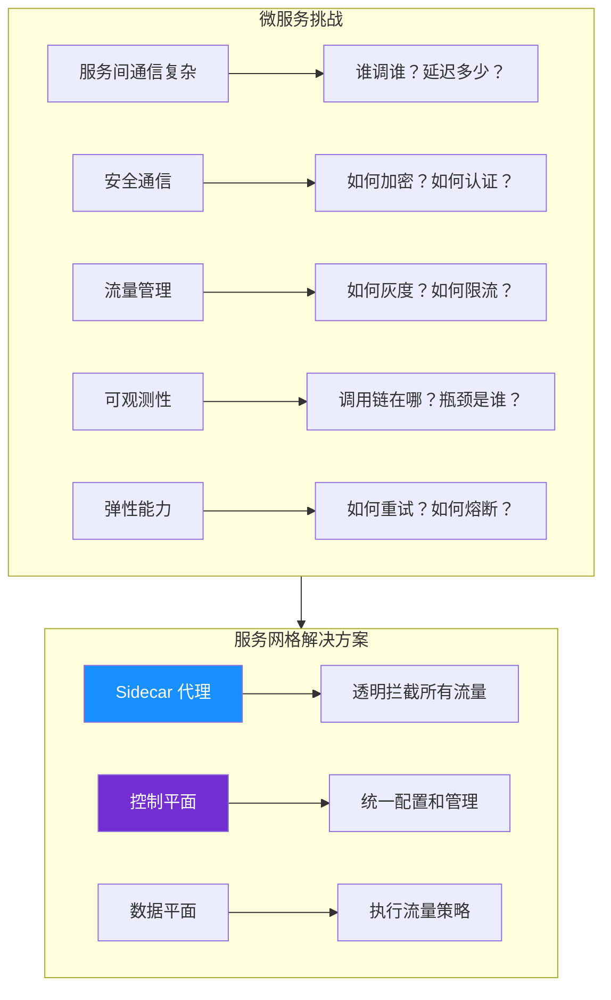

### 服务网格核心能力

| 能力 | 说明 | 对应组件 |
|------|------|---------|
| **流量管理** | 路由、分流、重试、超时、熔断 | VirtualService, DestinationRule |
| **安全通信** | mTLS、认证、授权 | PeerAuthentication, AuthorizationPolicy |
| **可观测性** | 指标、日志、分布式追踪 | Prometheus, Jaeger, Kiali |
| **弹性能力** | 重试、超时、熔断、限流 | DestinationRule, EnvoyFilter |
| **灰度发布** | 金丝雀、A/B 测试 | VirtualService 权重路由 |

### 服务网格 vs 传统方案

| 维度 | 传统方案（库/SDK） | 服务网格 |
|------|-------------------|---------|
| 语言耦合 | 需要每种语言实现 SDK | 语言无关 |
| 代码侵入 | 需要修改业务代码 | 零侵入（Sidecar 注入） |
| 升级难度 | 需要每个服务重新编译 | 控制平面统一升级 |
| 策略一致性 | 各服务实现可能不同 | 统一策略引擎 |
| 运维复杂度 | 分散在各服务 | 集中管理 |

---

## Istio 架构

### Istio 整体架构

Istio 由**控制平面**（Control Plane）和**数据平面**（Data Plane）组成。

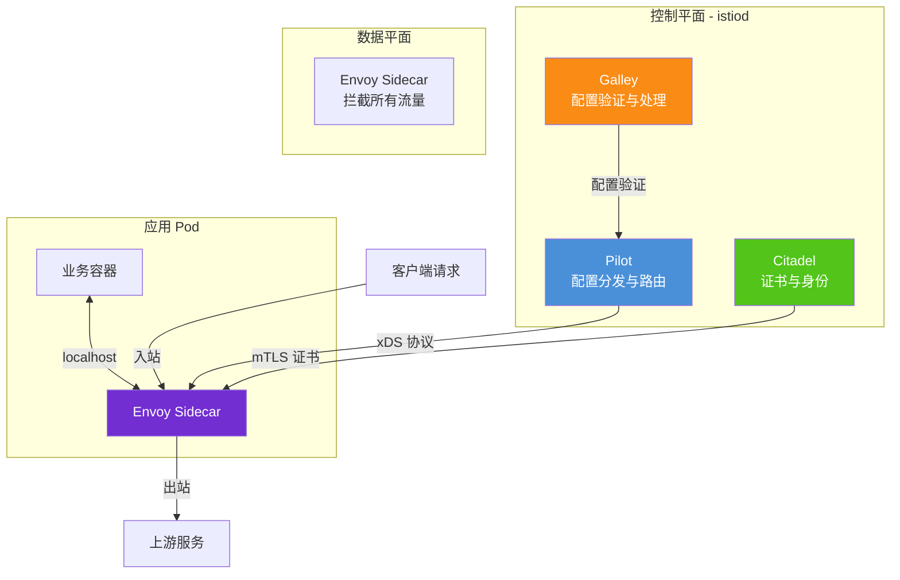

### 控制平面组件

| 组件 | 功能 | 说明 |
|------|------|------|
| **istiod** | 配置中心 | 1.8+ 合并为单进程，包含 Pilot/Citadel/Galley |
| **Pilot** | 流量管理 | 服务发现、路由规则、负载均衡配置 |
| **Citadel** | 安全管理 | 证书签发、mTLS、身份认证 |
| **Galley** | 配置管理 | 配置验证、转换、分发 |

### 数据平面

数据平面由每个 Pod 中的 **Envoy Sidecar** 代理组成：

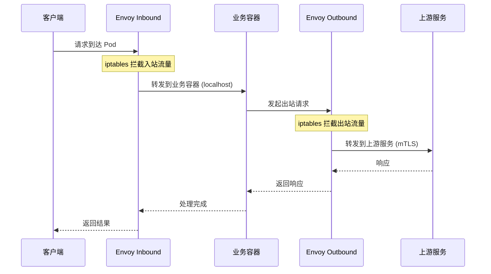

### Istio 安装

```bash
# 下载 istioctl
curl -L https://istio.io/downloadIstio | sh -
cd istio-1.20.0
export PATH=$PWD/bin:$PATH

# 检查集群兼容性
istioctl x precheck

# 安装 Istio（demo 配置，生产使用 default 或 custom）
istioctl install --set profile=demo -y

# 验证安装
kubectl get pods -n istio-system
istioctl analyze

# 查看 Istio 版本
istioctl version
```

#### 生产级 Istio 配置

```bash
# 使用 IstioOperator 自定义安装
istioctl install -f istio-operator.yaml -y
```

```yaml
# istio-operator.yaml
apiVersion: install.istio.io/v1alpha1
kind: IstioOperator
metadata:
  namespace: istio-system
  name: istio-production
spec:
  profile: default
  meshConfig:
    # 访问日志格式
    accessLogFile: /dev/stdout
    accessLogEncoding: JSON
    # 默认出站流量策略
    outboundTrafficPolicy:
      mode: REGISTRY_ONLY    # 只允许注册过的服务出站
    # 默认 mTLS 模式
    mtls:
      enabled: true          # 全局启用 mTLS
  values:
    pilot:
      resources:
        requests:
          cpu: "500m"
          memory: "1Gi"
        limits:
          cpu: "2000m"
          memory: "4Gi"
    global:
      # 日志级别
      logging:
        level: "default:warn"
      # Proxy 配置
      proxy:
        resources:
          requests:
            cpu: "100m"
            memory: "128Mi"
          limits:
            cpu: "500m"
            memory: "256Mi"
        # 并发线程数
        concurrency: 2
```

---

## Sidecar 注入原理

### 自动注入流程

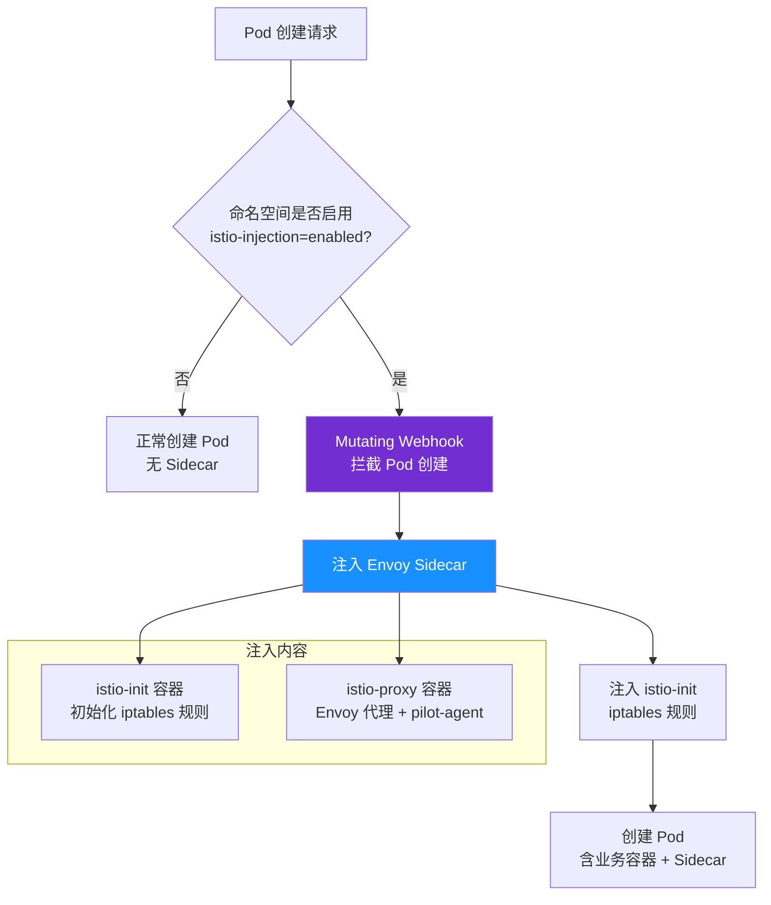

### 启用 Sidecar 自动注入

```bash
# 为命名空间启用自动注入
kubectl label namespace production istio-injection=enabled

# 查看已标记的命名空间
kubectl get namespaces --show-labels

# 取消自动注入
kubectl label namespace production istio-injection-
```

### Pod 级别控制注入

```yaml
apiVersion: v1
kind: Pod
metadata:
  name: my-app
  namespace: production
  annotations:
    # 不注入 Sidecar
    sidecar.istio.io/inject: "false"
    # 自定义 Sidecar 资源
    sidecar.istio.io/proxyCPU: "200m"
    sidecar.istio.io/proxyMemory: "256Mi"
    # 自定义日志级别
    sidecar.istio.io/logLevel: "debug"
spec:
  containers:
    - name: my-app
      image: registry.example.com/my-app:v1.0.0
```

### iptables 流量拦截原理

```bash
# istio-init 容器设置的 iptables 规则（简化版）
# 所有入站流量重定向到 Envoy 的 15006 端口
# 所有出站流量重定向到 Envoy 的 15001 端口
# 排除以下端口：
# - 15006: Envoy 入站端口
# - 15001: Envoy 出站端口
# - 15090: Prometheus metrics
# - 15021: 健康检查
# - 15020: Pilot agent DNS

# 查看实际的 iptables 规则
kubectl exec -it my-app-xxxx -n production -c istio-proxy -- \
    sudo iptables -t nat -L -n -v
```

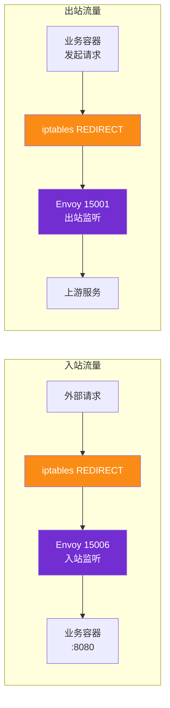

---

## mTLS 与零信任网络

### mTLS 概念

mTLS（Mutual TLS，双向 TLS）要求通信双方都提供证书进行身份验证，实现**零信任网络**。

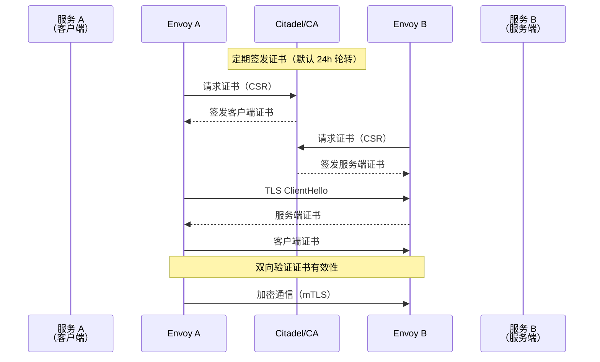

### PeerAuthentication 策略

```yaml
# 全局严格 mTLS（推荐生产配置）
apiVersion: security.istio.io/v1beta1
kind: PeerAuthentication
metadata:
  name: default
  namespace: istio-system
spec:
  mtls:
    mode: STRICT   # 严格模式：只接受 mTLS 连接
---
# 命名空间级 mTLS
apiVersion: security.istio.io/v1beta1
kind: PeerAuthentication
metadata:
  name: production-mtls
  namespace: production
spec:
  mtls:
    mode: STRICT
---
# 特定端口的 mTLS 策略
apiVersion: security.istio.io/v1beta1
kind: PeerAuthentication
metadata:
  name: api-server-mtls
  namespace: production
spec:
  selector:
    matchLabels:
      app: api-server
  mtls:
    mode: STRICT
  portLevelMtls:
    8080:
      mode: STRICT       # 业务端口严格 mTLS
    9090:
      mode: PERMISSIVE   # 监控端口允许明文
```

### AuthorizationPolicy 授权策略

```yaml
# 只允许 web-app 访问 api-server
apiVersion: security.istio.io/v1beta1
kind: AuthorizationPolicy
metadata:
  name: api-server-authz
  namespace: production
spec:
  selector:
    matchLabels:
      app: api-server
  rules:
    - from:
        - source:
            principals:
              - "cluster.local/ns/production/sa/web-app"
      to:
        - operation:
            methods:
              - GET
              - POST
            paths:
              - "/api/*"
---
# 拒绝所有外部访问数据库
apiVersion: security.istio.io/v1beta1
kind: AuthorizationPolicy
metadata:
  name: deny-external-db
  namespace: production
spec:
  selector:
    matchLabels:
      app: postgres
  action: DENY
  rules:
    - from:
        - source:
            notNamespaces:
              - production
---
# 允许监控命名空间访问 metrics
apiVersion: security.istio.io/v1beta1
kind: AuthorizationPolicy
metadata:
  name: allow-monitoring
  namespace: production
spec:
  selector:
    matchLabels:
      app: api-server
  rules:
    - from:
        - source:
            namespaces:
              - monitoring
      to:
        - operation:
            paths:
              - "/metrics"
              - "/health"
```

### 零信任网络架构

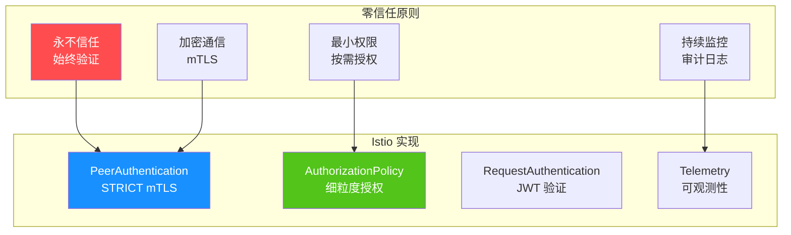

---

## 流量管理

### VirtualService 虚拟服务

VirtualService 定义了请求如何路由到目标服务。

```yaml
apiVersion: networking.istio.io/v1beta1
kind: VirtualService
metadata:
  name: web-app
  namespace: production
spec:
  hosts:
    - web-app
    - web-app.production.svc.cluster.local
  gateways:
    - mesh
  http:
    # 金丝雀路由：10% 流量到 v2
    - match:
        - headers:
            x-canary:
              exact: "true"
      route:
        - destination:
            host: web-app
            subset: v2
          weight: 100

    # 默认路由：90% v1, 10% v2
    - route:
        - destination:
            host: web-app
            subset: v1
          weight: 90
        - destination:
            host: web-app
            subset: v2
          weight: 10
      # 超时配置
      timeout: 10s
      # 重试配置
      retries:
        attempts: 3
        perTryTimeout: 3s
        retryOn: 5xx,reset,connect-failure
      # 故障注入（测试用）
      # fault:
      #   delay:
      #     percentage:
      #       value: 10
      #     fixedDelay: 5s
---
# DestinationRule 定义服务子集
apiVersion: networking.istio.io/v1beta1
kind: DestinationRule
metadata:
  name: web-app
  namespace: production
spec:
  host: web-app
  trafficPolicy:
    connectionPool:
      tcp:
        maxConnections: 100
      http:
        h2UpgradePolicy: DEFAULT
        http1MaxPendingRequests: 100
        http2MaxRequests: 100
  subsets:
    - name: v1
      labels:
        version: v1
      trafficPolicy:
        connectionPool:
          http:
            http1MaxPendingRequests: 50
    - name: v2
      labels:
        version: v2
      trafficPolicy:
        connectionPool:
          http:
            http1MaxPendingRequests: 200
```

### 熔断配置

```yaml
apiVersion: networking.istio.io/v1beta1
kind: DestinationRule
metadata:
  name: api-server-circuit-breaker
  namespace: production
spec:
  host: api-server
  trafficPolicy:
    connectionPool:
      tcp:
        maxConnections: 100
      http:
        http1MaxPendingRequests: 100
        http2MaxRequests: 100
        # 连接超时
        connectTimeout: 5s
    # 熔断配置
    outlierDetection:
      # 连续错误次数触发熔断
      consecutive5xxErrors: 5
      # 连续网关错误次数
      consecutiveGatewayErrors: 3
      # 熔断检测间隔
      interval: 30s
      # 熔断持续时间
      baseEjectionTime: 30s
      # 最大熔断比例
      maxEjectionPercent: 50
      # 最小熔断检测数量
      minHealthPercent: 25
```

### 流量镜像

```yaml
apiVersion: networking.istio.io/v1beta1
kind: VirtualService
metadata:
  name: web-app-mirror
  namespace: production
spec:
  hosts:
    - web-app
  http:
    - route:
        - destination:
            host: web-app
            subset: v1
          weight: 100
      # 流量镜像到 v2（不影响主流量）
      mirror:
        host: web-app
        subset: v2
      mirrorPercentage:
        value: 10     # 镜像 10% 的流量
```

### 请求重试与超时

```yaml
apiVersion: networking.istio.io/v1beta1
kind: VirtualService
metadata:
  name: api-server-retry
  namespace: production
spec:
  hosts:
    - api-server
  http:
    - route:
        - destination:
            host: api-server
      # 超时设置
      timeout: 15s
      # 重试设置
      retries:
        attempts: 3                  # 最多重试 3 次
        perTryTimeout: 5s            # 每次重试超时 5s
        retryOn: 5xx,reset,connect-failure,refused-stream
        retryRemoteLocalities: true  # 重试时尝试远程可用区
```

---

## 可观测性

### Kiali 服务拓扑

Kiali 是 Istio 的服务拓扑可视化工具，提供服务网格的全景视图。

```bash
# 安装 Kiali（如果使用 demo profile 已包含）
kubectl apply -f https://raw.githubusercontent.com/istio/istio/release-1.20/samples/addons/kiali.yaml

# 访问 Kiali 面板
istioctl dashboard kiali

# 或通过 Port-Forward
kubectl port-forward svc/kiali -n istio-system 20001:20001
```

### Jaeger 分布式追踪

```bash
# 安装 Jaeger
kubectl apply -f https://raw.githubusercontent.com/istio/istio/release-1.20/samples/addons/jaeger.yaml

# 访问 Jaeger UI
istioctl dashboard jaeger

# 配置采样率
kubectl edit configmap istio -n istio-system
# 设置 pilot.traceSampling: 100（生产建议 1-5%）
```

```yaml
# 启用追踪的 Telemetry 配置
apiVersion: telemetry.istio.io/v1alpha1
kind: Telemetry
metadata:
  name: default-tracing
  namespace: istio-system
spec:
  tracing:
    - providers:
        - name: jaeger
      randomSamplingPercentage: 5.0    # 5% 采样率
```

### Prometheus + Grafana 监控

```bash
# 安装 Prometheus
kubectl apply -f https://raw.githubusercontent.com/istio/istio/release-1.20/samples/addons/prometheus.yaml

# 安装 Grafana
kubectl apply -f https://raw.githubusercontent.com/istio/istio/release-1.20/samples/addons/grafana.yaml

# 访问 Grafana
istioctl dashboard grafana
```

#### 关键监控指标

| 指标 | PromQL | 说明 |
|------|--------|------|
| 请求成功率 | `sum(rate(istio_requests_total{response_code!~"5.."}[5m])) / sum(rate(istio_requests_total[5m]))` | 服务可用性 |
| P99 延迟 | `histogram_quantile(0.99, sum(rate(istio_request_duration_milliseconds_bucket[5m])) by (le))` | 尾部延迟 |
| 请求量 | `sum(rate(istio_requests_total[5m])) by (destination_service)` | QPS |
| 熔断触发 | `sum(rate(istio_requests_total{response_flags="UO"}[5m]))` | 熔断次数 |
| mTLS 状态 | `sum(istio_build) by (component)` | 组件状态 |

---

## Istio vs Linkerd 对比

### 架构对比

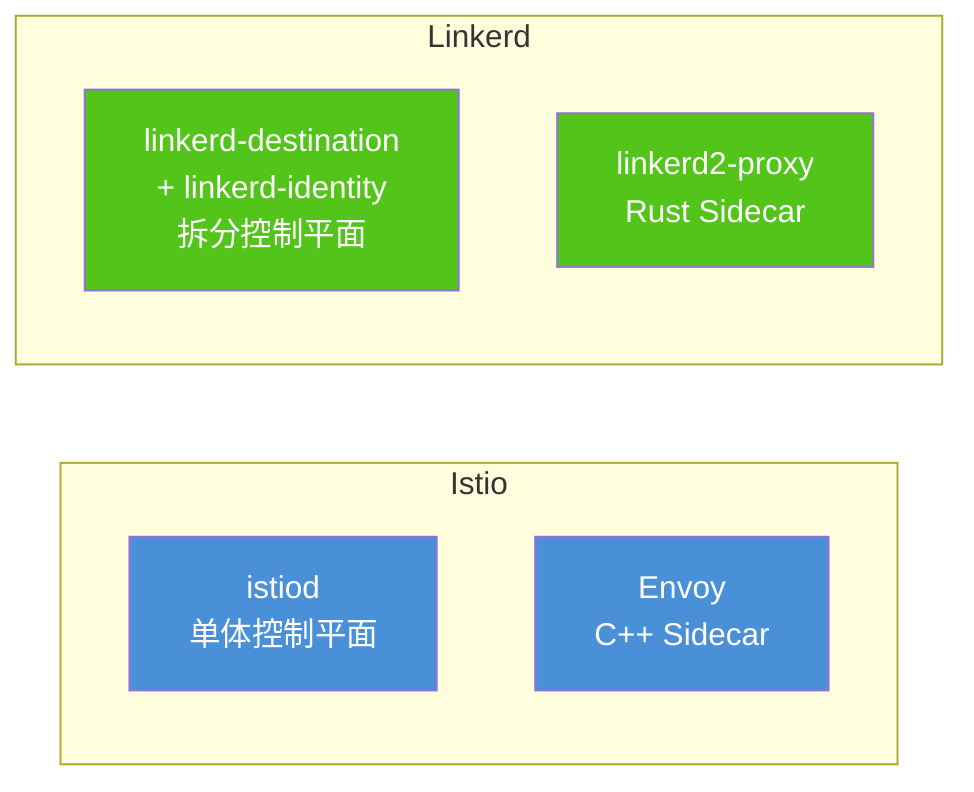

### 详细对比

| 维度 | Istio | Linkerd |
|------|-------|---------|
| **Sidecar** | Envoy (C++) | linkerd2-proxy (Rust) |
| **控制平面** | istiod 单体 | 拆分为多个组件 |
| **资源占用** | 高（Envoy ~100MB） | 低（Rust proxy ~20MB） |
| **配置复杂度** | 高（CRD 多） | 低（CRD 少） |
| **功能丰富度** | 非常丰富 | 精简够用 |
| **流量管理** | VirtualService + DestinationRule | Route + ServiceProfile |
| **mTLS** | ✅ 自动 | ✅ 自动（更简单） |
| **七层路由** | ✅ 丰富 | ✅ 基础 |
| **故障注入** | ✅ | ✅ |
| **流量镜像** | ✅ | ❌ |
| **多集群** | ✅ 复杂但强大 | ✅ 简单 |
| **可观测性** | Kiali + Jaeger | 自带 Dashboard |
| **社区规模** | 大（CNCF 毕业） | 中 |
| **企业采用** | 广泛 | 中等 |
| **学习曲线** | 陡峭 | 平缓 |

### 选型建议

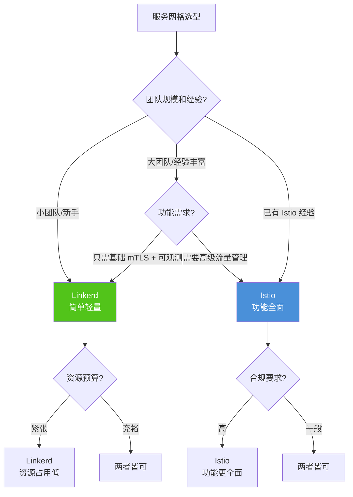

---

## 服务网格选型决策

### 决策矩阵

| 决策因素 | 权重 | Istio | Linkerd | Cilium Mesh | 无服务网格 |
|----------|------|-------|---------|-------------|-----------|
| 功能丰富度 | 高 | 5 | 3 | 4 | 0 |
| 简单性 | 高 | 2 | 5 | 3 | 5 |
| 性能开销 | 中 | 2 | 4 | 5 | 5 |
| 社区支持 | 中 | 5 | 3 | 4 | 5 |
| mTLS | 高 | 5 | 5 | 4 | 0 |
| 可观测性 | 高 | 5 | 4 | 5 | 1 |
| 流量管理 | 中 | 5 | 3 | 3 | 0 |
| 资源占用 | 中 | 2 | 4 | 4 | 5 |

### 选型流程

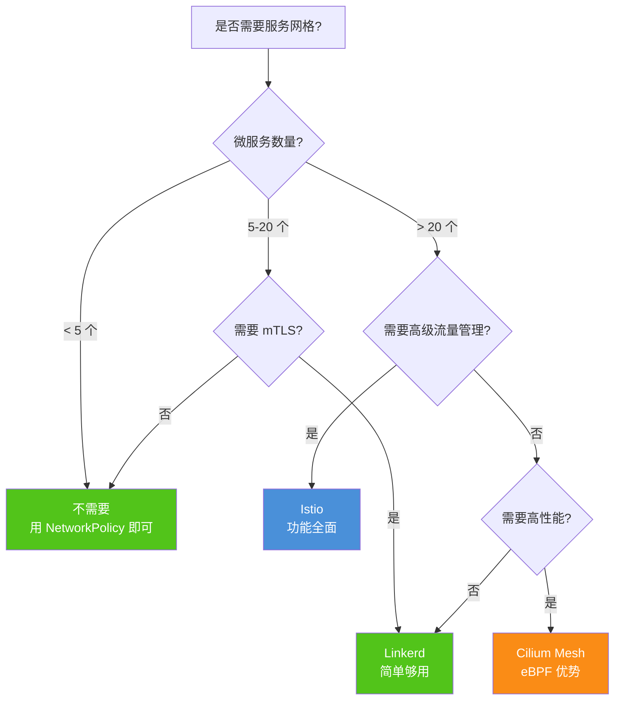

### 渐进式采用路径

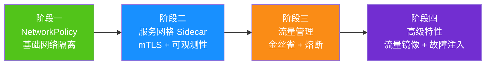

::: tip 渐进式采用建议
1. **先 NetworkPolicy**：实现基础网络隔离，这是安全底线
2. **再 Sidecar 注入**：引入服务网格，先只开启 mTLS 和指标收集
3. **逐步启用流量管理**：金丝雀路由、重试、超时
4. **最后启用高级特性**：流量镜像、故障注入、自定义 Envoy Filter

**不要一次性全部启用！** 服务网格引入的复杂性需要团队逐步消化。
:::

### 常见问题与解决方案

| 问题 | 原因 | 解决方案 |
|------|------|---------|
| Sidecar 占用资源过多 | Envoy 默认资源配置高 | 调整 proxy 资源限制 |
| 应用启动变慢 | Sidecar 初始化延迟 | 配置 `holdApplicationUntilProxyStarts: true` |
| gRPC 长连接问题 | Envoy 默认 HTTP/1.1 | 配置 `h2UpgradePolicy: UPGRADE` |
| WebSocket 不通 | VirtualService 未配置 | 添加 WebSocket 路由 |
| 流量未加密 | mTLS 模式为 PERMISSIVE | 改为 STRICT |
| 调用链不完整 | 采样率太低 | 调高 traceSampling |
| DNS 解析慢 | Sidecar 拦截 DNS | 配置 `dnsRefreshRate` |

---

## 总结

### 网络安全层级

| 层级 | 机制 | 作用 | 必要性 |
|------|------|------|--------|
| L3/L4 网络隔离 | NetworkPolicy | Pod 级访问控制 | **必须** |
| L4 加密通信 | Calico WireGuard / Cilium 加密 | 节点间加密 | 推荐 |
| L7 网络策略 | Calico/Cilium L7 策略 | HTTP 级精细控制 | 推荐 |
| L7 加密通信 | Istio/Linkerd mTLS | 服务间 mTLS | 推荐 |
| L7 授权 | AuthorizationPolicy | 服务级授权 | 推荐 |
| L7 流量管理 | VirtualService | 路由/分流/重试 | 可选 |

### 关键原则

1. **NetworkPolicy 是底线**：生产环境必须配置，默认拒绝所有流量
2. **mTLS 是标配**：服务间通信必须加密
3. **最小权限**：AuthorizationPolicy 只允许必要的通信
4. **渐进式引入**：不要一次性引入服务网格的所有功能
5. **可观测性先行**：先看清楚流量，再控制流量
6. **选择合适的 CNI**：Calico（通用）或 Cilium（高性能）
7. **选择合适的网格**：Istio（功能全面）或 Linkerd（简单轻量）

---

> **参考资源**
> - [Kubernetes NetworkPolicy](https://kubernetes.io/docs/concepts/services-networking/network-policies/)
> - [Calico 官方文档](https://docs.projectcalico.org/)
> - [Cilium 官方文档](https://docs.cilium.io/)
> - [Istio 官方文档](https://istio.io/latest/docs/)
> - [Linkerd 官方文档](https://linkerd.io/2/overview/)
> - [Hubble 可观测性](https://docs.cilium.io/en/latest/hubble/)
> - [Envoy 代理](https://www.envoyproxy.io/)
> - [eBPF 介绍](https://ebpf.io/)
