# 集群部署与升级

生产级 Kubernetes 集群的部署与升级是运维工作的基石——选错方案意味着后续每一步都在补坑，升级策略不当则可能让整个集群在凌晨三点停摆。本文从部署方案选型出发，覆盖 kubeadm 完整部署、k3s 轻量方案、etcd 运维、版本升级、证书轮换、节点维护等关键环节，帮你构建一套"部署有据、升级有路、回滚有底"的集群运维体系。

## 1. 集群部署方案对比

### 1.1 四大主流方案

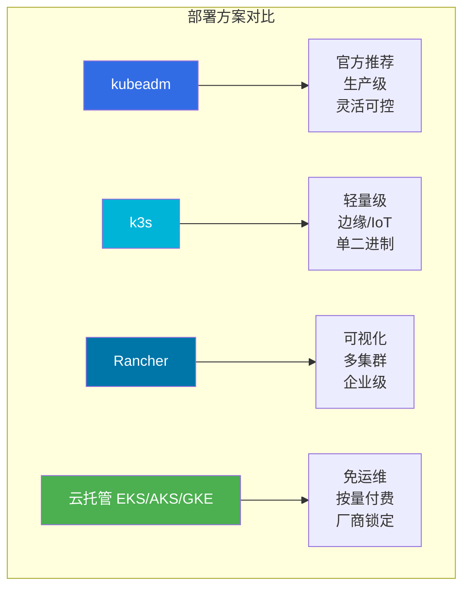

| 维度 | kubeadm | k3s | Rancher | 云托管 |
|------|---------|-----|---------|--------|
| **部署复杂度** | 中等 | 低 | 中等 | 极低 |
| **生产就绪** | 是 | 是（轻量场景） | 是 | 是 |
| **控制面管理** | 自管 | 自管（嵌入式） | 自管/托管 | 托管 |
| **多集群能力** | 需额外工具 | 需额外工具 | 原生支持 | 厂商方案 |
| **etcd 管理** | 独立/堆叠 | 内嵌 SQLite/dqlite | 依赖底层 | 托管 |
| **资源占用** | 中 | 极低 | 高 | N/A |
| **离线部署** | 支持 | 支持 | 支持 | 不支持 |
| **适用场景** | 通用生产 | 边缘/CI/测试 | 企业多集群 | 快速上云 |
| **成本** | 人力为主 | 极低 | 中等 | 云费用 |

::: tip 方案选型建议
- **自建机房 / 混合云**：kubeadm + Ansible 自动化，灵活度最高
- **边缘 / IoT / ARM 设备**：k3s，单二进制 + SQLite，最低资源占用
- **多集群管理 / 企业平台**：Rancher + RKE2，统一管理面
- **快速验证 / 无运维团队**：云托管（EKS/AKS/GKE），省心但成本浮动
:::

### 1.2 部署方案选型决策树

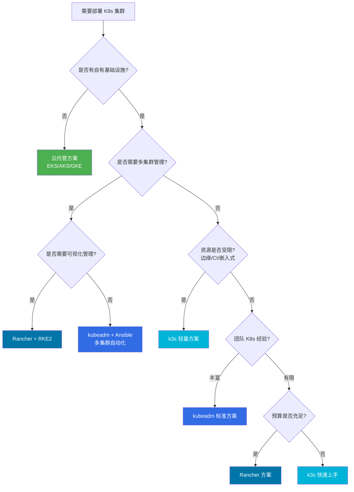

## 2. kubeadm 完整部署流程

### 2.1 kubeadm 部署全景流程

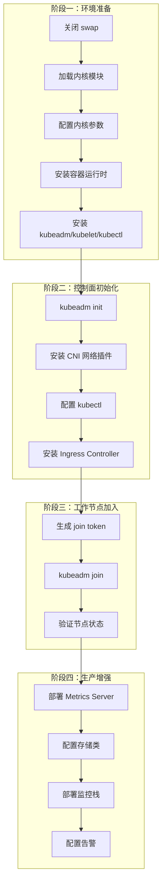

### 2.2 环境准备

#### 2.2.1 系统要求

| 组件 | 最低要求 | 推荐配置 |
|------|----------|----------|
| **操作系统** | Ubuntu 20.04 / CentOS 7+ | Ubuntu 22.04 LTS |
| **CPU** | 2 核 | 4 核+ |
| **内存** | 2 GB | 8 GB+（Master 16 GB+） |
| **磁盘** | 20 GB | 100 GB+ SSD |
| **网络** | 节点间互通 | 万兆内网 |
| **端口** | 见下方端口表 | 见下方端口表 |

::: important 关键端口
Master 节点必须开放以下端口：

| 端口 | 协议 | 用途 |
|------|------|------|
| 6443 | TCP | kube-apiserver |
| 2379-2380 | TCP | etcd 客户端/对等 |
| 10250 | TCP | kubelet API |
| 10259 | TCP | kube-scheduler |
| 10257 | TCP | kube-controller-manager |

Worker 节点必须开放：

| 端口 | 协议 | 用途 |
|------|------|------|
| 10250 | TCP | kubelet API |
| 30000-32767 | TCP | NodePort 服务 |
| 10256 | TCP | kube-proxy 健康检查 |
:::

#### 2.2.2 所有节点初始化脚本

```bash
#!/bin/bash
# k8s-node-init.sh — 所有节点通用初始化
# 适用：Ubuntu 20.04/22.04

set -euo pipefail

# ========== 1. 关闭 swap ==========
echo "===== 关闭 swap ====="
swapoff -a
sed -i '/swap/d' /etc/fstab

# ========== 2. 加载内核模块 ==========
echo "===== 加载内核模块 ====="
cat <<EOF | tee /etc/modules-load.d/k8s.conf
overlay
br_netfilter
EOF

modprobe overlay
modprobe br_netfilter

# ========== 3. 内核网络参数 ==========
echo "===== 配置内核参数 ====="
cat <<EOF | tee /etc/sysctl.d/k8s.conf
net.bridge.bridge-nf-call-iptables  = 1
net.bridge.bridge-nf-call-ip6tables = 1
net.ipv4.ip_forward                 = 1
EOF

sysctl --system

# ========== 4. 时间同步 ==========
echo "===== 配置时间同步 ====="
apt-get update -y
apt-get install -y chrony
systemctl enable --now chrony
timedatectl set-ntp true

# ========== 5. 安装 containerd ==========
echo "===== 安装 containerd ====="
apt-get install -y ca-certificates curl gnupg
install -m 0755 -d /etc/apt/keyrings
curl -fsSL https://download.docker.com/linux/ubuntu/gpg | \
    gpg --dearmor -o /etc/apt/keyrings/docker.gpg
chmod a+r /etc/apt/keyrings/docker.gpg

echo "deb [arch=$(dpkg --print-architecture) signed-by=/etc/apt/keyrings/docker.gpg] \
    https://download.docker.com/linux/ubuntu $(. /etc/os-release && echo $VERSION_CODENAME) stable" | \
    tee /etc/apt/sources.list.d/docker.list > /dev/null

apt-get update -y
apt-get install -y containerd.io

# ========== 6. 配置 containerd ==========
echo "===== 配置 containerd ====="
mkdir -p /etc/containerd
containerd config default | tee /etc/containerd/config.toml > /dev/null

# 启用 SystemdCgroup（关键！）
sed -i 's/SystemdCgroup \= false/SystemdCgroup \= true/g' /etc/containerd/config.toml

# 配置镜像加速（国内环境）
sed -i '/\[plugins."io.containerd.grpc.v1.cri".registry.mirrors\]/a\        [plugins."io.containerd.grpc.v1.cri".registry.mirrors."docker.io"]\n          endpoint = ["https://mirror.ccs.tencentyun.com"]' /etc/containerd/config.toml

systemctl enable --now containerd

# ========== 7. 安装 kubeadm、kubelet、kubectl ==========
echo "===== 安装 kubeadm/kubelet/kubectl ====="
apt-get install -y apt-transport-https ca-certificates curl gpg

# Kubernetes apt 仓库
curl -fsSL https://pkgs.k8s.io/core:/stable:/v1.30/deb/Release.key | \
    gpg --dearmor -o /etc/apt/keyrings/kubernetes-apt-keyring.gpg

echo 'deb [signed-by=/etc/apt/keyrings/kubernetes-apt-keyring.gpg] \
    https://pkgs.k8s.io/core:/stable:/v1.30/deb/ /' | \
    tee /etc/apt/sources.list.d/kubernetes.list

apt-get update -y
apt-get install -y kubelet kubeadm kubectl
apt-mark hold kubelet kubeadm kubectl

systemctl enable kubelet

echo "===== 节点初始化完成 ====="
```

::: warning 关于 swap
Kubernetes 从 1.28 开始支持 swap，但默认仍要求关闭。如果必须开启 swap（如内存受限场景），需要在 kubelet 配置中设置 `--fail-swap-on=false`，但这会带来性能不确定性，生产环境不建议开启。
:::

### 2.3 Master 节点初始化

#### 2.3.1 kubeadm init 完整配置

```yaml
# kubeadm-config.yaml
apiVersion: kubeadm.k8s.io/v1beta3
kind: InitConfiguration
nodeRegistration:
  criSocket: unix:///run/containerd/containerd.sock
  kubeletExtraArgs:
    cgroup-driver: systemd
  ignorePreflightErrors:
    - NumCPU     # 测试环境可忽略
    - Mem        # 测试环境可忽略
---
apiVersion: kubeadm.k8s.io/v1beta3
kind: ClusterConfiguration
kubernetesVersion: "1.30.0"
controlPlaneEndpoint: "k8s-api.example.com:6443"  # 负载均衡 VIP
networking:
  podSubnet: "10.244.0.0/16"       # Flannel 默认网段
  serviceSubnet: "10.96.0.0/12"    # Service 网段
  dnsDomain: "cluster.local"
apiServer:
  extraArgs:
    authorization-mode: "Node,RBAC"
    enable-admission-plugins: "NodeRestriction,LimitRanger,ServiceAccount,DefaultStorageClass,ResourceQuota"
  certSANs:
    - k8s-api.example.com
    - 10.0.0.100                    # VIP
    - 10.0.0.11                     # Master1
    - 10.0.0.12                     # Master2
    - 10.0.0.13                     # Master3
    - 127.0.0.1
controllerManager:
  extraArgs:
    bind-address: "0.0.0.0"
scheduler:
  extraArgs:
    bind-address: "0.0.0.0"
etcd:
  local:
    dataDir: "/var/lib/etcd"
    serverCertSANs:
      - 10.0.0.11
    peerCertSANs:
      - 10.0.0.11
---
apiVersion: kubeadm.k8s.io/v1beta3
kind: KubeletConfiguration
cgroupDriver: systemd
serverTLSBootstrap: true           # 启用证书自动轮换
rotateCertificates: true
```

```bash
# 拉取镜像（离线环境可提前准备）
kubeadm config images pull --config kubeadm-config.yaml

# 初始化控制面
kubeadm init --config kubeadm-config.yaml --upload-certs

# 配置 kubectl
mkdir -p $HOME/.kube
cp -i /etc/kubernetes/admin.conf $HOME/.kube/config
chown $(id -u):$(id -g) $HOME/.kube/config

# 验证
kubectl get nodes
kubectl get pods -n kube-system
```

#### 2.3.2 初始化后输出解读

```
Your Kubernetes control-plane has initialized successfully!

To start using your cluster, you need to run the following as a regular user:

  mkdir -p $HOME/.kube
  sudo cp -i /etc/kubernetes/admin.conf $HOME/.kube/config
  sudo chown $(id -u):$(id -g) $HOME/.kube/config

You should now deploy a pod network to the cluster.
Run "kubectl apply -f [podnetwork].yaml" with one of the options listed at:
  https://kubernetes.io/docs/concepts/cluster-administration/addons/

You can now join any number of control-plane nodes by copying certificate authorities
and service account keys on each node and then running the following:

  kubeadm join k8s-api.example.com:6443 --token <token> \
    --discovery-token-ca-cert-hash sha256:<hash> \
    --control-plane --certificate-key <key>

Then you can join any number of worker nodes by running the following:

  kubeadm join k8s-api.example.com:6443 --token <token> \
    --discovery-token-ca-cert-hash sha256:<hash>
```

### 2.4 网络插件安装

#### 2.4.1 主流 CNI 对比

| CNI | 性能 | 网络策略 | eBPF | 适用场景 |
|-----|------|----------|------|----------|
| **Calico** | 优秀 | 支持 | 支持 | 通用生产 |
| **Flannel** | 良好 | 不支持 | 不支持 | 简单场景 |
| **Cilium** | 极优 | 支持 | 原生 | 高性能/可观测 |
| **Weave** | 良好 | 支持 | 不支持 | 多环境兼容 |

```bash
# 安装 Calico（推荐）
kubectl apply -f https://raw.githubusercontent.com/projectcalico/calico/v3.27.0/manifests/calico.yaml

# 验证 Calico Pod 状态
kubectl get pods -n kube-system -l k8s-app=calico-node

# 检查节点网络就绪
kubectl get nodes -o wide
```

::: important CNI 选择
- **生产首选**：Calico — 功能全面，网络策略原生支持，BGP 路由模式性能优异
- **性能极致**：Cilium — eBPF 数据面，可观测性极强，适合对网络性能要求极高的场景
- **快速验证**：Flannel — 配置最简，但不支持 NetworkPolicy，不适合多租户
:::

#### 2.4.2 Calico 自定义配置

```yaml
# calico-custom.yaml — 自定义 IP 池和 BGP 配置
apiVersion: crd.projectcalico.org/v1
kind: IPPool
metadata:
  name: default-ipv4-ippool
spec:
  cidr: 10.244.0.0/16
  blockSize: 26          # 每个 Node 分配 64 个 IP
  ipipMode: Never        # 使用 BGP 路由模式，性能更优
  vxlanMode: Never
  natOutgoing: true
  nodeSelector: all()
---
apiVersion: crd.projectcalico.org/v1
kind: BGPConfiguration
metadata:
  name: default
spec:
  logSeverityScreen: Info
  nodeToNodeMeshEnabled: true   # 节点间全互联 BGP
  asNumber: 64512
```

### 2.5 Ingress Controller 安装

```yaml
# ingress-nginx-deploy.yaml
apiVersion: v1
kind: Namespace
metadata:
  labels:
    app.kubernetes.io/instance: ingress-nginx
  name: ingress-nginx
---
# 使用 Helm 安装更方便
# helm repo add ingress-nginx https://kubernetes.github.io/ingress-nginx
# helm install ingress-nginx ingress-nginx/ingress-nginx \
#   --namespace ingress-nginx \
#   --set controller.kind=DaemonSet \
#   --set controller.hostNetwork=true \
#   --set controller.service.type=ClusterIP \
#   --set controller.metrics.enabled=true \
#   --set controller.config.proxy-body-size="50m" \
#   --set controller.config.use-forwarded-headers="true"
```

```bash
# Helm 安装 NGINX Ingress Controller
helm repo add ingress-nginx https://kubernetes.github.io/ingress-nginx
helm repo update

helm install ingress-nginx ingress-nginx/ingress-nginx \
  --namespace ingress-nginx \
  --create-namespace \
  --set controller.kind=DaemonSet \
  --set controller.hostNetwork=true \
  --set controller.service.type=ClusterIP \
  --set controller.metrics.enabled=true \
  --set controller.config.proxy-body-size="50m" \
  --set controller.config.use-forwarded-headers="true"
```

### 2.6 Worker 节点加入

```bash
# 在 Master 上生成 join token（默认有效期 24 小时）
kubeadm token create --print-join-command

# 输出示例：
# kubeadm join k8s-api.example.com:6443 --token abcdef.0123456789abcdef \
#   --discovery-token-ca-cert-hash sha256:1234567890abcdef...

# 在 Worker 节点上执行
kubeadm join k8s-api.example.com:6443 \
  --token abcdef.0123456789abcdef \
  --discovery-token-ca-cert-hash sha256:1234567890abcdef...

# 如果 token 过期，重新创建
kubeadm token create --ttl 2h

# 验证节点加入
kubectl get nodes -o wide
kubectl get pods -A -o wide | grep <node-name>
```

## 3. k3s 轻量级部署

### 3.1 k3s 架构

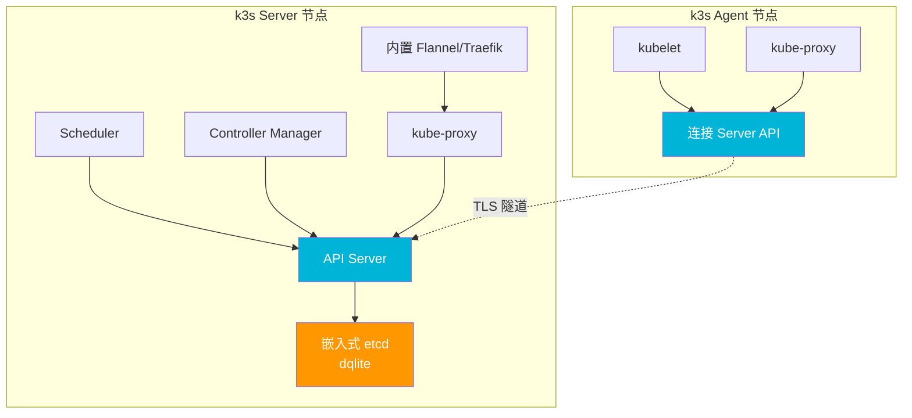

### 3.2 k3s Server 安装

```bash
# 安装 k3s Server（含 etcd 高可用）
curl -sfL https://get.k3s.io | sh -s - server \
  --cluster-init \
  --tls-san k3s-api.example.com \
  --data-dir /data/k3s \
  --disable traefik \
  --write-kubeconfig-mode 644

# 获取 node token（Agent 加入需要）
cat /var/lib/rancher/k3s/server/node-token

# 查看 k3s 状态
systemctl status k3s
kubectl get nodes
```

#### 3.2.1 k3s 高可用集群

```bash
# 第一台 Server（初始化集群）
curl -sfL https://get.k3s.io | sh -s - server \
  --cluster-init \
  --tls-san k3s-api.example.com

# 第二台 Server（加入集群）
curl -sfL https://get.k3s.io | sh -s - server \
  --server https://<第一台Server-IP>:6443 \
  --token <NODE_TOKEN>

# 第三台 Server
curl -sfL https://get.k3s.io | sh -s - server \
  --server https://<第一台Server-IP>:6443 \
  --token <NODE_TOKEN>
```

### 3.3 k3s Agent 加入

```bash
# Worker 节点加入
curl -sfL https://get.k3s.io | K3S_URL=https://k3s-api.example.com:6443 \
  K3S_TOKEN=<NODE_TOKEN> sh -

# 验证
kubectl get nodes
kubectl get pods -A
```

### 3.4 k3s 与 kubeadm 对比

| 特性 | kubeadm | k3s |
|------|---------|-----|
| 二进制大小 | ~400 MB（多组件） | ~70 MB（单二进制） |
| 内存占用 | Master ~2 GB | Server ~512 MB |
| 启动时间 | ~2 分钟 | ~30 秒 |
| etcd | 独立/堆叠 | 内嵌 dqlite |
| CNI | 需手动安装 | 内置 Flannel |
| Ingress | 需手动安装 | 内置 Traefik |
| 数据库 | etcd | SQLite/dqlite/MySQL/PostgreSQL |
| 离线部署 | 需准备镜像 | 内置镜像 |
| 版本 | 与上游一致 | 轻微滞后 |

::: tip k3s 适用场景
- **边缘计算**：工厂、零售门店、IoT 网关
- **CI/CD 流水线**：快速创建/销毁测试集群
- **开发环境**：本地开发与调试
- **资源受限环境**：ARM 设备、树莓派集群
- **不适用**：大规模生产（1000+ 节点）、需要严格上游兼容的场景
:::

## 4. etcd 集群部署与运维

### 4.1 etcd 架构

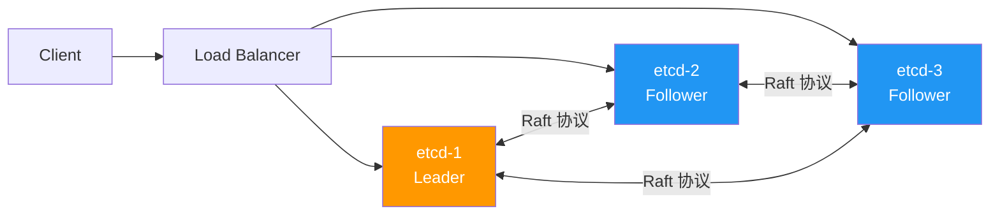

### 4.2 外部 etcd 集群部署

::: important 外部 vs 堆叠 etcd
- **堆叠 etcd**（Stacked）：etcd 与控制面组件同节点部署，节省机器但风险耦合
- **外部 etcd**（External）：etcd 独立部署，控制面故障不影响 etcd 数据，生产推荐
:::

```bash
# 在三台 etcd 节点上分别执行

# 1. 安装 etcd
ETCD_VER=v3.5.13
wget https://github.com/etcd-io/etcd/releases/download/${ETCD_VER}/etcd-${ETCD_VER}-linux-amd64.tar.gz
tar xzvf etcd-${ETCD_VER}-linux-amd64.tar.gz
mv etcd-${ETCD_VER}-linux-amd64/etcd* /usr/local/bin/

# 2. 创建 etcd 数据目录和配置目录
mkdir -p /var/lib/etcd /etc/etcd

# 3. 生成证书（假设已用 cfssl 生成）
# 需要：server.crt, server.key, peer.crt, peer.key, ca.crt, healthcheck-client.crt, healthcheck-client.key
```

#### 4.2.1 etcd Systemd 服务

```ini
# /etc/systemd/system/etcd.service
[Unit]
Description=etcd key-value store
Documentation=https://github.com/etcd-io/etcd
After=network.target

[Service]
Type=notify
ExecStart=/usr/local/bin/etcd \
  --name etcd-1 \
  --data-dir /var/lib/etcd \
  --listen-client-urls https://10.0.0.21:2379 \
  --advertise-client-urls https://10.0.0.21:2379 \
  --listen-peer-urls https://10.0.0.21:2380 \
  --initial-advertise-peer-urls https://10.0.0.21:2380 \
  --initial-cluster etcd-1=https://10.0.0.21:2380,etcd-2=https://10.0.0.22:2380,etcd-3=https://10.0.0.23:2380 \
  --initial-cluster-token etcd-cluster-1 \
  --initial-cluster-state new \
  --client-cert-auth \
  --trusted-ca-file /etc/etcd/ca.crt \
  --cert-file /etc/etcd/server.crt \
  --key-file /etc/etcd/server.key \
  --peer-client-cert-auth \
  --peer-trusted-ca-file /etc/etcd/ca.crt \
  --peer-cert-file /etc/etcd/peer.crt \
  --peer-key-file /etc/etcd/peer.key \
  --auto-compaction-retention 1 \
  --quota-backend-bytes 8589934592 \
  --heartbeat-interval 500 \
  --election-timeout 5000
Restart=always
RestartSec=10
LimitNOFILE=65536

[Install]
WantedBy=multi-user.target
```

```bash
# 启动 etcd
systemctl daemon-reload
systemctl enable --now etcd

# 验证集群健康
ETCDCTL_API=3 etcdctl \
  --endpoints=https://10.0.0.21:2379,https://10.0.0.22:2379,https://10.0.0.23:2379 \
  --cacert=/etc/etcd/ca.crt \
  --cert=/etc/etcd/healthcheck-client.crt \
  --key=/etc/etcd/healthcheck-client.key \
  endpoint health --write-out=table

# 查看集群成员
ETCDCTL_API=3 etcdctl \
  --endpoints=https://10.0.0.21:2379 \
  --cacert=/etc/etcd/ca.crt \
  --cert=/etc/etcd/healthcheck-client.crt \
  --key=/etc/etcd/healthcheck-client.key \
  member list --write-out=table

# 查看 Leader
ETCDCTL_API=3 etcdctl \
  --endpoints=https://10.0.0.21:2379 \
  --cacert=/etc/etcd/ca.crt \
  --cert=/etc/etcd/healthcheck-client.crt \
  --key=/etc/etcd/healthcheck-client.key \
  endpoint status --write-out=table
```

### 4.3 etcd 关键运维操作

#### 4.3.1 etcd 性能调优参数

| 参数 | 默认值 | 推荐值 | 说明 |
|------|--------|--------|------|
| `--quota-backend-bytes` | 2 GB | 8 GB | 后端存储配额 |
| `--auto-compaction-retention` | 0（禁用） | 1（小时） | 自动压缩保留时长 |
| `--heartbeat-interval` | 100ms | 500ms | Leader 心跳间隔 |
| `--election-timeout` | 1000ms | 5000ms | 选举超时 |
| `--snapshot-count` | 100000 | 50000 | 快照触发事务数 |
| `--max-request-bytes` | 1572864 | 10485760 | 最大请求字节 |

#### 4.3.2 etcd 空间回收

```bash
# 查看当前存储大小
ETCDCTL_API=3 etcdctl endpoint status \
  --endpoints=https://10.0.0.21:2379 \
  --cacert=/etc/etcd/ca.crt \
  --cert=/etc/etcd/healthcheck-client.crt \
  --key=/etc/etcd/healthcheck-client.key \
  --write-out=json | jq '.[].Status.dbSize'

# 获取当前修订版本
rev=$(ETCDCTL_API=3 etcdctl endpoint status \
  --endpoints=https://10.0.0.21:2379 \
  --cacert=/etc/etcd/ca.crt \
  --cert=/etc/etcd/healthcheck-client.crt \
  --key=/etc/etcd/healthcheck-client.key \
  --write-out=json | jq '.[].Status.revision')

# 压缩历史数据
ETCDCTL_API=3 etcdctl compact $rev

# 碎片整理（每个成员分别执行）
ETCDCTL_API=3 etcdctl defrag \
  --endpoints=https://10.0.0.21:2379 \
  --cacert=/etc/etcd/ca.crt \
  --cert=/etc/etcd/healthcheck-client.crt \
  --key=/etc/etcd/healthcheck-client.key
```

::: warning 碎片整理注意事项
- `defrag` 会阻塞 etcd 读写，务必逐个节点执行
- 在 Leader 上执行 defrag 可能导致短暂的写不可用
- 建议在低峰期执行，并通过 `--defrag-byte-threshold` 设置阈值自动触发
:::

## 5. etcd 备份与恢复

### 5.1 定期备份脚本

```bash
#!/bin/bash
# etcd-backup.sh — etcd 定期备份脚本
# Cron: 0 */6 * * * /opt/scripts/etcd-backup.sh

set -euo pipefail

# ========== 配置 ==========
ETCD_ENDPOINTS="https://10.0.0.21:2379"
ETCD_CACERT="/etc/etcd/ca.crt"
ETCD_CERT="/etc/etcd/healthcheck-client.crt"
ETCD_KEY="/etc/etcd/healthcheck-client.key"
BACKUP_DIR="/data/etcd-backup"
RETAIN_DAYS=7

# ========== 执行备份 ==========
TIMESTAMP=$(date +%Y%m%d_%H%M%S)
BACKUP_PATH="${BACKUP_DIR}/etcd-snapshot-${TIMESTAMP}"

echo "[$(date)] 开始 etcd 备份..."

ETCDCTL_API=3 etcdctl snapshot save "${BACKUP_PATH}" \
  --endpoints="${ETCD_ENDPOINTS}" \
  --cacert="${ETCD_CACERT}" \
  --cert="${ETCD_CERT}" \
  --key="${ETCD_KEY}"

# 验证备份完整性
ETCDCTL_API=3 etcdctl snapshot status "${BACKUP_PATH}" --write-out=table

# 压缩备份
gzip "${BACKUP_PATH}"

echo "[$(date)] 备份完成: ${BACKUP_PATH}.gz"

# ========== 清理旧备份 ==========
find "${BACKUP_DIR}" -name "etcd-snapshot-*.gz" -mtime +${RETAIN_DAYS} -delete

echo "[$(date)] 已清理 ${RETAIN_DAYS} 天前的备份"
```

### 5.2 etcd 恢复流程

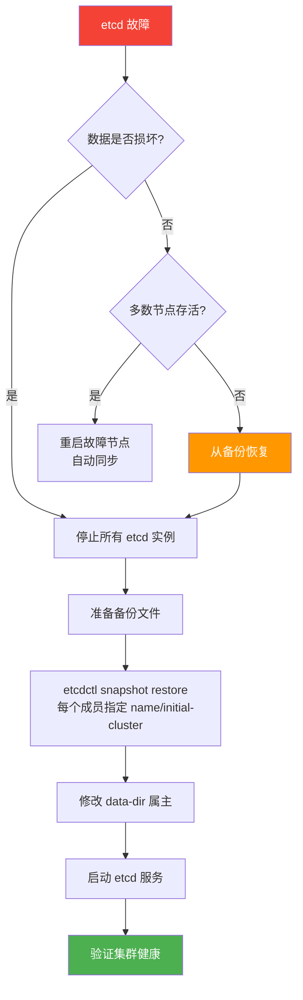

```bash
# ========== 单节点恢复 ==========

# 1. 停止 etcd
systemctl stop etcd

# 2. 备份当前数据（以防万一）
mv /var/lib/etcd /var/lib/etcd.bak.$(date +%Y%m%d)

# 3. 恢复快照
ETCDCTL_API=3 etcdctl snapshot restore /data/etcd-backup/etcd-snapshot-20260101_000000.gz \
  --name etcd-1 \
  --initial-cluster etcd-1=https://10.0.0.21:2380 \
  --initial-cluster-token etcd-cluster-1 \
  --initial-advertise-peer-urls https://10.0.0.21:2380 \
  --data-dir /var/lib/etcd

# 4. 修改权限
chown -R etcd:etcd /var/lib/etcd

# 5. 启动 etcd
systemctl start etcd

# 6. 验证
ETCDCTL_API=3 etcdctl endpoint health \
  --endpoints=https://10.0.0.21:2379 \
  --cacert=/etc/etcd/ca.crt \
  --cert=/etc/etcd/healthcheck-client.crt \
  --key=/etc/etcd/healthcheck-client.key
```

```bash
# ========== 多节点集群恢复 ==========

# 在每台 etcd 节点上分别执行（替换对应 name 和 URL）
# etcd-1
ETCDCTL_API=3 etcdctl snapshot restore /data/etcd-backup/etcd-snapshot-20260101_000000.gz \
  --name etcd-1 \
  --initial-cluster etcd-1=https://10.0.0.21:2380,etcd-2=https://10.0.0.22:2380,etcd-3=https://10.0.0.23:2380 \
  --initial-cluster-token etcd-cluster-1 \
  --initial-advertise-peer-urls https://10.0.0.21:2380 \
  --data-dir /var/lib/etcd

# etcd-2
ETCDCTL_API=3 etcdctl snapshot restore /data/etcd-backup/etcd-snapshot-20260101_000000.gz \
  --name etcd-2 \
  --initial-cluster etcd-1=https://10.0.0.21:2380,etcd-2=https://10.0.0.22:2380,etcd-3=https://10.0.0.23:2380 \
  --initial-cluster-token etcd-cluster-1 \
  --initial-advertise-peer-urls https://10.0.0.22:2380 \
  --data-dir /var/lib/etcd

# etcd-3
ETCDCTL_API=3 etcdctl snapshot restore /data/etcd-backup/etcd-snapshot-20260101_000000.gz \
  --name etcd-3 \
  --initial-cluster etcd-1=https://10.0.0.21:2380,etcd-2=https://10.0.0.22:2380,etcd-3=https://10.0.0.23:2380 \
  --initial-cluster-token etcd-cluster-1 \
  --initial-advertise-peer-urls https://10.0.0.23:2380 \
  --data-dir /var/lib/etcd
```

## 6. 集群版本升级策略

### 6.1 版本升级原则

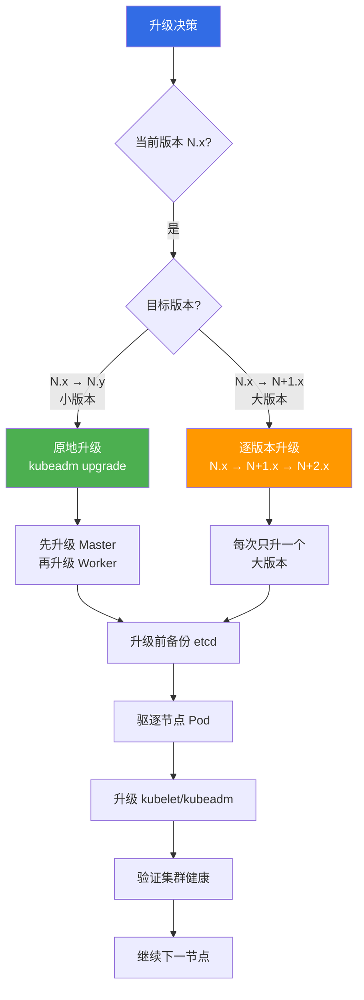

::: important 版本升级关键规则
1. **一次只升一个大版本**：1.28 → 1.29 → 1.30，不能跳版本
2. **先升级 kubeadm，再升级集群**：`kubeadm upgrade` 不会升级 kubelet
3. **先 Master 后 Worker**：控制面组件兼容低一版本的 kubelet
4. **版本偏斜策略**：kubelet 不能比 API Server 新，且最多落后一个版本
5. **升级前必须备份 etcd**
:::

### 6.2 kubeadm 升级完整流程

#### 6.2.1 升级第一个 Master 节点

```bash
# ========== 1. 升级 kubeadm ==========
# 查看可用版本
apt-cache policy kubeadm

# 指定版本安装
KUBE_VERSION=1.30.0-1.1
apt-mark unhold kubeadm
apt-get install kubeadm=${KUBE_VERSION}
apt-mark hold kubeadm

# 验证版本
kubeadm version

# ========== 2. 预检查 ==========
kubeadm upgrade plan

# 输出会显示当前版本和可升级版本
# [upgrade/versions] Manifest version: v1.30.0
# [upgrade/versions] Target version: v1.30.0

# ========== 3. 执行升级 ==========
kubeadm upgrade apply v1.30.0

# 升级过程输出：
# [upgrade/prepull] Pulling images required for setting up a Kubernetes cluster
# [upgrade/apply] Upgrading your Static Pod-hosted control plane
# [upgrade/staticpods] Writing new Static Pod manifests
# [upgrade/staticpods] Waiting for the kubelet to restart the component
# [upgrade/apply] Upgrading kube-proxy
# [upgrade/apply] Upgrading kube-dns

# ========== 4. 验证控制面 ==========
kubectl get nodes
kubectl get pods -n kube-system
```

#### 6.2.2 升级其他 Master 节点

```bash
# 其他 Master 节点不需要 upgrade apply，使用 upgrade node
kubeadm upgrade node

# 升级 kubelet
apt-mark unhold kubelet kubectl
apt-get install kubelet=1.30.0-1.1 kubectl=1.30.0-1.1
apt-mark hold kubelet kubectl

systemctl restart kubelet

# 验证
kubectl get nodes
```

#### 6.2.3 升级 Worker 节点

```bash
# ========== 1. 驱逐节点上的 Pod ==========
NODE_NAME=worker-01
kubectl cordon ${NODE_NAME}
kubectl drain ${NODE_NAME} \
  --ignore-daemonsets \
  --delete-emptydir-data \
  --force

# ========== 2. 升级 kubeadm ==========
apt-mark unhold kubeadm
apt-get install kubeadm=1.30.0-1.1
apt-mark hold kubeadm

# ========== 3. 升级节点配置 ==========
kubeadm upgrade node

# ========== 4. 升级 kubelet 和 kubectl ==========
apt-mark unhold kubelet kubectl
apt-get install kubelet=1.30.0-1.1 kubectl=1.30.0-1.1
apt-mark hold kubelet kubectl

systemctl restart kubelet

# ========== 5. 恢复节点调度 ==========
kubectl uncordon ${NODE_NAME}

# ========== 6. 验证 ==========
kubectl get nodes
```

### 6.3 批量升级 Worker 节点脚本

```bash
#!/bin/bash
# k8s-upgrade-workers.sh — 批量升级 Worker 节点
# 用法: ./k8s-upgrade-workers.sh 1.30.0-1.1

set -euo pipefail

KUBE_VERSION=${1:?"请指定版本号，如 1.30.0-1.1"}
WORKER_NODES=$(kubectl get nodes -l node-role.kubernetes.io/worker -o jsonpath='{.items[*].metadata.name}')

echo "=========================================="
echo "升级版本: ${KUBE_VERSION}"
echo "Worker 节点: ${WORKER_NODES}"
echo "=========================================="

for NODE in ${WORKER_NODES}; do
    echo ""
    echo "====== 升级节点: ${NODE} ======"

    # 1. Cordon 节点
    echo "[1/6] Cordon 节点..."
    kubectl cordon ${NODE}

    # 2. Drain 节点
    echo "[2/6] Drain 节点..."
    kubectl drain ${NODE} \
        --ignore-daemonsets \
        --delete-emptydir-data \
        --force \
        --timeout=300s

    # 3. 升级 kubeadm
    echo "[3/6] 升级 kubeadm..."
    ssh ${NODE} "apt-mark unhold kubeadm && \
        apt-get install -y kubeadm=${KUBE_VERSION} && \
        apt-mark hold kubeadm"

    # 4. 升级节点
    echo "[4/6] 升级节点配置..."
    ssh ${NODE} "kubeadm upgrade node"

    # 5. 升级 kubelet
    echo "[5/6] 升级 kubelet..."
    ssh ${NODE} "apt-mark unhold kubelet kubectl && \
        apt-get install -y kubelet=${KUBE_VERSION} kubectl=${KUBE_VERSION} && \
        apt-mark hold kubelet kubectl && \
        systemctl restart kubelet"

    # 6. Uncordon 节点
    echo "[6/6] Uncordon 节点..."
    kubectl uncordon ${NODE}

    # 等待节点 Ready
    echo "等待节点 ${NODE} Ready..."
    kubectl wait --for=condition=Ready node/${NODE} --timeout=300s

    echo "====== ${NODE} 升级完成 ======"
done

echo ""
echo "====== 所有 Worker 节点升级完成 ======"
kubectl get nodes
```

## 7. 证书轮换

### 7.1 K8s 证书体系

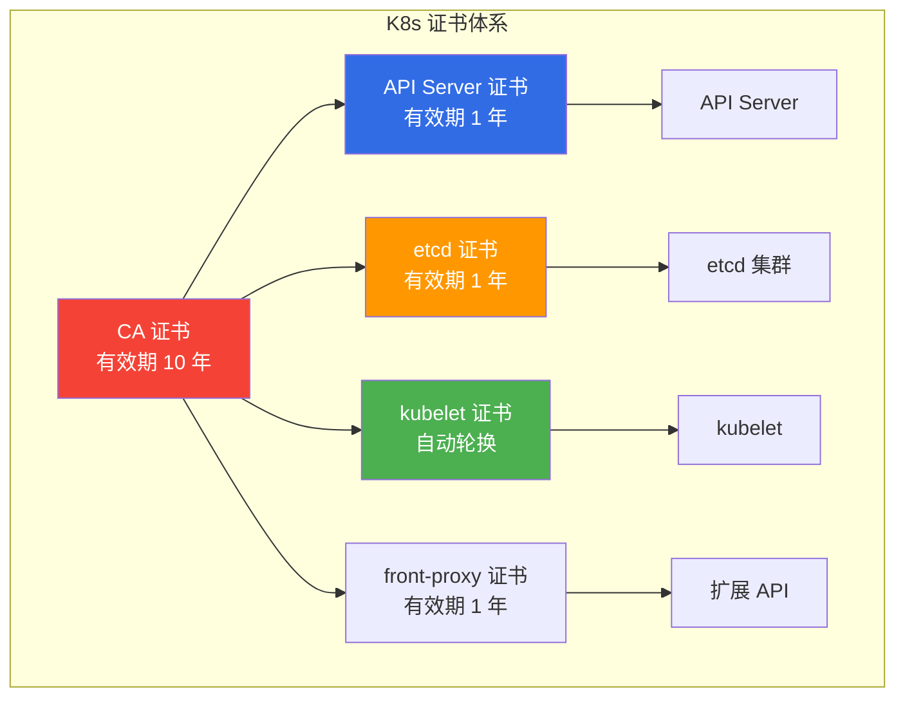

### 7.2 检查证书有效期

```bash
# 检查所有证书过期时间
kubeadm certs check-expiration

# 输出示例：
# [cert] Certificate "apiserver" expires on 2027-01-01T00:00:00Z
# [cert] Certificate "apiserver-kubelet-client" expires on 2027-01-01T00:00:00Z
# [cert] Certificate "front-proxy-client" expires on 2027-01-01T00:00:00Z
# [cert] Certificate "etcd-server" expires on 2027-01-01T00:00:00Z
# ...

# 检查特定证书
openssl x509 -in /etc/kubernetes/pki/apiserver.crt -noout -dates
```

### 7.3 手动续期证书

```bash
# 续期所有证书（在过期前执行）
kubeadm certs renew all

# 重启控制面组件（证书续期后需要重启）
# 方法一：重启 kubelet
systemctl restart kubelet

# 方法二：手动移动清单文件触发重启
mv /etc/kubernetes/manifests/kube-apiserver.yaml /tmp/
sleep 10
mv /tmp/kube-apiserver.yaml /etc/kubernetes/manifests/

# 续期特定证书
kubeadm certs renew apiserver
kubeadm certs renew apiserver-kubelet-client
kubeadm certs renew etcd-server
kubeadm certs renew etcd-peer
```

### 7.4 kubelet 证书自动轮换

```yaml
# kubelet 自动轮换配置
# /var/lib/kubelet/config.yaml
apiVersion: kubelet.config.k8s.io/v1beta1
kind: KubeletConfiguration
serverTLSBootstrap: true      # 允许通过 CSR 请求证书
rotateCertificates: true      # 启用自动轮换
```

```bash
# 查看待批准的 CSR
kubectl get csr

# 批准 CSR（如果有待批准的请求）
kubectl certificate approve <csr-name>

# 自动批准 CSR（通过 ClusterRoleBinding）
kubectl create clusterrolebinding auto-approve-csr \
  --clusterrole=system:certificates.k8s.io:certificatesigningrequests:nodeclient \
  --group=system:nodes
```

::: warning 证书过期应急预案
如果证书已过期导致 API Server 无法启动，需要紧急处理：

```bash
# 1. 备份旧证书
cp -r /etc/kubernetes/pki /etc/kubernetes/pki.bak

# 2. 续期证书（强制）
kubeadm certs renew all

# 3. 重启控制面
systemctl restart kubelet

# 4. 更新 kubeconfig
cp /etc/kubernetes/admin.conf $HOME/.kube/config
```
:::

## 8. 节点维护操作

### 8.1 节点维护三剑客

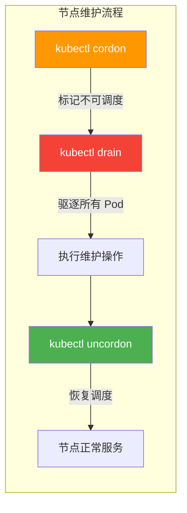

#### 8.1.1 cordon — 标记节点不可调度

```bash
# 标记节点不可调度（新 Pod 不会被调度到该节点）
kubectl cordon worker-01

# 查看节点状态（会显示 SchedulingDisabled）
kubectl get nodes
# NAME        STATUS                     ROLES           AGE   VERSION
# worker-01   Ready,SchedulingDisabled   <none>          30d   v1.30.0

# 解除不可调度
kubectl uncordon worker-01
```

#### 8.1.2 drain — 驱逐节点上的 Pod

```bash
# 驱逐节点上的所有 Pod
kubectl drain worker-01 \
  --ignore-daemonsets \          # 忽略 DaemonSet 管理的 Pod
  --delete-emptydir-data \      # 删除使用 emptyDir 的 Pod
  --force \                      # 强制删除独立 Pod
  --timeout=300s                 # 超时时间

# drain 实际执行过程：
# 1. cordon 节点（标记不可调度）
# 2. 驱逐所有非 DaemonSet、非 mirror Pod
# 3. 等待 Pod 优雅终止（受 terminationGracePeriodSeconds 控制）
# 4. 超时后强制删除

# 查看 eviction 事件
kubectl get events --field-selector reason=Evicting
```

#### 8.1.3 uncordon — 恢复节点调度

```bash
# 维护完成后恢复调度
kubectl uncordon worker-01

# 验证节点状态
kubectl get nodes
```

### 8.2 节点维护完整 SOP

```bash
#!/bin/bash
# node-maintenance.sh — 节点维护标准操作流程
# 用法: ./node-maintenance.sh <node-name> <action: drain|uncordon|reboot>

set -euo pipefail

NODE=${1:?"请指定节点名"}
ACTION=${2:?"请指定操作: drain|uncordon|reboot"}

case ${ACTION} in
    drain)
        echo "===== 驱逐节点 ${NODE} ====="
        kubectl cordon ${NODE}
        kubectl drain ${NODE} \
            --ignore-daemonsets \
            --delete-emptydir-data \
            --force \
            --timeout=300s
        echo "节点 ${NODE} 已驱逐，可安全维护"
        ;;

    uncordon)
        echo "===== 恢复节点 ${NODE} ====="
        kubectl uncordon ${NODE}
        kubectl wait --for=condition=Ready node/${NODE} --timeout=300s
        echo "节点 ${NODE} 已恢复调度"
        ;;

    reboot)
        echo "===== 节点重启流程 ${NODE} ====="
        # 驱逐
        kubectl cordon ${NODE}
        kubectl drain ${NODE} \
            --ignore-daemonsets \
            --delete-emptydir-data \
            --force \
            --timeout=300s

        # 重启
        echo "正在重启节点 ${NODE}..."
        ssh ${NODE} "sudo reboot"

        # 等待节点恢复
        echo "等待节点上线..."
        sleep 60
        until kubectl get node ${NODE} | grep -q " Ready"; do
            echo "等待 ${NODE} Ready..."
            sleep 10
        done

        # 恢复调度
        kubectl uncordon ${NODE}
        echo "节点 ${NODE} 重启完成"
        ;;

    *)
        echo "未知操作: ${ACTION}"
        exit 1
        ;;
esac

kubectl get nodes
```

## 9. 集群伸缩

### 9.1 扩容 — 添加 Worker 节点

```bash
# ========== 1. 新节点初始化 ==========
# 执行 2.2.2 节的初始化脚本

# ========== 2. 获取 join 命令 ==========
kubeadm token create --print-join-command
# 输出: kubeadm join k8s-api.example.com:6443 --token ... --discovery-token-ca-cert-hash ...

# ========== 3. 在新节点上执行 join ==========
kubeadm join k8s-api.example.com:6443 \
    --token abcdef.0123456789abcdef \
    --discovery-token-ca-cert-hash sha256:1234567890abcdef...

# ========== 4. 验证 ==========
kubectl get nodes
kubectl get pods -A -o wide | grep <new-node>

# ========== 5. 打标签（可选） ==========
kubectl label node <new-node> node-role.kubernetes.io/worker=
kubectl label node <new-node> topology.kubernetes.io/zone=cn-east-1a
kubectl label node <new-node> node.kubernetes.io/instance-type=c5.2xlarge
```

### 9.2 缩容 — 移除 Worker 节点

```bash
# ========== 1. 驱逐节点 ==========
kubectl cordon worker-03
kubectl drain worker-03 \
    --ignore-daemonsets \
    --delete-emptydir-data \
    --force

# ========== 2. 删除节点 ==========
kubectl delete node worker-03

# ========== 3. 在被移除节点上重置 ==========
kubeadm reset -f
rm -rf /etc/kubernetes /var/lib/kubelet /var/lib/dockershim /var/lib/etcd /etc/cni/net.d
iptables -F && iptables -t nat -F && iptables -t mangle -F && iptables -X
```

### 9.3 Cluster Autoscaler

```yaml
# cluster-autoscaler-deployment.yaml
apiVersion: apps/v1
kind: Deployment
metadata:
  name: cluster-autoscaler
  namespace: kube-system
  labels:
    app: cluster-autoscaler
spec:
  replicas: 1
  selector:
    matchLabels:
      app: cluster-autoscaler
  template:
    metadata:
      labels:
        app: cluster-autoscaler
    spec:
      priorityClassName: system-cluster-critical
      serviceAccountName: cluster-autoscaler
      containers:
        - name: cluster-autoscaler
          image: registry.k8s.io/autoscaling/cluster-autoscaler:v1.30.0
          command:
            - ./cluster-autoscaler
            - --v=4
            - --stderrthreshold=info
            - --cloud-provider=aws       # 根据云厂商修改
            - --skip-nodes-with-local-storage=false
            - --expander=least-waste
            - --node-group-auto-discovery=asg:tag=k8s.io/cluster-autoscaler/enabled,k8s.io/cluster-autoscaler/my-cluster
            - --balance-similar-node-groups
            - --scale-down-unneeded-time=10m
            - --scale-down-delay-after-add=10m
            - --scale-down-delay-after-delete=10s
            - --max-graceful-termination-sec=600
          resources:
            limits:
              cpu: 200m
              memory: 600Mi
            requests:
              cpu: 100m
              memory: 300Mi
```

::: tip Cluster Autoscaler 核心参数
- `--scale-down-unneeded-time`：节点空闲多久后缩容（默认 10m）
- `--scale-down-delay-after-add`：扩容后多久才开始评估缩容（默认 10m）
- `--expander`：扩容策略 — `least-waste`（最少浪费）/ `random`（随机）/ `priority`（优先级）
- `--max-node-provision-time`：节点启动超时（默认 15m）
:::

## 10. 容器运行时选择

### 10.1 containerd vs CRI-O

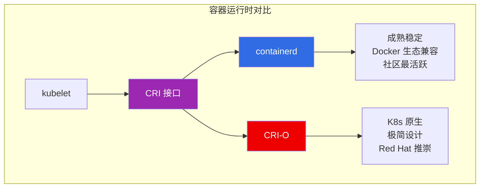

| 维度 | containerd | CRI-O |
|------|-----------|-------|
| **出身** | Docker 拆分 | Red Hat 专为 K8s 设计 |
| **成熟度** | 高 | 中 |
| **资源占用** | 中 | 低 |
| **K8s 兼容** | 完美 | 完美 |
| **镜像管理** | ctr / nerdctl | crictl |
| **社区活跃度** | 高 | 中 |
| **企业支持** | 广泛 | Red Hat 生态 |
| **额外功能** | 支持非 K8s 场景 | 纯 K8s 场景 |

::: tip 运行时选型建议
- **默认选择**：containerd — 生态最广、文档最全、社区最活跃
- **Red Hat 生态**：CRI-O — OpenShift 默认运行时，与 RHEL 深度集成
- **不建议**：Docker（已废弃 dockershim）、已停止维护的运行时
:::

### 10.2 containerd 运维

```bash
# 查看 containerd 版本
ctr version

# 列出镜像
ctr -n k8s.io images ls

# 拉取镜像
ctr -n k8s.io images pull docker.io/library/nginx:1.25

# 列出容器
ctr -n k8s.io containers ls

# 查看容器日志
crictl logs <container-id>

# 使用 nerdctl（containerd 的 docker 兼容 CLI）
# 安装 nerdctl
wget https://github.com/containerd/nerdctl/releases/download/v1.7.0/nerdctl-1.7.0-linux-amd64.tar.gz
tar xzvf nerdctl-1.7.0-linux-amd64.tar.gz -C /usr/local/bin/

# nerdctl 用法与 docker 一致
nerdctl -n k8s.io ps
nerdctl -n k8s.io images
nerdctl -n k8s.io logs <container-id>
```

### 10.3 containerd 配置调优

```toml
# /etc/containerd/config.toml 关键配置

version = 2

[plugins."io.containerd.grpc.v1.cri"]
  # 沙箱镜像（Pause 容器）
  sandbox_image = "registry.k8s.io/pause:3.9"

  [plugins."io.containerd.grpc.v1.cri".containerd]
    # 并发下载镜像数
    snapshotter = "overlayfs"

    [plugins."io.containerd.grpc.v1.cri".containerd.runtimes.runc]
      runtime_type = "io.containerd.runc.v2"
      [plugins."io.containerd.grpc.v1.cri".containerd.runtimes.runc.options]
        SystemdCgroup = true

  # 镜像拉取并发
  [plugins."io.containerd.grpc.v1.cri".registry]
    [plugins."io.containerd.grpc.v1.cri".registry.mirrors]
      [plugins."io.containerd.grpc.v1.cri".registry.mirrors."docker.io"]
        endpoint = ["https://mirror.ccs.tencentyun.com"]

# 全局调优
[grpc]
  max_recv_message_size = 16777216    # 16 MB
  max_send_message_size = 16777216

[debug]
  level = "info"
```

## 11. 多 Master 高可用

### 11.1 高可用架构

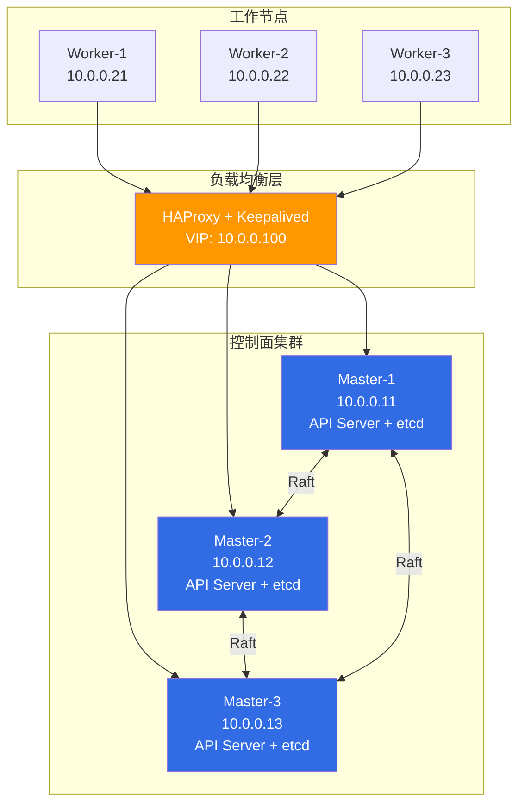

### 11.2 HAProxy + Keepalived 配置

#### 11.2.1 HAProxy 配置

```ini
# /etc/haproxy/haproxy.cfg
global
    log /dev/log local0
    maxconn 2000
    daemon

defaults
    log     global
    mode    tcp
    option  tcplog
    option  dontlognull
    retries 3
    timeout connect 5s
    timeout client  30s
    timeout server  30s

# K8s API Server 负载均衡
frontend k8s-api
    bind *:6443
    mode tcp
    option tcplog
    default_backend k8s-api-backend

backend k8s-api-backend
    mode tcp
    option tcp-check
    balance roundrobin
    default-server inter 10s downinter 5s rise 2 fall 2 slowstart 60s maxconn 250 maxqueue 256 weight 100
    server master-1 10.0.0.11:6443 check
    server master-2 10.0.0.12:6443 check
    server master-3 10.0.0.13:6443 check

# Stats 页面
frontend stats
    bind *:8404
    mode http
    stats enable
    stats uri /stats
    stats refresh 10s
    stats admin if LOCALHOST
```

#### 11.2.2 Keepalived 配置

```ini
# /etc/keepalived/keepalived.conf — Master 节点
global_defs {
    router_id LVS_K8S_MASTER
}

vrrp_script check_haproxy {
    script "/etc/keepalived/check_haproxy.sh"
    interval 3
    weight -2
    fall 10
    rise 2
}

vrrp_instance VI_K8S {
    state MASTER
    interface eth0
    virtual_router_id 51
    priority 100
    advert_int 1
    authentication {
        auth_type PASS
        auth_pass K8s_HA_PASS
    }
    virtual_ipaddress {
        10.0.0.100/24
    }
    track_script {
        check_haproxy
    }
}
```

```bash
# /etc/keepalived/check_haproxy.sh — 健康检查脚本
#!/bin/bash
if ! killall -0 haproxy; then
    echo "HAProxy is not running"
    exit 1
fi
exit 0
```

```ini
# /etc/keepalived/keepalived.conf — Backup 节点
# 仅修改 state 和 priority
vrrp_instance VI_K8S {
    state BACKUP
    interface eth0
    virtual_router_id 51
    priority 99         # 低于 Master
    # 其余配置与 Master 相同
}
```

### 11.3 kubeadm 高可用初始化

```bash
# ========== 第一个 Master 节点 ==========
kubeadm init \
  --control-plane-endpoint "k8s-api.example.com:6443" \
  --upload-certs \
  --kubernetes-version=v1.30.0 \
  --pod-network-cidr=10.244.0.0/16

# 输出包含 --certificate-key，用于其他 Master 加入

# ========== 第二个 Master 节点 ==========
kubeadm join k8s-api.example.com:6443 \
  --token abcdef.0123456789abcdef \
  --discovery-token-ca-cert-hash sha256:123456... \
  --control-plane \
  --certificate-key <certificate-key>

# ========== 第三个 Master 节点 ==========
kubeadm join k8s-api.example.com:6443 \
  --token abcdef.0123456789abcdef \
  --discovery-token-ca-cert-hash sha256:123456... \
  --control-plane \
  --certificate-key <certificate-key>

# ========== 验证高可用 ==========
kubectl get nodes
kubectl get pods -n kube-system -o wide

# 测试 API Server 可用性
for i in 1 2 3; do
    echo "=== Master-${i} ==="
    kubectl get --raw /healthz --server=https://10.0.0.1${i}:6443
done
```

## 12. 生产环境初始化脚本

### 12.1 集群初始化后的必做配置

```bash
#!/bin/bash
# k8s-post-init.sh — 集群初始化后配置
# 在 kubeadm init 之后执行

set -euo pipefail

echo "===== 1. 安装 Metrics Server ====="
kubectl apply -f https://github.com/kubernetes-sigs/metrics-server/releases/latest/download/components.yaml

echo "===== 2. 配置默认 StorageClass ====="
# 根据存储后端选择
# 这里以本地存储为例
cat <<EOF | kubectl apply -f -
apiVersion: storage.k8s.io/v1
kind: StorageClass
metadata:
  name: local-storage
  annotations:
    storageclass.kubernetes.io/is-default-class: "true"
provisioner: kubernetes.io/no-provisioner
volumeBindingMode: WaitForFirstConsumer
reclaimPolicy: Delete
EOF

echo "===== 3. 配置资源配额 ====="
cat <<EOF | kubectl apply -f -
apiVersion: v1
kind: ResourceQuota
metadata:
  name: default-quota
  namespace: default
spec:
  hard:
    requests.cpu: "10"
    requests.memory: 20Gi
    limits.cpu: "20"
    limits.memory: 40Gi
    pods: "50"
    services: "20"
    persistentvolumeclaims: "20"
EOF

echo "===== 4. 配置 LimitRange ====="
cat <<EOF | kubectl apply -f -
apiVersion: v1
kind: LimitRange
metadata:
  name: default-limits
  namespace: default
spec:
  limits:
  - default:              # 默认 limit
      cpu: "500m"
      memory: "256Mi"
    defaultRequest:        # 默认 request
      cpu: "100m"
      memory: "128Mi"
    max:                   # 最大允许值
      cpu: "4"
      memory: "8Gi"
    min:                   # 最小允许值
      cpu: "50m"
      memory: "64Mi"
    type: Container
EOF

echo "===== 5. 创建命名空间 ====="
for ns in dev staging prod monitoring logging; do
    kubectl create namespace ${ns} --dry-run=client -o yaml | kubectl apply -f -
done

echo "===== 6. 配置 RBAC ====="
# 只读用户
cat <<EOF | kubectl apply -f -
apiVersion: rbac.authorization.k8s.io/v1
kind: ClusterRole
metadata:
  name: readonly
rules:
- apiGroups: ["", "apps", "batch", "extensions"]
  resources: ["*"]
  verbs: ["get", "list", "watch"]
EOF

echo "===== 7. 配置 Pod 安全标准 ====="
kubectl label namespace default pod-security.kubernetes.io/enforce=restricted
kubectl label namespace default pod-security.kubernetes.io/audit=restricted
kubectl label namespace default pod-security.kubernetes.io/warn=restricted

echo "===== 8. 安装必备组件 ====="
# MetalLB（裸金属 LoadBalancer）
# helm repo add metallb https://metallb.github.io/metallb
# helm install metallb metallb/metallb --namespace metallb-system --create-namespace

# cert-manager（证书管理）
kubectl apply -f https://github.com/cert-manager/cert-manager/releases/latest/download/cert-manager.yaml

echo "===== 生产初始化完成 ====="
kubectl get nodes
kubectl get sc
kubectl get namespaces
```

### 12.2 集群安全基线检查

```bash
# 使用 kube-bench 检查 CIS Kubernetes Benchmark
# 安装 kube-bench
kubectl apply -f https://raw.githubusercontent.com/aquasecurity/kube-bench/main/job.yaml

# 查看结果
kubectl logs job/kube-bench

# 或者使用 Docker 运行
docker run --rm -v /etc/kubernetes:/etc/kubernetes \
    -v /var/lib/etcd:/var/lib/etcd \
    -v /var/lib/kubelet:/var/lib/kubelet \
    aquasec/kube-bench:latest

# 使用 kubectl 插件
kubectl krew install popeye
kubectl popeye
```

## 13. 离线部署方案

### 13.1 离线镜像准备

```bash
#!/bin/bash
# k8s-offline-images.sh — 打包 K8s 离线镜像

set -euo pipefail

KUBE_VERSION=v1.30.0
IMAGE_DIR=/data/k8s-images

mkdir -p ${IMAGE_DIR}

# ========== 1. 拉取 K8s 核心镜像 ==========
images=(
    "registry.k8s.io/kube-apiserver:${KUBE_VERSION}"
    "registry.k8s.io/kube-controller-manager:${KUBE_VERSION}"
    "registry.k8s.io/kube-scheduler:${KUBE_VERSION}"
    "registry.k8s.io/kube-proxy:${KUBE_VERSION}"
    "registry.k8s.io/pause:3.9"
    "registry.k8s.io/etcd:3.5.13-0"
    "registry.k8s.io/coredns/coredns:v1.11.1"
)

for img in "${images[@]}"; do
    echo "Pulling ${img}..."
    ctr -n k8s.io images pull ${img}
done

# ========== 2. 拉取 CNI 镜像 ==========
cni_images=(
    "docker.io/calico/cni:v3.27.0"
    "docker.io/calico/node:v3.27.0"
    "docker.io/calico/kube-controllers:v3.27.0"
)

for img in "${cni_images[@]}"; do
    echo "Pulling ${img}..."
    ctr -n k8s.io images pull ${img}
done

# ========== 3. 导出镜像 ==========
echo "导出镜像到 ${IMAGE_DIR}..."
ctr -n k8s.io images export ${IMAGE_DIR}/k8s-images.tar \
    $(ctr -n k8s.io images ls -q | tr '\n' ' ')

echo "离线镜像打包完成: ${IMAGE_DIR}/k8s-images.tar"
ls -lh ${IMAGE_DIR}/
```

### 13.2 离线部署执行

```bash
# 在离线环境中导入镜像
ctr -n k8s.io images import /data/k8s-images/k8s-images.tar

# 使用离线配置初始化
kubeadm init --config kubeadm-config.yaml \
    --skip-phases=addon/kube-proxy \
    --image-repository=registry.local/k8s

# 或者使用 kubeadm config images list 查看需要的镜像
kubeadm config images list --kubernetes-version=v1.30.0
```

## 14. 集群运维日常检查清单

### 14.1 每日检查

| 检查项 | 命令 | 期望结果 |
|--------|------|----------|
| 节点状态 | `kubectl get nodes` | 全部 Ready |
| 系统Pod | `kubectl get pods -n kube-system` | 全部 Running |
| 证书有效期 | `kubeadm certs check-expiration` | >30 天 |
| etcd 健康 | `etcdctl endpoint health` | 全部 healthy |
| 资源使用 | `kubectl top nodes` | <80% |
| 事件异常 | `kubectl get events --sort-by=.lastTimestamp` | 无 Critical |
| Pod 重启 | `kubectl get pods -A --sort-by='.status.containerStatuses[0].restartCount'` | 无异常重启 |

### 14.2 每周检查

| 检查项 | 命令 | 期望结果 |
|--------|------|----------|
| 镜像清理 | `crictl rmi --prune` | 释放空间 |
| etcd 碎片整理 | `etcdctl defrag` | 空间回收 |
| 备份验证 | `etcdctl snapshot status` | 备份可恢复 |
| 安全补丁 | `apt list --upgradable` | 及时更新 |
| 磁盘使用 | `df -h /var/lib/etcd /var/lib/kubelet` | <70% |

### 14.3 每月检查

| 检查项 | 命令 | 期望结果 |
|--------|------|----------|
| 版本评估 | `kubeadm upgrade plan` | 评估是否需要升级 |
| 安全基线 | `kube-bench` | 通过 CIS Benchmark |
| 证书审计 | `kubeadm certs check-expiration` | 提前续期 |
| 容量规划 | `kubectl top nodes/pods` | 评估扩容需求 |
| 灾备演练 | 从备份恢复 etcd | 恢复成功 |

## 15. 参考资源

- [Kubernetes 官方文档 - 使用 kubeadm 创建集群](https://kubernetes.io/docs/setup/production-environment/tools/kubeadm/)
- [kubeadm 升级文档](https://kubernetes.io/docs/tasks/administer-cluster/kubeadm/kubeadm-upgrade/)
- [etcd 运维指南](https://etcd.io/docs/latest/op-guide/)
- [k3s 官方文档](https://docs.k3s.io/)
- [Calico 网络插件](https://docs.tigera.io/calico/latest/about/)
- [Cilium eBPF 网络方案](https://docs.cilium.io/)
- [Cluster Autoscaler](https://github.com/kubernetes/autoscaler/tree/master/cluster-autoscaler)
- [containerd 文档](https://containerd.io/)
- [CRI-O 文档](https://cri-o.io/)
- [kube-bench 安全检查](https://github.com/aquasecurity/kube-bench)
- [Kubernetes 版本偏斜策略](https://kubernetes.io/docs/setup/release/version-skew-policy/)
