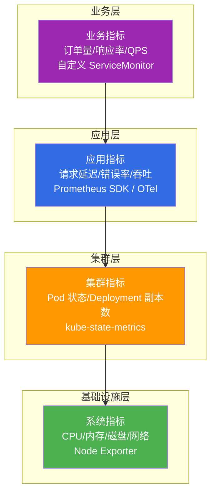
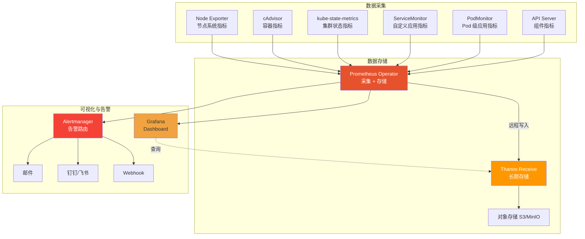
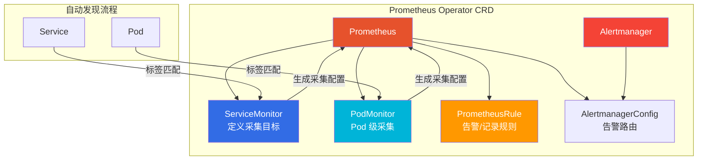
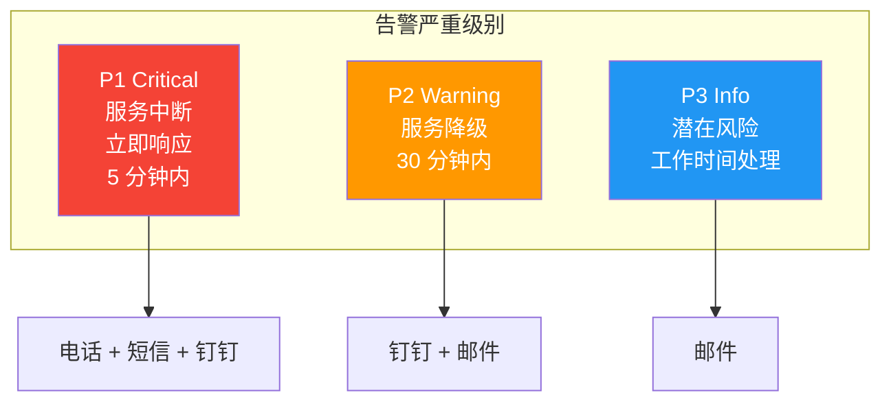
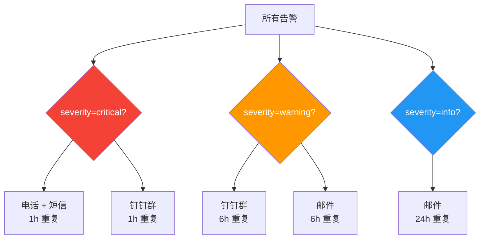
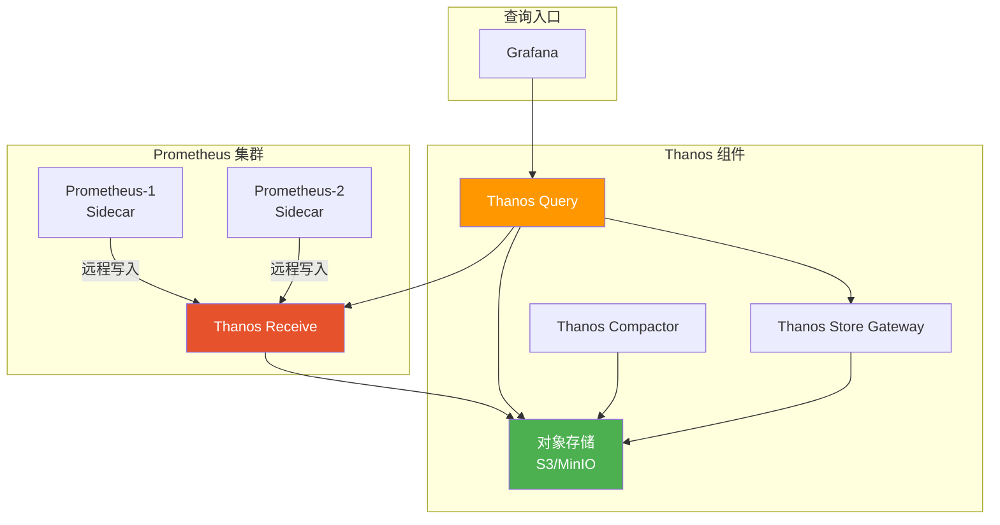

# 监控与告警体系

没有监控的集群就像蒙眼开飞机——出问题时你只能靠猜。Kubernetes 监控体系涉及基础设施、集群组件、应用指标、业务指标四个层次，从数据采集到存储、从可视化到告警路由，每一环都需要精心设计。本文从 K8s 监控架构全景出发，覆盖 Prometheus Operator 部署、自定义指标、Grafana Dashboard、告警规则、PromQL 实战、Thanos 长期存储，以及 .NET 应用的 Prometheus 集成方案。

## 1. K8s 监控架构全景

### 1.1 监控分层模型



### 1.2 K8s 监控架构图



::: important 监控架构核心组件
- **Prometheus Operator**：自动化 Prometheus 部署与配置，CRD 驱动
- **Node Exporter**：节点级系统指标（CPU/内存/磁盘/网络）
- **cAdvisor**：容器级指标（已内嵌在 kubelet 中）
- **kube-state-metrics**：集群状态指标（Pod 状态/Deployment 副本数等）
- **ServiceMonitor/PodMonitor**：自定义应用指标采集规则
- **Grafana**：可视化 Dashboard
- **Alertmanager**：告警路由、抑制、静默
- **Thanos**：长期存储与全局查询
:::

## 2. Prometheus Operator 部署与配置

### 2.1 使用 kube-prometheus-stack 一键部署

```bash
# 添加 Helm 仓库
helm repo add prometheus-community https://prometheus-community.github.io/helm-charts
helm repo update

# 创建命名空间
kubectl create namespace monitoring

# 部署 kube-prometheus-stack（包含 Prometheus Operator + Grafana + Alertmanager + Node Exporter + kube-state-metrics）
helm install prometheus prometheus-community/kube-prometheus-stack \
  --namespace monitoring \
  --set prometheus.prometheusSpec.retention=15d \
  --set prometheus.prometheusSpec.storageSpec.volumeClaimTemplate.spec.storageClassName=local-storage \
  --set prometheus.prometheusSpec.storageSpec.volumeClaimTemplate.spec.resources.requests.storage=50Gi \
  --set grafana.adminPassword='YourSecurePassword' \
  --set grafana.persistence.enabled=true \
  --set grafana.persistence.size=10Gi \
  --set alertmanager.alertmanagerSpec.storage.volumeClaimTemplate.spec.storageClassName=local-storage \
  --set alertmanager.alertmanagerSpec.storage.volumeClaimTemplate.spec.resources.requests.storage=10Gi
```

### 2.2 自定义 values 文件

```yaml
# prometheus-stack-values.yaml
# helm install prometheus prometheus-community/kube-prometheus-stack -n monitoring -f prometheus-stack-values.yaml

# ========== Prometheus 配置 ==========
prometheus:
  prometheusSpec:
    # 数据保留时间
    retention: 15d

    # 每个采集目标的采样间隔
    scrapeInterval: 30s

    # 评估规则间隔
    evaluationInterval: 30s

    # 持久化存储
    storageSpec:
      volumeClaimTemplate:
        spec:
          storageClassName: local-storage
          accessModes: ["ReadWriteOnce"]
          resources:
            requests:
              storage: 50Gi

    # 资源限制
    resources:
      requests:
        cpu: 500m
        memory: 2Gi
      limits:
        cpu: "2"
        memory: 8Gi

    # 额外采集配置
    additionalScrapeConfigs:
      - job_name: 'kubernetes-pods'
        kubernetes_sd_configs:
          - role: pod
        relabel_configs:
          - source_labels: [__meta_kubernetes_pod_annotation_prometheus_io_scrape]
            action: keep
            regex: true
          - source_labels: [__meta_kubernetes_pod_annotation_prometheus_io_path]
            action: replace
            target_label: __metrics_path__
            regex: (.+)

    # 远程写入（Thanos）
    remoteWrite:
      - url: http://thanos-receive:19291/api/v1/receive
        send_exemplars: true

    # 远程读取（Thanos）
    remoteRead:
      - url: http://thanos-query:19192/api/v1/read
        read_recent: true

  # Ingress 暴露
  ingress:
    enabled: true
    ingressClassName: nginx
    hosts:
      - prometheus.example.com
    tls:
      - secretName: prometheus-tls
        hosts:
          - prometheus.example.com

  # ServiceMonitor 自动发现
  serviceMonitorSelector:
    matchLabels:
      release: prometheus

# ========== Grafana 配置 ==========
grafana:
  adminPassword: "YourSecurePassword"
  persistence:
    enabled: true
    size: 10Gi
    storageClassName: local-storage

  # 预置 Dashboard
  dashboardProviders:
    dashboardproviders.yaml:
      apiVersion: 1
      providers:
        - name: default
          orgId: 1
          folder: ''
          type: file
          disableDeletion: false
          editable: true
          options:
            path: /var/lib/grafana/dashboards/default

  # 数据源
  datasources:
    datasources.yaml:
      apiVersion: 1
      datasources:
        - name: Prometheus
          type: prometheus
          url: http://prometheus-operated:9090
          isDefault: true
        - name: Thanos
          type: prometheus
          url: http://thanos-query:19192
          access: proxy

  ingress:
    enabled: true
    ingressClassName: nginx
    hosts:
      - grafana.example.com
    tls:
      - secretName: grafana-tls
        hosts:
          - grafana.example.com

# ========== Alertmanager 配置 ==========
alertmanager:
  alertmanagerSpec:
    storage:
      volumeClaimTemplate:
        spec:
          storageClassName: local-storage
          accessModes: ["ReadWriteOnce"]
          resources:
            requests:
              storage: 10Gi

  config:
    global:
      resolve_timeout: 5m
      smtp_smarthost: 'smtp.example.com:587'
      smtp_from: 'alertmanager@example.com'
      smtp_auth_username: 'alertmanager@example.com'
      smtp_auth_password: 'SMTP_PASSWORD'

    route:
      group_by: ['alertname', 'cluster', 'namespace']
      group_wait: 30s
      group_interval: 5m
      repeat_interval: 4h
      receiver: 'default'
      routes:
        - match:
            severity: critical
          receiver: 'critical'
          repeat_interval: 1h
        - match:
            severity: warning
          receiver: 'warning'
          repeat_interval: 6h

    receivers:
      - name: 'default'
        email_configs:
          - to: 'ops@example.com'
            send_resolved: true
      - name: 'critical'
        email_configs:
          - to: 'ops-critical@example.com'
            send_resolved: true
        webhook_configs:
          - url: 'http://alertmanager-webhook-adapter:8080/dingtalk'
            send_resolved: true
      - name: 'warning'
        email_configs:
          - to: 'ops-warning@example.com'
            send_resolved: true

  ingress:
    enabled: true
    ingressClassName: nginx
    hosts:
      - alertmanager.example.com
```

### 2.3 Prometheus Operator CRD 体系



## 3. kube-state-metrics 指标详解

### 3.1 核心指标分类

| 类别 | 指标示例 | 说明 |
|------|----------|------|
| **Pod** | `kube_pod_status_phase` | Pod 当前阶段（Running/Pending/Failed） |
| **Pod** | `kube_pod_container_status_restarts_total` | 容器重启次数 |
| **Pod** | `kube_pod_container_status_terminated_reason` | 终止原因（OOMKilled/Error） |
| **Deployment** | `kube_deployment_status_replicas_available` | 可用副本数 |
| **Deployment** | `kube_deployment_status_replicas_unavailable` | 不可用副本数 |
| **Node** | `kube_node_status_condition` | 节点条件（Ready/MemoryPressure/DiskPressure） |
| **Node** | `kube_node_status_allocatable` | 节点可分配资源 |
| **PVC** | `kube_persistentvolumeclaim_status_phase` | PVC 状态 |
| **Job** | `kube_job_status_failed` | Job 失败次数 |
| **HPA** | `kube_hpa_status_current_replicas` | HPA 当前副本数 |

### 3.2 关键 PromQL 查询

```promql
# Pod 重启次数 Top 10
topk(10, sum by (namespace, pod) (kube_pod_container_status_restarts_total))

# 不可用 Deployment
kube_deployment_status_replicas_unavailable > 0

# 节点资源使用率
100 * (1 - kube_node_status_allocatable{resource="memory"} / kube_node_status_capacity{resource="memory"})

# PVC 绑定失败
kube_persistentvolumeclaim_status_phase{phase="Lost"} == 1

# Job 失败
kube_job_status_failed > 0

# CrashLoopBackOff Pod
kube_pod_container_status_waiting_reason{reason="CrashLoopBackOff"} == 1

# 镜像拉取失败
kube_pod_container_status_waiting_reason{reason="ImagePullBackOff"} == 1
```

## 4. Node Exporter 关键指标

### 4.1 系统指标速查

| 指标 | 含义 | 告警阈值参考 |
|------|------|-------------|
| `node_cpu_seconds_total` | CPU 使用时间（按模式） | 空闲 < 10% |
| `node_memory_MemAvailable_bytes` | 可用内存 | < 10% 总量 |
| `node_filesystem_avail_bytes` | 文件系统可用空间 | < 15% |
| `node_filesystem_files_free` | inode 可用数 | < 15% |
| `node_disk_io_time_seconds_total` | 磁盘 IO 时间 | > 80% |
| `node_network_receive_bytes_total` | 网络接收字节 | 突增检测 |
| `node_network_transmit_bytes_total` | 网络发送字节 | 突增检测 |
| `node_load1` / `node_load5` / `node_load15` | 系统负载 | > CPU 核数 |
| `node_boot_time_seconds` | 系统启动时间 | 非预期重启 |

### 4.2 CPU 使用率计算

```promql
# 节点 CPU 使用率（%）
100 * (1 - sum by (instance) (rate(node_cpu_seconds_total{mode="idle"}[5m])))

# 按模式分布的 CPU 使用率
sum by (instance, mode) (rate(node_cpu_seconds_total[5m]))

# CPU 使用率 Top 5 节点
topk(5, 100 * (1 - sum by (instance) (rate(node_cpu_seconds_total{mode="idle"}[5m]))))
```

### 4.3 内存使用率计算

```promql
# 节点内存使用率（%）
100 * (1 - node_memory_MemAvailable_bytes / node_memory_MemTotal_bytes)

# 内存使用率 Top 5
topk(5, 100 * (1 - node_memory_MemAvailable_bytes / node_memory_MemTotal_bytes))

# Swap 使用量
node_memory_SwapTotal_bytes - node_memory_SwapFree_bytes
```

### 4.4 磁盘使用率计算

```promql
# 磁盘使用率（%）
100 * (1 - node_filesystem_avail_bytes{fstype=~"ext4|xfs"} / node_filesystem_size_bytes{fstype=~"ext4|xfs"})

# inode 使用率（%）
100 * (1 - node_filesystem_files_free{fstype=~"ext4|xfs"} / node_filesystem_files{fstype=~"ext4|xfs"})

# 磁盘读写延迟
rate(node_disk_read_time_seconds_total[5m]) / rate(node_disk_reads_completed_total[5m])
```

## 5. cAdvisor 容器指标

### 5.1 核心容器指标

| 指标 | 含义 |
|------|------|
| `container_cpu_usage_seconds_total` | 容器 CPU 使用时间 |
| `container_memory_working_set_bytes` | 容器工作集内存（OOM 判定依据） |
| `container_memory_rss` | 容器 RSS 内存 |
| `container_fs_usage_bytes` | 容器文件系统使用量 |
| `container_network_receive_bytes_total` | 容器网络接收 |
| `container_network_transmit_bytes_total` | 容器网络发送 |
| `container_spec_cpu_quota` | 容器 CPU 限额 |
| `container_spec_memory_limit_bytes` | 容器内存限额 |

### 5.2 容器资源使用 PromQL

```promql
# 容器 CPU 使用率（相对 limit）
sum by (namespace, pod, container) (
    rate(container_cpu_usage_seconds_total{container!=""}[5m])
) / sum by (namespace, pod, container) (
    container_spec_cpu_quota / container_spec_cpu_period
) * 100

# 容器内存使用率（相对 limit）
sum by (namespace, pod, container) (
    container_memory_working_set_bytes{container!=""}
) / sum by (namespace, pod, container) (
    container_spec_memory_limit_bytes > 0
) * 100

# 内存接近 OOM 的容器（>85% limit）
sum by (namespace, pod, container) (
    container_memory_working_set_bytes{container!=""}
) / sum by (namespace, pod, container) (
    container_spec_memory_limit_bytes > 0
) > 0.85

# 容器 CPU Throttling 比率
sum by (namespace, pod, container) (
    rate(container_cpu_cfs_throttled_periods_total[5m])
) / sum by (namespace, pod, container) (
    rate(container_cpu_cfs_periods_total[5m])
)
```

## 6. 自定义应用指标

### 6.1 ServiceMonitor 配置

```yaml
# ServiceMonitor — 通过 Service 发现采集目标
apiVersion: monitoring.coreos.com/v1
kind: ServiceMonitor
metadata:
  name: my-app-metrics
  namespace: production
  labels:
    release: prometheus    # 匹配 Prometheus Operator 的 serviceMonitorSelector
spec:
  selector:
    matchLabels:
      app: my-app          # 匹配 Service 标签
  namespaceSelector:
    any: false
    matchNames:
      - production
  endpoints:
    - port: metrics        # Service 中定义的端口名
      path: /metrics      # 指标路径
      interval: 30s       # 采集间隔
      scrapeTimeout: 10s  # 采集超时
      honorLabels: true   # 保留应用自己的标签
```

```yaml
# 配套 Service（必须）
apiVersion: v1
kind: Service
metadata:
  name: my-app-metrics
  namespace: production
  labels:
    app: my-app
  annotations:
    prometheus.io/scrape: "true"    # 兼容手动发现
    prometheus.io/port: "8080"
    prometheus.io/path: "/metrics"
spec:
  selector:
    app: my-app
  ports:
    - name: metrics
      port: 8080
      targetPort: 8080
      protocol: TCP
```

### 6.2 PodMonitor 配置

```yaml
# PodMonitor — 直接通过 Pod 发现采集目标（不需要 Service）
apiVersion: monitoring.coreos.com/v1
kind: PodMonitor
metadata:
  name: my-app-pod-metrics
  namespace: production
  labels:
    release: prometheus
spec:
  selector:
    matchLabels:
      app: my-app
  namespaceSelector:
    matchNames:
      - production
  podMetricsEndpoints:
    - port: metrics        # Pod 定义中的 containerPort name
      path: /metrics
      interval: 30s
      scrapeTimeout: 10s
```

::: tip ServiceMonitor vs PodMonitor
- **ServiceMonitor**：通过 Service 发现，适合常规应用部署。Service 提供负载均衡和稳定端点
- **PodMonitor**：直接发现 Pod，适合 Headless Service、Sidecar 模式、每个 Pod 独立采集的场景
- 两者可以共存，优先使用 ServiceMonitor
:::

### 6.3 应用暴露指标的最佳实践

```yaml
# Pod 注解方式（兼容非 Operator 场景）
apiVersion: v1
kind: Pod
metadata:
  name: my-app
  annotations:
    prometheus.io/scrape: "true"
    prometheus.io/port: "8080"
    prometheus.io/path: "/metrics"
spec:
  containers:
    - name: app
      image: my-app:latest
      ports:
        - containerPort: 8080
          name: metrics
          protocol: TCP
```

## 7. Grafana Dashboard 配置

### 7.1 必备 Dashboard

| Dashboard ID | 名称 | 覆盖内容 |
|-------------|------|----------|
| 1860 | Node Exporter Full | 节点 CPU/内存/磁盘/网络 |
| 15760 | Kubernetes Views Pods | Pod 资源使用/重启/状态 |
| 15758 | Kubernetes Views Nodes | 节点状态/资源/容量 |
| 15761 | Kubernetes Views Namespace | 命名空间资源概览 |
| 12486 | Kube API Server | API Server 性能/延迟/错误 |
| 12006 | etcd | etcd 性能/Leader/存储 |
| 17908 | .NET App Metrics | .NET 应用指标 |

```bash
# 导入 Dashboard
# 方法一：Grafana UI → Dashboards → Import → 输入 ID
# 方法二：API 导入
curl -X POST http://grafana.example.com/api/dashboards/import \
  -H "Authorization: Bearer <API_KEY>" \
  -H "Content-Type: application/json" \
  -d '{
    "pluginId": "",
    "overwrite": true,
    "dashboard": {
      "id": null,
      "uid": "node-exporter-full",
      "title": "Node Exporter Full",
      "tags": ["node", "exporter"]
    },
    "inputs": [{
      "name": "DS_PROMETHEUS",
      "type": "datasource",
      "pluginId": "prometheus",
      "value": "Prometheus"
    }]
  }'
```

### 7.2 自定义 Dashboard JSON 导出

```json
{
  "dashboard": {
    "title": "K8s Cluster Overview",
    "uid": "k8s-cluster-overview",
    "panels": [
      {
        "title": "节点状态",
        "type": "stat",
        "targets": [
          {
            "expr": "sum(kube_node_status_condition{condition=\"Ready\", status=\"true\"})",
            "legendFormat": "Ready"
          },
          {
            "expr": "sum(kube_node_status_condition{condition=\"Ready\", status=\"false\"})",
            "legendFormat": "NotReady"
          }
        ]
      },
      {
        "title": "Pod 状态分布",
        "type": "piechart",
        "targets": [
          {
            "expr": "sum(kube_pod_status_phase{phase=\"Running\"})",
            "legendFormat": "Running"
          },
          {
            "expr": "sum(kube_pod_status_phase{phase=\"Pending\"})",
            "legendFormat": "Pending"
          },
          {
            "expr": "sum(kube_pod_status_phase{phase=\"Failed\"})",
            "legendFormat": "Failed"
          }
        ]
      }
    ]
  }
}
```

## 8. 关键告警规则

### 8.1 告警分级



### 8.2 节点告警规则

```yaml
# node-alerts.yaml
apiVersion: monitoring.coreos.com/v1
kind: PrometheusRule
metadata:
  name: node-alerts
  namespace: monitoring
  labels:
    release: prometheus
spec:
  groups:
    - name: node-alerts
      rules:
        # 节点 NotReady
        - alert: NodeNotReady
          expr: kube_node_status_condition{condition="Ready", status="unknown"} == 1
          for: 5m
          labels:
            severity: critical
          annotations:
            summary: "节点 {{ $labels.node }} NotReady"
            description: "节点 {{ $labels.node }} 已经 NotReady 超过 5 分钟"

        # 节点 CPU 使用率高
        - alert: NodeCPUHigh
          expr: |
            100 * (1 - sum by (instance) (
              rate(node_cpu_seconds_total{mode="idle"}[5m])
            )) > 85
          for: 10m
          labels:
            severity: warning
          annotations:
            summary: "节点 {{ $labels.instance }} CPU 使用率超过 85%"
            description: "当前 CPU 使用率: {{ $value | printf \"%.1f\" }}%"

        # 节点内存使用率高
        - alert: NodeMemoryHigh
          expr: |
            100 * (1 - node_memory_MemAvailable_bytes / node_memory_MemTotal_bytes) > 85
          for: 10m
          labels:
            severity: warning
          annotations:
            summary: "节点 {{ $labels.instance }} 内存使用率超过 85%"
            description: "当前内存使用率: {{ $value | printf \"%.1f\" }}%"

        # 磁盘空间不足
        - alert: NodeDiskSpaceLow
          expr: |
            100 * (1 - node_filesystem_avail_bytes{fstype=~"ext4|xfs"}
              / node_filesystem_size_bytes{fstype=~"ext4|xfs"}) > 85
          for: 10m
          labels:
            severity: warning
          annotations:
            summary: "节点 {{ $labels.instance }} 磁盘 {{ $labels.mountpoint }} 使用率超过 85%"
            description: "当前磁盘使用率: {{ $value | printf \"%.1f\" }}%"

        # 磁盘空间严重不足
        - alert: NodeDiskSpaceCritical
          expr: |
            100 * (1 - node_filesystem_avail_bytes{fstype=~"ext4|xfs"}
              / node_filesystem_size_bytes{fstype=~"ext4|xfs"}) > 95
          for: 5m
          labels:
            severity: critical
          annotations:
            summary: "节点 {{ $labels.instance }} 磁盘 {{ $labels.mountpoint }} 即将满"
            description: "当前磁盘使用率: {{ $value | printf \"%.1f\" }}%"

        # inode 耗尽
        - alert: NodeInodesLow
          expr: |
            100 * (1 - node_filesystem_files_free{fstype=~"ext4|xfs"}
              / node_filesystem_files{fstype=~"ext4|xfs"}) > 85
          for: 10m
          labels:
            severity: warning
          annotations:
            summary: "节点 {{ $labels.instance }} inode 使用率超过 85%"

        # 节点非预期重启
        - alert: NodeReboot
          expr: time() - node_boot_time_seconds < 600
          for: 0m
          labels:
            severity: warning
          annotations:
            summary: "节点 {{ $labels.instance }} 在 10 分钟内重启过"

        # Swap 使用
        - alert: NodeSwapUsing
          expr: (node_memory_SwapTotal_bytes - node_memory_SwapFree_bytes) > 0
          for: 10m
          labels:
            severity: info
          annotations:
            summary: "节点 {{ $labels.instance }} 使用了 Swap"
```

### 8.3 Pod 告警规则

```yaml
# pod-alerts.yaml
apiVersion: monitoring.coreos.com/v1
kind: PrometheusRule
metadata:
  name: pod-alerts
  namespace: monitoring
  labels:
    release: prometheus
spec:
  groups:
    - name: pod-alerts
      rules:
        # Pod CrashLoopBackOff
        - alert: PodCrashLoopBackOff
          expr: kube_pod_container_status_waiting_reason{reason="CrashLoopBackOff"} == 1
          for: 5m
          labels:
            severity: critical
          annotations:
            summary: "Pod {{ $labels.namespace }}/{{ $labels.pod }} 处于 CrashLoopBackOff"
            description: "容器 {{ $labels.container }} 反复崩溃重启"

        # Pod 重启次数过多
        - alert: PodRestartTooMany
          expr: sum by (namespace, pod) (kube_pod_container_status_restarts_total) > 5
          for: 10m
          labels:
            severity: warning
          annotations:
            summary: "Pod {{ $labels.namespace }}/{{ $labels.pod }} 重启次数过多"
            description: "累计重启 {{ $value }} 次"

        # Pod Pending 超时
        - alert: PodPendingLong
          expr: kube_pod_status_phase{phase="Pending"} == 1
          for: 15m
          labels:
            severity: warning
          annotations:
            summary: "Pod {{ $labels.namespace }}/{{ $labels.pod }} 长时间 Pending"
            description: "Pod 已 Pending 超过 15 分钟"

        # Pod OOMKilled
        - alert: PodOOMKilled
          expr: kube_pod_container_status_terminated_reason{reason="OOMKilled"} == 1
          for: 0m
          labels:
            severity: critical
          annotations:
            summary: "Pod {{ $labels.namespace }}/{{ $labels.pod }} 被 OOMKilled"
            description: "容器 {{ $labels.container }} 内存超限被杀"

        # Deployment 副本不足
        - alert: DeploymentReplicasMismatch
          expr: |
            kube_deployment_spec_replicas != kube_deployment_status_available_replicas
          for: 15m
          labels:
            severity: warning
          annotations:
            summary: "Deployment {{ $labels.namespace }}/{{ $labels.deployment }} 副本不足"
            description: "期望 {{ $labels.spec_replicas }} 个，实际可用 {{ $value }} 个"

        # 容器 CPU Throttling
        - alert: ContainerCPUThrottling
          expr: |
            sum by (namespace, pod, container) (
              rate(container_cpu_cfs_throttled_periods_total[5m])
            ) / sum by (namespace, pod, container) (
              rate(container_cpu_cfs_periods_total[5m])
            ) > 0.5
          for: 10m
          labels:
            severity: warning
          annotations:
            summary: "容器 {{ $labels.namespace }}/{{ $labels.pod }}/{{ $labels.container }} CPU 被限流"
            description: "CPU Throttling 比率: {{ $value | printf \"%.0f\" }}%"
```

### 8.4 API Server 告警规则

```yaml
# api-server-alerts.yaml
apiVersion: monitoring.coreos.com/v1
kind: PrometheusRule
metadata:
  name: api-server-alerts
  namespace: monitoring
  labels:
    release: prometheus
spec:
  groups:
    - name: api-server-alerts
      rules:
        # API Server 请求延迟高
        - alert: APIServerLatencyHigh
          expr: |
            histogram_quantile(0.99, sum by (le) (
              rate(apiserver_request_duration_seconds_bucket{verb!="WATCH"}[5m])
            )) > 1
          for: 10m
          labels:
            severity: warning
          annotations:
            summary: "API Server P99 延迟超过 1 秒"
            description: "当前 P99 延迟: {{ $value | printf \"%.2f\" }} 秒"

        # API Server 请求错误率高
        - alert: APIServerErrorRateHigh
          expr: |
            sum(rate(apiserver_request_total{code=~"5.."}[5m]))
            / sum(rate(apiserver_request_total[5m])) > 0.05
          for: 5m
          labels:
            severity: critical
          annotations:
            summary: "API Server 5xx 错误率超过 5%"
            description: "当前错误率: {{ $value | printf \"%.2f\" }}"

        # API Server 不可用
        - alert: APIServerDown
          expr: up{job="apiserver"} == 0
          for: 3m
          labels:
            severity: critical
          annotations:
            summary: "API Server {{ $labels.instance }} 不可用"
```

### 8.5 etcd 告警规则

```yaml
# etcd-alerts.yaml
apiVersion: monitoring.coreos.com/v1
kind: PrometheusRule
metadata:
  name: etcd-alerts
  namespace: monitoring
  labels:
    release: prometheus
spec:
  groups:
    - name: etcd-alerts
      rules:
        # etcd Leader 缺失
        - alert: EtcdNoLeader
          expr: etcd_server_has_leader == 0
          for: 3m
          labels:
            severity: critical
          annotations:
            summary: "etcd 成员 {{ $labels.instance }} 没有 Leader"
            description: "etcd 集群可能无法正常工作"

        # etcd Leader 变更频繁
        - alert: EtcdLeaderChanges
          expr: rate(etcd_server_leader_changes_seen_total[5m]) > 3
          for: 5m
          labels:
            severity: warning
          annotations:
            summary: "etcd Leader 频繁变更"
            description: "5 分钟内 Leader 变更 {{ $value | printf \"%.1f\" }} 次"

        # etcd 磁盘操作延迟高
        - alert: EtcdDiskSlow
          expr: histogram_quantile(0.99, rate(etcd_disk_wal_fsync_duration_seconds_bucket[5m])) > 0.01
          for: 10m
          labels:
            severity: warning
          annotations:
            summary: "etcd WAL 写入延迟过高"
            description: "P99 延迟: {{ $value | printf \"%.4f\" }} 秒"

        # etcd 数据库空间不足
        - alert: EtcdDBSpaceLow
          expr: etcd_mvcc_db_total_size_in_bytes / 8589934592 > 0.8
          for: 10m
          labels:
            severity: warning
          annotations:
            summary: "etcd 数据库空间使用超过 80%"
            description: "当前使用: {{ $value | printf \"%.1f\" }}%"

        # etcd 成员通信延迟
        - alert: EtcdPeerCommunicationSlow
          expr: histogram_quantile(0.99, rate(etcd_network_peer_round_trip_time_seconds_bucket[5m])) > 0.1
          for: 10m
          labels:
            severity: warning
          annotations:
            summary: "etcd 对等通信延迟过高"
            description: "P99 延迟: {{ $value | printf \"%.3f\" }} 秒"
```

## 9. Alertmanager 路由与抑制

### 9.1 告警路由树



### 9.2 AlertmanagerConfig CRD

```yaml
# alertmanager-config.yaml
apiVersion: monitoring.coreos.com/v1alpha1
kind: AlertmanagerConfig
metadata:
  name: default-config
  namespace: monitoring
  labels:
    release: prometheus
spec:
  route:
    groupBy: ['alertname', 'cluster', 'namespace']
    groupWait: 30s
    groupInterval: 5m
    repeatInterval: 4h
    receiver: 'default'
    childRoutes:
      # Critical 告警
      - match:
          severity: critical
        receiver: 'critical'
        repeatInterval: 1h
        childRoutes:
          # 节点相关 Critical
          - match:
              alertname: NodeNotReady
            receiver: 'node-critical'
          # etcd 相关 Critical
          - match:
              alertname: EtcdNoLeader
            receiver: 'etcd-critical'
      # Warning 告警
      - match:
          severity: warning
        receiver: 'warning'
        repeatInterval: 6h

  receivers:
    - name: 'default'
      emailConfigs:
        - to: 'ops@example.com'
          sendResolved: true

    - name: 'critical'
      emailConfigs:
        - to: 'ops-critical@example.com'
          sendResolved: true
      webhookConfigs:
        - url: 'http://alertmanager-webhook:8080/api/v1/alerts'
          sendResolved: true

    - name: 'warning'
      emailConfigs:
        - to: 'ops-warning@example.com'
          sendResolved: true

    - name: 'node-critical'
      webhookConfigs:
        - url: 'http://alertmanager-webhook:8080/api/v1/alerts?channel=node'
          sendResolved: true

    - name: 'etcd-critical'
      webhookConfigs:
        - url: 'http://alertmanager-webhook:8080/api/v1/alerts?channel=etcd'
          sendResolved: true

  # 告警抑制规则
  inhibitRules:
    # 节点 NotReady 时抑制该节点上的所有告警
    - sourceMatch:
        alertname: NodeNotReady
      targetMatch:
        node: '{{ .Labels.node }}'
      equal: ['node']

    # etcd Leader 缺失时抑制其他 etcd 告警
    - sourceMatch:
        alertname: EtcdNoLeader
      targetMatch:
        job: 'etcd'
      equal: ['job']
```

### 9.3 告警静默

```bash
# 通过 amtool 管理静默
# 安装 amtool
apt-get install alertmanager

# 创建静默（静默节点维护期间的告警）
amtool silence add \
  --alertmanager.url=http://alertmanager.example.com \
  --author="ops-team" \
  --comment="节点维护，预计 2 小时" \
  --duration=2h \
  node=worker-01

# 查看活跃静默
amtool silence query \
  --alertmanager.url=http://alertmanager.example.com

# 删除静默
amtool silence expire <silence-id> \
  --alertmanager.url=http://alertmanager.example.com
```

### 9.4 钉钉 Webhook 适配器

```yaml
# dingtalk-webhook.yaml
apiVersion: apps/v1
kind: Deployment
metadata:
  name: alertmanager-webhook-adapter
  namespace: monitoring
spec:
  replicas: 1
  selector:
    matchLabels:
      app: alertmanager-webhook-adapter
  template:
    metadata:
      labels:
        app: alertmanager-webhook-adapter
    spec:
      containers:
        - name: adapter
          image: timonwong/prometheus-webhook-dingtalk:v2.1.0
          args:
            - --web.listen-address=:8080
            - --config.file=/etc/dingtalk/config.yaml
          ports:
            - containerPort: 8080
          volumeMounts:
            - name: config
              mountPath: /etc/dingtalk
      volumes:
        - name: config
          configMap:
            name: dingtalk-config
---
apiVersion: v1
kind: ConfigMap
metadata:
  name: dingtalk-config
  namespace: monitoring
data:
  config.yaml: |
    templates:
      - /etc/dingtalk/template.tmpl
    targets:
      webhook:
        url: https://oapi.dingtalk.com/robot/send?access_token=YOUR_TOKEN
        secret: YOUR_SECRET
```

## 10. PromQL 常用查询

### 10.1 基础运算

```promql
# 5 分钟平均 CPU 使用率
rate(node_cpu_seconds_total{mode="idle"}[5m])

# 5 分钟平均 HTTP 请求速率
rate(http_requests_total[5m])

# 按状态码分组的请求速率
sum by (status_code) (rate(http_requests_total[5m]))

# P99 请求延迟
histogram_quantile(0.99, sum by (le) (rate(http_request_duration_seconds_bucket[5m])))
```

### 10.2 容量规划查询

```promql
# 命名空间 CPU 请求总量
sum by (namespace) (kube_pod_container_resource_requests{resource="cpu"})

# 命名空间 CPU 使用总量
sum by (namespace) (
  sum by (namespace, pod) (rate(container_cpu_usage_seconds_total{container!=""}[5m]))
)

# 命名空间 CPU 资源利用率（使用/请求）
sum by (namespace) (rate(container_cpu_usage_seconds_total{container!=""}[5m]))
/ sum by (namespace) (kube_pod_container_resource_requests{resource="cpu"})

# 集群总资源分配率
sum(kube_pod_container_resource_requests{resource="cpu"})
/ sum(kube_node_status_allocatable{resource="cpu"})

# 集群 Pod 密度
sum(kube_pod_info) / sum(kube_node_status_allocatable{resource="cpu"})
```

### 10.3 SLO/SLI 查询

```promql
# 可用性 SLO（5xx 比例）
1 - (
  sum(rate(http_requests_total{status_code=~"5.."}[5m]))
  / sum(rate(http_requests_total[5m]))
)

# 延迟 SLO（P99 < 200ms）
sum(rate(http_request_duration_seconds_bucket{le="0.2"}[5m]))
/ sum(rate(http_request_duration_seconds_count[5m]))

# 错误预算消耗率
1 - (
  (1 - sum(rate(http_requests_total{status_code=~"5.."}[30d]))
    / sum(rate(http_requests_total[30d])))
  / 0.999   # 目标 SLO 99.9%
)
```

## 11. Thanos 长期存储

### 11.1 Thanos 架构



### 11.2 Thanos 部署

```bash
# 使用 Helm 部署 Thanos
helm repo add thanos https://charts.bitnami.com/bitnami
helm repo update

helm install thanos thanos/thanos \
  --namespace monitoring \
  --set query.enabled=true \
  --set query.frontend.enabled=true \
  --set receive.enabled=true \
  --set storegateway.enabled=true \
  --set compactor.enabled=true \
  --set objectStorageConfig.type=s3 \
  --set objectStorageConfig.config.bucket=thanos-data \
  --set objectStorageConfig.config.endpoint=minio.example.com:9000 \
  --set objectStorageConfig.config.access_key=MINIO_ACCESS_KEY \
  --set objectStorageConfig.config.secret_key=MINIO_SECRET_KEY
```

### 11.3 Thanos Query 全局查询

```bash
# 查询 Thanos 数据
# Thanos Query 同时连接 Prometheus 和对象存储
# 可以跨 Prometheus 实例查询全局数据

# 跨集群查询示例
sum by (cluster) (rate(http_requests_total[5m]))

# 历史数据查询（默认 Prometheus 只保留 15 天，Thanos 可查数月/数年）
http_requests_total{namespace="production"}[30d]
```

::: tip Thanos 关键配置
- **Receive**：接收 Prometheus 远程写入，适合集中式存储
- **Compactor**：压缩历史数据，降采样（raw → 5m → 1h），节省存储 80%+
- **Store Gateway**：从对象存储查询历史数据
- **Query Frontend**：查询缓存、分片、限流，避免大查询打爆 Thanos
:::

## 12. .NET 应用 Prometheus 集成

### 12.1 prometheus-net 库

```xml
<!-- 项目引用 -->
<PackageReference Include="prometheus-net" Version="8.2.1" />
<PackageReference Include="prometheus-net.AspNetCore" Version="8.2.1" />
<PackageReference Include="prometheus-net.AspNetCore.Grpc" Version="8.2.1" />
```

### 12.2 ASP.NET Core 集成

```csharp
// Program.cs
var builder = WebApplication.CreateBuilder(args);

// 注册 Prometheus 服务
builder.Services.AddMetricServer(options =>
{
    options.Port = 8080;  // 指标端口（可与应用端口不同）
});

var app = builder.Build();

// 映射指标端点
app.MapMetrics();  // 默认 /metrics

// 如果需要独立端口
// app.MapMetrics(pattern: "/metrics", port: 8080);

app.Run();
```

### 12.3 自定义指标

```csharp
// Metrics.cs — 应用指标定义
using Prometheus;

public static class Metrics
{
    // 计数器：请求总数
    public static readonly Counter RequestCounter = MetricsFactory
        .CreateCounter("myapp_requests_total", "HTTP 请求总数", new CounterConfiguration
        {
            LabelNames = new[] { "method", "endpoint", "status_code" }
        });

    // 直方图：请求延迟
    public static readonly Histogram RequestDuration = MetricsFactory
        .CreateHistogram("myapp_request_duration_seconds", "HTTP 请求延迟", new HistogramConfiguration
        {
            LabelNames = new[] { "method", "endpoint" },
            Buckets = Histogram.ExponentialBuckets(0.01, 2, 10)  // 10ms, 20ms, 40ms, ...
        });

    // 仪表盘：当前在线用户
    public static readonly Gauge ActiveUsers = MetricsFactory
        .CreateGauge("myapp_active_users", "当前在线用户数");

    // 摘要：响应大小
    public static readonly Summary ResponseSize = MetricsFactory
        .CreateSummary("myapp_response_size_bytes", "响应大小", new SummaryConfiguration
        {
            LabelNames = new[] { "endpoint" },
            Objectives = new[]
            {
                new QuantileEpsilonPair(0.5, 0.05),
                new QuantileEpsilonPair(0.9, 0.01),
                new QuantileEpsilonPair(0.99, 0.001)
            }
        });
}
```

### 12.4 中间件集成

```csharp
// PrometheusMiddleware.cs — 自动采集 HTTP 请求指标
public class PrometheusMiddleware
{
    private readonly RequestDelegate _next;

    public PrometheusMiddleware(RequestDelegate next)
    {
        _next = next;
    }

    public async Task InvokeAsync(HttpContext context)
    {
        var path = context.Request.Path.Value;
        var method = context.Request.Method;

        // 排除指标端点自身
        if (path == "/metrics")
        {
            await _next(context);
            return;
        }

        var sw = Stopwatch.StartNew();

        try
        {
            await _next(context);
        }
        finally
        {
            sw.Stop();
            var statusCode = context.Response.StatusCode.ToString();

            // 记录请求计数
            Metrics.RequestCounter
                .WithLabels(method, path, statusCode)
                .Inc();

            // 记录请求延迟
            Metrics.RequestDuration
                .WithLabels(method, path)
                .Observe(sw.Elapsed.TotalSeconds);
        }
    }
}

// 注册中间件
// app.UseMiddleware<PrometheusMiddleware>();
```

### 12.5 gRPC 指标

```csharp
// Program.cs — gRPC 指标
builder.Services.AddGrpc();

// 启用 gRPC 服务端指标
builder.Services.AddGrpcMetrics();

var app = builder.Build();

// gRPC 指标自动采集
app.MapGrpcService<MyGrpcService>();
```

### 12.6 .NET 运行时指标

```csharp
// .NET 运行时指标（GC、ThreadPool、内存等）
// prometheus-net.AspNetCore 自动暴露以下指标：
// - process_cpu_seconds_total
// - process_runtime_dotnet_gc_collections_total
// - process_runtime_dotnet_gc_pause_seconds_total
// - process_runtime_dotnet_threadpool_threads_count
// - process_runtime_dotnet_gc_committed_memory_bytes
// - process_runtime_dotnet_gc_heap_memory_bytes

// 启用 .NET 运行时指标
builder.Services.AddDotNetRuntimeMetrics(options =>
{
    options.Enabled = true;
});
```

### 12.7 ServiceMonitor 配置

```yaml
# .NET 应用 ServiceMonitor
apiVersion: monitoring.coreos.com/v1
kind: ServiceMonitor
metadata:
  name: my-app-dotnet
  namespace: production
  labels:
    release: prometheus
spec:
  selector:
    matchLabels:
      app: my-app
  namespaceSelector:
    matchNames:
      - production
  endpoints:
    - port: metrics
      path: /metrics
      interval: 30s
      scrapeTimeout: 10s
      # .NET 应用常用 metricRelabelings
      metricRelabelings:
        # 只采集应用相关指标
        - sourceLabels: [__name__]
          regex: 'myapp_.*|process_.*|dotnet_.*'
          action: keep
```

### 12.8 .NET 常用告警规则

```yaml
# dotnet-alerts.yaml
apiVersion: monitoring.coreos.com/v1
kind: PrometheusRule
metadata:
  name: dotnet-alerts
  namespace: monitoring
  labels:
    release: prometheus
spec:
  groups:
    - name: dotnet-alerts
      rules:
        # .NET GC 内存使用高
        - alert: DotNetGCMemoryHigh
          expr: |
            process_runtime_dotnet_gc_heap_memory_bytes
            / process_runtime_dotnet_gc_committed_memory_bytes > 0.85
          for: 10m
          labels:
            severity: warning
          annotations:
            summary: ".NET 应用 {{ $labels.instance }} GC 堆内存使用率过高"

        # .NET ThreadPool 饥饿
        - alert: DotNetThreadPoolStarvation
          expr: |
            process_runtime_dotnet_threadpool_queue_length > 100
          for: 5m
          labels:
            severity: warning
          annotations:
            summary: ".NET 应用 {{ $labels.instance }} ThreadPool 队列过长"
            description: "当前队列长度: {{ $value }}"

        # .NET 应用错误率高
        - alert: DotAppErrorRateHigh
          expr: |
            sum(rate(myapp_requests_total{status_code=~"5.."}[5m]))
            / sum(rate(myapp_requests_total[5m])) > 0.05
          for: 5m
          labels:
            severity: critical
          annotations:
            summary: ".NET 应用 5xx 错误率超过 5%"

        # .NET P99 延迟高
        - alert: DotNetLatencyHigh
          expr: |
            histogram_quantile(0.99,
              sum by (le) (rate(myapp_request_duration_seconds_bucket[5m]))
            ) > 2
          for: 10m
          labels:
            severity: warning
          annotations:
            summary: ".NET 应用 P99 延迟超过 2 秒"
            description: "当前 P99 延迟: {{ $value | printf \"%.2f\" }} 秒"
```

## 13. 监控体系最佳实践

### 13.1 监控命名规范

```
# 指标命名规范
<namespace>_<subsystem>_<name>_<unit>

# 示例
myapp_http_requests_total          # 计数器
myapp_http_request_duration_seconds # 直方图
myapp_active_connections           # 仪表盘
myapp_cache_hits_total             # 计数器
myapp_cache_hit_ratio              # 比率

# 单位后缀
_seconds  # 时间
_bytes    # 字节
_total    # 计数器后缀
_ratio    # 比率 0-1
_info     # 信息指标
```

### 13.2 标签设计原则

```yaml
# 好的标签设计
- label: method       # HTTP 方法
- label: endpoint     # API 路径
- label: status_code  # 状态码

# 不好的标签设计
- label: user_id      # 高基数，导致指标爆炸
- label: request_id   # 唯一值，完全不适合做标签
- label: timestamp    # 不应做标签
```

::: warning 高基数陷阱
Prometheus 是基于时间序列的数据库，每个唯一的标签组合都会创建一个新的时间序列。如果标签值域很大（如 user_id、request_id），会导致：
- 时间序列数量爆炸（百万级）
- 存储空间暴增
- 查询性能骤降
- Prometheus OOM

**解决方案**：
- 高基数数据使用日志系统（ELK/Loki）而非指标系统
- 标签值域控制在 100 以内
- 使用 `metric_relabel_configs` 过滤高基数标签
:::

### 13.3 采集间隔优化

| 指标类型 | 推荐间隔 | 说明 |
|----------|----------|------|
| 基础设施 | 15-30s | 节点/容器核心指标 |
| 应用指标 | 15-30s | 请求/延迟/错误 |
| 业务指标 | 30-60s | 订单量/用户数 |
| 批处理指标 | 60-120s | Job/定时任务 |

### 13.4 监控自监控

```yaml
# 监控 Prometheus 自身
apiVersion: monitoring.coreos.com/v1
kind: PrometheusRule
metadata:
  name: prometheus-self-monitoring
  namespace: monitoring
  labels:
    release: prometheus
spec:
  groups:
    - name: prometheus-self
      rules:
        - alert: PrometheusTargetMissing
          expr: up == 0
          for: 5m
          labels:
            severity: critical
          annotations:
            summary: "Prometheus 采集目标 {{ $labels.job }} 不可达"

        - alert: PrometheusConfigurationReloadFailure
          expr: prometheus_config_last_reload_successful == 0
          for: 5m
          labels:
            severity: warning
          annotations:
            summary: "Prometheus 配置热加载失败"

        - alert: PrometheusTSDBCompactionsFailing
          expr: rate(prometheus_tsdb_compactions_failed_total[5m]) > 0
          for: 10m
          labels:
            severity: warning
          annotations:
            summary: "Prometheus TSDB 压缩失败"

        - alert: PrometheusNotConnectedToAlertmanager
          expr: prometheus_notifications_alertmanagers_discovered < 1
          for: 5m
          labels:
            severity: critical
          annotations:
            summary: "Prometheus 未连接到 Alertmanager"
```

## 14. 参考资源

- [Prometheus 官方文档](https://prometheus.io/docs/introduction/overview/)
- [Prometheus Operator](https://prometheus-operator.dev/)
- [kube-prometheus-stack Helm Chart](https://github.com/prometheus-community/helm-charts/tree/main/charts/kube-prometheus-stack)
- [kube-state-metrics](https://github.com/kubernetes/kube-state-metrics)
- [Node Exporter](https://github.com/prometheus/node_exporter)
- [Thanos](https://thanos.io/)
- [Grafana Dashboard 市场](https://grafana.com/grafana/dashboards/)
- [prometheus-net (.NET 库)](https://github.com/prometheus-net/prometheus-net)
- [PromQL 教程](https://prometheus.io/docs/prometheus/latest/querying/basics/)
- [Kubernetes 监控最佳实践](https://kubernetes.io/docs/concepts/cluster-administration/monitoring/)
- [Alertmanager 配置](https://prometheus.io/docs/alerting/latest/configuration/)
