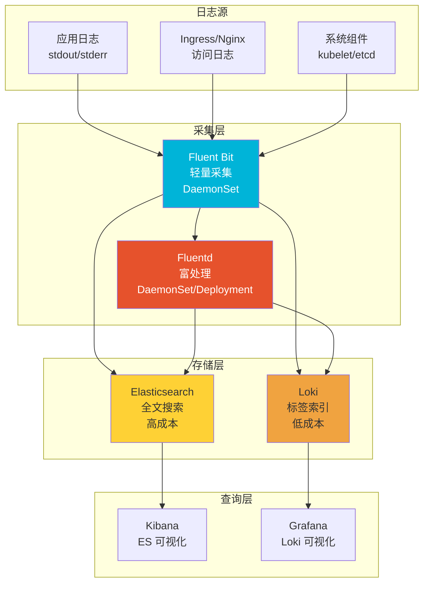
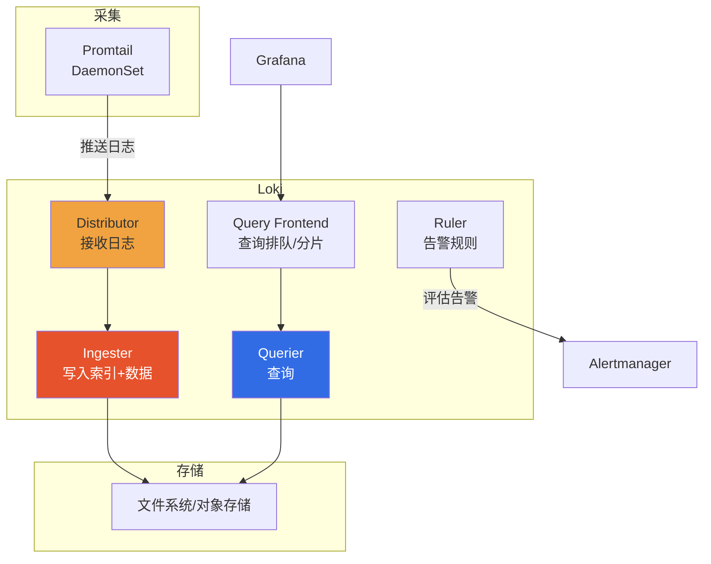
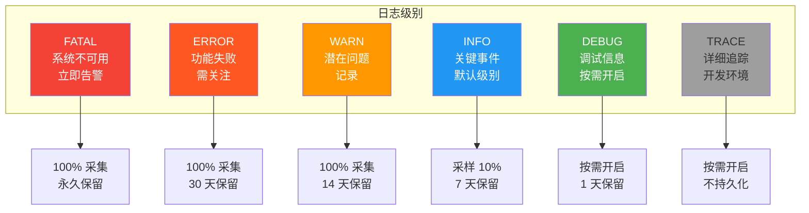
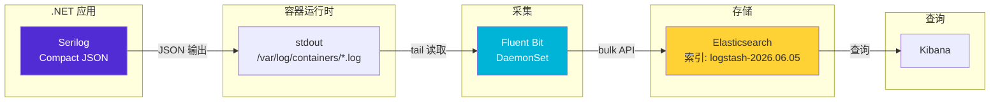
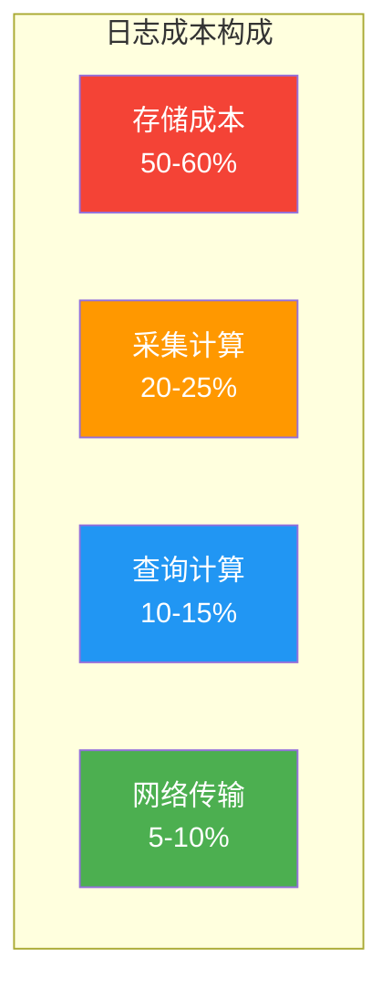
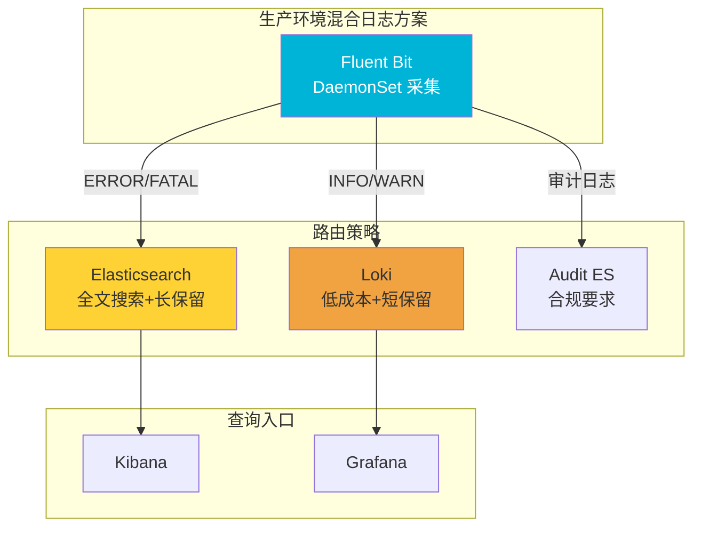

# 日志收集与分析

监控告诉你"系统出了问题"，日志告诉你"为什么出了问题"。在 Kubernetes 环境中，容器随时可能被重建、漂移，日志也随之消失，因此集中式日志收集是生产集群的刚需。本文从 K8s 日志体系架构出发，覆盖容器日志原理、Fluentd/Fluent Bit 采集、Elasticsearch 存储与索引、Kibana 查询、Loki 轻量方案、结构化日志、.NET Serilog 集成、日志成本优化等核心话题，帮你构建一套"采得到、存得下、查得出、用得起"的日志体系。

## 1. K8s 日志体系架构

### 1.1 日志采集架构全景



### 1.2 日志方案选型

| 方案 | 优势 | 劣势 | 适用场景 |
|------|------|------|----------|
| **EFK**（Elasticsearch+Fluentd+Kibana） | 全文搜索、生态成熟 | 资源消耗大、成本高 | 日志量大、需全文搜索 |
| **EPL**（Elasticsearch+Promtail+Loki） | Grafana 一体化、成本低 | 无全文搜索 | 已有 Grafana 栈 |
| **Fluent Bit → Fluentd → ES** | 采集轻量+处理灵活 | 架构复杂 | 大规模生产 |
| **Fluent Bit → Loki** | 极轻量、低成本 | 功能有限 | 中小规模 |

::: tip 方案选型建议
- **中小规模（<100 节点）**：Fluent Bit → Loki + Grafana，最省资源
- **大规模生产**：Fluent Bit（采集）→ Fluentd（处理）→ Elasticsearch（存储），成熟方案
- **需要全文搜索**：Elasticsearch 不可替代（如日志内容搜索、合规审计）
- **已有 Grafana 栈**：Loki 是自然选择，无缝集成
:::

## 2. 容器日志原理

### 2.1 容器日志流向

```mermaid
graph LR
    subgraph "容器内部"
        APP[应用进程] --> STDOUT[stdout]
        APP --> STDERR[stderr]
    end

    subgraph "容器运行时"
        STDOUT --> LOG_DRIVER[日志驱动<br/>json-file/journald]
        STDERR --> LOG_DRIVER
    end

    subgraph "宿主机"
        LOG_DRIVER --> HOST_FILE[/var/log/containers/<pod>_<namespace>_<container>-<id>.log]
        LOG_DRIVER --> HOST_FILE2[/var/log/pods/<namespace>_<pod>_<uid>/<container>/0.log]
    end

    subgraph "采集器"
        HOST_FILE --> FLUENT[Fluent Bit/Fluentd]
        HOST_FILE2 --> FLUENT
    end

    style APP fill:#326ce5,color:#fff
    style LOG_DRIVER fill:#ff9800,color:#fff
    style FLUENT fill:#00b4d8,color:#fff
```

### 2.2 日志驱动配置

```toml
# /etc/containerd/config.toml — 日志驱动配置

# containerd 使用 json-file 日志驱动（CRI 默认）
# 日志文件路径: /var/log/pods/<namespace>_<pod>_<uid>/<container>/<restart-count>.log
# 符号链接: /var/log/containers/<pod-name>_<namespace>_<container-name>-<container-id>.log

[plugins."io.containerd.grpc.v1.cri".container]
  # 日志最大大小（每个容器）
  log_max_size = "100Mi"
  # 日志最大文件数
  log_max_files = 5
```

### 2.3 Pod 日志配置

```yaml
# Pod 级别日志配置（Kubernetes 1.21+）
apiVersion: v1
kind: Pod
metadata:
  name: my-app
spec:
  containers:
    - name: app
      image: my-app:latest
      # 日志配置
      resources:
        limits:
          memory: "512Mi"
  # 容器日志轮转配置（需要 kubelet 支持）
  # 在 kubelet 配置中设置:
  # containerLogMaxSize: 100Mi
  # containerLogMaxFiles: 5
```

::: important 容器日志最佳实践
1. **应用日志写 stdout/stderr**：不要写文件，让容器运行时管理日志轮转
2. **结构化日志**：输出 JSON 格式，方便解析和查询
3. **日志级别**：生产默认 Info，关键路径 Debug，异常 Error
4. **不要写敏感信息**：密码、Token、PII 数据不应出现在日志中
5. **日志量控制**：避免循环日志、大对象序列化、高频调试日志
:::

## 3. Fluentd 部署与配置

### 3.1 Fluentd DaemonSet 部署

```yaml
# fluentd-daemonset.yaml
apiVersion: apps/v1
kind: DaemonSet
metadata:
  name: fluentd
  namespace: logging
  labels:
    k8s-app: fluentd
spec:
  selector:
    matchLabels:
      k8s-app: fluentd
  template:
    metadata:
      labels:
        k8s-app: fluentd
    spec:
      serviceAccountName: fluentd
      tolerations:
        - key: node-role.kubernetes.io/control-plane
          effect: NoSchedule
        - key: node-role.kubernetes.io/master
          effect: NoSchedule
      containers:
        - name: fluentd
          image: fluent/fluentd-kubernetes-daemonset:v1.16-debian-elasticsearch8-1
          env:
            - name: FLUENT_ELASTICSEARCH_HOST
              value: "elasticsearch.logging.svc.cluster.local"
            - name: FLUENT_ELASTICSEARCH_PORT
              value: "9200"
            - name: FLUENT_ELASTICSEARCH_SCHEME
              value: "https"
            - name: FLUENT_ELASTICSEARCH_SSL_VERIFY
              value: "false"
            - name: FLUENT_ELASTICSEARCH_USER
              value: "elastic"
            - name: FLUENT_ELASTICSEARCH_PASSWORD
              valueFrom:
                secretKeyRef:
                  name: elasticsearch-credentials
                  key: password
            - name: FLUENTD_SYSTEMD_CONF
              value: "disable"
          resources:
            limits:
              memory: 500Mi
              cpu: 500m
            requests:
              memory: 200Mi
              cpu: 100m
          volumeMounts:
            - name: varlog
              mountPath: /var/log
              readOnly: true
            - name: containers
              mountPath: /var/lib/docker/containers
              readOnly: true
            - name: config
              mountPath: /fluentd/etc/fluent.conf
              subPath: fluent.conf
      volumes:
        - name: varlog
          hostPath:
            path: /var/log
        - name: containers
          hostPath:
            path: /var/lib/docker/containers
        - name: config
          configMap:
            name: fluentd-config
```

### 3.2 Fluentd 配置详解

```yaml
# fluentd-configmap.yaml
apiVersion: v1
kind: ConfigMap
metadata:
  name: fluentd-config
  namespace: logging
data:
  fluent.conf: |
    # ========== 全局配置 ==========
    <system>
      workers 2
      log_level info
    </system>

    # ========== Kubernetes 元数据 ==========
    # 自动添加 Pod/Namespace/Container 标签
    <filter kubernetes.**>
      @type kubernetes_metadata
      @id filter_kube_metadata
      skip_labels false
      skip_container_metadata false
      skip_master_url true
    </filter>

    # ========== 容器日志采集 ==========
    <source>
      @type tail
      @id container_logs
      path /var/log/containers/*.log
      pos_file /var/log/fluentd-containers.log.pos
      tag kubernetes.*
      read_from_head false
      <parse>
        @type json
        time_key time
        time_format %Y-%m-%dT%H:%M:%S.%NZ
        keep_time_key true
      </parse>
    </source>

    # ========== K8s 系统日志 ==========
    <source>
      @type tail
      @id kubelet_logs
      path /var/log/kubelet.log
      pos_file /var/log/fluentd-kubelet.log.pos
      tag kubelet
      <parse>
        @type regexp
        expression /^(?<time>\d{4}-\d{2}-\d{2}T\d{2}:\d{2}:\d{2}\.\d+Z)\s+(?<level>\w+)\s+(?<message>.*)$/
        time_key time
        time_format %Y-%m-%dT%H:%M:%S.%NZ
      </parse>
    </source>

    # ========== 日志过滤 ==========
    # 排除健康检查日志
    <filter kubernetes.**>
      @type grep
      <exclude>
        key $.log
        pattern /healthcheck|readiness|liveness/i
      </exclude>
    </filter>

    # ========== 日志解析（多行日志合并） ==========
    <filter kubernetes.**>
      @type concat
      key log
      separator ""
      flush_interval 5s
      timeout_label @NORMAL
      stream_identity_key stream
      multiline_start_regexp /^\d{4}-\d{2}-\d{2}/
    </filter>

    # ========== 日志增强 ==========
    # 添加主机名
    <filter kubernetes.**>
      @type record_transformer
      <record>
        hostname "#{Socket.gethostname}"
        log_type kubernetes
      </record>
    </filter>

    # ========== 输出到 Elasticsearch ==========
    <match kubernetes.**>
      @type elasticsearch
      @id out_es
      @log_level info

      # 连接配置
      host elasticsearch.logging.svc.cluster.local
      port 9200
      scheme https
      ssl_verify false
      user elastic
      password "#{ENV['FLUENT_ELASTICSEARCH_PASSWORD']}"

      # 索引管理
      logstash_format true
      logstash_prefix logstash
      logstash_dateformat %Y.%m.%d
      include_tag_key true
      tag_key @log_name

      # 批量写入
      buffer_chunk_limit 2M
      buffer_total_limit 500M
      flush_interval 5s
      retry_max_interval 30s
      retry_forever true

      # 错误处理
      reconnect_on_error true
      reload_on_failure true
      reload_connections false
      request_timeout 30s
    </match>

    # ========== 输出到 Loki（可选） ==========
    <match kubernetes.**>
      @type loki
      @id out_loki
      url http://loki.logging.svc.cluster.local:3100
      extra_labels {"job": "fluentd", "environment": "production"}
      label_keys ["$.kubernetes.namespace_name", "$.kubernetes.pod_name"]
      <label>
        namespace $.kubernetes.namespace_name
        pod $.kubernetes.pod_name
        container $.kubernetes.container_name
      </label>
      <buffer>
        flush_interval 5s
        chunk_limit_size 1M
      </buffer>
    </match>
```

### 3.3 Fluentd 多路输出

```yaml
# fluentd-multi-output.yaml — 按命名空间路由日志
data:
  fluent.conf: |
    # ... 上面的 source 和 filter 配置 ...

    # 生产环境日志 → Elasticsearch（全量 + 长保留）
    <match kubernetes.production.**>
      @type elasticsearch
      host elasticsearch.logging.svc.cluster.local
      logstash_format true
      logstash_prefix prod-logs
      <buffer>
        flush_interval 5s
      </buffer>
    </match>

    # 开发环境日志 → Elasticsearch（短保留）
    <match kubernetes.development.**>
      @type elasticsearch
      host elasticsearch.logging.svc.cluster.local
      logstash_format true
      logstash_prefix dev-logs
      <buffer>
        flush_interval 30s
      </buffer>
    </match>

    # 默认日志 → Loki（低成本）
    <match kubernetes.**>
      @type loki
      url http://loki.logging.svc.cluster.local:3100
    </match>
```

## 4. Fluent Bit 轻量替代

### 4.1 Fluent Bit vs Fluentd

| 维度 | Fluentd | Fluent Bit |
|------|---------|-----------|
| **语言** | Ruby + C | C |
| **内存** | 200-500 MB | 10-30 MB |
| **CPU** | 中 | 低 |
| **插件数** | 500+ | 80+ |
| **处理能力** | 复杂转换 | 轻量过滤 |
| **部署模式** | DaemonSet/Deployment | DaemonSet |
| **适用角色** | 日志处理/聚合 | 日志采集/路由 |

::: tip 架构组合
- **小规模**：Fluent Bit 单独使用（采集 → ES/Loki）
- **大规模**：Fluent Bit（采集）+ Fluentd（处理/聚合），Fluent Bit 部署在每个节点，Fluentd 集中部署做富处理
:::

### 4.2 Fluent Bit DaemonSet 部署

```yaml
# fluent-bit-daemonset.yaml
apiVersion: apps/v1
kind: DaemonSet
metadata:
  name: fluent-bit
  namespace: logging
  labels:
    k8s-app: fluent-bit
spec:
  selector:
    matchLabels:
      k8s-app: fluent-bit
  template:
    metadata:
      labels:
        k8s-app: fluent-bit
      annotations:
        prometheus.io/scrape: "true"
        prometheus.io/port: "2020"
    spec:
      serviceAccountName: fluent-bit
      tolerations:
        - key: node-role.kubernetes.io/control-plane
          effect: NoSchedule
      containers:
        - name: fluent-bit
          image: cr.fluentbit.io/fluent/fluent-bit:3.0.7
          imagePullPolicy: IfNotPresent
          ports:
            - containerPort: 2020
              name: metrics
              protocol: TCP
          resources:
            limits:
              memory: 100Mi
              cpu: 200m
            requests:
              memory: 30Mi
              cpu: 50m
          volumeMounts:
            - name: varlog
              mountPath: /var/log
              readOnly: true
            - name: containers
              mountPath: /var/lib/docker/containers
              readOnly: true
            - name: config
              mountPath: /fluent-bit/etc/
      volumes:
        - name: varlog
          hostPath:
            path: /var/log
        - name: containers
          hostPath:
            path: /var/lib/docker/containers
        - name: config
          configMap:
            name: fluent-bit-config
```

### 4.3 Fluent Bit 配置

```yaml
# fluent-bit-configmap.yaml
apiVersion: v1
kind: ConfigMap
metadata:
  name: fluent-bit-config
  namespace: logging
data:
  fluent-bit.conf: |
    [SERVICE]
        Daemon          Off
        Flush           5
        Log_Level       info
        Parsers_File    parsers.conf
        HTTP_Server     On
        HTTP_Listen     0.0.0.0
        HTTP_Port       2020
        storage.path    /var/log/flb-storage
        storage.sync    normal

    @INCLUDE input-kubernetes.conf
    @INCLUDE filter-kubernetes.conf
    @INCLUDE output-elasticsearch.conf

  input-kubernetes.conf: |
    [INPUT]
        Name              tail
        Tag               kube.*
        Path              /var/log/containers/*.log
        Parser            docker
        DB                /var/log/flb_kube.db
        Mem_Buf_Limit     5MB
        Skip_Long_Lines   On
        Refresh_Interval  10
        Rotate_Wait       30
        storage.type      filesystem

  filter-kubernetes.conf: |
    [FILTER]
        Name                kubernetes
        Match               kube.*
        Kube_URL            https://kubernetes.default.svc:443
        Kube_CA_File        /var/run/secrets/kubernetes.io/serviceaccount/ca.crt
        Kube_Token_File    /var/run/secrets/kubernetes.io/serviceaccount/token
        Kube_Tag_Prefix     kube.var.log.containers.
        Merge_Log           On
        Merge_Log_Key       log_processed
        K8s-Logging.Parser  On
        K8s-Logging.Exclude On

    # 过滤健康检查日志
    [FILTER]
        Name    grep
        Match   kube.*
        Exclude log =~ /healthcheck|readiness|liveness/i

  output-elasticsearch.conf: |
    [OUTPUT]
        Name            es
        Match           kube.*
        Host            elasticsearch.logging.svc.cluster.local
        Port            9200
        TLS             On
        TLS.Verify      Off
        HTTP_User       elastic
        HTTP_Passwd     ${ES_PASSWORD}
        Index           logstash
        Logstash_Format On
        Logstash_Prefix logstash
        Logstash_DateFormat %Y.%m.%d
        Replace_Dots    On
        Retry_Limit     False
        Trace_Error     On
        Trace_Output    Off

  parsers.conf: |
    [PARSER]
        Name   json
        Format json
        Time_Key time
        Time_Format %Y-%m-%dT%H:%M:%S.%L

    [PARSER]
        Name   docker
        Format json
        Time_Key time
        Time_Format %Y-%m-%dT%H:%M:%S.%LZ

    [PARSER]
        Name        syslog
        Format      regex
        Regex       ^(?<time>\d{4}-\d{2}-\d{2}T\d{2}:\d{2}:\d{2}\.\d+Z)\s+(?<level>\w+)\s+(?<message>.*)$
        Time_Key    time
        Time_Format %Y-%m-%dT%H:%M:%S.%LZ
```

### 4.4 Fluent Bit 输出到 Loki

```yaml
# fluent-bit-loki-output.yaml — 替换 output-elasticsearch.conf
data:
  output-loki.conf: |
    [OUTPUT]
        Name        loki
        Match       kube.*
        Host        loki.logging.svc.cluster.local
        Port        3100
        Labels      job=fluent-bit, environment=production
        Label_Keys  $kubernetes['namespace_name'],$kubernetes['pod_name']
        Auto_Kubernetes_Labels On
        Remove_Keys $stream,$logtag
```

## 5. Elasticsearch 集群部署与索引管理

### 5.1 Elasticsearch 集群部署

```yaml
# elasticsearch-statefulset.yaml
apiVersion: apps/v1
kind: StatefulSet
metadata:
  name: elasticsearch
  namespace: logging
spec:
  serviceName: elasticsearch
  replicas: 3
  selector:
    matchLabels:
      app: elasticsearch
  template:
    metadata:
      labels:
        app: elasticsearch
    spec:
      initContainers:
        # 调整系统参数
        - name: sysctl
          image: busybox
          command: ['sysctl', '-w', 'vm.max_map_count=262144']
          securityContext:
            privileged: true
      containers:
        - name: elasticsearch
          image: docker.elastic.co/elasticsearch/elasticsearch:8.13.0
          ports:
            - containerPort: 9200
              name: http
            - containerPort: 9300
              name: transport
          env:
            - name: cluster.name
              value: k8s-logs
            - name: node.name
              valueFrom:
                fieldRef:
                  fieldPath: metadata.name
            - name: discovery.seed_hosts
              value: "elasticsearch-0.elasticsearch,elasticsearch-1.elasticsearch,elasticsearch-2.elasticsearch"
            - name: cluster.initial_master_nodes
              value: "elasticsearch-0,elasticsearch-1,elasticsearch-2"
            - name: ES_JAVA_OPTS
              value: "-Xms4g -Xmx4g"
            - name: xpack.security.enabled
              value: "true"
            - name: xpack.security.http.ssl.enabled
              value: "false"
            - name: ELASTIC_PASSWORD
              valueFrom:
                secretKeyRef:
                  name: elasticsearch-credentials
                  key: password
          resources:
            limits:
              memory: 8Gi
              cpu: "2"
            requests:
              memory: 4Gi
              cpu: "1"
          volumeMounts:
            - name: data
              mountPath: /usr/share/elasticsearch/data
            - name: config
              mountPath: /usr/share/elasticsearch/config/elasticsearch.yml
              subPath: elasticsearch.yml
      volumes:
        - name: config
          configMap:
            name: elasticsearch-config
  volumeClaimTemplates:
    - metadata:
        name: data
      spec:
        accessModes: ["ReadWriteOnce"]
        storageClassName: local-storage
        resources:
          requests:
            storage: 100Gi
```

```yaml
# elasticsearch-configmap.yaml
apiVersion: v1
kind: ConfigMap
metadata:
  name: elasticsearch-config
  namespace: logging
data:
  elasticsearch.yml: |
    cluster:
      name: k8s-logs
    network:
      host: 0.0.0.0
    path:
      data: /usr/share/elasticsearch/data
      logs: /usr/share/elasticsearch/logs
    discovery:
      seed_hosts: elasticsearch-0.elasticsearch,elasticsearch-1.elasticsearch,elasticsearch-2.elasticsearch
    cluster:
      initial_master_nodes: elasticsearch-0,elasticsearch-1,elasticsearch-2
    xpack:
      security:
        enabled: true
        http:
          ssl:
            enabled: false
      monitoring:
        collection:
          enabled: true

    # 索引生命周期管理
    action:
      auto_create_index: true
```

### 5.2 索引生命周期管理（ILM）

```bash
# 创建 ILM 策略
curl -X PUT "http://elasticsearch:9200/_ilm/policy/logs-policy" \
  -H 'Content-Type: application/json' \
  -u elastic:${ES_PASSWORD} \
  -d '{
    "policy": {
      "phases": {
        "hot": {
          "min_age": "0ms",
          "actions": {
            "rollover": {
              "max_size": "50gb",
              "max_age": "1d"
            },
            "set_priority": {
              "priority": 100
            }
          }
        },
        "warm": {
          "min_age": "7d",
          "actions": {
            "forcemerge": {
              "max_num_segments": 1
            },
            "shrink": {
              "number_of_shards": 1
            },
            "allocate": {
              "require": {
                "data": "warm"
              }
            },
            "set_priority": {
              "priority": 50
            }
          }
        },
        "cold": {
          "min_age": "30d",
          "actions": {
            "freeze": {},
            "allocate": {
              "require": {
                "data": "cold"
              }
            },
            "set_priority": {
              "priority": 0
            }
          }
        },
        "delete": {
          "min_age": "90d",
          "actions": {
            "delete": {}
          }
        }
      }
    }
  }'
```

### 5.3 索引模板

```bash
# 创建索引模板（自动应用于新索引）
curl -X PUT "http://elasticsearch:9200/_index_template/logs-template" \
  -H 'Content-Type: application/json' \
  -u elastic:${ES_PASSWORD} \
  -d '{
    "index_patterns": ["logstash-*"],
    "template": {
      "settings": {
        "number_of_shards": 3,
        "number_of_replicas": 1,
        "index.lifecycle.name": "logs-policy",
        "index.lifecycle.rollover_alias": "logs",
        "index.mapping.total_fields.limit": 5000,
        "analysis": {
          "analyzer": {
            "default": {
              "type": "standard"
            }
          }
        }
      },
      "mappings": {
        "dynamic_templates": [
          {
            "strings": {
              "match_mapping_type": "string",
              "mapping": {
                "type": "keyword",
                "ignore_above": 256
              }
            }
          }
        ]
      }
    }
  }'
```

### 5.4 索引日常管理

```bash
# 查看索引列表
curl -u elastic:${ES_PASSWORD} "http://elasticsearch:9200/_cat/indices?v&h=index,health,status,pri,rep,docs.count,store.size,creation.date.string"

# 查看集群健康
curl -u elastic:${ES_PASSWORD} "http://elasticsearch:9200/_cluster/health?pretty"

# 查看节点资源
curl -u elastic:${ES_PASSWORD} "http://elasticsearch:9200/_cat/nodes?v&h=name,heap.percent,ram.percent,cpu,load_1m,disk.used_percent"

# 手动删除旧索引
curl -X DELETE -u elastic:${ES_PASSWORD} "http://elasticsearch:9200/logstash-2026.03.*"

# 强制合并段（减少段数，提升查询性能）
curl -X POST -u elastic:${ES_PASSWORD} "http://elasticsearch:9200/logstash-2026.06.01/_forcemerge?max_num_segments=1"

# 查看索引映射
curl -u elastic:${ES_PASSWORD} "http://elasticsearch:9200/logstash-2026.06.01/_mapping?pretty"
```

## 6. Kibana 查询与 Dashboard

### 6.1 Kibana 部署

```yaml
# kibana-deployment.yaml
apiVersion: apps/v1
kind: Deployment
metadata:
  name: kibana
  namespace: logging
spec:
  replicas: 1
  selector:
    matchLabels:
      app: kibana
  template:
    metadata:
      labels:
        app: kibana
    spec:
      containers:
        - name: kibana
          image: docker.elastic.co/kibana/kibana:8.13.0
          ports:
            - containerPort: 5601
          env:
            - name: ELASTICSEARCH_HOSTS
              value: '["http://elasticsearch:9200"]'
            - name: ELASTICSEARCH_USERNAME
              value: "kibana_system"
            - name: ELASTICSEARCH_PASSWORD
              valueFrom:
                secretKeyRef:
                  name: elasticsearch-credentials
                  key: kibana-password
          resources:
            limits:
              memory: 1Gi
              cpu: "1"
            requests:
              memory: 512Mi
              cpu: 200m
```

### 6.2 Kibana KQL 查询语法

```
# 基础查询
level: "ERROR"

# 多条件组合
level: "ERROR" and kubernetes.namespace_name: "production"

# 通配符
message: *timeout*

# 范围查询
@timestamp >= "2026-06-01T00:00:00" and @timestamp <= "2026-06-05T00:00:00"

# 排除
not kubernetes.container_name: "istio-proxy"

# 嵌套字段
kubernetes.pod_name: "my-app-*"

# OR 查询
level: ("ERROR" or "FATAL")

# 复合查询
kubernetes.namespace_name: "production" and level: "ERROR" and message: *database*
```

### 6.3 常用 Dashboard

```json
// Kibana Saved Search — 错误日志
{
  "title": "生产环境错误日志",
  "description": "生产环境 ERROR/FATAL 级别日志",
  "kibanaSavedObjectMeta": {
    "searchSourceJSON": {
      "index": "logstash-*",
      "filter": [
        {
          "query": {
            "match": {
              "kubernetes.namespace_name": "production"
            }
          }
        }
      ],
      "query": {
        "language": "kuery",
        "query": "level:(\"ERROR\" or \"FATAL\")"
      }
    }
  }
}
```

## 7. Loki + Promtail 轻量方案

### 7.1 Loki 架构



### 7.2 Loki 部署

```bash
# 使用 Helm 部署 Loki Stack
helm repo add grafana https://grafana.github.io/helm-charts
helm repo update

helm install loki grafana/loki-stack \
  --namespace logging \
  --create-namespace \
  --set loki.persistence.enabled=true \
  --set loki.persistence.size=50Gi \
  --set loki.config.table_manager.retention_deletes_enabled=true \
  --set loki.config.table_manager.retention_period=30d \
  --set promtail.enabled=true \
  --set grafana.enabled=false
```

### 7.3 Promtail 配置

```yaml
# promtail-configmap.yaml
apiVersion: v1
kind: ConfigMap
metadata:
  name: promtail
  namespace: logging
data:
  promtail.yaml: |
    server:
      http_listen_port: 3101
      grpc_listen_port: 0

    positions:
      filename: /run/promtail/positions.yaml

    clients:
      - url: http://loki.logging.svc.cluster.local:3100/loki/api/v1/push
        tenant_id: k8s-logs

    scrape_configs:
      # K8s 容器日志
      - job_name: kubernetes-pods
        kubernetes_sd_configs:
          - role: pod
        pipeline_stages:
          # 解析 JSON 日志
          - json:
              expressions:
                level: level
                message: message
                timestamp: timestamp
          # 设置日志级别标签
          - labels:
              level:
          # 设置时间戳
          - timestamp:
              source: timestamp
              format: RFC3339
        relabel_configs:
          # 只采集有 prometheus.io/scrape 注解的 Pod
          - source_labels: [__meta_kubernetes_pod_annotation_prometheus_io_scrape]
            action: keep
            regex: true
          - source_labels: [__meta_kubernetes_namespace]
            target_label: namespace
          - source_labels: [__meta_kubernetes_pod_name]
            target_label: pod
          - source_labels: [__meta_kubernetes_pod_container_name]
            target_label: container
```

### 7.4 LogQL 查询语法

```logql
# 基础查询：选择日志流
{namespace="production", app="my-app"}

# 过滤日志内容
{namespace="production"} |= "error"

# 排除日志
{namespace="production"} != "healthcheck"

# 正则匹配
{namespace="production"} |~ "timeout|connection refused"

# JSON 解析
{namespace="production"} | json | level="ERROR"

# 统计查询：5 分钟内错误日志数
sum(count_over_time({namespace="production"} |= "error" [5m]))

# 按标签分组统计
sum by (pod) (count_over_time({namespace="production"} |= "error" [5m]))

# 速率查询
sum(rate({namespace="production"} |= "error" [5m])) by (pod)

# 延迟提取
{namespace="production"} | json | unwrap duration_seconds
  | __error__="" | quantile_over_time(0.99, duration_seconds[5m])
```

### 7.5 Loki vs Elasticsearch 对比

| 维度 | Loki | Elasticsearch |
|------|------|---------------|
| **索引方式** | 标签索引（不索引日志内容） | 全文索引 |
| **存储成本** | 低（仅为标签索引） | 高（全文索引大） |
| **查询语法** | LogQL | KQL/Lucene |
| **全文搜索** | 不支持（需遍历） | 原生支持 |
| **资源占用** | 低 | 高 |
| **适合场景** | 标签查询/指标提取 | 日志内容搜索/合规审计 |
| **部署复杂度** | 低 | 高 |
| **推荐搭配** | Grafana | Kibana |

## 8. 日志标签与结构化

### 8.1 结构化日志格式

```json
// 推荐的 JSON 日志格式
{
  "timestamp": "2026-06-05T10:30:45.123Z",
  "level": "ERROR",
  "message": "Database connection failed",
  "service": "order-service",
  "version": "1.2.3",
  "trace_id": "abc123def456",
  "span_id": "789ghi012",
  "user_id": "user-001",
  "request_path": "/api/orders",
  "request_method": "GET",
  "status_code": 500,
  "duration_ms": 1234,
  "error_type": "TimeoutException",
  "stack_trace": "System.TimeoutException: ..."
}
```

### 8.2 标准日志字段规范

| 字段 | 类型 | 说明 | 示例 |
|------|------|------|------|
| `timestamp` | string | ISO8601 时间戳 | `2026-06-05T10:30:45.123Z` |
| `level` | string | 日志级别 | `DEBUG/INFO/WARN/ERROR/FATAL` |
| `message` | string | 日志消息 | `Database connection failed` |
| `service` | string | 服务名 | `order-service` |
| `version` | string | 版本号 | `1.2.3` |
| `trace_id` | string | 追踪 ID | `abc123def456` |
| `span_id` | string | Span ID | `789ghi012` |
| `error_type` | string | 错误类型 | `TimeoutException` |
| `duration_ms` | number | 耗时(ms) | `1234` |
| `status_code` | number | HTTP 状态码 | `500` |

### 8.3 Kubernetes 标签规范

```yaml
# Pod 标注用于日志采集
apiVersion: v1
kind: Pod
metadata:
  name: my-app
  labels:
    app: my-app
    env: production
    team: backend
  annotations:
    # Fluentd/Fluent Bit 自动解析
    fluentbit.io/parser: json
    # 排除日志
    fluentbit.io/exclude: "false"
    # 采样率
    logging.sample.rate: "1.0"
spec:
  containers:
    - name: app
      image: my-app:latest
```

## 9. 日志级别与采样

### 9.1 日志级别策略



### 9.2 日志采样配置

```yaml
# Fluentd 采样过滤
<filter kubernetes.**>
  @type sampler
  # INFO 级别采样 10%
  sample_rate 10
  <record>
    # 添加采样标记
    _sampled true
  </record>
  # 仅对 INFO 级别采样
  <condition>
    key level
    value INFO
  </condition>
</filter>

# ERROR 及以上全量保留
<filter kubernetes.**>
  @type grep
  <or>
    <regexp>
      key level
      pattern /^(ERROR|FATAL|WARN)$/
    </regexp>
  </or>
</filter>
```

### 9.3 Fluent Bit 采样

```ini
# Fluent Bit 采样配置
[FILTER]
    Name    throttle
    Match   kube.*
    Rate    100
    Window  5
    Print_Status  On
```

## 10. 应用日志最佳实践

### 10.1 .NET Serilog 配置

```csharp
// Program.cs — Serilog 配置
using Serilog;
using Serilog.Formatting.Compact;

var builder = WebApplication.CreateBuilder(args);

// 配置 Serilog
Log.Logger = new LoggerConfiguration()
    .MinimumLevel.Information()
    .MinimumLevel.Override("Microsoft", LogEventLevel.Warning)
    .MinimumLevel.Override("System", LogEventLevel.Warning)
    .MinimumLevel.Override("Microsoft.Hosting.Lifetime", LogEventLevel.Information)
    .Enrich.FromLogContext()
    .Enrich.WithMachineName()
    .Enrich.WithEnvironmentName()
    .Enrich.WithProperty("Service", "order-service")
    .Enrich.WithProperty("Version", "1.2.3")

    // 输出到控制台（stdout → 被容器运行时捕获 → Fluentd 采集）
    .WriteTo.Console(new CompactJsonFormatter())

    // 开发环境输出到文件
    .WriteTo.File(
        new CompactJsonFormatter(),
        "/var/log/app/app-.log",
        rollingInterval: RollingInterval.Day,
        retainedFileCountLimit: 7)

    .CreateLogger();

builder.Host.UseSerilog();

var app = builder.Build();

// 请求日志中间件
app.UseSerilogRequestLogging(options =>
{
    options.MessageTemplate = "HTTP {RequestMethod} {RequestPath} responded {StatusCode} in {Elapsed:0.000} ms";
    options.EnrichDiagnosticContext = (diagnosticContext, httpContext) =>
    {
        diagnosticContext.Set("RequestHost", httpContext.Request.Host.Value);
        diagnosticContext.Set("RequestScheme", httpContext.Request.Scheme);
        diagnosticContext.Set("UserId", httpContext.User?.FindFirst("sub")?.Value ?? "anonymous");
    };
});

try
{
    Log.Information("Starting order-service v1.2.3");
    app.Run();
}
catch (Exception ex)
{
    Log.Fatal(ex, "Application terminated unexpectedly");
}
finally
{
    Log.CloseAndFlush();
}
```

### 10.2 结构化日志输出

```csharp
// 使用 Serilog 结构化日志
public class OrderService
{
    private readonly ILogger<OrderService> _logger;

    public OrderService(ILogger<OrderService> logger)
    {
        _logger = logger;
    }

    public async Task<Order> CreateOrderAsync(CreateOrderRequest request)
    {
        // 结构化日志：使用命名参数而非字符串插值
        _logger.LogInformation("Creating order for user {UserId}, amount: {Amount:C}",
            request.UserId, request.Amount);

        try
        {
            var order = await _orderRepository.CreateAsync(request);

            // 成功日志
            _logger.LogInformation("Order created successfully: {OrderId}, Total: {Total:C}",
                order.Id, order.Total);

            return order;
        }
        catch (TimeoutException ex)
        {
            // 错误日志：包含异常对象
            _logger.LogError(ex, "Database timeout while creating order for user {UserId}",
                request.UserId);
            throw;
        }
        catch (Exception ex)
        {
            _logger.LogError(ex, "Unexpected error creating order for user {UserId}",
                request.UserId);
            throw;
        }
    }
}
```

输出示例（Compact JSON）：

```json
{
  "@t": "2026-06-05T10:30:45.1234567Z",
  "@mt": "Creating order for user {UserId}, amount: {Amount:C}",
  "@m": "Creating order for user user-001, amount: ¥99.90",
  "@i": "a1b2c3d4",
  "UserId": "user-001",
  "Amount": 99.90,
  "SourceContext": "OrderService",
  "MachineName": "worker-01",
  "EnvironmentName": "Production",
  "Service": "order-service",
  "Version": "1.2.3"
}
```

### 10.3 Serilog→Fluentd→ES 完整链路



### 10.4 Serilog Enricher 自定义

```csharp
// TraceIdEnricher.cs — 自动注入追踪 ID
public class TraceIdEnricher : ILogEventEnricher
{
    public void Enrich(LogEvent logEvent, ILogEventPropertyFactory propertyFactory)
    {
        // 从 Activity 获取 OpenTelemetry Trace ID
        var activity = System.Diagnostics.Activity.Current;
        if (activity != null)
        {
            logEvent.AddPropertyIfAbsent(
                propertyFactory.CreateProperty("TraceId", activity.TraceId.ToString()));
            logEvent.AddPropertyIfAbsent(
                propertyFactory.CreateProperty("SpanId", activity.SpanId.ToString()));
        }
    }
}

// 注册
Log.Logger = new LoggerConfiguration()
    .Enrich.With<TraceIdEnricher>()
    // ...
    .CreateLogger();
```

## 11. 日志查询排障场景

### 11.1 场景一：应用 5xx 错误排查

```bash
# Elasticsearch 查询
# 1. 查看最近的 5xx 错误
curl -u elastic:${ES_PASSWORD} -X GET "http://elasticsearch:9200/logstash-*/_search" -H 'Content-Type: application/json' -d '{
  "query": {
    "bool": {
      "must": [
        {"match": {"kubernetes.namespace_name": "production"}},
        {"match": {"level": "ERROR"}},
        {"range": {"@timestamp": {"gte": "now-1h"}}}
      ]
    }
  },
  "sort": [{"@timestamp": "desc"}],
  "size": 50
}'

# Kibana KQL
# kubernetes.namespace_name: "production" and level: "ERROR" and @timestamp >= now-1h
```

```logql
# Loki LogQL
{namespace="production"} | json | level="ERROR"
  | log_format="json"
  | status_code >= 500
  | sort by timestamp desc
```

### 11.2 场景二：追踪请求链路

```bash
# 通过 Trace ID 追踪完整请求链路
# Elasticsearch
curl -u elastic:${ES_PASSWORD} -X GET "http://elasticsearch:9200/logstash-*/_search" -H 'Content-Type: application/json' -d '{
  "query": {
    "match": {
      "TraceId": "abc123def456"
    }
  },
  "sort": [{"@timestamp": "asc"}],
  "size": 100
}'

# Kibana KQL
# TraceId: "abc123def456"
```

```logql
# Loki LogQL
{namespace=~"production|staging"} |= "abc123def456"
```

### 11.3 场景三：OOM 事件关联分析

```bash
# 1. 找到 OOMKilled Pod
kubectl get events --field-selector reason=OOMKilling -A

# 2. 查看 Pod 日志（最后一次）
kubectl logs <pod-name> --previous

# 3. 在 ES 中搜索 OOM 相关日志
# Kibana KQL:
# kubernetes.pod_name: "<pod-name>" and (message: *OutOfMemory* or message: *OOM*)

# 4. 分析内存趋势
# 查询 Prometheus 指标
# container_memory_working_set_bytes{pod="<pod-name>"}
```

### 11.4 场景四：慢查询分析

```logql
# Loki 查询慢请求
{namespace="production"} | json | unwrap duration_ms
  | duration_ms > 5000
  | line_format "{{.request_path}} {{.duration_ms}}ms"

# 统计 P99 延迟趋势
quantile_over_time(0.99,
  {namespace="production"} | json | unwrap duration_ms [5m]
)
```

## 12. 日志成本优化

### 12.1 成本构成



### 12.2 成本优化策略

| 策略 | 节省比例 | 实施方式 |
|------|----------|----------|
| **日志分级保留** | 30-50% | ERROR 永久，WARN 30天，INFO 7天 |
| **日志采样** | 40-70% | INFO 采样 10%，DEBUG 按需 |
| **排除无用日志** | 20-30% | 健康检查、访问日志过滤 |
| **索引优化** | 20-40% | 减少分片、冷热分离 |
| **Loki 替代 ES** | 60-80% | 不需要全文搜索的场景 |
| **日志压缩** | 30-50% | ILM force merge + 冷存储 |

### 12.3 Fluentd 日志过滤优化

```yaml
# fluentd-filter-optimization.yaml — 过滤无用日志
data:
  fluent.conf: |
    # ========== 排除健康检查日志 ==========
    <filter kubernetes.**>
      @type grep
      <exclude>
        key $.kubernetes.container_name
        pattern /^istio-proxy$/
      </exclude>
    </filter>

    <filter kubernetes.**>
      @type grep
      <exclude>
        key $.log
        pattern /GET \/healthz|GET \/readiness|GET \/alive/
      </exclude>
    </filter>

    # ========== 排除调试日志 ==========
    <filter kubernetes.development.**>
      @type grep
      <exclude>
        key $.level
        pattern /^DEBUG$/
      </exclude>
    </filter>

    # ========== 敏感信息脱敏 ==========
    <filter kubernetes.**>
      @type record_transformer
      enable_ruby true
      <record>
        log ${record["log"]&.gsub(/password=\S+/, 'password=***')&.gsub(/token=\S+/, 'token=***')&.gsub(/api_key=\S+/, 'api_key=***')}
      </record>
    </filter>

    # ========== 日志字段裁剪 ==========
    <filter kubernetes.**>
      @type record_transformer
      remove_keys kubernetes.docker_id,kubernetes.container_hash,kubernetes.master_url
    </filter>
```

### 12.4 Elasticsearch 存储优化

```bash
# 冷热分离架构
# Hot 节点：SSD，7 天内数据
# Warm 节点：HDD，7-30 天数据
# Cold 节点：廉价存储，30+ 天数据

# 查看节点属性
curl -u elastic:${ES_PASSWORD} "http://elasticsearch:9200/_cat/nodeattrs?v"

# ILM 自动迁移
# 已在上文 ILM 配置中定义

# 手动迁移索引到 warm
curl -X POST -u elastic:${ES_PASSWORD} \
  "http://elasticsearch:9200/logstash-2026.05.*/_migrate" \
  -H 'Content-Type: application/json' -d '{
    "settings": {
      "index.routing.allocation.require.data": "warm"
    }
  }'
```

## 13. EFK vs EPL 对比

### 13.1 方案全对比

| 维度 | EFK | EFL | PLG |
|------|-----|-----|-----|
| **采集** | Fluentd | Fluent Bit | Promtail |
| **存储** | Elasticsearch | Elasticsearch | Loki |
| **查询** | Kibana | Kibana | Grafana |
| **全文搜索** | 支持 | 支持 | 不支持 |
| **存储成本** | 高 | 高 | 低 |
| **资源占用** | 高 | 中 | 低 |
| **部署复杂度** | 高 | 中 | 低 |
| **学习曲线** | 陡 | 中 | 平缓 |
| **适合规模** | 大 | 大 | 中小 |
| **可视化** | 强 | 强 | Grafana 原生 |

### 13.2 混合方案



::: tip 推荐方案
- **首次搭建**：Fluent Bit → Loki → Grafana，成本最低、最快上手
- **需要全文搜索**：在 Loki 基础上增加 ES，错误和审计日志走 ES
- **大规模生产**：Fluent Bit（采集）+ Fluentd（处理）+ ES（存储）+ Kibana（查询）
- **合规要求**：审计日志单独 ES 集群，不可删除，长期保留
:::

## 14. 日志运维日常检查

### 14.1 每日检查

| 检查项 | 命令 | 期望结果 |
|--------|------|----------|
| 采集器状态 | `kubectl get pods -n logging` | 全部 Running |
| ES 集群健康 | `curl ES/_cluster/health` | green/yellow |
| ES 磁盘水位 | `curl ES/_cat/allocation?v` | <85% |
| 日志延迟 | 检查最新日志时间 | <5 分钟延迟 |
| 采集错误 | `kubectl logs fluent-bit -n logging` | 无严重错误 |

### 14.2 每周检查

| 检查项 | 命令 | 期望结果 |
|--------|------|----------|
| ILM 执行 | `curl ES/_ilm/explain` | 正常滚动 |
| 索引大小 | `curl ES/_cat/indices?v&s=store.size:desc` | 无异常大索引 |
| 日志量趋势 | Kibana/Grafana Dashboard | 无突增 |
| 磁盘空间 | `df -h /data` | >30% 可用 |

### 14.3 每月检查

| 检查项 | 命令 | 期望结果 |
|--------|------|----------|
| 成本审计 | 对比月度存储增长 | 在预算内 |
| 保留策略 | 检查 ILM 策略 | 符合合规要求 |
| 采样率调整 | 检查 INFO 日志采样 | 合理 |
| 灾备测试 | 恢复 ES 快照 | 恢复成功 |

## 15. 参考资源

- [Kubernetes 官方文档 - 日志架构](https://kubernetes.io/docs/concepts/cluster-administration/logging/)
- [Fluentd 官方文档](https://docs.fluentd.org/)
- [Fluent Bit 官方文档](https://docs.fluentbit.io/manual/)
- [Elasticsearch 官方文档](https://www.elastic.co/guide/en/elasticsearch/reference/current/index.html)
- [Kibana 查询语法](https://www.elastic.co/guide/en/kibana/current/kuery-query.html)
- [Loki 官方文档](https://grafana.com/docs/loki/latest/)
- [LogQL 查询语法](https://grafana.com/docs/loki/latest/query/)
- [Promtail 配置](https://grafana.com/docs/loki/latest/send-data/promtail/)
- [Serilog 官方文档](https://serilog.net/)
- [prometheus-net](https://github.com/prometheus-net/prometheus-net)
- [Elasticsearch ILM](https://www.elastic.co/guide/en/elasticsearch/reference/current/index-lifecycle-management.html)
