# 故障排查与应急

凌晨三点收到告警，Pod 全部 CrashLoopBackOff，节点 NotReady，服务不可用——这就是 Kubernetes 运维的日常。排查故障不是"试运气"，而是有一套系统的方法论：从现象到原因，从控制面到数据面，从日志到指标，逐步缩小范围。本文覆盖 K8s 常见故障模式、排查方法论、Pod/Node/网络/存储/控制面各层故障的定位与修复、etcd 灾难恢复、应急响应 SOP，以及事后复盘模板，帮你构建一套"排障有章、应急有序、复盘有果"的运维体系。

---

## 1. 故障排查方法论

### 1.1 故障排查层次模型

```mermaid
graph TB
    A["用户报错<br/>服务不可用"] --> B{"入口层故障？"}
    B -->|是| C["Ingress / Service"]
    B -->|否| D{"应用层故障？"}
    D -->|是| E["Pod 状态异常"]
    D -->|否| F{"基础设施层故障？"}
    F -->|是| G["Node / 网络 / 存储"}
    F -->|否| H{"控制面故障？"}
    H -->|是| I["API Server / etcd / Scheduler"]
    H -->|否| J["外部依赖<br/>DNS / 云 API / 数据库"]

    style A fill:#ffcdd2,stroke:#f44336
    style C fill:#fff3e0,stroke:#ff9800
    style E fill:#fff3e0,stroke:#ff9800
    style G fill:#fff3e0,stroke:#ff9800
    style I fill:#e1bee7,stroke:#9c27b0
    style J fill:#e3f2fd,stroke:#2196f3
```

### 1.2 排查黄金路径

```
故障排查黄金路径（从快到慢）：

1. 快速定位 —— 看现象、查状态
   kubectl get nodes
   kubectl get pods -A | grep -v Running
   kubectl get events -A --sort-by='.lastTimestamp'

2. 深入诊断 —— 看日志、查详情
   kubectl describe pod <pod>
   kubectl logs <pod> -c <container> --previous
   kubectl top nodes / pods

3. 底层排查 —— 节点级别、网络层
   ssh 到节点 → journalctl / dmesg / iptables
   网络抓包 → tcpdump / wireshark
   存储检查 → mount / df / lsblk

4. 控制面排查 —— 组件级别
   kubectl get cs（已废弃，用 kubectl get --raw='/readyz?verbose'）
   kubectl -n kube-system logs <component>
   etcdctl endpoint health
```

### 1.3 故障分类速查表

| 故障类别 | 典型现象 | 排查入口 |
|----------|----------|----------|
| **Pod 启动失败** | CrashLoopBackOff, ImagePullBackOff | `kubectl describe pod` |
| **Pod 无法调度** | Pending | `kubectl describe pod` → Events |
| **运行时异常** | OOMKilled, Error | `kubectl logs --previous` |
| **节点故障** | NotReady, Unknown | `kubectl describe node` |
| **网络故障** | 连接超时、DNS 解析失败 | Pod 内 `curl`/`nslookup` |
| **存储故障** | PVC Pending、挂载失败 | `kubectl describe pvc/pv` |
| **控制面故障** | API 不可达、调度停滞 | 组件日志 + etcd 状态 |
| **证书过期** | TLS 握手失败、组件重启 | `openssl x509 -checkend` |

---

## 2. Pod 故障排查

### 2.1 Pod 生命周期与故障阶段

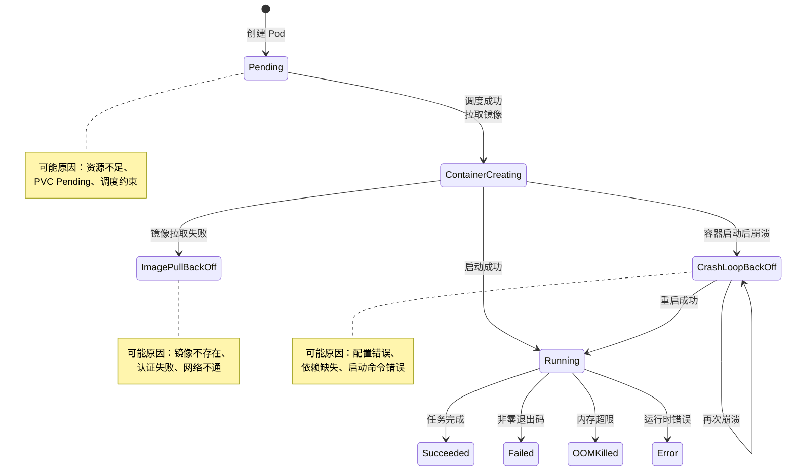

### 2.2 CrashLoopBackOff

最常见也最令人头疼的故障。容器启动后立即退出，K8s 反复重启。

```bash
# 查看 Pod 状态
kubectl get pod myapp-7f9d8c6b4-x2kjl
# NAME                     READY   STATUS             RESTARTS   AGE
# myapp-7f9d8c6b4-x2kjl   0/1     CrashLoopBackOff   5          3m

# 查看上一次容器日志（关键！）
kubectl logs myapp-7f9d8c6b4-x2kjl --previous

# 查看当前容器日志
kubectl logs myapp-7f9d8c6b4-x2kjl

# 查看事件
kubectl describe pod myapp-7f9d8c6b4-x2kjl | grep -A20 Events

# 查看容器状态（Last State）
kubectl get pod myapp-7f9d8c6b4-x2kjl -o jsonpath='{.status.containerStatuses[0].lastState}' | jq
```

**常见原因与解决方案：**

| 原因 | 现象 | 解决 |
|------|------|------|
| **启动命令错误** | `exec format error` / `command not found` | 检查 Dockerfile ENTRYPOINT/CMD |
| **配置缺失** | `connection refused` / `file not found` | 检查 ConfigMap/Secret 是否挂载 |
| **依赖服务不可达** | `Unable to connect to database` | 检查 Service/DNS，使用 initContainer 等待 |
| **端口冲突** | `address already in use` | 检查容器端口配置 |
| **权限问题** | `Permission denied` | 检查 SecurityContext、文件权限 |
| **环境变量缺失** | 应用启动报错缺少配置 | 检查 env/envFrom 配置 |

**使用临时容器调试：**

```yaml
# K8s 1.25+ 支持 Ephemeral Containers
kubectl debug myapp-7f9d8c6b4-x2kjl -it --image=busybox --target=myapp
# 进入容器后排查：
# ls /app/config    → 配置文件是否存在
# cat /app/config/* → 配置内容是否正确
# env               → 环境变量是否注入
# nc -zv db-service 5432 → 依赖是否可达
```

```bash
# 或者复制 Pod 进行调试（不影响原 Pod）
kubectl debug myapp-7f9d8c6b4-x2kjl -it --copy-to=myapp-debug --container=myapp -- sh
```

### 2.3 ImagePullBackOff / ErrImagePull

镜像拉取失败，Pod 无法启动。

```bash
# 查看详细错误
kubectl describe pod myapp-7f9d8c6b4-x2kjl | grep -A5 "Warning"

# 常见错误信息：
# Failed to pull image "myapp:v1.0": rpc error: code = NotFound
# Failed to pull image "registry.example.com/myapp:v1.0": unauthorized
# Failed to pull image "registry.example.com/myapp:v1.0": TLS handshake timeout
```

**排查清单：**

```
ImagePullBackOff 排查清单：

┌──────────────────────────────────────────────────────┐
│ 1. 镜像是否存在？                                     │
│    docker pull <image>  在节点上手动拉取测试          │
│                                                       │
│ 2. 镜像仓库是否需要认证？                              │
│    kubectl get secrets                                │
│    kubectl get pod -o yaml | grep imagePullSecrets    │
│                                                       │
│ 3. 网络是否可达？                                      │
│    从节点 curl https://registry.example.com/v2/       │
│                                                       │
│ 4. 镜像标签是否正确？                                  │
│    latest 标签可能不存在或已被覆盖                     │
│                                                       │
│ 5. 节点磁盘是否已满？                                  │
│    df -h  /  检查节点磁盘空间                          │
│                                                       │
│ 6. 镜像仓库证书是否有效？                              │
│    openssl s_client -connect registry:443             │
└──────────────────────────────────────────────────────┘
```

```bash
# 解决方案 1：创建镜像拉取 Secret
kubectl create secret docker-registry regcred \
  --docker-server=registry.example.com \
  --docker-username=admin \
  --docker-password=S3cretP@ss \
  --docker-email=admin@example.com

# 在 Pod/Deployment 中引用
# spec.imagePullSecrets:
# - name: regcred

# 解决方案 2：节点上手动拉取
ssh node01
sudo crictl pull registry.example.com/myapp:v1.0

# 解决方案 3：使用 Node 上的镜像（imagePullPolicy: Never）
# 仅用于调试，不推荐生产使用
```

### 2.4 Pod Pending

Pod 无法被调度到任何节点。

```bash
# 查看 Pending 原因
kubectl describe pod myapp-7f9d8c6b4-x2kjl | grep -A10 Events

# 常见原因：
# 0/3 nodes are available: 3 Insufficient cpu.
# 0/3 nodes are available: 3 node(s) didn't match Pod's node affinity/selector.
# 0/3 nodes are available: 3 node(s) had taint {node.kubernetes.io/not-ready: }, that the pod didn't tolerate.
# 0/3 nodes are available: 3 Insufficient memory.
```

**Pending 排查流程：**

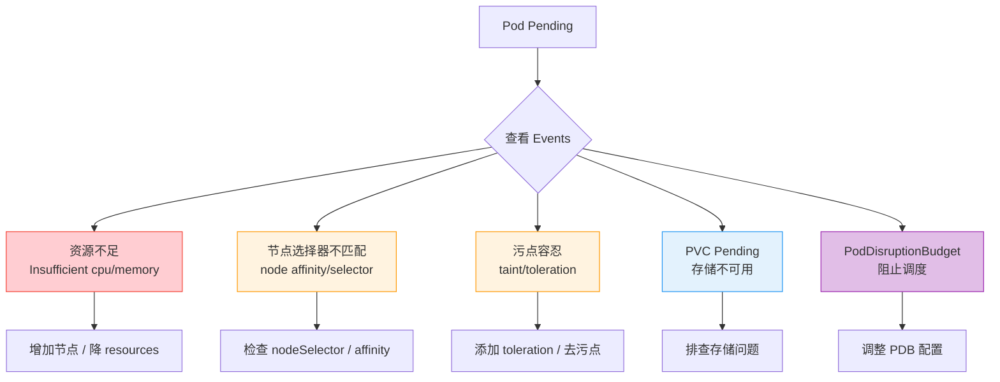

```bash
# 检查集群资源
kubectl top nodes
kubectl describe nodes | grep -A5 "Allocated resources"

# 检查节点标签
kubectl get nodes --show-labels
kubectl get nodes -l disk=ssd

# 检查污点
kubectl get nodes -o jsonpath='{.items[*].spec.taints[*]}' | jq

# 临时去除污点（调试用）
kubectl taint nodes node01 key=value:NoSchedule-
```

### 2.5 OOMKilled

容器内存使用超过 limits 限制，被内核 OOM Killer 杀掉。

```bash
# 查看 OOM 事件
kubectl describe pod myapp-7f9d8c6b4-x2kjl | grep OOMKilled

# 查看内存使用历史
kubectl get pod myapp-7f9d8c6b4-x2kjl -o jsonpath='{.status.containerStatuses[0].lastState.terminated}' | jq

# 输出示例：
# {
#   "exitCode": 137,
#   "reason": "OOMKilled",
#   "startedAt": "2024-01-15T10:30:00Z",
#   "finishedAt": "2024-01-15T10:45:00Z"
# }
```

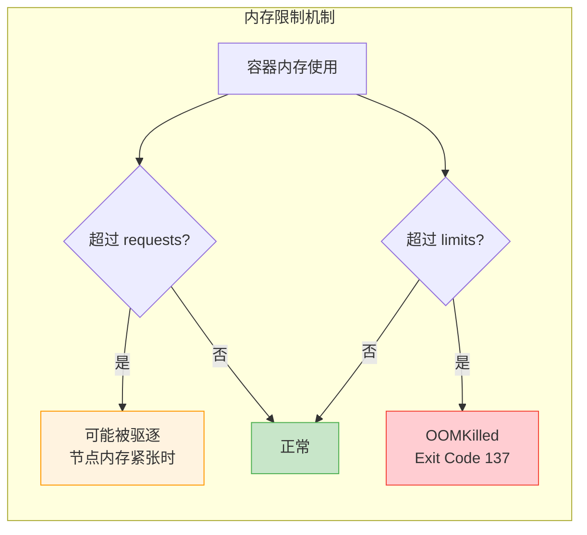

**OOMKilled 排查步骤：**

```bash
# 1. 查看当前内存限制
kubectl get pod myapp-7f9d8c6b4-x2kjl -o jsonpath='{.spec.containers[0].resources}' | jq

# 2. 查看实际内存使用
kubectl top pod myapp-7f9d8c6b4-x2kjl --containers

# 3. 查看节点 OOM 事件
ssh node01
dmesg | grep -i "oom killer" | tail -20
journalctl -k | grep -i "out of memory"

# 4. .NET 应用内存排查
kubectl exec myapp-7f9d8c6b4-x2kjl -- dotnet-counters monitor -p 1
kubectl exec myapp-7f9d8c6b4-x2kjl -- dotnet-dump collect -p 1
```

**解决方案：**

```yaml
# 方案 1：增加内存限制
resources:
  requests:
    memory: "512Mi"
  limits:
    memory: "1Gi"        # 从 512Mi 增加到 1Gi

# 方案 2：使用 Liveness Probe 配合内存监控
livenessProbe:
  httpGet:
    path: /health/live
    port: 8080
  periodSeconds: 10
  failureThreshold: 3

# 方案 3：配置 .NET GC（ServerGC → WorkstationGC 节省内存）
env:
- name: DOTNET_gcServer
  value: "0"              # WorkstationGC，内存占用更低
```

::: important .NET 内存建议
1. **ServerGC**（默认）：多线程 GC，吞吐量高但内存占用大，适合大内存容器
2. **WorkstationGC**：单线程 GC，内存占用低，适合小容器（<1Gi）
3. 建议容器内存 limits 至少设为应用实际使用的 2-3 倍，给 GC 留出空间
4. 使用 `dotnet-counters` 监控 GC 堆大小，发现内存泄漏及时处理
:::

### 2.6 Pod 故障快速参考

| 状态 | Exit Code | 常见原因 | 首要排查 |
|------|-----------|----------|----------|
| CrashLoopBackOff | 1, 2 | 应用错误、配置缺失 | `kubectl logs --previous` |
| OOMKilled | 137 | 内存超限 | `kubectl top pod` |
| ImagePullBackOff | - | 镜像问题 | `kubectl describe pod` |
| Error | 1-255 | 应用异常退出 | `kubectl logs` |
| ContainerCreating (卡住) | - | 挂载/网络问题 | `kubectl describe pod` → Events |
| Completed (非预期) | 0 | 命令执行完退出 | 检查 command/args |

---

## 3. Node 故障排查

### 3.1 Node 状态与故障类型

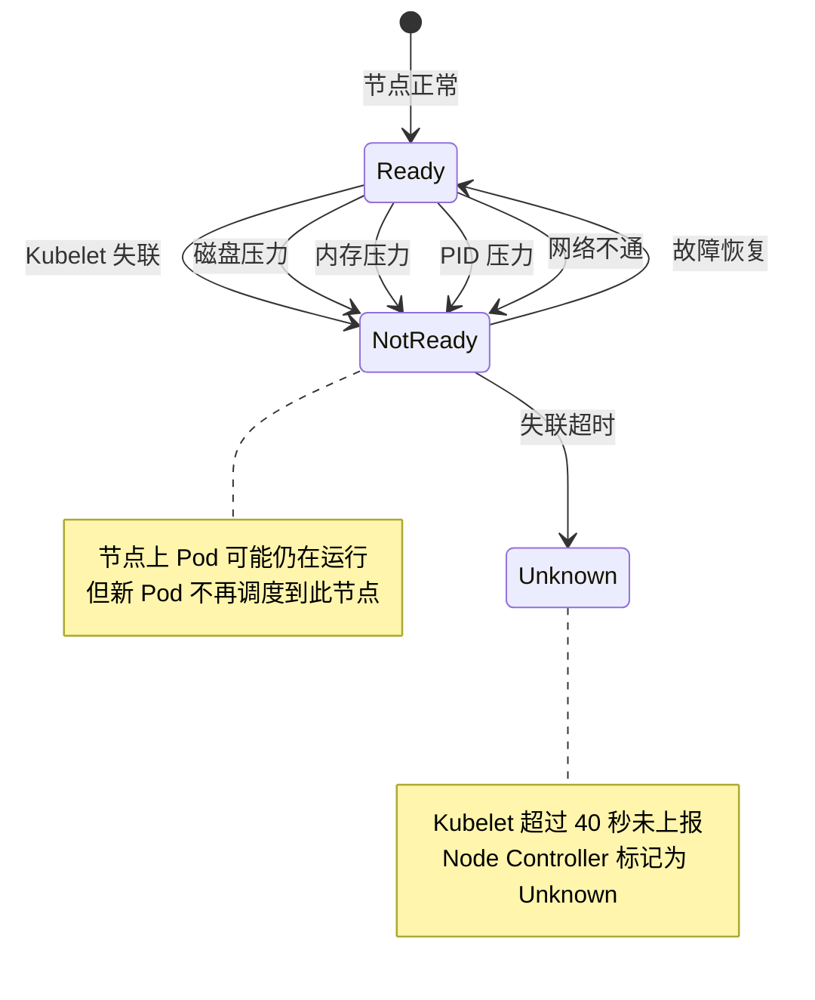

### 3.2 Node NotReady 排查

```bash
# 查看节点状态
kubectl get nodes
# NAME     STATUS     ROLES           AGE   VERSION
# node01   NotReady   control-plane   30d   v1.28.0
# node02   Ready      <none>          30d   v1.28.0

# 查看详细条件
kubectl describe node node01 | grep -A20 "Conditions"

# 常见 Conditions：
# Ready            False   KubeletNotReady  PLEG is not healthy
# MemoryPressure   True    KubeletHasInsufficientMemory
# DiskPressure     True    KubeletHasDiskPressure
# PIDPressure      True    KubeletHasInsufficientPID
# NetworkUnavailable True  NodeHasNoNetwork
```

**NotReady 排查流程：**

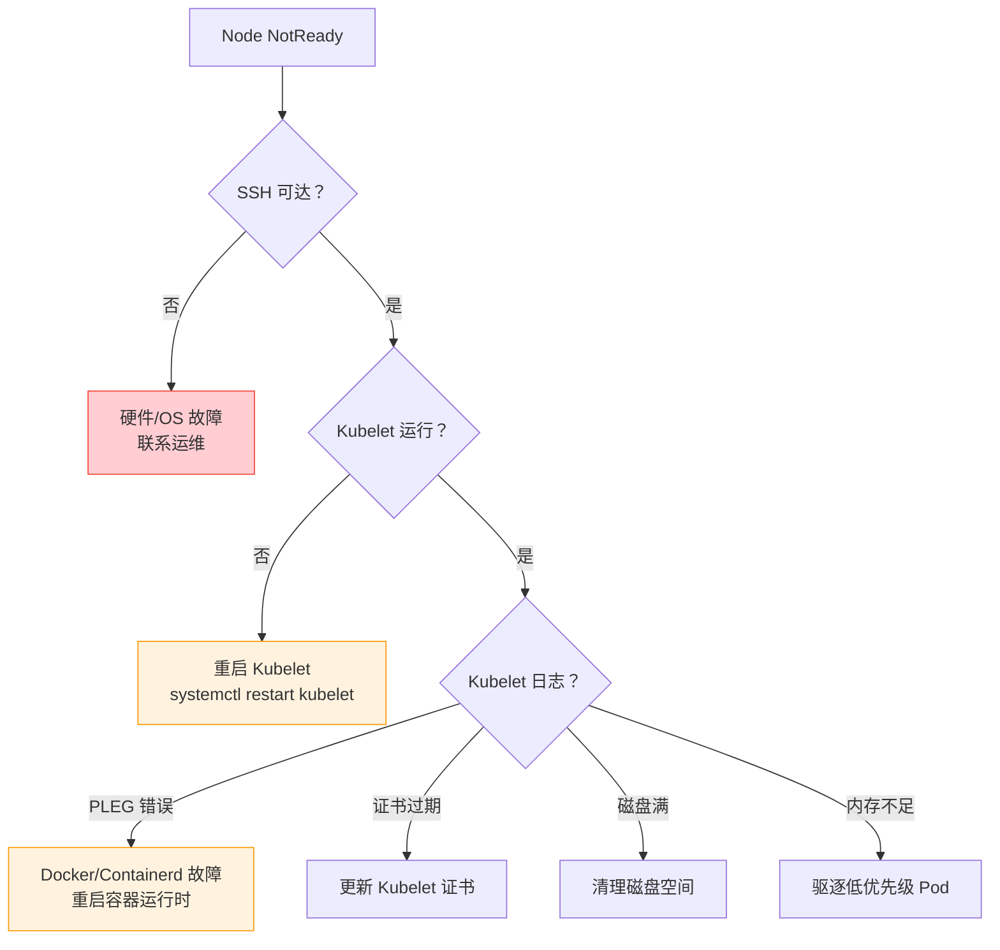

**SSH 到节点的排查命令：**

```bash
# 1. 检查 Kubelet 状态
systemctl status kubelet
journalctl -u kubelet --since "10 minutes ago" --no-pager

# 2. 检查容器运行时
systemctl status containerd    # 或 docker
crictl ps                      # 查看容器状态
crictl pods                    # 查看 Pod 状态

# 3. 检查磁盘
df -h
du -sh /var/lib/containerd/*   # 容器存储
du -sh /var/lib/kubelet/*      # Kubelet 数据
du -sh /var/log/*              # 日志

# 4. 检查内存
free -h
cat /proc/meminfo | grep -i "memavailable\|swaptotal"

# 5. 检查网络
ip route
iptables -L -n | head -50
bridge fdb show

# 6. 检查内核日志
dmesg -T | grep -i "oom\|error\|kill" | tail -20
```

### 3.3 节点磁盘压力

磁盘满是最常见的节点故障之一，尤其容器镜像和日志会快速占满磁盘。

```bash
# 查看磁盘使用
df -h / /var/lib/containerd /var/lib/kubelet /var/log

# 清理容器镜像
crictl rmi --prune             # 清理未使用的镜像
docker image prune -a          # Docker 方式

# 清理已退出的容器
crictl ps -a | grep Exited | awk '{print $1}' | xargs crictl rm

# 清理日志（K8s 默认不自动轮转容器日志）
find /var/log/containers -name "*.log" -size +100M -exec truncate -s 0 {} \;
find /var/log/pods -name "*.log" -size +100M -exec truncate -s 0 {} \;

# 配置日志轮转（kubelet 配置）
# /var/lib/kubelet/config.yaml
# containerLogMaxSize: 50Mi
# containerLogMaxFiles: 5
```

```yaml
# 推荐：通过 kubelet 配置自动清理
apiVersion: kubelet.config.k8s.io/v1beta1
kind: KubeletConfiguration
containerLogMaxSize: 50Mi
containerLogMaxFiles: 5
imageGCHighThresholdPercent: 85    # 磁盘使用 >85% 开始清理镜像
imageGCLowThresholdPercent: 80     # 清理到 80% 停止
evictionHard:
  imagefs.available: "15%"         # 镜像存储可用 <15% 开始驱逐
  memory.available: "100Mi"        # 内存可用 <100Mi 开始驱逐
  nodefs.available: "10%"          # 节点存储可用 <10% 开始驱逐
  nodefs.inodesFree: "5%"          # Inode 可用 <5% 开始驱逐
```

### 3.4 节点维护操作

```bash
# 安全排空节点（维护前）
kubectl drain node01 --ignore-daemonsets --delete-emptydir-data --grace-period=60

# 维护完成后恢复
kubectl uncordon node01

# 临时标记节点不可调度（不驱逐 Pod）
kubectl cordon node01

# 查看节点上的 Pod
kubectl get pods -A --field-selector spec.nodeName=node01
```

::: warning drain 注意事项
1. drain 会驱逐所有非 DaemonSet Pod，确保有足够的其他节点接收
2. 使用 `--ignore-daemonsets` 避免排空卡住
3. StatefulSet Pod 被驱逐后不会自动在其他节点重建（PVC 绑定节点）
4. 建议在非高峰期执行，并提前通知相关团队
:::

---

## 4. 网络故障排查

### 4.1 网络故障分类

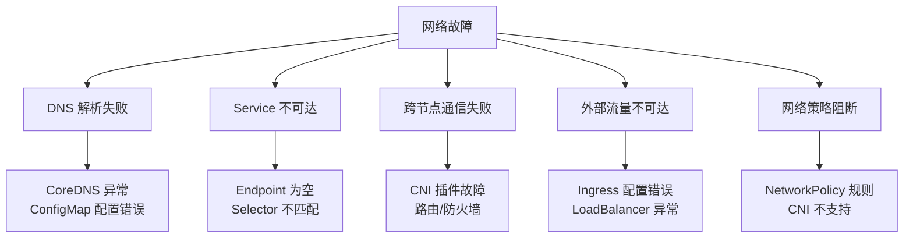

### 4.2 DNS 故障排查

DNS 是 K8s 网络的基础，DNS 故障会导致所有服务发现失效。

```bash
# 检查 CoreDNS 状态
kubectl get pods -n kube-system -l k8s-app=kube-dns
# NAME                       READY   STATUS    RESTARTS   AGE
# coredns-5d78c9869d-abcde   1/1     Running   0          5d

# 查看 CoreDNS 日志
kubectl logs -n kube-system -l k8s-app=kube-dns

# 在 Pod 内测试 DNS
kubectl run dns-test --image=busybox:1.36 --rm -it --restart=Never -- sh
# nslookup kubernetes.default.svc.cluster.local
# nslookup myapp-service.production.svc.cluster.local
# nslookup myapp-service.production
# cat /etc/resolv.conf
```

```bash
# 常见 DNS 问题

# 1. ndots 问题（5 个以上标签的域名走集群 DNS 搜索）
# /etc/resolv.conf 内容：
# search default.svc.cluster.local svc.cluster.local cluster.local
# options ndots:5
# 解决：使用 FQDN 或调整 ndots

# 2. CoreDNS 配置错误
kubectl get configmap coredns -n kube-system -o yaml
# 检查 Corefile 配置

# 3. CoreDNS 负载过高
kubectl top pods -n kube-system -l k8s-app=kube-dns
# 解决：增加副本数
kubectl scale deployment coredns -n kube-system --replicas=3
```

**CoreDNS 自定义配置：**

```yaml
# 修改 CoreDNS ConfigMap
apiVersion: v1
kind: ConfigMap
metadata:
  name: coredns
  namespace: kube-system
data:
  Corefile: |
    .:53 {
        errors
        health {
            lameduck 5s
        }
        ready
        kubernetes cluster.local in-addr.arpa ip6.arpa {
            pods insecure
            fallthrough in-addr.arpa ip6.arpa
            ttl 30
        }
        prometheus :9153
        forward . /etc/resolv.conf {
            max_concurrent 1000
        }
        cache 30
        loop
        reload
        loadbalance
    }
    # 自定义域名解析
    example.com:53 {
        errors
        cache 30
        forward . 192.168.1.1    # 内部 DNS 服务器
    }
```

### 4.3 Service 不可达

```bash
# 检查 Service
kubectl get svc myapp-service
kubectl describe svc myapp-service

# 检查 Endpoints（最关键！）
kubectl get endpoints myapp-service
# 如果 Endpoints 为空 → Selector 不匹配或 Pod 不 Ready

# 检查 Service Selector 和 Pod Labels 是否匹配
kubectl get pods -l app=myapp --show-labels
kubectl get svc myapp-service -o jsonpath='{.spec.selector}'

# 在 Pod 内测试 Service
kubectl run netshoot --image=nicolaka/netshoot --rm -it -- bash
# curl http://myapp-service:8080/health
# curl http://myapp-service.production.svc.cluster.local:8080/health
```

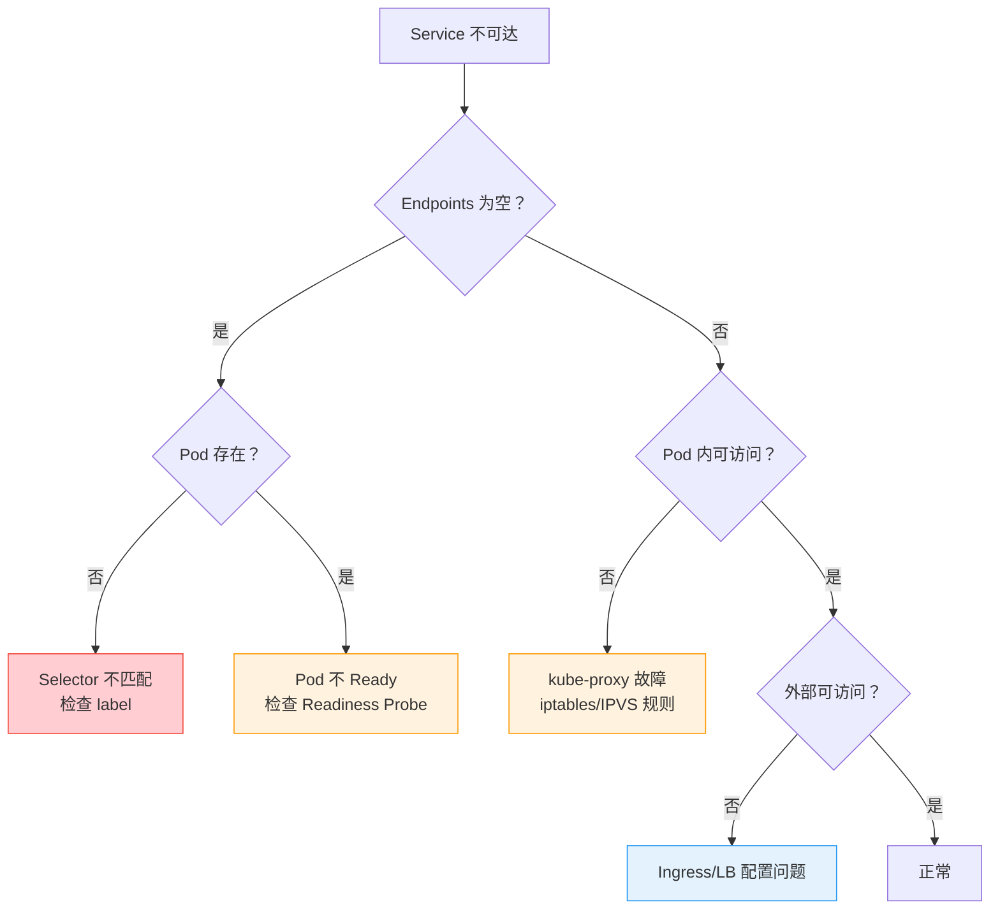

### 4.4 跨节点通信故障

```bash
# 检查 CNI Pod 状态（以 Calico 为例）
kubectl get pods -n kube-system -l k8s-app=calico-node

# 检查节点路由
ssh node01
ip route | grep -i "vxlan\|cali\|flannel"

# 跨节点 Pod 通信测试
# 在 node01 的 Pod 内
kubectl run test-node01 --image=busybox --overrides='{"spec":{"nodeName":"node01"}}' --rm -it -- sh
# wget -qO- http://<node02-pod-ip>:8080

# 检查防火墙规则
iptables -L -n -v | grep -i "calico\|kube\|flannel"
# 或者
nft list ruleset | head -100

# 抓包分析
tcpdump -i any -nn port 179    # BGP（Calico）
tcpdump -i vxlan0 -nn          # VXLAN（Flannel）
tcpdump -i any -nn host <pod-ip>
```

**常见 CNI 故障：**

| CNI | 常见故障 | 排查 |
|-----|----------|------|
| **Calico** | BGP 邻居未建立、IPPool 耗尽 | `calicoctl node status`、`calicoctl ipam show` |
| **Flannel** | VXLAN 接口缺失、子网冲突 | `ip link show flannel.1`、`cat /run/flannel/subnet.env` |
| **Cilium** | eBPF 程序加载失败 | `cilium status`、`cilium bpf lb list` |
| **Weave** | Sleeve 模式降级 | `weave status`、`weave report` |

### 4.5 NetworkPolicy 阻断

```bash
# 查看 NetworkPolicy
kubectl get networkpolicy -A

# 查看 Policy 详情
kubectl describe networkpolicy deny-all -n production

# 临时删除 Policy 验证
kubectl delete networkpolicy deny-all -n production

# 查看策略命中统计（Calico）
calicoctl get networkpolicy -o yaml
```

```yaml
# 调试 NetworkPolicy：先放行所有流量
apiVersion: networking.k8s.io/v1
kind: NetworkPolicy
metadata:
  name: allow-all-debug
  namespace: production
spec:
  podSelector: {}    # 匹配所有 Pod
  ingress:
  - {}               # 允许所有入站
  egress:
  - {}               # 允许所有出站
  policyTypes:
  - Ingress
  - Egress
```

---

## 5. 存储故障排查

### 5.1 PVC Pending

```bash
# 查看 PVC 状态
kubectl get pvc data-pvc
# NAME       STATUS    VOLUME   CAPACITY   ACCESS MODES   STORAGECLASS   AGE
# data-pvc   Pending                                       fast-ssd       5m

# 查看 Events
kubectl describe pvc data-pvc
# Events:
#   Warning  ProvisioningFailed  storageclass.storage.k8s.io "fast-ssd" not found
#   Warning  ProvisioningFailed  failed to provision volume: rpc error: code = Internal
```

**PVC Pending 排查流程：**

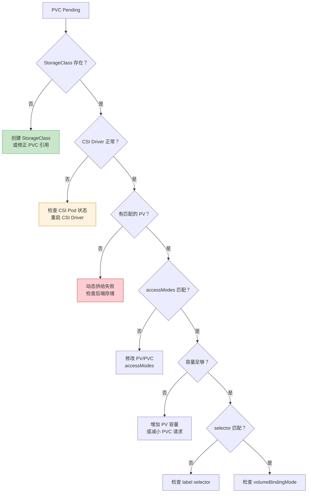

### 5.2 Volume 挂载失败

```bash
# 查看 Pod 事件
kubectl describe pod myapp-xxx | grep -A10 Events
# Warning  FailedMount  Unable to attach or mount volumes: ...
# Warning  FailedMount  MountVolume.SetUp failed for volume "data-pv" : mount failed: exit status 32

# 常见挂载错误
# mount.nfs: Connection timed out     → NFS 服务器不可达
# mount.nfs: Access denied            → NFS 权限配置错误
# Input/output error                  → 存储后端异常
# Device or resource busy             → Volume 已挂载到其他 Pod

# 在节点上手动检查
ssh node01
mount | grep /var/lib/kubelet
ls -la /var/lib/kubelet/pods/<pod-uid>/volumes/

# 检查 NFS 连接
showmount -e 192.168.1.100
mount -t nfs 192.168.1.100:/export/data /mnt/test
```

### 5.3 存储后端故障

```bash
# Ceph 故障排查
ceph -s                          # 集群状态
ceph osd tree                    # OSD 状态
ceph health detail               # 健康详情
rados df                         # 存储使用率

# Ceph Pool 接近满
ceph osd pool set rbd size 3     # 确认副本数
ceph osd pool get rbd size

# NFS 故障排查
ssh nfs-server
systemctl status nfs-server
exportfs -v                       # 查看导出列表
showmount -e                      # 客户端查看
```

---

## 6. 控制面故障排查

### 6.1 控制面组件架构

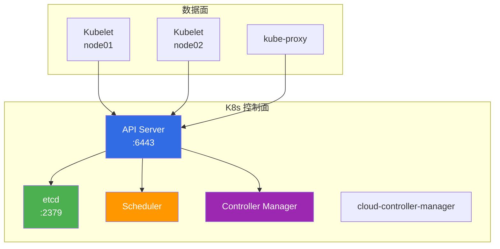

### 6.2 API Server 故障

API Server 是控制面的核心，故障后所有 `kubectl` 命令失败。

```bash
# 检查 API Server 状态
kubectl get --raw='/readyz?verbose'

# 如果 kubectl 不可用，直接检查 Pod
ssh control-plane
crictl ps | grep kube-apiserver
crictl logs <container-id>

# 查看 API Server 日志
kubectl -n kube-system logs kube-apiserver-control-plane

# 常见原因：
# 1. etcd 不可达
# 2. 证书过期
# 3. 内存不足
# 4. 端口被占用
```

```bash
# API Server 证书检查
openssl x509 -in /etc/kubernetes/pki/apiserver.crt -checkend 86400
# 如果输出 "Certificate will expire"，需要更新证书

# 手动更新证书（kubeadm）
kubeadm certs check-expiration
kubeadm certs renew all
systemctl restart kubelet
```

### 6.3 etcd 故障

etcd 是 K8s 的"心脏"，etcd 故障 = 集群瘫痪。

```bash
# 检查 etcd 健康
ETCDCTL_API=3 etcdctl endpoint health \
  --endpoints=https://127.0.0.1:2379 \
  --cacert=/etc/kubernetes/pki/etcd/ca.crt \
  --cert=/etc/kubernetes/pki/etcd/server.crt \
  --key=/etc/kubernetes/pki/etcd/server.key

# 查看集群成员
ETCDCTL_API=3 etcdctl member list \
  --write-out=table \
  --endpoints=https://127.0.0.1:2379 \
  --cacert=/etc/kubernetes/pki/etcd/ca.crt \
  --cert=/etc/kubernetes/pki/etcd/server.crt \
  --key=/etc/kubernetes/pki/etcd/server.key

# 查看 etcd 性能
ETCDCTL_API=3 etcdctl endpoint status \
  --write-out=table \
  --endpoints=https://127.0.0.1:2379 \
  --cacert=/etc/kubernetes/pki/etcd/ca.crt \
  --cert=/etc/kubernetes/pki/etcd/server.crt \
  --key=/etc/kubernetes/pki/etcd/server.key

# 输出关键指标：
# DB SIZE    → 数据库大小（超过 8GB 有风险）
# IS LEADER  → Leader 分布
# RAFT INDEX → 复制进度差异
```

**etcd 常见故障：**

| 故障 | 现象 | 排查 |
|------|------|------|
| **Leader 丢失** | 集群无法写入 | `etcdctl endpoint status` 查看 Leader |
| **成员下线** | 剩余成员 < 多数派 | `etcdctl member list`，恢复或移除成员 |
| **磁盘慢** | 延迟升高、Follower 落后 | `etcdctl check perf`，检查磁盘 IOPS |
| **数据膨胀** | DB SIZE 持续增长 | 执行碎片整理 `etcdctl defrag` |
| **证书过期** | TLS 握手失败 | `openssl x509 -checkend` |

### 6.4 etcd 灾难恢复

当 etcd 集群完全不可用（如多数节点宕机、数据损坏），需要从备份恢复。

```bash
# ===== 前提：有定期备份 =====
# 定期备份脚本（建议 cron 每小时执行）
ETCDCTL_API=3 etcdctl snapshot save /backup/etcd-snapshot-$(date +%Y%m%d%H%M).db \
  --endpoints=https://127.0.0.1:2379 \
  --cacert=/etc/kubernetes/pki/etcd/ca.crt \
  --cert=/etc/kubernetes/pki/etcd/peer.crt \
  --key=/etc/kubernetes/pki/etcd/peer.key

# 验证备份完整性
ETCDCTL_API=3 etcdctl snapshot status /backup/etcd-snapshot-202401151000.db --write-out=table
```

```bash
# ===== 恢复步骤 =====

# 1. 停止所有控制面的 etcd 和 API Server
ssh control-plane-1
systemctl stop kubelet
crictl stop $(crictl ps -q --name etcd)
crictl stop $(crictl ps -q --name kube-apiserver)

# 2. 备份当前数据（以防万一）
mv /var/lib/etcd /var/lib/etcd.bak.$(date +%Y%m%d%H%M)

# 3. 从快照恢复
ETCDCTL_API=3 etcdctl snapshot restore /backup/etcd-snapshot-202401151000.db \
  --data-dir=/var/lib/etcd \
  --name=control-plane-1 \
  --initial-cluster=control-plane-1=https://192.168.1.10:2380 \
  --initial-cluster-token=etcd-cluster-1 \
  --initial-advertise-peer-urls=https://192.168.1.10:2380

# 4. 修改 etcd Pod 挂载目录权限
chown -R etcd:etcd /var/lib/etcd

# 5. 启动 Kubelet
systemctl start kubelet

# 6. 验证恢复
ETCDCTL_API=3 etcdctl endpoint health \
  --endpoints=https://127.0.0.1:2379 \
  --cacert=/etc/kubernetes/pki/etcd/ca.crt \
  --cert=/etc/kubernetes/pki/etcd/server.crt \
  --key=/etc/kubernetes/pki/etcd/server.key

# 7. 验证集群
kubectl get nodes
kubectl get pods -A
```

::: warning etcd 恢复注意事项
1. 恢复后数据是备份时刻的状态，之后的数据**全部丢失**
2. 多节点集群恢复时，所有成员必须使用同一个快照恢复
3. 恢复后必须重启所有控制面组件（API Server、Scheduler、Controller Manager）
4. 恢复后检查所有 CRD、Webhook、Admission Controller 是否正常
5. 恢复操作不可逆，务必先备份当前数据
:::

### 6.5 Scheduler 故障

```bash
# 检查 Scheduler 状态
kubectl -n kube-system logs kube-scheduler-control-plane --tail=50

# Scheduler 卡住的表现：
# - 新 Pod 一直 Pending，但 Events 中没有调度失败信息
# - 已有 Pod 正常运行

# 重启 Scheduler
ssh control-plane
crictl stop $(crictl ps -q --name kube-scheduler)
# Kubelet 会自动拉起
```

### 6.6 Controller Manager 故障

```bash
# 检查 Controller Manager
kubectl -n kube-system logs kube-controller-manager-control-plane --tail=50

# Controller Manager 故障的表现：
# - Deployment 副本数不调整
# - ReplicaSet 不创建 Pod
# - Node 状态不更新
# - ServiceAccount 不自动创建

# 重启
ssh control-plane
crictl stop $(crictl ps -q --name kube-controller-manager)
```

---

## 7. 证书过期排查

### 7.1 K8s 证书体系

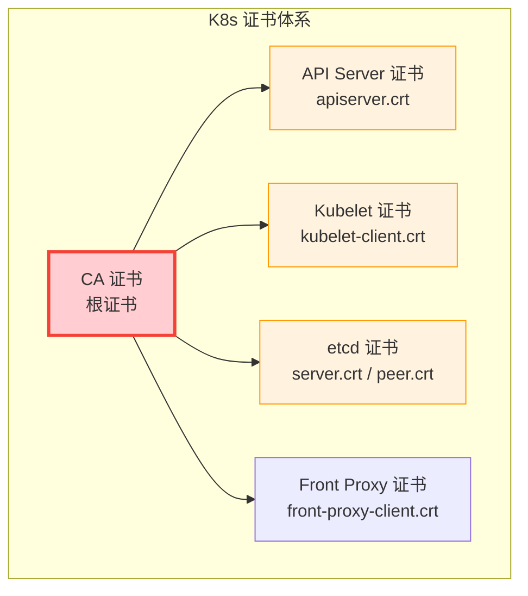

### 7.2 证书检查与更新

```bash
# 检查所有证书过期时间
kubeadm certs check-expiration

# 输出示例：
# CERTIFICATE                EXPIRES          RESIDUAL TIME   CERTIFICATE AUTHORITY
# apiserver                  Jan 15, 2025     30d             ca
# apiserver-kubelet-client   Jan 15, 2025     30d             ca
# front-proxy-client         Jan 15, 2025     30d             front-proxy-ca
# etcd-healthcheck-client    Jan 15, 2025     30d             etcd-ca
# etcd-peer                  Jan 15, 2025     30d             etcd-ca
# etcd-server                Jan 15, 2025     30d             etcd-ca

# 手动检查单个证书
openssl x509 -in /etc/kubernetes/pki/apiserver.crt -noout -dates
openssl x509 -in /etc/kubernetes/pki/apiserver.crt -checkend 2592000  # 30天

# 更新所有证书
kubeadm certs renew all

# 更新单个证书
kubeadm certs renew apiserver
kubeadm certs renew etcd-server

# 更新后重启控制面
kubectl -n kube-system delete pod -l component=kube-apiserver
kubectl -n kube-system delete pod -l component=kube-controller-manager
kubectl -n kube-system delete pod -l component=kube-scheduler
```

::: important 证书管理建议
1. **kubeadm 默认证书有效期 1 年**，建议配置自动续期
2. **生产环境使用 Kubelet 证书自动轮换**（默认开启）
3. **定期检查**：每周检查一次证书过期时间
4. **提前续期**：证书到期前 30 天完成续期
5. **监控告警**：证书剩余 <30 天触发告警
:::

```yaml
# 配置 Kubelet 证书自动轮换
apiVersion: kubelet.config.k8s.io/v1beta1
kind: KubeletConfiguration
rotateCertificates: true        # 自动轮换 Kubelet 客户端证书
serverTLSBootstrap: true        # 自动轮换 Kubelet 服务端证书（1.28+）
```

---

## 8. 应急响应 SOP

### 8.1 故障分级

| 级别 | 定义 | 响应时间 | 示例 |
|------|------|----------|------|
| **P0 - 紧急** | 核心业务不可用 | 5 分钟响应 | 集群不可达、数据库宕机 |
| **P1 - 严重** | 核心功能降级 | 15 分钟响应 | 部分节点 NotReady、延迟飙升 |
| **P2 - 一般** | 非核心功能异常 | 1 小时响应 | 单个 Pod 异常、日志丢失 |
| **P3 - 低** | 潜在风险 | 4 小时响应 | 证书即将过期、磁盘使用率高 |

### 8.2 应急响应流程

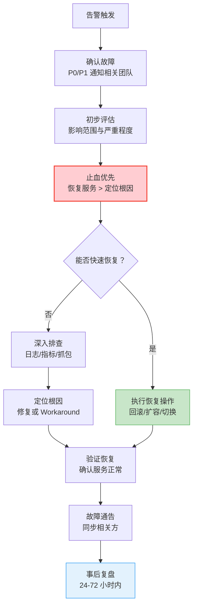

### 8.3 紧急隔离操作

当故障扩散时，需要快速隔离。

```bash
# ===== 隔离故障节点 =====
kubectl cordon node03              # 标记不可调度
kubectl drain node03 --ignore-daemonsets --grace-period=30  # 驱逐 Pod

# ===== 隔离故障 Deployment =====
kubectl scale deployment myapp --replicas=0    # 缩容到 0

# ===== 回滚 Deployment =====
kubectl rollout undo deployment/myapp
kubectl rollout undo deployment/myapp --to-revision=2   # 指定版本

# ===== 紧急扩容 =====
kubectl scale deployment myapp --replicas=10

# ===== 限制流量 =====
# 使用 Ingress 限流
kubectl annotate ingress myapp-ingress \
  nginx.ingress.kubernetes.io/limit-connections=100 \
  nginx.ingress.kubernetes.io/limit-rps=50

# ===== 切断入口 =====
# 删除 Service（极端操作，谨慎使用）
# kubectl delete svc myapp-service
# 或修改 Selector 使流量不再路由到故障 Pod
```

### 8.4 常见故障 SOP 模板

**SOP-001：Pod CrashLoopBackOff 应急**

```
┌─────────────────────────────────────────────────────────┐
│ SOP-001: Pod CrashLoopBackOff 应急                       │
├─────────────────────────────────────────────────────────┤
│ 触发条件：Pod 状态 CrashLoopBackOff，RESTARTS > 3        │
├─────────────────────────────────────────────────────────┤
│ 步骤 1：确认影响范围                                     │
│   kubectl get pods -A | grep CrashLoop                   │
│                                                          │
│ 步骤 2：获取错误日志                                     │
│   kubectl logs <pod> --previous                          │
│   kubectl describe pod <pod> | tail -20                  │
│                                                          │
│ 步骤 3：快速止血                                         │
│   3a. 如果是配置变更导致 → 回滚                           │
│       kubectl rollout undo deployment/<name>             │
│   3b. 如果是依赖服务故障 → 等待或切换                     │
│   3c. 如果是镜像问题 → 回退到上一版本镜像                 │
│       kubectl set image deployment/<name> <c>=<old-img>  │
│                                                          │
│ 步骤 4：验证恢复                                         │
│   kubectl rollout status deployment/<name>               │
│   kubectl get pods -l app=<name>                         │
└─────────────────────────────────────────────────────────┘
```

**SOP-002：Node NotReady 应急**

```
┌─────────────────────────────────────────────────────────┐
│ SOP-002: Node NotReady 应急                              │
├─────────────────────────────────────────────────────────┤
│ 触发条件：节点状态 NotReady 超过 5 分钟                   │
├─────────────────────────────────────────────────────────┤
│ 步骤 1：确认节点状态                                     │
│   kubectl get nodes                                      │
│   kubectl describe node <node> | grep -A20 Conditions    │
│                                                          │
│ 步骤 2：尝试恢复                                         │
│   2a. SSH 可达 → 重启 Kubelet                            │
│       systemctl restart kubelet                          │
│   2b. SSH 不可达 → 标记不可调度，等待自动恢复             │
│       kubectl cordon <node>                              │
│   2c. 确认无法恢复 → 排空节点                             │
│       kubectl drain <node> --ignore-daemonsets           │
│                                                          │
│ 步骤 3：确认 Pod 迁移                                    │
│   kubectl get pods -A --field-selector spec.nodeName=<node> │
│                                                          │
│ 步骤 4：持续观察                                         │
│   watch kubectl get nodes                                │
└─────────────────────────────────────────────────────────┘
```

**SOP-003：集群不可达应急**

```
┌─────────────────────────────────────────────────────────┐
│ SOP-003: 集群不可达应急                                   │
├─────────────────────────────────────────────────────────┤
│ 触发条件：kubectl 命令全部超时或连接拒绝                   │
├─────────────────────────────────────────────────────────┤
│ 步骤 1：确认控制面可达性                                  │
│   curl -k https://<api-server-ip>:6443/healthz           │
│                                                          │
│ 步骤 2：检查控制面节点                                    │
│   ssh control-plane                                      │
│   crictl ps | grep -E "etcd|apiserver|scheduler"         │
│                                                          │
│ 步骤 3：检查 etcd                                        │
│   ETCDCTL_API=3 etcdctl endpoint health                  │
│   如果 etcd 不可用 → 执行 etcd 恢复 SOP                  │
│                                                          │
│ 步骤 4：重启控制面组件                                    │
│   systemctl restart kubelet                              │
│   # Kubelet 会自动拉起控制面 Pod                          │
│                                                          │
│ 步骤 5：验证集群恢复                                     │
│   kubectl get nodes                                      │
│   kubectl get pods -A | grep -v Running                  │
│                                                          │
│ 步骤 6：通知相关团队                                     │
│   集群恢复后发送通告                                      │
└─────────────────────────────────────────────────────────┘
```

---

## 9. .NET 应用故障排查

### 9.1 .NET 应用常见故障

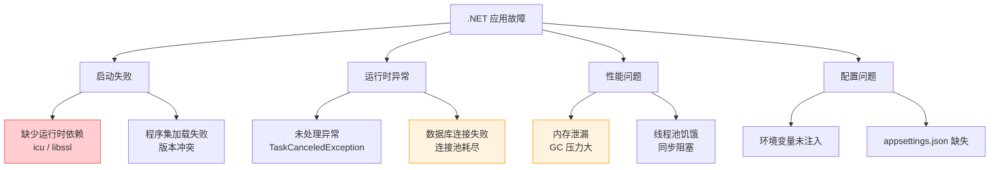

### 9.2 .NET 诊断工具

```bash
# dotnet-counters：实时监控
kubectl exec myapp-xxx -- dotnet-counters monitor -p 1 \
  --counters System.Runtime,Microsoft.AspNetCore.Hosting

# dotnet-dump：内存转储
kubectl exec myapp-xxx -- dotnet-dump collect -p 1 -o /tmp/dump.dmp
kubectl cp myapp-xxx:/tmp/dump.dmp ./dump.dmp

# dotnet-gcdump：GC 堆转储（比 full dump 小得多）
kubectl exec myapp-xxx -- dotnet-gcdump collect -p 1 -o /tmp/gc.dmp
kubectl cp myapp-xxx:/tmp/gc.dmp ./gc.dmp

# dotnet-trace：性能追踪
kubectl exec myapp-xxx -- dotnet-trace collect -p 1 \
  --profile cpu-sampling --duration 00:00:30 -o /tmp/trace.nettrace
kubectl cp myapp-xxx:/tmp/trace.nettrace ./trace.nettrace

# dotnet-sos：调试扩展
dotnet-sos install
```

### 9.3 .NET 常见错误码

| 错误 | 原因 | 解决 |
|------|------|------|
| `Unable to load shared library 'libssl'` | 缺少 SSL 库 | 使用 `mcr.microsoft.com/dotnet/aspnet:8.0` 基础镜像 |
| `Unable to load shared library 'libicuuc'` | 缺少 ICU 库 | 设置 `DOTNET_SYSTEM_GLOBALIZATION_INVARIANT=1` |
| `HttpClient timeout` | 依赖服务不可达 | 检查 Service/DNS，调整 Timeout |
| `Connection pool exhausted` | 数据库连接池耗尽 | 增大连接池，检查连接泄漏 |
| `Thread pool starvation` | 同步阻塞导致线程饥饿 | 改用 async/await，增大线程池 |
| `OutOfMemoryException` | 托管堆内存不足 | 增大 limits，排查内存泄漏 |

```yaml
# .NET 容器推荐环境变量
env:
- name: DOTNET_EnableDiagnostics
  value: "1"                # 启用诊断（默认开启）
- name: DOTNET_gcServer
  value: "0"                # 小容器用 WorkstationGC
- name: DOTNET_SYSTEM_GLOBALIZATION_INVARIANT
  value: "1"                # 不需要全球化时设置（省内存）
- name: ASPNETCORE_URLS
  value: "http://+:8080"    # 监听端口
- name: DOTNET_DiagnosticPorts
  value: "/diag/port"       # 诊断端口（用于 dotnet-monitor）
```

---

## 10. 监控告警配置

### 10.1 关键告警规则

```yaml
# Prometheus 告警规则
groups:
- name: k8s-critical
  rules:
  # Pod 频繁重启
  - alert: PodCrashLooping
    expr: rate(kube_pod_container_status_restarts_total[15m]) * 60 * 5 > 0
    for: 5m
    labels:
      severity: critical
    annotations:
      summary: "Pod {{ $labels.namespace }}/{{ $labels.pod }} is crash looping"
      runbook_url: "https://wiki.internal/runbook/pod-crashloop"

  # 节点 NotReady
  - alert: NodeNotReady
    expr: kube_node_status_condition{condition="Ready",status="true"} == 0
    for: 5m
    labels:
      severity: critical
    annotations:
      summary: "Node {{ $labels.node }} is not ready"

  # etcd Leader 缺失
  - alert: EtcdNoLeader
    expr: etcd_server_has_leader == 0
    for: 1m
    labels:
      severity: critical
    annotations:
      summary: "etcd member {{ $labels.instance }} has no leader"

  # 证书即将过期
  - alert: CertificateExpiringSoon
    expr: probe_ssl_earliest_cert_expiry - time() < 86400 * 30
    for: 1h
    labels:
      severity: warning
    annotations:
      summary: "Certificate for {{ $labels.instance }} expires in less than 30 days"

  # PVC Pending
  - alert: PvcPending
    expr: kube_persistentvolumeclaim_status_phase{phase="Pending"} == 1
    for: 10m
    labels:
      severity: warning
    annotations:
      summary: "PVC {{ $labels.namespace }}/{{ $labels.persistentvolumeclaim }} is pending"

  # 节点磁盘使用率高
  - alert: NodeDiskUsageHigh
    expr: (1 - (node_filesystem_avail_bytes / node_filesystem_size_bytes)) * 100 > 85
    for: 10m
    labels:
      severity: warning
    annotations:
      summary: "Node {{ $labels.instance }} disk usage is above 85%"

  # OOMKilled 事件
  - alert: PodOOMKilled
    expr: kube_pod_container_status_terminated_reason{reason="OOMKilled"} == 1
    for: 1m
    labels:
      severity: critical
    annotations:
      summary: "Pod {{ $labels.namespace }}/{{ $labels.pod }} was OOMKilled"

  # API Server 延迟高
  - alert: APIServerLatencyHigh
    expr: histogram_quantile(0.99, rate(apiserver_request_duration_seconds_bucket[5m])) > 1
    for: 10m
    labels:
      severity: warning
    annotations:
      summary: "API server 99th percentile latency is above 1s"
```

### 10.2 故障预防监控

```yaml
# 预防性告警（P3/P2 级别）
groups:
- name: k8s-preventive
  rules:
  # 镜像拉取失败
  - alert: ImagePullBackOff
    expr: kube_pod_container_status_waiting_reason{reason="ImagePullBackOff"} == 1
    for: 5m
    labels:
      severity: warning

  # 资源请求接近限制
  - alert: PodResourceUsageHigh
    expr: |
      (container_memory_working_set_bytes / container_spec_memory_limit_bytes) > 0.85
      and container_spec_memory_limit_bytes > 0
    for: 15m
    labels:
      severity: warning

  # 节点 CPU 使用率高
  - alert: NodeCPUUsageHigh
    expr: (1 - avg(rate(node_cpu_seconds_total{mode="idle"}[5m]))) * 100 > 80
    for: 10m
    labels:
      severity: warning

  # etcd 数据库大小
  - alert: EtcdDatabaseSizeHigh
    expr: etcd_mvcc_db_total_size_in_bytes > 8 * 1024 * 1024 * 1024
    for: 1h
    labels:
      severity: warning
    annotations:
      summary: "etcd database size exceeds 8GB"
```

---

## 11. 事后复盘模板

### 11.1 Post-Mortem 模板

```markdown
# 故障复盘报告

## 基本信息
- **故障标题**：
- **故障等级**：P0 / P1 / P2 / P3
- **发生时间**：YYYY-MM-DD HH:MM
- **恢复时间**：YYYY-MM-DD HH:MM
- **影响时长**：X 小时 X 分钟
- **影响范围**：
- **值班人员**：
- **复盘时间**：YYYY-MM-DD（故障后 24-72 小时）

## 时间线
| 时间 | 事件 | 操作人 |
|------|------|--------|
| HH:MM | 告警触发 | 系统 |
| HH:MM | 确认故障 | 值班 |
| HH:MM | 通知相关方 | 值班 |
| HH:MM | 执行止血 | 值班 |
| HH:MM | 定位根因 | 值班/开发 |
| HH:MM | 执行修复 | 值班/开发 |
| HH:MM | 验证恢复 | 值班 |
| HH:MM | 服务完全恢复 | 系统 |

## 根因分析
### 直接原因
（导致故障的直接技术原因）

### 根本原因
（导致直接原因的深层问题，通常不是技术层面）

### 5 Whys 分析
1. 为什么服务不可用？→ 因为 Pod 全部 CrashLoopBackOff
2. 为什么 Pod 崩溃？→ 因为数据库连接字符串错误
3. 为什么连接字符串错误？→ 因为 ConfigMap 更新时写错了 key
4. 为什么错误的 ConfigMap 被应用？→ 因为没有 ConfigMap 变更的审核流程
5. 为什么没有审核流程？→ 因为缺乏配置变更管理规范

## 影响评估
- **用户影响**：X 个用户受影响，Y 个请求失败
- **业务影响**：交易损失 X 元
- **数据影响**：无数据丢失 / 有数据需要修复

## 经验教训
### 做对了什么
1. （值得保持的做法）

### 做错了什么
1. （需要改进的做法）

### 改进措施
| 措施 | 负责人 | 截止日期 | 状态 |
|------|--------|----------|------|
| | | | |
```

### 11.2 故障统计与趋势

```bash
# 统计月度故障趋势
# P0/P1 故障数量趋势
# 故障类别分布
# 平均恢复时间（MTTR）
# 根因分布

# 关键指标
MTBF = 总运行时间 / 故障次数     # 平均故障间隔时间
MTTR = 总恢复时间 / 故障次数     # 平均恢复时间
可用性 = (总时间 - 总故障时间) / 总时间 × 100%
```

---

## 12. 故障排查速查手册

### 12.1 kubectl 排查命令速查

```bash
# ===== 查看资源状态 =====
kubectl get nodes                                    # 节点状态
kubectl get pods -A -o wide                         # 所有 Pod（含 IP/Node）
kubectl get pods -A | grep -v Running               # 非 Running 的 Pod
kubectl get events -A --sort-by='.lastTimestamp'    # 最近事件
kubectl top nodes                                    # 节点资源使用
kubectl top pods -A                                  # Pod 资源使用

# ===== Pod 排查 =====
kubectl describe pod <pod>                          # Pod 详情
kubectl logs <pod> -c <container>                   # 当前日志
kubectl logs <pod> --previous                       # 上一次日志
kubectl logs <pod> --since=1h                       # 最近 1 小时日志
kubectl logs <pod> -f                               # 实时日志
kubectl exec <pod> -- <command>                     # 执行命令
kubectl debug <pod> -it --image=busybox             # 临时调试容器

# ===== 网络排查 =====
kubectl get svc,endpoints -A                        # Service 和 Endpoints
kubectl run netshoot --image=nicolaka/netshoot --rm -it -- bash  # 网络调试
kubectl get networkpolicy -A                        # 网络策略
kubectl port-forward svc/myapp 8080:80              # 端口转发调试

# ===== 节点排查 =====
kubectl describe node <node>                        # 节点详情
kubectl cordon <node>                               # 标记不可调度
kubectl drain <node> --ignore-daemonsets            # 排空节点
kubectl uncordon <node>                             # 恢复调度

# ===== 集群排查 =====
kubectl get --raw='/readyz?verbose'                 # 集群健康检查
kubectl get componentstatuses                       # 组件状态（已废弃）
kubectl version -o yaml                             # 版本信息
kubectl cluster-info                                # 集群信息
```

### 12.2 故障码速查表

| 现象 | Exit Code | 含义 | 排查方向 |
|------|-----------|------|----------|
| Completed | 0 | 正常退出 | 检查 command/args（非预期退出） |
| Error | 1 | 一般错误 | `kubectl logs` 查看错误信息 |
| Error | 2 | 误用命令 | 检查启动命令参数 |
| OOMKilled | 137 | 内存超限 | 增大 limits / 排查内存泄漏 |
| Error | 126 | 权限不足 | 检查文件执行权限 |
| Error | 127 | 命令不存在 | 检查镜像内命令路径 |
| Error | 130 | SIGINT (Ctrl+C) | 不常见，检查信号处理 |
| Error | 137 | SIGKILL | OOM 或手动 kill |
| Error | 143 | SIGTERM | 正常终止信号 |
| ContainerCannotRun | - | 运行时错误 | 检查镜像/依赖/权限 |

---

## 13. 总结

| 故障类型 | 核心排查思路 | 关键命令 |
|----------|-------------|----------|
| **Pod 启动失败** | 看状态 → 看事件 → 看日志 | `describe pod` + `logs --previous` |
| **Node NotReady** | SSH → Kubelet → 容器运行时 | `systemctl status kubelet` |
| **网络故障** | DNS → Service → CNI → 抓包 | `nslookup` + `endpoints` + `tcpdump` |
| **存储故障** | PVC → PV → CSI → 后端 | `describe pvc` + CSI 日志 |
| **控制面故障** | API Server → etcd → Scheduler | `etcdctl endpoint health` |
| **证书过期** | 检查到期时间 → 续期 → 重启 | `kubeadm certs check-expiration` |
| **OOMKilled** | 内存使用 → GC 配置 → limits | `top pod` + `dotnet-counters` |

::: important 故障排查铁律
1. **止血优先**：先恢复服务，再定位根因。回滚、扩容、降级都是合理的止血手段
2. **不要猜测**：用数据说话——日志、指标、事件，而不是"我觉得是..."
3. **变更优先排查**：80% 的故障由变更引起，先查最近的 Deployment、ConfigMap、Secret 变更
4. **保留现场**：修复前先收集日志、Event、资源状态，方便事后复盘
5. **单变量操作**：一次只改一个东西，改完观察，不要同时做多个操作
6. **及时升级**：15 分钟内无法解决，立即通知上级和相关团队
7. **每起故障必复盘**：不留隐患，改进措施必须闭环跟踪
:::
