# Helm 包管理

## Helm 概述

Helm 是 Kubernetes 的官方包管理器，被誉为 "Kubernetes 的 apt/yum"。它将 Kubernetes 资源定义模板化，通过 Chart 的形式实现应用的一键部署、升级和回滚，极大地简化了复杂应用在 Kubernetes 上的生命周期管理。

::: tip 为什么需要 Helm？
一个典型的微服务应用可能包含 Deployment、Service、ConfigMap、Secret、Ingress 等数十个 YAML 文件。手动管理这些文件不仅繁琐，而且容易出错。Helm 通过模板化和参数化，让你用一套 Chart + 不同的 values 就能管理多个环境的部署。
:::

### Helm 版本演进

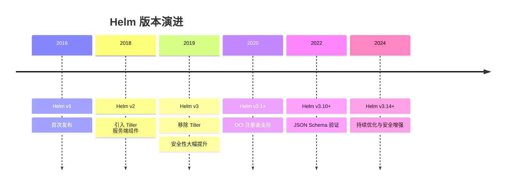

### Helm v2 vs v3 架构对比

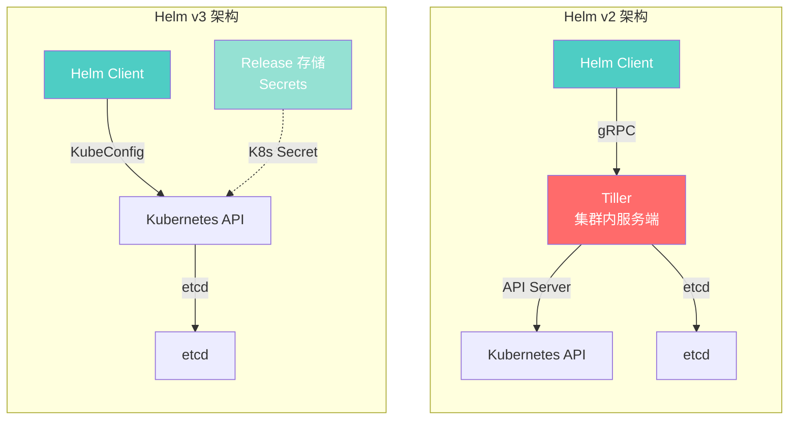

::: important Helm v3 的核心改进
1. **移除 Tiller**：v3 不再需要集群内的 Tiller 组件，直接通过 KubeConfig 与 API Server 交互，权限模型与 kubectl 一致
2. **Release 存储变更**：从 ConfigMap 迁移到 Secret，默认加密存储更安全
3. **三方合并策略**：升级时采用三方合并（旧 values + 旧 chart + 新 values），替代 v2 的双方合并
4. **OCI 注册表支持**：可以将 Chart 推送到 OCI 兼容的镜像仓库
:::

---

## Helm 架构详解

### Helm v3 核心组件

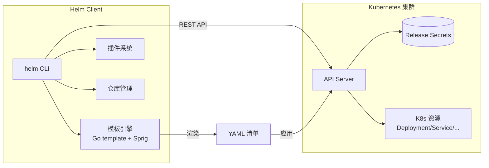

### Helm 渲染流程

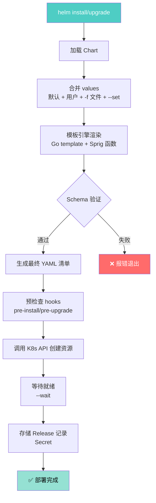

### Release 生命周期

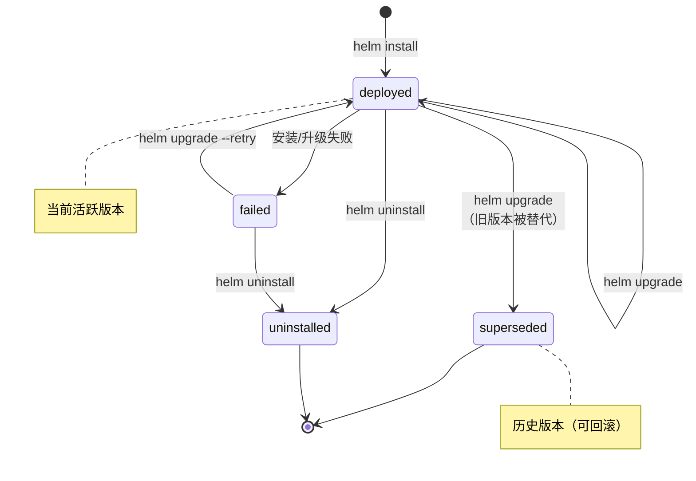

---

## Chart 目录结构

Chart 是 Helm 的核心打包格式，一个标准的 Chart 目录结构如下：

```
myapp/
├── Chart.yaml              # Chart 元数据（名称、版本、依赖等）
├── Chart.lock              # 依赖锁定文件（类似 package-lock.json）
├── values.yaml             # 默认配置值
├── values.schema.json      # values JSON Schema 验证
├── .helmignore             # 打包时忽略的文件
├── templates/              # 模板目录
│   ├── _helpers.tpl        # 模板辅助函数（命名模板）
│   ├── deployment.yaml     # Deployment 模板
│   ├── service.yaml        # Service 模板
│   ├── ingress.yaml        # Ingress 模板
│   ├── configmap.yaml      # ConfigMap 模板
│   ├── secret.yaml         # Secret 模板
│   ├── hpa.yaml            # HorizontalPodAutoscaler 模板
│   ├── servicemonitor.yaml # ServiceMonitor 模板
│   ├── NOTES.txt           # 安装后提示信息
│   └── tests/              # Chart 测试
│       └── test-connection.yaml
├── templates/partials/     # 局部模板（可选）
├── charts/                 # 依赖的子 Chart
│   ├── redis/
│   └── postgresql/
├── crds/                   # 自定义资源定义（CRD）
│   └── mycrd.yaml
└── files/                  # 静态文件（可选）
    └── config.ini
```

### Chart.yaml 详解

```yaml
apiVersion: v2  # Helm v3 使用 v2
name: myapp     # Chart 名称（必需）
description: A .NET application Helm chart  # 描述
type: application  # application 或 library
version: 1.0.0     # Chart 版本（SemVer 2，必需）
appVersion: "8.0"  # 应用版本（非 Chart 版本）
kubeVersion: ">=1.24.0-0"  # 兼容的 K8s 版本范围
icon: https://example.com/logo.png  # 图标 URL
deprecated: false   # 是否已弃用
home: https://example.com  # 项目主页
keywords:            # 关键词
  - dotnet
  - web
  - microservice
maintainers:         # 维护者
  - name: team-dev
    email: dev@example.com
    url: https://example.com
sources:             # 源码地址
  - https://github.com/example/myapp
dependencies:        # 依赖
  - name: redis
    version: "18.0.0"
    repository: "https://charts.bitnami.com/bitnami"
    condition: redis.enabled  # 条件启用
    alias: redis              # 别名
  - name: postgresql
    version: "13.0.0"
    repository: "https://charts.bitnami.com/bitnami"
    condition: postgresql.enabled
```

::: warning version vs appVersion
- `version`：Chart 自身的版本，每次修改 Chart 必须递增，遵循 SemVer 2 规范
- `appVersion`：包含的应用版本，仅作信息展示，Helm 不用它做版本计算
- `type: library`：库 Chart 不能独立部署，只能被其他 Chart 作为依赖引用
:::

---

## values.yaml 与模板引擎

### values.yaml 配置体系

values.yaml 是 Helm Chart 的配置核心，所有可变参数集中在此定义：

```yaml
# values.yaml - .NET 应用示例
replicaCount: 3

image:
  repository: myregistry.azurecr.io/myapp
  pullPolicy: IfNotPresent
  tag: "8.0.1"

imagePullSecrets:
  - name: acr-secret

nameOverride: ""
fullnameOverride: ""

serviceAccount:
  create: true
  name: ""
  annotations:
    azure.workload.identity/client-id: "xxx"

podAnnotations: {}
podLabels: {}

podSecurityContext:
  runAsNonRoot: true
  runAsUser: 1000
  fsGroup: 2000

securityContext:
  allowPrivilegeEscalation: false
  readOnlyRootFilesystem: true
  capabilities:
    drop:
      - ALL

service:
  type: ClusterIP
  port: 80
  targetPort: 8080

ingress:
  enabled: true
  className: nginx
  annotations:
    cert-manager.io/cluster-issuer: letsencrypt-prod
    nginx.ingress.kubernetes.io/rate-limit: "100"
  hosts:
    - host: myapp.example.com
      paths:
        - path: /
          pathType: Prefix
  tls:
    - secretName: myapp-tls
      hosts:
        - myapp.example.com

resources:
  requests:
    cpu: 250m
    memory: 256Mi
  limits:
    cpu: "1"
    memory: 512Mi

autoscaling:
  enabled: true
  minReplicas: 3
  maxReplicas: 10
  targetCPUUtilizationPercentage: 80
  targetMemoryUtilizationPercentage: 80

env:
  ASPNETCORE_ENVIRONMENT: Production
  ASPNETCORE_URLS: "http://+:8080"
  Logging__Console__Formatter: Json

envFrom:
  - configMapRef:
      name: myapp-config
  - secretRef:
      name: myapp-secrets

configMap:
  data:
    appsettings.json: |
      {
        "Logging": {
          "LogLevel": {
            "Default": "Information"
          }
        },
        "ConnectionStrings": {
          "Redis": "redis-master:6379"
        }
      }

volumes:
  - name: tmp
    emptyDir: {}

volumeMounts:
  - name: tmp
    mountPath: /tmp

nodeSelector: {}

tolerations: []

affinity:
  podAntiAffinity:
    preferredDuringSchedulingIgnoredDuringExecution:
      - weight: 100
        podAffinityTerm:
          labelSelector:
            matchExpressions:
              - key: app.kubernetes.io/name
                operator: In
                values:
                  - myapp
          topologyKey: kubernetes.io/hostname

# 子 Chart 配置
redis:
  enabled: true
  auth:
    enabled: true
    password: ""
  master:
    persistence:
      enabled: true
      size: 8Gi

postgresql:
  enabled: false
```

### Values 优先级

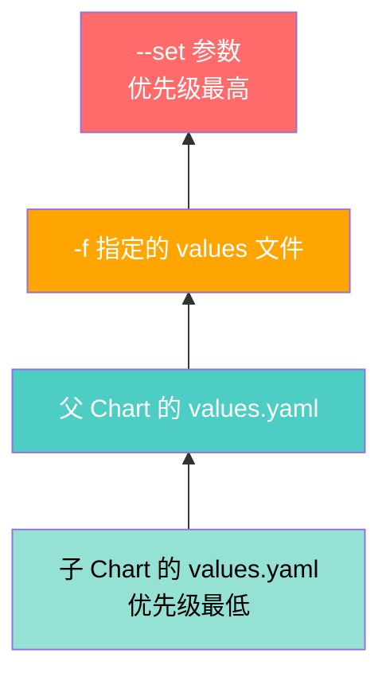

::: important Values 合并规则
1. 父 Chart 的 values 会覆盖子 Chart 的默认 values
2. `-f` 文件可叠加多个，后加载的覆盖先加载的
3. `--set` 优先级最高，会覆盖所有文件中的值
4. 数组类型是替换而非合并；对象类型是深度合并
5. `--set` 语法：`--set image.tag=v2.0`、`--set env[0].name=KEY`
:::

---

## 内置函数与管道

Helm 模板引擎基于 Go template 并扩展了 Sprig 函数库，提供了丰富的内置函数。

### 常用内置函数

```yaml
# templates/deployment.yaml
apiVersion: apps/v1
kind: Deployment
metadata:
  name: {{ include "myapp.fullname" . }}
  namespace: {{ .Release.Namespace | default "default" }}
  labels:
    {{- include "myapp.labels" . | nindent 4 }}
  annotations:
    # 时间戳函数
    deploy-time: {{ now | date "2006-01-02 15:04:05" }}
    # SHA256 校验（ConfigMap 变更时触发滚动更新）
    checksum/config: {{ include (print $.Template.BasePath "/configmap.yaml") . | sha256sum }}
spec:
  replicas: {{ .Values.replicaCount }}
  selector:
    matchLabels:
      {{- include "myapp.selectorLabels" . | nindent 6 }}
  template:
    metadata:
      labels:
        {{- include "myapp.selectorLabels" . | nindent 8 }}
        {{- with .Values.podLabels }}
        {{- toYaml . | nindent 8 }}
        {{- end }}
      annotations:
        {{- with .Values.podAnnotations }}
        {{- toYaml . | nindent 8 }}
        {{- end }}
    spec:
      # 默认值函数
      {{- with .Values.imagePullSecrets }}
      imagePullSecrets:
        {{- toYaml . | nindent 8 }}
      {{- end }}
      serviceAccountName: {{ .Values.serviceAccount.name | default (include "myapp.fullname" .) }}
      securityContext:
        {{- toYaml .Values.podSecurityContext | nindent 8 }}
      containers:
        - name: {{ .Chart.Name }}
          securityContext:
            {{- toYaml .Values.securityContext | nindent 12 }}
          image: "{{ .Values.image.repository }}:{{ .Values.image.tag | default .Chart.AppVersion }}"
          imagePullPolicy: {{ .Values.image.pullPolicy }}
          ports:
            - name: http
              containerPort: {{ .Values.service.targetPort }}
              protocol: TCP
          env:
            # 列表渲染
            {{- range $key, $value := .Values.env }}
            - name: {{ $key }}
              value: {{ $value | quote }}
            {{- end }}
            # 从 ConfigMap 和 Secret 引用
            {{- range .Values.envFrom }}
            envFrom:
              {{- toYaml . | nindent 12 }}
            {{- end }}
          livenessProbe:
            httpGet:
              path: /healthz
              port: http
            initialDelaySeconds: {{ .Values.livenessProbe.initialDelaySeconds | default 30 }}
            periodSeconds: {{ .Values.livenessProbe.periodSeconds | default 10 }}
          readinessProbe:
            httpGet:
              path: /ready
              port: http
            initialDelaySeconds: {{ .Values.readinessProbe.initialDelaySeconds | default 5 }}
            periodSeconds: {{ .Values.readinessProbe.periodSeconds | default 5 }}
          resources:
            {{- toYaml .Values.resources | nindent 12 }}
          volumeMounts:
            {{- range .Values.volumeMounts }}
            - name: {{ .name }}
              mountPath: {{ .mountPath }}
            {{- end }}
      volumes:
        {{- range .Values.volumes }}
        - name: {{ .name }}
          {{- if .emptyDir }}
          emptyDir: {}
          {{- else if .persistentVolumeClaim }}
          persistentVolumeClaim:
            claimName: {{ .persistentVolumeClaim.claimName }}
          {{- end }}
        {{- end }}
      {{- with .Values.nodeSelector }}
      nodeSelector:
        {{- toYaml . | nindent 8 }}
      {{- end }}
      {{- with .Values.affinity }}
      affinity:
        {{- toYaml . | nindent 8 }}
      {{- end }}
      {{- with .Values.tolerations }}
      tolerations:
        {{- toYaml . | nindent 8 }}
      {{- end }}
```

### 辅助模板（_helpers.tpl）

```yaml
{{/*
应用全名：release名-chart名
*/}}
{{- define "myapp.fullname" -}}
{{- if .Values.fullnameOverride }}
{{- .Values.fullnameOverride | trunc 63 | trimSuffix "-" }}
{{- else if .Values.nameOverride }}
{{- .Values.nameOverride | trunc 63 | trimSuffix "-" }}
{{- else }}
{{- .Release.Name | trunc 63 | trimSuffix "-" }}
{{- end }}
{{- end }}

{{/*
通用标签
*/}}
{{- define "myapp.labels" -}}
helm.sh/chart: {{ printf "%s-%s" .Chart.Name .Chart.Version | replace "+" "_" | trunc 63 | trimSuffix "-" }}
{{ include "myapp.selectorLabels" . }}
{{- if .Chart.AppVersion }}
app.kubernetes.io/version: {{ .Chart.AppVersion | quote }}
{{- end }}
app.kubernetes.io/managed-by: {{ .Release.Service }}
{{- end }}

{{/*
选择器标签（用于 matchLabels，不可变更）
*/}}
{{- define "myapp.selectorLabels" -}}
app.kubernetes.io/name: {{ .Chart.Name }}
app.kubernetes.io/instance: {{ .Release.Name }}
{{- end }}

{{/*
ServiceAccount 名称
*/}}
{{- define "myapp.serviceAccountName" -}}
{{- if .Values.serviceAccount.create }}
{{- .Values.serviceAccount.name | default (include "myapp.fullname" .) }}
{{- else }}
{{- .Values.serviceAccount.name | default "default" }}
{{- end }}
{{- end }}

{{/*
资源名称辅助（用于同一 Chart 多实例场景）
*/}}
{{- define "myapp.resourceName" -}}
{{- include "myapp.fullname" . -}}-{{ .Component | default "main" }}
{{- end }}
```

### Sprig 函数速查

| 分类 | 函数 | 示例 |
|------|------|------|
| **字符串** | `upper`, `lower`, `trim`, `replace`, `trunc` | `{{ .Values.name \| upper }}` |
| **日期** | `now`, `date`, `dateInZone` | `{{ now \| date "2006-01-02" }}` |
| **编码** | `b64enc`, `b64dec`, `quote`, `squote` | `{{ .Values.password \| b64enc }}` |
| **默认值** | `default`, `coalesce`, `empty` | `{{ .Values.port \| default 8080 }}` |
| **列表** | `list`, `first`, `last`, `uniq`, `append` | `{{ list 1 2 3 \| first }}` |
| **字典** | `dict`, `get`, `set`, `keys`, `values` | `{{ get (dict "a" 1) "a" }}` |
| **类型** | `kindOf`, `typeOf`, `toString` | `{{ kindOf .Values.port }}` |
| **加密** | `sha256sum`, `htpasswd`, `derivePassword` | `{{ .Values.data \| sha256sum }}` |
| **正则** | `regexMatch`, `regexReplaceAll` | `{{ regexMatch "^[a-z]+$" .Values.name }}` |
| **路径** | `base`, `dir`, `ext`, `clean` | `{{ "/a/b/c.txt" \| base }}` → c.txt |

---

## 条件与循环

### 条件渲染

```yaml
# Ingress 条件渲染
{{- if .Values.ingress.enabled -}}
apiVersion: networking.k8s.io/v1
kind: Ingress
metadata:
  name: {{ include "myapp.fullname" . }}
  namespace: {{ .Release.Namespace }}
  {{- with .Values.ingress.annotations }}
  annotations:
    {{- toYaml . | nindent 4 }}
  {{- end }}
spec:
  {{- if .Values.ingress.className }}
  ingressClassName: {{ .Values.ingress.className | quote }}
  {{- end }}
  {{- if .Values.ingress.tls }}
  tls:
    {{- range .Values.ingress.tls }}
    - hosts:
        {{- range .hosts }}
        - {{ . | quote }}
        {{- end }}
      secretName: {{ .secretName }}
    {{- end }}
  {{- end }}
  rules:
    {{- range .Values.ingress.hosts }}
    - host: {{ .host | quote }}
      http:
        paths:
          {{- range .paths }}
          - path: {{ .path }}
            pathType: {{ .pathType }}
            backend:
              service:
                name: {{ include "myapp.fullname" $ }}
                port:
                  number: {{ $.Values.service.port }}
          {{- end }}
    {{- end }}
{{- end }}
```

### 循环渲染

```yaml
# 多端口 Service
apiVersion: v1
kind: Service
metadata:
  name: {{ include "myapp.fullname" . }}
  namespace: {{ .Release.Namespace }}
  labels:
    {{- include "myapp.labels" . | nindent 4 }}
spec:
  type: {{ .Values.service.type }}
  {{- if and (eq .Values.service.type "LoadBalancer") .Values.service.loadBalancerIP }}
  loadBalancerIP: {{ .Values.service.loadBalancerIP }}
  {{- end }}
  ports:
    {{- range .Values.service.ports }}
    - port: {{ .port }}
      targetPort: {{ .targetPort }}
      protocol: {{ .protocol | default "TCP" }}
      name: {{ .name }}
    {{- end }}
  selector:
    {{- include "myapp.selectorLabels" . | nindent 4 }}
```

对应的 values：

```yaml
service:
  type: ClusterIP
  ports:
    - name: http
      port: 80
      targetPort: 8080
    - name: grpc
      port: 50051
      targetPort: 50051
    - name: metrics
      port: 9090
      targetPort: 9090
```

### 高级条件逻辑

```yaml
# 使用 eq/ne/and/or/not 进行复杂条件判断
{{- if and .Values.autoscaling.enabled (or (gt .Values.autoscaling.maxReplicas 1) (gt .Values.autoscaling.minReplicas 1)) }}
apiVersion: autoscaling/v2
kind: HorizontalPodAutoscaler
metadata:
  name: {{ include "myapp.fullname" . }}
spec:
  scaleTargetRef:
    apiVersion: apps/v1
    kind: Deployment
    name: {{ include "myapp.fullname" . }}
  minReplicas: {{ .Values.autoscaling.minReplicas }}
  maxReplicas: {{ .Values.autoscaling.maxReplicas }}
  metrics:
    {{- if .Values.autoscaling.targetCPUUtilizationPercentage }}
    - type: Resource
      resource:
        name: cpu
        target:
          type: Utilization
          averageUtilization: {{ .Values.autoscaling.targetCPUUtilizationPercentage }}
    {{- end }}
    {{- if .Values.autoscaling.targetMemoryUtilizationPercentage }}
    - type: Resource
      resource:
        name: memory
        target:
          type: Utilization
          averageUtilization: {{ .Values.autoscaling.targetMemoryUtilizationPercentage }}
    {{- end }}
{{- end }}
```

---

## 子 Chart 与依赖

### 依赖管理

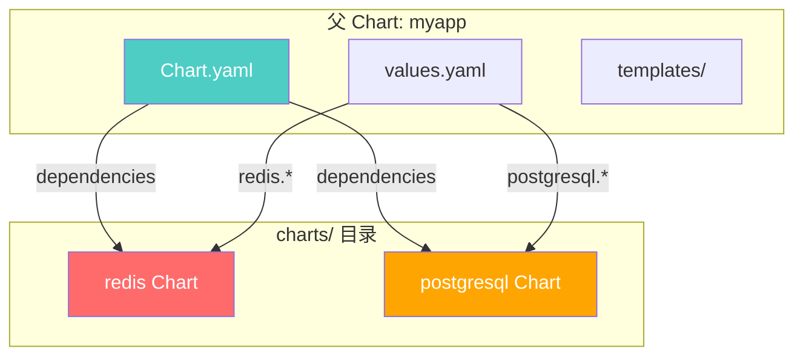

### 依赖声明（Chart.yaml）

```yaml
# Chart.yaml
dependencies:
  # 条件依赖：仅在启用时部署
  - name: redis
    version: "18.0.0"
    repository: "https://charts.bitnami.com/bitnami"
    condition: redis.enabled
    alias: redis

  # 多个同类型依赖使用 alias 区分
  - name: redis
    version: "18.0.0"
    repository: "https://charts.bitnami.com/bitnami"
    condition: redis-session.enabled
    alias: redis-session

  # 标签分组依赖
  - name: postgresql
    version: "13.0.0"
    repository: "https://charts.bitnami.com/bitnami"
    condition: postgresql.enabled
    tags:
      - database

  - name: elasticsearch
    version: "19.0.0"
    repository: "https://charts.bitnami.com/bitnami"
    condition: elasticsearch.enabled
    tags:
      - database
      - search

  # 仅在特定环境下部署
  - name: oauth2-proxy
    version: "6.0.0"
    repository: "https://oauth2-proxy.github.io/manifests"
    condition: oauth2Proxy.enabled
    tags:
      - auth
```

### 依赖管理命令

```bash
# 更新依赖（下载到 charts/ 目录）
helm dependency update myapp/

# 构建依赖（从 Chart.lock 重建）
helm dependency build myapp/

# 列出依赖
helm dependency list myapp/

# 使用标签控制依赖
helm install myapp ./myapp --set database.enabled=false
helm install myapp ./myapp --set tags.database=false
```

### 子 Chart 作用域

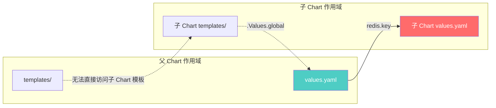

::: important 子 Chart 作用域规则
1. **父 → 子**：父 Chart 的 values 中以子 Chart 名为前缀的值会传递给子 Chart
2. **子 ≠ 父**：子 Chart 无法直接访问父 Chart 的模板
3. **global 命名空间**：`.Values.global` 在父子 Chart 中都可访问
4. **子 Chart 独立**：子 Chart 有自己独立的 `.Release`、`.Chart` 等内置对象
:::

### Global Values

```yaml
# 父 Chart values.yaml
global:
  imageRegistry: myregistry.azurecr.io
  imagePullSecrets:
    - name: acr-secret
  storageClass: premium-ssd
  environment: production

# 子 Chart 可通过 .Values.global.imageRegistry 访问
# 在子 Chart 模板中使用：
# image: "{{ .Values.global.imageRegistry }}/{{ .Values.image.repository }}:{{ .Values.image.tag }}"
```

---

## Chart 开发最佳实践

### 命名规范

```yaml
# ✅ 好的命名
{{ include "myapp.fullname" . }}          # 资源名称
app.kubernetes.io/name: {{ .Chart.Name }} # 标签
helm.sh/chart: {{ .Chart.Name }}-{{ .Chart.Version }} # Chart 标签

# ❌ 避免硬编码
myapp-deployment  # 不要硬编码 release 名
```

### 标签规范

```yaml
# 遵循 Kubernetes 推荐标签
labels:
  app.kubernetes.io/name: {{ .Chart.Name }}
  app.kubernetes.io/instance: {{ .Release.Name }}
  app.kubernetes.io/version: {{ .Chart.AppVersion | quote }}
  app.kubernetes.io/managed-by: {{ .Release.Service }}
  helm.sh/chart: {{ printf "%s-%s" .Chart.Name .Chart.Version | replace "+" "_" }}
```

### 模板组织

```
templates/
├── _helpers.tpl           # 所有命名模板
├── deployment.yaml        # 主 Deployment
├── service.yaml           # Service
├── ingress.yaml           # Ingress（条件渲染）
├── configmap.yaml         # ConfigMap
├── secret.yaml            # Secret
├── hpa.yaml               # HPA（条件渲染）
├── serviceaccount.yaml    # ServiceAccount（条件渲染）
├── networkpolicy.yaml     # NetworkPolicy（条件渲染）
├── poddisruptionbudget.yaml # PDB（条件渲染）
├── servicemonitor.yaml    # ServiceMonitor（条件渲染）
├── prometheusrule.yaml    # PrometheusRule（条件渲染）
└── tests/
    └── test-connection.yaml
```

### values.yaml 设计原则

```yaml
# ✅ 结构化、语义化的 values
service:
  type: ClusterIP
  port: 80
  targetPort: 8080

# ❌ 扁平、容易冲突的 values
serviceType: ClusterIP
servicePort: 80
serviceTargetPort: 8080

# ✅ 提供合理的默认值
resources:
  requests:
    cpu: 250m
    memory: 256Mi
  limits:
    cpu: "1"
    memory: 512Mi

# ✅ 使用 enabled 开关控制可选功能
ingress:
  enabled: false   # 默认关闭

autoscaling:
  enabled: false   # 默认关闭

# ✅ 敏感信息不要写在 values.yaml
# 使用 --set 或外部 Secret 管理
# database:
#   password: ""  # 留空，通过 --set 传入
```

### JSON Schema 验证

```json
{
  "$schema": "https://json-schema.org/draft-07/schema#",
  "title": "MyApp Chart Values Schema",
  "type": "object",
  "properties": {
    "replicaCount": {
      "type": "integer",
      "minimum": 1,
      "maximum": 100,
      "description": "Number of replicas"
    },
    "image": {
      "type": "object",
      "required": ["repository"],
      "properties": {
        "repository": {
          "type": "string",
          "pattern": "^[a-z0-9][a-z0-9./-]*$"
        },
        "pullPolicy": {
          "type": "string",
          "enum": ["Always", "IfNotPresent", "Never"]
        },
        "tag": {
          "type": "string"
        }
      }
    },
    "service": {
      "type": "object",
      "properties": {
        "type": {
          "type": "string",
          "enum": ["ClusterIP", "NodePort", "LoadBalancer", "ExternalName"]
        },
        "port": {
          "type": "integer",
          "minimum": 1,
          "maximum": 65535
        }
      }
    },
    "resources": {
      "type": "object",
      "properties": {
        "requests": {
          "type": "object",
          "properties": {
            "cpu": {
              "type": "string",
              "pattern": "^[0-9]+m?$"
            },
            "memory": {
              "type": "string",
              "pattern": "^[0-9]+(Ki|Mi|Gi|Ti)$"
            }
          }
        }
      }
    }
  }
}
```

::: tip Schema 验证的好处
1. **安装前校验**：`helm install` 前自动检查 values 类型与范围
2. **文档化**：Schema 本身就是 values 的类型文档
3. **IDE 支持**：编辑 values.yaml 时可自动补全和校验
4. **CI/CD 集成**：在流水线中自动验证 Chart 配置
:::

---

## Chart 测试

### Helm Test 概述

Helm Test 是 Chart 内置的测试框架，通过定义 Pod 来验证部署是否正确。

```yaml
# templates/tests/test-connection.yaml
apiVersion: v1
kind: Pod
metadata:
  name: "{{ include "myapp.fullname" . }}-test-connection"
  labels:
    {{- include "myapp.labels" . | nindent 4 }}
  annotations:
    "helm.sh/hook": test
    "helm.sh/hook-delete-policy": before-hook-creation,hook-succeeded
spec:
  containers:
    - name: wget
      image: busybox:1.36
      command: ['wget']
      args: ['--spider', '-q', '{{ include "myapp.fullname" . }}:{{ .Values.service.port }}/healthz']
  restartPolicy: Never
```

```yaml
# templates/tests/test-api.yaml
apiVersion: v1
kind: Pod
metadata:
  name: "{{ include "myapp.fullname" . }}-test-api"
  labels:
    {{- include "myapp.labels" . | nindent 4 }}
  annotations:
    "helm.sh/hook": test
    "helm.sh/hook-delete-policy": before-hook-creation,hook-succeeded
spec:
  containers:
    - name: curl
      image: curlimages/curl:8.4.0
      command:
        - /bin/sh
        - -c
        - |
          echo "Testing API endpoints..."
          HTTP_CODE=$(curl -s -o /dev/null -w "%{http_code}" http://{{ include "myapp.fullname" . }}:{{ .Values.service.port }}/api/health)
          if [ "$HTTP_CODE" -ne 200 ]; then
            echo "❌ Health check failed with HTTP $HTTP_CODE"
            exit 1
          fi
          echo "✅ Health check passed"
          VERSION=$(curl -s http://{{ include "myapp.fullname" . }}:{{ .Values.service.port }}/api/version)
          echo "App version: $VERSION"
  restartPolicy: Never
```

### 运行测试

```bash
# 运行所有测试
helm test myapp-release

# 详细输出
helm test myapp-release --logs

# 指定超时
helm test myapp-release --timeout 5m
```

### 测试最佳实践

1. **测试 Pod 必须标注** `helm.sh/hook: test`
2. **设置删除策略**：`before-hook-creation,hook-succeeded` 避免残留
3. **测试覆盖**：健康检查、API 可达性、数据库连接、配置正确性
4. **幂等性**：测试可重复执行，不产生副作用
5. **超时设置**：给测试 Pod 足够时间完成

---

## 私有仓库

### ChartMuseum

ChartMuseum 是一个开源的 Helm Chart 仓库服务器：

```bash
# 安装 ChartMuseum
helm repo add chartmuseum https://chartmuseum.github.io/charts
helm install chartmuseum chartmuseum/chartmuseum \
  --namespace chartmuseum \
  --create-namespace \
  --set env.open.STORAGE=amazon \
  --set env.open.STORAGE_AMAZON_BUCKET=my-charts-bucket \
  --set env.open.STORAGE_AMAZON_PREFIX=charts \
  --set env.open.STORAGE_AMAZON_REGION=us-east-1
```

```bash
# 推送 Chart 到 ChartMuseum
# 安装 helm-push 插件
helm plugin install https://github.com/chartmuseum/helm-push

# 推送
helm push myapp-1.0.0.tgz chartmuseum

# 从 ChartMuseum 安装
helm repo add my-repo https://chartmuseum.example.com
helm repo update
helm install myapp my-repo/myapp
```

### Harbor

Harbor 是企业级容器镜像仓库，同时支持 Helm Chart 托管：

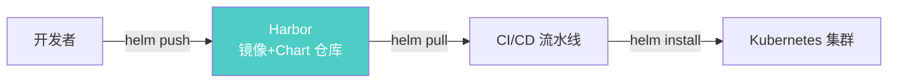

```bash
# Harbor 作为 Helm 仓库
helm repo add harbor https://harbor.example.com/chartrepo/myproject \
  --username admin \
  --password Harbor12345

# 使用 OCI 协议推送（推荐）
helm push myapp-1.0.0.tgz oci://harbor.example.com/myproject/charts

# 从 OCI 仓库安装
helm install myapp oci://harbor.example.com/myproject/charts/myapp \
  --version 1.0.0
```

### OCI 注册表

Helm v3.8+ 正式支持 OCI（Open Container Initiative）注册表：

```bash
# 登录 OCI 注册表
helm registry login myregistry.azurecr.io \
  --username $ACR_USERNAME \
  --password $ACR_PASSWORD

# 打包并推送
helm package myapp/
helm push myapp-1.0.0.tgz oci://myregistry.azurecr.io/charts

# 从 OCI 安装
helm install myapp oci://myregistry.azurecr.io/charts/myapp \
  --version 1.0.0

# 拉取 Chart
helm pull oci://myregistry.azurecr.io/charts/myapp --version 1.0.0

# 列出标签
helm show all oci://myregistry.azurecr.io/charts/myapp --version 1.0.0
```

::: important OCI vs 传统 Chart 仓库
| 特性 | 传统仓库（ChartMuseum） | OCI 注册表 |
|------|------------------------|-----------|
| 协议 | 自定义 HTTP API | OCI Distribution Spec |
| 认证 | Basic Auth / Token | Docker 登录兼容 |
| 镜像仓库 | 不支持 | 共用镜像仓库 |
| 签名 | Cosign（手动） | Cosign（原生） |
| 缓存 | 需要额外配置 | 镜像仓库缓存 |
| 成熟度 | 成熟 | Helm 3.8+ 稳定支持 |
:::

---

## Helm Release 管理

### 基础操作

```bash
# 安装
helm install myapp ./myapp \
  --namespace production \
  --create-namespace \
  -f values-prod.yaml \
  --set image.tag=v2.0.1 \
  --wait --timeout 5m

# 升级（如果已存在则升级，不存在则安装）
helm upgrade myapp ./myapp \
  --namespace production \
  -f values-prod.yaml \
  --set image.tag=v2.0.2 \
  --wait

# 安装或升级（推荐）
helm upgrade --install myapp ./myapp \
  --namespace production \
  -f values-prod.yaml

# 回滚
helm rollback myapp 1  # 回滚到版本 1
helm rollback myapp     # 回滚到上一版本

# 卸载
helm uninstall myapp --namespace production

# 查看 Release 列表
helm list --all-namespaces

# 查看 Release 状态
helm status myapp --namespace production

# 查看 Release 历史
helm history myapp --namespace production

# 查看 Release 的 values
helm get values myapp --namespace production
helm get values myapp --namespace production --all  # 包含默认值

# 查看 Release 的 manifest
helm get manifest myapp --namespace production

# 查看 Release 的 notes
helm get notes myapp --namespace production
```

### Release 管理工作流

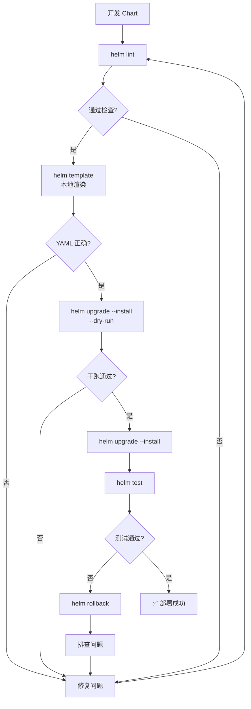

### 多环境管理

```bash
# 目录结构
myapp/
├── values.yaml            # 基础配置
├── values-dev.yaml        # 开发环境覆盖
├── values-staging.yaml    # 预发布环境覆盖
└── values-prod.yaml       # 生产环境覆盖
```

```yaml
# values-dev.yaml
replicaCount: 1
image:
  tag: latest
resources:
  requests:
    cpu: 100m
    memory: 128Mi
  limits:
    cpu: 500m
    memory: 256Mi
ingress:
  enabled: true
  hosts:
    - host: myapp-dev.example.com

# values-staging.yaml
replicaCount: 2
image:
  tag: v2.0.0-rc.1
resources:
  requests:
    cpu: 250m
    memory: 256Mi
ingress:
  enabled: true
  hosts:
    - host: myapp-staging.example.com

# values-prod.yaml
replicaCount: 3
image:
  tag: v2.0.0
  pullPolicy: Always
resources:
  requests:
    cpu: 250m
    memory: 256Mi
  limits:
    cpu: "1"
    memory: 512Mi
autoscaling:
  enabled: true
  minReplicas: 3
  maxReplicas: 10
ingress:
  enabled: true
  annotations:
    cert-manager.io/cluster-issuer: letsencrypt-prod
  hosts:
    - host: myapp.example.com
  tls:
    - secretName: myapp-tls
      hosts:
        - myapp.example.com
```

```bash
# 部署到不同环境
helm upgrade --install myapp ./myapp -f values-dev.yaml --namespace dev
helm upgrade --install myapp ./myapp -f values-staging.yaml --namespace staging
helm upgrade --install myapp ./myapp -f values-prod.yaml --namespace production
```

---

## Helm 插件

### 常用插件

```bash
# Helm Diff - 查看升级差异（强烈推荐）
helm plugin install https://github.com/databus23/helm-diff
helm diff upgrade myapp ./myapp -f values-prod.yaml

# Helm Secrets - 加密 values 管理
helm plugin install https://github.com/jkroepke/helm-secrets
helm secrets enc values-prod.yaml    # 加密
helm secrets view values-prod.yaml   # 查看
helm secrets upgrade --install myapp ./myapp -f values-prod.yaml  # 自动解密

# Helm Push - 推送 Chart 到 ChartMuseum
helm plugin install https://github.com/chartmuseum/helm-push

# Helm Git - 从 Git 仓库安装 Chart
helm plugin install https://github.com/aslafy-z/helm-git
helm install myapp git+https://github.com/example/charts@myapp?ref=v1.0.0

# Helm Mapkubeapis - 升级已弃用的 API 版本
helm plugin install https://github.com/helm/helm-mapkubeapis
helm mapkubeapis myapp --namespace production
```

### Helm Diff 实战

```bash
# 查看升级差异
helm diff upgrade myapp ./myapp -f values-prod.yaml

# 输出示例：
# default, myapp Deployment (apps) has changed:
#   spec:
#     template:
#       spec:
#         containers:
#           - image: myapp:v2.0.0  # 旧值
#           + image: myapp:v2.0.1  # 新值

# 仅显示变更
helm diff upgrade myapp ./myapp -f values-prod.yaml --show-secrets

# 逐项对比
helm diff upgrade myapp ./myapp -f values-prod.yaml --detailed-exitcode
```

---

## Helm vs Kustomize 对比

### 核心差异

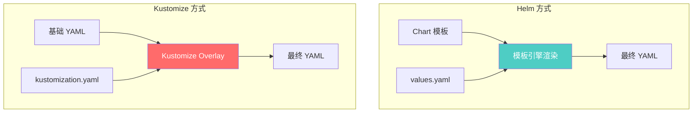

| 维度 | Helm | Kustomize |
|------|------|-----------|
| **核心理念** | 模板 + 变量 = 清单 | 基础 + 覆盖 = 清单 |
| **学习曲线** | 较高（模板语法、函数） | 较低（声明式 YAML） |
| **语言** | Go template + Sprig | 纯 YAML |
| **包管理** | 完整（仓库、版本、依赖） | 无（需外部工具） |
| **发布管理** | Release 概念（安装/升级/回滚） | 无 |
| **多环境** | 不同 values 文件 | overlay 目录 |
| **Secret 管理** | 需要 helm-secrets 插件 | 需要 SOPS 等外部工具 |
| **GitOps 兼容** | ArgoCD/Flux 支持 | 原生支持（纯 YAML） |
| **调试** | `helm template`/`helm diff` | `kustomize build` |
| **复用性** | Chart 仓库共享 | Base/Overlay 模式 |
| **适用场景** | 通用应用分发、第三方 Chart | 内部应用配置管理 |

### Kustomize 示例

```yaml
# base/kustomization.yaml
apiVersion: kustomize.config.k8s.io/v1beta1
kind: Kustomization
resources:
  - deployment.yaml
  - service.yaml
  - configmap.yaml
```

```yaml
# overlays/production/kustomization.yaml
apiVersion: kustomize.config.k8s.io/v1beta1
kind: Kustomization
bases:
  - ../../base
namePrefix: prod-
namespace: production
commonLabels:
  environment: production
patches:
  - target:
      kind: Deployment
    patch: |
      - op: replace
        path: /spec/replicas
        value: 5
      - op: replace
        path: /spec/template/spec/containers/0/resources/requests/cpu
        value: 500m
configMapGenerator:
  - name: app-config
    literals:
      - ASPNETCORE_ENVIRONMENT=Production
```

### 选择建议

::: tip 何时选择 Helm？
- 需要分发应用给第三方使用
- 依赖大量社区 Chart（Redis、PostgreSQL 等）
- 需要 Release 管理和回滚能力
- 应用结构复杂，需要模板化

何时选择 Kustomize？
- 纯内部应用，不需要分发
- 已经有基础 YAML，只需环境差异配置
- 团队偏好声明式、无模板语法
- 与 ArgoCD 深度集成的 GitOps 场景

可以混合使用！ArgoCD 原生支持 Helm + Kustomize 组合。
:::

---

## ArgoCD + Helm 集成

### 集成架构

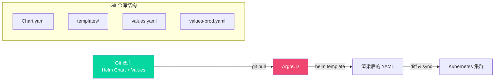

### ArgoCD Application 配置

```yaml
# Helm + ArgoCD Application
apiVersion: argoproj.io/v1alpha1
kind: Application
metadata:
  name: myapp
  namespace: argocd
  labels:
    app: myapp
  annotations:
    notifications.argoproj.io/subscribe.on-deployed.slack: releases
  finalizers:
    - resources-finalizer.argocd.argoproj.io
spec:
  project: default
  source:
    # 方式1：从 Git 仓库使用 Helm Chart
    repoURL: https://github.com/example/myapp-chart.git
    targetRevision: main
    path: charts/myapp
    helm:
      valueFiles:
        - values.yaml
        - values-prod.yaml
      parameters:
        - name: image.tag
          value: v2.0.1
      # 跳过 CRD 安装
      skipCrds: false
      # 传递 Release 名称
      releaseName: myapp

  # 方式2：从 Helm 仓库使用
  # source:
  #   repoURL: https://charts.bitnami.com/bitnami
  #   chart: redis
  #   targetRevision: 18.0.0
  #   helm:
  #     parameters:
  #       - name: auth.password
  #         value: my-password

  destination:
    server: https://kubernetes.default.svc
    namespace: production
  syncPolicy:
    automated:
      prune: true
      selfHeal: true
    syncOptions:
      - CreateNamespace=true
      - ServerSideApply=true
    retry:
      limit: 3
      backoff:
        duration: 5s
        factor: 2
        maxDuration: 3m
```

### App of Apps 模式

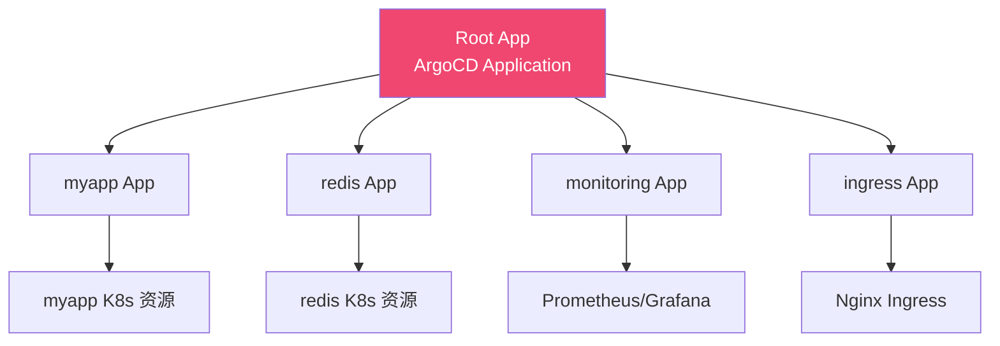

```yaml
# App of Apps - Root Application
apiVersion: argoproj.io/v1alpha1
kind: Application
metadata:
  name: apps
  namespace: argocd
spec:
  project: default
  source:
    repoURL: https://github.com/example/argocd-apps.git
    targetRevision: main
    path: apps
    directory:
      recurse: true
  destination:
    server: https://kubernetes.default.svc
    namespace: argocd
  syncPolicy:
    automated:
      prune: true
      selfHeal: true
```

---

## .NET 应用 Helm Chart 模板

### 完整 .NET 应用 Chart

```
dotnet-app/
├── Chart.yaml
├── values.yaml
├── values.schema.json
├── .helmignore
├── templates/
│   ├── _helpers.tpl
│   ├── deployment.yaml
│   ├── service.yaml
│   ├── ingress.yaml
│   ├── configmap.yaml
│   ├── secret.yaml
│   ├── hpa.yaml
│   ├── serviceaccount.yaml
│   ├── pdb.yaml
│   ├── networkpolicy.yaml
│   ├── servicemonitor.yaml
│   ├── NOTES.txt
│   └── tests/
│       └── test-connection.yaml
└── crds/
```

### Chart.yaml

```yaml
apiVersion: v2
name: dotnet-app
description: A Helm chart for .NET applications on Kubernetes
type: application
version: 1.0.0
appVersion: "8.0"
kubeVersion: ">=1.24.0-0"
icon: https://dotnet.microsoft.com/favicon.ico
keywords:
  - dotnet
  - aspnet
  - microservice
maintainers:
  - name: devops-team
    email: devops@example.com
```

### Deployment 模板

```yaml
# templates/deployment.yaml
apiVersion: apps/v1
kind: Deployment
metadata:
  name: {{ include "dotnet-app.fullname" . }}
  namespace: {{ .Release.Namespace }}
  labels:
    {{- include "dotnet-app.labels" . | nindent 4 }}
  annotations:
    checksum/config: {{ include (print $.Template.BasePath "/configmap.yaml") . | sha256sum }}
    checksum/secret: {{ include (print $.Template.BasePath "/secret.yaml") . | sha256sum }}
spec:
  {{- if not .Values.autoscaling.enabled }}
  replicas: {{ .Values.replicaCount }}
  {{- end }}
  selector:
    matchLabels:
      {{- include "dotnet-app.selectorLabels" . | nindent 6 }}
  strategy:
    type: {{ .Values.strategy.type }}
    {{- if eq .Values.strategy.type "RollingUpdate" }}
    rollingUpdate:
      maxSurge: {{ .Values.strategy.rollingUpdate.maxSurge }}
      maxUnavailable: {{ .Values.strategy.rollingUpdate.maxUnavailable }}
    {{- end }}
  template:
    metadata:
      labels:
        {{- include "dotnet-app.selectorLabels" . | nindent 8 }}
        {{- with .Values.podLabels }}
        {{- toYaml . | nindent 8 }}
        {{- end }}
      annotations:
        {{- with .Values.podAnnotations }}
        {{- toYaml . | nindent 8 }}
        {{- end }}
    spec:
      {{- with .Values.imagePullSecrets }}
      imagePullSecrets:
        {{- toYaml . | nindent 8 }}
      {{- end }}
      serviceAccountName: {{ include "dotnet-app.serviceAccountName" . }}
      terminationGracePeriodSeconds: {{ .Values.terminationGracePeriodSeconds | default 30 }}
      securityContext:
        {{- toYaml .Values.podSecurityContext | nindent 8 }}
      initContainers:
        {{- if .Values.initContainers.waitForDB }}
        - name: wait-for-db
          image: busybox:1.36
          command: ['sh', '-c', 'until nc -z {{ .Values.database.host }} {{ .Values.database.port }}; do echo waiting for database; sleep 2; done']
        {{- end }}
        {{- if .Values.initContainers.migrate }}
        - name: migrate
          image: "{{ .Values.image.repository }}:{{ .Values.image.tag | default .Chart.AppVersion }}"
          command: ['dotnet', 'EfMigrate.dll']
          envFrom:
            - secretRef:
                name: {{ include "dotnet-app.fullname" . }}-secret
        {{- end }}
      containers:
        - name: {{ .Chart.Name }}
          securityContext:
            {{- toYaml .Values.securityContext | nindent 12 }}
          image: "{{ .Values.image.repository }}:{{ .Values.image.tag | default .Chart.AppVersion }}"
          imagePullPolicy: {{ .Values.image.pullPolicy }}
          ports:
            - name: http
              containerPort: {{ .Values.service.targetPort | default 8080 }}
              protocol: TCP
            {{- if .Values.service.httpsPort }}
            - name: https
              containerPort: {{ .Values.service.httpsPort }}
              protocol: TCP
            {{- end }}
          env:
            # .NET 运行时环境变量
            - name: ASPNETCORE_ENVIRONMENT
              value: {{ .Values.dotnet.environment | default "Production" }}
            - name: ASPNETCORE_URLS
              value: {{ .Values.dotnet.urls | default "http://+:8080" }}
            {{- if .Values.dotnet.urls }}
            - name: DOTNET_EnableDiagnostics
              value: "0"
            {{- end }}
            # 应用配置
            {{- range $key, $value := .Values.env }}
            - name: {{ $key }}
              value: {{ $value | quote }}
            {{- end }}
          envFrom:
            - configMapRef:
                name: {{ include "dotnet-app.fullname" . }}-config
            - secretRef:
                name: {{ include "dotnet-app.fullname" . }}-secret
            {{- range .Values.extraEnvFrom }}
            - {{ toYaml . | nindent 14 }}
            {{- end }}
          lifecycle:
            {{- with .Values.lifecycle }}
            {{- toYaml . | nindent 12 }}
            {{- end }}
          livenessProbe:
            {{- if .Values.livenessProbe.httpGet }}
            httpGet:
              path: {{ .Values.livenessProbe.httpGet.path }}
              port: http
            {{- else }}
            exec:
              command:
                - /bin/sh
                - -c
                - curl -sf http://localhost:{{ .Values.service.targetPort | default 8080 }}/healthz || exit 1
            {{- end }}
            initialDelaySeconds: {{ .Values.livenessProbe.initialDelaySeconds | default 30 }}
            periodSeconds: {{ .Values.livenessProbe.periodSeconds | default 10 }}
            timeoutSeconds: {{ .Values.livenessProbe.timeoutSeconds | default 5 }}
            failureThreshold: {{ .Values.livenessProbe.failureThreshold | default 3 }}
          readinessProbe:
            httpGet:
              path: {{ .Values.readinessProbe.httpGet.path | default "/ready" }}
              port: http
            initialDelaySeconds: {{ .Values.readinessProbe.initialDelaySeconds | default 5 }}
            periodSeconds: {{ .Values.readinessProbe.periodSeconds | default 5 }}
            timeoutSeconds: {{ .Values.readinessProbe.timeoutSeconds | default 3 }}
            failureThreshold: {{ .Values.readinessProbe.failureThreshold | default 3 }}
          startupProbe:
            httpGet:
              path: {{ .Values.startupProbe.httpGet.path | default "/healthz" }}
              port: http
            initialDelaySeconds: {{ .Values.startupProbe.initialDelaySeconds | default 0 }}
            periodSeconds: {{ .Values.startupProbe.periodSeconds | default 5 }}
            failureThreshold: {{ .Values.startupProbe.failureThreshold | default 30 }}
          resources:
            {{- toYaml .Values.resources | nindent 12 }}
          volumeMounts:
            - name: tmp
              mountPath: /tmp
            {{- if .Values.persistence.enabled }}
            - name: data
              mountPath: {{ .Values.persistence.mountPath }}
            {{- end }}
            {{- range .Values.extraVolumeMounts }}
            - name: {{ .name }}
              mountPath: {{ .mountPath }}
              {{- if .subPath }}
              subPath: {{ .subPath }}
              {{- end }}
              readOnly: {{ .readOnly | default false }}
            {{- end }}
      volumes:
        - name: tmp
          emptyDir: {}
        {{- if .Values.persistence.enabled }}
        - name: data
          persistentVolumeClaim:
            claimName: {{ include "dotnet-app.fullname" . }}-data
        {{- end }}
        {{- range .Values.extraVolumes }}
        - name: {{ .name }}
          {{- if .configMap }}
          configMap:
            name: {{ .configMap.name }}
            {{- if .configMap.items }}
            items:
              {{- range .configMap.items }}
              - key: {{ .key }}
                path: {{ .path }}
              {{- end }}
            {{- end }}
          {{- else if .secret }}
          secret:
            secretName: {{ .secret.secretName }}
          {{- else if .emptyDir }}
          emptyDir: {}
          {{- end }}
        {{- end }}
      {{- with .Values.nodeSelector }}
      nodeSelector:
        {{- toYaml . | nindent 8 }}
      {{- end }}
      {{- with .Values.affinity }}
      affinity:
        {{- toYaml . | nindent 8 }}
      {{- end }}
      {{- with .Values.tolerations }}
      tolerations:
        {{- toYaml . | nindent 8 }}
      {{- end }}
      topologySpreadConstraints:
        {{- range .Values.topologySpreadConstraints }}
        - maxSkew: {{ .maxSkew }}
          topologyKey: {{ .topologyKey }}
          whenUnsatisfiable: {{ .whenUnsatisfiable }}
          labelSelector:
            matchLabels:
              {{- include "dotnet-app.selectorLabels" $ | nindent 14 }}
        {{- end }}
```

### .NET 特有配置

```yaml
# .NET 专用的 values 配置
dotnet:
  environment: Production
  urls: "http://+:8080"
  gcServer: true        # Server GC
  gcConcurrent: true    # 并发 GC
  threadPoolMinThreads: 0
  threadPoolMinIOThreads: 0

# 健康检查（.NET 健康端点）
livenessProbe:
  httpGet:
    path: /healthz
  initialDelaySeconds: 30
  periodSeconds: 10
  timeoutSeconds: 5
  failureThreshold: 3

readinessProbe:
  httpGet:
    path: /ready
  initialDelaySeconds: 5
  periodSeconds: 5
  timeoutSeconds: 3
  failureThreshold: 3

startupProbe:
  httpGet:
    path: /healthz
  initialDelaySeconds: 0
  periodSeconds: 5
  failureThreshold: 30  # 最多等待 150 秒启动

# 数据库迁移 InitContainer
initContainers:
  waitForDB: true
  migrate: false

# 部署策略
strategy:
  type: RollingUpdate
  rollingUpdate:
    maxSurge: 1
    maxUnavailable: 0

# 持久化（如需文件存储）
persistence:
  enabled: false
  storageClass: ""
  accessMode: ReadWriteOnce
  size: 10Gi
  mountPath: /app/data

# 生命周期钩子
lifecycle:
  preStop:
    exec:
      command: ["/bin/sh", "-c", "sleep 10"]  # 等待 Service 端点更新
```

### ConfigMap 与 Secret 模板

```yaml
# templates/configmap.yaml
apiVersion: v1
kind: ConfigMap
metadata:
  name: {{ include "dotnet-app.fullname" . }}-config
  namespace: {{ .Release.Namespace }}
  labels:
    {{- include "dotnet-app.labels" . | nindent 4 }}
data:
  {{- range $key, $value := .Values.env }}
  {{ $key }}: {{ $value | quote }}
  {{- end }}
  {{- with .Values.configMap.data }}
  {{- toYaml . | nindent 2 }}
  {{- end }}
---
# templates/secret.yaml
apiVersion: v1
kind: Secret
metadata:
  name: {{ include "dotnet-app.fullname" . }}-secret
  namespace: {{ .Release.Namespace }}
  labels:
    {{- include "dotnet-app.labels" . | nindent 4 }}
type: Opaque
data:
  {{- range $key, $value := .Values.secrets }}
  {{ $key }}: {{ $value | b64enc | quote }}
  {{- end }}
{{- range .Values.extraSecrets }}
---
apiVersion: v1
kind: Secret
metadata:
  name: {{ include "dotnet-app.fullname" $ }}-{{ .name }}
  namespace: {{ $.Release.Namespace }}
type: {{ .type | default "Opaque" }}
data:
  {{- range $key, $value := .data }}
  {{ $key }}: {{ $value | b64enc | quote }}
  {{- end }}
{{- end }}
```

### NOTES.txt

```yaml
{{- define "dotnet-app.notes" -}}
🚀 {{ .Chart.Name }} has been deployed!

Release: {{ .Release.Name }}
Namespace: {{ .Release.Namespace }}
Version: {{ .Chart.AppVersion }}

{{- if .Values.ingress.enabled }}
Access: https://{{ (index .Values.ingress.hosts 0).host }}
{{- else if eq .Values.service.type "NodePort" }}
Access: http://<NodeIP>:{{ .Values.service.nodePort }}
{{- else if eq .Values.service.type "LoadBalancer" }}
Access: http://{{ .Values.service.loadBalancerIP }}
{{- end }}

Health Check:
  kubectl get pods -n {{ .Release.Namespace }} -l app.kubernetes.io/instance={{ .Release.Name }}

View Logs:
  kubectl logs -f deployment/{{ include "dotnet-app.fullname" . }} -n {{ .Release.Namespace }}

{{- if .Values.autoscaling.enabled }}
Autoscaling: {{ .Values.autoscaling.minReplicas }}-{{ .Values.autoscaling.maxReplicas }} replicas
{{- end }}

{{- if .Values.redis.enabled }}
Redis: {{ .Release.Name }}-redis-master:6379
{{- end }}

{{- end }}
```

---

## 高级主题

### Helm Hooks

Hooks 允许在 Release 生命周期的特定点执行操作：

```yaml
# 安装前执行数据库迁移
apiVersion: batch/v1
kind: Job
metadata:
  name: "{{ include "dotnet-app.fullname" . }}-migrate"
  annotations:
    "helm.sh/hook": pre-install,pre-upgrade
    "helm.sh/hook-weight": "-5"
    "helm.sh/hook-delete-policy": before-hook-creation,hook-succeeded
spec:
  ttlSecondsAfterFinished: 86400
  template:
    spec:
      restartPolicy: Never
      containers:
        - name: migrate
          image: "{{ .Values.image.repository }}:{{ .Values.image.tag | default .Chart.AppVersion }}"
          command: ["dotnet", "EfMigrate.dll"]
          envFrom:
            - secretRef:
                name: {{ include "dotnet-app.fullname" . }}-secret
```

::: info Hook 类型与生命周期
| Hook | 触发时机 |
|------|---------|
| `pre-install` | 安装前，模板渲染后 |
| `post-install` | 安装完成后 |
| `pre-upgrade` | 升级前 |
| `post-upgrade` | 升级完成后 |
| `pre-delete` | 删除前 |
| `post-delete` | 删除完成后 |
| `pre-rollback` | 回滚前 |
| `post-rollback` | 回滚完成后 |
| `test` | `helm test` 时执行 |

`hook-weight`：数值越小越先执行（负数也有效）。
`hook-delete-policy`：`before-hook-creation`、`hook-succeeded`、`hook-failed`
:::

### Library Chart

Library Chart 提供可复用的命名模板，不能独立部署：

```yaml
# Chart.yaml
apiVersion: v2
name: common-library
type: library
version: 1.0.0
description: Shared templates for all microservices
```

```yaml
# templates/_container.tpl
{{- define "common-library.container" -}}
- name: {{ .Chart.Name }}
  image: "{{ .Values.image.repository }}:{{ .Values.image.tag | default .Chart.AppVersion }}"
  imagePullPolicy: {{ .Values.image.pullPolicy }}
  ports:
    - name: http
      containerPort: {{ .Values.service.targetPort | default 8080 }}
  resources:
    {{- toYaml .Values.resources | nindent 4 }}
  livenessProbe:
    httpGet:
      path: /healthz
      port: http
    initialDelaySeconds: {{ .Values.livenessProbe.initialDelaySeconds | default 30 }}
  readinessProbe:
    httpGet:
      path: /ready
      port: http
    initialDelaySeconds: {{ .Values.readinessProbe.initialDelaySeconds | default 5 }}
{{- end }}
```

在应用 Chart 中引用：

```yaml
# 应用 Chart 的 templates/deployment.yaml
spec:
  containers:
    {{- include "common-library.container" . | nindent 4 }}
```

需要在 `Chart.yaml` 中声明依赖：

```yaml
dependencies:
  - name: common-library
    version: "1.0.0"
    repository: "file://../common-library"
```

### Post Renderers

Post Renderer 允许在 Helm 渲染后、应用前修改 YAML：

```bash
# 使用 kustomize 作为 post-renderer
helm install myapp ./myapp --post-renderer ./kustomize-wrapper.sh
```

```bash
#!/bin/bash
# kustomize-wrapper.sh
cat <&0 > /tmp/stdin.yaml
kustomize build /path/to/overlay > /tmp/stdout.yaml
cat /tmp/stdout.yaml
```

---

## Helm 命令速查

### 常用命令

| 命令 | 说明 |
|------|------|
| `helm create NAME` | 创建新 Chart |
| `helm package PATH` | 打包 Chart 为 tgz |
| `helm lint PATH` | 检查 Chart 问题 |
| `helm template PATH` | 本地渲染模板 |
| `helm install NAME CHART` | 安装 Release |
| `helm upgrade NAME CHART` | 升级 Release |
| `helm rollback NAME [REVISION]` | 回滚 Release |
| `helm uninstall NAME` | 卸载 Release |
| `helm list` | 列出 Release |
| `helm status NAME` | 查看 Release 状态 |
| `helm history NAME` | 查看 Release 历史 |
| `helm show VALUES CHART` | 查看 Chart 默认 values |
| `helm get values NAME` | 查看 Release 当前 values |
| `helm get manifest NAME` | 查看 Release 的 manifest |
| `helm diff upgrade NAME CHART` | 查看升级差异 |
| `helm test NAME` | 运行 Chart 测试 |
| `helm repo add NAME URL` | 添加仓库 |
| `helm repo update` | 更新仓库索引 |
| `helm search repo KEYWORD` | 搜索仓库中的 Chart |
| `helm dependency update` | 更新依赖 |
| `helm registry login URL` | 登录 OCI 注册表 |
| `helm push CHART OCI_URL` | 推送到 OCI 注册表 |

### 调试技巧

```bash
# 1. 本地渲染（不安装）
helm template myapp ./myapp -f values-prod.yaml > rendered.yaml

# 2. 调试特定模板
helm template myapp ./myapp --show-only templates/deployment.yaml

# 3. 干跑模式（验证但不安装）
helm install myapp ./myapp --dry-run --debug

# 4. 查看合并后的 values
helm get values myapp --all -n production

# 5. 查看将要应用的完整 YAML
helm get manifest myapp -n production

# 6. 检查 Chart 问题
helm lint ./myapp --strict

# 7. 查看升级差异
helm diff upgrade myapp ./myapp -f values-prod.yaml

# 8. 查看 Chart 信息
helm show all ./myapp
helm show values ./myapp
```

---

## 总结

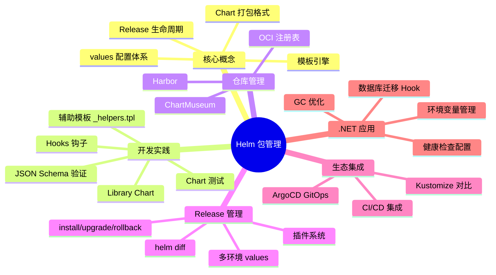

::: tip Helm 最佳实践清单
1. **始终使用 `helm upgrade --install`** 替代单独的 install/upgrade
2. **为 Chart 编写 JSON Schema** 确保 values 类型安全
3. **使用 `helm diff`** 在升级前查看变更
4. **遵循 Kubernetes 推荐标签** 规范
5. **敏感信息通过 `--set` 或 Secret 管理** 不写入 values.yaml
6. **编写 Chart 测试** 确保部署质量
7. **使用 OCI 注册表** 统一镜像和 Chart 仓库
8. **合理使用 Library Chart** 减少模板重复
9. **为 .NET 应用设置 startupProbe** 避免慢启动被误杀
10. **在 CI/CD 中加入 `helm lint --strict`** 门禁
:::
