# GitOps 与持续交付

## GitOps 概述

GitOps 是一种现代化的持续交付方法，由 Weaveworks 于 2017 年提出，其核心理念是**将 Git 作为基础设施和应用配置的唯一真实来源（Single Source of Truth）**，通过自动化同步机制确保集群状态与 Git 仓库中的声明式配置保持一致。

### GitOps 四大原则

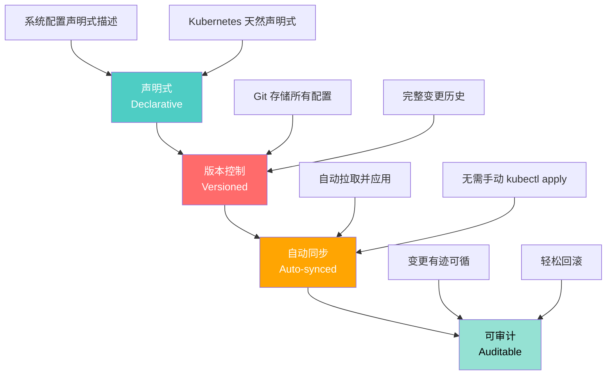

::: tip GitOps 的核心价值
1. **一致性**：所有环境配置存储在 Git 中，环境间差异明确可控
2. **安全性**：不需要给 CI 系统集群管理员权限，Git 控制变更流程
3. **可追溯**：每次变更都有 Git commit 记录，支持审计和回滚
4. **可靠性**：Git 作为唯一真实来源，避免了配置漂移
5. **协作性**：通过 Pull Request 流程进行变更审批
:::

### GitOps vs 传统 CI/CD

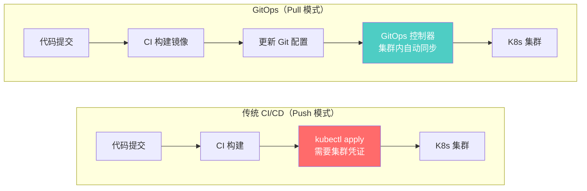

| 维度 | 传统 CI/CD | GitOps |
|------|-----------|--------|
| **同步模式** | Push（CI 推送到集群） | Pull（集群内控制器拉取） |
| **凭证管理** | CI 系统需要集群凭证 | 集群内运行，无需外部凭证 |
| **配置来源** | CI 脚本 + 参数 | Git 仓库声明式配置 |
| **变更审计** | CI 日志 | Git 提交历史 |
| **回滚方式** | 重新运行 CI 流水线 | `git revert` 即可回滚 |
| **配置漂移** | 难以检测 | 自动检测并修复 |
| **多集群** | 每个集群需要凭证 | 集群内控制器自治 |

---

## ArgoCD 部署与配置

### ArgoCD 架构

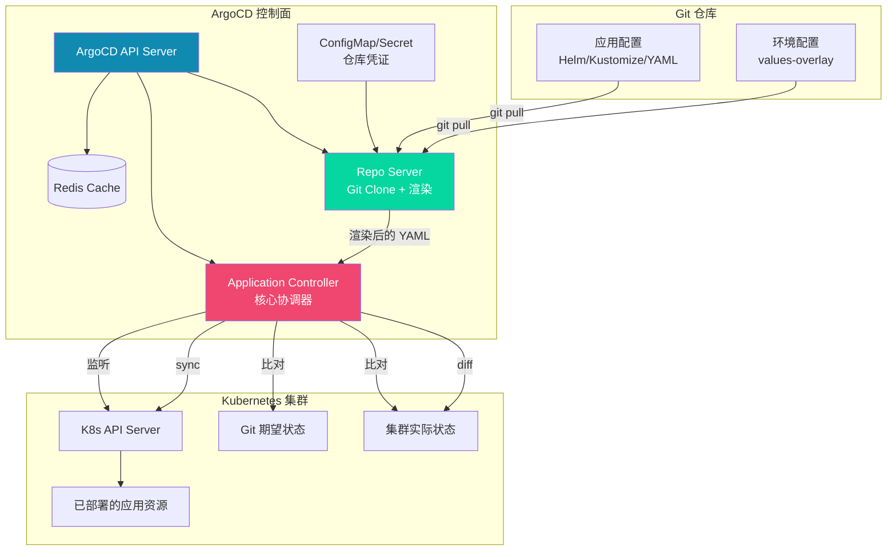

### 安装 ArgoCD

```bash
# 创建命名空间
kubectl create namespace argocd

# 安装 ArgoCD
kubectl apply -n argocd \
  -f https://raw.githubusercontent.com/argoproj/argo-cd/stable/manifests/install.yaml

# 安装 HA 模式（生产环境推荐）
kubectl apply -n argocd \
  -f https://raw.githubusercontent.com/argoproj/argo-cd/stable/manifests/ha/install.yaml

# 查看 Pod 状态
kubectl get pods -n argocd

# 获取初始管理员密码
kubectl -n argocd get secret argocd-initial-admin-secret \
  -o jsonpath="{.data.password}" | base64 -d

# 端口转发访问 UI
kubectl port-forward svc/argocd-server -n argocd 8080:443

# 安装 ArgoCD CLI
curl -sLO https://github.com/argoproj/argo-cd/releases/latest/download/argocd-linux-amd64
chmod +x argocd-linux-amd64
mv argocd-linux-amd64 /usr/local/bin/argocd

# 登录
argocd login localhost:8080

# 修改管理员密码
argocd account update-password
```

### ArgoCD 配置

```yaml
# argocd-cm ConfigMap - 核心配置
apiVersion: v1
kind: ConfigMap
metadata:
  name: argocd-cm
  namespace: argocd
data:
  # 仓库配置
  repositories: |
    - url: https://github.com/example/myapp-chart
      type: helm
      name: myapp-chart
    - url: https://charts.bitnami.com/bitnami
      type: helm
      name: bitnami

  # Helm 仓库配置
  helm.repositories: |
    - url: https://charts.bitnami.com/bitnami
      name: bitnami
    - url: https://chartmuseum.example.com
      name: private

  # 资源过滤
  resource.exclusions: |
    - apiGroups:
        - tekton.dev
      kinds:
        - TaskRun
        - PipelineRun
      clusters:
        - "*"

  # 资源行为自定义
  resource.customizations: |
    networking.k8s.io/Ingress:
      ignoreDifferences: |
        jsonPointers:
          - /metadata/annotations/nginx.ingress.kubernetes.io~1last-reload

  # 全局项目设置
  accounts.viewer: apiKey

  # SSO/Dex 配置
  url: https://argocd.example.com
  dex.config: |
    connectors:
      - type: microsoft
        id: microsoft
        name: Microsoft
        config:
          clientId: $MICROSOFT_CLIENT_ID
          clientSecret: $MICROSOFT_CLIENT_SECRET
          tenant: common
```

```yaml
# argocd-rbac-cm - RBAC 配置
apiVersion: v1
kind: ConfigMap
metadata:
  name: argocd-rbac-cm
  namespace: argocd
data:
  policy.csv: |
    # 项目级权限
    p, role:dev-team, applications, get, dev/*, allow
    p, role:dev-team, applications, sync, dev/*, allow
    p, role:ops-team, applications, *, prod/*, allow
    p, role:readonly, applications, get, */*, allow

    # 管理员权限
    g, admin-team, role:admin

    # 开发团队映射
    g, dev-team, role:dev-team
    g, ops-team, role:ops-team
  policy.default: role:readonly
```

### 仓库凭证

```yaml
# 私有 Git 仓库凭证
apiVersion: v1
kind: Secret
metadata:
  name: private-repo
  namespace: argocd
  labels:
    argocd.argoproj.io/secret-type: repository
stringData:
  type: git
  url: https://github.com/example/private-repo
  username: git-user
  password: ghp_xxxxxxxxxxxx

---
# Helm OCI 仓库凭证
apiVersion: v1
kind: Secret
metadata:
  name: helm-oci-repo
  namespace: argocd
  labels:
    argocd.argoproj.io/secret-type: repository
stringData:
  type: helm
  url: oci://myregistry.azurecr.io
  username: $ACR_USERNAME
  password: $ACR_PASSWORD
```

---

## Application 与 Sync 策略

### Application 资源

Application 是 ArgoCD 的核心资源，定义了应用的来源、目标集群和同步策略：

```yaml
apiVersion: argoproj.io/v1alpha1
kind: Application
metadata:
  name: myapp
  namespace: argocd
  labels:
    app: myapp
    team: backend
  annotations:
    # 通知配置
    notifications.argoproj.io/subscribe.on-deployed.slack: releases
    notifications.argoproj.io/subscribe.on-health-degraded.pagerduty: alerts
  finalizers:
    # 删除 Application 时同时删除 K8s 资源
    - resources-finalizer.argocd.argoproj.io
spec:
  project: default

  source:
    repoURL: https://github.com/example/myapp-gitops.git
    targetRevision: main
    path: charts/myapp
    helm:
      valueFiles:
        - values.yaml
        - values-prod.yaml
      parameters:
        - name: image.tag
          value: v2.0.1
      releaseName: myapp
      skipCrds: false

  destination:
    server: https://kubernetes.default.svc
    namespace: production

  # 同步策略
  syncPolicy:
    automated:
      prune: true     # 自动删除 Git 中不存在的资源
      selfHeal: true   # 自动修复配置漂移
      allowEmpty: false # 不允许空应用
    syncOptions:
      - CreateNamespace=true
      - ServerSideApply=true
      - PrunePropagationPolicy=foreground
      - PruneLast=true
    retry:
      limit: 3
      backoff:
        duration: 5s
        factor: 2
        maxDuration: 3m

  # 忽略差异
  ignoreDifferences:
    - group: apps
      kind: Deployment
      jsonPointers:
        - /spec/replicas  # HPA 管理副本数，忽略差异

  # 资源健康检查自定义
  # info:
  #   - name: Description
  #     value: Production .NET application
```

### Sync 策略详解

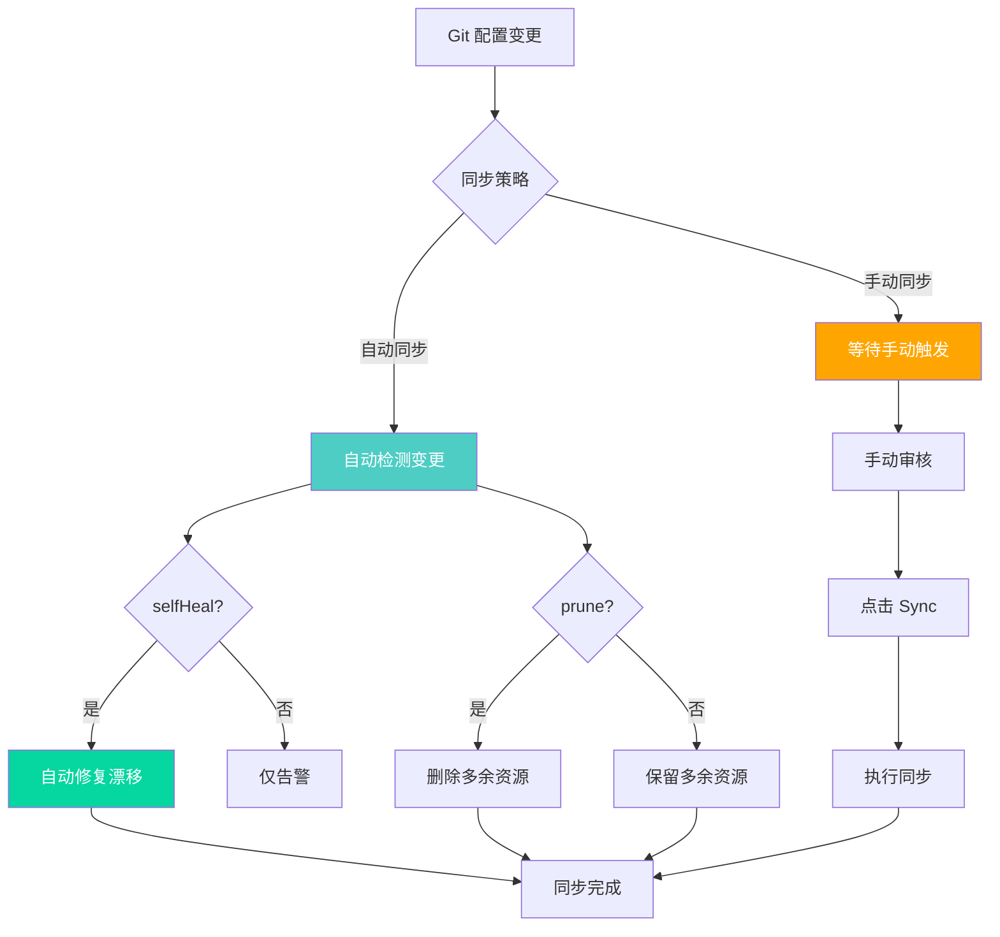

### Sync 选项

| 选项 | 说明 |
|------|------|
| `CreateNamespace=true` | 自动创建目标命名空间 |
| `ServerSideApply=true` | 使用 Server-Side Apply，避免大资源冲突 |
| `PrunePropagationPolicy=foreground` | 删除资源时等待子资源先删除 |
| `PruneLast=true` | 先创建新资源再删除旧资源 |
| `Replace=true` | 用 replace 替代 apply（谨慎使用） |
| `Validate=false` | 跳过 K8s schema 验证 |
| `ApplyOutOfSyncOnly=true` | 仅同步有差异的资源 |

### 手动同步与审批

```yaml
# 需要审批的同步策略
apiVersion: argoproj.io/v1alpha1
kind: Application
metadata:
  name: myapp-prod
  namespace: argocd
spec:
  project: production
  source:
    repoURL: https://github.com/example/myapp-gitops.git
    targetRevision: main
    path: overlays/production
  destination:
    server: https://kubernetes.default.svc
    namespace: production
  syncPolicy:
    automated:
      prune: true
      selfHeal: false  # 生产环境不自动修复，需审批
    syncOptions:
      - CreateNamespace=true
```

```bash
# 手动同步
argocd app sync myapp-prod

# 仅同步特定资源
argocd app sync myapp-prod --resource Deployment:myapp

# 干跑模式
argocd app sync myapp-prod --dry-run

# 查看同步状态
argocd app get myapp-prod

# 查看差异
argocd app diff myapp-prod
```

---

## 多环境管理

### App of Apps 模式

App of Apps 是 ArgoCD 管理多应用和多环境的推荐模式：

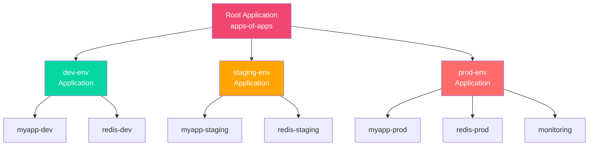

```yaml
# Root Application
apiVersion: argoproj.io/v1alpha1
kind: Application
metadata:
  name: apps
  namespace: argocd
spec:
  project: default
  source:
    repoURL: https://github.com/example/argocd-apps.git
    targetRevision: main
    path: apps
    directory:
      recurse: true
  destination:
    server: https://kubernetes.default.svc
    namespace: argocd
  syncPolicy:
    automated:
      prune: true
      selfHeal: true
```

```
# Git 仓库结构
argocd-apps/
├── apps/
│   └── kustomization.yaml    # 自动发现子目录
├── dev/
│   ├── myapp.yaml
│   └── redis.yaml
├── staging/
│   ├── myapp.yaml
│   └── redis.yaml
└── prod/
    ├── myapp.yaml
    ├── redis.yaml
    └── monitoring.yaml
```

### ApplicationSet

ApplicationSet 是 App of Apps 的进化版，支持动态生成 Application：

```yaml
# 基于 Git 目录自动生成 Application
apiVersion: argoproj.io/v1alpha1
kind: ApplicationSet
metadata:
  name: myapp-environments
  namespace: argocd
spec:
  generators:
    - git:
        repoURL: https://github.com/example/myapp-gitops.git
        revision: main
        directories:
          - path: overlays/*
  template:
    metadata:
      name: 'myapp-{{ path.basename }}'
      labels:
        app: myapp
        environment: '{{ path.basename }}'
    spec:
      project: default
      source:
        repoURL: https://github.com/example/myapp-gitops.git
        targetRevision: main
        path: '{{ path }}'
      destination:
        server: https://kubernetes.default.svc
        namespace: 'myapp-{{ path.basename }}'
      syncPolicy:
        automated:
          prune: true
          selfHeal: true
        syncOptions:
          - CreateNamespace=true
```

```yaml
# 基于集群列表生成（多集群场景）
apiVersion: argoproj.io/v1alpha1
kind: ApplicationSet
metadata:
  name: myapp-clusters
  namespace: argocd
spec:
  generators:
    - list:
        elements:
          - cluster: https://kubernetes.default.svc
            name: local
            namespace: myapp-dev
          - cluster: https://prod-cluster.example.com
            name: production
            namespace: myapp-prod
  template:
    metadata:
      name: 'myapp-{{ name }}'
    spec:
      project: default
      source:
        repoURL: https://github.com/example/myapp-gitops.git
        targetRevision: main
        path: overlays/{{ name }}
      destination:
        server: '{{ cluster }}'
        namespace: '{{ namespace }}'
      syncPolicy:
        automated:
          prune: true
          selfHeal: true
```

```yaml
# 基于 Git 分支生成（分支环境）
apiVersion: argoproj.io/v1alpha1
kind: ApplicationSet
metadata:
  name: preview-environments
  namespace: argocd
spec:
  generators:
    - scmProvider:
        github:
          organization: example
          repository: myapp
        filters:
          - branchMatch: ^preview-
  template:
    metadata:
      name: 'preview-{{ branch }}'
    spec:
      project: preview
      source:
        repoURL: https://github.com/example/myapp-gitops.git
        targetRevision: '{{ branch }}'
        path: overlays/preview
      destination:
        server: https://kubernetes.default.svc
        namespace: 'preview-{{ branch }}'
      syncPolicy:
        automated:
          prune: true
          selfHeal: true
        syncOptions:
          - CreateNamespace=true
```

---

## 自动同步与手动审批

### 多级审批工作流

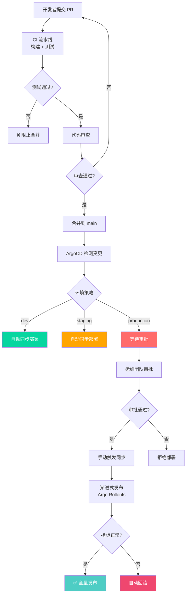

### ArgoCD Notifications

```yaml
# 通知配置
apiVersion: v1
kind: ConfigMap
metadata:
  name: argocd-notifications-cm
  namespace: argocd
data:
  # Slack 通知
  service.slack: |
    token: $slack-token

  # Microsoft Teams 通知
  service.teams: |
    webhookUrl: $teams-webhook-url

  # 邮件通知
  service.email: |
    host: smtp.example.com
    port: 587
    from: argocd@example.com
    username: $email-username
    password: $email-password

  # 触发器定义
  trigger.on-deployed: |
    - description: Application is synced and healthy
      oncePer: app.status.sync.revision
      send:
        - app-deployed
      when: app.status.operationState.phase in ['Succeeded'] and app.status.health.status == 'Healthy'

  trigger.on-health-degraded: |
    - description: Application has degraded
      send:
        - app-degraded
      when: app.status.health.status == 'Degraded'

  trigger.on-sync-failed: |
    - description: Application sync failed
      send:
        - app-sync-failed
      when: app.status.operationState.phase in ['Error', 'Failed']

  # 模板定义
  template.app-deployed: |
    message: |
      ✅ {{.app.metadata.name}} deployed successfully
      Revision: {{.app.status.sync.revision}}
      Health: {{.app.status.health.status}}
    slack:
      attachments: |
        [{
          "title": "{{.app.metadata.name}} - Deployed",
          "color": "#18be52",
          "fields": [
            { "title": "Revision", "value": "{{.app.status.sync.revision}}" },
            { "title": "Health", "value": "{{.app.status.health.status}}" }
          ]
        }]

  template.app-degraded: |
    message: |
      ⚠️ {{.app.metadata.name}} has degraded!
      Health: {{.app.status.health.status}}
      Reason: {{.app.status.health.message}}

  template.app-sync-failed: |
    message: |
      ❌ {{.app.metadata.name}} sync failed!
      Error: {{.app.status.operationState.message}}
```

---

## Flux2 对比 ArgoCD

### 架构对比

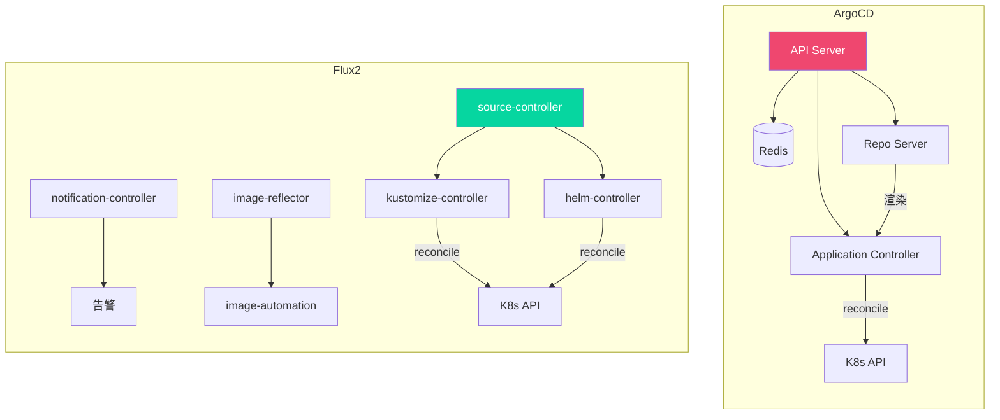

### 详细对比

| 维度 | ArgoCD | Flux2 |
|------|--------|-------|
| **设计哲学** | 应用为中心 | GitOps 工具链 |
| **UI** | 丰富的 Web UI | 无内置 UI（可配 Grafana） |
| **CLI** | 功能完善的 CLI | flux CLI |
| **多集群** | 原生支持 | 通过 flux 实例 |
| **通知** | 内置通知系统 | notification-controller |
| **镜像更新** | 需要外部工具 | 内置 image automation |
| **Helm 支持** | 原生支持 | helm-controller |
| **Kustomize** | 原生支持 | kustomize-controller |
| **多租户** | Project + RBAC | 命名空间隔离 |
| **Sync 策略** | 自动/手动灵活 | 以自动为主 |
| **社区** | 更大更活跃 | CNCF 孵化项目 |
| **学习曲线** | 较平缓 | 需理解 CRD 链 |
| **资源占用** | 较高 | 较轻量 |

### Flux2 配置示例

```yaml
# GitRepository - 源配置
apiVersion: source.toolkit.fluxcd.io/v1
kind: GitRepository
metadata:
  name: myapp
  namespace: flux-system
spec:
  interval: 1m
  url: https://github.com/example/myapp-gitops
  ref:
    branch: main
  secretRef:
    name: git-credentials
---
# Kustomization - 同步配置
apiVersion: kustomize.toolkit.fluxcd.io/v1
kind: Kustomization
metadata:
  name: myapp
  namespace: flux-system
spec:
  interval: 5m
  path: ./overlays/production
  prune: true
  sourceRef:
    kind: GitRepository
    name: myapp
  targetNamespace: production
  healthChecks:
    - apiVersion: apps/v1
      kind: Deployment
      name: myapp
      namespace: production
---
# HelmRelease - Helm 发布
apiVersion: helm.toolkit.fluxcd.io/v2beta1
kind: HelmRelease
metadata:
  name: myapp
  namespace: flux-system
spec:
  interval: 5m
  chart:
    spec:
      chart: myapp
      version: "1.0.0"
      sourceRef:
        kind: HelmRepository
        name: myapp-chart
  values:
    replicaCount: 3
    image:
      tag: v2.0.1
---
# 自动镜像更新
apiVersion: image.toolkit.fluxcd.io/v1beta1
kind: ImageRepository
metadata:
  name: myapp
  namespace: flux-system
spec:
  image: myregistry.azurecr.io/myapp
  interval: 1m
---
apiVersion: image.toolkit.fluxcd.io/v1beta1
kind: ImagePolicy
metadata:
  name: myapp
  namespace: flux-system
spec:
  imageRepositoryRef:
    name: myapp
  policy:
    semver:
      range: ">=2.0.0"
---
apiVersion: image.toolkit.fluxcd.io/v1beta1
kind: ImageUpdateAutomation
metadata:
  name: myapp
  namespace: flux-system
spec:
  interval: 1m
  sourceRef:
    kind: GitRepository
    name: myapp
  git:
    checkout:
      ref:
        branch: main
    commit:
      author:
        email: flux@example.com
        name: Flux
      messageTemplate: "{{range .Updated.Images}}{{.}}{{end}}"
    push:
      branch: main
  update:
    path: ./clusters/production
    strategy: Setters
```

### 选择建议

::: tip 如何选择 ArgoCD vs Flux2？
**选择 ArgoCD 如果你需要：**
- 可视化 Web UI 管理应用
- 灵活的手动同步与审批流程
- 多租户项目管理
- 团队中 Kubernetes 新手较多

**选择 Flux2 如果你需要：**
- 轻量级 GitOps 方案
- 自动镜像更新能力
- 更细粒度的 GitOps 工具链组合
- 与 CNCF 生态紧密集成

**两者都支持 Helm、Kustomize、多集群**，核心功能差异不大，更多是用户体验和运维习惯的区别。
:::

---

## Progressive Delivery

### 渐进式发布概述

渐进式发布是 GitOps 的增强模式，通过可观测性指标逐步扩大发布范围，在发现问题时自动回滚：

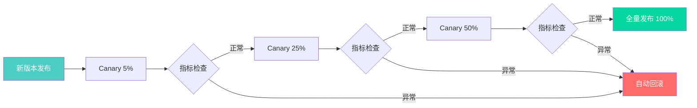

### Argo Rollouts

Argo Rollouts 是 ArgoCD 生态的渐进式发布控制器：

```yaml
# Rollout 替代 Deployment
apiVersion: argoproj.io/v1alpha1
kind: Rollout
metadata:
  name: myapp
  namespace: production
spec:
  replicas: 10
  strategy:
    canary:
      # Canary 设置
      canaryService: myapp-canary
      stableService: myapp-stable

      # 流量管理
      trafficRouting:
        istio:
          virtualServices:
            - name: myapp-vsvc
              routes:
                - primary

      # 渐进式发布步骤
      steps:
        - setWeight: 5
        - pause: { duration: 5m }
        - setWeight: 25
        - pause: { duration: 5m }
        - setWeight: 50
        - pause: { duration: 10m }
        # 手动审批
        - pause: {}
        - setWeight: 80
        - pause: { duration: 5m }
        - setWeight: 100

      # 回滚条件
      analysis:
        templates:
          - templateName: success-rate
        startingStep: 2
        args:
          - name: service-name
            value: myapp-canary.production.svc.cluster.local

      # 反亲和性
      antiAffinity:
        preferredDuringSchedulingIgnoredDuringExecution:
          - weight: 100
            podAffinityTerm:
              labelSelector:
                matchLabels:
                  app: myapp
              topologyKey: kubernetes.io/hostname

  selector:
    matchLabels:
      app: myapp
  template:
    metadata:
      labels:
        app: myapp
    spec:
      containers:
        - name: myapp
          image: myregistry.azurecr.io/myapp:v2.0.1
          ports:
            - containerPort: 8080
          resources:
            requests:
              cpu: 250m
              memory: 256Mi
            limits:
              cpu: "1"
              memory: 512Mi
```

### AnalysisTemplate

```yaml
# 分析模板 - 基于 Prometheus 指标
apiVersion: argoproj.io/v1alpha1
kind: AnalysisTemplate
metadata:
  name: success-rate
  namespace: production
spec:
  args:
    - name: service-name
  metrics:
    - name: success-rate
      interval: 30s
      count: 10
      successCondition: result[0] >= 0.99
      failureLimit: 3
      provider:
        prometheus:
          address: http://prometheus.monitoring:9090
          query: |
            sum(rate(http_requests_total{service="{{args.service-name}}",status!~"5.."}[1m]))
            /
            sum(rate(http_requests_total{service="{{args.service-name}}"}[1m]))

    - name: latency-p99
      interval: 30s
      count: 10
      successCondition: result[0] <= 500
      failureLimit: 3
      provider:
        prometheus:
          address: http://prometheus.monitoring:9090
          query: |
            histogram_quantile(0.99,
              sum(rate(http_request_duration_seconds_bucket{service="{{args.service-name}}"}[1m]))
              by (le)
            ) * 1000

    - name: error-rate
      interval: 30s
      count: 5
      successCondition: result[0] <= 0.01
      failureLimit: 2
      provider:
        prometheus:
          address: http://prometheus.monitoring:9090
          query: |
            sum(rate(http_requests_total{service="{{args.service-name}}",status=~"5.."}[1m]))
            /
            sum(rate(http_requests_total{service="{{args.service-name}}"}[1m]))
```

### Flagger

Flagger 是 Flux 生态的渐进式发布工具：

```yaml
# Flagger Canary
apiVersion: flagger.app/v1beta1
kind: Canary
metadata:
  name: myapp
  namespace: production
spec:
  targetRef:
    apiVersion: apps/v1
    kind: Deployment
    name: myapp
  service:
    port: 8080
    targetPort: 8080
    gateways:
      - myapp-gateway
    hosts:
      - myapp.example.com
  analysis:
    interval: 1m
    threshold: 5
    maxWeight: 50
    stepWeight: 10
    metrics:
      - name: request-success-rate
        thresholdRange:
          min: 99
        interval: 1m
      - name: request-duration
        thresholdRange:
          max: 500
        interval: 1m
    webhooks:
      - name: load-test
        type: rollout
        url: http://flagger-loadtester.test/
        timeout: 5s
        metadata:
          type: cmd
          cmd: "hey -z 1m -q 10 -c 2 http://myapp.production:8080/"
      - name: acceptance-test
        type: pre-rollout
        url: http://flagger-loadtester.test/
        timeout: 30s
        metadata:
          type: bash
          cmd: "curl -sf http://myapp-canary.production:8080/healthz"
```

---

## Secret 管理

### GitOps 中 Secret 的挑战

在 GitOps 模型中，所有配置应存储在 Git 中，但 Secret 不能以明文存储。以下方案解决这一矛盾：

### Sealed Secrets

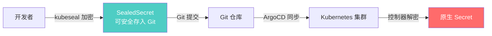

```bash
# 安装 Sealed Secrets 控制器
kubectl apply -f https://github.com/bitnami-labs/sealed-secrets/releases/latest/download/controller.yaml

# 安装 kubeseal CLI
KUBESEAL_VERSION=$(curl -s https://api.github.com/repos/bitnami-labs/sealed-secrets/tags | jq -r '.[0].name')
wget "https://github.com/bitnami-labs/sealed-secrets/releases/download/${KUBESEAL_VERSION}/kubeseal-linux-amd64"

# 从 Secret 创建 SealedSecret
kubectl create secret generic myapp-secret \
  --from-literal=ConnectionStrings__DefaultConnection="Server=db;Database=myapp" \
  --from-literal=JwtSettings__SecretKey="super-secret-key" \
  --dry-run=client -o yaml | kubeseal \
  --format yaml > sealed-secret.yaml

# 提交 sealed-secret.yaml 到 Git 即可
```

```yaml
# SealedSecret 示例（可安全存入 Git）
apiVersion: bitnami.com/v1alpha1
kind: SealedSecret
metadata:
  name: myapp-secret
  namespace: production
spec:
  encryptedData:
    ConnectionStrings__DefaultConnection: AgCF/3X...加密数据...
    JwtSettings__SecretKey: AgBf/2Y...加密数据...
  template:
    metadata:
      name: myapp-secret
      namespace: production
    type: Opaque
```

### External Secrets Operator

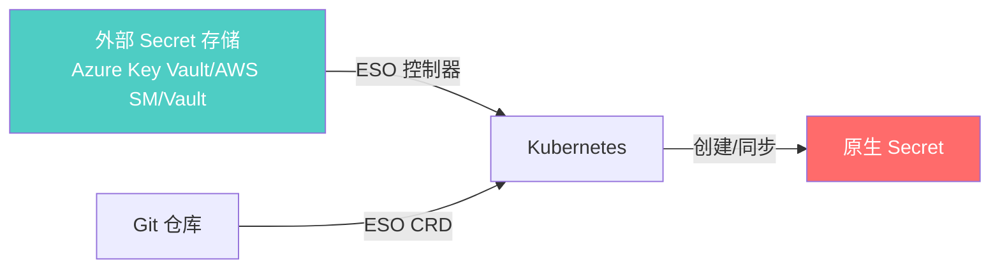

```yaml
# ClusterSecretStore - Azure Key Vault
apiVersion: external-secrets.io/v1beta1
kind: ClusterSecretStore
metadata:
  name: azure-keyvault
spec:
  provider:
    azurekv:
      tenantId: "xxxxxxxx-xxxx-xxxx-xxxx-xxxxxxxxxxxx"
      vaultUrl: "https://my-keyvault.vault.azure.net/"
      authSecretRef:
        clientId:
          name: azure-auth
          key: clientId
        clientSecret:
          name: azure-auth
          key: clientSecret
---
# ExternalSecret
apiVersion: external-secrets.io/v1beta1
kind: ExternalSecret
metadata:
  name: myapp-secrets
  namespace: production
spec:
  refreshInterval: 1h
  secretStoreRef:
    name: azure-keyvault
    kind: ClusterSecretStore
  target:
    name: myapp-secrets
    creationPolicy: Owner
  data:
    - secretKey: ConnectionStrings__DefaultConnection
      remoteRef:
        key: myapp-db-connection
    - secretKey: JwtSettings__SecretKey
      remoteRef:
        key: myapp-jwt-secret
    - secretKey: Redis__Password
      remoteRef:
        key: myapp-redis-password
  dataFrom:
    - extract:
        key: myapp-all-secrets
```

### SOPS + Age

```bash
# 安装 age 和 sops
apt-get install age sops

# 生成 age 密钥对
age-keygen -o key.txt

# 加密 values 文件
sops --age age1xxxxxxxxxxxxxxxxxxx \
  --encrypt --encrypted-regex '^(secrets|data|stringData)$' \
  --in-place values-prod.yaml

# 解密
sops --decrypt values-prod.yaml

# 与 ArgoCD 集成（使用 helm-secrets）
helm secrets upgrade --install myapp ./myapp \
  -f values-prod.yaml \
  --namespace production
```

---

## GitOps 安全最佳实践

### 安全框架

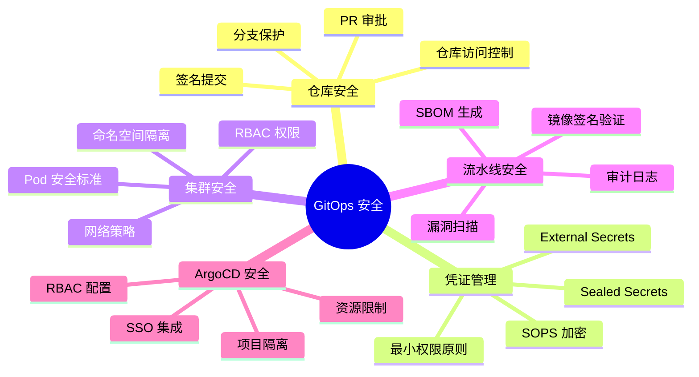

### 仓库安全配置

```yaml
# .github/CODEOWNERS - 代码所有者
# 生产环境变更需要 ops 团队审批
/overlays/production/ @ops-team
/overlays/staging/ @dev-team @ops-team
/charts/ @dev-team

# GitHub 分支保护规则（通过 API 设置）
# - 要求 PR 审批
# - 要求状态检查通过
# - 要求签名提交
# - 禁止强制推送
```

### ArgoCD 项目隔离

```yaml
# 开发环境项目
apiVersion: argoproj.io/v1alpha1
kind: AppProject
metadata:
  name: development
  namespace: argocd
spec:
  description: Development environment
  sourceRepos:
    - "https://github.com/example/dev-configs.git"
  destinations:
    - namespace: "dev-*"
      server: https://kubernetes.default.svc
  clusterResourceWhitelist:
    - group: ""
      kind: Namespace
  namespaceResourceBlacklist:
    - group: ""
      kind: ResourceQuota
    - group: ""
      kind: LimitRange
  roles:
    - name: dev-team
      description: Development team access
      policies:
        - p, proj:development:dev-team, applications, get, development/*, allow
        - p, proj:development:dev-team, applications, sync, development/*, allow
      groups:
        - dev-team
---
# 生产环境项目（严格限制）
apiVersion: argoproj.io/v1alpha1
kind: AppProject
metadata:
  name: production
  namespace: argocd
spec:
  description: Production environment
  sourceRepos:
    - "https://github.com/example/prod-configs.git"
  destinations:
    - namespace: "production"
      server: https://kubernetes.default.svc
  clusterResourceWhitelist: []  # 禁止集群级资源
  namespaceResourceBlacklist:
    - group: ""
      kind: ResourceQuota
  roles:
    - name: ops-team
      description: Operations team access
      policies:
        - p, proj:production:ops-team, applications, *, production/*, allow
      groups:
        - ops-team
  syncWindows:
    - kind: allow
      schedule: "0 9 * * 1-5"
      duration: 8h
      applications:
        - "*"
      manualSync: false
```

---

## .NET 应用 GitOps 流水线

### 完整流水线架构

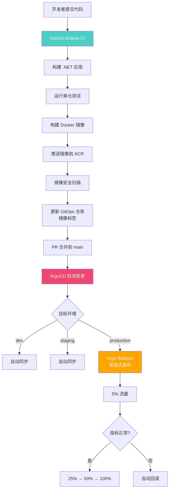

### CI 流水线（GitHub Actions）

```yaml
# .github/workflows/ci.yml
name: CI Pipeline

on:
  push:
    branches: [main, develop]
  pull_request:
    branches: [main]

env:
  REGISTRY: myregistry.azurecr.io
  IMAGE_NAME: myapp
  DOTNET_VERSION: "8.0.x"

jobs:
  build-and-test:
    runs-on: ubuntu-latest
    steps:
      - uses: actions/checkout@v4

      - name: Setup .NET
        uses: actions/setup-dotnet@v4
        with:
          dotnet-version: ${{ env.DOTNET_VERSION }}

      - name: Restore dependencies
        run: dotnet restore

      - name: Build
        run: dotnet build --no-restore --configuration Release

      - name: Test
        run: dotnet test --no-build --configuration Release --logger trx

      - name: Publish
        run: dotnet publish -c Release -o ./publish

  build-and-push-image:
    needs: build-and-test
    runs-on: ubuntu-latest
    if: github.event_name == 'push'
    outputs:
      image-tag: ${{ steps.meta.outputs.tags }}
    steps:
      - uses: actions/checkout@v4

      - name: Login to ACR
        uses: azure/docker-login@v1
        with:
          login-server: ${{ env.REGISTRY }}
          username: ${{ secrets.ACR_USERNAME }}
          password: ${{ secrets.ACR_PASSWORD }}

      - name: Extract metadata
        id: meta
        uses: docker/metadata-action@v5
        with:
          images: ${{ env.REGISTRY }}/${{ env.IMAGE_NAME }}
          tags: |
            type=ref,event=branch
            type=ref,event=pr
            type=semver,pattern={{version}}
            type=sha,prefix=

      - name: Build and push
        uses: docker/build-push-action@v5
        with:
          context: .
          push: true
          tags: ${{ steps.meta.outputs.tags }}
          labels: ${{ steps.meta.outputs.labels }}
          cache-from: type=gha
          cache-to: type=gha,mode=max

      - name: Security scan
        uses: aquasecurity/trivy-action@master
        with:
          image-ref: ${{ env.REGISTRY }}/${{ env.IMAGE_NAME }}:${{ github.sha }}
          severity: "CRITICAL,HIGH"
          exit-code: "1"

  update-gitops:
    needs: build-and-push-image
    runs-on: ubuntu-latest
    if: github.ref == 'refs/heads/main'
    steps:
      - name: Checkout GitOps repo
        uses: actions/checkout@v4
        with:
          repository: example/myapp-gitops
          token: ${{ secrets.GITOPS_PAT }}
          path: gitops

      - name: Update image tag
        run: |
          cd gitops
          # 更新 Helm values 中的镜像标签
          yq -i ".image.tag = \"${{ github.sha }}\"" overlays/production/values.yaml
          git config user.name "GitHub Actions"
          git config user.email "actions@github.com"
          git add overlays/production/values.yaml
          git commit -m "chore: update myapp image to ${{ github.sha }}"
          git push
```

### GitOps 仓库结构

```
myapp-gitops/
├── charts/
│   └── myapp/                    # Helm Chart
│       ├── Chart.yaml
│       ├── templates/
│       └── values.yaml
├── overlays/
│   ├── dev/
│   │   ├── kustomization.yaml
│   │   └── values.yaml
│   ├── staging/
│   │   ├── kustomization.yaml
│   │   └── values.yaml
│   └── production/
│       ├── kustomization.yaml
│       ├── values.yaml
│       └── rollout.yaml          # Argo Rollouts 配置
├── argocd/
│   ├── applications/
│   │   ├── dev.yaml
│   │   ├── staging.yaml
│   │   └── production.yaml
│   ├── appsets/
│   │   └── environments.yaml
│   └── projects/
│       ├── dev-project.yaml
│       └── prod-project.yaml
├── infrastructure/
│   ├── cert-manager.yaml
│   ├── ingress-nginx.yaml
│   └── monitoring.yaml
└── README.md
```

### ArgoCD Application 定义

```yaml
# argocd/applications/production.yaml
apiVersion: argoproj.io/v1alpha1
kind: Application
metadata:
  name: myapp-production
  namespace: argocd
  labels:
    app: myapp
    environment: production
  annotations:
    notifications.argoproj.io/subscribe.on-deployed.slack: prod-releases
    notifications.argoproj.io/subscribe.on-health-degraded.pagerduty: alerts
  finalizers:
    - resources-finalizer.argocd.argoproj.io
spec:
  project: production
  source:
    repoURL: https://github.com/example/myapp-gitops.git
    targetRevision: main
    path: overlays/production
  destination:
    server: https://kubernetes.default.svc
    namespace: production
  syncPolicy:
    automated:
      prune: true
      selfHeal: false
    syncOptions:
      - CreateNamespace=true
      - ServerSideApply=true
```

### Argo Rollouts 配置

```yaml
# overlays/production/rollout.yaml
apiVersion: argoproj.io/v1alpha1
kind: Rollout
metadata:
  name: myapp
  namespace: production
spec:
  replicas: 10
  strategy:
    canary:
      canaryService: myapp-canary
      stableService: myapp-stable
      trafficRouting:
        istio:
          virtualServices:
            - name: myapp-vsvc
              routes:
                - primary
      steps:
        - setWeight: 5
        - pause: { duration: 5m }
        - setWeight: 25
        - pause: { duration: 5m }
        - analysis:
            templates:
              - templateName: production-check
            args:
              - name: service-name
                value: myapp-canary.production.svc.cluster.local
        - setWeight: 50
        - pause: { duration: 10m }
        - pause: {}  # 手动审批
        - setWeight: 100
      analysis:
        templates:
          - templateName: success-rate
        startingStep: 2
  selector:
    matchLabels:
      app: myapp
  template:
    metadata:
      labels:
        app: myapp
    spec:
      containers:
        - name: myapp
          image: myregistry.azurecr.io/myapp:latest
          ports:
            - containerPort: 8080
          env:
            - name: ASPNETCORE_ENVIRONMENT
              value: Production
          livenessProbe:
            httpGet:
              path: /healthz
              port: 8080
          readinessProbe:
            httpGet:
              path: /ready
              port: 8080
          resources:
            requests:
              cpu: 250m
              memory: 256Mi
            limits:
              cpu: "1"
              memory: 512Mi
```

---

## GitOps 工作流设计

### 推荐工作流

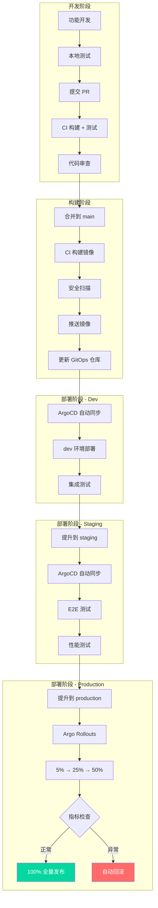

### 环境提升策略

```yaml
# 通过 Promotion 机制管理环境提升
# ArgoCD Promotion（手动）
apiVersion: argoproj.io/v1alpha1
kind: Application
metadata:
  name: myapp-staging
  namespace: argocd
spec:
  source:
    repoURL: https://github.com/example/myapp-gitops.git
    targetRevision: main
    path: overlays/staging
    helm:
      parameters:
        - name: image.tag
          value: v2.0.1  # 由 CI 更新
  destination:
    server: https://kubernetes.default.svc
    namespace: staging
  syncPolicy:
    automated:
      prune: true
      selfHeal: true
  info:
    - name: Promote To
      value: Run `argocd app set myapp-prod -p image.tag=v2.0.1`
```

---

## ArgoCD 运维

### 备份与恢复

```bash
# 备份 ArgoCD 配置
kubectl get applications -n argocd -o yaml > argocd-apps-backup.yaml
kubectl get appprojects -n argocd -o yaml > argocd-projects-backup.yaml
kubectl get secrets -n argocd -o yaml > argocd-secrets-backup.yaml
kubectl get configmaps -n argocd -o yaml > argocd-cm-backup.yaml

# 使用 ArgoCD CLI 导出
argocd admin export > argocd-backup.yaml

# 恢复
argocd admin import < argocd-backup.yaml
```

### 性能调优

```yaml
# argocd-cmd-params-cm - 性能参数
apiVersion: v1
kind: ConfigMap
metadata:
  name: argocd-cmd-params-cm
  namespace: argocd
data:
  # Controller 配置
  controller.status.processors: "20"        # 状态处理并发数
  controller.operation.processors: "10"     # 操作处理并发数
  controller.repo.server.timeout.seconds: "120"

  # Repo Server 配置
  reposerver.parallelism.limit: "8"         # Git 操作并发数

  # API Server 配置
  server.repo.timeout.seconds: "120"

  # 资源限制
  controller.resources.requests.cpu: "500m"
  controller.resources.requests.memory: "512Mi"
  controller.resources.limits.cpu: "2"
  controller.resources.limits.memory: "2Gi"
```

### 监控 ArgoCD 自身

```yaml
# ArgoCD 自身指标 ServiceMonitor
apiVersion: monitoring.coreos.com/v1
kind: ServiceMonitor
metadata:
  name: argocd-metrics
  namespace: argocd
spec:
  selector:
    matchLabels:
      app.kubernetes.io/name: argocd-metrics
  endpoints:
    - port: metrics
      interval: 30s
---
apiVersion: monitoring.coreos.com/v1
kind: ServiceMonitor
metadata:
  name: argocd-repo-server-metrics
  namespace: argocd
spec:
  selector:
    matchLabels:
      app.kubernetes.io/name: argocd-repo-server
  endpoints:
    - port: metrics
      interval: 30s
```

### 常用运维命令

```bash
# 查看所有应用状态
argocd app list

# 查看应用详情
argocd app get myapp

# 强制刷新应用状态
argocd app get myapp --refresh

# 同步应用
argocd app sync myapp

# 仅同步 OutOfSync 资源
argocd app sync myapp --prune --async

# 查看 Diff
argocd app diff myapp

# 删除应用（保留资源）
argocd app delete myapp --cascade=false

# 查看 ArgoCD 版本
argocd version

# 管理 Repo
argocd repo add https://github.com/example/repo --username git --password token
argocd repo list
```

---

## 总结

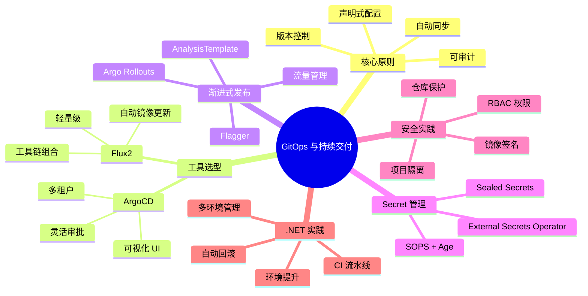

::: tip GitOps 实施清单
1. **从单一应用开始**：先选一个非关键应用试点
2. **统一仓库结构**：建立标准化的 GitOps 仓库模板
3. **分层管理配置**：基础配置 → 环境覆盖 → 集群覆盖
4. **自动化 CI 到 CD**：CI 只负责构建镜像和更新标签
5. **渐进式发布**：生产环境始终使用 Canary 或 Blue-Green
6. **Secret 外置**：使用 ESO 或 Sealed Secrets，不存明文
7. **监控与告警**：监控 ArgoCD 自身和应用的 Sync 状态
8. **文档化流程**：记录环境提升和回滚的标准操作
9. **定期演练回滚**：验证回滚流程的可靠性
10. **建立 RBAC 模型**：不同环境不同权限，生产环境需审批
:::
