# 安全与 RBAC

## Kubernetes 安全模型

Kubernetes 安全模型采用纵深防御（Defense in Depth）策略，从集群边界到应用容器层层设防：

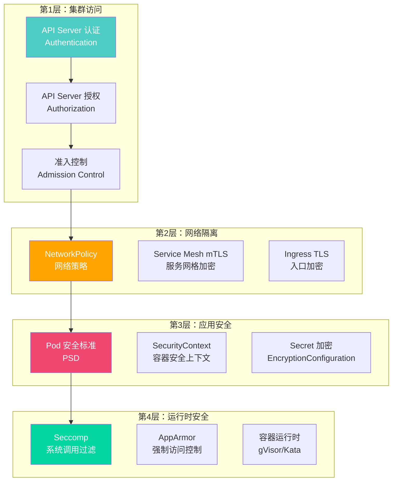

### API 请求处理流程

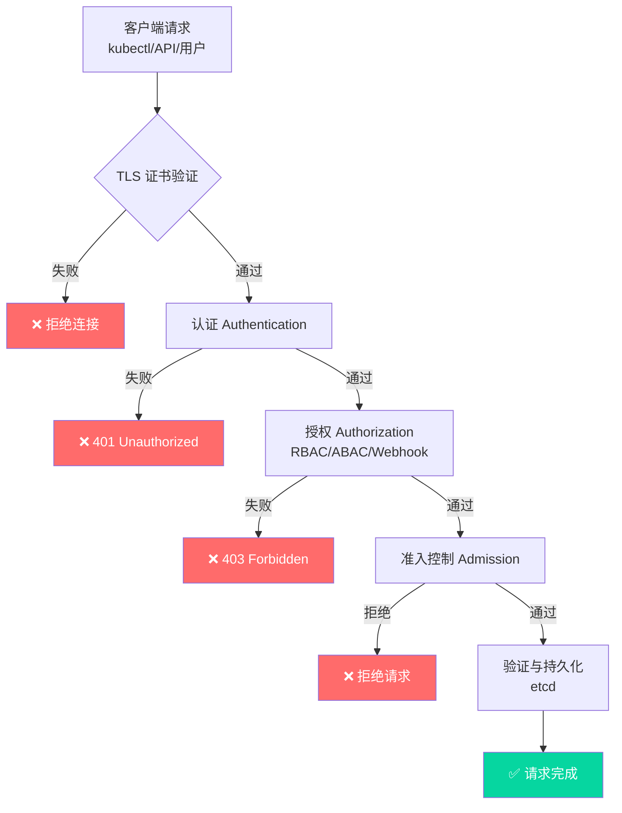

::: important 安全三要素
1. **认证（Authentication）**：确定"你是谁" —— 支持 X.509 证书、OIDC、Webhook 等
2. **授权（Authorization）**：确定"你能做什么" —— RBAC 是最常用的授权模式
3. **准入控制（Admission Control）**：在请求持久化前进行额外的验证和变更
:::

---

## RBAC 详解

### RBAC 核心概念

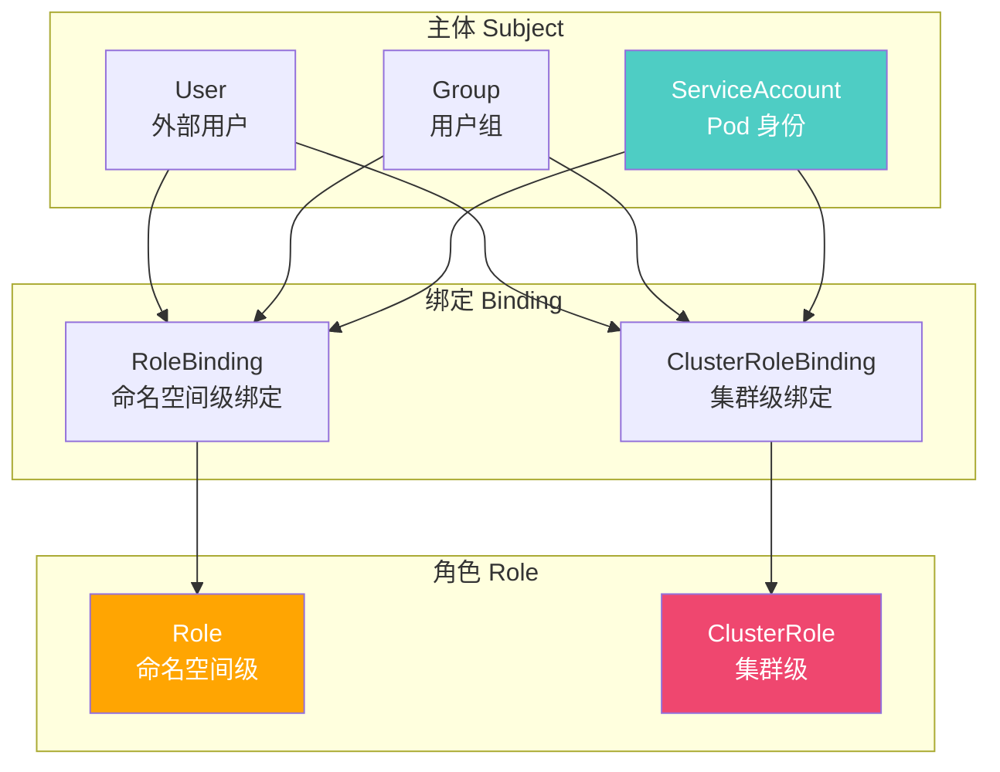

### RBAC 权限模型

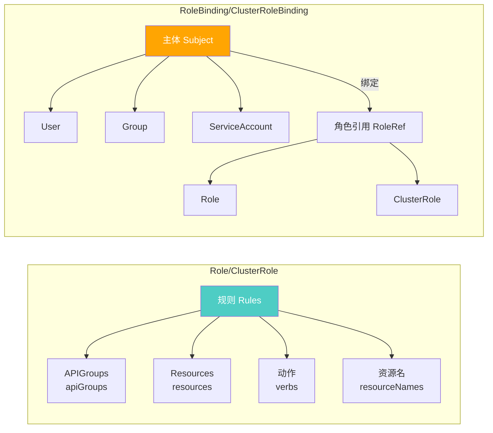

### Role 与 ClusterRole

```yaml
# Role - 命名空间级权限
apiVersion: rbac.authorization.k8s.io/v1
kind: Role
metadata:
  name: developer
  namespace: production
rules:
  # 读取 Pod
  - apiGroups: [""]
    resources: ["pods", "pods/log"]
    verbs: ["get", "list", "watch"]
  # 管理 Deployment
  - apiGroups: ["apps"]
    resources: ["deployments"]
    verbs: ["get", "list", "watch", "create", "update", "patch", "delete"]
  # 管理 ConfigMap
  - apiGroups: [""]
    resources: ["configmaps"]
    verbs: ["get", "list", "watch", "create", "update", "patch"]
    resourceNames: ["app-config"]  # 限制特定资源名
  # 查看 Secret（仅列表，不能读取内容）
  - apiGroups: [""]
    resources: ["secrets"]
    verbs: ["list"]
  # 管理 Job
  - apiGroups: ["batch"]
    resources: ["jobs"]
    verbs: ["get", "list", "watch", "create", "delete"]
  # 执行 Pod 命令
  - apiGroups: [""]
    resources: ["pods/exec"]
    verbs: ["create"]
  # 管理应用滚动重启
  - apiGroups: ["apps"]
    resources: ["deployments"]
    verbs: ["patch"]
    resourceNames: ["myapp"]
```

```yaml
# ClusterRole - 集群级权限
apiVersion: rbac.authorization.k8s.io/v1
kind: ClusterRole
metadata:
  name: namespace-reader
rules:
  # 读取所有命名空间
  - apiGroups: [""]
    resources: ["namespaces"]
    verbs: ["get", "list", "watch"]
  # 读取所有命名空间的 Pod
  - apiGroups: [""]
    resources: ["pods"]
    verbs: ["get", "list", "watch"]
  # 读取节点信息
  - apiGroups: [""]
    resources: ["nodes"]
    verbs: ["get", "list", "watch"]
  # 读取事件
  - apiGroups: [""]
    resources: ["events"]
    verbs: ["get", "list", "watch"]
```

### RoleBinding 与 ClusterRoleBinding

```yaml
# RoleBinding - 绑定用户到命名空间级 Role
apiVersion: rbac.authorization.k8s.io/v1
kind: RoleBinding
metadata:
  name: developer-binding
  namespace: production
subjects:
  - kind: User
    name: alice
    apiGroup: rbac.authorization.k8s.io
  - kind: Group
    name: dev-team
    apiGroup: rbac.authorization.k8s.io
  - kind: ServiceAccount
    name: myapp-sa
    namespace: production
roleRef:
  kind: Role
  name: developer
  apiGroup: rbac.authorization.k8s.io
```

```yaml
# ClusterRoleBinding - 绑定用户到集群级权限
apiVersion: rbac.authorization.k8s.io/v1
kind: ClusterRoleBinding
metadata:
  name: cluster-admin-binding
subjects:
  - kind: Group
    name: admins
    apiGroup: rbac.authorization.k8s.io
roleRef:
  kind: ClusterRole
  name: cluster-admin  # 内置 ClusterRole
  apiGroup: rbac.authorization.k8s.io
```

```yaml
# 使用 ClusterRole + RoleBinding 实现跨命名空间复用
# ClusterRole 定义权限模板
apiVersion: rbac.authorization.k8s.io/v1
kind: ClusterRole
metadata:
  name: namespace-developer
rules:
  - apiGroups: [""]
    resources: ["pods", "pods/log", "configmaps", "secrets"]
    verbs: ["get", "list", "watch"]
  - apiGroups: ["apps"]
    resources: ["deployments", "statefulsets"]
    verbs: ["get", "list", "watch", "create", "update", "patch", "delete"]
---
# 在不同命名空间中复用
apiVersion: rbac.authorization.k8s.io/v1
kind: RoleBinding
metadata:
  name: developer-binding
  namespace: dev  # 仅在 dev 命名空间生效
subjects:
  - kind: Group
    name: dev-team
roleRef:
  kind: ClusterRole  # 引用 ClusterRole
  name: namespace-developer
  apiGroup: rbac.authorization.k8s.io
```

### Verbs 速查

| Verb | 说明 | HTTP 方法 |
|------|------|----------|
| `get` | 读取单个资源 | GET |
| `list` | 列出资源集合 | GET (集合) |
| `watch` | 监听资源变更 | GET (watch) |
| `create` | 创建资源 | POST |
| `update` | 全量更新资源 | PUT |
| `patch` | 部分更新资源 | PATCH |
| `delete` | 删除单个资源 | DELETE |
| `deletecollection` | 删除资源集合 | DELETE (集合) |

### 常用 ClusterRole 模板

```yaml
# 只读查看者
apiVersion: rbac.authorization.k8s.io/v1
kind: ClusterRole
metadata:
  name: viewer
rules:
  - apiGroups: ["", "apps", "batch", "networking.k8s.io", "autoscaling"]
    resources: ["*"]
    verbs: ["get", "list", "watch"]
---
# 运维人员（排除敏感操作）
apiVersion: rbac.authorization.k8s.io/v1
kind: ClusterRole
metadata:
  name: operator
rules:
  - apiGroups: ["", "apps", "batch", "networking.k8s.io", "autoscaling"]
    resources: ["*"]
    verbs: ["get", "list", "watch", "create", "update", "patch", "delete"]
  # 不能操作 RBAC
  - apiGroups: ["rbac.authorization.k8s.io"]
    resources: ["*"]
    verbs: ["get", "list", "watch"]
  # 不能操作 Secret
  - apiGroups: [""]
    resources: ["secrets"]
    verbs: ["list"]  # 仅能列表，不能读取内容
```

---

## ServiceAccount 管理

### ServiceAccount 概述

ServiceAccount 是 Pod 的身份标识，用于 Pod 内部进程与 API Server 交互：

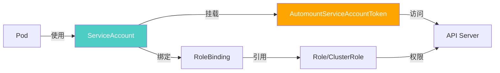

### ServiceAccount 配置

```yaml
# 创建 ServiceAccount
apiVersion: v1
kind: ServiceAccount
metadata:
  name: myapp-sa
  namespace: production
  labels:
    app: myapp
  annotations:
    # Azure Workload Identity
    azure.workload.identity/client-id: "xxxxxxxx-xxxx-xxxx-xxxx-xxxxxxxxxxxx"
    # IRSA（AWS）
    # eks.amazonaws.com/role-arn: arn:aws:iam::123456789012:role/myapp-role
    # GCP Workload Identity
    # iam.gke.io/gcp-service-account: myapp-sa@project.iam.gserviceaccount.com
automountServiceAccountToken: true  # 是否自动挂载 Token
secrets:
  - name: myapp-sa-token  # 手动关联 Secret（1.24+ 需手动创建）
```

```yaml
# Pod 使用 ServiceAccount
apiVersion: v1
kind: Pod
metadata:
  name: myapp
  namespace: production
spec:
  serviceAccountName: myapp-sa
  automountServiceAccountToken: true
  containers:
    - name: myapp
      image: myapp:latest
      # Token 挂载在 /var/run/secrets/kubernetes.io/serviceaccount/
```

### 最小权限原则

```yaml
# ❌ 错误：使用 default ServiceAccount 且权限过大
apiVersion: rbac.authorization.k8s.io/v1
kind: ClusterRoleBinding
metadata:
  name: all-pods-admin
subjects:
  - kind: ServiceAccount
    name: default  # 所有 Pod 共享
    namespace: default
roleRef:
  kind: ClusterRole
  name: cluster-admin  # 过度授权
  apiGroup: rbac.authorization.k8s.io

---
# ✅ 正确：为每个应用创建专用 SA，最小权限
apiVersion: v1
kind: ServiceAccount
metadata:
  name: myapp-sa
  namespace: production
automountServiceAccountToken: false  # 不需要 API 访问时关闭
---
apiVersion: rbac.authorization.k8s.io/v1
kind: Role
metadata:
  name: myapp-config-reader
  namespace: production
rules:
  - apiGroups: [""]
    resources: ["configmaps"]
    verbs: ["get", "list"]
    resourceNames: ["myapp-config"]  # 限制特定 ConfigMap
---
apiVersion: rbac.authorization.k8s.io/v1
kind: RoleBinding
metadata:
  name: myapp-config-reader-binding
  namespace: production
subjects:
  - kind: ServiceAccount
    name: myapp-sa
roleRef:
  kind: Role
  name: myapp-config-reader
  apiGroup: rbac.authorization.k8s.io
```

---

## Pod 安全标准

### 三级安全标准

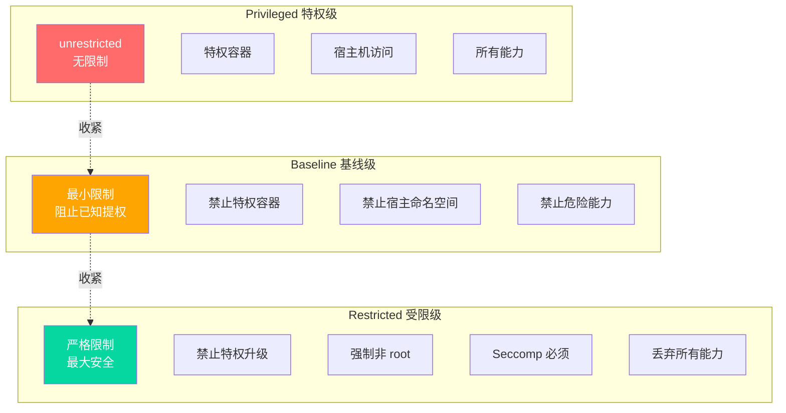

### Pod 安全标准对比

| 控制项 | Privileged | Baseline | Restricted |
|--------|-----------|----------|------------|
| **特权容器** | 允许 | 禁止 | 禁止 |
| **宿主进程ID命名空间** | 允许 | 禁止 | 禁止 |
| **宿主网络** | 允许 | 禁止 | 禁止 |
| **宿主IPC** | 允许 | 禁止 | 禁止 |
| **宿主PID** | 允许 | 禁止 | 禁止 |
| **capabilities** | 全部 | 基线允许 | 仅 NET_BIND_SERVICE |
| **runAsNonRoot** | 不要求 | 不要求 | 必须 true |
| **readOnlyRootFilesystem** | 不要求 | 不要求 | 必须 true |
| **allowPrivilegeEscalation** | 允许 | 允许 | 必须 false |
| **seccompProfile** | 任意 | RuntimeDefault/Local | RuntimeDefault/Local |
| **volume 类型** | 任意 | 限制宿主机卷 | 限制宿主机卷 |

### Pod Security Admission（PSA）

```yaml
# 命名空间级 PSA 配置
apiVersion: v1
kind: Namespace
metadata:
  name: production
  labels:
    pod-security.kubernetes.io/enforce: restricted
    pod-security.kubernetes.io/enforce-version: latest
    pod-security.kubernetes.io/audit: restricted
    pod-security.kubernetes.io/audit-version: latest
    pod-security.kubernetes.io/warn: restricted
    pod-security.kubernetes.io/warn-version: latest
---
apiVersion: v1
kind: Namespace
metadata:
  name: dev
  labels:
    pod-security.kubernetes.io/enforce: baseline
    pod-security.kubernetes.io/audit: restricted
    pod-security.kubernetes.io/warn: restricted
---
apiVersion: v1
kind: Namespace
metadata:
  name: system
  labels:
    pod-security.kubernetes.io/enforce: privileged
    pod-security.kubernetes.io/audit: baseline
    pod-security.kubernetes.io/warn: baseline
```

::: important PSP → PSD 演进
- **PodSecurityPolicy（PSP）**：Kubernetes 1.21 弃用，1.25 移除
- **Pod Security Admission（PSA）**：1.22 引入 Beta，1.25 正式替代 PSP
- **关键区别**：PSA 是命名空间级标签配置，比 PSP 更简单；PSA 不支持自定义规则，复杂场景使用 OPA Gatekeeper 或 Kyverno
:::

### Restricted 级别 Pod 配置

```yaml
# 满足 Restricted 标准的 Pod 配置
apiVersion: v1
kind: Pod
metadata:
  name: myapp
  namespace: production
spec:
  serviceAccountName: myapp-sa
  securityContext:
    runAsNonRoot: true          # 必须：非 root 运行
    runAsUser: 1000             # 必须：指定非 0 用户
    fsGroup: 2000               # 必须：文件系统组
    seccompProfile:             # 必须：Seccomp 配置
      type: RuntimeDefault
  containers:
    - name: myapp
      image: myapp:latest
      securityContext:
        allowPrivilegeEscalation: false  # 必须：禁止提权
        readOnlyRootFilesystem: true     # 必须：只读根文件系统
        capabilities:                    # 必须：丢弃所有能力
          drop:
            - ALL
        runAsNonRoot: true
        runAsUser: 1000
      volumeMounts:
        - name: tmp
          mountPath: /tmp
        - name: cache
          mountPath: /app/cache
  volumes:
    - name: tmp
      emptyDir: {}
    - name: cache
      emptyDir: {}
```

---

## NetworkPolicy 网络隔离

### 网络隔离模型

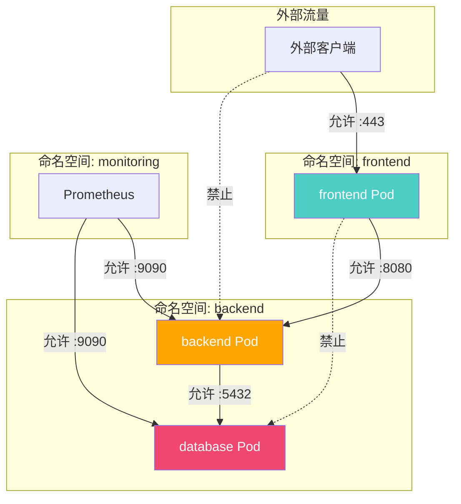

### NetworkPolicy 示例

```yaml
# 默认拒绝所有入站流量
apiVersion: networking.k8s.io/v1
kind: NetworkPolicy
metadata:
  name: default-deny-ingress
  namespace: production
spec:
  podSelector: {}  # 匹配所有 Pod
  policyTypes:
    - Ingress
---
# 默认拒绝所有出站流量
apiVersion: networking.k8s.io/v1
kind: NetworkPolicy
metadata:
  name: default-deny-egress
  namespace: production
spec:
  podSelector: {}
  policyTypes:
    - Egress
---
# 允许 DNS 出站
apiVersion: networking.k8s.io/v1
kind: NetworkPolicy
metadata:
  name: allow-dns-egress
  namespace: production
spec:
  podSelector: {}
  policyTypes:
    - Egress
  egress:
    - ports:
        - port: 53
          protocol: UDP
        - port: 53
          protocol: TCP
      to:
        - namespaceSelector:
            matchLabels:
              kubernetes.io/metadata.name: kube-system
```

```yaml
# 应用级网络策略
apiVersion: networking.k8s.io/v1
kind: NetworkPolicy
metadata:
  name: myapp-policy
  namespace: production
spec:
  podSelector:
    matchLabels:
      app: myapp
  policyTypes:
    - Ingress
    - Egress
  ingress:
    # 允许 Ingress Controller 流量
    - from:
        - namespaceSelector:
            matchLabels:
              kubernetes.io/metadata.name: ingress-nginx
          podSelector:
            matchLabels:
              app.kubernetes.io/name: ingress-nginx
      ports:
        - port: 8080
          protocol: TCP
    # 允许 Prometheus 抓取指标
    - from:
        - namespaceSelector:
            matchLabels:
              kubernetes.io/metadata.name: monitoring
          podSelector:
            matchLabels:
              app: prometheus
      ports:
        - port: 9090
          protocol: TCP
    # 允许同命名空间 Pod 通信
    - from:
        - podSelector: {}
      ports:
        - port: 8080
          protocol: TCP
  egress:
    # 允许访问 Redis
    - to:
        - podSelector:
            matchLabels:
              app: redis
      ports:
        - port: 6379
          protocol: TCP
    # 允许访问数据库
    - to:
        - podSelector:
            matchLabels:
              app: postgresql
      ports:
        - port: 5432
          protocol: TCP
    # 允许 DNS
    - ports:
        - port: 53
          protocol: UDP
        - port: 53
          protocol: TCP
```

### 多层网络策略设计

```yaml
# 第1层：命名空间级默认策略
apiVersion: networking.k8s.io/v1
kind: NetworkPolicy
metadata:
  name: baseline-policy
  namespace: production
spec:
  podSelector: {}
  policyTypes:
    - Ingress
    - Egress
  ingress:
    - from:
        - namespaceSelector:
            matchLabels:
              network-policy/allow-to-production: "true"
  egress:
    - to:
        - namespaceSelector:
            matchLabels:
              network-policy/allow-from-production: "true"
    - ports:
        - port: 53
          protocol: UDP
---
# 第2层：应用级精细策略（覆盖基线）
apiVersion: networking.k8s.io/v1
kind: NetworkPolicy
metadata:
  name: myapp-allow-frontend
  namespace: production
spec:
  podSelector:
    matchLabels:
      app: myapp
      tier: backend
  ingress:
    - from:
        - podSelector:
            matchLabels:
              app: myapp
              tier: frontend
      ports:
        - port: 8080
```

---

## Secret 加密

### EncryptionConfiguration

```yaml
# 静态加密 Secret 数据
apiVersion: apiserver.config.k8s.io/v1
kind: EncryptionConfiguration
resources:
  - resources:
      - secrets
    providers:
      # 第一个提供者用于加密新数据
      - aescbc:
          keys:
            - name: key1
              secret: <BASE64_ENCODED_SECRET>  # 32 字节密钥
      # 后续提供者用于解密旧数据
      - aescbc:
          keys:
            - name: key0
              secret: <OLD_BASE64_ENCODED_SECRET>
      # 最后是 identity（用于读取未加密数据）
      - identity: {}
```

### 配置 API Server

```bash
# 1. 生成加密密钥
head -c 32 /dev/urandom | base64

# 2. 创建 EncryptionConfiguration 文件
cat > /etc/kubernetes/encryption-config.yaml <<EOF
apiVersion: apiserver.config.k8s.io/v1
kind: EncryptionConfiguration
resources:
  - resources:
      - secrets
    providers:
      - aescbc:
          keys:
            - name: key1
              secret: xxxxxxxxxxxxxxxxxxxxxxxxxxxxxxxxxxxxxxxxxxxxx
      - identity: {}
EOF

# 3. 修改 API Server 启动参数
# --encryption-provider-config=/etc/kubernetes/encryption-config.yaml

# 4. 重启 API Server

# 5. 验证加密生效（写入新 Secret 并检查 etcd）
kubectl create secret generic test-encryption --from-literal=key=value
ETCDCTL_API=3 etcdctl get /secrets/production/test-encryption \
  --cacert=/etc/kubernetes/pki/etcd/ca.crt \
  --cert=/etc/kubernetes/pki/etcd/server.crt \
  --key=/etc/kubernetes/pki/etcd/server.key | hexdump -C

# 6. 加密已有 Secret
kubectl get secrets --all-namespaces -o json | kubectl replace -f -
```

::: warning 密钥轮换
1. 添加新密钥到 keys 列表**首位**
2. 重启 API Server
3. 执行 `kubectl get secrets --all-namespaces -o json | kubectl replace -f -` 重新加密所有 Secret
4. 确认新密钥生效后，移除旧密钥
5. **务必备份 etcd**后再执行密钥轮换操作
:::

---

## 证书与 TLS 管理

### cert-manager

cert-manager 是 Kubernetes 原生的证书管理工具，自动化 X.509 证书的签发和续期：

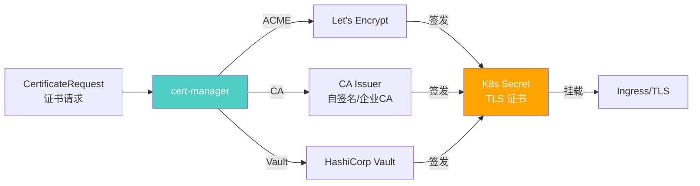

### 安装 cert-manager

```bash
# 安装 cert-manager
kubectl apply -f https://github.com/cert-manager/cert-manager/releases/latest/download/cert-manager.yaml

# 验证
kubectl get pods -n cert-manager
```

### ClusterIssuer 配置

```yaml
# Let's Encrypt 生产环境
apiVersion: cert-manager.io/v1
kind: ClusterIssuer
metadata:
  name: letsencrypt-prod
spec:
  acme:
    server: https://acme-v02.api.letsencrypt.org/directory
    email: admin@example.com
    privateKeySecretRef:
      name: letsencrypt-prod
    solvers:
      - http01:
          ingress:
            class: nginx
      - dns01:
          azureDNS:
            clientID: xxxxxxxx-xxxx-xxxx-xxxx-xxxxxxxxxxxx
            clientSecretSecretRef:
              name: azuredns-config
              key: client-secret
            subscriptionID: xxxxxxxx-xxxx-xxxx-xxxx-xxxxxxxxxxxx
            resourceGroupName: dns-resource-group
            hostedZoneName: example.com
---
# Let's Encrypt 测试环境（不受信任，用于测试）
apiVersion: cert-manager.io/v1
kind: ClusterIssuer
metadata:
  name: letsencrypt-staging
spec:
  acme:
    server: https://acme-staging-v02.api.letsencrypt.org/directory
    email: admin@example.com
    privateKeySecretRef:
      name: letsencrypt-staging
    solvers:
      - http01:
          ingress:
            class: nginx
```

### Ingress 自动签发证书

```yaml
apiVersion: networking.k8s.io/v1
kind: Ingress
metadata:
  name: myapp
  namespace: production
  annotations:
    cert-manager.io/cluster-issuer: letsencrypt-prod
    cert-manager.io/duration: 2160h      # 90 天
    cert-manager.io/renew-before: 360h   # 提前 15 天续期
spec:
  ingressClassName: nginx
  tls:
    - hosts:
        - myapp.example.com
      secretName: myapp-tls  # 自动创建的 Secret
  rules:
    - host: myapp.example.com
      http:
        paths:
          - path: /
            pathType: Prefix
            backend:
              service:
                name: myapp
                port:
                  number: 80
```

### 手动签发证书

```yaml
apiVersion: cert-manager.io/v1
kind: Certificate
metadata:
  name: myapp-cert
  namespace: production
spec:
  secretName: myapp-tls
  duration: 2160h    # 90 天
  renewBefore: 360h  # 提前 15 天续期
  issuerRef:
    name: letsencrypt-prod
    kind: ClusterIssuer
  dnsNames:
    - myapp.example.com
    - api.example.com
  ipAddresses:
    - 10.0.0.1
  usages:
    - server auth
    - client auth
  privateKey:
    algorithm: ECDSA
    size: 256
```

---

## 安全基线

### CIS Kubernetes Benchmark

CIS（Center for Internet Security）提供了 Kubernetes 安全基线检查标准：

```bash
# 安装 kube-bench
kubectl apply -f https://raw.githubusercontent.com/aquasecurity/kube-bench/main/job.yaml

# 运行检查
kubectl logs job/kube-bench

# 也可以直接在节点上运行
docker run --pid=host -v /etc:/etc:ro \
  -v /var:/var:ro \
  -v $(which kubectl):/usr/local/bin/kubectl \
  aquasec/kube-bench:latest run --targets master,node,etcd,policies
```

### 关键检查项

| 类别 | 检查项 | 建议 |
|------|--------|------|
| **API Server** | 匿名认证 | 禁用 `--anonymous-auth=false` |
| **API Server** | 审计日志 | 启用 `--audit-log-path` |
| **API Server** | RBAC | 确保 `--authorization-mode=RBAC` |
| **API Server** | 加密 | 启用 EncryptionConfiguration |
| **etcd** | 自动 TLS | 启用 `--auto-tls=false` |
| **etcd** | 客户端证书认证 | 启用 `--client-cert-auth` |
| **Controller Manager** | ServiceAccount Token | 禁用自动挂载（旧版本） |
| **Scheduler** | 端口绑定 | 禁用非安全端口 |
| **kubelet** | 匿名认证 | 禁用 `--anonymous-auth=false` |
| **kubelet** | 只读端口 | 禁用 `--read-only-port=0` |

---

## 审计日志

### Audit Policy 配置

```yaml
# /etc/kubernetes/audit-policy.yaml
apiVersion: audit.k8s.io/v1
kind: Policy
rules:
  # 不记录 readiness/liveness 探针
  - level: None
    userGroups: ["system:nodes"]
    verbs: ["get"]
    resources:
      - group: ""
        resources: ["nodes", "nodes/status"]

  # 不记录系统 GET 请求
  - level: None
    userGroups: ["system:authenticated", "system:unauthenticated"]
    nonResourceURLs:
      - "/api*"
      - "/version"
      - "/healthz"
      - "/readyz"
      - "/livez"
    verbs: ["get"]

  # Secret 访问仅记录元数据（不记录内容）
  - level: Metadata
    resources:
      - group: ""
        resources: ["secrets"]

  # RBAC 变更记录完整请求体
  - level: RequestResponse
    resources:
      - group: "rbac.authorization.k8s.io"
        resources: ["roles", "rolebindings", "clusterroles", "clusterrolebindings"]

  # 安全相关资源变更记录完整请求体
  - level: RequestResponse
    resources:
      - group: ""
        resources: ["serviceaccounts", "podsecuritypolicies"]
      - group: "networking.k8s.io"
        resources: ["networkpolicies"]
      - group: "admissionregistration.k8s.io"
        resources: ["validatingwebhookconfigurations", "mutatingwebhookconfigurations"]

  # 删除操作记录请求体
  - level: Request
    verbs: ["delete", "deletecollection"]

  # 其他操作记录元数据
  - level: Metadata
    omitStages:
      - RequestReceived
```

### API Server 审计配置

```bash
# 在 API Server 启动参数中添加
--audit-policy-file=/etc/kubernetes/audit-policy.yaml
--audit-log-path=/var/log/kubernetes/audit.log
--audit-log-maxage=30          # 保留 30 天
--audit-log-maxbackup=10       # 最多 10 个备份
--audit-log-maxsize=200        # 单个文件最大 200MB
--audit-log-format=json        # JSON 格式
```

### 审计日志分析

```bash
# 查找对 Secret 的访问
cat /var/log/kubernetes/audit.log | jq 'select(.objectRef.resource=="secrets")'

# 查找失败的请求
cat /var/log/kubernetes/audit.log | jq 'select(.responseStatus.code >= 400)'

# 查找特定用户的操作
cat /var/log/kubernetes/audit.log | jq 'select(.user.username=="admin")'

# 查找删除操作
cat /var/log/kubernetes/audit.log | jq 'select(.verb=="delete")'
```

---

## 准入控制器

### 准入控制流程

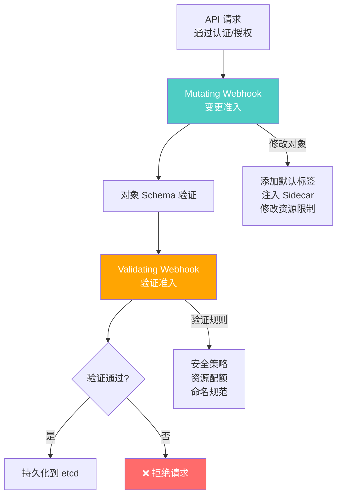

### OPA Gatekeeper

OPA Gatekeeper 是基于 Open Policy Agent 的 Kubernetes 准入控制器：

```yaml
# 安装 Gatekeeper
kubectl apply -f https://raw.githubusercontent.com/open-policy-agent/gatekeeper/release-3.14/deploy/gatekeeper.yaml
```

```yaml
# ConstraintTemplate - 策略模板
apiVersion: templates.gatekeeper.sh/v1
kind: ConstraintTemplate
metadata:
  name: k8srequiredlabels
spec:
  crd:
    spec:
      names:
        kind: K8sRequiredLabels
      validation:
        openAPIV3Schema:
          type: object
          properties:
            labels:
              type: array
              items:
                type: string
  targets:
    - target: admission.k8s.gatekeeper.sh
      rego: |
        violation[{"msg": msg}] {
          provided := {label | input.review.object.metadata.labels[label]}
          required := {label | label := input.parameters.labels[_]}
          missing := required - provided
          count(missing) > 0
          msg := sprintf("Missing required labels: %v", [missing])
        }
---
# Constraint - 策略实例
apiVersion: constraints.gatekeeper.sh/v1beta1
kind: K8sRequiredLabels
metadata:
  name: require-app-label
spec:
  match:
    kinds:
      - apiGroups: [""]
        kinds: ["Pod", "Deployment"]
    namespaces:
      - production
      - staging
  parameters:
    labels:
      - app.kubernetes.io/name
      - app.kubernetes.io/instance
      - app.kubernetes.io/managed-by
```

```yaml
# 禁止特权容器
apiVersion: templates.gatekeeper.sh/v1
kind: ConstraintTemplate
metadata:
  name: k8sblockprivileged
spec:
  crd:
    spec:
      names:
        kind: K8sBlockPrivileged
  targets:
    - target: admission.k8s.gatekeeper.sh
      rego: |
        violation[{"msg": msg}] {
          container := input.review.object.spec.containers[_]
          container.securityContext.privileged == true
          msg := sprintf("Privileged container is not allowed: %v", [container.name])
        }
        violation[{"msg": msg}] {
          container := input.review.object.spec.initContainers[_]
          container.securityContext.privileged == true
          msg := sprintf("Privileged init container is not allowed: %v", [container.name])
        }
---
apiVersion: constraints.gatekeeper.sh/v1beta1
kind: K8sBlockPrivileged
metadata:
  name: block-privileged-containers
spec:
  match:
    kinds:
      - apiGroups: [""]
        kinds: ["Pod"]
      - apiGroups: ["apps"]
        kinds: ["Deployment", "StatefulSet", "DaemonSet"]
```

### Kyverno

Kyverno 是 Kubernetes 原生的策略引擎，使用 YAML 而非 Rego：

```bash
# 安装 Kyverno
kubectl create -f https://github.com/kyverno/kyverno/releases/latest/download/install.yaml
```

```yaml
# 要求标签
apiVersion: kyverno.io/v1
kind: ClusterPolicy
metadata:
  name: require-labels
spec:
  validationFailureAction: Enforce  # Enforce=阻断, Audit=仅审计
  background: true
  rules:
    - name: check-for-labels
      match:
        any:
          - resources:
              kinds:
                - Pod
                - Deployment
              namespaces:
                - production
      validate:
        message: "必须包含 app.kubernetes.io/name 标签"
        pattern:
          metadata:
            labels:
              app.kubernetes.io/name: "?*"
```

```yaml
# 自动添加默认资源限制
apiVersion: kyverno.io/v1
kind: ClusterPolicy
metadata:
  name: add-default-resources
spec:
  validationFailureAction: Audit
  rules:
    - name: add-default-requests
      match:
        any:
          - resources:
              kinds:
                - Pod
      mutate:
        patchStrategicMerge:
          spec:
            containers:
              - (name): "?*"
                resources:
                  requests:
                    +(cpu): "100m"
                    +(memory): "128Mi"
                  limits:
                    +(cpu): "1"
                    +(memory): "512Mi"
```

```yaml
# 禁止 latest 标签
apiVersion: kyverno.io/v1
kind: ClusterPolicy
metadata:
  name: disallow-latest-tag
spec:
  validationFailureAction: Enforce
  rules:
    - name: require-image-tag
      match:
        any:
          - resources:
              kinds:
                - Pod
      validate:
        message: "镜像必须指定标签，不能使用 latest"
        pattern:
          spec:
            containers:
              - image: "!*:latest"
```

```yaml
# 自动注入 Sidecar
apiVersion: kyverno.io/v1
kind: ClusterPolicy
metadata:
  name: inject-sidecar
spec:
  rules:
    - name: inject-logging-sidecar
      match:
        any:
          - resources:
              kinds:
                - Deployment
              namespaces:
                - production
      mutate:
        patchStrategicMerge:
          spec:
            template:
              spec:
                containers:
                  - name: log-collector
                    image: fluent/fluent-bit:2.2
                    resources:
                      requests:
                        cpu: 50m
                        memory: 64Mi
                      limits:
                        cpu: 200m
                        memory: 128Mi
```

### Gatekeeper vs Kyverno 对比

| 维度 | OPA Gatekeeper | Kyverno |
|------|---------------|---------|
| **策略语言** | Rego | YAML |
| **学习曲线** | 较陡（Rego 语言） | 平缓（纯 YAML） |
| **变更策略** | mutate + validate | mutate + validate + generate |
| **性能** | 较好（编译 Rego） | 较好 |
| **社区** | CNCF 毕业项目 | CNCF 孵化项目 |
| **策略复用** | ConstraintTemplate 模板 | 内置策略库 |
| **报告** | 审计日志 | 策略报告 CRD |
| **适用场景** | 复杂策略逻辑 | 通用策略管理 |

---

## 安全扫描

### kube-bench

```bash
# 运行 CIS Benchmark 检查
kube-bench run --targets master,node,etcd,policies

# 检查特定版本
kube-bench run --benchmark k8s-v1.27

# JSON 格式输出
kube-bench run --targets master -j
```

### kubeaudit

```bash
# 安装 kubeaudit
go install github.com/Shopify/kubeaudit@latest

# 扫描集群
kubeaudit all

# 扫描特定命名空间
kubeaudit all -n production

# 扫描特定检查项
kubeaudit runAsNonRootPSCTrueFalseV1
kubeaudit allowPrivilegeEscalationV1

# 生成修复建议
kubeaudit all --fix
```

### Trivy

```bash
# 扫描集群漏洞
trivy k8s --report summary cluster

# 扫描特定命名空间
trivy k8s -n production --report all

# 扫描镜像漏洞
trivy image myregistry.azurecr.io/myapp:v2.0.1

# CI 集成
trivy image --exit-code 1 --severity CRITICAL,HIGH myapp:latest
```

---

## 安全最佳实践清单

### 集群安全

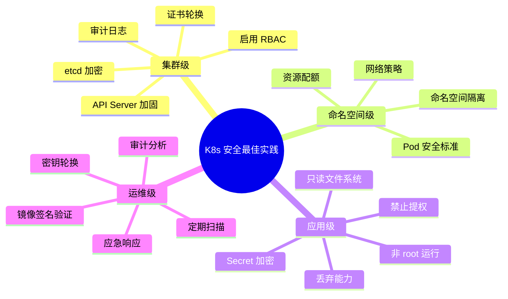

::: tip 生产环境安全检查清单
1. **启用 RBAC** 并遵循最小权限原则
2. **配置 Pod 安全标准** 至少 baseline 级别
3. **部署 NetworkPolicy** 默认拒绝所有流量
4. **启用 Secret 加密** 使用 EncryptionConfiguration
5. **配置审计日志** 记录关键操作
6. **部署准入控制器** Gatekeeper/Kyverno 策略
7. **使用 cert-manager** 自动管理 TLS 证书
8. **为每个应用创建专用 ServiceAccount** 不使用 default
9. **定期运行 kube-bench** 检查 CIS 基线
10. **镜像安全扫描** Trivy 集成 CI/CD
11. **Secret 外置管理** ESO/Sealed Secrets
12. **定期轮换证书和密钥** 设置自动续期
13. **限制 API Server 访问** 网络层 + 认证层
14. **监控安全事件** 审计日志 + SIEM 集成
15. **制定应急响应计划** 安全事件处理流程
:::

---

## 安全运维命令速查

### RBAC 调试

```bash
# 检查用户权限
kubectl auth can-i list pods --as alice -n production
kubectl auth can-i create deployments --as alice -n production

# 检查 ServiceAccount 权限
kubectl auth can-i list secrets --as=system:serviceaccount:production:myapp-sa -n production

# 查看角色绑定
kubectl get rolebindings -n production
kubectl get clusterrolebindings

# 查看角色详情
kubectl describe role developer -n production
kubectl describe clusterrole cluster-admin

# 检查谁能执行特定操作
kubectl auth can-i --list --as alice -n production

# 查看 ServiceAccount 关联的角色
kubectl auth can-i --list --as=system:serviceaccount:production:myapp-sa -n production
```

### 安全检查

```bash
# 检查特权 Pod
kubectl get pods --all-namespaces -o json | \
  jq '.items[] | select(.spec.containers[].securityContext.privileged==true) | .metadata.name'

# 检查以 root 运行的 Pod
kubectl get pods --all-namespaces -o json | \
  jq '.items[] | select(.spec.securityContext.runAsUser==0 or .spec.containers[].securityContext.runAsUser==0) | .metadata.name'

# 检查 latest 标签
kubectl get pods --all-namespaces -o json | \
  jq '.items[] | .spec.containers[] | select(.image | test(":latest$")) | .image'

# 检查 NetworkPolicy
kubectl get networkpolicy --all-namespaces

# 检查 Pod 安全标签
kubectl get namespaces --show-labels | grep pod-security
```

---

## 总结

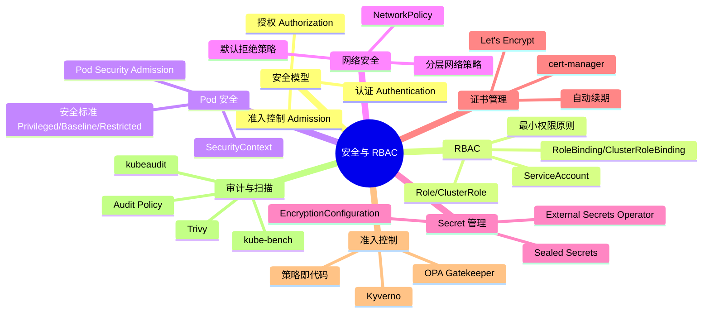

::: important 安全是一个持续过程
Kubernetes 安全不是一次性的配置，而是持续的过程：
1. **定期审计**：每月运行 CIS Benchmark 检查
2. **持续监控**：实时监控安全事件和配置漂移
3. **及时更新**：跟进 Kubernetes 安全公告，及时升级补丁
4. **策略演进**：随着威胁模型变化，更新安全策略
5. **团队培训**：定期进行安全意识培训
:::
