# 多集群与混合云

## 多集群管理需求与挑战

### 为什么需要多集群？

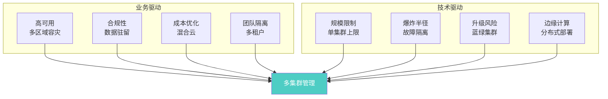

### 多集群核心挑战

| 挑战 | 说明 | 解决思路 |
|------|------|---------|
| **应用分发** | 如何将应用部署到多个集群 | Karmada/ArgoCD 多集群 |
| **服务发现** | 跨集群服务如何互相发现 | MCS/Service Mesh |
| **网络连通** | 跨集群网络如何打通 | Submariner/Skupper |
| **配置同步** | 配置如何在集群间同步 | GitOps/PropagationPolicy |
| **流量管理** | 跨集群流量如何路由 | 全局 Ingress/Service Mesh |
| **可观测性** | 多集群指标如何聚合 | Thanio/VictoriaMetrics |
| **安全策略** | RBAC/NetworkPolicy 如何统一 | Kyverno/Gatekeeper 同步 |
| **运维复杂度** | 日常运维成本倍增 | 自动化/自服务 |

### 多集群架构模式

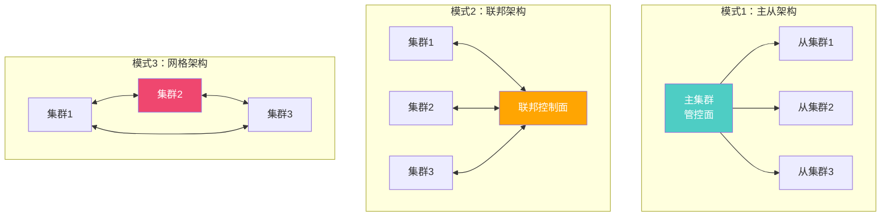

---

## KubeFed 联邦

### KubeFed 架构

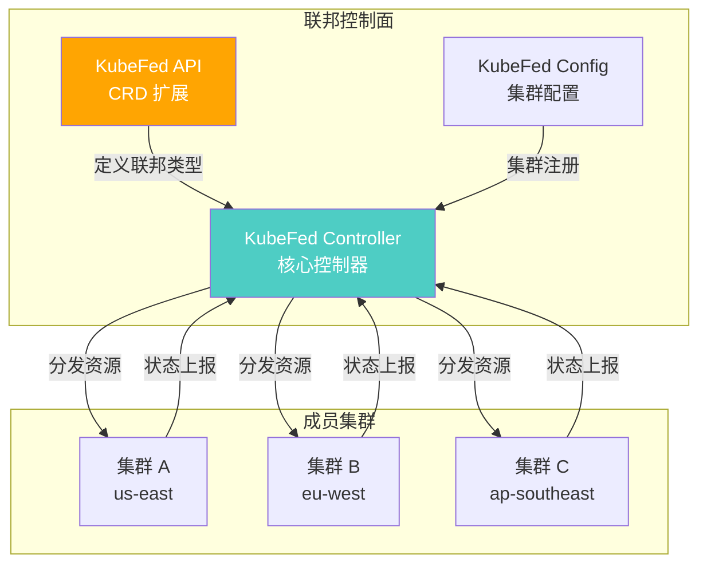

### KubeFed 核心概念

```yaml
# 集群注册 - FederatedCluster
apiVersion: core.kubefed.io/v1beta1
kind: FederatedCluster
metadata:
  name: cluster-us-east
  namespace: kube-federation-system
spec:
  apiEndpoint: https://cluster-us-east.example.com
  tlsClientConfig:
    caBundle: <CA_BUNDLE>
    certificate: <CLIENT_CERT>
    key: <CLIENT_KEY>
```

```yaml
# 联邦类型配置 - FederatedTypeConfig
apiVersion: core.kubefed.io/v1beta1
kind: FederatedTypeConfig
metadata:
  name: deployments.apps
  namespace: kube-federation-system
spec:
  federatedType:
    group: types.kubefed.io
    kind: FederatedDeployment
    pluralName: federateddeployments
    version: v1beta1
  propagation: Enabled  # 启用分发
  targetType:
    group: apps
    kind: Deployment
    pluralName: deployments
    version: v1
```

```yaml
# 联邦 Deployment
apiVersion: types.kubefed.io/v1beta1
kind: FederatedDeployment
metadata:
  name: myapp
  namespace: production
spec:
  template:
    # 基础 Deployment 模板
    metadata:
      labels:
        app: myapp
    spec:
      replicas: 5
      selector:
        matchLabels:
          app: myapp
      template:
        spec:
          containers:
            - name: myapp
              image: myapp:v2.0.1
              ports:
                - containerPort: 8080
  placement:
    # 分发到哪些集群
    clusters:
      - name: cluster-us-east
      - name: cluster-eu-west
      - name: cluster-ap-southeast
  overrides:
    # 集群级覆盖
    - clusterName: cluster-us-east
      clusterOverrides:
        - path: /spec/replicas
          value: 3
    - clusterName: cluster-eu-west
      clusterOverrides:
        - path: /spec/replicas
          value: 2
    - clusterName: cluster-ap-southeast
      clusterOverrides:
        - path: /spec/template/spec/containers/0/image
          value: myapp:v2.0.1-asia
```

::: warning KubeFed 现状
KubeFed 已于 2022 年归档，不再积极维护。推荐使用 Karmada 作为替代方案。Karmada 兼容 KubeFed 的 API 概念，但提供了更强大的调度和分发能力。
:::

---

## Karmada 多云编排

### Karmada 架构

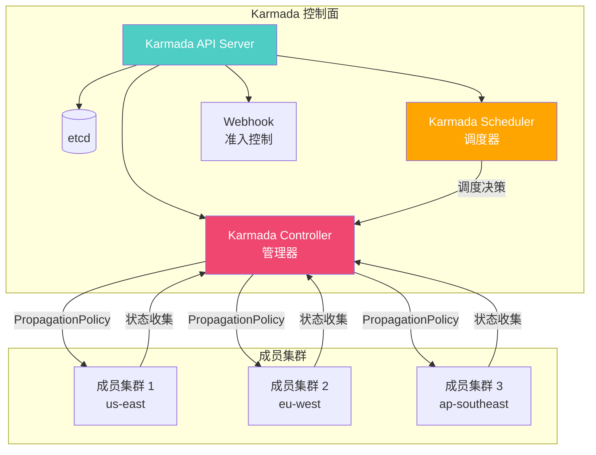

### 安装 Karmada

```bash
# 安装 Karmada 控制面
helm repo add karmada https://karmada-io.github.io/charts
helm repo update

# 安装 Karmada
helm install karmada karmada/karmada \
  --namespace karmada-system \
  --create-namespace \
  --set certManager.enabled=true \
  --set apiServer.replicas=3

# 注册成员集群
kubectl karmada join cluster-us-east \
  --cluster-kubeconfig=/path/to/cluster-us-east.kubeconfig \
  --cluster-context=cluster-us-east

# 查看成员集群
kubectl get clusters
```

### PropagationPolicy

```yaml
# 分发策略 - 将资源分发到指定集群
apiVersion: policy.karmada.io/v1alpha1
kind: PropagationPolicy
metadata:
  name: myapp-propagation
  namespace: production
spec:
  resourceSelectors:
    - apiVersion: apps/v1
      kind: Deployment
      name: myapp
    - apiVersion: v1
      kind: Service
      name: myapp
    - apiVersion: networking.k8s.io/v1
      kind: Ingress
      name: myapp
  placement:
    clusterAffinity:
      clusterNames:
        - cluster-us-east
        - cluster-eu-west
        - cluster-ap-southeast
    clusterTolerations:
      - key: "cluster.karmada.io/health"
        operator: "Equal"
        value: "Ready"
        effect: "NoExecute"
    spreadConstraints:
      - maxGroups: 1
        minGroups: 1
        spreadByField: cluster
  schedulingMode: Duplicated  # Duplicated 或 Divided
---
# 分发策略 - 按比例分配副本
apiVersion: policy.karmada.io/v1alpha1
kind: PropagationPolicy
metadata:
  name: myapp-divided
  namespace: production
spec:
  resourceSelectors:
    - apiVersion: apps/v1
      kind: Deployment
      name: myapp
  placement:
    clusterAffinity:
      clusterNames:
        - cluster-us-east
        - cluster-eu-west
        - cluster-ap-southeast
    replicaScheduling:
      replicaDivisionPreference: Weighted
      replicaSchedulingType: Divided
      weightPreference:
        staticWeightList:
          - targetCluster:
              clusterNames:
                - cluster-us-east
            weight: 3
          - targetCluster:
              clusterNames:
                - cluster-eu-west
            weight: 2
          - targetCluster:
              clusterNames:
                - cluster-ap-southeast
            weight: 1
```

### OverridePolicy

```yaml
# 覆盖策略 - 集群级配置差异
apiVersion: policy.karmada.io/v1alpha1
kind: OverridePolicy
metadata:
  name: myapp-override
  namespace: production
spec:
  resourceSelectors:
    - apiVersion: apps/v1
      kind: Deployment
      name: myapp
  overrideRules:
    - targetCluster:
        clusterNames:
          - cluster-us-east
      overriders:
        plaintext:
          - path: /spec/template/spec/containers/0/env/-
            operator: add
            value:
              name: REGION
              value: us-east
        imageOverrider:
          - component: Repository
            operator: replace
            value: us-east-registry.azurecr.io/myapp
    - targetCluster:
        clusterNames:
          - cluster-eu-west
      overriders:
        plaintext:
          - path: /spec/template/spec/containers/0/env/-
            operator: add
            value:
              name: REGION
              value: eu-west
        imageOverrider:
          - component: Repository
            operator: replace
            value: eu-west-registry.azurecr.io/myapp
```

### 多集群 Service 导出

```yaml
# 导出 Service 到多集群
apiVersion: multicluster.x-k8s.io/v1alpha1
kind: ServiceExport
metadata:
  name: myapp
  namespace: production
---
# 导入多集群 Service
apiVersion: multicluster.x-k8s.io/v1alpha1
kind: ServiceImport
metadata:
  name: myapp
  namespace: production
spec:
  type: ClusterSetIP
  ports:
    - port: 80
      protocol: TCP
  ips:
    - 10.96.0.100  # 跨集群虚拟 IP
```

---

## Cluster API 集群生命周期管理

### Cluster API 概述

Cluster API（CAPI）是 Kubernetes 官方的集群生命周期管理项目，使用声明式 API 管理集群的创建、升级和销毁：

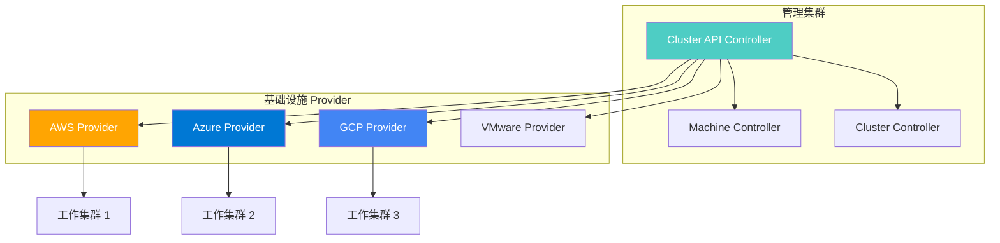

### Cluster API 核心概念

```yaml
# Cluster - 集群定义
apiVersion: cluster.x-k8s.io/v1beta1
kind: Cluster
metadata:
  name: production-cluster
  namespace: default
spec:
  clusterNetwork:
    pods:
      cidrBlocks: ["10.100.0.0/16"]
    services:
      cidrBlocks: ["10.200.0.0/16"]
  controlPlaneRef:
    apiVersion: controlplane.cluster.x-k8s.io/v1beta1
    kind: KubeadmControlPlane
    name: production-cp
  infrastructureRef:
    apiVersion: infrastructure.cluster.x-k8s.io/v1beta1
    kind: AzureCluster
    name: production-cluster
---
# AzureCluster - Azure 基础设施
apiVersion: infrastructure.cluster.x-k8s.io/v1beta1
kind: AzureCluster
metadata:
  name: production-cluster
spec:
  location: eastus
  networkSpec:
    vnet:
      name: production-vnet
      cidrBlock: "10.0.0.0/16"
    subnets:
      - name: control-plane-subnet
        cidrBlock: "10.0.1.0/24"
        role: control-plane
      - name: node-subnet
        cidrBlock: "10.0.2.0/24"
        role: node
  identityRef:
    kind: AzureClusterIdentity
    name: cluster-identity
---
# KubeadmControlPlane - 控制面
apiVersion: controlplane.cluster.x-k8s.io/v1beta1
kind: KubeadmControlPlane
metadata:
  name: production-cp
spec:
  replicas: 3
  machineTemplate:
    infrastructureRef:
      apiVersion: infrastructure.cluster.x-k8s.io/v1beta1
      kind: AzureMachineTemplate
      name: control-plane
  version: v1.28.0
  kubeadmConfigSpec:
    clusterConfiguration:
      apiServer:
        extraArgs:
          enable-admission-plugins: NodeRestriction,PodSecurityPolicy
      controllerManager:
        extraArgs:
          bind-address: "0.0.0.0"
    initConfiguration:
      nodeRegistration:
        kubeletExtraArgs:
          eviction-hard: "memory.available<256Mi"
    joinConfiguration:
      nodeRegistration:
        kubeletExtraArgs:
          eviction-hard: "memory.available<256Mi"
---
# MachineDeployment - 工作节点
apiVersion: cluster.x-k8s.io/v1beta1
kind: MachineDeployment
metadata:
  name: production-md
spec:
  clusterName: production-cluster
  replicas: 5
  selector:
    matchLabels:
      cluster.x-k8s.io/cluster-name: production-cluster
  template:
    spec:
      clusterName: production-cluster
      bootstrap:
        configRef:
          apiVersion: bootstrap.cluster.x-k8s.io/v1beta1
          kind: KubeadmConfigTemplate
          name: production-worker
      infrastructureRef:
        apiVersion: infrastructure.cluster.x-k8s.io/v1beta1
        kind: AzureMachineTemplate
        name: worker-node
      version: v1.28.0
```

### 集群升级

```bash
# 使用 Cluster API 升级集群
# 1. 升级控制面
kubectl patch kubeadmcontrolplane production-cp \
  --type merge -p '{"spec":{"version":"v1.29.0"}}'

# 2. 升级工作节点（滚动更新）
kubectl patch machinedeployment production-md \
  --type merge -p '{"spec":{"template":{"spec":{"version":"v1.29.0"}}}}'

# 查看升级状态
kubectl get kubeadmcontrolplane production-cp -o yaml
kubectl get machinedeployment production-md -o yaml
```

---

## 多集群服务发现

### Multi-Cluster Services（MCS）

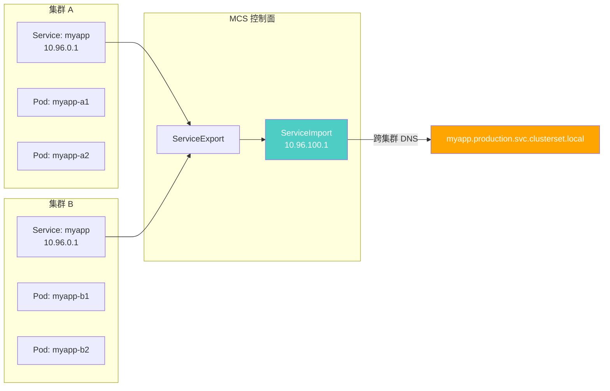

### Submariner 跨集群网络

```bash
# 安装 Submariner
subctl deploy-broker --kubeconfig cluster-a.kubeconfig

# 加入集群
subctl join --kubeconfig cluster-a.kubeconfig \
  --broker-uri broker.submariner.io:8080 \
  --clusterid cluster-a \
  --natt=false

subctl join --kubeconfig cluster-b.kubeconfig \
  --broker-uri broker.submariner.io:8080 \
  --clusterid cluster-b \
  --natt=false

# 验证连通性
subctl verify --kubeconfig cluster-a.kubeconfig \
  --kubeconfig2 cluster-b.kubeconfig \
  --service-discovery --connectivity
```

```yaml
# 跨集群 Service 发现
# 集群 A 中的 Service
apiVersion: v1
kind: Service
metadata:
  name: myapp
  namespace: production
spec:
  type: ClusterIP
  ports:
    - port: 80
      targetPort: 8080
  selector:
    app: myapp
---
# 导出 Service
apiVersion: multicluster.x-k8s.io/v1alpha1
kind: ServiceExport
metadata:
  name: myapp
  namespace: production
```

在集群 B 中访问：`myapp.production.svc.clusterset.local`

---

## 混合云架构

### 混合云架构图

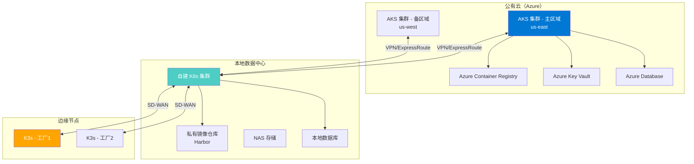

### 混合云设计原则

::: important 混合云设计原则
1. **控制面统一**：使用 Karmada/ArgoCD 统一管理多集群
2. **数据面分离**：数据按合规要求在本地或云上存储
3. **网络互通**：VPN/专线打通云上和本地网络
4. **镜像同步**：云上镜像仓库同步到本地 Harbor
5. **配置分层**：基础配置统一，环境差异覆盖
6. **流量路由**：全局 DNS + 流量管理实现就近访问
:::

---

## 云厂商托管 K8s 对比

### AKS / EKS / GKE 对比

| 维度 | AKS (Azure) | EKS (AWS) | GKE (Google) |
|------|------------|-----------|-------------|
| **控制面费用** | 免费 | $0.10/小时 | 免费（Autopilot 含） |
| **自动升级** | 支持（可配置窗口） | 需手动或 EKS Anywhere | 自动（灵活策略） |
| **节点自动伸缩** | 支持 | 支持（需配置） | 原生支持（Autopilot） |
| **Serverless** | AKS Virtual Nodes | Fargate | Autopilot |
| **CNI** | Azure CNI / Kubenet | VPC CNI | VPC-native |
| **Ingress** | Application Gateway Ingress | ALB Ingress Controller | GKE Ingress |
| **Secret 管理** | Azure Key Vault Provider | AWS Secrets Manager | Secret Manager |
| **Identity** | Azure AD | IAM | Cloud IAM |
| **监控** | Azure Monitor | CloudWatch | Cloud Monitoring |
| **SLA** | 99.95%（付费） | 99.95% | 99.95% |
| **K8s 版本支持** | 最新 3 个小版本 | 最新 4 个小版本 | 最新 3 个小版本 |
| **Windows 容器** | 支持 | 支持 | 支持 |

### AKS 生产配置

```yaml
# AKS 集群配置（Terraform）
resource "azurerm_kubernetes_cluster" "production" {
  name                = "aks-production"
  location            = azurerm_resource_group.main.location
  resource_group_name = azurerm_resource_group.main.name
  dns_prefix          = "aks-prod"
  kubernetes_version  = "1.28.0"

  default_node_pool {
    name                = "system"
    vm_size             = "Standard_D4s_v5"
    os_disk_size_gb     = 128
    vnet_subnet_id      = azurerm_subnet.system.id
    enable_auto_scaling = true
    min_count           = 3
    max_count           = 5
    max_pods            = 50
    node_labels = {
      "kubernetes.io/role" = "system"
    }
  }

  identity {
    type = "SystemAssigned"
  }

  network_profile {
    network_plugin    = "azure"
    network_policy    = "calico"
    service_cidr      = "10.200.0.0/16"
    dns_service_ip    = "10.200.0.10"
    load_balancer_sku = "standard"
  }

  azure_active_directory_role_based_access_control {
    managed                = true
    azure_rbac_enabled     = true
    admin_group_object_ids = [var.admin_group_id]
  }

  oms_agent {
    log_analytics_workspace_id = azurerm_log_analytics_workspace.main.id
  }

  azure_key_vault_secrets_provider {
    secret_rotation_enabled = true
  }

  workload_identity_enabled = true

  tags = {
    Environment = "production"
  }
}

# 用户节点池
resource "azurerm_kubernetes_cluster_node_pool" "workload" {
  name                  = "workload"
  kubernetes_cluster_id = azurerm_kubernetes_cluster.production.id
  vm_size               = "Standard_D8s_v5"
  os_disk_size_gb       = 128
  vnet_subnet_id        = azurerm_subnet.workload.id
  enable_auto_scaling   = true
  min_count             = 3
  max_count             = 20
  max_pods              = 50
  node_taints = [
    "workload=production:NoSchedule"
  ]
  node_labels = {
    "workload" = "production"
  }
}
```

---

## 边缘计算

### K3s 轻量级 Kubernetes

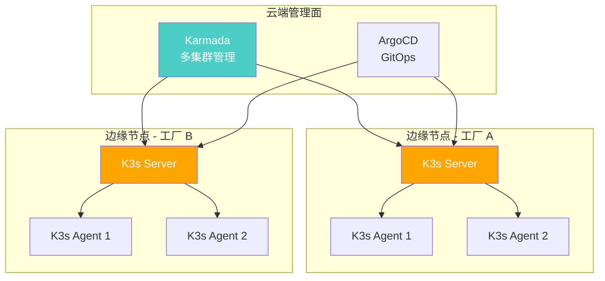

### K3s 安装

```bash
# 安装 K3s Server（控制面）
curl -sfL https://get.k3s.io | sh -s - server \
  --cluster-init \
  --tls-san=k3s.example.com \
  --disable=traefik \
  --write-kubeconfig-mode=644

# 获取 Token
cat /var/lib/rancher/k3s/server/token

# 加入 Agent 节点
curl -sfL https://get.k3s.io | K3S_URL=https://k3s.example.com:6443 \
  K3S_TOKEN=<TOKEN> sh -

# 高可用模式（嵌入式 etcd）
curl -sfL https://get.k3s.io | sh -s - server \
  --cluster-init \
  --tls-san=k3s.example.com

# 第二个 Server 节点
curl -sfL https://get.k3s.io | sh -s - server \
  --server https://k3s.example.com:6443 \
  --token <TOKEN>
```

### KubeEdge

```yaml
# CloudCore 配置
apiVersion: v1
kind: ConfigMap
metadata:
  name: cloudcore
  namespace: kubeedge
data:
  cloudcore.yaml: |
    cloudHub:
      advertiseAddress:
        - 10.0.0.100
      nodeLimit: 100
    edgeController:
      buffer:
        configMap: 1024
        pod: 1024
    modules:
      cloudHub:
        enable: true
        keepaliveInterval: 30
```

### 边缘计算对比

| 维度 | K3s | KubeEdge | MicroK8s |
|------|-----|----------|----------|
| **定位** | 轻量级 K8s | 边缘计算平台 | 轻量级 K8s |
| **最小资源** | 512MB RAM | 256MB RAM | 2GB RAM |
| **离线能力** | 有限 | 完全离线 | 有限 |
| **云端管理** | 需额外工具 | 内置 CloudCore | 需额外工具 |
| **设备管理** | 无 | DeviceMapper/CN | 无 |
| **消息协议** | K8s 原生 | WebSocket/QUIC | K8s 原生 |
| **适用场景** | 边缘服务器 | IoT/工业边缘 | 开发/测试 |

---

## 集群迁移策略

### 迁移流程

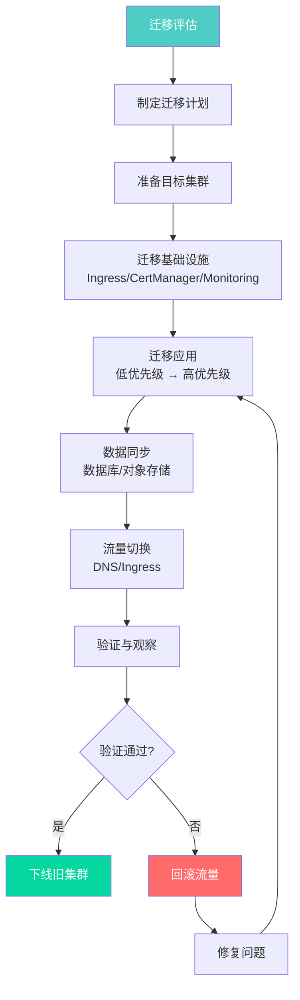

### 迁移步骤详解

#### 1. 迁移评估

```bash
# 评估旧集群资源
kubectl get deployments --all-namespaces -o json | \
  jq -r '.items[] | "\(.metadata.namespace)/\(.metadata.name): \(.spec.replicas) replicas"'

# 评估 CRD
kubectl get crd

# 评估 PV/PVC
kubectl get pv,pvc --all-namespaces

# 评估网络策略
kubectl get networkpolicy --all-namespaces

# 评估 RBAC
kubectl get clusterrole,clusterrolebinding
kubectl get role,rolebinding --all-namespaces
```

#### 2. 应用迁移

```bash
# 使用 Velero 备份
velero backup create full-backup \
  --include-namespaces production,staging \
  --include-resources deployments,services,configmaps,secrets,ingresses

# 在目标集群恢复
velero restore create --from-backup full-backup

# 仅迁移特定资源
velero backup create app-backup \
  --include-namespaces production \
  --include-resources deployments,services,configmaps,secrets

velero restore create --from-backup app-backup \
  --namespace-mappings production:production-new
```

#### 3. 流量切换

```yaml
# 使用权重逐步切换 DNS 流量
# 阶段1：10% 流量到新集群
apiVersion: externaldns.k8s.io/v1alpha1
kind: DNSEndpoint
metadata:
  name: myapp-migration
spec:
  endpoints:
    - dnsName: myapp.example.com
      recordTTL: 60
      recordType: A
      targets:
        - 10.0.1.100  # 旧集群 LB IP
        - 10.0.2.100  # 新集群 LB IP
      providerSpecific:
        - name: weight
          value: "90"  # 旧集群 90%
        - name: weight
          value: "10"  # 新集群 10%
```

```bash
# 使用 Global Load Balancer 切换
# Azure Traffic Manager / AWS Global Accelerator / GCP Cloud Load Balancing

# 阶段2：50% 流量
# 阶段3：100% 流量
# 阶段4：下线旧集群
```

### 数据同步

```yaml
# 数据库迁移策略
# 1. 全量导出 + 增量同步
# 2. 双写模式
# 3. CDC（Change Data Capture）

# PostgreSQL 迁移示例
apiVersion: batch/v1
kind: Job
metadata:
  name: db-migration
  namespace: production
spec:
  template:
    spec:
      containers:
        - name: migrate
          image: postgres:15
          command:
            - /bin/sh
            - -c
            - |
              # 全量导出
              pg_dump -h old-db -U postgres myapp > /tmp/full.sql
              # 导入新库
              psql -h new-db -U postgres myapp < /tmp/full.sql
              # 增量同步
              pg_dump -h old-db -U postgres --data-only --inserts myapp > /tmp/incremental.sql
              psql -h new-db -U postgres myapp < /tmp/incremental.sql
          env:
            - name: PGPASSWORD
              valueFrom:
                secretKeyRef:
                  name: db-credentials
                  key: password
      restartPolicy: OnFailure
```

---

## 多集群监控与告警

### Thanos 多集群监控

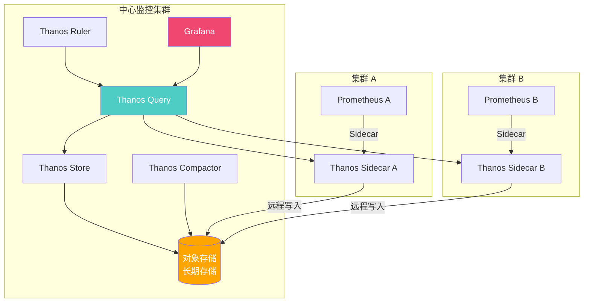

```yaml
# Thanos Query 配置
apiVersion: apps/v1
kind: Deployment
metadata:
  name: thanos-query
  namespace: monitoring
spec:
  replicas: 2
  selector:
    matchLabels:
      app: thanos-query
  template:
    spec:
      containers:
        - name: thanos-query
          image: thanosio/thanos:v0.34.0
          args:
            - query
            - --http-address=0.0.0.0:9090
            - --store=thanos-sidecar-cluster-a:10901
            - --store=thanos-sidecar-cluster-b:10901
            - --store=thanos-store:10901
            - --query.replica-label=replica
          ports:
            - containerPort: 9090
```

### 多集群告警规则

```yaml
# 多集群统一告警
apiVersion: monitoring.coreos.com/v1
kind: PrometheusRule
metadata:
  name: multi-cluster-alerts
  namespace: monitoring
spec:
  groups:
    - name: multi-cluster
      rules:
        - alert: ClusterUnreachable
          expr: up{job="thanos-sidecar"} == 0
          for: 5m
          labels:
            severity: critical
          annotations:
            summary: "集群 {{ $labels.cluster }} 不可达"
            description: "集群 {{ $labels.cluster }} 的 Thanos Sidecar 已离线超过 5 分钟"

        - alert: ClusterHighResourceUsage
          expr: |
            sum by (cluster) (kube_pod_container_resource_requests{resource="cpu"})
            /
            sum by (cluster) (kube_node_capacity{resource="cpu"})
            > 0.8
          for: 10m
          labels:
            severity: warning
          annotations:
            summary: "集群 {{ $labels.cluster }} 资源使用率过高"
```

---

## GitOps 多集群管理

### ArgoCD 多集群

```bash
# 添加目标集群
argocd cluster add cluster-us-east \
  --kubeconfig /path/to/kubeconfig

argocd cluster add cluster-eu-west \
  --kubeconfig /path/to/kubeconfig

# 查看已注册集群
argocd cluster list
```

```yaml
# 多集群 Application
apiVersion: argoproj.io/v1alpha1
kind: Application
metadata:
  name: myapp-us-east
  namespace: argocd
spec:
  project: default
  source:
    repoURL: https://github.com/example/myapp-gitops.git
    targetRevision: main
    path: overlays/us-east
  destination:
    name: cluster-us-east  # 引用注册的集群名
    namespace: production
  syncPolicy:
    automated:
      prune: true
      selfHeal: true
---
apiVersion: argoproj.io/v1alpha1
kind: Application
metadata:
  name: myapp-eu-west
  namespace: argocd
spec:
  project: default
  source:
    repoURL: https://github.com/example/myapp-gitops.git
    targetRevision: main
    path: overlays/eu-west
  destination:
    name: cluster-eu-west
    namespace: production
  syncPolicy:
    automated:
      prune: true
      selfHeal: true
```

### ApplicationSet 多集群

```yaml
# 基于集群列表自动生成 Application
apiVersion: argoproj.io/v1alpha1
kind: ApplicationSet
metadata:
  name: myapp-multi-cluster
  namespace: argocd
spec:
  generators:
    - list:
        elements:
          - cluster: cluster-us-east
            url: https://kubernetes.us-east.example.com
            region: us-east
            replicas: 3
          - cluster: cluster-eu-west
            url: https://kubernetes.eu-west.example.com
            region: eu-west
            replicas: 2
          - cluster: cluster-ap-southeast
            url: https://kubernetes.ap-southeast.example.com
            region: ap-southeast
            replicas: 2
  template:
    metadata:
      name: 'myapp-{{ region }}'
      labels:
        app: myapp
        region: '{{ region }}'
    spec:
      project: default
      source:
        repoURL: https://github.com/example/myapp-gitops.git
        targetRevision: main
        path: overlays/{{ region }}
        helm:
          parameters:
            - name: replicaCount
              value: '{{ replicas }}'
      destination:
        name: '{{ cluster }}'
        namespace: production
      syncPolicy:
        automated:
          prune: true
          selfHeal: true
        syncOptions:
          - CreateNamespace=true
```

---

## 总结

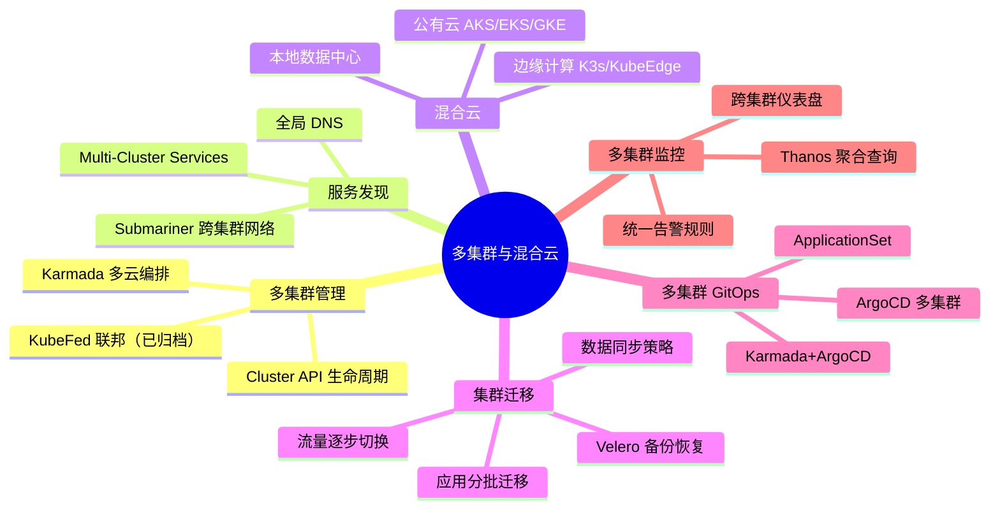

::: tip 多集群管理最佳实践
1. **统一管理面**：使用 Karmada 或 ArgoCD 作为统一管理入口
2. **声明式配置**：所有集群配置通过 GitOps 管理
3. **渐进式迁移**：低优先级应用先行，逐步迁移
4. **流量灰度切换**：避免一次性切换所有流量
5. **监控先行**：先建立多集群监控，再进行迁移
6. **网络打通**：使用 VPN/专线 + Submariner 确保跨集群网络连通
7. **数据就近**：数据存储在计算节点附近，减少延迟
8. **统一策略**：RBAC、NetworkPolicy、安全策略通过 Kyverno/Gatekeeper 统一分发
9. **定期演练**：定期进行跨集群故障切换演练
10. **成本优化**：混合云场景利用云上弹性 + 本地稳定算力
:::
