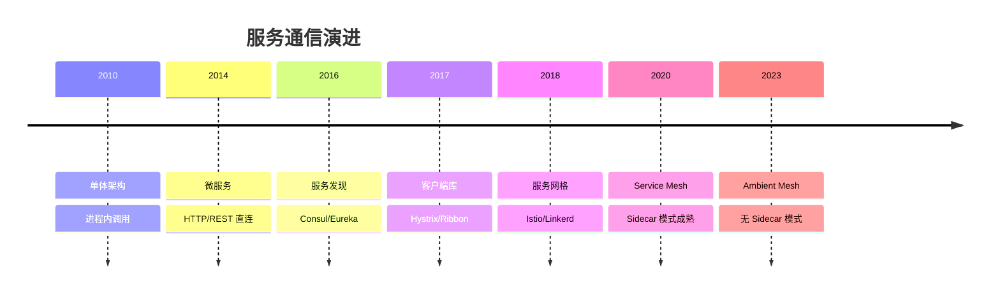
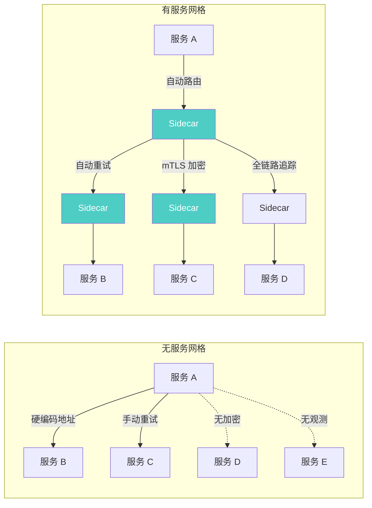
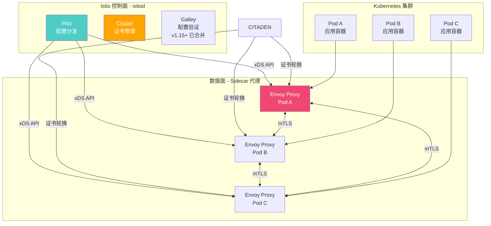
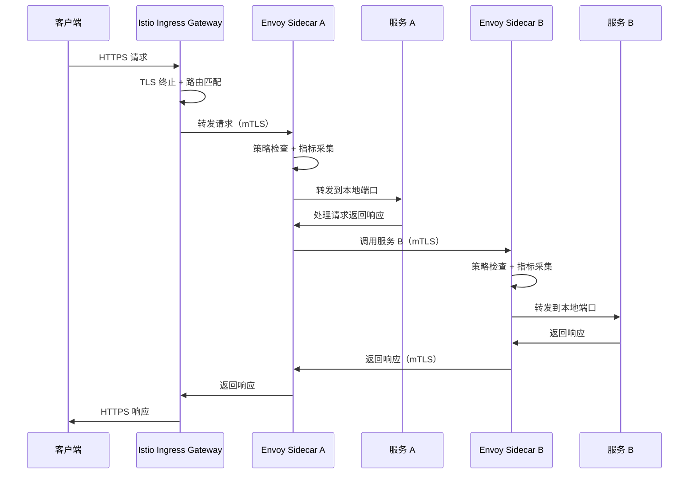
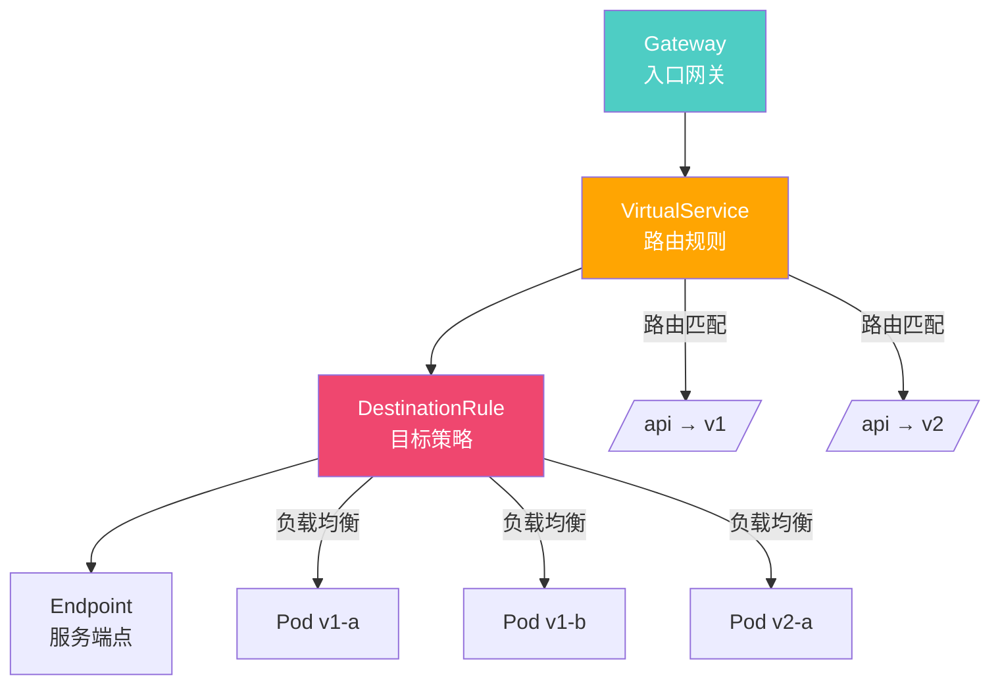
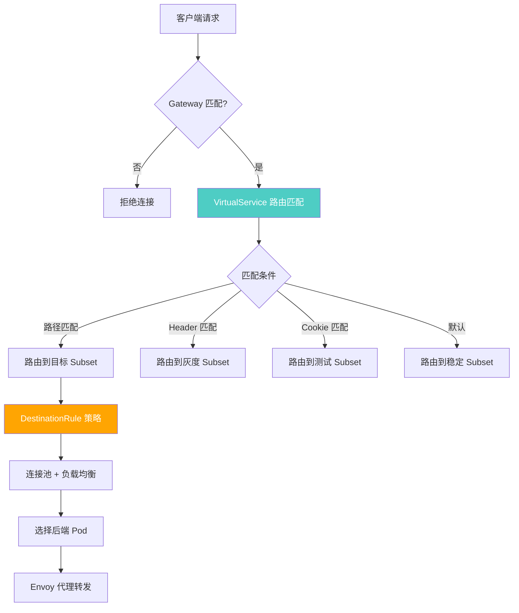
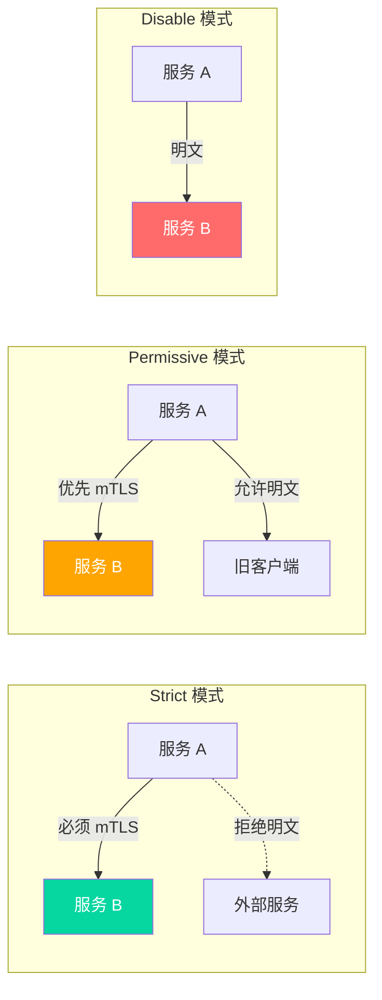
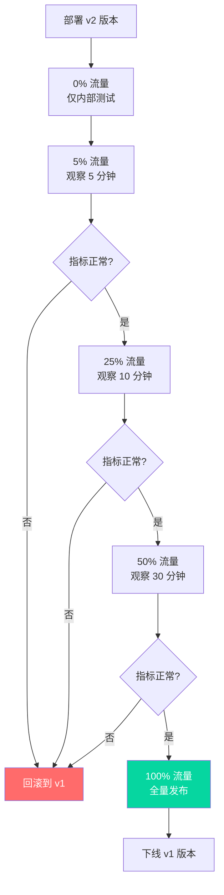
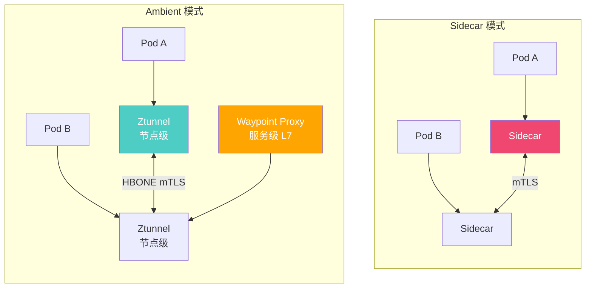
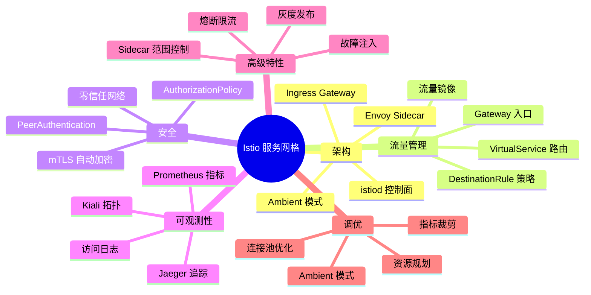

# 服务网格 Istio

## 服务网格演进与价值

### 从微服务到服务网格



### 为什么需要服务网格？



::: tip 服务网格核心价值
1. **流量管理**：细粒度路由、重试、超时、熔断，无需修改代码
2. **安全通信**：自动 mTLS、授权策略，零信任网络
3. **可观测性**：自动指标采集、分布式追踪、访问日志
4. **多语言支持**：语言无关的 Sidecar 代理，任何语言的服务都能受益
5. **策略即代码**：所有配置声明式管理，GitOps 友好
:::

---

## Istio 架构

### Istio 组件架构



### 请求链路



### 安装 Istio

```bash
# 下载 Istio
curl -L https://istio.io/downloadIstio | sh -
cd istio-1.21.0
export PATH=$PWD/bin:$PATH

# 预检查
istioctl x precheck

# 安装（default profile）
istioctl install --set profile=default

# 安装（生产推荐 - 包含 Gateway）
istioctl install --set profile=default \
  --set values.gateways.istio-ingressgateway.autoscaleMin=3

# 自定义安装
istioctl install -f istio-operator.yaml

# 验证安装
istioctl verify-install

# 启用命名空间自动注入
kubectl label namespace production istio-injection=enabled
```

```yaml
# istio-operator.yaml - 自定义配置
apiVersion: install.istio.io/v1alpha1
kind: IstioOperator
metadata:
  namespace: istio-system
  name: istio-controlplane
spec:
  profile: default
  hub: docker.io/istio
  tag: 1.21.0
  meshConfig:
    accessLogFile: /dev/stdout
    accessLogEncoding: JSON
    defaultConfig:
      tracing:
        zipkin:
          address: zipkin.istio-system:9411
      holdApplicationUntilProxyStarts: true
    outboundTrafficPolicy:
      mode: REGISTRY_ONLY  # 仅允许注册服务出站
  components:
    pilot:
      enabled: true
      k8s:
        resources:
          requests:
            cpu: 500m
            memory: 512Mi
          limits:
            cpu: "2"
            memory: 2Gi
        hpaSpec:
          minReplicas: 2
          maxReplicas: 5
    ingressGateways:
      - name: istio-ingressgateway
        enabled: true
        k8s:
          service:
            type: LoadBalancer
          resources:
            requests:
              cpu: 250m
              memory: 256Mi
          hpaSpec:
            minReplicas: 3
            maxReplicas: 10
```

---

## 流量管理

### 流量管理核心资源



### Gateway

```yaml
# Istio Gateway - 入口网关
apiVersion: networking.istio.io/v1alpha3
kind: Gateway
metadata:
  name: myapp-gateway
  namespace: production
spec:
  selector:
    istio: ingressgateway  # 匹配 Istio Ingress Gateway
  servers:
    - port:
        number: 443
        name: https
        protocol: HTTPS
      tls:
        mode: SIMPLE
        credentialName: myapp-tls  # K8s Secret 名
      hosts:
        - myapp.example.com
        - api.example.com
    - port:
        number: 80
        name: http
        protocol: HTTP
      hosts:
        - myapp.example.com
      tls:
        httpsRedirect: true  # HTTP 重定向到 HTTPS
```

### VirtualService

```yaml
# VirtualService - 路由规则
apiVersion: networking.istio.io/v1alpha3
kind: VirtualService
metadata:
  name: myapp
  namespace: production
spec:
  hosts:
    - myapp.example.com
  gateways:
    - myapp-gateway
  http:
    # 基于路径路由
    - match:
        - uri:
            prefix: /api/v1
      route:
        - destination:
            host: myapp
            port:
              number: 8080
            subset: v1
          weight: 90
        - destination:
            host: myapp
            port:
              number: 8080
            subset: v2
          weight: 10

    # 基于请求头路由（灰度发布）
    - match:
        - uri:
            prefix: /api
          headers:
            x-canary:
              exact: "true"
      route:
        - destination:
            host: myapp
            subset: v2

    # 基于用户路由
    - match:
        - uri:
            prefix: /api
          headers:
            cookie:
              regex: "^(.*?;)?user=test(;.*)?$"
      route:
        - destination:
            host: myapp
            subset: v2

    # 默认路由
    - route:
        - destination:
            host: myapp
            subset: v1

    # 超时与重试
    - timeout: 10s
      retries:
        attempts: 3
        perTryTimeout: 3s
        retryOn: 5xx,connect-failure,refused-stream

    # 故障注入（测试用）
    - fault:
        delay:
          percentage:
            value: 10
          fixedDelay: 5s
        abort:
          percentage:
            value: 5
          httpStatus: 500
```

### DestinationRule

```yaml
# DestinationRule - 目标策略
apiVersion: networking.istio.io/v1alpha3
kind: DestinationRule
metadata:
  name: myapp
  namespace: production
spec:
  host: myapp
  trafficPolicy:
    # 连接池设置
    connectionPool:
      tcp:
        maxConnections: 100
      http:
        h2UpgradePolicy: DEFAULT
        http1MaxPendingRequests: 100
        http2MaxRequests: 100
        idleTimeout: 30s

    # 负载均衡
    loadBalancer:
      simple: LEAST_REQUEST

    # TLS 设置
    tls:
      mode: ISTIO_MUTUAL

  # 子集定义
  subsets:
    - name: v1
      labels:
        version: v1
      trafficPolicy:
        connectionPool:
          http:
            http1MaxPendingRequests: 200
    - name: v2
      labels:
        version: v2
      trafficPolicy:
        connectionPool:
          http:
            http1MaxPendingRequests: 50
```

### 流量管理流程



---

## 可观测性

### Kiali 服务拓扑

```bash
# 安装 Kiali
kubectl apply -f https://raw.githubusercontent.com/istio/istio/master/samples/addons/kiali.yaml

# 访问 Kiali
istioctl dashboard kiali
```

Kiali 提供以下核心能力：
- **服务拓扑图**：实时展示服务间调用关系和流量
- **工作负载视图**：查看每个工作负载的入/出流量
- **服务详情**：请求量、错误率、延迟分布
- **Istio 配置验证**：检查 VirtualService/DestinationRule 配置
- **流量动画**：实时展示流量流向

### Jaeger 分布式追踪

```bash
# 安装 Jaeger
kubectl apply -f https://raw.githubusercontent.com/istio/istio/master/samples/addons/jaeger.yaml

# 访问 Jaeger
istioctl dashboard jaeger
```

```yaml
# 配置追踪采样率
apiVersion: install.istio.io/v1alpha1
kind: IstioOperator
spec:
  meshConfig:
    enableTracing: true
    defaultConfig:
      tracing:
        sampling: 100  # 采样率 100%（生产环境建议 1-5%）
        zipkin:
          address: zipkin.istio-system:9411
        max_path_tag_length: 256
```

### Prometheus 指标

```yaml
# Istio 默认指标（自动采集）
# 请求量: istio_requests_total
# 延迟: istio_request_duration_milliseconds
# 请求大小: istio_request_bytes
# 响应大小: istio_response_bytes

# 自定义指标
apiVersion: telemetry.istio.io/v1alpha1
kind: Telemetry
metadata:
  name: custom-metrics
  namespace: istio-system
spec:
  metrics:
    - providers:
        - name: prometheus
      overrides:
        - match:
            metric: REQUEST_COUNT
          operation: UPDATE
          value: |
            labels:
              request_method: request.method | "unknown"
              request_path: request.path | "unknown"
              response_code: response.code | 200
        - match:
            metric: REQUEST_DURATION
          operation: UPDATE
          value: |
            labels:
              request_method: request.method | "unknown"
              connection_security_policy: connection.security_policy | "unknown"
```

### 访问日志

```yaml
# 启用访问日志
apiVersion: telemetry.istio.io/v1alpha1
kind: Telemetry
metadata:
  name: access-logging
  namespace: istio-system
spec:
  accessLogging:
    - providers:
        - name: otel
      outputFormat:
        text: |
          [%START_TIME%] "%REQ(:METHOD)% %REQ(X-ENVOY-ORIGINAL-PATH?:PATH)% %PROTOCOL%"
          %RESPONSE_CODE% %RESPONSE_FLAGS% %RESPONSE_CODE_DETAILS% %CONNECTION_TERMINATION_DETAILS%
          "%UPSTREAM_TRANSPORT_FAILURE_REASON%"
          %BYTES_RECEIVED% %BYTES_SENT% %DURATION% %RESP(X-ENVOY-UPSTREAM-SERVICE-TIME)%
          "%REQ(X-FORWARDED-FOR)%" "%REQ(USER-AGENT)%" "%REQ(X-REQUEST-ID)%"
          "%REQ(:AUTHORITY)%" "%UPSTREAM_HOST%" %UPSTREAM_CLUSTER%
          %UPSTREAM_LOCAL_ADDRESS% %DOWNSTREAM_LOCAL_ADDRESS% %DOWNSTREAM_REMOTE_ADDRESS%
          %REQUESTED_SERVER_NAME% %ROUTE_NAME%
```

---

## 安全策略

### mTLS 配置



```yaml
# PeerAuthentication - 命名空间级 mTLS
apiVersion: security.istio.io/v1beta1
kind: PeerAuthentication
metadata:
  name: default
  namespace: production
spec:
  mtls:
    mode: STRICT  # 严格要求 mTLS
---
# PeerAuthentication - 特定服务配置
apiVersion: security.istio.io/v1beta1
kind: PeerAuthentication
metadata:
  name: myapp
  namespace: production
spec:
  selector:
    matchLabels:
      app: myapp
  portLevelMtls:
    8080:
      mode: STRICT
    9090:
      mode: PERMISSIVE  # 允许 Prometheus 明文抓取
```

### AuthorizationPolicy

```yaml
# 全局拒绝所有（默认策略）
apiVersion: security.istio.io/v1beta1
kind: AuthorizationPolicy
metadata:
  name: deny-all
  namespace: production
spec:
  {}  # 空 spec = 拒绝所有
---
# 允许同命名空间内部通信
apiVersion: security.istio.io/v1beta1
kind: AuthorizationPolicy
metadata:
  name: allow-internal
  namespace: production
spec:
  action: ALLOW
  rules:
    - from:
        - source:
            namespaces: ["production"]
---
# 允许 Ingress Gateway 访问
apiVersion: security.istio.io/v1beta1
kind: AuthorizationPolicy
metadata:
  name: allow-ingress
  namespace: production
spec:
  selector:
    matchLabels:
      app: myapp
  action: ALLOW
  rules:
    - from:
        - source:
            principals: ["cluster.local/ns/istio-system/sa/istio-ingressgateway"]
      to:
        - operation:
            methods: ["GET", "POST"]
            paths: ["/api/*", "/healthz"]
---
# 允许特定服务访问
apiVersion: security.istio.io/v1beta1
kind: AuthorizationPolicy
metadata:
  name: allow-frontend
  namespace: production
spec:
  selector:
    matchLabels:
      app: backend
  action: ALLOW
  rules:
    - from:
        - source:
            principals: ["cluster.local/ns/production/sa/frontend"]
      to:
        - operation:
            methods: ["GET", "POST", "PUT"]
---
# 拒绝特定 IP 段
apiVersion: security.istio.io/v1beta1
kind: AuthorizationPolicy
metadata:
  name: deny-blocked-ips
  namespace: production
spec:
  action: DENY
  rules:
    - from:
        - source:
            ipBlocks: ["10.0.0.0/24", "192.168.1.0/24"]
```

---

## 熔断与限流

### OutlierDetection 熔断

```yaml
# DestinationRule 中的熔断配置
apiVersion: networking.istio.io/v1alpha3
kind: DestinationRule
metadata:
  name: myapp-circuit-breaker
  namespace: production
spec:
  host: myapp
  trafficPolicy:
    connectionPool:
      tcp:
        maxConnections: 100
      http:
        http1MaxPendingRequests: 100
        http2MaxRequests: 100
        idleTimeout: 30s
        h2UpgradePolicy: DEFAULT
    outlierDetection:
      # 连续 5 次 5xx 错误触发熔断
      consecutive5xxErrors: 5
      interval: 30s
      # 熔断持续时间
      baseEjectionTime: 60s
      # 最大熔断比例
      maxEjectionPercent: 50
      # 最小健康实例数
      minHealthPercent: 25
```

### Rate Limit 限流

```yaml
# 全局限流 - Envoy Filter
apiVersion: networking.istio.io/v1alpha3
kind: EnvoyFilter
metadata:
  name: rate-limit
  namespace: istio-system
spec:
  configPatches:
    - applyTo: HTTP_FILTER
      match:
        context: SIDECAR_INBOUND
      patch:
        operation: INSERT_BEFORE
        value:
          name: envoy.filters.http.local_ratelimit
          typed_config:
            "@type": type.googleapis.com/udpa.type.v1.TypedStruct
            type_url: type.googleapis.com/envoy.extensions.filters.http.local_ratelimit.v3.LocalRateLimit
            value:
              stat_prefix: http_local_rate_limiter
              token_bucket:
                max_tokens: 100
                tokens_per_fill: 100
                fill_interval: 60s
              filter_enabled:
                runtime_key: local_rate_limit_enabled
                default_value:
                  numerator: 100
                  denominator: HUNDRED
              filter_enforced:
                runtime_key: local_rate_limit_enforced
                default_value:
                  numerator: 100
                  denominator: HUNDRED
              response_headers_to_add:
                - append: false
                  header:
                    key: x-local-rate-limit
                    value: "true"
```

```yaml
# VirtualService 级别限流（基于 Header）
apiVersion: networking.istio.io/v1alpha3
kind: VirtualService
metadata:
  name: myapp-rate-limited
  namespace: production
spec:
  hosts:
    - myapp
  http:
    - match:
        - headers:
            x-rate-limit:
              exact: "strict"
      route:
        - destination:
            host: myapp
      retries:
        attempts: 1
      timeout: 5s
```

---

## 灰度发布

### 流量权重灰度

```yaml
# 基于权重的灰度发布
apiVersion: networking.istio.io/v1alpha3
kind: VirtualService
metadata:
  name: myapp-canary
  namespace: production
spec:
  hosts:
    - myapp
  http:
    - route:
        - destination:
            host: myapp
            subset: v1
          weight: 90    # 稳定版本 90%
        - destination:
            host: myapp
            subset: v2
          weight: 10    # 灰度版本 10%
```

### 请求头路由灰度

```yaml
# 基于 Header 的灰度发布
apiVersion: networking.istio.io/v1alpha3
kind: VirtualService
metadata:
  name: myapp-header-canary
  namespace: production
spec:
  hosts:
    - myapp
  http:
    # 带灰度 Header 的请求路由到 v2
    - match:
        - headers:
            x-canary:
              exact: "true"
      route:
        - destination:
            host: myapp
            subset: v2
    # 默认路由到 v1
    - route:
        - destination:
            host: myapp
            subset: v1
```

### Cookie 用户路由

```yaml
# 基于 Cookie 的灰度发布
apiVersion: networking.istio.io/v1alpha3
kind: VirtualService
metadata:
  name: myapp-cookie-canary
  namespace: production
spec:
  hosts:
    - myapp
  http:
    # 特定用户路由到 v2
    - match:
        - headers:
            cookie:
              regex: "^(.*?;)?canary=true(;.*)?$"
      route:
        - destination:
            host: myapp
            subset: v2
    # 默认路由
    - route:
        - destination:
            host: myapp
            subset: v1
```

### 灰度发布流程



---

## 故障注入与混沌测试

### 延迟注入

```yaml
# 注入 5 秒延迟（10% 概率）
apiVersion: networking.istio.io/v1alpha3
kind: VirtualService
metadata:
  name: myapp-fault-delay
  namespace: production
spec:
  hosts:
    - myapp
  http:
    - fault:
        delay:
          percentage:
            value: 10
          fixedDelay: 5s
      route:
        - destination:
            host: myapp
            subset: v1
```

### 错误注入

```yaml
# 注入 500 错误（5% 概率）
apiVersion: networking.istio.io/v1alpha3
kind: VirtualService
metadata:
  name: myapp-fault-abort
  namespace: production
spec:
  hosts:
    - myapp
  http:
    - fault:
        abort:
          percentage:
            value: 5
          httpStatus: 500
      route:
        - destination:
            host: myapp
            subset: v1
```

### 组合故障测试

```yaml
# 同时注入延迟和错误
apiVersion: networking.istio.io/v1alpha3
kind: VirtualService
metadata:
  name: myapp-chaos-test
  namespace: staging
spec:
  hosts:
    - myapp
  http:
    # 针对测试用户的混沌测试
    - match:
        - headers:
            x-chaos-test:
              exact: "true"
      fault:
        delay:
          percentage:
            value: 30
          fixedDelay: 2s
        abort:
          percentage:
            value: 10
          httpStatus: 503
      route:
        - destination:
            host: myapp
    # 正常流量不受影响
    - route:
        - destination:
            host: myapp
```

---

## Istio 生产部署模式

### 侧车资源规划

```yaml
# Sidecar 资源配置
apiVersion: install.istio.io/v1alpha1
kind: IstioOperator
spec:
  values:
    global:
      proxy:
        resources:
          requests:
            cpu: 100m
            memory: 128Mi
          limits:
            cpu: 500m
            memory: 512Mi
        # 并发工作线程数
        concurrency: 2
```

### Sidecar 资源范围控制

```yaml
# Sidecar - 限制服务可见性
apiVersion: networking.istio.io/v1beta1
kind: Sidecar
metadata:
  name: myapp-sidecar
  namespace: production
spec:
  egress:
    - hosts:
        - "istio-system/*"         # 允许访问 istio-system 命名空间
        - "production/redis"       # 允许访问 Redis
        - "production/postgresql"  # 允许访问 PostgreSQL
        - "monitoring/*"           # 允许访问监控
```

### Ambient Mesh（无 Sidecar 模式）



```bash
# 启用 Ambient 模式
istioctl install --set profile=ambient

# 将命名空间加入 Ambient 模式
kubectl label namespace production istio.io/dataplane-mode=ambient
```

---

## Istio vs Linkerd 详细对比

| 维度 | Istio | Linkerd |
|------|-------|---------|
| **代理** | Envoy（C++） | Linkerd2-proxy（Rust） |
| **资源消耗** | 较高（~100m CPU/128Mi RAM） | 较低（~20m CPU/64Mi RAM） |
| **功能丰富度** | 非常丰富 | 核心功能 |
| **流量管理** | 精细路由、权重、镜像 | 基本路由 |
| **可观测性** | Kiali/Jaeger/Prometheus | 内置 Dashboard |
| **安全** | mTLS + AuthorizationPolicy | 自动 mTLS + ServerAuthorization |
| **多集群** | 原生支持 | 支持（需额外配置） |
| **学习曲线** | 较陡 | 较平缓 |
| **社区规模** | 更大 | 较小但活跃 |
| **CNCF 状态** | 毕业项目 | 毕业项目 |
| **适用场景** | 复杂流量管理需求 | 轻量级服务网格 |
| **安装复杂度** | 中等 | 简单 |

::: tip 如何选择 Istio vs Linkerd？
**选择 Istio 如果你需要：**
- 精细的流量路由和灰度发布
- 复杂的授权策略
- Kiali 服务拓扑可视化
- 多集群服务网格
- Envoy Filter 自定义

**选择 Linkerd 如果你需要：**
- 轻量级服务网格
- 低资源消耗
- 快速上手
- 只需要 mTLS 和基本可观测性
:::

---

## 性能影响与调优

### 性能基准

| 指标 | 无网格 | Istio Sidecar | 增加幅度 |
|------|--------|--------------|---------|
| **P50 延迟** | 1ms | 2.5ms | +1.5ms |
| **P99 延迟** | 3ms | 8ms | +5ms |
| **吞吐量** | 10000 RPS | 7500 RPS | -25% |
| **Sidecar 内存** | - | 128Mi | - |
| **Sidecar CPU** | - | 100m | - |

### 调优策略

```yaml
# 1. 减少 Sidecar 监听端口
apiVersion: networking.istio.io/v1beta1
kind: Sidecar
metadata:
  name: myapp
  namespace: production
spec:
  ingress:
    - port:
        number: 8080
        protocol: HTTP
      defaultEndpoint: 127.0.0.1:8080
  egress:
    - hosts:
        - "production/redis"
        - "production/postgresql"

---
# 2. 调整连接池
apiVersion: networking.istio.io/v1alpha3
kind: DestinationRule
metadata:
  name: myapp-pool
spec:
  host: myapp
  trafficPolicy:
    connectionPool:
      tcp:
        maxConnections: 50
      http:
        h2UpgradePolicy: UPGRADE
        http1MaxPendingRequests: 50
        http2MaxRequests: 50

---
# 3. 减少指标采集
apiVersion: telemetry.istio.io/v1alpha1
kind: Telemetry
metadata:
  name: default
  namespace: istio-system
spec:
  metrics:
    - providers:
        - name: prometheus
      overrides:
        - match:
            metric: ALL_METRICS
          operation: UPDATE
          value: |
            tags_to_remove:
              - request_method
              - request_path
              - request_host
```

```bash
# 4. 调整 Proxy 并发
istioctl install --set values.global.proxy.concurrency=2

# 5. 启用 Envoy 延迟统计
istioctl install --set values.global.proxy.accessLogEncoding=JSON

# 6. 检查配置
istioctl analyze -A
istioctl proxy-config route deploy/myapp -n production
istioctl proxy-config cluster deploy/myapp -n production
```

---

## 常用运维命令

```bash
# 检查代理状态
istioctl proxy-status
istioctl proxy-status --revision 1-21-0

# 查看代理配置
istioctl proxy-config route deploy/myapp -n production
istioctl proxy-config cluster deploy/myapp -n production
istioctl proxy-config listener deploy/myapp -n production
istioctl proxy-config endpoint deploy/myapp -n production

# 查看代理日志
kubectl logs deploy/myapp -c istio-proxy -n production
kubectl logs deploy/myapp -c istio-proxy -n production --tail=100

# 分析配置问题
istioctl analyze -A
istioctl analyze -n production

# 检查 mTLS 状态
istioctl authn tls-check myapp.production.svc.cluster.local

# Dashboard
istioctl dashboard kiali
istioctl dashboard jaeger
istioctl dashboard prometheus
istioctl dashboard grafana
istioctl dashboard controlz deploy/istiod -n istio-system
```

---

## 总结



::: tip Istio 最佳实践清单
1. **渐进式引入**：先开 mTLS，再加路由，最后灰度发布
2. **Sidecar 范围控制**：使用 Sidecar CRD 限制可见性
3. **命名空间隔离**：每个命名空间独立的 PeerAuthentication
4. **默认拒绝**：AuthorizationPolicy 默认拒绝，显式允许
5. **监控先行**：先部署 Kiali/Prometheus，再开启流量管理
6. **Permissive → Strict**：先 Permissive 模式过渡，确认无问题后切换 Strict
7. **资源预留**：Sidecar 至少 100m CPU / 128Mi 内存
8. **定期分析**：使用 `istioctl analyze` 检查配置冲突
9. **灰度发布流程**：0% → 5% → 25% → 50% → 100%，每步观察指标
10. **混沌测试**：在 staging 环境定期注入故障验证韧性
:::
