# Serverless 与 Knative

## Serverless 概念与 FaaS 模型

### 什么是 Serverless

Serverless（无服务器）并非"没有服务器"，而是一种云计算执行模型——开发者无需管理服务器基础设施，只需编写业务代码，由平台自动完成资源分配、扩缩容和运维。其核心思想是**将基础设施的运维责任从开发者转移到云平台**。

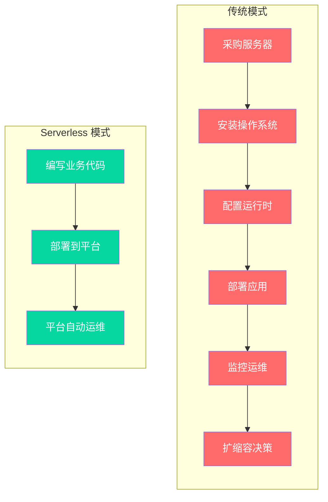

::: tip Serverless 的本质
Serverless 不是一种具体技术，而是一组理念的集合：**按需计费**（只为实际使用的计算资源付费）、**自动弹性**（平台根据负载自动扩缩容）、**缩容到零**（无流量时释放所有计算资源）、**事件驱动**（通过事件触发代码执行）。
:::

### BaaS vs FaaS

Serverless 架构由两大支柱组成：**BaaS（Backend as a Service）** 和 **FaaS（Function as a Service）**。

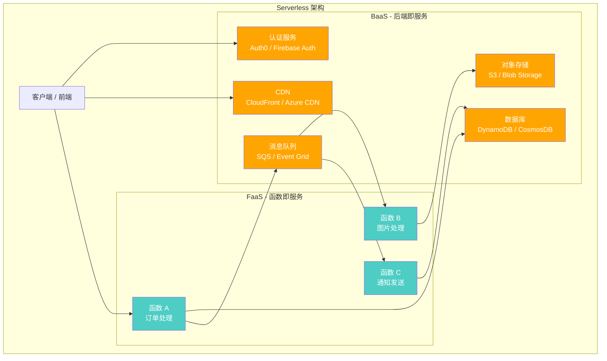

| 维度 | BaaS（后端即服务） | FaaS（函数即服务） |
|------|-------------------|-------------------|
| **定义** | 第三方托管的后端服务 | 云平台托管的函数运行时 |
| **关注点** | 数据存储、认证、消息等后端能力 | 业务逻辑的执行 |
| **典型产品** | Firebase、Supabase、Auth0 | AWS Lambda、Azure Functions、Knative |
| **计费方式** | 按存储量/请求数计费 | 按调用次数和执行时长计费 |
| **自定义程度** | 低（使用厂商提供的 API） | 高（编写任意业务代码） |
| **运维责任** | 完全由厂商承担 | 平台管理运行时，开发者管理代码 |
| **典型场景** | 用户认证、数据持久化、文件存储 | API 处理、事件响应、数据转换 |

### 事件驱动架构

Serverless 天然适配事件驱动架构（EDA）。事件是系统状态变化的记录，组件之间通过事件进行异步通信，实现松耦合。

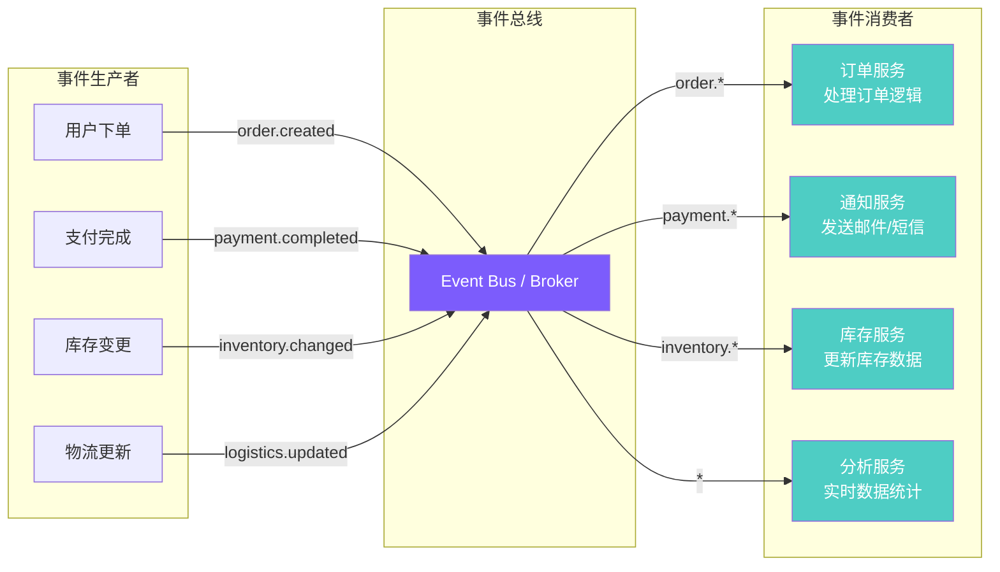

事件驱动架构的核心特征：

1. **异步解耦**：生产者不关心消费者的存在和状态，通过事件总线间接通信
2. **最终一致性**：不追求强一致性，通过事件重试和补偿机制保证最终一致
3. **可扩展性**：新增消费者无需修改生产者，按需增减处理逻辑
4. **可观测性**：事件流天然提供审计日志，便于追踪和回溯

---

## Serverless 的优势与局限

### Serverless 核心优势

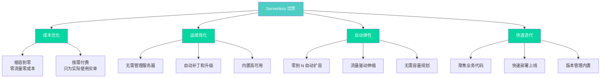

### Serverless 关键局限

::: warning Serverless 的局限性
Serverless 并非银弹，以下场景需谨慎评估：
:::

#### 1. 冷启动问题

冷启动是 Serverless 最被诟病的问题。当函数或服务长时间无请求后，平台会回收计算资源；再次收到请求时，需重新分配资源并启动实例，导致首次请求延迟显著增加。

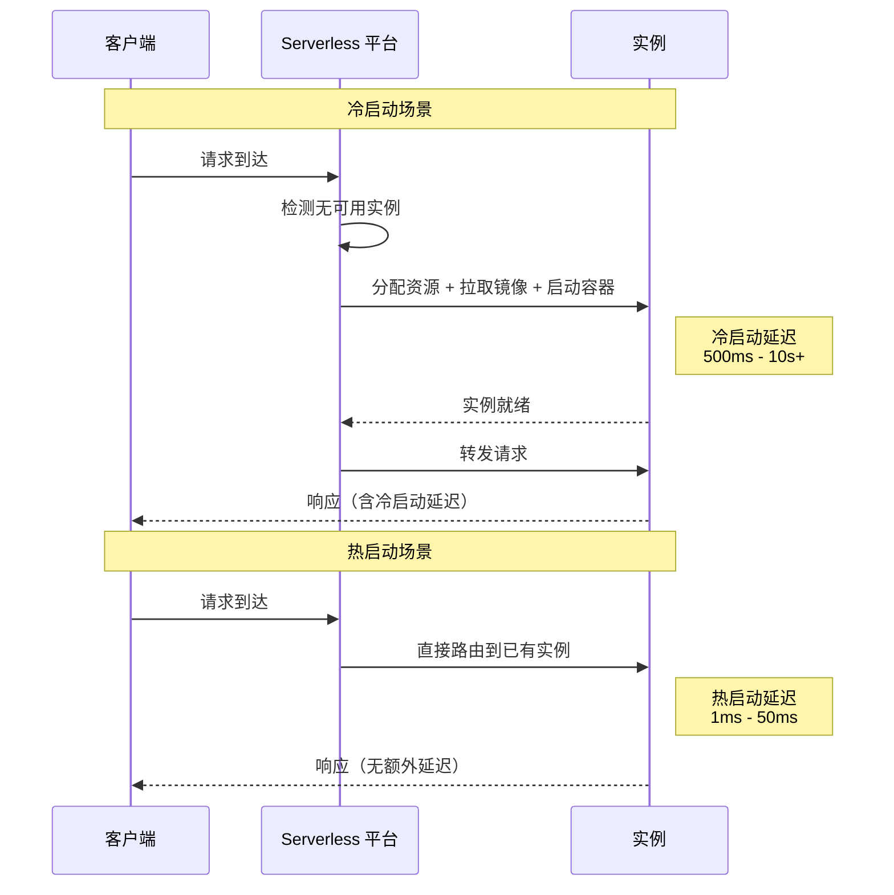

| 语言/运行时 | 冷启动时间（典型值） | 优化后冷启动 |
|------------|-------------------|------------|
| **Node.js** | 200ms - 1s | 100ms - 300ms |
| **Python** | 300ms - 1.5s | 150ms - 500ms |
| **Go** | 50ms - 300ms | 30ms - 100ms |
| **.NET** | 1s - 5s | 500ms - 2s |
| **Java** | 2s - 10s | 1s - 3s |
| **容器镜像** | 1s - 5s | 500ms - 2s |

#### 2. 供应商锁定

不同云厂商的 Serverless 实现差异巨大，迁移成本高：

| 锁定维度 | AWS Lambda | Azure Functions | Knative |
|---------|-----------|----------------|---------|
| **运行时** | 限定语言运行时 | 限定语言运行时 | 任意容器 |
| **事件源** | AWS 专属服务 | Azure 专属服务 | 开放标准（CloudEvents） |
| **API** | AWS SDK | Azure SDK | Kubernetes API |
| **部署** | SAM/CDK | ARM Templates | kubectl/Helm |
| **可移植性** | 低 | 低 | 高（K8s 原生） |

#### 3. 调试与可观测性困难

- **本地调试**：Serverless 函数依赖云平台的事件触发和运行时环境，本地难以完整模拟
- **分布式追踪**：事件链路跨多个函数和服务，端到端追踪复杂
- **状态管理**：无状态设计意味着状态散落在各个外部存储中，排查问题需拼接多处日志
- **冷启动黑盒**：冷启动过程对开发者不可见，难以诊断延迟来源

::: important 减少局限性的策略
1. **使用 Knative 等开源方案**：避免供应商锁定，保持 Kubernetes 原生可移植性
2. **预留实例**：对延迟敏感的服务设置 minScale >= 1，避免冷启动
3. **完善可观测性**：集成 OpenTelemetry，实现全链路追踪
4. **CloudEvents 规范**：采用标准事件格式，解耦事件生产与消费
:::

---

## Knative 架构

### Knative 整体架构

Knative 是基于 Kubernetes 的 Serverless 平台，由 Google 发起并捐献给 CNCF。它为 Kubernetes 补充了 Serverless 所需的核心能力：**请求驱动的自动伸缩**、**缩容到零**和**事件驱动的应用集成**。

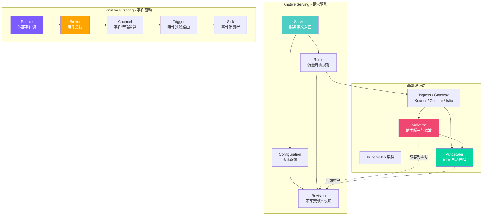

### Serving + Eventing 协作

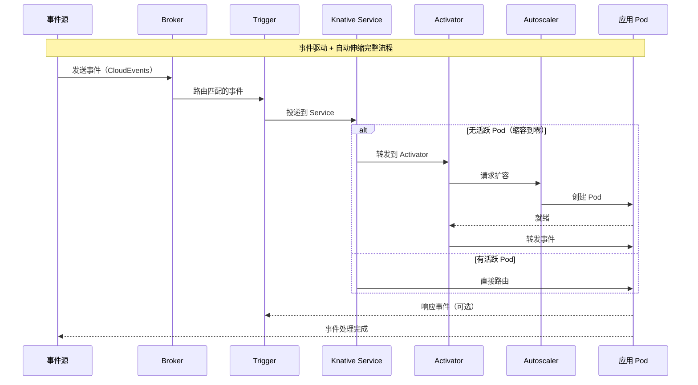

### 安装 Knative

```bash
# 1. 安装 Knative Serving CRD
kubectl apply -f https://github.com/knative/serving/releases/download/knative-v1.14.0/serving-crds.yaml

# 2. 安装 Knative Serving 核心组件
kubectl apply -f https://github.com/knative/serving/releases/download/knative-v1.14.0/serving-core.yaml

# 3. 安装网络层（Kourier - 推荐轻量方案）
kubectl apply -f https://github.com/knative/net-kourier/releases/download/knative-v1.14.0/kourier.yaml

# 4. 配置 Kourier 为默认网络层
kubectl patch configmap/config-network \
  --namespace knative-serving \
  --type merge \
  --patch '{"data":{"ingress.class":"kourier.ingress.networking.knative.dev"}}'

# 5. 配置默认域名
kubectl patch configmap/config-domain \
  --namespace knative-serving \
  --type merge \
  --patch '{"data":{"example.com":""}}'

# 6. 安装 Knative Eventing CRD
kubectl apply -f https://github.com/knative/eventing/releases/download/knative-v1.14.0/eventing-crds.yaml

# 7. 安装 Knative Eventing 核心组件
kubectl apply -f https://github.com/knative/eventing/releases/download/knative-v1.14.0/eventing-core.yaml

# 8. 安装 In-Memory Channel（开发/测试用）
kubectl apply -f https://github.com/knative/eventing/releases/download/knative-v1.14.0/in-memory-channel.yaml

# 9. 安装 Broker 层
kubectl apply -f https://github.com/knative/eventing/releases/download/knative-v1.14.0/mt-channel-broker.yaml

# 10. 验证安装
kubectl get pods -n knative-serving
kubectl get pods -n knative-eventing
```

```yaml
# knative-serving-config.yaml - Serving 自定义配置
apiVersion: v1
kind: ConfigMap
metadata:
  name: config-network
  namespace: knative-serving
data:
  ingress.class: "kourier.ingress.networking.knative.dev"
  domainTemplate: "{{.Name}}.{{.Namespace}}.{{.Domain}}"
  autoTLS: "Enabled"
  httpProtocol: "Redirected"
---
apiVersion: v1
kind: ConfigMap
metadata:
  name: config-autoscaler
  namespace: knative-serving
data:
  # 目标并发数
  container-concurrency-target-default: "100"
  # 容器并发上限
  container-concurrency-max-limit: "1000"
  # 缩容到零的空闲等待时间
  scale-to-zero-pod-retention-period: "60s"
  # 缩容到零的优雅等待
  scale-to-zero-grace-period: "30s"
  # 扩容速率限制
  max-scale-up-rate: "1000"
  # 缩容速率限制
  max-scale-down-rate: "2"
  # 扩容窗口
  stable-window: "60s"
  # 缩容窗口
  panic-window: "60s"
  # 恐慌阈值（超过此倍数进入恐慌模式）
  panic-window-percentage: "10"
---
apiVersion: v1
kind: ConfigMap
metadata:
  name: config-defaults
  namespace: knative-serving
data:
  # 默认超时时间
  revision-timeout-seconds: "300"
  # 默认容器并发
  container-concurrency: "0"
  # 默认最小副本
  min-scale: "0"
  # 默认最大副本
  max-scale: "0"
```

---

## Knative Serving 详解

### Serving 对象关系

Knative Serving 定义了四个核心 CRD，它们之间的关系构成了 Serverless 服务管理的基础。

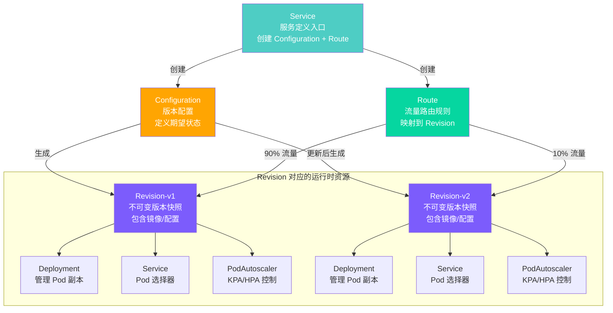

| 对象 | 作用 | 生命周期 | 可变性 |
|------|------|---------|--------|
| **Service** | 服务入口，自动管理 Configuration 和 Route | 跟随服务存在 | 可修改（触发新版本） |
| **Configuration** | 定义期望状态（镜像、环境变量等） | 跟随 Service 存在 | 可修改（触发新 Revision） |
| **Revision** | Configuration 的不可变快照 | 创建后不可修改 | 只读 |
| **Route** | 将流量路由到一个或多个 Revision | 跟随 Service 存在 | 可修改流量分配 |

### Knative Serving 请求链路

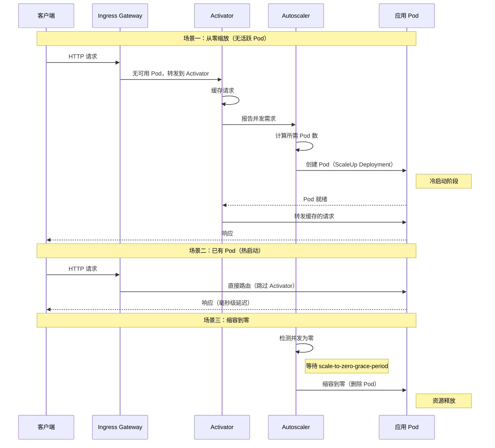

### 缩容到零流程

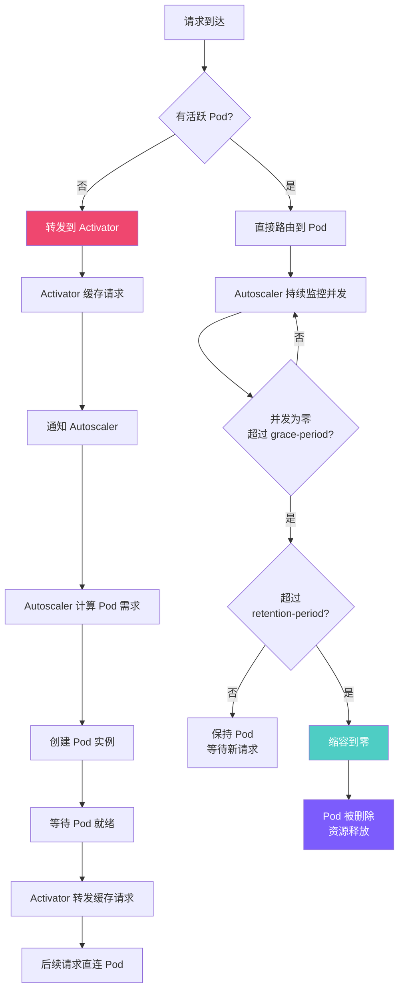

::: important 缩容到零的三个时间参数
- **stable-window**（稳定窗口）：默认 60s，Autoscaler 在此窗口内计算平均并发
- **scale-to-zero-grace-period**（优雅等待）：默认 30s，决定最后一个 Pod 何时被删除
- **scale-to-zero-pod-retention-period**（保留期）：默认 0s，Pod 缩容后保留一段时间再删除
:::

### 自动伸缩 KPA

Knative Pod Autoscaler（KPA）是 Knative 自研的自动伸缩器，与 Kubernetes 原生 HPA 的关键区别在于**支持缩容到零**。

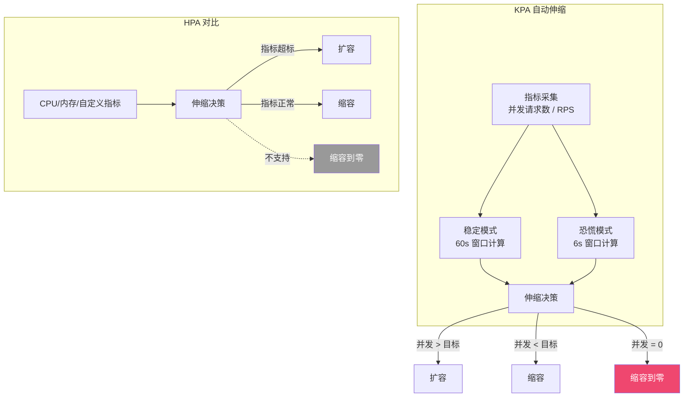

| 特性 | KPA | HPA |
|------|-----|-----|
| **缩容到零** | 原生支持 | 不支持（minReplicas 最小为 1） |
| **指标来源** | 请求并发数 / RPS | CPU / 内存 / 自定义指标 |
| **指标获取** | Activator + Queue-Proxy 直接上报 | Metrics Server 聚合 |
| **响应速度** | 快（直接基于实时请求） | 慢（基于指标聚合周期） |
| **恐慌模式** | 有（突发流量快速扩容） | 无 |
| **适用场景** | Serverless / 请求驱动 | 常规 Deployment |

KPA 的核心伸缩算法：

```
期望副本数 = 当前总并发 / 目标并发

示例：
- 目标并发 = 10（autoscaling.knative.dev/target: "10"）
- 当前总并发 = 45
- 期望副本数 = 45 / 10 = 4.5 → 向上取整 = 5

恐慌模式（流量突增）：
- 6s 窗口并发 = 80
- 恐慌副本数 = 80 / 10 = 8
- 取 max(稳定计算值, 恐慌计算值) = 8
```

### 流量分割与灰度发布

Knative Serving 的 Route 支持精细的流量分割，可以将不同百分比的流量路由到不同的 Revision。

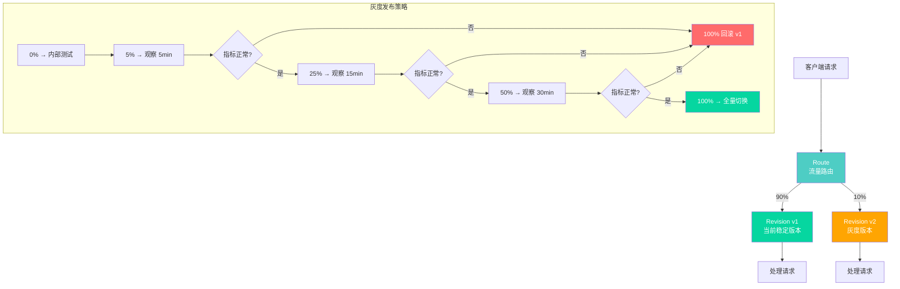

```yaml
# Knative Service - 渐进式灰度发布
apiVersion: serving.knative.dev/v1
kind: Service
metadata:
  name: myapp
  namespace: production
spec:
  traffic:
    - tag: stable
      revisionName: myapp-00001
      percent: 90
      latestRevision: false
    - tag: canary
      revisionName: myapp-00002
      percent: 10
      latestRevision: false
  template:
    metadata:
      annotations:
        autoscaling.knative.dev/target: "50"
        autoscaling.knative.dev/minScale: "1"
    spec:
      containers:
        - image: registry.example.com/myapp:v2
          ports:
            - containerPort: 8080
          resources:
            requests:
              cpu: 200m
              memory: 256Mi
            limits:
              cpu: "2"
              memory: 1Gi
```

```bash
# 查看版本列表
kubectl get revisions -n production

# 查看流量分配
kubectl get kservice myapp -n production -o yaml | grep -A 10 traffic

# 更新服务（自动创建新 Revision）
kubectl apply -f myapp-v3.yaml

# 手动调整流量比例
kubectl patch kservice myapp -n production --type merge -p '
{
  "spec": {
    "traffic": [
      {"tag": "stable", "revisionName": "myapp-00002", "percent": 80, "latestRevision": false},
      {"tag": "canary", "revisionName": "myapp-00003", "percent": 20, "latestRevision": false}
    ]
  }
}'

# 回滚到指定版本
kubectl patch kservice myapp -n production --type merge -p '
{
  "spec": {
    "traffic": [
      {"tag": "stable", "revisionName": "myapp-00001", "percent": 100, "latestRevision": false}
    ]
  }
}'

# 使用 kn CLI 管理流量
kn service update myapp --traffic myapp-00001=80,myapp-00002=20 -n production
```

### URL 映射

Knative 为每个 Service 和 Route 自动生成 URL：

```
默认域名格式：
  {service-name}.{namespace}.{domain}

示例：
  myapp.production.example.com         # Service URL
  myapp-canary.production.example.com  # Tag URL（灰度）
  myapp-stable.production.example.com  # Tag URL（稳定版）

Revision URL（直接访问特定版本）：
  myapp-00001.production.example.com   # Revision v1
  myapp-00002.production.example.com   # Revision v2
```

```yaml
# 自定义域名映射
apiVersion: serving.knative.dev/v1beta1
kind: DomainMapping
metadata:
  name: api.mycompany.com
  namespace: production
spec:
  ref:
    name: myapp
    kind: Service
    apiVersion: serving.knative.dev/v1
---
# 另一个域名映射
apiVersion: serving.knative.dev/v1beta1
kind: DomainMapping
metadata:
  name: www.mycompany.com
  namespace: production
spec:
  ref:
    name: frontend
    kind: Service
    apiVersion: serving.knative.dev/v1
```

```bash
# 查看域名映射
kubectl get domainmappings -n production

# 查看 Service URL
kn service describe myapp -n production | grep URL

# 创建域名映射
kubectl apply -f domain-mapping.yaml
```

### Knative Service 部署示例

```yaml
# 基础 Knative Service
apiVersion: serving.knative.dev/v1
kind: Service
metadata:
  name: hello-world
  namespace: production
spec:
  template:
    metadata:
      annotations:
        autoscaling.knative.dev/target: "10"
        autoscaling.knative.dev/minScale: "0"
        autoscaling.knative.dev/maxScale: "10"
        autoscaling.knative.dev/scaleDownDelay: "60s"
    spec:
      containerConcurrency: 100
      timeoutSeconds: 300
      containers:
        - image: registry.example.com/hello-world:v1
          ports:
            - containerPort: 8080
          resources:
            requests:
              cpu: 100m
              memory: 128Mi
            limits:
              cpu: "1"
              memory: 512Mi
          env:
            - name: ENV
              value: production
          readinessProbe:
            httpGet:
              path: /healthz
              port: 8080
            initialDelaySeconds: 3
            periodSeconds: 5
```

---

## Knative Eventing 详解

### Eventing 事件路由

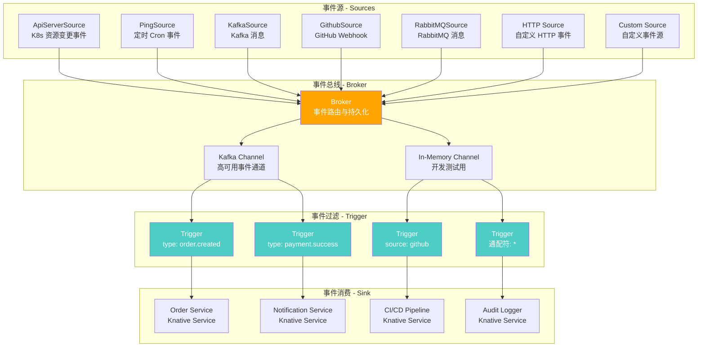

### Broker 与 Trigger

Broker 是事件总线，负责接收、存储和路由事件；Trigger 是事件过滤器，基于 CloudEvents 属性将事件路由到特定的消费者。

```yaml
# 创建 Broker（使用 Kafka 作为后端通道）
apiVersion: eventing.knative.dev/v1
kind: Broker
metadata:
  name: default
  namespace: production
  annotations:
    # 指定 Broker 类
    eventing.knative.dev/broker.class: Kafka
spec:
  config:
    apiVersion: v1
    kind: ConfigMap
    name: kafka-broker-config
    namespace: knative-eventing
  delivery:
    # 死信队列配置
    deadLetterSink:
      ref:
        apiVersion: serving.knative.dev/v1
        kind: Service
        name: dead-letter-handler
    # 重试配置
    retry: 5
    backoffPolicy: exponential
    backoffDelay: "1s"
---
# Kafka Broker 配置
apiVersion: v1
kind: ConfigMap
metadata:
  name: kafka-broker-config
  namespace: knative-eventing
data:
  # Kafka 集群地址
  bootstrap.servers: "kafka-0.kafka:9092,kafka-1.kafka:9092,kafka-2.kafka:9092"
  # 默认 Topic 配置
  default.topic.partitions: "3"
  default.topic.replication.factor: "3"
```

```yaml
# Trigger - 订单创建事件
apiVersion: eventing.knative.dev/v1
kind: Trigger
metadata:
  name: order-created-trigger
  namespace: production
spec:
  broker: default
  filter:
    attributes:
      type: com.example.order.created
      source: /api/orders
  subscriber:
    ref:
      apiVersion: serving.knative.dev/v1
      kind: Service
      name: order-processor
    delivery:
      deadLetterSink:
        ref:
          apiVersion: serving.knative.dev/v1
          kind: Service
          name: order-error-handler
      retry: 3
      backoffDelay: "5s"
---
# Trigger - 支付成功事件
apiVersion: eventing.knative.dev/v1
kind: Trigger
metadata:
  name: payment-success-trigger
  namespace: production
spec:
  broker: default
  filter:
    attributes:
      type: com.example.payment.success
  subscriber:
    ref:
      apiVersion: serving.knative.dev/v1
      kind: Service
      name: notification-service
---
# Trigger - 通配符（审计日志，接收所有事件）
apiVersion: eventing.knative.dev/v1
kind: Trigger
metadata:
  name: audit-log-trigger
  namespace: production
spec:
  broker: default
  filter: {}
  subscriber:
    ref:
      apiVersion: serving.knative.dev/v1
      kind: Service
      name: audit-logger
```

### Eventing 事件源

#### Kafka 事件源

```yaml
# KafkaSource - Kafka 消息源
apiVersion: sources.knative.dev/v1beta1
kind: KafkaSource
metadata:
  name: kafka-order-events
  namespace: production
spec:
  consumerGroup: knative-order-processor
  bootstrapServers:
    - kafka-0.kafka:9092
    - kafka-1.kafka:9092
    - kafka-2.kafka:9092
  topics:
    - order-events
    - order-updates
  sink:
    ref:
      apiVersion: eventing.knative.dev/v1
      kind: Broker
      name: default
```

#### RabbitMQ 事件源

```yaml
# RabbitMQSource - RabbitMQ 消息源
apiVersion: sources.knative.dev/v1alpha1
kind: RabbitmqSource
metadata:
  name: rabbitmq-order-source
  namespace: production
spec:
  # RabbitMQ 连接配置
  brokers: "amqp://rabbitmq.production.svc:5672/"
  exchangeConfig:
    name: orders
    type: topic
    durable: true
  queueConfig:
    name: knative-order-queue
    durable: true
  # 消费者配置
  predeclared: false
  # 认证
  secret:
    ref:
      name: rabbitmq-secret
  # 投递目标
  sink:
    ref:
      apiVersion: eventing.knative.dev/v1
      kind: Broker
      name: default
---
# RabbitMQ 认证 Secret
apiVersion: v1
kind: Secret
metadata:
  name: rabbitmq-secret
  namespace: production
type: Opaque
stringData:
  username: knative-user
  password: changeme
```

#### HTTP 事件源

```yaml
# 通过创建 Broker 入口接收 HTTP 事件
# Broker 自带 HTTP 入口，直接 POST 到 Broker URL 即可发送事件
apiVersion: eventing.knative.dev/v1
kind: Broker
metadata:
  name: http-broker
  namespace: production
spec: {}
---
# 使用 curl 发送事件到 Broker
# 首先获取 Broker 的 HTTP 入口 URL
# kubectl get broker http-broker -n production -o jsonpath='{.status.address.url}'
```

```bash
# 发送 CloudEvents 格式的 HTTP 事件到 Broker
BROKER_URL=$(kubectl get broker http-broker -n production -o jsonpath='{.status.address.url}')

curl -v "$BROKER_URL" \
  -H "Ce-Id: unique-event-id-001" \
  -H "Ce-Specversion: 1.0" \
  -H "Ce-Type: com.example.order.created" \
  -H "Ce-Source: /api/orders" \
  -H "Content-Type: application/json" \
  -d '{
    "orderId": "ORD-2024-001",
    "userId": "user-123",
    "items": [{"sku": "SKU-001", "quantity": 2}],
    "totalAmount": 199.8
  }'
```

#### GitHub 事件源

```yaml
# GithubSource - GitHub Webhook 事件
apiVersion: sources.knative.dev/v1alpha1
kind: GithubSource
metadata:
  name: github-source
  namespace: production
spec:
  # 事件类型
  eventTypes:
    - push
    - pull_request
    - issues
  # 仓库地址
  ownerAndRepository: myorg/myrepo
  # 认证
  accessToken:
    secret:
      ref:
        name: github-secret
      key: accessToken
  secretToken:
    secret:
      ref:
        name: github-secret
      key: secretToken
  # 投递目标
  sink:
    ref:
      apiVersion: eventing.knative.dev/v1
      kind: Broker
      name: default
---
# GitHub 认证 Secret
apiVersion: v1
kind: Secret
metadata:
  name: github-secret
  namespace: production
type: Opaque
stringData:
  accessToken: ghp_xxxxxxxxxxxxxxxxxxxx
  secretToken: my-webhook-secret
```

#### 自定义事件源

```yaml
# 自定义事件源 - 通过 ContainerSource
apiVersion: sources.knative.dev/v1
kind: ContainerSource
metadata:
  name: custom-event-source
  namespace: production
spec:
  template:
    spec:
      containers:
        - image: registry.example.com/custom-event-emitter:v1
          name: emitter
          env:
            - name: EMIT_INTERVAL
              value: "30"
            - name: EVENT_TYPE
              value: com.example.custom.event
          resources:
            requests:
              cpu: 50m
              memory: 64Mi
            limits:
              cpu: 200m
              memory: 128Mi
  sink:
    ref:
      apiVersion: eventing.knative.dev/v1
      kind: Broker
      name: default
```

### CloudEvents 规范

Knative Eventing 采用 CloudEvents 规范作为事件的标准格式，确保跨平台互操作性。

```json
{
  "specversion": "1.0",
  "type": "com.example.order.created",
  "source": "/api/orders",
  "id": "A234-1234-1234",
  "time": "2024-01-15T08:30:00Z",
  "datacontenttype": "application/json",
  "data": {
    "orderId": "ORD-2024-001",
    "userId": "user-123",
    "items": [
      {"sku": "SKU-001", "quantity": 2, "price": 99.9}
    ],
    "totalAmount": 199.8
  }
}
```

| CloudEvents 属性 | 必选 | 说明 | 示例 |
|-----------------|------|------|------|
| **specversion** | 是 | CloudEvents 规范版本 | `1.0` |
| **type** | 是 | 事件类型 | `com.example.order.created` |
| **source** | 是 | 事件来源 | `/api/orders` |
| **id** | 是 | 事件唯一标识 | `A234-1234-1234` |
| **time** | 否 | 事件发生时间 | `2024-01-15T08:30:00Z` |
| **datacontenttype** | 否 | 数据内容类型 | `application/json` |
| **data** | 否 | 事件数据 | `{...}` |

---

## Kourier / Contour 网络层配置

Knative Serving 支持多种网络层（Ingress）实现，其中 Kourier 和 Contour 是最常用的轻量级方案。

### 网络层对比

| 特性 | Kourier | Contour | Istio |
|------|---------|---------|-------|
| **架构** | Envoy 代理 | Envoy + DAG 控制器 | Sidecar + 控制面 |
| **资源占用** | 极低（2 个 Pod） | 低（2 个 Pod） | 高（每个 Pod 注入 Sidecar） |
| **性能** | 高 | 高 | 中（Sidecar 开销） |
| **功能丰富度** | 基础 | 丰富（HTTPProxy） | 最丰富（流量治理、安全） |
| **适用场景** | 纯 Serverless | Serverless + 常规 Ingress | 服务网格 + Serverless |
| **推荐度** | Serverless 首选 | 需要高级路由 | 已有 Istio 基础 |

### Kourier 配置

```bash
# 安装 Kourier
kubectl apply -f https://github.com/knative/net-kourier/releases/download/knative-v1.14.0/kourier.yaml

# 配置 Knative Serving 使用 Kourier
kubectl patch configmap/config-network \
  --namespace knative-serving \
  --type merge \
  --patch '{"data":{"ingress.class":"kourier.ingress.networking.knative.dev"}}'

# 查看 Kourier 状态
kubectl get pods -n knative-serving -l app=3scale-kourier
```

```yaml
# Kourier 自定义配置
apiVersion: v1
kind: ConfigMap
metadata:
  name: config-kourier
  namespace: knative-serving
data:
  # 服务外部 IP 或域名
  service-type: "LoadBalancer"
  # HTTP 端口
  http-port: "80"
  # HTTPS 端口
  https-port: "443"
---
# Kourier Gateway 配置 - 使用 NodePort
apiVersion: v1
kind: Service
metadata:
  name: kourier
  namespace: knative-serving
spec:
  type: NodePort
  selector:
    app: 3scale-kourier-gateway
  ports:
    - name: http2
      port: 80
      targetPort: 8080
      nodePort: 31080
    - name: https
      port: 443
      targetPort: 8443
      nodePort: 31443
```

### Contour 配置

```bash
# 安装 Contour
kubectl apply -f https://github.com/knative/net-contour/releases/download/knative-v1.14.0/contour.yaml

# 配置 Knative Serving 使用 Contour
kubectl patch configmap/config-network \
  --namespace knative-serving \
  --type merge \
  --patch '{"data":{"ingress.class":"contour.ingress.networking.knative.dev"}}'
```

```yaml
# Contour HTTPProxy 自定义路由
apiVersion: projectcontour.io/v1
kind: HTTPProxy
metadata:
  name: myapp-proxy
  namespace: production
spec:
  virtualhost:
    fqdn: api.mycompany.com
    tls:
      secretName: api-tls-secret
  routes:
    - conditions:
        - prefix: /
      services:
        - name: myapp
          port: 80
          # 健康检查
          healthCheckPolicy:
            path: /healthz
            intervalSeconds: 5
            timeoutSeconds: 3
            unhealthyThresholdCount: 3
            healthyThresholdCount: 2
```

### 自动 TLS 配置

```yaml
# 启用自动 TLS（使用 cert-manager）
apiVersion: v1
kind: ConfigMap
metadata:
  name: config-network
  namespace: knative-serving
data:
  autoTLS: "Enabled"
  httpProtocol: "Redirected"
---
# cert-manager ClusterIssuer
apiVersion: cert-manager.io/v1
kind: ClusterIssuer
metadata:
  name: letsencrypt-prod
spec:
  acme:
    server: https://acme-v02.api.letsencrypt.org/directory
    email: admin@example.com
    privateKeySecretRef:
      name: letsencrypt-prod
    solvers:
      - http01:
          ingress:
            class: kourier
```

---

## 冷启动优化

### 冷启动阶段分析


| 阶段 | 耗时 | 优化手段 |
|------|------|---------|
| **Pod 调度** | 50 - 200ms | 预留调度资源、节点预分配、优先级调度 |
| **镜像拉取** | 0.5 - 5s | 镜像预热、精简镜像、节点缓存、P2P 分发 |
| **容器启动** | 0.5 - 3s | 减少入口脚本、跳过不必要的初始化 |
| **应用初始化** | 0.5 - 10s | 延迟加载、预热连接池、编译优化、ReadyToRun |
| **健康检查** | 2 - 10s | 缩短 initialDelaySeconds、使用 exec 探针 |

### 预热策略

```yaml
# 策略一：保留最低副本数（最简单）
apiVersion: serving.knative.dev/v1
kind: Service
metadata:
  name: myapp
  namespace: production
spec:
  template:
    metadata:
      annotations:
        autoscaling.knative.dev/minScale: "1"     # 至少保留 1 个 Pod
        autoscaling.knative.dev/target: "50"
        autoscaling.knative.dev/scaleDownDelay: "300s"  # 缩容延迟 5 分钟
    spec:
      containers:
        - image: registry.example.com/myapp:v1
          ports:
            - containerPort: 8080
          readinessProbe:
            httpGet:
              path: /healthz
              port: 8080
            periodSeconds: 3
            initialDelaySeconds: 1
```

### Scale-to-zero 延迟调优

```yaml
# 调整缩容到零的等待时间
apiVersion: v1
kind: ConfigMap
metadata:
  name: config-autoscaler
  namespace: knative-serving
data:
  # 优雅等待时间（最后一次请求到 Pod 删除的间隔）
  scale-to-zero-grace-period: "60s"
  # Pod 保留期（Pod 标记为不活跃后保留的时间）
  scale-to-zero-pod-retention-period: "120s"
  # 稳定窗口
  stable-window: "60s"
---
# 针对特定 Service 的缩容延迟
apiVersion: serving.knative.dev/v1
kind: Service
metadata:
  name: myapp
  namespace: production
spec:
  template:
    metadata:
      annotations:
        # 缩容延迟注解
        autoscaling.knative.dev/scaleDownDelay: "600s"
        # 保持 Pod 存活更长时间
        autoscaling.knative.dev/minScale: "1"
```

### Init 容器优化

```yaml
# 使用 Init 容器进行预初始化
apiVersion: serving.knative.dev/v1
kind: Service
metadata:
  name: myapp-with-init
  namespace: production
spec:
  template:
    spec:
      # Init 容器在主容器启动前执行
      initContainers:
        - name: cache-warmer
          image: registry.example.com/cache-warmer:v1
          command: ['sh', '-c', 'wget -qO- http://config-service/warm-cache > /cache/config.json']
          volumeMounts:
            - name: cache-volume
              mountPath: /cache
      containers:
        - name: user-container
          image: registry.example.com/myapp:v1
          ports:
            - containerPort: 8080
          volumeMounts:
            - name: cache-volume
              mountPath: /app/cache
          env:
            - name: CACHE_PRELOADED
              value: "true"
      volumes:
        - name: cache-volume
          emptyDir: {}
```

### 镜像预拉取

```yaml
# DaemonSet - 节点镜像预热
apiVersion: apps/v1
kind: DaemonSet
metadata:
  name: image-preheater
  namespace: knative-serving
spec:
  selector:
    matchLabels:
      app: image-preheater
  template:
    metadata:
      labels:
        app: image-preheater
    spec:
      initContainers:
        - name: pull-images
          image: docker:24
          command:
            - sh
            - -c
            - |
              echo "Pre-pulling images..."
              docker pull registry.example.com/myapp:v1 &
              docker pull registry.example.com/order-service:v2 &
              docker pull registry.example.com/notification:v3 &
              wait
              echo "All images pre-pulled"
          volumeMounts:
            - name: docker-sock
              mountPath: /var/run/docker.sock
      containers:
        - name: pause
          image: registry.k8s.io/pause:3.9
      volumes:
        - name: docker-sock
          hostPath:
            path: /var/run/docker.sock
```

### 镜像优化

```dockerfile
# ---- 优化前：冷启动 8s+ ----
FROM mcr.microsoft.com/dotnet/sdk:8.0
WORKDIR /app
COPY . .
RUN dotnet restore
RUN dotnet publish -c Release -o /app/publish
ENTRYPOINT ["dotnet", "/app/publish/MyApp.dll"]

# ---- 优化后：冷启动 2s ----
# 阶段一：构建
FROM mcr.microsoft.com/dotnet/sdk:8.0-alpine AS build
WORKDIR /src
COPY MyApp.csproj .
RUN dotnet restore --no-cache
COPY . .
RUN dotnet publish -c Release -o /app/publish \
    /p:PublishTrimmed=true \
    /p:PublishReadyToRun=true \
    /p:PublishSingleFile=true

# 阶段二：运行时
FROM mcr.microsoft.com/dotnet/runtime:8.0-alpine AS runtime
WORKDIR /app

# 只复制发布产物
COPY --from=build /app/publish .

# 环境变量优化
ENV DOTNET_ReadyToRun=1 \
    DOTNET_TieredPGO=1 \
    DOTNET_EnableWriteXorExecute=0 \
    ASPNETCORE_URLS=http://+:8080

# 非 root 用户
RUN addgroup -S appgroup && adduser -S appuser -G appgroup
USER appuser

# 快速健康检查
HEALTHCHECK --interval=3s --timeout=1s --retries=1 \
  CMD wget -qO- http://localhost:8080/healthz || exit 1

EXPOSE 8080
ENTRYPOINT ["./MyApp"]
```

| 优化手段 | 效果 | 适用语言 |
|---------|------|---------|
| **多阶段构建** | 镜像体积减少 60-80% | 全部 |
| **Alpine/Distroless 基础镜像** | 镜像体积减少 50-70% | 全部 |
| **PublishTrimmed** | 裁剪未使用的 IL 代码 | .NET |
| **PublishReadyToRun (AOT)** | 预编译为本地代码，跳过 JIT | .NET |
| **PublishSingleFile** | 单文件部署，减少 IO | .NET |
| **分层缓存** | 利用 Docker 缓存层，加速构建 | 全部 |

---

## 事件驱动架构设计模式

### 事件溯源（Event Sourcing）

事件溯源不保存对象的当前状态，而是保存所有状态变更事件。通过重放事件，可以重建对象的任意历史状态。

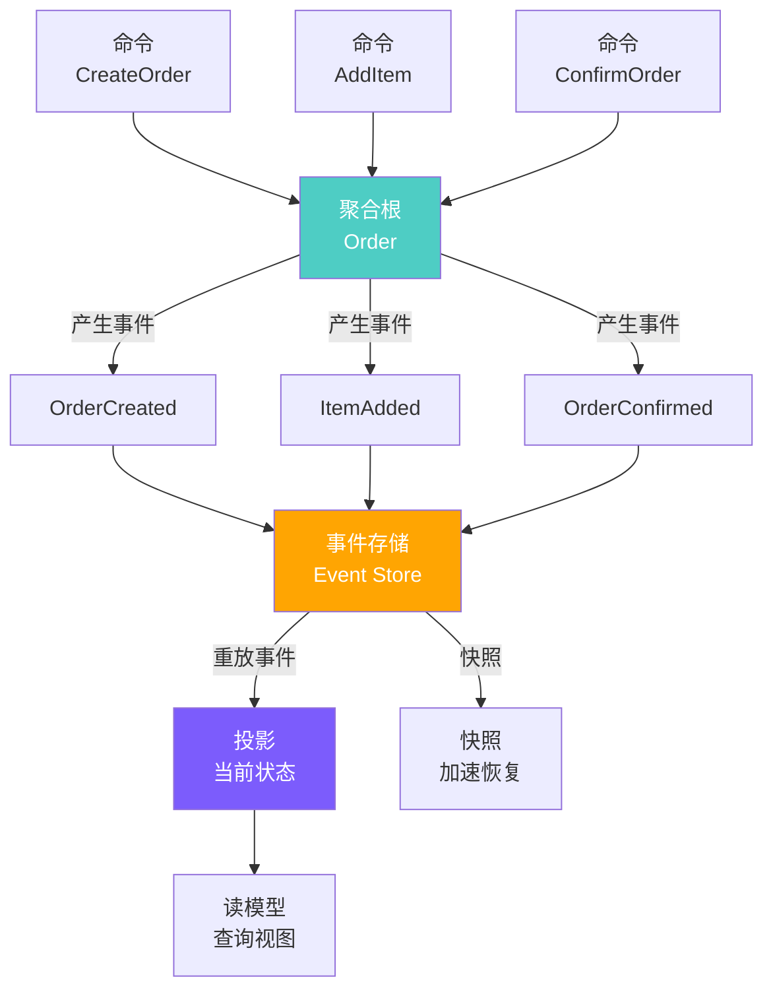

::: tip 事件溯源的核心优势
1. **完整审计**：所有状态变更都有记录，天然满足合规要求
2. **时间旅行**：可以重建任意时间点的状态
3. **事件回放**：系统故障后可从事件存储重建状态
4. **解耦**：读写分离，写入和查询互不影响
:::

### CQRS（命令查询职责分离）

CQRS 将读取操作和写入操作分离到不同的模型中，写模型处理命令，读模型处理查询。

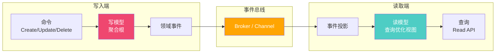

CQRS 与 Knative 的天然结合：

```yaml
# 写入端 - Knative Service
apiVersion: serving.knative.dev/v1
kind: Service
metadata:
  name: order-command-service
  namespace: production
spec:
  template:
    metadata:
      annotations:
        autoscaling.knative.dev/target: "50"
        autoscaling.knative.dev/minScale: "2"
    spec:
      containers:
        - image: registry.example.com/order-command:v1
          ports:
            - containerPort: 8080
          env:
            - name: EVENT_STORE_URL
              value: "http://eventstore.production:8080"
---
# 读取端 - Knative Service
apiVersion: serving.knative.dev/v1
kind: Service
metadata:
  name: order-query-service
  namespace: production
spec:
  template:
    metadata:
      annotations:
        autoscaling.knative.dev/target: "100"
        autoscaling.knative.dev/minScale: "3"
    spec:
      containers:
        - image: registry.example.com/order-query:v1
          ports:
            - containerPort: 8080
          env:
            - name: READ_DB_URL
              value: "postgres://read-db:5432/orders"
---
# 事件投影 - 通过 Trigger 订阅事件
apiVersion: eventing.knative.dev/v1
kind: Trigger
metadata:
  name: order-projection-trigger
  namespace: production
spec:
  broker: default
  filter:
    attributes:
      type: com.example.order.  # 前缀匹配
  subscriber:
    ref:
      apiVersion: serving.knative.dev/v1
      kind: Service
      name: order-projection-service
```

### Saga 模式

Saga 模式用于管理跨多个服务的分布式事务，通过一系列本地事务和补偿操作来保证最终一致性。

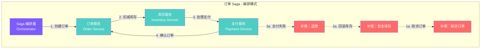

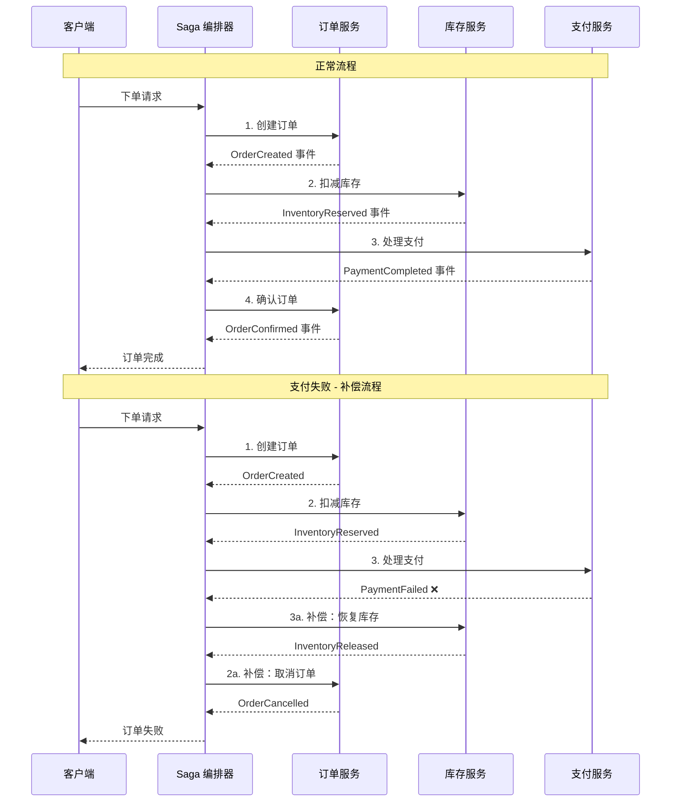

Knative 中的 Saga 实现：

```yaml
# Saga 编排器 - Knative Service
apiVersion: serving.knative.dev/v1
kind: Service
metadata:
  name: order-saga-orchestrator
  namespace: production
spec:
  template:
    metadata:
      annotations:
        autoscaling.knative.dev/target: "30"
        autoscaling.knative.dev/minScale: "2"
    spec:
      containers:
        - image: registry.example.com/order-saga:v1
          ports:
            - containerPort: 8080
          env:
            - name: SAGA_TIMEOUT
              value: "60"
---
# Saga 事件订阅
apiVersion: eventing.knative.dev/v1
kind: Trigger
metadata:
  name: saga-order-events
  namespace: production
spec:
  broker: default
  filter:
    attributes:
      type: com.example.order.created
  subscriber:
    ref:
      apiVersion: serving.knative.dev/v1
      kind: Service
      name: order-saga-orchestrator
---
apiVersion: eventing.knative.dev/v1
kind: Trigger
metadata:
  name: saga-inventory-events
  namespace: production
spec:
  broker: default
  filter:
    attributes:
      type: com.example.inventory.reserved
  subscriber:
    ref:
      apiVersion: serving.knative.dev/v1
      kind: Service
      name: order-saga-orchestrator
---
apiVersion: eventing.knative.dev/v1
kind: Trigger
metadata:
  name: saga-payment-events
  namespace: production
spec:
  broker: default
  filter:
    attributes:
      type: com.example.payment.completed
  subscriber:
    ref:
      apiVersion: serving.knative.dev/v1
      kind: Service
      name: order-saga-orchestrator
```

---

## Knative vs OpenFaaS vs Fission vs KEDA 详细对比

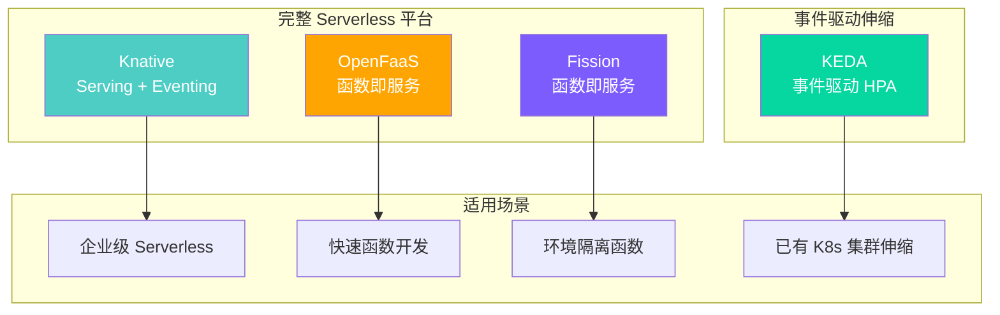

| 维度 | Knative | OpenFaaS | Fission | KEDA |
|------|---------|----------|---------|------|
| **核心定位** | Serverless 平台（Serving + Eventing） | 函数即服务 | 函数即服务 | 事件驱动自动伸缩 |
| **缩容到零** | 原生支持（Activator） | 支持（IdleDetector） | 支持（Pool Manager） | 支持（minReplica=0） |
| **冷启动** | 1 - 3s | 1 - 5s | 0.5 - 2s（预热池） | 取决于工作负载 |
| **事件驱动** | Eventing 模块（Broker/Trigger） | 多种触发器 | 多种触发器 + Kube Watch | 60+ Scalers |
| **运行时** | 任意容器镜像 | 容器镜像 + 函数模板 | 容器镜像 + 函数环境 | 任意工作负载 |
| **流量管理** | 精细路由 + 灰度发布 | 基本路由 | 基本路由 | 无（依赖 HPA） |
| **自动伸缩** | KPA（并发/RPS 驱动） | HPA + 自定义 | HPA + 自定义 | HPA + 事件驱动 |
| **Kubernetes 原生** | 深度集成（CRD + Controller） | 自有 CRD + Gateway | 自有 CRD + Router | 深度集成（Metrics Adapter） |
| **语言支持** | 任意（容器） | 任意（容器）+ 模板（Node/Python/Go） | 任意（容器）+ 环境（Python/Go/Node） | 任意 |
| **Web UI** | 无内置 | 有（Portal UI） | 有（Fission UI） | 无 |
| **函数模板/Store** | 无 | 有（Function Store） | 有（Fission Environments） | 无 |
| **网络层** | Kourier/Contour/Istio | 自带 Gateway | 自带 Router | 无（使用集群 Ingress） |
| **学习曲线** | 较陡 | 平缓 | 中等 | 平缓 |
| **社区/商业** | CNCF / Google/IBM/RedHat | OpenFaaS Ltd / 社区 | CNCF / Platform9 | CNCF / Microsoft/RedHat |
| **成熟度** | 高（生产就绪） | 高 | 中 | 高 |

### 详细选型建议

::: tip 如何选择？
**选择 Knative 如果：** 需要完整的 Serverless 平台，包含 Serving + Eventing，精细流量管理和灰度发布，企业级生产环境

**选择 OpenFaaS 如果：** 快速搭建函数平台，需要函数模板和 Store 生态，团队 Kubernetes 经验较少，需要 Web UI 管理界面

**选择 Fission 如果：** 需要极低冷启动延迟（预热池），函数环境隔离需求，轻量级函数部署场景

**选择 KEDA 如果：** 已有 Kubernetes 部署，只需事件驱动的自动伸缩能力，不想引入完整 Serverless 平台的复杂性

**组合方案：** KEDA（伸缩）+ Knative Eventing（事件路由）是最灵活的组合，适合渐进式采用 Serverless
:::

---

## .NET Serverless 应用实战

### 完整 Knative Service YAML

```yaml
# .NET 订单处理服务 - 完整 Knative Service
apiVersion: serving.knative.dev/v1
kind: Service
metadata:
  name: order-service
  namespace: production
  labels:
    app: order-service
    team: backend
    runtime: dotnet
spec:
  template:
    metadata:
      annotations:
        # 自动伸缩配置
        autoscaling.knative.dev/target: "50"
        autoscaling.knative.dev/minScale: "1"
        autoscaling.knative.dev/maxScale: "20"
        autoscaling.knative.dev/scaleDownDelay: "300s"
        autoscaling.knative.dev/containerConcurrency: "100"
    spec:
      containerConcurrency: 100
      timeoutSeconds: 60
      serviceAccountName: order-service-sa
      containers:
        - name: order-service
          image: registry.example.com/order-service:2.1.0
          ports:
            - containerPort: 8080
          resources:
            requests:
              cpu: 200m
              memory: 256Mi
            limits:
              cpu: "1"
              memory: 512Mi
          env:
            - name: ASPNETCORE_ENVIRONMENT
              value: Production
            - name: ASPNETCORE_URLS
              value: "http://+:8080"
            - name: DOTNET_ReadyToRun
              value: "1"
            - name: DOTNET_TieredPGO
              value: "1"
            - name: Redis__ConnectionString
              valueFrom:
                secretKeyRef:
                  name: redis-secret
                  key: connection-string
            - name: Kafka__BootstrapServers
              value: "kafka-0.kafka:9092,kafka-1.kafka:9092,kafka-2.kafka:9092"
            - name: ConnectionStrings__OrderDb
              valueFrom:
                secretKeyRef:
                  name: db-secret
                  key: order-db-connection
          envFrom:
            - configMapRef:
                name: order-service-config
          readinessProbe:
            httpGet:
              path: /healthz
              port: 8080
            initialDelaySeconds: 2
            periodSeconds: 5
          livenessProbe:
            httpGet:
              path: /healthz
              port: 8080
            initialDelaySeconds: 10
            periodSeconds: 10
---
# ServiceAccount
apiVersion: v1
kind: ServiceAccount
metadata:
  name: order-service-sa
  namespace: production
---
# ConfigMap
apiVersion: v1
kind: ConfigMap
metadata:
  name: order-service-config
  namespace: production
data:
  Logging__LogLevel__Default: "Information"
  Kafka__GroupId: "order-processor-group"
  Kafka__Topic: "order-events"
  Redis__InstanceName: "OrderService:"
```

### .NET 事件处理示例

```csharp
// Program.cs - .NET 8 Minimal API + CloudEvents
using CloudNative.CloudEvents;
using Microsoft.AspNetCore.Builder;
using Microsoft.AspNetCore.Http;
using Microsoft.Extensions.DependencyInjection;
using Microsoft.Extensions.Logging;
using System.Text.Json;

var builder = WebApplication.CreateBuilder(args);

// 注册服务
builder.Services.AddLogging();
builder.Services.AddSingleton<IOrderProcessor, OrderProcessor>();

var app = builder.Build();

// 健康检查端点
app.MapGet("/healthz", () => Results.Ok(new { status = "healthy" }));

// CloudEvents 接收端点
app.MapPost("/", async (HttpContext context, IOrderProcessor processor, ILogger<Program> logger) =>
{
    try
    {
        // 解析 CloudEvent
        var cloudEvent = await context.Request.ReadCloudEventAsync();

        logger.LogInformation(
            "Received event: Type={Type}, Source={Source}, Id={Id}",
            cloudEvent.Type, cloudEvent.Source, cloudEvent.Id);

        // 根据事件类型路由
        return cloudEvent.Type switch
        {
            "com.example.order.created" => await HandleOrderCreated(cloudEvent, processor, logger),
            "com.example.order.updated" => await HandleOrderUpdated(cloudEvent, processor, logger),
            "com.example.payment.completed" => await HandlePaymentCompleted(cloudEvent, processor, logger),
            _ => Results.Ok(new { message = "Event type not handled", type = cloudEvent.Type })
        };
    }
    catch (Exception ex)
    {
        logger.LogError(ex, "Error processing event");
        return Results.Problem("Internal server error", statusCode: 500);
    }
});

app.Run();

// 订单创建事件处理
static async Task<IResult> HandleOrderCreated(
    CloudEvent cloudEvent, IOrderProcessor processor, ILogger logger)
{
    var data = JsonSerializer.Deserialize<OrderCreatedEvent>(
        cloudEvent.Data?.ToString() ?? "{}");

    if (data == null)
        return Results.BadRequest("Invalid event data");

    logger.LogInformation("Processing order: {OrderId}", data.OrderId);

    var result = await processor.ProcessOrderAsync(data);

    // 返回响应事件
    var responseEvent = new CloudEvent
    {
        Type = "com.example.order.processed",
        Source = new Uri("urn:order-service"),
        Data = JsonSerializer.Serialize(new
        {
            data.OrderId,
            result.Status,
            ProcessedAt = DateTime.UtcNow
        })
    };

    return Results.Ok(responseEvent);
}

static async Task<IResult> HandleOrderUpdated(
    CloudEvent cloudEvent, IOrderProcessor processor, ILogger logger)
{
    var data = JsonSerializer.Deserialize<OrderUpdatedEvent>(
        cloudEvent.Data?.ToString() ?? "{}");

    if (data == null)
        return Results.BadRequest("Invalid event data");

    logger.LogInformation("Processing order update: {OrderId}", data.OrderId);
    await processor.ProcessOrderUpdateAsync(data);
    return Results.Ok();
}

static async Task<IResult> HandlePaymentCompleted(
    CloudEvent cloudEvent, IOrderProcessor processor, ILogger logger)
{
    var data = JsonSerializer.Deserialize<PaymentCompletedEvent>(
        cloudEvent.Data?.ToString() ?? "{}");

    if (data == null)
        return Results.BadRequest("Invalid event data");

    logger.LogInformation("Processing payment: {OrderId}", data.OrderId);
    await processor.ConfirmOrderAsync(data.OrderId);
    return Results.Ok();
}

// 事件模型
record OrderCreatedEvent(string OrderId, string UserId, decimal TotalAmount);
record OrderUpdatedEvent(string OrderId, string Status);
record PaymentCompletedEvent(string OrderId, string PaymentId, decimal Amount);

// 处理器接口
interface IOrderProcessor
{
    Task<ProcessResult> ProcessOrderAsync(OrderCreatedEvent order);
    Task ProcessOrderUpdateAsync(OrderUpdatedEvent update);
    Task ConfirmOrderAsync(string orderId);
}

record ProcessResult(string Status, string Message);
```

### Dockerfile 优化

```dockerfile
# ===== 阶段一：构建 =====
FROM mcr.microsoft.com/dotnet/sdk:8.0-alpine AS build
WORKDIR /src

# 先复制项目文件，利用 Docker 缓存层
COPY OrderService.csproj .
RUN dotnet restore --no-cache

# 复制源码并发布
COPY . .
RUN dotnet publish -c Release -o /app/publish \
    /p:PublishTrimmed=true \
    /p:PublishReadyToRun=true \
    /p:PublishSingleFile=true \
    /p:TrimMode=partial

# ===== 阶段二：运行时 =====
FROM mcr.microsoft.com/dotnet/runtime:8.0-alpine AS runtime
WORKDIR /app

# 安全：非 root 用户
RUN addgroup -S appgroup && adduser -S appuser -G appgroup

# 复制发布产物
COPY --from=build /app/publish .

# 设置环境变量
ENV ASPNETCORE_URLS=http://+:8080 \
    DOTNET_ReadyToRun=1 \
    DOTNET_TieredPGO=1 \
    DOTNET_EnableWriteXorExecute=0

# 暴露端口
EXPOSE 8080

# 健康检查
HEALTHCHECK --interval=3s --timeout=1s --retries=1 \
  CMD wget -qO- http://localhost:8080/healthz || exit 1

USER appuser
ENTRYPOINT ["./OrderService"]
```

```dockerfile
# .NET AOT 编译 - 极致冷启动优化
FROM mcr.microsoft.com/dotnet/sdk:8.0-alpine AS build
WORKDIR /src
COPY OrderService.csproj .
RUN dotnet restore
COPY . .
RUN dotnet publish -c Release -o /app/publish \
    /p:PublishAot=true \
    /p:StripSymbols=true

FROM alpine:3.19 AS runtime
WORKDIR /app
RUN apk add --no-cache libstdc++ icu-libs
COPY --from=build /app/publish .

ENV ASPNETCORE_URLS=http://+:8080
EXPOSE 8080

HEALTHCHECK --interval=3s --timeout=1s --retries=1 \
  CMD wget -qO- http://localhost:8080/healthz || exit 1

ENTRYPOINT ["./OrderService"]
```

| 优化策略 | 镜像体积 | 冷启动时间 | 说明 |
|---------|---------|-----------|------|
| SDK 基础镜像 | ~800MB | 8s+ | 仅开发环境使用 |
| Runtime + 多阶段构建 | ~80MB | 3-5s | 标准优化 |
| Runtime-Alpine | ~30MB | 2-3s | 精简基础镜像 |
| AOT 编译 | ~20MB | 0.5-1s | 极致优化，但有限制 |
| SingleFile + Trimmed | ~25MB | 1.5-2.5s | 平衡方案 |

---

## Serverless 适用场景与局限

### 适合 Serverless 的场景

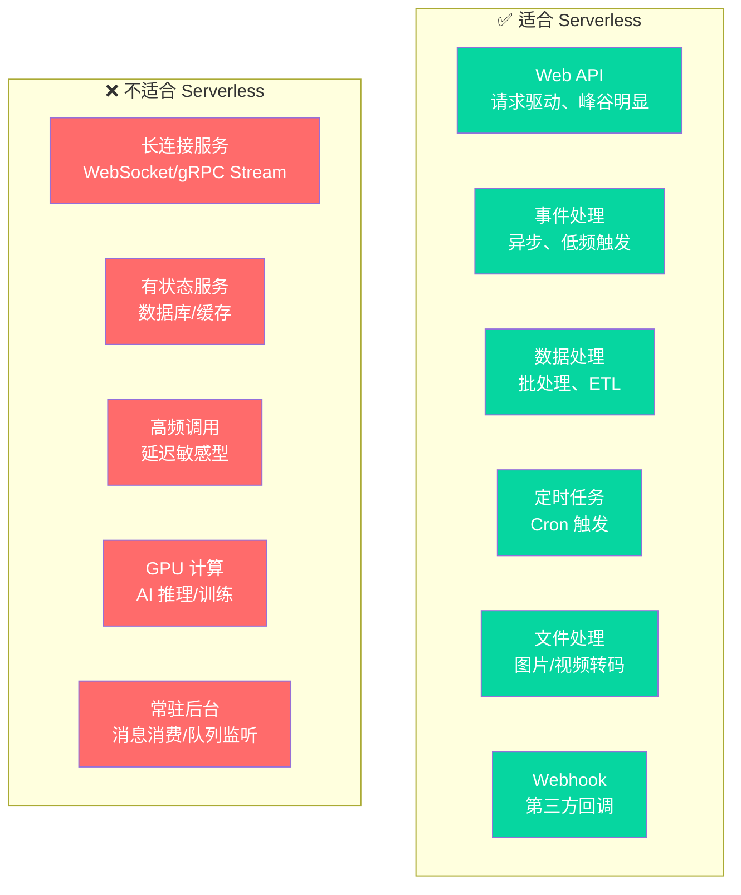

### 详细场景分析

#### ✅ Web API 服务

```yaml
# 典型场景：REST API 服务
apiVersion: serving.knative.dev/v1
kind: Service
metadata:
  name: product-api
  namespace: production
spec:
  template:
    metadata:
      annotations:
        autoscaling.knative.dev/target: "50"
        autoscaling.knative.dev/minScale: "1"   # 避免 API 冷启动
        autoscaling.knative.dev/maxScale: "30"
    spec:
      containers:
        - image: registry.example.com/product-api:v1
          ports:
            - containerPort: 8080
```

**为什么适合**：请求驱动模型天然匹配 Serverless，流量峰谷明显时成本优势显著，自动弹性应对突发流量。

#### ✅ 事件处理

```yaml
# 典型场景：订单事件处理
apiVersion: eventing.knative.dev/v1
kind: Trigger
metadata:
  name: order-event-trigger
  namespace: production
spec:
  broker: default
  filter:
    attributes:
      type: com.example.order.created
  subscriber:
    ref:
      apiVersion: serving.knative.dev/v1
      kind: Service
      name: order-processor
```

**为什么适合**：事件驱动天然匹配 Serverless，无事件时零资源消耗，事件突发时自动扩容。

#### ✅ 数据处理

```yaml
# 典型场景：定时数据处理
apiVersion: sources.knative.dev/v1
kind: PingSource
metadata:
  name: daily-etl-trigger
  namespace: production
spec:
  schedule: "0 2 * * *"   # 凌晨 2:00
  contentType: "application/json"
  data: |
    {"task": "daily-etl", "date": "{{date}}"}
  sink:
    ref:
      apiVersion: serving.knative.dev/v1
      kind: Service
      name: etl-processor
```

**为什么适合**：批处理任务只在特定时间运行，其余时间缩容到零，资源利用率极高。

#### ❌ 长连接服务

WebSocket、gRPC Streaming 等长连接服务不适合缩容到零，连接断开后无法自动恢复。

::: warning 长连接服务的替代方案
- 使用常规 Deployment 部署长连接服务
- 使用 Knative 但设置 `minScale >= 1`，禁用缩容到零
- 考虑使用专门的实时通信服务（如 SignalR Service）
:::

#### ❌ 有状态服务

数据库、缓存等有状态服务无法缩容到零，且数据持久化需求与 Serverless 短生命周期冲突。

#### ❌ 延迟敏感型高频调用

对于 P99 延迟要求 < 50ms 的高频 API，冷启动带来的延迟不可接受。设置 `minScale >= 1` 可以避免冷启动，但失去了缩容到零的成本优势。

### 场景选型决策树

```mermaid
flowchart TD
    A[新服务选型] --> B{有持续流量?}
    B -->|是| C{延迟敏感?}
    B -->|否| D{事件触发?}

    C -->|是| E[Deployment + HPA<br/>避免冷启动]
    C -->|否| F{峰谷明显?}
    F -->|是| G[Knative Serving<br/>minScale=1]
    F -->|否| E

    D -->|是| H{需要缩容到零?}
    H -->|是| I[Knative Eventing + Serving<br/>完整 Serverless]
    H -->|否| J[KEDA<br/>事件驱动伸缩]

    D -->|否| K{定时触发?}
    K -->|是| L[PingSource + Knative Service]
    K -->|否| M[评估是否需要 Serverless]

    style I fill:#06d6a0,color:#fff
    style G fill:#4ecdc4,color:#fff
    style J fill:#4ecdc4,color:#fff
    style E fill:#ffa502,color:#fff
```

---

## Serverless 成本分析

### 成本对比模型

| 场景 | 传统部署 | Knative Serverless | 节省比例 |
|------|---------|-------------------|---------|
| **内部工具**（8h/天） | 24h 运行 | 8h 活跃 + 缩容到零 | ~70% |
| **批处理**（1h/天） | 24h 运行 | 1h 活跃 | ~95% |
| **API 服务**（峰谷明显） | 按峰值配置 | 自动弹性 | ~40% |
| **事件驱动**（低频） | 24h 运行 | 按事件触发 | ~80% |
| **在线服务**（7x24 高负载） | 按需配置 | 弹性 + 最低 2 副本 | ~10% |

### 成本计算公式

```
传统部署月成本 = 副本数 × 单副本价格 × 730h

Serverless 月成本 = (活跃时长 × 活跃副本数 × 单副本价格)
                  + (冷启动次数 × 单次冷启动成本)
                  + (事件处理成本)

// 示例：API 服务
传统：5 副本 × $0.05/h × 730h = $182.50/月
Serverless：平均 3 副本 × 500h × $0.05/h = $75.00/月（节省 59%）

// 示例：事件处理服务
传统：3 副本 × $0.05/h × 730h = $109.50/月
Serverless：50 次事件/天 × 30s/次 × 30天 = 12.5h × $0.05/h = $0.63/月（节省 99%）
```

::: important 成本陷阱
1. **高频短调用**：频繁冷启动反而比持续运行更贵
2. **内存超额**：函数内存配置过大，按 GB-秒 计费导致成本飙升
3. **事件风暴**：突发大量事件导致瞬时大量扩容，成本不可控
4. **数据传输**：跨可用区/跨区域的数据传输费用常被忽略
:::

---

## 生产级 Knative 运维

### 监控体系

```yaml
# Knative 指标采集注解
apiVersion: serving.knative.dev/v1
kind: Service
metadata:
  name: observable-service
  namespace: production
  annotations:
    serving.knative.dev/enable-metric: "true"
spec:
  template:
    spec:
      containers:
        - image: registry.example.com/myapp:v1
          ports:
            - containerPort: 8080
          env:
            - name: OTEL_EXPORTER_OTLP_ENDPOINT
              value: "http://otel-collector.observability:4317"
            - name: OTEL_SERVICE_NAME
              value: "myapp"
            - name: OTEL_RESOURCE_ATTRIBUTES
              value: "service.namespace=production,deployment.environment=prod"
```

#### Knative 核心指标

| 指标名称 | 类型 | 说明 | 告警阈值建议 |
|---------|------|------|------------|
| `revision_request_count` | Counter | 请求总数 | - |
| `revision_request_duration` | Histogram | 请求延迟分布 | P99 > 5s |
| `revision_request_milliseconds` | Histogram | 请求处理时间 | P99 > 3s |
| `container_concurrency` | Gauge | 当前并发数 | > 目标并发 80% |
| `pod_autoscaler_desired_scale` | Gauge | 期望副本数 | - |
| `pod_autoscaler_actual_scale` | Gauge | 实际副本数 | 与期望值不一致 |
| `activator_request_count` | Counter | 通过 Activator 的请求数 | 占比 > 30% |
| `broker_event_count` | Counter | 事件投递数 | - |
| `trigger_event_count` | Counter | Trigger 事件数 | - |
| `event_dispatch_latency` | Histogram | 事件投递延迟 | P99 > 1s |

#### Prometheus 告警规则

```yaml
# Knative 告警规则
apiVersion: monitoring.coreos.com/v1
kind: PrometheusRule
metadata:
  name: knative-alerts
  namespace: monitoring
spec:
  groups:
    - name: knative-serving.rules
      interval: 30s
      rules:
        # 冷启动率过高
        - alert: KnativeHighColdStartRate
          expr: |
            sum(rate(activator_request_count{code="200"}[5m]))
            /
            sum(rate(revision_request_count{code="200"}[5m]))
            > 0.3
          for: 5m
          labels:
            severity: warning
          annotations:
            summary: "Knative 冷启动率超过 30%"
            description: "通过 Activator 的请求比例过高，建议增加 minScale"

        # 请求延迟过高
        - alert: KnativeHighLatency
          expr: |
            histogram_quantile(0.99,
              sum(rate(revision_request_duration_bucket[5m]))
              by (le, revision_name, namespace)
            ) > 5
          for: 5m
          labels:
            severity: warning
          annotations:
            summary: "Knative 请求 P99 延迟超过 5s"
            description: "Revision {{ $labels.revision_name }} P99 延迟 {{ $value }}s"

        # 缩容到零后恢复失败
        - alert: KnativeScaleUpFailed
          expr: |
            pod_autoscaler_desired_scale != pod_autoscaler_actual_scale
            and pod_autoscaler_desired_scale > 0
          for: 10m
          labels:
            severity: critical
          annotations:
            summary: "Knative 自动伸缩失败"
            description: "期望副本数与实际副本数不一致超过 10 分钟"

        # 事件投递失败
        - alert: KnativeEventDeliveryFailed
          expr: |
            sum(rate(trigger_event_count{response_code!~"2.."}[5m]))
            /
            sum(rate(trigger_event_count[5m]))
            > 0.05
          for: 5m
          labels:
            severity: warning
          annotations:
            summary: "Knative 事件投递失败率超过 5%"

    - name: knative-eventing.rules
      interval: 30s
      rules:
        # Broker 事件积压
        - alert: KnativeBrokerEventBacklog
          expr: |
            broker_event_count{type="Unfiltered"} - broker_event_count{type="Delivered"}
            > 1000
          for: 10m
          labels:
            severity: warning
          annotations:
            summary: "Broker 事件积压超过 1000"
```

### 故障排查手册

#### Pod 无法启动

```bash
# 查看 Revision 状态
kubectl describe revision myapp-00001 -n production

# 查看容器日志
kubectl logs deploy/myapp-00001-deployment -n production -c user-container

# 查看事件
kubectl get events -n production --sort-by='.lastTimestamp' --field-selector involvedObject.name=myapp-00001-deployment

# 常见原因排查
# 1. 镜像拉取失败
kubectl get events -n production --field-selector reason=Failed
# 2. 资源不足
kubectl describe node <node-name> | grep -A 5 "Allocated resources"
# 3. 探针失败
kubectl describe pod <pod-name> -n production | grep -A 10 "Events"
```

#### 缩容到零后请求超时

```bash
# 检查 Activator 日志
kubectl logs -n knative-serving deploy/activator --tail=100

# 检查 Autoscaler 日志
kubectl logs -n knative-serving deploy/autoscaler --tail=100

# 检查 Pod 创建时间
kubectl get events -n production --sort-by='.lastTimestamp'

# 检查缩容到零配置
kubectl get configmap config-autoscaler -n knative-serving -o yaml

# 临时解决方案：设置 minScale >= 1
kubectl patch kservice myapp -n production --type merge -p '
{
  "spec": {
    "template": {
      "metadata": {
        "annotations": {
          "autoscaling.knative.dev/minScale": "1"
        }
      }
    }
  }
}'
```

#### 自动伸缩不生效

```bash
# 查看 HPA 状态
kubectl get hpa -n production
kubectl describe hpa myapp-00001 -n production

# 检查指标是否可用
kubectl get --raw "/apis/custom.metrics.k8s.io/v1beta1" | jq

# 检查 KPA 指标
kubectl get --raw "/apis/custom.metrics.k8s.io/v1beta1/namespaces/production/services/myapp/autoscaling.knative.dev~1concurrency" | jq

# 检查 Autoscaler 配置
kubectl get configmap config-autoscaler -n knative-serving -o yaml

# 常见原因
# 1. 指标未暴露：检查 Queue-Proxy 是否正常
# 2. 目标并发设置过高：降低 target 值
# 3. minScale = maxScale：检查是否限制了伸缩范围
```

#### 事件未投递

```bash
# 查看事件状态
kubectl get trigger -n production -o yaml
kubectl describe broker default -n production

# 检查事件投递失败
kubectl get events -n production --field-selector reason=TriggerDeliveryFailed

# 检查 Broker 健康状态
kubectl get broker default -n production -o jsonpath='{.status}'

# 检查 Channel 状态
kubectl get channels -n production

# 查看死信队列
kubectl logs deploy/dead-letter-handler -n production --tail=100

# 常见原因
# 1. Trigger 过滤条件不匹配：检查 filter.attributes
# 2. Subscriber 不可达：检查 Service 是否就绪
# 3. Broker 后端异常：检查 Kafka/RabbitMQ 连接
```

#### 冷启动过慢

```bash
# 检查镜像大小
kubectl get pod -n production -o jsonpath='{.items[0].spec.containers[0].image}'

# 检查镜像拉取时间
kubectl get events -n production --field-selector reason=Pulling
kubectl get events -n production --field-selector reason=Pulled

# 检查 Pod 启动时间
kubectl get pods -n production -o wide

# 检查节点资源
kubectl top nodes
kubectl describe node <node-name> | grep -A 10 "Allocated resources"

# 优化措施
# 1. 精简镜像（Alpine/Distroless）
# 2. 镜像预拉取（DaemonSet）
# 3. 调整探针参数（缩短 initialDelaySeconds）
# 4. 设置 minScale >= 1（避免冷启动）
```

### 运维常用命令

```bash
# ===== Knative Serving 诊断 =====
# 列出所有 Knative Service
kn service list -A

# 查看服务详情
kn service describe myapp -n production

# 列出所有 Revision
kn revision list -n production

# 查看 Route 信息
kn route list -n production

# 查看 Service URL
kn service describe myapp -n production | grep URL

# ===== Knative Eventing 诊断 =====
# 列出所有事件源
kn source list -A

# 列出所有 Trigger
kn trigger list -A

# 列出所有 Broker
kn broker list -A

# 查看 Broker 详情
kn broker describe default -n production

# ===== 配置检查 =====
# 查看 Knative Serving 配置
kubectl get configmap -n knative-serving
kubectl get configmap config-autoscaler -n knative-serving -o yaml
kubectl get configmap config-network -n knative-serving -o yaml
kubectl get configmap config-defaults -n knative-serving -o yaml

# 查看 Knative Eventing 配置
kubectl get configmap -n knative-eventing

# 查看网络层状态
kubectl get pods -n knative-serving -l app=3scale-kourier-gateway
kubectl get svc -n knative-serving

# ===== 指标查询 =====
# 查看并发指标
kubectl get --raw "/apis/custom.metrics.k8s.io/v1beta1/namespaces/production/services/myapp/autoscaling.knative.dev~1concurrency" | jq

# 查看自定义指标
kubectl get --raw "/apis/custom.metrics.k8s.io/v1beta1" | jq '.resources[] | select(.name | contains("knative"))'

# ===== 清理 =====
# 删除旧 Revision（保留最近 N 个）
kubectl get revisions -n production --sort-by='.metadata.creationTimestamp' -o name | head -n -5 | xargs kubectl delete

# 删除未使用的 Knative Service
kn service delete old-service -n production
```

### 多环境管理

```yaml
# Kustomize - 基础配置
# base/kustomization.yaml
apiVersion: kustomize.config.k8s.io/v1beta1
kind: Kustomization
resources:
  - service.yaml
  - trigger.yaml
  - broker.yaml
---
# Kustomize - 开发环境
# overlays/dev/kustomization.yaml
apiVersion: kustomize.config.k8s.io/v1beta1
kind: Kustomization
resources:
  - ../../base
patches:
  - target:
      kind: Service
      group: serving.knative.dev
    patch: |
      - op: replace
        path: /spec/template/metadata/annotations/autoscaling.knative.dev~1minScale
        value: "0"
      - op: replace
        path: /spec/template/metadata/annotations/autoscaling.knative.dev~1maxScale
        value: "3"
      - op: replace
        path: /spec/template/spec/containers/0/resources/requests/cpu
        value: "50m"
      - op: replace
        path: /spec/template/spec/containers/0/resources/requests/memory
        value: "64Mi"
---
# Kustomize - 生产环境
# overlays/prod/kustomization.yaml
apiVersion: kustomize.config.k8s.io/v1beta1
kind: Kustomization
resources:
  - ../../base
patches:
  - target:
      kind: Service
      group: serving.knative.dev
    patch: |
      - op: replace
        path: /spec/template/metadata/annotations/autoscaling.knative.dev~1minScale
        value: "2"
      - op: replace
        path: /spec/template/metadata/annotations/autoscaling.knative.dev~1maxScale
        value: "50"
      - op: replace
        path: /spec/template/spec/containers/0/resources/requests/cpu
        value: "200m"
      - op: replace
        path: /spec/template/spec/containers/0/resources/requests/memory
        value: "256Mi"
```

---

## KEDA - 事件驱动自动伸缩

### KEDA 架构

```mermaid
graph TB
    subgraph "KEDA"
        AGENT[KEDA Agent<br/>Metrics Adapter]
        WEBHOOK[KEDA Webhook<br/>验证准入]
        SCALER[Scaler<br/>指标获取]
    end

    subgraph "伸缩目标"
        DEPLOY[Deployment]
        STATEFULSET[StatefulSet]
        CUSTOMRESOURCE[Custom Resource]
    end

    subgraph "事件源（60+ Scalers）"
        KAFKA[Kafka]
        REDIS[Redis]
        PROM[Prometheus]
        RABBIT[RabbitMQ]
        MYSQL[MySQL]
        CRON[Cron]
        HTTP[HTTP]
        AZURE[Azure Queue/Bus]
        AWS_SQS[AWS SQS]
        GCP_PUBSUB[GCP PubSub]
    end

    SCALER --> KAFKA
    SCALER --> REDIS
    SCALER --> PROM
    SCALER --> RABBIT
    SCALER --> MYSQL
    SCALER --> CRON
    SCALER --> HTTP
    SCALER --> AZURE
    SCALER --> AWS_SQS
    SCALER --> GCP_PUBSUB

    AGENT -->|提供指标| HPA[K8s HPA]
    HPA --> DEPLOY
    HPA --> STATEFULSET
    HPA --> CUSTOMRESOURCE

    style AGENT fill:#4ecdc4,color:#fff
    style SCALER fill:#ffa502,color:#fff
```

### 安装 KEDA

```bash
# Helm 安装
helm repo add kedacore https://kedacore.github.io/charts
helm repo update
helm install keda kedacore/keda --namespace keda --create-namespace

# 验证
kubectl get pods -n keda
kubectl get scaledobjects -A
```

### ScaledObject 配置

```yaml
# 基于 Kafka 消费者 Lag 伸缩
apiVersion: keda.sh/v1alpha1
kind: ScaledObject
metadata:
  name: order-processor-scaler
  namespace: production
spec:
  scaleTargetRef:
    apiVersion: apps/v1
    kind: Deployment
    name: order-processor
  pollingInterval: 30
  cooldownPeriod: 300
  minReplicaCount: 0
  maxReplicaCount: 20
  fallback:
    failureThreshold: 3
    replicas: 2
  advanced:
    horizontalPodAutoscalerConfig:
      behavior:
        scaleDown:
          stabilizationWindowSeconds: 300
          policies:
            - type: Percent
              value: 50
              periodSeconds: 60
        scaleUp:
          stabilizationWindowSeconds: 0
          policies:
            - type: Percent
              value: 100
              periodSeconds: 15
            - type: Pods
              value: 4
              periodSeconds: 15
          selectPolicy: Max
  triggers:
    - type: kafka
      metadata:
        bootstrapServers: kafka-0.kafka:9092,kafka-1.kafka:9092,kafka-2.kafka:9092
        consumerGroup: order-processor-group
        topic: order-events
        lagThreshold: "10"
        activationLagThreshold: "5"
---
# 基于 Prometheus 指标伸缩
apiVersion: keda.sh/v1alpha1
kind: ScaledObject
metadata:
  name: api-server-scaler
  namespace: production
spec:
  scaleTargetRef:
    apiVersion: apps/v1
    kind: Deployment
    name: api-server
  minReplicaCount: 1
  maxReplicaCount: 30
  triggers:
    - type: prometheus
      metadata:
        serverAddress: http://prometheus.monitoring:9090
        metricName: http_requests_per_second
        threshold: "1000"
        query: |
          sum(rate(http_requests_total{namespace="production",app="api-server"}[2m]))
---
# 基于 Redis List 长度伸缩
apiVersion: keda.sh/v1alpha1
kind: ScaledObject
metadata:
  name: worker-scaler
  namespace: production
spec:
  scaleTargetRef:
    apiVersion: apps/v1
    kind: Deployment
    name: redis-worker
  minReplicaCount: 0
  maxReplicaCount: 10
  triggers:
    - type: redis
      metadata:
        address: redis.production.svc:6379
        listName: task-queue
        listLength: "5"
      authenticationRef:
        name: redis-auth
---
# Redis 认证
apiVersion: v1
kind: Secret
metadata:
  name: redis-secret
  namespace: production
type: Opaque
data:
  password: <base64-encoded-password>
---
apiVersion: keda.sh/v1alpha1
kind: TriggerAuthentication
metadata:
  name: redis-auth
  namespace: production
spec:
  secretTargetRef:
    - parameter: password
      name: redis-secret
      key: password
```

### Cron 定时伸缩

```yaml
# 定时伸缩 - 工作时间扩容
apiVersion: keda.sh/v1alpha1
kind: ScaledObject
metadata:
  name: web-app-cron-scaler
  namespace: production
spec:
  scaleTargetRef:
    apiVersion: apps/v1
    kind: Deployment
    name: web-app
  minReplicaCount: 1
  maxReplicaCount: 20
  triggers:
    - type: cron
      metadata:
        timezone: Asia/Shanghai
        start: "30 8 * * 1-5"
        end: "0 20 * * 1-5"
        desiredReplicas: "5"
```

---

## 总结

```mermaid
mindmap
  root((Serverless 与 Knative))
    核心概念
      Serverless 定义
      BaaS vs FaaS
      事件驱动架构
      缩容到零
      自动弹性
      按需计费
    Knative Serving
      Service 定义
      Configuration 版本配置
      Revision 不可变版本
      Route 流量路由
      流量灰度发布
      URL 映射
      Activator 激活器
      Autoscaler KPA 伸缩
    Knative Eventing
      Broker 事件总线
      Trigger 事件过滤
      Source 事件源
      Channel 传输通道
      Sink 事件消费
      CloudEvents 规范
    事件源
      Kafka
      RabbitMQ
      HTTP
      GitHub
      ApiServer
      PingSource
      自定义 Source
    网络层
      Kourier 轻量级
      Contour 高级路由
      Istio 服务网格
      自动 TLS
    冷启动优化
      镜像精简
      预热缓存
      minScale 保底
      Init 容器
      镜像预拉取
      ReadyToRun AOT
    设计模式
      事件溯源
      CQRS
      Saga 分布式事务
    .NET 实战
      Minimal API
      CloudEvents 处理
      Dockerfile 优化
      AOT 编译
    成本分析
      按需计费
      场景对比
      成本陷阱
    生产运维
      监控指标
      告警规则
      故障排查
      多环境管理
```

::: tip Serverless 最佳实践清单
1. **渐进式采用**：先用 KEDA 为现有部署添加事件伸缩，再引入 Knative Serving
2. **合理设置 minScale**：关键服务设置 minScale >= 1，避免冷启动影响用户体验
3. **镜像优化**：使用 Alpine/Distroless 基础镜像，多阶段构建，.NET 使用 ReadyToRun/AOT
4. **事件驱动优先**：新服务优先采用事件驱动架构，天然适配 Serverless 模型
5. **CloudEvents 规范**：所有事件遵循 CloudEvents 规范，确保跨平台互操作性
6. **灰度发布流程**：0% → 5% → 25% → 50% → 100%，每步验证关键指标
7. **成本监控**：建立成本基线，定期对比传统部署与 Serverless 成本
8. **健康检查优化**：缩短 initialDelaySeconds，使用 exec 探针代替 httpGet
9. **命名空间隔离**：生产与测试环境使用不同的 Broker，避免事件串扰
10. **监控告警**：监控冷启动率、扩缩容延迟、事件投递失败率等关键指标
11. **死信队列**：为所有 Trigger 配置 deadLetterSink，防止事件丢失
12. **资源限制**：合理设置 CPU/Memory 请求和限制，避免资源浪费或 OOM
:::
