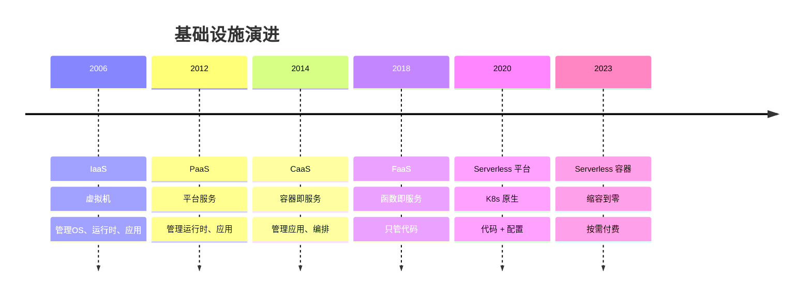
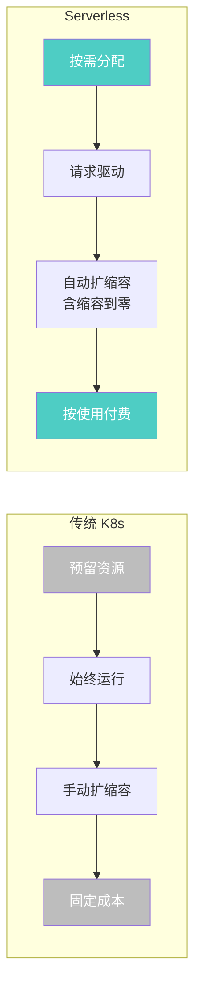
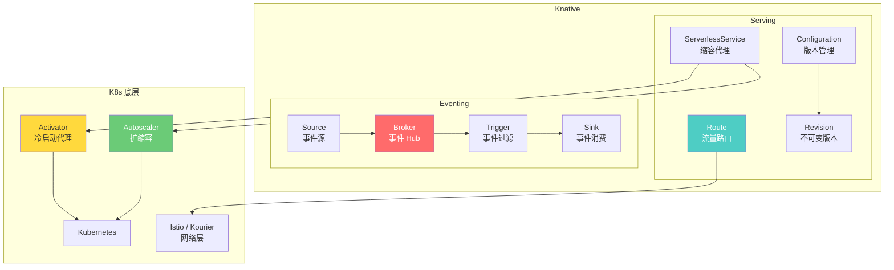
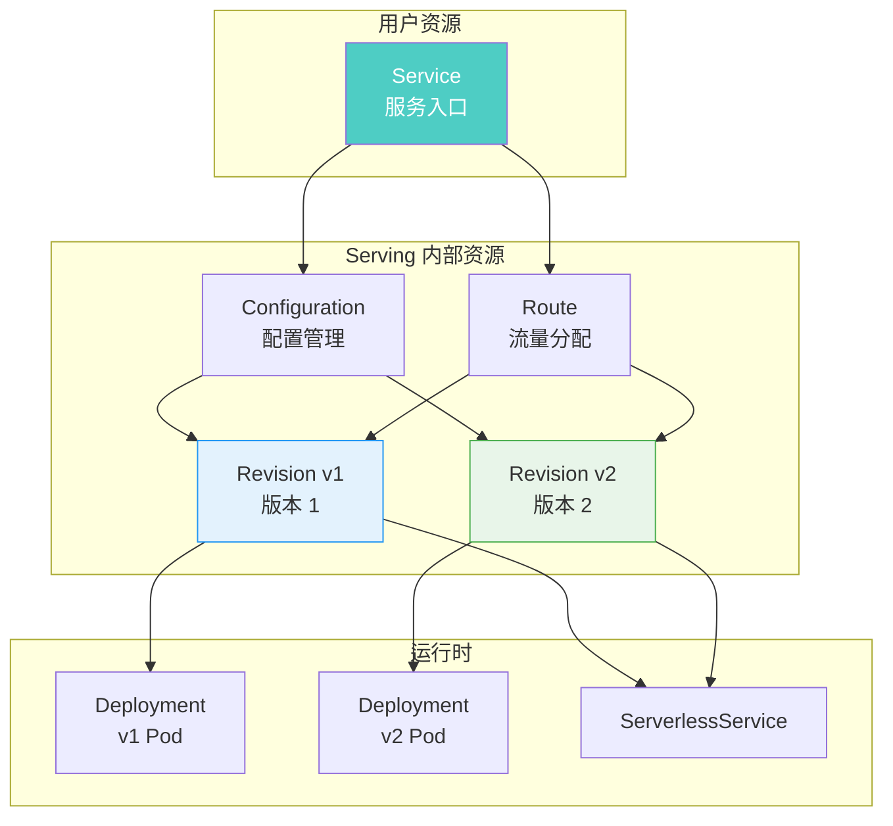
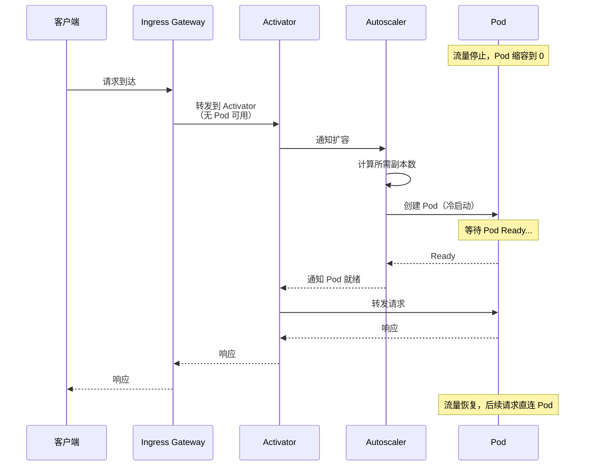
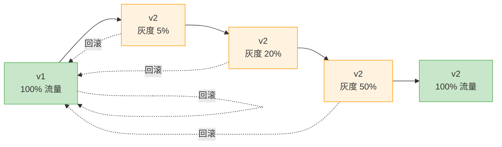
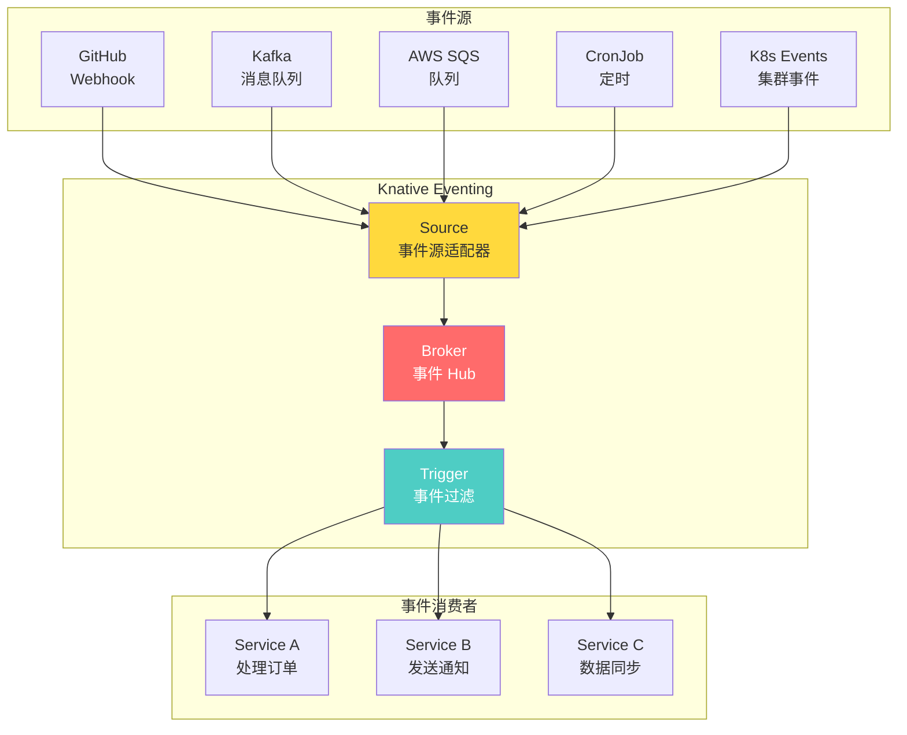
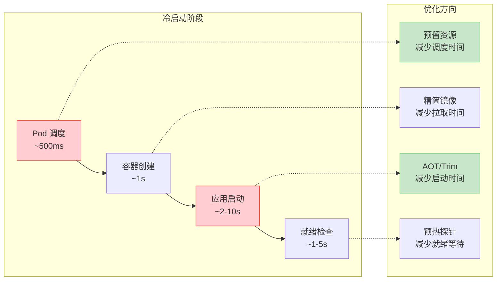

# Serverless 与 Knative

Serverless 不是"没有服务器"，而是"不用管服务器"。开发者只需关注代码，基础设施的供给、扩缩容、容错全部交给平台。Knative 是 Kubernetes 上的 Serverless 平台，提供 Serving（请求驱动扩缩容）和 Eventing（事件驱动架构）两大核心能力，让 K8s 原生具备 Serverless 体验。本文从 Serverless 演进出发，覆盖 Knative 架构、Serving 流量管理、Eventing 事件路由、缩容到零原理、.NET 集成实战、生产部署经验，帮你理解何时以及如何在 K8s 上落地 Serverless。

---

## 1. Serverless 演进与价值

### 1.1 从 IaaS 到 Serverless



### 1.2 Serverless 核心特征



| 特征 | 传统 K8s | Serverless |
|------|----------|------------|
| **资源管理** | 预留、手动调整 | 按需自动分配 |
| **扩缩容** | HPA（最小副本 ≥1） | 0-N 自动伸缩 |
| **计费** | 按资源预留时长 | 按请求量和执行时间 |
| **运维** | 需关注节点、Pod | 只关注代码和配置 |
| **冷启动** | 无 | 有（需优化） |
| **适用场景** | 常驻服务 | 事件驱动、流量波动大 |

### 1.3 Serverless 方案对比

| 方案 | 类型 | 优势 | 劣势 |
|------|------|------|------|
| **AWS Lambda** | 云 FaaS | 生态成熟、触发器丰富 | 厂商锁定、冷启动 |
| **Azure Functions** | 云 FaaS | .NET 一等公民 | 厂商锁定 |
| **Google Cloud Run** | 云 Serverless 容器 | 任意语言、缩容到零 | 厂商锁定 |
| **Knative** | K8s 原生 | 不锁定、可自建 | 运维复杂度高 |
| **OpenFaaS** | K8s 原生 | 简单易用 | 功能较少 |
| **KEDA** | K8s 事件驱动扩缩 | 轻量、兼容 HPA | 不是完整 Serverless |

::: tip 选型建议
- **已有 K8s 集群 + 需要 Serverless 能力**：Knative，K8s 原生，不锁定
- **纯云上 + 快速上线**：云函数（Lambda/Functions），零运维
- **只需事件驱动扩缩容**：KEDA，最轻量
- **已有 KEDA + 需要缩容到零**：KEDA + Knative Serving
:::

---

## 2. Knative 架构

### 2.1 Knative 整体架构



### 2.2 Knative Serving 架构



**Knative Serving 资源关系：**

```
Service（用户创建）
  ├── Route（自动创建，管理流量分配）
  │     ├── v1: 90% → Revision-v1
  │     └── v2: 10% → Revision-v2
  └── Configuration（自动创建，管理版本）
        ├── Revision-v1（旧版本，不可变）
        └── Revision-v2（最新版本，当前配置）

每次更新 Configuration → 创建新 Revision
Revision 是不可变的 → 可以回滚到任意版本
```

### 2.3 缩容到零原理



**缩容到零的三个阶段：**

```
阶段 1：正常服务
  Pod 运行 → 请求直连 Pod → Autoscaler 监控并发

阶段 2：缩容过程
  并发 < scale-to-zero-threshold → 等待 stable-window
  stable-window（默认 60s）内无请求 → 开始缩容
  Pod 副本数 → 0 → 流量路由切换到 Activator

阶段 3：冷启动
  新请求 → Activator 缓存请求
  Activator → Autoscaler → 创建 Pod
  Pod Ready → 请求转发 → 后续请求直连
```

---

## 3. Knative Serving

### 3.1 安装 Knative

```bash
# 安装 Knative Serving
kubectl apply -f https://github.com/knative/serving/releases/download/knative-v1.14.0/serving-crds.yaml
kubectl apply -f https://github.com/knative/serving/releases/download/knative-v1.14.0/serving-core.yaml

# 安装网络层（Kourier，轻量替代 Istio）
kubectl apply -f https://github.com/knative/net-kourier/releases/download/knative-v1.14.0/kourier.yaml

# 配置默认网络层
kubectl patch configmap/config-network \
  --namespace knative-serving \
  --type merge \
  --patch '{"data":{"ingress-class":"kourier.ingress.networking.knative.dev"}}'

# 配置域名（使用 sslip.io 自动 DNS）
kubectl patch configmap/config-domain \
  --namespace knative-serving \
  --type merge \
  --patch '{"data":{"127.0.0.1.sslip.io":""}}'

# 验证安装
kubectl get pods -n knative-serving
kubectl get pods -n kourier-system
```

**Serving 配置说明：**

```yaml
# config-network 配置
apiVersion: v1
kind: ConfigMap
metadata:
  name: config-network
  namespace: knative-serving
data:
  # 网络层选择
  ingress.class: "kourier.ingress.networking.knative.dev"
  # 域名模板
  domain-template: "{{.Name}}.{{.Namespace}}.{{.Domain}}"
  # 自动 TLS
  auto-tls: "enabled"
  # HTTP 重定向到 HTTPS
  http-protocol: "redirected"
---
# config-autoscaler 配置
apiVersion: v1
kind: ConfigMap
metadata:
  name: config-autoscaler
  namespace: knative-serving
data:
  # 容器并发目标（每个 Pod 的目标并发数）
  container-concurrency-target-default: "100"
  # 缩容到零等待时间
  scale-to-zero-pod-retention-period: "0s"
  # 稳定窗口
  stable-window: "60s"
  # 缩容到零阈值
  scale-to-zero-grace-period: "30s"
  # 扩容速率
  max-scale-up-rate: "1000"
  # 缩容速率
  max-scale-down-rate: "2"
```

### 3.2 创建 Knative Service

```yaml
# 基础 Knative Service
apiVersion: serving.knative.dev/v1
kind: Service
metadata:
  name: hello-dotnet
  namespace: production
spec:
  template:
    metadata:
      annotations:
        autoscaling.knative.dev/target: "10"       # 每个Pod目标并发数
        autoscaling.knative.dev/minScale: "0"       # 最小副本（0=缩容到零）
        autoscaling.knative.dev/maxScale: "100"     # 最大副本
        autoscaling.knative.dev/scaleDownDelay: "60s"  # 缩容延迟
    spec:
      containers:
      - image: registry.example.com/hello-dotnet:v1.0.0
        ports:
        - containerPort: 8080
        env:
        - name: ASPNETCORE_ENVIRONMENT
          value: "Production"
        resources:
          requests:
            cpu: 100m
            memory: 128Mi
          limits:
            cpu: "1"
            memory: 512Mi
```

```bash
# 部署
kubectl apply -f hello-dotnet.yaml

# 查看服务
kubectl get ksvc hello-dotnet -n production

# 查看 Revision
kubectl get revisions -n production

# 查看 Route
kubectl get route hello-dotnet -n production

# 调用服务
curl http://hello-dotnet.production.127.0.0.1.sslip.io

# 查看自动扩缩容
kubectl get pods -n production -l serving.knative.dev/service=hello-dotnet
```

### 3.3 版本管理与流量分发

```yaml
# 更新服务（创建新 Revision）
apiVersion: serving.knative.dev/v1
kind: Service
metadata:
  name: hello-dotnet
  namespace: production
spec:
  template:
    metadata:
      annotations:
        autoscaling.knative.dev/target: "10"
    spec:
      containers:
      - image: registry.example.com/hello-dotnet:v2.0.0   # 新版本镜像
        ports:
        - containerPort: 8080
  traffic:
  - percent: 90
    revisionName: hello-dotnet-00001     # v1: 90% 流量
    tag: stable
  - percent: 10
    revisionName: hello-dotnet-00002     # v2: 10% 流量（金丝雀发布）
    tag: canary
```

```bash
# 查看流量分配
kubectl get ksvc hello-dotnet -o jsonpath='{.status.traffic}' | jq

# 访问特定版本
curl http://stable-hello-dotnet.production.127.0.0.1.sslip.io   # v1
curl http://canary-hello-dotnet.production.127.0.0.1.sslip.io    # v2

# 逐步增加流量
kubectl patch ksvc hello-dotnet -n production --type merge -p '
{
  "spec": {
    "traffic": [
      {"percent": 70, "revisionName": "hello-dotnet-00001", "tag": "stable"},
      {"percent": 30, "revisionName": "hello-dotnet-00002", "tag": "canary"}
    ]
  }
}'

# 全量切换
kubectl patch ksvc hello-dotnet -n production --type merge -p '
{
  "spec": {
    "traffic": [
      {"percent": 100, "revisionName": "hello-dotnet-00002", "tag": "stable"}
    ]
  }
}'

# 紧急回滚
kubectl patch ksvc hello-dotnet -n production --type merge -p '
{
  "spec": {
    "traffic": [
      {"percent": 100, "revisionName": "hello-dotnet-00001", "tag": "stable"}
    ]
  }
}'
```

### 3.4 灰度发布流程



---

## 4. Knative Eventing

### 4.1 Eventing 架构



**Eventing 核心概念：**

| 概念 | 作用 | 类比 |
|------|------|------|
| **Source** | 从外部系统获取事件 | 水龙头 |
| **Broker** | 事件的 Hub，接收和路由 | 水管总闸 |
| **Trigger** | 订阅 Broker 中的特定事件 | 水管分流阀 |
| **Sink** | 事件的消费者 | 水杯 |
| **CloudEvent** | 标准化的事件格式 | 标准容器 |

### 4.2 CloudEvent 标准

Knative 使用 CloudEvent 规范标准化事件格式。

```json
{
  "specversion": "1.0",
  "type": "com.example.order.created",
  "source": "/orders/service",
  "id": "A234-1234-1234",
  "time": "2024-01-15T10:30:00Z",
  "datacontenttype": "application/json",
  "data": {
    "orderId": "ORD-2024-001",
    "customerId": "CUST-123",
    "items": [
      {"sku": "SKU-001", "quantity": 2, "price": 99.9}
    ],
    "totalAmount": 199.8
  }
}
```

```
CloudEvent 必选属性：

specversion  : "1.0"                    → 规范版本
type         : "com.example.order.created" → 事件类型
source       : "/orders/service"         → 事件来源
id           : "A234-1234-1234"          → 事件唯一 ID

CloudEvent 可选属性：

time         : "2024-01-15T10:30:00Z"   → 事件时间
datacontenttype : "application/json"    → 数据内容类型
subject      : "ORD-2024-001"           → 事件主题
```

### 4.3 创建 Broker 和 Trigger

```yaml
# 创建 Broker（事件 Hub）
apiVersion: eventing.knative.dev/v1
kind: Broker
metadata:
  name: default
  namespace: production
spec:
  delivery:
    deadLetterSink:            # 死信队列
      ref:
        apiVersion: serving.knative.dev/v1
        kind: Service
        name: dead-letter-handler
    retry: 3                   # 重试次数
    backoffPolicy: exponential # 退避策略
    backoffDelay: "1s"         # 初始退避时间
---
# 订单事件 Trigger
apiVersion: eventing.knative.dev/v1
kind: Trigger
metadata:
  name: order-created-trigger
  namespace: production
spec:
  broker: default
  filter:
    attributes:
      type: com.example.order.created    # 过滤事件类型
      source: /orders/service            # 过滤事件来源
  subscriber:
    ref:
      apiVersion: serving.knative.dev/v1
      kind: Service
      name: order-processor              # 事件消费者
---
# 支付事件 Trigger
apiVersion: eventing.knative.dev/v1
kind: Trigger
metadata:
  name: payment-completed-trigger
  namespace: production
spec:
  broker: default
  filter:
    attributes:
      type: com.example.payment.completed
  subscriber:
    ref:
      apiVersion: serving.knative.dev/v1
      kind: Service
      name: notification-service
---
# 所有事件 Trigger（用于审计日志）
apiVersion: eventing.knative.dev/v1
kind: Trigger
metadata:
  name: audit-log-trigger
  namespace: production
spec:
  broker: default
  filter: {}                   # 不过滤，接收所有事件
  subscriber:
    ref:
      apiVersion: serving.knative.dev/v1
      kind: Service
      name: audit-log-service
```

### 4.4 事件源配置

```yaml
# Kafka 事件源
apiVersion: sources.knative.dev/v1beta1
kind: KafkaSource
metadata:
  name: kafka-order-source
  namespace: production
spec:
  consumerGroup: knative-order-processor
  bootstrapServers:
  - kafka-0.kafka-headless:9092
  - kafka-1.kafka-headless:9092
  - kafka-2.kafka-headless:9092
  topics:
  - orders
  sink:
    ref:
      apiVersion: eventing.knative.dev/v1
      kind: Broker
      name: default
---
# 定时事件源（CronJob Source）
apiVersion: sources.knative.dev/v1
kind: PingSource
metadata:
  name: daily-report-trigger
  namespace: production
spec:
  schedule: "0 8 * * *"        # 每天早上 8 点
  contentType: "application/json"
  data: |
    {
      "type": "com.example.report.daily",
      "reportType": "daily",
      "date": "2024-01-15"
    }
  sink:
    ref:
      apiVersion: eventing.knative.dev/v1
      kind: Broker
      name: default
---
# API Server 事件源
apiVersion: sources.knative.dev/v1
kind: ApiServerSource
metadata:
  name: k8s-events-source
  namespace: production
spec:
  mode: Resource
  resources:
  - apiVersion: v1
    kind: Event
  serviceAccountName: events-viewer
  sink:
    ref:
      apiVersion: eventing.knative.dev/v1
      kind: Broker
      name: default
```

### 4.5 事件处理服务

```yaml
# 订单处理服务（.NET）
apiVersion: serving.knative.dev/v1
kind: Service
metadata:
  name: order-processor
  namespace: production
spec:
  template:
    metadata:
      annotations:
        autoscaling.knative.dev/target: "5"
        autoscaling.knative.dev/minScale: "0"
        autoscaling.knative.dev/maxScale: "50"
    spec:
      containers:
      - image: registry.example.com/order-processor:v1.0.0
        env:
        - name: ASPNETCORE_ENVIRONMENT
          value: "Production"
        - name: DB_CONNECTION
          valueFrom:
            secretKeyRef:
              name: db-secret
              key: connection-string
        resources:
          requests:
            cpu: 100m
            memory: 128Mi
          limits:
            cpu: "1"
            memory: 512Mi
```

```csharp
// Program.cs - Knative 事件消费者
var builder = WebApplication.CreateBuilder(args);
var app = builder.Build();

// Knative Eventing 通过 HTTP POST 发送 CloudEvent
app.MapPost("/", async (HttpContext context) =>
{
    // 读取 CloudEvent 属性
    var eventType = context.Request.Headers["Ce-Type"].FirstOrDefault();
    var eventSource = context.Request.Headers["Ce-Source"].FirstOrDefault();
    var eventId = context.Request.Headers["Ce-Id"].FirstOrDefault();

    // 读取事件数据
    using var reader = new StreamReader(context.RequestBody);
    var payload = await reader.ReadToEndAsync();

    logger.LogInformation(
        "Received event: Type={Type}, Source={Source}, Id={Id}",
        eventType, eventSource, eventId);

    // 根据事件类型处理
    switch (eventType)
    {
        case "com.example.order.created":
            await HandleOrderCreated(payload);
            break;
        case "com.example.payment.completed":
            await HandlePaymentCompleted(payload);
            break;
        default:
            logger.LogWarning("Unknown event type: {Type}", eventType);
            break;
    }

    // 返回 200 确认收到
    return Results.Ok();
});

app.Run();
```

---

## 5. .NET 集成实战

### 5.1 .NET Knative 项目模板

```
KnativeDotNetDemo/
├── src/
│   ├── OrderService/               # 订单服务（Serving）
│   │   ├── Dockerfile
│   │   ├── Program.cs
│   │   └── OrderService.csproj
│   ├── OrderProcessor/             # 订单处理器（Eventing）
│   │   ├── Dockerfile
│   │   ├── Program.cs
│   │   └── OrderProcessor.csproj
│   └── NotificationService/        # 通知服务（Eventing）
│       ├── Dockerfile
│       ├── Program.cs
│       └── NotificationService.csproj
├── k8s/
│   ├── serving/
│   │   ├── order-service.yaml
│   │   └── notification-service.yaml
│   └── eventing/
│       ├── broker.yaml
│       ├── triggers.yaml
│       └── sources.yaml
└── docker-compose.yaml             # 本地开发
```

### 5.2 Dockerfile 优化（减少冷启动）

```dockerfile
# 多阶段构建 - 减小镜像体积
FROM mcr.microsoft.com/dotnet/sdk:8.0 AS build
WORKDIR /src
COPY ["OrderService.csproj", "./"]
RUN dotnet restore
COPY . .
RUN dotnet publish -c Release -o /app/publish \
    --no-restore \
    /p:PublishTrimmed=true \
    /p:PublishReadyToRun=true

# 运行阶段 - 使用精简镜像
FROM mcr.microsoft.com/dotnet/aspnet:8.0-alpine AS runtime
WORKDIR /app

# 安装 ICU（全球化支持）
RUN apk add --no-cache icu-libs

# 非root用户
USER $APP_UID

COPY --from=build /app/publish .

# 环境变量
ENV ASPNETCORE_URLS=http://+:8080
ENV DOTNET_SYSTEM_GLOBALIZATION_INVARIANT=false
ENV DOTNET_gcServer=0

EXPOSE 8080
ENTRYPOINT ["dotnet", "OrderService.dll"]
```

```dockerfile
# Native AOT 构建更快冷启动（.NET 8+）
FROM mcr.microsoft.com/dotnet/sdk:8.0 AS build
WORKDIR /src
COPY ["OrderService.csproj", "./"]
RUN dotnet restore
COPY . .
RUN dotnet publish -c Release -o /app/publish \
    /p:PublishAot=true \
    /p:StripSymbols=true

FROM mcr.microsoft.com/dotnet/runtime-deps:8.0-alpine AS runtime
WORKDIR /app
USER $APP_UID
COPY --from=build /app/publish .

ENV ASPNETCORE_URLS=http://+:8080
EXPOSE 8080
ENTRYPOINT ["./OrderService"]
```

### 5.3 冷启动优化



**冷启动优化策略：**

| 策略 | 效果 | 代价 |
|------|------|------|
| **minScale ≥ 1** | 完全消除冷启动 | 始终有 Pod 运行，成本增加 |
| **Native AOT** | 启动时间减少 50-80% | 编译限制、无 JIT 优化 |
| **镜像预热** | 减少拉取时间 | 需要额外工具支持 |
| **缩容延迟** | 减少频繁缩扩容 | 资源空闲时间增加 |
| **并发目标调低** | 更快扩容 | Pod 数量更多 |
| **节点预留** | 减少调度时间 | 节点资源浪费 |

```yaml
# 冷启动优化配置
apiVersion: serving.knative.dev/v1
kind: Service
metadata:
  name: order-service
spec:
  template:
    metadata:
      annotations:
        # 缩容优化
        autoscaling.knative.dev/minScale: "1"        # 保留 1 个 Pod（消除冷启动）
        # autoscaling.knative.dev/minScale: "0"      # 缩容到零（有冷启动）
        autoscaling.knative.dev/scaleDownDelay: "300s"  # 缩容延迟 5 分钟

        # 扩容优化
        autoscaling.knative.dev/target: "5"           # 降低并发目标，更快扩容
        autoscaling.knative.dev/maxScale: "50"
        autoscaling.knative.dev/targetBurstCapacity: "0"  # 禁用缓冲，直连 Pod

        # 冷启动优化
        autoscaling.knative.dev/initialScale: "1"     # 初始副本数
    spec:
      containers:
      - image: registry.example.com/order-service:v1.0.0
        ports:
        - containerPort: 8080
        readinessProbe:
          httpGet:
            path: /health/ready
            port: 8080
          periodSeconds: 2           # 更快的就绪检查
          failureThreshold: 1
        startupTimeoutSeconds: 120   # 启动超时
```

### 5.4 完整 .NET 微服务示例

```yaml
# ===== 1. Broker =====
apiVersion: eventing.knative.dev/v1
kind: Broker
metadata:
  name: order-broker
  namespace: production
spec:
  delivery:
    deadLetterSink:
      ref:
        apiVersion: serving.knative.dev/v1
        kind: Service
        name: dead-letter-handler
    retry: 3
    backoffPolicy: exponential
    backoffDelay: "1s"

---
# ===== 2. Order API（Serving） =====
apiVersion: serving.knative.dev/v1
kind: Service
metadata:
  name: order-api
  namespace: production
spec:
  template:
    metadata:
      annotations:
        autoscaling.knative.dev/minScale: "2"
        autoscaling.knative.dev/maxScale: "20"
        autoscaling.knative.dev/target: "10"
    spec:
      containers:
      - image: registry.example.com/order-api:v1.0.0
        ports:
        - containerPort: 8080
        env:
        - name: ASPNETCORE_ENVIRONMENT
          value: "Production"
        - name: Broker__Url
          value: "http://broker-ingress.knative-eventing.svc.cluster.local/production/order-broker"
        resources:
          requests:
            cpu: 200m
            memory: 256Mi
          limits:
            cpu: "1"
            memory: 512Mi

---
# ===== 3. Order Processor（Eventing Consumer） =====
apiVersion: serving.knative.dev/v1
kind: Service
metadata:
  name: order-processor
  namespace: production
spec:
  template:
    metadata:
      annotations:
        autoscaling.knative.dev/minScale: "0"
        autoscaling.knative.dev/maxScale: "30"
        autoscaling.knative.dev/target: "5"
    spec:
      containers:
      - image: registry.example.com/order-processor:v1.0.0
        env:
        - name: ASPNETCORE_ENVIRONMENT
          value: "Production"
        resources:
          requests:
            cpu: 100m
            memory: 128Mi
          limits:
            cpu: "1"
            memory: 512Mi

---
# ===== 4. Trigger =====
apiVersion: eventing.knative.dev/v1
kind: Trigger
metadata:
  name: order-created
  namespace: production
spec:
  broker: order-broker
  filter:
    attributes:
      type: com.example.order.created
  subscriber:
    ref:
      apiVersion: serving.knative.dev/v1
      kind: Service
      name: order-processor
```

```csharp
// Order API - 发送事件到 Broker
public class OrderService
{
    private readonly HttpClient _httpClient;
    private readonly string _brokerUrl;

    public OrderService(HttpClient httpClient, IConfiguration config)
    {
        _httpClient = httpClient;
        _brokerUrl = config["Broker:Url"]
            ?? throw new InvalidOperationException("Broker URL not configured");
    }

    public async Task CreateOrderAsync(Order order)
    {
        // 保存订单到数据库
        await _repository.SaveAsync(order);

        // 发送 CloudEvent 到 Broker
        var cloudEvent = new
        {
            specversion = "1.0",
            type = "com.example.order.created",
            source = "/orders/api",
            id = Guid.NewGuid().ToString(),
            time = DateTime.UtcNow.ToString("o"),
            datacontenttype = "application/json",
            data = order
        };

        var request = new HttpRequestMessage(HttpMethod.Post, _brokerUrl)
        {
            Content = JsonContent.Create(cloudEvent)
        };
        request.Headers.Add("Ce-Specversion", "1.0");
        request.Headers.Add("Ce-Type", "com.example.order.created");
        request.Headers.Add("Ce-Source", "/orders/api");
        request.Headers.Add("Ce-Id", cloudEvent.id);

        await _httpClient.SendAsync(request);
    }
}
```

---

## 6. 生产部署

### 6.1 高可用部署

```yaml
# Knative Serving 高可用配置
# 修改 knative-serving namespace 下的 deployment 副本数

# activator（冷启动代理）
apiVersion: apps/v1
kind: Deployment
metadata:
  name: activator
  namespace: knative-serving
spec:
  replicas: 3                  # 至少 3 个副本
  template:
    spec:
      topologySpreadConstraints:  # 跨区域分布
      - maxSkew: 1
        topologyKey: topology.kubernetes.io/zone
        whenUnsatisfiable: DoNotSchedule
        labelSelector:
          matchLabels:
            app: activator

---
# autoscaler
apiVersion: apps/v1
kind: Deployment
metadata:
  name: autoscaler
  namespace: knative-serving
spec:
  replicas: 2                  # 至少 2 个副本

---
# controller
apiVersion: apps/v1
kind: Deployment
metadata:
  name: controller
  namespace: knative-serving
spec:
  replicas: 2
```

### 6.2 资源配额

```yaml
# 为 Knative 系统组件设置资源配额
apiVersion: v1
kind: ResourceQuota
metadata:
  name: knative-serving-quota
  namespace: knative-serving
spec:
  hard:
    requests.cpu: "4"
    requests.memory: 8Gi
    limits.cpu: "8"
    limits.memory: 16Gi
---
# 为生产 Serverless 工作负载设置配额
apiVersion: v1
kind: ResourceQuota
metadata:
  name: serverless-workload-quota
  namespace: production
spec:
  hard:
    requests.cpu: "32"
    requests.memory: 64Gi
    limits.cpu: "64"
    limits.memory: 128Gi
    count/services.serving.knative.dev: "50"
    count/revisions.serving.knative.dev: "200"
```

### 6.3 监控与可观测性

```yaml
# Knative Serving 指标（Prometheus）
apiVersion: v1
kind: ConfigMap
metadata:
  name: serve-observability
  namespace: knative-serving
data:
  metrics.backend-destination: "prometheus"
  profiling.enable: "false"
---
# Knative Eventing 指标
apiVersion: v1
kind: ConfigMap
metadata:
  name: config-observability
  namespace: knative-eventing
data:
  metrics.backend-destination: "prometheus"
```

**关键监控指标：**

| 指标 | 含义 | 告警阈值 |
|------|------|----------|
| `revision_request_count` | 请求总数 | - |
| `revision_request_latencies` | 请求延迟 | P99 > 3s |
| `activator_request_count` | 经 Activator 的请求 | 比例 > 50%（冷启动频繁） |
| `autoscaler_actual_pods` | 实际 Pod 数 | - |
| `autoscaler_desired_pods` | 期望 Pod 数 | 实际 != 期望 持续 5m |
| `broker_event_count` | Broker 事件数 | - |
| `broker_event_dispatch_latencies` | 事件分发延迟 | P99 > 5s |

### 6.4 常见问题与解决

| 问题 | 原因 | 解决 |
|------|------|------|
| 冷启动太慢 | 镜像大 / 应用启动慢 | 精简镜像、AOT、minScale=1 |
| 扩容不及时 | target 并发太高 | 降低 target 值 |
| 缩容后立即扩容 | 流量波动大 | 增大 scaleDownDelay |
| 事件丢失 | 消费者故障 | 配置死信队列和重试 |
| Broker 性能差 | MTChannelBasedBroker 不适合高吞吐 | 切换 Kafka Broker |

```yaml
# 切换到 Kafka Broker（高吞吐场景）
apiVersion: eventing.knative.dev/v1
kind: Broker
metadata:
  name: kafka-broker
  namespace: production
  annotations:
    eventing.knative.dev/broker.class: Kafka
spec:
  config:
    apiVersion: v1
    kind: ConfigMap
    name: kafka-broker-config
    namespace: knative-eventing
  delivery:
    retry: 5
    backoffPolicy: exponential
    backoffDelay: "1s"
---
apiVersion: v1
kind: ConfigMap
metadata:
  name: kafka-broker-config
  namespace: knative-eventing
data:
  bootstrap.servers: "kafka-0.kafka:9092,kafka-1.kafka:9092,kafka-2.kafka:9092"
  default.topic.partitions: "10"
  default.topic.replication.factor: "3"
```

---

## 7. KEDA 对比与集成

### 7.1 KEDA vs Knative

| 维度 | KEDA | Knative |
|------|------|---------|
| **定位** | 事件驱动扩缩容 | 完整 Serverless 平台 |
| **缩容到零** | 支持 | 支持 |
| **流量管理** | 无（依赖 K8s Service） | 内置 Route/灰度发布 |
| **事件路由** | 无（只触发扩缩容） | Broker/Trigger 事件路由 |
| **部署模型** | 任何 K8s Workload | Knative Service |
| **学习曲线** | 低 | 中高 |
| **适合场景** | 已有 Deployment 需要事件驱动扩缩 | 全新 Serverless 应用 |

### 7.2 KEDA 快速入门

```yaml
# KEDA ScaledObject：基于 Kafka 消息量扩缩容
apiVersion: keda.sh/v1alpha1
kind: ScaledObject
metadata:
  name: order-processor-scaler
  namespace: production
spec:
  scaleTargetRef:
    apiVersion: apps/v1
    kind: Deployment
    name: order-processor
  minReplicaCount: 0       # 缩容到零
  maxReplicaCount: 50
  cooldownPeriod: 60
  triggers:
  - type: kafka
    metadata:
      bootstrapServers: kafka-0.kafka:9092,kafka-1.kafka:9092
      consumerGroup: order-processor-group
      lagThreshold: "10"     # 每个 Pod 处理 10 条消息
      offsetResetPolicy: latest
```

```yaml
# KEDA + Cron 定时扩缩容
apiVersion: keda.sh/v1alpha1
kind: ScaledObject
metadata:
  name: report-generator-scaler
  namespace: production
spec:
  scaleTargetRef:
    apiVersion: apps/v1
    kind: Deployment
    name: report-generator
  minReplicaCount: 0
  maxReplicaCount: 10
  triggers:
  - type: cron
    metadata:
      timezone: Asia/Shanghai
      start: "0 7 * * 1-5"       # 工作日 7:00 开始扩容
      end: "0 20 * * 1-5"        # 工作日 20:00 缩容
      desiredReplicas: "3"
```

---

## 8. 总结

| 概念 | 核心要点 |
|------|----------|
| **Serverless** | 按需分配、自动扩缩、缩容到零、按使用付费 |
| **Knative Serving** | 请求驱动的 Serverless 容器，流量管理、版本管理、灰度发布 |
| **Knative Eventing** | 事件驱动架构，Broker/Trigger、CloudEvent、多种事件源 |
| **缩容到零** | Activator 缓存请求 → Autoscaler 创建 Pod → 请求转发 |
| **冷启动优化** | minScale、Native AOT、精简镜像、缩容延迟 |
| **KEDA** | 轻量级事件驱动扩缩容，适合已有 Deployment |
| **CloudEvent** | 标准化事件格式，解耦事件源与消费者 |

::: important Serverless 落地建议
1. **不是所有服务都适合 Serverless**：常驻服务（Web API）用 Deployment，事件驱动/流量波动大用 Serverless
2. **冷启动是核心矛盾**：对延迟敏感的服务用 minScale ≥ 1，否则用缩容到零
3. **事件驱动优先**：Knative Eventing 的事件路由比消息队列更轻量，适合微服务间解耦
4. **监控冷启动比例**：经 Activator 的请求占比 >50% 说明冷启动太频繁，需要调整 minScale
5. **.NET 优化**：WorkstationGC、Trimmed、AOT 都是减少冷启动的有效手段
6. **渐进式落地**：先从非核心服务开始 Serverless 化，验证后再推广
:::
