# 云原生工具链

云原生不止是 Kubernetes，而是一整个技术生态。CNCF 景观图上有超过 1000 个项目，覆盖从应用定义到可观测性的全栈。面对如此多的工具，如何选择、如何组合、如何落地，是每个团队都要回答的问题。本文从 CNCF 生态全景出发，聚焦 Dapr（分布式应用运行时）、Crossplane（基础设施即代码）、KubeVela（应用交付平台）、OpenTelemetry（统一可观测性）、Backstage（开发者门户）五大工具链，覆盖原理、架构、实战与选型，帮你在云原生工具的海洋中找到正确的方向。

---

## 1. CNCF 生态全景

### 1.1 CNCF 景观图分类

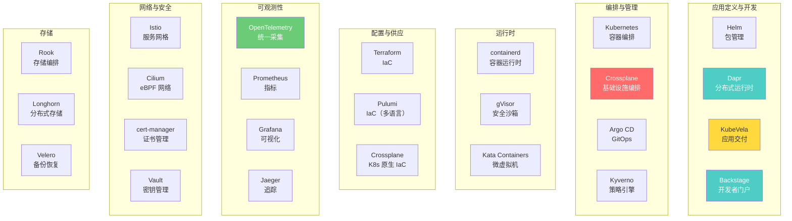

### 1.2 CNCF 项目成熟度

| 级别 | 含义 | 代表项目 |
|------|------|----------|
| **Graduated** | 毕业项目，生产可用 | Kubernetes, Prometheus, Helm, etcd, containerd, Envoy, Cilium |
| **Incubating** | 孵化项目，社区活跃 | Argo, KEDA, KubeVela, Dapr, OpenTelemetry, Crossplane |
| **Sandbox** | 沙箱项目，早期探索 | Krator, KubeArmor, OpenFunction |

::: tip 选型原则
1. **优先毕业项目**：经过大规模生产验证，社区活跃，文档完善
2. **孵化项目慎重评估**：看 GitHub Star、Contributor 数、Issue 响应速度
3. **沙箱项目仅实验**：不建议生产使用
4. **关注社区活跃度**：而不是 Star 数——Star 可以刷，PR/Issue 活跃度骗不了人
:::

---

## 2. Dapr - 分布式应用运行时

### 2.1 为什么需要 Dapr

微服务开发中，每个服务都要重复实现：服务调用、状态管理、发布订阅、分布式锁、配置管理......Dapr 把这些横切关注点抽象为标准化的 Building Block，开发者只需调用 API，不需要关心底层实现。

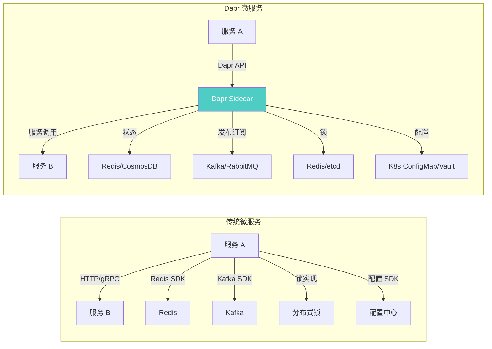

### 2.2 Dapr 架构

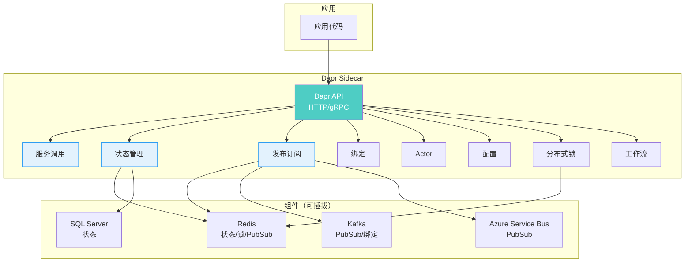

### 2.3 安装 Dapr

```bash
# 安装 Dapr CLI
wget -q https://raw.githubusercontent.com/dapr/cli/master/install/install.sh -O - | /bin/bash

# 初始化 Dapr（K8s 模式）
dapr init -k

# 验证
dapr status -k
kubectl get pods -n dapr-system

# 自定义安装
helm repo add dapr https://dapr.github.io/helm-charts/
helm install dapr dapr/dapr --namespace dapr-system --create-namespace \
  --set global.ha.enabled=true \
  --set dapr_placement.cluster.forceBuckets=4
```

### 2.4 Dapr Building Blocks

#### 服务调用

```yaml
# 无需额外配置，Dapr 自动通过 Sidecar 代理服务调用
# 组件：无需配置
```

```csharp
// .NET SDK - 服务调用
using Dapr.Client;

var daprClient = new DaprClientBuilder().Build();

// 调用其他服务
var order = await daprClient.InvokeMethodAsync<Order>(
    "order-service",          // 目标服务 App ID
    "orders/123",             // 路径
    new HTTPExtension { Verb = HTTPVerb.Get }
);

// 或者使用 HTTP 直接调用 Dapr Sidecar
// POST http://localhost:3500/v1.0/invoke/order-service/method/orders/123
```

#### 状态管理

```yaml
# 状态存储组件
apiVersion: dapr.io/v1alpha1
kind: Component
metadata:
  name: statestore
  namespace: production
spec:
  type: state.redis
  version: v1
  metadata:
  - name: redisHost
    value: redis-service:6379
  - name: redisPassword
    secretKeyRef:
      name: redis-secret
      key: password
  - name: actorStateStore
    value: "true"         # 启用 Actor 状态存储
```

```csharp
// .NET SDK - 状态管理
var daprClient = new DaprClientBuilder().Build();

// 保存状态
await daprClient.SaveStateAsync("statestore", "user-123", new UserInfo { Name = "Alice" });

// 读取状态
var user = await daprClient.GetStateAsync<UserInfo>("statestore", "user-123");

// 带etag的乐观并发
var (value, etag) = await daprClient.GetStateAndETagAsync<UserInfo>("statestore", "user-123");
value.Name = "Bob";
var success = await daprClient.TrySaveStateAsync("statestore", "user-123", value, etag);

// 删除状态
await daprClient.DeleteStateAsync("statestore", "user-123");
```

#### 发布订阅

```yaml
# PubSub 组件
apiVersion: dapr.io/v1alpha1
kind: Component
metadata:
  name: pubsub
  namespace: production
spec:
  type: pubsub.kafka
  version: v1
  metadata:
  - name: brokers
    value: "kafka-0.kafka:9092,kafka-1.kafka:9092,kafka-2.kafka:9092"
  - name: authType
    value: "none"
```

```csharp
// .NET SDK - 发布消息
var daprClient = new DaprClientBuilder().Build();

await daprClient.PublishEventAsync("pubsub", "orders", new OrderEvent
{
    OrderId = "ORD-001",
    CustomerId = "CUST-123",
    Amount = 199.8m
});

// .NET SDK - 订阅消息
// Program.cs
builder.Services.AddControllers().AddDapr();

// OrdersController.cs
[ApiController]
[Route("orders")]
public class OrdersController : ControllerBase
{
    [Topic("pubsub", "orders")]
    [HttpPost("subscribe")]
    public async Task HandleOrder(OrderEvent order)
    {
        _logger.LogInformation("Received order: {OrderId}", order.OrderId);
        await _orderService.ProcessAsync(order);
    }
}
```

#### 绑定

```yaml
# 输入绑定（从外部接收数据）
apiVersion: dapr.io/v1alpha1
kind: Component
metadata:
  name: kafka-binding
  namespace: production
spec:
  type: bindings.kafka
  version: v1
  metadata:
  - name: brokers
    value: "kafka-0.kafka:9092"
  - name: topics
    value: "external-events"
  - name: consumerGroup
    value: "dapr-processor"
---
# 输出绑定（发送数据到外部）
apiVersion: dapr.io/v1alpha1
kind: Component
metadata:
  name: smtp-binding
  namespace: production
spec:
  type: bindings.smtp
  version: v1
  metadata:
  - name: host
    value: "smtp.example.com"
  - name: port
    value: "587"
  - name: user
    value: "noreply@example.com"
  - name: password
    secretKeyRef:
      name: smtp-secret
      key: password
```

```csharp
// 输出绑定 - 发送邮件
await daprClient.InvokeBindingAsync("smtp-binding", "create", new
{
    to = "user@example.com",
    subject = "Order Confirmed",
    body = "Your order ORD-001 has been confirmed."
});
```

### 2.5 Dapr .NET 完整示例

```yaml
# Deployment with Dapr Sidecar
apiVersion: apps/v1
kind: Deployment
metadata:
  name: order-service
  namespace: production
spec:
  replicas: 3
  selector:
    matchLabels:
      app: order-service
  template:
    metadata:
      labels:
        app: order-service
      annotations:
        dapr.io/enabled: "true"
        dapr.io/app-id: "order-service"
        dapr.io/app-port: "8080"
        dapr.io/config: "tracing"       # 启用追踪
        dapr.io/log-level: "info"
    spec:
      containers:
      - name: order-service
        image: registry.example.com/order-service:v1.0.0
        ports:
        - containerPort: 8080
        env:
        - name: ASPNETCORE_ENVIRONMENT
          value: "Production"
        - name: Dapr__StateStore
          value: "statestore"
        - name: Dapr__PubSub
          value: "pubsub"
```

---

## 3. Crossplane - 基础设施即代码

### 3.1 为什么用 Crossplane

Terraform 管理基础设施，Kubernetes 管理应用——但两者是割裂的。Crossplane 把基础设施也变成 K8s 资源，用 `kubectl` 统一管理。

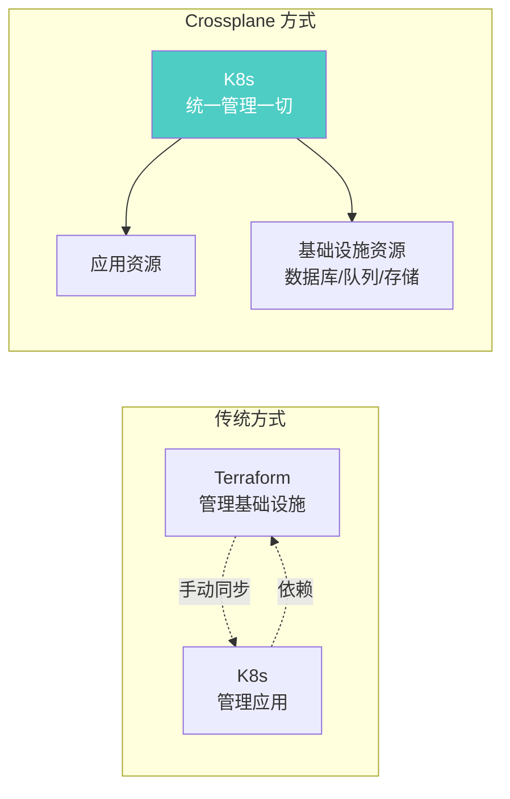

### 3.2 Crossplane 架构

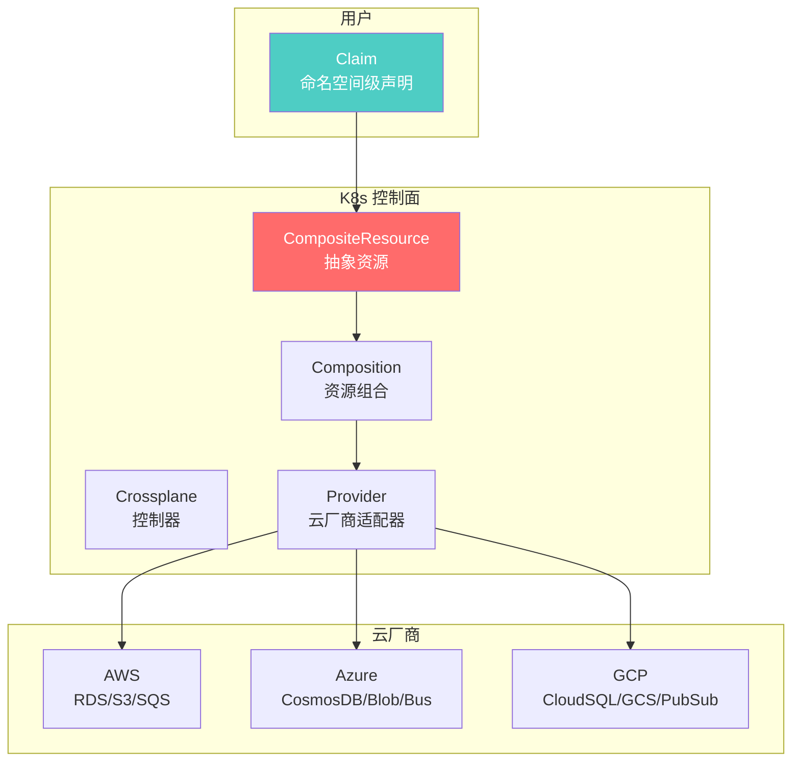

**Crossplane 核心概念：**

| 概念 | 作用 | 类比 |
|------|------|------|
| **Provider** | 云厂商适配器 | Terraform Provider |
| **Managed Resource** | 云资源映射 | Terraform Resource |
| **CompositeResource (XRD)** | 抽象资源定义 | Terraform Module |
| **Composition** | 资源组合逻辑 | Terraform Module 实现 |
| **Claim** | 命名空间级声明 | PVC（对应 PV） |

### 3.3 安装 Crossplane

```bash
# 安装 Crossplane
helm repo add crossplane-stable https://charts.crossplane.io/stable
helm install crossplane crossplane-stable/crossplane \
  --namespace crossplane-system --create-namespace

# 验证
kubectl get pods -n crossplane-system

# 安装 AWS Provider
kubectl apply -f - <<EOF
apiVersion: pkg.crossplane.io/v1
kind: Provider
metadata:
  name: provider-aws
spec:
  package: xpkg.upbound.io/crossplane-contrib/provider-aws:v0.92.0
EOF

# 配置 AWS 凭证
echo "[default]
aws_access_key_id = $AWS_ACCESS_KEY_ID
aws_secret_access_key = $AWS_SECRET_ACCESS_KEY" > aws-creds.ini

kubectl create secret generic aws-creds -n crossplane-system \
  --from-file=creds=./aws-creds.ini

kubectl apply -f - <<EOF
apiVersion: aws.crossplane.io/v1beta1
kind: ProviderConfig
metadata:
  name: aws-default
spec:
  credentials:
    source: Secret
    secretRef:
      namespace: crossplane-system
      name: aws-creds
      key: creds
EOF
```

### 3.4 创建自定义基础设施

```yaml
# 定义抽象资源：数据库服务
apiVersion: apiextensions.crossplane.io/v1
kind: CompositeResourceDefinition
metadata:
  name: databases.mycompany.org
spec:
  group: mycompany.org
  names:
    kind: Database
    plural: databases
  versions:
  - name: v1alpha1
    served: true
    referenceable: true
    schema:
      openAPIV3Schema:
        type: object
        properties:
          spec:
            type: object
            properties:
              engine:
                type: string
                enum: [postgres, mysql]
              size:
                type: string
                enum: [small, medium, large]
            required: [engine, size]
---
# 定义资源组合：数据库 = RDS + SubnetGroup + SecurityGroup
apiVersion: apiextensions.crossplane.io/v1
kind: Composition
metadata:
  name: database-aws
spec:
  compositeTypeRef:
    apiVersion: mycompany.org/v1alpha1
    kind: Database
  resources:
  - name: rds-instance
    base:
      apiVersion: database.aws.crossplane.io/v1beta1
      kind: RDSInstance
      spec:
        forProvider:
          region: us-east-1
          engine: postgres
          engineVersion: "16.1"
          dbInstanceClassOverride: db.t3.medium
          masterUsername: admin
          autoGeneratePassword: true
          skipFinalSnapshotBeforeDeletion: true
        writeConnectionSecretToRef:
          namespace: crossplane-system
    patches:
    - fromFieldPath: spec.size
      toFieldPath: spec.forProvider.allocatedStorage
      transforms:
      - type: map
        map:
          small: "20"
          medium: "100"
          large: "500"
    - fromFieldPath: spec.size
      toFieldPath: spec.forProvider.dbInstanceClassOverride
      transforms:
      - type: map
        map:
          small: db.t3.small
          medium: db.t3.medium
          large: db.r5.large
---
# 用户声明：创建一个小型 PostgreSQL
apiVersion: mycompany.org/v1alpha1
kind: Database
metadata:
  name: myapp-db
  namespace: production
spec:
  engine: postgres
  size: small
  writeConnectionSecretToRef:
    name: myapp-db-connection
```

```bash
# 创建数据库
kubectl apply -f database-claim.yaml

# 查看状态
kubectl get database myapp-db -n production
kubectl describe database myapp-db -n production

# 获取连接信息
kubectl get secret myapp-db-connection -n production -o yaml
```

### 3.5 .NET 应用使用 Crossplane 资源

```yaml
# 完整应用 + 基础设施
apiVersion: apps/v1
kind: Deployment
metadata:
  name: myapp
  namespace: production
spec:
  replicas: 3
  selector:
    matchLabels:
      app: myapp
  template:
    metadata:
      labels:
        app: myapp
    spec:
      containers:
      - name: myapp
        image: registry.example.com/myapp:v1.0.0
        env:
        - name: ConnectionStrings__Postgres
          valueFrom:
            secretKeyRef:
              name: myapp-db-connection     # Crossplane 自动创建的 Secret
              key: endpoint
```

---

## 4. KubeVela - 应用交付平台

### 4.1 为什么用 KubeVela

Helm 管理 Chart，ArgoCD 管理 GitOps，Kustomize 管理定制——但它们各自为战。KubeVela 提供统一的应用交付模型，将应用定义、策略、工作流整合为一体。

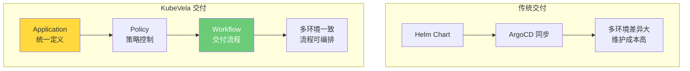

### 4.2 安装 KubeVela

```bash
# 安装 Vela CLI
curl -fsSl https://kubevela.io/script/install.sh | bash

# 安装 KubeVela 控制面
vela install

# 验证
kubectl get pods -n vela-system
vela version

# 安装附加组件
vela addon enable velaux          # UI 控制台
vela addon enable fluxcd          # GitOps
vela addon enable terraform       # Terraform 集成
```

### 4.3 应用交付模型

```yaml
# KubeVela Application
apiVersion: core.oam.dev/v1beta1
kind: Application
metadata:
  name: myapp
  namespace: production
spec:
  components:
  - name: myapp-web
    type: webservice                # 内置组件类型
    properties:
      image: registry.example.com/myapp:v1.0.0
      port: 8080
      env:
      - name: ASPNETCORE_ENVIRONMENT
        value: "Production"
      resources:
        cpu: "0.5"
        memory: "512Mi"
      livenessProbe:
        httpGet:
          path: /health/live
          port: 8080
      readinessProbe:
        httpGet:
          path: /health/ready
          port: 8080

  - name: myapp-db
    type: cloud-resource            # 云资源组件
    properties:
      engine: postgres
      size: small

  traits:
  - type: scaler                    # 扩缩容
    properties:
      min: 2
      max: 10

  - type: gateway                   # 网关路由
    properties:
      domain: myapp.example.com
      http:
        "/": 8080

  policies:
  - name: env-production
    type: override                  # 环境覆盖
    properties:
      components:
      - name: myapp-web
        properties:
          image: registry.example.com/myapp:v1.0.0
          env:
          - name: ASPNETCORE_ENVIRONMENT
            value: "Production"

  workflow:
    steps:
    - name: deploy-db
      type: apply-component
      properties:
        component: myapp-db

    - name: check-db
      type: custom-task
      properties:
        image: busybox
        command: ["sh", "-c", "until nc -z $DB_HOST 5432; do sleep 2; done"]

    - name: deploy-web
      type: apply-component
      properties:
        component: myapp-web

    - name: health-check
      type: custom-task
      properties:
        image: curlimages/curl
        command: ["curl", "-f", "http://myapp-web:8080/health/ready"]
```

### 4.4 多环境交付

```yaml
# 开发环境
apiVersion: core.oam.dev/v1beta1
kind: Application
metadata:
  name: myapp-dev
  namespace: dev
spec:
  components:
  - name: myapp-web
    type: webservice
    properties:
      image: myapp:dev-latest
      port: 8080
      env:
      - name: ASPNETCORE_ENVIRONMENT
        value: "Development"
      resources:
        cpu: "0.25"
        memory: "256Mi"
  traits:
  - type: scaler
    properties:
      min: 1
      max: 3

---
# 生产环境
apiVersion: core.oam.dev/v1beta1
kind: Application
metadata:
  name: myapp-prod
  namespace: production
spec:
  components:
  - name: myapp-web
    type: webservice
    properties:
      image: registry.example.com/myapp:v1.0.0
      port: 8080
      env:
      - name: ASPNETCORE_ENVIRONMENT
        value: "Production"
      resources:
        cpu: "1"
        memory: "1Gi"
  traits:
  - type: scaler
    properties:
      min: 3
      max: 50
  - type: gateway
    properties:
      domain: myapp.example.com
      http:
        "/": 8080
  - type: rollout                   # 灰度发布
    properties:
      targetRevisionName: v2
      rolloutBatches:
      - replicas: 10%               # 第一批 10%
      - replicas: 30%               # 第二批 30%
      - replicas: 100%              # 全量
      paused: false
```

---

## 5. OpenTelemetry - 统一可观测性

### 5.1 为什么需要 OpenTelemetry

指标用 Prometheus，追踪用 Jaeger，日志用 ELK——三种信号，三种 SDK，三种配置。OpenTelemetry 统一了采集层，一套 SDK 覆盖指标、追踪、日志三种信号。

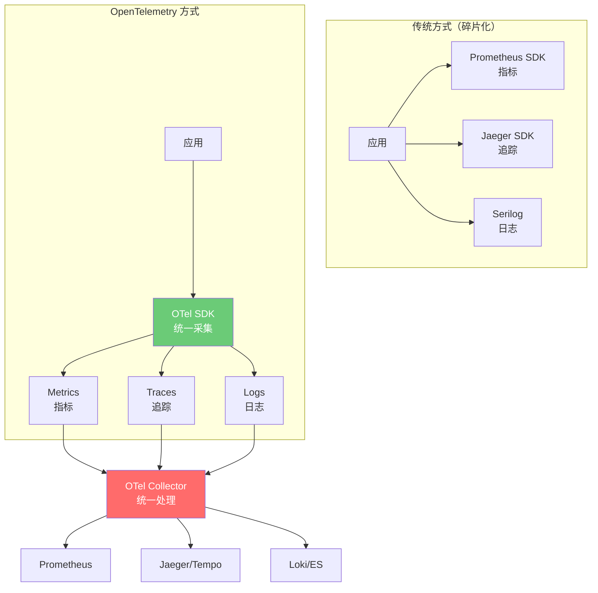

### 5.2 OpenTelemetry 架构

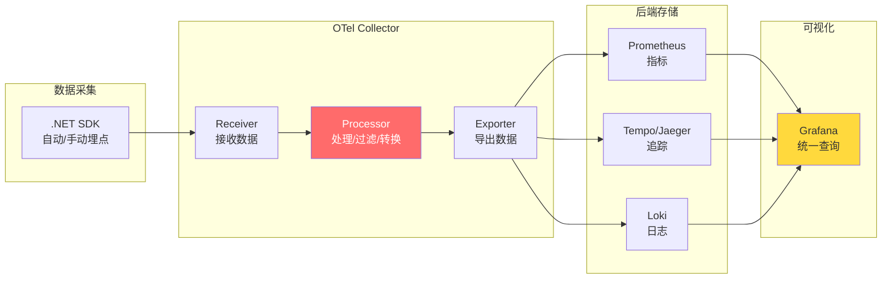

### 5.3 部署 OTel Collector

```yaml
# OTel Collector 部署
apiVersion: apps/v1
kind: Deployment
metadata:
  name: otel-collector
  namespace: observability
spec:
  replicas: 2
  selector:
    matchLabels:
      app: otel-collector
  template:
    metadata:
      labels:
        app: otel-collector
    spec:
      containers:
      - name: collector
        image: otel/opentelemetry-collector-contrib:0.96.0
        ports:
        - containerPort: 4317   # gRPC OTLP
        - containerPort: 4318   # HTTP OTLP
        - containerPort: 8889   # Prometheus metrics
        volumeMounts:
        - name: config
          mountPath: /etc/otelcol-contrib
      volumes:
      - name: config
        configMap:
          name: otel-collector-config
---
apiVersion: v1
kind: ConfigMap
metadata:
  name: otel-collector-config
  namespace: observability
data:
  config.yaml: |
    receivers:
      otlp:
        protocols:
          grpc:
            endpoint: 0.0.0.0:4317
          http:
            endpoint: 0.0.0.0:4318

    processors:
      batch:
        send_batch_size: 1024
        timeout: 5s
      memory_limiter:
        check_interval: 1s
        limit_mib: 512
      filter/health:
        error_mode: ignore
        traces:
          span:
            - 'attributes["http.route"] == "/health"'

    exporters:
      prometheusremotewrite:
        endpoint: "http://prometheus:9090/api/v1/write"
      otlphttp/traces:
        endpoint: "http://tempo:4318"
      loki:
        endpoint: "http://loki:3100/loki/api/v1/push"
        default_labels_enabled:
          exporter: false

    service:
      pipelines:
        metrics:
          receivers: [otlp]
          processors: [memory_limiter, batch]
          exporters: [prometheusremotewrite]
        traces:
          receivers: [otlp]
          processors: [memory_limiter, filter/health, batch]
          exporters: [otlphttp/traces]
        logs:
          receivers: [otlp]
          processors: [memory_limiter, batch]
          exporters: [loki]
```

### 5.4 .NET 集成 OpenTelemetry

```csharp
// Program.cs - OpenTelemetry 完整配置
using OpenTelemetry.Metrics;
using OpenTelemetry.Resources;
using OpenTelemetry.Trace;
using OpenTelemetry.Logs;

var builder = WebApplication.CreateBuilder(args);

// 资源定义（标识服务）
var resource = ResourceBuilder.CreateDefault()
    .AddService(
        serviceName: "myapp",
        serviceVersion: "1.0.0",
        serviceInstanceId: Environment.MachineName);

// 追踪配置
builder.Services.AddOpenTelemetry()
    .ConfigureResource(resource)
    .WithTracing(tracing =>
    {
        tracing
            .AddAspNetCoreInstrumentation(options =>
            {
                options.Filter = ctx =>
                    !ctx.Request.Path.StartsWithSegments("/health");  // 过滤健康检查
            })
            .AddHttpClientInstrumentation()
            .AddSqlClientInstrumentation()
            .AddRedisInstrumentation()
            .AddOtlpExporter(options =>
            {
                options.Endpoint = new Uri("http://otel-collector.observability:4317");
            });
    })
    .WithMetrics(metrics =>
    {
        metrics
            .AddAspNetCoreInstrumentation()
            .AddHttpClientInstrumentation()
            .AddMeter("MyApp.CustomMetrics")    // 自定义指标
            .AddOtlpExporter(options =>
            {
                options.Endpoint = new Uri("http://otel-collector.observability:4317");
            });
    });

// 日志配置
builder.Logging.AddOpenTelemetry(logging =>
{
    logging.SetResourceBuilder(resource);
    logging.AddOtlpExporter(options =>
    {
        options.Endpoint = new Uri("http://otel-collector.observability:4318");
        options.Protocol = OpenTelemetry.Exporter.OtlpExportProtocol.HttpProtobuf;
    });
});

var app = builder.Build();

// 自定义指标
var meter = new Meter("MyApp.CustomMetrics");
var orderCounter = meter.CreateCounter<long>("myapp.orders.created", "次");
var orderDuration = meter.CreateHistogram<double>("myapp.orders.duration", "ms");

app.MapPost("/orders", (OrderRequest req) =>
{
    var startTime = Stopwatch.GetTimestamp();

    // 处理订单...
    orderCounter.Add(1);

    var elapsed = Stopwatch.GetElapsedTime(startTime);
    orderDuration.Record(elapsed.TotalMilliseconds);

    return Results.Ok();
});

app.Run();
```

### 5.5 自定义 Span

```csharp
// 手动创建 Span
using var activity = DiagnosticsConfig.ActivitySource.StartActivity("ProcessOrder");
activity?.SetTag("order.id", orderId);
activity?.SetTag("order.amount", amount);
activity?.AddEvent(new ActivityEvent("OrderValidationStarted"));

try
{
    await ValidateOrderAsync(order);
    activity?.AddEvent(new ActivityEvent("OrderValidationCompleted"));
    await SaveOrderAsync(order);
}
catch (Exception ex)
{
    activity?.SetStatus(ActivityStatusCode.Error, ex.Message);
    activity?.RecordException(ex);
    throw;
}

// DiagnosticsConfig
public static class DiagnosticsConfig
{
    public static readonly ActivitySource ActivitySource = new("MyApp", "1.0.0");
}
```

---

## 6. Backstage - 开发者门户

### 6.1 为什么需要开发者门户

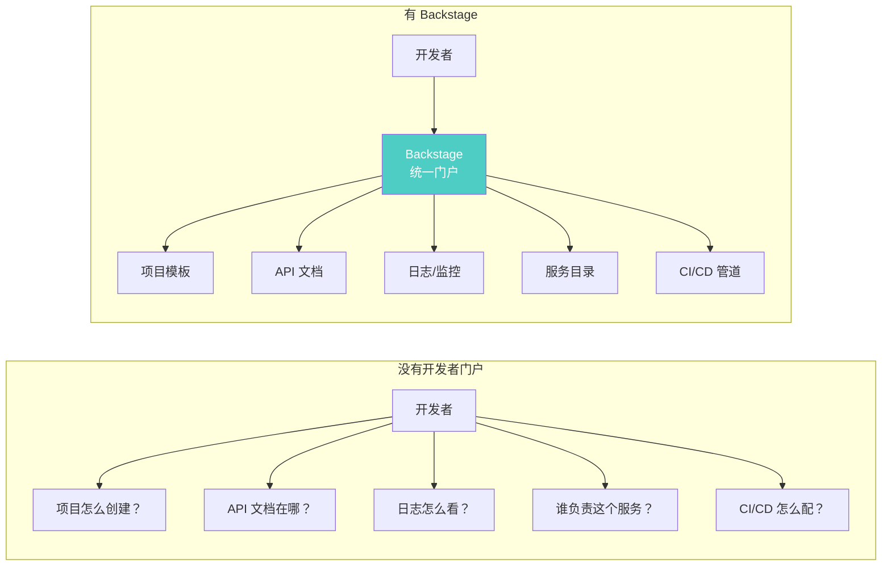

### 6.2 Backstage 架构

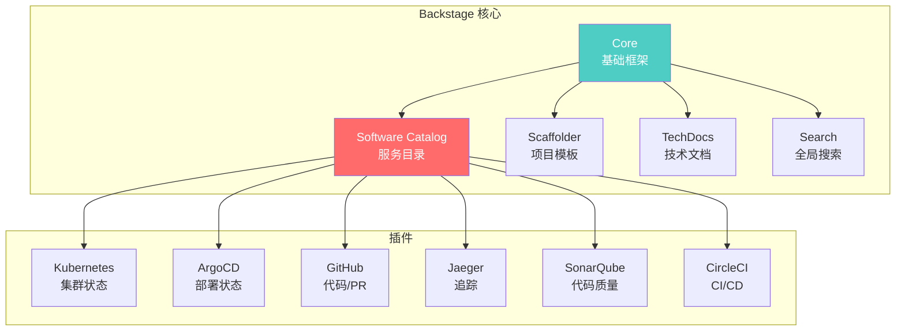

### 6.3 部署 Backstage

```bash
# 创建 Backstage 应用
npx @backstage/create-app@latest

# 进入项目
cd my-backstage

# 启动开发模式
yarn dev

# 构建
yarn build:backend

# Docker 镜像
docker build -t backstage:latest -f packages/backend/Dockerfile .
```

```yaml
# K8s 部署
apiVersion: apps/v1
kind: Deployment
metadata:
  name: backstage
  namespace: developer-portal
spec:
  replicas: 2
  selector:
    matchLabels:
      app: backstage
  template:
    metadata:
      labels:
        app: backstage
    spec:
      containers:
      - name: backstage
        image: registry.example.com/backstage:latest
        ports:
        - containerPort: 7007
        env:
        - name: POSTGRES_HOST
          value: postgres-service
        - name: POSTGRES_PORT
          value: "5432"
        - name: POSTGRES_USER
          valueFrom:
            secretKeyRef:
              name: backstage-db-secret
              key: username
        - name: POSTGRES_PASSWORD
          valueFrom:
            secretKeyRef:
              name: backstage-db-secret
              key: password
        resources:
          requests:
            cpu: 250m
            memory: 512Mi
          limits:
            cpu: "1"
            memory: 1Gi
---
apiVersion: v1
kind: Service
metadata:
  name: backstage
  namespace: developer-portal
spec:
  selector:
    app: backstage
  ports:
  - port: 80
    targetPort: 7007
```

### 6.4 服务目录注册

```yaml
# catalog-info.yaml - 放在项目根目录
apiVersion: backstage.io/v1alpha1
kind: Component
metadata:
  name: order-service
  description: 订单管理微服务
  annotations:
    backstage.io/managed-by-origin-location: url:https://github.com/myorg/order-service/blob/main/catalog-info.yaml
    github.com/project-slug: myorg/order-service
    backstage.io/kubernetes-id: order-service
    backstage.io/kubernetes-namespace: production
    jenkins.io/job-full-name: myorg/order-service
  tags:
    - dotnet
    - microservice
    - rest-api
  links:
  - url: https://myapp.example.com/api/orders
    title: API Endpoint
    icon: api
spec:
  type: service
  lifecycle: production
  owner: team-orders
  system: order-system
  dependsOn:
  - component:default/payment-service
  - resource:default/postgres-order-db
  providesApis:
  - order-api
---
apiVersion: backstage.io/v1alpha1
kind: API
metadata:
  name: order-api
  description: 订单服务 REST API
spec:
  type: openapi
  lifecycle: production
  owner: team-orders
  definition:
    $text: https://github.com/myorg/order-service/blob/main/openapi.yaml
```

### 6.5 项目模板

```yaml
# .NET 微服务模板
apiVersion: scaffolder.backstage.io/v1beta3
kind: Template
metadata:
  name: dotnet-microservice
  title: .NET Microservice
  description: 创建一个 .NET 8 微服务项目
spec:
  owner: platform-team
  type: service
  parameters:
  - title: 项目信息
    required:
    - name
    - owner
    properties:
      name:
        title: 服务名称
        type: string
        pattern: "^[a-z][a-z0-9-]*$"
      description:
        title: 服务描述
        type: string
      owner:
        title: 负责团队
        type: string
        enum: [team-orders, team-payments, team-users]
      database:
        title: 数据库类型
        type: string
        enum: [postgres, mysql, none]
        default: postgres
  steps:
  - id: template
    name: 生成项目
    action: fetch:template
    input:
      url: ./dotnet-template
      values:
        name: ${{ parameters.name }}
        owner: ${{ parameters.owner }}
        description: ${{ parameters.description }}
        database: ${{ parameters.database }}

  - id: publish
    name: 推送到 GitHub
    action: publish:github
    input:
      allowedHosts: ["github.com"]
      description: ${{ parameters.description }}
      repoUrl: github.com?owner=myorg&repo=${{ parameters.name }}

  - id: register
    name: 注册到 Catalog
    action: catalog:register
    input:
      catalogInfoUrl: https://github.com/myorg/${{ parameters.name }}/blob/main/catalog-info.yaml

  output:
    links:
    - title: 仓库
      url: ${{ steps.publish.output.remoteUrl }}
    - title: 打开 Catalog
      icon: catalog
      entityRef: ${{ steps.register.output.entityRef }}
```

---

## 7. 工具链选型决策

### 7.1 按场景选型

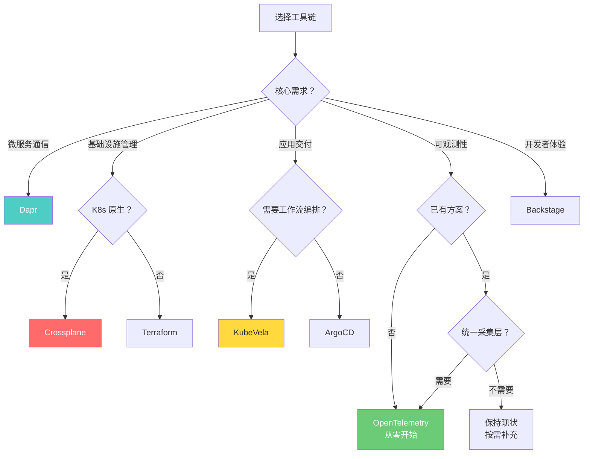

### 7.2 工具链组合推荐

| 团队规模 | 应用交付 | 可观测性 | 基础设施 | 服务通信 |
|----------|----------|----------|----------|----------|
| **小团队（<10人）** | Helm + ArgoCD | Prometheus + Grafana | Terraform | 直连 |
| **中团队（10-50人）** | KubeVela | OTel + Prometheus | Crossplane | Dapr |
| **大团队（>50人）** | KubeVela + Backstage | OTel + 全栈 | Crossplane | Dapr + Istio |

### 7.3 引入策略

```
工具链引入路径（渐进式）：

阶段 1：基础可观测性
  → OpenTelemetry SDK + Prometheus + Grafana
  → 所有服务接入指标和追踪

阶段 2：应用交付标准化
  → ArgoCD 或 KubeVela
  → 统一多环境交付流程

阶段 3：基础设施编排
  → Crossplane 替代手动 Terraform
  → 基础设施与应用同生命周期

阶段 4：服务通信抽象
  → Dapr 替代硬编码的 Redis/Kafka SDK
  → 解耦业务代码与中间件

阶段 5：开发者体验
  → Backstage 统一门户
  → 项目模板、服务目录、文档中心

每个阶段 1-3 个月，验证后再进入下一阶段。
不要试图一次性引入所有工具。
```

---

## 8. 总结

| 工具 | 核心价值 | 适用场景 |
|------|----------|----------|
| **Dapr** | 微服务横切关注点标准化，解耦业务与中间件 | 微服务间通信、状态管理、事件驱动 |
| **Crossplane** | 基础设施即 K8s 资源，统一管理面 | 多云基础设施、与应用同生命周期 |
| **KubeVela** | 统一应用交付模型，策略+工作流 | 多环境交付、灰度发布、审批流程 |
| **OpenTelemetry** | 统一可观测性采集层，一套 SDK 三种信号 | 需要指标+追踪+日志的应用 |
| **Backstage** | 开发者统一门户，降低认知负载 | 中大型团队、服务数量多 |

::: important 工具链落地铁律
1. **工具是手段，不是目的**：先定义问题，再选择工具，而不是反过来
2. **一次只引入一个工具**：每个工具都需要学习成本和适配时间
3. **先验证再推广**：在一个非核心服务上验证，成功后再推广
4. **关注维护成本**：引入的工具需要有人维护、升级、排障
5. **避免过度抽象**：Dapr 和 Crossplane 都是强抽象，确保团队能理解底层原理
6. **文档即代码**：所有工具配置都纳入 Git 管理，避免配置漂移
7. **渐进式演进**：从最紧迫的痛点开始，逐步构建工具链
:::
