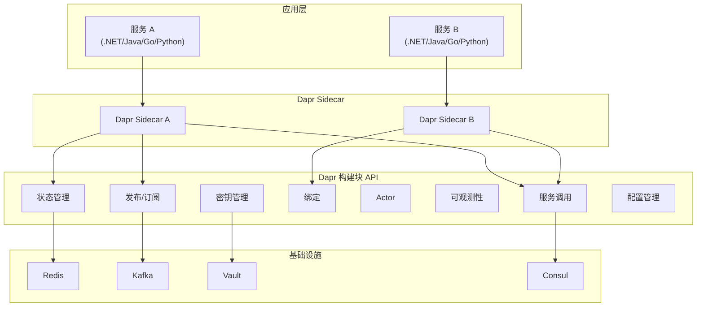
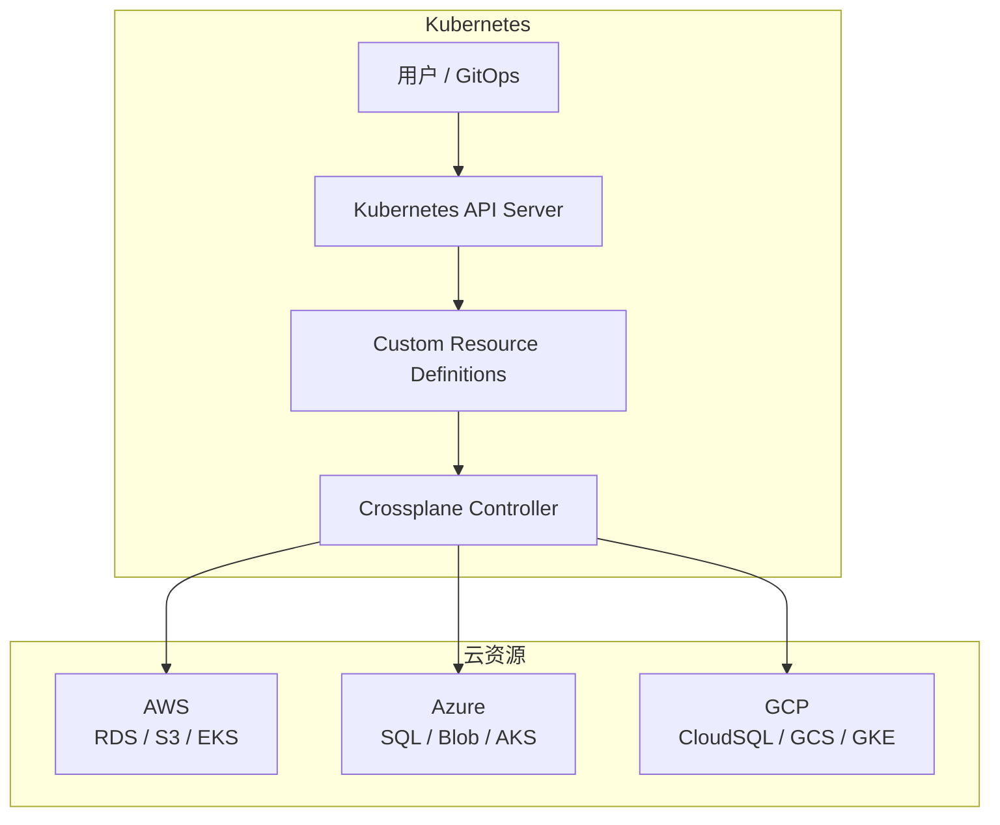
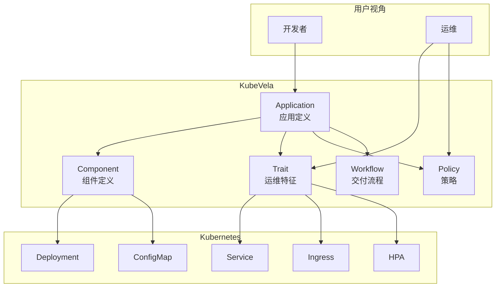
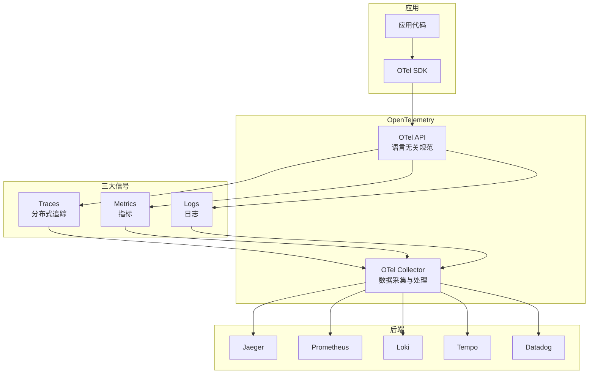
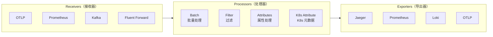
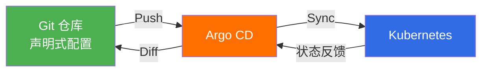
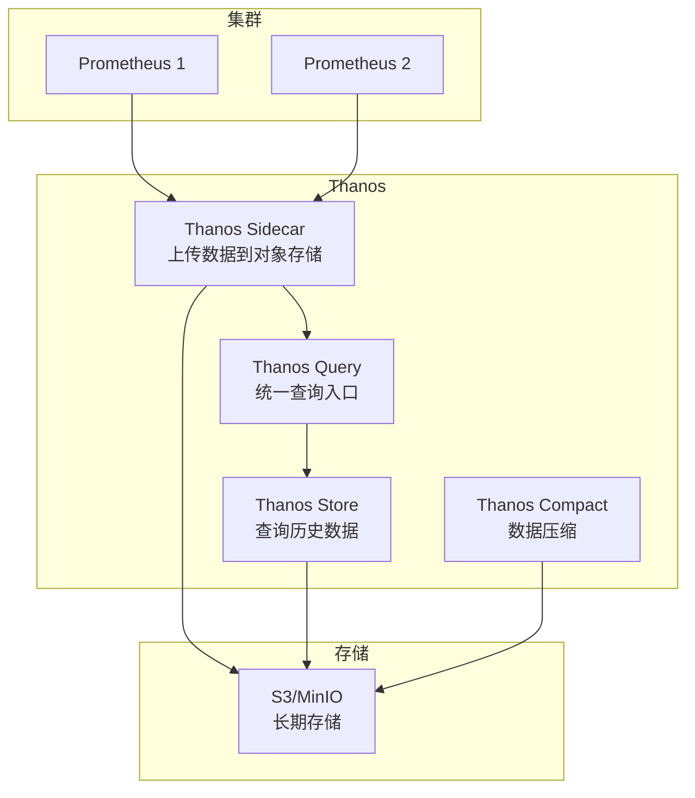
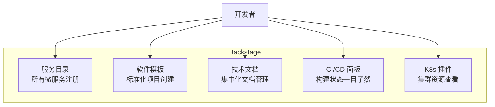
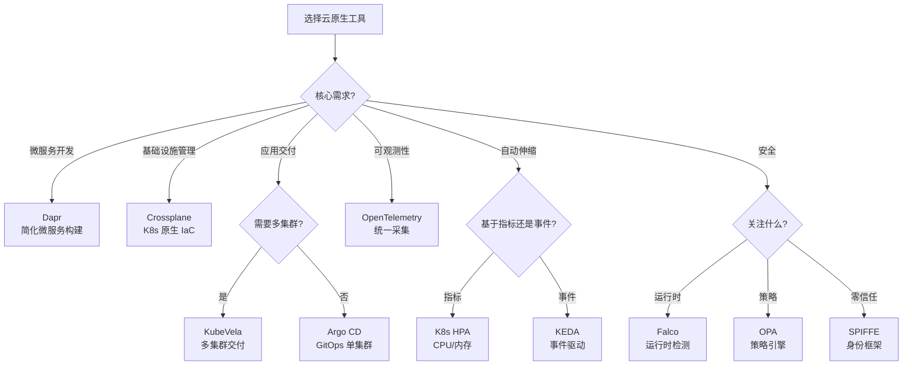

# 云原生工具链

云原生不只是 Docker 和 Kubernetes，它是一个丰富的生态系统。CNCF 景观图上 1000+ 项目，如何选择合适的工具？本章聚焦几个关键的云原生工具，帮你构建现代化的开发与运维工具链。

---

## CNCF 景观图

### CNCF 与云原生定义

云原生计算基金会（CNCF）对云原生的定义：

> 云原生技术有利于各组织在公有云、私有云和混合云等新型动态环境中，构建和运行可弹性扩展的应用。云原生的代表技术包括容器、服务网格、微服务、不可变基础设施和声明式 API。

### CNCF 项目成熟度

```mermaid
flowchart LR
    subgraph Graduated["毕业项目（Graduated）"]
        K8s["Kubernetes"]
        Prometheus["Prometheus"]
        Helm["Helm"]
        Envoy["Envoy"]
        Containerd["containerd"]
        CNI["CNI"]
        CoreDNS["CoreDNS"]
        ETCD["etcd"]
        Fluentd["Fluentd"]
        Jaeger["Jaeger"]
        TUF["TUF"]
        SPIFFE["SPIFFE"]
        OpenTelemetry["OpenTelemetry"]
        Cilium["Cilium"]
    end

    subgraph Incubating["孵化项目（Incubating）"]
        Argo["Argo"]
        Contour["Contour"]
        CRIO["CRI-O"]
        Falco["Falco"]
        Harbor["Harbor"]
        OPA["OPA"]
        Thanos["Thanos"]
        Crossplane["Crossplane"]
    end

    subgraph Sandbox["沙箱项目（Sandbox）"]
        Dapr["Dapr"]
        KubeVela["KubeVela"]
        KEDA["KEDA"]
        OpenFunction["OpenFunction"]
    end

    Graduated -->|"更成熟"| Incubating
    Incubating -->|"发展中"| Sandbox
```



### 按功能域分类

| 领域 | 代表项目 | 用途 |
|------|----------|------|
| 容器运行时 | containerd, CRI-O | 容器执行 |
| 编排调度 | Kubernetes, Volcano | 工作负载管理 |
| 服务网格 | Istio, Linkerd, Cilium | 流量管理 |
| CI/CD | Argo CD, Flux, Tekton | 持续交付 |
| 监控可观测 | Prometheus, Grafana, OTel | 监控告警 |
| 日志 | Fluentd, Loki | 日志收集 |
| 追踪 | Jaeger, Zipkin | 分布式追踪 |
| 安全 | Falco, OPA, SPIFFE | 安全策略 |
| 存储 | Rook, Vitess, TiKV | 数据存储 |
| 网络 | Cilium, Calico, CNI | 网络连接 |
| 应用定义 | Dapr, Crossplane, KubeVela | 应用抽象 |
| Serverless | Knative, KEDA, OpenFaaS | 无服务器 |

---

## Dapr（分布式应用运行时）

### Dapr 是什么

Dapr（Distributed Application Runtime）是微软开源的、可移植的、事件驱动的运行时，帮助开发者构建微服务应用：



### 核心构建块

| 构建块 | 说明 | 替代的基础设施代码 |
|--------|------|-------------------|
| 服务调用 | 服务间 HTTP/gRPC 调用 + 负载均衡 | Service Discovery + Client 负载均衡 |
| 状态管理 | 键值存储 + CRUD + 事务 | Redis/数据库 SDK 集成代码 |
| 发布/订阅 | 事件驱动的消息传递 | Kafka/RabbitMQ SDK 集成代码 |
| 绑定 | 连接外部系统（输入/输出） | 各外部系统的 SDK 代码 |
| Actor | 虚拟 Actor 模型 | 并发控制 + 状态管理代码 |
| 可观测性 | 分布式追踪 + 指标 + 日志 | OpenTelemetry SDK 集成代码 |
| 密钥管理 | 访问外部密钥存储 | Vault SDK 集成代码 |
| 配置管理 | 动态配置 + 订阅变更 | 配置中心 SDK 代码 |

### 服务调用

```bash
# 使用 Dapr 服务调用
# 调用另一个服务的 API，无需知道地址

# 通过 Dapr Sidecar 调用
dapr run --app-id service-a --app-port 3000 node app.js

# 在代码中调用其他服务
# GET http://localhost:3500/v1.0/invoke/service-b/method/api/users
# Dapr 自动完成服务发现、负载均衡、重试
```

```csharp
// .NET 代码示例
var client = new HttpClient();
var response = await client.GetAsync(
    "http://localhost:3500/v1.0/invoke/order-service/method/api/orders/123"
);
```

### 状态管理

```bash
# 保存状态
curl -X POST http://localhost:3500/v1.0/state/statestore \
  -H "Content-Type: application/json" \
  -d '[{"key": "user-123", "value": {"name": "Alice", "age": 30}}]'

# 获取状态
curl http://localhost:3500/v1.0/state/statestore/user-123

# 删除状态
curl -X DELETE http://localhost:3500/v1.0/state/statestore/user-123
```

```yaml
# 状态存储配置
apiVersion: dapr.io/v1alpha1
kind: Component
metadata:
  name: statestore
spec:
  type: state.redis
  version: v1
  metadata:
    - name: redisHost
      value: redis:6379
    - name: redisPassword
      value: ""
```

### 发布/订阅

```bash
# 发布事件
curl -X POST http://localhost:3500/v1.0/publish/order-pub-sub/orders \
  -H "Content-Type: application/json" \
  -d '{"orderId": "12345", "status": "created"}'

# 订阅事件（应用端暴露 HTTP 端点）
# Dapr 自动调用应用的 /orders 端点
```

```yaml
# 发布/订阅组件配置
apiVersion: dapr.io/v1alpha1
kind: Component
metadata:
  name: order-pub-sub
spec:
  type: pubsub.kafka
  version: v1
  metadata:
    - name: brokers
      value: "kafka:9092"
    - name: authType
      value: "none"
```

### 在 Kubernetes 中部署 Dapr

```bash
# 安装 Dapr CLI
wget -q https://raw.githubusercontent.com/dapr/cli/master/install/install.sh -O - | /bin/bash

# 初始化 Dapr（Kubernetes 模式）
dapr init -k

# 查看状态
dapr status -k

# 运行带 Dapr Sidecar 的应用
apiVersion: apps/v1
kind: Deployment
metadata:
  name: my-app
spec:
  template:
    metadata:
      annotations:
        dapr.io/enabled: "true"
        dapr.io/app-id: "my-app"
        dapr.io/app-port: "3000"
    spec:
      containers:
        - name: my-app
          image: myapp:latest
```

:::tip Dapr 的价值
Dapr 将微服务的通用需求（服务发现、状态、消息、密钥等）从业务代码中剥离，通过标准化的 API 和 Sidecar 模式提供。这意味着：
1. 业务代码只需关注业务逻辑
2. 切换基础设施只需修改配置，不改代码
3. 所有语言享受一致的可观测性
:::

---

## Crossplane（基础设施即代码）

### Crossplane 是什么

Crossplane 是一个开源的 Kubernetes 扩展，让你用 Kubernetes 的声明式 API 管理云基础设施：



### 核心概念

| 概念 | 说明 | 类比 Terraform |
|------|------|----------------|
| Provider | 云提供商插件 | Provider |
| Managed Resource | 云资源的直接映射 | Resource |
| Composite Resource (XR) | 抽象的组合资源 | Module |
| Composition | 将 XR 映射为 MR 的模板 | Module 实现 |
| Claim | 命名空间级的 XR 请求 | - |

### 示例：声明式创建云数据库

```yaml
# Provider 配置
apiVersion: aws.upbound.io/v1beta1
kind: ProviderConfig
metadata:
  name: aws-provider
spec:
  credentials:
    source: Secret
    secretRef:
      namespace: crossplane-system
      name: aws-creds
      key: creds

---
# 定义组合资源（XR）
apiVersion: apiextensions.crossplane.io/v1
kind: CompositeResourceDefinition
metadata:
  name: xpostgresqls.database.example.org
spec:
  group: database.example.org
  names:
    kind: XPostgreSQL
    plural: xpostgresqls
  versions:
    - name: v1alpha1
      served: true
      referenceable: true
      schema:
        openAPIV3Schema:
          type: object
          properties:
            spec:
              type: object
              properties:
                storageGB:
                  type: integer
                region:
                  type: string

---
# Composition：将抽象 XR 映射到具体 AWS 资源
apiVersion: apiextensions.crossplane.io/v1
kind: Composition
metadata:
  name: aws-postgresql
spec:
  compositeTypeRef:
    apiVersion: database.example.org/v1alpha1
    kind: XPostgreSQL
  resources:
    - name: rds-instance
      base:
        apiVersion: rds.aws.upbound.io/v1beta1
        kind: Instance
        spec:
          forProvider:
            engine: postgres
            engineVersion: "16"
            instanceClass: db.t3.micro
            region: us-east-1
      patches:
        - fromFieldPath: spec.storageGB
          toFieldPath: spec.forProvider.allocatedStorage
        - fromFieldPath: spec.region
          toFieldPath: spec.forProvider.region

---
# Claim：用户申请数据库
apiVersion: database.example.org/v1alpha1
kind: PostgreSQL
metadata:
  name: my-app-db
  namespace: production
spec:
  storageGB: 20
  region: us-east-1
  compositionSelector:
    matchLabels:
      provider: aws
```

### Crossplane vs Terraform

| 对比项 | Crossplane | Terraform |
|--------|-----------|-----------|
| 语言 | YAML（K8s API） | HCL |
| 状态管理 | etcd（K8s 原生） | State File |
| 协调 | 持续协调（Reconcile） | Plan + Apply |
| GitOps | 原生支持（Argo CD） | 需额外工具 |
| 多团队 | RBAC + 命名空间 | 无内置 |
| 生态 | 成长中 | 非常成熟 |
| 学习曲线 | 陡（K8s 知识） | 中等 |

:::tip 选择建议
- 团队已有 K8s 经验 + 全力 GitOps → Crossplane
- 传统基础设施管理 + 生态依赖多 → Terraform
- 两者可以共存，Terraform 管底层，Crossplane 管应用层
:::

---

## KubeVela（应用交付平台）

### KubeVela 是什么

KubeVela 是一个基于 OAM（Open Application Model）的应用交付平台，简化应用在 Kubernetes 上的部署和运维：



### 应用定义

```yaml
apiVersion: core.oam.dev/v1beta1
kind: Application
metadata:
  name: my-web-app
  namespace: production
spec:
  components:
    - name: frontend
      type: webservice
      properties:
        image: myregistry.com/frontend:v2.0
        port: 3000
        cpu: "0.5"
        memory: "512Mi"
        env:
          - name: API_URL
            value: "http://backend:8080"

    - name: backend
      type: webservice
      properties:
        image: myregistry.com/backend:v2.0
        port: 8080
        cpu: "1.0"
        memory: "1Gi"
        env:
          - name: DB_HOST
            value: "postgres"
          - name: DB_PASSWORD
            valueFrom:
              secretKeyRef:
                name: db-secret
                key: password

  traits:
    - name: frontend
      traits:
        - type: ingress
          properties:
            domain: app.example.com
            http:
              "/": 3000
        - type: scaler
          properties:
            min: 2
            max: 10

    - name: backend
      traits:
        - type: scaler
          properties:
            min: 2
            max: 5
        - type: sidecar
          properties:
            name: log-collector
            image: log-collector:latest

  policies:
    - name: production-policy
      type: topology
      properties:
        clusters: ["cluster-us", "cluster-eu"]
        namespace: production

  workflow:
    steps:
      - name: deploy-us
        type: deploy
        properties:
          policies: ["production-policy"]
          parallelism: 2
```

### 自定义组件类型

```yaml
# 定义 Helm 组件类型
apiVersion: core.oam.dev/v1beta1
kind: ComponentDefinition
metadata:
  name: helm-release
spec:
  schematic:
    helm:
      release:
        chart:
          spec:
            chart: "nginx-ingress"
            version: "4.x"
            repo: "https://kubernetes.github.io/ingress-nginx"
      values:
        controller:
          replicaCount: 2
          service:
            type: LoadBalancer
```

### 多环境管理

```yaml
# 开发环境
apiVersion: core.oam.dev/v1beta1
kind: Application
metadata:
  name: my-app
  namespace: dev
spec:
  components:
    - name: api
      type: webservice
      properties:
        image: myapp:dev-latest
        cpu: "0.25"
        memory: "256Mi"
  traits:
    - type: scaler
      properties:
        min: 1
        max: 2

---
# 生产环境
apiVersion: core.oam.dev/v1beta1
kind: Application
metadata:
  name: my-app
  namespace: production
spec:
  components:
    - name: api
      type: webservice
      properties:
        image: myapp:v2.0.3
        cpu: "1.0"
        memory: "1Gi"
  traits:
    - type: scaler
      properties:
        min: 3
        max: 20
    - type: ingress
      properties:
        domain: app.example.com
  policies:
    - type: topology
      properties:
        clusters: ["prod-us", "prod-eu"]
```

:::tip KubeVela 的价值
- **开发者友好**：声明式 YAML，无需了解 K8s 复杂性
- **运维标准化**：Trait 抽象运维特征，复用最佳实践
- **多集群交付**：内置多集群应用分发
- **与 Argo CD 集成**：GitOps + 应用模型的完美结合
:::

---

## OpenTelemetry（可观测性框架）

### OpenTelemetry 是什么

OpenTelemetry（OTel）是 CNCF 毕业项目，提供统一的可观测性标准——合并了 OpenTracing 和 OpenCensus 两个项目：



### OTel Collector 架构



### OTel Collector 部署

```yaml
apiVersion: apps/v1
kind: Deployment
metadata:
  name: otel-collector
  namespace: observability
spec:
  replicas: 2
  selector:
    matchLabels:
      app: otel-collector
  template:
    metadata:
      labels:
        app: otel-collector
    spec:
      containers:
        - name: collector
          image: otel/opentelemetry-collector-contrib:0.96.0
          ports:
            - containerPort: 4317  # gRPC OTLP
            - containerPort: 4318  # HTTP OTLP
          volumeMounts:
            - name: config
              mountPath: /etc/otelcol-contrib/config.yaml
              subPath: config.yaml
      volumes:
        - name: config
          configMap:
            name: otel-collector-config
```

```yaml
# Collector 配置
apiVersion: v1
kind: ConfigMap
metadata:
  name: otel-collector-config
  namespace: observability
data:
  config.yaml: |
    receivers:
      otlp:
        protocols:
          grpc:
            endpoint: 0.0.0.0:4317
          http:
            endpoint: 0.0.0.0:4318

    processors:
      batch:
        send_batch_size: 1024
        timeout: 5s
      memory_limiter:
        check_interval: 1s
        limit_mib: 512
      k8s_attributes:
        auth_type: serviceAccount
        passthrough: false
        extract:
          metadata:
            - k8s.namespace.name
            - k8s.deployment.name
            - k8s.pod.name

    exporters:
      otlp/jaeger:
        endpoint: jaeger-collector.observability:4317
        tls:
          insecure: true
      prometheusremotewrite:
        endpoint: http://prometheus.observability:9090/api/v1/write
      loki:
        endpoint: http://loki.observability:3100/loki/api/v1/push
        default_labels_enabled:
          exporter: false

    service:
      pipelines:
        traces:
          receivers: [otlp]
          processors: [memory_limiter, k8s_attributes, batch]
          exporters: [otlp/jaeger]
        metrics:
          receivers: [otlp]
          processors: [memory_limiter, k8s_attributes, batch]
          exporters: [prometheusremotewrite]
        logs:
          receivers: [otlp]
          processors: [memory_limiter, k8s_attributes, batch]
          exporters: [loki]
```

### .NET 应用接入 OTel

```csharp
// Program.cs
var builder = WebApplication.CreateBuilder(args);

// 添加 OpenTelemetry
builder.Services.AddOpenTelemetry()
    .WithTracing(tracing =>
    {
        tracing
            .SetResourceBuilder(ResourceBuilder.CreateDefault()
                .AddService("my-api", serviceVersion: "2.0.0"))
            .AddAspNetCoreInstrumentation()
            .AddHttpClientInstrumentation()
            .AddOtlpExporter(options =>
            {
                options.Endpoint = new Uri("http://otel-collector:4317");
            });
    })
    .WithMetrics(metrics =>
    {
        metrics
            .SetResourceBuilder(ResourceBuilder.CreateDefault()
                .AddService("my-api", serviceVersion: "2.0.0"))
            .AddAspNetCoreInstrumentation()
            .AddHttpClientInstrumentation()
            .AddOtlpExporter(options =>
            {
                options.Endpoint = new Uri("http://otel-collector:4317");
            });
    });
```

### 自动注入（Kubernetes）

```yaml
# 使用 OTel Operator 自动注入 Sidecar
apiVersion: apps/v1
kind: Deployment
metadata:
  name: my-app
  annotations:
    instrumentation.opentelemetry.io/inject-sdk: "true"
    instrumentation.opentelemetry.io/inject-dotnet: "true"
spec:
  template:
    spec:
      containers:
        - name: app
          image: myapp:latest
          env:
            - name: OTEL_EXPORTER_OTLP_ENDPOINT
              value: "http://otel-collector.observability:4317"
            - name: OTEL_SERVICE_NAME
              value: "my-api"
```

:::tip OTel 的价值
1. **厂商无关**：一次接入，后端自由切换
2. **统一标准**：Traces/Metrics/Logs 三大信号统一规范
3. **自动采集**：SDK + Operator 自动注入，无需手动埋点
4. **上下文传播**：跨服务调用自动传播 Trace ID
:::

---

## 其他重要工具

### Argo CD（GitOps 持续交付）



```yaml
# Argo CD Application
apiVersion: argoproj.io/v1alpha1
kind: Application
metadata:
  name: my-app
  namespace: argocd
spec:
  project: default
  source:
    repoURL: https://github.com/org/k8s-manifests.git
    targetRevision: main
    path: overlays/production
  destination:
    server: https://kubernetes.default.svc
    namespace: production
  syncPolicy:
    automated:
      prune: true
      selfHeal: true
    syncOptions:
      - CreateNamespace=true
```

### KEDA（事件驱动的自动伸缩）

```yaml
# 基于 RabbitMQ 队列长度自动伸缩
apiVersion: keda.sh/v1alpha1
kind: ScaledObject
metadata:
  name: order-processor-scaler
  namespace: production
spec:
  scaleTargetRef:
    name: order-processor
  minReplicaCount: 0     # 缩容到零！
  maxReplicaCount: 20
  cooldownPeriod: 60
  triggers:
    - type: rabbitmq
      metadata:
        queueName: orders
        queueLength: "5"   # 每 5 条消息扩一个副本
        host: amqp://rabbitmq.production
```

### Thanos（Prometheus 长期存储）



### Backstage（开发者门户）

Backstage 是 Spotify 开源的开发者门户平台：



---

## 工具选型指南

### 按场景选择



### 成熟度与推荐度

| 工具 | CNCF 状态 | 生产就绪 | 推荐度 |
|------|----------|----------|--------|
| Argo CD | 孵化 | 是 | ★★★★★ |
| OpenTelemetry | 毕业 | 是 | ★★★★★ |
| Cilium | 毕业 | 是 | ★★★★★ |
| Thanos | 孵化 | 是 | ★★★★☆ |
| KEDA | 孵化 | 是 | ★★★★☆ |
| Dapr | 孵化 | 是 | ★★★★☆ |
| Crossplane | 孵化 | 是 | ★★★☆☆ |
| KubeVela | 沙箱 | 谨慎 | ★★★☆☆ |
| Backstage | 孵化 | 是 | ★★★☆☆ |

---

## 快速参考

### Dapr 速查

```bash
# 初始化
dapr init
dapr init -k

# 运行应用
dapr run --app-id myapp --app-port 3000 node app.js

# 调用服务
curl http://localhost:3500/v1.0/invoke/<app-id>/method/<path>

# 状态管理
curl http://localhost:3500/v1.0/state/<store>/<key>

# 发布事件
curl -X POST http://localhost:3500/v1.0/publish/<pubsub>/<topic>
```

### OTel 速查

```
OTLP gRPC 端口: 4317
OTLP HTTP 端口: 4318
Jaeger gRPC 端口: 4317

环境变量:
OTEL_EXPORTER_OTLP_ENDPOINT=http://collector:4317
OTEL_SERVICE_NAME=my-service
OTEL_RESOURCE_ATTRIBUTES=service.version=1.0.0
```

### 工具链组合推荐

| 场景 | 组合 |
|------|------|
| 微服务全栈 | K8s + Dapr + OTel + Argo CD |
| GitOps 交付 | Argo CD + Crossplane + Kustomize |
| 可观测性 | OTel + Prometheus + Loki + Tempo |
| 事件驱动 | KEDA + Dapr + Kafka |
| 开发者平台 | Backstage + Argo CD + OTel |
| 多集群管理 | KubeVela + Argo CD + Thanos |
