# 01 · Docker & K8s 面试题精选

> 50 道高频面试题，覆盖 **Docker 基础 → Docker 进阶 → K8s 基础 → K8s 进阶** 四大维度，每题包含标准答案、架构图解、深度追问和考察点分析。

## 一、Docker 基础篇（12 题）

### Q1：容器和虚拟机的区别？

**标准答案：**

容器和虚拟机都是资源隔离和虚拟化技术，但实现层次完全不同：

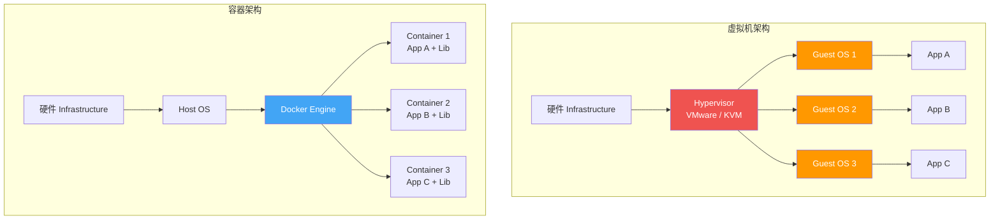

| 维度 | 容器 | 虚拟机 |
|------|------|--------|
| **隔离级别** | 进程级（共享宿主内核） | 硬件级（独立内核） |
| **启动速度** | 秒级 | 分钟级 |
| **镜像大小** | MB 级 | GB 级 |
| **资源开销** | 极低（无 Guest OS） | 高（每个 VM 需 Guest OS） |
| **性能** | 接近原生 | 有虚拟化损耗 |
| **隔离强度** | 较弱（共享内核） | 强（硬件级隔离） |
| **部署密度** | 高（单机可跑数百容器） | 低（受 Guest OS 资源限制） |

::: important 核心差异
容器本质是**共享宿主内核的特殊进程**，通过 Namespace 实现视图隔离，通过 Cgroup 实现资源限制；虚拟机则是通过 Hypervisor 模拟硬件，运行完整的 Guest OS。
:::

**深度追问：**

- **既然容器共享内核，内核漏洞会影响所有容器吗？** — 是的，内核漏洞（如 Dirty COW）可以突破 Namespace 隔离，这是容器的安全风险之一。生产环境建议使用 Seccomp、AppArmor、Pod Security Standard 等多层防护。
- **什么场景必须用虚拟机而非容器？** — 需要不同内核版本（如 Windows 应用跑在 Linux 宿主机上）、强安全隔离需求（多租户 SaaS）、内核级操作（如加载内核模块）。

**面试官考察点：** 是否理解容器本质是进程而非轻量虚拟机，是否清楚共享内核带来的安全边界。

---

### Q2：Docker 的 Namespace 和 Cgroup 分别做什么？

**标准答案：**

Namespace 负责**"看什么"**（视图隔离），Cgroup 负责**"用什么"**（资源限制），两者共同构成 Linux 容器的底层基础。

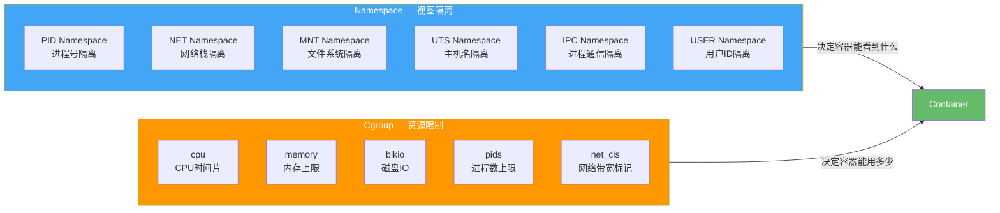

**六种 Namespace：**

| Namespace | 隔离内容 | 示例 |
|-----------|---------|------|
| **PID** | 进程 ID | 容器内 PID 1 → 宿主机 PID 12345 |
| **NET** | 网络栈 | 独立的网卡、IP、端口、路由表 |
| **MNT** | 挂载点 | 独立的文件系统视图 |
| **UTS** | 主机名 | 容器有自己的 hostname |
| **IPC** | 进程间通信 | 信号量、消息队列、共享内存 |
| **USER** | 用户/组 ID | 容器内 root → 宿主机普通用户 |

**Cgroup 关键子系统：**

```bash
# 查看容器的 cgroup 限制
cat /sys/fs/cgroup/memory/docker/<container_id>/memory.limit_in_bytes
cat /sys/fs/cgroup/cpu/docker/<container_id>/cpu.cfs_quota_us

# Docker run 指定资源限制
docker run -d \
  --memory=512m \
  --cpus=1.5 \
  --pids-limit=100 \
  nginx:latest
```

::: tip Namespace 与 Cgroup 的关系
Namespace 决定容器**能看到什么**（进程、网络、文件系统），Cgroup 决定容器**能用多少**（CPU、内存、IO）。两者缺一不可 —— 没有 Namespace 就没有隔离，没有 Cgroup 就没有限制。
:::

**深度追问：**

- **User Namespace 如何实现容器内 root 映射到宿主机普通用户？** — 通过 UID/GID 映射表，容器内的 UID 0 映射到宿主机的非零 UID（如 100000），实现 rootless 效果。
- **Cgroup v1 和 v2 有什么区别？** — v2 采用统一层级结构（single hierarchy），所有控制器挂载在同一 cgroup 树下；v1 每个控制器独立层级。v2 支持线程化 cgroup，更优的资源压力传播机制。

**面试官考察点：** 是否理解容器的底层是 Linux 内核特性而非 Docker 独创，是否清楚 Namespace 只做隔离不做资源限制。

---

### Q3：Docker 镜像的分层结构是什么？

**标准答案：**

Docker 镜像采用**联合文件系统（UnionFS）**的分层存储结构，每一层都是只读的，只有最顶层的容器层可写。

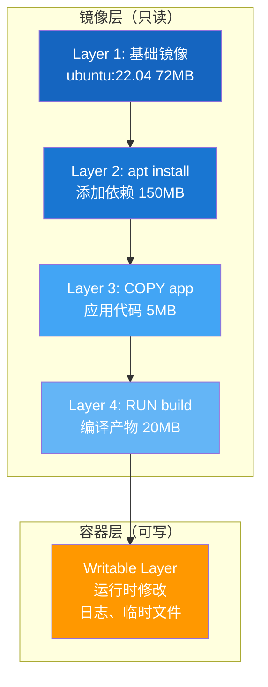

**分层的关键特性：**

- **增量共享**：相同的基础层在多个镜像间共享，节省磁盘和传输带宽
- **Copy-on-Write（CoW）**：容器修改文件时，先从只读层复制到可写层再修改
- **层不可变**：已构建的层不会被修改，修改只会产生新层

```bash
# 查看镜像分层
docker history nginx:latest
# IMAGE          CREATED       SIZE
# ea3355xxx      2 weeks ago   0B      CMD ["nginx" "-g" "daemon…"]
# <missing>      2 weeks ago   0B      STOPSIGNAL SIGQUIT
# <missing>      2 weeks ago   27.1MB  /bin/sh -c #(nop) COPY ...
# <missing>      2 weeks ago   30.7MB  /bin/sh -c apt-get update…
# <missing>      2 weeks ago   0B      /bin/sh -c #(nop)  ENV ...
# <missing>      2 weeks ago   77.8MB  /bin/sh -c #(nop) ADD ...

# 导出镜像并查看层
docker save nginx:latest -o nginx.tar
tar -tf nginx.tar | head -20
```

::: warning 注意
每一条 `RUN`、`COPY`、`ADD` 指令都会产生一个新层。在同一个 `RUN` 中创建并删除文件，删除操作只在新层标记删除，原层文件仍占用空间（只是不可见）。这就是多阶段构建存在的意义。
:::

**深度追问：**

- **Docker 镜像层和数据卷有什么区别？** — 镜像层是只读的、随镜像生命周期存在；数据卷独立于镜像层，数据持久化存储，容器删除后卷数据不丢失。
- **如何减少镜像层数？** — 合并 RUN 指令（用 `&&` 连接），利用多阶段构建，使用 `.dockerignore` 减少构建上下文。

**面试官考察点：** 是否理解分层存储的 CoW 机制，是否知道层数过多和中间文件残留的问题。

---

### Q4：COPY 和 ADD 的区别？

**标准答案：**

| 特性 | COPY | ADD |
|------|------|-----|
| **基本复制** | 支持 | 支持 |
| **自动解压 tar** | 不支持 | 支持（本地 tar 自动解压） |
| **远程 URL 下载** | 不支持 | 支持（但不推荐） |
| **语义清晰度** | 语义明确，仅复制 | 语义模糊，有隐式行为 |
| **Docker 官方推荐** | 优先使用 | 仅在需要解压时使用 |

```dockerfile
# 推荐：语义清晰
COPY app.jar /app/app.jar

# ADD 会自动解压本地 tar 文件
ADD rootfs.tar.gz /   # ← 这是 ADD 的正当用途

# 不推荐：ADD 从 URL 下载（不可追踪、不缓存）
# 应该在 RUN 中用 curl/wget 替代
ADD https://example.com/app.jar /app/  # ❌ 不推荐

# 推荐替代方案
RUN curl -fSL https://example.com/app.jar -o /app/app.jar \
    && echo "checksum验证" \
    && sha256sum /app/app.jar
```

::: tip 最佳实践
Docker 官方 Dockerfile 风格指南明确建议：**优先使用 COPY**，仅在需要自动解压 tar 包时使用 ADD。ADD 的隐式行为（自动解压、远程下载）会降低 Dockerfile 的可读性和可维护性。
:::

**深度追问：**

- **ADD 从 URL 下载的文件会自动解压吗？** — 不会。ADD 的自动解压仅对本地 tar 归档文件生效，远程下载的文件原样保存。
- **COPY 的 `--chown` 参数和 `RUN chown` 有什么区别？** — `COPY --chown=1000:1000` 在复制时直接设置所有权，不产生额外层；`RUN chown` 需要额外一层。前者更高效。

**面试官考察点：** 是否了解 Dockerfile 指令的语义差异，是否遵循官方最佳实践而非"能用就行"。

---

### Q5：ENTRYPOINT 和 CMD 的区别？

**标准答案：**

两者都用于定义容器启动命令，但行为不同：

| 特性 | ENTRYPOINT | CMD |
|------|-----------|-----|
| **用途** | 定义容器主命令 | 定义默认参数或完整命令 |
| **被 docker run 参数覆盖** | 不会（需 --entrypoint 才能覆盖） | 会 |
| **配合使用** | ENTRYPOINT 定义命令 + CMD 定义默认参数 | — |
| **常见模式** | 入口点模式（不可变命令） | 默认命令模式 |

```mermaid
flowchart LR
    subgraph OnlyCMD["仅 CMD"]
        CMD1["CMD [\"nginx\", \"-g\", \"daemon off;\"]"]
        R1["docker run myimg"] --> |"执行"| EXE1["nginx -g daemon off;"]
        R2["docker run myimg -v"] --> |"CMD被覆盖"| EXE2["nginx -v"]
    end

    subgraph Combined["ENTRYPOINT + CMD"]
        EP["ENTRYPOINT [\"python\", \"app.py\"]"]
        CMD2["CMD [\"--help\"]"]
        R3["docker run myimg"] --> |"CMD作为参数"| EXE3["python app.py --help"]
        R4["docker run myimg --port 8080"] --> |"覆盖CMD参数"| EXE4["python app.py --port 8080"]
    end

    style CMD1 fill:#42A5F5,color:#fff
    style EP fill:#FF9800,color:#fff
    style CMD2 fill:#42A5F5,color:#fff
```

```dockerfile
# 模式1：仅 CMD — 适合通用镜像，用户可覆盖整个命令
FROM ubuntu:22.04
CMD ["bash"]

# 模式2：ENTRYPOINT + CMD — 适合应用镜像，入口固定，参数可覆盖
FROM python:3.11
COPY app.py /app/app.py
ENTRYPOINT ["python", "/app/app.py"]
CMD ["--help"]   # 默认参数，docker run 可覆盖

# 模式3：Shell 格式 vs Exec 格式
# Shell 格式（会启动 /bin/sh -c，SIGTERM 无法传递给应用）
ENTRYPOINT python app.py   # ❌ 不推荐

# Exec 格式（直接执行，信号正常传递）
ENTRYPOINT ["python", "app.py"]  # ✅ 推荐
```

::: warning 信号传递陷阱
Shell 格式的 ENTRYPOINT/CMD 会以 `/bin/sh -c` 作为 PID 1，应用进程不是 PID 1，无法接收 SIGTERM 信号，导致容器无法优雅停止。**始终使用 Exec 格式**。
:::

**深度追问：**

- **如何同时使用 ENTRYPOINT 和 CMD？** — ENTRYPOINT 定义不可变的可执行文件，CMD 定义可覆盖的默认参数。`docker run` 的参数会替换 CMD 但不会替换 ENTRYPOINT。
- **如何实现启动前初始化脚本？** — 使用 Entrypoint Shell 脚本模式：编写 `entrypoint.sh`，在脚本中做初始化，最后 `exec "$@"` 将 PID 1 交给 CMD 命令。

**面试官考察点：** 是否理解 Exec 格式与 Shell 格式的信号传递差异，是否掌握 ENTRYPOINT + CMD 的组合模式。

---

### Q6：Docker 网络模式有哪些？

**标准答案：**

Docker 提供五种内置网络驱动：

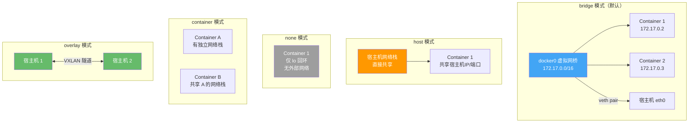

| 模式 | 说明 | 适用场景 |
|------|------|---------|
| **bridge** | 默认模式，容器通过 docker0 网桥通信 | 单机容器互访 |
| **host** | 共享宿主机网络栈，无网络隔离 | 需要最高网络性能 |
| **none** | 无网络，只有 lo 接口 | 安全隔离、自定义网络 |
| **container** | 共享另一个容器的网络栈 | Sidecar 模式 |
| **overlay** | 跨主机容器通信（VXLAN） | Docker Swarm / 多主机 |

```bash
# 创建自定义 bridge 网络（推荐，支持容器名解析）
docker network create -d bridge --subnet 172.20.0.0/16 mynet

# 运行容器并加入自定义网络
docker run -d --name web --network mynet nginx
docker run -d --name api --network mynet myapi

# 容器间通过容器名互访
# api 容器内：curl http://web:80 ✅
# 默认 bridge 中容器名不可解析 ❌
```

::: important 自定义 bridge vs 默认 bridge
自定义 bridge 网络支持**容器名 DNS 解析**，默认 bridge 不支持。生产环境务必使用自定义网络，容器间通过名称互访，避免 IP 硬编码。
:::

**深度追问：**

- **bridge 模式下容器如何访问外部网络？** — 通过 iptables SNAT（源地址转换），容器数据包经 docker0 → 宿主机 eth0 时，源 IP 从容器 IP 替换为宿主机 IP。
- **如何实现容器间网络隔离？** — 使用不同的自定义 bridge 网络，不同网络间默认隔离；或使用 NetworkPolicy（K8s 中）。

**面试官考察点：** 是否理解 Docker 网络的底层实现（veth pair + bridge + iptables），是否知道自定义 bridge 的 DNS 特性。

---

### Q7：Volume 和 Bind Mount 的区别？

**标准答案：**

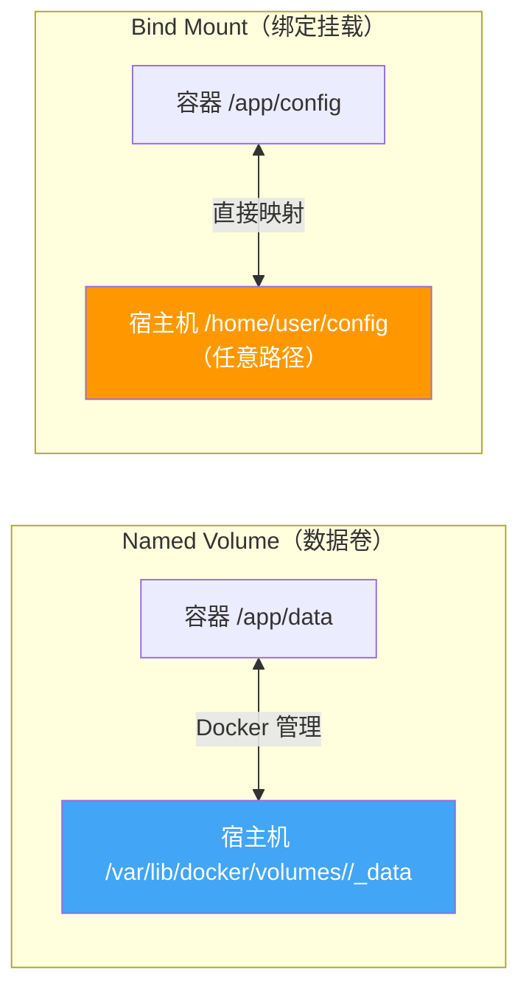

| 特性 | Volume | Bind Mount |
|------|--------|------------|
| **存储位置** | `/var/lib/docker/volumes/` | 宿主机任意路径 |
| **管理方式** | Docker 管理 | 用户自行管理 |
| **创建方式** | `docker volume create` | `docker run -v /host:/container` |
| **可移植性** | 好（跨平台） | 差（依赖宿主机路径） |
| **初始化行为** | 挂载到空目录时复制容器内容 | 直接覆盖容器内容 |
| **适用场景** | 持久化数据、数据库 | 开发环境代码热更新、配置文件 |

```bash
# Named Volume — 生产环境推荐
docker volume create pgdata
docker run -d \
  --name postgres \
  -v pgdata:/var/lib/postgresql/data \
  postgres:15

# Bind Mount — 开发环境代码挂载
docker run -d \
  --name dev-app \
  -v $(pwd)/src:/app/src \
  -v $(pwd)/config:/app/config:ro \
  node:18

# tmpfs Mount — 临时数据（内存中）
docker run -d \
  --name redis \
  --tmpfs /data:rw,size=100m \
  redis:7
```

::: tip 选择建议
- **生产环境**：优先用 Named Volume，Docker 管理生命周期，更安全可靠
- **开发环境**：Bind Mount 做代码热更新，修改即生效
- **敏感数据**：Bind Mount 加 `:ro` 只读，防止容器修改宿主机文件
:::

**深度追问：**

- **Bind Mount 挂载到容器非空目录会怎样？** — 容器目录的原有内容会被宿主机目录内容覆盖（Bind Mount 直接替换），而 Volume 挂载到空目录时会将容器内容复制到 Volume。
- **如何备份 Volume 数据？** — `docker run --rm -v pgdata:/source -v $(pwd):/backup alpine tar czf /backup/pgdata.tar.gz -C /source .`

**面试官考察点：** 是否理解 Docker 存储的两种挂载方式的差异和适用场景，是否知道 Volume 的初始化行为。

---

### Q8：Docker Compose 中 depends_on 和健康检查的区别？

**标准答案：**

`depends_on` 只控制**启动顺序**，不关心服务是否真正就绪；健康检查才能确保依赖服务**真正可用**。

```yaml
# ❌ 仅 depends_on：数据库启动了但还没 ready
services:
  app:
    depends_on:
      - db    # 只等 db 容器启动，不等 db 可连接
      - redis

# ✅ depends_on + condition：等待健康检查通过
services:
  db:
    image: postgres:15
    healthcheck:
      test: ["CMD-SHELL", "pg_isready -U postgres"]
      interval: 5s
      timeout: 3s
      retries: 5
      start_period: 10s

  redis:
    image: redis:7
    healthcheck:
      test: ["CMD", "redis-cli", "ping"]
      interval: 5s
      timeout: 3s
      retries: 5

  app:
    depends_on:
      db:
        condition: service_healthy    # 等 db 健康检查通过
      redis:
        condition: service_healthy    # 等 redis 健康检查通过
```

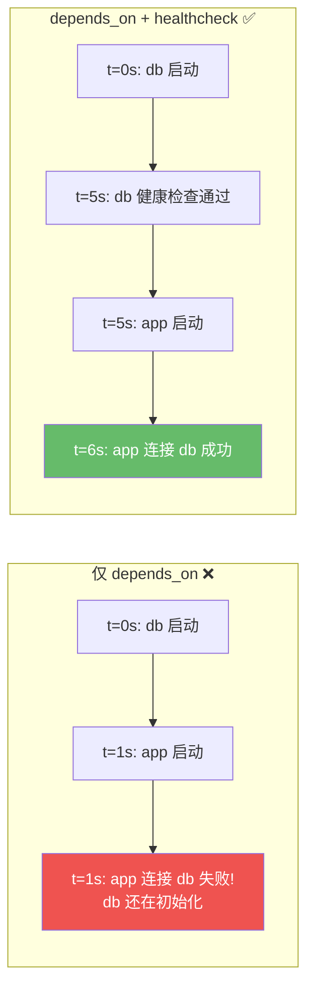

::: important 关键区别
`depends_on` 的 `service_started`（默认）只等容器启动；`service_healthy` 等健康检查通过；`service_completed_successfully` 等容器成功退出（适合初始化任务）。
:::

**深度追问：**

- **应用层是否需要重试逻辑？** — 即使有健康检查，应用层仍建议实现重试/断路器。网络闪断、服务重启、健康检查间隔等场景下仍可能连接失败。
- **Compose v2 和 v1 在 depends_on 上有什么差异？** — Compose v2（目前默认版本）支持 `condition` 字段；v1 的 `depends_on` 只有 `condition: service_started`，需借助 `wait-for-it.sh` 等外部工具。

**面试官考察点：** 是否理解"进程启动"和"服务就绪"的差异，是否在生产级 Compose 编排中正确使用健康检查。

---

### Q9：多阶段构建的作用？

**标准答案：**

多阶段构建（Multi-stage Build）在同一个 Dockerfile 中定义多个构建阶段，最终镜像只包含运行时所需内容，**大幅减小镜像体积**。

```mermaid
flowchart TB
    subgraph Stage1["阶段1: 构建阶段（builder）"]
        S1_BASE["FROM golang:1.21 AS builder"]
        S1_COPY["COPY . /src"]
        S1_BUILD["RUN go build -o /app/server"]
        S1_BASE --> S1_COPY --> S1_BUILD
        S1_SIZE["镜像大小: ~1.2GB<br/>含 Go 工具链、源码、依赖"]
    end

    subgraph Stage2["阶段2: 运行阶段（最终镜像）"]
        S2_BASE["FROM alpine:3.18"]
        S2_COPY["COPY --from=builder /app/server /app/"]
        S2_RUN["CMD [\"/app/server\"]"]
        S2_BASE --> S2_COPY --> S2_RUN
        S2_SIZE["镜像大小: ~15MB<br/>仅 Alpine + 二进制"]
    end

    S1_BUILD --> |"COPY --from=builder"| S2_COPY

    style S1_SIZE fill:#EF5350,color:#fff
    style S2_SIZE fill:#66BB6A,color:#fff
```

```dockerfile
# 阶段1：构建
FROM golang:1.21 AS builder
WORKDIR /src
COPY go.mod go.sum ./
RUN go mod download
COPY . .
RUN CGO_ENABLED=0 GOOS=linux go build -o /app/server

# 阶段2：运行
FROM alpine:3.18
RUN apk add --no-cache ca-certificates tzdata
COPY --from=builder /app/server /app/server
COPY --from=builder /src/configs /app/configs
EXPOSE 8080
CMD ["/app/server"]
```

::: tip 多阶段构建最佳实践
- 为每个阶段命名（`AS builder`），方便 `COPY --from=builder` 引用
- 构建阶段可以用大镜像（含完整工具链），运行阶段用最小基础镜像
- 可以从外部镜像复制：`COPY --from=nginx:latest /etc/nginx/nginx.conf /etc/nginx/`
:::

**深度追问：**

- **多阶段构建和 docker build 多次有什么区别？** — 多阶段构建在同一个构建上下文中完成，层缓存共享，一个 Dockerfile 即可；多次构建需要手动传递中间产物，且安全性和可维护性差。
- **如何只构建到某个阶段？** — `docker build --target builder -t myapp:builder .`，适合调试构建阶段的问题。

**面试官考察点：** 是否理解镜像瘦身的核心手段，是否能在实际项目中运用多阶段构建。

---

### Q10：Docker 的存储驱动 overlay2 原理？

**标准答案：**

overlay2 是 Docker 当前默认且推荐的存储驱动，基于 Linux 内核的 OverlayFS 文件系统。

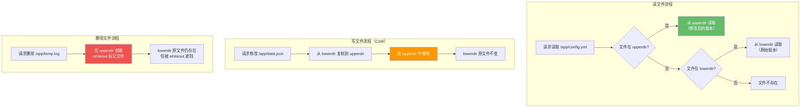

**overlay2 的三层结构：**

| 层 | 作用 | 位置 |
|----|------|------|
| **lowerdir** | 只读的镜像层（可多层） | `/var/lib/docker/overlay2/<id>/diff` |
| **upperdir** | 可写的容器层（仅一层） | `/var/lib/docker/overlay2/<id>/diff` |
| **merged** | 合并后的统一视图 | `/var/lib/docker/overlay2/<id>/merged` |

```bash
# 查看容器的 overlay2 挂载信息
docker inspect <container_id> --format='{{.GraphDriver.Data}}'

# 查看 merged 目录
ls /var/lib/docker/overlay2/<id>/merged/

# 查看容器的 upperdir（可写层修改）
ls /var/lib/docker/overlay2/<id>/diff/
```

::: warning overlay2 的"删除"假象
删除 lowerdir 中的文件时，overlay2 不会真正删除，而是在 upperdir 创建一个 **whiteout 文件**（字符设备，主设备号 0/次设备号 0）。所以删除文件不会减小镜像大小 —— 这也是多阶段构建重要的原因之一。
:::

**深度追问：**

- **overlay2 和 overlay 有什么区别？** — overlay（旧版）只支持一个 lowerdir 层（需合并），overlay2 支持多个 lowerdir 层，性能更优。Docker 18.09+ 默认 overlay2。
- **overlay2 的性能瓶颈在哪？** — 大量小文件操作时 CoW 开销明显；深层目录查找需要逐层遍历。建议减少镜像层数、使用 Volume 存储高频 IO 数据。

**面试官考察点：** 是否理解 CoW 和 whiteout 机制，是否知道"删除不减小镜像"的根本原因。

---

### Q11：Docker 镜像如何瘦身？

**标准答案：**

镜像瘦身是容器化实践中的核心优化项，以下从多个维度系统化瘦身：

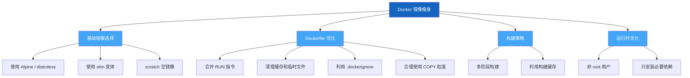

**具体手段与效果对比：**

```dockerfile
# ❌ 胖镜像 (~800MB)
FROM python:3.11
COPY . /app
RUN pip install -r requirements.txt
CMD ["python", "/app/main.py"]

# ✅ 瘦身镜像 (~120MB)
FROM python:3.11-slim AS builder
WORKDIR /app
COPY requirements.txt .
RUN pip install --no-cache-dir --user -r requirements.txt

FROM python:3.11-slim
WORKDIR /app
COPY --from=builder /root/.local /root/.local
COPY . .
ENV PATH=/root/.local/bin:$PATH
CMD ["python", "main.py"]

# ✅ 极致瘦身 (~50MB，静态编译)
FROM golang:1.21 AS builder
WORKDIR /src
COPY . .
RUN CGO_ENABLED=0 go build -ldflags="-s -w" -o /app/server

FROM scratch
COPY --from=builder /app/server /server
COPY --from=builder /etc/ssl/certs/ca-certificates.crt /etc/ssl/certs/
ENTRYPOINT ["/server"]
```

| 优化手段 | 预期效果 |
|---------|---------|
| `python:3.11` → `python:3.11-slim` | ~900MB → ~150MB |
| `node:18` → `node:18-alpine` | ~1.1GB → ~180MB |
| 多阶段构建（Go/Java） | ~1.2GB → ~15-50MB |
| `go build -ldflags="-s -w"` | 去除调试信息，减小 20-30% |
| `pip --no-cache-dir` | 避免 pip 缓存残留 |
| 合并 RUN + 清理 | 减少层数和中间文件 |
| `.dockerignore` | 排除 `.git`、`node_modules` 等 |

::: important 瘦身核心原则
1. **选对基础镜像** — 这是最大的优化杠杆
2. **多阶段构建** — 构建工具链不入最终镜像
3. **层内清理** — 同一个 RUN 中安装和清理
4. **减少构建上下文** — `.dockerignore` 必不可少
:::

**深度追问：**

- **Alpine 镜像有什么坑？** — Alpine 使用 musl libc 而非 glibc，部分 C 扩展（如 numpy、PIL）可能编译失败；DNS 解析行为与 glibc 不同（`musl` 不支持 `search` 和 `ndots`），可能导致微服务间域名解析异常。
- **distroless 和 scratch 有什么区别？** — scratch 是空镜像（连 shell 都没有），distroless 包含最小运行时（ca-certificates、时区数据等）。distroless 更适合生产，scratch 适合纯静态编译的 Go/Rust 程序。

**面试官考察点：** 是否系统化掌握镜像瘦身方法，是否了解 Alpine/distroless 的实际限制而非盲从。

---

### Q12：Docker 的 C/S 架构是什么？

**标准答案：**

Docker 采用经典的 **Client-Server 架构**，客户端（docker CLI）与守护进程（dockerd）通过 REST API 通信。

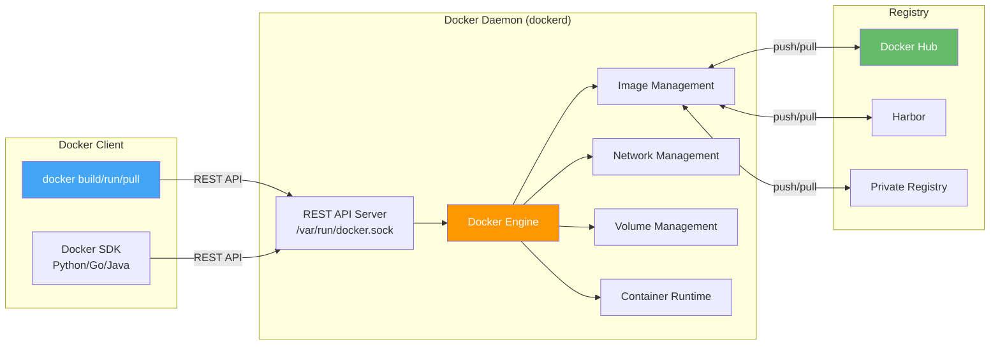

**关键组件：**

| 组件 | 作用 |
|------|------|
| **docker CLI** | 用户命令行工具，发送请求到 Daemon |
| **dockerd** | 守护进程，监听 Unix Socket/TCP，管理镜像、容器、网络、卷 |
| **containerd** | 容器运行时管理器，负责镜像拉取、容器执行 |
| **runc** | OCI 运行时，实际创建和运行容器 |
| **docker.sock** | Unix Socket，Client 和 Daemon 的通信通道 |

```bash
# 查看 Docker 版本信息（Client + Server）
docker version

# 查看 Docker 系统信息
docker info

# 直接调用 Docker API
curl --unix-socket /var/run/docker.sock http://localhost/containers/json

# 远程 Daemon 连接
docker -H tcp://remote-host:2376 ps
```

::: warning docker.sock 安全风险
`docker.sock` 拥有完整的 Docker 控制权限。**绝对不要将 docker.sock 挂载到容器中**，否则容器可以逃逸控制宿主机上的所有容器。这是最常见的容器逃逸路径之一。
:::

**深度追问：**

- **Docker 的架构拆分（dockerd → containerd → runc）是为了什么？** — 职责分离和标准化。containerd 是 CNCF 毕业项目，可被 Kubernetes 直接使用；runc 是 OCI 标准实现。这种分层让 Docker 不再是唯一选择。
- **如何远程连接 Docker Daemon？** — 配置 `DOCKER_HOST` 环境变量或 `-H` 参数。生产环境必须启用 TLS 双向认证，禁止明文 TCP。

**面试官考察点：** 是否理解 Docker 的分层架构，是否知道 docker.sock 挂载的安全风险。

---

## 二、Docker 进阶篇（13 题）

### Q13：Docker 安全最佳实践？

**标准答案：**

Docker 安全是一个纵深防御体系，从镜像构建到运行时全链路防护：

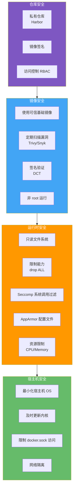

```yaml
# 安全加固的 Pod/容器配置示例
securityContext:
  runAsNonRoot: true        # 禁止 root 运行
  runAsUser: 1000           # 指定非零用户
  readOnlyRootFilesystem: true  # 只读根文件系统
  allowPrivilegeEscalation: false  # 禁止提权
  capabilities:
    drop: ["ALL"]           # 删除所有 Linux 能力
  seccompProfile:
    type: RuntimeDefault    # 使用默认 Seccomp 配置
```

::: important 安全黄金法则
1. **最小权限** — 非 root、最小能力、只读文件系统
2. **最小攻击面** — 最小基础镜像、只装必要软件
3. **纵深防御** — 镜像扫描 + 运行时限制 + 宿主机加固
4. **持续更新** — 基础镜像和依赖及时更新
:::

**深度追问：**

- **如何检测运行中容器的异常行为？** — 使用运行时安全工具（Falco、Sysdig），基于规则引擎监控系统调用和异常行为，如意外网络连接、文件系统篡改、特权操作等。
- **Docker Bench for Security 是什么？** — CIS 发布的 Docker 安全基准自动化检查脚本，覆盖宿主机配置、Docker Daemon 配置、容器镜像、运行时等 100+ 检查项。

**面试官考察点：** 是否有系统化的安全思维，而非零散知道几个安全点。

---

### Q14：如何防止容器逃逸？

**标准答案：**

容器逃逸是指攻击者从容器内部获取宿主机控制权，这是容器安全最严重的威胁。

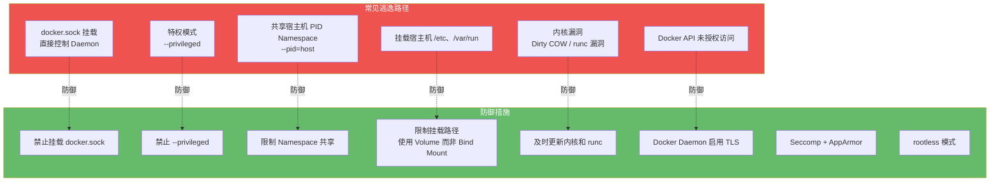

**关键防御清单：**

```bash
# ❌ 危险操作 — 绝对禁止
docker run --privileged ...           # 特权模式，几乎无隔离
docker run -v /var/run/docker.sock:/var/run/docker.sock ...  # 挂载 docker.sock
docker run -v /:/host ...             # 挂载宿主机根目录
docker run --pid=host --net=host ...  # 共享宿主机命名空间

# ✅ 安全替代方案
docker run \
  --cap-drop ALL \                    # 删除所有能力
  --cap-add NET_BIND_SERVICE \        # 只加需要的能力
  --security-opt no-new-privileges \  # 禁止提权
  --read-only \                       # 只读文件系统
  --tmpfs /tmp:rw,noexec,nosuid \     # 临时目录
  --pids-limit 50 \                   # 限制进程数
  myapp:latest
```

::: warning 最危险的三个操作
1. **`--privileged`** — 几乎等于无隔离，可访问所有设备、加载内核模块
2. **挂载 `docker.sock`** — 可创建特权容器逃逸
3. **挂载宿主机敏感路径** — `/`、`/etc`、`/var/run/docker.sock`
:::

**深度追问：**

- **runc 漏洞（CVE-2019-5736）是如何逃逸的？** — 攻击者通过替换容器内 `/proc/self/exe` 符号链接指向的 runc 二进制文件，当宿主机通过 `docker exec` 再次调用 runc 时，实际执行了攻击者的恶意代码。修复方案是升级 runc，并使用 User Namespace 限制。
- **rootless Docker 能完全防止逃逸吗？** — 大幅降低风险但不完全免疫。rootless 下即使逃逸也只是普通用户权限，但内核漏洞仍可能提权。

**面试官考察点：** 是否了解容器逃逸的常见路径和防御手段，是否有安全红线意识。

---

### Q15：rootless Docker 是什么？

**标准答案：**

rootless Docker 是以**普通用户身份**运行 Docker Daemon 和容器的模式，即使容器被攻破，攻击者也只有普通用户权限，无法获取宿主机 root 权限。

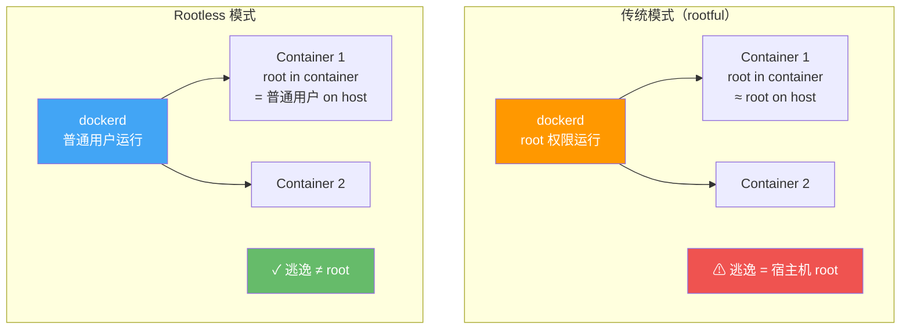

**Rootless 的工作原理：**

- 利用 **User Namespace** 将容器内 UID 0 映射到宿主机非零 UID
- 使用 **slirp4netns** 或 **pasta** 实现用户态网络
- 使用 **fuse-overlayfs** 实现用户态存储驱动
- 不需要 root 权限，无需 `sudo`

```bash
# 安装 rootless Docker
curl -fsSL https://get.docker.com/rootless | sh

# 配置环境变量
export DOCKER_HOST=unix:///run/user/$UID/docker.sock

# 启动 rootless Docker
systemctl --user start docker

# rootless 模式下的限制
# ❌ 无法绑定 < 1024 端口（需 sysctl 配置）
# ❌ 无法使用 AppArmor
# ❌ 网络 performance 有损耗（slirp4netns 用户态）
# ❌ 部分 storage driver 不支持
```

::: tip Rootless 适用场景
- **多租户环境** — 不同用户运行自己的 Docker
- **CI/CD Runner** — 避免构建任务获取 root 权限
- **开发环境** — 降低安全风险
- **受限服务器** — 无 root 权限的共享服务器
:::

**深度追问：**

- **rootless 模式的性能损失有多大？** — 网络方面 slirp4netns 损失约 30-50% 吞吐量（可用 pasta/Bess 改善）；存储方面 fuse-overlayfs 损失约 5-10%。对大多数应用可接受。
- **Kubernetes 支持 rootless 吗？** — Kubernetes 1.22+ 支持 User Namespace（KEP-127，alpha → beta），但目前还不成熟。K3s 和 kind 可用于 rootless K8s 测试。

**面试官考察点：** 是否了解 rootless Docker 的原理和限制，是否知道它是容器安全的重要发展方向。

---

### Q16：Harbor 如何实现高可用？

**标准答案：**

Harbor 是企业级 Docker Registry，高可用需要从**数据库、存储、Harbor 实例**三个层面设计：

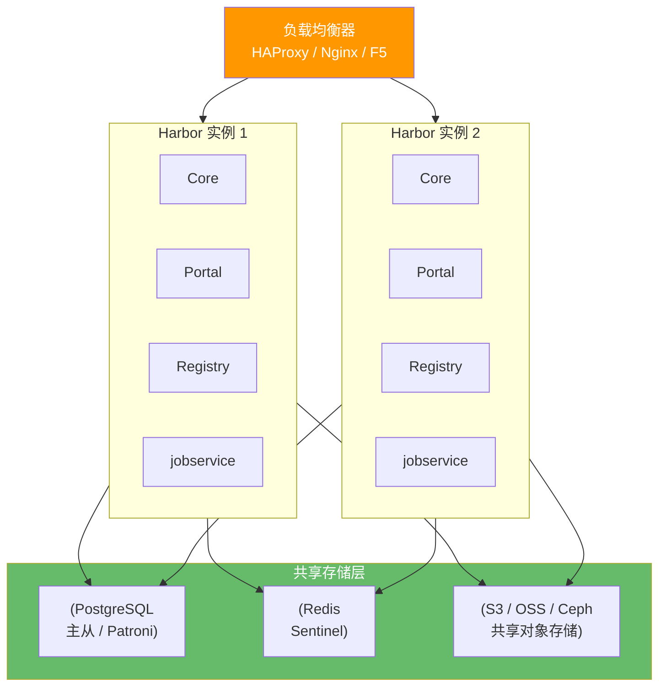

**高可用关键点：**

| 组件 | 高可用方案 |
|------|-----------|
| **数据库** | PostgreSQL 主从复制或 Patroni 集群 |
| **Redis** | Redis Sentinel 哨兵模式 |
| **存储后端** | S3/OSS/Ceph 等共享对象存储（不用本地磁盘） |
| **Harbor 实例** | 多实例 + 负载均衡（无状态，可水平扩展） |
| **jobsservice** | 多实例通过 Redis 协调任务分发 |

```yaml
# Harbor helm values 高可用关键配置
harborCore:
  replicas: 2

harborPortal:
  replicas: 2

registry:
  replicas: 2

jobservice:
  replicas: 2

persistence:
  imageChartStorage:
    type: s3
    s3:
      region: us-east-1
      bucket: harbor-storage
      accesskey: xxx
      secretkey: xxx

database:
  type: external
  external:
    host: postgres-ha.internal

redis:
  type: external
  external:
    addr: redis-sentinel:26379
```

::: important 核心原则
Harbor 实例本身无状态，高可用的关键是**共享数据库 + 共享存储**。如果用本地磁盘存储镜像，多实例间数据不一致，无法实现高可用。
:::

**深度追问：**

- **Harbor 的镜像复制和高可用有什么关系？** — 镜像复制是**灾备方案**（跨数据中心），高可用是**单集群方案**（同数据中心内）。两者互补：高可用防单点故障，复制防区域性灾难。
- **Harbor 的垃圾回收如何影响高可用？** — GC 期间 Registry 只读，会影响 push 操作。建议在低峰期执行，或使用独立 GC 实例。

**面试官考察点：** 是否理解 Harbor 无状态架构，是否知道高可用的关键在于共享存储层而非 Harbor 实例本身。

---

### Q17：镜像漏洞扫描用什么工具？

**标准答案：**

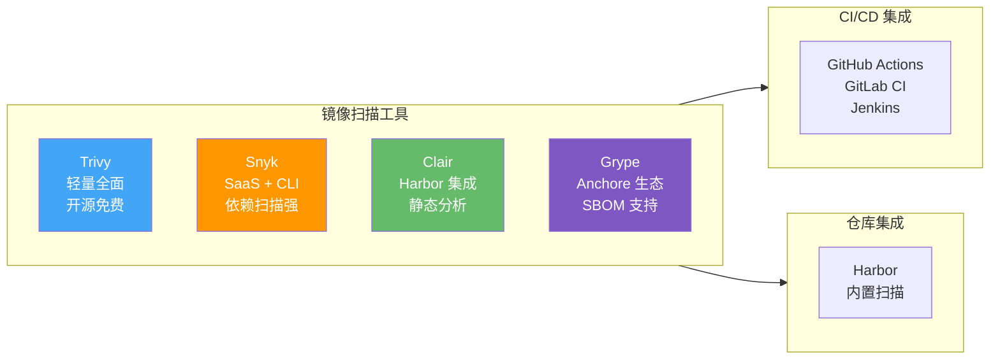

| 工具 | 特点 | 适用场景 |
|------|------|---------|
| **Trivy** | 扫描快、CVE 数据库全、支持 SBOM | 通用首选，CI/CD 集成 |
| **Clair** | Harbor 原生集成，静态分析 | Harbor 仓库内扫描 |
| **Snyk** | 语言依赖扫描强，SaaS 便捷 | 开发者自助扫描 |
| **Grype** | SBOM 扫描，与 Syft 生态配合 | SBOM 管理流程 |

```bash
# Trivy 基本使用
trivy image nginx:1.24

# 只显示 HIGH 和 CRITICAL
trivy image --severity HIGH,CRITICAL nginx:1.24

# JSON 格式输出（集成 CI）
trivy image --format json --output report.json nginx:1.24

# CI 中失败阈值
trivy image --exit-code 1 --severity CRITICAL myapp:latest

# 生成 SBOM
trivy image --format spdx-json --output sbom.json myapp:latest
```

```yaml
# GitLab CI 集成 Trivy
container_scanning:
  stage: test
  image: aquasec/trivy:latest
  script:
    - trivy image --exit-code 0 --severity HIGH,CRITICAL --format json --output gl-container-scanning-report.json $CI_REGISTRY_IMAGE:$CI_COMMIT_SHA
    - trivy image --exit-code 1 --severity CRITICAL $CI_REGISTRY_IMAGE:$CI_COMMIT_SHA
  artifacts:
    reports:
      container_scanning: gl-container-scanning-report.json
```

::: tip 扫描策略建议
- **构建时扫描** — CI/CD 流水线中集成 Trivy，CRITICAL 级别阻断发布
- **仓库内扫描** — Harbor 定时扫描已有镜像，发现新 CVE 时告警
- **运行时扫描** — 定期扫描线上运行中的镜像，发现未修复的漏洞
:::

**深度追问：**

- **漏洞扫描的误报如何处理？** — 使用 `.trivyignore` 忽略特定 CVE（已修复或不适用的），同时建立漏洞评审流程，避免盲目忽略。
- **SBOM 是什么？为什么重要？** — Software Bill of Materials，软件物料清单。SBOM 记录镜像中所有组件和版本，当新 CVE 披露时可快速定位受影响的镜像，无需重新扫描。

**面试官考察点：** 是否有完整的漏洞管理流程（扫描→评估→修复→验证），而非只知道工具名。

---

### Q18：Docker Content Trust 是什么？

**标准答案：**

Docker Content Trust（DCT）是 Docker 的**镜像签名和验证机制**，基于 Notary（TUF 框架），确保拉取的镜像来源可信且未被篡改。

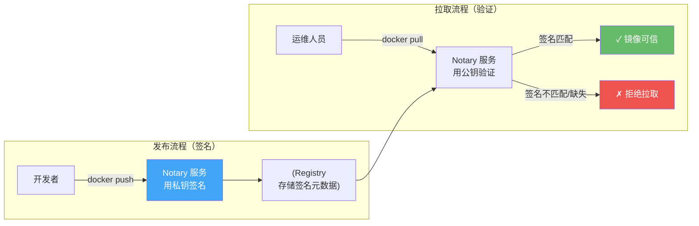

```bash
# 启用 DCT
export DOCKER_CONTENT_TRUST=1

# 推送镜像（自动签名，首次需设置密码）
docker push myregistry.com/myapp:v1.0

# 拉取镜像（自动验证签名）
docker pull myregistry.com/myapp:v1.0
# 如果镜像未签名，拉取失败

# 查看签名信息
docker trust inspect myregistry.com/myapp:v1.0

# 签名已有镜像
docker trust sign myregistry.com/myapp:v1.0

# 关闭 DCT（不推荐）
export DOCKER_CONTENT_TRUST=0
```

::: warning DCT 的局限性
- 只对带 tag 的镜像生效，`latest` 等浮动 tag 也会被签名
- 私钥管理复杂，丢失后无法再签名
- 对 CI/CD 流水线有影响，需要自动化密钥管理
- K8s 默认不验证镜像签名（需配合 OPA/Kyverno 策略）
:::

**深度追问：**

- **K8s 中如何强制只拉取签名镜像？** — 使用 OPA Gatekeeper 或 Kyverno 的策略，在 Admission 阶段校验镜像签名。Sigstore/Cosign 是更现代的签名方案，与 K8s 集成更好。
- **DCT 和 Cosign 有什么区别？** — DCT 基于 Notary/TUF，签名元数据存储在 Registry 的独立区域；Cosign 基于 Sigstore，签名存储为 Registry 中的独立镜像，更透明、更易集成。

**面试官考察点：** 是否理解供应链安全的"签名-验证"模型，是否知道 DCT 的局限和更现代的替代方案。

---

### Q19：Seccomp 和 AppArmor 在 Docker 中的作用？

**标准答案：**

Seccomp 和 AppArmor 是 Linux 内核提供的两种安全机制，在容器中提供不同维度的防护：

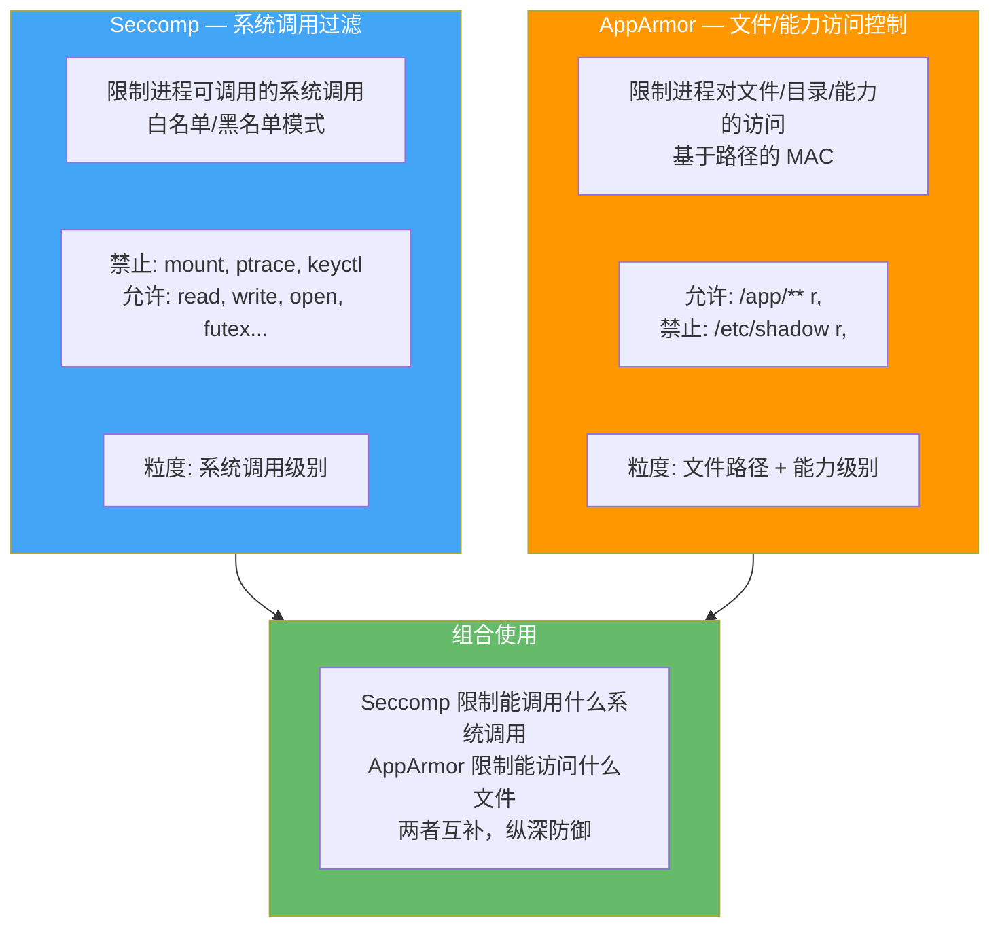

| 维度 | Seccomp | AppArmor |
|------|---------|----------|
| **控制对象** | 系统调用（syscall） | 文件路径、能力、网络 |
| **默认配置** | Docker 内置默认配置文件 | 通常需自定义配置文件 |
| **粒度** | 系统调用 + 参数 | 文件路径 + 权限 |
| **配置方式** | JSON 配置文件 | Profile 文本文件 |
| **BPF** | 使用 BPF 过滤 | 不使用 BPF |

```bash
# Docker 默认启用 Seccomp（335 个系统调用中的约 44 个被禁止）
# 查看 Docker 默认 Seccomp 配置
docker run --rm docker/seed-seccomp cat /seccomp/profiles/default.json

# 自定义 Seccomp 配置
docker run --security-opt seccomp=custom-seccomp.json myapp

# 禁用 Seccomp（危险！）
docker run --security-opt seccomp=unconfined myapp

# 使用 AppArmor 配置文件
docker run --security-opt apparmor=docker-default myapp
docker run --security-opt apparmor=my-custom-profile myapp
```

::: important Docker 默认安全基线
Docker 默认启用了 Seccomp（内置白名单配置）和 AppArmor（`docker-default` 配置文件），禁止了约 44 个危险系统调用。**不要使用 `--security-opt seccomp=unconfined` 关闭 Seccomp**，除非有明确的兼容性需求。
:::

**深度追问：**

- **Seccomp 和 SELinux 有什么区别？** — Seccomp 限制系统调用（更底层），SELinux/AppArmor 限制文件/资源访问（更上层）。SELinux 基于 label（安全上下文），AppArmor 基于路径。两者都是 MAC 机制。
- **如何为自定义应用编写 Seccomp 配置？** — 先用 `strace` 或 `syscall2seccomp` 记录应用实际使用的系统调用，再基于此生成最小白名单配置。

**面试官考察点：** 是否理解两种安全机制的不同维度，是否知道 Docker 默认已经启用了这些防护。

---

### Q20：Docker 日志收集方案？

**标准答案：**

Docker 日志分为**容器标准输出日志**和**容器内文件日志**两种，收集方案不同：

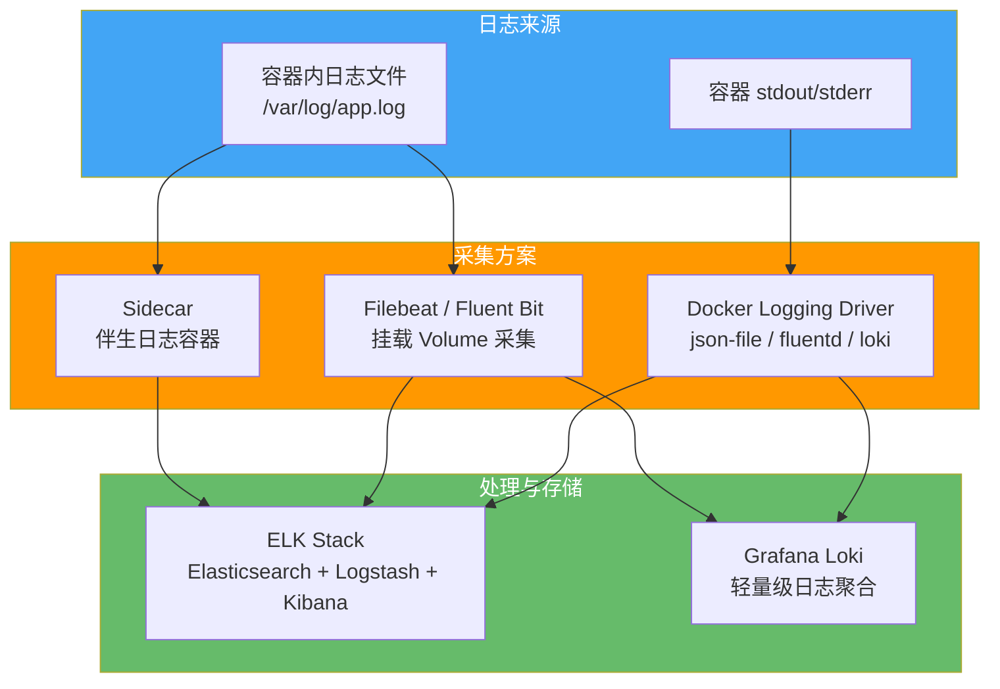

| 方案 | 原理 | 优点 | 缺点 |
|------|------|------|------|
| **json-file**（默认） | 写入本地 JSON 文件 | 简单，`docker logs` 可用 | 单机，需轮转防止磁盘满 |
| **fluentd** | Docker 直接发到 Fluentd | 成熟生态 | 配置复杂 |
| **Loki** | Docker 直接发到 Loki | 轻量，与 Grafana 集成 | 全文检索弱 |
| **Filebeat + Volume** | 挂载日志目录到宿主机 | 兼容现有 ELK | 需管理挂载路径 |
| **Sidecar** | 伴生容器采集日志 | 不侵入业务容器 | 资源开销翻倍 |

```yaml
# Docker Compose 日志配置
services:
  app:
    image: myapp:latest
    logging:
      driver: json-file
      options:
        max-size: "10m"      # 单文件最大 10MB
        max-file: "5"        # 最多保留 5 个文件
        tag: "app-{{.Name}}" # 日志标签
```

```bash
# 配置全局日志驱动
# /etc/docker/daemon.json
{
  "log-driver": "json-file",
  "log-opts": {
    "max-size": "10m",
    "max-file": "3"
  }
}

# 使用 Loki 日志驱动
docker run --log-driver=loki \
  --log-opt loki-url=http://loki:3100/loki/api/v1/push \
  myapp:latest
```

::: warning 日志磁盘爆满是常见故障
默认 json-file 驱动**不会自动轮转**，长期运行的容器日志会无限增长。务必在 `daemon.json` 中全局配置 `max-size` 和 `max-file`，或在每个容器上单独配置。
:::

**深度追问：**

- **K8s 中日志收集和 Docker 有什么不同？** — K8s 中每个 Pod 有独立 Volume 和生命周期，推荐使用 Filebeat/Fluent Bit DaemonSet（每个节点一个）采集 `/var/log/containers/` 下的日志，或 Sidecar 模式。不建议依赖 Docker 日志驱动。
- **EFK 和 ELK 有什么区别？** — EFK = Elasticsearch + Fluentd + Kibana（Fluentd 替代 Logstash），更轻量，K8s 生态更常用。ELK = Elasticsearch + Logstash + Kibana，Logstash 功能更强但更重。

**面试官考察点：** 是否有日志收集的系统方案（而非只知道 `docker logs`），是否关注日志磁盘管理。

---

### Q21：Docker 在 CI/CD 中的角色？

**标准答案：**

Docker 在 CI/CD 中承担三个核心角色：**构建环境隔离、制品标准化、部署一致性**。

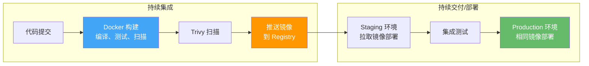

```yaml
# GitLab CI Docker 构建
stages:
  - build
  - test
  - deploy

docker-build:
  stage: build
  image: docker:24
  services:
    - docker:24-dind
  script:
    - docker build -t $CI_REGISTRY_IMAGE:$CI_COMMIT_SHA .
    - docker run --rm $CI_REGISTRY_IMAGE:$CI_COMMIT_SHA pytest
    - trivy image --exit-code 1 --severity CRITICAL $CI_REGISTRY_IMAGE:$CI_COMMIT_SHA
    - docker push $CI_REGISTRY_IMAGE:$CI_COMMIT_SHA
    - docker tag $CI_REGISTRY_IMAGE:$CI_COMMIT_SHA $CI_REGISTRY_IMAGE:latest
    - docker push $CI_REGISTRY_IMAGE:latest

deploy-prod:
  stage: deploy
  image: bitnami/kubectl
  script:
    - kubectl set image deployment/app app=$CI_REGISTRY_IMAGE:$CI_COMMIT_SHA
    - kubectl rollout status deployment/app
  only:
    - main
```

::: important Docker 在 CI/CD 中的核心价值
- **环境一致性** — "在我机器上能跑"不再存在，CI 和生产使用相同镜像
- **并行隔离** — 每个 CI Job 独立容器，互不干扰
- **版本化制品** — 镜像 = 不可变制品，tag 对应 Git commit
- **快速回滚** — 回滚 = 切换镜像 tag，秒级完成
:::

**深度追问：**

- **DinD（Docker in Docker）和 DooD（Docker outside of Docker）有什么区别？** — DinD 在容器内运行独立 Docker Daemon（`docker:dind`），隔离性好但有安全风险；DooD 挂载宿主机 docker.sock，共享宿主机 Docker，性能好但有逃逸风险。CI/CD 中常用 DooD 方式。
- **如何避免 CI 中的镜像构建慢？** — 利用层缓存（`--cache-from`）、BuildKit（`DOCKER_BUILDKIT=1`）、多阶段构建、Kaniko（免 DinD 构建）。

**面试官考察点：** 是否理解 Docker 在 DevOps 流水线中的端到端价值，是否了解 CI 中 Docker 构建的优化和安全。

---

### Q22：如何实现 Docker 蓝绿部署？

**标准答案：**

蓝绿部署通过维护两套完全相同的环境（蓝和绿），切换流量实现零停机发布：

```mermaid
flowchart TB
    subgraph BlueGreen["蓝绿部署"]
        LB[负载均衡器 / Nginx]

        subgraph Blue["蓝环境（当前版本 v1）"]
            B1[app-v1:8001]
            B2[app-v1:8002]
        end

        subgraph Green["绿环境（新版本 v2）"]
            G1[app-v2:8003]
            G2[app-v2:8004]
        end

        LB --> |"100% 流量"| Blue
        LB -.-> |"0% 流量"| Green
    end

    SWITCH["切换后"]

    subgraph After["切换后"]
        LB2[负载均衡器 / Nginx]
        subgraph Blue2["蓝环境（v1）"]
            B3[app-v1:8001]
        end
        subgraph Green2["绿环境（v2）当前"]
            G3[app-v2:8003]
            G4[app-v2:8004]
        end
        LB2 -.-> |"0% 流量"| Blue2
        LB2 --> |"100% 流量"| Green2
    end

    style Blue fill:#42A5F5,color:#fff
    style Green fill:#66BB6A,color:#fff
    style LB fill:#FF9800,color:#fff
    style LB2 fill:#FF9800,color:#fff
```

```yaml
# docker-compose.blue.yml（蓝环境）
services:
  app-blue:
    image: myapp:v1
    ports:
      - "8001:8080"
      - "8002:8080"

# docker-compose.green.yml（绿环境）
services:
  app-green:
    image: myapp:v2
    ports:
      - "8003:8080"
      - "8004:8080"
```

```nginx
# Nginx 切换配置
# 当前指向蓝环境
upstream backend {
    server 127.0.0.1:8001;
    server 127.0.0.1:8002;
}

# 切换到绿环境
# upstream backend {
#     server 127.0.0.1:8003;
#     server 127.0.0.1:8004;
# }
```

```bash
# 蓝绿部署流程
# 1. 当前蓝环境在运行
docker compose -f docker-compose.blue.yml up -d

# 2. 部署绿环境
docker compose -f docker-compose.green.yml up -d

# 3. 健康检查绿环境
curl http://localhost:8003/health

# 4. 切换 Nginx 指向绿环境
# 修改 nginx.conf → nginx -s reload

# 5. 观察一段时间后停止蓝环境
docker compose -f docker-compose.blue.yml down

# 回滚：只需切换 Nginx 指回蓝环境
```

::: tip 蓝绿部署 vs 滚动更新
- **蓝绿部署** — 双倍资源、瞬时切换、回滚快（秒级），适合关键业务
- **滚动更新** — 无需双倍资源、逐步替换、回滚慢（需重新部署），适合一般业务
- K8s 原生支持滚动更新，蓝绿部署需配合 Ingress/Service 切换
:::

**深度追问：**

- **蓝绿部署如何处理数据库迁移？** — 数据库变更必须向后兼容（新增列可 NULL 或有默认值），不允许删列改列。蓝绿切换前先执行迁移，两套环境共享数据库。
- **如何实现灰度（金丝雀）发布？** — 在蓝绿基础上，Nginx 按权重分配流量（如 10% → 绿，90% → 蓝），逐步增大绿环境流量比例。

**面试官考察点：** 是否理解零停机部署的原理，是否知道蓝绿和滚动的适用场景差异。

---

### Q23：多架构镜像如何构建？

**标准答案：**

多架构镜像（Multi-arch Image）让同一个 tag 自动适配不同 CPU 架构（amd64、arm64 等），用户 `docker pull` 时自动选择匹配的镜像。

```mermaid
flowchart TB
    subgraph Build["构建多架构镜像"]
        B_AMD[amd64 构建]
        B_ARM[arm64 构建]
    end

    subgraph Manifest["Manifest List"]
        M["docker.io/myapp:latest<br/>Manifest List (索引)"]
        M --> M1["manifest: amd64<br/>sha256:aaa..."]
        M --> M2["manifest: arm64<br/>sha256:bbb..."]
    end

    subgraph Pull["拉取时自动选择"]
        P_AMD[x86 服务器] --> |"选择 amd64"| I1[myapp:latest @ amd64]
        P_ARM[ARM Mac/服务器] --> |"选择 arm64"| I2[myapp:latest @ arm64]
    end

    B_AMD --> M
    B_ARM --> M
    M --> Pull

    style M fill:#FF9800,color:#fff
    style P_AMD fill:#42A5F5,color:#fff
    style P_ARM fill:#66BB6A,color:#fff
```

```bash
# 方式1：docker buildx（推荐）
# 创建 buildx 构建器
docker buildx create --name multiarch --use

# 同时构建并推送多架构镜像
docker buildx build \
  --platform linux/amd64,linux/arm64 \
  -t myregistry.com/myapp:latest \
  --push .

# 方式2：docker manifest（手动组合）
# 分别构建并推送
docker build -t myregistry.com/myapp:amd64 --platform amd64 .
docker push myregistry.com/myapp:amd64

docker build -t myregistry.com/myapp:arm64 --platform arm64 .
docker push myregistry.com/myapp:arm64

# 创建并推送 manifest list
docker manifest create myregistry.com/myapp:latest \
  myregistry.com/myapp:amd64 \
  myregistry.com/myapp:arm64
docker manifest push myregistry.com/myapp:latest
```

::: important 构建环境要求
- `docker buildx` 需要 QEMU 模拟或原生节点支持目标架构
- 推荐使用原生节点：在 amd64 和 arm64 机器上分别构建，通过 manifest 组合
- CI/CD 中可用 GitHub Actions 的 `buildx-action`，支持多架构构建
:::

**深度追问：**

- **QEMU 模拟构建和原生构建有什么性能差异？** — QEMU 模拟慢 5-10 倍（指令翻译开销），适合低频构建；原生构建速度快，适合频繁构建。生产推荐原生节点。
- **ARM 镜像中依赖编译问题如何解决？** — C/C++ 扩展需要对应架构的编译工具链。使用多阶段构建时，构建阶段必须也在目标架构上运行。

**面试官考察点：** 是否理解 Manifest List 的原理，是否能在实际项目中实现多架构镜像构建。

---

### Q24：Docker Swarm vs K8s？

**标准答案：**

| 维度 | Docker Swarm | Kubernetes |
|------|-------------|------------|
| **复杂度** | 低，Docker 原生 | 高，独立系统 |
| **学习曲线** | 平缓 | 陡峭 |
| **功能丰富度** | 基础编排 | 全功能编排平台 |
| **自动伸缩** | 手动/有限 | HPA/VPA/CA |
| **滚动更新** | 支持 | 支持（更细粒度） |
| **服务发现** | 内置 DNS | Service + CoreDNS |
| **存储编排** | 基础 Volume | PV/PVC/StorageClass |
| **密钥管理** | Docker Secrets | Secret + Vault 集成 |
| **网络策略** | 无 | NetworkPolicy |
| **自定义调度** | 无 | Node Affinity/Taint |
| **生态** | Docker 生态 | 云原生生态（CNCF） |
| **社区活跃度** | 低 | 极高 |
| **适用规模** | 小型（<100 容器） | 中大型（1000+ 容器） |

```mermaid
flowchart LR
    subgraph Small["小型团队/项目"]
        SW["Swarm<br/>5 分钟上手<br/>够用就好"]
    end

    subgraph Medium["中型团队/项目"]
        K8S_S["K8s 单集群<br/>功能全面<br/>运维成本中等"]
    end

    subgraph Large["大型团队/企业"]
        K8S_M["K8s 多集群<br/>完整云原生栈<br/>专职 SRE 团队"]
    end

    Small --> |"规模增长"| Medium --> |"继续增长"| Large

    style SW fill:#42A5F5,color:#fff
    style K8S_S fill:#FF9800,color:#fff
    style K8S_M fill:#EF5350,color:#fff
```

::: tip 选择建议
- **选 Swarm**：小团队、简单微服务、快速验证、Docker Compose 升级过渡
- **选 K8s**：中大型团队、需要自动伸缩/网络策略/自定义调度、云原生生态
- **趋势**：Swarm 社区活跃度持续下降，新项目建议直接上 K8s
:::

**深度追问：**

- **Swarm 有哪些 K8s 没有的优势？** — 零额外学习成本（Docker 命令即可）、轻量部署、与 Docker Compose 天然兼容。但功能差距越来越大。
- **K3s 能替代 Swarm 的角色吗？** — 可以。K3s 是轻量级 K8s，单二进制、低资源占用，同时保留 K8s 全部 API，是 Swarm 的现代替代方案。

**面试官考察点：** 是否根据场景选择而非盲从，是否理解 K8s 的复杂度代价。

---

### Q25：Docker 的 init 进程与僵尸进程问题？

**标准答案：**

容器以 PID 1 运行的进程承担着**信号处理**和**僵尸进程回收**两个关键职责，不当的 PID 1 进程会导致严重问题。

```mermaid
flowchart TB
    subgraph Problem["问题场景"]
        P1["容器 PID 1 = 应用进程<br/>（如 node / python）"]
        P1 --> SIG["不处理 SIGTERM<br/>容器无法优雅停止"]
        P1 --> ZOMBIE["不回收子进程<br/>僵尸进程堆积"]
        ZOMBIE --> LEAK["PID 耗尽<br/>容器崩溃"]
    end

    subgraph Solution["解决方案"]
        S1["tini / dumb-init<br/>作为 PID 1"]
        S1 --> SIG2["正确转发信号<br/>优雅停止"]
        S1 --> ZOMBIE2["自动回收僵尸进程"]
        ZOMBIE2 --> OK["容器稳定运行"]
    end

    Problem --> Solution

    style SIG fill:#EF5350,color:#fff
    style ZOMBIE fill:#EF5350,color:#fff
    style SIG2 fill:#66BB6A,color:#fff
    style ZOMBIE2 fill:#66BB6A,color:#fff
```

**僵尸进程问题：**

Linux 中子进程退出后，父进程必须调用 `wait()` 回收。如果 PID 1 进程不回收，子进程变为僵尸进程（Z 状态），占用 PID 资源，逐渐耗尽。

```dockerfile
# 方案1：使用 tini（推荐，Docker 内置）
FROM alpine:3.18
RUN apk add --no-cache tini
ENTRYPOINT ["tini", "--"]
CMD ["python", "app.py"]

# 方案2：使用 dumb-init
FROM ubuntu:22.04
RUN apt-get update && apt-get install -y dumb-init && rm -rf /var/lib/apt/lists/*
ENTRYPOINT ["dumb-init", "--"]
CMD ["node", "app.js"]

# 方案3：Docker 原生 init（--init 参数）
# docker run --init myapp
# Docker 18.09+ 内置 tini，自动作为 PID 1

# 方案4：正确处理信号（应用层）
# Python 示例
import signal, sys
def handle_sigterm(signum, frame):
    print("Received SIGTERM, graceful shutdown...")
    sys.exit(0)
signal.signal(signal.SIGTERM, handle_sigterm)
```

::: important PID 1 的两个职责
1. **信号转发** — 收到 SIGTERM 后转发给子进程并等待退出
2. **僵尸回收** — 自动 wait() 回收退出子进程

应用进程（Node.js/Python/Java）通常不实现这两个功能，需要 init 系统代劳。
:::

**深度追问：**

- **为什么 Shell 格式的 CMD 会导致信号问题？** — `CMD python app.py` 会以 `/bin/sh -c "python app.py"` 方式执行，sh 成为 PID 1，sh 不转发信号给子进程，SIGTERM 被忽略。
- **K8s 中是否有这个问题？** — K8s 的 pause 容器（Pod 的基础容器）充当 PID 1 并回收僵尸进程。但如果容器中有产生子进程的应用，仍需 init 进程或正确处理信号。

**面试官考察点：** 是否理解 Linux PID 1 的特殊职责，是否知道容器中僵尸进程的产生原因和解决方案。

---

## 三、Kubernetes 基础篇（13 题）

### Q26：K8s 架构组件有哪些？各自职责？

**标准答案：**

Kubernetes 采用 **Control Plane + Worker Node** 的经典主从架构：

```mermaid
flowchart TB
    subgraph CP["Control Plane（控制面）"]
        API["API Server<br/>集群入口<br/>REST API"]
        ETCD["(etcd<br/>分布式KV存储<br/>集群状态)"]
        SCHED["Scheduler<br/>Pod 调度"]
        CM["Controller Manager<br/>控制器集合<br/>Deployment/ReplicaSet/Node"]
        CC["Cloud Controller<br/>云平台集成"]
    end

    subgraph WN1["Worker Node 1"]
        KLET1["kubelet<br/>节点代理<br/>Pod 生命周期"]
        PROXY1["kube-proxy<br/>网络代理<br/>Service 路由"]
        CRI1["CRI Runtime<br/>containerd/CRI-O"]
        P1[Pod] --> P2[Pod]
    end

    subgraph WN2["Worker Node 2"]
        KLET2[kubelet]
        PROXY2[kube-proxy]
        CRI2[CRI Runtime]
        P3[Pod] --> P4[Pod]
    end

    API --> ETCD
    API --> SCHED
    API --> CM
    API --> CC
    KLET1 --> API
    KLET2 --> API
    PROXY1 --> API
    PROXY2 --> API

    style API fill:#FF9800,color:#fff
    style ETCD fill:#7E57C2,color:#fff
    style SCHED fill:#42A5F5,color:#fff
    style CM fill:#66BB6A,color:#fff
```

| 组件 | 职责 |
|------|------|
| **API Server** | 集群唯一入口，所有操作经过 API Server，认证/授权/准入控制 |
| **etcd** | 存储集群所有数据（Pod/Service/ConfigMap 等），强一致性 |
| **Scheduler** | 根据 CPU/内存/亲和性等约束，为 Pod 选择节点 |
| **Controller Manager** | 运行控制器循环：Deployment 控制器、ReplicaSet 控制器、Node 控制器等 |
| **kubelet** | 节点代理，确保 Pod 按规格运行，执行健康检查 |
| **kube-proxy** | 维护 Service 的网络规则（iptables/IPVS），实现服务发现和负载均衡 |
| **CRI Runtime** | 容器运行时（containerd/CRI-O），执行容器操作 |

::: important 请求流转
`kubectl apply` → API Server（认证→授权→准入控制）→ 写入 etcd → Scheduler watch 到未调度 Pod → 绑定节点 → kubelet watch 到绑定 → 调用 CRI 创建容器
:::

**深度追问：**

- **如果 etcd 挂了，集群会怎样？** — 已运行的 Pod 不受影响（kubelet 本地有缓存），但无法创建/更新/删除任何资源。etcd 是单点故障，生产环境必须部署 3/5 节点集群。
- **Controller Manager 中有哪些控制器？** — Deployment、ReplicaSet、StatefulSet、DaemonSet、Job、CronJob、Node、ServiceAccount、Namespace 等，每个控制器通过 watch-list 机制实现声明式管理。

**面试官考察点：** 是否理解 K8s 的声明式架构和组件协作模式，是否知道 etcd 的关键地位。

---

### Q27：Pod 是什么？为什么不是直接管理容器？

**标准答案：**

Pod 是 Kubernetes 中**最小的可部署单元**，包含一个或多个共享网络和存储的容器。

```mermaid
flowchart TB
    subgraph Pod["Pod"]
        PAUSE["pause 容器<br/>PID 1<br/>持有网络命名空间"]

        subgraph Net["共享网络"]
            IP["统一 IP: 10.244.1.5"]
            PORT["共享端口空间"]
            LOCAL["localhost 互访"]
        end

        subgraph Storage["共享存储"]
            VOL["EmptyDir / PVC"]
        end

        C1["业务容器 A<br/>:8080"]
        C2["业务容器 B<br/>:9090"]
        C3["Sidecar 容器<br/>日志采集"]

        PAUSE --> Net
        C1 --> Net
        C2 --> Net
        C3 --> Net
        C1 --> Storage
        C3 --> Storage
    end

    style PAUSE fill:#FF9800,color:#fff
    style C1 fill:#42A5F5,color:#fff
    style C2 fill:#66BB6A,color:#fff
    style C3 fill:#7E57C2,color:#fff
```

**为什么不直接管理容器？**

1. **容器生命周期复杂** — 容器可能崩溃重启，需要上层管理重启策略
2. **多容器协同** — Sidecar 模式（日志采集、代理、初始化）需要共享网络和存储
3. **运行时解耦** — K8s 通过 CRI 接口解耦容器运行时，不绑定 Docker
4. **调度单位** — 调度器以 Pod 为单位调度，保证同 Pod 容器始终在同一节点

```yaml
# 典型的多容器 Pod
apiVersion: v1
kind: Pod
metadata:
  name: app-with-sidecar
spec:
  containers:
    - name: app
      image: myapp:latest
      ports:
        - containerPort: 8080
      volumeMounts:
        - name: logs
          mountPath: /var/log/app
    - name: log-collector
      image: fluent-bit:latest
      volumeMounts:
        - name: logs
          mountPath: /var/log/app
          readOnly: true
  volumes:
    - name: logs
      emptyDir: {}
```

::: tip Pod 设计原则
- **一个 Pod 一个应用** — 除非强耦合需要共享网络/存储，否则拆分为独立 Pod
- **Sidecar 模式** — 辅助容器（代理、日志、初始化）与主容器同 Pod
- **pause 容器** — Pod 中第一个启动的容器，持有 Network Namespace，其他容器加入
:::

**深度追问：**

- **Pod 中容器端口冲突会怎样？** — 同 Pod 容器共享网络命名空间，端口冲突会导致容器启动失败。必须规划好端口分配。
- **Init Container 和普通容器有什么区别？** — Init Container 在主容器之前顺序执行，必须全部成功后主容器才启动。用于初始化任务（等待依赖、数据库迁移、配置生成）。

**面试官考察点：** 是否理解 Pod 作为 K8s 最小调度单元的设计哲学，是否知道多容器 Pod 的适用场景。

---

### Q28：Deployment 和 StatefulSet 区别？

**标准答案：**

| 维度 | Deployment | StatefulSet |
|------|-----------|-------------|
| **Pod 名称** | 随机后缀：`app-a1b2c` | 有序编号：`app-0`、`app-1`、`app-2` |
| **启动顺序** | 并行启动 | 顺序启动（0→1→2） |
| **停止顺序** | 并行停止 | 反序停止（2→1→0） |
| **PVC 绑定** | 不自动关联 PVC | 每个 Pod 绑定独立 PVC（PVC 保留） |
| **DNS 名称** | `app-service`（Service） | `app-0.app-service`、`app-1.app-service` |
| **滚动更新** | 随机替换 | 按序替换（反序） |
| **适用场景** | 无状态应用 | 有状态应用（数据库、MQ） |

```mermaid
flowchart TB
    subgraph Deploy["Deployment — 无状态"]
        D_SVC["Service<br/>app-service:3306"]
        D_P1["Pod: app-a1b2c<br/>无固定标识"]
        D_P2["Pod: app-d4e5f<br/>无固定标识"]
        D_P3["Pod: app-g7h8i<br/>无固定标识"]
        D_SVC --> D_P1
        D_SVC --> D_P2
        D_SVC --> D_P3
    end

    subgraph STS["StatefulSet — 有状态"]
        S_SVC["Headless Service<br/>app-hs:3306"]
        S_P1["Pod: app-0<br/>PVC: data-app-0<br/>DNS: app-0.app-hs"]
        S_P2["Pod: app-1<br/>PVC: data-app-1<br/>DNS: app-1.app-hs"]
        S_P3["Pod: app-2<br/>PVC: data-app-2<br/>DNS: app-2.app-hs"]
        S_SVC --> S_P1
        S_SVC --> S_P2
        S_SVC --> S_P3
    end

    style D_P1 fill:#42A5F5,color:#fff
    style D_P2 fill:#42A5F5,color:#fff
    style D_P3 fill:#42A5F5,color:#fff
    style S_P1 fill:#FF9800,color:#fff
    style S_P2 fill:#FF9800,color:#fff
    style S_P3 fill:#FF9800,color:#fff
```

```yaml
# StatefulSet 示例
apiVersion: apps/v1
kind: StatefulSet
metadata:
  name: mysql
spec:
  serviceName: mysql-hs    # Headless Service（必须）
  replicas: 3
  selector:
    matchLabels:
      app: mysql
  template:
    metadata:
      labels:
        app: mysql
    spec:
      containers:
        - name: mysql
          image: mysql:8.0
          volumeMounts:
            - name: data
              mountPath: /var/lib/mysql
  volumeClaimTemplates:     # 每个 Pod 独立 PVC
    - metadata:
        name: data
      spec:
        accessModes: ["ReadWriteOnce"]
        resources:
          requests:
            storage: 10Gi
```

::: important 何时用 StatefulSet？
需要以下任意一条即用 StatefulSet：
- 稳定的网络标识（DNS 名称）
- 稳定的持久存储（PVC 跟随 Pod）
- 有序部署和扩展
- 有序滚动更新

MySQL、PostgreSQL、Redis Cluster、Kafka、ZooKeeper 等都是有状态应用。
:::

**深度追问：**

- **StatefulSet 的 Pod 重建后 PVC 还在吗？** — 在。PVC 不会被自动删除，Pod 重建后会重新绑定同一个 PVC。但 PVC 需要存储类支持动态供给。
- **StatefulSet 如何做主从切换？** — 需要应用层实现（如 MySQL Operator 使用 Orchestrator 做自动故障转移）。K8s 本身只负责 Pod 的有序管理，不处理应用层的主从逻辑。

**面试官考察点：** 是否理解有状态和无状态的本质区别，是否知道 StatefulSet 的有序性和标识稳定性。

---

### Q29：Service 的四种类型？

**标准答案：**

```mermaid
flowchart TB
    subgraph ClusterIP["ClusterIP（默认）"]
        C_SVC["Service: 10.96.0.10<br/>集群内部访问"]
        C_P1[Pod 1]
        C_P2[Pod 2]
        C_SVC --> C_P1
        C_SVC --> C_P2
        C_NOTE["仅集群内可达"]
    end

    subgraph NodePort["NodePort"]
        N_SVC["Service: 10.96.0.20<br/>+ NodePort: 30080"]
        N_P1[Pod 1]
        N_P2[Pod 2]
        N_SVC --> N_P1
        N_SVC --> N_P2
        N_EXT["外部: NodeIP:30080"]
        N_EXT --> N_SVC
    end

    subgraph LoadBalancer["LoadBalancer"]
        L_SVC["Service: 10.96.0.30<br/>+ NodePort: 31234"]
        L_P1[Pod 1]
        L_P2[Pod 2]
        L_SVC --> L_P1
        L_SVC --> L_P2
        L_LB["云负载均衡器<br/>EXTERNAL-IP: 1.2.3.4"]
        L_LB --> L_SVC
        L_EXT["外部: 1.2.3.4:80"]
        L_EXT --> L_LB
    end

    subgraph ExternalName["ExternalName"]
        E_SVC["Service: my-db<br/>→ CNAME: db.internal.example.com"]
        E_EXT["外部服务<br/>db.internal.example.com"]
        E_SVC --> E_EXT
    end

    style C_SVC fill:#42A5F5,color:#fff
    style N_SVC fill:#FF9800,color:#fff
    style L_LB fill:#66BB6A,color:#fff
    style E_SVC fill:#7E57C2,color:#fff
```

| 类型 | 访问方式 | 适用场景 |
|------|---------|---------|
| **ClusterIP** | 集群内部 IP | 微服务间通信（最常用） |
| **NodePort** | 节点 IP:30000-32767 | 开发测试、临时外部访问 |
| **LoadBalancer** | 云厂商提供外部 LB | 生产环境外部访问 |
| **ExternalName** | CNAME 映射外部域名 | 集群内访问外部服务 |

```yaml
# ClusterIP（默认）
apiVersion: v1
kind: Service
metadata:
  name: app-internal
spec:
  type: ClusterIP       # 默认值，可省略
  selector:
    app: myapp
  ports:
    - port: 80
      targetPort: 8080

# NodePort
apiVersion: v1
kind: Service
metadata:
  name: app-nodeport
spec:
  type: NodePort
  selector:
    app: myapp
  ports:
    - port: 80
      targetPort: 8080
      nodePort: 30080    # 可指定，不指定则自动分配

# LoadBalancer
apiVersion: v1
kind: Service
metadata:
  name: app-lb
spec:
  type: LoadBalancer
  selector:
    app: myapp
  ports:
    - port: 80
      targetPort: 8080

# ExternalName
apiVersion: v1
kind: Service
metadata:
  name: external-db
spec:
  type: ExternalName
  externalName: db.internal.example.com
```

::: tip 生产环境建议
- 集群内通信 → ClusterIP
- 外部访问 → Ingress + ClusterIP（而非 NodePort）
- 云环境 → LoadBalancer（每个 LB 有成本，配合 Ingress 共享）
- 外部服务引用 → ExternalName 或手动创建 Endpoints
:::

**深度追问：**

- **Headless Service 是什么？** — `clusterIP: None` 的 Service，不分配 ClusterIP，DNS 直接返回 Pod IP 列表。配合 StatefulSet 使用，返回 `pod-0.service` → 具体 Pod IP。
- **Service 的负载均衡如何实现？** — kube-proxy 通过 iptables/IPVS 规则实现。iptables 是随机选择，IPVS 支持更多算法（rr/wrr/lc/wlc）。生产环境推荐 IPVS 模式。

**面试官考察点：** 是否理解 Service 四种类型的适用场景，是否知道生产环境优先用 Ingress 而非 NodePort。

---

### Q30：Ingress 和 Service 区别？

**标准答案：**

Service 是**四层（TCP/UDP）负载均衡**，Ingress 是**七层（HTTP/HTTPS）反向代理**。

```mermaid
flowchart LR
    CLIENT[客户端] --> |"https://app.example.com"| ING["Ingress Controller<br/>Nginx/Traefik<br/>七层路由"]

    ING --> |"Host: api.example.com<br/>Path: /v1"| SVC1["Service: api<br/>ClusterIP"]
    ING --> |"Host: web.example.com"| SVC2["Service: web<br/>ClusterIP"]

    SVC1 --> P1[Pod: api-xxx]
    SVC1 --> P2[Pod: api-yyy]
    SVC2 --> P3[Pod: web-xxx]
    SVC2 --> P4[Pod: web-yyy]

    style ING fill:#FF9800,color:#fff
    style SVC1 fill:#42A5F5,color:#fff
    style SVC2 fill:#42A5F5,color:#fff
```

| 维度 | Service | Ingress |
|------|---------|---------|
| **层级** | L4（TCP/UDP） | L7（HTTP/HTTPS） |
| **路由能力** | 仅端口转发 | 域名 + 路径路由 |
| **TLS 终止** | 不支持 | 支持 |
| **外部暴露** | NodePort/LoadBalancer | 需 Ingress Controller |
| **数量** | 每个服务一个 | 多服务共享一个入口 |
| **成本** | LoadBalancer 每个有费用 | 共享一个 LB |

```yaml
# Ingress 示例
apiVersion: networking.k8s.io/v1
kind: Ingress
metadata:
  name: app-ingress
  annotations:
    cert-manager.io/cluster-issuer: letsencrypt-prod
    nginx.ingress.kubernetes.io/rate-limit: "100"
spec:
  ingressClassName: nginx
  tls:
    - hosts:
        - api.example.com
        - web.example.com
      secretName: app-tls
  rules:
    - host: api.example.com
      http:
        paths:
          - path: /v1
            pathType: Prefix
            backend:
              service:
                name: api-service
                port:
                  number: 80
    - host: web.example.com
      http:
        paths:
          - path: /
            pathType: Prefix
            backend:
              service:
                name: web-service
                port:
                  number: 80
```

::: important 架构最佳实践
外部流量 → Ingress Controller（L7 路由 + TLS 终止）→ Service（L4 负载均衡）→ Pod。Ingress 是入口网关，Service 是内部负载均衡，两者配合使用。
:::

**深度追问：**

- **Ingress Controller 有哪些选择？** — Nginx Ingress（最流行）、Traefik（自动发现、配置热更新）、Kong（API 网关能力）、Istio Gateway（服务网格集成）。
- **如何实现灰度发布（基于 Header/Cookie 路由）？** — Nginx Ingress 支持 Canaries 注解：`nginx.ingress.kubernetes.io/canary: "true"` + `canary-by-header` / `canary-by-cookie` / `canary-weight`。

**面试官考察点：** 是否理解 L4 和 L7 负载均衡的区别，是否知道 Ingress 在架构中的定位。

---

### Q31：PV/PVC/StorageClass 关系？

**标准答案：**

```mermaid
flowchart TB
    subgraph User["用户侧"]
        PVC["PVC<br/>存储声明<br/>我需要 10Gi RWO"]
    end

    subgraph Admin["管理员侧"]
        SC["StorageClass<br/>存储类<br/>动态供给模板"]
        PV["PV<br/>存储卷<br/>实际存储资源"]
    end

    subgraph Storage["存储后端"]
        NFS[(NFS)]
        CEPH[(Ceph RBD)]
        EBS[(AWS EBS)]
    end

    PVC --> |"1. 绑定"| PV
    PVC --> |"2. 动态供给"| SC
    SC --> |"3. 自动创建 PV"| PV
    PV --> NFS
    PV --> CEPH
    PV --> EBS

    style PVC fill:#42A5F5,color:#fff
    style PV fill:#FF9800,color:#fff
    style SC fill:#66BB6A,color:#fff
```

**三者关系：**

- **PV（PersistentVolume）** — 集群级存储资源，管理员创建或 StorageClass 动态创建
- **PVC（PersistentVolumeClaim）** — 用户对存储的声明（大小、访问模式）
- **StorageClass** — 动态供给模板，定义存储类型和参数

```yaml
# StorageClass 定义
apiVersion: storage.k8s.io/v1
kind: StorageClass
metadata:
  name: fast-ssd
provisioner: kubernetes.io/aws-ebs
parameters:
  type: gp3
  iopsPerGB: "50"
reclaimPolicy: Delete
volumeBindingMode: WaitForFirstConsumer

# PVC 使用 StorageClass
apiVersion: v1
kind: PersistentVolumeClaim
metadata:
  name: app-data
spec:
  accessModes: ["ReadWriteOnce"]
  storageClassName: fast-ssd
  resources:
    requests:
      storage: 10Gi

# Pod 使用 PVC
apiVersion: v1
kind: Pod
metadata:
  name: app
spec:
  containers:
    - name: app
      image: myapp:latest
      volumeMounts:
        - name: data
          mountPath: /data
  volumes:
    - name: data
      persistentVolumeClaim:
        claimName: app-data
```

| 访问模式 | 缩写 | 说明 |
|---------|------|------|
| ReadWriteOnce | RWO | 单节点读写（最常用） |
| ReadOnlyMany | ROX | 多节点只读 |
| ReadWriteMany | RWX | 多节点读写（需 NFS/CephFS） |

::: important ReclaimPolicy 回收策略
- **Delete** — PVC 删除后 PV 和底层存储一起删除（动态供给默认）
- **Retain** — PVC 删除后 PV 保留，需手动清理（重要数据推荐）
- **Recycle** — 已废弃，用 `rm -rf` 清理后重新可用
:::

**深度追问：**

- **volumeBindingMode 的 Immediate 和 WaitForFirstConsumer 有什么区别？** — Immediate 立刻绑定（可能在 Pod 调度前绑到远端节点）；WaitForFirstConsumer 等 Pod 调度后再绑定，确保 PV 在 Pod 所在节点。跨 AZ 场景必须用后者。
- **如何实现 PVC 扩容？** — StorageClass 设置 `allowVolumeExpansion: true`，然后 `kubectl patch pvc` 修改 `resources.requests.storage`。仅支持扩容不支持缩容。

**面试官考察点：** 是否理解动态供给流程，是否知道 PVC 和 PV 的绑定机制和回收策略。

---

### Q32：ConfigMap 和 Secret 区别？Secret 安全吗？

**标准答案：**

| 维度 | ConfigMap | Secret |
|------|-----------|--------|
| **存储内容** | 非敏感配置 | 敏感数据（密码、Token、证书） |
| **存储方式** | 明文 etcd | Base64 编码 etcd |
| **大小限制** | 1MB | 1MB |
| **etcd 加密** | 默认不加密 | 默认不加密（需启用 EncryptionConfiguration） |
| **RBAC 控制** | 一般权限 | 更严格的 RBAC 建议 |

```mermaid
flowchart TB
    subgraph Config["ConfigMap — 普通配置"]
        CM[ConfigMap: app-config]
        CM --> K1["LOG_LEVEL: info"]
        CM --> K2["MAX_CONNECTIONS: 100"]
        CM --> K3["FEATURE_FLAG: enabled"]
    end

    subgraph Sec["Secret — 敏感数据"]
        SEC[Secret: app-secret]
        SEC --> S1["DB_PASSWORD: cGFzc3dvcmQ=  ← Base64"]
        SEC --> S2["API_KEY: YXBpLWtleQ==  ← Base64"]
        SEC --> S3["TLS证书: LS0tLS1...  ← Base64"]
    end

    subgraph Pod["Pod 使用"]
        POD[Container]
        CM --> |"环境变量 / 挂载"| POD
        SEC --> |"环境变量 / 挂载"| POD
    end

    style CM fill:#42A5F5,color:#fff
    style SEC fill:#EF5350,color:#fff
```

**Secret 安全吗？ — 不够安全。**

- Base64 不是加密，只是编码，`echo cGFzc3dvcmQ= | base64 -d` 即可还原
- 默认 etcd 中 Secret 明文存储（仅 Base64）
- `kubectl describe secret` 隐藏值，但 `kubectl get secret -o yaml` 直接可见
- 节点上 Secret 以 tmpfs（内存文件系统）存储，但节点上任何 root 用户可读

```yaml
# etcd 加密配置（EncryptionConfiguration）
apiVersion: apiserver.config.k8s.io/v1
kind: EncryptionConfiguration
resources:
  - resources:
      - secrets
    providers:
      - aescbc:
          keys:
            - name: key1
              secret: <base64-encoded-32-byte-key>
      - identity: {}    # 回退到明文（读取已有数据）
```

::: warning Secret 加固清单
1. **启用 etcd 加密** — EncryptionConfiguration + 外部 KMS（AWS KMS / Vault）
2. **严格 RBAC** — 限制 Secret 读取权限
3. **使用外部密钥管理** — Vault / AWS Secrets Manager + CSI Driver
4. **审计日志** — 记录 Secret 访问行为
5. **Sealed Secrets** — GitOps 友好的加密 Secret 方案
:::

**深度追问：**

- **External Secrets Operator 和 Sealed Secrets 有什么区别？** — ESO 从外部密钥管理（Vault/AWS SM）同步到 K8s Secret；Sealed Secrets 用公钥加密 Secret 存入 Git，集群内 Controller 用私钥解密。前者依赖外部系统，后者自包含。
- **Secret 挂载为文件 vs 环境变量哪个更安全？** — 文件挂载更安全。环境变量对所有子进程可见（含 `env` 命令）、会出现在进程列表和日志中；文件挂载通过 tmpfs 只对指定容器可见。

**面试官考察点：** 是否知道 Base64 ≠ 加密，是否有 Secret 安全加固的系统方案。

---

### Q33：探针有哪些类型？各自用途？

**标准答案：**

K8s 提供三种探针，从不同角度判断容器健康状态：

```mermaid
flowchart TB
    subgraph Startup["Startup Probe<br/>启动探针"]
        S_DESC["判断容器是否已启动<br/>成功之前禁止其他探针"]
        S_EX["数据库连接初始化<br/>缓存预热<br/>大应用冷启动"]
    end

    subgraph Liveness["Liveness Probe<br/>存活探针"]
        L_DESC["判断容器是否健康运行<br/>失败 → 重启容器"]
        L_EX["检测死锁<br/>检测主循环卡死"]
    end

    subgraph Readiness["Readiness Probe<br/>就绪探针"]
        R_DESC["判断容器是否可接收流量<br/>失败 → 从 Service 移除"]
        R_EX["依赖服务不可用<br/>线程池耗尽<br/>限流降级"]
    end

    Startup --> |"启动成功"| Liveness
    Startup --> |"启动成功"| Readiness

    style Startup fill:#7E57C2,color:#fff
    style Liveness fill:#EF5350,color:#fff
    style Readiness fill:#66BB6A,color:#fff
```

| 探针 | 失败后果 | 用途 |
|------|---------|------|
| **Startup** | 重启容器 | 慢启动应用，避免被 Liveness 误杀 |
| **Liveness** | 重启容器 | 检测不可恢复的故障（死锁、OOM） |
| **Readiness** | 从 Service 摘除 | 检测暂时不可用（依赖故障、过载） |

```yaml
apiVersion: v1
kind: Pod
metadata:
  name: app-with-probes
spec:
  containers:
    - name: app
      image: myapp:latest
      startupProbe:
        httpGet:
          path: /health/startup
          port: 8080
        failureThreshold: 30   # 最多等 30 × 10s = 5 分钟
        periodSeconds: 10
      livenessProbe:
        httpGet:
          path: /health/liveness
          port: 8080
        initialDelaySeconds: 0  # startupProbe 成功后才执行
        periodSeconds: 15
        failureThreshold: 3
      readinessProbe:
        httpGet:
          path: /health/readiness
          port: 8080
        initialDelaySeconds: 0
        periodSeconds: 5
        failureThreshold: 3
```

::: warning 探针配置常见错误
- **Liveness 探针检查外部依赖** — 数据库挂了不应该重启应用，应该用 Readiness 摘流量
- **initialDelaySeconds 过大** — Startup Probe 更优雅，避免猜测启动时间
- **Liveness 和 Readiness 用同一个端点** — 应区分：Liveness 只检查进程是否活着，Readiness 检查是否可服务
:::

**深度追问：**

- **探针有哪些检测方式？** — HTTP GET（最常用）、TCP Socket（非 HTTP 服务）、Exec（执行命令）、gRPC（1.24+）。
- **Readiness 探针失败期间，已有连接怎么办？** — 从 Service Endpoints 移除后，新请求不会路由到该 Pod，但已有连接不会被切断。应用应主动优雅关闭连接。

**面试官考察点：** 是否理解三种探针的不同用途，是否避免 Liveness 检查外部依赖的常见错误。

---

### Q34：namespace 的作用？

**标准答案：**

K8s namespace 提供**逻辑隔离和资源管理**能力：

```mermaid
flowchart TB
    subgraph Cluster["K8s 集群"]
        subgraph NS1["namespace: dev"]
            D1[Deployment: app-v1]
            D2[Service: app-svc]
            D3[ConfigMap: app-config]
        end

        subgraph NS2["namespace: staging"]
            S1[Deployment: app-v2]
            S2[Service: app-svc]
            S3[ConfigMap: app-config]
        end

        subgraph NS3["namespace: prod"]
            P1[Deployment: app-v3]
            P2[Service: app-svc]
            P3[Secret: db-password]
        end

        subgraph NS4["namespace: kube-system"]
            K1[CoreDNS]
            K2[kube-proxy]
        end
    end

    style NS1 fill:#42A5F5,color:#fff
    style NS2 fill:#FF9800,color:#fff
    style NS3 fill:#66BB6A,color:#fff
    style NS4 fill:#9E9E9E,color:#fff
```

**四大作用：**

1. **资源隔离** — 不同团队/项目使用不同 namespace，同名资源不冲突
2. **权限控制** — RBAC 可按 namespace 授权（Role + RoleBinding）
3. **资源配额** — ResourceQuota 限制 namespace 内 CPU/内存/Pod 数量
4. **网络策略** — NetworkPolicy 按 namespace 控制流量

```bash
# 查看 namespace
kubectl get ns

# 创建 namespace
kubectl create ns dev

# 在 namespace 中操作资源
kubectl get pods -n dev
kubectl apply -f deployment.yaml -n dev

# 设置默认 namespace
kubectl config set-context --current --namespace=dev
```

```yaml
# ResourceQuota 限制 namespace 资源
apiVersion: v1
kind: ResourceQuota
metadata:
  name: dev-quota
  namespace: dev
spec:
  hard:
    requests.cpu: "10"
    requests.memory: 20Gi
    limits.cpu: "20"
    limits.memory: 40Gi
    pods: "50"
    services: "10"
```

::: important namespace 不是网络隔离
默认情况下，不同 namespace 间的 Pod 网络是互通的。要实现网络隔离，必须使用 NetworkPolicy。namespace 是逻辑隔离，不是物理/网络隔离。
:::

**深度追问：**

- **哪些资源不分 namespace？** — Node、PersistentVolume、StorageClass、Namespace 本身、ClusterRole 等。这些是集群级资源。
- **多租户如何用 namespace 隔离？** — 每个租户一个 namespace + ResourceQuota + RBAC + NetworkPolicy。更强的隔离需要虚拟集群（vcluster）。

**面试官考察点：** 是否理解 namespace 的逻辑隔离本质，是否知道它的局限（不隔离网络）。

---

### Q35：kubectl 常用命令有哪些？

**标准答案：**

```mermaid
flowchart TB
    A[kubectl] --> B[查看资源]
    A --> C[创建/更新]
    A --> D[调试排障]
    A --> E[集群管理]

    B --> B1["get pods/svc/deploy"]
    B --> B2["describe pod"]
    B --> B3["logs pod"]
    B --> B4["top pods/nodes"]

    C --> C1["apply -f manifest.yaml"]
    C --> C2["create deployment"]
    C --> C3["scale deployment"]
    C --> C4["set image deployment"]

    D --> D1["exec -it pod -- bash"]
    D --> D2["port-forward svc 8080:80"]
    D --> D3["describe pod（看事件）"]
    D --> D4["get events --sort-by=.metadata.creationTimestamp"]

    E --> E1["cordon/uncordon node"]
    E --> E2["drain node"]
    E --> E3["taint nodes"]
    E --> E4["top nodes"]

    style A fill:#FF9800,color:#fff
    style B fill:#42A5F5,color:#fff
    style C fill:#66BB6A,color:#fff
    style D fill:#EF5350,color:#fff
    style E fill:#7E57C2,color:#fff
```

**按场景分类：**

```bash
# === 资源查看 ===
kubectl get pods -A                           # 所有命名空间的 Pod
kubectl get pods -o wide                      # 显示 IP 和节点
kubectl get pods -l app=myapp                 # 标签筛选
kubectl get pods --sort-by=.metadata.creationTimestamp  # 按时间排序
kubectl describe pod <pod-name>               # 详细信息（含事件）
kubectl logs <pod> -c <container> -f --tail=100  # 跟踪日志
kubectl top pods -n dev                       # 资源使用率

# === 创建/更新 ===
kubectl apply -f manifest.yaml                # 声明式应用
kubectl apply -f dir/                         # 批量应用目录
kubectl create deployment app --image=nginx   # 命令式创建
kubectl scale deployment app --replicas=5     # 扩缩容
kubectl set image deployment/app app=nginx:1.25  # 更新镜像
kubectl rollout restart deployment/app        # 重启部署

# === 调试排障 ===
kubectl exec -it <pod> -- bash                # 进入容器
kubectl port-forward svc/app 8080:80          # 端口转发
kubectl logs <pod> --previous                 # 上一个容器日志（CrashLoop）
kubectl get events -n dev --sort-by=.metadata.creationTimestamp  # 事件
kubectl debug pod/<pod> -it --image=busybox   # 临时调试容器

# === 集群运维 ===
kubectl cordon <node>                         # 标记节点不可调度
kubectl uncordon <node>                       # 恢复可调度
kubectl drain <node> --ignore-daemonsets --delete-emptydir-data  # 驱逐 Pod
kubectl taint nodes <node> key=value:NoSchedule  # 污点
kubectl top nodes                             # 节点资源使用

# === 高级技巧 ===
kubectl explain pod.spec.containers           # 查看字段说明
kubectl get pod -o jsonpath='{.items[*].metadata.name}'  # JSONPath 提取
kubectl diff -f manifest.yaml                 # 预览变更
kubectl wait --for=condition=ready pod/app --timeout=60s  # 等待条件
```

::: tip 效率提升
- 使用 `kubectl aliases`（`kgp` = `kubectl get pods`）
- 使用 `kubectx/kubens` 快速切换集群和命名空间
- 使用 `kubectl plugins`（krew 包管理器）
- 善用 `--dry-run=client -o yaml` 生成模板
:::

**深度追问：**

- **`kubectl apply` 和 `kubectl create` 的区别？** — apply 是声明式（三路合并，可重复执行），create 是命令式（重复执行报错）。生产环境应统一使用 apply。
- **`kubectl debug` 有什么用？** — 在运行中的 Pod 中注入临时调试容器（distroless 镜像无 shell 时尤其有用），不改变原有 Pod 规格。

**面试官考察点：** 是否有日常操作的熟练度，是否知道排障相关的关键命令。

---

### Q36：K8s 网络模型 CNI 是什么？

**标准答案：**

CNI（Container Network Interface）是 K8s 的网络插件接口标准，定义了容器网络配置的规范。K8s 要求网络模型满足三个条件：

```mermaid
flowchart TB
    subgraph Requirements["K8s 网络三大要求"]
        R1["所有 Pod 间可直接通信<br/>（无需 NAT）"]
        R2["所有 Node 与 Pod 间可直接通信<br/>（无需 NAT）"]
        R3["Pod 看到自己的 IP<br/>（别人看到也是这个 IP）"]
    end

    subgraph CNI["CNI 插件实现"]
        F["Flannel<br/>简单 VXLAN 叠加<br/>适合入门"]
        C["Calico<br/>BGP 路由 + eBPF<br/>支持 NetworkPolicy"]
        W["Cilium<br/>eBPF 数据面<br/>可观测性 + 安全"]
        O["Others<br/>Weave/Canal/AWS VPC"]
    end

    Requirements --> CNI

    style R1 fill:#42A5F5,color:#fff
    style R2 fill:#FF9800,color:#fff
    style R3 fill:#66BB6A,color:#fff
```

| CNI 插件 | 数据面 | NetworkPolicy | 性能 | 适用场景 |
|----------|--------|---------------|------|---------|
| **Flannel** | VXLAN 叠加 | 不支持 | 一般 | 简单集群、入门 |
| **Calico** | BGP 路由 / VXLAN | 支持 | 优秀 | 生产环境首选 |
| **Cilium** | eBPF | 支持（增强） | 最优 | 高性能、可观测性 |
| **Canal** | Flannel + Calico | 支持 | 一般 | 过渡方案 |

```mermaid
flowchart LR
    subgraph Overlay["叠加网络（VXLAN）"]
        O_POD1["Pod A<br/>10.244.1.5"]
        O_NODE1["Node 1<br/>192.168.1.10"]
        O_NODE2["Node 2<br/>192.168.1.11"]
        O_POD2["Pod B<br/>10.244.2.8"]

        O_POD1 --> O_NODE1
        O_NODE1 --> |"VXLAN 封装"| O_NODE2
        O_NODE2 --> O_POD2
    end

    subgraph Routing["路由网络（BGP）"]
        R_POD1["Pod A<br/>10.244.1.5"]
        R_NODE1["Node 1<br/>192.168.1.10"]
        R_NODE2["Node 2<br/>192.168.1.11"]
        R_POD2["Pod B<br/>10.244.2.8"]

        R_POD1 --> R_NODE1
        R_NODE1 --> |"BGP 路由<br/>直接转发"| R_NODE2
        R_NODE2 --> R_POD2
    end

    style Overlay fill:#42A5F5,color:#fff
    style Routing fill:#66BB6A,color:#fff
```

::: important CNI 选型建议
- **小型/测试集群** — Flannel（简单够用）
- **生产环境** — Calico（成熟稳定，支持 NetworkPolicy 和 BGP）
- **高性能/可观测需求** — Cilium（eBPF 数据面，零拷贝，网络可观测性一流）
- **趋势** — Cilium 是 CNCF 毕业项目，被越来越多企业采用
:::

**深度追问：**

- **VXLAN 和 BGP 路由有什么性能差异？** — VXLAN 有封装/解封装开销（约 10-15% 性能损耗），BGP 直接路由无额外开销。大规模集群推荐 BGP 模式。
- **Cilium 的 eBPF 有什么优势？** — eBPF 在内核态执行，跳过 iptables 规则链，延迟更低；支持七层网络策略、透明加密、网络拓扑可视化。

**面试官考察点：** 是否理解 K8s 网络三大要求，是否了解主流 CNI 插件的差异和选型依据。

---

### Q37：Pod 的 QoS 等级？

**标准答案：**

K8s 根据 Pod 的资源请求和限制配置，自动划分为三个 QoS 等级，决定在资源不足时哪些 Pod 先被驱逐：

```mermaid
flowchart TB
    subgraph QoS["QoS 等级"]
        G["Guaranteed<br/>最高优先级<br/>CPU/Memory 都设了 requests=limits"]
        B["Burstable<br/>中等优先级<br/>至少设了 requests 或 limits"]
        BE["BestEffort<br/>最低优先级<br/>未设 requests 和 limits"]
    end

    EVICT["节点资源不足时的驱逐顺序"]

    BE --> |"首先被驱逐"| EVICT
    B --> |"其次被驱逐"| EVICT
    G --> |"最后被驱逐"| EVICT

    style G fill:#66BB6A,color:#fff
    style B fill:#FF9800,color:#fff
    style BE fill:#EF5350,color:#fff
```

| QoS 等级 | 判定条件 | 驱逐优先级 | OOM 行为 |
|---------|---------|-----------|---------|
| **Guaranteed** | 所有容器 requests=limits（CPU+内存） | 最低（最安全） | 超过 limits 才 OOM |
| **Burstable** | 至少一个容器设置了 requests 或 limits | 中等 | 超过 limits 可能 OOM |
| **BestEffort** | 未设置任何 requests/limits | 最高（最先被驱逐） | 节点内存不足时先 OOM |

```yaml
# Guaranteed QoS — requests == limits
apiVersion: v1
kind: Pod
metadata:
  name: guaranteed-pod
spec:
  containers:
    - name: app
      image: myapp:latest
      resources:
        requests:
          cpu: "1"
          memory: "1Gi"
        limits:
          cpu: "1"
          memory: "1Gi"    # requests = limits → Guaranteed

# Burstable QoS — requests ≠ limits 或只设一个
apiVersion: v1
kind: Pod
metadata:
  name: burstable-pod
spec:
  containers:
    - name: app
      image: myapp:latest
      resources:
        requests:
          cpu: "500m"
          memory: "512Mi"
        limits:
          cpu: "2"
          memory: "2Gi"    # requests ≠ limits → Burstable

# BestEffort QoS — 无 requests/limits
apiVersion: v1
kind: Pod
metadata:
  name: besteffort-pod
spec:
  containers:
    - name: app
      image: myapp:latest
      # 无 resources 配置 → BestEffort
```

```bash
# 查看 Pod 的 QoS 等级
kubectl get pod <pod-name> -o jsonpath='{.status.qosClass}'
```

::: important 生产环境建议
- **关键业务** — Guaranteed QoS，确保资源不被压缩
- **一般业务** — Burstable QoS，设置合理的 requests/limits
- **绝对不要** — BestEffort QoS，随时可能被驱逐或 OOM
- **requests** 影响调度决策，**limits** 影响资源硬限制
:::

**深度追问：**

- **CPU 和内存的 limits 行为有什么区别？** — CPU 是可压缩资源（throttle，限速但不会杀）；内存是不可压缩资源（超限直接 OOMKill）。因此内存 limits 比_cpu limits 更关键。
- **requests 和 limits 不一致会有什么问题？** — 调度基于 requests，但实际使用可能到 limits。如果节点上所有 Burstable Pod 同时到达 limits，节点资源会超卖，触发驱逐。

**面试官考察点：** 是否理解 QoS 等级对 Pod 驱逐和 OOM 的影响，是否在生产中正确设置 requests/limits。

---

### Q38：etcd 在 K8s 中的作用？

**标准答案：**

etcd 是 K8s 的**唯一状态存储后端**，所有集群数据都存在 etcd 中，是 K8s 最关键的组件。

```mermaid
flowchart TB
    subgraph CP["Control Plane"]
        API[API Server]
        SCHED[Scheduler]
        CM[Controller Manager]
    end

    subgraph ETCD["etcd 集群"]
        E1["Node 1<br/>Leader"]
        E2["Node 2<br/>Follower"]
        E3["Node 3<br/>Follower"]
        E1 <--> E2
        E1 <--> E3
        E2 <--> E3
    end

    API --> |"读写集群状态"| ETCD
    SCHED --> |"watch Pod 变化"| API
    CM --> |"watch 资源变化"| API

    style E1 fill:#FF9800,color:#fff
    style E2 fill:#42A5F5,color:#fff
    style E3 fill:#42A5F5,color:#fff
    style API fill:#66BB6A,color:#fff
```

**etcd 的核心特性：**

| 特性 | 说明 |
|------|------|
| **强一致性** | 基于 Raft 协议，所有读操作可线性化 |
| **Watch 机制** | 客户端可监听 Key 变化，K8s 控制器的核心 |
| **MVCC** | 多版本并发控制，支持历史查询和 Compaction |
| **Lease** | 租约机制，用于 Leader Election 和 Session |

```bash
# etcd 运维命令
# 查看集群健康
etcdctl endpoint health --cluster

# 查看集群成员
etcdctl member list -w table

# 查看集群状态
etcdctl endpoint status -w table

# 备份 etcd
etcdctl snapshot save /backup/etcd-snapshot.db

# 验证备份
etcdctl snapshot status /backup/etcd-snapshot.db -w table

# 从备份恢复
etcdctl snapshot restore /backup/etcd-snapshot.db \
  --data-dir /var/lib/etcd-restore

# 查看 K8s 存储的 Key
etcdctl get / --prefix --keys-only | head -20

# 查看 etcd 空间使用
etcdctl endpoint status -w table  # 查看 DB SIZE
```

::: warning etcd 运维要点
1. **奇数节点** — 3 或 5 节点（Raft 多数派），不要用 2 或 4
2. **独立部署** — 不要与 K8s 控制面混部，etcd 对磁盘 IO 极度敏感
3. **SSD/NVMe** — etcd 对磁盘延迟敏感，必须用 SSD
4. **定期备份** — etcd 是单点，数据丢失 = 集群不可恢复
5. **空间监控** — 默认 2GB 配额，超限集群只读。`--quota-backend-bytes` 可调整
6. **网络延迟** — 跨 AZ 部署时 RTT < 10ms，否则 Leader 选举超时
:::

**深度追问：**

- **etcd 挂了一个节点会怎样？** — 3 节点容忍 1 节点故障（仍有 2/3 多数派），集群正常工作。挂 2 节点则丧失多数派，集群只读不可写。
- **API Server 如何与 etcd 交互？** — API Server 是唯一与 etcd 直接通信的组件，其他组件通过 API Server 的 watch/list 机制间接获取数据。这种设计避免了所有组件直连 etcd。

**面试官考察点：** 是否理解 etcd 作为 K8s 唯一状态存储的关键性，是否知道 etcd 的运维最佳实践。

---

## 四、Kubernetes 进阶篇（12 题）

### Q39：HPA/VPA/Cluster Autoscaler 区别？

**标准答案：**

```mermaid
flowchart TB
    subgraph HPA["Horizontal Pod Autoscaler"]
        H_DESC["水平伸缩：增减 Pod 数量"]
        H_METRIC["指标: CPU/Memory/自定义指标"]
        H_EX["流量高峰 → 5 副本<br/>流量低谷 → 2 副本"]
    end

    subgraph VPA["Vertical Pod Autoscaler"]
        V_DESC["垂直伸缩：调整 Pod 资源请求/限制"]
        V_METRIC["指标: 历史资源使用模式"]
        V_EX["OOM 频繁 → 增大 memory limits<br/>CPU 浪费 → 减小 cpu requests"]
    end

    subgraph CA["Cluster Autoscaler"]
        C_DESC["集群伸缩：增减 Node 数量"]
        C_TRIG["触发: Pod Pending / Node 空闲"]
        C_EX["Pod Pending → 新增 Node<br/>Node 利用率低 → 缩减 Node"]
    end

    HPA --> |"Pod 数量变化"| CA
    VPA --> |"资源请求变化"| CA

    style HPA fill:#42A5F5,color:#fff
    style VPA fill:#FF9800,color:#fff
    style CA fill:#66BB6A,color:#fff
```

| 伸缩器 | 维度 | 调整对象 | 是否需要重启 Pod |
|--------|------|---------|----------------|
| **HPA** | 水平 | Pod 副本数 | 不需要 |
| **VPA** | 垂直 | Pod 资源 requests/limits | 需要（默认 Evict 重建） |
| **CA** | 集群 | Node 数量 | 不影响已有 Pod |

```yaml
# HPA 基于 CPU 和自定义指标
apiVersion: autoscaling/v2
kind: HorizontalPodAutoscaler
metadata:
  name: app-hpa
spec:
  scaleTargetRef:
    apiVersion: apps/v1
    kind: Deployment
    name: app
  minReplicas: 2
  maxReplicas: 10
  metrics:
    - type: Resource
      resource:
        name: cpu
        target:
          type: Utilization
          averageUtilization: 70
    - type: Pods
      pods:
        metric:
          name: http_requests_per_second
        target:
          type: AverageValue
          averageValue: "1000"
  behavior:
    scaleDown:
      stabilizationWindowSeconds: 300  # 缩容冷却期 5 分钟
      policies:
        - type: Percent
          value: 10
          periodSeconds: 60
    scaleUp:
      policies:
        - type: Percent
          value: 100
          periodSeconds: 60
```

::: important 配合使用策略
- **HPA + CA** — 最常用组合：HPA 扩 Pod，Pod Pending 时 CA 扩 Node
- **VPA** — 用于右调资源 requests（VPA Recommender 模式只建议不执行）
- **HPA 和 VPA 不要同时对同一资源指标作用** — 避免冲突（HPA 扩容，VPA 调大 requests，触发再扩容的死循环）
:::

**深度追问：**

- **HPA 基于自定义指标如何实现？** — 部署 Prometheus Adapter，将 Prometheus 指标注册为 K8s 自定义指标 API，HPA 即可引用。
- **CA 缩 Node 时会影响哪些 Pod？** — CA 优先缩有 DaemonSet 的节点、低优先级 Pod 的节点。Pod 驱逐遵循 PDB（Pod Disruption Budget），确保最小说明副本数。

**面试官考察点：** 是否理解三种伸缩器的维度差异，是否知道它们的配合使用策略。

---

### Q40：滚动更新参数 maxSurge 和 maxUnavailable？

**标准答案：**

`maxSurge` 和 `maxUnavailable` 控制 Deployment 滚动更新期间的 Pod 调度策略：

```mermaid
flowchart TB
    subgraph Default["默认配置: 25%/25%"]
        D_BEFORE["更新前: 4 Pod"]
        D_DURING["更新中: 最多 5 Pod（+25%）<br/>最少 3 Pod 可用（-25%）"]
        D_AFTER["更新后: 4 新 Pod"]
        D_BEFORE --> D_DURING --> D_AFTER
    end

    subgraph ZeroDowntime["零停机: maxSurge=50% maxUnavailable=0"]
        Z_BEFORE["更新前: 4 旧 Pod"]
        Z_DURING["更新中: 先扩到 6（+50%）<br/>最少 4 可用（不可少）<br/>逐步替换"]
        Z_AFTER["更新后: 4 新 Pod"]
        Z_BEFORE --> Z_DURING --> Z_AFTER
    end

    subgraph FastUpdate["快速更新: maxSurge=0 maxUnavailable=50%"]
        F_BEFORE["更新前: 4 旧 Pod"]
        F_DURING["更新中: 先缩到 2（-50%）<br/>不额外占用资源<br/>有停机时间"]
        F_AFTER["更新后: 4 新 Pod"]
        F_BEFORE --> F_DURING --> F_AFTER
    end

    style Z_DURING fill:#66BB6A,color:#fff
    style F_DURING fill:#EF5350,color:#fff
```

| 参数 | 含义 | 取值 | 影响 |
|------|------|------|------|
| **maxSurge** | 超出期望副本数的最大 Pod 数 | 数字或百分比（默认 25%） | 越大 → 更快，但需更多资源 |
| **maxUnavailable** | 更新期间不可用 Pod 的最大数 | 数字或百分比（默认 25%） | 越大 → 更快，但停机风险高 |

```yaml
apiVersion: apps/v1
kind: Deployment
metadata:
  name: app
spec:
  replicas: 4
  strategy:
    type: RollingUpdate
    rollingUpdate:
      maxSurge: 2          # 最多超出 2 个 Pod（可以是 50%）
      maxUnavailable: 0    # 不允许不可用（零停机）
  selector:
    matchLabels:
      app: myapp
  template:
    # ... pod template
```

**不同策略组合对比：**

| maxSurge | maxUnavailable | 特点 | 适用场景 |
|----------|---------------|------|---------|
| 25% | 25% | 默认，平衡 | 一般业务 |
| 50% | 0 | 零停机，资源充裕 | 关键业务 |
| 0 | 50% | 快速更新，有停机 | 资源受限、非关键 |
| 100% | 0 | 蓝绿式，先全扩再缩 | 绝对零停机 |

::: tip 关键命令
```bash
# 查看滚动更新状态
kubectl rollout status deployment/app

# 查看更新历史
kubectl rollout history deployment/app

# 回滚到上一版本
kubectl rollout undo deployment/app

# 回滚到指定版本
kubectl rollout undo deployment/app --to-revision=2

# 暂停滚动更新（金丝雀）
kubectl rollout pause deployment/app

# 恢复滚动更新
kubectl rollout resume deployment/app
```
:::

**深度追问：**

- **maxUnavailable=0 但 Readiness 探针失败会怎样？** — 新 Pod Readiness 失败时不会替换旧 Pod，但也不会再创建新 Pod（受 maxSurge 限制），滚动更新卡住。需要排查新 Pod 不就绪的原因。
- **如何实现金丝雀发布？** — `kubectl rollout pause` 暂停在更新到一定比例后，观察确认后 `rollout resume` 继续。或使用 Argo Rollouts / Flagger 实现自动化金丝雀。

**面试官考察点：** 是否理解两个参数的协作关系，是否能根据业务需求选择合适的更新策略。

---

### Q41：网络策略 NetworkPolicy 如何工作？

**标准答案：**

NetworkPolicy 是 K8s 的**网络访问控制机制**，类似云安全组，基于标签选择器定义 Pod 间的允许/拒绝规则。

```mermaid
flowchart LR
    subgraph Ingress["入站规则（Ingress）"]
        I_FROM["允许来源<br/>namespace: dev<br/>pod: app=frontend"]
        I_PORT["允许端口<br/>TCP 8080"]
    end

    subgraph Policy["NetworkPolicy"]
        I_SELECT["应用于<br/>pod: app=api<br/>namespace: prod"]
    end

    subgraph Egress["出站规则（Egress）"]
        E_TO["允许目标<br/>pod: app=database"]
        E_PORT2["允许端口<br/>TCP 5432"]
    end

    I_FROM --> Policy
    I_PORT --> Policy
    Policy --> E_TO
    Policy --> E_PORT2

    style Policy fill:#FF9800,color:#fff
```

```yaml
# 典型的 NetworkPolicy：只允许 frontend 访问 api
apiVersion: networking.k8s.io/v1
kind: NetworkPolicy
metadata:
  name: api-policy
  namespace: prod
spec:
  podSelector:
    matchLabels:
      app: api              # 应用到标签为 app=api 的 Pod
  policyTypes:
    - Ingress
    - Egress
  ingress:
    - from:
        - namespaceSelector:
            matchLabels:
              env: prod     # 只允许 prod 命名空间
          podSelector:
            matchLabels:
              app: frontend # 且标签为 app=frontend
      ports:
        - protocol: TCP
          port: 8080        # 只允许 8080 端口
  egress:
    - to:
        - podSelector:
            matchLabels:
              app: database # 只允许访问数据库
      ports:
        - protocol: TCP
          port: 5432
    - to:                   # 允许 DNS 解析
        - namespaceSelector: {}
          podSelector:
            matchLabels:
              k8s-app: kube-dns
      ports:
        - protocol: UDP
          port: 53
```

::: important NetworkPolicy 关键点
1. **默认允许** — 没有 NetworkPolicy 时，所有 Pod 间通信自由
2. **白名单模式** — NetworkPolicy 只能定义"允许"，不能定义"拒绝"
3. **需要 CNI 支持** — Flannel 不支持！必须用 Calico、Cilium 等
4. **三维度控制** — namespaceSelector（命名空间）+ podSelector（Pod 标签）+ ipBlock（IP 段）
5. **别忘 DNS** — 限制 Egress 时必须放行 DNS（UDP 53），否则服务名解析失败
:::

**深度追问：**

- **如何实现"默认拒绝所有入站"？** — 创建一个空的 NetworkPolicy（无 ingress 规则），应用到所有 Pod。这是安全基线。
- **NetworkPolicy 能限制 Ingress Controller 流量吗？** — 不能直接限制外部流量。NetworkPolicy 控制的是 Pod 间流量。外部流量限制需要在 Ingress Controller 层面实现（如 Nginx 的 `geo` 或 `deny` 指令）。

**面试官考察点：** 是否理解 NetworkPolicy 的白名单模型，是否知道它依赖 CNI 插件实现。

---

### Q42：RBAC 的 Role 和 ClusterRole 区别？

**标准答案：**

```mermaid
flowchart TB
    subgraph Namespaced["命名空间级别"]
        R["Role<br/>定义 namespace 内权限"]
        RB["RoleBinding<br/>绑定 Subject → Role"]
        R --> RB
        NS["namespace: dev"]
        NS --> R
    end

    subgraph Cluster["集群级别"]
        CR["ClusterRole<br/>定义集群级权限<br/>或跨 namespace 权限"]
        CRB["ClusterRoleBinding<br/>绑定 Subject → ClusterRole"]
        CR --> CRB
    end

    subgraph CrossNS["跨 namespace 引用"]
        CR2["ClusterRole<br/>定义权限模板"]
        RB2["RoleBinding<br/>在目标 namespace 绑定"]
        CR2 --> RB2
        NS2["namespace: prod"]
        NS2 --> RB2
    end

    style R fill:#42A5F5,color:#fff
    style CR fill:#FF9800,color:#fff
    style CR2 fill:#FF9800,color:#fff
    style RB2 fill:#66BB6A,color:#fff
```

| 维度 | Role + RoleBinding | ClusterRole + ClusterRoleBinding |
|------|-------------------|--------------------------------|
| **作用范围** | 单个 namespace | 整个集群 |
| **资源类型** | 命名空间资源（Pod/Deploy/Service） | 所有资源（含 Node/PV/Namespace） |
| **典型场景** | 开发者访问 dev namespace | 管理员权限、跨 namespace 只读 |

```yaml
# Role: 允许在 dev namespace 管理 Pod
apiVersion: rbac.authorization.k8s.io/v1
kind: Role
metadata:
  name: pod-manager
  namespace: dev
rules:
  - apiGroups: [""]
    resources: ["pods", "pods/log"]
    verbs: ["get", "list", "watch", "create", "delete"]
  - apiGroups: ["apps"]
    resources: ["deployments"]
    verbs: ["get", "list", "watch"]

---
# RoleBinding: 绑定用户到 Role
apiVersion: rbac.authorization.k8s.io/v1
kind: RoleBinding
metadata:
  name: dev-pod-manager
  namespace: dev
subjects:
  - kind: User
    name: developer
roleRef:
  kind: Role
  name: pod-manager
  apiGroup: rbac.authorization.k8s.io

---
# ClusterRole: 集群级只读权限
apiVersion: rbac.authorization.k8s.io/v1
kind: ClusterRole
metadata:
  name: cluster-reader
rules:
  - apiGroups: ["*"]
    resources: ["*"]
    verbs: ["get", "list", "watch"]
  - nonResourceURLs: ["/healthz", "/metrics"]
    verbs: ["get"]

---
# ClusterRoleBinding: 绑定到集群级角色
apiVersion: rbac.authorization.k8s.io/v1
kind: ClusterRoleBinding
metadata:
  name: reader-binding
subjects:
  - kind: Group
    name: sre-team
roleRef:
  kind: ClusterRole
  name: cluster-reader
  apiGroup: rbac.authorization.k8s.io
```

::: tip 权限最小化原则
- **默认拒绝** — 不配置任何 RBAC = 无权限
- **命名空间隔离** — 尽量用 Role + RoleBinding，避免 ClusterRole
- **避免 cluster-admin** — 除非真正需要，否则使用自定义角色
- **ServiceAccount 粒度** — 每个应用独立 SA，独立授权
:::

**深度追问：**

- **ClusterRole 可以通过 RoleBinding 使用吗？** — 可以。这是跨 namespace 授权的常用模式：ClusterRole 定义权限模板，在每个 namespace 通过 RoleBinding 绑定，实现"所有 namespace 相同权限"的批量授权。
- **如何审计 RBAC 权限？** — `kubectl auth can-i --list --as=developer -n dev` 查看用户在 namespace 内的所有权限。

**面试官考察点：** 是否理解 Role/ClusterRole 的范围差异，是否遵循最小权限原则。

---

### Q43：Pod 安全标准有哪些级别？

**标准答案：**

Pod 安全标准（Pod Security Standards, PSS）定义了三个安全级别，通过 Pod Security Admission 在 namespace 级别强制执行：

```mermaid
flowchart TB
    subgraph PSS["Pod Security Standards"]
        PRIV["Privileged<br/>特权级<br/>无限制<br/>系统组件/CI"]
        BASELINE["Baseline<br/>基线级<br/>禁止已知明显提权<br/>一般工作负载"]
        RESTRICTED["Restricted<br/>受限级<br/>严格安全限制<br/>安全敏感应用"]
    end

    PRIV --> |"逐步收紧"| BASELINE --> |"进一步收紧"| RESTRICTED

    subgraph Controls["限制维度"]
        C1["禁止特权容器<br/>--privileged"]
        C2["禁止共享宿主机命名空间<br/>hostPID/hostIPC/hostNetwork"]
        C3["禁止 hostPath 挂载"]
        C4["要求 runAsNonRoot"]
        C5["要求 drop ALL capabilities"]
        C6["要求 readOnlyRootFilesystem"]
        C7["禁止 allowPrivilegeEscalation"]
    end

    BASELINE --> C1
    BASELINE --> C2
    BASELINE --> C3
    RESTRICTED --> C4
    RESTRICTED --> C5
    RESTRICTED --> C6
    RESTRICTED --> C7

    style PRIV fill:#EF5350,color:#fff
    style BASELINE fill:#FF9800,color:#fff
    style RESTRICTED fill:#66BB6A,color:#fff
```

| 级别 | 限制程度 | 适用场景 |
|------|---------|---------|
| **Privileged** | 无限制 | 系统组件、CI/CD、节点级工具 |
| **Baseline** | 禁止明显提权 | 一般业务工作负载 |
| **Restricted** | 全面安全限制 | 安全敏感应用、多租户环境 |

```yaml
# namespace 级别配置 Pod Security Admission
apiVersion: v1
kind: Namespace
metadata:
  name: prod
  labels:
    pod-security.kubernetes.io/enforce: restricted      # 强制（违规拒绝）
    pod-security.kubernetes.io/audit: restricted        # 审计（记录但不拒绝）
    pod-security.kubernetes.io/warn: restricted         # 警告（提示用户）

---
# 开发环境可以宽松一些
apiVersion: v1
kind: Namespace
metadata:
  name: dev
  labels:
    pod-security.kubernetes.io/enforce: baseline
    pod-security.kubernetes.io/audit: restricted
    pod-security.kubernetes.io/warn: restricted
```

```yaml
# Restricted 级别的 Pod 安全上下文
apiVersion: v1
kind: Pod
metadata:
  name: restricted-pod
spec:
  securityContext:
    runAsNonRoot: true
    runAsUser: 1000
    fsGroup: 2000
    seccompProfile:
      type: RuntimeDefault
  containers:
    - name: app
      image: myapp:latest
      securityContext:
        allowPrivilegeEscalation: false
        readOnlyRootFilesystem: true
        capabilities:
          drop: ["ALL"]
```

::: important 三种模式
- **enforce** — 违规直接拒绝创建 Pod
- **audit** — 违规记录到审计日志但不阻止
- **warn** — 违规在 kubectl 操作时显示警告

生产建议：enforce=baseline，audit=restricted，warn=restricted，逐步收紧。
:::

**深度追问：**

- **PSS 和 PodSecurityPolicy（PSP）有什么区别？** — PSP 已在 K8s 1.25 中移除。PSS 是替代方案，更简单（三个级别 vs 自定义策略），通过 namespace 标签配置而非独立资源。
- **需要比 Restricted 更细粒度的控制怎么办？** — 使用 OPA Gatekeeper 或 Kyverno，可以自定义准入策略，如禁止特定镜像仓库、强制资源限制等。

**面试官考察点：** 是否了解 PSS 三个安全级别的区别，是否知道 PSP 已废弃和 PSS 的替代方案。

---

### Q44：Helm Chart 开发最佳实践？

**标准答案：**

Helm 是 K8s 的包管理器，Chart 是 Helm 的打包格式。以下是开发最佳实践：

```mermaid
flowchart TB
    subgraph Chart["Chart 结构"]
        C_ROOT["mychart/"]
        C_CHART["Chart.yaml<br/>版本、依赖"]
        C_VAL["values.yaml<br/>默认配置"]
        C_TMPL["templates/<br/>K8s 资源模板"]
        C_HELP["templates/helpers.tpl<br/>通用模板函数"]
        C_NOTES["templates/NOTES.txt<br/>安装后提示"]
        C_TEST["templates/tests/<br/>测试 Pod"]
    end

    subgraph Best["最佳实践"]
        B1["values 分层<br/>默认值 + 环境覆盖"]
        B2["模板函数复用<br/>_helpers.tpl"]
        B3["条件渲染<br/>启用/禁用组件"]
        B4["资源限制必填<br/>requests + limits"]
        B5["语义化版本<br/>SemVer 2.0"]
    end

    Chart --> Best

    style C_ROOT fill:#42A5F5,color:#fff
    style Best fill:#66BB6A,color:#fff
```

```yaml
# Chart.yaml
apiVersion: v2
name: myapp
description: My application Helm chart
type: application
version: 1.2.3          # Chart 版本（SemVer）
appVersion: "2.1.0"     # 应用版本
dependencies:
  - name: postgresql
    version: "12.x"
    repository: https://charts.bitnami.com/bitnami
    condition: postgresql.enabled  # 可通过 values 禁用

# values.yaml（默认值）
replicaCount: 2

image:
  repository: myregistry.com/myapp
  pullPolicy: IfNotPresent
  tag: ""

resources:
  requests:
    cpu: 100m
    memory: 128Mi
  limits:
    cpu: 500m
    memory: 512Mi

autoscaling:
  enabled: false
  minReplicas: 2
  maxReplicas: 10
  targetCPUUtilizationPercentage: 80

serviceAccount:
  create: true
  annotations: {}
  name: ""

# 环境覆盖: values-prod.yaml
replicaCount: 5
autoscaling:
  enabled: true
resources:
  requests:
    cpu: 500m
    memory: 512Mi
  limits:
    cpu: "2"
    memory: 2Gi
```

```yaml
# templates/deployment.yaml（使用 _helpers.tpl）
{{- include "mychart.labels" . | nindent 4}}
spec:
  replicas: {{ .Values.replicaCount }}
  template:
    spec:
      {{- if .Values.serviceAccount.create }}
      serviceAccountName: {{ include "mychart.serviceAccountName" . }}
      {{- end }}
      containers:
        - name: {{ .Chart.Name }}
          image: "{{ .Values.image.repository }}:{{ .Values.image.tag | default .Chart.AppVersion }}"
          resources:
            {{- toYaml .Values.resources | nindent 12 }}
          {{- if .Values.livenessProbe }}
          livenessProbe:
            {{- toYaml .Values.livenessProbe | nindent 12 }}
          {{- end }}

# templates/_helpers.tpl
{{- define "mychart.labels" -}}
app.kubernetes.io/name: {{ .Chart.Name }}
app.kubernetes.io/instance: {{ .Release.Name }}
app.kubernetes.io/version: {{ .Chart.AppVersion }}
app.kubernetes.io/managed-by: {{ .Release.Service }}
{{- end }}

{{- define "mychart.serviceAccountName" -}}
{{- if .Values.serviceAccount.create }}
{{- default (printf "%s-%s" .Release.Name .Chart.Name) .Values.serviceAccount.name }}
{{- else }}
{{- default "default" .Values.serviceAccount.name }}
{{- end }}
{{- end }}
```

::: important Helm Chart 最佳实践清单
1. **资源限制必填** — 所有容器必须有 requests 和 limits
2. **默认值安全** — values.yaml 默认值应安全（非 root、资源限制）
3. **可配置性** — 关键参数都应可通过 values 覆盖
4. **条件渲染** — 可选组件用 `{{- if .Values.xxx.enabled }}`
5. **模板复用** — 通用标签、名称用 `_helpers.tpl`
6. **不要硬编码** — 命名空间、镜像仓库等通过 values 传入
7. **Chart 测试** — `helm test` 验证部署是否成功
8. **语义化版本** — Chart version 严格遵循 SemVer
:::

**深度追问：**

- **Helm 和 Kustomize 怎么选？** — Helm 适合打包分发（公共仓库、共享 Chart），Kustomize 适合定制化覆盖（overlay 模式，无需模板语法）。两者可以结合：Helm 生成基础模板，Kustomize 做环境覆盖。
- **Helm 的 hook 是什么？** — 特殊注解标记的资源，在 Release 生命周期的特定时间点执行（pre-install、post-install、pre-delete 等），用于数据库迁移、备份等操作。

**面试官考察点：** 是否有 Chart 开发的实战经验，是否遵循安全和可配置性最佳实践。

---

### Q45：GitOps 的核心理念？

**标准答案：**

GitOps 是一种以 **Git 仓库为唯一真实来源** 的持续交付方法论：

```mermaid
flowchart LR
    subgraph Git["Git 仓库（唯一真相源）"]
        MANIFEST["K8s 资源清单<br/>YAML / Helm Chart / Kustomize"]
    end

    subgraph CI["CI 流水线"]
        BUILD[构建镜像]
        PUSH[推送镜像]
        UPDATE["更新 Git 仓库<br/>中的镜像 tag"]
    end

    subgraph CD["CD — 声明式同步"]
        ARGO["Argo CD<br/>或 Flux CD"]
        SYNC["检测 Git 变更<br/>自动同步到集群"]
    end

    subgraph Cluster["K8s 集群"]
        DEPLOY[实际运行的工作负载]
    end

    BUILD --> PUSH --> UPDATE
    UPDATE --> Git
    Git --> |"Pull 模式"| ARGO
    ARGO --> SYNC --> DEPLOY

    style Git fill:#FF9800,color:#fff
    style ARGO fill:#42A5F5,color:#fff
    style DEPLOY fill:#66BB6A,color:#fff
```

**GitOps 四大核心原则：**

| 原则 | 说明 |
|------|------|
| **声明式** | 系统期望状态用声明式描述（YAML） |
| **版本控制** | 期望状态存储在 Git 中，有完整历史 |
| **自动拉取** | 软件代理自动从 Git 拉取并应用 |
| **持续协调** | 软件代理持续对比实际状态与期望状态 |

```yaml
# Argo CD Application 示例
apiVersion: argoproj.io/v1alpha1
kind: Application
metadata:
  name: myapp
  namespace: argocd
spec:
  project: default
  source:
    repoURL: https://github.com/org/k8s-manifests.git
    targetRevision: main
    path: overlays/prod
  destination:
    server: https://kubernetes.default.svc
    namespace: prod
  syncPolicy:
    automated:
      prune: true       # 自动删除 Git 中不存在的资源
      selfHeal: true    # 自动修复手动修改（漂移恢复）
    syncOptions:
      - CreateNamespace=true
```

::: important GitOps vs 传统 CI/CD
| 维度 | 传统 CI/CD | GitOps |
|------|-----------|--------|
| 推送方式 | Push（CI 直接部署） | Pull（集群内 Agent 拉取） |
| 权限模型 | CI 需要 K8s 凭据 | CI 无需 K8s 凭据 |
| 审计追溯 | 分散在 CI 日志 | Git commit 历史即审计 |
| 配置漂移 | 难以检测 | 自动检测和修复 |
| 回滚方式 | 重新部署 | `git revert` 即回滚 |
:::

**深度追问：**

- **Argo CD 和 Flux CD 怎么选？** — Argo CD 有 Web UI、多集群管理、ApplicationSet 生成器，适合企业级；Flux CD 更轻量、CNCF 毕业项目、与 K8s 生态更融合。两者都成熟可用。
- **GitOps 如何处理 Secret？** — Sealed Secrets（公钥加密存 Git）或 External Secrets Operator（从 Vault/AWS SM 同步），避免明文 Secret 入 Git。

**面试官考察点：** 是否理解 GitOps 的核心理念（Git 作为唯一真相源 + Pull 模式），是否知道它与传统 CI/CD 的本质区别。

---

### Q46：K8s 故障排查方法论？

**标准答案：**

K8s 故障排查遵循**从外到内、从上到下**的系统化方法：

```mermaid
flowchart TB
    START[故障现象] --> L1{集群级别?}
    L1 --> |"是"| C1["检查 Node 状态<br/>kubectl get nodes"]
    L1 --> |"否"| L2

    C1 --> C2["检查核心组件<br/>API Server / etcd / Scheduler"]
    C2 --> L2

    L2{Pod 级别?} --> |"Pending"| P1["调度问题<br/>资源不足/亲和性/污点"]
    L2 --> |"CrashLoop"| P2["应用崩溃<br/>日志/配置/依赖"]
    L2 --> |"Running 但异常"| P3[网络/存储问题]
    L2 --> |"ImagePullBackOff"| P4["镜像问题<br/>权限/网络/Tag"]

    P1 --> D[深入排查]
    P2 --> D
    P3 --> D
    P4 --> D

    D --> L3{容器级别?}
    L3 --> |"应用错误"| A1["查看日志<br/>kubectl logs"]
    L3 --> |"资源问题"| A2["查看资源使用<br/>kubectl top"]
    L3 --> |"网络问题"| A3["端口转发/Debug Pod<br/>连通性测试"]

    style START fill:#EF5350,color:#fff
    style D fill:#FF9800,color:#fff
    style A1 fill:#42A5F5,color:#fff
    style A2 fill:#42A5F5,color:#fff
    style A3 fill:#42A5F5,color:#fff
```

**排查命令速查：**

```bash
# 1. 集群级别
kubectl get nodes -o wide
kubectl describe node <node>        # 查看 Conditions、Allocatable、Events
kubectl get events -A --sort-by=.metadata.creationTimestamp | tail -30
kubectl get componentstatuses       # 组件健康状态

# 2. Pod 级别
kubectl get pods -A | grep -v Running  # 非运行状态的 Pod
kubectl describe pod <pod>              # 事件是关键信息
kubectl logs <pod> -c <container>       # 容器日志
kubectl logs <pod> --previous           # 上一个容器日志（CrashLoop）

# 3. 进入容器排查
kubectl exec -it <pod> -- bash
kubectl debug pod/<pod> -it --image=busybox  # 临时调试容器

# 4. 网络排查
kubectl port-forward svc/<svc> 8080:80   # 端口转发
kubectl run debug --image=busybox --rm -it -- wget -qO- http://<svc>:80  # 测试连通性
kubectl get endpoints <svc>              # 检查 Endpoints

# 5. DNS 排查
kubectl run dns-debug --image=busybox --rm -it -- nslookup <svc>.<ns>.svc.cluster.local

# 6. 资源排查
kubectl top pods -n <ns>
kubectl top nodes
kubectl describe pod <pod> | grep -A5 Limits  # 查看资源限制
```

::: important 排查核心思路
1. **先看 Events** — `kubectl describe` 的 Events 段是最快定位问题的关键
2. **区分控制面/数据面** — Pod 创建失败是控制面问题，运行异常是数据面问题
3. **分层排查** — 集群 → Node → Pod → 容器 → 应用，逐层深入
4. **善用 debug** — `kubectl debug` 是瑞士军刀，无 shell 的容器也能调试
:::

**深度追问：**

- **Pod 一直 Pending 怎么排查？** — `kubectl describe pod` 看 Events。常见原因：资源不足（CPU/Memory）、PV 无法供给、Node Selector/Affinity 不匹配、Taint/Toleration 不兼容。
- **Service 无法访问 Pod 怎么排查？** — 检查 Endpoints（`kubectl get ep`）→ 检查标签匹配 → 检查 Readiness 探针 → 检查 NetworkPolicy → 进入 Pod 测试网络连通性。

**面试官考察点：** 是否有系统化的排查方法论，而非凭直觉逐个试命令。

---

### Q47：CrashLoopBackOff 常见原因？

**标准答案：**

CrashLoopBackOff 表示容器启动后反复崩溃，K8s 按**指数退避**策略重试：

```mermaid
flowchart TB
    START[容器启动] --> CRASH["容器退出<br/>exit code ≠ 0"]
    CRASH --> RESTART[K8s 重启容器]
    RESTART --> CHECK{再次崩溃?}
    CHECK --> |"是"| BACKOFF["退避等待<br/>10s → 20s → 40s → ..."]
    BACKOFF --> RESTART
    CHECK --> |"否"| OK[容器正常运行]

    CRASH --> DIAG[诊断: 为什么退出?]

    subgraph Reasons["常见原因"]
        R1["应用启动失败<br/>配置错误/依赖缺失"]
        R2["OOMKilled<br/>内存超限"]
        R3["Liveness 探针失败<br/>超时/端口错误"]
        R4["主进程退出<br/>Shell 格式 CMD"]
        R5["权限问题<br/>文件/目录不可写"]
    end

    DIAG --> Reasons

    style CRASH fill:#EF5350,color:#fff
    style BACKOFF fill:#FF9800,color:#fff
    style OK fill:#66BB6A,color:#fff
```

| 退出码 | 含义 | 常见原因 |
|--------|------|---------|
| **0** | 正常退出 | CMD 执行完就退出了（如 `CMD ["python"]` 缺少参数） |
| **1** | 应用错误 | 配置错误、依赖缺失、未捕获异常 |
| **137** | OOMKilled | 内存超限（limits.memory） |
| **139** | Segfault | 段错误，C/C++ 程序内存访问越界 |
| **143** | SIGTERM | 收到终止信号（正常优雅停止） |
| **1 + 128** | 信号终止 | 如 137 = 128 + 9 (SIGKILL) |

```bash
# 排查 CrashLoopBackOff 的标准流程

# 1. 查看 Pod 状态和重启次数
kubectl get pod <pod>

# 2. 查看当前容器日志
kubectl logs <pod>

# 3. 查看上一个容器日志（关键！）
kubectl logs <pod> --previous

# 4. 查看 Pod 详细信息
kubectl describe pod <pod>
# 关注:
# - State.Last Termination State (上一次退出原因)
# - Last State.Reason (OOMKilled / Error / Completed)
# - Last State.Exit Code (退出码)

# 5. 检查资源使用
kubectl top pod <pod>

# 6. 临时调试（修改启动命令）
kubectl debug pod/<pod> -it --copy-to=debug-pod --container=app -- /bin/sh
```

::: tip 高频排查技巧
- **`--previous` 是最关键的参数** — 当前容器可能刚重启还没日志，`--previous` 看上一次崩溃的日志
- **关注 Last State** — `kubectl describe pod` 中的 Last State 直接告诉你退出原因
- **OOMKilled** — 查看内存 limits，检查是否有内存泄漏，用 `kubectl top` 看实际内存使用
- **Exit Code 0** — CMD 执行完退出了，通常缺少主进程常驻命令（如缺少 `daemon off;`）
:::

**深度追问：**

- **CrashLoopBackOff 的退避策略是什么？** — 指数退避：10s → 20s → 40s → 80s → 160s → 300s（最大 5 分钟）。`restartPolicy: Always`（默认）或 `OnFailure` 才会重启。
- **如何避免应用在 K8s 中 CrashLoop？** — 1) 确保 CMD/ENTRYPOINT 是常驻进程；2) 合理设置资源 limits；3) Liveness 探针不要检查外部依赖；4) 启动慢的应用用 Startup Probe。

**面试官考察点：** 是否能系统化排查 CrashLoopBackOff，是否知道退出码的含义和 `--previous` 的关键作用。

---

### Q48：Service Mesh 解决了什么问题？

**标准答案：**

Service Mesh 在微服务间插入**透明的代理层（Sidecar）**，解决服务间通信的横切关注点：

```mermaid
flowchart TB
    subgraph Without["无 Service Mesh"]
        W_A["服务 A"] --> |"硬编码<br/>超时/重试<br/>无可观测性"| W_B["服务 B"]
        W_A --> |"无加密<br/>无限流"| W_C["服务 C"]

        W_PROB["问题：<br/>❌ 每个服务实现重试/超时<br/>❌ 服务间无加密<br/>❌ 流量不可观测<br/>❌ 灰度发布需改代码<br/>❌ 熔断逻辑耦合业务"]
    end

    subgraph With["有 Service Mesh"]
        W2_A["服务 A"]
        W2_PROXY_A["Sidecar Proxy<br/>Envoy"]
        W2_B["服务 B"]
        W2_PROXY_B["Sidecar Proxy<br/>Envoy"]
        W2_C["服务 C"]
        W2_PROXY_C["Sidecar Proxy<br/>Envoy"]

        W2_A <--> W2_PROXY_A
        W2_B <--> W2_PROXY_B
        W2_C <--> W2_PROXY_C
        W2_PROXY_A <--> |"mTLS<br/>重试/超时<br/>流量镜像<br/>可观测"| W2_PROXY_B
        W2_PROXY_A <--> W2_PROXY_C

        CP["Control Plane<br/>Istiod<br/>策略下发 + 证书管理"]
        CP -.-> W2_PROXY_A
        CP -.-> W2_PROXY_B
        CP -.-> W2_PROXY_C
    end

    style W_PROB fill:#EF5350,color:#fff
    style CP fill:#FF9800,color:#fff
    style W2_PROXY_A fill:#42A5F5,color:#fff
    style W2_PROXY_B fill:#42A5F5,color:#fff
    style W2_PROXY_C fill:#42A5F5,color:#fff
```

**Service Mesh 解决的核心问题：**

| 问题 | 无 Mesh | 有 Mesh |
|------|---------|---------|
| **服务间加密** | 应用层实现 TLS | 自动 mTLS（Sidecar 代劳） |
| **重试/超时** | 每个服务自己实现 | 统一配置，应用无感知 |
| **流量管理** | 改代码/配置 | 虚拟服务规则，灰度/镜像 |
| **可观测性** | 各自埋点 | 自动采集指标/日志/链路 |
| **熔断/限流** | 代码级 Hystrix | 网格级 OutlierDetection |
| **灰度发布** | 应用层实现 | 按权重/Header 路由 |

```yaml
# Istio VirtualService — 灰度发布
apiVersion: networking.istio.io/v1beta1
kind: VirtualService
metadata:
  name: myapp
spec:
  hosts:
    - myapp
  http:
    - match:
        - headers:
            x-canary:
              exact: "true"
      route:
        - destination:
            host: myapp
            subset: v2
      weight: 100
    - route:
        - destination:
            host: myapp
            subset: v1
          weight: 90
        - destination:
            host: myapp
            subset: v2
          weight: 10
```

::: warning Service Mesh 的代价
- **性能开销** — Sidecar 代理增加约 1-3ms 延迟
- **资源开销** — 每个 Pod 额外一个 Envoy 容器（~50MB 内存）
- **复杂度** — 引入新的调试和排障维度
- **不是银弹** — 小规模集群不建议上 Mesh，K8s 原生能力足够
:::

**深度追问：**

- **Istio 的 Sidecar 模式和 Ambient 模式有什么区别？** — Sidecar 模式每个 Pod 注入 Envoy 代理；Ambient 模式（新架构）将代理移到节点级（ztunnel），减少资源开销和侵入性，是 Istio 的未来方向。
- **eBPF 能替代 Service Mesh 吗？** — Cilium 的 eBPF 模式可以在内核态实现部分 Mesh 功能（mTLS、可观测性），性能更好但功能不如 Istio 完整。两者是互补关系。

**面试官考察点：** 是否理解 Service Mesh 的价值主张和适用场景，是否知道它的代价而非盲目推崇。

---

### Q49：K8s 证书过期怎么办？

**标准答案：**

K8s 集群使用大量证书（API Server、etcd、kubelet 等），证书过期会导致集群不可用：

```mermaid
flowchart TB
    subgraph Certs["K8s 证书体系"]
        A1["API Server 证书<br/> apiserver.crt"]
        A2["API Server → etcd<br/> apiserver-etcd-client.crt"]
        A3["API Server → kubelet<br/> apiserver-kubelet-client.crt"]
        A4["etcd Server 证书<br/> server.crt"]
        A5["etcd Peer 证书<br/> peer.crt"]
        A6["kubelet 证书<br/> kubelet-client.crt"]
        A7["Front Proxy 证书<br/> front-proxy-client.crt"]
    end

    subgraph Check["检查证书"]
        CHK1["kubeadm certs check-expiration"]
        CHK2["openssl x509 -in <cert> -noout -dates"]
    end

    subgraph Renew["续期方案"]
        R1["kubeadm certs renew all<br/>自动续期所有证书"]
        R2["手动续期单个证书"]
        R3["自动轮换<br/>kubelet 证书"]
    end

    Certs --> Check --> Renew

    style Certs fill:#EF5350,color:#fff
    style Renew fill:#66BB6A,color:#fff
```

```bash
# 检查证书过期时间
kubeadm certs check-expiration

# 输出示例：
# CERTIFICATE                EXPIRES          RESIDUAL TIME
# apiserver                  Jan 05, 2027     214d
# apiserver-etcd-client      Jan 05, 2027     214d
# apiserver-kubelet-client   Jan 05, 2027     214d
# front-proxy-client         Jan 05, 2027     214d
# etcd-healthcheck-client    Jan 05, 2027     214d
# etcd-peer                  Jan 05, 2027     214d
# etcd-server                Jan 05, 2027     214d

# 续期所有证书（在控制面节点执行）
kubeadm certs renew all

# 续期后重启控制面组件
# 方式1：重启静态 Pod
mv /etc/kubernetes/manifests/kube-apiserver.yaml /tmp/
sleep 10
mv /tmp/kube-apiserver.yaml /etc/kubernetes/manifests/

# 方式2：重启容器
crictl ps | grep kube-apiserver | awk '{print $1}' | xargs crictl stop

# 更新 kubeconfig
kubeadm init phase kubeconfig all
cp /etc/kubernetes/admin.conf ~/.kube/config

# kubelet 证书自动轮换（默认开启）
# 查看 kubelet 证书配置
cat /var/lib/kubelet/config.yaml | grep rotateCertificates
# rotateCertificates: true
```

::: warning 证书过期应急
- **证书已过期** — etcd 和 API Server 无法通信，`kubectl` 命令全部失败
- **恢复步骤**：1) 在控制面节点执行 `kubeadm certs renew all`；2) 重启 etcd 和 API Server；3) 更新 kubeconfig
- **预防措施**：1) 设置证书过期监控告警（30 天前）；2) kubeadm 1.15+ 默认证书 1 年，可用 `--cert-expiration` 设置更长时间
- **生产建议**：kubeadm 初始化时使用 `--certificate-key` 或配置外部 CA，实现自动续期
:::

**深度追问：**

- **kubeadm 的证书默认有效期多久？** — 1 年。可通过修改 kubeadm-config 或使用 `--certificate-expiration` 参数调整。
- **如何实现证书自动续期？** — 1) kubelet 证书自动轮换（默认开启）；2) 使用 cert-manager 自动管理控制面证书；3) 编写 CronJob 定期执行 `kubeadm certs renew`。

**面试官考察点：** 是否经历过证书过期故障，是否有预防意识（监控 + 自动续期）。

---

### Q50：多集群管理有哪些方案？

**标准答案：**

随着业务增长，单一 K8s 集群难以满足所有需求，多集群管理成为必然：

```mermaid
flowchart TB
    subgraph Why["为什么需要多集群？"]
        W1["容灾<br/>单集群故障不影响全局"]
        W2["合规<br/>数据不出境/行业隔离"]
        W3["规模<br/>单集群上限约 5000 Node"]
        W4["多租户<br/>强隔离需求"]
        W5["混合云<br/>云 + 本地集群"]
    end

    subgraph Solutions["管理方案"]
        S1["Karmada<br/>CNCF 孵化<br/>多集群调度<br/>跨集群应用分发"]
        S2["KubeFed<br/>CNCF 停止维护<br/>联邦 API"]
        S3["Liqo<br/>集群间资源借用<br/>无缝多集群"]
        S4["Rancher<br/>商业方案<br/>统一管理界面"]
        S5["Argo CD<br/>多集群 GitOps<br/>ApplicationSet"]
    end

    Why --> Solutions

    style Why fill:#42A5F5,color:#fff
    style Solutions fill:#66BB6A,color:#fff
```

| 方案 | 特点 | 适用场景 |
|------|------|---------|
| **Karmada** | 多集群调度、跨集群应用分发、策略引擎 | 大规模多集群、需要智能调度 |
| **Argo CD** | 多集群 GitOps、ApplicationSet 生成器 | GitOps 体系、声明式管理 |
| **Rancher** | 统一管理界面、RBAC、监控、CI/CD | 企业级、需要管理平台 |
| **Liqo** | 集群间资源共享、无缝多集群网络 | 资源借用、混合云 |
| **Cluster API** | 声明式集群生命周期管理 | 集群创建/升级/删除 |

```yaml
# Karmada 多集群应用分发示例
apiVersion: work.karmada.io/v1alpha2
kind: PropagationPolicy
metadata:
  name: app-propagation
spec:
  resourceSelectors:
    - apiVersion: apps/v1
      kind: Deployment
      name: myapp
  placement:
    clusterAffinity:
      clusterNames:
        - cluster-cn-east
        - cluster-cn-west
    replicaScheduling:
      replicaSchedulingType: Divided
      replicaDivisionPreference: Weighted
      weightPreference:
        staticWeightList:
          - targetCluster:
              clusterNames:
                - cluster-cn-east
            weight: 7
          - targetCluster:
              clusterNames:
                - cluster-cn-west
            weight: 3
---
# Argo CD ApplicationSet 多集群
apiVersion: argoproj.io/v1alpha1
kind: ApplicationSet
metadata:
  name: app-multi-cluster
spec:
  generators:
    - list:
        elements:
          - cluster: https://cluster1.api.server
            name: cluster-cn-east
          - cluster: https://cluster2.api.server
            name: cluster-cn-west
  template:
    metadata:
      name: '{{name}}-myapp'
    spec:
      project: default
      source:
        repoURL: https://github.com/org/k8s-manifests.git
        targetRevision: main
        path: overlays/{{name}}
      destination:
        server: '{{cluster}}'
        namespace: prod
```

::: important 多集群关键挑战
1. **网络互联** — 集群间 Pod 如何通信（Submariner、Skupper）
2. **服务发现** — 跨集群 Service 发现（Karmada ServiceExport/Import）
3. **数据同步** — 跨集群数据复制、数据库多活
4. **运维复杂度** — N 个集群 = N 倍运维工作量，需要自动化
5. **成本** — 控制面资源和管理工具成本
:::

**深度追问：**

- **多集群 vs 多租户（单集群多 namespace）怎么选？** — 需要强隔离（合规/安全/独立 SLA）→ 多集群；共享基础设施、团队互信 → 多 namespace。多集群运维成本显著更高。
- **Submariner 如何实现跨集群网络？** — 在各集群节点间建立 VXLAN/Geneve 隧道，通过 Gateway 节点路由跨集群流量，同时提供跨集群 DNS 解析。

**面试官考察点：** 是否理解多集群的驱动因素和挑战，是否了解主流方案及其适用场景。

---

## 附录：面试准备路线图

```mermaid
flowchart LR
    subgraph L1["Level 1: 基础必会"]
        L1A[容器 vs VM]
        L1B[镜像分层]
        L1C[Dockerfile]
        L1D[K8s 架构]
        L1E[Pod/Deploy/SVC]
    end

    subgraph L2["Level 2: 进阶理解"]
        L2A[网络模型]
        L2B[存储体系]
        L2C[探针与调度]
        L2D[安全加固]
        L2E[监控排障]
    end

    subgraph L3["Level 3: 生产实战"]
        L3A[多集群管理]
        L3B[GitOps]
        L3C[Service Mesh]
        L3D[Helm 最佳实践]
        L3E[证书与灾备]
    end

    L1 --> L2 --> L3

    style L1 fill:#42A5F5,color:#fff
    style L2 fill:#FF9800,color:#fff
    style L3 fill:#66BB6A,color:#fff
```

::: tip 面试策略
- **初级岗位** — 重点掌握 Docker 基础篇 + K8s 基础篇，能说清原理和使用
- **中级岗位** — 在基础之上，深入安全、网络、排障，有生产实战经验
- **高级岗位** — 全覆盖，重点在架构设计、多集群、GitOps、Service Mesh 等生产级方案
- **每个问题** — 用 STAR 法则组织：Situation（场景）→ Task（任务）→ Action（行动）→ Result（结果）
:::
